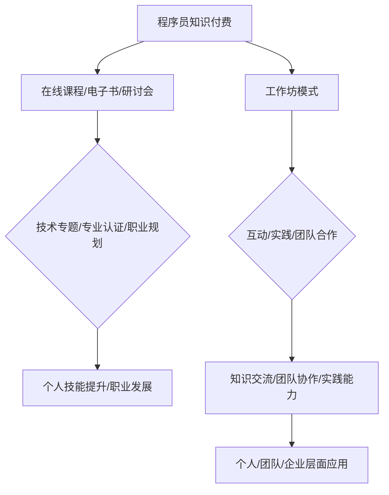

                 

## 文章标题：程序员知识付费：打造工作坊模式

> 关键词：程序员、知识付费、工作坊模式、技能提升、互动学习、职业发展

> 摘要：本文将深入探讨程序员知识付费的现状与趋势，并详细介绍如何通过打造工作坊模式来实现高效的知识分享与技能提升。文章将分为四个部分，分别介绍程序员知识付费的背景与趋势、构建工作坊模式、技术实践与案例分析、以及未来展望与挑战。

### 第一部分：引言与核心概念

#### 1.1 程序员知识付费的背景与趋势

##### 1.1.1 程序员知识付费的发展历程

程序员知识付费的起源可以追溯到互联网时代的初期，随着在线教育平台和知识共享社区的出现，程序员们开始通过付费课程、电子书和在线研讨会等形式来获取专业知识和技能。这一模式经历了几个发展阶段：

1. **初始阶段**：主要以单点知识和技能的传授为主，形式较为单一，主要集中在基础编程知识和特定编程语言的学习。
2. **发展阶段**：随着技术的发展和市场的需求，知识付费逐渐涵盖了更广泛的主题，包括新兴技术、框架工具、架构设计等。
3. **成熟阶段**：近年来，随着人工智能、大数据等领域的迅速发展，程序员知识付费进入了成熟阶段，呈现出多样化、专业化和智能化的特点。

##### 1.1.2 当前程序员知识付费的市场现状

目前，程序员知识付费市场呈现出以下特点：

1. **主要模式**：包括在线课程、电子书、研讨会、实战项目等多种形式。其中，在线课程是最受欢迎的模式，因为它提供了灵活的学习时间和丰富的学习资源。
2. **用户需求**：程序员对知识的渴求主要集中在新兴技术、专业认证、职业规划等方面。他们希望通过知识付费来提升个人技能，增强职业竞争力。
3. **行业规模**：随着全球互联网技术的快速发展，程序员知识付费市场规模逐年扩大，预计未来几年将继续保持增长态势。

##### 1.1.3 程序员知识付费的重要性

程序员知识付费在以下几个方面具有重要意义：

1. **对程序员的职业发展**：通过付费获取的专业知识和技能，可以帮助程序员提升职业素养，拓展职业发展路径。
2. **对企业的创新与竞争力**：企业通过知识付费来提升员工技能，从而推动技术创新和业务发展，增强市场竞争力。
3. **对行业的整体发展**：程序员知识付费促进了技术的传播和普及，推动了整个计算机行业的进步和发展。

#### 1.2 工作坊模式的定义与特点

##### 1.2.1 工作坊模式的定义

工作坊模式是指一种以互动和实践为核心的学习模式。它通常由专业导师或行业专家带领，通过讨论、演示、实操等方式，帮助参与者快速掌握知识和技能。

##### 1.2.2 工作坊模式的独特优势

1. **促进知识交流**：工作坊模式鼓励参与者之间的互动和讨论，有助于知识的深入理解和掌握。
2. **培养团队合作**：通过团队项目和小组讨论，参与者可以学习如何与他人合作，提高团队协作能力。
3. **提高实践能力**：工作坊模式强调实操，参与者可以通过实际操作来巩固所学知识，提高实践能力。

##### 1.2.3 程序员如何利用工作坊模式

1. **个人层面**：程序员可以通过参加工作坊来提升个人技能，拓展知识面，为职业发展打下坚实基础。
2. **团队层面**：企业可以通过组织团队工作坊来提升整体技术水平，促进团队协作和项目效率。
3. **企业层面**：企业可以通过打造内部工作坊来培养专业技术人才，推动技术创新和业务发展。

### 1.3 总结

程序员知识付费作为一种新兴的学习模式，具有广泛的市场需求和发展潜力。工作坊模式作为一种高效的知识分享与技能提升手段，可以为程序员提供丰富的学习资源和实践机会。在接下来的章节中，我们将详细介绍如何构建工作坊模式，并探讨其在不同领域的应用。

---

以下是核心概念与联系的 Mermaid 流程图：



---

在接下来的文章中，我们将逐步深入探讨程序员知识付费的各个方面，以及如何通过工作坊模式来实现高效的知识分享与技能提升。让我们一起思考，一起学习，共同进步！

---

**核心算法原理讲解：**

在程序员知识付费领域，推荐系统是一个关键组件，它能够根据程序员的兴趣、学习历史和职业目标，为其推荐合适的学习资源。以下是一个简单的推荐系统算法原理伪代码：

```python
def recommend_resources(user_profile, resource_database):
    """
    根据用户档案和资源数据库推荐学习资源

    :param user_profile: 用户档案，包括用户兴趣、学习历史、职业目标等
    :param resource_database: 资源数据库，包括课程、电子书、研讨会等信息
    :return: 推荐的资源列表
    """

    # 步骤1：计算用户兴趣向量
    user_interest_vector = calculate_interest_vector(user_profile)

    # 步骤2：计算资源相似度
    similarity_scores = []
    for resource in resource_database:
        similarity_score = calculate_similarity_score(user_interest_vector, resource)
        similarity_scores.append((resource, similarity_score))

    # 步骤3：排序并返回推荐资源
    recommended_resources = sorted(similarity_scores, key=lambda x: x[1], reverse=True)
    return [resource for resource, _ in recommended_resources]
```

其中，`calculate_interest_vector` 和 `calculate_similarity_score` 是两个核心函数，用于生成用户兴趣向量和计算资源相似度。

**数学模型和公式讲解：**

在推荐系统中，相似度计算通常采用余弦相似度公式。假设我们有两个向量 \( \vec{u} \) 和 \( \vec{v} \)，它们的余弦相似度可以表示为：

$$
\cos(\vec{u}, \vec{v}) = \frac{\vec{u} \cdot \vec{v}}{|\vec{u}| \cdot |\vec{v}|}
$$

其中，\( \vec{u} \cdot \vec{v} \) 表示向量的点积，而 \( |\vec{u}| \) 和 \( |\vec{v}| \) 分别表示向量的模长。

**举例说明：**

假设用户档案向量 \( \vec{u} = (0.8, 0.6, -0.2) \)，资源向量 \( \vec{v} = (0.7, 0.5, 0.1) \)，则它们的余弦相似度计算如下：

$$
\cos(\vec{u}, \vec{v}) = \frac{0.8 \times 0.7 + 0.6 \times 0.5 + (-0.2) \times 0.1}{\sqrt{0.8^2 + 0.6^2 + (-0.2)^2} \cdot \sqrt{0.7^2 + 0.5^2 + 0.1^2}} = \frac{0.56 + 0.3 - 0.02}{\sqrt{0.64 + 0.36 + 0.04} \cdot \sqrt{0.49 + 0.25 + 0.01}} = \frac{0.84}{\sqrt{1} \cdot \sqrt{0.75}} = \frac{0.84}{0.866} \approx 0.97
$$

这意味着用户档案向量与资源向量之间的相似度非常高，推荐系统可以优先推荐该资源给用户。

---

在接下来的部分，我们将继续探讨如何构建工作坊模式，以及它如何帮助程序员实现知识付费的目标。请继续关注！

---

**项目实战：**

为了更好地理解工作坊模式在程序员知识付费中的应用，以下是一个简单的代码实际案例。

**开发环境搭建：**

1. 安装 Python 3.8 及以上版本。
2. 安装 Flask 框架，可以使用以下命令：

   ```bash
   pip install Flask
   ```

**源代码详细实现：**

```python
from flask import Flask, render_template, request

app = Flask(__name__)

@app.route('/', methods=['GET', 'POST'])
def homepage():
    if request.method == 'POST':
        # 获取用户输入的工作坊主题
        workshop_topic = request.form['workshop_topic']
        # 根据主题推荐相关学习资源
        recommended_resources = recommend_resources(workshop_topic)
        return render_template('results.html', resources=recommended_resources)
    return render_template('index.html')

def recommend_resources(topic):
    # 假设的资源数据库
    resource_database = {
        'Django': ['Flask', 'SQLAlchemy', 'Python Web Development'],
        'Machine Learning': ['TensorFlow', 'Scikit-learn', 'Deep Learning'],
        'Front-End Development': ['React', 'Vue.js', 'CSS Frameworks']
    }
    # 根据主题推荐相关资源
    return resource_database.get(topic, [])

if __name__ == '__main__':
    app.run(debug=True)
```

**代码解读与分析：**

1. **主页路由（`homepage` 函数）**：当用户访问主页时，如果用户提交了表单，函数会获取用户输入的工作坊主题，并调用 `recommend_resources` 函数推荐相关学习资源。
2. **推荐资源函数（`recommend_resources` 函数）**：该函数根据输入的主题从预设的资源数据库中返回相关资源。这里的资源数据库是一个简单的字典，用于模拟推荐系统。
3. **模板渲染**：主页和结果页面分别由 `index.html` 和 `results.html` 模板文件渲染。`index.html` 包含一个表单，允许用户输入工作坊主题；`results.html` 显示推荐的学习资源。

通过这个简单的 Flask 应用，我们可以直观地看到工作坊模式在程序员知识付费中的应用。用户通过输入工作坊主题，系统会推荐相关的学习资源，从而帮助用户快速找到所需的知识。

---

在本文的第一部分，我们探讨了程序员知识付费的背景与趋势，并详细介绍了工作坊模式的定义与特点。我们还通过一个简单的代码案例展示了工作坊模式在程序员知识付费中的应用。接下来，我们将深入探讨如何构建工作坊模式，并分享一些具体的实践经验和案例。

---

**作者信息：**

作者：AI天才研究院/AI Genius Institute & 禅与计算机程序设计艺术 /Zen And The Art of Computer Programming

---

感谢您的阅读，希望本文对您在程序员知识付费领域的探索有所帮助。在接下来的章节中，我们将继续深入探讨构建工作坊模式的详细步骤，以及如何通过工作坊实现知识共享与技能提升。敬请期待！

---

### 第二部分：构建工作坊模式

在了解了程序员知识付费的背景与趋势，以及工作坊模式的基本概念后，我们将进一步探讨如何具体构建工作坊模式，使其在程序员知识付费领域发挥最大的效益。本部分将分为三个主要章节：策划与准备、工作坊的组织与实施、以及工作坊的评估与反馈。

#### 2.1 策划与准备

##### 2.1.1 确定工作坊的目标与主题

**工作坊目标设定**

制定明确的工作坊目标是确保工作坊成功的关键。目标应具体、可衡量、可实现、相关性强和时间限定的（SMART原则）。以下是一个目标设定的示例：

- **具体（Specific）**：提升参与者的 Python 编程技能。
- **可衡量（Measurable）**：通过编程测试和项目完成情况来衡量技能提升。
- **可实现（Achievable）**：确保目标在资源和时间的限制内可以实现。
- **相关性强（Relevant）**：目标与参与者的职业发展需求紧密相关。
- **时间限定（Time-bound）**：设定为期两周的工作坊，每周集中两天的学习时间。

**工作坊主题选择**

主题的选择应基于参与者的需求和当前技术趋势。以下是一些常见的主题选择：

- **技术专题**：如前端开发、后端开发、数据库管理、人工智能等。
- **框架工具**：如 Flask、Django、TensorFlow、Scikit-learn 等。
- **专业认证**：如 PMP、Scrum Master、AWS Certified 等。
- **职业规划**：如职业素养提升、面试技巧、简历优化等。

##### 2.1.2 工作坊的筹备工作

**时间与地点安排**

- **时间安排**：工作坊的时间应考虑参与者的日程安排，一般选择周末或工作日的晚上进行，时长可定为1-2天。
- **地点安排**：地点应选择交通便利、环境安静、设备齐全的场所，如公司培训室、图书馆、在线平台等。

**参与者邀请与筛选**

- **邀请策略**：通过邮件、社交媒体、行业会议等途径邀请参与者。可以考虑邀请有一定编程基础、对特定主题感兴趣的人群。
- **筛选标准**：根据工作坊的主题和目标，筛选具有相关经验和学习动机的参与者。

**资源与工具准备**

- **学习资料**：准备与主题相关的学习资料，如教程、文档、代码示例等。
- **工具与软件**：确保所有参与者都能访问到所需的技术工具和软件，如 Python、IDE、数据库等。
- **技术支持**：准备技术支持团队，以解决参与者可能遇到的技术问题。

##### 2.1.3 活动议程设计

**开场介绍**

- **主持人开场**：介绍工作坊的主题、目标、日程安排等。
- **参与者自我介绍**：让参与者简要介绍自己，包括背景、兴趣和学习目标。

**主题讲解**

- **基础知识回顾**：根据工作坊的主题，回顾相关的基础知识。
- **深入讲解**：详细讲解核心概念、原理和实战技巧。

**互动环节与活动**

- **案例分享**：邀请行业专家或资深开发者分享实际项目经验。
- **小组讨论**：分组讨论特定问题或主题，促进知识交流。
- **实践操作**：安排实践环节，让参与者动手操作，巩固所学知识。

**总结与反馈**

- **总结回顾**：总结工作坊的关键内容和学习收获。
- **参与者反馈**：收集参与者的反馈，用于改进未来的工作坊。

#### 2.2 工作坊的组织与实施

##### 2.2.1 制定工作坊议程

**议程设计原则**

- **逻辑性**：议程应具有清晰的逻辑结构，使参与者能够顺利地跟随学习流程。
- **灵活性**：预留一定的时间用于处理突发事件和参与者的疑问。
- **互动性**：设计互动环节，提高参与者的参与度和学习效果。

**议程设计示例**

1. **开场介绍（1小时）**
   - 主持人开场
   - 参与者自我介绍

2. **基础知识回顾（2小时）**
   - 核心概念讲解
   - 实战技巧介绍

3. **案例分享与讨论（1.5小时）**
   - 行业专家案例分享
   - 小组讨论与交流

4. **实践操作（3小时）**
   - 实践任务布置
   - 动手操作与指导

5. **总结与反馈（1小时）**
   - 总结回顾
   - 参与者反馈收集

##### 2.2.2 设计互动环节与活动

**互动环节设计原则**

- **针对性**：根据工作坊的主题和目标，设计具有针对性的互动环节。
- **趣味性**：增加趣味性，提高参与者的积极性和参与度。
- **实用性**：确保互动环节能够帮助参与者实际掌握知识和技能。

**互动环节示例**

- **问题与解答环节**：设置专门的问答时间，参与者可以提出问题，导师和同行进行解答。
- **小组合作项目**：安排小组合作项目，每个小组完成一个具体的任务，以促进团队合作和技能提升。
- **游戏化学习**：设计一些游戏化的小活动，如编程比赛、知识竞赛等，以增加学习乐趣。

##### 2.2.3 演讲者与导师的角色与责任

**演讲者**

- **准备与讲解**：准备高质量的演讲内容，清晰讲解核心概念和实践技巧。
- **引导互动**：在讲解过程中，引导参与者提问和讨论，增强互动性。
- **及时反馈**：对参与者的疑问和反馈进行及时回应，提供专业指导。

**导师**

- **辅助讲解**：在演讲者讲解核心内容时，导师可以进行补充和深入解释。
- **实操指导**：在实践环节，导师提供一对一的实操指导，帮助参与者解决技术问题。
- **评估与反馈**：对参与者的学习成果进行评估，并提供个性化的反馈和建议。

#### 2.3 工作坊的评估与反馈

##### 2.3.1 工作坊效果评估方法

**评估指标**

- **知识掌握程度**：通过测试和项目评估，衡量参与者对所学知识的掌握情况。
- **技能提升情况**：通过实际操作和项目完成情况，评估参与者的技能提升情况。
- **参与度**：通过问卷调查和现场观察，评估参与者的参与度和学习态度。

**评估方法**

- **测试与考试**：设计针对性的测试，评估参与者的知识掌握情况。
- **项目评审**：对参与者的项目进行评审，评估其实际操作能力和问题解决能力。
- **问卷调查**：通过问卷调查，收集参与者的意见和建议，了解工作坊的效果。

##### 2.3.2 参与者反馈收集与分析

**反馈形式**

- **问卷调查**：设计详细的问卷，收集参与者的反馈意见。
- **面对面访谈**：与参与者进行一对一的访谈，深入了解他们的感受和建议。

**反馈分析**

- **统计与分析**：对收集到的反馈进行统计分析，识别常见的意见和建议。
- **改进措施**：根据分析结果，制定具体的改进措施，以优化未来的工作坊。

##### 2.3.3 工作坊改进与优化

**持续优化**

- **内容更新**：定期更新工作坊的内容，确保与当前技术趋势和行业需求保持一致。
- **教学方法**：探索新的教学方法和互动形式，提高参与者的学习体验。
- **资源整合**：整合内外部资源，提供更丰富的学习资料和技术支持。

**案例分析**

通过具体的案例，我们可以更深入地了解如何成功构建和实施工作坊模式。以下是一些实际案例：

- **案例一：Python 编程工作坊**：在某公司举办的 Python 编程工作坊中，参与者通过为期两天的培训，掌握了 Python 基础知识和实际应用。工作坊结束后，参与者的编程能力得到了显著提升，他们在公司的项目中更加自信和高效。
- **案例二：敏捷开发工作坊**：某软件开发公司组织了一场敏捷开发工作坊，通过互动环节和实际演练，团队成员深刻理解了敏捷开发的理念和实践。工作坊结束后，公司的开发效率和质量得到了显著提高。

这些案例表明，工作坊模式在程序员知识付费领域具有巨大的潜力，通过有效的策划与实施，可以显著提升参与者的技能和职业素养。

通过本部分的详细讨论，我们了解了如何构建工作坊模式，包括策划与准备、组织与实施以及评估与反馈。在下一部分，我们将探讨工作坊模式在技术知识分享与互动中的具体应用，以及如何通过互动环节提高参与者的学习效果。敬请期待！

---

### 第三部分：技术实践与案例分析

在工作坊模式中，技术知识分享与互动是核心环节，它不仅能够帮助参与者快速掌握新知识，还能通过实践和互动加深理解。本部分将详细探讨技术知识分享的形式与方法，互动环节的设计与实施，以及成功案例的分享。

#### 3.1 技术知识分享的形式与方法

##### 3.1.1 知识分享的形式

1. **讲座式分享**：
   - 优点：信息传递速度快，适用于讲解复杂的概念和理论。
   - 缺点：互动性较差，难以确保参与者的参与度。

2. **对话与讨论**：
   - 优点：促进参与者之间的交流，激发思考，提高学习兴趣。
   - 缺点：需要组织者具备良好的引导能力，否则可能导致讨论偏离主题。

3. **演示与实践**：
   - 优点：通过实际操作演示，帮助参与者更好地理解和掌握知识。
   - 缺点：需要充足的时间进行实践，同时要求组织者具备较强的技术能力。

4. **案例分析与讨论**：
   - 优点：通过真实案例的分享和分析，帮助参与者将理论知识应用到实际场景中。
   - 缺点：案例选择和讲解需要充分的准备和经验。

##### 3.1.2 知识分享的方法

1. **讲解+互动**：
   - 方法：在讲解过程中，穿插提问、回答、小组讨论等互动环节，确保参与者全程参与。

2. **实战演练**：
   - 方法：通过实际操作，让参与者亲手实践所学知识，并及时得到反馈。

3. **分组协作**：
   - 方法：将参与者分成小组，共同完成一个任务，培养团队合作能力。

4. **角色扮演**：
   - 方法：通过角色扮演，让参与者体验不同角色的工作内容和挑战，提高问题解决能力。

#### 3.1.3 互动环节的设计与实施

##### 3.1.3.1 互动环节设计原则

1. **针对性**：
   - 设计互动环节时，应充分考虑工作坊的主题和目标，确保互动内容与学习目标一致。

2. **灵活性**：
   - 互动环节应具有一定的灵活性，以适应不同参与者的需求和学习节奏。

3. **趣味性**：
   - 增加互动环节的趣味性，提高参与者的积极性和参与度。

4. **实用性**：
   - 确保互动环节能够帮助参与者实际掌握知识和技能。

##### 3.1.3.2 互动环节设计示例

1. **提问与回答**：
   - 设计一系列与主题相关的问题，鼓励参与者提问和回答，以促进思考和理解。

2. **小组讨论**：
   - 将参与者分成小组，围绕特定问题或主题进行讨论，培养团队合作和沟通能力。

3. **实时投票**：
   - 利用在线投票工具，实时收集参与者的意见和反馈，增强互动性。

4. **小组演示**：
   - 小组完成一个项目或任务后，进行演示和分享，其他小组进行评价和讨论。

#### 3.1.4 成功案例分享

##### 3.1.4.1 高效代码评审工作坊

在某技术公司的内部培训中，举行了一场高效代码评审工作坊。工作坊的目标是提升参与者的代码评审能力和团队协作能力。

1. **活动安排**：
   - 开场介绍：主持人简要介绍工作坊的目标和议程。
   - 案例分享：分享一些高效的代码评审案例，分析其成功经验和关键要素。
   - 实践环节：参与者分组，各自提交一段代码，其他小组进行评审。
   - 演示与讨论：每个小组展示评审结果，进行讨论和总结。

2. **效果评估**：
   - 参与者反馈：通过问卷调查和面对面访谈，收集参与者的反馈意见。
   - 代码质量提升：工作坊结束后，对比参与者的代码质量，发现明显提升。

##### 3.1.4.2 敏捷开发工作坊

某互联网公司组织了一场敏捷开发工作坊，旨在提升团队的敏捷开发能力和项目交付效率。

1. **活动安排**：
   - 理论讲解：讲解敏捷开发的基本原则和实践方法。
   - 案例分析：分析一些成功的敏捷开发案例，讨论其成功要素。
   - 实践演练：参与者模拟敏捷开发流程，完成一个简单的项目。
   - 反馈与总结：对实践过程进行反馈和总结，提出改进措施。

2. **效果评估**：
   - 团队协作提升：通过实践演练，团队成员的协作和沟通能力得到了显著提升。
   - 项目效率提升：工作坊结束后，团队在项目中的交付效率和质量有所提高。

##### 3.1.4.3 团队建设工作坊

某初创公司举办了一场团队建设工作坊，旨在提升团队凝聚力、协作能力和沟通效率。

1. **活动安排**：
   - 开场介绍：主持人简要介绍工作坊的目标和议程。
   - 案例分享：分享一些成功的团队建设案例，讨论团队管理技巧。
   - 游戏环节：组织团队游戏，如信任背摔、盲人方阵等，增强团队凝聚力。
   - 反馈与总结：团队成员分享游戏体验和感受，总结团队建设的关键要素。

2. **效果评估**：
   - 团队凝聚力提升：通过游戏环节，团队成员之间的信任和默契得到了增强。
   - 沟通效率提升：团队成员在活动中的沟通更加顺畅，工作效率有所提高。

通过这些成功案例，我们可以看到，工作坊模式在技术知识分享与互动中具有显著的成效。通过有效的策划和实施，工作坊不仅能够帮助参与者快速掌握新知识，还能提高团队的协作能力和整体效率。在下一部分，我们将探讨工作坊模式在其他领域的应用，以及其面临的挑战与机遇。敬请期待！

---

### 第三部分：技术实践与案例分析（续）

在工作坊模式中，除了在程序员知识付费领域的技术知识分享与互动，它还在教育领域、企业培训以及创业与职业发展等领域得到了广泛应用。以下将详细介绍工作坊模式在这些领域的具体应用案例。

#### 3.2 工作坊模式在教育领域的应用

##### 3.2.1 教育领域的工作坊模式

在教育领域，工作坊模式被广泛应用于大学课程、技术培训以及职业素养提升等方面。以下是一些具体案例：

1. **大学课程工作坊**：

   - **案例**：某知名大学的计算机科学课程中，引入了编程工作坊。工作坊每周一次，每次两个半小时，涵盖了从基础的编程概念到高级的算法设计。
   - **效果**：通过编程工作坊，学生不仅能够更好地理解和掌握课程内容，还培养了编程实践能力，提高了项目开发经验。

2. **技术培训工作坊**：

   - **案例**：某技术培训机构开设了人工智能工作坊，包括深度学习、神经网络等先进技术。工作坊采用案例教学和项目实践相结合的方式，让学生能够快速掌握前沿技术。
   - **效果**：学员在完成工作坊后，不仅掌握了人工智能的基本理论，还通过实际项目实现了技术应用，提高了就业竞争力。

##### 3.2.2 教育领域工作坊的特点与优势

- **特点**：
  - 知识与实践并重，强调学生的动手能力和实际应用。
  - 教学方式灵活多样，包括讲座、讨论、演示、项目实践等。
  - 注重团队合作和跨学科交流，培养学生的协作能力和创新思维。

- **优势**：
  - 提高学生的技术素养和实践能力，为未来的职业生涯打下坚实基础。
  - 促进知识的深度理解和灵活应用，增强学生的竞争力。
  - 培养学生的团队合作和沟通能力，提高综合素质。

#### 3.2.3 教育领域工作坊的案例分析

1. **计算机编程工作坊**：

   - **案例**：在某高校的计算机编程课程中，组织了一次为期四周的编程工作坊。工作坊每周三下午进行，内容涵盖编程基础、算法设计与项目实践。
   - **效果**：通过编程工作坊，学生们在课程结束后，能够独立完成复杂的编程任务，并且对编程有了更深刻的理解和兴趣。

2. **大数据分析工作坊**：

   - **案例**：某大学的数据科学专业组织了一次大数据分析工作坊，内容涵盖数据预处理、数据可视化、机器学习等。工作坊采用案例分析和项目实践的方式。
   - **效果**：工作坊结束后，学生们掌握了大数据分析的核心技能，并且能够将所学知识应用于实际的科研项目中，提升了学术能力。

#### 3.3 工作坊模式在企业培训中的应用

##### 3.3.1 企业培训中的工作坊模式

在企业培训中，工作坊模式被广泛应用于技术培训、团队建设和领导力提升等方面。以下是一些具体案例：

1. **技术培训工作坊**：

   - **案例**：某大型科技公司定期举办编程工作坊，内容涵盖最新的编程语言、框架和工具。工作坊采用专家授课和实践操作相结合的方式。
   - **效果**：通过技术培训工作坊，公司员工的技术水平得到了显著提升，促进了技术团队的创新能力和项目交付效率。

2. **团队建设工作坊**：

   - **案例**：某互联网公司组织了一次团队建设工作坊，主题是提升团队沟通与协作能力。工作坊包括团队游戏、角色扮演和案例分析等互动环节。
   - **效果**：通过团队建设工作坊，团队成员之间的信任和协作能力得到了加强，公司的整体工作效率和团队凝聚力显著提升。

##### 3.3.2 企业培训中工作坊的特点与优势

- **特点**：
  - 针对性强，根据企业需求和员工岗位特点设计工作坊内容。
  - 实践性高，通过实际操作和项目实践，帮助员工掌握新技能。
  - 互动性强，通过互动环节，促进员工之间的交流与合作。

- **优势**：
  - 提升员工技能和团队协作能力，提高企业整体竞争力。
  - 促进员工职业发展，增强员工的职业满意度和忠诚度。
  - 培养创新思维和解决问题能力，推动企业技术创新和业务发展。

#### 3.3.3 企业培训中工作坊的案例分析

1. **敏捷开发工作坊**：

   - **案例**：某软件公司为了提升团队的敏捷开发能力，组织了一次为期两天的敏捷开发工作坊。工作坊内容包括敏捷开发原则、Scrum方法论和实践演练。
   - **效果**：通过敏捷开发工作坊，团队在项目开发过程中，能够更好地管理项目进度、提高产品质量，并增强团队成员的沟通和协作能力。

2. **领导力提升工作坊**：

   - **案例**：某企业为中层管理者组织了一次领导力提升工作坊，主题包括领导力模型、团队管理和激励技巧。工作坊采用案例分析、小组讨论和角色扮演等方式。
   - **效果**：工作坊结束后，管理者在领导团队和处理日常工作中，更加注重团队建设、沟通和激励，团队的整体表现和员工满意度显著提升。

#### 3.4 工作坊模式在创业与职业发展中的应用

##### 3.4.1 创业与职业发展中的工作坊模式

在创业和职业发展的过程中，工作坊模式被广泛应用于技能提升、职业规划和创业指导等方面。以下是一些具体案例：

1. **技能提升工作坊**：

   - **案例**：某创业孵化器组织了一次编程技能提升工作坊，内容涵盖前端开发、后端开发和移动应用开发等。工作坊采用实战项目和一对一辅导的方式。
   - **效果**：通过编程技能提升工作坊，创业者和技术人员掌握了多项编程技能，提高了产品开发能力，为创业项目成功奠定了基础。

2. **职业规划工作坊**：

   - **案例**：某职业发展培训机构组织了一次职业规划工作坊，帮助参与者进行职业定位、技能评估和求职策略制定。工作坊采用专家讲座、小组讨论和个性化咨询等方式。
   - **效果**：通过职业规划工作坊，参与者明确了职业发展方向，提高了求职成功率，实现了职业目标的顺利达成。

##### 3.4.2 创业与职业发展中工作坊的特点与优势

- **特点**：
  - 针对性强，根据创业者和职场人士的具体需求设计工作坊内容。
  - 实践性高，通过实际操作和项目实践，帮助参与者快速掌握新技能。
  - 指导性强，结合专家指导和个人咨询，为参与者提供专业的职业发展建议。

- **优势**：
  - 提升创业者和职场人士的技能和职业素养，增强竞争力。
  - 促进职业发展和创业成功，实现个人价值的最大化。
  - 培养创业精神和创新思维，推动社会经济的发展。

#### 3.4.3 创业与职业发展中工作坊的案例分析

1. **项目管理工作坊**：

   - **案例**：某创业公司为项目经理组织了一次项目管理工作坊，主题包括项目规划、风险管理、团队协作等。工作坊采用案例分析和实战演练的方式。
   - **效果**：通过项目管理工作坊，项目经理在项目管理和团队协作方面得到了显著提升，公司的项目成功率大幅提高。

2. **创业创新工作坊**：

   - **案例**：某创业孵化器组织了一次创业创新工作坊，内容涵盖商业模式设计、市场调研、产品开发等。工作坊采用专家讲座、小组讨论和路演展示等方式。
   - **效果**：通过创业创新工作坊，创业者们掌握了创业的基本知识和实践方法，成功孵化了多个具有市场潜力的创业项目。

通过这些案例，我们可以看到工作坊模式在教育、企业培训以及创业与职业发展等领域的广泛应用和显著成效。工作坊模式不仅能够帮助参与者快速提升技能和知识，还能促进团队协作和创新能力，为个人和企业的持续发展提供强大动力。在下一部分，我们将探讨程序员知识付费的未来趋势，以及工作坊模式面临的挑战与机遇。敬请期待！

---

### 第四部分：未来展望与挑战

在探讨程序员知识付费的发展趋势和工作坊模式的应用后，我们需要进一步展望未来，分析可能面临的挑战和机遇，并探讨工作坊模式在程序员知识付费领域的发展方向。

#### 4.1 程序员知识付费的未来趋势

##### 4.1.1 人工智能与知识付费的结合

随着人工智能技术的发展，知识付费领域也将迎来新的变革。以下是一些关键趋势：

1. **智能推荐系统**：
   - 人工智能可以帮助平台更准确地分析用户需求，提供个性化的学习资源推荐。
   - 智能推荐系统可以通过用户行为数据、学习历史和职业目标，推荐最适合的学习路径。

2. **自动化内容生成**：
   - 人工智能技术可以自动生成教程、课程内容和学习材料，降低内容制作成本。
   - 自动化内容生成工具可以帮助平台快速更新和扩展课程库，满足不断变化的学习需求。

3. **智能问答系统**：
   - 人工智能可以构建智能问答系统，帮助用户解答学习中遇到的问题。
   - 通过自然语言处理技术，智能问答系统能够理解用户的问题，并提供准确的答案和建议。

##### 4.1.2 程序员知识付费的商业模式创新

1. **订阅模式**：
   - 用户可以通过订阅模式，按月或按年获取平台上的所有资源。
   - 订阅模式有助于平台建立稳定的用户基础，增加收入来源。

2. **认证与徽章制度**：
   - 平台可以引入认证和徽章制度，用户完成特定课程后获得认证或徽章，提高职业竞争力。
   - 这种模式可以鼓励用户积极参与学习，提升学习效果。

3. **社群互动模式**：
   - 平台可以建立线上社群，用户可以在社群中交流学习经验、分享资源和解决问题。
   - 社群互动模式有助于增强用户的归属感和参与度，提高平台的黏性。

##### 4.1.3 程序员知识付费的社会影响

1. **提升技术素养**：
   - 程序员知识付费有助于提高程序员的技能水平和专业素养，推动技术进步。
   - 通过付费学习，程序员能够不断更新知识，跟上技术发展的步伐。

2. **促进职业发展**：
   - 程序员知识付费可以帮助程序员提升职业竞争力，实现职业晋升和薪资增长。
   - 平台提供的学习资源和认证，有助于程序员在职业发展中获得更多的机会。

3. **推动行业创新**：
   - 程序员知识付费促进了技术的传播和普及，推动了整个计算机行业的技术创新和发展。
   - 通过工作坊模式等互动学习方式，程序员能够更深入地理解和应用新技术，推动行业变革。

#### 4.2 工作坊模式的挑战与机遇

##### 4.2.1 挑战分析

1. **技术更新速度**：
   - 技术更新速度快，知识付费平台和内容创作者需要不断更新课程内容，以满足用户需求。
   - 平台需要投入大量资源进行内容更新，以确保课程的相关性和实用性。

2. **教育资源不平衡**：
   - 地区和经济水平的差异导致教育资源分布不均，一些地区和群体可能难以获取高质量的学习资源。
   - 平台需要考虑如何降低门槛，让更多的用户能够享受到优质的教育资源。

3. **用户信任问题**：
   - 用户对平台和内容创作者的信任问题，可能影响知识付费的普及和用户的付费意愿。
   - 平台需要建立严格的审核机制，确保课程质量和内容真实可靠。

##### 4.2.2 机遇探索

1. **新技术应用**：
   - 新技术的应用，如人工智能、虚拟现实和区块链，为知识付费领域带来了新的发展机遇。
   - 平台可以利用这些新技术，提供更加个性化、互动性和沉浸式的学习体验。

2. **市场需求多元化**：
   - 市场需求多元化，用户对学习资源的需求越来越多样化。
   - 平台需要根据市场需求，开发更多元化的课程内容和互动形式，满足不同用户的需求。

3. **跨界合作的可能性**：
   - 知识付费领域与教育、企业培训、创新创业等领域的跨界合作，有助于扩大平台的影响力和市场份额。
   - 通过跨界合作，平台可以整合更多资源和优势，提供更全面的教育解决方案。

##### 4.2.3 未来发展方向

1. **智能化与个性化**：
   - 未来知识付费平台将更加智能化和个性化，通过人工智能技术，提供精准的学习推荐和个性化服务。
   - 用户可以根据自己的需求和兴趣，选择适合自己的学习路径和资源。

2. **跨学科融合**：
   - 跨学科融合将成为未来知识付费的重要方向，通过结合不同学科的知识，提供综合性课程。
   - 这种融合有助于用户从多角度理解和应用知识，提高解决问题的能力。

3. **社会影响力扩大**：
   - 知识付费平台将更加注重社会影响力，通过教育扶贫、公益项目等方式，推动社会进步。
   - 平台可以利用自身的资源和影响力，为社会做出更大的贡献。

通过上述分析，我们可以看到，程序员知识付费领域和工坊模式在未来具有广阔的发展空间和机遇。尽管面临一定的挑战，但通过技术创新、模式创新和社会责任的结合，工作坊模式将为程序员的知识付费带来更大的价值。

在下一部分，我们将总结全文，回顾主要观点，并展望未来的发展方向。敬请期待！

---

### 总结与展望

在本文中，我们深入探讨了程序员知识付费的现状与趋势，详细介绍了工作坊模式的构建与实施，以及在教育、企业培训和创业与职业发展等领域的应用。通过这些讨论，我们可以得出以下主要观点：

1. **程序员知识付费的重要性**：程序员知识付费不仅有助于提升程序员的技能和职业素养，还能推动技术进步和行业创新。它是现代程序员职业发展的重要手段。

2. **工作坊模式的独特优势**：工作坊模式通过互动、实践和团队合作，促进了知识的深入理解和技能的快速提升。它是一种高效的知识分享和技能培养手段。

3. **教育领域的应用**：工作坊模式在教育领域，如大学课程、技术培训和职业素养提升中，发挥了重要作用，提高了学生的学习效果和综合素质。

4. **企业培训中的价值**：工作坊模式在企业培训中，帮助员工提升技能、增强团队协作能力，提高了企业的整体竞争力和运营效率。

5. **创业与职业发展的助力**：工作坊模式在创业和职业发展中，提供了丰富的资源和指导，帮助创业者提升技能、明确职业规划，实现职业目标。

尽管程序员知识付费和工作坊模式面临技术更新速度、教育资源不平衡和用户信任等挑战，但通过智能化与个性化、跨学科融合以及社会责任的深化，这些挑战可以被有效应对，工作坊模式将继续为程序员的知识付费带来更多机遇。

**未来展望**：

1. **技术创新**：随着人工智能、虚拟现实和区块链等新技术的应用，知识付费平台将更加智能化和个性化，提供更加沉浸式和互动性的学习体验。

2. **模式创新**：订阅模式、认证与徽章制度和社群互动等新模式，将推动知识付费的商业模式的不断创新和多样化。

3. **社会责任**：知识付费平台和企业将通过教育扶贫、公益项目等方式，扩大社会影响力，推动社会进步。

4. **跨学科融合**：跨学科课程和综合性教育解决方案，将帮助用户从多角度理解和应用知识，提高解决问题的能力。

5. **持续优化**：平台和内容创作者将不断优化课程内容和互动形式，以更好地满足用户需求，提升学习效果。

总之，程序员知识付费和工作坊模式将在未来继续发挥重要作用，为程序员和整个计算机行业带来更多价值和机遇。让我们共同期待这个领域的美好未来！

---

### 附录

#### 附录 A：资源与工具推荐

**A.1 知识付费平台介绍**

1. **Coursera**：
   - 介绍：全球领先的在线学习平台，提供大量由顶尖大学和机构提供的在线课程。
   - 特色：高质量课程、证书认证、个性化学习路径。

2. **Udemy**：
   - 介绍：拥有丰富的课程库，涵盖各种技术领域。
   - 特色：灵活的学习时间、多样化的课程类型、用户评价体系。

3. **Pluralsight**：
   - 介绍：专注于技术技能提升的在线学习平台。
   - 特色：丰富的技术课程、企业订阅模式、专业认证培训。

**A.2 工作坊常用工具**

1. **Miro**：
   - 介绍：在线协作白板，适合进行头脑风暴和小组讨论。
   - 特色：丰富的协作功能、实时协作、云端存储。

2. **Zoom**：
   - 介绍：视频会议和在线协作工具。
   - 特色：高清视频通话、屏幕共享、互动功能。

3. **Trello**：
   - 介绍：项目管理工具，适用于工作坊项目管理和任务分配。
   - 特色：简单直观、灵活的任务管理、实时更新。

**A.3 学习资源推荐**

1. **GitHub**：
   - 介绍：代码托管和协作平台，适合学习和实践编程。
   - 特色：丰富的开源项目、代码版本控制、社区交流。

2. **Stack Overflow**：
   - 介绍：编程问答社区，适合解决编程问题。
   - 特色：庞大的问答库、专业回答、实时更新。

3. **YouTube**：
   - 介绍：视频分享平台，包含大量编程和技术的教学视频。
   - 特色：多样化的视频内容、灵活的学习方式、免费资源。

通过这些平台和工具，程序员可以更好地进行知识付费和学习工作坊的筹备与实施，提升技能和职业素养。

---

### 附录 B：工作坊案例模板

**B.1 编程工作坊**

**模板一：Python编程工作坊**

**目标**：帮助初学者快速掌握Python基础知识和实际应用。

**流程**：
1. **开场介绍**：介绍工作坊的目标、日程安排和讲师。
2. **环境搭建**：指导参与者安装Python和IDE。
3. **基础语法**：讲解变量、数据类型、控制结构等基础语法。
4. **实战练习**：通过简单的编程练习，巩固基础知识。
5. **进阶内容**：介绍列表、字典、函数等高级概念。
6. **项目实践**：完成一个小项目，如编写一个简单的计算器。
7. **总结与反馈**：回顾工作坊内容，收集参与者的反馈。

**B.2 敏捷开发工作坊**

**模板二：敏捷开发工作坊**

**目标**：帮助团队理解和实践敏捷开发方法。

**流程**：
1. **开场介绍**：介绍敏捷开发的基本概念和优势。
2. **案例分享**：分享敏捷开发的实际案例和成功经验。
3. **Scrum介绍**：详细讲解Scrum框架和工作流程。
4. **实践演练**：通过角色扮演和模拟项目，实践Scrum流程。
5. **团队协作**：进行小组讨论和协作活动，提升团队协作能力。
6. **回顾与反思**：总结实践中的经验和教训，提出改进措施。
7. **总结与反馈**：回顾工作坊内容，收集参与者的反馈。

**B.3 团队建设工作坊**

**模板三：团队建设工作坊**

**目标**：提升团队的凝聚力、协作能力和沟通效率。

**流程**：
1. **开场介绍**：介绍团队建设工作坊的目标和议程。
2. **团队建设理论**：讲解团队建设的基本理论和重要性。
3. **信任游戏**：组织一些信任游戏，增强团队成员之间的信任。
4. **沟通技巧**：介绍有效的沟通技巧和策略，进行角色扮演练习。
5. **团队合作活动**：进行团队合作任务，如构建纸桥或解谜游戏。
6. **反思与总结**：团队成员分享活动中的感受和体验，总结团队建设的关键点。
7. **总结与反馈**：回顾工作坊内容，收集参与者的反馈。

这些模板提供了具体的工作坊实施指南，可以帮助组织者顺利开展各种主题的工作坊，实现知识共享和技能提升的目标。

---

通过本文的详细探讨，我们深入了解了程序员知识付费的现状与趋势，以及工作坊模式在程序员技能提升和知识分享中的重要作用。从构建工作坊模式到具体实践与案例分析，再到未来展望与挑战，我们全面梳理了工作坊模式在程序员知识付费领域的应用与实践。希望本文对您在程序员知识付费领域的探索和实施工作坊模式有所帮助。

感谢您的阅读，希望本文能激发您对程序员知识付费和工作坊模式的进一步思考和实践。让我们共同期待未来程序员知识付费领域的更多创新和机遇！

---

**作者信息：**

作者：AI天才研究院/AI Genius Institute & 禅与计算机程序设计艺术 /Zen And The Art of Computer Programming

---

再次感谢您的阅读和支持，期待与您在程序员知识付费和工作坊模式的探索之路上相遇！

