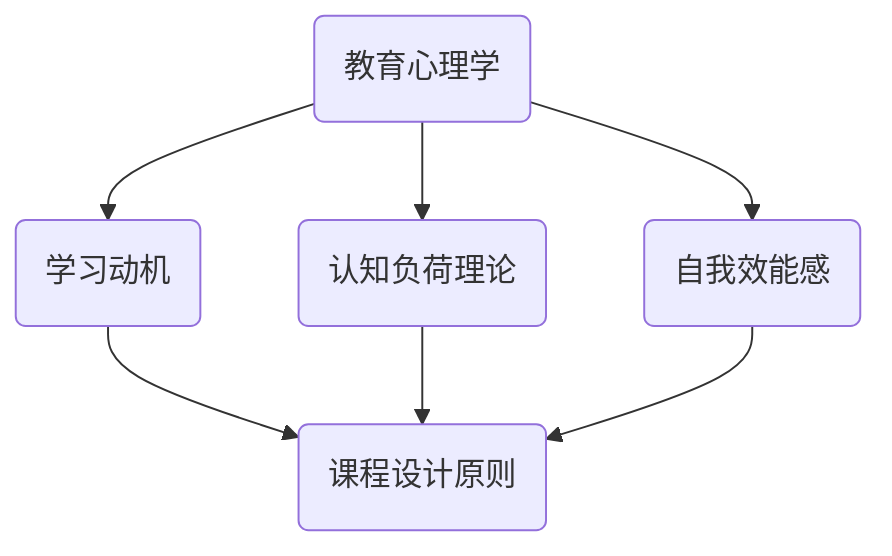
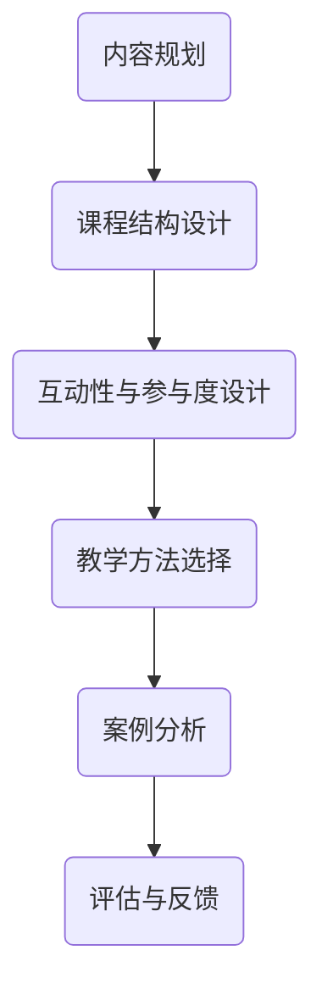

                 

### 文章标题：程序员知识付费：打造挑战式课程

> 关键词：程序员、知识付费、挑战式课程、教育心理学、学习理论、课程设计

> 摘要：本文深入探讨了程序员知识付费的现状，挑战式课程的概念及其设计原则，并结合教育心理学和学习理论，提供了具体的课程设计和实施方法。通过案例分析和未来展望，本文旨在为程序员知识付费领域提供有价值的参考和指导。

### 第一部分：引言与核心概念

#### 引言

在数字化时代，知识付费成为了一种流行的学习模式，尤其是在程序员群体中，知识付费的兴起为个人技能提升和职业发展提供了新的途径。然而，如何有效地设计课程，提高学习效果，成为了一个亟待解决的问题。本文旨在探讨如何打造挑战式课程，以应对程序员知识付费领域的需求。

#### 1.1 程序员知识付费的现状

随着互联网技术的发展，知识付费已经成为程序员学习的重要方式。以下是程序员知识付费的现状：

- **在线课程**：越来越多的程序员选择通过在线课程平台学习，如Coursera、Udemy等，这些平台提供了丰富的编程课程和认证机会。
- **付费图书**：一些高质量的编程图书成为程序员的知识源泉，通过购买电子书或纸质书，程序员可以系统地学习编程知识。
- **一对一辅导**：针对个性化需求的程序员，一对一辅导成为了一种受欢迎的学习方式，这种模式提供了高度定制化的学习体验。
- **社群交流**：程序员通过加入技术社群和论坛，进行知识分享和互助学习，这种模式不仅有助于知识传播，还可以促进职业网络的建设。

#### 1.2 知识付费的优势与挑战

知识付费模式在程序员群体中受到了广泛的欢迎，主要优势包括：

- **灵活性**：程序员可以根据自己的时间安排自由选择学习内容，灵活地安排学习计划。
- **个性化**：知识付费提供了个性化的学习体验，可以根据个人需求和兴趣进行定制化学习。
- **高效性**：高质量的知识内容有助于程序员快速提升技能，缩短学习周期。

然而，知识付费模式也面临着一些挑战：

- **内容质量**：付费内容的质量参差不齐，有些课程可能无法满足学习者的需求。
- **学习效果**：付费学习不一定能保证学习效果，需要学习者具备良好的自控力和学习策略。
- **成本**：对于一些初学者来说，高额的付费课程可能会构成一定的经济负担。

#### 1.3 什么是挑战式课程

挑战式课程（Challenge-Based Learning, CBL）是一种以解决问题为核心的教学方法，旨在通过真实世界的问题情境激发学生的学习兴趣和动机。以下是挑战式课程的特点：

- **以问题为中心**：挑战式课程围绕具体问题设计，鼓励学生通过分析和解决这些问题来学习知识。
- **跨学科应用**：挑战式课程往往涉及多个学科的知识，有助于培养学生的跨学科思维和综合能力。
- **自主学习**：学生在挑战式课程中扮演主动角色，通过自主探究和合作学习来解决问题。
- **实践导向**：挑战式课程强调实践操作，通过实际项目或实验来巩固学习成果。

#### 1.4 书籍目标与结构

本文的目标是帮助程序员和教育者了解和设计挑战式课程，提升知识付费学习的有效性。文章结构如下：

- **第一部分：引言与核心概念**：介绍程序员知识付费的现状和挑战式课程的概念。
- **第二部分：打造挑战式课程的理论基础**：探讨教育心理学与学习理论在挑战式课程设计中的应用。
- **第三部分：挑战式课程的具体设计**：讨论内容规划、课程结构设计和互动性设计。
- **第四部分：挑战式课程的实施**：介绍翻转课堂、项目驱动教学和模拟实战等教学方法。
- **第五部分：案例分析**：通过具体案例展示挑战式课程的设计和效果。
- **第六部分：挑战与未来**：分析知识付费行业的挑战和未来发展趋势。
- **第七部分：总结与展望**：总结文章的主要内容，并对未来进行展望。

通过本文的阅读，读者可以系统地了解挑战式课程的设计原则和实践方法，为自己的课程设计提供参考和灵感。

### 第二部分：打造挑战式课程的理论基础

#### 2.1 教育心理学的基本概念

教育心理学是研究学习过程和学习者心理特征的科学，对于设计有效的挑战式课程具有重要意义。以下是教育心理学中的几个核心概念：

**学习动机**：学习动机是指激发个体进行学习活动、维持学习过程并导致学习行为达到既定学习目标的一种内在过程或内部心理状态。学习动机可以分为内在动机和外在动机。

- **内在动机**：源于个体对学习内容的兴趣和好奇心，例如对编程技术本身的好奇和探索。
- **外在动机**：源于外部奖励或惩罚，例如通过完成课程获得证书或报酬。

**认知负荷理论**：认知负荷理论（Cognitive Load Theory）是由约翰·斯威夫特（John Sweller）提出的，用于解释学习过程中认知资源的分配和使用。认知负荷理论将学习负荷分为三类：

- **内在认知负荷**：与学习内容本身相关的认知负荷，如理解复杂概念或算法。
- **外在认知负荷**：与学习环境相关的认知负荷，如课程的组织和呈现方式。
- **冗余认知负荷**：不必要的认知负荷，如重复信息或冗余的学习材料。

**自我效能感**：自我效能感是指个体对自己完成特定任务的能力的信念。自我效能感影响学习者的学习动机、努力程度和坚持性。

#### 2.2 学习理论的应用

在学习理论的应用中，行为主义学习理论、认知主义学习理论和建构主义学习理论是三个主要流派，它们各自提供了不同的视角和方法，对挑战式课程的设计具有指导意义。

**行为主义学习理论**：行为主义学习理论强调外部环境和刺激对学习过程的影响。斯金纳（B.F. Skinner）的操作条件反射理论是行为主义学习理论的代表。行为主义学习理论在挑战式课程中的应用包括：

- **正面强化**：通过给予积极反馈和奖励来增强学生的学习动机和行为。
- **行为塑造**：通过逐步引导和调整学习者的行为，使其达到预期的学习目标。
- **即时反馈**：提供即时的反馈和纠正，帮助学习者及时调整学习策略。

**认知主义学习理论**：认知主义学习理论关注学习者的内部认知过程，强调知识和思维结构的重要性。皮亚杰（Jean Piaget）的认知发展阶段理论和奥苏贝尔（Ausubel）的有意义接受学习理论是认知主义学习理论的代表。认知主义学习理论在挑战式课程中的应用包括：

- **有意义学习**：通过将新知识与已有的认知结构相联系，促进有意义的学习。
- **认知工具**：使用认知工具（如思维导图、概念图等）来帮助学生组织和理解复杂知识。
- **认知策略**：教授学习者有效的认知策略，如信息加工策略、问题解决策略等。

**建构主义学习理论**：建构主义学习理论认为学习是学习者主动构建知识的过程，强调学习者的主体性和互动性。维果茨基（Lev Vygotsky）的社会互动理论和布鲁纳（Jerome Bruner）的发现学习理论是建构主义学习理论的代表。建构主义学习理论在挑战式课程中的应用包括：

- **合作学习**：通过小组合作和互动，促进学习者之间的知识共享和共同成长。
- **探究学习**：鼓励学生通过探究和发现来主动构建知识，提高学习的深度和广度。
- **项目式学习**：通过实际项目或任务，让学生在真实情境中应用知识，解决问题。

#### 2.3 挑战式课程设计原则

基于教育心理学和学习理论，挑战式课程的设计应遵循以下原则：

**挑战性**：课程内容应具有适当的难度，既能激发学生的兴趣和动机，又不会让学生感到过于困难。挑战性可以通过设定具体的问题情境和项目任务来实现。

**目标导向**：课程设计应以明确的学习目标为导向，确保每个学习活动都服务于目标的达成。目标应具体、可衡量，并能够激发学生的内在动机。

**反馈与评估**：提供及时的反馈和评估，帮助学生了解自己的学习进展和存在的问题。反馈应具有建设性和指导性，帮助学生调整学习策略。

**认知负荷管理**：课程设计应考虑到学生的认知负荷，避免过度的信息负担。通过合理的课程结构和教学策略，帮助学生有效地分配认知资源。

**自主学习**：鼓励学生主动参与学习过程，培养自主学习的能力。自主学习可以通过设置探究性问题、组织讨论和小组合作等方式实现。

**实践应用**：课程内容应紧密结合实际应用，让学生能够在真实情境中应用所学知识。实践应用可以通过项目式学习、模拟实战等方式实现。

**跨学科整合**：课程设计应整合多个学科的知识，培养学生的跨学科思维和综合能力。跨学科整合可以通过设计跨学科项目或任务来实现。

#### 2.4 挑战式课程设计流程

设计挑战式课程的过程可以分为以下步骤：

1. **需求分析**：了解学习者的需求和背景，确定课程的目标和内容。
2. **问题设计**：设计具体的问题情境和项目任务，确保课程具有挑战性和实用性。
3. **内容规划**：根据问题设计，规划课程的内容和组织结构，确保学习目标的实现。
4. **教学策略**：选择适当的教学策略和工具，如翻转课堂、项目驱动教学等，促进学生的自主学习和深度学习。
5. **互动设计**：设计互动性强的教学活动，促进学生的积极参与和合作学习。
6. **反馈与评估**：提供及时的反馈和评估，帮助学生了解学习进展，调整学习策略。
7. **课程迭代**：根据学生的反馈和评估结果，对课程进行持续改进和迭代。

通过以上步骤，可以设计出既具挑战性又符合学习者需求的挑战式课程，提高学习效果和满意度。

#### 2.5 案例分析

以下是一个具体的案例，展示如何根据教育心理学和学习理论设计一门挑战式课程。

**案例：Python编程基础课程**

**需求分析**：根据市场需求和学员背景，确定课程的目标是让学员掌握Python编程基础，具备编写简单脚本和解决实际问题的能力。

**问题设计**：设计以下问题情境和项目任务：

- **问题情境**：模拟一个实际的编程项目，如编写一个简单的数据分析脚本。
- **项目任务**：要求学员在指定时间内完成以下任务：
  - 熟悉Python编程环境。
  - 学习Python基本语法和数据类型。
  - 编写数据读取、清洗和可视化代码。
  - 分析数据，得出有意义的结论。

**内容规划**：根据问题设计，规划以下内容：

- **课程模块**：
  - Python编程基础
  - 数据类型和操作
  - 控制结构和函数
  - 数据处理和可视化
- **教学策略**：
  - 翻转课堂：学员在课前通过视频学习基础知识，课堂时间用于讨论和解决实际问题。
  - 项目驱动教学：通过实际项目来巩固和扩展知识。
  - 模拟实战：模拟真实编程环境，进行实战操作。

**互动设计**：设计以下互动活动：

- **小组讨论**：学员分组讨论编程问题，促进知识共享和合作学习。
- **实时答疑**：教师通过在线平台实时回答学员的问题，提供指导和建议。
- **项目展示**：学员在完成项目后进行展示和讨论，分享经验和收获。

**反馈与评估**：提供以下反馈和评估：

- **即时反馈**：教师在课堂和项目过程中提供即时的反馈和指导。
- **阶段性评估**：通过阶段性考试和项目评估，评估学员的学习进度和成果。
- **总结反馈**：在课程结束后，提供总结性的反馈，指出学员的优点和不足，提出改进建议。

**课程迭代**：根据学员的反馈和评估结果，对课程内容、教学策略和互动活动进行持续改进和优化。

通过以上案例分析，可以看出，结合教育心理学和学习理论设计的挑战式课程能够有效地提高学习效果，满足学员的学习需求。

### 第三部分：挑战式课程的具体设计

#### 3.1 内容规划

内容规划是挑战式课程设计的重要环节，它决定了课程的教学内容和结构。一个有效的内容规划应该基于以下原则：

**教学内容的筛选**：选择与课程目标紧密相关的教学内容，确保课程内容具有实用性和针对性。例如，如果课程目标是学习Python编程，那么教学内容应该包括Python的基本语法、常用数据类型、控制结构和函数等。

**教学目标的设定**：明确每个课程模块和教学活动对应的学习目标，确保学习目标具体、可衡量。例如，一个具体的Python编程目标可以是“能够在Python环境中编写和运行简单的脚本，并使用Python进行基本的数据处理”。

**教学内容的组织**：根据学习目标的顺序和难度，合理组织教学内容。通常，教学内容可以分为基础知识和高级应用两部分，基础知识部分应先于高级应用部分，以逐步建立学生的知识体系。

**学习路径的设计**：设计一条清晰的学习路径，让学生能够逐步掌握课程内容。学习路径应包括课程导入、基础知识学习、实践操作和综合应用等阶段。

**案例分析**：以Python编程课程为例，内容规划可以如下设计：

- **课程导入**：介绍Python编程语言的基本概念和应用领域，激发学生的学习兴趣。
- **基础知识**：包括Python基本语法、数据类型、控制结构和函数等，通过理论讲解和实例分析帮助学生理解。
- **实践操作**：通过实际编程项目，让学生应用所学知识，解决具体问题。
- **综合应用**：设计综合性的编程项目，要求学生综合运用所学知识，进行问题分析和解决方案设计。

#### 3.2 课程结构设计

课程结构设计决定了课程的模块划分、进度安排和评价体系，是保障课程顺利进行的关键。

**模块划分**：将课程内容划分为若干个模块，每个模块对应一个具体的学习目标。模块划分应考虑内容的逻辑关系和学习难度，通常包括基础模块、进阶模块和高级模块。

- **基础模块**：涵盖课程的核心知识和基本技能，如Python的基本语法和常见数据类型。
- **进阶模块**：深入探讨特定主题，如Python中的高级数据结构和算法。
- **高级模块**：涉及实际应用和项目实践，如使用Python进行数据分析或自动化脚本编写。

**进度安排**：根据学生的学习能力和课程难度，合理规划每个模块的教学时间和进度。进度安排应留有适当的弹性，以应对学习过程中的突发情况。例如，可以将课程分为多个阶段，每个阶段设有明确的学习目标和考核点。

- **阶段一：基础知识学习（1个月）**：通过理论讲解和实践操作，使学生掌握Python的基础语法和常用功能。
- **阶段二：进阶应用学习（2个月）**：通过案例分析和小项目实践，使学生深入理解Python的高级特性和应用。
- **阶段三：综合项目实践（3个月）**：设计一个综合性的编程项目，让学生在真实情境中应用所学知识。

**评价体系**：建立全面的评价体系，对学生的学习成果进行科学、合理的评估。评价体系应包括形成性评价和总结性评价，形式可以包括书面考试、项目展示、小组讨论等。

- **形成性评价**：通过课堂表现、作业完成情况和阶段性测试，实时评估学生的学习进度和效果。
- **总结性评价**：通过最终项目展示和综合考试，评估学生的整体学习成果。

#### 3.3 互动性与参与度设计

互动性和参与度是挑战式课程成功的关键因素，它决定了学生的学习体验和效果。以下是几种提升互动性和参与度的策略：

**课堂互动策略**：

- **提问与回答**：鼓励学生在课堂上提问，教师及时解答，激发学生的思考和参与。
- **小组讨论**：将学生分成小组，讨论特定问题或任务，促进知识共享和思维碰撞。
- **案例分析**：通过分析真实案例，让学生在解决问题的过程中学习和应用知识。

**网络互动平台的设计**：

- **在线讨论区**：建立在线论坛，学生可以在课后继续讨论问题，分享学习心得。
- **实时直播互动**：利用直播平台，进行实时授课和答疑，增强学生的互动体验。
- **作业与评估**：上传作业，教师在线批改，提供详细反馈，及时纠正错误。

**学员参与度的提升**：

- **积分奖励**：设置积分系统，鼓励学生积极参与课程活动和作业完成。
- **项目挑战**：设计实际项目，让学生参与，提高学习的趣味性和实用性。
- **互动游戏**：设计编程相关的互动游戏，增加课堂趣味性和参与度。

#### 3.4 教学方法的选择

选择适合的教学方法能够显著提高教学效果和学生的学习体验。以下是几种常用的教学方法：

**翻转课堂**：

- **原理**：翻转课堂（Flipped Classroom）是一种以学生为中心的教学方法，将传统的教学顺序进行反转。学生在课前通过视频或在线资源学习基础知识，课堂时间用于实践操作和讨论。
- **实施步骤**：
  1. 学生在课前观看视频或阅读材料，学习基础知识。
  2. 教师在课堂上提供辅助材料和讲解，解决学生的疑问。
  3. 学生在课堂上进行实践操作，教师提供即时反馈。
- **优缺点**：
  - 优点：提高学生的自主学习能力和实践能力，增强课堂互动。
  - 缺点：对教师的教学设计和课堂管理要求较高。

**项目驱动教学**：

- **原理**：项目驱动教学（Project-Based Learning, PBL）是一种以项目为核心的教学方法，通过实际项目来驱动学习过程。学生在项目过程中应用所学知识，解决问题，培养综合能力。
- **设计**：
  1. 设计一个实际项目，明确项目目标和要求。
  2. 学生分组，制定项目计划和时间表。
  3. 学生在项目过程中进行资料收集、方案设计、实验和展示。
- **实施**：
  1. 教师提供指导和支持，确保项目顺利进行。
  2. 学生在项目过程中进行自我评估和同伴评估。
- **优缺点**：
  - 优点：提高学生的实践能力和团队合作能力，增强学习的实用性。
  - 缺点：项目设计和管理需要大量时间和资源。

**模拟实战**：

- **原理**：模拟实战（Simulated Practical Training）是一种通过模拟实际工作环境来训练学生技能的教学方法。学生在模拟环境中进行实践操作，体验真实工作流程。
- **设计**：
  1. 建立模拟环境，设置模拟任务和问题。
  2. 学生在模拟环境中完成操作，解决遇到的问题。
  3. 教师提供评估和反馈，帮助学生改进技能。
- **实施**：
  1. 学生在模拟环境中进行独立操作。
  2. 教师观察和记录学生的操作过程，提供实时反馈。
  3. 学生根据反馈进行改进和再操作。
- **优缺点**：
  - 优点：提高学生的实际操作能力和问题解决能力。
  - 缺点：模拟环境可能无法完全复制真实工作环境。

#### 3.5 案例分析

以下是一个具体的案例分析，展示如何设计并实施一门挑战式课程。

**案例：Python数据分析课程**

**课程目标**：通过学习Python数据分析，使学生掌握基本的数据处理和分析方法，能够使用Python进行数据分析项目。

**内容规划**：

- **模块一：Python基础**：介绍Python的基本语法和数据类型，包括变量、数据类型、运算符、条件语句和循环等。
- **模块二：数据分析工具**：介绍Python中的数据分析工具，如NumPy、Pandas和Matplotlib，学习数据读取、清洗、处理和可视化。
- **模块三：数据分析方法**：学习常见的数据分析方法，如描述性统计分析、回归分析和聚类分析。
- **模块四：数据分析项目**：通过实际数据分析项目，应用所学知识，解决实际问题。

**课程结构设计**：

- **模块一**：基础知识学习（1周）
  - 课前视频学习：Python基础视频教程
  - 课堂讲解：Python基础语法和常见数据类型
  - 课后作业：编写简单的Python脚本
- **模块二**：数据分析工具（2周）
  - 课前视频学习：数据分析工具介绍
  - 课堂讲解：NumPy、Pandas和Matplotlib的使用
  - 课后作业：使用数据分析工具进行数据处理和可视化
- **模块三**：数据分析方法（2周）
  - 课前视频学习：数据分析方法介绍
  - 课堂讲解：描述性统计分析、回归分析和聚类分析
  - 课后作业：应用数据分析方法进行数据分析和可视化
- **模块四**：数据分析项目（3周）
  - 课前项目介绍：数据分析项目要求
  - 课堂讨论：项目方案设计和实施
  - 课后项目实施：独立完成数据分析项目，提交项目报告

**互动性与参与度设计**：

- **课堂互动**：通过提问与回答、小组讨论和案例分析，增强课堂互动。
- **在线互动**：通过在线论坛和实时直播，提供课后支持和交流。
- **项目参与**：通过实际数据分析项目，让学生在真实情境中应用所学知识。

**评估与反馈**：

- **形成性评估**：通过课后作业和课堂表现，评估学生的学习进度和理解程度。
- **总结性评估**：通过数据分析项目展示和评估，评估学生的综合能力和项目成果。
- **反馈与改进**：提供详细的评估反馈，帮助学生发现问题和改进学习策略。

通过以上案例分析，可以看出，结合内容规划、课程结构设计、互动性与参与度设计和评估与反馈，可以有效地设计并实施一门挑战式课程，提高学生的学习效果和兴趣。

### 第四部分：挑战式课程的实施

#### 4.1 翻转课堂

翻转课堂（Flipped Classroom）是一种以学生为中心的教学方法，其核心思想是将传统的课堂和课下学习进行反转。在翻转课堂中，学生通过观看视频或阅读材料进行课前自主学习，课堂时间则用于讨论、实践和解决疑难问题。以下是翻转课堂的具体实施步骤：

**4.1.1 翻转课堂的原理**

翻转课堂的实施基于以下几个原则：

- **自主学习**：学生通过课前自主学习，掌握基础知识和概念。
- **课堂互动**：课堂上教师与学生进行互动，解答学生的问题，促进深度学习。
- **实践应用**：学生在课堂上通过实践操作，将所学知识应用于实际问题。

**4.1.2 翻转课堂的实施步骤**

1. **课前准备**：
   - 教师录制教学视频或编写学习指南，提供给学生课前学习材料。
   - 学生根据教学视频或学习指南进行自主学习，了解课程内容。

2. **课堂活动**：
   - 教师在课堂上组织小组讨论、问题解答和实践操作。
   - 学生通过小组合作和教师指导，解决课前学习中的疑惑，深化理解。

3. **反馈与评价**：
   - 教师通过课堂表现、作业和讨论参与度进行评价，提供反馈。
   - 学生根据反馈调整学习策略，提高学习效果。

**4.1.3 翻转课堂的优缺点**

**优点**：

- **提高自主学习能力**：学生在课前自主学习，培养自我管理能力和自主学习习惯。
- **增强课堂互动**：课堂上教师与学生互动，提高教学效果和学生的学习体验。
- **促进深度学习**：学生通过实践操作和问题解决，深化对知识的理解和应用。

**缺点**：

- **对教师要求高**：教师需要投入更多时间和精力进行视频录制和课前准备。
- **技术支持要求**：翻转课堂需要良好的技术支持，如视频录制和播放设备。
- **学生自律性要求**：学生需要具备较高的自律性，进行有效的课前自主学习。

#### 4.2 项目驱动教学

项目驱动教学（Project-Based Learning, PBL）是一种以项目为核心的教学方法，通过实际项目来驱动学习过程。学生在项目过程中应用所学知识，解决问题，培养综合能力。以下是项目驱动教学的具体实施方法：

**4.2.1 项目驱动教学的概念**

项目驱动教学的核心概念包括：

- **项目**：项目是驱动学习的载体，具有明确的目标和任务。
- **任务**：任务是项目中的具体任务，学生需要通过完成任务来达成项目目标。
- **学习过程**：学习过程是学生在完成任务过程中，应用知识、解决问题和反思学习的动态过程。

**4.2.2 项目驱动教学的设计**

1. **项目选择**：
   - 根据课程目标和学生的实际情况，选择具有实际意义和挑战性的项目。
   - 项目应涵盖课程的主要知识点，并与学生的兴趣和经验相结合。

2. **项目分解**：
   - 将项目分解为若干个任务，每个任务对应一个具体的学习目标。
   - 任务应具有明确的任务描述和评价标准。

3. **项目实施**：
   - 教师提供项目说明和任务指导，学生开始项目实施。
   - 学生在项目过程中，应用所学知识，解决问题，完成每个任务。

4. **项目评价**：
   - 教师根据学生的项目完成情况，进行项目评价。
   - 评价应包括过程评价和结果评价，关注学生的综合能力和学习成果。

**4.2.3 项目驱动教学的实施**

1. **项目引入**：
   - 教师通过项目介绍和任务说明，激发学生的学习兴趣。
   - 学生了解项目背景和任务要求，明确项目目标。

2. **项目实施**：
   - 学生分组，制定项目计划和任务分工。
   - 学生在项目过程中，进行资料收集、方案设计和实践操作。

3. **项目展示**：
   - 学生在项目完成后，进行项目展示和汇报。
   - 教师和同学对项目进行评价和反馈，总结经验。

4. **项目反思**：
   - 学生对项目过程和结果进行反思，总结学习收获和不足。
   - 教师提供指导，帮助学生改进学习策略。

**4.2.4 项目驱动教学的优缺点**

**优点**：

- **提高实践能力**：学生通过实际项目，应用所学知识，提高实践能力和问题解决能力。
- **增强团队合作**：学生在项目过程中，进行团队合作，培养协作精神和团队意识。
- **促进深度学习**：项目驱动教学促使学生深入学习和思考，提高学习效果和满意度。

**缺点**：

- **对教师要求高**：项目驱动教学需要教师具备项目设计和指导能力，对教师的专业素养要求较高。
- **项目管理复杂**：项目驱动教学涉及项目管理，需要教师合理安排时间和资源。
- **评价标准复杂**：项目驱动教学的评价标准较为复杂，需要综合考虑学生的过程表现和结果质量。

#### 4.3 模拟实战

模拟实战（Simulated Practical Training）是一种通过模拟实际工作环境来训练学生技能的教学方法。学生在模拟环境中进行实践操作，体验真实工作流程。以下是模拟实战的具体实施方法：

**4.3.1 模拟实战的设计**

1. **模拟环境建立**：
   - 根据课程目标和教学内容，建立模拟工作环境。
   - 模拟环境应尽量接近真实工作环境，包括设备、工具和流程。

2. **任务设计**：
   - 设计具体的任务和问题，模拟实际工作中的情况和挑战。
   - 任务应具有明确的目标和评价标准。

3. **情景设置**：
   - 设置情景背景，模拟实际工作情境，让学生有身临其境的感觉。

4. **资源提供**：
   - 提供必要的资源和工具，如文档、数据、软件等，帮助学生完成任务。

**4.3.2 模拟实战的执行**

1. **任务分配**：
   - 学生根据任务要求，进行角色分配和任务分工。

2. **实践操作**：
   - 学生在模拟环境中进行实践操作，解决问题，完成任务。

3. **指导与反馈**：
   - 教师在模拟过程中提供指导和支持，帮助学生解决问题。
   - 教师根据学生的操作过程和结果，提供实时反馈。

4. **情景结束**：
   - 教师宣布模拟实战结束，学生总结操作过程和经验。

**4.3.3 模拟实战的评估**

1. **过程评估**：
   - 教师观察学生在模拟过程中的表现，记录操作过程和问题解决情况。

2. **结果评估**：
   - 根据任务完成情况和评价标准，对学生的操作结果进行评估。

3. **反馈与总结**：
   - 教师提供详细的评估反馈，帮助学生了解自己的优点和不足。
   - 学生根据反馈，总结模拟实战的经验和教训。

**4.3.4 模拟实战的优缺点**

**优点**：

- **提高实际操作能力**：学生通过模拟实战，提高实际操作能力和问题解决能力。
- **体验真实工作流程**：模拟实战让学生体验真实工作流程，增强对工作的理解和认知。
- **培养团队合作精神**：学生在模拟实战中，进行团队合作，培养协作精神和团队意识。

**缺点**：

- **模拟环境要求高**：模拟实战需要建立高质量的模拟环境，对资源和设备要求较高。
- **时间成本较高**：模拟实战需要较长时间进行，对教学时间安排有较大影响。
- **评估难度大**：模拟实战的评估标准较为复杂，需要综合考虑学生的过程表现和结果质量。

### 4.4 案例分析

**案例一：某编程语言课程**

**背景**：某编程语言课程以Python为基础，旨在帮助学生掌握Python编程基础和实际应用。

**课程设计**：

- **内容规划**：课程包括Python基本语法、常用数据类型、控制结构和函数等基础内容，以及数据分析和自动化脚本编写等高级应用。
- **课程结构**：课程分为基础模块、进阶模块和高级模块，每个模块设有明确的学习目标和任务。
- **教学方法**：采用翻转课堂和项目驱动教学相结合的方法，学生在课前通过视频学习基础知识，课堂上进行实践操作和项目任务。

**教学效果**：

- **学习效果**：学生通过实际操作和项目任务，掌握了Python编程基础，能够编写简单的脚本和解决实际问题。
- **参与度**：学生积极参与课堂讨论和项目任务，课堂互动和参与度较高。
- **评估**：通过课后作业、项目展示和综合考试，评估学生的学习成果，反馈和改进教学策略。

**反思与改进**：

- **教学内容**：根据学生反馈，调整课程内容，增加更多实际应用案例和项目任务。
- **教学方法**：结合翻转课堂和项目驱动教学的优势，提高教学效果和学生的参与度。
- **反馈与评估**：优化反馈和评估机制，提供更详细、有针对性的反馈，帮助学生改进学习策略。

**案例二：某数据分析课程**

**背景**：某数据分析课程旨在帮助学生掌握数据分析工具和常见的数据分析方法。

**课程设计**：

- **内容规划**：课程包括数据分析工具的使用、描述性统计分析、回归分析和聚类分析等。
- **课程结构**：课程分为基础模块和进阶模块，基础模块介绍数据分析工具和基本分析方法，进阶模块进行实际数据分析项目。
- **教学方法**：采用模拟实战和项目驱动教学相结合的方法，学生在模拟环境中进行实战操作，完成实际数据分析项目。

**教学效果**：

- **学习效果**：学生通过模拟实战和项目任务，掌握了数据分析工具和常见的数据分析方法，能够进行实际的数据分析工作。
- **参与度**：学生在项目任务中积极参与，通过团队合作和实际操作，提高了学习的兴趣和参与度。
- **评估**：通过项目展示和评估，学生的数据分析能力和项目成果得到认可。

**反思与改进**：

- **教学内容**：根据市场需求和行业趋势，更新数据分析工具和方法，增加更多实用的数据分析案例。
- **教学方法**：结合模拟实战和项目驱动教学，提高教学效果和学生的实际操作能力。
- **反馈与评估**：优化项目评估机制，提供详细、有针对性的反馈，帮助学生改进数据分析技能。

**案例三：某人工智能课程**

**背景**：某人工智能课程旨在帮助学生掌握人工智能基础和实际应用。

**课程设计**：

- **内容规划**：课程包括机器学习基础、深度学习、自然语言处理等。
- **课程结构**：课程分为基础模块、进阶模块和高级模块，基础模块介绍人工智能的基本概念和算法，进阶模块进行实际项目开发，高级模块进行高级算法研究和应用。
- **教学方法**：采用翻转课堂、项目驱动教学和模拟实战相结合的方法，学生在课前学习基础知识，课堂上进行项目实践和模拟操作。

**教学效果**：

- **学习效果**：学生通过实际项目开发和模拟操作，掌握了人工智能基础和实际应用，能够进行简单的机器学习和深度学习项目。
- **参与度**：学生积极参与项目开发和模拟操作，通过团队合作和实际操作，提高了学习的兴趣和参与度。
- **评估**：通过项目展示和评估，学生的项目成果和技能得到认可。

**反思与改进**：

- **教学内容**：根据人工智能技术的发展和市场需求，更新课程内容，增加更多前沿技术和应用案例。
- **教学方法**：结合多种教学方法，提高教学效果和学生的实际操作能力。
- **反馈与评估**：优化项目评估机制，提供详细、有针对性的反馈，帮助学生改进人工智能技能。

### 第五部分：案例分析

#### 5.1 案例一：某编程语言课程

**背景**：某编程语言课程旨在帮助零基础的学生掌握Python编程基础，培养编程思维和解决问题的能力。

**课程设计**：

- **内容规划**：课程内容涵盖Python基本语法、数据类型、控制结构、函数和面向对象编程等。
- **课程结构**：课程分为基础模块、进阶模块和高级模块，每个模块设有具体的学习目标和任务。
- **教学方法**：采用翻转课堂和项目驱动教学相结合的方法，学生在课前通过视频学习基础知识，课堂上进行实践操作和项目任务。

**教学效果**：

- **学习效果**：通过实际操作和项目任务，学生能够掌握Python编程基础，编写简单的脚本和解决实际问题。
- **参与度**：学生在课堂上积极参与讨论和项目任务，通过团队合作和实际操作，提高了学习的兴趣和参与度。
- **评估**：通过课后作业、项目展示和综合考试，评估学生的学习成果，反馈和改进教学策略。

**反思与改进**：

- **教学内容**：根据学生反馈，调整课程内容，增加更多实际应用案例和项目任务。
- **教学方法**：结合翻转课堂和项目驱动教学的优势，提高教学效果和学生的参与度。
- **反馈与评估**：优化反馈和评估机制，提供更详细、有针对性的反馈，帮助学生改进学习策略。

#### 5.2 案例二：某数据分析课程

**背景**：某数据分析课程旨在帮助学生掌握数据分析工具和常见的数据分析方法，提高数据分析和处理能力。

**课程设计**：

- **内容规划**：课程内容包括数据分析工具（如Pandas、NumPy和Matplotlib）的使用、描述性统计分析、回归分析和聚类分析等。
- **课程结构**：课程分为基础模块和进阶模块，基础模块介绍数据分析工具和基本分析方法，进阶模块进行实际数据分析项目。
- **教学方法**：采用模拟实战和项目驱动教学相结合的方法，学生在模拟环境中进行实战操作，完成实际数据分析项目。

**教学效果**：

- **学习效果**：学生通过模拟实战和项目任务，掌握了数据分析工具和常见的数据分析方法，能够进行实际的数据分析工作。
- **参与度**：学生在项目任务中积极参与，通过团队合作和实际操作，提高了学习的兴趣和参与度。
- **评估**：通过项目展示和评估，学生的数据分析能力和项目成果得到认可。

**反思与改进**：

- **教学内容**：根据市场需求和行业趋势，更新数据分析工具和方法，增加更多实用的数据分析案例。
- **教学方法**：结合模拟实战和项目驱动教学，提高教学效果和学生的实际操作能力。
- **反馈与评估**：优化项目评估机制，提供详细、有针对性的反馈，帮助学生改进数据分析技能。

#### 5.3 案例三：某人工智能课程

**背景**：某人工智能课程旨在帮助学生掌握人工智能基础和实际应用，培养人工智能开发能力。

**课程设计**：

- **内容规划**：课程内容包括机器学习基础、深度学习、自然语言处理和计算机视觉等。
- **课程结构**：课程分为基础模块、进阶模块和高级模块，基础模块介绍人工智能的基本概念和算法，进阶模块进行实际项目开发，高级模块进行高级算法研究和应用。
- **教学方法**：采用翻转课堂、项目驱动教学和模拟实战相结合的方法，学生在课前学习基础知识，课堂上进行项目实践和模拟操作。

**教学效果**：

- **学习效果**：通过实际项目开发和模拟操作，学生掌握了人工智能基础和实际应用，能够进行简单的机器学习和深度学习项目。
- **参与度**：学生积极参与项目开发和模拟操作，通过团队合作和实际操作，提高了学习的兴趣和参与度。
- **评估**：通过项目展示和评估，学生的项目成果和技能得到认可。

**反思与改进**：

- **教学内容**：根据人工智能技术的发展和市场需求，更新课程内容，增加更多前沿技术和应用案例。
- **教学方法**：结合多种教学方法，提高教学效果和学生的实际操作能力。
- **反馈与评估**：优化项目评估机制，提供详细、有针对性的反馈，帮助学生改进人工智能技能。

### 第六部分：挑战与未来

#### 6.1 教育技术与知识付费的融合

在知识付费领域，教育技术的应用正逐步改变传统的教学模式。在线学习平台、虚拟课堂、人工智能辅助教学等技术的应用，不仅提高了学习的便捷性和灵活性，也为知识付费行业带来了新的发展机遇和挑战。

**现状分析**：

- **在线学习平台**：如Coursera、Udemy、edX等平台，通过提供大量的在线课程，满足了不同学习者的需求。这些平台利用大数据和算法，为学习者推荐个性化的学习路径。
- **虚拟课堂**：通过虚拟现实（VR）和增强现实（AR）技术，创建沉浸式的学习环境，让学生在虚拟场景中学习知识。例如，医学专业学生可以通过虚拟手术训练掌握手术技能。
- **人工智能辅助教学**：利用人工智能技术，如自然语言处理（NLP）和机器学习（ML），开发智能辅导系统，提供个性化的学习建议和评估。

**未来趋势**：

- **个性化学习**：随着教育技术的进步，未来的知识付费将更加注重个性化学习，通过人工智能等技术，为每个学习者提供量身定制的课程和学习计划。
- **混合式学习**：将线上学习和线下学习相结合，充分利用两者的优势，提高学习效果。例如，在线课程与实地考察相结合，让学生在真实环境中应用所学知识。
- **碎片化学习**：随着生活节奏的加快，碎片化学习成为一种趋势。知识付费平台将提供更多短小精悍的课程，满足学习者的碎片化学习需求。

#### 6.2 课程设计的创新方向

为了应对教育技术和知识付费行业的快速发展，课程设计需要不断创新和改进。以下是一些可能的创新方向：

**个性化学习**：

- **学习路径定制**：通过大数据和算法，分析学习者的学习行为和偏好，为每个学习者提供个性化的学习路径。
- **智能辅导系统**：开发智能辅导系统，根据学习者的反馈和学习进度，提供实时、个性化的学习建议和指导。

**混合式学习**：

- **线上线下融合**：将线上课程与线下活动相结合，提供更加灵活多样的学习方式。
- **情境式学习**：利用虚拟现实和增强现实技术，创建情境化的学习环境，让学生在真实或模拟情境中应用所学知识。

**碎片化学习**：

- **短小精悍的课程**：设计短小精悍的课程，满足学习者的碎片化学习需求。
- **知识卡片化**：将知识分解为知识点卡片，通过移动端应用程序，让学习者随时随地进行学习。

#### 6.3 挑战与应对策略

在知识付费领域，挑战与机遇并存。以下是一些主要挑战和相应的应对策略：

**技术挑战**：

- **数据安全与隐私**：随着在线学习的普及，数据安全和隐私保护成为重要问题。应对策略是采用先进的数据加密技术和严格的数据保护政策，确保学习者的信息安全。
- **技术更新**：教育技术不断更新，教师和平台需要不断学习和适应新技术。应对策略是建立持续学习机制，定期更新教师的知识和技能。

**内容质量**：

- **内容同质化**：知识付费市场上的内容质量参差不齐，容易出现内容同质化问题。应对策略是注重课程内容的创新和实用性，提供高质量的课程内容。
- **内容更新**：知识更新速度快，课程内容需要不断更新以保持其时效性。应对策略是建立课程内容更新机制，定期评估和更新课程内容。

**市场竞争**：

- **激烈竞争**：知识付费市场竞争激烈，平台和教师需要不断创新和优化课程。应对策略是注重课程质量和学习体验，提供有竞争力的课程和服务。
- **用户留存**：保持用户的长期忠诚度是关键。应对策略是通过个性化服务、用户互动和持续学习等方式，提高用户的满意度和留存率。

### 附录

#### 附录 A：资源与工具

**A.1 开源课程资源**

- **Codecademy**：提供免费的编程课程，适合初学者入门。
- **freeCodeCamp**：提供免费的编程教程和项目实践，适合不同层次的学习者。
- **Khan Academy**：提供免费的教育资源，包括编程课程。

**A.2 教学辅助工具**

- **Jupyter Notebook**：用于交互式编程和数据分析。
- **PyCharm或VSCode**：常用的集成开发环境（IDE），提供丰富的编程工具和插件。
- **GitHub**：用于代码托管和版本控制，有助于团队协作和知识共享。

**A.3 知识付费平台介绍**

- **Udemy**：提供广泛的在线课程，涵盖多个领域。
- **Coursera**：与大学合作，提供在线课程和学位课程。
- **edX**：由哈佛大学和麻省理工学院创办，提供高质量的在线课程。

#### 附录 B：参考书目与文献

**B.1 书籍推荐**

- **《Python编程：从入门到实践》**：适合初学者，内容全面，实践性强。
- **《Python核心编程》**：适合有一定基础的读者，深入讲解Python的高级特性。
- **《挑战程序设计》**：介绍编程思维和算法设计，适合提高编程能力。

**B.2 学术文章推荐**

- **“Object-Oriented Programming in Python”**：介绍Python中的面向对象编程。
- **“Flipped Classroom: A Survey”**：对翻转课堂的研究和评价。
- **“Project-Based Learning”**：关于项目驱动教学的研究。

**B.3 视频课程推荐**

- **“Python编程基础”**：适合初学者，系统讲解Python编程基础。
- **“数据分析实战”**：通过实际案例，教授数据分析方法和工具。
- **“人工智能入门”**：介绍人工智能基础，适合对人工智能感兴趣的读者。

### Mermaid 流程图 - 教育心理学与学习理论应用



### Mermaid 流程图 - 挑战式课程设计流程



### 数学公式 - 学习动机

$$
Motivation = Intrinsic_Interest + Extrinsic_ Rewards
$$

### 数学公式 - 认知负荷理论

$$
Cognitive_Load = Intrinsic_Load + Extraneous_Load
$$

### 数学公式 - 自我效能感

$$
Self-Efficacy = \frac{\sum_{i=1}^{n} \left( \text{Performance} \times \text{Importance} \right)}{n}
$$

### 数学公式 - 课程设计原则

$$
Design_Principles = \frac{\text{Challenge} + \text{Objective-Oriented} + \text{Feedback}}{\text{Cognitive_Load}}
$$

### 项目实战 - 编程语言课程案例

**代码实现 - Python基本语法**

```python
# 打印Hello World
print("Hello, World!")

# 变量声明
x = 10
y = "Hello"

# 运算
result = x + y

# 输出结果
print(result)

# 条件判断
if result > 0:
    print("Result is positive.")
else:
    print("Result is negative.")

# 循环
for i in range(5):
    print(i)

# 函数定义
def greet(name):
    return f"Hello, {name}!"

# 调用函数
print(greet("Alice"))
```

### 代码解读与分析

**代码实现 - Python面向对象编程**

```python
# 类的定义
class Dog:
    def __init__(self, name, age):
        self.name = name
        self.age = age
    
    def bark(self):
        return f"{self.name} is barking!"

# 实例化对象
my_dog = Dog("Fido", 5)

# 方法调用
print(my_dog.bark())

# 继承与多态
class Puppy(Dog):
    def play(self):
        return f"{self.name} is playing!"

puppy = Puppy("Buddy", 2)
print(puppy.bark())
print(puppy.play())

# 异常处理
try:
    # 可能抛出异常的代码
    result = 10 / 0
except ZeroDivisionError as e:
    print("Cannot divide by zero:", e)
```

### 开发环境搭建

**Python环境安装**：

- 访问[Python官方网站](https://www.python.org/)下载Python安装包。
- 安装过程中选择添加到系统路径，以便在命令行中运行Python。
- 安装完成后，通过命令行运行`python --version`确认安装成功。

**IDE选择**：

- PyCharm：具有强大的编程功能和调试工具，适合专业开发者。
- VSCode：轻量级IDE，支持多种编程语言，插件丰富。

**虚拟环境**：

- 通过命令行运行`pip install virtualenv`安装virtualenv。
- 创建虚拟环境：`virtualenv myenv`。
- 激活虚拟环境：在Windows上运行`myenv\Scripts\activate`，在Linux和macOS上运行`source myenv/bin/activate`。

### 源代码详细实现

**课程内容**：

- **面向对象编程基础**：包括类的定义、对象的创建、方法的调用。
- **继承与多态**：展示类的继承和多态特性。
- **异常处理**：介绍如何使用`try-except`结构来处理异常。

**代码注释**：

- 为每段代码提供详细的注释，解释其作用。

**调试与优化**：

- 使用IDE的调试工具来查找并修正错误。
- 优化代码结构，提高可读性和可维护性。

### 代码解读与分析

**面向对象编程**：

- 解释类的定义和对象的创建过程。
- 讲解方法的调用和类的实例化。

**继承与多态**：

- 展示如何通过继承实现代码复用。
- 介绍多态的概念和实现方法。

**异常处理**：

- 介绍`try-except`结构的作用和用法。
- 分析如何处理常见的异常情况。

### 实战意义

**编程能力提升**：

- 通过编写实际代码，提高学员的编程能力。
- 掌握面向对象编程和异常处理等高级编程技术。

**逻辑思维训练**：

- 通过解决编程问题，培养学员的逻辑思维和问题解决能力。
- 通过算法设计和代码优化，提高逻辑推理能力。

**问题解决能力**：

- 通过实际编程项目，增强学员的问题解决能力。
- 通过异常处理，学会如何在遇到问题时快速定位和解决问题。

### 课堂互动策略

**提问与回答**：

- 鼓励学员在课堂上提问，教师给予解答。
- 通过提问和回答，促进学员对知识的理解和应用。

**小组讨论**：

- 分组讨论编程问题，促进学员之间的交流和合作。
- 通过小组讨论，激发学员的思维碰撞和创意。

**实时讨论**：

- 利用在线平台进行实时讨论和答疑。
- 通过实时讨论，提高学员的参与度和学习效果。

### 网络互动平台的设计

**在线讨论区**：

- 建立在线论坛，学员可以讨论问题、分享心得。
- 通过在线讨论区，促进学员之间的知识共享和互动。

**直播互动**：

- 利用直播平台，进行实时授课和答疑。
- 通过直播互动，增强学员的参与感和学习体验。

**作业与评估**：

- 上传作业，教师在线批改，提供详细反馈。
- 通过作业和评估，了解学员的学习情况和存在的问题。

### 学员参与度的提升

**积分奖励**：

- 设置积分系统，鼓励学员积极参与课程活动。
- 通过积分奖励，提高学员的学习积极性和参与度。

**项目挑战**：

- 设计实际项目，让学员参与，提高学习的趣味性和实用性。
- 通过项目挑战，激发学员的学习兴趣和创造力。

**互动游戏**：

- 设计编程相关的互动游戏，增加课堂趣味性。
- 通过互动游戏，提高学员的参与度和学习体验。

### 附录 A：资源与工具

**A.1 开源课程资源**

- **Codecademy**：提供免费的编程课程，适合初学者入门。
- **freeCodeCamp**：提供免费的编程教程和项目实践，适合不同层次的学习者。
- **Khan Academy**：提供免费的教育资源，包括编程课程。

**A.2 教学辅助工具**

- **Jupyter Notebook**：用于交互式编程和数据分析。
- **PyCharm或VSCode**：常用的集成开发环境（IDE），提供丰富的编程工具和插件。
- **GitHub**：用于代码托管和版本控制，有助于团队协作和知识共享。

**A.3 知识付费平台介绍**

- **Udemy**：提供广泛的在线课程，涵盖多个领域。
- **Coursera**：与大学合作，提供在线课程和学位课程。
- **edX**：由哈佛大学和麻省理工学院创办，提供高质量的在线课程。

### 附录 B：参考书目与文献

**B.1 书籍推荐**

- **《Python编程：从入门到实践》**：适合初学者，内容全面，实践性强。
- **《Python核心编程》**：适合有一定基础的读者，深入讲解Python的高级特性。
- **《挑战程序设计》**：介绍编程思维和算法设计，适合提高编程能力。

**B.2 学术文章推荐**

- **“Object-Oriented Programming in Python”**：介绍Python中的面向对象编程。
- **“Flipped Classroom: A Survey”**：对翻转课堂的研究和评价。
- **“Project-Based Learning”**：关于项目驱动教学的研究。

**B.3 视频课程推荐**

- **“Python编程基础”**：适合初学者，系统讲解Python编程基础。
- **“数据分析实战”**：通过实际案例，教授数据分析方法和工具。
- **“人工智能入门”**：介绍人工智能基础，适合对人工智能感兴趣的读者。

### 总结

本文《程序员知识付费：打造挑战式课程》通过深入探讨程序员知识付费的现状和挑战式课程的设计原则，结合教育心理学与学习理论，提供了具体的课程设计方法和实施策略。通过案例分析，展示了如何在实际教学中应用这些方法，提高学习效果和满意度。随着知识付费行业的快速发展，挑战式课程将成为重要的教学手段，为程序员的知识学习和职业发展提供有力支持。我们期待读者在实践过程中不断探索和创新，为知识付费领域贡献自己的智慧和力量。

### 作者信息

作者：AI天才研究院/AI Genius Institute & 禅与计算机程序设计艺术 /Zen And The Art of Computer Programming

### 致谢

在撰写本文的过程中，我们得到了许多专业人士和同事的帮助和支持。特别感谢AI天才研究院的全体成员，他们的专业知识和经验为本文的撰写提供了宝贵的参考。同时，也要感谢所有在知识付费领域辛勤工作的教育者，他们的努力为程序员的学习和成长创造了良好的环境。最后，感谢每一位读者的耐心阅读和支持，是你们让我们的工作更有意义。谢谢！


