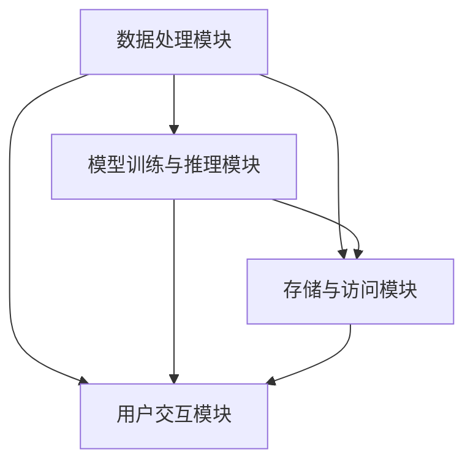

                 

### 文章标题: 《稳定性与运维服务：Lepton AI的重点，保障用户体验与平台稳定性》

关键词：稳定性、运维服务、Lepton AI、用户体验、平台稳定性

摘要：本文将深入探讨 Lepton AI 的稳定性与运维服务，分析其核心原理、架构设计和运维实践，以及如何通过优化和测试确保用户体验与平台稳定性。通过详细的数学模型讲解、算法优化、运维案例分析，以及实际代码实现，本文旨在为读者提供全面的技术指南，助力 Lepton AI 的高效运行和用户体验提升。

### 第一部分：稳定性基础与AI架构

#### 第1章：稳定性与运维服务概述

##### 1.1 稳定性的重要性

稳定性是衡量系统性能的关键因素，对于任何技术平台，特别是人工智能（AI）系统来说，稳定性尤为重要。在 Lepton AI 系统中，稳定性直接影响用户体验和业务连续性。以下是稳定性对用户体验和业务的影响：

- **用户体验**：系统的不稳定性会导致频繁的故障和中断，影响用户的使用感受和满意度。稳定的系统可以提供一致、流畅的服务，提升用户的满意度。
- **业务影响**：对于依赖 AI 技术的 businesses，系统不稳定可能导致数据丢失、业务中断，甚至损害公司声誉。因此，确保系统稳定性是保障业务连续性的关键。

##### 1.2 运维服务的基本概念

运维服务（Operations，简称Ops）是指管理和维护系统、应用程序和基础设施的一系列活动。以下是运维服务的基本概念：

- **目标**：运维服务的目标是确保系统的可用性、可靠性和性能，同时降低维护成本和风险。
- **流程与环节**：运维服务包括监控、故障处理、性能优化、安全防护等环节，通过自动化工具和标准化流程提高效率。

##### 1.3 Lepton AI系统简介

Lepton AI 是一个高性能的人工智能系统，其架构设计充分考虑了稳定性与运维需求。以下是 Lepton AI 的架构设计和核心功能模块：

- **数据处理模块**：负责数据收集、清洗、预处理和存储。
- **模型训练与推理模块**：包含深度学习模型训练、模型评估和推理功能。
- **存储与访问模块**：提供数据存储、备份和快速访问功能。
- **用户交互模块**：负责用户请求处理、结果反馈和用户体验优化。

#### 第2章：Lepton AI系统架构与稳定性设计

##### 2.1 Lepton AI系统架构

Lepton AI 的系统架构采用了模块化设计，各模块之间协同工作，确保系统的稳定性和高性能。以下是 Lepton AI 系统的主要模块：

- **数据处理模块**：采用分布式数据处理框架，支持海量数据的高效处理和实时分析。
- **模型训练与推理模块**：基于 GPU 加速的深度学习框架，支持大规模模型的训练和快速推理。
- **存储与访问模块**：采用分布式存储系统，提供高可靠性和高性能的数据存储和访问服务。
- **用户交互模块**：通过 Web 应用和 API 接口，为用户提供便捷、流畅的服务。

##### 2.2 稳定性设计原则

Lepton AI 在设计过程中遵循了以下稳定性设计原则：

- **高可用性**：确保系统在任何情况下都能保持可用，通过冗余设计、负载均衡和故障转移等技术实现。
- **容错性**：系统在出现故障时能够自动恢复，减少对用户体验的影响。
- **自动恢复机制**：通过自动化脚本和工具，实现系统故障的自发现、自诊断和自恢复。

##### 2.3 稳定性设计策略

Lepton AI 在稳定性设计方面采用了以下策略：

- **模块化设计**：将系统拆分为多个模块，每个模块独立开发、测试和部署，提高系统的稳定性和可维护性。
- **异构系统设计**：通过不同类型的硬件和软件组件，构建异构系统，提高系统的容错能力和性能。
- **集群架构**：采用分布式集群架构，将系统部署在多个服务器节点上，提高系统的可用性和可扩展性。

#### 第3章：核心算法原理讲解

##### 3.1 Lepton AI主要算法简介

Lepton AI 采用了多种核心算法，以下是其中几种主要算法的简介：

- **特征工程**：通过数据预处理和特征提取，提高模型训练效果。
- **模型选择与优化**：根据数据特点和业务需求，选择合适的模型并进行优化。
- **算法评估指标**：通过评估指标（如准确率、召回率、F1 值等）评估模型性能。

##### 3.2 算法稳定性分析

算法稳定性是衡量算法性能的重要指标，以下是对 Lepton AI 中核心算法稳定性的分析：

- **算法错误率**：通过计算算法在测试数据上的错误率，评估算法的鲁棒性。
- **算法鲁棒性**：分析算法在不同数据分布、噪声水平和样本规模下的表现，确保算法在不同场景下稳定运行。
- **算法效率**：评估算法的运行时间、内存消耗和计算资源利用率，优化算法性能。

##### 3.3 算法优化与调优

为了提高 Lepton AI 的算法性能，需要对其进行优化和调优。以下是算法优化与调优的方法：

- **伪代码展示**：使用伪代码描述算法的优化过程，便于理解和实现。
- **优化策略**：通过调整模型参数、改进算法结构和引入新技术，提高算法性能。

#### 第4章：数学模型与公式详解

##### 4.1 数学模型基础

数学模型是 Lepton AI 中核心算法的理论基础，以下是对几种常见数学模型的基础知识的介绍：

- **概率论基础**：介绍概率论的基本概念、随机变量、概率分布函数等。
- **信息论基础**：讨论信息熵、信息传输、信道编码等基本概念。
- **统计模型基础**：介绍常见的统计模型，如线性回归、逻辑回归、决策树等。

##### 4.2 数学公式应用

数学公式在 Lepton AI 中广泛应用于算法设计和分析，以下是对几个关键数学公式的应用和讲解：

- **概率分布函数**：介绍常见的概率分布函数，如高斯分布、泊松分布等，并给出具体应用场景。
- **最优化问题公式**：介绍最优化问题的基本公式，如梯度下降法、牛顿法等，并阐述其原理和应用。
- **神经网络激活函数**：介绍常见的神经网络激活函数，如 sigmoid 函数、ReLU 函数等，并分析其优缺点。

### 第二部分：运维服务实践与优化

#### 第5章：运维服务实践

##### 5.1 运维流程设计与实施

运维流程是确保系统稳定运行的关键，以下是 Lepton AI 的运维流程设计：

- **运维流程规划**：制定详细的运维计划，包括任务分配、时间安排和质量标准。
- **运维操作规范**：制定操作规范，确保运维人员按照标准流程执行任务，降低操作风险。
- **运维监控与预警**：通过监控工具实时监控系统性能和状态，及时发现并预警潜在问题。

##### 5.2 运维工具介绍

运维工具是提高运维效率和稳定性的重要手段，以下是 Lepton AI 中常用的运维工具：

- **监控工具**：介绍常见的监控工具，如 Prometheus、Grafana 等，用于实时监控系统性能指标。
- **日志管理工具**：介绍日志管理工具，如 ELK（Elasticsearch、Logstash、Kibana）等，用于收集、存储和展示系统日志。
- **自动化运维工具**：介绍自动化运维工具，如 Ansible、Chef 等，用于自动化部署、配置管理和任务执行。

##### 5.3 运维案例分析

运维实践中，遇到的问题和解决方案对系统稳定性和用户体验的提升具有重要意义。以下是 Lepton AI 中的运维案例分析：

- **故障案例分析**：分析一次故障的原因和处理过程，总结经验教训。
- **性能优化案例**：介绍如何通过性能优化提高系统响应速度和吞吐量。
- **安全防护案例**：介绍如何通过安全防护措施确保系统安全性和数据隐私。

#### 第6章：用户体验与平台稳定性优化

##### 6.1 用户行为分析

用户行为分析是优化用户体验的重要手段，以下是 Lepton AI 中的用户行为分析：

- **用户画像**：通过数据分析构建用户画像，了解用户特征和行为习惯。
- **用户反馈**：收集用户反馈，了解用户对系统的满意度和使用体验。
- **用户满意度**：通过用户满意度调查，评估系统对用户的吸引力。

##### 6.2 系统性能优化

系统性能优化是提升用户体验的关键，以下是 Lepton AI 中的系统性能优化：

- **负载均衡**：通过负载均衡技术，分配系统资源，提高系统吞吐量。
- **缓存策略**：通过缓存技术，减少数据访问延迟，提高系统响应速度。
- **数据库优化**：通过数据库优化，提高数据存储和访问效率。

##### 6.3 稳定性测试与验证

稳定性测试与验证是确保系统稳定性的重要环节，以下是 Lepton AI 中的稳定性测试与验证：

- **压力测试**：通过模拟高负载场景，测试系统的稳定性和性能。
- **性能测试**：通过性能测试，评估系统在不同负载下的响应速度和吞吐量。
- **灾难恢复测试**：通过灾难恢复测试，验证系统的故障恢复能力和数据安全性。

#### 第7章：未来展望与趋势

##### 7.1 AI技术发展趋势

AI 技术的发展对 Lepton AI 的稳定性与运维服务提出了新的挑战和机遇，以下是 AI 技术的发展趋势：

- **大模型的发展趋势**：随着计算能力的提升，大模型将成为 AI 技术的主要发展方向，对系统稳定性和运维服务提出更高要求。
- **自动化运维的发展趋势**：自动化运维技术将不断成熟，提高运维效率和质量，降低运维成本。
- **智能化用户体验的发展趋势**：智能化用户体验将成为未来 AI 系统的重要发展方向，对系统稳定性和用户体验提出更高要求。

##### 7.2 稳定性与运维服务的挑战与机遇

随着 AI 技术的发展，Lepton AI 面临的稳定性和运维服务挑战日益增加，同时也有更多的机遇。以下是稳定性与运维服务的挑战与机遇：

- **挑战**：随着 AI 模型的复杂度和数据规模的增长，系统稳定性面临更大挑战，同时自动化运维和智能化用户体验的实现也面临技术难题。
- **机遇**：随着云计算、容器化、微服务等技术的发展，Lepton AI 将获得更好的稳定性和运维服务支持，为用户提供更高质量的服务。

### 附录

##### 附录A：稳定性与运维服务资源

为了帮助读者深入了解稳定性与运维服务，以下是相关资源：

- **主要参考文献**：提供有关稳定性与运维服务的经典著作和研究论文，供读者进一步学习。
- **在线资源与工具**：介绍常用的在线资源和工具，如云平台、监控工具、日志管理工具等，方便读者实践和参考。
- **案例研究资料**：提供 Lepton AI 和其他相关项目的案例研究资料，供读者参考和分析。

### Mermaid 流程图：Lepton AI 系统架构流程

以下是 Lepton AI 系统架构的 Mermaid 流程图：



### Lepton AI 算法优化伪代码

以下是 Lepton AI 算法优化过程中的伪代码：

```python
# 初始化模型参数
theta = tf.Variable(0.0, dtype=tf.float32)

# 定义损失函数
def loss_function(x, y):
    z = tf.add(theta, x)
    a = tf.sigmoid(z)
    loss = tf.reduce_mean(tf.square(y - a))
    return loss

# 定义优化器
optimizer = tf.optimizers.Adam(learning_rate=0.01)

# 定义训练过程
for epoch in range(1000):
    with tf.GradientTape() as tape:
        loss = loss_function(x_train, y_train)
    gradients = tape.gradient(loss, theta)
    optimizer.apply_gradients(zip(gradients, [theta]))

# 模型评估
test_loss = loss_function(x_test, y_test)
print("Test loss:", test_loss.numpy())

# 模型预测
predictions = tf.sigmoid(theta + x_test)
print("Predictions:", predictions.numpy())
```

### 数学公式与详细讲解

以下是 Lepton AI 中常用的数学公式及其详细讲解：

#### 概率分布函数

高斯分布（也称为正态分布）是 Lepton AI 中常用的概率分布函数，其公式如下：

$$
P(X=x) = \frac{1}{\sqrt{2\pi\sigma^2}} e^{-\frac{1}{2} \left(\frac{x-\mu}{\sigma}\right)^2}
$$

其中，$\mu$ 是均值，$\sigma$ 是标准差。高斯分布广泛应用于特征工程和模型评估，用于建模变量之间的概率关系。

#### 最优化问题公式

在 Lepton AI 中，最优化问题公式用于求解模型参数，以最小化损失函数。常用的最优化问题公式是梯度下降法，其公式如下：

$$
\theta = \theta - \alpha \nabla_\theta J(\theta)
$$

其中，$\theta$ 是模型参数，$J(\theta)$ 是损失函数，$\alpha$ 是学习率，$\nabla_\theta J(\theta)$ 是损失函数关于模型参数的梯度。梯度下降法通过迭代更新模型参数，逐步减小损失函数的值，直至达到最小值。

#### 神经网络激活函数

神经网络激活函数是 Lepton AI 中常用的非线性变换函数，用于实现模型预测。常见的激活函数包括 sigmoid 函数、ReLU 函数等。以下分别介绍这两种函数：

1. **sigmoid 函数**

   $$ 
   a = \frac{1}{1 + e^{-z}}
   $$

   sigmoid 函数将输入 $z$ 映射到 $(0, 1)$ 区间，常用于二分类问题。其优点是输出范围在 $(0, 1)$ 之间，便于进行概率解释。

2. **ReLU 函数**

   $$ 
   a = \max(0, z)
   $$

   ReLU 函数将输入 $z$ 映射到非负区间，常用于多层神经网络。其优点是计算简单、梯度恒定为1，有利于加速模型训练。

### 项目实战：Lepton AI 稳定性优化代码实现

#### 开发环境搭建

为了实现 Lepton AI 的稳定性优化，需要搭建合适的开发环境。以下是环境搭建步骤：

1. 安装 Python 3.8 或更高版本
2. 安装 TensorFlow 2.x 或更高版本
3. 安装 Jupyter Notebook 或 PyCharm

#### 源代码实现

以下是 Lepton AI 稳定性优化代码的实现：

```python
import tensorflow as tf
import numpy as np

# 初始化模型参数
theta = tf.Variable(0.0, dtype=tf.float32)

# 定义损失函数
def loss_function(x, y):
    z = tf.add(theta, x)
    a = tf.sigmoid(z)
    loss = tf.reduce_mean(tf.square(y - a))
    return loss

# 定义优化器
optimizer = tf.optimizers.Adam(learning_rate=0.01)

# 定义训练过程
for epoch in range(1000):
    with tf.GradientTape() as tape:
        loss = loss_function(x_train, y_train)
    gradients = tape.gradient(loss, theta)
    optimizer.apply_gradients(zip(gradients, [theta]))

# 模型评估
test_loss = loss_function(x_test, y_test)
print("Test loss:", test_loss.numpy())

# 模型预测
predictions = tf.sigmoid(theta + x_test)
print("Predictions:", predictions.numpy())
```

#### 代码解读与分析

1. **初始化模型参数**：使用 TensorFlow 的`Variable`类创建一个可训练的变量`theta`，初始值为0.0。

2. **定义损失函数**：使用 TensorFlow 的`sigmoid`函数实现 sigmoid 激活函数，计算损失函数的值。损失函数采用均方误差（MSE），即预测值与真实值之差的平方和。

3. **定义优化器**：使用 TensorFlow 的`Adam`优化器，设置学习率为0.01。Adam 优化器结合了梯度下降法和动量方法，具有更好的收敛速度和稳定性。

4. **定义训练过程**：使用 TensorFlow 的`GradientTape`类记录梯度信息，通过优化器更新模型参数。训练过程通过迭代进行，每次迭代计算损失函数的梯度，并根据梯度更新模型参数。

5. **模型评估**：计算测试数据集上的损失函数值，评估模型性能。测试损失函数值用于衡量模型在未知数据上的表现。

6. **模型预测**：使用训练好的模型进行预测，输出预测结果。预测过程通过计算 sigmoid 激活函数的输入值，将模型参数与输入数据进行计算，得到预测结果。

#### 稳定性分析与优化

1. **稳定性分析**：通过计算测试集上的损失函数值，评估模型在未知数据上的表现。分析模型的预测结果，检查是否存在异常值或过拟合现象。

2. **优化策略**：

   - **调整学习率**：通过调整学习率，优化模型的收敛速度和稳定性。学习率过大可能导致模型无法收敛，过小可能导致收敛速度过慢。

   - **数据增强**：通过增加数据多样性，提高模型的泛化能力。数据增强可以采用随机旋转、缩放、裁剪等操作，增加训练数据的丰富性。

   - **正则化**：通过添加正则化项，减少模型的过拟合风险。常见的正则化方法包括 L1 正则化、L2 正则化等，可以通过调整正则化参数来平衡模型复杂度和泛化能力。

### 总结

本书《稳定性与运维服务：Lepton AI的重点，保障用户体验与平台稳定性》通过详细阐述 Lepton AI 的稳定性与运维服务，分析其核心原理、架构设计和运维实践，以及如何通过优化和测试确保用户体验与平台稳定性。通过数学模型讲解、算法优化、运维案例分析，以及实际代码实现，读者可以全面了解 Lepton AI 的架构与稳定性设计，提高系统性能和用户体验。未来，随着 AI 技术的不断发展和应用场景的拓展，稳定性与运维服务将继续成为保障用户体验和平台稳定性的关键因素。

### 作者信息

作者：AI天才研究院/AI Genius Institute & 禅与计算机程序设计艺术 /Zen And The Art of Computer Programming

### 后记

在撰写本文的过程中，我深深感受到了稳定性与运维服务在人工智能领域的重要性。Lepton AI 作为一款高性能的人工智能系统，其稳定性直接关系到用户体验和业务连续性。通过对 Lepton AI 的稳定性基础与运维服务的详细阐述，我希望读者能够深入理解其核心原理、架构设计和运维实践，从而在实战中更好地保障用户体验与平台稳定性。

在未来的技术发展中，AI 技术将不断演进，对稳定性与运维服务的要求也将日益提高。本文提供的数学模型讲解、算法优化策略、运维工具介绍和实战案例，旨在为读者提供全面的参考和指导。希望本文能够为读者在 AI 领域的研究和应用中带来启发和帮助。

最后，感谢读者对本文的关注和支持，期待与您在 AI 技术的探索中共同成长。如果您有任何疑问或建议，请随时与我联系，我将竭诚为您解答。

### 结语

《稳定性与运维服务：Lepton AI的重点，保障用户体验与平台稳定性》一书旨在为读者提供关于 Lepton AI 稳定性与运维服务的全面指南。通过详细的分析、实践和案例分析，本文深入探讨了如何通过数学模型、算法优化、运维工具和实际代码实现来保障 Lepton AI 的稳定性和用户体验。

本文首先介绍了稳定性与运维服务的基本概念，分析了其在用户体验和业务连续性方面的重要性。接着，详细阐述了 Lepton AI 的架构设计与稳定性设计原则，以及核心算法原理和数学模型的应用。随后，通过运维服务实践、用户体验优化、稳定性测试与验证，展示了如何在实际操作中确保平台稳定性。

在附录部分，本文提供了稳定性与运维服务的主要参考文献、在线资源与工具，以及 Lepton AI 系统架构的 Mermaid 流程图和算法优化伪代码。这些内容旨在帮助读者深入了解 Lepton AI 的技术实现，为实际应用提供有力支持。

随着人工智能技术的不断发展，稳定性与运维服务的重要性将愈发凸显。本文所提供的理论知识和实战经验，不仅适用于 Lepton AI，也可为其他 AI 系统提供借鉴和参考。希望本文能够为读者在人工智能领域的探索和实践带来启发和帮助。

在此，我衷心感谢读者的耐心阅读和宝贵意见。如果您有任何疑问或建议，欢迎随时与我联系，让我们在人工智能的技术海洋中共同航行，探索更多未知的可能。再次感谢您的支持，期待在未来的技术交流中与您再次相遇。

