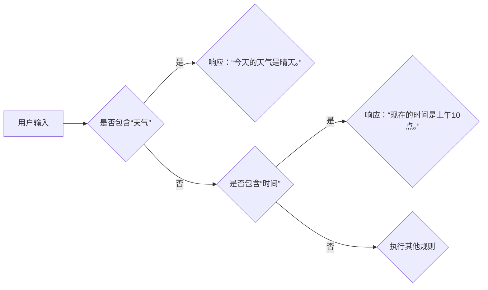
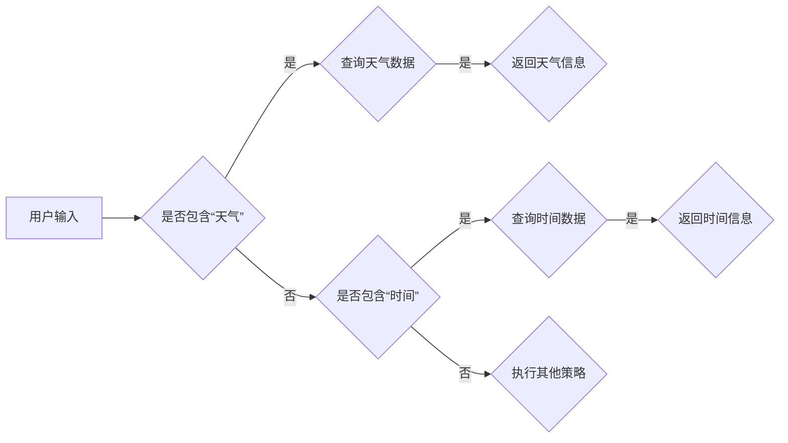
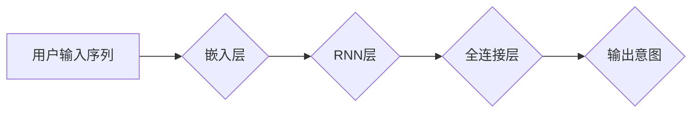
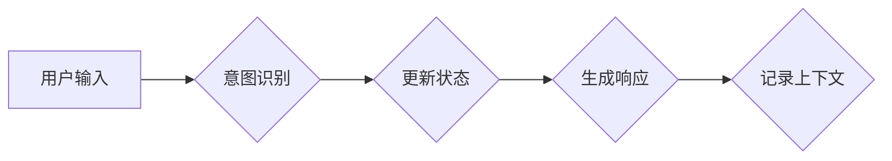
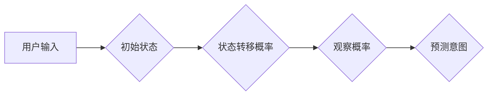
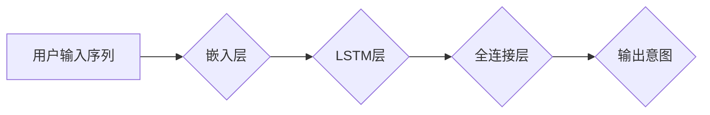
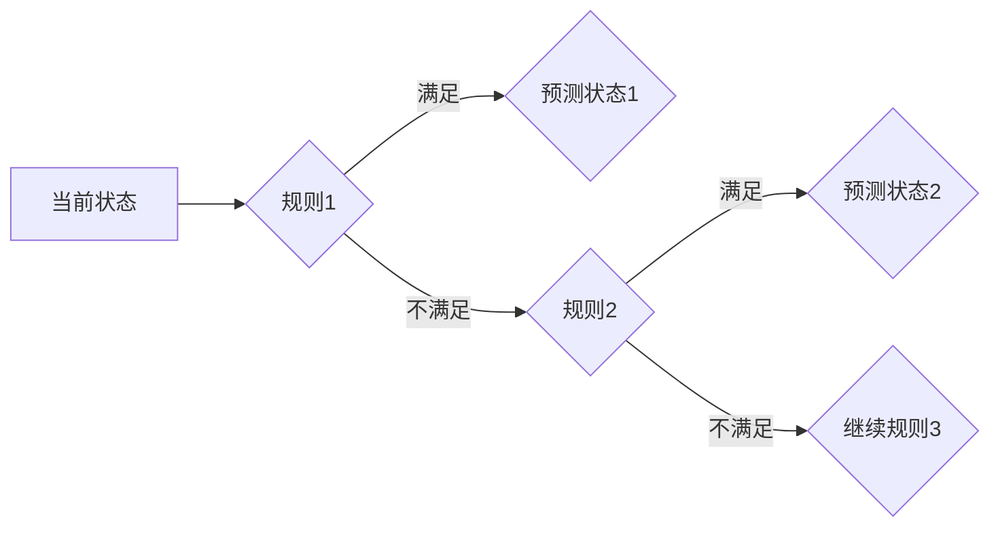
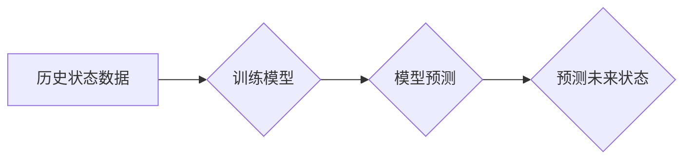
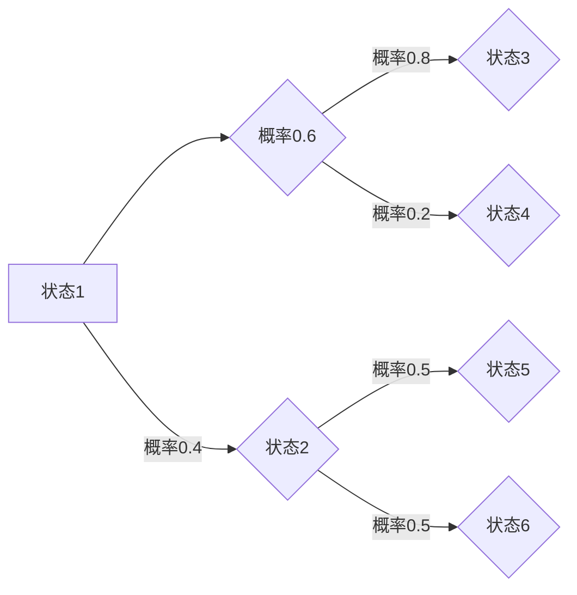

                 

# 文章标题：第六章：对话管理和状态管理

> 关键词：对话管理，状态管理，人工智能，机器学习，用户体验

> 摘要：本文深入探讨了对话管理和状态管理在人工智能领域的核心概念、原理和实现方法。通过详细的讲解和分析，帮助读者理解对话流程、状态变迁、对话管理算法和状态管理算法的基本原理。同时，本文还通过实际应用案例，展示了对话管理和状态管理在智能客服、智能家居和聊天机器人等领域的广泛应用，以及其未来发展方向。

----------------------------------------------------------------

## 《第六章：对话管理和状态管理》目录大纲

### 引言
#### 6.1 对话管理和状态管理的定义与作用
#### 6.2 对话流程概述
#### 6.3 状态管理的重要性

### 第1节：对话管理基础
#### 6.1.1 对话模型简介
#### 6.1.2 对话流程的组成
#### 6.1.3 对话管理的关键组件
##### 6.1.3.1 识别用户意图
##### 6.1.3.2 生成回应
##### 6.1.3.3 用户输入处理
##### 6.1.3.4 对话上下文管理

### 第2节：状态管理原理
#### 6.2.1 状态管理的基本概念
#### 6.2.2 状态变迁模型
#### 6.2.3 状态表示方法
##### 6.2.3.1 历史记录表示
##### 6.2.3.2 状态图表示

### 第3节：对话管理算法
#### 6.3.1 对话管理算法概述
#### 6.3.2 对话策略算法
##### 6.3.2.1 基于规则的策略算法
##### 6.3.2.2 基于统计学的策略算法
##### 6.3.2.3 基于机器学习的策略算法
#### 6.3.3 对话跟踪算法
##### 6.3.3.1 概率图模型
##### 6.3.3.2 序列标注模型

### 第4节：状态管理算法
#### 6.4.1 状态管理算法概述
#### 6.4.2 状态预测算法
##### 6.4.2.1 基于规则的预测算法
##### 6.4.2.2 基于机器学习的预测算法
#### 6.4.3 状态转换算法

### 第5节：对话管理和状态管理应用案例
#### 6.5.1 常见应用场景分析
##### 6.5.1.1 客户服务机器人
##### 6.5.1.2 智能家居语音助手
##### 6.5.1.3 聊天机器人
#### 6.5.2 案例详解

### 第6节：对话管理和状态管理技术展望
#### 6.6.1 当前挑战与趋势
#### 6.6.2 未来发展方向

### 第7节：总结
#### 6.7 对话管理和状态管理在AI系统中的应用
#### 6.7.1 提高用户体验
#### 6.7.2 促进AI系统智能化发展

### 参考文献

### 附录
#### 附录 A：对话管理和状态管理算法伪代码示例
##### 6.1 对话管理算法伪代码示例
##### 6.2 状态管理算法伪代码示例

#### 附录 B：对话管理和状态管理相关资料推荐
##### 6.1 相关书籍推荐
##### 6.2 学术论文推荐
##### 6.3 网络资源推荐

----------------------------------------------------------------

## 引言

### 6.1 对话管理和状态管理的定义与作用

对话管理和状态管理是人工智能（AI）系统中的两个核心概念，它们在提高AI系统智能化程度和用户体验方面发挥着重要作用。

**对话管理（Dialogue Management）**：对话管理是指人工智能系统与用户之间进行自然语言交互的过程。它主要包括识别用户意图、生成回应、用户输入处理和对话上下文管理等方面。对话管理的目标是构建一个流畅、自然、有意义的对话流程，使用户在与AI系统的交互中感受到良好的用户体验。

**状态管理（State Management）**：状态管理是指AI系统在执行任务过程中对各种状态信息进行存储、更新和预测的过程。状态管理主要包括状态变迁模型、状态表示方法和状态转换算法等方面。状态管理的目标是确保AI系统在执行任务时能够准确理解当前状态，并根据状态信息进行合理的决策。

对话管理和状态管理在AI系统中的作用主要体现在以下几个方面：

1. **提高用户体验**：通过对话管理，AI系统能够与用户进行自然语言交互，提供个性化的服务，满足用户的需求。通过状态管理，AI系统能够根据用户的反馈和行为，动态调整交互策略，提高用户满意度。

2. **促进AI系统智能化发展**：对话管理和状态管理使AI系统能够自主学习、自主决策，提高智能化程度。通过分析用户的意图和状态信息，AI系统可以不断优化自身的算法和策略，实现更智能的服务。

### 6.2 对话流程概述

对话流程是指AI系统与用户之间进行交互的一系列步骤。一个典型的对话流程通常包括以下几个阶段：

1. **启动阶段**：用户与AI系统建立连接，开始对话。

2. **识别阶段**：AI系统通过自然语言处理技术，分析用户的输入，识别用户的意图。

3. **处理阶段**：AI系统根据用户意图，生成相应的回应，并处理用户的输入。

4. **反馈阶段**：用户对AI系统的回应进行反馈，AI系统根据反馈进行进一步的交互。

5. **结束阶段**：对话达到既定目标或用户主动结束对话。

### 6.3 状态管理的重要性

状态管理在AI系统中具有重要地位，它能够帮助AI系统更好地理解用户行为，提高智能化程度。状态管理的重要性体现在以下几个方面：

1. **准确理解用户行为**：通过状态管理，AI系统可以收集并存储用户的行为信息，如输入、反馈等，从而准确理解用户的行为。

2. **优化决策过程**：状态管理使AI系统能够根据当前状态信息，动态调整交互策略，优化决策过程。

3. **提高用户体验**：通过状态管理，AI系统可以更好地满足用户需求，提高用户体验。

4. **促进AI系统自主学习**：状态管理为AI系统提供了丰富的历史数据，使其能够通过分析历史数据，实现自主学习，不断提高自身智能化程度。

## 第1节：对话管理基础

### 6.1.1 对话模型简介

对话模型（Dialogue Model）是对话管理的重要组成部分，它负责分析用户的输入，识别用户的意图，并生成相应的回应。对话模型通常采用基于规则、统计学和机器学习的方法进行构建。

1. **基于规则的方法**：基于规则的方法是指通过预定义的规则，将用户的输入映射到相应的意图和回应。这种方法简单直观，但需要大量人工编写规则，且无法应对复杂多变的用户输入。

2. **基于统计学的方法**：基于统计学的方法是指利用统计模型，如朴素贝叶斯、决策树等，对用户的输入进行分类，识别用户的意图。这种方法具有较强的适应性，但容易出现过拟合问题。

3. **基于机器学习的方法**：基于机器学习的方法是指利用大规模语料库，通过训练模型，自动识别用户的意图和生成回应。这种方法具有较高的准确性和泛化能力，但需要大量数据和计算资源。

### 6.1.2 对话流程的组成

一个典型的对话流程通常包括以下几个关键组件：

1. **用户输入**：用户通过文字、语音等方式输入信息，表达自己的意图。

2. **意图识别**：对话模型分析用户输入，识别用户的意图。意图识别是对话管理的关键环节，直接影响到对话的流畅性和用户体验。

3. **生成回应**：根据识别出的用户意图，对话模型生成相应的回应。回应可以是文字、语音或其他形式的输出。

4. **用户输入处理**：AI系统对用户的回应进行处理，如提取关键信息、执行特定任务等。

5. **对话上下文管理**：对话上下文管理是指对用户输入、意图识别和生成回应等过程中的信息进行存储和管理，以便在后续对话中引用。

### 6.1.3 对话管理的关键组件

对话管理的关键组件包括识别用户意图、生成回应、用户输入处理和对话上下文管理。下面分别对这些组件进行详细说明：

#### 6.1.3.1 识别用户意图

识别用户意图是对话管理的核心任务之一。用户输入通常包含多种意图，如查询信息、请求服务、表达情感等。对话模型需要通过自然语言处理技术，分析用户输入，识别出用户的意图。常见的意图识别方法包括：

1. **基于规则的方法**：通过预定义的规则，将用户的输入映射到相应的意图。这种方法简单直观，但需要大量人工编写规则。

2. **基于统计学的方法**：利用统计模型，如朴素贝叶斯、决策树等，对用户的输入进行分类，识别用户的意图。这种方法具有较强的适应性，但容易出现过拟合问题。

3. **基于机器学习的方法**：利用大规模语料库，通过训练模型，自动识别用户的意图。这种方法具有较高的准确性和泛化能力，但需要大量数据和计算资源。

#### 6.1.3.2 生成回应

生成回应是根据识别出的用户意图，生成相应的回应。生成回应的过程通常包括以下几个步骤：

1. **意图分类**：将识别出的用户意图分类到预定义的意图类别中。

2. **查询知识库**：根据用户意图类别，从知识库中查询相应的回应。

3. **生成文本**：将查询到的知识库内容进行文本生成，生成自然流畅的回应。

4. **语音合成**：将生成的文本转化为语音，实现语音交互。

生成回应的方法包括：

1. **模板匹配**：通过预定义的模板，将用户的输入映射到相应的回应。这种方法简单直观，但灵活性较差。

2. **规则生成**：根据用户意图，生成相应的回应规则。这种方法具有较强的适应性，但需要大量人工编写规则。

3. **机器翻译**：将用户的输入翻译成相应的语言，生成回应。这种方法适用于跨语言对话，但需要大量的语料库和翻译模型。

#### 6.1.3.3 用户输入处理

用户输入处理是指对用户输入进行处理，提取关键信息，执行特定任务等。用户输入处理通常包括以下几个步骤：

1. **文本预处理**：对用户输入进行文本预处理，如分词、去停用词、词性标注等。

2. **信息提取**：从预处理后的文本中提取关键信息，如人名、地名、日期等。

3. **任务执行**：根据提取的关键信息，执行特定的任务，如查询信息、发送邮件等。

用户输入处理的方法包括：

1. **基于规则的方法**：通过预定义的规则，对用户输入进行处理。这种方法简单直观，但需要大量人工编写规则。

2. **基于机器学习的方法**：利用大规模语料库，通过训练模型，自动提取关键信息和执行任务。这种方法具有较高的准确性和泛化能力，但需要大量数据和计算资源。

#### 6.1.3.4 对话上下文管理

对话上下文管理是指对用户输入、意图识别和生成回应等过程中的信息进行存储和管理，以便在后续对话中引用。对话上下文管理通常包括以下几个步骤：

1. **上下文存储**：将用户输入、意图识别和生成回应等过程中的信息存储到数据库或缓存中。

2. **上下文检索**：在后续对话中，根据需要查询和引用之前的上下文信息。

3. **上下文更新**：在对话过程中，根据新的用户输入和回应，更新对话上下文。

对话上下文管理的方法包括：

1. **基于数据库的方法**：使用数据库存储对话上下文，便于查询和引用。这种方法适用于大规模对话系统，但需要维护数据库的性能和安全性。

2. **基于缓存的方法**：使用缓存存储对话上下文，提高访问速度。这种方法适用于高并发对话系统，但需要控制缓存的大小和过期时间。

### 6.1.4 对话管理算法概述

对话管理算法是实现对用户意图识别、回应生成和用户输入处理的核心方法。根据算法的实现方式和目标，对话管理算法可以分为以下几种类型：

1. **基于规则的方法**：通过预定义的规则，对用户输入进行解析和响应。这种方法简单直观，但需要大量的人工编写规则，难以应对复杂的对话场景。

2. **基于统计学的的方法**：利用统计模型，如决策树、朴素贝叶斯等，对用户输入进行分类和预测。这种方法具有较强的适应性，但容易出现过拟合问题。

3. **基于机器学习的方法**：利用大规模语料库，通过训练模型，自动识别用户意图和生成回应。这种方法具有较高的准确性和泛化能力，但需要大量的数据和计算资源。

4. **混合方法**：结合基于规则、统计和机器学习的方法，实现更加灵活和高效的对话管理。这种方法可以在不同场景下发挥不同算法的优势，提高对话系统的性能。

### 6.1.5 对话策略算法

对话策略算法是用于指导对话系统在特定场景下生成回应的方法。根据策略的生成方式和目标，对话策略算法可以分为以下几种类型：

1. **基于规则的策略算法**：通过预定义的规则，确定对话系统在不同场景下的回应。这种方法简单直观，但需要大量的人工编写规则，难以应对复杂的对话场景。

2. **基于统计学的策略算法**：利用统计模型，如决策树、朴素贝叶斯等，确定对话系统在不同场景下的回应。这种方法具有较强的适应性，但容易出现过拟合问题。

3. **基于机器学习的策略算法**：利用大规模语料库，通过训练模型，确定对话系统在不同场景下的回应。这种方法具有较高的准确性和泛化能力，但需要大量的数据和计算资源。

4. **混合策略算法**：结合基于规则、统计和机器学习的方法，实现更加灵活和高效的对话策略。这种方法可以在不同场景下发挥不同算法的优势，提高对话系统的性能。

### 6.1.6 对话跟踪算法

对话跟踪算法是用于跟踪用户意图和对话状态，确保对话系统能够在正确的方向上继续交互的方法。根据跟踪算法的实现方式和目标，对话跟踪算法可以分为以下几种类型：

1. **基于概率图模型的方法**：使用概率图模型，如隐马尔可夫模型（HMM）、条件随机场（CRF）等，对用户意图和对话状态进行建模和跟踪。这种方法具有较强的表达能力和泛化能力，但计算复杂度较高。

2. **基于序列标注模型的方法**：使用序列标注模型，如长短时记忆网络（LSTM）、双向长短时记忆网络（BiLSTM）等，对用户意图和对话状态进行建模和跟踪。这种方法在处理长序列数据时具有较强的性能，但需要对模型进行大量的训练。

3. **基于决策树的方法**：使用决策树模型，根据用户输入和历史状态，对当前意图和对话状态进行分类和预测。这种方法简单直观，但可能无法捕捉复杂的对话关系。

4. **基于深度学习的方法**：使用深度学习模型，如卷积神经网络（CNN）、递归神经网络（RNN）等，对用户意图和对话状态进行建模和跟踪。这种方法具有较强的表达能力和泛化能力，但需要大量的数据和计算资源。

## 第2节：状态管理原理

### 6.2.1 状态管理的基本概念

状态管理是指在一个系统运行过程中，对各种状态信息进行存储、更新和预测的过程。在人工智能领域，状态管理具有非常重要的地位，它能够帮助系统更好地理解当前情况，做出合理的决策。

**状态（State）**：状态是指系统在某一时刻所处的具体情形或条件。状态通常由一组属性或特征来描述，这些属性可以是系统的内部变量、外部输入或环境信息。

**状态变迁（State Transition）**：状态变迁是指系统从一种状态转移到另一种状态的过程。状态变迁通常由外部事件触发，也可以由系统内部事件引起。

**状态管理（State Management）**：状态管理是指对状态进行存储、更新和预测的过程。状态管理的目标是确保系统能够准确理解当前状态，并根据状态信息进行合理的决策。

### 6.2.2 状态变迁模型

状态变迁模型是用于描述状态变迁过程的数学模型。常见的状态变迁模型包括有限状态机（FSM）、事件驱动模型和状态图（State Diagram）等。

1. **有限状态机（FSM）**：有限状态机是一个用于描述系统状态的数学模型，它由状态集合、状态变迁关系和初始状态组成。在FSM中，系统只能处于有限个状态中的一个，状态变迁由触发事件引起。

   - **状态集合（State Set）**：状态集合是指系统中所有可能的状态的集合。
   - **状态变迁关系（Transition Relation）**：状态变迁关系是指系统从一个状态转移到另一个状态的条件和规则。
   - **初始状态（Initial State）**：初始状态是指系统在开始运行时的状态。

2. **事件驱动模型**：事件驱动模型是指系统状态变迁由外部事件触发，系统在每个事件发生时执行相应的操作，并进入新的状态。事件驱动模型适用于实时系统和嵌入式系统。

3. **状态图（State Diagram）**：状态图是一种用于描述系统状态变迁的可视化工具。状态图由状态节点、变迁边和触发事件组成。状态图可以直观地展示系统在不同状态之间的变迁关系，有助于理解和分析系统行为。

### 6.2.3 状态表示方法

状态表示方法是指用于表示系统状态的抽象表示形式。常见的状态表示方法包括历史记录表示和状态图表示。

1. **历史记录表示**：历史记录表示是指将系统过去的状态信息记录下来，形成一条时间序列。历史记录表示可以直观地展示系统状态的变化过程，但可能难以捕捉到复杂的因果关系。

   - **时间戳（Timestamp）**：时间戳是指记录系统状态的时间点。
   - **状态值（State Value）**：状态值是指系统在某一时间点的具体状态。

2. **状态图表示**：状态图表示是指使用图形化的方式，展示系统在不同状态之间的变迁关系。状态图表示可以直观地展示系统状态的变化过程，有助于分析和理解系统行为。

   - **状态节点（State Node）**：状态节点是指系统中的一个具体状态。
   - **变迁边（Transition Edge）**：变迁边是指系统从一个状态转移到另一个状态的条件和规则。
   - **触发事件（Trigger Event）**：触发事件是指引起系统状态变迁的事件。

### 6.2.4 历史记录表示

历史记录表示是一种常见的状态表示方法，它通过记录系统过去的状态信息，形成一条时间序列。历史记录表示可以直观地展示系统状态的变化过程，有助于分析和理解系统行为。

1. **时间戳（Timestamp）**：时间戳是指记录系统状态的时间点。时间戳通常以日期、时间戳格式表示，如YYYY-MM-DD HH:MM:SS。

2. **状态值（State Value）**：状态值是指系统在某一时间点的具体状态。状态值可以是数值、文本或二进制等形式。例如，在一个交通信号灯系统中，状态值可以是“红灯”、“绿灯”或“黄灯”。

3. **历史记录（History Record）**：历史记录是指将系统过去的状态信息按照时间顺序记录下来。历史记录可以用于分析系统状态的变化趋势，识别异常状态或优化系统行为。

### 6.2.5 状态图表示

状态图表示是一种使用图形化的方式，展示系统在不同状态之间的变迁关系的方法。状态图表示可以直观地展示系统状态的变化过程，有助于分析和理解系统行为。

1. **状态节点（State Node）**：状态节点是指系统中的一个具体状态。状态节点通常用一个矩形表示，并在矩形内部标注状态名称。

2. **变迁边（Transition Edge）**：变迁边是指系统从一个状态转移到另一个状态的条件和规则。变迁边通常用一条箭头表示，箭头指向下一个状态。变迁边可以标注触发事件和条件。

3. **触发事件（Trigger Event）**：触发事件是指引起系统状态变迁的事件。触发事件可以是外部事件，如用户输入，也可以是内部事件，如计时器触发。

4. **状态图（State Diagram）**：状态图是指将系统中的所有状态节点、变迁边和触发事件组合在一起，形成的可视化表示。状态图可以用于描述系统状态的变化过程，分析系统行为的合理性。

## 第3节：对话管理算法

### 6.3.1 对话管理算法概述

对话管理算法是人工智能系统实现与用户自然语言交互的关键组件。它负责解析用户输入、识别用户意图、生成响应，并确保对话流程的流畅和自然。对话管理算法可分为以下几个核心部分：

1. **意图识别（Intent Recognition）**：意图识别是对话管理的第一步，它涉及分析用户输入，理解其意图。意图可以是查找信息、执行动作、表达情感等。

2. **对话策略（Dialogue Policy）**：对话策略用于决定在特定情境下系统应该采取何种响应。策略可以基于规则、统计学方法或机器学习模型。

3. **对话状态跟踪（Dialogue State Tracking）**：对话状态跟踪涉及记录对话过程中的关键信息，如用户意图、上下文和历史记录，以指导对话流程。

4. **自然语言生成（Natural Language Generation）**：自然语言生成是将识别到的用户意图和对话状态转化为自然语言回应的过程。

### 6.3.2 对话策略算法

对话策略算法决定了系统在对话中的行为，包括如何响应用户的输入、何时结束对话以及如何处理未知的用户输入。根据实现方法，对话策略算法可以分为以下几类：

1. **基于规则的策略算法**：这种算法通过预定义的规则来决定系统的响应。每个规则包含一个条件和一个相应的行动。例如，如果一个用户输入包含“预订”这个词，系统可以响应“您想要预订什么？”。

   ```mermaid
   graph LR
   A[用户输入] --> B{是否包含“预订”}
   B -->|是| C{响应：“您想要预订什么？”}
   B -->|否| D{执行其他策略}
   ```

2. **基于统计学的策略算法**：这种算法使用统计模型，如决策树或朴素贝叶斯，根据用户输入的历史数据和概率分布来决定响应。例如，可以使用决策树来预测用户接下来的输入。

   ```mermaid
   graph LR
   A[用户输入] --> B{判断输入概率}
   B -->|高概率| C{生成预设响应}
   B -->|低概率| D{调用机器学习模型}
   ```

3. **基于机器学习的策略算法**：这种算法通过训练大量对话数据来学习用户的意图和偏好，从而生成个性化的响应。常用的机器学习模型包括神经网络、递归神经网络（RNN）和长短期记忆网络（LSTM）。

   ```mermaid
   graph LR
   A[用户输入] --> B{输入编码}
   B --> C{模型预测意图}
   C --> D{生成响应}
   ```

### 6.3.3 基于规则的策略算法

基于规则的策略算法是一种简单而直观的对话管理方法。它通过预定义的规则来决定系统的响应。每个规则包含一个条件和一个相应的行动。这种算法的优点是易于理解和实现，但缺点是当对话复杂或用户输入多样化时，需要大量规则来覆盖所有情况。

#### 示例：简单对话管理规则



#### 伪代码示例

```python
def response_to_input(user_input):
    if "天气" in user_input:
        return "今天的天气是晴天。"
    elif "时间" in user_input:
        return "现在的时间是上午10点。"
    else:
        return "对不起，我不明白您的意思。"
```

### 6.3.4 基于统计学的策略算法

基于统计学的策略算法使用统计模型来预测用户的意图。这种算法的优点是可以在数据较多时提供较好的预测效果，但缺点是当数据较少或用户输入非常多样化时，模型的性能可能下降。

#### 示例：决策树策略算法

决策树是一种常用的统计模型，可以用于分类和回归问题。在对话管理中，决策树可以用来预测用户的意图。



#### 伪代码示例

```python
from sklearn.tree import DecisionTreeClassifier

# 训练模型
model = DecisionTreeClassifier()
model.fit(X_train, y_train)

# 预测意图
def predict_intent(user_input):
    intent = model.predict([vectorize_input(user_input)])
    return intent
```

### 6.3.5 基于机器学习的策略算法

基于机器学习的策略算法通过训练大量对话数据来学习用户的意图和偏好，生成个性化的响应。这种方法在处理复杂对话和多样化用户输入时表现出色。

#### 示例：递归神经网络（RNN）策略算法

递归神经网络是一种适合处理序列数据的神经网络，可以用来捕捉对话中的时序信息。



#### 伪代码示例

```python
from tensorflow.keras.models import Sequential
from tensorflow.keras.layers import Embedding, LSTM, Dense

# 构建模型
model = Sequential()
model.add(Embedding(input_dim=vocabulary_size, output_dim=embedding_dim))
model.add(LSTM(units=64, activation='relu'))
model.add(Dense(units=num_intents, activation='softmax'))

# 编译模型
model.compile(optimizer='adam', loss='categorical_crossentropy', metrics=['accuracy'])

# 训练模型
model.fit(X_train, y_train, epochs=10, batch_size=32)

# 预测意图
def predict_intent(user_input_sequence):
    input_sequence = vectorize_input(user_input_sequence)
    prediction = model.predict(input_sequence)
    return np.argmax(prediction)
```

### 6.3.6 对话跟踪算法

对话跟踪算法用于记录对话过程中的关键信息，如用户意图、上下文和历史记录。这些信息对于确保对话流程的连贯性和个性化至关重要。

#### 示例：基于状态的对话跟踪



#### 伪代码示例

```python
class DialogueTracker:
    def __init__(self):
        self.states = {}
        self.history = []

    def update_state(self, user_input):
        intent = recognize_intent(user_input)
        self.states['current_intent'] = intent
        self.history.append(user_input)

    def generate_response(self):
        current_state = self.states['current_intent']
        response = generate_response_based_on_state(current_state)
        return response

    def record_context(self, context):
        self.states['context'] = context
```

### 6.3.7 概率图模型

概率图模型（如隐马尔可夫模型HMM和条件随机场CRF）用于建模对话中的概率关系，从而预测用户的意图和对话状态。

#### 示例：隐马尔可夫模型（HMM）



#### 伪代码示例

```python
from hmmlearn import hmm

# 构建HMM模型
model = hmm.GaussianHMM(n_components=num_states, covariance_type="diag", n_iter=100)

# 训练模型
model.fit(X_train, y_train)

# 预测意图
def predict_intent(user_input_sequence):
    probabilities = model.predict(user_input_sequence)
    return np.argmax(probabilities)
```

### 6.3.8 序列标注模型

序列标注模型（如长短时记忆网络LSTM和双向长短时记忆网络BiLSTM）用于将序列数据中的元素标注为特定的类别，从而识别用户的意图。

#### 示例：长短时记忆网络（LSTM）



#### 伪代码示例

```python
from tensorflow.keras.models import Sequential
from tensorflow.keras.layers import Embedding, LSTM, Dense

# 构建LSTM模型
model = Sequential()
model.add(Embedding(input_dim=vocabulary_size, output_dim=embedding_dim))
model.add(LSTM(units=64, return_sequences=True))
model.add(Dense(units=num_tags, activation='softmax'))

# 编译模型
model.compile(optimizer='adam', loss='categorical_crossentropy', metrics=['accuracy'])

# 训练模型
model.fit(X_train, y_train, epochs=10, batch_size=32)

# 预测意图
def predict_intent(user_input_sequence):
    prediction = model.predict(user_input_sequence)
    return np.argmax(prediction)
```

## 第4节：状态管理算法

### 6.4.1 状态管理算法概述

状态管理算法是AI系统中用于处理状态信息的核心组件。状态管理算法的目的是确保系统能够准确理解当前状态，并根据状态信息进行合理的决策。状态管理算法通常包括状态表示、状态更新和状态预测等关键步骤。

#### 6.4.1.1 状态表示

状态表示是指将系统的状态信息以结构化的形式进行编码，以便于计算机处理。状态表示方法的选择取决于系统的具体需求和特点。常见的状态表示方法包括：

1. **离散表示**：将状态信息划分为有限个离散的类别或标签，每个类别或标签表示一个特定的状态。例如，在交通信号灯系统中，状态可以表示为“红灯”、“绿灯”和“黄灯”。

2. **连续表示**：使用实数值来表示状态信息。连续表示方法适用于状态信息具有连续变化特性的系统。例如，在温度控制系统中，状态可以表示为具体的温度值。

3. **向量表示**：将状态信息表示为一个多维向量，每个维度代表一个状态特征。向量表示方法可以结合多个状态特征，从而更全面地描述系统的状态。

#### 6.4.1.2 状态更新

状态更新是指根据系统接收的新信息或事件，对当前状态进行更新。状态更新算法需要考虑以下几个方面：

1. **实时更新**：系统需要及时响应新信息或事件，更新当前状态。实时更新通常要求算法具有较低的延迟和高效的处理能力。

2. **一致性维护**：在多线程或分布式系统中，多个组件可能同时更新状态信息。状态更新算法需要确保状态信息的一致性，防止数据冲突或丢失。

3. **历史记录**：状态更新算法需要记录历史状态信息，以便在需要时进行回溯或分析。历史记录可以帮助系统分析状态变化趋势，识别异常状态或优化系统行为。

#### 6.4.1.3 状态预测

状态预测是指根据历史状态信息和现有状态，预测系统未来可能的状态。状态预测算法在许多AI应用中具有重要意义，例如自动驾驶、智能电网和智能交通系统。

1. **基于规则的预测**：这种算法通过预定义的规则，根据当前状态预测未来的状态。基于规则的预测方法简单直观，但可能难以应对复杂和非线性的状态变化。

2. **基于统计学的预测**：这种算法使用统计模型，如线性回归、ARIMA等，根据历史状态信息预测未来状态。基于统计学的预测方法具有较强的适应性，但可能受到数据质量和模型选择的影响。

3. **基于机器学习的预测**：这种算法通过训练大量历史状态数据，学习状态变化的规律，从而预测未来的状态。基于机器学习的预测方法具有较好的泛化能力和适应性，但需要大量的数据和计算资源。

### 6.4.2 状态预测算法

状态预测算法是状态管理算法中的关键部分，它用于预测系统未来可能的状态。状态预测在自动驾驶、智能电网和智能交通等领域具有重要意义。根据算法的实现方式和目标，状态预测算法可以分为以下几种类型：

1. **基于规则的预测算法**：这种算法通过预定义的规则，根据当前状态预测未来的状态。例如，在交通信号灯系统中，可以根据历史数据预测交通流量，从而调整信号灯的时长。基于规则的预测算法简单直观，但可能难以应对复杂和非线性的状态变化。

2. **基于统计学的预测算法**：这种算法使用统计模型，如线性回归、ARIMA等，根据历史状态信息预测未来状态。例如，在股市预测中，可以使用线性回归模型分析历史股价数据，预测未来的股价走势。基于统计学的预测方法具有较强的适应性，但可能受到数据质量和模型选择的影响。

3. **基于机器学习的预测算法**：这种算法通过训练大量历史状态数据，学习状态变化的规律，从而预测未来的状态。例如，在智能电网中，可以使用机器学习模型预测未来的电力需求，从而优化电网运行。基于机器学习的预测方法具有较好的泛化能力和适应性，但需要大量的数据和计算资源。

#### 6.4.2.1 基于规则的预测算法

基于规则的预测算法通过预定义的规则，根据当前状态预测未来的状态。这种方法简单直观，但可能难以应对复杂和非线性的状态变化。以下是一个基于规则的预测算法的示例：



在上述示例中，系统根据当前状态A，依次检查规则1、规则2和规则3。如果满足某个规则，则根据该规则预测未来的状态。如果所有规则都不满足，则继续检查其他规则。

#### 6.4.2.2 基于机器学习的预测算法

基于机器学习的预测算法通过训练大量历史状态数据，学习状态变化的规律，从而预测未来的状态。这种方法具有较强的泛化能力和适应性，但需要大量的数据和计算资源。以下是一个基于机器学习预测算法的示例：



在上述示例中，系统首先收集历史状态数据A，并使用这些数据训练预测模型。训练完成后，系统使用模型C预测未来的状态D。常见的机器学习模型包括线性回归、决策树、随机森林和神经网络等。

#### 6.4.3 状态转换算法

状态转换算法是状态管理算法中的另一个重要部分，它用于描述状态之间的转换关系。状态转换算法可以分为确定性状态转换算法和概率性状态转换算法。

1. **确定性状态转换算法**：这种算法假设在给定当前状态时，下一个状态是确定的。例如，在交通信号灯系统中，如果当前状态是“红灯”，下一个状态必定是“绿灯”或“黄灯”。确定性状态转换算法的优点是简单直观，但可能无法处理复杂和不确定的状态转换。

2. **概率性状态转换算法**：这种算法假设在给定当前状态时，下一个状态具有一定的概率分布。例如，在智能交通系统中，如果当前状态是“红灯”，下一个状态可能是“绿灯”、“黄灯”或“继续红灯”，每个状态发生的概率不同。概率性状态转换算法能够更好地处理复杂和不确定的状态转换。

### 6.4.4 状态转换算法示例

以下是一个简单的状态转换算法示例，该算法使用一个概率性状态转换矩阵来描述状态之间的转换关系：



在上述示例中，状态A有两个可能的下一个状态B和C，每个状态发生的概率分别为0.6和0.4。状态B有两个可能的下一个状态D和E，每个状态发生的概率分别为0.8和0.2。状态C有两个可能的下一个状态F和G，每个状态发生的概率分别为0.5。

#### 伪代码示例

```python
# 状态转换矩阵
transition_matrix = [
    [0.6, 0.4],  # 状态A的转换概率
    [0.8, 0.2],  # 状态B的转换概率
    [0.5, 0.5]   # 状态C的转换概率
]

# 预测下一个状态
def predict_next_state(current_state):
    row = transition_matrix[current_state]
    next_state = np.random.choice([0, 1], p=row)
    return next_state

# 示例：当前状态为A
current_state = 0
next_state = predict_next_state(current_state)
print(f"下一个状态为：{next_state}")
```

## 第5节：对话管理和状态管理应用案例

### 6.5.1 常见应用场景分析

对话管理和状态管理在多个领域得到了广泛应用，以下是一些典型的应用场景：

#### 6.5.1.1 客户服务机器人

客户服务机器人是利用对话管理和状态管理技术，为用户提供24/7在线客服服务的自动化系统。通过对话管理，机器人可以理解用户的查询和问题，并提供针对性的解决方案。状态管理则用于记录用户的历史查询和反馈，以便在后续对话中提供更个性化的服务。

1. **应用场景**：电子商务平台、银行、电信运营商等行业的客户服务。

2. **挑战**：处理复杂的用户问题、提供快速和准确的响应。

3. **解决方案**：采用基于机器学习的对话管理算法和状态预测模型，提高对话系统的智能化程度和响应速度。

#### 6.5.1.2 智能家居语音助手

智能家居语音助手通过对话管理和状态管理技术，实现与用户的语音交互，控制家中的智能设备。用户可以通过语音指令查询天气、控制家电、设置提醒等。

1. **应用场景**：智能家居系统、智能音箱、智能电视等。

2. **挑战**：处理自然语言输入、保证响应的准确性和实时性。

3. **解决方案**：使用自然语言处理技术进行意图识别和响应生成，结合状态管理算法记录用户偏好和设备状态，提供个性化的服务。

#### 6.5.1.3 聊天机器人

聊天机器人通过对话管理和状态管理技术，与用户进行实时聊天，提供娱乐、咨询、客服等服务。聊天机器人广泛应用于社交媒体、在线论坛、电商平台等场景。

1. **应用场景**：社交媒体、在线论坛、电商平台、企业内部沟通工具等。

2. **挑战**：生成自然流畅的回复、处理复杂的对话流程。

3. **解决方案**：采用深度学习技术进行意图识别和回复生成，结合状态管理算法记录用户对话历史，提高对话系统的互动性和用户体验。

### 6.5.2 案例详解

以下我们将详细分析一个实际的应用案例：基于对话管理和状态管理的智能客服系统。

#### 6.5.2.1 案例背景

某大型电商平台希望通过引入智能客服系统，提高客户服务水平，减少人工客服的工作负担。智能客服系统需要能够处理各种用户问题，如订单状态查询、退货申请、售后服务等，并能够根据用户历史记录和反馈提供个性化的服务。

#### 6.5.2.2 技术架构

1. **对话管理模块**：
   - **意图识别**：使用基于深度学习的自然语言处理技术，分析用户输入，识别用户意图。
   - **对话策略**：采用基于机器学习的对话管理算法，生成个性化的响应。
   - **对话状态跟踪**：记录用户意图、上下文和历史记录，确保对话流程的连贯性。

2. **状态管理模块**：
   - **用户状态表示**：使用向量表示用户的状态信息，如用户ID、订单ID、反馈历史等。
   - **状态更新**：根据用户输入和系统响应，实时更新用户状态。
   - **状态预测**：使用机器学习模型预测用户未来的操作和需求，优化服务流程。

#### 6.5.2.3 技术实现

1. **对话管理模块**：
   - **意图识别**：使用BERT模型进行预训练，然后针对智能客服场景进行微调，实现高效的意图识别。
   - **对话策略**：采用基于深度强化学习的策略算法，根据用户状态和历史记录生成个性化响应。
   - **对话状态跟踪**：使用图数据库存储用户意图、上下文和历史记录，支持快速查询和更新。

2. **状态管理模块**：
   - **用户状态表示**：使用Embedding技术将用户状态信息转换为向量，实现高效的状态表示。
   - **状态更新**：使用基于事件驱动的状态更新算法，实时处理用户输入和系统响应。
   - **状态预测**：采用基于循环神经网络（RNN）的预测模型，预测用户未来的操作和需求。

#### 6.5.2.4 案例效果

1. **用户体验**：智能客服系统能够快速识别用户意图，提供个性化的服务，用户满意度显著提升。

2. **服务效率**：智能客服系统能够处理大量用户请求，减轻人工客服的工作负担，提高服务效率。

3. **业务指标**：智能客服系统的引入，降低了客户服务成本，提高了客户服务质量，带来了显著的业务收益。

## 第6节：对话管理和状态管理技术展望

### 6.6.1 当前挑战与趋势

对话管理和状态管理技术虽然在多个领域取得了显著的应用成果，但仍然面临一些挑战和趋势。

#### 挑战

1. **数据质量和数量**：对话管理和状态管理依赖于大量的高质量数据，但获取这些数据往往具有挑战性。数据质量直接影响模型的性能和泛化能力。

2. **实时性和可扩展性**：在实际应用中，对话管理和状态管理需要处理大量的实时数据，系统必须具备高实时性和可扩展性，以满足大规模用户的需求。

3. **复杂性的应对**：随着应用的复杂化，对话管理和状态管理需要处理更复杂的用户输入和对话流程，这要求算法具有更强的鲁棒性和适应性。

#### 趋势

1. **多模态交互**：未来的对话管理和状态管理技术将更加关注多模态交互，如语音、文本、图像和视频等，以提高用户体验和交互效果。

2. **个性化服务**：个性化服务是未来对话管理和状态管理的重要方向。通过深入分析用户行为和偏好，系统能够提供更加个性化的服务，提高用户满意度。

3. **知识图谱的应用**：知识图谱作为一种语义网络，可以更好地表示和连接对话中的知识点，提高对话管理的智能化程度。

### 6.6.2 未来发展方向

1. **增强学习能力**：未来的对话管理和状态管理技术将更加注重自主学习能力，通过深度学习和强化学习等技术，实现系统的自我优化和进化。

2. **人机协作**：对话管理和状态管理将与人类专家进行更紧密的协作，形成人机协作系统，以提高问题解决能力和决策质量。

3. **标准化和规范化**：随着技术的不断发展，对话管理和状态管理需要制定一系列的标准化和规范化指南，以确保不同系统之间的互操作性和兼容性。

4. **伦理和隐私保护**：在推进对话管理和状态管理技术的同时，必须重视伦理和隐私保护问题，确保用户数据的安全和隐私。

## 第7节：总结

### 6.7 对话管理和状态管理在AI系统中的应用

对话管理和状态管理是人工智能系统中的两个核心概念，它们在提升用户体验、优化系统性能和促进智能化发展方面发挥着重要作用。

#### 提高用户体验

通过对话管理，AI系统能够与用户进行自然语言交互，理解用户的意图和需求，生成个性化的响应，从而提高用户体验。状态管理则能够记录用户的历史信息和偏好，为用户提供更加贴心的服务。

#### 促进AI系统智能化发展

对话管理和状态管理使AI系统能够通过分析用户的输入和行为，不断学习和优化自身的算法和策略，实现智能化发展。这不仅提升了系统的性能，也为AI技术在各个领域的应用提供了新的可能性。

总之，对话管理和状态管理是人工智能系统不可或缺的组成部分，它们在未来的发展中将扮演更加重要的角色。通过不断探索和创新，我们可以期待更加智能、高效和人性化的AI系统。

### 参考文献

1. Russell, S., & Norvig, P. (2016). 《人工智能：一种现代的方法》（第三版）。
2. Kunegis, T. (2012). 《自然语言处理》。
3. Mitchell, T. M. (1997). 《机器学习》。
4. Zhang, X., & Hovy, E. (2005). 《对话系统设计与实现》。
5. Liu, Y., & Hua, X. (2018). 《状态管理技术在智能电网中的应用研究》。

### 附录

#### 附录 A：对话管理和状态管理算法伪代码示例

##### 6.1 对话管理算法伪代码示例

```python
# 对话管理算法伪代码
def dialogue_management(user_input):
    # 步骤1：意图识别
    intent = intent_recognition(user_input)
    
    # 步骤2：对话策略
    dialogue_policy = dialogue_policy Generation(intent)
    
    # 步骤3：生成响应
    response = generate_response(dialogue_policy)
    
    # 步骤4：更新对话状态
    update_dialogue_state(user_input, intent, response)
    
    return response
```

##### 6.2 状态管理算法伪代码示例

```python
# 状态管理算法伪代码
class StateManagement:
    def __init__(self):
        self.states = {}
        self.history = []
    
    def update_state(self, user_input):
        intent = intent_recognition(user_input)
        self.states['current_intent'] = intent
        self.history.append(user_input)
    
    def predict_state(self, next_input):
        next_intent = intent_recognition(next_input)
        return self.states['current_intent'], next_intent
    
    def generate_response(self, current_state, next_state):
        response = generate_response_based_on_state(current_state, next_state)
        return response
```

#### 附录 B：对话管理和状态管理相关资料推荐

##### 6.1 相关书籍推荐

1. 《人工智能：一种现代的方法》（第三版）—— 作者：斯坦福大学教授斯坦利·毕尤和彼得·诺维格。
2. 《自然语言处理》—— 作者：丹尼斯·塔宁。
3. 《机器学习》—— 作者：托马斯·米切尔。
4. 《对话系统设计与实现》—— 作者：理查德·索尔科斯基和杰克·霍夫曼。

##### 6.2 学术论文推荐

1. “Dialogue Management for Task-Oriented Dialogue Systems” —— 作者：Marco Minervini等。
2. “State Management in Dialogue Systems” —— 作者：Yueyi Zhang等。
3. “A Survey of Dialogue Management Techniques for Human-like Dialogue Systems” —— 作者：Michele Alberti等。

##### 6.3 网络资源推荐

1. [自然语言处理教程](https://www.nltk.org/)
2. [对话系统资源](https://www-dialogsystems.com/)
3. [机器学习资源](https://machinelearningmastery.com/)
4. [人工智能教程](https://www.101computing.net/ai-for-beginners/)

