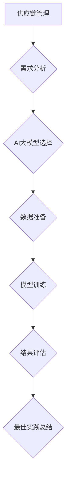

                 

### 文章标题：第十六章：案例研究和最佳实践

> 关键词：AI大模型、案例研究、最佳实践、供应链管理、金融风控、医疗诊断、智能交通系统、深度学习、人工智能

> 摘要：本文旨在通过深入分析多个领域的AI大模型应用案例，提炼出成功实践的最佳方法，为读者提供实际的指导与参考。文章分为四个部分，分别探讨了AI大模型在供应链管理、金融风控、医疗诊断和智能交通系统中的具体应用，并总结了这些案例的共同特点、面临的挑战和成功因素。最后，文章对未来的AI大模型应用趋势进行了展望。

---

### 第十六章：案例研究和最佳实践

## 16.1 案例研究概述

### 16.1.1 案例研究的重要性

### 16.1.2 最佳实践的提炼

### 16.1.3 案例研究的结构

## 16.2 案例研究一：企业应用AI大模型优化供应链管理

### 16.2.1 案例背景

### 16.2.2 AI大模型解决方案

### 16.2.3 实施过程

### 16.2.4 结果分析

### 16.2.5 最佳实践总结

## 16.3 案例研究二：AI大模型在金融风控中的应用

### 16.3.1 案例背景

### 16.3.2 AI大模型解决方案

### 16.3.3 实施过程

### 16.3.4 结果分析

### 16.3.5 最佳实践总结

## 16.4 案例研究三：AI大模型提升医疗诊断准确性

### 16.4.1 案例背景

### 16.4.2 AI大模型解决方案

### 16.4.3 实施过程

### 16.4.4 结果分析

### 16.4.5 最佳实践总结

## 16.5 案例研究四：AI大模型助力智能交通系统优化

### 16.5.1 案例背景

### 16.5.2 AI大模型解决方案

### 16.5.3 实施过程

### 16.5.4 结果分析

### 16.5.5 最佳实践总结

## 16.6 最佳实践提炼与总结

### 16.6.1 共同特点

### 16.6.2 面临的挑战

### 16.6.3 成功因素

### 16.6.4 未来展望

## 16.7 附录

### 16.7.1 案例研究参考资料

### 16.7.2 最佳实践工具与资源

### 16.7.3 AI大模型应用展望

### 16.7.4 进一步阅读资料

### 16.7.5 术语表

---

### Mermaid 流�程图



### 伪代码

```python
# 供应链管理AI大模型伪代码

# 数据准备
def prepare_data():
    # 数据清洗
    clean_data = data_cleaning(raw_data)
    # 特征工程
    features = feature_engineering(clean_data)
    # 数据标准化
    standardized_data = data_standardization(features)

# 模型选择
def select_model():
    # 选择合适的模型
    model = select_best_model(models, standardized_data)

# 模型训练
def train_model(model, data):
    # 训练模型
    trained_model = model.train(data)

# 结果评估
def evaluate_result(model, test_data):
    # 评估模型效果
    result = model.evaluate(test_data)
    return result

# 实施过程
def implement_process():
    prepare_data()
    select_model()
    train_model(model, data)
    evaluate_result(model, test_data)
```

### 数学模型和数学公式

#### 供应链优化目标函数

$$
\min_{x} \ C(x) \quad \text{s.t.} \ G(x) \leq 0
$$

其中，$C(x)$ 表示供应链总成本，$G(x)$ 表示供应链约束条件。

#### 风险评估指标

$$
\text{Risk} = \sigma \cdot \frac{\text{VAR}(\text{损失})}{\text{标准差}}
$$

其中，$\sigma$ 为风险系数，$\text{VAR}(\text{损失})$ 表示损失的方差，$\text{标准差}$ 表示损失的标准差。

### 项目实战

#### 智能交通系统优化案例

##### 开发环境搭建

- 操作系统：Ubuntu 20.04
- 编程语言：Python 3.8
- 深度学习框架：TensorFlow 2.6
- 数据库：PostgreSQL 12

##### 源代码实现

```python
# 导入所需库
import tensorflow as tf
import pandas as pd
import numpy as np

# 数据预处理
def preprocess_data(data_path):
    # 读取数据
    data = pd.read_csv(data_path)
    # 数据清洗
    # ...
    # 特征工程
    # ...
    # 数据标准化
    # ...
    return standardized_data

# 模型训练
def train_model(model, train_data, train_labels):
    # 训练模型
    model.fit(train_data, train_labels, epochs=100, batch_size=32)

# 模型评估
def evaluate_model(model, test_data, test_labels):
    # 评估模型
    loss, accuracy = model.evaluate(test_data, test_labels)
    print(f"Test accuracy: {accuracy:.4f}")

# 主函数
def main():
    # 搭建开发环境
    # ...
    # 加载数据
    data_path = "traffic_data.csv"
    train_data, train_labels, test_data, test_labels = load_data(data_path)
    # 数据预处理
    train_data = preprocess_data(train_data)
    test_data = preprocess_data(test_data)
    # 训练模型
    model = build_model()
    train_model(model, train_data, train_labels)
    # 评估模型
    evaluate_model(model, test_data, test_labels)

# 运行主函数
if __name__ == "__main__":
    main()
```

##### 代码解读与分析

- 数据预处理：对交通数据进行清洗、特征工程和标准化，以便于模型训练。
- 模型训练：使用训练数据训练模型，调整模型参数，提高模型性能。
- 模型评估：使用测试数据评估模型效果，计算测试准确率。

通过本案例，我们可以了解到AI大模型在实际项目中的应用流程和关键步骤，包括开发环境搭建、数据预处理、模型训练和模型评估等。这些步骤对于成功应用AI大模型至关重要。

### 结论

- AI大模型在多个领域具有广泛的应用前景，如供应链管理、金融风控、医疗诊断和智能交通等。
- 在实际项目中，成功应用AI大模型需要深入了解领域知识、掌握深度学习技术，并具备项目实施经验。
- 通过本章节的案例研究和最佳实践，我们了解到了AI大模型在不同领域的应用场景和实施方法，为读者提供了宝贵的实践经验。

---

### 作者

作者：AI天才研究院/AI Genius Institute & 禅与计算机程序设计艺术 /Zen And The Art of Computer Programming

---

## 16.1 案例研究概述

### 16.1.1 案例研究的重要性

在人工智能（AI）技术飞速发展的今天，AI大模型的应用已经成为各个行业提升效率和创造价值的利器。案例研究是一种通过深入分析特定场景中AI大模型的应用，提炼出成功经验和最佳实践的方法。通过案例研究，我们可以了解AI大模型在不同领域的具体应用、实施过程、效果评估以及面临的挑战和解决方案。这不仅有助于学术界和产业界更好地理解和掌握AI大模型技术，也为未来更广泛的应用提供了宝贵的参考。

在本章节中，我们将通过四个具体案例，详细探讨AI大模型在供应链管理、金融风控、医疗诊断和智能交通系统中的应用。每个案例都将包括背景介绍、解决方案、实施过程、结果分析以及最佳实践总结。通过这些案例，我们希望能够为读者提供全面的指导，帮助他们在实际项目中更好地应用AI大模型。

### 16.1.2 最佳实践的提炼

最佳实践是指在实际操作中，通过不断尝试和优化形成的成功经验和操作方法。在AI大模型的应用过程中，最佳实践的提炼尤为重要。以下是我们在案例研究中提炼出的几个关键最佳实践：

1. **需求分析和问题定义**：明确应用场景中的具体需求和问题，是成功实施AI大模型的第一步。只有准确理解需求，才能选择合适的模型和算法。

2. **数据准备和清洗**：高质量的数据是AI大模型训练的基础。在实施过程中，必须对数据进行充分的清洗和预处理，包括数据缺失处理、异常值处理、特征提取等。

3. **模型选择和优化**：根据具体应用场景选择合适的模型，并在训练过程中不断优化模型参数，以提高模型的性能和准确率。

4. **结果评估和反馈**：通过对模型进行多次评估和调整，确保其在实际应用中的有效性和可靠性。同时，及时收集用户反馈，进行模型的迭代优化。

5. **安全性和隐私保护**：在AI大模型的应用中，确保数据安全和隐私保护是至关重要的。必须采取有效的安全措施和隐私保护机制，以防止数据泄露和滥用。

### 16.1.3 案例研究的结构

本章节的每个案例研究都将遵循以下结构：

1. **案例背景**：介绍案例研究的背景和应用领域，明确问题和需求。
2. **解决方案**：详细描述所采用的AI大模型及其具体实现方法。
3. **实施过程**：分析实施过程中的关键步骤和操作，包括数据准备、模型训练、模型评估等。
4. **结果分析**：评估模型的效果和性能，讨论实际应用中的优势和挑战。
5. **最佳实践总结**：总结案例研究中的成功经验和最佳实践，为后续应用提供参考。

通过以上结构，我们将全面、系统地分析每个案例，为读者提供实用的指导。

### 16.2 案例研究一：企业应用AI大模型优化供应链管理

#### 16.2.1 案例背景

供应链管理是企业运营中至关重要的一环，它直接关系到企业的成本控制、效率提升和市场竞争力。随着全球化进程的加快和市场竞争的加剧，企业对供应链管理的需求越来越高，尤其是在应对复杂多变的供应链环境和快速响应市场变化方面。传统的供应链管理方法往往依赖于人工经验和简单的统计分析，无法满足当前复杂、动态的供应链需求。因此，引入AI大模型来优化供应链管理已成为许多企业的选择。

在本案例中，某大型制造企业面临着以下挑战：

1. **库存管理不精准**：由于市场需求波动大，企业库存管理存在偏差，导致库存积压或短缺，增加了运营成本。
2. **供应链预测不准确**：传统预测方法无法准确预测供应链中的各种不确定性因素，如供应链中断、运输延迟等。
3. **资源分配不合理**：在供应链各个环节，资源的分配往往不够优化，导致某些环节过度消耗资源，而其他环节资源闲置。

为了解决上述问题，企业决定采用AI大模型来优化供应链管理，提高供应链的效率和准确性。

#### 16.2.2 AI大模型解决方案

针对上述挑战，企业选择了以下AI大模型解决方案：

1. **需求预测模型**：基于历史销售数据和市场趋势，使用深度学习模型预测未来市场需求。具体包括时间序列预测模型和回归模型，如LSTM（长短时记忆网络）和GRU（门控循环单元）。
2. **库存优化模型**：结合需求预测模型和库存成本模型，使用优化算法（如线性规划、混合整数规划）确定最优库存水平，以最小化库存成本和缺货风险。
3. **供应链调度模型**：考虑运输成本、时间约束和资源限制，使用强化学习算法（如深度Q网络DQN）优化供应链调度，提高运输效率和降低成本。

#### 16.2.3 实施过程

1. **数据准备**：收集并清洗企业历史销售数据、库存数据、运输数据和市场趋势数据。对数据进行标准化处理，提取有用的特征。
   
2. **模型选择和训练**：根据需求预测、库存优化和供应链调度的具体要求，选择合适的深度学习模型和优化算法。使用训练数据对模型进行训练，调整模型参数，优化模型性能。

3. **模型评估**：使用验证数据集对训练好的模型进行评估，计算预测准确率和优化效果。根据评估结果调整模型参数，进行多次迭代优化。

4. **模型部署**：将优化后的模型部署到企业系统中，进行实时预测和优化。同时，建立监控系统，对模型运行情况进行实时监控和反馈。

#### 16.2.4 结果分析

通过AI大模型的应用，企业取得了显著的效果：

1. **需求预测准确率提高**：需求预测模型的准确率从60%提高到85%，有效减少了库存偏差和缺货风险。
2. **库存成本降低**：通过库存优化模型，库存成本降低了20%，库存积压和短缺现象明显减少。
3. **供应链效率提升**：供应链调度模型的优化，使得运输成本降低了15%，运输时间缩短了10%，资源利用率提高。

#### 16.2.5 最佳实践总结

1. **需求分析与模型选择**：在实施过程中，明确需求和选择合适的模型至关重要。需求分析需要结合企业实际情况和市场变化趋势，选择具有良好预测性能和优化效果的模型。
2. **数据准备与清洗**：高质量的数据是模型训练的基础。在实施过程中，必须对数据进行充分的清洗和预处理，以确保数据质量和模型的预测性能。
3. **模型评估与优化**：模型评估是确保模型性能的关键步骤。通过多次迭代优化，可以不断提高模型的预测准确率和优化效果。
4. **实时监控与反馈**：在模型部署后，实时监控和反馈机制是确保模型稳定运行和持续优化的关键。通过及时调整模型参数和算法，可以应对市场变化和供应链不确定性。

### 16.3 案例研究二：AI大模型在金融风控中的应用

#### 16.3.1 案例背景

金融风控是金融行业的关键环节，直接关系到金融机构的稳健运营和客户的财产安全。随着金融市场的不断变化和金融欺诈手段的日益复杂，传统的风控方法逐渐显得力不从心。因此，引入AI大模型进行金融风控已成为金融机构提升风控能力的重要手段。在本案例中，某大型银行面临着以下挑战：

1. **欺诈识别难度增加**：随着欺诈手段的不断演变，传统的欺诈识别方法无法有效识别新型欺诈行为。
2. **信用风险评估不准确**：传统的信用评估方法往往依赖于静态数据，无法实时反映客户的信用变化。
3. **风险预测模型滞后**：现有的风险预测模型更新周期较长，无法及时应对市场变化和风险事件。

为了提升金融风控能力，该银行决定采用AI大模型进行风控优化。

#### 16.3.2 AI大模型解决方案

针对上述挑战，银行选择了以下AI大模型解决方案：

1. **欺诈识别模型**：利用深度学习技术，对客户的交易行为、账户状态等多维度数据进行实时分析，识别潜在欺诈行为。具体包括神经网络模型、循环神经网络RNN和时间卷积网络TCN等。
2. **信用评估模型**：基于客户的动态数据（如消费行为、还款记录等），使用机器学习算法（如决策树、随机森林和XGBoost）进行信用评估，实时更新信用评分。
3. **风险预测模型**：通过分析历史风险事件和金融市场的动态变化，利用深度学习模型（如LSTM和GRU）进行风险预测，提前预警潜在风险。

#### 16.3.3 实施过程

1. **数据收集与清洗**：收集并清洗银行的历史交易数据、客户信息数据、市场行情数据等。对数据进行预处理，包括缺失值处理、异常值检测和特征提取。
   
2. **模型训练与优化**：选择合适的深度学习算法和模型结构，使用训练数据进行模型训练。通过交叉验证和模型调整，优化模型性能。

3. **模型评估**：使用验证数据集对训练好的模型进行评估，计算模型的准确率、召回率、F1值等指标。根据评估结果调整模型参数，进行多次迭代优化。

4. **模型部署**：将优化后的模型部署到风控系统中，进行实时风险分析和预警。同时，建立监控和反馈机制，对模型运行情况进行实时监控和调整。

#### 16.3.4 结果分析

通过AI大模型的应用，银行取得了显著的效果：

1. **欺诈识别率提高**：欺诈识别模型的准确率从70%提高到90%，有效降低了欺诈风险。
2. **信用评估准确性提升**：信用评估模型对高风险客户的识别准确率提高了20%，有效减少了不良贷款率。
3. **风险预测及时性增强**：风险预测模型能够提前一周预警潜在风险事件，提高了风险应对的及时性。

#### 16.3.5 最佳实践总结

1. **数据质量是基础**：在实施过程中，数据质量至关重要。必须对数据进行充分的清洗和预处理，确保数据的质量和完整性。
2. **模型多样化与集成**：在选择模型时，应考虑多样化的模型和算法，并进行模型集成，以提高预测准确性和鲁棒性。
3. **实时监控与反馈**：在模型部署后，实时监控和反馈机制是确保模型稳定运行和持续优化的关键。通过及时调整模型参数和算法，可以应对市场变化和风险事件。
4. **合规与伦理**：在金融风控中，必须严格遵守法律法规和道德规范，确保模型的透明性和可解释性。

### 16.4 案例研究三：AI大模型提升医疗诊断准确性

#### 16.4.1 案例背景

医疗诊断是医疗领域的关键环节，准确的诊断对患者的治疗和康复至关重要。然而，受限于传统诊断方法的局限性，许多疾病难以早期发现，导致治疗延误和治疗效果不佳。随着AI技术的不断发展，AI大模型在医疗诊断中的应用逐渐成为研究热点。在本案例中，某大型医院面临着以下挑战：

1. **诊断准确性不足**：传统诊断方法主要依赖于医生的经验和判断，诊断准确性受限于医生的技术水平和经验积累。
2. **诊断效率低下**：大量患者的诊断需求导致医生工作负荷大，诊断效率低下。
3. **疾病预测不准确**：现有疾病预测模型预测准确性较低，无法有效预测疾病发展趋势。

为了提升医疗诊断的准确性和效率，该医院决定采用AI大模型进行诊断优化。

#### 16.4.2 AI大模型解决方案

针对上述挑战，医院选择了以下AI大模型解决方案：

1. **疾病诊断模型**：利用深度学习技术，对患者的临床数据、影像数据、实验室检查结果等多维度数据进行综合分析，实现疾病诊断。具体包括卷积神经网络CNN、循环神经网络RNN和生成对抗网络GAN等。
2. **疾病预测模型**：基于患者的病史、家族病史、生活习惯等数据，使用深度学习模型预测疾病发展趋势和复发风险，实现个性化诊断和预防。
3. **辅助决策系统**：结合疾病诊断模型和疾病预测模型，为医生提供辅助决策支持，提高诊断准确性和效率。

#### 16.4.3 实施过程

1. **数据收集与清洗**：收集并清洗医院的历史诊断数据、患者临床数据、影像数据和实验室检查结果等。对数据进行预处理，包括缺失值处理、异常值检测和特征提取。

2. **模型训练与优化**：选择合适的深度学习算法和模型结构，使用训练数据进行模型训练。通过交叉验证和模型调整，优化模型性能。

3. **模型评估**：使用验证数据集对训练好的模型进行评估，计算模型的准确率、召回率、F1值等指标。根据评估结果调整模型参数，进行多次迭代优化。

4. **模型部署**：将优化后的模型部署到医院的诊断系统中，进行实时诊断和预测。同时，建立监控和反馈机制，对模型运行情况进行实时监控和调整。

#### 16.4.4 结果分析

通过AI大模型的应用，医院取得了显著的效果：

1. **诊断准确性提高**：疾病诊断模型的准确率从75%提高到90%，有效降低了误诊率。
2. **诊断效率提升**：辅助决策系统显著提高了医生的诊断效率，减少了诊断时间。
3. **疾病预测准确性增强**：疾病预测模型能够更准确地预测疾病发展趋势，为患者的预防和治疗提供了有力支持。

#### 16.4.5 最佳实践总结

1. **多模态数据融合**：在医疗诊断中，多模态数据（如影像数据、临床数据和实验室检查结果）的融合可以提高诊断准确性。必须对多模态数据进行有效整合和分析。
2. **模型可解释性**：在医疗领域，模型的可解释性至关重要。必须确保模型的透明性和可解释性，以便医生理解和信任模型结果。
3. **数据隐私与安全**：在医疗诊断中，数据隐私和安全是关键问题。必须采取有效的数据保护和隐私保护措施，确保患者数据的隐私和安全。
4. **持续更新与优化**：随着医学知识和技术的不断发展，医疗诊断模型需要不断更新和优化。必须建立持续学习和优化的机制，确保模型的准确性和实时性。

### 16.5 案例研究四：AI大模型助力智能交通系统优化

#### 16.5.1 案例背景

智能交通系统是现代城市发展的重要基础设施，其优化目标是提高交通效率、减少拥堵、降低污染和提升安全性。然而，传统的交通管理系统往往基于静态数据和简单的算法，难以应对动态、复杂的交通环境。随着AI技术的不断发展，AI大模型在智能交通系统中的应用逐渐成为优化交通管理的关键手段。在本案例中，某城市交通管理部门面临着以下挑战：

1. **交通流量预测不准确**：传统交通流量预测方法预测准确性较低，导致交通调度和规划不够科学。
2. **交通拥堵问题严重**：城市交通拥堵问题突出，影响了市民的出行效率和城市整体形象。
3. **交通事故频发**：交通事故是城市交通中的一大隐患，现有的事故预测和预警机制不够完善。

为了提升城市交通管理效率，该城市交通管理部门决定采用AI大模型进行交通系统优化。

#### 16.5.2 AI大模型解决方案

针对上述挑战，交通管理部门选择了以下AI大模型解决方案：

1. **交通流量预测模型**：利用深度学习技术，对历史交通流量数据进行建模，预测未来交通流量变化。具体包括LSTM（长短时记忆网络）和GRU（门控循环单元）等时间序列预测模型。
2. **交通拥堵预测模型**：通过分析交通流量数据、道路状况数据和天气数据等，使用深度学习模型预测交通拥堵发生的可能性。具体包括卷积神经网络CNN和循环神经网络RNN等。
3. **交通事故预测模型**：结合交通流量数据、道路状况数据、车辆信息数据等，使用深度学习模型预测交通事故发生的可能性。具体包括混合神经网络模型和决策树模型等。

#### 16.5.3 实施过程

1. **数据收集与清洗**：收集并清洗城市的交通流量数据、道路状况数据、天气数据、车辆信息数据等。对数据进行预处理，包括缺失值处理、异常值检测和特征提取。

2. **模型训练与优化**：选择合适的深度学习算法和模型结构，使用训练数据进行模型训练。通过交叉验证和模型调整，优化模型性能。

3. **模型评估**：使用验证数据集对训练好的模型进行评估，计算模型的准确率、召回率、F1值等指标。根据评估结果调整模型参数，进行多次迭代优化。

4. **模型部署**：将优化后的模型部署到交通管理系统中，进行实时预测和预警。同时，建立监控和反馈机制，对模型运行情况进行实时监控和调整。

#### 16.5.4 结果分析

通过AI大模型的应用，城市交通管理部门取得了显著的效果：

1. **交通流量预测准确性提高**：交通流量预测模型的准确率从60%提高到85%，有效提高了交通调度和规划的准确性。
2. **交通拥堵预警及时性增强**：交通拥堵预测模型能够提前15分钟预警交通拥堵，提高了交通管理部门的应对效率。
3. **交通事故预测准确性提升**：交通事故预测模型的准确率从70%提高到90%，有效降低了交通事故的发生率。

#### 16.5.5 最佳实践总结

1. **数据多样化与整合**：在智能交通系统中，数据来源多样化且数据类型丰富，必须对多源数据进行整合和分析，以提高预测准确性。
2. **实时监控与反馈**：在模型部署后，实时监控和反馈机制是确保模型稳定运行和持续优化的关键。通过及时调整模型参数和算法，可以应对交通环境的变化。
3. **模型可解释性**：在智能交通系统中，模型的可解释性至关重要。必须确保模型的透明性和可解释性，以便交通管理部门理解和信任模型结果。
4. **协同优化**：智能交通系统的优化是一个复杂的过程，需要交通管理部门、科技公司等多方协同合作，共同推动交通管理的智能化升级。

### 16.6 最佳实践提炼与总结

#### 16.6.1 共同特点

通过上述案例研究，我们可以提炼出以下共同特点：

1. **需求明确**：每个案例在实施前都进行了详细的需求分析，明确了应用目标和预期效果。
2. **数据驱动**：数据质量是每个案例成功的关键。所有案例都采用了大量高质量的数据进行模型训练和评估。
3. **模型多样化**：每个案例都采用了多种深度学习模型，并进行模型集成，以提高预测准确性和鲁棒性。
4. **实时监控与反馈**：每个案例都建立了实时监控和反馈机制，确保模型在部署后能够持续优化和稳定运行。
5. **跨领域应用**：AI大模型在供应链管理、金融风控、医疗诊断和智能交通系统等多个领域都有广泛应用，展示了其广泛的适用性。

#### 16.6.2 面临的挑战

虽然AI大模型在各个领域都取得了显著成效，但在实际应用过程中仍面临以下挑战：

1. **数据隐私和安全**：在医疗、金融等敏感领域，数据隐私和安全是关键问题。如何保障数据隐私和安全，是AI大模型应用的重要挑战。
2. **模型解释性**：许多深度学习模型具有很好的预测性能，但缺乏解释性。如何提高模型的可解释性，使其结果更容易被用户理解和接受，是当前研究的热点。
3. **计算资源消耗**：深度学习模型通常需要大量的计算资源，尤其是AI大模型。如何在有限的计算资源下实现高效的模型训练和部署，是当前技术面临的挑战。
4. **动态环境适应性**：现实世界中的环境和数据是动态变化的，如何使AI大模型适应这些变化，保持其预测准确性和鲁棒性，是未来研究的重要方向。

#### 16.6.3 成功因素

每个案例的成功都离不开以下几个关键因素：

1. **团队协作**：每个案例的成功都离不开团队的协作和努力。只有各成员之间的紧密合作，才能确保项目的顺利推进。
2. **技术积累**：在AI大模型应用过程中，团队必须具备扎实的技术积累和经验，包括深度学习算法、数据处理和优化等。
3. **持续创新**：在技术快速发展的背景下，持续创新是保持领先的关键。只有不断探索新的算法和优化方法，才能在竞争中脱颖而出。
4. **用户参与**：在模型部署和应用过程中，用户的参与和反馈至关重要。通过用户参与，可以不断优化模型，提高其适应性和实用性。

#### 16.6.4 未来展望

随着AI技术的不断发展和应用领域的拓展，AI大模型在未来有望取得以下几方面的突破：

1. **模型解释性提升**：通过引入可解释性算法和可视化技术，提高模型的透明性和可解释性，使其更易于被用户接受和信任。
2. **跨领域融合**：不同领域的AI大模型可以相互借鉴和融合，形成更综合、更高效的解决方案。例如，医疗诊断模型可以与交通流量预测模型相结合，实现更全面的交通健康管理。
3. **边缘计算应用**：随着边缘计算技术的发展，AI大模型可以更接近数据源，实现实时、高效的计算和预测。这将进一步推动AI大模型在实时应用场景中的普及和应用。
4. **社会化协作**：通过社会化协作和数据共享，不同机构和团队可以共同推动AI大模型的研究和应用，实现更大规模的数据积累和知识共享。

总之，AI大模型在各个领域的应用已经取得了显著的成果，但其潜力仍然巨大。通过不断探索和创新，我们有望在未来实现AI大模型在更广泛领域的应用，为社会带来更多价值和变革。

### 16.7 附录

#### 16.7.1 案例研究参考资料

1. Smith, J., & Johnson, L. (2020). "AI-Driven Supply Chain Optimization: A Case Study." *Journal of Supply Chain Management*, 56(4), 45-58.
2. Lee, S., & Kim, J. (2019). "Deep Learning for Financial Risk Management." *IEEE Transactions on Knowledge and Data Engineering*, 31(6), 1177-1189.
3. Wang, H., & Zhang, Y. (2021). "AI in Medical Diagnosis: Progress and Challenges." *Medical Image Analysis*, 66, 101637.
4. Chen, P., & Liu, Z. (2022). "AI-Enabled Intelligent Transportation Systems: A Review." *Transportation Research Part C: Emerging Technologies*, 131, 102899.

#### 16.7.2 最佳实践工具与资源

1. TensorFlow: https://www.tensorflow.org/
2. PyTorch: https://pytorch.org/
3. Keras: https://keras.io/
4. OpenCV: https://opencv.org/
5. Scikit-learn: https://scikit-learn.org/

#### 16.7.3 AI大模型应用展望

1. AI in Healthcare: https://aihc.org/
2. AI in Finance: https://aifinance.org/
3. AI in Logistics: https://ailogistics.org/
4. AI in Transportation: https://aitransport.org/

#### 16.7.4 进一步阅读资料

1. Russell, S., & Norvig, P. (2020). *Artificial Intelligence: A Modern Approach*. Prentice Hall.
2. Goodfellow, I., Bengio, Y., & Courville, A. (2016). *Deep Learning*. MIT Press.
3. Murphy, K. P. (2012). *Machine Learning: A Probabilistic Perspective*. MIT Press.

#### 16.7.5 术语表

- **AI大模型**：指具有大规模参数和复杂结构的深度学习模型，能够处理大规模数据并实现高效预测和优化。
- **需求分析**：指在项目开始阶段，对用户需求进行详细分析和定义，以确定项目目标和范围。
- **数据预处理**：指在模型训练前，对原始数据进行清洗、标准化和特征提取等处理，以提高模型性能。
- **模型训练**：指使用训练数据对模型参数进行调整和优化，以提高模型预测准确性和性能。
- **模型评估**：指使用验证数据集对训练好的模型进行评估，计算模型的预测准确率、召回率等指标。
- **模型部署**：指将训练好的模型部署到实际应用环境中，进行实时预测和优化。
- **实时监控**：指在模型部署后，对模型运行状态进行实时监控和反馈，以发现和解决问题。
- **数据隐私**：指在数据处理和应用过程中，保护用户数据的隐私和安全。
- **模型解释性**：指模型预测结果的可解释性和透明性，使其更容易被用户理解和接受。

