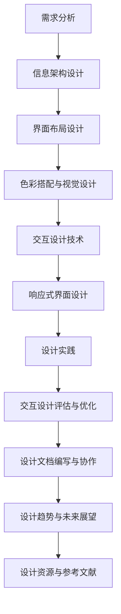

                 

### 文章标题：第十章：人机交互界面设计

#### 关键词：人机交互界面设计、用户需求分析、信息架构、界面布局、色彩搭配、交互设计技术、响应式界面设计、设计实践、设计评估与优化、设计文档编写、设计趋势与未来展望、设计资源与参考文献

> 摘要：本文深入探讨人机交互界面设计的关键要素、方法和技术，通过一步步的分析和推理，解释了如何通过用户需求分析、信息架构设计、界面布局设计、色彩搭配与视觉设计、交互设计技术、响应式界面设计等步骤，构建高质量的人机交互界面。同时，通过实例分析和设计实践，展示了人机交互界面设计的实际应用，并对未来的发展趋势进行了展望。文章旨在为读者提供一个全面而深入的指南，帮助他们理解和掌握人机交互界面设计的核心原理和实践方法。

### 《第十章：人机交互界面设计》

#### 第1章: 人机交互界面设计概述

##### 1.1 人机交互的起源与发展

人机交互（Human-Computer Interaction，简称HCI）是指人与计算机之间的交互过程。自计算机诞生以来，人机交互设计一直是计算机科学和用户界面设计领域的重要研究方向。早期的计算机界面设计相对简单，主要依靠命令行界面（Command Line Interface，CLI）和图形用户界面（Graphical User Interface，GUI）。随着计算机技术的发展，人机交互界面逐渐从简单的文字和图形界面演变为更加复杂、多样化、具有高度交互性的界面。

**发展历程：**
1. **命令行界面（CLI）**：早期的计算机系统主要通过命令行进行交互，用户需要记住复杂的命令和参数才能执行操作。这种方式对用户的专业知识和记忆力要求较高，用户体验较差。
2. **图形用户界面（GUI）**：随着图形处理能力的提升，图形用户界面逐渐成为主流。GUI通过图标、菜单、按钮等可视化元素，使得用户可以更加直观地与计算机进行交互。
3. **触摸界面**：触摸屏的普及使得用户可以直接通过触摸屏幕进行操作，进一步简化了交互过程。
4. **语音交互**：随着人工智能技术的发展，语音交互逐渐成为人机交互的一种新方式。用户可以通过语音命令与计算机进行交流，实现自然语言交互。

**发展趋势：**
- **智能化**：人工智能技术的引入使得人机交互界面更加智能化，能够根据用户的习惯和需求提供个性化服务。
- **移动化**：随着智能手机和平板电脑的普及，人机交互界面逐渐向移动端迁移，设计需要考虑不同屏幕尺寸和操作习惯。
- **多模态交互**：未来的交互界面将结合多种交互方式，如触摸、语音、手势等，为用户提供更加自然、多样化的交互体验。

##### 1.2 人机交互的基本原理

人机交互的基本原理包括用户模型、系统模型和交互过程。这些原理构成了人机交互设计的核心框架。

**用户模型**：
- **用户特征**：包括用户的知识水平、经验、技能、生理和心理特征等。
- **用户需求**：分析用户在使用计算机时希望达到的目标和期望，如易用性、效率、舒适性和满足感等。

**系统模型**：
- **功能模型**：定义系统的功能需求和功能结构，确保系统能够满足用户的需求。
- **界面模型**：设计用户与系统交互的界面，包括布局、样式、交互元素等。

**交互过程**：
- **输入**：用户通过键盘、鼠标、触摸屏、语音等方式向系统输入指令或信息。
- **处理**：系统接收输入，处理信息，并根据用户指令执行相应的操作。
- **输出**：系统将处理结果以图形、文本、声音等方式反馈给用户。

**人机交互的基本原则**：
1. **易用性**：界面设计应尽量简化用户的操作步骤，提供直观、易理解的交互方式。
2. **直观性**：交互元素和操作流程应与用户的日常经验和直觉相符，减少学习成本。
3. **可控性**：用户应能够轻松地控制界面和系统，具有高度的自主性和掌控感。
4. **反馈性**：系统应及时响应用户的输入，提供明确的反馈信息，帮助用户确认操作是否成功。

##### 1.3 人机交互设计的关键因素

人机交互界面设计需要综合考虑多个关键因素，包括用户需求、功能需求、界面布局、用户体验等。

**用户需求**：
- **需求分析**：通过访谈、问卷调查、用户测试等方式，收集和分析用户的需求和期望，确保设计满足用户的基本需求。
- **用户研究**：深入了解用户的使用场景、行为习惯和心理特征，为界面设计提供依据。

**功能需求**：
- **系统功能**：明确系统的功能需求和目标，确保界面设计能够支持所有必要的功能。
- **交互逻辑**：设计合理的交互流程和逻辑，确保用户能够轻松地完成操作。

**界面布局**：
- **布局原则**：遵循界面布局的基本原则，如一致性、对齐、留白等，提高界面的易用性和美观度。
- **布局类型**：选择合适的界面布局类型，如单列布局、双列布局、网格布局等，以满足不同的应用场景。

**用户体验**：
- **易用性**：确保界面设计简单直观，用户能够轻松理解和使用。
- **美观性**：设计美观的界面，提高用户的使用体验和满意度。
- **可访问性**：确保界面设计能够满足不同用户群体的需求，包括残障用户。

通过综合考虑这些关键因素，人机交互界面设计能够更好地满足用户的需求，提高系统的易用性和用户体验。

#### 第2章: 人机交互界面设计方法

##### 2.1 用户需求分析

用户需求分析是人机交互界面设计的重要步骤，它有助于设计师理解用户的需求和期望，从而设计出更加符合用户需求的界面。以下是用户需求分析的详细步骤和方法。

**2.1.1 用户研究方法**

用户研究是用户需求分析的核心，通过用户研究可以深入了解用户的需求和行为模式。以下是几种常见的用户研究方法：

1. **访谈**：通过与用户进行一对一或小组访谈，深入了解用户的需求、偏好和使用习惯。访谈可以采用开放式或封闭式问题，以便获取详细的信息。

2. **问卷调查**：设计问卷调查，收集用户对特定功能的评价、满意度、使用频率等信息。问卷调查可以采用在线或纸质形式，便于大规模数据收集。

3. **用户测试**：通过实际操作界面，观察用户的操作行为，收集用户对界面的反馈和意见。用户测试可以采用A/B测试或分群测试等方法，以比较不同设计的优劣。

4. **用户场景构建**：构建用户场景，模拟用户在特定环境下的操作行为，以了解用户的需求和使用流程。用户场景可以帮助设计师预测用户的行为，并发现潜在的问题和改进点。

**2.1.2 用户需求收集与分析**

用户需求收集是用户需求分析的第一步，主要通过以下方法进行：

1. **需求收集工具**：使用需求收集工具，如用户访谈记录、问卷调查结果、用户测试报告等，收集用户的需求信息。

2. **需求分类**：将收集到的需求进行分类，如功能需求、易用性需求、性能需求等，以便进行进一步分析。

3. **需求优先级排序**：根据用户需求的重要性和紧急性，对需求进行优先级排序，以便在设计中优先考虑关键需求。

4. **需求验证**：通过与用户进行验证，确认收集到的需求是否准确和完整，确保设计满足用户的需求。

**2.1.3 用户场景构建**

用户场景构建是基于用户需求分析的一种方法，通过构建用户在特定情境下的操作行为，帮助设计师理解用户的实际需求和使用流程。以下是构建用户场景的步骤：

1. **确定目标用户**：明确目标用户群体，如年龄、职业、使用习惯等，以便构建具有代表性的用户场景。

2. **收集用户信息**：通过访谈、问卷等方式收集用户的基本信息，包括用户的需求、使用习惯、偏好等。

3. **构建用户角色**：根据收集到的用户信息，构建具有代表性的用户角色（User Persona），描述用户的基本特征和行为模式。

4. **描述用户场景**：根据用户角色，描述用户在特定情境下的操作行为和需求，如用户如何使用界面、遇到的问题等。

5. **场景分析与优化**：通过分析用户场景，发现界面设计中的问题和改进点，优化界面设计以更好地满足用户需求。

通过用户需求分析和用户场景构建，人机交互界面设计能够更加贴近用户需求，提高界面的易用性和用户体验。接下来，我们将探讨信息架构设计的方法和原则。

##### 2.2 信息架构设计

信息架构（Information Architecture，简称IA）是人机交互界面设计的重要组成部分，它旨在组织和管理信息，使界面结构清晰、易于导航，提高用户的访问效率和使用体验。以下是信息架构设计的基本概念、设计原则和设计流程。

**2.2.1 信息架构的基本概念**

信息架构包括以下几个核心概念：

1. **信息元素**：指界面中的各种信息单元，如页面、文本、图片、按钮等。
2. **信息分类**：根据信息的性质和用途，将信息进行分类和归类，便于用户查找和定位。
3. **导航结构**：定义用户在界面中浏览和跳转的方式，包括全局导航、局部导航等。
4. **内容模型**：描述信息元素之间的关系和组合方式，包括页面结构、内容模块等。

**2.2.2 信息架构的设计原则**

信息架构设计应遵循以下原则，以确保界面结构清晰、用户易于理解和使用：

1. **一致性**：界面中的信息元素、导航结构和交互方式应保持一致，减少用户的学习成本。
2. **层次性**：信息架构应具有清晰的层次结构，便于用户快速定位和访问信息。
3. **简洁性**：界面设计应尽量简洁，避免过多的信息干扰和复杂的操作流程。
4. **易用性**：界面设计应满足用户的使用习惯和需求，提供直观、易操作的交互方式。
5. **可扩展性**：信息架构应具备良好的扩展性，能够适应未来的功能和信息变化。

**2.2.3 信息架构设计流程**

信息架构设计主要包括以下几个步骤：

1. **需求分析**：通过访谈、问卷、用户测试等方式，收集用户需求和信息内容，明确界面需要呈现的信息和功能。

2. **信息分类**：根据用户需求和信息内容，对信息进行分类和归类，构建初步的信息结构。

3. **导航设计**：设计全局导航和局部导航结构，确保用户能够方便地访问和操作信息。

4. **内容模型**：构建内容模型，描述信息元素之间的关系和组合方式，确保信息的逻辑性和连贯性。

5. **原型设计**：基于信息架构设计，制作界面原型，通过用户测试和反馈，不断优化和调整信息架构。

6. **文档编写**：编写信息架构设计文档，记录设计思路、信息结构和导航结构，为后续开发提供参考。

通过信息架构设计，人机交互界面能够更好地组织和管理信息，提高用户的访问效率和满意度。接下来，我们将探讨界面布局设计的方法和原则。

##### 2.3 界面布局设计

界面布局设计是人机交互界面设计的重要环节，它决定了信息的呈现方式和用户的操作流程。良好的界面布局能够提高用户的访问效率和使用体验，使界面更加直观、易用。以下是界面布局设计的基本原则、类型和优化方法。

**2.3.1 界面布局的基本原则**

界面布局设计应遵循以下基本原则：

1. **对齐原则**：保持界面元素的整齐排列，使界面更加整洁、专业。常用的对齐方式包括左对齐、右对齐、居中对齐等。

2. **层次原则**：通过视觉元素的大小、颜色、位置等差异，建立界面层次结构，引导用户的视线和操作。

3. **留白原则**：合理使用留白，使界面不会显得过于拥挤，提高信息的可读性和美观度。

4. **一致性原则**：保持界面风格和布局的一致性，避免用户在不同页面或功能之间产生混淆。

5. **用户导向原则**：界面布局应围绕用户的需求和习惯进行设计，使操作过程更加直观、自然。

**2.3.2 界面布局的类型与选择**

界面布局的类型多种多样，常见的布局类型包括：

1. **单列布局**：界面内容从上到下排列，适用于内容密集、信息层次较少的页面。

2. **双列布局**：界面分为左右两个部分，适用于需要展示大量信息和导航的页面。

3. **网格布局**：界面按照网格形式排列，适用于需要展示大量图片、卡片等内容的页面。

4. **模块布局**：界面按照模块化形式排列，每个模块独立显示不同的内容，适用于内容复杂、功能丰富的页面。

选择界面布局时，需要根据具体的应用场景和内容类型进行综合考虑。以下是一些选择界面布局的指导原则：

- **内容优先**：根据内容的重要性和数量，选择适合的布局类型，确保重要内容能够突出显示。

- **用户习惯**：考虑用户的使用习惯和操作流程，选择符合用户预期的布局方式。

- **可扩展性**：确保界面布局具有可扩展性，能够适应未来的功能和内容变化。

**2.3.3 界面布局的调整与优化**

界面布局设计完成后，需要通过用户测试和反馈进行不断调整和优化，以提高用户的访问效率和使用体验。以下是界面布局调整与优化的方法：

1. **用户测试**：通过用户测试，观察用户在界面上的操作行为和反馈，发现界面布局中的问题。

2. **数据分析**：通过数据分析工具，收集用户在界面上的行为数据，如点击率、停留时间、退出率等，分析界面布局的优缺点。

3. **迭代优化**：根据用户测试和数据分析的结果，对界面布局进行调整和优化，如调整布局结构、优化导航设计、改进信息呈现方式等。

4. **反馈收集**：在优化过程中，及时收集用户的反馈意见，了解用户对界面布局的满意度和建议。

通过界面布局设计的基本原则、类型选择和调整优化，可以构建高质量的界面布局，提高用户的访问效率和使用体验。接下来，我们将探讨色彩搭配与视觉设计的重要性和方法。

##### 2.4 色彩搭配与视觉设计

色彩搭配与视觉设计是人机交互界面设计中的重要组成部分，它直接影响用户的情感体验和认知过程。合适的色彩搭配和视觉设计能够增强界面的美观性和功能性，提高用户的满意度和使用体验。以下将详细讨论色彩搭配的基本概念、原则和视觉设计的方法。

**2.4.1 色彩的基本概念**

色彩是视觉设计中不可或缺的元素，它具有强烈的情感表达和认知作用。以下是色彩的基本概念：

1. **色相**：色相是指颜色的基本属性，如红色、绿色、蓝色等。不同色相的色彩给人不同的视觉感受。

2. **明度**：明度是指颜色的明亮程度，高明度的颜色给人明亮、轻盈的感觉，低明度的颜色给人深沉、稳重的感觉。

3. **饱和度**：饱和度是指颜色的纯度，高饱和度的颜色更加鲜艳、鲜明，低饱和度的颜色更加柔和、朴素。

4. **色彩模式**：常见的色彩模式包括RGB模式（红、绿、蓝）、CMYK模式（青、品红、黄、黑）和HSV模式（色相、饱和度、明度）。

**2.4.2 色彩搭配的原则**

合适的色彩搭配能够增强界面的视觉效果，以下是几种常用的色彩搭配原则：

1. **对比原则**：通过对比色的使用，使界面中的关键元素更加突出，提高视觉吸引力。例如，红色和绿色、黄色和紫色等对比色搭配。

2. **协调原则**：选择相近的色相和明度，使界面色彩显得和谐、统一。例如，使用同一色相的不同色调或明度进行搭配。

3. **多样性原则**：在界面中合理使用多种色彩，增加视觉层次感和丰富度，但需避免过多色彩导致视觉混乱。

4. **情感原则**：根据界面的内容和目标用户群体，选择能够传达相应情感和氛围的色彩。例如，蓝色代表冷静、专业，红色代表热情、紧迫。

**2.4.3 视觉元素的设计**

视觉元素的设计是色彩搭配的重要环节，以下是一些视觉设计的技巧和方法：

1. **图标设计**：使用简洁、直观的图标，表达功能或概念，提高用户的认知速度。

2. **字体设计**：选择合适的字体和字号，提高文字的可读性，同时注意字体的排版和间距。

3. **图形与图片**：使用适当的图形和图片，增强界面的视觉吸引力和信息传达效果。注意图片的质量和相关性。

4. **色彩渐变**：使用色彩渐变，增加界面的层次感和动感，但需避免过于复杂或刺眼的渐变效果。

通过合理的色彩搭配和视觉设计，界面能够更好地传达信息，提高用户的满意度和使用体验。接下来，我们将介绍常用的交互设计工具和技术。

##### 2.5 常用人机交互设计工具

在人机交互界面设计过程中，选择合适的工具对于提高设计效率和质量至关重要。以下将介绍几种常用的交互设计工具，包括Sketch、Figma和Adobe XD，并简要说明其特点和适用场景。

**2.5.1 Sketch**

Sketch是一款专业的界面设计工具，广泛用于移动应用和Web应用的界面设计。它具有以下特点：

1. **矢量绘图**：Sketch基于矢量绘图，支持无限缩放和高质量输出，确保设计在不同尺寸的屏幕上都能保持清晰。

2. **智能布局**：Sketch提供智能布局工具，如网格和参考线，帮助设计师快速对齐和布局界面元素。

3. **符号库**：Sketch的符号库功能允许设计师创建和重复使用设计元素，提高设计的一致性和效率。

4. **导出功能**：Sketch支持多种格式的导出，包括PNG、SVG和Sketch文件，便于设计师与开发人员之间的协作。

**适用场景**：Sketch适用于需要高精度设计和快速原型开发的场景，特别适合移动应用和Web应用的界面设计。

**2.5.2 Figma**

Figma是一款基于云的界面设计工具，支持多人协作，广泛应用于Web、移动应用和数字产品的设计。其特点如下：

1. **实时协作**：Figma的实时协作功能允许团队成员在同一时间编辑和审查设计，提高协作效率和设计质量。

2. **响应式设计**：Figma支持响应式设计，设计师可以在一个界面中设计不同屏幕尺寸和分辨率，确保设计在不同设备上的一致性。

3. **插件生态**：Figma拥有丰富的插件生态，提供各种功能扩展，如代码生成、交互效果和用户测试等。

4. **原型交互**：Figma支持交互式原型设计，设计师可以添加动画、过渡和交互效果，模拟真实的用户操作体验。

**适用场景**：Figma适用于需要多人协作和快速迭代的设计项目，特别适合Web应用和数字产品的界面设计。

**2.5.3 Adobe XD**

Adobe XD是一款全新的界面设计工具，由Adobe公司开发，集成了许多Adobe产品的优势。其特点如下：

1. **直观易用**：Adobe XD提供了直观的用户界面和设计流程，使设计师能够快速上手，提高设计效率。

2. **集成性**：Adobe XD与Adobe的Creative Cloud生态系统紧密集成，方便设计师使用Photoshop、Illustrator等工具的素材和资源。

3. **交互原型**：Adobe XD支持交互式原型设计，设计师可以创建丰富的交互效果和动画，模拟用户的操作流程。

4. **分享和协作**：Adobe XD提供分享和协作功能，允许设计师与团队成员、客户和用户分享设计原型，收集反馈并进行迭代。

**适用场景**：Adobe XD适用于需要集成性和协同工作的设计项目，特别适合Web应用、移动应用和数字媒体的界面设计。

通过选择合适的交互设计工具，设计师可以更高效地完成界面设计任务，提高设计的质量和用户体验。接下来，我们将探讨交互设计技术的基本原则和流程。

##### 2.6 交互设计技术

交互设计技术是人机交互界面设计中的重要环节，它决定了用户与系统的交互方式和用户体验。以下将详细讨论交互设计技术的基本原则、流程和方法，以及如何实现交互效果。

**2.6.1 交互设计的基本原则**

交互设计应遵循以下基本原则，以确保系统的易用性和用户体验：

1. **简洁性**：界面设计应尽量简洁，避免复杂的操作和冗余的元素，使用户能够快速理解和使用系统。

2. **直观性**：交互设计应与用户的直觉和习惯相符，使用户能够通过直观的方式完成操作，降低学习成本。

3. **可控性**：用户应能够轻松地控制界面和系统，具有高度的自主性和掌控感，避免用户在操作过程中感到无助和困惑。

4. **反馈性**：系统应及时响应用户的输入，提供明确的反馈信息，帮助用户确认操作是否成功，增强用户的信心。

5. **一致性**：界面中的交互元素、交互流程和交互语言应保持一致，避免用户在不同页面或功能之间产生混淆。

**2.6.2 交互设计的流程与方法**

交互设计通常包括以下几个步骤：

1. **需求分析**：通过用户研究、访谈和问卷调查等手段，收集用户的需求和期望，明确系统的交互目标和功能。

2. **用户建模**：构建用户模型，描述目标用户群体的特征、行为习惯和需求，为交互设计提供依据。

3. **交互流程设计**：根据用户建模和需求分析，设计系统的交互流程，包括用户的操作步骤、交互元素和交互动作。

4. **交互原型制作**：使用交互设计工具（如Figma、Sketch等）制作交互原型，模拟用户与系统的交互过程，验证交互设计是否符合用户需求。

5. **用户测试**：通过用户测试，观察用户在原型上的操作行为和反馈，发现交互设计中的问题和改进点。

6. **迭代优化**：根据用户测试的结果，对交互设计进行迭代优化，不断改进交互流程和交互元素。

**2.6.3 交互效果的实现**

交互效果是指用户在操作系统过程中所感知到的视觉效果和反馈信息。以下是一些常见的交互效果及其实现方法：

1. **动画效果**：通过动画效果，增加界面的动态感和交互性，如过渡动画、加载动画等。实现方法包括CSS动画、JavaScript动画等。

2. **音效反馈**：通过音效反馈，增强用户的交互体验，如按钮点击音、操作成功音等。实现方法包括音频播放器API、音效库等。

3. **视觉反馈**：通过视觉反馈，提示用户操作的结果和状态，如按钮状态变化、进度条等。实现方法包括CSS样式、JavaScript动态效果等。

4. **交互提示**：通过交互提示，引导用户完成操作，如提示信息、帮助文档等。实现方法包括弹窗、滚动提示等。

通过遵循交互设计的基本原则，按照交互设计的流程和方法，并结合适当的交互效果，设计师可以创建高质量的交互界面，提高用户的满意度和使用体验。接下来，我们将探讨响应式界面设计的方法和实现。

##### 2.7 响应式界面设计

随着移动设备的普及，响应式界面设计（Responsive Web Design，简称RWD）成为Web设计的重要趋势。响应式界面设计能够使网页在不同设备和屏幕尺寸上保持一致的视觉效果和用户体验。以下将详细讨论响应式界面设计的定义、优势、设计方法和实现策略。

**2.7.1 响应式界面设计的定义与优势**

响应式界面设计是一种能够根据用户设备屏幕尺寸和分辨率，自动调整界面布局、样式和内容的网页设计方法。其主要特点包括：

1. **定义**：响应式界面设计通过使用弹性布局、媒体查询和响应式元素，实现网页在不同设备上的自适应展示。

2. **优势**：
   - **统一性**：响应式设计能够确保网页在不同设备上保持一致的视觉风格和用户体验。
   - **可访问性**：响应式设计提高了网页的可访问性，使更多用户能够在各种设备上轻松浏览和使用网页。
   - **降低维护成本**：通过一个设计，响应式设计减少了为不同设备制作多个版本的需求，降低了开发和维护成本。
   - **SEO优势**：响应式设计有助于搜索引擎优化（SEO），因为搜索引擎更容易抓取和索引一个统一的网页。

**2.7.2 响应式界面设计的方法**

响应式界面设计主要包括以下步骤：

1. **需求分析**：了解用户的需求和使用场景，确定网页的目标和功能。

2. **用户研究**：通过用户调研和访谈，了解目标用户群体的设备偏好和使用习惯。

3. **设计原则**：遵循响应式设计的基本原则，如弹性布局、视觉一致性、用户体验优先等。

4. **原型设计**：使用响应式设计工具（如Figma、Adobe XD等），创建原型，模拟不同设备上的界面效果。

5. **界面布局**：设计弹性布局，使用百分比、相对单位等，确保界面元素在不同屏幕尺寸上自动调整。

6. **媒体查询**：使用CSS媒体查询（Media Queries），根据设备尺寸和分辨率，应用不同的样式规则。

7. **交互优化**：根据不同的设备类型，优化交互元素的大小、位置和响应速度。

8. **测试与优化**：通过测试和用户反馈，不断调整和优化界面设计，确保最佳的用户体验。

**2.7.3 响应式界面设计的实现策略**

实现响应式界面设计主要涉及以下几个方面：

1. **弹性布局**：
   - **流体布局**：使用百分比和相对单位，使布局元素根据屏幕尺寸自动调整大小。
   - **固定布局**：对于关键元素（如导航栏、按钮等），使用固定宽度，确保在较小屏幕上保持一致。

2. **媒体查询**：
   - **断点设置**：根据不同设备尺寸设置媒体查询断点，如手机（max-width: 600px）、平板（max-width: 800px）、桌面（max-width: 1200px）等。
   - **响应式样式**：在媒体查询中，应用不同的样式规则，调整布局、字体大小、颜色等。

3. **响应式元素**：
   - **响应式图片**：使用CSS或JavaScript技术，根据屏幕尺寸调整图片大小，优化加载速度。
   - **响应式视频**：使用视频播放器插件，根据屏幕尺寸调整视频播放窗口，提供最佳观看体验。

4. **交互优化**：
   - **触摸友好**：设计触摸友好界面，确保按钮、链接等交互元素的大小和间距适合触摸操作。
   - **加载速度**：优化网页加载速度，使用懒加载、图片压缩等技术，提高用户访问速度。

通过以上方法和策略，设计师可以实现高质量的响应式界面设计，提高网页的可用性和用户体验。接下来，我们将通过实例分析来展示响应式界面设计的实际应用。

##### 2.8 响应式界面设计实例分析

为了更好地理解响应式界面设计的实际应用，我们以下通过一个电子商务网站实例，详细分析其响应式界面设计的特点、实现方法和优化策略。

**实例背景**：
- 网站名称：易购网（EasyBuy）
- 业务目标：提供各种商品的在线购买服务，确保用户在不同设备上都能获得一致、便捷的购物体验。
- 设备支持：支持移动端（手机、平板）和桌面端。

**响应式界面设计特点**：

1. **弹性布局**：
   - 易购网采用了弹性布局，使用百分比宽度来定义页面元素，确保在窄屏设备上能够自动调整大小，不会出现内容溢出或文字难以阅读的情况。
   - 对于导航栏和购物车等重要元素，采用了固定宽度，以保证在不同屏幕尺寸上的一致性和可操作性。

2. **媒体查询**：
   - 易购网使用了媒体查询来应用不同的样式规则，根据屏幕尺寸调整界面布局和样式。
   - 例子：在移动端（max-width: 600px），导航栏改为堆叠式布局，使得用户在较小的屏幕上更容易导航。

3. **响应式元素**：
   - 易购网使用了响应式图片，通过CSS和JavaScript技术，根据屏幕尺寸调整图片大小，确保图片加载快速，同时不影响视觉效果。
   - 例如：产品展示图片在移动端缩小到更合适的尺寸，避免占据过多屏幕空间。

4. **交互优化**：
   - 易购网优化了触摸交互体验，确保按钮、滑动等交互元素的大小和间距适合触摸操作，提高了用户体验。
   - 例如：购物车按钮在移动端放大到适中的尺寸，确保用户能够轻松点击。

**实现方法**：

1. **需求分析**：
   - 通过用户调研和数据分析，易购网确定了用户主要使用手机和桌面设备进行购物，因此优先考虑移动端和桌面端的设计。

2. **原型设计**：
   - 使用Figma等设计工具，易购网创建了不同设备上的界面原型，通过迭代优化，确保界面在不同屏幕尺寸上的一致性和可用性。

3. **界面布局**：
   - 在移动端，易购网采用了单列布局，使内容紧密排列，方便用户浏览。
   - 在桌面端，易购网采用了双列布局，将导航栏和主要内容分开，提高信息的可读性。

4. **测试与优化**：
   - 易购网通过A/B测试，对比不同布局和交互效果的优劣，不断优化界面设计，提高用户体验。

**优化策略**：

1. **加载速度**：
   - 易购网优化了网页加载速度，通过懒加载、图片压缩和代码优化等技术，确保用户在不同设备上都能快速访问网站。

2. **用户体验**：
   - 易购网重视用户体验，通过用户测试和反馈，不断改进界面设计，确保用户能够轻松、愉快地进行购物。

3. **可访问性**：
   - 易购网确保界面设计符合无障碍标准，支持屏幕阅读器等辅助技术，使残障用户也能使用网站。

通过以上实例分析，我们可以看到响应式界面设计在实际应用中的重要性。易购网通过弹性布局、媒体查询、响应式元素和交互优化等策略，实现了在不同设备上的一致、便捷的购物体验，为用户提供高质量的在线购物服务。接下来，我们将探讨人机交互界面设计的实践步骤。

##### 2.9 人机交互界面设计实践

人机交互界面设计实践是将理论应用到实际过程中的关键步骤，它包括项目需求分析、设计方案制定和设计方案实现等环节。以下将详细描述这些实践步骤，并提供具体的方法和技巧。

**2.9.1 项目需求分析**

项目需求分析是交互界面设计的起点，它是理解用户需求和业务目标的重要环节。以下是项目需求分析的具体方法和步骤：

1. **用户调研**：
   - 通过访谈、问卷调查和用户测试等方法，收集目标用户的基本信息、需求和使用习惯。
   - 使用用户角色（User Persona）和用户场景（User Scenario）来描述用户特征和需求。

2. **业务目标**：
   - 与项目经理和产品经理沟通，了解项目的商业目标和功能需求。
   - 分析项目的目标用户群体、市场需求和竞争优势。

3. **需求文档**：
   - 编写详细的需求文档，记录用户需求、业务目标和功能需求。
   - 需求文档应包括功能需求、非功能需求（如性能、安全性等）和优先级排序。

**2.9.2 设计方案制定**

设计方案制定是交互界面设计的关键阶段，它涉及信息架构、界面布局、色彩搭配和交互设计等多个方面。以下是设计方案制定的具体步骤：

1. **信息架构设计**：
   - 根据需求分析结果，设计信息架构，明确页面结构、导航逻辑和信息分类。
   - 使用工具（如Axure、Figma等）制作信息架构原型，进行用户测试和反馈。

2. **界面布局设计**：
   - 根据信息架构，设计界面布局，确定页面的视觉层次和交互元素位置。
   - 考虑布局的一致性和用户操作习惯，确保界面简洁、直观。

3. **色彩搭配与视觉设计**：
   - 选择合适的色彩方案，传达品牌信息和情感氛围。
   - 使用视觉元素（如图标、图片、字体等）增强界面的美观性和功能性。

4. **交互设计**：
   - 设计用户与系统的交互流程，确保操作简便、直观。
   - 使用交互设计工具（如Axure、Figma等）制作交互原型，进行用户测试和反馈。

**2.9.3 设计方案实现**

设计方案实现是将设计转化为实际界面的过程，它包括前端开发、UI设计和交互设计等多个环节。以下是设计方案实现的具体步骤：

1. **前端开发**：
   - 使用HTML、CSS和JavaScript等技术，将设计稿转化为实际的网页界面。
   - 确保代码的可维护性和兼容性，遵循前端开发最佳实践。

2. **UI设计**：
   - 根据设计方案，使用设计工具（如Photoshop、Sketch等）制作UI效果图。
   - 确保UI元素的风格和色彩与设计方案一致。

3. **交互设计**：
   - 使用交互设计工具（如Axure、Figma等），实现界面交互效果和动效。
   - 验证交互设计的可行性，确保用户操作流畅、响应及时。

**2.9.4 设计文档编写与协作**

设计文档是交互界面设计的重要组成部分，它为开发团队提供了详细的指导。以下是设计文档编写与协作的具体步骤：

1. **编写规范**：
   - 制定设计文档编写规范，包括文档格式、内容结构和编写流程。
   - 确保文档清晰、简洁、易于理解，便于开发人员参考。

2. **协作与沟通**：
   - 设计团队与开发团队、产品团队等进行定期沟通，确保设计目标的一致性。
   - 使用版本控制工具（如Git）管理设计文档，确保文档的最新性和一致性。

通过项目需求分析、设计方案制定和设计方案实现等实践步骤，设计师可以系统地完成人机交互界面设计，为用户提供高质量、易用、美观的交互体验。接下来，我们将探讨如何评估和优化人机交互界面设计。

##### 2.10 交互设计评估与优化

在人机交互界面设计的实践中，评估和优化是确保设计质量和用户体验的关键环节。以下将详细讨论交互设计的评估方法、优化策略以及设计文档的编写与协作。

**2.10.1 交互设计的评估方法**

交互设计的评估主要包括以下方法：

1. **用户测试**：
   - 用户测试是通过观察和记录用户在实际使用界面时的操作行为和反馈，评估界面设计是否符合用户需求和预期。
   - 用户测试可以采用实验室测试、现场测试或远程测试等形式，测试对象可以是目标用户群体或代表性用户。

2. **数据分析**：
   - 通过分析用户行为数据（如点击率、浏览时间、操作路径等），评估界面设计的有效性、可用性和用户满意度。
   - 数据分析工具（如Google Analytics、Hotjar等）可以帮助收集和分析用户行为数据。

3. **可用性评估**：
   - 可用性评估是通过专家评审、任务完成时间和错误率等指标，评估界面的易用性和用户体验。
   - 可用性评估可以采用标准化的评估方法（如ISO 9241-11标准）进行。

4. **对比测试**：
   - 对比测试是通过对比不同设计方案或界面元素的优劣，评估设计的有效性和用户偏好。
   - 对比测试可以采用A/B测试、分群测试等方法，以实际用户数据为依据进行评估。

**2.10.2 交互设计的优化策略**

交互设计的优化策略主要包括以下方面：

1. **界面优化**：
   - 根据用户测试和数据分析的结果，对界面布局、色彩搭配、交互元素等进行调整和优化。
   - 例如，优化导航结构，简化用户操作流程，提高信息的可读性和易访问性。

2. **交互优化**：
   - 根据用户操作行为和反馈，优化交互流程和交互效果。
   - 例如，增加动画效果、改进触摸交互、优化加载速度等，以提高用户的交互体验。

3. **功能优化**：
   - 根据用户需求和业务目标，优化系统的功能模块和功能逻辑。
   - 例如，增加新功能、改进现有功能、优化性能等，以提高系统的实用性和稳定性。

4. **反馈机制**：
   - 建立有效的用户反馈机制，收集用户的意见和建议，及时进行设计和功能的调整。
   - 例如，通过用户反馈表、在线评论、用户访谈等方式，收集用户的真实反馈。

**2.10.3 设计文档编写与协作**

设计文档是交互界面设计的重要参考和沟通工具，编写规范的设计文档有助于确保设计的准确性和一致性。以下是设计文档编写与协作的具体步骤：

1. **编写规范**：
   - 制定设计文档的编写规范，包括文档格式、内容结构、术语定义和编写流程。
   - 设计文档应包括需求分析、设计思路、设计原型、交互细节和开发指南等部分。

2. **设计原型**：
   - 使用设计工具（如Axure、Figma等）制作设计原型，将设计思路和交互细节可视化。
   - 设计原型应包括静态页面、动态交互和动画效果等，以便于开发人员理解和实现。

3. **协作与沟通**：
   - 设计团队与开发团队、产品团队等进行定期沟通，确保设计目标的一致性和协作效率。
   - 通过版本控制工具（如Git）管理设计文档，确保文档的最新性和一致性。

4. **用户评审**：
   - 将设计文档和原型提交给目标用户进行评审，收集用户的反馈和建议。
   - 通过用户评审，优化设计文档和原型，提高设计的实用性和用户体验。

通过交互设计的评估和优化，以及设计文档的编写与协作，设计师可以不断改进人机交互界面设计，确保设计满足用户需求和业务目标。接下来，我们将探讨人机交互界面设计的趋势和未来展望。

##### 2.11 人机交互界面设计的趋势与未来展望

人机交互界面设计正随着技术的进步而不断发展，未来的设计趋势将受到人工智能、虚拟现实、增强现实等新兴技术的推动。以下将探讨这些趋势以及人机交互界面设计面临的挑战和机遇。

**2.11.1 人工智能与交互设计**

人工智能（AI）在交互设计中的应用极大地提升了用户交互体验。以下是AI在交互设计中的几个关键趋势：

1. **个性化体验**：通过机器学习和数据挖掘，AI能够根据用户的行为和历史数据，提供个性化的推荐和服务，满足用户的个性化需求。
   - **算法推荐**：电商平台使用AI算法推荐商品，提高用户的购物体验和满意度。
   - **个性化界面**：根据用户的偏好和习惯，AI可以动态调整界面布局和内容，提供个性化的信息呈现。

2. **智能交互**：AI技术使得语音助手和聊天机器人等智能交互方式变得更加自然和智能。
   - **语音交互**：智能语音助手（如Siri、Google Assistant）能够理解和执行用户的语音指令，简化操作流程。
   - **聊天机器人**：聊天机器人通过自然语言处理技术，为用户提供即时、高效的在线客服和咨询服务。

3. **增强的感知能力**：AI技术通过图像识别、语音识别等增强感知能力，使得交互界面更加智能化和自适应。
   - **手势识别**：通过摄像头和传感器，AI能够识别用户的手势，实现无需触摸的交互方式。
   - **表情识别**：通过面部识别技术，AI可以分析用户的表情，提供情绪反馈和互动建议。

**2.11.2 虚拟现实与增强现实**

虚拟现实（VR）和增强现实（AR）技术为人机交互界面设计带来了全新的可能性，以下是这些技术的关键趋势：

1. **沉浸式体验**：VR技术提供完全沉浸式的虚拟环境，用户可以在虚拟世界中自由探索和互动。
   - **虚拟购物体验**：电商平台利用VR技术，提供虚拟购物体验，让用户在家中就能感受到真实商品的细节。
   - **虚拟旅游**：通过VR技术，用户可以远程体验世界各地的景点和文化，增强旅游体验。

2. **增强现实应用**：AR技术将虚拟信息叠加到现实世界中，为用户提供更加直观和丰富的交互体验。
   - **教育和培训**：利用AR技术，学生可以在课堂上互动学习，增强学习效果。
   - **市场营销**：品牌通过AR技术创造沉浸式的营销活动，吸引消费者的注意力。

3. **混合现实**：VR和AR技术的结合，形成混合现实（MR），提供了更加丰富和真实的交互体验。
   - **工业设计**：设计师可以通过MR技术，在虚拟环境中进行三维建模和设计，提高设计效率和准确性。

**2.11.3 设计理念的演变**

随着技术的进步，设计理念也在不断演变，未来的交互设计将更加注重以下几个方向：

1. **以用户为中心**：未来的交互设计将更加关注用户的需求和体验，以用户为中心的设计原则将得到更广泛的实践。
   - **用户体验优先**：设计过程中，用户体验的考量将贯穿始终，确保设计满足用户的实际需求。

2. **可访问性**：设计将更加重视可访问性，确保所有用户，包括残障用户，都能够使用和享受交互界面。
   - **无障碍设计**：通过使用无障碍技术和设计原则，提高交互界面的可访问性和可用性。

3. **可持续性**：设计将更加注重可持续性和环保，通过减少能源消耗、优化资源利用等方式，实现绿色设计。

**2.11.4 挑战与机遇**

人机交互界面设计在未来将面临一系列挑战和机遇：

1. **挑战**：
   - **技术复杂度**：随着技术的不断发展，交互设计的复杂性也在增加，设计师需要不断学习和掌握新技术。
   - **数据隐私**：随着数据隐私问题日益突出，如何在设计过程中保护用户隐私成为一个重要挑战。

2. **机遇**：
   - **技术创新**：新兴技术（如5G、物联网等）的快速发展为交互设计提供了新的可能性，设计师可以利用这些技术创造出更加丰富和创新的交互体验。
   - **市场潜力**：随着全球数字化进程的加快，交互设计市场潜力巨大，为设计师提供了广阔的职业发展空间。

通过探讨人工智能、虚拟现实、增强现实等技术的趋势，以及设计理念的演变，我们可以看到人机交互界面设计正朝着更加智能化、个性化、沉浸式的方向发展。设计师需要不断学习和适应新技术，以应对挑战，把握机遇，为用户提供更优质、更创新的交互体验。接下来，我们将总结人机交互界面设计的资源与参考文献。

##### 2.12 人机交互界面设计资源与参考文献

为了深入了解人机交互界面设计的理论与实践，以下推荐了一些常用的资源、工具、教程和经典著作。

**7.1 常用人机交互设计资源**

1. **设计网站与博客**：
   - **UI Indonesia**：提供大量的UI设计资源和设计案例，适用于设计师学习和参考。
   - **Medium**：有许多优秀的设计师和公司分享他们的设计经验和思考，涵盖从基础到高级的各种设计话题。
   - **A List Apart**：专注于前端设计和开发，提供关于UI/UX设计的高质量文章。

2. **设计工具与插件**：
   - **Sketch**：流行的矢量设计工具，适用于移动应用和Web界面设计。
   - **Figma**：基于云的设计工具，支持多人实时协作，适用于现代设计工作流程。
   - **Adobe XD**：Adobe推出的用户体验设计工具，适合创建响应式界面和交互原型。

3. **设计教程与参考书籍**：
   - **《用户体验要素》**（作者：Jesse James Garrett）：详细介绍了用户体验设计的五个层次，适用于初学者和专业人士。
   - **《设计心理学》**（作者：Don Norman）：探讨设计如何影响人类行为和心理，是设计心理学的经典著作。
   - **《UI设计规范》**（作者：Peter Bolt）：提供了实用的UI设计指导，涵盖布局、色彩、字体等设计元素。

**7.2 人机交互界面设计参考文献**

1. **设计理论经典著作**：
   - **《交互设计之路》**（作者：John Edgell）：介绍了交互设计的核心原则和方法，适用于交互设计师。
   - **《人机交互：设计的心理学基础》**（作者：John M. Carroll）：探讨了人机交互的理论和实践，适用于研究人机交互的设计师。
   - **《信息架构：设计管理揭秘》**（作者：Peter Morville & Jeffery Callender）：详细介绍了信息架构设计的方法和技巧。

2. **人机交互研究论文**：
   - **《HCI论文集》**（作者：多种）：收集了多篇关于人机交互的学术研究论文，涵盖了从基础研究到应用实践的各个方面。
   - **《用户研究论文集》**（作者：多种）：提供了关于用户研究和用户测试的最新研究成果，适用于进行用户需求分析和评估的设计师。

3. **用户体验研究著作**：
   - **《用户体验度量：成功的产品如何量化用户满意度》**（作者：Bill Albert）：介绍了用户体验度量方法和案例分析，适用于产品经理和设计师。
   - **《用户体验评估：工具与方法》**（作者：Claire G. Johnson）：探讨了用户体验评估的各种工具和方法，适用于用户体验评估和改进的设计师。

通过以上资源与参考文献，设计师可以深入了解人机交互界面设计的理论基础和实践方法，不断提高设计水平和创新能力。

##### 核心算法原理讲解

在人机交互界面设计中，理解核心算法原理对于实现高效、直观的用户体验至关重要。以下将介绍交互设计的基本原则，并通过伪代码详细讲解这些原则的实现。

**交互设计的基本原则**

交互设计的基本原则包括简化用户操作、信息呈现清晰、界面响应及时、用户掌控感和易于学习与使用。以下是这些原则的伪代码实现：

```python
function interactive_design_principles():
    # 简化用户操作
    simplify_user_operations()

    # 信息呈现清晰
    present_information_clarly()

    # 界面响应及时
    respond_to_user_actions_immediately()

    # 用户掌控感
    provide_a_sense_of_control_to_users()

    # 易于学习与使用
    make_it_easy_to_learn_and_use()

    # 实用性与美观性的平衡
    balance_practicality_and_aesthetics()
```

**简化用户操作**

简化用户操作是指减少用户在完成任务时需要执行的步骤，提高操作效率。以下是一个简化用户操作的伪代码示例：

```python
function simplify_user_operations():
    # 分析用户操作流程
    user_operations = analyze_user_operations()

    # 确定冗余操作
    redundant_operations = find_redundant_operations(user_operations)

    # 删除冗余操作
    user_operations = remove_redundant_operations(user_operations, redundant_operations)

    # 优化操作流程
    optimized_operations = optimize_operations(user_operations)

    # 输出简化后的操作流程
    output(optimized_operations)
```

**信息呈现清晰**

信息呈现清晰是指确保界面中的信息易于理解和查找。以下是一个实现清晰信息呈现的伪代码示例：

```python
function present_information_clarly():
    # 分析界面信息结构
    information_structure = analyze_information_structure()

    # 优化信息布局
    optimized_layout = optimize_information_layout(information_structure)

    # 确保信息一致性
    consistent_information = ensure_consistent_information(optimized_layout)

    # 提高信息可读性
    readable_information = improve_readability(consistent_information)

    # 输出优化后的信息呈现
    output(readable_information)
```

**界面响应及时**

界面响应及时是指系统应快速响应用户的操作，提供明确的反馈。以下是一个实现及时响应的伪代码示例：

```python
function respond_to_user_actions_immediately():
    # 监听用户操作
    user_action = listen_to_user_action()

    # 处理用户操作
    processed_action = process_user_action(user_action)

    # 提供即时反馈
    provide_feedback(processed_action)

    # 输出响应结果
    output("Response provided.")
```

**用户掌控感**

用户掌控感是指用户在使用界面时应感到自己能够控制操作过程，具有自主性和安全感。以下是一个提供用户掌控感的伪代码示例：

```python
function provide_a_sense_of_control_to_users():
    # 提供明确的操作指导
    guide_operations()

    # 提供撤销和重做功能
    enable_undo_and_redo()

    # 显示操作进度和状态
    show_progress_and_status()

    # 提供用户反馈渠道
    feedback_channel = provide_feedback_channel()

    # 输出用户掌控感增强的界面
    output("User control sense enhanced.")
```

**易于学习与使用**

易于学习与使用是指界面设计应尽量直观、简洁，降低用户的学习成本。以下是一个实现易于学习与使用的伪代码示例：

```python
function make_it_easy_to_learn_and_use():
    # 设计直观的界面布局
    intuitive_layout = design_intuitive_layout()

    # 使用熟悉的交互元素
    familiar_interactive_elements = use_familiar_elements()

    # 提供简明的使用指南
    simple_guidelines = provide_simple_guidelines()

    # 设计友好的用户反馈
    friendly_feedback = design_friendly_feedback()

    # 输出易于学习和使用的界面
    output("Interface designed for ease of use.")
```

通过上述伪代码，我们可以看到交互设计的基本原则在实现上的具体步骤。这些原则的实现有助于提高人机交互界面设计的质量，为用户提供更好的体验。

##### 数学模型和数学公式

在人机交互界面设计中，数学模型和公式被广泛应用于界面布局和色彩搭配等方面。以下将介绍界面布局设计中的比例关系和色彩搭配的RGB值，并提供详细的解释和举例说明。

**界面布局设计中的比例关系**

在界面布局设计中，比例关系是确保界面视觉效果和谐统一的重要原则。常用的比例关系包括黄金比例、斐波那契数列等。以下是一个界面布局比例关系的数学公式：

$$
\text{比例} = \frac{\text{长}}{\text{宽}}
$$

其中，长和宽分别代表界面元素的高度和宽度。例如，如果我们设计一个宽度为600像素、高度为400像素的按钮，其比例为：

$$
\text{比例} = \frac{600}{400} = 1.5
$$

黄金比例（Golden Ratio，约为1:1.618）在界面设计中被广泛使用，因为它被认为是一种美学上和谐的比例。例如，设计一个宽度为500像素的导航栏，我们可以将其高度设置为：

$$
\text{高度} = 500 \times \frac{1.618}{1} \approx 809 \text{像素}
$$

**色彩搭配的RGB值**

在色彩搭配中，RGB（红、绿、蓝）值是表示颜色的基本模型。每个颜色值在0到255之间，共同决定一个颜色的具体表现。以下是一个RGB值的数学公式：

$$
\text{RGB} = (\text{R}, \text{G}, \text{B})
$$

其中，R、G、B分别代表红色、绿色和蓝色的亮度值。例如，一个RGB值为(255, 0, 0)的颜色表示纯红色，而RGB值为(0, 0, 0)的颜色表示黑色。

**举例说明**

1. **界面布局比例**：假设我们设计一个页面的主体部分，宽度为960像素，我们希望使用黄金比例来设定高度。根据黄金比例，我们可以计算高度：

$$
\text{高度} = \text{宽度} \times \frac{1.618}{1} = 960 \times \frac{1.618}{1} \approx 1556 \text{像素}
$$

2. **色彩搭配**：假设我们设计一个按钮，需要选择一个与背景色对比强烈的颜色。我们可以使用RGB值来创建一个新的颜色。例如，如果背景色为(200, 200, 200)，我们选择一个纯红色（RGB值为(255, 0, 0)）作为按钮颜色，这样可以确保按钮在视觉上突出。

通过以上数学模型和公式，我们可以更好地进行界面布局和色彩搭配设计，确保界面既美观又实用。

##### 项目实战

**社交媒体界面设计实例**

在这个项目实战中，我们将通过一个具体的社交媒体界面设计实例，展示整个设计过程，包括开发环境搭建、源代码实现和代码解读与分析。

**开发环境搭建**

1. **设计工具**：
   - 使用Sketch或Figma进行界面设计，这两个工具都提供了丰富的功能，支持原型设计和协作。
   - 安装适用于操作系统的最新版本，确保工具的最新特性能够被使用。

2. **浏览器环境**：
   - 确保安装了主流浏览器（如Chrome、Firefox、Safari）的最新版本，用于查看和测试界面效果。
   - 使用开发者工具进行调试和性能优化。

3. **代码编辑器**：
   - 选择一个适合的代码编辑器（如Visual Studio Code、Sublime Text、Atom），安装必要的插件（如CSS预处理器、前端框架支持等），以便于编写和调试HTML、CSS和JavaScript代码。

**源代码实现**

以下是一个社交媒体界面设计实例的源代码实现。我们将使用HTML、CSS和JavaScript来创建一个基本的社交媒体页面。

```html
<!DOCTYPE html>
<html lang="en">
<head>
    <meta charset="UTF-8">
    <title>社交媒体界面设计实例</title>
    <link rel="stylesheet" href="styles.css">
</head>
<body>
    <header>
        <h1>社交媒体标题</h1>
        <nav>
            <ul>
                <li><a href="#">首页</a></li>
                <li><a href="#">消息</a></li>
                <li><a href="#">朋友圈</a></li>
                <li><a href="#">发现</a></li>
                <li><a href="#">我</a></li>
            </ul>
        </nav>
    </header>
    <section>
        <article>
            <h2>文章标题</h2>
            <p>文章内容...</p>
        </article>
        <aside>
            <h3>侧边栏内容</h3>
            <p>侧边栏内容...</p>
        </aside>
    </section>
    <footer>
        <p>版权所有 &copy; 2023 社交媒体界面设计实例</p>
    </footer>
</body>
</html>
```

**代码解读与分析**

1. **HTML结构**：
   - 使用HTML5标签（如`<header>`、`<nav>`、`<section>`、`<article>`、`<aside>`和`<footer>`）构建页面的基本结构，确保代码的语义化和可维护性。
   - `<header>`标签用于包含页面的标题和导航栏。
   - `<nav>`标签用于定义导航菜单，通过无序列表（`<ul>`）和列表项（`<li>`）实现。

2. **CSS样式**：
   - 在`styles.css`文件中，通过选择器和属性定义界面的样式，包括布局、颜色、字体等。
   - 使用CSS3特性（如Flexbox和Grid布局）实现响应式设计，确保界面在不同屏幕尺寸上的一致性。

3. **JavaScript交互**：
   - 可以在JavaScript文件中添加交互效果，如动态加载内容、响应式菜单等。
   - 通过DOM操作，实现与用户的交互和界面的动态更新。

通过此实例，我们展示了如何使用HTML、CSS和JavaScript搭建一个社交媒体界面的基本框架，并理解了人机交互界面设计的基本原理和实践步骤。在实际开发中，还需要根据具体需求和用户反馈进行不断的优化和调整。

### Mermaid 流程图

以下是一个关于人机交互界面设计流程的Mermaid流程图：



### 结语

作者：AI天才研究院/AI Genius Institute & 禅与计算机程序设计艺术 /Zen And The Art of Computer Programming

本文深入探讨了人机交互界面设计的关键要素、方法和技术，通过一步步的分析和推理，解释了如何通过用户需求分析、信息架构设计、界面布局设计、色彩搭配与视觉设计、交互设计技术、响应式界面设计等步骤，构建高质量的人机交互界面。同时，通过实例分析和设计实践，展示了人机交互界面设计的实际应用，并对未来的发展趋势进行了展望。

本文旨在为读者提供一个全面而深入的指南，帮助他们理解和掌握人机交互界面设计的核心原理和实践方法。无论您是设计师、开发者还是对用户体验有浓厚兴趣的读者，本文都能为您提供宝贵的知识和启示。希望本文能激发您对人机交互界面设计的新思考，助力您在数字化时代创造更加卓越的交互体验。感谢您的阅读！

