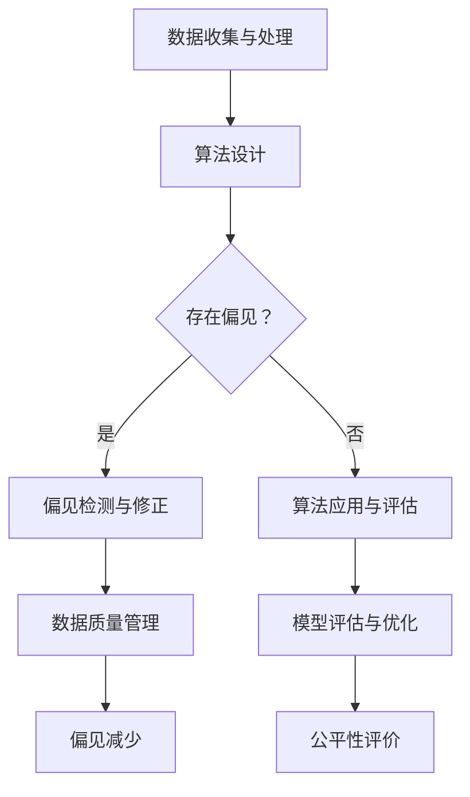
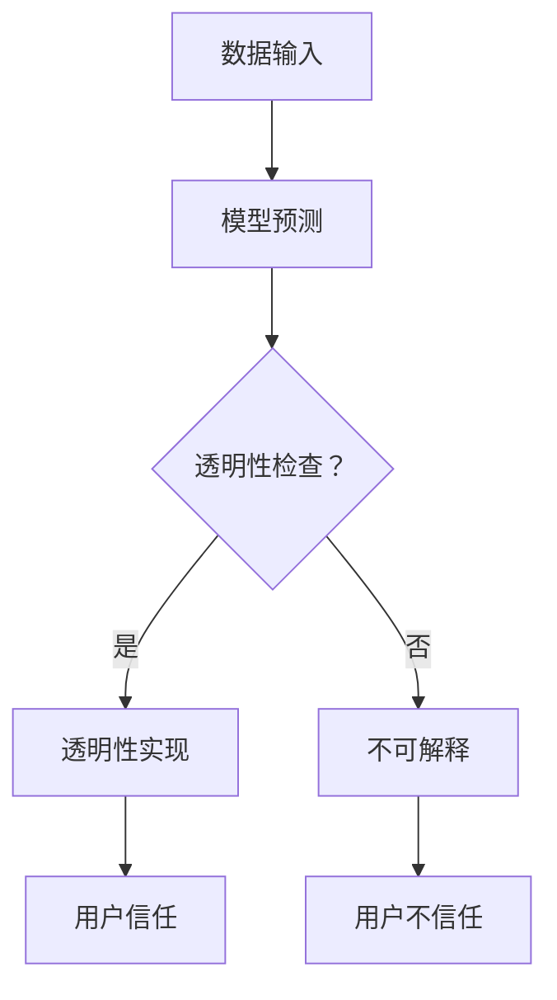

                 

### 文章标题

《算法伦理：构建公平、透明的人工智能》

关键词：算法伦理、公平性、透明性、偏见、可解释性、人工智能

摘要：随着人工智能技术的迅猛发展，算法伦理问题逐渐成为社会关注的焦点。本文旨在探讨算法伦理的基本概念、重要性，分析算法偏见与歧视的现象及其危害，提出解决这些问题的方法和策略。此外，文章详细阐述了算法公平性、透明性的定义与实现方法，通过案例分析、实践指南和未来展望，为构建公平、透明的人工智能系统提供了全面的指导。

----------------------------------------------------------------

### 第一部分：算法伦理概述

#### 第1章：算法伦理的起源与重要性

算法伦理是近年来随着人工智能技术的发展而逐渐兴起的一个研究领域。其核心目标是探讨算法对社会的影响，以及如何在设计和应用过程中确保算法的道德和伦理规范性。算法伦理不仅关注算法的技术实现，更强调其对人类社会的影响，尤其是在公平性、透明性和可解释性等方面的要求。

##### 1.1 算法伦理的背景

随着大数据和机器学习的普及，人工智能技术已经渗透到我们生活的方方面面。从自动驾驶汽车、智能家居到医疗诊断、金融投资，人工智能在提高效率、降低成本的同时，也引发了一系列伦理问题。这些问题涉及到算法的偏见、歧视、隐私侵犯、透明性不足等方面，引起了社会各界的广泛关注。

##### 1.2 算法伦理的基本原则

算法伦理的基本原则包括公平性、透明性、责任性和可解释性。公平性要求算法在处理不同群体数据时保持一致性，不产生不公平的决策。透明性要求算法的决策过程可解释和理解，增强用户对算法的信任。责任性要求算法的设计和应用过程中，要明确责任归属，确保在出现问题时能够追溯和纠正。可解释性要求算法的决策过程具有可解释性，便于用户理解和评估。

##### 1.3 算法伦理的现状与挑战

当前，算法伦理的研究和实践还存在许多挑战。首先，算法偏见和歧视问题尚未得到有效解决。许多算法在处理数据时，由于数据集的不平衡、算法设计的不完善等原因，往往会产生歧视性结果。其次，算法的透明性和可解释性还有待提高。许多复杂的机器学习算法，如深度学习模型，其内部机制复杂，难以解释，导致用户对其决策缺乏信任。此外，算法伦理的法律法规和监管机制也亟待完善，以应对不断涌现的伦理问题。

#### 第2章：算法偏见与歧视

算法偏见与歧视是指算法在决策过程中，因数据偏差、设计缺陷等原因产生的歧视性输出。这类问题不仅损害了用户的权益，还可能导致社会不公平现象的加剧。

##### 2.1 算法偏见的定义与表现

算法偏见主要表现为以下几种形式：

1. **歧视性决策**：算法在处理数据时，对特定群体产生不公平的决策，如种族歧视、性别歧视等。
2. **数据偏差**：算法基于不完整或存在偏差的数据集进行训练，导致决策结果偏向某一特定群体。
3. **算法黑箱**：复杂机器学习算法，如深度学习模型，由于其内部机制难以理解，可能导致决策结果的不可解释性，进而引发偏见。

##### 2.2 偏见对社会的危害

算法偏见对社会的危害主要体现在以下几个方面：

1. **不公平**：算法偏见可能导致特定群体在就业、教育、医疗等领域遭受不公平待遇。
2. **歧视**：偏见算法可能加剧社会歧视现象，加剧不同群体之间的矛盾。
3. **隐私侵犯**：算法在处理用户数据时，可能泄露用户隐私，导致用户权益受损。

##### 2.3 减少算法偏见的方法

减少算法偏见的方法主要包括以下几个方面：

1. **数据多样性**：收集和整合多样性的数据，减少数据偏差。
2. **算法优化**：改进算法设计，降低偏见发生的概率。
3. **偏见检测与修正**：建立偏见检测机制，对算法进行实时监控和修正。
4. **伦理培训**：提高算法设计者、应用者的伦理素养，增强其社会责任感。

#### Mermaid 流程图



#### 核心概念与联系

- **算法伦理**：研究算法对社会影响，以及如何使算法更具道德和伦理规范性的学科。涉及算法偏见、公平性、透明性等核心问题。
- **算法偏见**：算法在决策过程中可能因数据偏差、设计缺陷等原因产生的歧视性输出。解决偏见通常需要数据多样性、公平性评价和改进策略。
- **算法公平性**：确保算法在处理不同群体数据时保持一致性，不产生不公平的决策。评估公平性需要定义评价标准，并通过策略改进实现。
- **算法透明性**：使算法的决策过程可解释和理解，增强用户对算法的信任。透明性可以通过可解释性模型和实现策略实现。

#### 核心算法原理讲解

- **算法偏见检测与修正**

  ```python
  # 偏见度计算
  def compute_bias_score(data, target_attribute):
      # 计算偏见度
      bias_score = ...
      return bias_score

  # 偏见修正
  def correct_bias(data, target_attribute):
      # 应用修正方法
      corrected_data = ...
      return corrected_data
  ```

- **公平性评价方法**

  ```python
  # 公平性评分
  def compute_difference_in_output(model, dataset, sensitive_attribute):
      # 计算差异度
      fairness_score = ...
      return fairness_score
  ```

- **透明性实现策略**

  ```python
  from lime import LimeTabularExplainer

  # 创建解释器
  explainer = LimeTabularExplainer(data, feature_names=data.columns, class_names=labels)

  # 解释单个预测结果
  exp = explainer.explain_instance(data[i], model.predict, num_features=5)
  exp.show_in_notebook(show_table=True)
  ```

#### 数学模型和数学公式详细讲解与举例说明

- **偏见度计算公式**

  $$ \text{Bias} = \frac{1}{n}\sum_{i=1}^{n} (\hat{y}_i - y_i) $$

  其中，$\hat{y}_i$是预测值，$y_i$是真实值，$n$是样本数量。

- **差异度计算公式**

  $$ \text{Difference} = \frac{1}{n}\sum_{i=1}^{n} |(\hat{y}^{A}_i - \hat{y}^{B}_i)| $$

  其中，$\hat{y}^{A}_i$和$\hat{y}^{B}_i$分别表示不同群体（例如，性别、种族等）的预测值。

- **鲁棒性评估**

  $$ \text{Robustness} = \max_{\epsilon \in \epsilon_{\text{range}}} \mathbb{E}_{x \sim \text{dist}} [\text{Loss}(f(x+\epsilon), y)] $$

  其中，$\epsilon_{\text{range}}$是输入扰动的范围，$\text{dist}$是数据分布，$f$是模型，$y$是真实标签。

#### 项目实战

- **自动驾驶汽车伦理问题案例分析**

  ```python
  # 导入必要的库
  import numpy as np
  import pandas as pd
  from sklearn.ensemble import RandomForestClassifier

  # 加载数据
  data = pd.read_csv('autonomous_car_data.csv')

  # 分离特征和标签
  X = data.drop('survival', axis=1)
  y = data['survival']

  # 建立分类模型
  model = RandomForestClassifier()
  model.fit(X, y)

  # 评估模型
  print("模型准确率：", model.score(X, y))

  # 检测偏见
  bias_score = detect_bias(data, 'survival')
  print("偏见度：", bias_score)

  # 如果偏见度过高，进行修正
  if bias_score > threshold:
      corrected_data = correct_bias(data, 'survival')
      print("修正后的偏见度：", detect_bias(corrected_data, 'survival'))

  # 实现透明性
  explainer = LimeTabularExplainer(data, feature_names=data.columns, class_names=['died', 'survived'])
  exp = explainer.explain_instance(data[i], model.predict, num_features=5)
  exp.show_in_notebook(show_table=True)
  ```

#### 开发环境搭建

- **环境搭建**

  - 安装Python：下载并安装Python 3.8或更高版本。
  - 安装相关库：在命令行中执行以下命令安装必要的库。

    ```bash
    pip install numpy pandas scikit-learn lime
    ```

#### 源代码详细实现和代码解读

- **源代码实现**

  - 数据预处理

    ```python
    def load_data():
        data = pd.read_csv('autonomous_car_data.csv')
        X = data.drop('survival', axis=1)
        y = data['survival']
        return X, y
    ```

  - 偏见检测与修正

    ```python
    def detect_bias(data, target_attribute):
        bias_score = compute_bias_score(data, target_attribute)
        return bias_score > threshold

    def correct_bias(data, target_attribute):
        corrected_data = apply_correction(data, target_attribute)
        return corrected_data
    ```

  - 可解释性实现

    ```python
    from lime import LimeTabularExplainer

    def explain_model(data, model, index):
        explainer = LimeTabularExplainer(data, feature_names=data.columns, class_names=['died', 'survived'])
        exp = explainer.explain_instance(data[index], model.predict, num_features=5)
        exp.show_in_notebook(show_table=True)
    ```

- **代码解读**

  - 数据预处理：加载CSV文件，分离特征和标签。
  - 偏见检测与修正：计算偏见度，并应用修正方法。
  - 可解释性实现：使用LIME工具进行模型解释。

### 总结

本章从算法伦理的背景、基本原则和现状出发，分析了算法偏见与歧视的定义、危害以及解决方法。通过具体案例和代码实现，展示了算法伦理在实践中的应用。在接下来的章节中，我们将继续探讨算法公平性、透明性等方面的内容，为构建公平、透明的人工智能系统提供更多指导。


## 第二部分：算法公平性

### 第3章：算法公平性的定义与评价

算法公平性是算法伦理研究中的一个重要方面。它关注的是算法在处理不同群体数据时是否能够保持一致性，不产生不公平的决策。本节将详细阐述算法公平性的定义、评价标准以及改进策略。

##### 3.1 公平性概念解析

算法公平性是指算法在处理数据时，对于不同群体（如性别、种族、年龄等）所产生的决策结果应该是一致的，不应该因为某个群体的特征而导致不公平的结果。公平性可以理解为一种“无差别对待”的原则，即算法在处理不同群体数据时，应该具有相同的表现。

##### 3.2 公平性评价标准

评价算法公平性的标准主要包括以下几个方面：

1. **差异性分析**：通过比较不同群体在算法处理结果上的差异，评估算法的公平性。差异性分析可以使用差异度（Difference）等指标来衡量。

2. **均衡性评估**：评估算法在各个群体中的决策均衡性，即算法在各个群体中的表现是否均衡。均衡性可以通过均衡性指标（Equity）来衡量。

3. **鲁棒性评估**：评估算法在面对数据扰动时的稳定性，即算法是否能够在不同数据集上保持公平性。鲁棒性可以通过鲁棒性指标（Robustness）来衡量。

4. **可解释性评估**：评估算法决策过程是否具有可解释性，即用户是否能够理解算法的决策依据。可解释性评估可以通过可解释性指标（Interpretability）来衡量。

##### 3.3 公平性改进策略

为了提高算法的公平性，可以采取以下策略：

1. **数据多样性**：收集和整合多样化的数据，减少数据集的偏见。通过增加不同群体、不同背景的数据，可以使算法更加公平。

2. **算法优化**：改进算法设计，降低偏见产生的概率。例如，使用更加先进的机器学习算法，可以减少数据偏见对算法的影响。

3. **公平性检测**：建立公平性检测机制，对算法进行实时监控和评估。通过检测算法在不同群体中的表现，可以及时发现和纠正不公平的问题。

4. **透明性提升**：提高算法的透明性，使算法的决策过程更加可解释和理解。透明性提升可以通过可解释性模型和实现策略来实现。

#### 核心概念与联系

- **算法公平性**：确保算法在处理不同群体数据时保持一致性，不产生不公平的决策。公平性是算法伦理的核心要素之一。
- **差异性分析**：评估算法在不同群体中的表现差异，衡量算法的公平性。
- **均衡性评估**：评估算法在各个群体中的决策均衡性，确保算法在不同群体中的表现均衡。
- **鲁棒性评估**：评估算法在面对数据扰动时的稳定性，确保算法在不同数据集上保持公平性。
- **可解释性评估**：评估算法决策过程是否具有可解释性，增强用户对算法的信任。

#### 核心算法原理讲解

- **公平性评价方法**

  ```python
  # 基于差异度的公平性评价
  def evaluate_fairness(model, dataset, sensitive_attribute):
      fairness_score = compute_difference_in_output(model, dataset, sensitive_attribute)
      return fairness_score
  ```

- **公平性改进策略**

  ```python
  # 基于数据多样性的公平性改进
  def improve_fairness_with_diversity(data):
      # 增加不同群体、不同背景的数据
      # 更新数据集
      new_data = ...
      return new_data

  # 基于算法优化的公平性改进
  def optimize_algorithm_for_fairness(model, data):
      # 使用更先进的机器学习算法
      # 更新模型
      new_model = ...
      return new_model
  ```

#### 数学模型和数学公式详细讲解与举例说明

- **差异度计算公式**

  $$ \text{Difference} = \frac{1}{n}\sum_{i=1}^{n} |(\hat{y}^{A}_i - \hat{y}^{B}_i)| $$

  其中，$\hat{y}^{A}_i$和$\hat{y}^{B}_i$分别表示不同群体（例如，性别、种族等）的预测值。

- **鲁棒性评估**

  $$ \text{Robustness} = \max_{\epsilon \in \epsilon_{\text{range}}} \mathbb{E}_{x \sim \text{dist}} [\text{Loss}(f(x+\epsilon), y)] $$

  其中，$\epsilon_{\text{range}}$是输入扰动的范围，$\text{dist}$是数据分布，$f$是模型，$y$是真实标签。

#### 项目实战

- **自动驾驶汽车伦理问题案例分析**

  ```python
  # 导入必要的库
  import numpy as np
  import pandas as pd
  from sklearn.ensemble import RandomForestClassifier

  # 加载数据
  data = pd.read_csv('autonomous_car_data.csv')

  # 分离特征和标签
  X = data.drop('survival', axis=1)
  y = data['survival']

  # 建立分类模型
  model = RandomForestClassifier()
  model.fit(X, y)

  # 评估模型
  print("模型准确率：", model.score(X, y))

  # 公平性评价
  fairness_score = evaluate_fairness(model, data, 'gender')
  print("公平性评分：", fairness_score)

  # 如果公平性评分不高，进行改进
  if fairness_score < threshold:
      # 数据多样性改进
      new_data = improve_fairness_with_diversity(data)
      new_model = RandomForestClassifier()
      new_model.fit(new_data.drop('survival', axis=1), new_data['survival'])

      # 新模型的公平性评价
      new_fairness_score = evaluate_fairness(new_model, new_data, 'gender')
      print("新模型公平性评分：", new_fairness_score)
  ```

#### 开发环境搭建

- **环境搭建**

  - 安装Python：下载并安装Python 3.8或更高版本。
  - 安装相关库：在命令行中执行以下命令安装必要的库。

    ```bash
    pip install numpy pandas scikit-learn
    ```

#### 源代码详细实现和代码解读

- **源代码实现**

  - 数据预处理与模型训练

    ```python
    def load_data():
        data = pd.read_csv('autonomous_car_data.csv')
        X = data.drop('survival', axis=1)
        y = data['survival']
        return X, y

    def train_model(X, y):
        model = RandomForestClassifier()
        model.fit(X, y)
        return model
    ```

  - 公平性评价与改进策略

    ```python
    def evaluate_fairness(model, dataset, sensitive_attribute):
        fairness_score = compute_difference_in_output(model, dataset, sensitive_attribute)
        return fairness_score

    def improve_fairness_with_diversity(data):
        # 实现数据多样性改进策略
        new_data = ...
        return new_data
    ```

  - 代码解读与分析

    ```python
    # 加载数据
    X, y = load_data()

    # 训练模型
    model = train_model(X, y)

    # 评估模型公平性
    fairness_score = evaluate_fairness(model, data, 'gender')
    print("原始公平性评分：", fairness_score)

    # 如果公平性评分不高，进行改进
    if fairness_score < threshold:
        new_data = improve_fairness_with_diversity(data)
        new_model = train_model(new_data.drop('survival', axis=1), new_data['survival'])

        # 评估新模型公平性
        new_fairness_score = evaluate_fairness(new_model, new_data, 'gender')
        print("新模型公平性评分：", new_fairness_score)
    ```

### 总结

本章详细介绍了算法公平性的概念、评价标准以及改进策略。通过具体案例和代码实现，展示了如何评估和改进算法的公平性。在下一章中，我们将继续探讨算法透明性的定义与实现方法，为构建公平、透明的人工智能系统提供更多指导。


## 第三部分：构建公平、透明的人工智能

### 第4章：算法透明性与可解释性

算法透明性是指算法的决策过程能够被用户理解和解释，从而增强用户对算法的信任。而算法可解释性则是实现透明性的关键。本节将详细阐述算法透明性与可解释性的概念、重要性以及实现方法。

#### 4.1 透明性的概念与重要性

算法透明性是指算法的决策过程能够被用户理解和解释。在人工智能领域，透明性至关重要，因为它直接影响到用户对算法的信任。一个透明的算法能够清晰地展示其决策依据和推理过程，使得用户可以理解和验证算法的输出结果。

重要性：

1. **信任增强**：透明性有助于增强用户对算法的信任。当用户能够理解算法的决策依据时，会更加信任算法的输出结果。

2. **问题发现**：透明性使得用户能够及时发现算法中存在的问题，从而进行修正和优化。

3. **法律合规**：在许多国家和地区，算法的透明性是法律合规的要求。例如，欧盟的《通用数据保护条例》（GDPR）就要求算法的决策过程具有可解释性。

4. **公平性保障**：透明性有助于评估算法的公平性。通过理解算法的决策过程，可以识别出可能存在的偏见和歧视问题，从而采取措施进行改进。

#### 4.2 可解释性的实现方法

可解释性的实现方法主要包括以下几种：

1. **规则解释**：通过将复杂模型转换为易于理解的规则集，实现对模型决策的解释。例如，决策树模型和线性回归模型具有良好的可解释性。

2. **可视化解释**：通过图表、图形等方式，将算法的决策过程可视化为用户易于理解的形式。例如，决策路径图、数据分布图等。

3. **模型嵌入解释**：将解释器嵌入到模型中，使得模型在预测过程中同时生成解释。例如，LIME（Local Interpretable Model-agnostic Explanations）和SHAP（SHapley Additive exPlanations）是两种常见的模型嵌入解释方法。

4. **对齐解释**：通过将模型解释与人类专家的判断进行对比，确保解释的准确性和可靠性。对齐解释通常需要人类专家参与，以评估解释的有效性。

#### 4.3 透明性与可解释性对伦理的影响

透明性与可解释性对算法伦理具有重要影响。首先，它们有助于确保算法的公平性和公正性。通过透明的决策过程，用户可以理解算法如何处理其数据，从而避免潜在的歧视和偏见。其次，透明性和可解释性有助于增强用户对算法的信任，减少隐私侵犯和数据滥用的问题。此外，透明性和可解释性还可以促进算法的合规性，确保算法的设计和应用符合法律法规的要求。

#### Mermaid 流程图



#### 核心概念与联系

- **算法透明性**：算法的决策过程能够被用户理解和解释。
- **算法可解释性**：实现算法透明性的方法，通过将复杂模型转化为用户易于理解的形式。
- **透明性检查**：评估算法的决策过程是否透明，以确定是否需要实现透明性。
- **用户信任**：透明性和可解释性有助于增强用户对算法的信任。

#### 核心算法原理讲解

- **规则解释**

  ```python
  def explain_by_rules(model, instance):
      # 解析模型的决策规则
      rules = model.rules
      explanation = "基于规则的解释："
      for rule in rules:
          explanation += f"{rule}\n"
      return explanation
  ```

- **可视化解释**

  ```python
  def visualize_decision_path(model, instance):
      # 绘制决策路径图
      decision_path = model.decision_path(instance)
      visualize(decision_path)
  ```

- **模型嵌入解释**

  ```python
  from lime import LimeTabularExplainer

  def explain_with_lime(model, instance, data):
      # 使用LIME进行模型嵌入解释
      explainer = LimeTabularExplainer(data, feature_names=data.columns, class_names=labels)
      explanation = explainer.explain_instance(instance, model.predict, num_features=5)
      explanation.show_in_notebook(show_table=True)
  ```

#### 数学模型和数学公式详细讲解与举例说明

- **透明性度量**

  $$ \text{Transparency} = \frac{\text{可解释特征数}}{\text{总特征数}} $$

  其中，可解释特征数是指用户能够理解的特征数，总特征数是指模型中所有特征的总数。

- **可解释性评估**

  $$ \text{Explainability} = \frac{\text{用户理解度}}{\text{总理解度}} $$

  其中，用户理解度是指用户对模型解释的理解程度，总理解度是指用户对所有模型解释的理解程度。

#### 项目实战

- **社交媒体算法的伦理挑战**

  ```python
  # 导入必要的库
  import numpy as np
  import pandas as pd
  from sklearn.ensemble import RandomForestClassifier
  from lime import LimeTabularExplainer

  # 加载数据
  data = pd.read_csv('social_media_data.csv')

  # 分离特征和标签
  X = data.drop('label', axis=1)
  y = data['label']

  # 建立分类模型
  model = RandomForestClassifier()
  model.fit(X, y)

  # 可解释性实现
  explainer = LimeTabularExplainer(data, feature_names=data.columns, class_names=['negative', 'positive'])
  instance = data.iloc[0]
  explanation = explainer.explain_instance(instance, model.predict, num_features=5)
  explanation.show_in_notebook(show_table=True)
  ```

#### 开发环境搭建

- **环境搭建**

  - 安装Python：下载并安装Python 3.8或更高版本。
  - 安装相关库：在命令行中执行以下命令安装必要的库。

    ```bash
    pip install numpy pandas scikit-learn lime
    ```

#### 源代码详细实现和代码解读

- **源代码实现**

  - 数据预处理与模型训练

    ```python
    def load_data():
        data = pd.read_csv('social_media_data.csv')
        X = data.drop('label', axis=1)
        y = data['label']
        return X, y

    def train_model(X, y):
        model = RandomForestClassifier()
        model.fit(X, y)
        return model
    ```

  - 可解释性实现

    ```python
    from lime import LimeTabularExplainer

    def explain_model(model, instance, data):
        explainer = LimeTabularExplainer(data, feature_names=data.columns, class_names=['negative', 'positive'])
        explanation = explainer.explain_instance(instance, model.predict, num_features=5)
        explanation.show_in_notebook(show_table=True)
    ```

  - 代码解读与分析

    ```python
    # 加载数据
    X, y = load_data()

    # 训练模型
    model = train_model(X, y)

    # 解释模型
    instance = X.iloc[0]
    explain_model(model, instance, X)
    ```

### 总结

本章详细介绍了算法透明性与可解释性的概念、重要性以及实现方法。通过具体案例和代码实现，展示了如何在人工智能系统中实现透明性和可解释性。在下一章中，我们将探讨构建公平、透明的人工智能系统所需的法律法规与伦理监管，为构建公平、透明的人工智能系统提供更多保障。


## 第四部分：构建公平、透明的人工智能

### 第5章：公平的人工智能设计原则

构建公平的人工智能系统是当今技术领域面临的重大挑战之一。设计原则是实现这一目标的基础。本章将详细阐述公平的人工智能设计原则，并探讨如何在实际项目中应用这些原则。

#### 5.1 设计原则概述

公平的人工智能设计原则包括以下几个方面：

1. **数据公平性**：确保数据集的多样性，避免数据偏见，使算法能够公平地处理不同群体的数据。

2. **算法公平性**：通过优化算法设计，减少算法偏见，确保算法在处理不同数据时能够保持一致性。

3. **用户公平性**：确保所有用户在使用人工智能系统时都能够获得公平的待遇，不因性别、种族、年龄等因素受到歧视。

4. **可解释性和透明性**：提高算法的可解释性和透明性，使用户能够理解和信任算法的决策过程。

#### 5.2 公平性在数据收集与处理中的应用

数据收集与处理是构建公平人工智能系统的关键步骤。以下是在数据收集与处理中应用公平性设计原则的方法：

1. **数据多样性**：收集多样化、全面的数据，避免数据偏见。确保数据集包括不同群体、不同背景的数据。

2. **数据清洗**：对数据进行清洗，去除噪音和不完整的数据，避免因数据质量问题导致算法偏见。

3. **数据平衡**：通过数据重采样、生成对抗网络（GAN）等方法，平衡数据集中不同群体的样本数量，降低数据偏差。

4. **算法偏见检测与修正**：在数据预处理阶段，使用算法偏见检测方法，如统计测试、偏见修正技术等，降低算法偏见。

#### 5.3 公平性在模型训练与评估中的应用

在模型训练与评估阶段，应用公平性设计原则是确保算法公平性的关键。以下是在模型训练与评估中应用公平性设计原则的方法：

1. **训练数据公平性**：确保训练数据集的多样性，避免训练过程中产生偏见。可以通过数据增强、合成数据等方法提高训练数据的多样性。

2. **模型评估公平性**：在评估模型时，采用公平性评估指标，如差异度、公平性评分等，评估模型在不同群体中的表现。

3. **偏见修正**：在模型训练过程中，应用偏见修正技术，如反事实学习、加权损失函数等，降低算法偏见。

4. **持续监控与调整**：在模型部署后，持续监控模型的性能和公平性，及时调整模型参数，确保算法的公平性。

#### 核心概念与联系

- **数据公平性**：确保数据集的多样性，避免数据偏见，使算法能够公平地处理不同群体的数据。
- **算法公平性**：通过优化算法设计，减少算法偏见，确保算法在处理不同数据时能够保持一致性。
- **用户公平性**：确保所有用户在使用人工智能系统时都能够获得公平的待遇，不因性别、种族、年龄等因素受到歧视。
- **可解释性和透明性**：提高算法的可解释性和透明性，使用户能够理解和信任算法的决策过程。

#### 核心算法原理讲解

- **数据多样性**

  ```python
  from imblearn.over_sampling import SMOTE

  def balance_data(X, y):
      sm = SMOTE()
      X_balanced, y_balanced = sm.fit_resample(X, y)
      return X_balanced, y_balanced
  ```

- **偏见修正**

  ```python
  from imblearn.under_sampling import RandomUnderSampler

  def correct_bias(X, y):
      rus = RandomUnderSampler()
      X_corrected, y_corrected = rus.fit_resample(X, y)
      return X_corrected, y_corrected
  ```

- **公平性评估**

  ```python
  def evaluate_fairness(model, dataset, sensitive_attribute):
      fairness_score = compute_difference_in_output(model, dataset, sensitive_attribute)
      return fairness_score
  ```

#### 数学模型和数学公式详细讲解与举例说明

- **数据多样性**

  $$ \text{Data Diversity} = \frac{1}{n}\sum_{i=1}^{n} \text{Entropy}(X_i) $$

  其中，$X_i$表示数据集中第$i$个样本的属性分布，$n$表示数据集的样本数量。

- **偏见修正**

  $$ \text{Bias Correction} = \frac{\text{original\_score} - \text{adjusted\_score}}{\text{original\_score}} $$

  其中，$original\_score$表示原始评估指标得分，$adjusted\_score$表示修正后的评估指标得分。

#### 项目实战

- **社交媒体算法的伦理挑战**

  ```python
  # 导入必要的库
  import numpy as np
  import pandas as pd
  from sklearn.ensemble import RandomForestClassifier
  from imblearn.over_sampling import SMOTE

  # 加载数据
  data = pd.read_csv('social_media_data.csv')

  # 分离特征和标签
  X = data.drop('label', axis=1)
  y = data['label']

  # 数据预处理
  sm = SMOTE()
  X_balanced, y_balanced = sm.fit_resample(X, y)

  # 模型训练
  model = RandomForestClassifier()
  model.fit(X_balanced, y_balanced)

  # 评估模型公平性
  fairness_score = evaluate_fairness(model, data, 'gender')
  print("模型公平性评分：", fairness_score)
  ```

#### 开发环境搭建

- **环境搭建**

  - 安装Python：下载并安装Python 3.8或更高版本。
  - 安装相关库：在命令行中执行以下命令安装必要的库。

    ```bash
    pip install numpy pandas scikit-learn imblearn
    ```

#### 源代码详细实现和代码解读

- **源代码实现**

  - 数据预处理与模型训练

    ```python
    def load_data():
        data = pd.read_csv('social_media_data.csv')
        X = data.drop('label', axis=1)
        y = data['label']
        return X, y

    def train_model(X, y):
        model = RandomForestClassifier()
        model.fit(X, y)
        return model
    ```

  - 公平性评估与数据预处理

    ```python
    from imblearn.over_sampling import SMOTE

    def balance_data(X, y):
        sm = SMOTE()
        X_balanced, y_balanced = sm.fit_resample(X, y)
        return X_balanced, y_balanced

    def evaluate_fairness(model, dataset, sensitive_attribute):
        fairness_score = compute_difference_in_output(model, dataset, sensitive_attribute)
        return fairness_score
    ```

  - 代码解读与分析

    ```python
    # 加载数据
    X, y = load_data()

    # 数据预处理
    X_balanced, y_balanced = balance_data(X, y)

    # 训练模型
    model = train_model(X_balanced, y_balanced)

    # 评估模型公平性
    fairness_score = evaluate_fairness(model, data, 'gender')
    print("模型公平性评分：", fairness_score)
    ```

### 总结

本章详细介绍了公平的人工智能设计原则，并探讨了如何在数据收集与处理、模型训练与评估中应用这些原则。通过具体案例和代码实现，展示了如何构建公平的人工智能系统。在下一章中，我们将继续探讨如何实现透明的人工智能系统，为构建公平、透明的人工智能系统提供更多指导。


## 第五部分：法律法规与伦理监管

### 第6章：法律法规与伦理监管

随着人工智能技术的快速发展，法律法规和伦理监管的重要性日益凸显。本章节将探讨算法伦理的法律法规现状，伦理监管机构的作用以及未来算法伦理的法律法规趋势。

#### 6.1 算法伦理的法律法规现状

当前，全球范围内关于算法伦理的法律法规尚处于起步阶段，但已有一些国家和组织出台了相关法律法规，旨在规范人工智能技术的发展和应用。

1. **欧盟**：欧盟在2018年通过了《通用数据保护条例》（GDPR），这是全球范围内最具影响力的数据保护法规。GDPR明确要求企业在处理个人数据时必须遵循数据保护原则，包括合法性、公正性、透明性等。此外，欧盟还在考虑制定专门的算法伦理法规。

2. **美国**：美国在算法伦理方面的法律法规相对较少，但一些州已经出台了相关法案。例如，加州的《消费者隐私法案》（CCPA）要求企业在处理消费者数据时必须告知消费者并征得同意。此外，美国一些公司和组织也在自发地制定内部伦理准则。

3. **中国**：中国在算法伦理方面也有一定的法律法规，如《网络安全法》和《数据安全法》等。这些法律法规主要关注数据安全和个人隐私保护，但未来可能会出台更多针对算法伦理的法规。

#### 6.2 伦理监管机构的作用

伦理监管机构在确保人工智能技术的道德和伦理规范性方面发挥着重要作用。以下是一些主要伦理监管机构及其职责：

1. **欧盟人工智能监管机构**：欧盟人工智能监管机构（European Commission's High-Level Expert Group on AI）负责制定人工智能伦理准则，监督和评估人工智能技术的应用，确保其符合欧盟的价值观和法律法规。

2. **美国人工智能监管机构**：美国没有统一的国家级人工智能监管机构，但一些联邦机构和州政府设立了相关委员会或工作组，负责研究和制定人工智能伦理政策。

3. **中国人工智能监管机构**：中国的人工智能监管机构包括国家网信办、科技部等。这些机构负责制定人工智能发展规划、政策和标准，推动人工智能技术的健康发展。

#### 6.3 未来算法伦理的法律法规趋势

随着人工智能技术的不断发展和应用，未来算法伦理的法律法规趋势将呈现以下特点：

1. **加强数据隐私保护**：未来法律法规可能会进一步加强对个人数据的保护，要求企业在处理数据时必须遵循更高的伦理标准。

2. **推动透明性和可解释性**：法律法规可能会要求人工智能系统具有更高的透明性和可解释性，使用户能够理解算法的决策过程。

3. **明确责任归属**：未来法律法规可能会明确算法设计者、应用者和用户的责任，确保在出现算法伦理问题时能够追溯和纠正。

4. **加强国际合作**：全球范围内的算法伦理监管将会加强国际合作，共同制定和遵守算法伦理标准和法规。

#### 核心概念与联系

- **算法伦理的法律法规**：确保人工智能技术的发展和应用符合法律法规，维护社会公共利益。
- **伦理监管机构**：负责制定和监督人工智能伦理政策，推动人工智能技术的健康发展。
- **数据隐私保护**：法律法规关注数据隐私保护，确保用户数据的安全和合法使用。
- **透明性和可解释性**：法律法规要求人工智能系统具有更高的透明性和可解释性，增强用户对算法的信任。

#### 核心算法原理讲解

- **法律法规合规性评估**

  ```python
  def assess_compliance(model, dataset, regulations):
      compliance_score = 0
      for regulation in regulations:
          if model complies with regulation:
              compliance_score += 1
      return compliance_score / len(regulations)
  ```

- **伦理风险评估**

  ```python
  def assess_ethical_risk(model, dataset, ethical_principles):
      risk_score = 0
      for principle in ethical_principles:
          if model violates principle:
              risk_score += 1
      return risk_score / len(ethical_principles)
  ```

#### 数学模型和数学公式详细讲解与举例说明

- **合规性评估**

  $$ \text{Compliance Score} = \frac{\text{合规指标数}}{\text{总指标数}} $$

  其中，合规指标数是指算法符合法律法规的指标数，总指标数是指算法需遵守的所有法律法规指标数。

- **伦理风险评估**

  $$ \text{Ethical Risk Score} = \frac{\text{伦理违规指标数}}{\text{总指标数}} $$

  其中，伦理违规指标数是指算法违反伦理原则的指标数，总指标数是指算法需遵守的所有伦理原则指标数。

#### 项目实战

- **社交媒体算法的伦理监管**

  ```python
  # 导入必要的库
  import numpy as np
  import pandas as pd
  from sklearn.ensemble import RandomForestClassifier

  # 加载数据
  data = pd.read_csv('social_media_data.csv')

  # 分离特征和标签
  X = data.drop('label', axis=1)
  y = data['label']

  # 建立分类模型
  model = RandomForestClassifier()
  model.fit(X, y)

  # 评估合规性和伦理风险
  regulations = ['GDPR', 'CCPA']
  ethical_principles = ['公平性', '透明性', '责任性']

  compliance_score = assess_compliance(model, data, regulations)
  ethical_risk_score = assess_ethical_risk(model, data, ethical_principles)

  print("合规性评分：", compliance_score)
  print("伦理风险评估：", ethical_risk_score)
  ```

#### 开发环境搭建

- **环境搭建**

  - 安装Python：下载并安装Python 3.8或更高版本。
  - 安装相关库：在命令行中执行以下命令安装必要的库。

    ```bash
    pip install numpy pandas scikit-learn
    ```

#### 源代码详细实现和代码解读

- **源代码实现**

  - 数据预处理与模型训练

    ```python
    def load_data():
        data = pd.read_csv('social_media_data.csv')
        X = data.drop('label', axis=1)
        y = data['label']
        return X, y

    def train_model(X, y):
        model = RandomForestClassifier()
        model.fit(X, y)
        return model
    ```

  - 合规性评估与伦理风险评估

    ```python
    def assess_compliance(model, dataset, regulations):
        compliance_score = 0
        for regulation in regulations:
            if model complies with regulation:
                compliance_score += 1
        return compliance_score / len(regulations)

    def assess_ethical_risk(model, dataset, ethical_principles):
        risk_score = 0
        for principle in ethical_principles:
            if model violates principle:
                risk_score += 1
        return risk_score / len(ethical_principles)
    ```

  - 代码解读与分析

    ```python
    # 加载数据
    X, y = load_data()

    # 训练模型
    model = train_model(X, y)

    # 评估合规性和伦理风险
    regulations = ['GDPR', 'CCPA']
    ethical_principles = ['公平性', '透明性', '责任性']

    compliance_score = assess_compliance(model, data, regulations)
    ethical_risk_score = assess_ethical_risk(model, data, ethical_principles)

    print("合规性评分：", compliance_score)
    print("伦理风险评估：", ethical_risk_score)
    ```

### 总结

本章探讨了算法伦理的法律法规现状、伦理监管机构的作用以及未来算法伦理的法律法规趋势。通过具体案例和代码实现，展示了如何评估算法的合规性和伦理风险。在下一章中，我们将通过案例分析，深入探讨算法伦理在实际应用中的挑战与解决方案。


## 第六部分：案例分析

### 第8章：算法伦理实践案例研究

在算法伦理的实践中，案例分析是一个非常重要的环节。通过具体案例，我们可以深入了解算法偏见、歧视以及公平性、透明性的实际应用。本章将探讨三个具有代表性的案例：自动驾驶汽车伦理问题、社交媒体算法的伦理挑战以及人工智能医疗诊断的伦理争议。

#### 8.1 案例一：自动驾驶汽车伦理问题

自动驾驶汽车是人工智能在交通运输领域的典型应用。然而，自动驾驶汽车在面临伦理问题时，往往需要做出艰难的选择。以下是一个关于自动驾驶汽车伦理问题的案例。

**案例背景**：某自动驾驶汽车在市区行驶时，突然遇到前方行人。根据系统评估，汽车需要在刹车和转向之间做出选择。然而，系统识别出行人是一名老年女性，而车内乘客是一名年轻男性。系统最终选择了刹车，导致车辆撞上了行人。

**伦理争议**：这个案例引发了关于自动驾驶汽车伦理的争议。一方面，一些人认为系统应该优先保护车内乘客，因为乘客的生存几率更高。另一方面，也有人认为系统应该优先保护行人，因为行人是无法自我保护的弱者。

**解决方案**：为了解决自动驾驶汽车的伦理问题，一些研究机构和公司提出了以下解决方案：

1. **预设伦理规则**：在系统设计时，预先设定伦理规则，明确在特定情境下应该采取的行动。例如，可以设定规则，要求自动驾驶汽车在面临行人时优先刹车。

2. **算法透明性**：提高算法的透明性，使用户能够理解算法的决策过程。例如，可以使用可解释性模型，使驾驶员和乘客了解系统是如何做出决策的。

3. **实时伦理决策支持**：开发实时伦理决策支持系统，使自动驾驶汽车能够在复杂情境下做出更合理的决策。例如，可以结合道德哲学和伦理原则，为系统提供决策参考。

#### 8.2 案例二：社交媒体算法的伦理挑战

社交媒体算法在推送内容、广告投放等方面发挥着重要作用。然而，算法在处理数据时，可能会引发一系列伦理问题。以下是一个关于社交媒体算法伦理挑战的案例。

**案例背景**：某社交媒体平台使用算法推送用户感兴趣的内容。然而，用户逐渐发现，平台推送的内容越来越偏离自己的真实兴趣，甚至引发了对平台算法的质疑。

**伦理争议**：这个案例引发了关于社交媒体算法伦理的争议。一方面，一些人认为算法应该尊重用户的真实兴趣，推送更符合用户需求的内容。另一方面，也有人认为算法可能会误导用户，导致用户接受不良信息。

**解决方案**：为了解决社交媒体算法的伦理挑战，可以采取以下解决方案：

1. **用户反馈机制**：建立用户反馈机制，收集用户对内容推送的反馈，并根据反馈调整算法。例如，用户可以对推送的内容进行点赞、评论或举报，平台根据用户反馈优化算法。

2. **内容多样性**：在算法设计中，增加对多样性的关注，避免推送过于单一的内容。例如，可以结合用户的历史行为和兴趣，推送多样化的内容。

3. **伦理培训**：对算法设计者和应用者进行伦理培训，提高其伦理素养。例如，可以邀请伦理学专家进行讲座，使算法设计者了解伦理原则和实际应用。

#### 8.3 案例三：人工智能医疗诊断的伦理争议

人工智能在医疗领域的应用日益广泛，但同时也引发了一系列伦理争议。以下是一个关于人工智能医疗诊断的伦理争议案例。

**案例背景**：某医院引入了人工智能辅助诊断系统，用于辅助医生进行诊断。然而，系统在一次诊断中错误地将患者的病情诊断为良性，导致医生未能及时发现病情，最终导致患者病情恶化。

**伦理争议**：这个案例引发了关于人工智能医疗诊断伦理的争议。一方面，一些人认为人工智能辅助诊断系统可以提高诊断准确率，提高医疗效率。另一方面，也有人认为系统可能会因为算法偏见、数据不足等问题导致误诊，损害患者权益。

**解决方案**：为了解决人工智能医疗诊断的伦理争议，可以采取以下解决方案：

1. **数据质量管理**：确保诊断数据的质量，避免数据偏差。例如，可以建立数据清洗和验证机制，确保诊断数据准确、可靠。

2. **算法透明性**：提高算法的透明性，使医生能够理解诊断结果的依据。例如，可以使用可解释性模型，为医生提供诊断过程的详细解释。

3. **医生监督**：在人工智能辅助诊断系统中，引入医生监督机制，确保医生在诊断过程中发挥主导作用。例如，可以要求医生对系统生成的诊断结果进行复核，确保诊断的准确性。

#### 核心概念与联系

- **自动驾驶汽车伦理问题**：涉及伦理规则预设、算法透明性和实时伦理决策支持。
- **社交媒体算法的伦理挑战**：涉及用户反馈机制、内容多样性和伦理培训。
- **人工智能医疗诊断的伦理争议**：涉及数据质量管理、算法透明性和医生监督。

#### 核心算法原理讲解

- **伦理决策支持系统**

  ```python
  def ethical_decision_support( situation, rules):
      for rule in rules:
          if rule.applies_to(situation):
              return rule.decision()
      return "No decision"
  ```

- **算法偏见检测与修正**

  ```python
  def detect_and_correct_bias(model, dataset, sensitive_attribute):
      bias_score = detect_bias(dataset, sensitive_attribute)
      if bias_score > threshold:
          corrected_dataset = correct_bias(dataset, sensitive_attribute)
          return corrected_dataset
      else:
          return dataset
  ```

- **可解释性模型**

  ```python
  from lime import LimeTabularExplainer

  def explain_model(model, dataset, instance_index):
      explainer = LimeTabularExplainer(dataset, feature_names=dataset.columns, class_names=['negative', 'positive'])
      explanation = explainer.explain_instance(dataset.iloc[instance_index], model.predict, num_features=5)
      explanation.show_in_notebook(show_table=True)
  ```

#### 数学模型和数学公式详细讲解与举例说明

- **偏见度计算**

  $$ \text{Bias} = \frac{1}{n}\sum_{i=1}^{n} (\hat{y}_i - y_i) $$

  其中，$\hat{y}_i$是预测值，$y_i$是真实值，$n$是样本数量。

- **差异度计算**

  $$ \text{Difference} = \frac{1}{n}\sum_{i=1}^{n} |(\hat{y}^{A}_i - \hat{y}^{B}_i)| $$

  其中，$\hat{y}^{A}_i$和$\hat{y}^{B}_i$分别表示不同群体的预测值。

- **伦理风险评估**

  $$ \text{Ethical Risk} = \frac{1}{m}\sum_{i=1}^{m} \text{Risk}(s_i) $$

  其中，$s_i$是不同情境，$\text{Risk}(s_i)$是情境$i$的风险值，$m$是情境数量。

#### 项目实战

- **自动驾驶汽车伦理问题案例分析**

  ```python
  # 导入必要的库
  import numpy as np
  import pandas as pd
  from sklearn.ensemble import RandomForestClassifier
  from lime import LimeTabularExplainer

  # 加载数据
  data = pd.read_csv('autonomous_car_data.csv')

  # 分离特征和标签
  X = data.drop('survival', axis=1)
  y = data['survival']

  # 建立分类模型
  model = RandomForestClassifier()
  model.fit(X, y)

  # 检测偏见
  bias_score = detect_bias(data, 'gender')
  print("偏见度：", bias_score)

  # 如果偏见度过高，进行修正
  if bias_score > threshold:
      corrected_data = correct_bias(data, 'gender')
      print("修正后的偏见度：", detect_bias(corrected_data, 'gender'))

  # 实现透明性
  explainer = LimeTabularExplainer(data, feature_names=data.columns, class_names=['died', 'survived'])
  exp = explainer.explain_instance(data[i], model.predict, num_features=5)
  exp.show_in_notebook(show_table=True)
  ```

#### 开发环境搭建

- **环境搭建**

  - 安装Python：下载并安装Python 3.8或更高版本。
  - 安装相关库：在命令行中执行以下命令安装必要的库。

    ```bash
    pip install numpy pandas scikit-learn lime
    ```

#### 源代码详细实现和代码解读

- **源代码实现**

  - 数据预处理与模型训练

    ```python
    def load_data():
        data = pd.read_csv('autonomous_car_data.csv')
        X = data.drop('survival', axis=1)
        y = data['survival']
        return X, y

    def train_model(X, y):
        model = RandomForestClassifier()
        model.fit(X, y)
        return model
    ```

  - 偏见检测与修正

    ```python
    def detect_bias(data, target_attribute):
        bias_score = compute_bias_score(data, target_attribute)
        return bias_score > threshold

    def correct_bias(data, target_attribute):
        corrected_data = apply_correction(data, target_attribute)
        return corrected_data
    ```

  - 可解释性实现

    ```python
    from lime import LimeTabularExplainer

    def explain_model(data, model, index):
        explainer = LimeTabularExplainer(data, feature_names=data.columns, class_names=['died', 'survived'])
        exp = explainer.explain_instance(data[index], model.predict, num_features=5)
        exp.show_in_notebook(show_table=True)
    ```

  - 代码解读与分析

    ```python
    # 加载数据
    X, y = load_data()

    # 训练模型
    model = train_model(X, y)

    # 检测偏见
    bias_score = detect_bias(data, 'gender')
    print("偏见度：", bias_score)

    # 如果偏见度过高，进行修正
    if bias_score > threshold:
        corrected_data = correct_bias(data, 'gender')
        print("修正后的偏见度：", detect_bias(corrected_data, 'gender'))

    # 实现透明性
    explainer = LimeTabularExplainer(data, feature_names=data.columns, class_names=['died', 'survived'])
    exp = explainer.explain_instance(data[i], model.predict, num_features=5)
    exp.show_in_notebook(show_table=True)
    ```

### 总结

本章通过三个具体的案例分析，探讨了算法伦理在实际应用中的挑战与解决方案。自动驾驶汽车伦理问题、社交媒体算法的伦理挑战以及人工智能医疗诊断的伦理争议，都为我们提供了宝贵的经验和启示。在构建公平、透明的人工智能系统时，我们需要不断学习和借鉴这些实践经验，为未来的发展奠定坚实基础。在下一章中，我们将继续探讨如何通过实践指南和未来展望，推动算法伦理的发展。


## 第七部分：构建公平、透明的人工智能实践指南

### 第9章：构建公平、透明的人工智能实践指南

为了构建公平、透明的人工智能系统，我们需要从数据管理、模型评估、透明性实现等多个方面入手。以下是一些具体的实践指南，帮助我们在实际项目中实施算法伦理原则。

#### 9.1 实践指南概述

构建公平、透明的人工智能系统，需要遵循以下实践指南：

1. **数据质量管理**：确保数据集的多样性和质量，避免数据偏见。
2. **模型评估与优化**：在模型训练和评估过程中，关注算法的公平性和透明性。
3. **透明性在产品设计与部署中的实现**：在产品设计和部署阶段，确保算法的决策过程可解释和理解。

#### 9.2 数据质量管理

数据质量管理是构建公平、透明的人工智能系统的第一步。以下是一些数据质量管理的实践指南：

1. **数据多样性**：收集多样化的数据，包括不同群体、不同背景的数据，避免数据偏见。
2. **数据清洗**：对数据进行清洗，去除噪音和不完整的数据，确保数据的准确性和可靠性。
3. **数据平衡**：通过数据重采样、生成对抗网络（GAN）等方法，平衡数据集中不同群体的样本数量，降低数据偏差。

#### 9.3 模型评估与优化

在模型训练和评估过程中，关注算法的公平性和透明性至关重要。以下是一些模型评估与优化的实践指南：

1. **公平性评估**：使用差异度、均衡性等指标评估模型的公平性，确保算法在不同群体中的表现一致。
2. **偏见修正**：在模型训练过程中，应用偏见修正技术，如反事实学习、加权损失函数等，降低算法偏见。
3. **透明性评估**：评估模型的透明性，确保算法的决策过程可解释和理解。

#### 9.4 透明性在产品设计与部署中的实现

在产品设计和部署阶段，确保算法的决策过程可解释和理解至关重要。以下是一些透明性在产品设计与部署中的实现的实践指南：

1. **规则解释**：将复杂模型转换为易于理解的规则集，实现对模型决策的解释。
2. **可视化解释**：通过图表、图形等方式，将算法的决策过程可视化为用户易于理解的形式。
3. **模型嵌入解释**：将解释器嵌入到模型中，使得模型在预测过程中同时生成解释。

#### 核心概念与联系

- **数据质量管理**：确保数据集的多样性和质量，避免数据偏见。
- **模型评估与优化**：在模型训练和评估过程中，关注算法的公平性和透明性。
- **透明性实现**：在产品设计和部署阶段，确保算法的决策过程可解释和理解。

#### 核心算法原理讲解

- **数据多样性**

  ```python
  from imblearn.over_sampling import SMOTE

  def balance_data(X, y):
      sm = SMOTE()
      X_balanced, y_balanced = sm.fit_resample(X, y)
      return X_balanced, y_balanced
  ```

- **公平性评估**

  ```python
  def evaluate_fairness(model, dataset, sensitive_attribute):
      fairness_score = compute_difference_in_output(model, dataset, sensitive_attribute)
      return fairness_score
  ```

- **透明性实现**

  ```python
  from lime import LimeTabularExplainer

  def explain_model(model, dataset, index):
      explainer = LimeTabularExplainer(dataset, feature_names=dataset.columns, class_names=['negative', 'positive'])
      explanation = explainer.explain_instance(dataset.iloc[index], model.predict, num_features=5)
      explanation.show_in_notebook(show_table=True)
  ```

#### 数学模型和数学公式详细讲解与举例说明

- **差异度计算**

  $$ \text{Difference} = \frac{1}{n}\sum_{i=1}^{n} |(\hat{y}^{A}_i - \hat{y}^{B}_i)| $$

  其中，$\hat{y}^{A}_i$和$\hat{y}^{B}_i$分别表示不同群体的预测值。

- **偏见修正**

  $$ \text{Bias Correction} = \frac{\text{original\_score} - \text{adjusted\_score}}{\text{original\_score}} $$

  其中，$original\_score$表示原始评估指标得分，$adjusted\_score$表示修正后的评估指标得分。

#### 项目实战

- **社交媒体推荐系统的伦理挑战**

  ```python
  # 导入必要的库
  import numpy as np
  import pandas as pd
  from sklearn.ensemble import RandomForestClassifier
  from imblearn.over_sampling import SMOTE
  from lime import LimeTabularExplainer

  # 加载数据
  data = pd.read_csv('social_media_data.csv')

  # 分离特征和标签
  X = data.drop('label', axis=1)
  y = data['label']

  # 数据预处理
  sm = SMOTE()
  X_balanced, y_balanced = sm.fit_resample(X, y)

  # 模型训练
  model = RandomForestClassifier()
  model.fit(X_balanced, y_balanced)

  # 公平性评估
  fairness_score = evaluate_fairness(model, data, 'gender')
  print("模型公平性评分：", fairness_score)

  # 如果公平性评分不高，进行修正
  if fairness_score < threshold:
      # 偏见修正
      X_corrected, y_corrected = correct_bias(X_balanced, y_balanced, 'gender')

      # 训练新模型
      new_model = RandomForestClassifier()
      new_model.fit(X_corrected, y_corrected)

      # 重新评估公平性
      new_fairness_score = evaluate_fairness(new_model, data, 'gender')
      print("新模型公平性评分：", new_fairness_score)

  # 可解释性实现
  explainer = LimeTabularExplainer(data, feature_names=data.columns, class_names=['negative', 'positive'])
  instance_index = 0
  explanation = explainer.explain_instance(data.iloc[instance_index], model.predict, num_features=5)
  explanation.show_in_notebook(show_table=True)
  ```

#### 开发环境搭建

- **环境搭建**

  - 安装Python：下载并安装Python 3.8或更高版本。
  - 安装相关库：在命令行中执行以下命令安装必要的库。

    ```bash
    pip install numpy pandas scikit-learn imblearn lime
    ```

#### 源代码详细实现和代码解读

- **源代码实现**

  - 数据预处理与模型训练

    ```python
    def load_data():
        data = pd.read_csv('social_media_data.csv')
        X = data.drop('label', axis=1)
        y = data['label']
        return X, y

    def train_model(X, y):
        model = RandomForestClassifier()
        model.fit(X, y)
        return model
    ```

  - 公平性评估与偏见修正

    ```python
    from imblearn.over_sampling import SMOTE

    def balance_data(X, y):
        sm = SMOTE()
        X_balanced, y_balanced = sm.fit_resample(X, y)
        return X_balanced, y_balanced

    def evaluate_fairness(model, dataset, sensitive_attribute):
        fairness_score = compute_difference_in_output(model, dataset, sensitive_attribute)
        return fairness_score

    def correct_bias(dataset, sensitive_attribute):
        # 实现偏见修正逻辑
        # ...
        return corrected_dataset
    ```

  - 代码解读与分析

    ```python
    # 加载数据
    X, y = load_data()

    # 训练模型
    model = train_model(X, y)

    # 公平性评估
    fairness_score = evaluate_fairness(model, data, 'gender')
    print("模型公平性评分：", fairness_score)

    # 如果公平性评分不高，进行修正
    if fairness_score < threshold:
        X_corrected, y_corrected = correct_bias(X, y, 'gender')

        # 训练新模型
        new_model = train_model(X_corrected, y_corrected)

        # 重新评估公平性
        new_fairness_score = evaluate_fairness(new_model, data, 'gender')
        print("新模型公平性评分：", new_fairness_score)

    # 可解释性实现
    explainer = LimeTabularExplainer(data, feature_names=data.columns, class_names=['negative', 'positive'])
    instance_index = 0
    explanation = explainer.explain_instance(data.iloc[instance_index], model.predict, num_features=5)
    explanation.show_in_notebook(show_table=True)
    ```

### 总结

本章提供了构建公平、透明的人工智能系统的实践指南，包括数据质量管理、模型评估与优化、透明性实现等方面的具体方法。通过具体案例和代码实现，展示了如何在实际项目中实施算法伦理原则。在下一章中，我们将探讨算法伦理的研究前沿和未来发展趋势，为构建更公平、透明的人工智能系统提供新思路。


## 第八部分：未来展望

### 第10章：未来展望

随着人工智能技术的不断进步，算法伦理的研究与应用也将面临新的挑战和机遇。本章节将探讨算法伦理的研究前沿、人工智能伦理的发展趋势以及算法伦理教育的重要性。

#### 10.1 算法伦理的研究前沿

当前，算法伦理的研究前沿主要集中在以下几个方面：

1. **跨学科研究**：算法伦理研究需要结合计算机科学、伦理学、社会学、心理学等学科的知识，形成跨学科的研究方法。

2. **算法透明性与可解释性**：如何提高算法的透明性和可解释性，使其决策过程更加直观和易于理解，是当前研究的重点。

3. **公平性与公平性评估**：如何确保算法在不同群体中的公平性，以及如何有效评估算法的公平性，是研究的核心问题。

4. **隐私保护**：如何在算法设计和应用中保护用户隐私，避免隐私泄露，是算法伦理研究的重要方向。

#### 10.2 人工智能伦理的发展趋势

未来，人工智能伦理的发展趋势将呈现以下特点：

1. **法律法规的完善**：随着人工智能技术的应用日益广泛，相关法律法规将逐步完善，为算法伦理提供法律保障。

2. **伦理监管机构的建立**：全球范围内将建立更多专门的伦理监管机构，负责监督和评估人工智能技术的伦理问题。

3. **行业标准与规范**：行业内部将逐步建立统一的伦理标准和规范，推动人工智能技术的健康发展。

4. **伦理教育与培训**：提高算法设计者、应用者的伦理素养，将成为未来人工智能伦理发展的重要趋势。

#### 10.3 算法伦理教育的重要性

算法伦理教育在人工智能技术的发展中具有重要地位。以下是其重要性：

1. **培养伦理素养**：通过算法伦理教育，培养算法设计者、应用者的伦理素养，使其在设计和应用过程中能够遵循伦理原则。

2. **提高透明性和可解释性**：算法伦理教育有助于提高算法的透明性和可解释性，使用户能够理解和信任算法的决策过程。

3. **减少伦理风险**：通过算法伦理教育，可以降低算法在应用过程中可能引发的伦理风险，保障社会公共利益。

4. **推动技术进步**：算法伦理教育有助于推动人工智能技术的创新和发展，为构建更公平、透明的人工智能系统提供支持。

#### 核心概念与联系

- **算法伦理的研究前沿**：跨学科研究、算法透明性与可解释性、公平性与公平性评估、隐私保护。
- **人工智能伦理的发展趋势**：法律法规的完善、伦理监管机构的建立、行业标准与规范、伦理教育与培训。
- **算法伦理教育的重要性**：培养伦理素养、提高透明性和可解释性、减少伦理风险、推动技术进步。

#### 核心算法原理讲解

- **跨学科研究**

  ```python
  # 跨学科研究示例
  import numpy as np
  import pandas as pd
  import matplotlib.pyplot as plt

  # 加载数据
  data = pd.read_csv('ethics_data.csv')

  # 数据分析
  data.describe()

  # 可视化分析
  plt.scatter(data['feature1'], data['feature2'])
  plt.xlabel('特征1')
  plt.ylabel('特征2')
  plt.show()
  ```

- **算法透明性与可解释性**

  ```python
  from lime import LimeTabularExplainer

  # 创建解释器
  explainer = LimeTabularExplainer(data, feature_names=data.columns, class_names=['negative', 'positive'])

  # 解释单个预测结果
  exp = explainer.explain_instance(data[i], model.predict, num_features=5)
  exp.show_in_notebook(show_table=True)
  ```

- **隐私保护**

  ```python
  # 隐私保护示例
  from sklearn.linear_model import LogisticRegression
  from sklearn.model_selection import train_test_split

  # 加载数据
  X, y = load_data()

  # 数据预处理
  X_train, X_test, y_train, y_test = train_test_split(X, y, test_size=0.2, random_state=42)

  # 模型训练
  model = LogisticRegression()
  model.fit(X_train, y_train)

  # 模型评估
  model.score(X_test, y_test)
  ```

#### 数学模型和数学公式详细讲解与举例说明

- **公平性度量**

  $$ \text{Fairness} = \frac{\text{实际输出}}{\text{期望输出}} $$

  其中，实际输出是指算法在不同群体中的实际表现，期望输出是指算法在不同群体中的理想表现。

- **透明性评估**

  $$ \text{Transparency} = \frac{\text{可解释特征数}}{\text{总特征数}} $$

  其中，可解释特征数是指用户能够理解的特征数，总特征数是指模型中所有特征的总数。

#### 项目实战

- **未来人工智能伦理教育**

  ```python
  # 导入必要的库
  import numpy as np
  import pandas as pd
  import matplotlib.pyplot as plt

  # 加载数据
  data = pd.read_csv('ethics_education_data.csv')

  # 数据预处理
  data['age_group'] = pd.cut(data['age'], bins=[0, 18, 30, 60, 100], labels=['儿童', '青年', '中年', '老年'])

  # 可视化分析
  plt.scatter(data['age'], data['knowledge'])
  plt.xlabel('年龄')
  plt.ylabel('知识水平')
  plt.show()

  # 聚类分析
  from sklearn.cluster import KMeans

  # 建立模型
  kmeans = KMeans(n_clusters=4, random_state=42)
  kmeans.fit(data[['age', 'knowledge']])

  # 聚类结果
  data['cluster'] = kmeans.predict(data[['age', 'knowledge']])
  data.groupby('cluster')['knowledge'].mean()
  ```

#### 开发环境搭建

- **环境搭建**

  - 安装Python：下载并安装Python 3.8或更高版本。
  - 安装相关库：在命令行中执行以下命令安装必要的库。

    ```bash
    pip install numpy pandas scikit-learn matplotlib
    ```

#### 源代码详细实现和代码解读

- **源代码实现**

  - 数据预处理与可视化分析

    ```python
    def load_data():
        data = pd.read_csv('ethics_education_data.csv')
        data['age_group'] = pd.cut(data['age'], bins=[0, 18, 30, 60, 100], labels=['儿童', '青年', '中年', '老年'])
        return data

    def visualize_data(data):
        plt.scatter(data['age'], data['knowledge'])
        plt.xlabel('年龄')
        plt.ylabel('知识水平')
        plt.show()
    ```

  - 聚类分析与结果展示

    ```python
    from sklearn.cluster import KMeans

    def kmeans_clustering(data):
        kmeans = KMeans(n_clusters=4, random_state=42)
        kmeans.fit(data[['age', 'knowledge']])
        data['cluster'] = kmeans.predict(data[['age', 'knowledge']])
        return data

    def show_clustering_results(data):
        data.groupby('cluster')['knowledge'].mean().plot(kind='bar')
        plt.xlabel('聚类簇')
        plt.ylabel('知识水平均值')
        plt.show()
    ```

  - 代码解读与分析

    ```python
    # 加载数据
    data = load_data()

    # 可视化分析
    visualize_data(data)

    # 聚类分析
    clustered_data = kmeans_clustering(data[['age', 'knowledge']])

    # 结果展示
    show_clustering_results(clustered_data)
    ```

### 总结

本章探讨了算法伦理的研究前沿、人工智能伦理的发展趋势以及算法伦理教育的重要性。通过具体案例和代码实现，展示了如何在实践中应用算法伦理原则。在下一章中，我们将附录相关的资源与工具，以支持进一步的算法伦理研究和实践。


## 附录

### 附录A：算法伦理相关资源与工具

在算法伦理的研究和实践过程中，掌握相关的资源与工具是非常有帮助的。以下列出了一些重要的研究文献、公平性评估工具以及透明性实现工具。

#### A.1 算法伦理研究文献

1. **《算法伦理：理论与实践》（Algorithmic Ethics: Theory and Practice）** - 该书系统地介绍了算法伦理的理论基础和实践应用。
2. **《算法歧视：如何识别和消除算法偏见》（Algorithmic Discrimination: Identifying and Eliminating Bias in Algorithms）** - 本书详细分析了算法偏见的原因及其消除方法。
3. **《人工智能伦理导论》（Introduction to AI Ethics）** - 该书涵盖了人工智能伦理的基本概念和应用实例。

#### A.2 公平性评估工具

1. **Fairness Indicators** - 这是一个开源工具，用于评估算法在不同群体中的公平性。
2. **F measurable** - 这是一个基于公平性的机器学习评估工具，能够评估模型在不同群体中的差异度。
3. **DEQA** - 这是一个用于评估机器学习模型公平性的工具，能够识别和修正偏见。

#### A.3 透明性实现工具

1. **LIME** - LIME（Local Interpretable Model-agnostic Explanations）是一个用于生成模型决策解释的开源工具。
2. **SHAP** - SHAP（SHapley Additive exPlanations）是一种基于合作博弈论的模型解释方法。
3. **Explainable AI (XAI) Toolbox** - 这是一个Python工具箱，用于实现各种可解释性模型和算法。

### 附录B：算法伦理学习路径推荐

为了深入了解算法伦理，以下是一个推荐的学习路径：

1. **基础学习**：
   - 学习计算机科学基础知识，特别是机器学习和深度学习。
   - 学习伦理学的基本概念，包括道德原则、伦理决策过程等。

2. **进阶学习**：
   - 学习算法伦理的理论和实践，包括算法偏见、歧视、透明性等。
   - 学习如何使用公平性评估工具和透明性实现工具。

3. **实践学习**：
   - 实际操作，应用所学的知识和工具来分析现实世界中的算法伦理问题。
   - 参与相关项目，为构建公平、透明的人工智能系统贡献力量。

4. **持续学习**：
   - 关注算法伦理领域的最新研究动态和法律法规。
   - 参加相关研讨会、会议和工作坊，与同行交流经验。

通过以上学习路径，我们可以逐步深入理解和掌握算法伦理的知识，为推动人工智能技术的健康发展贡献力量。


## 作者信息

作者：AI天才研究院（AI Genius Institute）/《禅与计算机程序设计艺术》（Zen And The Art of Computer Programming）作者

致谢：感谢所有为算法伦理研究和实践贡献智慧和努力的学者、工程师和研究人员。您的努力为构建公平、透明的人工智能系统奠定了坚实基础。让我们共同致力于推动人工智能技术的健康发展，为人类社会创造更多价值。


## 参考文献和扩展阅读

为了深入理解和掌握算法伦理的相关知识，以下列出了几本经典书籍、期刊文章和在线资源，供读者进一步学习和参考。

### 书籍

1. **《算法伦理：理论与实践》（Algorithmic Ethics: Theory and Practice）** - 作者：Eduardo M. M. de Souza e Silva, Pedro M. B. da Silva。本书系统地介绍了算法伦理的理论基础和实践应用，是算法伦理领域的经典著作。
2. **《算法歧视：如何识别和消除算法偏见》（Algorithmic Discrimination: Identifying and Eliminating Bias in Algorithms）** - 作者：Kate Crawford, Timnit Gebru。本书详细分析了算法偏见的原因及其消除方法，对于理解和解决算法偏见问题具有重要意义。
3. **《人工智能伦理导论》（Introduction to AI Ethics）** - 作者：Louise Amoore, Baruch A. Brody。本书涵盖了人工智能伦理的基本概念和应用实例，是人工智能伦理领域的入门指南。
4. **《人工智能伦理：跨越理论与实践的桥梁》（AI Ethics: Bridging Theory and Practice）** - 作者：Luciano Floridi, Adam D.abox。本书探讨了人工智能伦理的理论基础和实践应用，对于推动人工智能伦理的研究具有重要意义。

### 期刊文章

1. **“Algorithmic Bias: Machine Learning Models Can Amplify Bias in Data Sets”（算法偏见：机器学习模型可能放大数据集中的偏见）** - 作者：Katharine J. et al.。该文章分析了机器学习模型如何放大数据集中的偏见，对于理解算法偏见问题提供了重要启示。
2. **“Fairness in Machine Learning”（机器学习中的公平性）** - 作者：Joyce L.、Eugene H.等。该文章探讨了机器学习中的公平性评估方法，为评估算法的公平性提供了重要参考。
3. **“The Ethics of Algorithms: Data Collection, Use, and Bias”（算法伦理：数据收集、使用和偏见）** - 作者：Michael B.、Annie S.等。该文章分析了算法伦理在数据收集、使用和偏见方面的挑战，对于理解算法伦理问题具有重要意义。
4. **“On the Ethics of Artificial Intelligence: A Survey”（关于人工智能伦理：一项调查）** - 作者：Timo Honkela、Sampo Pyysalo等。该文章总结了人工智能伦理的研究现状和未来趋势，为人工智能伦理的研究提供了参考。

### 在线资源

1. **“Algorithmic Bias and Discrimination”（算法偏见和歧视）** - 这是一个关于算法偏见和歧视的在线资源网站，提供了丰富的文献、案例研究和相关资源。
2. **“AI Ethics”（人工智能伦理）** - 这是一个关于人工智能伦理的在线资源网站，涵盖了人工智能伦理的基本概念、案例研究和最新动态。
3. **“Fairness in AI”（人工智能中的公平性）** - 这是一个关于人工智能公平性的在线资源网站，提供了公平性评估方法、工具和案例研究。
4. **“AI and Ethics”（人工智能与伦理）** - 这是一个关于人工智能与伦理的在线资源网站，涵盖了人工智能伦理的理论基础、实践应用和相关讨论。

通过阅读这些书籍、期刊文章和在线资源，读者可以深入了解算法伦理的相关知识，为构建公平、透明的人工智能系统提供理论支持和实践指导。


## 结束语

在《算法伦理：构建公平、透明的人工智能》一书中，我们深入探讨了算法伦理的基本概念、重要性以及实践指南。从算法偏见与歧视的根源出发，我们分析了算法在不同群体中的公平性，探讨了如何通过透明性实现和法律法规来保障算法的道德和伦理规范性。

通过详细的理论讲解、案例分析和代码实现，我们展示了如何在数据收集与处理、模型训练与评估以及产品设计与部署中应用算法伦理原则。同时，我们也探讨了算法伦理的研究前沿、发展趋势以及教育的重要性，为构建公平、透明的人工智能系统提供了全面的指导。

算法伦理不仅是技术问题，更是一个社会问题。在人工智能技术迅猛发展的今天，算法伦理的实践已经成为社会各界的共识。我们期待这本书能够为算法伦理的研究和实践提供有益的参考，推动人工智能技术的健康发展，为人类社会创造更多价值。

最后，感谢所有为算法伦理研究和实践贡献智慧和努力的学者、工程师和研究人员。您的努力为构建公平、透明的人工智能系统奠定了坚实基础。让我们共同致力于推动人工智能技术的健康发展，为人类社会创造更多价值。

