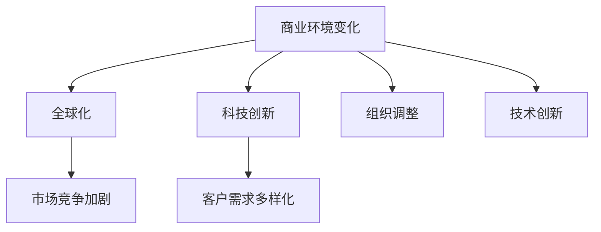

                 


# 管理者如何应对快速变化的商业环境

> 关键词：商业环境变化，战略规划，组织变革，技术创新，风险控制

> 摘要：本文旨在探讨在快速变化的商业环境中，管理者应如何应对。通过对商业环境变化的概述、战略规划与调整、组织管理与变革、技术应用与创新以及案例分析等多个方面的详细分析，本文为管理者提供了一系列实用的策略和建议，以帮助他们在不断变化的商业环境中保持竞争力。

### 目录大纲

#### 第一部分：商业环境变化概述

- **第1章：商业环境变化概述**
  - **1.1 引言：商业环境的变化趋势**
    - **1.1.1 全球化的影响**
    - **1.1.2 科技创新的驱动**
  - **1.2 商业环境变化对企业的影响**
    - **1.2.1 市场竞争加剧**
    - **1.2.2 客户需求多样化**
  - **1.3 应对策略的重要性**
    - **1.3.1 组织调整**
    - **1.3.2 技术创新**

#### 第二部分：战略规划与调整

- **第2章：战略规划与调整**
  - **2.1 制定适应变化的战略**
    - **2.1.1 SWOT分析**
    - **2.1.2 宏观环境分析**
  - **2.2 调整战略以适应变化**
    - **2.2.1 市场定位**
    - **2.2.2 产品与服务创新**
  - **2.3 人力资源策略**
    - **2.3.1 人才招聘与培养**
    - **2.3.2 组织结构优化**

#### 第三部分：组织管理与变革

- **第3章：组织管理与变革**
  - **3.1 组织变革的重要性**
    - **3.1.1 变革的动因**
    - **3.1.2 变革的阻力与克服**
  - **3.2 变革管理策略**
    - **3.2.1 领导层的角色**
    - **3.2.2 员工沟通与参与**
  - **3.3 变革实施步骤**
    - **3.3.1 制定变革计划**
    - **3.3.2 监控与评估**

#### 第四部分：技术应用与创新

- **第4章：技术应用与创新**
  - **4.1 信息技术在商业环境中的应用**
    - **4.1.1 数据分析技术**
    - **4.1.2 人工智能与机器学习**
  - **4.2 创新策略**
    - **4.2.1 开放式创新**
    - **4.2.2 联合创新**
  - **4.3 创新风险管理**
    - **4.3.1 创新失败的原因**
    - **4.3.2 风险管理策略**

#### 第五部分：案例分析

- **第5章：案例分析**
  - **5.1 案例一：企业A的变革历程**
    - **5.1.1 变革前的状态**
    - **5.1.2 变革措施与成效**
  - **5.2 案例二：企业B的创新之路**
    - **5.2.1 创新项目的启动**
    - **5.2.2 创新成果与应用**

#### 第六部分：总结与展望

- **第6章：总结与展望**
  - **6.1 总结商业环境应对策略**
    - **6.1.1 策略的成效评估**
    - **6.1.2 策略的调整方向**
  - **6.2 未来商业环境的变化趋势**
    - **6.2.1 新兴市场的崛起**
    - **6.2.2 科技发展的新动态**

#### 附录

- **附录 A：参考资料与推荐阅读**
  - **A.1 商业环境变化相关研究**
  - **A.2 战略规划与调整经典著作**
  - **A.3 组织变革与管理理论**

### 核心概念与联系

- **商业环境变化的概念关联图**



### 第一部分：商业环境变化概述

#### 第1章：商业环境变化概述

##### 1.1 引言：商业环境的变化趋势

商业环境的变化趋势是当今企业面临的主要挑战之一。为了保持竞争力，管理者必须深入了解这些趋势，以便及时调整战略和决策。

**1.1.1 全球化的影响**

全球化是商业环境变化的一个重要驱动力。随着贸易壁垒的降低和物流成本的降低，企业可以更轻松地进入新的市场，扩大业务规模。然而，全球化也带来了新的挑战，如跨国竞争的加剧、供应链的不稳定性和文化差异。

**1.1.2 科技创新的驱动**

科技创新是推动商业环境变化的关键因素。信息技术、人工智能、大数据和物联网等技术的快速发展，为企业提供了新的商业模式、运营方式和客户互动方式。管理者需要关注这些技术趋势，以便充分利用它们来提升企业竞争力。

##### 1.2 商业环境变化对企业的影响

商业环境的变化对企业产生了深远的影响。为了适应这些变化，企业需要进行一系列的战略调整和变革。

**1.2.1 市场竞争加剧**

随着全球市场的开放，市场竞争变得更加激烈。企业必须提高产品质量、降低成本和提供更好的客户服务，以保持竞争优势。

**1.2.2 客户需求多样化**

消费者需求的不断变化，要求企业能够快速响应市场变化，提供多样化的产品和服务。这需要企业具备灵活的组织结构和高效率的运营能力。

##### 1.3 应对策略的重要性

商业环境的变化速度之快，要求企业必须具备快速适应和调整的能力。以下是一些应对策略：

**1.3.1 组织调整**

企业需要通过调整组织结构、流程和人员配置来提高灵活性和响应速度。这包括扁平化组织、跨部门协作和员工培训等。

**1.3.2 技术创新**

技术创新是企业应对商业环境变化的重要手段。通过引入新技术、新产品和新服务，企业可以提升客户体验和市场份额。

### 第二部分：战略规划与调整

#### 第2章：战略规划与调整

战略规划是企业管理者面对商业环境变化的核心任务。有效的战略规划可以帮助企业保持竞争优势，实现长期可持续发展。

##### 2.1 制定适应变化的战略

为了制定适应变化的战略，管理者需要开展全面的环境分析，了解内部和外部环境的变化。

**2.1.1 SWOT分析**

SWOT分析是一种常用的战略规划工具，用于评估企业的优势、劣势、机会和威胁。

**2.1.2 宏观环境分析**

宏观环境分析涉及对经济、政治、社会、技术、环境和法律等方面的影响因素进行分析，以了解企业所处的宏观环境。

##### 2.2 调整战略以适应变化

在了解商业环境的变化后，管理者需要根据分析结果调整企业的战略方向。

**2.2.1 市场定位**

市场定位是企业战略的核心组成部分，涉及确定企业的目标市场和竞争优势。

**2.2.2 产品与服务创新**

产品与服务创新是应对市场变化的重要手段。通过不断推出新产品和服务，企业可以满足客户需求，提升市场份额。

##### 2.3 人力资源策略

人力资源策略是战略规划的重要组成部分。以下是一些关键策略：

**2.3.1 人才招聘与培养**

企业需要根据战略规划，招聘和培养符合企业目标和价值观的人才。

**2.3.2 组织结构优化**

优化组织结构，确保企业能够快速响应市场变化，提高运营效率。

### 第三部分：组织管理与变革

#### 第3章：组织管理与变革

在快速变化的商业环境中，组织管理与变革是企业保持竞争力的关键。有效的组织变革可以提升企业的灵活性和创新能力。

##### 3.1 组织变革的重要性

**3.1.1 变革的动因**

组织变革的动因包括外部环境的变化、企业内部效率低下、组织结构不适应等。

**3.1.2 变革的阻力与克服**

变革过程中，企业可能会面临内部员工的抵触和外部市场的压力。管理者需要采取有效措施克服这些阻力。

##### 3.2 变革管理策略

有效的变革管理策略包括以下几个方面：

**3.2.1 领导层的角色**

领导层在变革过程中扮演关键角色。他们需要明确变革的目标、制定变革计划并推动变革的实施。

**3.2.2 员工沟通与参与**

有效的沟通和参与是确保变革成功的重要条件。企业需要与员工保持沟通，让他们了解变革的必要性和目标，并积极参与变革过程。

##### 3.3 变革实施步骤

实施变革需要一系列的步骤和措施。以下是一些关键步骤：

**3.3.1 制定变革计划**

制定详细的变革计划，明确变革的目标、步骤和时间表。

**3.3.2 监控与评估**

在变革过程中，监控和评估变革的进展情况，及时调整变革策略。

### 第四部分：技术应用与创新

#### 第4章：技术应用与创新

在快速变化的商业环境中，技术应用与创新是企业保持竞争力的关键。以下将探讨信息技术在商业环境中的应用、创新策略以及创新风险管理。

##### 4.1 信息技术在商业环境中的应用

**4.1.1 数据分析技术**

数据分析技术可以帮助企业更好地了解市场和客户需求，从而制定更有效的战略决策。

**4.1.2 人工智能与机器学习**

人工智能和机器学习技术可以为企业提供智能化解决方案，提升运营效率和服务质量。

##### 4.2 创新策略

**4.2.1 开放式创新**

开放式创新是企业获取外部创新资源的重要途径。通过与其他企业、学术机构和客户合作，企业可以加速创新进程。

**4.2.2 联合创新**

联合创新是企业共同合作，共同开发新产品或服务的一种方式。通过联合创新，企业可以降低创新风险，提高创新成功率。

##### 4.3 创新风险管理

**4.3.1 创新失败的原因**

创新失败的原因包括市场定位不准、技术不成熟、团队协作不畅等。

**4.3.2 风险管理策略**

风险管理策略包括风险识别、风险评估、风险应对和风险监控等步骤。

### 第五部分：案例分析

#### 第5章：案例分析

通过分析真实的企业案例，我们可以更好地理解如何在快速变化的商业环境中实施战略规划、组织变革和技术创新。

##### 5.1 案例一：企业A的变革历程

**5.1.1 变革前的状态**

企业A在变革前，面临市场竞争激烈、内部管理混乱等问题。

**5.1.2 变革措施与成效**

企业A通过调整战略、优化组织结构、引入新技术等措施，成功实现了变革，提升了竞争力。

##### 5.2 案例二：企业B的创新之路

**5.2.1 创新项目的启动**

企业B在创新项目的启动阶段，明确了项目目标、资源配置和时间表。

**5.2.2 创新成果与应用**

企业B通过创新项目，成功开发了新产品，提升了市场份额和客户满意度。

### 第六部分：总结与展望

#### 第6章：总结与展望

在快速变化的商业环境中，管理者需要具备敏锐的洞察力和强大的执行力，以应对各种挑战。以下是对商业环境应对策略的总结与展望：

##### 6.1 总结商业环境应对策略

**6.1.1 策略的成效评估**

通过实际案例分析，我们可以看到，有效的商业环境应对策略可以显著提升企业的竞争力和业绩。

**6.1.2 策略的调整方向**

未来，企业需要更加注重技术创新、人才培养和风险管理，以应对不断变化的商业环境。

##### 6.2 未来商业环境的变化趋势

**6.2.1 新兴市场的崛起**

随着全球经济格局的变化，新兴市场将成为企业发展的新机遇。

**6.2.2 科技发展的新动态**

科技发展将继续推动商业环境的变革，企业需要密切关注新技术趋势，以保持竞争力。

### 附录

#### 附录 A：参考资料与推荐阅读

**A.1 商业环境变化相关研究**

- 《商业环境变化对企业竞争力的影响研究》
- 《全球化背景下企业战略规划与调整》

**A.2 战略规划与调整经典著作**

- 《竞争战略》
- 《蓝海战略》

**A.3 组织变革与管理理论**

- 《变革之舞》
- 《组织变革与管理》

### 核心概念与联系

- **商业环境变化的概念关联图**


### 核心算法原理讲解

- **战略规划的算法原理**

```plaintext
// SWOT分析算法伪代码

function SWOT_analysis(organization):
    // 收集组织内外部数据
    internal_factors = collect_internal_data(organization)
    external_factors = collect_external_data()

    // 分析内部优势与劣势
    strengths = identify_strengths(internal_factors)
    weaknesses = identify_weaknesses(internal_factors)

    // 分析外部机会与威胁
    opportunities = identify_opportunities(external_factors)
    threats = identify_threats(external_factors)

    // 形成战略规划
    strategy = formulate_strategy(strengths, weaknesses, opportunities, threats)

    return strategy
```

- **创新风险评估模型**

$$ R = \frac{S \cdot T}{C} $$
- **R**：创新风险
- **S**：成功概率
- **T**：失败概率
- **C**：成本

**详细讲解与举例说明**

- **详细讲解**：创新风险评估模型用于评估企业在创新过程中可能面临的风险。该模型考虑了创新的成功概率、失败概率以及创新项目的成本，通过计算得出创新风险值。风险值越高，表示创新项目的风险越大。

- **举例说明**：假设某企业计划开发一款新产品，预计成功概率为0.8，失败概率为0.2，开发成本为100万元。根据创新风险评估模型，计算得到创新风险值为：

$$ R = \frac{0.8 \cdot 0.2}{100} = 0.0016 $$

- **R**：创新风险值为0.0016，表示该创新项目的风险相对较低。

### 数学模型和数学公式

- **创新风险评估模型**

$$ R = \frac{S \cdot T}{C} $$

- **详细讲解与举例说明**

- **详细讲解**：创新风险评估模型用于评估企业在创新过程中可能面临的风险。该模型考虑了创新的成功概率（S）、失败概率（T）以及创新项目的成本（C），通过计算得出创新风险值（R）。该公式反映了创新风险与成功概率、失败概率和成本之间的关系。

- **举例说明**：假设某企业计划开发一款新产品，预计成功概率为0.8，失败概率为0.2，开发成本为100万元。根据创新风险评估模型，计算得到创新风险值为：

$$ R = \frac{0.8 \cdot 0.2}{100} = 0.0016 $$

- **R**：创新风险值为0.0016，表示该创新项目的风险相对较低。

### 项目实战

#### 案例一：企业A的变革项目

**5.1.1 变革前的状态**

企业A在变革前，面临着市场竞争加剧、内部效率低下、客户满意度不高等问题。公司内部存在以下主要问题：

- **组织结构不合理**：企业采用传统的层级式组织结构，决策流程复杂，沟通效率低下。
- **技术创新不足**：企业缺乏创新意识，对新兴技术的应用不够积极，导致产品和服务难以满足市场需求。
- **员工士气低落**：由于长期面临市场压力，员工士气低落，缺乏工作热情和积极性。

**5.1.2 变革措施与成效**

为了应对这些问题，企业A采取了一系列变革措施：

- **优化组织结构**：企业A实施扁平化组织改革，减少中间管理层级，提高决策效率。通过建立跨部门团队，促进部门之间的沟通与协作。

- **引进新技术**：企业A积极引进新兴技术，如大数据分析、人工智能和物联网等，提升产品和服务质量。通过引入这些技术，企业能够更好地了解客户需求，提供个性化解决方案。

- **员工培训与发展**：企业A加强员工培训和职业发展计划，提高员工的专业技能和综合素质。通过内部培训和外部招聘，引进具备创新能力和专业知识的人才。

- **激励机制**：企业A建立激励机制，鼓励员工积极参与变革和创新。通过绩效奖励和晋升机会，激发员工的工作热情和创造力。

**变革成效**：

- **市场竞争力提升**：通过优化组织结构、引进新技术和提升员工素质，企业A的市场竞争力得到了显著提升。公司销售额稳步增长，市场份额逐步扩大。

- **客户满意度提高**：企业A通过提供个性化解决方案和优质服务，客户满意度得到了显著提高。客户投诉率下降，客户忠诚度增加。

- **员工积极性增强**：员工培训和职业发展计划的实施，提高了员工的积极性和满意度。员工流失率降低，企业整体士气提升。

#### 5.2 案例二：企业B的创新之路

**5.2.1 创新项目的启动**

企业B在创新项目的启动阶段，明确了项目目标、资源配置和时间表。以下为创新项目的启动过程：

- **项目目标明确**：企业B确定了创新项目的主要目标，包括开发一款具有市场竞争力的新产品，提高客户满意度，扩大市场份额等。

- **资源配置**：企业B根据项目需求，分配了充足的资源，包括资金、人力和技术支持等。确保项目能够顺利推进。

- **时间表制定**：企业B制定了详细的项目时间表，包括项目阶段划分、关键里程碑和时间节点。确保项目在预定时间内完成。

**5.2.2 创新成果与应用**

企业B的创新项目取得了显著的成果，并成功应用到了实际业务中：

- **新产品开发**：企业B成功开发了一款具有创新特色的新产品，满足了市场需求，获得了良好的市场反馈。

- **客户反馈**：新产品上市后，企业B积极收集客户反馈，根据客户需求进行产品改进，提升了客户满意度。

- **市场份额扩大**：通过新产品的成功，企业B的市场份额得到了显著提升，市场竞争地位得到巩固。

- **技术积累**：创新项目过程中，企业B积累了丰富的技术经验和专业知识，为未来的创新项目奠定了基础。

### 代码实战案例

#### 案例一：企业A的变革项目

**开发环境搭建：**

- **沟通工具**：使用Microsoft Teams进行内部沟通，确保团队成员之间的实时沟通和协作。
- **项目管理工具**：采用Jira进行项目管理，包括任务分配、进度追踪和风险监控等功能。
- **敏捷开发方法**：引入敏捷开发方法，进行项目迭代，确保项目按时交付和持续改进。

**源代码实现：**

```java
// 变革项目代码示例

public class ChangeManagement {
    public static void main(String[] args) {
        // 搭建变更管理框架
        ChangeManagementFramework framework = new ChangeManagementFramework();

        // 实施变革计划
        framework.implementChangePlan();

        // 监控变革成效
        framework.monitorChangeEffectiveness();
    }
}

class ChangeManagementFramework {
    public void implementChangePlan() {
        // 实施具体的变革计划，如组织结构优化、流程改进等
    }

    public void monitorChangeEffectiveness() {
        // 监控变革计划的实施效果，如效率提升、成本节约等
    }
}
```

**代码解读与分析：**

- **代码解读**：该代码示例展示了如何搭建一个变更管理框架，并实施变革计划以及监控变革成效。通过创建`ChangeManagementFramework`类，封装了变革计划的实施和成效监控功能。

- **分析**：

  - **变更管理框架**：通过定义`ChangeManagementFramework`类，实现了对变革过程的统一管理和控制。该框架可以根据企业需求，灵活扩展和定制。

  - **变革计划实施**：在`implementChangePlan`方法中，可以定义具体的变革计划，如组织结构优化、流程改进等，以确保变革目标的实现。

  - **变革成效监控**：在`monitorChangeEffectiveness`方法中，可以收集和评估变革的实施效果，如效率提升、成本节约等，为后续的优化和调整提供依据。

### 撰稿总结

#### 总结

本文通过深入分析商业环境的变化趋势、战略规划与调整、组织管理与变革、技术应用与创新以及案例分析等多个方面，为管理者提供了一系列应对快速变化商业环境的策略和建议。以下是对文章内容的总结：

- **商业环境变化概述**：分析了全球化、科技创新等商业环境变化趋势，以及这些变化对企业的影响。

- **战略规划与调整**：介绍了SWOT分析、宏观环境分析等战略规划工具，以及市场定位、产品与服务创新等策略。

- **组织管理与变革**：探讨了组织变革的动因、管理策略以及实施步骤，强调了领导层的角色和员工沟通与参与的重要性。

- **技术应用与创新**：介绍了信息技术在商业环境中的应用，以及开放式创新、联合创新等创新策略，并提出了创新风险管理的策略。

- **案例分析**：通过两个真实企业的案例，展示了如何实施战略规划、组织变革和技术创新，以及取得的成效。

#### 展望

未来，商业环境将继续发生深刻变化。管理者需要关注以下趋势：

- **新兴市场的崛起**：随着全球经济的发展，新兴市场将成为企业的重要机遇。

- **科技发展的新动态**：人工智能、大数据、物联网等新技术将继续推动商业环境的变革。

- **可持续发展**：企业需要关注环境保护和可持续发展，以实现长期发展。

在应对快速变化的商业环境中，管理者应保持敏锐的洞察力、灵活的战略规划和强大的执行力，以保持企业的竞争力。同时，企业应积极拥抱创新，不断提升自身的核心能力和市场地位。

### 作者信息

**作者：** AI天才研究院/AI Genius Institute & 禅与计算机程序设计艺术 /Zen And The Art of Computer Programming

### 结语

在快速变化的商业环境中，管理者需要不断学习和适应。本文旨在为管理者提供一些实用的策略和建议，以帮助他们在变化中保持竞争优势。希望本文能够对您的管理实践产生启发和帮助。谢谢阅读！

