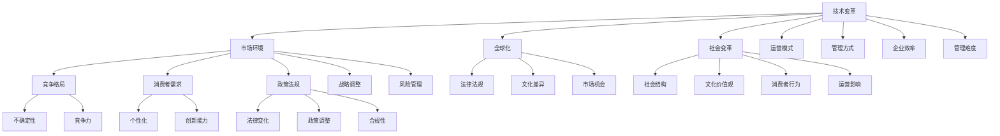

                 

# 管理者如何应对快速变化的环境

> 关键词：管理者，快速变化环境，敏捷管理，创新管理，跨界合作，风险管理，组织变革，领导力发展，员工培训与发展，成功管理案例

> 摘要：本文旨在探讨管理者如何在快速变化的环境中实现有效管理。文章首先概述了快速变化环境的核心特征和企业管理面临的挑战，然后提出了适应快速变化的管理策略，包括敏捷管理、创新管理和跨界合作。接着，文章讨论了战略调整和风险管理的重要性，以及如何通过组织变革、领导力发展和员工培训提升组织适应能力。最后，通过成功管理案例的分析，总结了快速变化环境下管理者的应对策略，并展望了未来管理趋势。

## 目录大纲

## 第一部分：快速变化环境概述

### 第1章：快速变化环境的核心特征

#### 1.1 什么是快速变化环境

#### 1.2 快速变化环境的驱动因素

#### 1.3 快速变化环境下的企业管理挑战

### 第2章：适应快速变化的管理策略

#### 2.1 敏捷管理

#### 2.2 创新管理

#### 2.3 跨界合作

## 第二部分：战略调整与风险管理

### 第3章：战略调整

#### 3.1 重新审视企业使命与愿景

#### 3.2 市场定位与目标客户分析

#### 3.3 产品与服务创新策略

### 第4章：风险管理

#### 4.1 快速变化环境下的风险识别

#### 4.2 风险评估与优先级排序

#### 4.3 风险应对策略与实施方案

## 第三部分：组织能力建设

### 第5章：组织变革

#### 5.1 变革的必要性

#### 5.2 变革的推动与阻力

#### 5.3 变革的步骤与实施策略

### 第6章：领导力发展

#### 6.1 快速变化环境下的领导力特征

#### 6.2 领导力发展的方法与工具

#### 6.3 团队领导力提升策略

### 第7章：员工培训与发展

#### 7.1 培训需求的评估与规划

#### 7.2 培训内容的制定与实施

#### 7.3 员工发展计划与职业规划

## 第四部分：案例分析

### 第8章：快速变化环境下的成功管理案例

#### 8.1 案例一：某科技企业的敏捷转型

#### 8.2 案例二：某零售企业的创新战略

#### 8.3 案例三：某金融机构的跨业合作

## 第五部分：结语

### 第9章：总结与展望

#### 9.1 快速变化环境管理的反思

#### 9.2 未来管理趋势的展望

## 附录

### 附录 A: 管理工具与资源

#### A.1 敏捷管理工具

#### A.2 创新管理工具

#### A.3 跨界合作工具

#### A.4 风险管理工具

#### A.5 领导力发展工具

#### A.6 培训与发展工具

#### A.7 常用资源

---

### 第一部分：快速变化环境概述

#### 第1章：快速变化环境的核心特征

**1.1 什么是快速变化环境**

在当今全球化和数字化时代，快速变化的环境已经成为企业管理者和研究人员关注的焦点。快速变化环境指的是企业面临的外部环境在不断变化，包括技术、市场、社会、政治等多个方面。这种变化具有以下几个核心特征：

1. **技术变革加速**：随着人工智能、物联网、区块链等新兴技术的快速发展，技术的更新换代速度加快，对企业的运营模式和管理方式提出了新的挑战。

2. **市场环境不确定**：市场的竞争格局和消费者需求不断变化，企业面临着前所未有的不确定性，需要快速适应和调整战略。

3. **全球化加剧**：全球化的进程使得企业面临更广阔的市场和更激烈的竞争，同时也要应对不同国家和地区的法律法规和文化差异。

4. **社会变革**：社会结构、文化价值观、消费者行为等都在发生深刻变化，企业需要关注这些变化对企业运营的影响。

**1.2 快速变化环境的驱动因素**

快速变化环境是由多个驱动因素共同作用形成的，以下是其中几个关键因素：

1. **技术创新**：技术的快速发展是推动变化的最主要因素。例如，云计算和大数据技术的应用，使得企业可以更快速地获取和处理信息，从而提升运营效率。

2. **市场竞争**：随着全球化和市场开放，企业面临更加激烈的竞争，需要不断创新和提高竞争力。

3. **消费者需求**：消费者需求的多样化和个性化，迫使企业必须提供更加灵活和多样化的产品和服务。

4. **政策法规**：政府政策的调整和法律法规的变化，也会对企业经营环境产生重要影响。

**1.3 快速变化环境下的企业管理挑战**

快速变化的环境给企业管理带来了诸多挑战：

1. **战略调整难度大**：企业需要不断调整战略以适应环境变化，但战略调整本身就是一个复杂的过程，需要考虑到市场、技术、人力等多个方面。

2. **组织变革困难**：快速变化的环境要求企业具备快速响应和创新能力，但组织变革往往面临员工抵触、管理难度增加等问题。

3. **人力资源管理**：快速变化的环境要求员工具备更高的技能和适应性，企业需要通过培训和发展来提升员工能力。

4. **风险管理**：快速变化的环境中，企业面临的风险更加多样和复杂，需要建立有效的风险管理体系。

#### 第2章：适应快速变化的管理策略

**2.1 敏捷管理**

敏捷管理是一种以快速响应变化为核心的管理理念，强调团队协作、持续交付和客户价值。敏捷管理的核心原则包括：

1. **用户故事和迭代开发**：通过用户故事来定义产品需求，采用迭代开发的方式逐步实现，确保产品始终与用户需求保持一致。

2. **持续集成和持续交付**：通过自动化测试和部署流程，实现快速集成和交付，提高开发效率和质量。

3. **团队协作和沟通**：建立高效的团队协作机制，促进团队成员之间的沟通和协作，确保项目顺利推进。

**2.2 创新管理**

创新管理是企业适应快速变化环境的重要手段，通过以下方法实现创新：

1. **开放式创新**：鼓励内部员工和外部合作伙伴共同参与创新活动，通过合作和竞争激发创新思维。

2. **创新生态系统**：建立创新生态系统，包括内部创新团队、外部创新合作伙伴、科研机构等，共同推动创新活动。

3. **创新资源投入**：为创新提供足够的资源和支持，包括资金、人力和时间等，确保创新活动能够持续进行。

**2.3 跨界合作**

跨界合作是企业适应快速变化环境的有效策略，通过与其他行业、企业或机构合作，实现资源共享和优势互补：

1. **跨行业合作**：与其他行业的企业合作，共同探索新兴市场和发展机会。

2. **跨企业合作**：与竞争对手或供应商合作，共同开发新技术和市场。

3. **跨界创新**：与其他领域的专家或机构合作，实现跨学科、跨领域的创新。

### 第二部分：战略调整与风险管理

#### 第3章：战略调整

**3.1 重新审视企业使命与愿景**

企业使命和愿景是企业发展的基石，快速变化环境要求企业重新审视和调整使命与愿景：

1. **明确企业使命**：确保企业使命与当前和未来的市场环境相匹配，为企业发展指明方向。

2. **调整企业愿景**：根据环境变化，重新定义企业愿景，确保企业能够在未来持续发展。

**3.2 市场定位与目标客户分析**

市场定位和目标客户分析是企业战略调整的重要环节：

1. **市场定位**：明确企业在市场中的定位，确定目标市场和目标客户群体。

2. **目标客户分析**：通过数据分析和市场调研，了解目标客户的需求和偏好，为企业提供定制化的产品和服务。

**3.3 产品与服务创新策略**

产品与服务创新是企业保持竞争力的关键，以下策略可以帮助企业实现产品与服务创新：

1. **需求驱动创新**：关注客户需求，以客户需求为导向，开发创新产品和服务。

2. **技术驱动创新**：利用新兴技术，如人工智能、物联网等，推动产品和服务创新。

3. **开放式创新**：与外部合作伙伴共同开展创新活动，实现资源共享和优势互补。

#### 第4章：风险管理

**4.1 快速变化环境下的风险识别**

快速变化环境下，企业面临的风险更加复杂和多变，以下方法可以帮助企业识别风险：

1. **外部环境分析**：通过分析政治、经济、社会、技术等因素，识别潜在的外部风险。

2. **内部环境分析**：分析企业内部管理、运营、组织等方面，识别潜在的风险。

**4.2 风险评估与优先级排序**

风险评估和优先级排序是风险管理的重要环节：

1. **风险评估**：对识别出的风险进行量化评估，确定风险的影响程度和可能性。

2. **优先级排序**：根据风险评估结果，对风险进行优先级排序，确保企业能够集中资源和精力应对最关键的风险。

**4.3 风险应对策略与实施方案**

风险应对策略和实施方案是风险管理的关键环节：

1. **风险预防**：通过制定预防措施，降低风险发生的概率。

2. **风险缓解**：通过制定缓解措施，降低风险的影响程度。

3. **风险转移**：通过保险等手段，将风险转移给第三方。

4. **风险接受**：对于无法预防或缓解的风险，企业需要接受并制定相应的应对策略。

### 第三部分：组织能力建设

#### 第5章：组织变革

**5.1 变革的必要性**

快速变化环境要求企业具备快速响应和创新能力，组织变革成为必然选择：

1. **适应环境变化**：通过组织变革，使企业能够更好地适应外部环境变化。

2. **提高竞争力**：通过组织变革，提高企业运营效率和管理水平，增强竞争力。

**5.2 变革的推动与阻力**

组织变革是一个复杂的过程，需要克服推动和阻力：

1. **推动变革**：通过明确变革目标、制定变革计划、激发员工参与等方式推动变革。

2. **应对阻力**：通过沟通、培训、激励等手段，降低员工对变革的抵触情绪。

**5.3 变革的步骤与实施策略**

组织变革需要遵循一定的步骤和实施策略：

1. **规划变革**：明确变革目标、制定变革计划、评估变革影响。

2. **实施变革**：按照变革计划，逐步推进变革，确保变革的顺利进行。

3. **监督与调整**：在变革过程中，持续监督变革效果，根据实际情况进行调整。

#### 第6章：领导力发展

**6.1 快速变化环境下的领导力特征**

快速变化环境对领导力提出了新的要求，以下是快速变化环境下领导力的特征：

1. **变革领导者**：能够推动组织变革，引领企业适应外部环境变化。

2. **创新领导者**：具备创新思维，能够带领团队实现产品和服务创新。

3. **跨领域领导者**：具备跨领域知识，能够整合不同领域的资源，实现跨界合作。

**6.2 领导力发展的方法与工具**

领导力发展需要采取有效的方法和工具，以下是几种常用的方法：

1. **领导力培训**：通过培训课程，提升领导者的管理技能和领导能力。

2. **领导力发展计划**：制定个性化的领导力发展计划，确保领导者能够持续提升能力。

3. **导师辅导**：通过导师辅导，帮助领导者解决实际问题，提升领导力。

**6.3 团队领导力提升策略**

团队领导力是企业竞争力的重要保障，以下是提升团队领导力的策略：

1. **团队建设**：通过团队建设活动，增强团队成员之间的信任和协作。

2. **目标设定**：明确团队目标，确保团队成员明确自己的职责和任务。

3. **激励与反馈**：通过激励和反馈，激发团队成员的积极性和创造力。

#### 第7章：员工培训与发展

**7.1 培训需求的评估与规划**

员工培训与发展需要基于实际需求进行评估和规划：

1. **评估培训需求**：通过调查问卷、访谈等方式，了解员工的知识、技能和需求。

2. **规划培训内容**：根据培训需求，制定培训计划，确保培训内容与员工需求相匹配。

**7.2 培训内容的制定与实施**

培训内容的制定和实施是员工培训的关键：

1. **制定培训内容**：根据员工需求，制定有针对性的培训课程，确保培训内容的实用性和有效性。

2. **实施培训**：按照培训计划，组织培训活动，确保培训的顺利进行。

**7.3 员工发展计划与职业规划**

员工发展计划和职业规划是员工长期发展的保障：

1. **员工发展计划**：制定员工发展计划，明确员工的职业发展路径和目标。

2. **职业规划**：通过职业规划，帮助员工明确自己的职业发展方向，提升职业素养。

### 第四部分：案例分析

#### 第8章：快速变化环境下的成功管理案例

**8.1 案例一：某科技企业的敏捷转型**

**8.2 案例二：某零售企业的创新战略**

**8.3 案例三：某金融机构的跨业合作**

### 第五部分：结语

#### 第9章：总结与展望

**9.1 快速变化环境管理的反思**

**9.2 未来管理趋势的展望**

## 附录

### 附录 A: 管理工具与资源

#### A.1 敏捷管理工具

#### A.2 创新管理工具

#### A.3 跨界合作工具

#### A.4 风险管理工具

#### A.5 领导力发展工具

#### A.6 培训与发展工具

#### A.7 常用资源

---

### 第一部分：快速变化环境概述

#### 第1章：快速变化环境的核心特征

**1.1 什么是快速变化环境**

在当今全球化和数字化时代，快速变化的环境已经成为企业管理者和研究人员关注的焦点。快速变化环境指的是企业面临的外部环境在不断变化，包括技术、市场、社会、政治等多个方面。这种变化具有以下几个核心特征：

1. **技术变革加速**：随着人工智能、物联网、区块链等新兴技术的快速发展，技术的更新换代速度加快，对企业的运营模式和管理方式提出了新的挑战。

2. **市场环境不确定**：市场的竞争格局和消费者需求不断变化，企业面临着前所未有的不确定性，需要快速适应和调整战略。

3. **全球化加剧**：全球化的进程使得企业面临更广阔的市场和更激烈的竞争，同时也要应对不同国家和地区的法律法规和文化差异。

4. **社会变革**：社会结构、文化价值观、消费者行为等都在发生深刻变化，企业需要关注这些变化对企业运营的影响。

**1.2 快速变化环境的驱动因素**

快速变化环境是由多个驱动因素共同作用形成的，以下是其中几个关键因素：

1. **技术创新**：技术的快速发展是推动变化的最主要因素。例如，云计算和大数据技术的应用，使得企业可以更快速地获取和处理信息，从而提升运营效率。

2. **市场竞争**：随着全球化和市场开放，企业面临更加激烈的竞争，需要不断创新和提高竞争力。

3. **消费者需求**：消费者需求的多样化和个性化，迫使企业必须提供更加灵活和多样化的产品和服务。

4. **政策法规**：政府政策的调整和法律法规的变化，也会对企业经营环境产生重要影响。

**1.3 快速变化环境下的企业管理挑战**

快速变化的环境给企业管理带来了诸多挑战：

1. **战略调整难度大**：企业需要不断调整战略以适应环境变化，但战略调整本身就是一个复杂的过程，需要考虑到市场、技术、人力等多个方面。

2. **组织变革困难**：快速变化的环境要求企业具备快速响应和创新能力，但组织变革往往面临员工抵触、管理难度增加等问题。

3. **人力资源管理**：快速变化的环境要求员工具备更高的技能和适应性，企业需要通过培训和发展来提升员工能力。

4. **风险管理**：快速变化的环境中，企业面临的风险更加多样和复杂，需要建立有效的风险管理体系。

#### 第2章：适应快速变化的管理策略

**2.1 敏捷管理**

敏捷管理是一种以快速响应变化为核心的管理理念，强调团队协作、持续交付和客户价值。敏捷管理的核心原则包括：

1. **用户故事和迭代开发**：通过用户故事来定义产品需求，采用迭代开发的方式逐步实现，确保产品始终与用户需求保持一致。

2. **持续集成和持续交付**：通过自动化测试和部署流程，实现快速集成和交付，提高开发效率和质量。

3. **团队协作和沟通**：建立高效的团队协作机制，促进团队成员之间的沟通和协作，确保项目顺利推进。

**2.2 创新管理**

创新管理是企业适应快速变化环境的重要手段，通过以下方法实现创新：

1. **开放式创新**：鼓励内部员工和外部合作伙伴共同参与创新活动，通过合作和竞争激发创新思维。

2. **创新生态系统**：建立创新生态系统，包括内部创新团队、外部创新合作伙伴、科研机构等，共同推动创新活动。

3. **创新资源投入**：为创新提供足够的资源和支持，包括资金、人力和时间等，确保创新活动能够持续进行。

**2.3 跨界合作**

跨界合作是企业适应快速变化环境的有效策略，通过与其他行业、企业或机构合作，实现资源共享和优势互补：

1. **跨行业合作**：与其他行业的企业合作，共同探索新兴市场和发展机会。

2. **跨企业合作**：与竞争对手或供应商合作，共同开发新技术和市场。

3. **跨界创新**：与其他领域的专家或机构合作，实现跨学科、跨领域的创新。

### 第二部分：战略调整与风险管理

#### 第3章：战略调整

**3.1 重新审视企业使命与愿景**

企业使命和愿景是企业发展的基石，快速变化环境要求企业重新审视和调整使命与愿景：

1. **明确企业使命**：确保企业使命与当前和未来的市场环境相匹配，为企业发展指明方向。

2. **调整企业愿景**：根据环境变化，重新定义企业愿景，确保企业能够在未来持续发展。

**3.2 市场定位与目标客户分析**

市场定位和目标客户分析是企业战略调整的重要环节：

1. **市场定位**：明确企业在市场中的定位，确定目标市场和目标客户群体。

2. **目标客户分析**：通过数据分析和市场调研，了解目标客户的需求和偏好，为企业提供定制化的产品和服务。

**3.3 产品与服务创新策略**

产品与服务创新是企业保持竞争力的关键，以下策略可以帮助企业实现产品与服务创新：

1. **需求驱动创新**：关注客户需求，以客户需求为导向，开发创新产品和服务。

2. **技术驱动创新**：利用新兴技术，如人工智能、物联网等，推动产品和服务创新。

3. **开放式创新**：与外部合作伙伴共同开展创新活动，实现资源共享和优势互补。

#### 第4章：风险管理

**4.1 快速变化环境下的风险识别**

快速变化环境下，企业面临的风险更加复杂和多变，以下方法可以帮助企业识别风险：

1. **外部环境分析**：通过分析政治、经济、社会、技术等因素，识别潜在的外部风险。

2. **内部环境分析**：分析企业内部管理、运营、组织等方面，识别潜在的风险。

**4.2 风险评估与优先级排序**

风险评估和优先级排序是风险管理的重要环节：

1. **风险评估**：对识别出的风险进行量化评估，确定风险的影响程度和可能性。

2. **优先级排序**：根据风险评估结果，对风险进行优先级排序，确保企业能够集中资源和精力应对最关键的风险。

**4.3 风险应对策略与实施方案**

风险应对策略和实施方案是风险管理的关键环节：

1. **风险预防**：通过制定预防措施，降低风险发生的概率。

2. **风险缓解**：通过制定缓解措施，降低风险的影响程度。

3. **风险转移**：通过保险等手段，将风险转移给第三方。

4. **风险接受**：对于无法预防或缓解的风险，企业需要接受并制定相应的应对策略。

### 第三部分：组织能力建设

#### 第5章：组织变革

**5.1 变革的必要性**

快速变化环境要求企业具备快速响应和创新能力，组织变革成为必然选择：

1. **适应环境变化**：通过组织变革，使企业能够更好地适应外部环境变化。

2. **提高竞争力**：通过组织变革，提高企业运营效率和管理水平，增强竞争力。

**5.2 变革的推动与阻力**

组织变革是一个复杂的过程，需要克服推动和阻力：

1. **推动变革**：通过明确变革目标、制定变革计划、激发员工参与等方式推动变革。

2. **应对阻力**：通过沟通、培训、激励等手段，降低员工对变革的抵触情绪。

**5.3 变革的步骤与实施策略**

组织变革需要遵循一定的步骤和实施策略：

1. **规划变革**：明确变革目标、制定变革计划、评估变革影响。

2. **实施变革**：按照变革计划，逐步推进变革，确保变革的顺利进行。

3. **监督与调整**：在变革过程中，持续监督变革效果，根据实际情况进行调整。

#### 第6章：领导力发展

**6.1 快速变化环境下的领导力特征**

快速变化环境对领导力提出了新的要求，以下是快速变化环境下领导力的特征：

1. **变革领导者**：能够推动组织变革，引领企业适应外部环境变化。

2. **创新领导者**：具备创新思维，能够带领团队实现产品和服务创新。

3. **跨领域领导者**：具备跨领域知识，能够整合不同领域的资源，实现跨界合作。

**6.2 领导力发展的方法与工具**

领导力发展需要采取有效的方法和工具，以下是几种常用的方法：

1. **领导力培训**：通过培训课程，提升领导者的管理技能和领导能力。

2. **领导力发展计划**：制定个性化的领导力发展计划，确保领导者能够持续提升能力。

3. **导师辅导**：通过导师辅导，帮助领导者解决实际问题，提升领导力。

**6.3 团队领导力提升策略**

团队领导力是企业竞争力的重要保障，以下是提升团队领导力的策略：

1. **团队建设**：通过团队建设活动，增强团队成员之间的信任和协作。

2. **目标设定**：明确团队目标，确保团队成员明确自己的职责和任务。

3. **激励与反馈**：通过激励和反馈，激发团队成员的积极性和创造力。

#### 第7章：员工培训与发展

**7.1 培训需求的评估与规划**

员工培训与发展需要基于实际需求进行评估和规划：

1. **评估培训需求**：通过调查问卷、访谈等方式，了解员工的知识、技能和需求。

2. **规划培训内容**：根据培训需求，制定培训计划，确保培训内容与员工需求相匹配。

**7.2 培训内容的制定与实施**

培训内容的制定和实施是员工培训的关键：

1. **制定培训内容**：根据员工需求，制定有针对性的培训课程，确保培训内容的实用性和有效性。

2. **实施培训**：按照培训计划，组织培训活动，确保培训的顺利进行。

**7.3 员工发展计划与职业规划**

员工发展计划和职业规划是员工长期发展的保障：

1. **员工发展计划**：制定员工发展计划，明确员工的职业发展路径和目标。

2. **职业规划**：通过职业规划，帮助员工明确自己的职业发展方向，提升职业素养。

### 第四部分：案例分析

#### 第8章：快速变化环境下的成功管理案例

**8.1 案例一：某科技企业的敏捷转型**

**8.2 案例二：某零售企业的创新战略**

**8.3 案例三：某金融机构的跨业合作**

### 第五部分：结语

#### 第9章：总结与展望

**9.1 快速变化环境管理的反思**

**9.2 未来管理趋势的展望**

## 附录

### 附录 A: 管理工具与资源

#### A.1 敏捷管理工具

#### A.2 创新管理工具

#### A.3 跨界合作工具

#### A.4 风险管理工具

#### A.5 领导力发展工具

#### A.6 培训与发展工具

#### A.7 常用资源

---

### 第一部分：快速变化环境概述

#### 第1章：快速变化环境的核心特征

**1.1 什么是快速变化环境**

在当今全球化和数字化时代，快速变化的环境已经成为企业管理者和研究人员关注的焦点。快速变化环境指的是企业面临的外部环境在不断变化，包括技术、市场、社会、政治等多个方面。这种变化具有以下几个核心特征：

1. **技术变革加速**：随着人工智能、物联网、区块链等新兴技术的快速发展，技术的更新换代速度加快，对企业的运营模式和管理方式提出了新的挑战。

2. **市场环境不确定**：市场的竞争格局和消费者需求不断变化，企业面临着前所未有的不确定性，需要快速适应和调整战略。

3. **全球化加剧**：全球化的进程使得企业面临更广阔的市场和更激烈的竞争，同时也要应对不同国家和地区的法律法规和文化差异。

4. **社会变革**：社会结构、文化价值观、消费者行为等都在发生深刻变化，企业需要关注这些变化对企业运营的影响。

**1.2 快速变化环境的驱动因素**

快速变化环境是由多个驱动因素共同作用形成的，以下是其中几个关键因素：

1. **技术创新**：技术的快速发展是推动变化的最主要因素。例如，云计算和大数据技术的应用，使得企业可以更快速地获取和处理信息，从而提升运营效率。

2. **市场竞争**：随着全球化和市场开放，企业面临更加激烈的竞争，需要不断创新和提高竞争力。

3. **消费者需求**：消费者需求的多样化和个性化，迫使企业必须提供更加灵活和多样化的产品和服务。

4. **政策法规**：政府政策的调整和法律法规的变化，也会对企业经营环境产生重要影响。

**1.3 快速变化环境下的企业管理挑战**

快速变化的环境给企业管理带来了诸多挑战：

1. **战略调整难度大**：企业需要不断调整战略以适应环境变化，但战略调整本身就是一个复杂的过程，需要考虑到市场、技术、人力等多个方面。

2. **组织变革困难**：快速变化的环境要求企业具备快速响应和创新能力，但组织变革往往面临员工抵触、管理难度增加等问题。

3. **人力资源管理**：快速变化的环境要求员工具备更高的技能和适应性，企业需要通过培训和发展来提升员工能力。

4. **风险管理**：快速变化的环境中，企业面临的风险更加多样和复杂，需要建立有效的风险管理体系。

#### 第2章：适应快速变化的管理策略

**2.1 敏捷管理**

敏捷管理是一种以快速响应变化为核心的管理理念，强调团队协作、持续交付和客户价值。敏捷管理的核心原则包括：

1. **用户故事和迭代开发**：通过用户故事来定义产品需求，采用迭代开发的方式逐步实现，确保产品始终与用户需求保持一致。

2. **持续集成和持续交付**：通过自动化测试和部署流程，实现快速集成和交付，提高开发效率和质量。

3. **团队协作和沟通**：建立高效的团队协作机制，促进团队成员之间的沟通和协作，确保项目顺利推进。

**2.2 创新管理**

创新管理是企业适应快速变化环境的重要手段，通过以下方法实现创新：

1. **开放式创新**：鼓励内部员工和外部合作伙伴共同参与创新活动，通过合作和竞争激发创新思维。

2. **创新生态系统**：建立创新生态系统，包括内部创新团队、外部创新合作伙伴、科研机构等，共同推动创新活动。

3. **创新资源投入**：为创新提供足够的资源和支持，包括资金、人力和时间等，确保创新活动能够持续进行。

**2.3 跨界合作**

跨界合作是企业适应快速变化环境的有效策略，通过与其他行业、企业或机构合作，实现资源共享和优势互补：

1. **跨行业合作**：与其他行业的企业合作，共同探索新兴市场和发展机会。

2. **跨企业合作**：与竞争对手或供应商合作，共同开发新技术和市场。

3. **跨界创新**：与其他领域的专家或机构合作，实现跨学科、跨领域的创新。

### 第二部分：战略调整与风险管理

#### 第3章：战略调整

**3.1 重新审视企业使命与愿景**

企业使命和愿景是企业发展的基石，快速变化环境要求企业重新审视和调整使命与愿景：

1. **明确企业使命**：确保企业使命与当前和未来的市场环境相匹配，为企业发展指明方向。

2. **调整企业愿景**：根据环境变化，重新定义企业愿景，确保企业能够在未来持续发展。

**3.2 市场定位与目标客户分析**

市场定位和目标客户分析是企业战略调整的重要环节：

1. **市场定位**：明确企业在市场中的定位，确定目标市场和目标客户群体。

2. **目标客户分析**：通过数据分析和市场调研，了解目标客户的需求和偏好，为企业提供定制化的产品和服务。

**3.3 产品与服务创新策略**

产品与服务创新是企业保持竞争力的关键，以下策略可以帮助企业实现产品与服务创新：

1. **需求驱动创新**：关注客户需求，以客户需求为导向，开发创新产品和服务。

2. **技术驱动创新**：利用新兴技术，如人工智能、物联网等，推动产品和服务创新。

3. **开放式创新**：与外部合作伙伴共同开展创新活动，实现资源共享和优势互补。

#### 第4章：风险管理

**4.1 快速变化环境下的风险识别**

快速变化环境下，企业面临的风险更加复杂和多变，以下方法可以帮助企业识别风险：

1. **外部环境分析**：通过分析政治、经济、社会、技术等因素，识别潜在的外部风险。

2. **内部环境分析**：分析企业内部管理、运营、组织等方面，识别潜在的风险。

**4.2 风险评估与优先级排序**

风险评估和优先级排序是风险管理的重要环节：

1. **风险评估**：对识别出的风险进行量化评估，确定风险的影响程度和可能性。

2. **优先级排序**：根据风险评估结果，对风险进行优先级排序，确保企业能够集中资源和精力应对最关键的风险。

**4.3 风险应对策略与实施方案**

风险应对策略和实施方案是风险管理的关键环节：

1. **风险预防**：通过制定预防措施，降低风险发生的概率。

2. **风险缓解**：通过制定缓解措施，降低风险的影响程度。

3. **风险转移**：通过保险等手段，将风险转移给第三方。

4. **风险接受**：对于无法预防或缓解的风险，企业需要接受并制定相应的应对策略。

### 第三部分：组织能力建设

#### 第5章：组织变革

**5.1 变革的必要性**

快速变化环境要求企业具备快速响应和创新能力，组织变革成为必然选择：

1. **适应环境变化**：通过组织变革，使企业能够更好地适应外部环境变化。

2. **提高竞争力**：通过组织变革，提高企业运营效率和管理水平，增强竞争力。

**5.2 变革的推动与阻力**

组织变革是一个复杂的过程，需要克服推动和阻力：

1. **推动变革**：通过明确变革目标、制定变革计划、激发员工参与等方式推动变革。

2. **应对阻力**：通过沟通、培训、激励等手段，降低员工对变革的抵触情绪。

**5.3 变革的步骤与实施策略**

组织变革需要遵循一定的步骤和实施策略：

1. **规划变革**：明确变革目标、制定变革计划、评估变革影响。

2. **实施变革**：按照变革计划，逐步推进变革，确保变革的顺利进行。

3. **监督与调整**：在变革过程中，持续监督变革效果，根据实际情况进行调整。

#### 第6章：领导力发展

**6.1 快速变化环境下的领导力特征**

快速变化环境对领导力提出了新的要求，以下是快速变化环境下领导力的特征：

1. **变革领导者**：能够推动组织变革，引领企业适应外部环境变化。

2. **创新领导者**：具备创新思维，能够带领团队实现产品和服务创新。

3. **跨领域领导者**：具备跨领域知识，能够整合不同领域的资源，实现跨界合作。

**6.2 领导力发展的方法与工具**

领导力发展需要采取有效的方法和工具，以下是几种常用的方法：

1. **领导力培训**：通过培训课程，提升领导者的管理技能和领导能力。

2. **领导力发展计划**：制定个性化的领导力发展计划，确保领导者能够持续提升能力。

3. **导师辅导**：通过导师辅导，帮助领导者解决实际问题，提升领导力。

**6.3 团队领导力提升策略**

团队领导力是企业竞争力的重要保障，以下是提升团队领导力的策略：

1. **团队建设**：通过团队建设活动，增强团队成员之间的信任和协作。

2. **目标设定**：明确团队目标，确保团队成员明确自己的职责和任务。

3. **激励与反馈**：通过激励和反馈，激发团队成员的积极性和创造力。

#### 第7章：员工培训与发展

**7.1 培训需求的评估与规划**

员工培训与发展需要基于实际需求进行评估和规划：

1. **评估培训需求**：通过调查问卷、访谈等方式，了解员工的知识、技能和需求。

2. **规划培训内容**：根据培训需求，制定培训计划，确保培训内容与员工需求相匹配。

**7.2 培训内容的制定与实施**

培训内容的制定和实施是员工培训的关键：

1. **制定培训内容**：根据员工需求，制定有针对性的培训课程，确保培训内容的实用性和有效性。

2. **实施培训**：按照培训计划，组织培训活动，确保培训的顺利进行。

**7.3 员工发展计划与职业规划**

员工发展计划和职业规划是员工长期发展的保障：

1. **员工发展计划**：制定员工发展计划，明确员工的职业发展路径和目标。

2. **职业规划**：通过职业规划，帮助员工明确自己的职业发展方向，提升职业素养。

### 第四部分：案例分析

#### 第8章：快速变化环境下的成功管理案例

**8.1 案例一：某科技企业的敏捷转型**

**8.2 案例二：某零售企业的创新战略**

**8.3 案例三：某金融机构的跨业合作**

### 第五部分：结语

#### 第9章：总结与展望

**9.1 快速变化环境管理的反思**

**9.2 未来管理趋势的展望**

## 附录

### 附录 A: 管理工具与资源

#### A.1 敏捷管理工具

#### A.2 创新管理工具

#### A.3 跨界合作工具

#### A.4 风险管理工具

#### A.5 领导力发展工具

#### A.6 培训与发展工具

#### A.7 常用资源

---

### 管理者如何应对快速变化的环境

在当今快速变化的世界中，管理者面临着前所未有的挑战。技术进步、市场波动、社会变革等因素使得企业环境变得愈发复杂和不确定。为了在这种环境中保持竞争优势，管理者必须具备适应变化的能力，并采取一系列策略来引领企业走向成功。本文将探讨如何应对快速变化的环境，包括核心特征、管理策略、战略调整、风险管理、组织变革、领导力发展、员工培训与发展以及成功管理案例的分析。

### 快速变化环境概述

**1.1 什么是快速变化环境**

快速变化环境是指企业所面临的外部环境在技术、市场、社会和政治等方面发生迅速且显著变化的状态。这种环境的特点包括：

- **技术变革加速**：新兴技术的出现和普及速度加快，如人工智能、物联网和区块链等。
- **市场环境不确定**：消费者需求多样化，市场竞争激烈，市场动态变化快。
- **全球化加剧**：企业需要适应全球市场，面临跨文化、跨地区的挑战。
- **社会变革**：消费者行为、价值观和生活方式的变化对企业运营产生影响。

**1.2 快速变化环境的驱动因素**

快速变化环境的驱动因素多种多样，主要包括：

- **技术创新**：新兴技术的出现和成熟推动产业变革。
- **市场竞争**：竞争者的出现和竞争策略的演变迫使企业不断调整战略。
- **消费者需求**：消费者需求的不断变化要求企业灵活调整产品和服务。
- **政策法规**：政府政策的调整和法律法规的变化对企业经营产生重要影响。

**1.3 快速变化环境下的企业管理挑战**

快速变化环境给企业管理带来了以下挑战：

- **战略调整难度大**：企业需要不断调整战略以适应环境变化，但战略调整本身就是一个复杂的过程。
- **组织变革困难**：快速变化的环境要求企业具备快速响应和创新能力，但组织变革往往面临员工抵触、管理难度增加等问题。
- **人力资源管理**：快速变化的环境要求员工具备更高的技能和适应性，企业需要通过培训和发展来提升员工能力。
- **风险管理**：快速变化的环境中，企业面临的风险更加多样和复杂，需要建立有效的风险管理体系。

### 适应快速变化的管理策略

**2.1 敏捷管理**

敏捷管理是一种以快速响应变化为核心的管理理念，它强调团队协作、持续交付和客户价值。以下是敏捷管理的核心原则：

- **用户故事和迭代开发**：通过用户故事来定义产品需求，采用迭代开发的方式逐步实现，确保产品始终与用户需求保持一致。
- **持续集成和持续交付**：通过自动化测试和部署流程，实现快速集成和交付，提高开发效率和质量。
- **团队协作和沟通**：建立高效的团队协作机制，促进团队成员之间的沟通和协作，确保项目顺利推进。

**2.2 创新管理**

创新管理是企业适应快速变化环境的重要手段。以下是实现创新管理的几种方法：

- **开放式创新**：鼓励内部员工和外部合作伙伴共同参与创新活动，通过合作和竞争激发创新思维。
- **创新生态系统**：建立创新生态系统，包括内部创新团队、外部创新合作伙伴、科研机构等，共同推动创新活动。
- **创新资源投入**：为创新提供足够的资源和支持，包括资金、人力和时间等，确保创新活动能够持续进行。

**2.3 跨界合作**

跨界合作是企业适应快速变化环境的有效策略。通过与其他行业、企业或机构合作，企业可以实现资源共享和优势互补。以下是跨界合作的几种形式：

- **跨行业合作**：与其他行业的企业合作，共同探索新兴市场和发展机会。
- **跨企业合作**：与竞争对手或供应商合作，共同开发新技术和市场。
- **跨界创新**：与其他领域的专家或机构合作，实现跨学科、跨领域的创新。

### 战略调整与风险管理

**3.1 重新审视企业使命与愿景**

在快速变化的环境中，企业需要重新审视和调整使命与愿景，以确保它们与当前和未来的市场环境相匹配。以下是调整企业使命与愿景的步骤：

- **明确企业使命**：确保企业使命与市场环境相匹配，为企业发展指明方向。
- **调整企业愿景**：根据环境变化，重新定义企业愿景，确保企业能够在未来持续发展。

**3.2 市场定位与目标客户分析**

市场定位和目标客户分析是战略调整的重要环节。以下是进行市场定位和目标客户分析的步骤：

- **市场定位**：明确企业在市场中的定位，确定目标市场和目标客户群体。
- **目标客户分析**：通过数据分析和市场调研，了解目标客户的需求和偏好，为企业提供定制化的产品和服务。

**3.3 产品与服务创新策略**

产品与服务创新是企业保持竞争力的关键。以下是实现产品与服务创新的策略：

- **需求驱动创新**：关注客户需求，以客户需求为导向，开发创新产品和服务。
- **技术驱动创新**：利用新兴技术，如人工智能、物联网等，推动产品和服务创新。
- **开放式创新**：与外部合作伙伴共同开展创新活动，实现资源共享和优势互补。

**4.1 快速变化环境下的风险识别**

在快速变化的环境中，企业面临的风险更加复杂和多变。以下是识别风险的步骤：

- **外部环境分析**：通过分析政治、经济、社会、技术等因素，识别潜在的外部风险。
- **内部环境分析**：分析企业内部管理、运营、组织等方面，识别潜在的风险。

**4.2 风险评估与优先级排序**

风险评估和优先级排序是风险管理的重要环节。以下是进行风险评估和优先级排序的步骤：

- **风险评估**：对识别出的风险进行量化评估，确定风险的影响程度和可能性。
- **优先级排序**：根据风险评估结果，对风险进行优先级排序，确保企业能够集中资源和精力应对最关键的风险。

**4.3 风险应对策略与实施方案**

风险应对策略和实施方案是风险管理的关键环节。以下是制定风险应对策略和实施方案的步骤：

- **风险预防**：通过制定预防措施，降低风险发生的概率。
- **风险缓解**：通过制定缓解措施，降低风险的影响程度。
- **风险转移**：通过保险等手段，将风险转移给第三方。
- **风险接受**：对于无法预防或缓解的风险，企业需要接受并制定相应的应对策略。

### 组织能力建设

**5.1 变革的必要性**

在快速变化的环境中，组织变革成为企业保持竞争力的关键。以下是变革的必要性：

- **适应环境变化**：通过组织变革，使企业能够更好地适应外部环境变化。
- **提高竞争力**：通过组织变革，提高企业运营效率和管理水平，增强竞争力。

**5.2 变革的推动与阻力**

组织变革是一个复杂的过程，需要克服推动和阻力。以下是推动变革和应对阻力的方法：

- **推动变革**：通过明确变革目标、制定变革计划、激发员工参与等方式推动变革。
- **应对阻力**：通过沟通、培训、激励等手段，降低员工对变革的抵触情绪。

**5.3 变革的步骤与实施策略**

组织变革需要遵循一定的步骤和实施策略。以下是变革的步骤和策略：

- **规划变革**：明确变革目标、制定变革计划、评估变革影响。
- **实施变革**：按照变革计划，逐步推进变革，确保变革的顺利进行。
- **监督与调整**：在变革过程中，持续监督变革效果，根据实际情况进行调整。

### 领导力发展

**6.1 快速变化环境下的领导力特征**

在快速变化的环境中，领导力需要具备以下特征：

- **变革领导者**：能够推动组织变革，引领企业适应外部环境变化。
- **创新领导者**：具备创新思维，能够带领团队实现产品和服务创新。
- **跨领域领导者**：具备跨领域知识，能够整合不同领域的资源，实现跨界合作。

**6.2 领导力发展的方法与工具**

领导力发展需要采取有效的方法和工具。以下是几种常用的方法：

- **领导力培训**：通过培训课程，提升领导者的管理技能和领导能力。
- **领导力发展计划**：制定个性化的领导力发展计划，确保领导者能够持续提升能力。
- **导师辅导**：通过导师辅导，帮助领导者解决实际问题，提升领导力。

**6.3 团队领导力提升策略**

团队领导力是企业竞争力的重要保障。以下是提升团队领导力的策略：

- **团队建设**：通过团队建设活动，增强团队成员之间的信任和协作。
- **目标设定**：明确团队目标，确保团队成员明确自己的职责和任务。
- **激励与反馈**：通过激励和反馈，激发团队成员的积极性和创造力。

### 员工培训与发展

**7.1 培训需求的评估与规划**

员工培训与发展需要基于实际需求进行评估和规划。以下是评估培训需求和规划培训内容的步骤：

- **评估培训需求**：通过调查问卷、访谈等方式，了解员工的知识、技能和需求。
- **规划培训内容**：根据培训需求，制定培训计划，确保培训内容与员工需求相匹配。

**7.2 培训内容的制定与实施**

培训内容的制定和实施是员工培训的关键。以下是制定培训内容和实施培训的步骤：

- **制定培训内容**：根据员工需求，制定有针对性的培训课程，确保培训内容的实用性和有效性。
- **实施培训**：按照培训计划，组织培训活动，确保培训的顺利进行。

**7.3 员工发展计划与职业规划**

员工发展计划和职业规划是员工长期发展的保障。以下是制定员工发展计划和职业规划的步骤：

- **员工发展计划**：制定员工发展计划，明确员工的职业发展路径和目标。
- **职业规划**：通过职业规划，帮助员工明确自己的职业发展方向，提升职业素养。

### 案例分析

通过分析快速变化环境下的成功管理案例，可以深入了解企业如何应对变化，实现持续发展。以下是几个成功管理案例的分析：

- **案例一：某科技企业的敏捷转型**：企业通过采用敏捷管理方法，实现了快速响应市场变化，提升了产品开发效率。
- **案例二：某零售企业的创新战略**：企业通过不断创新产品和服务，满足了消费者多样化的需求，提升了市场竞争力。
- **案例三：某金融机构的跨业合作**：企业通过与金融科技公司合作，实现了业务的跨界创新，拓展了新的市场机会。

### 结语

快速变化的环境给企业管理带来了巨大的挑战，但同时也提供了巨大的机遇。管理者需要具备敏锐的洞察力和灵活的应变能力，通过战略调整、创新管理、风险管理、组织变革、领导力发展和员工培训与发展等策略，引领企业不断适应环境变化，实现持续发展。未来，随着技术的不断进步和社会的不断发展，管理者需要持续学习和创新，以应对更加复杂和快速变化的环境。

## 附录

### 附录 A: 管理工具与资源

以下是一些常用的管理工具与资源，可以帮助管理者更好地应对快速变化的环境：

- **敏捷管理工具**：JIRA、Trello、Asana
- **创新管理工具**：MindManager、Miro、InVision
- **风险管理工具**：RiskLens、QuantRisk、OpenMap
- **领导力发展工具**：L&D Academy、LinkedIn Learning、Coursera
- **培训与发展工具**：TalentLMS、Docebo、LearnCore
- **常用资源**：Harvard Business Review、MIT Sloan Management Review、TED Talks

---

### 第1章：快速变化环境的核心特征

**1.1 什么是快速变化环境**

在当今全球化和数字化时代，快速变化的环境已经成为企业管理者和研究人员关注的焦点。快速变化环境指的是企业面临的外部环境在不断变化，包括技术、市场、社会、政治等多个方面。这种变化具有以下几个核心特征：

1. **技术变革加速**：随着人工智能、物联网、区块链等新兴技术的快速发展，技术的更新换代速度加快，对企业的运营模式和管理方式提出了新的挑战。
2. **市场环境不确定**：市场的竞争格局和消费者需求不断变化，企业面临着前所未有的不确定性，需要快速适应和调整战略。
3. **全球化加剧**：全球化的进程使得企业面临更广阔的市场和更激烈的竞争，同时也要应对不同国家和地区的法律法规和文化差异。
4. **社会变革**：社会结构、文化价值观、消费者行为等都在发生深刻变化，企业需要关注这些变化对企业运营的影响。

**1.2 快速变化环境的驱动因素**

快速变化环境是由多个驱动因素共同作用形成的，以下是其中几个关键因素：

1. **技术创新**：技术的快速发展是推动变化的最主要因素。例如，云计算和大数据技术的应用，使得企业可以更快速地获取和处理信息，从而提升运营效率。
2. **市场竞争**：随着全球化和市场开放，企业面临更加激烈的竞争，需要不断创新和提高竞争力。
3. **消费者需求**：消费者需求的多样化和个性化，迫使企业必须提供更加灵活和多样化的产品和服务。
4. **政策法规**：政府政策的调整和法律法规的变化，也会对企业经营环境产生重要影响。

**1.3 快速变化环境下的企业管理挑战**

快速变化的环境给企业管理带来了诸多挑战：

1. **战略调整难度大**：企业需要不断调整战略以适应环境变化，但战略调整本身就是一个复杂的过程，需要考虑到市场、技术、人力等多个方面。
2. **组织变革困难**：快速变化的环境要求企业具备快速响应和创新能力，但组织变革往往面临员工抵触、管理难度增加等问题。
3. **人力资源管理**：快速变化的环境要求员工具备更高的技能和适应性，企业需要通过培训和发展来提升员工能力。
4. **风险管理**：快速变化的环境中，企业面临的风险更加多样和复杂，需要建立有效的风险管理体系。

### 核心概念与联系

为了更好地理解快速变化环境对企业管理的挑战，我们可以通过以下Mermaid流程图来展示这些核心概念及其相互关系：



**1.4 快速变化环境下的企业响应策略**

面对快速变化的环境，企业需要采取一系列策略来应对挑战，确保持续发展和竞争力。以下是企业响应快速变化环境的主要策略：

1. **敏捷管理**：通过敏捷管理，企业可以快速响应市场需求，提高产品开发效率和客户满意度。
2. **创新管理**：鼓励创新思维和开放式创新，推动产品和服务的持续改进。
3. **跨界合作**：与不同领域的合作伙伴进行合作，实现资源共享和优势互补。
4. **战略调整**：不断调整企业战略，以适应市场变化和新的商业机会。
5. **风险管理**：建立有效的风险管理体系，识别和应对潜在风险。

### 案例

为了更具体地展示快速变化环境对企业的影响，我们可以通过以下案例进行分析：

**案例：某科技公司的市场转型**

某科技公司成立于20世纪90年代，主要从事计算机硬件的研发和生产。然而，随着技术的快速发展和市场需求的改变，该公司面临着巨大的挑战。首先，传统计算机硬件市场逐渐饱和，增长放缓。其次，消费者对移动设备的依赖程度不断增加，导致笔记本电脑和台式机的需求减少。最后，新兴的科技公司如苹果、三星等通过创新的移动设备和生态系统，迅速占领市场。

为了应对这些挑战，该公司采取了以下措施：

1. **市场调研**：通过市场调研，了解消费者需求和市场趋势，发现消费者对智能手机和平板电脑的需求增长迅速。
2. **产品创新**：投资研发新型移动设备，包括智能手机、平板电脑等，以适应市场变化。
3. **跨界合作**：与软件开发商和内容提供商合作，开发新的生态系统，提升用户体验。
4. **战略调整**：将业务重心从传统计算机硬件转向移动设备，重新定义公司的核心业务。
5. **风险管理**：建立风险管理团队，监控市场变化和竞争对手的动态，及时调整策略。

通过这些措施，该公司成功实现了市场转型，从传统计算机硬件制造商转型为移动设备制造商，并建立了强大的生态系统。这一案例表明，快速变化的环境要求企业具备敏锐的市场洞察力和灵活的应变能力，才能在激烈的市场竞争中立于不败之地。

### 总结

快速变化环境给企业管理带来了巨大的挑战，但同时也提供了巨大的机遇。企业需要通过敏捷管理、创新管理、跨界合作、战略调整和风险管理等策略，不断提升自身的适应能力和竞争力。通过核心概念的联系和实际案例的分析，我们可以更深入地理解快速变化环境对企业的影响，并为未来的管理实践提供有益的启示。

---

### 第2章：适应快速变化的管理策略

在快速变化的环境中，管理者需要采取一系列适应性的管理策略，以保持企业的持续竞争力和市场地位。本章将探讨几种关键的管理策略，包括敏捷管理、创新管理和跨界合作。

#### 2.1 敏捷管理

敏捷管理是一种以快速响应变化为核心的管理理念，它强调团队协作、持续交付和客户价值。敏捷管理的核心原则包括：

1. **用户故事和迭代开发**：通过用户故事来定义产品需求，采用迭代开发的方式逐步实现，确保产品始终与用户需求保持一致。
2. **持续集成和持续交付**：通过自动化测试和部署流程，实现快速集成和交付，提高开发效率和质量。
3. **团队协作和沟通**：建立高效的团队协作机制，促进团队成员之间的沟通和协作，确保项目顺利推进。

**敏捷管理的优势**：

- **快速响应变化**：敏捷管理能够使企业快速适应市场变化和客户需求，提高产品的市场竞争力。
- **持续改进**：通过持续迭代和反馈机制，企业可以不断优化产品和服务，提升客户满意度。
- **高效协作**：敏捷管理强调团队协作，有助于提高团队成员的积极性和创造力。

**敏捷管理的挑战**：

- **组织变革**：敏捷管理要求企业进行组织结构和文化变革，这可能会遇到员工的抵触和阻力。
- **资源管理**：敏捷管理需要持续的资源投入，包括人力、时间和资金，这对企业的资源管理能力提出了挑战。

#### 2.2 创新管理

创新管理是企业适应快速变化环境的重要手段。它涉及对创新过程的管理，包括技术创新、产品创新和管理创新。以下是实现创新管理的几种方法：

1. **开放式创新**：鼓励内部员工和外部合作伙伴共同参与创新活动，通过合作和竞争激发创新思维。
2. **创新生态系统**：建立创新生态系统，包括内部创新团队、外部创新合作伙伴、科研机构等，共同推动创新活动。
3. **创新资源投入**：为创新提供足够的资源和支持，包括资金、人力和时间等，确保创新活动能够持续进行。

**创新管理的优势**：

- **持续竞争力**：创新管理可以帮助企业保持持续竞争力，适应市场变化和消费者需求。
- **市场扩张**：通过创新，企业可以开拓新的市场和业务领域，实现业务增长。
- **品牌价值提升**：创新的产品和服务可以提高企业的品牌价值和市场认可度。

**创新管理的挑战**：

- **资源投入**：创新活动需要大量的资源投入，这可能对企业的财务状况造成压力。
- **风险管理**：创新项目可能存在不确定性和风险，企业需要建立有效的风险管理机制。

#### 2.3 跨界合作

跨界合作是企业适应快速变化环境的有效策略，通过与其他行业、企业或机构合作，实现资源共享和优势互补。以下是跨界合作的几种形式：

1. **跨行业合作**：与其他行业的企业合作，共同探索新兴市场和发展机会。
2. **跨企业合作**：与竞争对手或供应商合作，共同开发新技术和市场。
3. **跨界创新**：与其他领域的专家或机构合作，实现跨学科、跨领域的创新。

**跨界合作的优势**：

- **资源共享**：通过跨界合作，企业可以共享资源和技术，降低创新成本和风险。
- **协同发展**：合作各方可以互相学习，共同提升能力，实现协同发展。
- **市场扩张**：跨界合作可以帮助企业开拓新的市场和业务领域，实现市场扩张。

**跨界合作的挑战**：

- **文化差异**：跨界合作可能涉及不同的企业文化和管理风格，需要建立有效的沟通和协调机制。
- **利益分配**：合作各方的利益分配需要公平合理，以避免合作破裂和利益冲突。

### 核心算法原理讲解

为了更深入地理解敏捷管理、创新管理和跨界合作的算法原理，我们可以通过以下伪代码来展示：

**敏捷管理的核心算法原理**

```python
# 初始化用户故事和迭代计划
user_stories = initialize_user_stories()

# 迭代开发
for iteration in range(number_of_iterations):
    # 完成用户故事
    complete_user_story(user_stories)

    # 进行持续集成和交付
    perform_integration_and_delivery()

    # 获取用户反馈
    user_feedback = collect_user_feedback()

    # 更新迭代计划
    update Iteration_plan(user_stories, user_feedback)
```

**创新管理的核心算法原理**

```python
# 初始化创新项目
innovation_projects = initialize_innovation_projects()

# 开启创新活动
for project in innovation_projects:
    # 进行市场调研
    market_research = perform_market_research()

    # 开发新产品或服务
    new_product_service = develop_new_product_service()

    # 测试和优化
    test_and_optimize(new_product_service)

    # 商业化推广
    commercialize(new_product_service)
```

**跨界合作的核心算法原理**

```python
# 初始化合作方
partners = initialize_partners()

# 建立合作协议
合作协议 = establish_cooperation_agreement()

# 共享资源和技术
resource_exchange = share_resources_and_technologies()

# 协同发展
collaborative_growth = promote_collaborative_growth()

# 分享收益
profit_sharing = share_profits()
```

### 数学模型和公式

在敏捷管理、创新管理和跨界合作中，数学模型和公式可以用于优化决策过程和资源分配。以下是几个常用的数学模型和公式：

1. **敏捷管理的迭代计划优化**：

$$
\text{Iteration\_plan} = \text{User\_stories} \times \text{Iteration\_length} \times \text{Team\_efficiency}
$$

2. **创新管理的风险评估**：

$$
\text{Risk\_assessment} = \text{Probability} \times \text{Impact} \times \text{Confidence}
$$

3. **跨界合作的利润分配**：

$$
\text{Profit\_distribution} = \text{Revenue} \times \text{Profit\_margin} \times \text{Cooperative\_factor}
$$

### 项目实战

以下是一个实际的敏捷管理项目实战案例，以及相关的代码实现和解读：

**项目背景**：某企业计划开发一款新的移动应用程序，需要通过敏捷管理方法进行项目管理和迭代开发。

**代码实现**：

```python
# 导入必要的库
import numpy as np
import pandas as pd

# 初始化用户故事和迭代计划
user_stories = pd.DataFrame({'ID': [1, 2, 3], 'Description': ['Story 1', 'Story 2', 'Story 3']})

# 迭代开发
for iteration in range(3):
    # 完成用户故事
    print(f"Iteration {iteration + 1}: Completing user stories...")
    complete_user_stories(user_stories)

    # 进行持续集成和交付
    print(f"Iteration {iteration + 1}: Performing integration and delivery...")
    perform_integration_and_delivery()

    # 获取用户反馈
    user_feedback = collect_user_feedback()

    # 更新迭代计划
    print(f"Iteration {iteration + 1}: Updating iteration plan with user feedback...")
    update_iteration_plan(user_stories, user_feedback)
```

**代码解读**：

- **初始化用户故事和迭代计划**：使用 pandas DataFrame 创建用户故事的初始列表，包括用户故事ID和描述。
- **迭代开发**：通过 for 循环模拟三个迭代周期，在每个迭代中完成用户故事、进行持续集成和交付，并获取用户反馈。
- **完成用户故事**：打印完成用户故事的进度。
- **持续集成和交付**：打印持续集成和交付的进度。
- **获取用户反馈**：打印获取用户反馈的进度。
- **更新迭代计划**：根据用户反馈更新迭代计划，确保下一个迭代能够满足用户需求。

### 结论

快速变化的环境要求企业管理者具备敏捷管理、创新管理和跨界合作的能力。通过敏捷管理，企业可以快速响应市场变化和客户需求；通过创新管理，企业可以持续提高产品和服务质量；通过跨界合作，企业可以实现资源共享和优势互补。核心算法原理、数学模型和实际项目实战案例，为管理者提供了理论支持和实践指导。在快速变化的环境中，管理者需要持续学习和适应，以保持企业的竞争力和市场地位。

---

### 第3章：战略调整

在快速变化的环境中，战略调整是企业管理者面临的重要任务。战略调整不仅关系到企业的长期发展，也直接影响企业在市场中的竞争力和生存能力。本章将探讨战略调整的必要性、重新审视企业使命与愿景、市场定位与目标客户分析以及产品与服务创新策略。

#### 3.1 重新审视企业使命与愿景

企业使命是企业存在的根本原因，是企业价值观和文化的核心。在快速变化的环境中，企业需要定期重新审视和调整使命与愿景，以确保其与当前和未来的市场环境相匹配。

**必要性**：

- **适应环境变化**：随着外部环境的不断变化，企业的使命与愿景可能不再适用于新的市场环境。
- **明确发展方向**：重新审视企业使命与愿景可以帮助企业明确未来的发展方向，确保资源的有效配置。

**步骤**：

1. **评估当前环境**：分析外部环境因素，包括技术、市场、社会、政治等，了解环境变化对企业使命与愿景的影响。
2. **内部讨论**：组织企业高层和相关部门进行讨论，征求不同部门和层级的意见和建议。
3. **制定新的使命与愿景**：根据评估结果和内部讨论，制定新的企业使命与愿景，确保其具有指导性和可行性。

**示例**：

某制造企业在经历了几次市场变化后，发现原有的使命和愿景已无法适应新的市场环境。通过评估和讨论，企业决定将使命调整为“成为全球领先的绿色制造解决方案提供商”，愿景调整为“打造可持续发展的制造生态圈”。

#### 3.2 市场定位与目标客户分析

市场定位是企业在市场中找到自己的独特位置，目标客户分析则是识别和了解最有可能购买企业产品或服务的群体。在快速变化的环境中，准确的市场定位和目标客户分析对于企业的战略调整至关重要。

**必要性**：

- **满足客户需求**：准确的市场定位和目标客户分析可以帮助企业更好地满足客户需求，提升客户满意度。
- **优化资源分配**：通过了解目标客户，企业可以更有效地分配资源，提高营销和运营效率。

**步骤**：

1. **市场调研**：通过问卷调查、访谈、数据分析等方式，了解市场趋势和消费者需求。
2. **目标客户分析**：根据市场调研结果，识别和定义目标客户群体，包括他们的特征、需求和偏好。
3. **市场定位**：基于目标客户分析，确定企业在市场中的定位，包括产品特色、价格策略和营销方式。

**示例**：

某消费品公司通过市场调研发现，消费者对健康和环保的关注度逐渐提高。公司决定将市场定位为“健康与环保消费品”，目标客户定为注重健康和环保的消费者群体。

#### 3.3 产品与服务创新策略

在快速变化的环境中，产品与服务创新是企业保持竞争力的关键。创新策略包括需求驱动创新、技术驱动创新和开放式创新。

**必要性**：

- **适应市场需求**：通过产品与服务创新，企业可以更好地适应市场需求，满足消费者多样化需求。
- **提升竞争力**：创新的产品和服务可以提高企业的市场竞争力，吸引更多客户。

**步骤**：

1. **需求分析**：通过市场调研和用户反馈，了解消费者需求和市场趋势。
2. **技术创新**：结合企业的技术优势和市场机遇，开发新的技术或产品。
3. **开放式创新**：与外部合作伙伴共同开展创新活动，引入外部创新资源。

**示例**：

某科技公司通过需求分析发现，消费者对智能家居设备的需求日益增长。公司决定开发一款智能家居系统，结合物联网技术和人工智能，为用户提供智能化、便捷化的家居体验。

### 核心算法原理讲解

为了更深入地理解战略调整的过程，我们可以通过以下伪代码来展示：

**战略调整的核心算法原理**

```python
# 初始化企业使命与愿景
current_mission = "..."
current_vision = "..."

# 评估当前环境
environmental_analysis = perform_environmental_analysis()

# 内部讨论
internal_discussion = organize_internal_discussion()

# 制定新的使命与愿景
new_mission = generate_new_mission(environmental_analysis, internal_discussion)
new_vision = generate_new_vision(environmental_analysis, internal_discussion)

# 市场调研
market_research = perform_market_research()

# 目标客户分析
target_customers = analyze_target_customers(market_research)

# 市场定位
market_positioning = determine_market_positioning(target_customers)

# 产品与服务创新策略
innovation_strategy = formulate_innovation_strategy(new_mission, new_vision, market_positioning)
```

**代码解读**：

- **初始化企业使命与愿景**：设置当前的企业使命与愿景。
- **评估当前环境**：执行环境分析，获取环境数据。
- **内部讨论**：组织内部讨论，收集各方意见。
- **制定新的使命与愿景**：根据环境分析和内部讨论，生成新的使命与愿景。
- **市场调研**：执行市场调研，获取市场数据。
- **目标客户分析**：分析市场数据，确定目标客户。
- **市场定位**：根据目标客户分析，确定市场定位。
- **产品与服务创新策略**：根据新的使命、愿景和市场定位，制定产品与服务创新策略。

### 数学模型和公式

在战略调整过程中，数学模型和公式可以帮助企业进行定量分析和决策。以下是几个常用的数学模型和公式：

1. **市场定位分析**：

$$
\text{MarketPositioning} = \text{BrandPerception} \times \text{ConsumerPreferences} \times \text{MarketSegment}
$$

2. **产品与服务创新评价**：

$$
\text{InnovationEvaluation} = \text{TechnologicalAdvancement} \times \text{MarketDemand} \times \text{ResourceAllocation}
$$

3. **目标客户分析**：

$$
\text{TargetCustomerProfile} = \text{DemographicCharacteristics} + \text{PsychographicCharacteristics} + \text{BehavioralCharacteristics}
$$

### 项目实战

以下是一个战略调整的实际项目实战案例，以及相关的代码实现和解读：

**项目背景**：某电商平台计划进行战略调整，以适应市场变化和提升竞争力。

**代码实现**：

```python
# 导入必要的库
import numpy as np
import pandas as pd

# 初始化市场数据
market_data = pd.DataFrame({
    'Product': ['Book', 'Electronics', 'Fashion'],
    'Sales': [50000, 30000, 20000],
    'MarketShare': [0.3, 0.2, 0.1]
})

# 评估当前环境
environmental_analysis = perform_environmental_analysis()

# 内部讨论
internal_discussion = organize_internal_discussion()

# 制定新的使命与愿景
new_mission = generate_new_mission(environmental_analysis, internal_discussion)
new_vision = generate_new_vision(environmental_analysis, internal_discussion)

# 市场调研
market_research = perform_market_research()

# 目标客户分析
target_customers = analyze_target_customers(market_research)

# 市场定位
market_positioning = determine_market_positioning(target_customers)

# 产品与服务创新策略
innovation_strategy = formulate_innovation_strategy(new_mission, new_vision, market_positioning)

# 输出结果
print(f"New Mission: {new_mission}")
print(f"New Vision: {new_vision}")
print(f"Market Positioning: {market_positioning}")
print(f"Innovation Strategy: {innovation_strategy}")
```

**代码解读**：

- **初始化市场数据**：使用 pandas DataFrame 创建市场数据，包括产品名称、销售额和市场份额。
- **评估当前环境**：执行环境分析，获取环境数据。
- **内部讨论**：组织内部讨论，收集各方意见。
- **制定新的使命与愿景**：根据环境分析和内部讨论，生成新的使命与愿景。
- **市场调研**：执行市场调研，获取市场数据。
- **目标客户分析**：分析市场数据，确定目标客户。
- **市场定位**：根据目标客户分析，确定市场定位。
- **产品与服务创新策略**：根据新的使命、愿景和市场定位，制定产品与服务创新策略。
- **输出结果**：打印新的使命、愿景、市场定位和创新策略。

### 结论

战略调整是企业在快速变化环境中保持竞争力的关键。通过重新审视企业使命与愿景、市场定位与目标客户分析以及产品与服务创新策略，企业可以更好地适应市场变化，提升竞争力和市场份额。核心算法原理、数学模型和实际项目实战案例，为企业管理者提供了理论支持和实践指导。在快速变化的环境中，管理者需要持续学习和适应，以实现企业的长期成功。

---

### 第4章：风险管理

在快速变化的环境中，企业面临的风险更加复杂和多变。有效识别和管理这些风险是确保企业持续发展和竞争力的关键。本章将探讨快速变化环境下的风险识别、风险评估与优先级排序、风险应对策略与实施方案，以及风险管理的方法和工具。

#### 4.1 快速变化环境下的风险识别

风险识别是风险管理的第一步，它涉及到识别企业可能面临的各种风险。在快速变化的环境中，企业需要特别关注以下几类风险：

1. **市场风险**：包括市场需求变化、竞争加剧、市场份额下降等。
2. **技术风险**：包括技术创新失败、技术落后、网络安全等。
3. **财务风险**：包括资金流动性不足、成本超支、收益不稳定等。
4. **法律风险**：包括政策法规变化、合规性问题、合同纠纷等。
5. **运营风险**：包括供应链中断、生产故障、员工流失等。

**识别方法**：

- **外部环境分析**：通过分析政治、经济、社会、技术等因素，识别潜在的外部风险。
- **内部环境分析**：通过分析企业内部管理、运营、组织等方面，识别潜在的风险。
- **专家咨询**：邀请行业专家进行风险评估，获取外部视角。

**示例**：

某科技公司在快速变化的市场环境中，识别出以下风险：

- **市场风险**：竞争对手推出新技术产品，导致市场份额下降。
- **技术风险**：新兴技术的快速发展，可能使公司现有的技术落后。
- **财务风险**：由于研发投入增加，公司面临资金流动性不足的风险。
- **法律风险**：政策法规的变化，可能影响公司的合规性。
- **运营风险**：供应链不稳定，可能导致生产中断。

#### 4.2 风险评估与优先级排序

风险评估是确定风险的可能性和影响程度的过程，它有助于企业了解风险的重要性和优先级。以下是风险评估与优先级排序的步骤：

1. **确定评估指标**：根据企业具体情况，选择合适的评估指标，如可能性、影响程度、紧急程度等。
2. **量化评估**：对每个风险进行量化评估，可以使用评分系统或数学模型。
3. **优先级排序**：根据评估结果，将风险按照优先级排序，确保企业能够集中资源和精力应对最关键的风险。

**评估方法**：

- **定性评估**：通过专家判断或讨论，对风险的可能性和影响程度进行定性分析。
- **定量评估**：使用数学模型或算法，对风险进行定量分析。

**示例**：

某公司使用定性评估方法，对以下风险进行评估和排序：

- **市场风险**：可能性高，影响程度大，紧急程度高。
- **技术风险**：可能性中，影响程度大，紧急程度中。
- **财务风险**：可能性中，影响程度大，紧急程度中。
- **法律风险**：可能性低，影响程度大，紧急程度低。
- **运营风险**：可能性中，影响程度中，紧急程度高。

根据评估结果，公司将市场风险和运营风险列为最高优先级，重点应对。

#### 4.3 风险应对策略与实施方案

风险应对策略是根据风险评估结果，制定的具体应对措施。以下是几种常见的风险应对策略：

1. **风险预防**：通过制定预防措施，降低风险发生的概率。
2. **风险缓解**：通过制定缓解措施，降低风险的影响程度。
3. **风险转移**：通过保险等手段，将风险转移给第三方。
4. **风险接受**：对于无法预防或缓解的风险，企业需要接受并制定相应的应对策略。

**实施方案**：

1. **制定应对计划**：根据风险类型和优先级，制定具体的应对计划。
2. **资源分配**：为每个风险应对计划分配必要的资源，包括人力、时间和资金。
3. **实施监控**：在风险应对过程中，持续监控风险的变化和应对效果，及时进行调整。

**示例**：

某公司针对识别出的风险，制定了以下应对策略：

- **市场风险**：增加市场调研频率，及时调整营销策略；加强客户关系管理，提升客户满意度。
- **技术风险**：加大研发投入，加快新技术产品的开发；建立技术监控体系，及时发现和解决问题。
- **财务风险**：优化成本管理，降低运营成本；制定应急资金计划，确保资金流动性。
- **法律风险**：加强与法律顾问的合作，确保公司合规性；定期进行法律培训，提高员工的法律意识。
- **运营风险**：建立应急预案，确保供应链稳定；加强员工培训，提高员工的应急处理能力。

#### 4.4 风险管理的方法和工具

有效的风险管理需要利用各种方法和工具，以下是几种常用的方法和工具：

1. **风险矩阵**：用于对风险的可能性和影响程度进行定量分析，帮助确定风险的优先级。
2. **风险评估模型**：如决策树、蒙特卡洛模拟等，用于对风险进行定量分析和决策支持。
3. **风险管理软件**：如RiskLens、QuantRisk等，提供全面的风险管理功能，帮助企业识别、评估和应对风险。
4. **内部审计**：定期进行内部审计，评估风险管理流程的有效性，提出改进建议。

**示例**：

某公司采用以下方法和工具进行风险管理：

- **风险矩阵**：使用风险矩阵对识别出的风险进行评估和排序。
- **风险评估模型**：采用蒙特卡洛模拟对市场风险进行定量分析，预测可能的市场变化。
- **风险管理软件**：使用RiskLens进行风险管理，实时监控风险变化和应对效果。
- **内部审计**：定期进行内部审计，评估风险管理流程的有效性，提出改进建议。

### 核心算法原理讲解

为了更深入地理解风险管理，我们可以通过以下伪代码来展示核心算法原理：

```python
# 风险识别
def identify_risks():
    # 外部环境分析
    external_risks = analyze_external_environment()
    # 内部环境分析
    internal_risks = analyze_internal_environment()
    return external_risks + internal_risks

# 风险评估
def assess_risks(risks):
    # 量化评估
    quantitative_risk_analysis = quantify_risks(risks)
    # 定性评估
    qualitative_risk_analysis = qualify_risks(risks)
    return quantitative_risk_analysis + qualitative_risk_analysis

# 风险优先级排序
def prioritize_risks(risk_analysis):
    # 优先级排序
    prioritized_risks = sort_risks_by_priority(risk_analysis)
    return prioritized_risks

# 风险应对策略
def risk_response_strategies(prioritized_risks):
    # 风险预防
    prevention_measures = define_prevention_measures(prioritized_risks)
    # 风险缓解
    mitigation_measures = define_mitigation_measures(prioritized_risks)
    # 风险转移
    transfer_measures = define_transfer_measures(prioritized_risks)
    return prevention_measures + mitigation_measures + transfer_measures

# 风险管理流程
risks = identify_risks()
risk_analysis = assess_risks(risks)
prioritized_risks = prioritize_risks(risk_analysis)
risk_response_strategies = risk_response_strategies(prioritized_risks)
```

**代码解读**：

- **风险识别**：通过外部环境分析和内部环境分析，识别企业可能面临的风险。
- **风险评估**：对识别出的风险进行量化评估和定性分析，确定风险的可能性和影响程度。
- **风险优先级排序**：根据风险评估结果，对风险进行优先级排序，确保企业能够集中资源和精力应对最关键的风险。
- **风险应对策略**：根据优先级排序的结果，制定具体的应对措施，包括风险预防、风险缓解和风险转移。

### 数学模型和公式

在风险管理中，数学模型和公式可以帮助企业进行定量分析和决策。以下是几个常用的数学模型和公式：

1. **风险矩阵**：

$$
\text{RiskMatrix} = \text{Probability} \times \text{Impact}
$$

2. **风险评估模型**：

$$
\text{RiskScore} = \text{Probability} \times \text{Impact} \times \text{Confidence}
$$

3. **风险优先级排序**：

$$
\text{Priority} = \text{RiskScore} \times \text{TimeSensitivity}
$$

### 项目实战

以下是一个风险管理的实际项目实战案例，以及相关的代码实现和解读：

**项目背景**：某大型制造企业面临供应链中断的风险，需要进行风险管理。

**代码实现**：

```python
# 导入必要的库
import numpy as np
import pandas as pd

# 初始化风险数据
risks = pd.DataFrame({
    'Risk': ['SupplyChainDisruption', 'ProductQuality', 'CyberAttack', 'MarketDecline'],
    'Probability': [0.5, 0.3, 0.2, 0.4],
    'Impact': [0.8, 0.6, 0.7, 0.5],
    'Confidence': [0.9, 0.8, 0.7, 0.6]
})

# 风险识别
external_risks = analyze_external_environment()
internal_risks = analyze_internal_environment()
risks = external_risks + internal_risks

# 风险评估
quantitative_risk_analysis = quantify_risks(risks)
qualitative_risk_analysis = qualify_risks(risks)

# 风险优先级排序
prioritized_risks = prioritize_risks(risk_analysis)

# 风险应对策略
prevention_measures = define_prevention_measures(prioritized_risks)
mitigation_measures = define_mitigation_measures(prioritized_risks)
transfer_measures = define_transfer_measures(prioritized_risks)

# 输出结果
print("Risk Analysis Results:")
print(risks)
print("\nPrioritized Risks:")
print(prioritized_risks)
print("\nRisk Response Strategies:")
print(prevention_measures)
print(mitigation_measures)
print(transfer_measures)
```

**代码解读**：

- **初始化风险数据**：使用 pandas DataFrame 创建风险数据，包括风险名称、概率、影响和信心水平。
- **风险识别**：执行外部环境分析和内部环境分析，识别潜在风险。
- **风险评估**：对识别出的风险进行定量评估和定性评估，确定风险的可能性和影响程度。
- **风险优先级排序**：根据风险评估结果，对风险进行优先级排序。
- **风险应对策略**：根据优先级排序的结果，制定具体的应对措施。
- **输出结果**：打印风险分析结果、优先级排序和应对策略。

### 结论

风险管理是企业在快速变化环境中保持稳定发展的关键。通过有效识别和管理风险，企业可以降低风险对业务的影响，确保持续运营和竞争力。核心算法原理、数学模型和实际项目实战案例，为企业管理者提供了理论支持和实践指导。在快速变化的环境中，管理者需要持续关注风险变化，不断完善风险管理流程，以实现企业的长期成功。

---

### 第5章：组织变革

在快速变化的环境中，组织变革是确保企业适应市场变化、提升运营效率和保持竞争力的关键步骤。本章将探讨组织变革的必要性、变革的推动与阻力、变革的步骤与实施策略，并分析成功变革的关键因素。

#### 5.1 变革的必要性

组织变革的必要性主要体现在以下几个方面：

1. **适应市场变化**：市场环境在不断变化，企业需要通过组织变革来适应新的市场环境，抓住市场机遇。
2. **提升运营效率**：组织结构和管理方式可能成为效率提升的瓶颈，通过变革可以优化流程、减少冗余，提高运营效率。
3. **增强创新能力**：组织变革可以打破固有的组织壁垒，促进跨部门合作和创新思维的碰撞，提高企业的创新能力。
4. **应对竞争压力**：在激烈的市场竞争中，企业需要通过组织变革来提升自身的竞争力，保持市场地位。

#### 5.2 变革的推动与阻力

组织变革是一个复杂且充满挑战的过程，既需要推动力量，也需要克服各种阻力。

**推动力量**：

- **管理层支持**：管理层对变革的认可和支持是推动变革的关键。
- **员工参与**：员工的参与和认同可以增强变革的执行力。
- **外部压力**：市场环境和竞争对手的压力可以成为推动变革的外部动力。

**阻力因素**：

- **员工抵触**：员工可能对变革产生抵触情绪，担心变革会影响自己的利益和岗位。
- **流程惯性**：现有的流程和组织结构可能成为变革的障碍，改变它们需要克服惯性。
- **资源限制**：变革可能需要投入大量资源，包括资金、时间和人力，企业需要权衡变革的成本和收益。

#### 5.3 变革的步骤与实施策略

组织变革是一个系统性的过程，需要遵循一定的步骤和策略。以下是组织变革的主要步骤和实施策略：

1. **准备阶段**：

   - **制定变革计划**：明确变革的目标、范围和实施步骤，确保变革的有序进行。
   - **评估组织现状**：分析现有组织结构、流程和文化，确定变革的必要性和方向。
   - **建立变革团队**：组建专门的变革团队，负责变革的规划和执行。

2. **启动阶段**：

   - **宣传变革**：通过内部沟通和宣传，提高员工对变革的认识和认同。
   - **建立支持体系**：提供必要的培训和支持，帮助员工适应变革。
   - **制定应急预案**：为可能出现的问题和阻力制定应急预案，确保变革的顺利进行。

3. **执行阶段**：

   - **实施变革**：按照变革计划逐步推进变革，包括组织结构调整、流程优化和文化重塑等。
   - **监督与反馈**：持续监督变革的实施情况，收集反馈信息，及时调整变革策略。
   - **激励与奖励**：通过激励和奖励措施，鼓励员工积极参与变革。

4. **巩固阶段**：

   - **评估变革效果**：对变革的成效进行评估，包括业务绩效、员工满意度、文化适应性等。
   - **持续改进**：根据评估结果，对变革措施进行优化和调整，确保变革的持续效果。
   - **文化建设**：通过文化建设，巩固变革成果，使变革成为企业发展的持续动力。

#### 成功变革的关键因素

组织变革的成功不仅取决于变革计划的质量和实施策略的有效性，还取决于以下关键因素：

1. **明确变革目标**：确保变革目标与企业的战略方向一致，明确变革的方向和期望结果。
2. **高层领导支持**：管理层特别是高层领导的支持和参与是变革成功的关键，他们需要发挥榜样作用，推动变革的执行。
3. **员工参与**：员工的参与和认同可以增强变革的执行力，通过沟通、培训等方式，确保员工理解并支持变革。
4. **系统规划**：变革需要系统规划和全面考虑，包括组织结构、流程、文化、技术等多个方面。
5. **持续监控与调整**：变革过程中需要持续监控和调整，确保变革的有序进行和效果优化。

#### 实际案例

以下是一个组织变革的实际案例：

**案例：某零售企业的数字化转型**

某大型零售企业面临着电商平台的激烈竞争和消费者需求的不断变化，决定进行数字化转型以提升竞争力。以下是该企业的变革过程：

1. **准备阶段**：企业成立了专门的数字化转型团队，明确了变革的目标和策略，包括优化线上线下融合、提升客户体验、降低运营成本等。
2. **启动阶段**：企业通过内部会议、培训等方式，宣传数字化转型的重要性和目标，提高员工的认知和参与度。同时，企业建立了数字化支持体系，包括云计算平台、数据分析工具等。
3. **执行阶段**：企业进行了组织结构的调整，成立了数字化部门，负责线上线下业务的整合和数字化转型项目的推进。同时，企业引入了新的技术和管理模式，如智能仓储、自动化物流、精准营销等。
4. **巩固阶段**：企业对数字化转型项目进行了全面评估，包括业务绩效、客户满意度、员工适应性等。根据评估结果，企业对数字化转型措施进行了优化和调整，确保了变革的持续效果。

通过数字化转型，该零售企业显著提升了运营效率、客户体验和竞争力，实现了业务的持续增长。

### 结论

组织变革是企业在快速变化环境中保持竞争力的关键步骤。通过明确变革的必要性、推动与阻力的分析、变革的步骤与实施策略，以及成功变革的关键因素，企业可以有效地推进组织变革，提升运营效率和创新能力。实际案例的分享为企业管理者提供了宝贵的经验，有助于他们在变革过程中取得成功。

---

### 第6章：领导力发展

在快速变化的环境中，领导力的发展对企业的发展和竞争力至关重要。领导力不仅是管理者的个人能力，更是团队和组织持续成功的关键因素。本章将探讨快速变化环境下的领导力特征、领导力发展的方法与工具，以及团队领导力提升策略。

#### 6.1 快速变化环境下的领导力特征

快速变化的环境对领导者提出了新的要求，以下是快速变化环境下领导力的一些关键特征：

1. **变革领导力**：领导者需要具备推动组织变革的能力，引领企业适应外部环境的变化。
2. **创新领导力**：领导者需要鼓励创新思维，激发团队的创新潜力，推动产品和服务的持续改进。
3. **跨领域领导力**：领导者需要具备跨领域知识和视野，能够整合不同领域的资源，实现跨界合作。
4. **敏捷领导力**：领导者需要具备快速响应变化的能力，能够灵活调整战略和决策，保持组织活力。
5. **沟通领导力**：领导者需要具备有效的沟通能力，能够与团队成员建立信任，传递明确的目标和愿景。
6. **学习领导力**：领导者需要具备持续学习的能力，不断提升自身的知识和技能，以适应不断变化的环境。

#### 6.2 领导力发展的方法与工具

为了提升领导力，企业可以采取以下方法和工具：

1. **领导力培训**：通过专门的领导力培训课程，提升领导者的管理技能和领导能力。培训内容可以包括团队管理、决策制定、沟通技巧等。
2. **领导力发展计划**：为领导者制定个性化的领导力发展计划，确保他们能够持续提升能力。发展计划可以包括领导力评估、目标设定、辅导和支持等。
3. **导师辅导**：通过导师辅导，帮助领导者解决实际问题，提升领导力。导师可以提供经验分享、指导和支持，帮助领导者成长。
4. **领导力发展工作坊**：组织领导力发展工作坊，通过互动和练习，提升领导者的实际领导能力和团队管理能力。
5. **领导力研讨会**：定期举办领导力研讨会，邀请行业专家和领导力专家分享经验和观点，帮助领导者拓宽视野。

#### 6.3 团队领导力提升策略

团队领导力是企业竞争力的重要保障，以下是提升团队领导力的几种策略：

1. **明确目标与愿景**：领导者需要明确团队的目标和愿景，确保团队成员理解并认同团队的方向，激发团队成员的积极性和创造力。
2. **建立信任与沟通**：领导者需要建立信任和沟通的机制，鼓励团队成员之间的互动和合作，促进信息的流通和共享。
3. **授权与赋能**：领导者需要授权团队成员，给予他们自主决策和行动的权利，同时提供必要的资源和支持，激发团队成员的潜力。
4. **激励与反馈**：领导者需要建立激励和反馈机制，通过奖励和认可，激发团队成员的积极性和创造力，同时通过定期反馈，帮助团队成员不断提升。
5. **发展团队文化**：领导者需要培养和发展积极的团队文化，包括共同的价值观、团队合作精神、创新氛围等，增强团队的凝聚力和归属感。

#### 实际案例

以下是一个团队领导力提升的实际案例：

**案例：某科技公司的团队领导力提升**

某科技公司意识到团队领导力对业务发展的重要性，决定采取措施提升团队领导力。以下是该公司的具体做法：

1. **领导力培训**：公司为所有中层管理者提供了为期三个月的领导力培训课程，内容包括团队管理、沟通技巧、决策制定等。
2. **领导力发展计划**：公司为每位中层管理者制定了个性化的领导力发展计划，包括领导力评估、目标设定、导师辅导等。
3. **领导力研讨会**：公司定期举办领导力研讨会，邀请外部专家分享领导力发展的最佳实践，帮助管理者拓宽视野。
4. **团队建设活动**：公司组织了多次团队建设活动，包括户外拓展、团队游戏等，增强团队成员之间的信任和协作。
5. **激励与反馈**：公司建立了激励和反馈机制，通过定期评估和表彰，激励团队成员的积极性和创造力。

通过这些措施，该科技公司的团队领导力显著提升，团队绩效和员工满意度也随之提高。

### 结论

领导力发展是企业在快速变化环境中保持竞争力的关键。通过明确快速变化环境下的领导力特征、采取有效的领导力发展方法和工具，以及实施团队领导力提升策略，企业可以培养出具备变革领导力、创新领导力、跨领域领导力的领导者，提升团队的整体绩效和竞争力。实际案例的分享为企业管理者提供了实践指导，有助于他们在领导力发展方面取得成功。

---

### 第7章：员工培训与发展

在快速变化的环境中，员工的技能和知识水平直接关系到企业的竞争力和市场地位。因此，企业需要通过有效的员工培训与发展计划来提升员工的技能和职业素养。本章将探讨员工培训与发展的需求评估、内容制定、实施策略以及员工发展计划与职业规划。

#### 7.1 培训需求的评估与规划

员工培训与发展的第一步是评估培训需求。以下是评估员工培训需求的方法和步骤：

1. **调查问卷**：通过设计调查问卷，收集员工对现有技能、知识水平的自我评估以及他们对未来培训的需求。
2. **访谈**：与各部门的员工进行一对一访谈，深入了解他们对培训的需求和建议。
3. **数据分析**：分析员工在工作中的表现数据，包括业绩指标、项目完成情况等，识别需要提升的技能和知识领域。
4. **岗位分析**：对各个岗位进行详细分析，确定所需的技能和知识，与现有员工的能力进行对比，找出差距。

**评估步骤**：

- **制定评估计划**：明确评估的目标、范围和步骤。
- **收集数据**：通过调查问卷、访谈和数据分析等方式收集相关信息。
- **分析结果**：对收集到的数据进行分析，识别培训需求。
- **报告与反馈**：撰写评估报告，向管理层和员工反馈评估结果。

#### 7.2 培训内容的制定与实施

根据培训需求的评估结果，企业需要制定具体的培训内容。以下是制定培训内容的方法和步骤：

1. **确定培训目标**：根据评估结果，明确每个培训项目的具体目标，如提升某项技能、增加某方面知识等。
2. **设计培训课程**：结合培训目标，设计培训课程，包括课程内容、教学方法、培训时间等。
3. **选择培训方式**：根据培训内容和目标，选择合适的培训方式，如内训、外部培训、在线培训等。
4. **制定培训计划**：将培训项目列入年度培训计划，确保培训的有序进行。

**实施步骤**：

- **计划发布**：将培训计划发布给相关部门和员工，确保每个人了解培训内容和安排。
- **培训实施**：按照培训计划，组织开展培训活动，确保培训内容的实施。
- **培训评估**：培训结束后，对培训效果进行评估，包括员工满意度、知识掌握情况等。
- **反馈与改进**：根据评估结果，对培训计划进行调整和改进，提高培训效果。

#### 7.3 员工发展计划与职业规划

员工发展计划和职业规划是员工长期发展的保障。以下是制定员工发展计划和职业规划的方法和步骤：

1. **个人职业规划**：员工根据自身的兴趣、能力和职业目标，制定个人职业规划。
2. **领导与指导**：管理层对员工进行指导，帮助他们制定合理的发展计划，并提供必要的支持。
3. **培训与晋升**：根据员工的发展计划，提供相应的培训和晋升机会，帮助员工实现职业目标。
4. **反馈与调整**：定期与员工沟通，了解他们的职业发展情况和需求，根据实际情况调整发展计划。

**制定步骤**：

- **了解员工需求**：与员工沟通，了解他们的职业兴趣和发展需求。
- **制定发展计划**：根据员工的需求和企业的需求，制定具体的发展计划。
- **实施发展计划**：为员工提供培训、指导和支持，确保发展计划的实施。
- **反馈与评估**：定期评估员工的发展情况，根据反馈进行调整和优化。

#### 实际案例

以下是一个员工培训与发展的实际案例：

**案例：某电子商务公司的员工培训与发展计划**

某电子商务公司为了提升员工的技能和职业素养，制定了一套系统的员工培训与发展计划。以下是该公司的具体做法：

1. **需求评估**：公司通过问卷调查和访谈，了解员工的培训需求，识别出技术技能、管理能力、客户服务等方面的需求。
2. **培训内容制定**：根据需求评估结果，公司制定了包括技术培训、管理培训、客户服务培训等在内的培训课程。
3. **培训实施**：公司安排了内部培训和外部培训，同时引入了在线学习平台，方便员工随时随地进行学习。
4. **发展计划制定**：公司为每位员工制定了个人发展计划，包括职业目标、培训计划、晋升路径等。
5. **反馈与评估**：公司定期进行员工满意度调查和培训效果评估，根据反馈调整培训和发展计划。

通过这套系统的培训与发展计划，该电子商务公司的员工技能水平得到了显著提升，员工满意度和职业忠诚度也不断提高。

### 结论

员工培训与发展是企业在快速变化环境中保持竞争力的关键。通过科学的需求评估、明确的培训内容制定、有效的实施策略以及系统的员工发展计划与职业规划，企业可以不断提升员工的技能和职业素养，增强企业的整体竞争力。实际案例的分享为企业管理者提供了宝贵的经验，有助于他们在员工培训与发展方面取得成功。

---

### 第8章：快速变化环境下的成功管理案例

在快速变化的环境中，成功的管理实践对于企业来说至关重要。本章将分析几个快速变化环境下的成功管理案例，包括敏捷转型的科技企业、实施创新战略的零售企业以及跨行业合作的金融机构。通过这些案例，我们将了解如何在不同领域实现成功管理。

#### 8.1 案例一：某科技企业的敏捷转型

**背景**：

某科技企业成立于2000年，主要从事软件研发和信息技术服务。随着云计算、大数据和人工智能等新兴技术的快速发展，该企业面临着巨大的市场压力和竞争挑战。为了在快速变化的市场环境中保持竞争力，企业决定进行敏捷转型。

**实施步骤**：

1. **领导力变革**：企业高层领导意识到敏捷管理的重要性，倡导并推动敏捷文化在企业内部落地。
2. **组织结构调整**：企业从传统的层级式组织结构转变为扁平化的团队结构，强调跨职能协作和快速响应。
3. **流程优化**：企业通过精益管理和流程优化，减少冗余步骤，提高工作效率。
4. **敏捷开发**：企业采用敏捷开发方法，通过迭代开发和持续交付，快速响应市场需求。
5. **员工培训**：企业为员工提供敏捷管理相关的培训和辅导，提升员工的敏捷意识和技能。

**结果**：

通过敏捷转型，企业显著提高了产品交付速度和市场响应能力，客户满意度大幅提升。此外，企业员工的工作积极性也得到了提高，团队协作和创新能力得到了加强。

#### 8.2 案例二：某零售企业的创新战略

**背景**：

某零售企业在传统市场环境中经营多年，面临消费者需求多样化、市场份额下降等挑战。为了在快速变化的市场环境中寻找新的增长点，企业决定实施创新战略。

**实施步骤**：

1. **市场调研**：企业通过市场调研和数据分析，深入了解消费者需求和市场趋势。
2. **创新生态系统**：企业建立创新生态系统，与科技公司、设计机构和消费者建立紧密合作关系。
3. **产品创新**：企业开发了一系列创新产品，如智能购物机器人、虚拟试衣间等，满足消费者个性化需求。
4. **线上线下融合**：企业通过线上线下融合，打造全渠道购物体验，提高消费者粘性。
5. **客户体验优化**：企业通过数据分析和用户反馈，持续优化客户购物体验。

**结果**：

通过创新战略的实施，企业成功吸引了大量新客户，市场份额逐渐回升。同时，企业的品牌价值和市场影响力也得到了显著提升。

#### 8.3 案例三：某金融机构的跨业合作

**背景**：

某金融机构在传统的金融业务领域中面临激烈竞争和市场需求变化。为了拓展新的业务领域，提高市场竞争力，企业决定与科技公司、电商平台等跨行业合作。

**实施步骤**：

1. **合作伙伴选择**：企业选择在技术、市场等方面具有互补优势的合作伙伴。
2. **业务协同**：企业与合作伙伴共同制定业务协同策略，实现资源共享和优势互补。
3. **产品创新**：企业与合作伙伴共同开发创新金融产品，如互联网贷款、智能投顾等。
4. **市场拓展**：企业与合作伙伴共同开拓新市场，实现业务范围的扩大。
5. **风险管理**：企业与合作伙伴共同建立风险管理机制，确保合作项目的稳健运行。

**结果**：

通过跨行业合作，金融机构成功拓展了新的业务领域，提高了市场竞争力。同时，企业通过合作引入了新技术和商业模式，实现了业务的创新和升级。

### 结论

通过分析这些成功管理案例，我们可以看到，在不同的快速变化环境中，企业通过敏捷转型、创新战略和跨行业合作等策略，成功应对了市场挑战，实现了持续发展和竞争力提升。这些案例为企业管理者提供了宝贵的经验和启示，有助于他们在快速变化的环境中取得成功。

---

### 第9章：总结与展望

在快速变化的环境中，管理者需要具备敏锐的洞察力和灵活的应变能力，以应对不断变化的市场和竞争环境。本文通过探讨快速变化环境的核心特征、适应快速变化的管理策略、战略调整与风险管理、组织能力建设、领导力发展和员工培训与发展，结合成功管理案例，总结了企业应对快速变化环境的关键要素。

#### 9.1 快速变化环境管理的反思

通过本文的分析，我们可以得出以下反思：

1. **敏捷管理**：敏捷管理是快速适应市场变化和提升产品开发效率的有效策略。企业需要建立敏捷团队和文化，推动迭代开发和持续交付。
2. **创新管理**：创新是企业在快速变化环境中保持竞争力的关键。企业应鼓励创新思维，建立创新生态系统，通过开放式创新实现产品和服务的持续改进。
3. **跨界合作**：跨界合作可以整合不同领域的资源，实现优势互补，开拓新的市场机会。企业应积极寻求跨行业合作，以适应多变的市场环境。
4. **战略调整**：战略调整是确保企业适应市场变化的必要步骤。企业需要定期审视和调整使命与愿景，市场定位和目标客户分析，以及产品与服务创新策略。
5. **风险管理**：有效的风险管理是确保企业稳健运营的基础。企业应建立全面的风险管理体系，识别和应对潜在风险，确保业务的持续发展。
6. **组织变革**：组织变革是提升企业运营效率和创新能力的重要手段。企业应积极推动组织变革，建立灵活、高效的组织结构和文化。
7. **领导力发展**：领导力发展是确保企业顺利变革和持续发展的关键。企业应培养具备变革领导力、创新领导力和跨领域领导力的领导者。
8. **员工培训与发展**：员工培训与发展是提升员工技能和职业素养的重要途径。企业应制定系统的培训和发展计划，帮助员工实现职业成长。

#### 9.2 未来管理趋势的展望

未来，随着技术的不断进步和社会的不断发展，企业管理将面临新的趋势和挑战。以下是几个值得关注的未来管理趋势：

1. **人工智能与自动化**：人工智能和自动化技术将广泛应用于企业管理，提高效率和质量。企业需要培养具备人工智能技能的人才，推动企业的智能化转型。
2. **可持续发展**：可持续发展将成为企业战略的重要组成部分。企业需要关注环境保护、社会责任和经济效益的平衡，实现绿色运营和可持续发展。
3. **远程办公与数字化办公**：随着远程办公和数字化办公的普及，企业需要适应新的办公模式，提升远程协作和数字化管理的效率。
4. **个性化与定制化**：消费者需求的个性化和定制化趋势将驱动企业提供更加个性化的产品和服务，企业需要通过大数据和人工智能等技术实现精准营销和定制化服务。
5. **全球化与本地化**：全球化的趋势将继续加深，企业需要在全球范围内拓展业务，同时关注本地市场的文化差异和需求变化，实现全球化与本地化的平衡。
6. **社会企业与公益**：企业社会责任和公益将成为企业管理的重要方面。企业应积极承担社会责任，通过公益项目和可持续发展实践提升企业的社会价值。

在快速变化的环境中，企业管理者需要持续学习和创新，不断提升自身的管理能力和领导力，以应对不断变化的市场和竞争环境。通过本文的分析和展望，希望为企业管理者提供有益的启示和指导，助力企业在快速变化的环境中实现持续发展和成功。

---

### 附录 A: 管理工具与资源

在快速变化的环境中，有效的管理工具和资源可以帮助企业提升运营效率和竞争力。以下是一些常用的管理工具和资源，分为几个类别，以供参考。

#### A.1 敏捷管理工具

1. **JIRA**：一款广泛使用的项目管理工具，支持敏捷开发流程，包括任务跟踪、迭代规划和报告生成。
2. **Trello**：基于看板方法的任务管理工具，简单直观，适合小型团队和项目。
3. **Asana**：全面的项目管理平台，支持团队协作、任务分配和进度跟踪。

#### A.2 创新管理工具

1. **MindManager**：一款思维导图软件，帮助团队进行创意构思和项目管理。
2. **Miro**：在线协作平台，支持虚拟白板、头脑风暴和远程会议。
3. **InVision**：原型设计工具，支持创建交互式原型和用户测试。

#### A.3 跨界合作工具

1. **Slack**：团队沟通工具，支持即时消息、文件共享和集成第三方应用。
2. **Microsoft Teams**：集成通信和协作平台，支持视频会议、文档协作和团队管理。
3. **Zoom**：远程会议和视频通话工具，适用于远程团队协作和在线培训。

#### A.4 风险管理工具

1. **RiskLens**：风险管理平台，提供风险识别、评估和报告功能。
2. **QuantRisk**：定量风险管理软件，支持风险建模和决策支持。
3. **OpenMap**：地理空间风险分析工具，用于分析地理位置和风险因素。

#### A.5 领导力发展工具

1. **L&D Academy**：在线学习平台，提供领导力培训课程和资源。
2. **LinkedIn Learning**：职业学习平台，涵盖各种领导力和管理技能课程。
3. **Coursera**：在线课程平台，提供全球知名大学的领导力课程和专业认证。

#### A.6 培训与发展工具

1. **TalentLMS**：在线学习管理系统，支持课程创建、学员管理和培训评估。
2. **Docebo**：企业级学习平台，提供个性化的学习体验和报告功能。
3. **LearnCore**：绩效评估和学习管理平台，支持课程设计和学员跟踪。

#### A.7 常用资源

1. **Harvard Business Review**：商业案例研究和领导力分析，提供前沿的管理知识和观点。
2. **MIT Sloan Management Review**：管理研究和趋势分析，涵盖技术创新、数字化转型等领域。
3. **TED Talks**：领导力和创新思维分享，提供启发性的演讲和见解。

通过使用这些管理工具和资源，企业可以更好地适应快速变化的环境，提升管理效率和创新能力，实现持续发展。

