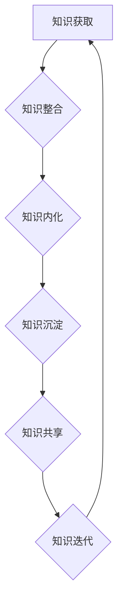

                 

# 《管理者如何应对知识快速迭代》

> 关键词：知识迭代、知识管理体系、团队知识管理、组织发展、持续学习

> 摘要：本文旨在探讨知识快速迭代背景下，管理者如何有效应对挑战，构建知识管理体系，提升团队和组织的知识管理能力，推动组织发展。通过分析知识迭代的影响、构建知识管理体系、快速获取与整合新知识、团队知识管理以及知识迭代与组织发展的关系，本文为管理者提供了实用的策略和思路。

### 目录

#### 第一部分：知识快速迭代的背景与挑战

## 第1章：知识迭代时代概述

### 1.1 知识迭代的影响

### 1.2 知识快速迭代的主要挑战

### 1.3 管理者的应对策略

## 第2章：知识管理体系的构建

### 2.1 知识管理体系的基本概念

### 2.2 知识管理的核心要素

### 2.3 知识管理体系的构建步骤

#### 第二部分：快速获取与整合新知识

## 第3章：快速获取新知识的方法

### 3.1 网络资源利用

### 3.2 专业社区与论坛

### 3.3 专业课程与讲座

## 第4章：知识整合与内化

### 4.1 知识整合的策略

### 4.2 知识内化的方法

### 4.3 知识沉淀与共享

#### 第三部分：团队知识管理

## 第5章：团队知识管理的重要性

### 5.1 团队知识管理的目的

### 5.2 团队知识管理的挑战

### 5.3 团队知识管理的关键因素

## 第6章：团队知识管理实践

### 6.1 团队知识分享的机制

### 6.2 团队知识沉淀的工具

### 6.3 团队知识管理的案例解析

#### 第四部分：知识迭代与组织发展

## 第7章：组织知识迭代策略

### 7.1 组织知识迭代的路径

### 7.2 组织知识迭代的方法

### 7.3 组织知识迭代的实施步骤

## 第8章：知识迭代与组织能力提升

### 8.1 知识迭代对组织能力的影响

### 8.2 建立持续学习型组织

### 8.3 知识迭代与组织创新

#### 附录

## 附录A：知识迭代相关的工具与资源

### A.1 知识管理工具介绍

### A.2 知识库建设指南

### A.3 知识迭代相关的学术论文与书籍推荐

### 统一化知识管理流程图

#### 核心算法原理讲解（伪代码）

// 伪代码：快速获取新知识
function get_new_knowledge() {
    // 从网络资源中获取最新资讯
    latest_articles <- fetch_articles_from_web()

    // 从专业社区中获取热门话题
    hot_topics <- fetch_topics_from_community()

    // 从专业课程与讲座中获取知识
    courses_and_lectures <- fetch_courses_and_lectures()

    // 整合以上资源，生成知识汇总
    knowledge_summary <- integrate_resources(latest_articles, hot_topics, courses_and_lectures)

    return knowledge_summary
}

// 伪代码：知识整合策略
function integrate_knowledge(knowledge_summary) {
    // 对知识进行分类
    categorized_knowledge <- categorize_knowledge(knowledge_summary)

    // 根据分类结果，建立知识库
    knowledge_base <- build_knowledge_base(categorized_knowledge)

    return knowledge_base
}

// 伪代码：知识内化方法
function internalize_knowledge(knowledge_base) {
    // 通过学习与练习，内化知识
    internalized_knowledge <- learn_and_practice(knowledge_base)

    return internalized_knowledge
}

// 伪代码：知识沉淀与共享
function share_knowledge(internalized_knowledge) {
    // 将内化的知识转化为文档或教程
    knowledge_documents <- create_knowledge_documents(internalized_knowledge)

    // 在内部网络或共享平台上发布
    publish_documents(knowledge_documents)

    return "知识共享成功"
}

#### 数学模型和数学公式详细讲解与举例说明

段落一：

$$
f(x) = \frac{1}{1 + e^{-x}}
$$

这是逻辑回归模型中的激活函数，用于将线性组合转换为一个概率值。

举例说明：

假设我们有一个特征向量 \( x = [x_1, x_2, x_3] \)，其权重为 \( w = [w_1, w_2, w_3] \)，则线性组合为：

$$
z = w_1x_1 + w_2x_2 + w_3x_3
$$

将 \( z \) 代入激活函数，得到概率值：

$$
\hat{y} = \frac{1}{1 + e^{-z}}
$$

段落二：

$$
J(\theta) = -\frac{1}{m} \sum_{i=1}^{m} [y^{(i)} \ln(\hat{y}^{(i)}) + (1 - y^{(i)}) \ln(1 - \hat{y}^{(i)})]
$$

这是逻辑回归模型的损失函数，用于评估模型预测的准确度。

举例说明：

假设我们有 \( m \) 个样本，每个样本的目标值为 \( y^{(i)} \)，预测的概率值为 \( \hat{y}^{(i)} \)，则损失函数计算如下：

$$
J(\theta) = -\frac{1}{m} \sum_{i=1}^{m} [y^{(i)} \ln(\hat{y}^{(i)}) + (1 - y^{(i)}) \ln(1 - \hat{y}^{(i)})]
$$

#### 项目实战：代码实际案例与详细解释说明

### 1. 开发环境搭建

#### 1.1 安装 Python

- 下载 Python 安装包（Python 3.8 或更高版本）。
- 运行安装程序，选择自定义安装，确保将 Python 添加到 PATH 环境变量中。

#### 1.2 安装必要库

- 打开终端或命令提示符。
- 运行以下命令安装必要的库：

bash
pip install numpy pandas sklearn matplotlib

### 2. 源代码实现

#### 2.1 逻辑回归模型实现

python
import numpy as np
from sklearn.linear_model import LogisticRegression
from sklearn.model_selection import train_test_split
from sklearn.metrics import accuracy_score

# 数据准备
X, y = load_data()  # 自定义数据加载函数

# 划分训练集和测试集
X_train, X_test, y_train, y_test = train_test_split(X, y, test_size=0.2, random_state=42)

# 创建逻辑回归模型实例
model = LogisticRegression()

# 训练模型
model.fit(X_train, y_train)

# 预测测试集
y_pred = model.predict(X_test)

# 评估模型
accuracy = accuracy_score(y_test, y_pred)
print(f"模型准确度：{accuracy:.2f}")

#### 2.2 代码解读与分析

- `load_data()`：自定义数据加载函数，用于加载样本数据和标签。
- `train_test_split()`：用于划分训练集和测试集，保证数据集的随机性。
- `LogisticRegression()`：创建逻辑回归模型实例。
- `fit()`：用于训练模型。
- `predict()`：用于对测试集进行预测。
- `accuracy_score()`：用于计算模型准确度。

### 3. 代码解读与分析

- **数据准备**：首先需要自定义一个数据加载函数 `load_data()`，用于加载样本数据和标签。数据集可以来自于文件、数据库或其他数据源。
- **模型训练**：使用 `fit()` 方法训练模型。这里使用了 `LogisticRegression()` 类创建逻辑回归模型实例，并传入训练集数据。
- **预测与评估**：使用 `predict()` 方法对测试集进行预测，并使用 `accuracy_score()` 方法计算模型准确度。这有助于评估模型在未知数据上的表现。

#### 附录

## 附录A：知识迭代相关的工具与资源

### A.1 知识管理工具介绍

### A.2 知识库建设指南

### A.3 知识迭代相关的学术论文与书籍推荐

### 统一化知识管理流程图

---

### 作者

作者：AI天才研究院/AI Genius Institute & 禅与计算机程序设计艺术 /Zen And The Art of Computer Programming

---

### 第1章：知识迭代时代概述

#### 1.1 知识迭代的影响

在当今这个信息爆炸的时代，知识迭代的速度越来越快，对各个领域产生了深远的影响。首先，知识的快速迭代改变了信息传播的方式。在过去，知识的传播主要依赖于传统的教育机构和学术期刊，而如今，互联网和社交媒体等新兴平台使得知识的传播变得更加快速和广泛。人们可以通过在线课程、博客、论坛等多种途径获取最新知识。

其次，知识迭代对个人职业发展产生了巨大影响。在快速迭代的知识环境中，个人需要不断更新自己的知识和技能，以适应不断变化的工作需求。知识迭代带来的职业压力和挑战使得个人必须具备较强的自我学习能力，不断追求自我提升。

再次，知识迭代对企业管理也提出了新的要求。企业需要快速适应知识迭代带来的变化，建立有效的知识管理体系，提高知识共享和创新能力。同时，企业也需要关注员工的职业发展，为员工提供学习和成长的机会，以保持企业的竞争优势。

#### 1.2 知识快速迭代的主要挑战

尽管知识迭代带来了许多机遇，但也带来了不少挑战。以下是知识快速迭代带来的主要挑战：

1. **信息过载**：随着知识不断更新，人们面临的信息量急剧增加，容易导致信息过载。如何筛选和整合关键信息，成为管理者面临的一大挑战。

2. **技能更新**：知识迭代要求员工不断更新自己的技能和知识，以适应新的工作需求。然而，员工的精力和时间有限，如何平衡工作和学习，成为员工和管理者共同面临的问题。

3. **知识管理**：企业需要建立有效的知识管理体系，确保知识得到有效获取、整合、沉淀和共享。然而，知识管理涉及多个部门和流程，如何协调各方资源，成为企业面临的挑战。

4. **创新压力**：知识迭代要求企业不断创新，以保持竞争优势。然而，创新过程充满不确定性，如何激发员工的创新思维，成为企业面临的挑战。

#### 1.3 管理者的应对策略

面对知识快速迭代的挑战，管理者需要采取一系列策略来应对。以下是一些有效的应对策略：

1. **加强自我学习**：管理者应树立终身学习的理念，不断更新自己的知识和技能。通过参加培训、阅读专业书籍、参加行业研讨会等方式，提升自己的专业素养。

2. **建立知识管理体系**：企业应建立有效的知识管理体系，包括知识获取、整合、沉淀和共享等环节。通过制定知识管理政策和流程，确保知识在企业内部得到有效传递和应用。

3. **关注员工发展**：管理者应关注员工的职业发展，为员工提供学习和成长的机会。通过培训、轮岗、导师制等方式，帮助员工提升技能和知识，激发员工的潜力。

4. **创新激励机制**：管理者应建立创新激励机制，鼓励员工提出新想法和解决方案。通过设立创新奖项、提供晋升机会等方式，激发员工的创新热情。

5. **构建学习型组织**：管理者应努力构建学习型组织，营造积极的学习氛围。通过组织内部培训和分享会，促进员工之间的知识交流，提升整体知识水平。

#### 1.4 本章小结

知识迭代时代给管理者带来了新的挑战，但同时也提供了机遇。通过加强自我学习、建立知识管理体系、关注员工发展、创新激励机制以及构建学习型组织，管理者可以更好地应对知识快速迭代带来的挑战，提升企业的竞争力。在下一章中，我们将进一步探讨知识管理体系的构建，为管理者提供具体的实施策略。

### 第2章：知识管理体系的构建

#### 2.1 知识管理体系的基本概念

知识管理体系是指一系列组织、流程、工具和技术，用于管理知识的获取、整合、沉淀、共享和应用。它包括以下几个方面：

1. **知识获取**：知识获取是指从各种来源获取新的知识，包括内部和外部知识。内部知识来源于企业内部的经验、技能、数据和文档，外部知识来源于行业动态、学术研究、市场情报等。

2. **知识整合**：知识整合是指将获取到的知识进行分类、筛选、整理和融合，形成系统化的知识库。通过知识整合，可以提高知识的可用性和可靠性。

3. **知识沉淀**：知识沉淀是指将整合后的知识进行存储和保存，以便于后续的查询和应用。知识沉淀可以采用文档、数据库、知识库等形式进行。

4. **知识共享**：知识共享是指将沉淀的知识在企业内部或团队之间进行传播和共享，使知识得到更广泛的应用。知识共享可以提高组织的知识密度，促进知识的传承和创新。

5. **知识应用**：知识应用是指将知识应用于实际工作中，解决实际问题、改进工作流程和提高工作效率。知识应用是知识管理体系的最终目的，也是知识管理价值的体现。

#### 2.2 知识管理的核心要素

知识管理体系的核心要素包括以下几个方面：

1. **人**：人是知识管理的核心，知识管理需要关注人的需求、能力和行为。企业需要培养员工的自我学习能力、知识共享意识和创新能力。

2. **流程**：流程是知识管理的基础，知识管理需要建立科学、合理的管理流程。流程应包括知识获取、整合、沉淀、共享和应用等各个环节。

3. **工具**：工具是知识管理的支撑，知识管理需要借助各种工具和技术来提高知识管理的效率。常用的知识管理工具包括知识库、文档管理工具、协作平台等。

4. **技术**：技术是知识管理的关键，知识管理需要采用先进的技术手段来支持知识的获取、整合、沉淀和共享。例如，数据挖掘、人工智能、大数据等技术可以用于知识分析和挖掘。

5. **文化**：文化是知识管理的精神，知识管理需要营造积极的知识共享和创新文化。企业需要倡导知识共享、尊重知识、鼓励创新的文化氛围。

#### 2.3 知识管理体系的构建步骤

构建知识管理体系是一个系统性的过程，需要遵循以下步骤：

1. **需求分析**：首先，企业需要对知识管理的需求进行深入分析。了解企业内部的知识需求和问题，明确知识管理的目标和方向。

2. **制定策略**：根据需求分析的结果，制定知识管理的策略和规划。包括知识管理的基本原则、目标和任务，以及知识管理的政策和流程。

3. **设计架构**：设计知识管理体系的架构，包括知识获取、整合、沉淀、共享和应用等各个环节。明确各环节的职责、流程和技术手段。

4. **实施与推广**：根据知识管理架构，实施知识管理体系的建设和推广。包括搭建知识库、引入知识管理工具、制定知识管理流程等。

5. **评估与优化**：对知识管理体系进行评估和优化，根据实际运行情况调整和改进。包括评估知识管理的成效、优化流程和工具等。

#### 2.4 知识管理的关键成功因素

构建知识管理体系需要关注以下关键成功因素：

1. **领导支持**：知识管理需要得到企业领导的重视和支持。领导的支持可以推动知识管理的顺利进行，为知识管理提供资源保障。

2. **全员参与**：知识管理需要全员参与，培养员工的自我学习、知识共享和创新能力。全员参与可以提高知识管理的执行力和效果。

3. **持续改进**：知识管理是一个持续的过程，需要不断改进和优化。通过定期评估和反馈，不断调整知识管理的策略和流程。

4. **文化氛围**：知识管理需要营造积极的知识共享和创新文化。企业应倡导知识共享、尊重知识、鼓励创新的文化氛围。

5. **技术支撑**：知识管理需要借助先进的技术手段，提高知识管理的效率。技术支撑可以提升知识获取、整合、沉淀和共享的能力。

#### 2.5 本章小结

知识管理体系是应对知识快速迭代的重要手段。通过构建知识管理体系，企业可以有效地获取、整合、沉淀、共享和应用知识，提高知识管理水平。在下一章中，我们将探讨如何快速获取和整合新知识，为知识管理体系提供持续的动力。

### 第3章：快速获取新知识的方法

在知识快速迭代的背景下，管理者需要掌握有效的获取新知识的方法，以确保团队和组织的知识储备与行业同步。以下是几种快速获取新知识的方法：

#### 3.1 网络资源利用

互联网是获取新知识的重要渠道，管理者可以通过以下方式利用网络资源：

1. **专业网站和博客**：关注行业领先的网站和博客，如技术博客、学术论坛、行业资讯等，可以实时了解行业动态和技术趋势。

2. **在线课程和讲座**：参加在线课程和讲座，如Coursera、edX、Udacity等平台，可以系统性地学习最新知识和技能。

3. **专业社交媒体**：关注专业社交媒体，如LinkedIn、Twitter、Reddit等，可以获取专业人士的观点和讨论。

4. **在线论坛和社区**：参与在线论坛和社区，如Stack Overflow、GitHub、Reddit等，可以与同行交流经验和解决问题。

#### 3.2 专业社区与论坛

专业社区和论坛是知识交流的重要平台，管理者可以通过以下方式参与：

1. **参与讨论**：积极参与论坛和社区的讨论，提出问题、分享经验，与他人互动，拓宽知识视野。

2. **建立个人品牌**：在专业社区和论坛中积极参与，可以建立个人品牌，提高在行业内的知名度。

3. **贡献内容**：撰写技术博客、发布教程、分享项目经验等，可以贡献自己的知识和经验，同时学习他人的成果。

4. **参加线下活动**：参加线下活动，如技术会议、研讨会、讲座等，可以面对面交流，加深对知识的理解。

#### 3.3 专业课程与讲座

专业课程和讲座是获取新知识的重要途径，管理者可以通过以下方式参与：

1. **在线课程**：利用在线教育平台，如Coursera、edX、Udacity等，学习最新的知识和技能。

2. **线下课程**：参加线下培训机构或高校的课程，系统性地学习专业知识。

3. **行业讲座**：参加行业专家的讲座，了解行业最新动态和技术趋势。

4. **内部培训**：组织内部培训，邀请外部专家或内部优秀员工分享知识和经验。

#### 3.4 内部知识共享

除了外部获取新知识，内部知识共享也是快速提升团队知识水平的重要手段：

1. **知识库建设**：建立企业内部知识库，收集和整理各部门的知识成果，方便员工查询和共享。

2. **内部培训**：组织内部培训，分享各部门的经验和知识，提高团队的整体素质。

3. **导师制度**：实施导师制度，让有经验的员工指导新员工，快速提升新员工的知识水平。

4. **知识竞赛**：举办知识竞赛，激发员工学习知识的热情，促进知识传播。

#### 3.5 知识获取策略总结

1. **多元化获取渠道**：结合网络资源、专业社区、专业课程和内部知识共享等多种方式，形成多元化的知识获取策略。

2. **持续学习**：树立终身学习的理念，持续关注行业动态和技术趋势，不断提升自己的知识和技能。

3. **知识共享**：积极参与知识共享，不仅能够获取新知识，还能够提升自己的专业水平和影响力。

4. **团队协作**：鼓励团队协作，通过团队内部的知识交流和共享，提高整个团队的知识水平。

通过以上方法，管理者可以快速获取新知识，不断提升团队和组织的知识储备，为应对知识快速迭代带来的挑战做好准备。在下一章中，我们将探讨如何对获取的新知识进行整合与内化，使其真正为企业所用。

### 第4章：知识整合与内化

#### 4.1 知识整合的策略

知识整合是指将获取的新知识进行分类、筛选、整理和融合，形成系统化的知识库。为了确保知识整合的有效性，管理者可以采取以下策略：

1. **分类管理**：根据知识的不同特点，将知识进行分类管理。例如，可以将知识分为技术知识、市场知识、管理知识等，便于后续查询和使用。

2. **标准化流程**：建立标准化流程，规范知识的整理、存储和共享。例如，制定统一的文档格式、命名规范和标签体系，确保知识的规范化和系统化。

3. **知识地图**：构建知识地图，展示不同知识之间的关系和联系，帮助员工更好地理解和应用知识。知识地图可以采用图形化方式，直观地展示知识体系。

4. **知识库建设**：建立企业内部知识库，收集和整理各部门的知识成果，实现知识的集中管理和共享。知识库可以采用数据库、文档管理系统等方式进行建设。

5. **知识沉淀**：将整合后的知识进行沉淀，形成知识沉淀库。知识沉淀库可以用于员工培训、项目参考、问题解决等，提高知识的利用率。

#### 4.2 知识内化的方法

知识内化是指将整合后的知识转化为自己的能力，使其真正为企业所用。以下是一些知识内化的方法：

1. **实践应用**：将知识应用到实际工作中，通过实践不断巩固和深化对知识的理解。例如，参与项目实施、解决实际问题等，都是知识内化的有效途径。

2. **培训与分享**：参加培训课程、研讨会和讲座，与同行交流知识和经验。通过培训与分享，可以加深对知识的理解和应用。

3. **自学与反思**：利用业余时间进行自学，反思工作中的问题，总结经验教训。通过自学和反思，可以不断提升自己的知识和技能。

4. **导师制度**：实施导师制度，让有经验的员工指导新员工，通过传帮带的方式，帮助新员工快速掌握知识和技能。

5. **知识竞赛**：举办知识竞赛，激发员工学习知识的热情，促进知识传播和应用。

#### 4.3 知识沉淀与共享

知识沉淀与共享是知识管理的重要环节，以下是一些知识沉淀与共享的方法：

1. **文档化**：将工作中的经验和知识整理成文档，包括操作手册、项目报告、案例分析等。文档化有助于知识的长期保存和传播。

2. **内部论坛**：建立内部论坛或知识分享平台，鼓励员工发表文章、分享经验和心得。内部论坛可以促进员工之间的交流和学习。

3. **知识竞赛**：举办知识竞赛，激发员工学习知识的热情，促进知识传播和应用。

4. **内部培训**：组织内部培训，邀请内部优秀员工分享知识和经验。内部培训可以提高团队的整体素质和知识水平。

5. **知识地图**：构建知识地图，展示不同知识之间的关系和联系，帮助员工更好地理解和应用知识。

#### 4.4 知识整合与内化的关键要素

1. **领导支持**：知识整合与内化需要得到企业领导的重视和支持。领导的支持可以推动知识管理的顺利进行，为知识管理提供资源保障。

2. **全员参与**：知识整合与内化需要全员参与，培养员工的自我学习、知识共享和创新能力。全员参与可以提高知识管理的执行力和效果。

3. **持续改进**：知识整合与内化是一个持续的过程，需要不断改进和优化。通过定期评估和反馈，不断调整知识整合与内化的策略和流程。

4. **文化氛围**：知识整合与内化需要营造积极的知识共享和创新文化。企业应倡导知识共享、尊重知识、鼓励创新的文化氛围。

5. **技术支撑**：知识整合与内化需要借助先进的技术手段，提高知识整合与内化的效率。技术支撑可以提升知识获取、整合、沉淀和共享的能力。

#### 4.5 本章小结

知识整合与内化是知识管理的重要环节，通过有效的知识整合策略和方法，可以确保知识得到系统化和规范化管理。通过知识内化的方法，可以将知识转化为实际能力，为企业所用。在知识沉淀与共享的过程中，可以促进知识的传播和应用，提升团队和组织的知识水平。在下一章中，我们将探讨团队知识管理的重要性及其实践方法。

### 第5章：团队知识管理的重要性

#### 5.1 团队知识管理的目的

团队知识管理的目的是通过有效管理团队内部的知识，提高团队的整体工作效率和创新能力。具体来说，团队知识管理的目的包括以下几个方面：

1. **提高工作效率**：通过知识共享和协作，团队成员可以快速获取所需的知识和经验，减少重复劳动，提高工作效率。

2. **增强创新能力**：知识管理可以激发团队成员的创新能力，通过跨部门、跨领域的知识交流，促进新想法和新方案的生成。

3. **提升团队凝聚力**：通过知识共享和协作，团队成员之间可以建立紧密的联系，增强团队凝聚力，提高团队协作效果。

4. **降低知识流失风险**：通过知识沉淀和共享，可以确保团队知识在成员流动时得到保留，降低知识流失的风险。

5. **促进持续学习**：知识管理可以营造一个持续学习的环境，鼓励团队成员不断提升自己的知识和技能，保持团队的竞争力。

#### 5.2 团队知识管理的挑战

尽管团队知识管理的重要性不言而喻，但在实际操作过程中，管理者会面临以下挑战：

1. **知识分散**：团队成员的知识分散在不同的部门、个人和工具中，难以进行统一管理和共享。

2. **知识过载**：随着知识量的不断增加，团队成员可能会面临知识过载的问题，难以筛选和整合关键信息。

3. **知识不透明**：团队成员之间的知识交流可能不够畅通，导致知识不透明，影响知识共享和协作。

4. **知识安全**：在知识共享过程中，如何保护知识的安全性和隐私，是管理者需要关注的问题。

5. **缺乏激励机制**：团队成员可能缺乏知识共享和创新的动力，需要建立有效的激励机制来激发他们的积极性。

#### 5.3 团队知识管理的关键因素

为了有效进行团队知识管理，管理者需要关注以下关键因素：

1. **领导支持**：领导的支持是团队知识管理成功的关键。领导应树立知识共享和创新的意识，为知识管理提供资源和政策支持。

2. **团队文化**：建立积极的知识共享和创新文化，鼓励团队成员主动分享知识和经验，营造良好的知识交流氛围。

3. **知识共享机制**：建立科学、合理的知识共享机制，包括知识获取、整合、沉淀、共享和应用等环节，确保知识在企业内部得到有效传递和应用。

4. **知识管理工具**：选择适合团队需求的知识管理工具，如知识库、协作平台、文档管理系统等，提高知识管理的效率。

5. **激励机制**：建立有效的激励机制，鼓励团队成员积极参与知识共享和创新，提高知识管理的执行力和效果。

#### 5.4 团队知识管理的实践方法

以下是几种团队知识管理的实践方法：

1. **知识库建设**：建立团队内部的知识库，收集和整理团队成员的知识成果，实现知识的集中管理和共享。

2. **内部培训**：定期组织内部培训，邀请团队成员分享知识和经验，提高团队的整体知识水平。

3. **知识竞赛**：举办知识竞赛，激发团队成员学习知识的热情，促进知识传播和应用。

4. **导师制度**：实施导师制度，让有经验的员工指导新员工，通过传帮带的方式，帮助新员工快速掌握知识和技能。

5. **项目协作**：在项目实施过程中，通过协作平台实现团队成员之间的实时沟通和协作，提高项目效率。

6. **知识共享会议**：定期举办知识共享会议，鼓励团队成员分享项目经验、技术见解和市场动态，促进知识的交流与共享。

#### 5.5 本章小结

团队知识管理对于提升团队整体工作效率和创新能力具有重要意义。通过有效的团队知识管理，企业可以确保知识得到系统化和规范化管理，降低知识流失风险，提高团队的凝聚力和竞争力。在下一章中，我们将探讨组织知识迭代策略及其在组织发展中的应用。

### 第6章：团队知识管理实践

#### 6.1 团队知识分享的机制

建立有效的团队知识分享机制是团队知识管理的重要一环。以下是一些常用的知识分享机制：

1. **定期分享会**：定期组织团队知识分享会，让团队成员分享自己的经验和知识。分享会可以邀请外部专家进行专题讲座，也可以是团队成员之间的经验交流。

2. **在线知识库**：建立企业内部的在线知识库，让团队成员随时查阅和共享知识。知识库应包括项目经验、技术文档、行业动态等内容，方便团队成员学习和参考。

3. **知识竞赛**：举办知识竞赛，鼓励团队成员积极参与，提升知识分享的趣味性和参与度。通过知识竞赛，可以检验团队成员对知识的掌握程度，激发学习兴趣。

4. **内部培训**：组织内部培训，邀请专家进行授课，帮助团队成员提升知识和技能。内部培训可以针对特定领域或技能进行，以提高团队的整体素质。

5. **知识地图**：构建知识地图，展示团队内部的知识结构和关系，帮助团队成员了解知识的分布和联系，促进知识的传播和应用。

#### 6.2 团队知识沉淀的工具

为了确保知识的有效沉淀，管理者需要选择合适的工具，以下是一些常用的团队知识沉淀工具：

1. **文档管理工具**：如Confluence、Notion等，用于整理和存储文档，实现文档的集中管理和共享。

2. **项目管理工具**：如Jira、Trello等，用于管理项目进度和任务，同时可以记录项目过程中的经验和教训。

3. **知识库系统**：如WIKI、知识图谱等，用于收集、整理和分类知识，实现知识的系统化管理和共享。

4. **协作平台**：如Slack、Microsoft Teams等，用于实时沟通和协作，促进团队成员之间的互动和知识交流。

5. **学习管理系统**：如Moodle、Canvas等，用于管理学习过程和学习资源，实现在线学习和知识沉淀。

#### 6.3 团队知识管理的案例解析

以下是一个团队知识管理的实际案例解析：

1. **背景**：某互联网公司开发团队在项目实施过程中，面临知识分散、知识沉淀困难的问题，影响了团队的协作效率和项目进度。

2. **目标**：建立有效的团队知识分享机制和知识沉淀工具，提高团队的知识管理能力，提升项目效率。

3. **实施措施**：

   - **定期分享会**：每周组织一次团队知识分享会，邀请团队成员分享项目经验、技术见解和市场动态。分享会采用线上线下结合的方式，确保团队成员都能参与。

   - **在线知识库**：建立企业内部的在线知识库，包括项目文档、技术文档、行业动态等内容。知识库采用分类管理，方便团队成员查阅和共享。

   - **知识竞赛**：每季度举办一次知识竞赛，鼓励团队成员积极参与，提升知识分享的趣味性和参与度。

   - **内部培训**：每月组织一次内部培训，邀请专家进行授课，帮助团队成员提升知识和技能。

   - **知识地图**：构建知识地图，展示团队内部的知识结构和关系，帮助团队成员了解知识的分布和联系。

4. **效果**：

   - **知识共享增强**：通过定期分享会、知识竞赛和内部培训，团队成员之间的知识交流得到了显著提升，知识共享氛围日益浓厚。

   - **知识沉淀优化**：通过在线知识库和知识地图，团队成员可以方便地查阅和共享知识，知识沉淀和传播效率大幅提高。

   - **项目效率提升**：团队在项目实施过程中，能够更快地获取所需的知识和经验，减少了重复劳动，项目效率得到了显著提升。

5. **经验总结**：

   - **领导支持**：领导的支持是团队知识管理成功的关键，领导应树立知识共享和创新的意识，为知识管理提供资源和政策支持。

   - **团队文化**：建立积极的知识共享和创新文化，鼓励团队成员主动分享知识和经验，营造良好的知识交流氛围。

   - **工具选择**：选择适合团队需求的知识管理工具，提高知识管理的效率。

   - **持续改进**：知识管理是一个持续的过程，需要不断改进和优化，通过定期评估和反馈，调整知识管理的策略和流程。

#### 6.4 本章小结

团队知识管理是提升团队整体工作效率和创新能力的重要手段。通过建立有效的知识分享机制和知识沉淀工具，企业可以确保知识在企业内部得到有效传递和应用，提高团队的协作效率和项目效率。在实际操作中，企业需要根据自身情况，选择合适的知识管理工具和方法，不断优化知识管理流程，以实现知识管理的最大化价值。

### 第7章：组织知识迭代策略

#### 7.1 组织知识迭代的路径

组织知识迭代是一个动态的过程，涉及知识获取、整合、内化、共享和应用等多个环节。以下是一个典型的组织知识迭代路径：

1. **知识获取**：组织通过各种渠道获取新知识，包括内部经验、外部资讯、学术研究、市场情报等。知识获取是组织知识迭代的基础。

2. **知识整合**：将获取到的知识进行分类、筛选、整理和融合，形成系统化的知识体系。知识整合有助于提高知识的可用性和可靠性。

3. **知识内化**：将整合后的知识转化为组织成员的能力和知识体系，通过实践应用、培训与分享等方式，使知识得以内部化。

4. **知识共享**：在组织内部广泛传播和共享知识，促进知识的传承和创新。知识共享可以提高组织的知识密度，提升整体知识水平。

5. **知识应用**：将知识应用于实际工作中，解决实际问题、改进工作流程和提高工作效率。知识应用是组织知识迭代的最终目的，也是知识管理价值的体现。

6. **知识反馈**：在知识应用过程中，收集反馈信息，对知识进行优化和更新，形成闭环的知识迭代过程。

#### 7.2 组织知识迭代的方法

为了实现有效的组织知识迭代，管理者可以采取以下方法：

1. **建立知识库**：建立企业内部的知识库，收集和整理各部门的知识成果，实现知识的集中管理和共享。知识库应具备分类、搜索、更新等功能，方便员工快速获取所需知识。

2. **推动知识分享**：通过定期举办知识分享会、开展内部培训、发布知识文章等方式，鼓励员工分享知识和经验。知识分享不仅可以提高员工的知识水平，还可以激发创新思维。

3. **实施导师制度**：建立导师制度，让有经验的员工指导新员工，通过传帮带的方式，帮助新员工快速掌握知识和技能。导师制度有助于知识的传承和创新。

4. **引入外部资源**：与外部专家、学术机构、行业协会等建立合作关系，引进先进的知识和经验，提升组织的知识水平。

5. **开展知识竞赛**：举办知识竞赛，激发员工学习知识的热情，促进知识传播和应用。知识竞赛可以检验员工对知识的掌握程度，提高整体知识水平。

6. **利用技术手段**：借助大数据、人工智能、云计算等先进技术，对知识进行分析和挖掘，提高知识的利用效率。

#### 7.3 组织知识迭代的实施步骤

实施组织知识迭代，管理者可以按照以下步骤进行：

1. **需求分析**：了解组织内部的知识需求和问题，明确知识迭代的目标和方向。

2. **制定策略**：根据需求分析结果，制定组织知识迭代的策略和规划，包括知识获取、整合、内化、共享和应用等各个环节。

3. **设计架构**：设计组织知识迭代的架构，明确各环节的职责、流程和技术手段，确保知识迭代过程的顺利进行。

4. **实施与推广**：根据知识迭代架构，实施知识迭代策略，包括搭建知识库、引入知识分享机制、开展知识培训等。

5. **评估与优化**：对知识迭代过程进行评估和优化，根据实际运行情况调整和改进策略，确保知识迭代的效果。

#### 7.4 知识迭代与组织发展的关系

知识迭代与组织发展密切相关，以下为两者之间的几个方面关系：

1. **知识迭代促进组织发展**：通过知识迭代，组织可以不断吸收新知识，提升创新能力，优化业务流程，提高市场竞争力，从而实现组织发展的目标。

2. **组织发展推动知识迭代**：组织的发展需求会促使知识迭代，组织在发展过程中会不断积累经验，形成新的知识，推动知识迭代。

3. **知识迭代与组织文化**：知识迭代需要组织建立积极的知识共享和创新文化，鼓励员工主动学习、分享和创新，形成良好的组织氛围。

4. **知识迭代与人才培养**：知识迭代有助于提高员工的综合素质和技能水平，促进人才的成长和发展，为组织培养具备创新能力和专业素养的人才。

#### 7.5 知识迭代案例分析

以下是一个组织知识迭代的实际案例：

1. **背景**：某大型科技公司致力于打造一个持续学习型组织，通过知识迭代提升组织的竞争力。

2. **目标**：建立知识迭代机制，提高员工的知识水平，促进知识共享和创新。

3. **实施措施**：

   - **建立知识库**：公司建立了一个内部知识库，收集和整理各部门的知识成果，实现知识的集中管理和共享。

   - **推动知识分享**：定期举办知识分享会，邀请员工分享项目经验、技术见解和市场动态。

   - **实施导师制度**：公司实施了导师制度，让有经验的员工指导新员工，帮助新员工快速掌握知识和技能。

   - **开展知识竞赛**：公司定期举办知识竞赛，激发员工学习知识的热情，促进知识传播和应用。

   - **利用外部资源**：公司与多家学术机构和行业协会建立合作关系，引进先进的知识和经验。

4. **效果**：

   - **知识水平提升**：员工的知识水平得到显著提升，工作效率和创新能力不断提高。

   - **知识共享增强**：公司内部的知识共享氛围日益浓厚，知识传播速度加快。

   - **创新能力提高**：员工在知识分享和竞赛过程中，不断创新，提出新想法和新方案。

   - **组织竞争力提升**：公司通过知识迭代，不断优化业务流程，提高市场竞争力。

5. **经验总结**：

   - **领导支持**：领导的支持是知识迭代成功的关键，领导应树立知识共享和创新的意识，为知识管理提供资源和政策支持。

   - **团队协作**：知识迭代需要团队协作，鼓励员工积极参与，共同推动知识迭代。

   - **持续优化**：知识迭代是一个持续的过程，需要不断优化和改进，以适应组织发展的需求。

#### 7.6 本章小结

组织知识迭代是提升组织竞争力的关键，通过有效的知识迭代策略，组织可以不断吸收新知识，提升创新能力，优化业务流程，提高市场竞争力。在实施知识迭代的过程中，管理者需要关注知识获取、整合、内化、共享和应用等环节，同时建立积极的知识共享和创新文化，为知识迭代提供良好的环境。通过本章的探讨，管理者可以更好地理解组织知识迭代的重要性及其实施方法。

### 第8章：知识迭代与组织能力提升

#### 8.1 知识迭代对组织能力的影响

知识迭代对组织能力提升有着深远的影响。首先，知识迭代能够提高组织的创新能力。随着新知识的不断获取和整合，组织能够不断提出新的想法和解决方案，推动产品、服务和业务模式的创新。例如，科技公司通过不断迭代最新技术，开发出更具竞争力的产品。

其次，知识迭代有助于提升组织的适应能力。在知识快速迭代的背景下，组织需要具备快速适应外部环境变化的能力。通过不断获取新知识，组织可以及时调整战略和业务模式，以应对市场变化和竞争压力。例如，电子商务企业通过实时获取市场数据，迅速调整营销策略，提升市场份额。

此外，知识迭代还可以提高组织的效率。通过知识整合和共享，组织内部的知识流动更加顺畅，员工可以快速获取所需的信息和资源，减少重复劳动，提高工作效率。例如，金融机构通过构建知识库，实现跨部门的信息共享，提高业务处理速度。

#### 8.2 建立持续学习型组织

建立持续学习型组织是组织能力提升的重要途径。以下是一些建议：

1. **确立学习文化**：组织应确立学习文化，鼓励员工不断学习新知识和技能。通过举办学习活动、提供学习资源等方式，营造良好的学习氛围。

2. **培养自我学习能力**：员工应具备自我学习能力，主动获取新知识，不断适应外部环境的变化。组织可以通过培训、轮岗、导师制度等方式，帮助员工提升自我学习能力。

3. **建立知识共享机制**：组织应建立知识共享机制，鼓励员工分享知识和经验。通过内部论坛、知识竞赛、内部培训等方式，促进知识的传播和应用。

4. **激励机制**：建立有效的激励机制，鼓励员工积极参与知识共享和创新。例如，设立知识共享奖励、创新项目资助等，激发员工的积极性和创造力。

5. **外部合作**：组织可以与外部机构、行业协会等建立合作关系，引进先进的知识和经验。通过外部合作，组织可以拓宽知识视野，提升整体知识水平。

#### 8.3 知识迭代与组织创新

知识迭代是组织创新的重要驱动力。以下是一些组织创新的实践：

1. **开放式创新**：组织可以采取开放式创新策略，与外部合作伙伴共同开发新产品、服务或业务模式。通过引入外部知识和资源，组织可以快速实现创新。

2. **内部创业**：组织可以鼓励内部创业，支持员工创办创新项目。通过内部创业，组织可以激发员工的创新热情，培养创新型人才。

3. **头脑风暴**：组织可以通过定期举办头脑风暴会议，鼓励员工提出新想法和解决方案。头脑风暴可以激发创新思维，促进组织创新。

4. **跨部门合作**：组织可以促进跨部门合作，打破部门壁垒，实现知识的跨领域流动。通过跨部门合作，组织可以整合不同领域的知识，推动创新。

5. **创新实验室**：组织可以建立创新实验室，为员工提供创新环境和资源。创新实验室可以支持员工进行实验性研究，探索新技术和新业务模式。

#### 8.4 知识迭代与人才培养

知识迭代对人才培养具有重要意义。以下是一些人才培养的策略：

1. **个性化培训**：组织应根据员工的兴趣和需求，提供个性化的培训课程，帮助员工提升专业技能和知识水平。

2. **导师制度**：建立导师制度，让有经验的员工指导新员工，通过传帮带的方式，帮助新员工快速掌握知识和技能。

3. **轮岗机制**：组织可以实施轮岗机制，让员工在不同岗位工作，拓宽员工的视野和技能。轮岗有助于员工全面发展，提高综合素质。

4. **在线学习**：组织可以提供在线学习平台，让员工随时随地进行学习。通过在线学习，员工可以及时获取最新的知识和技能。

5. **激励机制**：建立有效的激励机制，鼓励员工积极参与学习和培训。例如，设立学习奖励、晋升机会等，激发员工的学习热情。

#### 8.5 本章小结

知识迭代对组织能力提升具有深远影响，通过建立持续学习型组织、推动知识迭代与组织创新的结合，以及实施有效的人才培养策略，组织可以不断提升自身的能力和竞争力。在下一章中，我们将探讨知识迭代相关的工具与资源，为管理者提供实用的参考资料。

### 附录A：知识迭代相关的工具与资源

在知识迭代的过程中，选择合适的工具和资源对于提高知识获取、整合和共享的效率至关重要。以下是一些知识迭代相关的工具与资源：

#### A.1 知识管理工具介绍

1. **Confluence**：Atlassian开发的团队协作和知识管理工具，用于创建、共享和协作文档。它支持内容版本控制和协作编辑，适合企业内部的知识共享和协作。

2. **Notion**：一款功能强大的个人和组织协作工具，支持笔记、数据库、看板等多种功能，可以帮助团队进行知识整理和项目跟踪。

3. **Trello**：基于看板原理的任务管理工具，适合团队进行任务分配和项目跟踪，也可以用于知识沉淀和分享。

4. **Slack**：一款团队沟通工具，支持实时消息、文件共享、频道讨论等，有助于团队内部的知识交流和协作。

#### A.2 知识库建设指南

1. **GitHub**：一个基于Git的代码托管平台，也可以用于知识库建设。通过GitHub Pages可以创建静态网站，展示团队的知识库。

2. **MediaWiki**：一个开源的Wiki软件，适合构建企业内部的知识库。它支持内容版本控制和权限管理，便于团队的知识共享和协作。

3. **DocuSign**：一个电子签名解决方案，可以帮助企业进行文档的在线签署和共享，提高知识流转的效率。

#### A.3 知识迭代相关的学术论文与书籍推荐

1. **《知识管理：战略、工具和技术的集成》（Knowledge Management: Strategic, Tools, and Technology Integration）**：这本书详细介绍了知识管理的概念、方法和工具，适合企业管理者和知识管理人员阅读。

2. **《知识管理：理论与实践》（Knowledge Management: Theory and Practice）**：这本书涵盖了知识管理的各个方面，包括知识获取、整合、共享和应用，适合知识管理专业的学生和研究人员。

3. **《智慧的进化：知识管理与组织学习》（The Intelligence of Evolution: Knowledge Management and Organizational Learning）**：这本书从进化论的角度探讨了知识管理和组织学习的关系，提供了新的视角和思路。

4. **《构建企业知识管理系统》（Building a Knowledge Management System）**：这本书详细介绍了企业知识管理系统的设计和实施方法，适合企业管理者和技术人员阅读。

### 统一化知识管理流程图

通过以上工具与资源的介绍，管理者可以更好地构建和优化企业的知识管理体系，提高知识管理的效率和效果。在知识迭代的过程中，持续关注和更新这些工具与资源，将有助于企业保持竞争力，适应快速变化的市场环境。

### 本章小结

本文系统地探讨了知识迭代背景下，管理者如何应对知识快速迭代带来的挑战，构建有效的知识管理体系，提升团队和组织的知识管理能力。通过对知识迭代的影响、知识管理体系的构建、快速获取与整合新知识、团队知识管理以及知识迭代与组织发展的关系等方面的深入分析，本文为管理者提供了实用的策略和思路。

首先，知识迭代对个人职业发展、企业管理以及组织发展产生了深远影响，带来了信息过载、技能更新和知识管理等方面的挑战。管理者应树立终身学习的理念，加强自我学习，建立有效的知识管理体系，关注员工发展，创新激励机制，构建学习型组织。

其次，本文详细介绍了知识管理体系的构建步骤和关键成功因素，包括需求分析、制定策略、设计架构、实施与推广以及评估与优化等环节。通过建立知识获取、整合、沉淀、共享和应用等环节的机制，企业可以确保知识在企业内部得到有效传递和应用。

在知识获取方面，本文提出了利用网络资源、专业社区和论坛、专业课程与讲座以及内部知识共享等多种方法，帮助管理者快速获取新知识。在知识整合与内化方面，本文介绍了分类管理、标准化流程、知识地图和知识库建设等策略，以及实践应用、培训与分享等内化方法。

团队知识管理是知识管理体系的重要组成部分。本文探讨了团队知识管理的目的、挑战、关键因素和实践方法，包括知识分享机制、知识沉淀工具、导师制度、知识竞赛和知识地图等。通过有效的团队知识管理，企业可以提升团队的整体工作效率和创新能力。

组织知识迭代策略是提升组织能力的重要途径。本文介绍了组织知识迭代的路径、方法和实施步骤，以及知识迭代对组织能力的影响、建立持续学习型组织的建议、知识迭代与组织创新的关系以及知识迭代与人才培养的策略。

最后，本文通过附录A提供了知识迭代相关的工具与资源，包括知识管理工具介绍、知识库建设指南以及学术论文与书籍推荐，为管理者提供了实用的参考资料。

总之，本文为管理者提供了全面的知识管理体系构建和实践指南，有助于企业应对知识快速迭代的挑战，提升组织的知识管理能力和竞争力。在未来的工作中，管理者应持续关注知识迭代带来的变化，不断优化知识管理体系，以适应快速变化的市场环境。通过有效的知识管理，企业可以不断提升自身的能力和竞争力，实现可持续发展。

