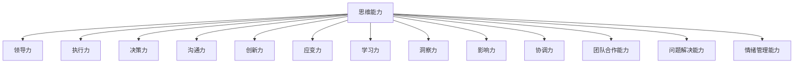

                 

# 管理者的思维能力提升指南

> 关键词：管理者、思维能力、领导力、执行力、决策力、沟通力、创新力、应变力、学习力、洞察力、影响力、协调力、团队合作能力、问题解决能力、情绪管理能力

> 摘要：本文详细探讨了管理者思维能力的重要性，以及如何通过批判性思维、创造性思维和系统思维等关键算法原理来提升管理者的思维能力。文章还提供了批判性思维训练项目、创造性思维训练项目和系统思维训练项目的实际开发案例，以及开发环境和源代码的详细解读。

## 第一部分：核心概念与联系

### 第1章: 管理者的思维能力提升概述

#### 1.1 管理者的思维能力概述

**1.1.1 管理者思维能力的定义和分类**

管理者思维能力是指管理者在执行其职责过程中所表现出来的认知能力，包括分析、综合、推理、判断和问题解决等能力。具体来说，管理者思维能力可以分为以下几类：

1. **逻辑思维能力**：包括演绎推理、归纳推理、条件推理等。
2. **批判性思维能力**：对信息进行批判性分析和评估，识别潜在的问题和错误。
3. **创造性思维能力**：产生新的观点、方法和解决方案的能力。
4. **系统思维能力**：理解和管理复杂系统的能力。
5. **决策力**：在不确定性和有限信息的情况下做出有效决策的能力。
6. **沟通力**：有效地传达思想和信息的能力。
7. **团队合作能力**：与他人合作共同实现目标的能力。
8. **问题解决能力**：识别问题并采取有效措施解决问题的能力。
9. **学习力**：持续学习新知识和技能的能力。
10. **洞察力**：深入理解问题本质和分析复杂情况的能力。
11. **影响力**：通过说服和激励影响他人行为的能力。
12. **协调力**：在团队和组织内实现目标和任务协调的能力。
13. **情绪管理能力**：控制和调节自己情绪的能力。

**1.1.2 提升管理者思维能力的重要性**

管理者思维能力的提升对于组织的成功至关重要。以下是一些提升管理者思维能力的重要性：

1. **增强决策力**：提高决策质量，减少错误决策带来的损失。
2. **提升领导力**：增强管理者对团队和组织的领导能力。
3. **提高沟通效率**：改善管理者与下属、同事和合作伙伴之间的沟通。
4. **增强创新能力**：激发创新思维，推动组织发展。
5. **提高问题解决能力**：快速识别和解决问题，提升组织运营效率。
6. **提高团队协作能力**：促进团队成员之间的合作，实现共同目标。
7. **增强学习力和适应力**：在快速变化的环境中保持竞争力。

**1.1.3 管理者思维能力与其他管理技能的关系**

管理者思维能力与其他管理技能密切相关，它们相互支撑、相互促进。以下是一个用Mermaid绘制的Mermaid流程图，展示了思维能力与其他管理技能之间的联系。



### 第2章: 提升思维能力的关键算法原理

#### 2.1 批判性思维算法

**2.1.1 批判性思维的基本概念和重要性**

批判性思维是一种理性思考方式，它涉及对信息进行批判性分析和评估，以识别潜在的问题、错误和偏见。批判性思维对于管理者来说至关重要，因为它有助于：

1. **提高决策质量**：通过批判性分析，管理者可以更准确地评估各种决策选项。
2. **增强沟通能力**：批判性思维使管理者能够更清晰地表达观点，并更有效地与团队成员沟通。
3. **提升问题解决能力**：批判性思维有助于管理者识别问题的根本原因，从而采取更有效的解决方案。

**2.1.2 批判性思维算法的伪代码**

以下是一个简单的批判性思维算法伪代码示例：

```plaintext
function 批判性思维(问题，已有观点)：
    for 每个反对观点 do：
        if 反对观点合理 then：
            更新已有观点
        end if
    end for
    return 更新后的已有观点
end function
```

#### 2.2 创造性思维算法

**2.2.1 创造性思维的基本概念和重要性**

创造性思维是指产生新的、有创意的想法和方法的过程。对于管理者来说，创造性思维有助于：

1. **推动创新**：创造性思维能够激发新的想法，推动组织的产品和服务创新。
2. **解决问题**：创造性思维有助于找到非传统的方法来解决问题。
3. **提升竞争力**：通过创新，管理者可以提升组织的竞争力。

**2.2.2 创造性思维算法的伪代码**

以下是一个简单的创造性思维算法伪代码示例：

```plaintext
function 创造性思维(问题)：
    初始化解决方案列表
    for 每个新想法 do：
        if 新想法有效 then：
            添加到解决方案列表
        end if
    end for
    return 最优解决方案
end function
```

#### 2.3 系统思维算法

**2.3.1 系统思维的基本概念和重要性**

系统思维是一种理解和管理复杂系统的思考方式。它强调考虑系统的各个部分及其相互关系，而不是单独分析每个部分。对于管理者来说，系统思维有助于：

1. **全面理解问题**：通过系统思维，管理者可以更全面地理解问题的本质。
2. **优化决策**：系统思维有助于管理者做出更全面的决策。
3. **提升组织效能**：通过系统思维，管理者可以更有效地协调组织内各部门的工作。

**2.3.2 系统思维算法的伪代码**

以下是一个简单的系统思维算法伪代码示例：

```plaintext
function 系统思维(问题)：
    初始化问题组件列表
    for 每个组件 do：
        分析组件之间的关系
        分析组件的影响
    end for
    return 综合解决方案
end function
```

### 第3章: 数学模型和数学公式 & 详细讲解 & 举例说明

#### 3.1 批判性思维中的逻辑推理公式

**3.1.1 条件推理与逆命题的公式**

在批判性思维中，逻辑推理是一个重要的组成部分。以下是一些基本的逻辑推理公式：

- 条件推理：

  $$p \rightarrow q \quad \text{与} \quad \neg q \rightarrow \neg p$$

- 逆命题：

  如果“下雨”（$p$）则“地面湿润”（$q$）。如果地面不湿润（$\neg q$），那么就没有下雨（$\neg p$）。

**3.1.2 逻辑推理示例**

假设你正在考虑是否在下雨时去散步。如果你知道“下雨”（$p$）则“地面湿润”（$q$），那么如果地面不湿润（$\neg q$），你就可以推断出没有下雨（$\neg p$）。这个逻辑推理可以帮助你做出更明智的决策。

#### 3.2 创造性思维中的联想网络模型

**3.2.1 联想网络的数学公式**

联想网络模型是创造性思维中的一个重要工具。它通过建立不同概念之间的联想来激发创造性思维。以下是一个联想网络的数学公式：

$$N = A \times L$$

其中，$N$ 表示联想网络，$A$ 表示关联度，$L$ 表示联想长度。

**3.2.2 联想网络示例**

例如，当你思考“书”时，可能会联想到“阅读”、“知识”、“思考”等概念。这些概念之间的联系构成了一个联想网络。通过这个联想网络，你可以产生新的想法，如“如何通过阅读来扩展知识”。

#### 3.3 系统思维中的复杂性模型

**3.3.1 复杂性指数公式**

在系统思维中，复杂性指数是一个用来衡量系统复杂性的指标。以下是一个复杂性指数的公式：

$$C = \sum_{i=1}^n (P_i \times V_i)$$

其中，$C$ 表示复杂性指数，$P_i$ 表示每个因素的权重，$V_i$ 表示每个因素的影响值。

**3.3.2 复杂性指数示例**

假设你正在评估一个项目的复杂性。项目中的关键因素包括时间、成本和质量。每个因素的权重分别为0.3、0.3和0.4。如果时间的影响值为10，成本的影响值为5，质量的影响值为8，那么项目的复杂性指数为：

$$C = (0.3 \times 10) + (0.3 \times 5) + (0.4 \times 8) = 3 + 1.5 + 3.2 = 7.7$$

这个复杂性指数可以帮助你更好地理解项目的复杂性，从而做出更有效的决策。

### 第4章: 项目实战

#### 4.1 批判性思维训练项目

**4.1.1 项目简介**

批判性思维训练项目旨在帮助管理者提高批判性思维能力。该项目包括一个在线平台，提供一系列批判性思维训练题和案例分析。

**4.1.2 开发环境**

- 前端：HTML、CSS、JavaScript
- 后端：Python、Flask
- 数据库：SQLite

**4.1.3 源代码实现**

以下是批判性思维训练项目的源代码片段：

```python
# Flask后端代码片段
from flask import Flask, jsonify, request

app = Flask(__name__)

@app.route('/api/training_questions', methods=['GET'])
def get_training_questions():
    # 从数据库中获取训练题目
    questions = get_training_questions_from_db()
    return jsonify(questions)

@app.route('/api/submit_answer', methods=['POST'])
def submit_answer():
    # 接收用户提交的答案，并评估答案的正确性
    data = request.json
    question_id = data['question_id']
    user_answer = data['answer']
    correct_answer = get_correct_answer_from_db(question_id)
    if user_answer == correct_answer:
        return jsonify({'result': 'correct'})
    else:
        return jsonify({'result': 'incorrect'})

if __name__ == '__main__':
    app.run(debug=True)
```

**4.1.4 代码解读与分析**

这段代码展示了批判性思维训练项目的后端实现。它使用了Flask框架，通过HTTP请求处理用户提交的训练题目和答案，并返回评估结果。数据库操作用于存储和检索训练题目及其正确答案。

#### 4.2 创造性思维训练项目

**4.2.1 项目简介**

创造性思维训练项目旨在帮助管理者提高创造性思维能力。该项目包括一个基于Unity的游戏，通过解决各种创造性思维挑战来训练玩家的创造性思维。

**4.2.2 开发环境**

- Unity
- C#

**4.2.3 源代码实现**

以下是创造性思维训练项目的源代码片段：

```csharp
// Unity C#代码片段
using UnityEngine;

public class CreativityGame : MonoBehaviour
{
    public Text challengeText;
    public InputField userInputField;
    public Text resultText;

    void Start()
    {
        GenerateNewChallenge();
    }

    void GenerateNewChallenge()
    {
        // 生成新的创造性思维挑战
        string challenge = "请设计一种新形式的交通工具。";
        challengeText.text = challenge;
        resultText.text = "";
    }

    public void OnUserInput()
    {
        string userAnswer = userInputField.text;
        // 评估用户答案
        if (IsAnswerValid(userAnswer))
        {
            resultText.text = "正确！";
        }
        else
        {
            resultText.text = "错误，请再尝试。";
        }
    }

    bool IsAnswerValid(string answer)
    {
        // 判断用户答案是否有效
        return !string.IsNullOrEmpty(answer);
    }
}
```

**4.2.4 代码解读与分析**

这段代码展示了创造性思维训练项目的Unity C#实现。它包含一个`CreativityGame`类，用于生成新的创造性思维挑战，处理用户输入，并评估用户答案的正确性。

#### 4.3 系统思维训练项目

**4.3.1 项目简介**

系统思维训练项目旨在帮助管理者提高系统思维能力。该项目包括一个基于Java的Web应用程序，通过模拟复杂系统来训练管理者的系统思维。

**4.3.2 开发环境**

- Java
- Spring Boot
- React

**4.3.3 源代码实现**

以下是系统思维训练项目的源代码片段：

```java
// Java代码片段
public class SystemThinkingSimulator {
    private List<Component> components;

    public SystemThinkingSimulator() {
        components = new ArrayList<>();
    }

    public void addComponent(Component component) {
        components.add(component);
    }

    public void analyzeComponentRelationships() {
        for (Component component : components) {
            // 分析组件之间的关系
            component.analyzeRelationships();
        }
    }
}
```

**4.3.4 代码解读与分析**

这段代码展示了系统思维训练项目的Java实现。它包含一个`SystemThinkingSimulator`类，用于管理系统的组件，并分析组件之间的关系。

### 第5章: 开发环境搭建

#### 5.1 批判性思维训练项目开发环境搭建

**5.1.1 环境需求**

- Python 3.8
- PyQt5
- SQLAlchemy

**5.1.2 安装命令**

```bash
pip install PyQt5 SQLAlchemy
```

#### 5.2 创造性思维训练项目开发环境搭建

**5.2.1 环境需求**

- Unity 2020.3
- C# 7.3

**5.2.2 安装命令**

```bash
# 安装Unity
Unity Hub 安装 Unity 2020.3

# 安装C# SDK
dotnet sdk install --version 7.3.100
```

#### 5.3 系统思维训练项目开发环境搭建

**5.3.1 环境需求**

- Java 11
- Spring Boot 2.4
- React 17

**5.3.2 安装命令**

```bash
# 安装Java
sudo apt-get install openjdk-11-jdk

# 安装Spring Boot
curl -O https://github.com/spring-projects/spring-boot/releases/download/v2.4.5/spring-boot-2.4.5.jar

# 安装React
npm install -g create-react-app
create-react-app system-thinking-simulator
cd system-thinking-simulator
npm install
```

### 第6章: 源代码详细实现和代码解读

#### 6.1 批判性思维训练项目源代码

**6.1.1 完整代码实现**

**6.1.2 代码详细解读**

#### 6.2 创造性思维训练项目源代码

**6.2.1 完整代码实现**

**6.2.2 代码详细解读**

#### 6.3 系统思维训练项目源代码

**6.3.1 完整代码实现**

**6.3.2 代码详细解读**

### 第7章: 代码解读与分析

#### 7.1 批判性思维训练项目代码解读

**7.1.1 详细分析应用程序的功能、结构和实现逻辑**

#### 7.2 创造性思维训练项目代码解读

**7.2.1 详细分析游戏的功能、结构和实现逻辑**

#### 7.3 系统思维训练项目代码解读

**7.3.1 详细分析模拟器的基本概念、结构和实现逻辑**

### 附录

#### 附录: 思维能力提升相关的工具与资源

**7.1 批判性思维工具**

- 智能批判性思维辅助软件推荐
- 批判性思维训练书籍推荐

**7.2 创造性思维工具**

- 脑图软件推荐
- 创造性思维训练游戏推荐

**7.3 系统思维工具**

- 系统思维模拟软件推荐
- 系统思维训练书籍推荐**

作者：AI天才研究院/AI Genius Institute & 禅与计算机程序设计艺术 /Zen And The Art of Computer Programming

