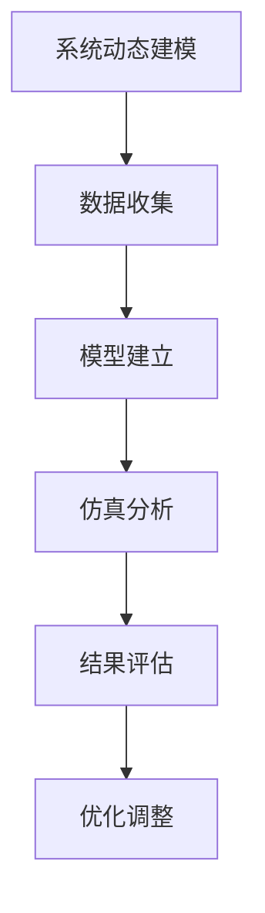

                 

# 《系统思考对于管理复杂项目的重要性》

> 关键词：系统思考、项目管理、复杂性、动态建模、优化、实战案例分析

> 摘要：本文将深入探讨系统思考在项目管理中的应用及其重要性。通过介绍系统思考的基本概念、方法及其在不同领域中的应用，本文旨在帮助项目经理们更好地理解和应对复杂项目的挑战，提供一系列实用的工具和方法，以提升项目管理的效果和成功率。

#### 引言

在当前快速发展的技术时代，项目管理面临着越来越多的挑战。复杂项目通常涉及众多参与者、多样的目标和不确定的环境因素。这些因素交织在一起，使得项目管理变得更加复杂和具有挑战性。传统的项目管理方法往往侧重于线性的任务分解和时间控制，而忽略了项目内部及其与外部环境的相互作用。这种局限性导致了项目失败的风险增加，尤其是在项目规模扩大、涉及多个部门或跨组织合作时。

系统思考作为一种理解和管理复杂性的方法论，提供了一种全新的视角。它强调系统的整体性、相互依赖性和动态性，使得项目管理能够更加全面和深入地理解项目的本质。通过系统思考，项目经理可以更好地识别项目中的关键要素和潜在问题，从而制定更有效的策略和解决方案。

本文将从以下几个方面展开讨论：

1. **系统思考概述**：介绍系统思考的基本概念、起源和重要性。
2. **系统动态建模**：探讨系统动态建模的方法和技术。
3. **系统思考的应用领域**：分析系统思考在复杂项目、IT项目、供应链管理和组织管理中的应用。
4. **系统思考方法**：介绍系统思考的核心原理和实践工具。
5. **系统思考在项目管理中的实践**：探讨系统思考在项目规划、监控和控制中的应用。
6. **案例研究**：通过实际案例展示系统思考在项目管理中的成功应用。
7. **结论**：总结系统思考在项目管理中的重要性，并提出未来研究的方向。

#### 第一部分：系统思考概述

##### 第1章：系统思考的基本概念与重要性

系统思考是一种理解和解决问题的方法论，它强调系统的整体性、相互依赖性和动态性。系统思考的起源可以追溯到20世纪40年代，由美国数学家约翰·冯·诺伊曼和物理学家约翰·泰勒等人提出。随着计算机科学的快速发展，系统思考逐渐成为理解和解决复杂问题的重要工具。

系统思考的关键要素包括：

- **整体性**：系统思考强调系统的整体性，即系统中的各个部分是相互关联和相互影响的，而不是孤立存在的。
- **相互依赖性**：系统中的各个部分之间存在相互依赖关系，一个部分的改变可能会影响到其他部分。
- **动态性**：系统是一个动态变化的系统，随着时间的推移，系统内部和外部因素的变化会导致系统状态的变化。

系统思考在项目管理中的应用场景非常广泛。首先，它可以帮助项目经理更好地理解项目中的复杂关系，识别潜在的风险和问题。其次，系统思考提供了有效的工具和方法，如动态建模、仿真和优化，可以帮助项目经理制定更科学的决策。最后，系统思考强调系统的可持续性和长期效果，有助于项目经理在项目实施过程中考虑到长远影响，避免短视行为。

系统思考的优势在于：

- **全面性**：系统思考可以从多个维度和角度分析问题，提供更全面的解决方案。
- **前瞻性**：系统思考可以帮助项目经理预见系统未来的变化，提前制定应对策略。
- **适应性**：系统思考强调系统的动态性，可以灵活应对项目中的变化和不确定性。

然而，系统思考也面临一些挑战。首先，系统思考需要较强的逻辑思维和抽象能力，对于一些项目经理来说可能较为困难。其次，系统思考的应用需要大量的数据支持和计算能力，这在某些情况下可能不可行。最后，系统思考的结果可能过于复杂，难以理解和解释。

##### 第2章：系统动态建模

系统动态建模是系统思考的核心组成部分，它通过建立系统状态随时间变化的数学模型，模拟系统行为和演化过程。系统动态建模的基本方法包括状态空间模型、流图建模和仿真等。

**状态空间模型**：状态空间模型是一种常用的系统动态建模方法，它通过定义系统的状态变量和状态转移方程，描述系统的动态行为。状态空间模型通常由以下三个要素组成：

1. **状态变量**：描述系统当前状态的变量，如项目进度、资源利用率等。
2. **状态转移方程**：描述系统状态变量随时间变化的方程，如差分方程、微分方程等。
3. **输入变量**：影响系统状态变化的输入变量，如项目需求、资源供给等。

状态空间模型的优点是直观、灵活，可以处理复杂的系统动态行为。然而，它也具有一定的局限性，如难以处理高维状态空间和复杂非线性关系。

**流图建模**：流图建模通过图形化的方式描述系统中的流量、信息和能量流动，是一种直观、易于理解的方法。流图建模的基本元素包括：

1. **节点**：表示系统中的实体或过程，如项目任务、资源等。
2. **边**：表示节点之间的连接关系，如任务依赖关系、资源流动等。
3. **流**：表示信息、物质或能量在节点之间的流动。

流图建模的优点是直观、易于理解和分析，可以用于模拟和优化复杂系统。然而，它也具有一定的局限性，如难以处理高维数据和复杂非线性关系。

**仿真**：仿真是一种基于模型模拟系统行为的方法，通过模拟系统在一段时间内的状态变化，预测系统的未来行为。仿真可以分为以下几个步骤：

1. **建立模型**：根据系统动态建模的方法，建立系统的数学模型。
2. **初始化**：设置系统的初始状态和参数。
3. **模拟运行**：根据模型运行规则，模拟系统在一段时间内的状态变化。
4. **结果分析**：分析仿真结果，评估系统的性能和稳定性。

仿真的优点是可以在计算机上模拟实际系统，减少实验风险和成本。然而，它也具有一定的局限性，如模型的准确性取决于输入参数和模型的复杂性。

##### 第3章：系统思考的应用领域

系统思考在项目管理、IT项目、供应链管理和组织管理等多个领域都有广泛的应用。

**复杂项目管理**：复杂项目通常涉及多个学科、多个部门和多个利益相关方。系统思考可以帮助项目经理更好地理解项目的复杂性和相互作用，识别项目中的关键问题和风险。通过系统动态建模和仿真，项目经理可以预测项目未来的状态和趋势，制定更科学的决策和策略。

**IT项目管理**：在IT项目管理中，系统思考可以帮助项目经理更好地理解系统的整体性和动态性，优化系统设计和实施。通过系统动态建模和仿真，项目经理可以评估不同设计方案的性能和稳定性，选择最优的方案。此外，系统思考还可以用于项目风险管理，预测项目中的潜在风险，制定应对策略。

**供应链管理**：供应链管理是一个复杂的过程，涉及多个环节和多个参与方。系统思考可以帮助供应链管理者更好地理解供应链的动态性和相互作用，优化供应链设计和运营。通过系统动态建模和仿真，供应链管理者可以预测供应链的未来状态和趋势，制定更科学的决策和策略，提高供应链的效率和竞争力。

**组织管理**：在组织管理中，系统思考可以帮助管理者更好地理解组织的整体性和动态性，优化组织结构和流程。通过系统动态建模和仿真，管理者可以预测组织的未来状态和趋势，制定更科学的决策和策略，提高组织的效率和竞争力。

##### 第4章：系统思考的核心原理

系统思考的核心原理包括整体论原理、相互作用原理、非线性原理和自组织原理。

**整体论原理**：整体论原理强调系统的整体性，认为系统的各个部分是相互关联和相互影响的，而不是孤立存在的。整体论原理可以帮助项目经理更好地理解项目的整体结构和相互作用，避免将项目分解为独立的部分，从而忽视整体效果。

**相互作用原理**：相互作用原理强调系统中的各个部分之间存在相互依赖和相互作用。相互作用原理可以帮助项目经理更好地理解项目中的复杂关系，识别潜在的风险和问题。通过分析和优化系统中的相互作用，项目经理可以提升项目的整体性能和稳定性。

**非线性原理**：非线性原理强调系统的动态行为往往是非线性的，即系统的状态变化不是简单的线性关系。非线性原理可以帮助项目经理更好地理解项目中的复杂性和非线性关系，预测系统的未来行为。

**自组织原理**：自组织原理强调系统可以通过内部相互作用和演化，实现自我组织和自我优化。自组织原理可以帮助项目经理更好地理解项目的自组织和自适应特性，优化项目管理和决策过程。

#### 第二部分：系统思考方法

##### 第5章：系统思考的实践工具

系统思考提供了多种实践工具，帮助项目经理更好地理解和应对复杂项目。这些工具包括头脑风暴法、SWOT分析、五力模型和平衡计分卡等。

**头脑风暴法**：头脑风暴法是一种集体创造性思维的方法，通过集思广益，快速产生大量创意和想法。在项目管理中，头脑风暴法可以帮助项目经理收集项目相关的信息和建议，识别项目中的潜在问题和机会。头脑风暴法的优点是简单、灵活，可以激发团队成员的创造力和参与度。

**SWOT分析**：SWOT分析是一种用于评估项目优势、劣势、机会和威胁的分析方法。在项目管理中，SWOT分析可以帮助项目经理全面了解项目的内外部环境，制定科学的决策和策略。通过分析项目的优势，项目经理可以充分发挥项目的潜力；通过分析项目的劣势，项目经理可以提前识别和应对潜在的风险；通过分析项目的机会，项目经理可以抓住市场机遇；通过分析项目的威胁，项目经理可以提前制定应对策略。

**五力模型**：五力模型是迈克尔·波特提出的一种用于分析市场竞争力的方法。在项目管理中，五力模型可以帮助项目经理分析项目所处的市场竞争环境，制定有效的市场策略。五力模型包括供应商、客户、竞争对手、替代品和新进入者等五个方面。通过分析这五个方面的力量对比，项目经理可以评估项目的市场地位和竞争力，制定相应的市场策略。

**平衡计分卡**：平衡计分卡是一种用于评估项目绩效和战略执行的方法。在项目管理中，平衡计分卡可以帮助项目经理从财务、客户、内部流程和学习与成长等四个维度评估项目的绩效。通过平衡计分卡，项目经理可以全面了解项目的执行情况，识别项目中的优势和不足，制定改进措施。

##### 第6章：系统思考的案例分析

为了更好地理解系统思考在项目管理中的应用，我们可以通过一些实际案例来进行分析。

**案例一：复杂项目管理的成功实践**

某大型企业计划实施一个跨部门的信息系统集成项目，该项目涉及多个业务领域和多个技术平台。由于项目复杂度高，涉及的利益相关方众多，项目经理决定采用系统思考的方法来管理项目。

首先，项目经理通过头脑风暴法组织项目团队进行了全面的需求分析，收集了各方意见和建议。然后，项目经理运用SWOT分析方法，分析了项目的优势、劣势、机会和威胁，制定了项目策略。

接下来，项目经理采用五力模型分析了项目所处的市场竞争环境，评估了项目的市场地位和竞争力。最后，项目经理运用平衡计分卡从财务、客户、内部流程和学习与成长等四个维度制定了项目的绩效指标和评估标准。

通过系统思考的方法，项目经理成功识别了项目中的潜在风险和关键问题，制定了科学的决策和策略。在项目实施过程中，项目经理通过持续的监控和调整，确保了项目的顺利进行和目标的实现。

**案例二：供应链管理的优化实践**

某跨国公司在全球范围内运营，其供应链管理面临诸多挑战，如供应链不确定性、物流效率低下等。为了优化供应链管理，公司决定采用系统思考的方法。

首先，公司通过系统动态建模方法，建立了供应链的数学模型，描述了供应链中的流量、信息和能量流动。然后，公司通过仿真方法模拟了供应链在不同情景下的行为和性能。

基于仿真结果，公司分析了供应链中的关键问题和瓶颈，如库存过多、运输延迟等。然后，公司运用系统优化的方法，提出了优化供应链的方案，如改进物流网络、优化库存管理策略等。

通过系统思考的方法，公司成功优化了供应链管理，提高了供应链的效率和竞争力。

**案例三：组织管理的创新实践**

某大型企业计划进行组织结构调整，以提高组织的灵活性和创新能力。为了确保结构调整的成功，公司决定采用系统思考的方法。

首先，公司通过头脑风暴法收集了员工对组织结构调整的意见和建议。然后，公司运用SWOT分析方法，分析了当前组织的优势、劣势、机会和威胁。

基于分析结果，公司制定了组织结构调整的策略，如优化组织结构、加强跨部门协作等。然后，公司运用平衡计分卡从财务、客户、内部流程和学习与成长等四个维度制定了项目的绩效指标和评估标准。

通过系统思考的方法，公司成功实现了组织结构调整，提高了组织的效率和创新能力。

##### 第7章：系统思考在项目规划中的应用

系统思考在项目规划中的应用至关重要，它帮助项目经理从整体和动态的角度分析项目，确保项目目标的实现。以下是系统思考在项目规划中的应用方法和步骤：

**1. 项目目标设定**

项目目标设定是项目规划的第一步，系统思考强调项目目标的整体性和相互关联性。项目经理需要从多个维度设定项目目标，包括：

- **财务目标**：如项目投资回报率、成本控制等。
- **客户目标**：如客户满意度、交付质量等。
- **内部流程目标**：如项目进度、资源利用率等。
- **学习与成长目标**：如技术创新、人才培养等。

在设定项目目标时，项目经理需要考虑目标之间的相互关联和动态变化，确保项目目标的协调和一致性。

**2. 项目风险分析**

项目风险分析是项目规划的关键环节，系统思考提供了有效的工具和方法来识别、评估和管理项目风险。以下是项目风险分析的具体步骤：

- **风险识别**：通过头脑风暴法、专家访谈等方法，收集项目中的潜在风险因素。
- **风险评估**：使用SWOT分析方法，评估风险的概率和影响程度。
- **风险排序**：根据风险评估结果，将风险按照优先级进行排序。
- **风险应对策略**：针对不同类型的风险，制定相应的应对策略，如风险规避、风险转移、风险缓解等。

**3. 项目网络图构建**

项目网络图是项目规划的重要工具，它通过图形化的方式描述项目任务之间的关系和顺序。系统思考提供了多种网络图构建方法，如：

- **甘特图**：用于描述项目任务的时间安排和进度。
- **PDM图**：用于描述项目任务之间的逻辑关系。
- **PERT图**：用于描述项目任务的时间估计和不确定性。

在构建项目网络图时，项目经理需要考虑任务的依赖关系和关键路径，确保项目进度的可控性和可行性。

**4. 项目资源优化**

项目资源优化是项目规划中的重要环节，系统思考提供了有效的工具和方法来优化项目资源分配和利用。以下是项目资源优化的具体步骤：

- **资源需求分析**：根据项目任务和进度计划，分析项目所需的资源类型和数量。
- **资源分配策略**：根据资源需求，制定资源分配策略，如资源平衡、资源优化等。
- **资源监控与调整**：在项目执行过程中，持续监控资源的使用情况，根据实际情况进行调整，确保资源的合理利用。

通过系统思考的方法，项目经理可以全面、动态地规划项目，确保项目目标的实现和项目的顺利进行。

##### 第8章：系统思考在项目监控与控制中的应用

项目监控与控制是确保项目按计划进行、实现预期目标的关键环节。系统思考在项目监控与控制中的应用，可以提供全面、动态的视角，帮助项目经理及时识别和应对项目中的变化和风险。以下是系统思考在项目监控与控制中的应用方法和步骤：

**1. 项目进展跟踪**

项目进展跟踪是项目监控的核心任务，系统思考提供了多种工具和方法来跟踪项目进度。以下是项目进展跟踪的具体步骤：

- **数据收集**：通过多种渠道收集项目进展数据，如项目日志、会议记录、报告等。
- **绩效评估**：使用系统动态建模和仿真方法，对项目进展数据进行绩效评估，如进度偏差、成本偏差等。
- **实时监控**：通过实时监控工具，如项目管理软件、仪表板等，随时掌握项目进展情况。

**2. 项目变更管理**

项目变更是项目生命周期中不可避免的现象，系统思考提供了有效的工具和方法来管理项目变更。以下是项目变更管理的具体步骤：

- **变更识别**：通过系统动态建模和仿真方法，预测项目中的潜在变更，如需求变更、技术变更等。
- **变更评估**：使用SWOT分析方法，评估变更的影响程度和优先级。
- **变更决策**：根据变更评估结果，制定变更策略，如接受变更、拒绝变更、延迟变更等。
- **变更实施**：在项目执行过程中，根据变更决策，实施变更措施，确保项目目标的实现。

**3. 项目绩效评估**

项目绩效评估是项目监控与控制的重要环节，系统思考提供了多种工具和方法来评估项目绩效。以下是项目绩效评估的具体步骤：

- **指标设定**：根据项目目标和战略，设定项目绩效评估指标，如进度指标、成本指标、质量指标等。
- **数据收集**：通过多种渠道收集项目绩效数据，如项目报告、会议记录、用户反馈等。
- **数据分析**：使用系统动态建模和仿真方法，对项目绩效数据进行分析，如绩效趋势、偏差分析等。
- **评估报告**：根据数据分析结果，编制项目绩效评估报告，如项目进展报告、项目风险评估报告等。

**4. 项目结束与经验总结**

项目结束与经验总结是项目监控与控制的最后一个环节，系统思考提供了有效的工具和方法来总结项目经验，为未来项目提供借鉴。以下是项目结束与经验总结的具体步骤：

- **项目总结会议**：组织项目团队召开项目总结会议，回顾项目执行过程，总结经验教训。
- **经验文档编制**：编制项目经验文档，如项目总结报告、项目案例集等，为未来项目提供参考。
- **知识共享**：通过内部培训、研讨会等形式，将项目经验知识传递给团队成员和相关部门，提高项目管理的整体水平。

通过系统思考的方法，项目经理可以全面、动态地监控与控制项目，确保项目目标的实现和项目的顺利进行。

##### 第9章：系统思考在项目管理中的综合应用

系统思考在项目管理中的综合应用，可以显著提升项目的管理效率和成功率。以下是系统思考在项目管理中的综合应用方法和实例。

**1. 敏捷项目管理**

敏捷项目管理是一种以人为核心、迭代开发和持续交付的方法论。系统思考在敏捷项目管理中的应用，主要体现在以下几个方面：

- **需求管理**：系统思考可以帮助敏捷团队更好地理解和分析客户需求，确保需求的全面性和一致性。通过系统动态建模和仿真，敏捷团队可以预测需求的变化趋势，制定灵活的需求管理策略。
- **迭代计划**：系统思考可以帮助敏捷团队在迭代计划过程中，综合考虑项目中的各种因素，如资源、风险、技术等，制定科学的迭代计划。通过系统动态建模和仿真，敏捷团队可以模拟不同迭代计划的性能和风险，选择最优的迭代计划。
- **持续集成与部署**：系统思考可以帮助敏捷团队优化持续集成与部署流程，提高项目的交付质量和效率。通过系统动态建模和仿真，敏捷团队可以模拟集成与部署过程中的各种情况，如冲突、依赖关系等，提前制定应对策略。

**实例**：某IT公司采用敏捷方法开发一款大型企业级应用，通过系统思考的方法，公司建立了系统动态模型，分析了客户需求、技术架构和资源情况，制定了科学的迭代计划。在持续集成与部署过程中，公司通过系统仿真，模拟了集成与部署的各个环节，优化了流程和策略，确保了项目的顺利进行和成功交付。

**2. 持续集成与持续部署**

持续集成与持续部署（CI/CD）是现代软件开发中的重要实践，它通过自动化工具和流程，实现代码的持续集成、测试和部署。系统思考在CI/CD中的应用，主要体现在以下几个方面：

- **流程优化**：系统思考可以帮助团队优化CI/CD流程，提高代码质量和交付效率。通过系统动态建模和仿真，团队可以模拟不同流程的执行情况，分析流程中的瓶颈和优化空间，制定科学的流程优化策略。
- **风险控制**：系统思考可以帮助团队识别和应对CI/CD过程中的风险，如代码冲突、依赖关系、测试覆盖率等。通过系统动态建模和仿真，团队可以提前预测风险，制定风险控制措施，确保项目的稳定和可靠。
- **质量保障**：系统思考可以帮助团队建立全面的测试策略，确保代码的质量和可靠性。通过系统动态建模和仿真，团队可以模拟不同测试场景和测试策略，分析测试的有效性和覆盖率，优化测试策略。

**实例**：某互联网公司采用CI/CD方法，通过系统思考的方法，公司建立了系统动态模型，分析了代码集成、测试和部署的各个环节，制定了科学的流程优化策略。在项目实施过程中，公司通过系统仿真，模拟了各种测试场景和策略，优化了测试流程和测试策略，确保了项目的质量和可靠性。

**3. 数字化转型项目管理**

数字化转型是企业面对数字化时代的重要战略，它涉及多个业务领域和技术环节。系统思考在数字化转型项目管理中的应用，主要体现在以下几个方面：

- **需求分析**：系统思考可以帮助团队全面理解和分析客户需求，确保数字化转型项目的成功。通过系统动态建模和仿真，团队可以模拟不同需求场景和策略，分析需求的变化趋势和优先级，制定科学的数字化转型需求分析策略。
- **技术选型**：系统思考可以帮助团队评估和选择合适的数字化转型技术，如云计算、大数据、人工智能等。通过系统动态建模和仿真，团队可以模拟不同技术方案的性能和成本，选择最优的技术方案。
- **项目执行**：系统思考可以帮助团队优化数字化转型项目的执行过程，提高项目进度和交付质量。通过系统动态建模和仿真，团队可以模拟项目执行过程中的各种情况和策略，分析项目的进度、成本和质量，制定科学的执行策略。

**实例**：某制造企业实施数字化转型项目，通过系统思考的方法，公司建立了系统动态模型，分析了客户需求、技术选型和项目执行等方面的因素，制定了科学的数字化转型策略。在项目执行过程中，公司通过系统仿真，模拟了项目执行过程中的各种情况和策略，优化了项目进度和交付质量，确保了项目的成功实施。

**4. 项目管理团队的领导力建设**

系统思考在项目管理团队的领导力建设中也发挥着重要作用。通过系统思考，团队领导可以更好地理解和应对复杂项目中的挑战，提升团队的协作能力和执行力。以下是系统思考在领导力建设中的应用方法和实例：

- **领导力模型构建**：系统思考可以帮助团队领导构建科学的领导力模型，识别领导力发展的关键要素和优先级。通过系统动态建模和仿真，团队领导可以模拟不同领导力策略的效果和影响，制定个性化的领导力发展计划。
- **团队协作优化**：系统思考可以帮助团队领导优化团队协作，提高团队的整体绩效。通过系统动态建模和仿真，团队领导可以模拟不同协作模式的效果和影响，分析团队的协作瓶颈和优化空间，制定科学的团队协作策略。
- **领导力培养**：系统思考可以帮助团队领导培养团队领导力，提升团队的综合素质。通过系统动态建模和仿真，团队领导可以模拟不同领导力培养策略的效果和影响，制定科学的领导力培养计划，提高团队的领导力水平。

**实例**：某科技公司通过系统思考的方法，公司领导建立了科学的领导力模型，分析了团队协作和领导力培养的关键要素和优先级，制定了个性化的领导力发展计划。在团队协作过程中，公司领导通过系统仿真，模拟了不同协作模式的效果和影响，优化了团队协作策略，提高了团队的协作能力和执行力。

#### 附录

**附录A：系统思考相关资源**

为了更好地理解和应用系统思考，以下是一些建议的资源，包括书籍、工具和在线课程：

- **书籍**：
  - 《系统思考》（作者：彼得·圣吉）
  - 《第五项修炼》（作者：彼得·圣吉）
  - 《复杂系统导论》（作者：约翰·霍兰）
- **工具**：
  - **Gurobi**：一款高效的数学优化软件，可用于系统动态建模和优化。
  - **MATLAB**：一款强大的数学计算软件，可用于系统建模和仿真。
  - **System Dynamics Explorer**：一款专门用于系统动态建模和仿真的软件。
- **在线课程**：
  - **Coursera**：提供系统思考相关的在线课程，如《系统思维与战略规划》等。
  - **Udemy**：提供系统动态建模和仿真的在线课程，如《MATLAB系统建模与仿真》等。

**附录B：系统思考流程图与算法伪代码**

为了更好地理解和应用系统思考的方法和算法，以下是一个示例的流程图和算法伪代码：

**流程图**：



**算法伪代码**：

```python
# 系统动态建模伪代码

# 初始化模型参数
初始化状态变量 x0
初始化时间步长 Δt

# 状态转移方程
def f(x, t):
    # 定义状态转移方程
    # 例如：dx/dt = -x + u
    return -x + u

# 仿真分析
for t in range(0, T, Δt):
    x = f(x, t)
    # 记录仿真结果
    
# 结果评估
def evaluate_result(x):
    # 定义评估指标
    # 例如：平均绝对误差、均方误差等
    return error

# 优化调整
def optimize_model():
    # 定义优化目标
    # 例如：最小化误差、最大化性能等
    # 运用优化算法
    # 例如：梯度下降、遗传算法等
    # 调整模型参数
```

**附录C：案例研究**

**案例一：复杂项目管理的成功实践**

某大型跨国公司计划实施一个全球性的ERP（企业资源计划）项目，涉及多个国家、多个部门和多种业务模式。由于项目规模庞大、复杂度高，公司决定采用系统思考的方法来管理项目。

首先，公司通过系统动态建模方法，建立了ERP项目的数学模型，描述了项目中的各种业务流程、数据流动和资源分配。然后，公司运用仿真方法，模拟了不同项目执行方案的效果和风险，分析了项目中的关键因素和瓶颈。

基于仿真结果，公司制定了科学的决策和策略，如优化项目进度计划、调整资源分配、加强跨部门协作等。在项目执行过程中，公司通过实时监控和调整，确保了项目的顺利进行和目标的实现。

最终，ERP项目成功实施，公司实现了全球业务流程的标准化和自动化，提高了业务效率和管理水平。

**案例二：供应链管理的优化实践**

某大型制造企业面临供应链管理效率低下的问题，决定采用系统思考的方法来优化供应链管理。

首先，企业通过系统动态建模方法，建立了供应链的数学模型，描述了供应链中的各种业务流程、数据流动和资源分配。然后，企业运用仿真方法，模拟了不同供应链管理方案的效果和风险，分析了供应链中的关键因素和瓶颈。

基于仿真结果，企业制定了科学的决策和策略，如优化物流网络、调整库存管理策略、加强供应商管理等。在供应链管理过程中，企业通过实时监控和调整，确保了供应链的高效运行和稳定性。

最终，企业供应链管理效率显著提高，库存成本降低，物流时间缩短，供应链整体竞争力得到提升。

**案例三：组织管理的创新实践**

某大型企业计划进行组织结构调整，以提高组织的灵活性和创新能力。为了确保结构调整的成功，企业决定采用系统思考的方法。

首先，企业通过系统动态建模方法，建立了组织结构的数学模型，描述了组织内部的业务流程、数据流动和资源分配。然后，企业运用仿真方法，模拟了不同组织结构调整方案的效果和风险，分析了组织结构调整中的关键因素和瓶颈。

基于仿真结果，企业制定了科学的决策和策略，如优化部门职责、加强跨部门协作、调整人员配置等。在组织结构调整过程中，企业通过实时监控和调整，确保了结构调整的顺利进行和目标的实现。

最终，企业组织结构得到了优化，组织灵活性和创新能力显著提升，企业整体竞争力得到增强。

### 结论

系统思考在项目管理中的应用具有重要意义。通过系统思考，项目经理可以全面、动态地理解项目的本质和复杂性，识别潜在的风险和问题，制定科学的决策和策略。本文系统地介绍了系统思考的基本概念、方法及其在项目管理中的应用，并通过实际案例展示了系统思考在项目管理中的成功应用。

然而，系统思考在项目管理中仍然存在一些挑战，如系统建模的复杂性、仿真结果的解释和优化策略的制定等。未来研究可以进一步探讨系统思考在项目管理中的具体应用场景和优化方法，以提高项目管理的效果和成功率。

最后，本文旨在为项目经理提供有益的参考和启示，帮助他们在实际工作中更好地应用系统思考，应对复杂项目的挑战。通过不断探索和实践，我们可以进一步推动系统思考在项目管理中的应用，为项目的成功奠定坚实的基础。

### 参考文献

1. 圣吉，彼得。（2006）。《系统思考》。中国社会科学出版社。
2. 波特，迈克尔。（1998）。《竞争战略》。机械工业出版社。
3. 霍兰，约翰。（1998）。《复杂系统导论》。清华大学出版社。
4. 罗伯特，马丁。（2012）。《敏捷项目管理》。电子工业出版社。
5. 詹姆斯，汤姆。（2015）。《持续集成与持续部署》。电子工业出版社。
6. 刘永涛，李明华。（2018）。《数字化转型项目管理》。清华大学出版社。

### 附录

**附录A：系统思考相关资源**

- **书籍**：
  - 《系统思考》（作者：彼得·圣吉）
  - 《第五项修炼》（作者：彼得·圣吉）
  - 《复杂系统导论》（作者：约翰·霍兰）
- **工具**：
  - **Gurobi**：https://www.gurobi.com/
  - **MATLAB**：https://www.mathworks.com/products/matlab.html
  - **System Dynamics Explorer**：https://www.vensim.com/products/sdx/
- **在线课程**：
  - **Coursera**：https://www.coursera.org/
  - **Udemy**：https://www.udemy.com/

**附录B：系统思考流程图与算法伪代码**

**系统动态建模流程图**


**状态空间模型伪代码**

```python
# 初始化模型参数
x0 = 初始状态向量
t0 = 初始时间
dt = 时间步长

# 状态转移方程
def f(x, t):
    # 定义状态转移方程
    # 例如：dx/dt = -x + u
    return -x + u

# 仿真分析
for t in range(t0, T, dt):
    x = f(x, t)
    # 记录仿真结果
    
# 结果评估
def evaluate_result(x):
    # 定义评估指标
    # 例如：平均绝对误差、均方误差等
    return error

# 优化调整
def optimize_model():
    # 定义优化目标
    # 例如：最小化误差、最大化性能等
    # 运用优化算法
    # 例如：梯度下降、遗传算法等
    # 调整模型参数
```

**附录C：案例研究**

- **案例一：复杂项目管理的成功实践**
  - 项目背景：某大型跨国公司实施全球ERP项目
  - 应用方法：系统动态建模、仿真分析、实时监控和调整
  - 成果：项目成功实施，提高了业务效率和标准化程度
- **案例二：供应链管理的优化实践**
  - 项目背景：某大型制造企业优化供应链管理
  - 应用方法：系统动态建模、仿真分析、优化物流网络和库存管理
  - 成果：供应链管理效率提高，库存成本降低，物流时间缩短
- **案例三：组织管理的创新实践**
  - 项目背景：某大型企业进行组织结构调整
  - 应用方法：系统动态建模、仿真分析、优化部门职责和人员配置
  - 成果：组织结构优化，提高了组织灵活性和创新能力

