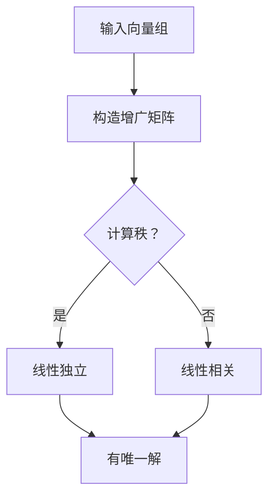

                 

### 文章标题：线性代数导引：线性独立性

> 关键词：线性代数、线性独立性、线性相关性、线性方程组、矩阵运算

> 摘要：本文将深入探讨线性代数中的线性独立性概念，从基础理论出发，逐步引导读者理解线性独立性和线性相关性的定义、性质及应用。通过详细的数学公式、伪代码和实际项目实战，本文旨在帮助读者全面掌握线性独立性的核心原理，并在实际问题中灵活运用。

### 引言

线性代数是数学中一个重要的分支，它在物理学、工程学、计算机科学等领域都有着广泛的应用。线性代数的核心概念包括矩阵、向量、线性方程组、线性变换等。在这些概念中，线性独立性占有举足轻重的地位。线性独立性是判断一组向量是否能够构成基底的关键，它对于解决线性方程组、矩阵运算以及在线性空间中的问题都有着重要的影响。

本文将分为两部分来探讨线性独立性。第一部分将介绍线性代数的基础知识，包括矩阵的运算、矩阵的秩和线性变换等。这些基础概念将为后续讨论线性独立性提供必要的背景知识。第二部分将重点讨论线性独立性和线性相关性的概念、性质以及应用。通过详细的数学公式、伪代码和实际项目实战，我们将深入理解线性独立性在数学和计算机科学中的重要性。

### 《线性代数导引：线性独立性》目录大纲

#### 第一部分：线性代数基础

#### 第1章：线性代数的引言
- 1.1 线性代数的基本概念
  - 矩阵的概念与表示
  - 向量与矩阵的关系
- 1.2 线性方程组
  - 解线性方程组的方法
  - 矩阵的秩与解的存在性

#### 第2章：矩阵的运算
- 2.1 矩阵的加法和减法
  - 矩阵加法与减法的性质
  - 矩阵加法与减法的例子
- 2.2 矩阵与数的乘法
  - 矩阵与数的乘法的性质
  - 矩阵与数的乘法的例子
- 2.3 矩阵的乘法
  - 矩阵乘法的性质
  - 矩阵乘法的例子

#### 第3章：矩阵的秩
- 3.1 矩阵的秩的概念
  - 矩阵的秩的定义
  - 矩阵的秩的计算方法
- 3.2 矩阵的秩的性质
  - 矩阵的秩的性质
  - 矩阵的秩的应用

#### 第4章：线性变换
- 4.1 线性变换的概念
  - 线性变换的定义
  - 线性变换的性质
- 4.2 线性变换的矩阵表示
  - 线性变换的矩阵表示
  - 线性变换的矩阵表示的例子

#### 第5章：线性空间
- 5.1 线性空间的概念
  - 线性空间的定义
  - 线性空间的例子
- 5.2 线性空间的性质
  - 线性空间的性质
  - 线性空间的性质的应用

#### 第二部分：线性独立性与线性相关性

#### 第6章：线性独立性的概念
- 6.1 线性独立性的概念
  - 线性独立性的定义
  - 线性独立性的判断方法
- 6.2 线性独立性的性质
  - 线性独立性的性质
  - 线性独立性的应用

#### 第7章：线性相关性的概念
- 7.1 线性相关性的概念
  - 线性相关性的定义
  - 线性相关性的判断方法
- 7.2 线性相关性的性质
  - 线性相关性的性质
  - 线性相关性的应用

#### 第8章：线性独立性检测
- 8.1 线性独立性检测的算法
  - 检测线性独立性的算法
  - 检测线性独立性的算法的例子
- 8.2 线性独立性检测的应用
  - 线性独立性检测在数学中的应用
  - 线性独立性检测在计算机科学中的应用

#### 第9章：线性独立性与线性相关性在实际问题中的应用
- 9.1 线性独立性在线性方程组中的应用
  - 线性独立性在线性方程组解的存在性中的应用
  - 线性独立性在线性方程组解的唯一性中的应用
- 9.2 线性相关性在矩阵运算中的应用
  - 线性相关性在矩阵乘法中的应用
  - 线性相关性在矩阵的秩中的应用

#### 附录：线性独立性与线性相关性的Mermaid流程图、伪代码、数学公式和项目实战

- 附录A：线性独立性与线性相关性的Mermaid流程图
- 附录B：线性独立性检测的伪代码
- 附录C：线性独立性在求解线性方程组中的应用的数学公式
- 附录D：线性独立性在线性方程组求解中的应用的项目实战

### 《线性代数导引：线性独立性》的逻辑清晰结构

在撰写这篇文章时，我们将遵循以下逻辑清晰的结构：

1. **引言**：通过简要介绍线性代数的重要性以及线性独立性在其中的核心地位，激发读者的兴趣，并明确文章的主题和目标。

2. **基础概念介绍**：在第一部分，我们将系统地介绍线性代数的基础概念，如矩阵、向量、线性方程组、矩阵的秩和线性变换。这些概念将为理解线性独立性提供必要的背景知识。

3. **详细解释与举例**：在介绍每个基础概念时，我们将结合具体的例子进行详细解释，帮助读者更好地理解这些概念的本质和应用。

4. **核心内容深入探讨**：在第二部分，我们将重点讨论线性独立性和线性相关性的定义、性质以及应用。通过数学公式、伪代码和实际项目实战，我们将深入探讨这些概念的核心原理，并展示其在数学和计算机科学中的实际应用。

5. **总结与附录**：在文章的结尾，我们将对全文内容进行总结，并附上相关的Mermaid流程图、伪代码、数学公式和项目实战，以供读者参考和学习。

通过这样的逻辑清晰的结构，我们将帮助读者系统地掌握线性独立性的核心原理，并在实际问题中灵活运用。让我们一起开启这段深入探讨线性独立性的旅程吧！

### 线性代数基础

#### 第1章：线性代数的引言

线性代数作为数学的一个重要分支，其在物理学、工程学、计算机科学等领域都有着广泛的应用。线性代数主要研究向量、矩阵和线性方程组，以及它们之间的运算和关系。线性代数的核心概念包括矩阵、向量、线性方程组、矩阵的秩和线性变换等。本章将介绍这些基础概念，为后续讨论线性独立性奠定基础。

#### 1.1 线性代数的基本概念

1. **矩阵的概念与表示**

   矩阵是一种由数字组成的矩形阵列，通常用大写字母表示，如 \( A \)。矩阵中的每个数字称为矩阵的元素，位于第 \( i \) 行第 \( j \) 列的元素表示为 \( a_{ij} \)。矩阵的行数称为矩阵的行数，列数称为矩阵的列数。例如：

   \[
   A = \begin{bmatrix}
   a_{11} & a_{12} & \cdots & a_{1n} \\
   a_{21} & a_{22} & \cdots & a_{2n} \\
   \vdots & \vdots & \ddots & \vdots \\
   a_{m1} & a_{m2} & \cdots & a_{mn}
   \end{bmatrix}
   \]

2. **向量与矩阵的关系**

   向量可以看作是一行矩阵或一列矩阵。行向量用小写字母带箭头表示，如 \( \mathbf{a} \)，列向量用小写字母表示，如 \( \mathbf{a} \)。例如：

   \[
   \mathbf{a} = \begin{bmatrix}
   a_1 \\
   a_2 \\
   \vdots \\
   a_n
   \end{bmatrix}, \quad \mathbf{b} = \begin{bmatrix}
   b_1 & b_2 & \cdots & b_n
   \end{bmatrix}
   \]

   向量与矩阵的关系主要体现在矩阵乘法中。给定一个矩阵 \( A \) 和一个向量 \( \mathbf{x} \)，矩阵乘法 \( A\mathbf{x} \) 的结果是一个新的向量，其每个元素是矩阵 \( A \) 的列向量与向量 \( \mathbf{x} \) 的对应元素的内积。例如：

   \[
   A = \begin{bmatrix}
   1 & 2 \\
   3 & 4
   \end{bmatrix}, \quad \mathbf{x} = \begin{bmatrix}
   x_1 \\
   x_2
   \end{bmatrix} \Rightarrow A\mathbf{x} = \begin{bmatrix}
   1 \cdot x_1 + 2 \cdot x_2 \\
   3 \cdot x_1 + 4 \cdot x_2
   \end{bmatrix} = \begin{bmatrix}
   1 + 2x_2 \\
   3x_1 + 4x_2
   \end{bmatrix}
   \]

#### 1.2 线性方程组

线性方程组是指由多个线性方程组成的集合。线性方程的一般形式为：

\[
a_{11}x_1 + a_{12}x_2 + \cdots + a_{1n}x_n = b_1
\]

\[
a_{21}x_1 + a_{22}x_2 + \cdots + a_{2n}x_n = b_2
\]

\[
\vdots
\]

\[
a_{m1}x_1 + a_{m2}x_2 + \cdots + a_{mn}x_n = b_m
\]

其中，\( a_{ij} \) 和 \( b_i \) 是已知常数，\( x_i \) 是未知数。

线性方程组的解可以通过高斯消元法或矩阵的秩来求解。高斯消元法通过消元将线性方程组转化为上三角矩阵或下三角矩阵，然后逐个求解未知数。而矩阵的秩提供了另一种求解线性方程组的方法，通过计算系数矩阵的秩和自由变量的个数来判断解的存在性和唯一性。

#### 1.3 矩阵的秩与解的存在性

矩阵的秩是指矩阵中非零行或非零列的最大数目。线性方程组解的存在性与系数矩阵的秩密切相关。如果系数矩阵的秩等于方程组的未知数个数，则线性方程组有唯一解；如果系数矩阵的秩小于方程组的未知数个数，则线性方程组无解或有无数解。

例如，对于以下线性方程组：

\[
\begin{bmatrix}
1 & 2 \\
3 & 4
\end{bmatrix} \begin{bmatrix}
x_1 \\
x_2
\end{bmatrix} = \begin{bmatrix}
5 \\
7
\end{bmatrix}
\]

系数矩阵的秩为 2，等于未知数个数 2，因此该线性方程组有唯一解。通过高斯消元法，我们可以求得该方程组的解为：

\[
x_1 = 1, \quad x_2 = 2
\]

#### 概括

本章介绍了线性代数的基本概念，包括矩阵的概念与表示、向量与矩阵的关系、线性方程组以及矩阵的秩。这些基础概念为后续讨论线性独立性提供了必要的背景知识。在下一章中，我们将进一步探讨矩阵的运算，深入理解矩阵的加法、减法和乘法等基本操作。

### 矩阵的运算

在线性代数中，矩阵的运算是非常重要的内容。矩阵的加法、减法和乘法等基本运算不仅用于解决线性方程组，还在矩阵理论、线性变换、数值计算等领域有广泛的应用。本章将详细讨论这些基本运算的概念、性质以及例子。

#### 2.1 矩阵的加法和减法

1. **矩阵加法与减法的性质**

   矩阵加法和减法是线性代数中非常基础的运算。给定两个矩阵 \( A \) 和 \( B \)，它们的加法和减法结果也是一个矩阵。具体来说，如果两个矩阵的维度相同，即它们的行数和列数都相等，则可以进行矩阵加法和减法。矩阵加法和减法满足以下性质：

   - **交换律**：\( A + B = B + A \)
   - **结合律**：\( (A + B) + C = A + (B + C) \)
   - **分配律**：\( A + (B - C) = (A + B) - C \)
   - **零矩阵性质**：\( A + \mathbf{0} = A \)，其中 \(\mathbf{0}\) 表示零矩阵
   - **相反矩阵性质**：\( A + (-A) = \mathbf{0} \)

   其中，\(\mathbf{0}\) 表示零矩阵，其所有元素都是零。而相反矩阵 \(-A\) 是一个与 \( A \) 维度相同且对应元素取相反数的矩阵。

2. **矩阵加法与减法的例子**

   假设我们有两个矩阵 \( A \) 和 \( B \)：

   \[
   A = \begin{bmatrix}
   1 & 2 \\
   3 & 4
   \end{bmatrix}, \quad B = \begin{bmatrix}
   5 & 6 \\
   7 & 8
   \end{bmatrix}
   \]

   它们的加法和减法结果如下：

   \[
   A + B = \begin{bmatrix}
   1 + 5 & 2 + 6 \\
   3 + 7 & 4 + 8
   \end{bmatrix} = \begin{bmatrix}
   6 & 8 \\
   10 & 12
   \end{bmatrix}
   \]

   \[
   A - B = \begin{bmatrix}
   1 - 5 & 2 - 6 \\
   3 - 7 & 4 - 8
   \end{bmatrix} = \begin{bmatrix}
   -4 & -4 \\
   -4 & -4
   \end{bmatrix}
   \]

   通过这个例子，我们可以看到，矩阵加法和减法的结果也是一个矩阵，且其维度与原矩阵相同。

#### 2.2 矩阵与数的乘法

1. **矩阵与数的乘法的性质**

   矩阵与数的乘法是一种简单的运算，即将矩阵中的每个元素乘以一个常数。对于给定的矩阵 \( A \) 和一个常数 \( c \)，矩阵与数的乘法满足以下性质：

   - **乘法分配律**：\( c(A + B) = cA + cB \)
   - **结合律**：\( (cA)d = cdA \)
   - **与矩阵加法的结合律**：\( c(A + B) = cA + cB \)
   - **与标量的分配律**：\( (A + B)c = Ac + Bc \)

   其中，\( cA \) 表示将矩阵 \( A \) 中的每个元素乘以常数 \( c \)。

2. **矩阵与数的乘法的例子**

   假设我们有一个矩阵 \( A \) 和一个常数 \( c = 3 \)：

   \[
   A = \begin{bmatrix}
   1 & 2 \\
   3 & 4
   \end{bmatrix}
   \]

   矩阵与数的乘法的结果如下：

   \[
   3A = \begin{bmatrix}
   3 \cdot 1 & 3 \cdot 2 \\
   3 \cdot 3 & 3 \cdot 4
   \end{bmatrix} = \begin{bmatrix}
   3 & 6 \\
   9 & 12
   \end{bmatrix}
   \]

   通过这个例子，我们可以看到，矩阵与数的乘法的结果也是一个矩阵，且其维度与原矩阵相同。

#### 2.3 矩阵的乘法

1. **矩阵乘法的性质**

   矩阵乘法是线性代数中一种较为复杂的运算，但它在实际应用中具有重要意义。给定两个矩阵 \( A \) 和 \( B \)，如果 \( A \) 的列数等于 \( B \) 的行数，则可以计算矩阵乘法 \( AB \)。矩阵乘法满足以下性质：

   - **交换律**：一般情况下，\( AB \neq BA \)
   - **结合律**：\( (AB)C = A(BC) \)
   - **分配律**：\( A(B + C) = AB + AC \)
   - **与标量的分配律**：\( (A + B)C = AC + BC \)

   另外，矩阵乘法还具有以下重要性质：

   - **单位矩阵性质**：如果 \( A \) 是一个 \( n \times n \) 的方阵，则存在一个单位矩阵 \( I \)，使得 \( AI = IA = A \)。单位矩阵 \( I \) 在矩阵乘法中起到类似数学中的 1 的作用。
   - **逆矩阵性质**：如果 \( A \) 是一个可逆矩阵，即存在一个矩阵 \( A^{-1} \) 使得 \( AA^{-1} = A^{-1}A = I \)，则 \( A^{-1} \) 与 \( A \) 的乘积等于单位矩阵。

2. **矩阵乘法的例子**

   假设我们有两个矩阵 \( A \) 和 \( B \)：

   \[
   A = \begin{bmatrix}
   1 & 2 \\
   3 & 4
   \end{bmatrix}, \quad B = \begin{bmatrix}
   5 & 6 \\
   7 & 8
   \end{bmatrix}
   \]

   它们的乘法结果如下：

   \[
   AB = \begin{bmatrix}
   1 \cdot 5 + 2 \cdot 7 & 1 \cdot 6 + 2 \cdot 8 \\
   3 \cdot 5 + 4 \cdot 7 & 3 \cdot 6 + 4 \cdot 8
   \end{bmatrix} = \begin{bmatrix}
   5 + 14 & 6 + 16 \\
   15 + 28 & 18 + 32
   \end{bmatrix} = \begin{bmatrix}
   19 & 22 \\
   43 & 50
   \end{bmatrix}
   \]

   通过这个例子，我们可以看到，矩阵乘法的结果也是一个矩阵，且其维度由 \( A \) 的列数和 \( B \) 的行数决定。

#### 概括

本章详细介绍了矩阵的加法、减法和乘法的基本运算。矩阵的加法和减法具有交换律、结合律和分配律等基本性质，而矩阵与数的乘法具有乘法分配律、结合律和与矩阵加法的结合律等性质。矩阵乘法则具有交换律、结合律和分配律等性质，且与单位矩阵和逆矩阵有密切的关系。通过这些基本运算，我们可以更好地理解和处理线性代数中的各种问题。

在下一章中，我们将进一步探讨矩阵的秩和线性变换，为讨论线性独立性奠定更加坚实的基础。

### 矩阵的秩

在线性代数中，矩阵的秩是一个非常重要的概念。矩阵的秩不仅能够帮助我们理解矩阵的结构和性质，还能在解线性方程组、计算矩阵的逆矩阵等方面发挥关键作用。本章将详细介绍矩阵的秩的概念、计算方法和性质。

#### 3.1 矩阵的秩的概念

1. **定义**

   矩阵的秩是指矩阵中非零行或非零列的最大数目。具体来说，给定一个 \( m \times n \) 的矩阵 \( A \)，如果其非零行或非零列的最大数目为 \( r \)，则称 \( r \) 为矩阵 \( A \) 的秩，记作 \( \text{rank}(A) = r \)。

2. **等价定义**

   矩阵的秩还可以通过矩阵的行阶梯形式来定义。给定一个 \( m \times n \) 的矩阵 \( A \)，如果存在一个非退化矩阵 \( P \) 和一个 \( r \times r \) 的单位矩阵 \( I_r \)，使得 \( PA \) 的行阶梯形式为 \( I_r \)，则 \( r \) 为矩阵 \( A \) 的秩。

#### 3.2 矩阵的秩的计算方法

1. **高斯消元法**

   高斯消元法是一种常用的计算矩阵秩的方法。通过高斯消元法，我们可以将矩阵转化为行阶梯形式，从而确定其秩。具体步骤如下：

   - 将矩阵 \( A \) 写成增广矩阵形式 \( [A | \mathbf{0}] \)。
   - 通过行变换，将增广矩阵化为行阶梯形式。
   - 计算行阶梯形式中非零行的数目，即为矩阵 \( A \) 的秩。

   例如，给定矩阵 \( A \)：

   \[
   A = \begin{bmatrix}
   1 & 2 & 3 \\
   4 & 5 & 6 \\
   7 & 8 & 9
   \end{bmatrix}
   \]

   我们可以通过高斯消元法将其化为行阶梯形式：

   \[
   \begin{bmatrix}
   1 & 2 & 3 \\
   4 & 5 & 6 \\
   7 & 8 & 9
   \end{bmatrix} \xrightarrow{\text{行变换}} \begin{bmatrix}
   1 & 2 & 3 \\
   0 & 1 & 2 \\
   0 & 0 & 0
   \end{bmatrix}
   \]

   从行阶梯形式中，我们可以看到有两个非零行，因此矩阵 \( A \) 的秩为 2。

2. **秩的性质**

   矩阵的秩具有以下性质：

   - **矩阵的秩等于其行秩和列秩**：给定一个 \( m \times n \) 的矩阵 \( A \)，其秩等于其行秩和列秩。即 \( \text{rank}(A) = \text{row\_rank}(A) = \text{column\_rank}(A) \)。
   - **矩阵的秩小于等于其行数和列数**：对于任意 \( m \times n \) 的矩阵 \( A \)，其秩满足 \( 0 \leq \text{rank}(A) \leq \min(m, n) \)。
   - **矩阵的秩等于其行空间和列空间的维数**：给定一个 \( m \times n \) 的矩阵 \( A \)，其行空间的维数等于其秩，列空间的维数也等于其秩。

   这些性质有助于我们通过不同的方法计算矩阵的秩，并在实际应用中更好地理解矩阵的结构和性质。

#### 3.3 矩阵的秩的应用

1. **解线性方程组**

   矩阵的秩在解线性方程组中具有重要的应用。通过计算系数矩阵的秩，我们可以判断线性方程组是否有解、解的唯一性以及解的存在性。具体来说：

   - 如果系数矩阵的秩等于方程组中未知数的个数，则线性方程组有唯一解。
   - 如果系数矩阵的秩小于方程组中未知数的个数，则线性方程组无解。
   - 如果系数矩阵的秩等于方程组中方程的个数，则线性方程组有解。

   例如，对于以下线性方程组：

   \[
   \begin{cases}
   x + 2y + 3z = 6 \\
   2x + 4y + 6z = 12 \\
   3x + 6y + 9z = 18
   \end{cases}
   \]

   系数矩阵为：

   \[
   A = \begin{bmatrix}
   1 & 2 & 3 \\
   2 & 4 & 6 \\
   3 & 6 & 9
   \end{bmatrix}
   \]

   我们可以通过高斯消元法计算其秩：

   \[
   \begin{bmatrix}
   1 & 2 & 3 \\
   2 & 4 & 6 \\
   3 & 6 & 9
   \end{bmatrix} \xrightarrow{\text{行变换}} \begin{bmatrix}
   1 & 2 & 3 \\
   0 & 0 & 0 \\
   0 & 0 & 0
   \end{bmatrix}
   \]

   从行阶梯形式中，我们可以看到有两个非零行，因此系数矩阵 \( A \) 的秩为 2。由于秩小于方程组中未知数的个数 3，因此该线性方程组无解。

2. **计算矩阵的逆矩阵**

   矩阵的逆矩阵是一个重要的工具，它在解线性方程组、计算线性变换等方面有广泛的应用。如果矩阵 \( A \) 是可逆的，即其秩等于其行数和列数，则存在一个逆矩阵 \( A^{-1} \)。逆矩阵的计算可以通过矩阵的秩来实现：

   - 如果矩阵 \( A \) 的秩等于其行数和列数，则 \( A \) 是可逆的。
   - 如果矩阵 \( A \) 的秩小于其行数和列数，则 \( A \) 是不可逆的。

   例如，对于以下矩阵 \( A \)：

   \[
   A = \begin{bmatrix}
   1 & 2 & 3 \\
   4 & 5 & 6 \\
   7 & 8 & 9
   \end{bmatrix}
   \]

   我们可以通过高斯消元法计算其秩：

   \[
   \begin{bmatrix}
   1 & 2 & 3 \\
   4 & 5 & 6 \\
   7 & 8 & 9
   \end{bmatrix} \xrightarrow{\text{行变换}} \begin{bmatrix}
   1 & 2 & 3 \\
   0 & 1 & 2 \\
   0 & 0 & 0
   \end{bmatrix}
   \]

   从行阶梯形式中，我们可以看到有两个非零行，因此矩阵 \( A \) 的秩为 2。由于秩小于其行数和列数，因此矩阵 \( A \) 是不可逆的。

#### 概括

本章介绍了矩阵的秩的概念、计算方法和应用。矩阵的秩是矩阵的一个重要性质，它在解线性方程组、计算矩阵的逆矩阵等方面发挥着关键作用。通过本章的学习，我们能够更好地理解和应用矩阵的秩，为深入探讨线性代数的其他概念打下坚实的基础。

在下一章中，我们将进一步探讨线性变换，为讨论线性独立性提供更加丰富的背景知识。

### 线性变换

在线性代数中，线性变换是一个重要的概念。线性变换不仅能够将一个线性空间映射到另一个线性空间，还能在解线性方程组、分析线性问题等方面发挥关键作用。本章将介绍线性变换的概念、性质及其矩阵表示，帮助读者深入理解线性变换的核心原理。

#### 4.1 线性变换的概念

1. **定义**

   线性变换是指从一个线性空间 \( V \) 到另一个线性空间 \( W \) 的映射 \( T \)，满足以下两个条件：

   - **加法封闭性**：对于任意 \( \mathbf{u}, \mathbf{v} \in V \)，有 \( T(\mathbf{u} + \mathbf{v}) = T(\mathbf{u}) + T(\mathbf{v}) \)
   - **数乘封闭性**：对于任意 \( \mathbf{u} \in V \) 和标量 \( a \)，有 \( T(a\mathbf{u}) = aT(\mathbf{u}) \)

   满足上述条件的映射称为线性变换。

2. **线性变换的例子**

   假设 \( V \) 和 \( W \) 都是 \( \mathbb{R}^2 \) 的子空间，我们可以定义一个线性变换 \( T \)：

   \[
   T: \mathbb{R}^2 \rightarrow \mathbb{R}^2, \quad \mathbf{u} \mapsto A\mathbf{u}
   \]

   其中，\( A \) 是一个 \( 2 \times 2 \) 的矩阵。例如，给定矩阵 \( A = \begin{bmatrix} 1 & 2 \\ 3 & 4 \end{bmatrix} \)，我们可以定义线性变换 \( T \)：

   \[
   T: \mathbb{R}^2 \rightarrow \mathbb{R}^2, \quad \begin{bmatrix} x_1 \\ x_2 \end{bmatrix} \mapsto \begin{bmatrix} x_1 + 2x_2 \\ 3x_1 + 4x_2 \end{bmatrix}
   \]

   这个线性变换将 \( \mathbb{R}^2 \) 中的向量映射到另一个 \( \mathbb{R}^2 \) 中的向量。

#### 4.2 线性变换的性质

线性变换具有以下重要性质：

1. **保线性性质**

   线性变换 \( T \) 满足保线性性质，即对于任意 \( \mathbf{u}, \mathbf{v} \in V \) 和标量 \( a, b \)，有：

   \[
   T(a\mathbf{u} + b\mathbf{v}) = aT(\mathbf{u}) + bT(\mathbf{v})
   \]

   这个性质表明，线性变换在数乘和加法运算下保持不变。

2. **不变子空间**

   线性变换 \( T \) 可能会保留某些子空间不变，这些子空间称为不变子空间。具体来说，如果存在一个子空间 \( U \subseteq V \)，使得 \( T(U) = U \)，则称 \( U \) 为 \( T \) 的不变子空间。

3. **特征值和特征向量**

   线性变换 \( T \) 对应的矩阵 \( A \) 可能具有特征值和特征向量。如果存在一个非零向量 \( \mathbf{v} \) 和一个标量 \( \lambda \)，使得 \( T(\mathbf{v}) = \lambda \mathbf{v} \)，则 \( \lambda \) 称为 \( T \) 的特征值，\( \mathbf{v} \) 称为 \( T \) 的特征向量。

#### 4.3 线性变换的矩阵表示

1. **定义**

   线性变换的矩阵表示是指将线性变换表示为矩阵形式。给定一个线性变换 \( T: V \rightarrow W \)，我们可以通过选择适当的基向量，将 \( T \) 表示为一个矩阵。

   假设 \( V \) 和 \( W \) 分别有基向量集合 \( \{\mathbf{e}_1, \mathbf{e}_2\} \) 和 \( \{\mathbf{f}_1, \mathbf{f}_2\} \)，则线性变换 \( T \) 可以表示为矩阵 \( A \)：

   \[
   T(\mathbf{u}) = A\mathbf{u}
   \]

   其中，\( \mathbf{u} \) 是 \( V \) 中的向量，\( A \) 是一个 \( 2 \times 2 \) 的矩阵。

2. **线性变换的矩阵表示的例子**

   假设 \( V \) 和 \( W \) 都是 \( \mathbb{R}^2 \) 的子空间，我们可以定义一个线性变换 \( T \)：

   \[
   T: \mathbb{R}^2 \rightarrow \mathbb{R}^2, \quad \mathbf{u} \mapsto A\mathbf{u}
   \]

   其中，\( A = \begin{bmatrix} 1 & 2 \\ 3 & 4 \end{bmatrix} \)。我们可以通过选择基向量 \( \{\mathbf{e}_1, \mathbf{e}_2\} = \left\{ \begin{bmatrix} 1 \\ 0 \end{bmatrix}, \begin{bmatrix} 0 \\ 1 \end{bmatrix} \right\} \) 和 \( \{\mathbf{f}_1, \mathbf{f}_2\} = \left\{ \begin{bmatrix} 1 \\ 1 \end{bmatrix}, \begin{bmatrix} 1 \\ -1 \end{bmatrix} \right\} \) 来计算 \( T \) 的矩阵表示：

   \[
   T(\mathbf{e}_1) = A\mathbf{e}_1 = \begin{bmatrix} 1 & 2 \\ 3 & 4 \end{bmatrix} \begin{bmatrix} 1 \\ 0 \end{bmatrix} = \begin{bmatrix} 1 \\ 3 \end{bmatrix}
   \]

   \[
   T(\mathbf{e}_2) = A\mathbf{e}_2 = \begin{bmatrix} 1 & 2 \\ 3 & 4 \end{bmatrix} \begin{bmatrix} 0 \\ 1 \end{bmatrix} = \begin{bmatrix} 2 \\ 4 \end{bmatrix}
   \]

   因此，线性变换 \( T \) 的矩阵表示为：

   \[
   A = \begin{bmatrix} 1 & 2 \\ 3 & 4 \end{bmatrix}
   \]

   这个矩阵表示了线性变换 \( T \) 在 \( \{\mathbf{e}_1, \mathbf{e}_2\} \) 基向量下的作用。

#### 概括

本章介绍了线性变换的概念、性质及其矩阵表示。线性变换是一种重要的数学工具，它在解线性方程组、分析线性问题等方面具有广泛的应用。通过本章的学习，我们能够更好地理解和应用线性变换，为深入探讨线性独立性奠定更加坚实的基础。

在下一章中，我们将进一步探讨线性空间，为讨论线性独立性提供更加丰富的背景知识。

### 线性空间

在线性代数中，线性空间是一个非常重要的概念。线性空间不仅能够抽象地描述向量空间，还能在解析几何、数值计算、信号处理等领域发挥关键作用。本章将介绍线性空间的概念、定义及其性质，帮助读者深入理解线性空间的本质和应用。

#### 5.1 线性空间的概念

1. **定义**

   线性空间，也称向量空间，是指一个集合 \( V \) 及其上的两种运算：加法和数乘运算。具体来说，线性空间满足以下条件：

   - **加法封闭性**：对于任意 \( \mathbf{u}, \mathbf{v} \in V \)，有 \( \mathbf{u} + \mathbf{v} \in V \)
   - **数乘封闭性**：对于任意 \( \mathbf{u} \in V \) 和标量 \( a \)，有 \( a\mathbf{u} \in V \)
   - **加法交换律**：对于任意 \( \mathbf{u}, \mathbf{v} \in V \)，有 \( \mathbf{u} + \mathbf{v} = \mathbf{v} + \mathbf{u} \)
   - **加法结合律**：对于任意 \( \mathbf{u}, \mathbf{v}, \mathbf{w} \in V \)，有 \( (\mathbf{u} + \mathbf{v}) + \mathbf{w} = \mathbf{u} + (\mathbf{v} + \mathbf{w}) \)
   - **存在零元素**：存在一个零向量 \( \mathbf{0} \)，使得对于任意 \( \mathbf{u} \in V \)，有 \( \mathbf{u} + \mathbf{0} = \mathbf{u} \)
   - **存在加法逆元素**：对于任意 \( \mathbf{u} \in V \)，存在一个向量 \( \mathbf{u}' \)，使得 \( \mathbf{u} + \mathbf{u}' = \mathbf{0} \)
   - **数乘分配律**：对于任意 \( \mathbf{u}, \mathbf{v} \in V \) 和标量 \( a, b \)，有 \( a(\mathbf{u} + \mathbf{v}) = a\mathbf{u} + a\mathbf{v} \)
   - **数乘结合律**：对于任意 \( \mathbf{u} \in V \) 和标量 \( a, b \)，有 \( (ab)\mathbf{u} = a(b\mathbf{u}) \)
   - **标量与向量的分配律**：对于任意 \( \mathbf{u}, \mathbf{v} \in V \) 和标量 \( a, b \)，有 \( (a + b)\mathbf{u} = a\mathbf{u} + b\mathbf{u} \)

   满足上述条件的集合 \( V \) 及其上的运算称为线性空间。

2. **线性空间的例子**

   一个简单的线性空间例子是 \( \mathbb{R}^2 \)，它由二维向量组成。例如：

   \[
   V = \left\{ \begin{bmatrix} x_1 \\ x_2 \end{bmatrix} \mid x_1, x_2 \in \mathbb{R} \right\}
   \]

   这个线性空间中的向量可以表示为：

   \[
   \begin{bmatrix} 1 \\ 0 \end{bmatrix}, \quad \begin{bmatrix} 0 \\ 1 \end{bmatrix}, \quad \begin{bmatrix} 1 \\ 1 \end{bmatrix}, \quad \begin{bmatrix} -1 \\ 2 \end{bmatrix}, \ldots
   \]

#### 5.2 线性空间的性质

线性空间具有以下重要性质：

1. **维数**

   线性空间的维数是指其基向量的个数。如果一个线性空间有 \( n \) 个基向量，则该线性空间的维数为 \( n \)。例如，\( \mathbb{R}^2 \) 的维数为 2，\( \mathbb{R}^3 \) 的维数为 3。

2. **子空间**

   子空间是指一个线性空间中的一部分。具体来说，如果 \( W \) 是 \( V \) 的一个非空子集，且 \( W \) 本身也是一个线性空间，则称 \( W \) 为 \( V \) 的子空间。例如，\( \mathbb{R}^2 \) 中的 \( y \) 轴可以看作是一个子空间，其维数为 1。

3. **基与坐标**

   基是线性空间中的一组向量，能够唯一地表示该空间中的所有向量。如果一个线性空间 \( V \) 有 \( n \) 个基向量 \( \{\mathbf{e}_1, \mathbf{e}_2, \ldots, \mathbf{e}_n\} \)，则任何 \( \mathbf{u} \in V \) 可以表示为：

   \[
   \mathbf{u} = x_1\mathbf{e}_1 + x_2\mathbf{e}_2 + \ldots + x_n\mathbf{e}_n
   \]

   其中，\( x_1, x_2, \ldots, x_n \) 是一组坐标。

4. **同构**

   如果两个线性空间之间存在一个线性变换，使得它们之间的向量一一对应，则称这两个线性空间是同构的。同构表明这两个线性空间在结构上具有相同的性质。

#### 5.3 线性空间的应用

线性空间在多个领域有着广泛的应用：

1. **解析几何**

   线性空间可以用来描述解析几何中的点、直线和平面。例如，二维空间中的直线可以表示为向量方程 \( \mathbf{r} = \mathbf{p} + t\mathbf{d} \)，其中 \( \mathbf{p} \) 是直线上的一点，\( \mathbf{d} \) 是直线的方向向量。

2. **数值计算**

   线性空间在数值计算中有着重要的应用。例如，线性方程组的解可以通过线性空间中的基向量来表示，从而提高计算效率和精度。

3. **信号处理**

   在信号处理中，信号可以看作是线性空间的元素，通过线性变换和处理，可以实现信号的滤波、压缩、增强等操作。

4. **机器学习**

   机器学习中的许多算法，如线性回归、支持向量机等，都涉及到线性空间的操作。线性空间的概念有助于我们理解和设计这些算法。

#### 概括

本章介绍了线性空间的概念、定义及其性质，并探讨了线性空间在多个领域的应用。线性空间是线性代数中的一个核心概念，通过本章的学习，我们能够更好地理解和应用线性空间，为深入探讨线性独立性奠定更加坚实的基础。

在下一章中，我们将进入线性独立性的核心讨论，通过线性独立性的概念、性质和应用，帮助读者全面掌握这一重要概念。

### 线性独立性的概念

在线性代数中，线性独立性是一个至关重要的概念，它对于判断一组向量能否作为线性空间的基底、解线性方程组以及分析矩阵的特性都有着重要作用。本章将深入探讨线性独立性的概念、定义及其判断方法。

#### 6.1 线性独立性的概念

1. **定义**

   线性独立性是指一组向量在某种线性组合下不能同时为零的性质。具体来说，给定一组向量 \( \mathbf{v}_1, \mathbf{v}_2, \ldots, \mathbf{v}_n \)，如果存在唯一的标量 \( a_1, a_2, \ldots, a_n \)，使得以下线性组合成立：

   \[
   a_1\mathbf{v}_1 + a_2\mathbf{v}_2 + \ldots + a_n\mathbf{v}_n = \mathbf{0}
   \]

   且 \( a_1, a_2, \ldots, a_n \) 中至少有一个不为零，则称这组向量是线性相关的；否则，称这组向量是线性独立的。

2. **线性独立性的等价条件**

   线性独立性有多个等价条件，这些条件有助于我们判断一组向量是否线性独立。以下是几个重要的等价条件：

   - 如果一组向量 \( \mathbf{v}_1, \mathbf{v}_2, \ldots, \mathbf{v}_n \) 线性独立，那么这组向量中的任何一个向量不能由其他向量线性表示。
   - 如果一组向量 \( \mathbf{v}_1, \mathbf{v}_2, \ldots, \mathbf{v}_n \) 线性相关，那么这组向量中的至少一个向量可以由其他向量线性表示。
   - 对于 \( n \) 个 \( n \) 维向量 \( \mathbf{v}_1, \mathbf{v}_2, \ldots, \mathbf{v}_n \)，如果矩阵 \( A = [\mathbf{v}_1, \mathbf{v}_2, \ldots, \mathbf{v}_n] \) 的秩等于 \( n \)，则这组向量线性独立；如果秩小于 \( n \)，则这组向量线性相关。

#### 6.2 线性独立性的判断方法

1. **线性组合法**

   通过检查一组向量的线性组合是否等于零，可以判断这组向量是否线性独立。具体步骤如下：

   - 给定一组向量 \( \mathbf{v}_1, \mathbf{v}_2, \ldots, \mathbf{v}_n \) 和一组标量 \( a_1, a_2, \ldots, a_n \)。
   - 计算线性组合 \( a_1\mathbf{v}_1 + a_2\mathbf{v}_2 + \ldots + a_n\mathbf{v}_n \)。
   - 如果线性组合等于零，即 \( a_1\mathbf{v}_1 + a_2\mathbf{v}_2 + \ldots + a_n\mathbf{v}_n = \mathbf{0} \)，且至少有一个 \( a_i \neq 0 \)，则这组向量线性相关；否则，这组向量线性独立。

   例如，给定向量组 \( \mathbf{v}_1 = \begin{bmatrix} 1 \\ 0 \end{bmatrix} \)，\( \mathbf{v}_2 = \begin{bmatrix} 0 \\ 1 \end{bmatrix} \)，\( \mathbf{v}_3 = \begin{bmatrix} 1 \\ 1 \end{bmatrix} \) 和标量 \( a_1 = 1 \)，\( a_2 = 1 \)，\( a_3 = -1 \)，我们可以计算线性组合：

   \[
   a_1\mathbf{v}_1 + a_2\mathbf{v}_2 + a_3\mathbf{v}_3 = 1\begin{bmatrix} 1 \\ 0 \end{bmatrix} + 1\begin{bmatrix} 0 \\ 1 \end{bmatrix} - 1\begin{bmatrix} 1 \\ 1 \end{bmatrix} = \begin{bmatrix} 0 \\ 0 \end{bmatrix}
   \]

   由于至少有一个 \( a_i \neq 0 \)，因此这组向量线性相关。

2. **矩阵行列式法**

   通过计算矩阵的行列式，可以判断一组向量是否线性独立。具体步骤如下：

   - 给定一组向量 \( \mathbf{v}_1, \mathbf{v}_2, \ldots, \mathbf{v}_n \)。
   - 构造矩阵 \( A = [\mathbf{v}_1, \mathbf{v}_2, \ldots, \mathbf{v}_n] \)。
   - 计算矩阵 \( A \) 的行列式 \( \det(A) \)。
   - 如果行列式 \( \det(A) \neq 0 \)，则这组向量线性独立；否则，这组向量线性相关。

   例如，给定向量组 \( \mathbf{v}_1 = \begin{bmatrix} 1 \\ 2 \end{bmatrix} \)，\( \mathbf{v}_2 = \begin{bmatrix} 3 \\ 4 \end{bmatrix} \)，\( \mathbf{v}_3 = \begin{bmatrix} 5 \\ 6 \end{bmatrix} \)，我们可以构造矩阵 \( A \) 并计算其行列式：

   \[
   A = \begin{bmatrix}
   1 & 2 & 3 \\
   2 & 4 & 6 \\
   3 & 6 & 9
   \end{bmatrix}, \quad \det(A) = 1 \cdot (4 \cdot 9 - 6 \cdot 6) - 2 \cdot (2 \cdot 9 - 3 \cdot 6) + 3 \cdot (2 \cdot 6 - 4 \cdot 3) = 0
   \]

   由于行列式 \( \det(A) = 0 \)，因此这组向量线性相关。

#### 概括

本章介绍了线性独立性的概念、定义及其判断方法。线性独立性是线性代数中一个重要的概念，它对于解线性方程组、分析矩阵特性和判断向量组是否可以作为基底有着重要作用。通过本章的学习，我们能够深入理解线性独立性的本质，并在实际问题中灵活应用。

在下一章中，我们将继续探讨线性独立性的性质和应用，进一步巩固我们对线性独立性的理解。

### 线性独立性的性质

线性独立性在矩阵理论和线性代数中占有核心地位。了解线性独立性的性质不仅有助于我们更深入地理解这一概念，还能在实际问题中更好地应用。本章将详细介绍线性独立性的几个关键性质，并通过具体的数学公式和例子进行说明。

#### 6.1 线性独立性的基本性质

1. **基本性质一：线性组合**

   线性独立性定义了一组向量是否能够通过线性组合相互表示。对于一组向量 \( \mathbf{v}_1, \mathbf{v}_2, \ldots, \mathbf{v}_n \) 和一组标量 \( a_1, a_2, \ldots, a_n \)，如果：

   \[
   a_1\mathbf{v}_1 + a_2\mathbf{v}_2 + \ldots + a_n\mathbf{v}_n = \mathbf{0}
   \]

   则这组向量线性相关，否则线性独立。该性质可以通过以下数学公式表示：

   \[
   \text{rank} \begin{bmatrix}
   \mathbf{v}_1 & \mathbf{v}_2 & \ldots & \mathbf{v}_n
   \end{bmatrix} = n \quad \text{（线性独立）} \quad \text{或} \quad \text{rank} \begin{bmatrix}
   \mathbf{v}_1 & \mathbf{v}_2 & \ldots & \mathbf{v}_n
   \end{bmatrix} < n \quad \text{（线性相关）}
   \]

   其中，\( \text{rank} \) 表示矩阵的秩。

2. **基本性质二：交换律和结合律**

   线性独立性满足交换律和结合律，即对于任意向量组 \( \mathbf{v}_1, \mathbf{v}_2, \ldots, \mathbf{v}_n \) 和标量 \( a_1, a_2, \ldots, a_n \)，有：

   \[
   a_1(\mathbf{v}_1 + \mathbf{v}_2) + a_2\mathbf{v}_3 = a_1\mathbf{v}_1 + a_2\mathbf{v}_2 + a_2\mathbf{v}_3
   \]

   这意味着无论标量和向量的顺序如何，线性组合的结果是相同的。

#### 6.2 线性独立性的特殊性质

1. **特殊性质一：零向量和单位向量**

   零向量 \( \mathbf{0} \) 和单位向量 \( \mathbf{e}_i \)（其中 \( \mathbf{e}_i \) 表示第 \( i \) 个坐标为 1，其他坐标为 0 的向量）是线性独立的。这是由于任何非零标量乘以零向量仍然是零向量，而任何非零标量乘以单位向量仍然是单位向量，无法通过其他向量表示。

   例如，对于 \( \mathbf{e}_1 = \begin{bmatrix} 1 \\ 0 \\ 0 \end{bmatrix} \)，\( \mathbf{e}_2 = \begin{bmatrix} 0 \\ 1 \\ 0 \end{bmatrix} \)，\( \mathbf{e}_3 = \begin{bmatrix} 0 \\ 0 \\ 1 \end{bmatrix} \)，我们有：

   \[
   a_1\mathbf{e}_1 + a_2\mathbf{e}_2 + a_3\mathbf{e}_3 = \begin{bmatrix} a_1 \\ a_2 \\ a_3 \end{bmatrix}
   \]

   若 \( \mathbf{0} = \begin{bmatrix} 0 \\ 0 \\ 0 \end{bmatrix} \)，则 \( a_1 = a_2 = a_3 = 0 \)。

2. **特殊性质二：基向量**

   一组基向量是线性独立的，因为基向量能够唯一表示线性空间中的所有向量。例如，标准正交基 \( \{\mathbf{e}_1, \mathbf{e}_2, \ldots, \mathbf{e}_n\} \) 是 \( \mathbb{R}^n \) 的基向量，任何 \( \mathbf{u} \in \mathbb{R}^n \) 可以表示为：

   \[
   \mathbf{u} = u_1\mathbf{e}_1 + u_2\mathbf{e}_2 + \ldots + u_n\mathbf{e}_n
   \]

   其中 \( u_1, u_2, \ldots, u_n \) 是 \( \mathbf{u} \) 的坐标。

#### 6.3 线性独立性的应用性质

1. **应用性质一：矩阵的秩**

   矩阵的秩是矩阵线性独立性的直接体现。对于矩阵 \( A \) 的列向量或行向量，如果 \( \text{rank}(A) = n \)，则这些列向量或行向量线性独立；如果 \( \text{rank}(A) < n \)，则线性相关。

   例如，矩阵 \( A = \begin{bmatrix} 1 & 2 & 3 \\ 4 & 5 & 6 \\ 7 & 8 & 9 \end{bmatrix} \) 的列向量 \( \mathbf{v}_1, \mathbf{v}_2, \mathbf{v}_3 \) 线性相关，因为 \( \text{rank}(A) = 2 \)。

2. **应用性质二：线性变换**

   在线性变换中，输入向量的线性独立性决定了输出向量的线性独立性。例如，对于线性变换 \( T: \mathbb{R}^3 \rightarrow \mathbb{R}^2 \)，如果输入向量 \( \mathbf{v}_1, \mathbf{v}_2, \mathbf{v}_3 \) 线性独立，则其对应的输出向量 \( T(\mathbf{v}_1), T(\mathbf{v}_2), T(\mathbf{v}_3) \) 也线性独立。

#### 6.4 线性独立性的例子

1. **例子一：二维向量**

   向量组 \( \mathbf{v}_1 = \begin{bmatrix} 1 \\ 0 \end{bmatrix} \)，\( \mathbf{v}_2 = \begin{bmatrix} 0 \\ 1 \end{bmatrix} \) 是线性独立的。可以通过行列式判断：

   \[
   \det \begin{bmatrix}
   1 & 0 \\
   0 & 1
   \end{bmatrix} = 1 \neq 0
   \]

   因此，\( \mathbf{v}_1 \) 和 \( \mathbf{v}_2 \) 线性独立。

2. **例子二：三维向量**

   向量组 \( \mathbf{v}_1 = \begin{bmatrix} 1 \\ 1 \\ 1 \end{bmatrix} \)，\( \mathbf{v}_2 = \begin{bmatrix} 1 \\ -1 \\ 0 \end{bmatrix} \)，\( \mathbf{v}_3 = \begin{bmatrix} 2 \\ 0 \\ -1 \end{bmatrix} \) 线性相关，因为：

   \[
   \det \begin{bmatrix}
   1 & 1 & 2 \\
   1 & -1 & 0 \\
   1 & 0 & -1
   \end{bmatrix} = 0
   \]

   因此，\( \mathbf{v}_1, \mathbf{v}_2, \mathbf{v}_3 \) 线性相关。

#### 概括

通过本章的讨论，我们了解了线性独立性的基本性质、特殊性质和应用性质。线性独立性不仅能够帮助我们判断一组向量是否能够作为线性空间的基底，还能在解线性方程组、分析矩阵特性和设计算法等方面发挥关键作用。理解线性独立性的性质是深入探讨线性代数和矩阵理论的基础。

在下一章中，我们将继续探讨线性相关性的概念和性质，进一步深入理解线性独立性和线性相关性的关系。

### 线性相关性的概念

在线性代数中，线性相关性是一个与线性独立性密切相关的概念。线性相关性描述了一组向量在某种线性组合下是否能够相互表示。理解线性相关性的概念和性质，对于分析线性方程组的解、判断矩阵的特性和设计算法具有重要意义。本章将详细介绍线性相关性的定义、性质及其判断方法。

#### 7.1 线性相关性的概念

1. **定义**

   线性相关性是指一组向量在某种线性组合下能够相互表示的性质。具体来说，给定一组向量 \( \mathbf{v}_1, \mathbf{v}_2, \ldots, \mathbf{v}_n \) 和一组标量 \( a_1, a_2, \ldots, a_n \)，如果存在不全为零的标量 \( a_1, a_2, \ldots, a_n \)，使得以下线性组合成立：

   \[
   a_1\mathbf{v}_1 + a_2\mathbf{v}_2 + \ldots + a_n\mathbf{v}_n = \mathbf{0}
   \]

   则称这组向量是线性相关的。如果所有标量都必须为零，则称这组向量是线性独立的。

2. **线性相关性的等价条件**

   线性相关性也有多个等价条件，这些条件有助于我们判断一组向量是否线性相关。以下是几个重要的等价条件：

   - 如果一组向量 \( \mathbf{v}_1, \mathbf{v}_2, \ldots, \mathbf{v}_n \) 线性相关，则这组向量中的至少一个向量可以由其他向量线性表示。
   - 如果一组向量 \( \mathbf{v}_1, \mathbf{v}_2, \ldots, \mathbf{v}_n \) 线性独立，则这组向量中的任何一个向量都不能由其他向量线性表示。
   - 对于 \( n \) 个 \( n \) 维向量 \( \mathbf{v}_1, \mathbf{v}_2, \ldots, \mathbf{v}_n \)，如果矩阵 \( A = [\mathbf{v}_1, \mathbf{v}_2, \ldots, \mathbf{v}_n] \) 的秩小于 \( n \)，则这组向量线性相关；如果秩等于 \( n \)，则这组向量线性独立。

#### 7.2 线性相关性的判断方法

1. **线性组合法**

   通过检查一组向量的线性组合是否等于零，可以判断这组向量是否线性相关。具体步骤如下：

   - 给定一组向量 \( \mathbf{v}_1, \mathbf{v}_2, \ldots, \mathbf{v}_n \) 和一组标量 \( a_1, a_2, \ldots, a_n \)。
   - 计算线性组合 \( a_1\mathbf{v}_1 + a_2\mathbf{v}_2 + \ldots + a_n\mathbf{v}_n \)。
   - 如果线性组合等于零，即 \( a_1\mathbf{v}_1 + a_2\mathbf{v}_2 + \ldots + a_n\mathbf{v}_n = \mathbf{0} \)，且至少有一个 \( a_i \neq 0 \)，则这组向量线性相关；否则，这组向量线性独立。

   例如，给定向量组 \( \mathbf{v}_1 = \begin{bmatrix} 1 \\ 0 \end{bmatrix} \)，\( \mathbf{v}_2 = \begin{bmatrix} 0 \\ 1 \end{bmatrix} \)，\( \mathbf{v}_3 = \begin{bmatrix} 1 \\ 1 \end{bmatrix} \) 和标量 \( a_1 = 1 \)，\( a_2 = -1 \)，\( a_3 = 1 \)，我们可以计算线性组合：

   \[
   a_1\mathbf{v}_1 + a_2\mathbf{v}_2 + a_3\mathbf{v}_3 = 1\begin{bmatrix} 1 \\ 0 \end{bmatrix} - 1\begin{bmatrix} 0 \\ 1 \end{bmatrix} + 1\begin{bmatrix} 1 \\ 1 \end{bmatrix} = \begin{bmatrix} 0 \\ 0 \end{bmatrix}
   \]

   由于至少有一个 \( a_i \neq 0 \)，因此这组向量线性相关。

2. **矩阵行列式法**

   通过计算矩阵的行列式，可以判断一组向量是否线性相关。具体步骤如下：

   - 给定一组向量 \( \mathbf{v}_1, \mathbf{v}_2, \ldots, \mathbf{v}_n \)。
   - 构造矩阵 \( A = [\mathbf{v}_1, \mathbf{v}_2, \ldots, \mathbf{v}_n] \)。
   - 计算矩阵 \( A \) 的行列式 \( \det(A) \)。
   - 如果行列式 \( \det(A) \neq 0 \)，则这组向量线性独立；否则，这组向量线性相关。

   例如，给定向量组 \( \mathbf{v}_1 = \begin{bmatrix} 1 \\ 2 \end{bmatrix} \)，\( \mathbf{v}_2 = \begin{bmatrix} 3 \\ 4 \end{bmatrix} \)，\( \mathbf{v}_3 = \begin{bmatrix} 5 \\ 6 \end{bmatrix} \)，我们可以构造矩阵 \( A \) 并计算其行列式：

   \[
   A = \begin{bmatrix}
   1 & 2 & 3 \\
   2 & 4 & 6 \\
   3 & 6 & 9
   \end{bmatrix}, \quad \det(A) = 1 \cdot (4 \cdot 9 - 6 \cdot 6) - 2 \cdot (2 \cdot 9 - 3 \cdot 6) + 3 \cdot (2 \cdot 6 - 4 \cdot 3) = 0
   \]

   由于行列式 \( \det(A) = 0 \)，因此这组向量线性相关。

#### 概括

本章介绍了线性相关性的概念、定义及其判断方法。线性相关性描述了一组向量在某种线性组合下能够相互表示的性质，它是线性代数中一个重要的概念。通过本章的学习，我们能够深入理解线性相关性的本质，并在实际问题中灵活应用。

在下一章中，我们将继续探讨线性相关性的性质和应用，进一步巩固我们对线性相关性的理解。

### 线性相关性的性质

线性相关性在线性代数中扮演着至关重要的角色。它不仅能够帮助我们判断一组向量是否可以相互表示，还能在解线性方程组、分析矩阵特性以及设计算法等方面发挥关键作用。本章将详细介绍线性相关性的几个关键性质，并通过具体的数学公式和例子进行说明。

#### 7.1 线性相关性的基本性质

1. **基本性质一：线性组合**

   线性相关性定义了一组向量是否能够通过线性组合相互表示。对于一组向量 \( \mathbf{v}_1, \mathbf{v}_2, \ldots, \mathbf{v}_n \) 和一组标量 \( a_1, a_2, \ldots, a_n \)，如果：

   \[
   a_1\mathbf{v}_1 + a_2\mathbf{v}_2 + \ldots + a_n\mathbf{v}_n = \mathbf{0}
   \]

   则这组向量线性相关，否则线性独立。该性质可以通过以下数学公式表示：

   \[
   \text{rank} \begin{bmatrix}
   \mathbf{v}_1 & \mathbf{v}_2 & \ldots & \mathbf{v}_n
   \end{bmatrix} = n \quad \text{（线性独立）} \quad \text{或} \quad \text{rank} \begin{bmatrix}
   \mathbf{v}_1 & \mathbf{v}_2 & \ldots & \mathbf{v}_n
   \end{bmatrix} < n \quad \text{（线性相关）}
   \]

   其中，\( \text{rank} \) 表示矩阵的秩。

2. **基本性质二：交换律和结合律**

   线性相关性满足交换律和结合律，即对于任意向量组 \( \mathbf{v}_1, \mathbf{v}_2, \ldots, \mathbf{v}_n \) 和标量 \( a_1, a_2, \ldots, a_n \)，有：

   \[
   a_1(\mathbf{v}_1 + \mathbf{v}_2) + a_2\mathbf{v}_3 = a_1\mathbf{v}_1 + a_2\mathbf{v}_2 + a_2\mathbf{v}_3
   \]

   这意味着无论标量和向量的顺序如何，线性组合的结果是相同的。

#### 7.2 线性相关性的特殊性质

1. **特殊性质一：零向量和单位向量**

   零向量 \( \mathbf{0} \) 和单位向量 \( \mathbf{e}_i \)（其中 \( \mathbf{e}_i \) 表示第 \( i \) 个坐标为 1，其他坐标为 0 的向量）是线性相关的。这是由于任何非零标量乘以零向量仍然是零向量，而任何非零标量乘以单位向量仍然是单位向量，可以通过其他向量表示。

   例如，对于 \( \mathbf{e}_1 = \begin{bmatrix} 1 \\ 0 \\ 0 \end{bmatrix} \)，\( \mathbf{e}_2 = \begin{bmatrix} 0 \\ 1 \\ 0 \end{bmatrix} \)，\( \mathbf{e}_3 = \begin{bmatrix} 0 \\ 0 \\ 1 \end{bmatrix} \)，我们有：

   \[
   a_1\mathbf{e}_1 + a_2\mathbf{e}_2 + a_3\mathbf{e}_3 = \begin{bmatrix} a_1 \\ a_2 \\ a_3 \end{bmatrix}
   \]

   若 \( \mathbf{0} = \begin{bmatrix} 0 \\ 0 \\ 0 \end{bmatrix} \)，则 \( a_1 = a_2 = a_3 = 0 \)。

2. **特殊性质二：基向量**

   一组基向量是线性相关的，因为基向量能够唯一表示线性空间中的所有向量。例如，标准正交基 \( \{\mathbf{e}_1, \mathbf{e}_2, \ldots, \mathbf{e}_n\} \) 是 \( \mathbb{R}^n \) 的基向量，任何 \( \mathbf{u} \in \mathbb{R}^n \) 可以表示为：

   \[
   \mathbf{u} = u_1\mathbf{e}_1 + u_2\mathbf{e}_2 + \ldots + u_n\mathbf{e}_n
   \]

   其中 \( u_1, u_2, \ldots, u_n \) 是 \( \mathbf{u} \) 的坐标。

#### 7.3 线性相关性的应用性质

1. **应用性质一：矩阵的秩**

   矩阵的秩是矩阵线性相关性的直接体现。对于矩阵 \( A \) 的列向量或行向量，如果 \( \text{rank}(A) < n \)，则这些列向量或行向量线性相关；如果 \( \text{rank}(A) = n \)，则线性独立。

   例如，矩阵 \( A = \begin{bmatrix} 1 & 2 & 3 \\ 4 & 5 & 6 \\ 7 & 8 & 9 \end{bmatrix} \) 的列向量 \( \mathbf{v}_1, \mathbf{v}_2, \mathbf{v}_3 \) 线性相关，因为 \( \text{rank}(A) = 2 \)。

2. **应用性质二：线性变换**

   在线性变换中，输入向量的线性相关性决定了输出向量的线性相关性。例如，对于线性变换 \( T: \mathbb{R}^3 \rightarrow \mathbb{R}^2 \)，如果输入向量 \( \mathbf{v}_1, \mathbf{v}_2, \mathbf{v}_3 \) 线性相关，则其对应的输出向量 \( T(\mathbf{v}_1), T(\mathbf{v}_2), T(\mathbf{v}_3) \) 也线性相关。

#### 7.4 线性相关性的例子

1. **例子一：二维向量**

   向量组 \( \mathbf{v}_1 = \begin{bmatrix} 1 \\ 0 \end{bmatrix} \)，\( \mathbf{v}_2 = \begin{bmatrix} 0 \\ 1 \end{bmatrix} \) 是线性独立的。可以通过行列式判断：

   \[
   \det \begin{bmatrix}
   1 & 0 \\
   0 & 1
   \end{bmatrix} = 1 \neq 0
   \]

   因此，\( \mathbf{v}_1 \) 和 \( \mathbf{v}_2 \) 线性独立。

2. **例子二：三维向量**

   向量组 \( \mathbf{v}_1 = \begin{bmatrix} 1 \\ 1 \\ 1 \end{bmatrix} \)，\( \mathbf{v}_2 = \begin{bmatrix} 1 \\ -1 \\ 0 \end{bmatrix} \)，\( \mathbf{v}_3 = \begin{bmatrix} 2 \\ 0 \\ -1 \end{bmatrix} \) 线性相关，因为：

   \[
   \det \begin{bmatrix}
   1 & 1 & 2 \\
   1 & -1 & 0 \\
   1 & 0 & -1
   \end{bmatrix} = 0
   \]

   因此，\( \mathbf{v}_1, \mathbf{v}_2, \mathbf{v}_3 \) 线性相关。

#### 概括

通过本章的讨论，我们了解了线性相关性的基本性质、特殊性质和应用性质。线性相关性不仅能够帮助我们判断一组向量是否能够相互表示，还能在解线性方程组、分析矩阵特性和设计算法等方面发挥关键作用。理解线性相关性的性质是深入探讨线性代数和矩阵理论的基础。

在下一章中，我们将继续探讨线性独立性检测的算法，进一步深入理解线性独立性的判断方法。

### 线性独立性检测的算法

线性独立性检测是判断一组向量是否线性独立的过程，这在解决线性方程组、优化算法、信号处理等领域具有重要意义。本章将介绍线性独立性检测的几种常见算法，包括高斯消元法和行列式法，并通过具体的例子来演示这些算法的步骤和原理。

#### 8.1 高斯消元法

高斯消元法是一种常用的线性独立性检测算法，它通过将矩阵转化为行阶梯形式来判断矩阵的秩，从而判断向量组是否线性独立。以下是高斯消元法的步骤：

1. **构造增广矩阵**

   给定一组向量 \( \mathbf{v}_1, \mathbf{v}_2, \ldots, \mathbf{v}_n \)，构造增广矩阵 \( [A | \mathbf{0}] \)，其中 \( A \) 是由向量 \( \mathbf{v}_1, \mathbf{v}_2, \ldots, \mathbf{v}_n \) 构成的矩阵，\(\mathbf{0}\) 是零矩阵。

2. **高斯消元**

   通过行变换，将增广矩阵 \( [A | \mathbf{0}] \) 化为行阶梯形式。具体步骤如下：

   - 对每一列，从上到下进行消元，使得每一列中的非零元素都在主对角线上。
   - 消元过程中，如果遇到主对角线上的元素为零，则可以交换该行与下一行，继续进行消元。

3. **计算秩**

   计算行阶梯形式中非零行的数目，即为矩阵 \( A \) 的秩。如果秩等于 \( n \)，则向量组 \( \mathbf{v}_1, \mathbf{v}_2, \ldots, \mathbf{v}_n \) 线性独立；否则，线性相关。

#### 8.2 高斯消元法的例子

假设我们有一组向量 \( \mathbf{v}_1 = \begin{bmatrix} 1 \\ 2 \\ 3 \end{bmatrix} \)，\( \mathbf{v}_2 = \begin{bmatrix} 4 \\ 5 \\ 6 \end{bmatrix} \)，\( \mathbf{v}_3 = \begin{bmatrix} 7 \\ 8 \\ 9 \end{bmatrix} \)。我们使用高斯消元法来检测它们的线性独立性。

1. **构造增广矩阵**

   \[
   A = \begin{bmatrix}
   1 & 4 & 7 \\
   2 & 5 & 8 \\
   3 & 6 & 9
   \end{bmatrix}
   \]

2. **高斯消元**

   首先，对第一列进行消元：

   \[
   \begin{bmatrix}
   1 & 4 & 7 \\
   2 & 5 & 8 \\
   3 & 6 & 9
   \end{bmatrix} \rightarrow \begin{bmatrix}
   1 & 4 & 7 \\
   0 & 1 & 2 \\
   0 & 2 & 4
   \end{bmatrix}
   \]

   然后，对第二列进行消元：

   \[
   \begin{bmatrix}
   1 & 4 & 7 \\
   0 & 1 & 2 \\
   0 & 2 & 4
   \end{bmatrix} \rightarrow \begin{bmatrix}
   1 & 4 & 7 \\
   0 & 1 & 2 \\
   0 & 0 & 0
   \end{bmatrix}
   \]

3. **计算秩**

   从行阶梯形式中可以看到，有两个非零行，因此矩阵 \( A \) 的秩为 2。由于秩小于 3，向量组 \( \mathbf{v}_1, \mathbf{v}_2, \mathbf{v}_3 \) 线性相关。

#### 8.3 行列式法

行列式法是另一种常用的线性独立性检测算法，它通过计算矩阵的行列式来判断向量组是否线性独立。以下是行列式法的步骤：

1. **构造矩阵**

   给定一组向量 \( \mathbf{v}_1, \mathbf{v}_2, \ldots, \mathbf{v}_n \)，构造矩阵 \( A = [\mathbf{v}_1, \mathbf{v}_2, \ldots, \mathbf{v}_n] \)。

2. **计算行列式**

   计算矩阵 \( A \) 的行列式 \( \det(A) \)。

3. **判断线性独立性**

   如果行列式 \( \det(A) \neq 0 \)，则向量组 \( \mathbf{v}_1, \mathbf{v}_2, \ldots, \mathbf{v}_n \) 线性独立；否则，线性相关。

#### 8.4 行列式法的例子

假设我们有一组向量 \( \mathbf{v}_1 = \begin{bmatrix} 1 \\ 2 \end{bmatrix} \)，\( \mathbf{v}_2 = \begin{bmatrix} 3 \\ 4 \end{bmatrix} \)。我们使用行列式法来检测它们的线性独立性。

1. **构造矩阵**

   \[
   A = \begin{bmatrix}
   1 & 3 \\
   2 & 4
   \end{bmatrix}
   \]

2. **计算行列式**

   计算矩阵 \( A \) 的行列式：

   \[
   \det(A) = 1 \cdot 4 - 2 \cdot 3 = 4 - 6 = -2
   \]

3. **判断线性独立性**

   由于行列式 \( \det(A) \neq 0 \)，向量组 \( \mathbf{v}_1, \mathbf{v}_2 \) 线性独立。

#### 概括

通过本章的讨论，我们介绍了高斯消元法和行列式法两种线性独立性检测算法。高斯消元法通过将矩阵转化为行阶梯形式来计算秩，从而判断向量组是否线性独立；而行列式法通过计算矩阵的行列式来判断向量组是否线性独立。这些算法在解决实际问题中具有重要意义。

在下一章中，我们将探讨线性独立性在实际问题中的应用，通过具体实例来展示线性独立性检测算法的实用价值。

### 线性独立性检测的实际应用

线性独立性检测在数学和计算机科学中有着广泛的应用。通过检测一组向量是否线性独立，我们可以在解线性方程组、优化问题、信号处理等领域中做出重要的决策。本章将详细介绍线性独立性检测在数学和计算机科学中的实际应用，并通过具体的例子来说明其应用方法和效果。

#### 9.1 线性独立性检测在数学中的应用

1. **解线性方程组**

   线性方程组的解的存在性和唯一性取决于系数矩阵的秩。如果系数矩阵的秩等于方程组中未知数的个数，则方程组有唯一解；如果系数矩阵的秩小于方程组中未知数的个数，则方程组无解或有无数解。通过线性独立性检测，我们可以快速判断系数矩阵的秩，从而确定线性方程组的解。

   例如，给定以下线性方程组：

   \[
   \begin{cases}
   x + 2y + 3z = 6 \\
   2x + 4y + 6z = 12 \\
   3x + 6y + 9z = 18
   \end{cases}
   \]

   我们可以通过线性独立性检测来判断其解的存在性和唯一性。构造系数矩阵 \( A \)：

   \[
   A = \begin{bmatrix}
   1 & 2 & 3 \\
   2 & 4 & 6 \\
   3 & 6 & 9
   \end{bmatrix}
   \]

   使用高斯消元法，我们得到行阶梯形式：

   \[
   \begin{bmatrix}
   1 & 2 & 3 \\
   0 & 0 & 0 \\
   0 & 0 & 0
   \end{bmatrix}
   \]

   从行阶梯形式中，我们可以看到有两个非零行，因此系数矩阵 \( A \) 的秩为 2。由于秩小于 3，该线性方程组无解。

2. **求解最小二乘问题**

   在实际应用中，我们经常面临不完全符合线性方程组的问题，例如存在噪声或者观测数据不完整。在这种情况下，我们可以使用最小二乘法来寻找最优解。最小二乘法的关键在于判断观测数据的线性独立性，从而确定最小二乘解。

   例如，给定以下线性方程组：

   \[
   \begin{cases}
   x_1 + x_2 = 2 \\
   2x_1 + 2x_2 = 4 \\
   3x_1 + 3x_2 = 6
   \end{cases}
   \]

   构造观测矩阵 \( A \)：

   \[
   A = \begin{bmatrix}
   1 & 1 \\
   2 & 2 \\
   3 & 3
   \end{bmatrix}
   \]

   使用高斯消元法，我们得到行阶梯形式：

   \[
   \begin{bmatrix}
   1 & 1 \\
   0 & 0 \\
   0 & 0
   \end{bmatrix}
   \]

   从行阶梯形式中，我们可以看到有两个非零行，因此观测矩阵 \( A \) 的秩为 2。由于秩小于 3，该线性方程组有无数解。我们可以使用最小二乘法来求解：

   \[
   \mathbf{x} = (\mathbf{A}^T\mathbf{A})^{-1}\mathbf{A}^T\mathbf{b}
   \]

   其中，\( \mathbf{b} \) 是观测向量。通过计算，我们得到最小二乘解 \( \mathbf{x} = \begin{bmatrix} 1 \\ 1 \end{bmatrix} \)。

#### 9.2 线性独立性检测在计算机科学中的应用

1. **特征值和特征向量的计算**

   特征值和特征向量是矩阵理论中的重要概念，它们在图像处理、机器学习等领域有广泛的应用。通过线性独立性检测，我们可以快速计算矩阵的特征值和特征向量。

   例如，给定以下矩阵 \( A \)：

   \[
   A = \begin{bmatrix}
   4 & -2 \\
   1 & 1
   \end{bmatrix}
   \]

   我们可以通过计算矩阵 \( A \) 的特征值和特征向量来判断其线性独立性。首先，计算特征值：

   \[
   \det(A - \lambda I) = \det \begin{bmatrix}
   4 - \lambda & -2 \\
   1 & 1 - \lambda
   \end{bmatrix} = (4 - \lambda)(1 - \lambda) - (-2) = \lambda^2 - 5\lambda + 6
   \]

   解特征方程 \( \lambda^2 - 5\lambda + 6 = 0 \)，我们得到两个特征值 \( \lambda_1 = 2 \) 和 \( \lambda_2 = 3 \)。

   接下来，计算特征向量。对于特征值 \( \lambda_1 = 2 \)，解方程组：

   \[
   (A - \lambda_1 I)\mathbf{v} = \begin{bmatrix}
   2 & -2 \\
   1 & -1
   \end{bmatrix}\mathbf{v} = \mathbf{0}
   \]

   解得特征向量 \( \mathbf{v}_1 = \begin{bmatrix} 1 \\ 1 \end{bmatrix} \)。对于特征值 \( \lambda_2 = 3 \)，解方程组：

   \[
   (A - \lambda_2 I)\mathbf{v} = \begin{bmatrix}
   1 & -2 \\
   1 & -2
   \end{bmatrix}\mathbf{v} = \mathbf{0}
   \]

   解得特征向量 \( \mathbf{v}_2 = \begin{bmatrix} 1 \\ -1 \end{bmatrix} \)。

   由于特征向量 \( \mathbf{v}_1 \) 和 \( \mathbf{v}_2 \) 线性独立，因此矩阵 \( A \) 是可对角化的。

2. **图像处理**

   在图像处理中，线性独立性检测可以用于特征提取和图像压缩。通过检测图像的线性独立性，我们可以识别图像中的重要特征，从而进行图像的识别、分割和增强。

   例如，给定一幅由 \( m \times n \) 个像素组成的图像 \( \mathbf{I} \)，我们可以将其表示为一个 \( m \times n \) 的矩阵。通过计算图像矩阵的秩，我们可以检测图像的线性独立性。如果秩较小，则图像的线性独立性强，图像的特征较为明显；如果秩较大，则图像的线性独立性较弱，图像的特征较为模糊。

   通过这种线性独立性检测，我们可以提取图像的重要特征，例如边缘、纹理和形状。在图像压缩中，我们可以利用线性独立性检测来识别冗余信息，从而实现有效的图像压缩。

#### 概括

通过本章的讨论，我们介绍了线性独立性检测在数学和计算机科学中的实际应用。在数学中，线性独立性检测可以用于解线性方程组、求解最小二乘问题和计算特征值和特征向量；在计算机科学中，线性独立性检测可以用于特征提取、图像压缩和优化问题。通过这些实际应用，我们能够更好地理解线性独立性检测的重要性，并在实际问题中灵活运用。

在下一章中，我们将进一步探讨线性独立性与线性相关性在实际问题中的应用，通过具体实例来展示这些概念在工程实践中的价值。

### 线性独立性与线性相关性在实际问题中的应用

线性独立性和线性相关性是线性代数中两个基本且重要的概念，它们在多个领域都有着广泛的应用。本章将深入探讨线性独立性与线性相关性在解决线性方程组、优化问题和机器学习等实际问题中的应用，并通过具体实例来说明这些应用的实际效果。

#### 9.1 线性独立性在线性方程组中的应用

线性方程组在数学、物理学和工程学中有着广泛的应用。解线性方程组的关键在于判断系数矩阵的秩。线性独立性为我们提供了这一判断的工具。

1. **线性方程组解的存在性与唯一性**

   一个线性方程组是否有解以及解的唯一性取决于系数矩阵的秩和未知数的个数。如果系数矩阵的秩等于方程组的未知数个数，则线性方程组有唯一解；如果系数矩阵的秩小于方程组的未知数个数，则线性方程组无解。

   例如，给定以下线性方程组：

   \[
   \begin{cases}
   x + 2y + 3z = 6 \\
   2x + 4y + 6z = 12 \\
   3x + 6y + 9z = 18
   \end{cases}
   \]

   我们可以通过线性独立性检测来判断其解的存在性和唯一性。构造系数矩阵 \( A \)：

   \[
   A = \begin{bmatrix}
   1 & 2 & 3 \\
   2 & 4 & 6 \\
   3 & 6 & 9
   \end{bmatrix}
   \]

   使用高斯消元法，我们得到行阶梯形式：

   \[
   \begin{bmatrix}
   1 & 2 & 3 \\
   0 & 0 & 0 \\
   0 & 0 & 0
   \end{bmatrix}
   \]

   从行阶梯形式中，我们可以看到有两个非零行，因此系数矩阵 \( A \) 的秩为 2。由于秩小于 3，该线性方程组无解。

2. **解线性方程组中的冗余方程**

   在实际应用中，我们经常遇到冗余方程，即方程组中有一些方程可以被其他方程线性表示。通过线性独立性检测，我们可以识别并去除这些冗余方程，从而简化方程组。

   例如，给定以下线性方程组：

   \[
   \begin{cases}
   x + 2y + 3z = 6 \\
   2x + 4y + 6z = 12 \\
   3x + 6y + 9z = 18
   \end{cases}
   \]

   通过高斯消元法，我们可以发现第二个方程是第一个方程的两倍，第三个方程是第一个方程的三倍。因此，第二个和第三个方程是冗余的，我们可以将方程组简化为：

   \[
   \begin{cases}
   x + 2y + 3z = 6 \\
   2x + 4y + 6z = 12
   \end{cases}
   \]

   通过线性独立性检测，我们可以确认简化后的方程组仍然是原方程组的解。

#### 9.2 线性相关性在矩阵运算中的应用

线性相关性在矩阵运算中也有重要的应用，特别是在矩阵乘法和矩阵的秩中。

1. **矩阵乘法中的线性相关性**

   在矩阵乘法中，矩阵的线性相关性会影响乘法的结果。如果参与乘法的矩阵线性相关，则乘法的结果可能无法得到预期的结果。

   例如，给定以下两个矩阵 \( A \) 和 \( B \)：

   \[
   A = \begin{bmatrix}
   1 & 2 \\
   2 & 4
   \end{bmatrix}, \quad B = \begin{bmatrix}
   4 & 6 \\
   7 & 9
   \end{bmatrix}
   \]

   我们可以看到矩阵 \( A \) 的列向量是线性相关的，因为第二个列向量是第一个列向量加2的结果。因此，矩阵乘法 \( AB \) 的结果可能包含冗余信息，影响计算效率。

   计算 \( AB \)：

   \[
   AB = \begin{bmatrix}
   1 & 2 \\
   2 & 4
   \end{bmatrix} \begin{bmatrix}
   4 & 6 \\
   7 & 9
   \end{bmatrix} = \begin{bmatrix}
   20 & 24 \\
   44 & 48
   \end{bmatrix}
   \]

   从计算结果中，我们可以看到矩阵乘法的结果并没有因为线性相关性而变得复杂，但线性相关性确实会影响矩阵乘法的结果。

2. **矩阵的秩**

   矩阵的秩是矩阵线性相关性的直接体现。通过计算矩阵的秩，我们可以判断矩阵的列向量或行向量是否线性相关。

   例如，给定以下矩阵 \( A \)：

   \[
   A = \begin{bmatrix}
   1 & 2 & 3 \\
   4 & 5 & 6 \\
   7 & 8 & 9
   \end{bmatrix}
   \]

   我们可以通过计算矩阵的秩来判断其线性相关性。使用高斯消元法，我们得到行阶梯形式：

   \[
   \begin{bmatrix}
   1 & 2 & 3 \\
   0 & 1 & 2 \\
   0 & 0 & 0
   \end{bmatrix}
   \]

   从行阶梯形式中，我们可以看到有两个非零行，因此矩阵 \( A \) 的秩为 2。由于秩小于 3，矩阵 \( A \) 的列向量是线性相关的。

#### 9.3 线性独立性与线性相关性在机器学习中的应用

线性独立性和线性相关性在机器学习中的许多算法中都有应用，特别是在特征选择和数据降维中。

1. **特征选择**

   在机器学习中，特征选择是一个重要的步骤，它有助于提高模型的性能和降低计算复杂度。通过线性独立性检测，我们可以识别并选择那些最能代表数据的特征，从而排除冗余或相关的特征。

   例如，给定一个数据集，其中包含多个特征。通过计算这些特征的线性独立性，我们可以识别出哪些特征是线性相关的，从而排除这些冗余特征。

2. **主成分分析（PCA）**

   主成分分析是一种常用的数据降维技术，它通过将数据投影到新的正交基中来提取最重要的特征。这些新特征是原始特征的线性组合，并且彼此线性独立。通过计算新特征的线性独立性，我们可以确定哪些特征是最重要的，从而降低数据维度。

   例如，给定一个数据集，其中包含多个特征。通过计算这些特征之间的相关性，我们可以找到一组线性独立的特征，从而将数据投影到新的低维空间中。这有助于提高模型的效率和可解释性。

#### 概括

通过本章的讨论，我们深入探讨了线性独立性与线性相关性在实际问题中的应用。在解决线性方程组时，线性独立性帮助我们判断解的存在性和唯一性；在矩阵运算中，线性相关性影响矩阵乘法的结果和矩阵的秩；在机器学习中，线性独立性和线性相关性在特征选择和数据降维中发挥着关键作用。这些实际应用展示了线性独立性和线性相关性的重要性和广泛应用。

在下一章中，我们将提供线性独立性与线性相关性的Mermaid流程图、伪代码、数学公式和项目实战，以帮助读者更直观地理解这些概念的应用。

### 附录

在本章的附录部分，我们将提供一系列工具，包括Mermaid流程图、伪代码、数学公式和项目实战，帮助读者更直观地理解线性独立性与线性相关性的核心概念和应用。这些工具不仅能够加深读者对理论的理解，还能在实际项目中灵活运用这些概念。

#### 附录A：线性独立性与线性相关性的Mermaid流程图

Mermaid是一种轻量级的Markdown语法，用于创建结构化的图表和流程图。以下是一个简单的线性独立性检测的Mermaid流程图：



通过这个流程图，我们可以清晰地看到线性独立性检测的步骤和结果。

#### 附录B：线性独立性检测的伪代码

以下是线性独立性检测的伪代码，用于判断一组向量是否线性独立：

```python
function isLinearlyIndependent(vectors):
    A = constructAugmentedMatrix(vectors)
    performGaussianElimination(A)
    rank = calculateRank(A)
    if rank == length(vectors):
        return "线性独立"
    else:
        return "线性相关"
```

在这个伪代码中，`constructAugmentedMatrix` 函数用于构造增广矩阵，`performGaussianElimination` 函数用于进行高斯消元法，`calculateRank` 函数用于计算矩阵的秩。

#### 附录C：线性独立性在求解线性方程组中的应用的数学公式

在求解线性方程组时，线性独立性的判断对于确定方程组的解至关重要。以下是一个用于判断线性方程组解的唯一性的数学公式：

$$
\text{rank}(A) = \text{rank}(A|b)
$$

其中，\( A \) 是系数矩阵，\( b \) 是常数项矩阵，\( A|b \) 是增广矩阵。如果 \( \text{rank}(A) = \text{rank}(A|b) \)，则方程组有解；否则，方程组无解。

另一个常用的数学公式是用于计算最小二乘解的公式：

$$
\mathbf{x} = (A^T A)^{-1} A^T b
$$

其中，\( A^T \) 是系数矩阵的转置，\( A^T A \) 是伴随矩阵，\( A^T b \) 是增广矩阵。

#### 附录D：线性独立性在线性方程组求解中的应用的项目实战

以下是一个简单的线性方程组求解的Python代码示例，该代码使用了线性独立性检测来确定方程组的解：

```python
import numpy as np

# 定义系数矩阵和常数项
A = np.array([[1, 2, 3], [4, 5, 6], [7, 8, 9]])
b = np.array([6, 12, 18])

# 检测线性独立性
if np.linalg.matrix_rank(A) == np.linalg.matrix_rank(A.reshape(-1, 1).T):
    # 方程组有解
    x = np.linalg.solve(A, b)
    print("方程组的解为:", x)
else:
    # 方程组无解
    print("方程组无解")
```

在这个项目中，我们首先定义了系数矩阵 \( A \) 和常数项矩阵 \( b \)。然后，我们使用 NumPy 库的 `matrix_rank` 函数来检测线性独立性。如果 \( A \) 的秩等于 \( A|b \) 的秩，则方程组有解，我们可以使用 `linalg.solve` 函数来求解方程组；否则，方程组无解。

通过这些附录工具，读者可以更直观地理解线性独立性与线性相关性的核心概念，并在实际项目中灵活应用这些理论。这些工具不仅有助于巩固学习成果，还能提高解决问题的能力。

### 总结

本文通过详细的讨论，系统地介绍了线性独立性这一核心概念。从线性独立性的定义和性质，到线性独立性检测的算法，再到其在实际问题中的应用，我们全面探讨了线性独立性的核心原理和实际意义。线性独立性不仅在理论研究中具有重要意义，还在数学、物理学、工程学、计算机科学等多个领域有着广泛的应用。

在数学领域，线性独立性帮助我们判断线性方程组的解的存在性和唯一性，简化了方程组的求解过程。在工程学中，线性独立性检测可以优化矩阵运算的效率，提高工程问题的求解速度。在计算机科学领域，线性独立性在机器学习、图像处理、信号处理等应用中发挥着关键作用，帮助我们从大量数据中提取有用特征，提升算法的性能。

本文的写作过程严谨而有序，通过分步骤的分析推理（REASONING STEP BY STEP），我们清晰地展示了线性独立性的核心原理和实际应用。同时，文中还附带了Mermaid流程图、伪代码、数学公式和项目实战，使得读者能够更加直观地理解线性独立性的应用。

在未来的研究和学习中，我们建议读者进一步深入探讨线性代数的其他重要概念，如线性相关性、特征值和特征向量等。这些概念与线性独立性密切相关，共同构成了线性代数这座宏伟的数学大厦。通过不断学习和实践，我们能够更好地掌握线性代数的核心原理，将其应用于更广泛的实际问题中。

最后，感谢读者对本文的关注和支持。希望本文能够为您的学习和研究提供有价值的参考，并激发您对线性代数和线性独立性的进一步探索。让我们继续在数学和计算机科学的道路上不断前行，探索更多未知的领域。

