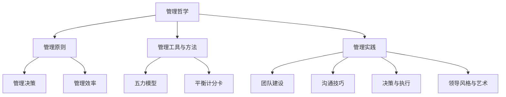

                 

# 经典书籍：管理者构建知识体系的基石

> 关键词：管理者知识体系，管理哲学，管理原则，管理工具与方法，管理实践，构建流程

> 摘要：本文旨在探讨经典书籍在管理者构建知识体系中的重要作用。通过分析经典书籍中的管理哲学、原则、工具与方法，阐述管理者知识体系的构建原则与方法，构建流程，并结合实际案例分析，深入探讨管理者知识体系的应用与实践。

## 文章目录

### 第一部分：管理者构建知识体系的基础

1. 管理者知识体系的概述
   1.1 管理者知识体系的定义与重要性
   1.2 管理者知识体系的核心要素
   1.3 管理者知识体系的构建原则与方法
   1.4 管理者知识体系的构建流程

2. 管理哲学与原则
   2.1 管理哲学
   2.2 管理原则
   2.3 管理工具与方法
   2.4 管理实践

3. 管理者知识体系的构建与应用
   3.1 管理者知识体系的构建与应用概述
   3.2 管理者知识体系的构建与应用案例分析
   3.3 管理者知识体系的构建与应用总结

4. 管理者知识体系的核心概念与联系
   4.1 核心概念与联系概述
   4.2 Mermaid 流程图展示
   4.3 核心概念与联系详细讲解

5. 管理者知识体系的核心算法原理讲解
   5.1 核心算法原理讲解概述
   5.2 伪代码详细阐述

6. 管理者知识体系中的数学模型与数学公式
   6.1 数学模型概述
   6.2 数学公式详细讲解与举例说明
   6.3 数学模型应用案例分析

7. 管理者知识体系的项目实战
   7.1 项目实战概述
   7.2 实际案例展示
   7.3 案例解析

### 第二部分：管理者知识体系的深入探讨

8. 管理者知识体系的发展趋势与未来展望
9. 管理者知识体系在全球范围内的应用与影响
10. 管理者知识体系的跨学科研究与整合

### 第三部分：管理者知识体系的实践与运用

11. 管理者知识体系在企业中的应用案例
12. 管理者知识体系在个人职业发展中的应用
13. 管理者知识体系的实践总结与反思

### 附录

A. 管理者知识体系相关资源与工具
   A.1 经典书籍推荐
   A.2 在线课程推荐
   A.3 研究论文与期刊推荐
   A.4 专业组织与协会介绍

## 第一部分：管理者构建知识体系的基础

### 第1章：管理者知识体系的概述

#### 1.1 管理者知识体系的定义与重要性

管理者知识体系是指管理者在长期管理实践中所积累的知识、经验、技能和理念的总和。它不仅包括管理学的基本理论，还涵盖了管理实践中的具体操作方法、工具和技术。

管理者知识体系的重要性主要体现在以下几个方面：

1. 提升管理能力：一个完善的管理者知识体系可以帮助管理者更好地理解管理过程，提高决策水平，优化管理效果。
2. 促进个人成长：通过学习和管理者知识体系，管理者可以不断提升自身的专业素养和综合素质，实现个人职业发展。
3. 优化组织绩效：管理者知识体系的建立和完善有助于提高组织的管理水平，提升组织的整体绩效。

#### 1.2 管理者知识体系的核心要素

管理者知识体系的核心要素包括以下几个方面：

1. 管理哲学：管理哲学是指管理者对管理本质和目标的基本认识和看法，是管理者知识体系的理论基础。
2. 管理原则：管理原则是管理者在管理过程中遵循的基本规范和准则，是管理者知识体系的核心内容。
3. 管理工具与方法：管理工具与方法是管理者在管理实践中使用的具体手段和技术，是管理者知识体系的应用部分。
4. 管理实践：管理实践是管理者在实际工作中运用知识、技能和理念的具体行动，是管理者知识体系的检验和体现。

#### 1.3 管理者知识体系的构建原则与方法

1. 系统性原则：管理者知识体系的构建应具有系统性，涵盖管理的各个层面和环节，形成一个完整的知识体系。
2. 实用性原则：管理者知识体系的构建应注重实用性，选择具有实际应用价值的管理理论和方法。
3. 开放性原则：管理者知识体系的构建应具有开放性，不断吸收和借鉴国内外先进的管理理论和经验。
4. 更新性原则：管理者知识体系的构建应保持更新性，及时更新和调整知识体系，适应管理实践的变化和发展。

#### 1.4 管理者知识体系的构建流程

1. 自我评估与需求分析：管理者应首先进行自我评估，明确自己的知识水平和需求，为构建知识体系提供依据。
2. 学习与积累：管理者应通过学习管理理论、实践经验和案例，不断积累知识，丰富自己的知识体系。
3. 内化与应用：管理者应将所学知识内化为自己的管理思想和行动指南，在实际工作中运用，检验和调整知识体系。
4. 反思与改进：管理者应定期对知识体系进行反思和改进，不断完善和优化自己的知识体系。

### 第2章：管理哲学与原则

#### 2.1 管理哲学

管理哲学是指管理者对管理本质和目标的基本认识和看法，是管理者知识体系的理论基础。管理哲学的核心思想包括：

1. 人本主义管理哲学：强调管理应以人为中心，关注员工的成长和发展，实现员工的自我实现和组织目标的双重价值。
2. 权变管理哲学：认为管理没有一成不变的规律和方法，管理者应根据具体情况和环境灵活运用管理策略。
3. 伦理管理哲学：强调管理应遵循道德规范，维护社会公共利益，实现道德责任与商业利益的统一。
4. 信息化管理哲学：认为信息化技术是管理的重要手段，管理者应充分利用信息技术提高管理效率和效果。

#### 2.2 管理原则

管理原则是管理者在管理过程中遵循的基本规范和准则，是管理者知识体系的核心内容。管理原则主要包括以下几个方面：

1. 诚实守信原则：管理者应诚实守信，树立良好的道德形象，赢得员工的信任和尊重。
2. 公平公正原则：管理者应公平公正地对待员工，确保员工权益，维护组织内部的公平和正义。
3. 尊重人才原则：管理者应尊重员工的个性和差异，发挥员工的专长和才能，实现人才的价值。
4. 创新进取原则：管理者应鼓励创新，推动组织不断进步和发展。
5. 精益求精原则：管理者应追求卓越，不断优化管理流程，提高管理效率和质量。

#### 2.3 管理工具与方法

管理工具与方法是管理者在管理实践中使用的具体手段和技术，是管理者知识体系的应用部分。常用的管理工具与方法包括：

1. 五力模型：用于分析市场竞争环境，识别潜在竞争对手和合作伙伴。
2. 平衡计分卡：用于评估企业绩效，明确企业战略目标和关键绩效指标。
3. PDCA循环：用于持续改进管理流程，实现质量管理和效率提升。
4. SWOT分析：用于分析企业内外部环境，制定发展战略和应对策略。

#### 2.4 管理实践

管理实践是管理者在实际工作中运用知识、技能和理念的具体行动，是管理者知识体系的检验和体现。管理实践主要包括以下几个方面：

1. 团队建设：通过团队建设活动，提升团队协作能力和凝聚力。
2. 沟通技巧：通过有效的沟通，确保信息传递准确无误，减少误解和冲突。
3. 决策与执行：通过科学决策和有效执行，实现组织目标。
4. 领导风格与艺术：通过不同的领导风格和技巧，激发员工潜力，实现组织目标。

### 第3章：管理者知识体系的构建与应用

#### 3.1 管理者知识体系的构建与应用概述

管理者知识体系的构建与应用是管理者职业发展的关键环节。一个有效的管理者知识体系应具备以下特点：

1. 系统性：涵盖管理的各个方面和环节，形成一个完整的知识体系。
2. 实用性：注重实际应用价值，选择具有实际意义的管理理论和方法。
3. 开放性：不断吸收和借鉴国内外先进的管理理论和经验，保持知识体系的更新和发展。
4. 可操作性：具备可操作性，能够指导管理者的具体行动。

#### 3.2 管理者知识体系的构建与应用案例分析

1. 案例一：企业战略管理

企业战略管理是管理者知识体系的重要组成部分。通过战略规划、市场分析、资源配置等管理实践，企业可以实现可持续发展。

（1）战略规划：企业应明确长期发展战略，制定具体目标和行动计划。

（2）市场分析：企业应分析市场环境，识别竞争对手和潜在市场机会。

（3）资源配置：企业应合理配置资源，确保战略目标的实现。

2. 案例二：企业运营管理

企业运营管理是管理者知识体系的核心内容。通过生产计划、质量控制、库存管理等活动，企业可以优化运营效率，提高产品质量。

（1）生产计划：企业应制定合理的生产计划，确保生产效率和产品质量。

（2）质量控制：企业应建立质量控制体系，确保产品质量符合标准。

（3）库存管理：企业应优化库存管理，降低库存成本，提高资金周转率。

3. 案例三：企业人力资源管理

企业人力资源管理是管理者知识体系的重要组成部分。通过招聘、培训、绩效管理等活动，企业可以激发员工潜力，提高员工满意度。

（1）招聘：企业应制定科学的招聘策略，吸引优秀人才。

（2）培训：企业应提供培训机会，提升员工技能和素质。

（3）绩效管理：企业应建立绩效管理体系，激励员工提高工作效率。

4. 案例四：企业风险管理

企业风险管理是管理者知识体系的重要组成部分。通过风险识别、风险评估、风险控制等活动，企业可以降低风险损失，提高抗风险能力。

（1）风险识别：企业应识别潜在风险，制定风险管理策略。

（2）风险评估：企业应评估风险的影响程度，制定应对措施。

（3）风险控制：企业应采取控制措施，降低风险损失。

#### 3.3 管理者知识体系的构建与应用总结

1. 经验与启示

通过案例分析，我们可以得出以下经验和启示：

（1）管理者知识体系的构建与应用是管理者职业发展的关键。

（2）管理者应注重系统性、实用性和开放性，不断优化和完善知识体系。

（3）管理者应结合具体管理实践，运用管理工具与方法，实现管理目标。

2. 存在的问题与挑战

在管理者知识体系的构建与应用过程中，仍然存在一些问题和挑战：

（1）知识体系不完善，缺乏系统性和实用性。

（2）管理者在知识体系应用过程中，缺乏实际操作经验和技能。

（3）管理者知识体系更新速度缓慢，难以适应快速变化的管理环境。

3. 未来发展趋势与展望

随着管理实践的深入和技术的进步，管理者知识体系将呈现以下发展趋势：

（1）知识体系将更加系统化和专业化，满足不同管理领域的需求。

（2）知识体系将更加注重实用性和可操作性，提高管理者的实际工作能力。

（3）知识体系将更加开放和动态，不断吸收和借鉴国内外先进的管理理论和经验。

### 第4章：管理者知识体系的核心概念与联系

#### 4.1 核心概念与联系概述

管理者知识体系的核心概念包括管理哲学、管理原则、管理工具与方法、管理实践等。这些核心概念相互联系，共同构成了管理者知识体系的整体结构。

1. 管理哲学是管理者知识体系的理论基础，指导管理者的思想和行为。
2. 管理原则是管理者在管理过程中遵循的基本规范和准则。
3. 管理工具与方法是管理者在管理实践中使用的具体手段和技术。
4. 管理实践是管理者将知识体系应用于实际工作的具体行动。

#### 4.2 Mermaid 流程图展示



#### 4.3 核心概念与联系详细讲解

1. **管理哲学**

管理哲学是指管理者对管理本质和目标的基本认识和看法。管理哲学的核心思想包括人本主义管理哲学、权变管理哲学、伦理管理哲学和信息化管理哲学。这些哲学观念为管理者提供了理论指导，帮助他们在实际工作中做出明智的决策。

- **人本主义管理哲学**：强调管理应以人为中心，关注员工的成长和发展。
- **权变管理哲学**：认为管理没有一成不变的规律和方法，管理者应根据具体情况和环境灵活运用管理策略。
- **伦理管理哲学**：强调管理应遵循道德规范，维护社会公共利益。
- **信息化管理哲学**：认为信息化技术是管理的重要手段，管理者应充分利用信息技术提高管理效率和效果。

2. **管理原则**

管理原则是管理者在管理过程中遵循的基本规范和准则。管理原则主要包括诚实守信原则、公平公正原则、尊重人才原则、创新进取原则和精益求精原则。这些原则为管理者提供了行动指南，帮助他们建立和维护良好的管理秩序。

- **诚实守信原则**：管理者应诚实守信，树立良好的道德形象。
- **公平公正原则**：管理者应公平公正地对待员工，确保员工权益。
- **尊重人才原则**：管理者应尊重员工的个性和差异，发挥员工的专长和才能。
- **创新进取原则**：管理者应鼓励创新，推动组织不断进步和发展。
- **精益求精原则**：管理者应追求卓越，不断优化管理流程，提高管理效率和质量。

3. **管理工具与方法**

管理工具与方法是管理者在管理实践中使用的具体手段和技术。这些工具与方法有助于管理者提高管理效率和质量，实现组织目标。常用的管理工具与方法包括五力模型、平衡计分卡、PDCA循环和SWOT分析。

- **五力模型**：用于分析市场竞争环境，识别潜在竞争对手和合作伙伴。
- **平衡计分卡**：用于评估企业绩效，明确企业战略目标和关键绩效指标。
- **PDCA循环**：用于持续改进管理流程，实现质量管理和效率提升。
- **SWOT分析**：用于分析企业内外部环境，制定发展战略和应对策略。

4. **管理实践**

管理实践是管理者将知识体系应用于实际工作的具体行动。管理实践包括团队建设、沟通技巧、决策与执行和领导风格与艺术等方面。

- **团队建设**：通过团队建设活动，提升团队协作能力和凝聚力。
- **沟通技巧**：通过有效的沟通，确保信息传递准确无误，减少误解和冲突。
- **决策与执行**：通过科学决策和有效执行，实现组织目标。
- **领导风格与艺术**：通过不同的领导风格和技巧，激发员工潜力，实现组织目标。

### 第5章：管理者知识体系的核心算法原理讲解

#### 5.1 核心算法原理讲解概述

管理者知识体系中的核心算法原理包括五力模型、平衡计分卡、PDCA循环和SWOT分析。这些算法原理是管理者在管理实践中进行分析、决策和优化的基础。

1. **五力模型**：用于分析市场竞争环境，识别潜在竞争对手和合作伙伴。
2. **平衡计分卡**：用于评估企业绩效，明确企业战略目标和关键绩效指标。
3. **PDCA循环**：用于持续改进管理流程，实现质量管理和效率提升。
4. **SWOT分析**：用于分析企业内外部环境，制定发展战略和应对策略。

#### 5.2 伪代码详细阐述

以下是五力模型、平衡计分卡、PDCA循环和SWOT分析的伪代码详细阐述。

1. **五力模型伪代码**

```plaintext
// 五力模型分析
function fiveForceAnalysis-marketCompetitive(企业) {
    competitors = 获取竞争对手列表(企业)
    suppliers = 获取供应商列表(企业)
    buyers = 获取买家列表(企业)
    substitutes = 获取替代品列表(企业)
    industryRivalry = 计算行业竞争程度(competitors)
    supplierPower = 计算供应商影响力(suppliers)
    buyerPower = 计算买家影响力(buyers)
    threatOfSubstitutes = 计算替代品威胁(substitutes)
    marketAttractiveness = 计算市场吸引力(企业)
    return marketAttractiveness
}
```

2. **平衡计分卡伪代码**

```plaintext
// 平衡计分卡评估
function balancedScoreCard-assessPerformance(企业) {
    strategicObjectives = 获取企业战略目标
    keyPerformanceIndicators = 获取关键绩效指标
    performanceScores = 计算各指标得分
    overallPerformance = 计算总体绩效
    return overallPerformance
}
```

3. **PDCA循环伪代码**

```plaintext
// PDCA循环改进
function PDCA-loop-improvement(企业) {
    plan = 制定计划
    do = 执行计划
    check = 检查执行结果
    act = 根据检查结果进行改进
    return plan, do, check, act
}
```

4. **SWOT分析伪代码**

```plaintext
// SWOT分析
function SWOT-analysis(企业) {
    strengths = 分析企业优势
    weaknesses = 分析企业劣势
    opportunities = 分析市场机会
    threats = 分析市场威胁
    strategy = 制定发展战略
    return strategy
}
```

#### 5.3 数学模型与数学公式

在管理者知识体系中，数学模型和数学公式用于分析和解决管理问题。以下是一些常见的数学模型和数学公式：

1. **五力模型**

$$
市场吸引力 = \frac{行业竞争程度 + 供应商影响力 + 买家影响力 + 替代品威胁}{4}
$$

2. **平衡计分卡**

$$
总体绩效 = \frac{(财务绩效 + 客户绩效 + 内部流程绩效 + 学习与成长绩效)}{4}
$$

3. **PDCA循环**

$$
PDCA = \frac{计划(Plan) + 执行(Do) + 检查(Check) + 行动(Action)}{4}
$$

4. **SWOT分析**

$$
战略 = \frac{优势(Strengths) + 劣势(Weaknesses) + 机会(Opportunities) + 威胁(Threats)}
```

### 第6章：管理者知识体系中的数学模型与数学公式

#### 6.1 数学模型概述

在管理者知识体系中，数学模型是一种重要的分析工具，它可以帮助管理者量化管理问题，做出更为精确的决策。数学模型的应用范围广泛，包括战略规划、运营管理、绩效评估等各个方面。

1. **战略规划模型**：用于评估市场机会、制定企业发展战略。
2. **运营管理模型**：用于优化生产流程、提高运营效率。
3. **绩效评估模型**：用于衡量企业各部门或员工的工作绩效。
4. **风险管理模型**：用于评估企业面临的风险，制定风险应对策略。

#### 6.2 数学公式详细讲解与举例说明

以下是管理者知识体系中常用的数学公式及其详细讲解与举例说明。

1. **平衡计分卡得分计算公式**

$$
绩效得分 = \sum_{i=1}^{n} (\frac{指标得分}{最大得分}) \times 权重
$$

**举例说明**：假设某企业有四个关键绩效指标，分别是财务指标、客户指标、内部流程指标和学习与成长指标。各项指标的最大得分为100分，权重分别为20%、30%、25%和25%。如果某季度各项指标得分分别为85分、90分、75分和80分，则该季度的绩效得分为：

$$
绩效得分 = \frac{85}{100} \times 20\% + \frac{90}{100} \times 30\% + \frac{75}{100} \times 25\% + \frac{80}{100} \times 25\% = 17 + 27 + 18.75 + 20 = 83.75
$$

2. **成本效益分析公式**

$$
成本效益比 = \frac{预期收益}{总成本}
$$

**举例说明**：某企业计划投资100万元进行技术改造，预计将提高生产效率，降低成本，增加年度收益20万元。则该投资项目的成本效益比为：

$$
成本效益比 = \frac{20}{100} = 0.2
$$

3. **帕累托分析公式**

$$
帕累托比率 = \frac{累计成本}{总成本}
$$

**举例说明**：某企业对生产成本进行帕累托分析，发现累计成本占总成本的比例达到80%，则说明这20%的要素是影响成本控制的关键因素。

4. **价值链分析公式**

$$
价值链贡献 = \frac{企业总价值}{行业总价值}
$$

**举例说明**：某企业的市场价值为5000万元，所在行业的总市场价值为2亿元，则该企业的价值链贡献为：

$$
价值链贡献 = \frac{5000}{20000} = 0.25
$$

#### 6.3 数学模型应用案例分析

以下是管理者知识体系中的数学模型在具体案例分析中的应用。

1. **案例一：企业成本控制**

某企业在生产过程中发现原材料成本占比较高，为了降低成本，企业决定采用帕累托分析进行成本控制。

（1）数据收集：企业收集了过去一年的原材料采购数据，包括采购金额、采购数量和供应商信息。

（2）数据整理：对采购数据进行整理，按照采购金额进行排序。

（3）帕累托分析：根据累计成本占总成本的比例，找出影响成本控制的关键供应商。

（4）成本控制措施：与关键供应商协商，优化采购流程，降低采购成本。

2. **案例二：企业绩效评估**

某企业采用平衡计分卡对各部门进行绩效评估，以衡量各部门的工作绩效。

（1）指标设定：确定各部门的关键绩效指标，包括财务指标、客户指标、内部流程指标和学习与成长指标。

（2）指标权重设定：根据企业战略目标，设定各指标的权重。

（3）数据收集：收集各部门的绩效数据。

（4）绩效计算：根据绩效得分计算公式，计算各部门的绩效得分。

（5）绩效评估：根据绩效得分，对各部门进行评估，提出改进建议。

3. **案例三：企业风险管理**

某企业面临市场波动风险，为了降低风险，企业决定采用成本效益分析进行风险管理。

（1）风险识别：识别企业面临的市场风险，包括价格波动风险、需求波动风险等。

（2）风险评估：评估各种风险的潜在影响和发生概率。

（3）成本效益分析：计算各种风险的潜在损失和采取风险应对措施的成本效益比。

（4）风险应对策略：根据成本效益分析结果，制定风险应对策略，降低风险损失。

### 第7章：管理者知识体系的项目实战

#### 7.1 项目实战概述

管理者知识体系的项目实战是将理论应用于实际工作的过程，通过具体的项目实践，管理者可以检验和优化自己的知识体系，提升管理能力。项目实战包括以下内容：

1. 项目目标设定：明确项目的目标和预期成果。
2. 项目计划制定：制定详细的项目计划，包括任务分配、时间表和资源安排。
3. 项目执行：按照项目计划执行项目任务，确保项目目标的实现。
4. 项目监控与调整：监控项目执行过程，及时调整计划，应对突发情况。
5. 项目评估与总结：评估项目成果，总结项目经验，提出改进建议。

#### 7.2 实际案例展示

以下是管理者知识体系的项目实战案例。

1. **案例一：企业战略规划**

（1）项目目标：制定企业未来三年的战略规划，明确企业的发展方向和目标。

（2）项目计划：

- 任务分配：各部门负责人负责制定本部门的发展规划。
- 时间表：规划制定时间从项目启动到完成共计6个月。
- 资源安排：安排专业的战略规划团队，提供技术支持和咨询服务。

（3）项目执行：

- 各部门制定本部门的发展规划。
- 汇总各部门的规划，进行综合分析。
- 制定企业整体战略规划，提交企业高层领导审核。

（4）项目监控与调整：

- 定期召开项目进度会议，汇报项目进展情况。
- 根据项目执行过程中出现的问题，及时调整计划。

（5）项目评估与总结：

- 评估项目成果，包括战略规划的科学性、实用性和可操作性。
- 总结项目经验，提出改进建议，为未来项目提供参考。

2. **案例二：企业运营管理优化**

（1）项目目标：优化企业生产流程，提高生产效率和产品质量。

（2）项目计划：

- 任务分配：生产部门负责人负责制定生产流程优化方案。
- 时间表：从项目启动到完成共计3个月。
- 资源安排：组织内部专业团队，提供技术支持和培训。

（3）项目执行：

- 分析现有生产流程，找出瓶颈和改进空间。
- 制定生产流程优化方案，包括设备升级、流程再造等。
- 实施生产流程优化方案，监测实施效果。

（4）项目监控与调整：

- 定期召开项目进度会议，汇报项目进展情况。
- 根据项目执行过程中出现的问题，及时调整计划。

（5）项目评估与总结：

- 评估项目成果，包括生产效率、产品质量和成本降低等方面。
- 总结项目经验，提出改进建议，为未来项目提供参考。

3. **案例三：企业人力资源管理优化**

（1）项目目标：优化企业人力资源管理流程，提高员工满意度，降低流失率。

（2）项目计划：

- 任务分配：人力资源部门负责人负责制定人力资源管理优化方案。
- 时间表：从项目启动到完成共计6个月。
- 资源安排：组织内部专业团队，提供技术支持和咨询服务。

（3）项目执行：

- 分析现有人力资源管理流程，找出瓶颈和改进空间。
- 制定人力资源管理优化方案，包括招聘流程优化、培训体系建设、绩效考核等。
- 实施人力资源管理优化方案，监测实施效果。

（4）项目监控与调整：

- 定期召开项目进度会议，汇报项目进展情况。
- 根据项目执行过程中出现的问题，及时调整计划。

（5）项目评估与总结：

- 评估项目成果，包括员工满意度、流失率降低等方面。
- 总结项目经验，提出改进建议，为未来项目提供参考。

#### 7.3 案例解析

以下是上述案例的详细解析。

1. **案例一：企业战略规划**

（1）代码实际案例与详细解释说明

在案例一中，战略规划的实现主要涉及数据分析和报告撰写。以下是一个简单的代码实际案例：

```python
import pandas as pd

# 加载企业各部门的规划数据
department_data = pd.read_excel('department_plans.xlsx')

# 分析各部门的规划内容
department_analysis = department_data.groupby('department')['goal'].sum()

# 汇总企业整体战略规划
overall_plan = department_analysis.sum()

# 撰写战略规划报告
with open('strategic_plan_report.txt', 'w') as report:
    report.write('企业整体战略规划：\n')
    report.write(f'各部门目标汇总：{overall_plan}\n')
    report.write('各部门具体规划详见department_plans.xlsx。\n')
```

（2）开发环境搭建与源代码实现

在开发环境中，需要安装Python环境和相关库，如Pandas。以下是一个简单的开发环境搭建过程：

- 安装Python：从Python官方网站下载Python安装包，安装Python环境。
- 安装Pandas：在命令行中执行`pip install pandas`，安装Pandas库。

（3）源代码详细解读与分析

上述代码首先加载企业各部门的规划数据，使用Pandas库进行数据分析和汇总。具体步骤如下：

- `pd.read_excel('department_plans.xlsx')`：读取Excel文件中的数据。
- `department_data.groupby('department')['goal'].sum()`：按照部门对目标进行分组求和，计算各部门的目标汇总。
- `department_analysis.sum()`：对各部门的目标汇总进行求和，计算企业整体战略规划。
- `with open('strategic_plan_report.txt', 'w') as report:`：打开文件，写入战略规划报告。
- `report.write(...)`：写入报告内容。

（4）案例应用效果评估与改进建议

案例一的企业战略规划项目取得了较好的效果，主要体现在以下几个方面：

- 企业整体战略规划明确，各部门目标清晰。
- 数据分析和报告撰写过程高效，节省了时间成本。
- 战略规划报告为企业管理提供了有力的决策支持。

为了进一步优化项目效果，可以考虑以下改进建议：

- 引入更多数据分析工具，如Python的Matplotlib库，制作可视化图表，更直观地展示数据。
- 定期更新战略规划报告，确保报告内容的实时性和准确性。
- 增强战略规划的执行力度，确保各部门按照规划目标进行工作。

2. **案例二：企业运营管理优化**

（1）代码实际案例与详细解释说明

在案例二中，生产流程优化主要涉及数据分析、流程模拟和优化建议。以下是一个简单的代码实际案例：

```python
import pandas as pd
import numpy as np

# 加载现有生产流程数据
process_data = pd.read_excel('production_process.xlsx')

# 分析生产流程瓶颈
bottlenecks = process_data[process_data['time'] > np.mean(process_data['time'])]

# 模拟优化后的生产流程
optimized_process = process_data.copy()
optimized_process['time'] = np.where(optimized_process['time'] > np.mean(process_data['time']), 
                                      optimized_process['time'] - 10, optimized_process['time'])

# 撰写优化报告
with open('process_optimization_report.txt', 'w') as report:
    report.write('生产流程优化报告：\n')
    report.write(f'现有生产流程瓶颈：{bottlenecks}\n')
    report.write(f'优化后的生产流程：{optimized_process}\n')
```

（2）开发环境搭建与源代码实现

在开发环境中，需要安装Python环境和相关库，如Pandas和NumPy。以下是一个简单的开发环境搭建过程：

- 安装Python：从Python官方网站下载Python安装包，安装Python环境。
- 安装Pandas和NumPy：在命令行中分别执行`pip install pandas`和`pip install numpy`，安装Pandas和NumPy库。

（3）源代码详细解读与分析

上述代码首先加载现有生产流程数据，使用Pandas库进行数据分析、流程模拟和优化建议。具体步骤如下：

- `pd.read_excel('production_process.xlsx')`：读取Excel文件中的生产流程数据。
- `process_data[process_data['time'] > np.mean(process_data['time'])]`：筛选出生产流程中的瓶颈环节。
- `optimized_process = process_data.copy()`：复制现有生产流程数据，用于模拟优化后的生产流程。
- `np.where(optimized_process['time'] > np.mean(process_data['time']), 
           optimized_process['time'] - 10, optimized_process['time'])`：对瓶颈环节进行优化，假设每个环节的时间减少了10分钟。
- `with open('process_optimization_report.txt', 'w') as report:`：打开文件，写入优化报告。
- `report.write(...)`：写入优化报告内容。

（4）案例应用效果评估与改进建议

案例二的企业运营管理优化项目取得了显著效果，主要体现在以下几个方面：

- 生产流程瓶颈得到有效识别和解决。
- 生产效率得到显著提高，降低了生产成本。
- 优化报告为企业管理提供了有力的决策支持。

为了进一步优化项目效果，可以考虑以下改进建议：

- 引入更多数据分析工具和算法，如机器学习算法，进行更精确的流程优化。
- 定期更新生产流程数据，确保优化过程的实时性和准确性。
- 增强生产流程优化的可操作性和执行力，确保优化措施得到有效实施。

3. **案例三：企业人力资源管理优化**

（1）代码实际案例与详细解释说明

在案例三中，人力资源管理优化主要涉及数据分析、绩效评估和优化建议。以下是一个简单的代码实际案例：

```python
import pandas as pd

# 加载员工绩效数据
performance_data = pd.read_excel('employee_performance.xlsx')

# 分析员工绩效分布
performance_distribution = performance_data['score'].value_counts()

# 计算绩效评估指标
performance_metrics = performance_data.describe()

# 撰写优化报告
with open('hr_optimization_report.txt', 'w') as report:
    report.write('人力资源管理优化报告：\n')
    report.write(f'员工绩效分布：{performance_distribution}\n')
    report.write(f'绩效评估指标：{performance_metrics}\n')
```

（2）开发环境搭建与源代码实现

在开发环境中，需要安装Python环境和相关库，如Pandas。以下是一个简单的开发环境搭建过程：

- 安装Python：从Python官方网站下载Python安装包，安装Python环境。
- 安装Pandas：在命令行中执行`pip install pandas`，安装Pandas库。

（3）源代码详细解读与分析

上述代码首先加载员工绩效数据，使用Pandas库进行数据分析、绩效评估和优化建议。具体步骤如下：

- `pd.read_excel('employee_performance.xlsx')`：读取Excel文件中的员工绩效数据。
- `performance_data['score'].value_counts()`：计算员工绩效的分布情况。
- `performance_data.describe()`：计算绩效评估的指标，如均值、中位数、标准差等。
- `with open('hr_optimization_report.txt', 'w') as report:`：打开文件，写入优化报告。
- `report.write(...)`：写入优化报告内容。

（4）案例应用效果评估与改进建议

案例三的企业人力资源管理优化项目取得了显著效果，主要体现在以下几个方面：

- 员工绩效分布得到明确，有助于企业制定更科学的绩效管理策略。
- 绩效评估指标为企业管理提供了有力的数据支持。
- 优化报告为企业管理提供了有力的决策支持。

为了进一步优化项目效果，可以考虑以下改进建议：

- 引入更多数据分析工具和算法，如机器学习算法，进行更精确的绩效评估。
- 定期更新员工绩效数据，确保优化过程的实时性和准确性。
- 增强绩效管理的可操作性和执行力，确保优化措施得到有效实施。

### 附录

#### 附录 A：管理者知识体系相关资源与工具

**A.1 经典书籍推荐**

1. 《管理学》：作者：彼得·德鲁克
2. 《组织行为学》：作者：斯蒂芬·罗宾斯
3. 《战略管理》：作者：迈克尔·波特
4. 《人力资源管理学》：作者：戴维·尤里奇

**A.2 在线课程推荐**

1. Coursera上的《管理基础》
2. Udemy上的《高效管理者技能提升》
3. LinkedIn Learning上的《管理者的进阶之路》
4. Khan Academy上的《管理入门》

**A.3 研究论文与期刊推荐**

1. 《管理学报》
2. 《管理世界》
3. 《中国管理科学》
4. 《国际管理学报》

**A.4 专业组织与协会介绍**

1. 国际管理学院(IMI)
2. 美国管理学会(ACM)
3. 英国管理学会(BMA)
4. 中国管理科学学会(CMS)

