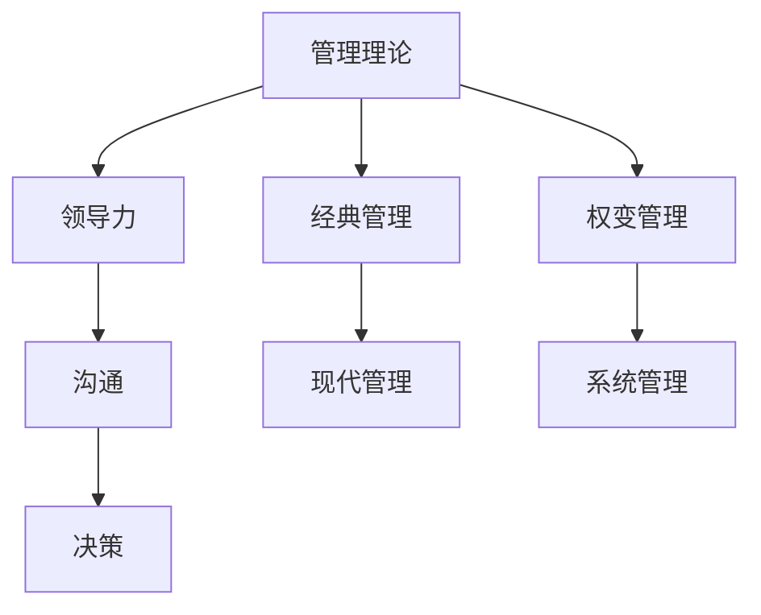

                 

# 经典管理理论在现代企业中的创新应用

## 关键词

管理理论、现代企业、创新应用、战略管理、人力资源管理、项目管理、信息技术、可持续发展、案例分析

## 摘要

本文旨在探讨经典管理理论在现代企业中的创新应用。通过对管理理论的基础、现代企业中的管理创新、技术应用与管理创新以及综合应用与案例分析四个方面的详细分析，本文揭示了经典管理理论在应对现代企业管理挑战中的重要作用。文章首先回顾了管理理论的起源与发展，然后分析了管理理论的核心概念与联系，并通过Mermaid流程图展示了各概念之间的逻辑关系。接着，本文深入探讨了现代企业中的战略创新、人力资源管理创新和项目管理创新，并结合实际案例进行了详细阐述。此外，本文还探讨了信息技术在管理创新中的作用，以及管理创新与可持续发展之间的关系。最后，通过综合应用与案例分析，本文总结了经典管理理论在现代企业管理中的成功应用，并对管理创新的未来趋势进行了展望。

## 目录大纲

### 第一部分：管理理论的基础

- **第1章：管理理论的起源与发展**
  - **1.1 管理理论的起源**
    - **1.1.1 古典管理理论**
    - **1.1.2 行为科学管理理论**
    - **1.1.3 系统管理理论**
  - **1.2 管理理论的现代发展**
    - **1.2.1 战略管理理论**
    - **1.2.2 创新管理理论**
    - **1.2.3 平衡计分卡（BSC）**

- **第2章：管理理论的核心概念与联系**
  - **2.1 核心概念介绍**
    - **2.1.1 领导力**
    - **2.1.2 沟通**
    - **2.1.3 决策**
  - **2.2 管理理论的联系与对比**
    - **2.2.1 经典管理与现代管理**
    - **2.2.2 权变管理与系统管理**
  - **2.3 管理理论的Mermaid流程图**

### 第二部分：现代企业中的管理创新

- **第3章：企业战略创新**
  - **3.1 企业战略创新的重要性**
    - **3.1.1 企业战略与竞争优势**
    - **3.1.2 企业战略的创新方向**
  - **3.2 创新战略案例**
    - **3.2.1 苹果公司的创新战略**
    - **3.2.2 亚马逊的创新战略**

- **第4章：人力资源管理创新**
  - **4.1 人力资源管理的新理念**
    - **4.1.1 人才竞争**
    - **4.1.2 企业文化与员工满意**
  - **4.2 人力资源管理创新案例**
    - **4.2.1 爱奇艺的人才管理体系**
    - **4.2.2 谷歌的员工福利政策**

- **第5章：项目管理创新**
  - **5.1 项目管理的新方法**
    - **5.1.1 需求管理**
    - **5.1.2 团队协作**
  - **5.2 项目管理创新案例**
    - **5.2.1 特斯拉的项目管理实践**
    - **5.2.2 微软的敏捷开发实践**

### 第三部分：技术应用与管理创新

- **第6章：信息技术与管理创新**
  - **6.1 信息技术的发展与管理创新**
    - **6.1.1 互联网+管理**
    - **6.1.2 大数据与云计算**
  - **6.2 信息技术与管理创新的案例**
    - **6.2.1 阿里巴巴的生态系统管理**
    - **6.2.2 腾讯的社交网络管理**

- **第7章：管理创新与可持续发展**
  - **7.1 可持续发展的管理理念**
    - **7.1.1 企业社会责任**
    - **7.1.2 绿色管理**
  - **7.2 可持续发展管理案例**
    - **7.2.1 宝洁的可持续发展战略**
    - **7.2.2 可持续发展的成功案例分析**

### 第四部分：综合应用与案例分析

- **第8章：经典管理理论的现代应用**
  - **8.1 经典管理理论在企业管理中的应用**
    - **8.1.1 泰勒的科学管理理论**
    - **8.1.2 马克斯·韦伯的官僚组织理论**
  - **8.2 现代企业在管理创新中的实践**
    - **8.2.1 华为的管理创新实践**
    - **8.2.2 海尔的管理创新实践**

- **第9章：管理创新的趋势与未来**
  - **9.1 管理创新的未来趋势**
    - **9.1.1 智能化与自动化**
    - **9.1.2 人本管理与组织变革**
  - **9.2 管理创新的前沿探索**
    - **9.2.1 平台化与管理创新**
    - **9.2.2 共享经济与管理创新**

### 附录

- **附录A：管理创新工具与资源**
  - **A.1 主流管理工具对比**
  - **A.2 管理创新案例库**

- **附录B：管理创新数据集与分析方法**
  - **B.1 数据收集与处理**
  - **B.2 数据分析工具与应用**# 第一部分：管理理论的基础

## 第1章：管理理论的起源与发展

管理作为一种社会现象，其起源可以追溯到人类早期的集体活动。在古代，无论是农业社会的农田管理，还是手工业时代的作坊管理，都体现了管理的基本原理。然而，现代意义上的管理理论起源于工业革命时期，随着生产规模的扩大和劳动分工的细化，对科学管理方法的追求成为当时的主要趋势。

### 1.1 管理理论的起源

#### 1.1.1 古典管理理论

古典管理理论主要包括泰勒的科学管理理论、法约尔的管理过程理论以及韦伯的官僚组织理论。

- **泰勒的科学管理理论**：泰勒被誉为“科学管理之父”，他主张通过科学的方法研究工作流程，提高生产效率。泰勒提出了著名的“时间—动作分析”方法，通过精确测量和分析工人的操作时间，找出最有效的作业方式。

  ```mermaid
  graph TD
  A[时间—动作分析] --> B[最优作业方式]
  B --> C[效率提高]
  C --> D[生产效率]
  ```

- **法约尔的管理过程理论**：法约尔提出了管理的五大职能：计划、组织、指挥、协调和控制。他强调管理是一个系统的过程，管理者应该通过协调各个职能，实现组织的目标。

  ```mermaid
  graph TD
  A[计划] --> B[组织]
  B --> C[指挥]
  C --> D[协调]
  D --> E[控制]
  ```

- **韦伯的官僚组织理论**：韦伯提出了官僚组织理论，强调通过明确分工、等级制度和规则来管理组织。他认为，官僚组织具有高度的效率，能够有效规范组织成员的行为。

  ```mermaid
  graph TD
  A[明确分工] --> B[等级制度]
  B --> C[规则管理]
  C --> D[效率高]
  ```

#### 1.1.2 行为科学管理理论

随着生产力的提高，人们对管理理论的关注逐渐从生产效率转向人的行为。行为科学管理理论强调通过研究人的行为，提高员工的工作满意度和生产力。

- **梅奥的霍桑实验**：梅奥通过霍桑实验发现，员工的满意度对生产力有重要影响。他提出了“人际关系理论”，强调管理者应该关注员工的情感需求，建立良好的工作关系。

  ```mermaid
  graph TD
  A[员工满意度] --> B[生产力]
  B --> C[人际关系]
  C --> D[工作关系]
  ```

#### 1.1.3 系统管理理论

系统管理理论将组织视为一个整体系统，强调各个组成部分之间的相互作用和协调。系统管理理论认为，管理者应该从整体角度出发，综合考虑组织内部和外部的各种因素，实现组织的长期目标。

- **系统管理理论的框架**：系统管理理论提出了一系列管理原则，包括整体性、适应性、反馈性等。管理者需要通过不断的反馈和调整，使组织能够适应外部环境的变化。

  ```mermaid
  graph TD
  A[整体性] --> B[适应性]
  B --> C[反馈性]
  C --> D[环境适应]
  ```

### 1.2 管理理论的现代发展

#### 1.2.1 战略管理理论

战略管理理论强调企业需要制定长期的战略规划，以实现持续的竞争优势。战略管理理论包括企业外部环境和内部条件的分析，以及战略选择和执行的过程。

- **SWOT分析**：SWOT分析是一种常用的战略管理工具，用于分析企业的优势（Strengths）、劣势（Weaknesses）、机会（Opportunities）和威胁（Threats）。

  ```mermaid
  graph TD
  A[优势] --> B[劣势]
  A --> C[机会]
  A --> D[威胁]
  B --> E[内部条件]
  C --> F[外部环境]
  D --> G[外部威胁]
  ```

#### 1.2.2 创新管理理论

创新管理理论强调创新对企业发展的重要性。创新管理理论涉及创新的过程、创新的激励制度以及创新的管理方法。

- **创新过程**：创新过程包括问题识别、创意产生、创意筛选、开发、商业化等阶段。每个阶段都需要不同的管理方法和工具。

  ```mermaid
  graph TD
  A[问题识别] --> B[创意产生]
  B --> C[创意筛选]
  C --> D[开发]
  D --> E[商业化]
  ```

#### 1.2.3 平衡计分卡（BSC）

平衡计分卡是一种绩效管理工具，用于帮助企业实现战略目标。平衡计分卡从财务、客户、内部流程和学习与成长四个维度，全面衡量企业的绩效。

- **平衡计分卡框架**：平衡计分卡通过设定具体的绩效指标，将企业的战略目标转化为可量化的绩效指标，使企业能够持续关注和改进关键业务指标。

  ```mermaid
  graph TD
  A[财务维度] --> B[客户维度]
  A --> C[内部流程维度]
  A --> D[学习与成长维度]
  ```

## 第2章：管理理论的核心概念与联系

### 2.1 核心概念介绍

管理理论的核心概念包括领导力、沟通和决策。这些概念不仅构成了管理理论的基石，也是管理者在实际工作中需要重点关注的内容。

#### 2.1.1 领导力

领导力是管理过程中不可或缺的一部分。领导力不仅关乎个人魅力，更涉及领导者的战略眼光、决策能力和团队建设能力。

- **领导力模型**：常见的领导力模型包括情境领导理论、变革领导理论和转型领导理论。每种模型都有其独特的理论框架和实践方法。

  ```mermaid
  graph TD
  A[情境领导] --> B[变革领导]
  A --> C[转型领导]
  ```

#### 2.1.2 沟通

沟通是管理者与团队成员之间传递信息和观点的过程。有效的沟通可以提高团队的协作效率，减少误解和冲突。

- **沟通模型**：沟通模型通常包括发送者、信息、渠道、接收者和反馈。每个环节都影响着沟通的效果。

  ```mermaid
  graph TD
  A[发送者] --> B[信息]
  B --> C[渠道]
  C --> D[接收者]
  D --> E[反馈]
  ```

#### 2.1.3 决策

决策是管理过程中的关键环节。有效的决策能够帮助企业在复杂的市场环境中找到最优方案。

- **决策模型**：常见的决策模型包括理性决策模型、有限理性决策模型和满意决策模型。每种模型都有其适用的场景和优缺点。

  ```mermaid
  graph TD
  A[理性决策] --> B[有限理性决策]
  A --> C[满意决策]
  ```

### 2.2 管理理论的联系与对比

管理理论之间存在着紧密的联系和对比。通过对不同管理理论的对比，我们可以更好地理解每种理论的优缺点，以及在特定场景下的适用性。

#### 2.2.1 经典管理与现代管理

经典管理理论强调科学方法和制度管理，而现代管理理论则更加注重人的行为和情感。经典管理理论在现代企业中仍然具有重要价值，但需要与现代管理理论相结合，以适应不断变化的市场环境。

#### 2.2.2 权变管理与系统管理

权变管理理论强调管理方法应根据具体情境进行调整，而系统管理理论则强调从整体角度出发，考虑各个部分之间的相互作用。在实际应用中，管理者需要灵活运用这两种管理理论，以实现组织目标。

### 2.3 管理理论的Mermaid流程图

为了更好地理解管理理论之间的联系，我们可以使用Mermaid流程图来展示各概念之间的关系。



通过这个流程图，我们可以看到管理理论的核心概念及其相互关系，有助于我们在实际应用中更好地理解和运用这些理论。

## 第二部分：现代企业中的管理创新

### 第3章：企业战略创新

在现代企业竞争中，战略创新是企业取得持续竞争优势的关键。企业战略创新不仅仅是对传统战略的改进，更是在新的市场环境和竞争态势下，对企业发展方向和竞争方式的全新思考和实践。本章将探讨企业战略创新的重要性、创新方向以及通过实际案例了解创新战略的实施。

#### 3.1 企业战略创新的重要性

企业战略创新的重要性体现在以下几个方面：

- **提升竞争力**：在竞争激烈的市场环境中，创新战略可以帮助企业发现新的市场机会，满足客户需求，从而提升企业的市场竞争力。

- **适应变化**：市场环境和客户需求不断变化，企业需要通过战略创新来适应这些变化，确保企业的长期发展。

- **持续发展**：战略创新是企业实现可持续发展的动力，通过不断创新，企业可以保持活力和竞争力。

#### 3.1.1 企业战略与竞争优势

企业战略的制定和实施直接影响企业的竞争优势。竞争优势分为三种类型：成本领先、差异化和集中化。

- **成本领先**：通过降低成本来获得竞争优势，适用于低成本、大众市场的产品。

- **差异化**：通过提供独特的产品或服务来获得竞争优势，适用于高端市场和细分市场。

- **集中化**：专注于特定的市场细分，通过在细分市场中获得领先地位来获得竞争优势。

#### 3.1.2 企业战略的创新方向

企业战略创新的方向主要包括以下几个方面：

- **技术创新**：通过技术创新来提升产品性能、降低成本或创造新的市场需求。

- **商业模式创新**：通过改变商业模式，创造新的盈利模式或提升客户价值。

- **管理创新**：通过管理创新提升企业的运营效率和决策能力。

#### 3.2 创新战略案例

本节将介绍两个企业的创新战略案例，以了解不同企业在不同领域中的战略创新实践。

##### 3.2.1 苹果公司的创新战略

苹果公司以其独特的产品设计和创新技术而闻名，其创新战略主要包括以下几个方面：

- **产品创新**：苹果公司不断推出具有革命性设计的产品，如iPhone、iPad和Mac等。

- **生态系统**：苹果建立了完整的生态系统，包括硬件、软件和服务，为用户提供一体化的解决方案。

- **设计理念**：苹果公司强调简洁、美观和用户友好的设计，提升用户体验。

案例分析：

苹果公司通过持续的产品创新和生态系统建设，成功保持了其市场领先地位。其创新战略的核心是技术创新和用户体验，通过这些创新，苹果公司不仅提升了产品的竞争力，还建立了强大的品牌忠诚度。

##### 3.2.2 亚马逊的创新战略

亚马逊以其强大的物流体系和大数据技术而闻名，其创新战略主要体现在以下几个方面：

- **物流创新**：亚马逊通过建立高效的物流网络，实现了快速配送，提升了客户满意度。

- **大数据技术**：亚马逊利用大数据分析，优化库存管理和推荐系统，提升运营效率和用户体验。

- **平台化**：亚马逊建立了开放的平台，鼓励第三方卖家参与，扩大了市场覆盖范围。

案例分析：

亚马逊通过物流创新和大数据技术的应用，成功构建了一个高度灵活和高效的电子商务生态系统。其创新战略的核心是用户体验和运营效率，通过这些创新，亚马逊不仅提升了物流和运营效率，还建立了强大的市场影响力。

#### 3.3 创新战略的总结

通过苹果公司和亚马逊的案例，我们可以看到，创新战略在现代企业中的重要性。创新不仅仅是技术创新，还包括商业模式创新和管理创新。不同的企业根据自身的资源和市场环境，采取不同的创新战略，但都旨在提升竞争力、适应变化和实现可持续发展。

创新战略的实施需要企业领导者的远见卓识和坚定执行，同时也需要灵活应对市场变化和持续投入创新资源。只有通过持续的创新，企业才能在激烈的市场竞争中保持领先地位。

### 第4章：人力资源管理创新

在当今竞争激烈的市场环境中，人力资源管理（HRM）创新成为企业成功的关键因素之一。人力资源管理不再仅仅局限于招聘、培训和薪酬管理，而是一个涉及战略规划、组织发展、员工激励等多方面的综合性管理活动。本章将探讨人力资源管理创新的新理念，通过具体案例来分析这些新理念如何应用于实践，以及它们为企业带来的实际效益。

#### 4.1 人力资源管理的新理念

人力资源管理创新的新理念主要体现在以下几个方面：

- **人才竞争**：在知识经济时代，人才成为企业最重要的资产。企业需要通过创新的人力资源管理策略，吸引、留住和激励关键人才。

- **企业文化建设**：企业文化是企业的灵魂，它影响着员工的态度和行为。企业需要通过文化建设，打造积极、创新和包容的企业文化，提升员工的满意度和忠诚度。

- **员工满意度**：员工满意度是企业成功的关键因素。企业需要关注员工的需求和感受，通过改善工作环境、提高薪酬福利和提供职业发展机会，提升员工满意度。

#### 4.1.1 人才竞争

在人才竞争日益激烈的今天，企业需要通过以下措施来吸引和留住关键人才：

- **人才招聘策略**：企业需要制定有吸引力的招聘策略，包括提升品牌知名度、优化招聘流程和提供具有竞争力的薪酬福利。

- **人才发展计划**：企业需要为员工提供全面的发展机会，包括培训、晋升和跨部门轮岗等，激发员工的潜力和创造力。

- **人才激励**：企业需要通过绩效激励、股权激励和荣誉激励等多种方式，激发员工的工作热情和创新能力。

#### 4.1.2 企业文化与员工满意

企业文化是企业核心竞争力的体现，它对员工的态度和行为产生深远影响。为了打造积极的企业文化，企业可以采取以下措施：

- **领导者的榜样作用**：领导者应该以身作则，展示企业的核心价值观，并通过言传身教影响员工。

- **员工参与**：企业应该鼓励员工参与企业决策，提升员工的归属感和参与度。

- **文化建设活动**：企业可以通过举办各类文化活动，如团队建设、知识分享会和庆典活动，加强员工之间的沟通和合作。

#### 4.2 人力资源管理创新案例

本节将通过爱奇艺和谷歌的两个案例，分析人力资源管理创新的具体实践及其效果。

##### 4.2.1 爱奇艺的人才管理体系

爱奇艺作为中国领先的在线视频平台，其成功得益于其创新的人才管理体系。爱奇艺的人才管理体系包括以下几个方面：

- **多元化招聘**：爱奇艺通过多元化的招聘渠道，如校园招聘、社会招聘和内部推荐，吸引各类人才。

- **培训与职业发展**：爱奇艺为员工提供全面的培训机会，包括专业技能培训和管理培训。同时，爱奇艺鼓励员工通过跨部门轮岗和内部晋升，实现职业发展。

- **激励机制**：爱奇艺通过绩效奖金、股权激励和荣誉激励等多种方式，激发员工的工作热情和创新精神。

案例分析：

爱奇艺的人才管理体系有效地提升了员工的专业技能和工作热情，为企业的发展提供了强大的人才支持。通过多元化招聘和全面的培训，爱奇艺吸引了大量优秀人才，并通过激励机制保持了员工的高满意度。

##### 4.2.2 谷歌的员工福利政策

谷歌以其宽松的工作环境和丰富多彩的员工福利政策而闻名。谷歌的员工福利政策包括以下几个方面：

- **灵活的工作时间**：谷歌允许员工根据自己的需求和工作性质，灵活安排工作时间。

- **丰富的休假政策**：谷歌为员工提供多种休假政策，包括带薪休假、家庭休假和远程工作等。

- **健康与福利**：谷歌为员工提供全面的健康检查、健身房会员和心理健康支持等福利。

案例分析：

谷歌的员工福利政策有效地提升了员工的满意度和工作积极性。通过灵活的工作时间和丰富的休假政策，谷歌帮助员工平衡工作和生活，提升了员工的幸福感和归属感。同时，全面的健康和福利政策也保障了员工的身心健康，为企业的长期发展提供了保障。

#### 4.3 人力资源管理创新的总结

通过爱奇艺和谷歌的案例，我们可以看到，人力资源管理创新不仅有助于提升企业的竞争力，还能够增强员工的满意度和忠诚度。创新的人力资源管理策略，如多元化招聘、全面培训、激励机制和丰富的员工福利，已经成为现代企业吸引和留住人才的重要手段。

未来，随着企业环境的变化和竞争的加剧，人力资源管理创新将越来越重要。企业需要不断探索和实践新的人力资源管理理念和方法，以适应新的市场挑战，实现可持续发展。

### 第5章：项目管理创新

在当今快速变化和竞争激烈的商业环境中，项目管理创新成为企业成功实现项目目标的关键。项目管理不仅涉及技术和流程，还包括团队协作和需求管理。本章将深入探讨项目管理创新的新方法，结合特斯拉和微软的具体案例，分析这些创新如何提升项目的效率和质量。

#### 5.1 项目管理的新方法

项目管理创新的新方法包括需求管理和团队协作，这两个方面在现代项目管理中发挥着重要作用。

##### 5.1.1 需求管理

需求管理是确保项目能够满足客户和业务需求的关键步骤。它包括以下几个核心环节：

- **需求识别**：通过市场调研、客户反馈和业务分析，识别项目需要满足的需求。

- **需求分析和优先级排序**：对识别的需求进行详细分析，并根据重要性、紧急性和可行性进行优先级排序。

- **需求文档化**：将需求整理成文档，确保所有项目成员对需求有清晰的理解。

- **需求变更管理**：在项目执行过程中，需求可能会发生变化，需要通过变更管理流程进行控制和记录。

##### 5.1.2 团队协作

团队协作是项目成功的基石。现代项目管理强调通过协作工具和技术，提升团队的工作效率和沟通效果。

- **敏捷开发**：敏捷开发方法强调快速迭代和持续交付，通过频繁的沟通和协作，确保项目能够快速响应变化。

- **协同工具**：使用如JIRA、Trello和Slack等协同工具，可以提高团队的协作效率，确保信息的透明和实时更新。

- **虚拟团队管理**：在全球化背景下，虚拟团队管理成为项目管理的重要挑战。通过有效的沟通和协作机制，确保远程团队成员能够高效合作。

#### 5.2 项目管理创新案例

##### 5.2.1 特斯拉的项目管理实践

特斯拉作为全球领先的电动汽车制造商，其项目管理实践在行业内具有标杆作用。

- **敏捷开发**：特斯拉采用敏捷开发方法，确保产品迭代周期短、响应速度快。通过频繁的迭代和反馈，特斯拉能够快速改进产品，满足市场需求。

  ```mermaid
  graph TD
  A[需求识别] --> B[需求分析]
  B --> C[敏捷迭代]
  C --> D[需求变更]
  ```

- **跨职能团队**：特斯拉鼓励跨职能团队协作，通过将不同专业背景的团队成员组合在一起，提升项目的综合能力和创新性。

  ```mermaid
  graph TD
  A[工程师] --> B[设计师]
  B --> C[市场人员]
  C --> D[项目经理]
  ```

案例分析：

特斯拉通过敏捷开发和跨职能团队，实现了高效的项目管理。敏捷开发确保了产品快速迭代和持续改进，而跨职能团队则提高了项目的综合能力和创新能力，帮助特斯拉在激烈的市场竞争中保持领先地位。

##### 5.2.2 微软的敏捷开发实践

微软作为全球领先的软件公司，其在敏捷开发方法上的实践为其他企业提供了宝贵的经验。

- **敏捷迭代**：微软采用敏捷开发方法，通过短周期迭代，确保产品能够在每个迭代中交付有价值的特性。

  ```mermaid
  graph TD
  A[迭代1] --> B[迭代2]
  B --> C[迭代3]
  ```

- **持续集成和部署**：微软实现了持续集成和部署，通过自动化测试和部署流程，确保产品质量和交付速度。

  ```mermaid
  graph TD
  A[编写代码] --> B[自动化测试]
  B --> C[部署]
  ```

案例分析：

微软通过敏捷迭代和持续集成，实现了快速开发和高效交付。敏捷迭代确保了产品的持续改进，而持续集成和部署则提高了交付速度和质量，帮助微软在软件市场上保持竞争优势。

#### 5.3 项目管理创新的总结

特斯拉和微软的案例表明，项目管理创新对于提高项目效率和质量具有重要意义。通过敏捷开发和跨职能团队协作，企业能够快速响应市场变化，提高产品的竞争力。同时，持续集成和部署等新方法也帮助企业在质量控制和交付速度上取得了显著提升。

未来，随着技术的不断进步和市场环境的变化，项目管理创新将继续发展。企业需要不断探索和应用新的项目管理方法，以应对不断变化的商业挑战，实现项目的成功和企业的持续发展。

### 第三部分：技术应用与管理创新

#### 第6章：信息技术与管理创新

在数字化时代，信息技术（IT）的快速发展对企业管理产生了深远的影响。IT不仅改变了企业的运营方式，也推动了管理创新。本章将探讨信息技术的发展如何促进管理创新，以及通过阿里巴巴和腾讯等企业的实际案例，分析信息技术在管理创新中的应用。

#### 6.1 信息技术的发展与管理创新

信息技术的发展对管理创新有着显著的推动作用，主要体现在以下几个方面：

- **互联网+管理**：互联网的普及和应用使得企业管理更加灵活和高效。企业可以通过互联网进行在线办公、远程协作和电子商务，打破了时间和空间的限制。

- **大数据与云计算**：大数据和云计算技术的应用，为企业提供了强大的数据处理和分析能力。企业可以通过大数据分析，了解市场趋势和客户需求，从而做出更明智的决策。云计算则为企业提供了弹性的计算资源，降低了IT成本。

#### 6.1.1 互联网+管理

互联网+管理主要体现在以下几个方面：

- **在线办公**：企业可以通过协作工具（如Slack、Microsoft Teams）进行在线沟通和协作，提高工作效率。

- **远程协作**：通过虚拟会议和远程工作平台（如Zoom、Google Meet），企业可以实现全球范围内的协作和项目管理。

- **电子商务**：企业可以通过电子商务平台（如阿里巴巴、京东）进行在线销售和客户服务，拓展市场渠道。

#### 6.1.2 大数据与云计算

大数据与云计算技术在管理创新中的应用，为企业管理提供了新的工具和方法：

- **数据挖掘与分析**：企业可以通过大数据技术，从大量数据中挖掘有价值的信息，用于市场分析、客户行为预测和决策支持。

- **云计算服务**：云计算为企业提供了灵活的计算资源和存储空间，企业可以根据需求随时扩展或缩减资源，降低IT成本。

#### 6.2 信息技术与管理创新的案例

##### 6.2.1 阿里巴巴的生态系统管理

阿里巴巴作为中国最大的电子商务公司，其成功离不开信息技术在管理创新中的应用。

- **电子商务平台**：阿里巴巴通过淘宝、天猫等电子商务平台，实现了线上交易和物流的整合，提升了客户体验。

- **云计算服务**：阿里巴巴云提供强大的计算和存储服务，支持电子商务平台的运营和客户数据的分析。

案例分析：

阿里巴巴通过互联网+管理和大数据与云计算技术的应用，构建了一个高效、灵活的电子商务生态系统。电子商务平台提升了交易效率，云计算服务则提供了强大的数据处理能力，帮助阿里巴巴实现精准营销和客户服务。

##### 6.2.2 腾讯的社交网络管理

腾讯作为全球领先的互联网公司，其社交网络管理在信息技术应用方面具有典型意义。

- **社交网络平台**：腾讯通过微信和QQ等社交网络平台，实现了用户之间的即时通讯和社交互动。

- **大数据分析**：腾讯利用大数据分析技术，了解用户行为和偏好，优化产品设计和营销策略。

案例分析：

腾讯通过互联网+管理和大数据分析，构建了一个高度互动和个性化的社交网络平台。社交网络平台提升了用户粘性，大数据分析则帮助腾讯实现精准营销和产品优化，提高了企业的竞争力。

#### 6.3 信息技术与管理创新的总结

阿里巴巴和腾讯的案例表明，信息技术在管理创新中扮演了重要角色。互联网+管理提升了企业的运营效率和客户体验，大数据与云计算则提供了强大的数据分析能力，帮助企业实现数据驱动的决策。

未来，随着信息技术的不断进步，管理创新将继续发展。企业需要不断探索和应用新的信息技术，以应对市场变化，提高管理效率，实现可持续发展。

### 第7章：管理创新与可持续发展

在当今全球化的背景下，可持续发展已经成为企业战略的重要组成部分。管理创新在实现可持续发展的过程中发挥着关键作用。本章将探讨可持续发展管理的理念，通过宝洁的案例展示企业在可持续发展方面的实践，并分析成功的关键因素。

#### 7.1 可持续发展的管理理念

可持续发展管理理念强调企业在追求经济利益的同时，要兼顾社会和环境责任。这一理念的核心包括以下几个方面：

- **企业社会责任（CSR）**：企业社会责任是指企业在经营活动中承担的社会责任，包括环境保护、社会公益和员工福利等方面。

- **绿色管理**：绿色管理是指企业在生产和运营过程中，采用环保技术和方法，减少对环境的负面影响。

- **循环经济**：循环经济是一种可持续的经济模式，通过资源的循环利用，减少资源消耗和废物产生。

#### 7.1.1 企业社会责任

企业社会责任是可持续发展管理理念的重要组成部分。企业社会责任包括以下几个方面：

- **环境保护**：企业应采取环保措施，减少污染和资源浪费。

- **社会公益**：企业应积极参与社会公益事业，如慈善捐赠、公益活动等。

- **员工福利**：企业应关注员工的健康和安全，提供良好的工作环境和职业发展机会。

#### 7.1.2 绿色管理

绿色管理是企业实现可持续发展的关键途径。绿色管理包括以下几个方面：

- **环保技术**：企业应采用环保技术，减少污染和资源消耗。

- **清洁生产**：企业应通过清洁生产，减少废物产生和资源浪费。

- **绿色供应链**：企业应与供应商合作，共同推进绿色供应链管理，实现全生命周期的环保目标。

#### 7.2 可持续发展管理案例

##### 7.2.1 宝洁的可持续发展战略

宝洁公司（P&G）作为全球知名的企业，其在可持续发展方面的实践具有示范意义。

- **环保创新**：宝洁通过研发环保产品，减少对环境的影响。例如，其洗涤产品使用了生物可降解的成分，减少了污染。

- **绿色供应链**：宝洁与供应商合作，推动绿色供应链管理。通过优化物流和采购流程，宝洁实现了资源的高效利用和废物减少。

案例分析：

宝洁通过环保创新和绿色供应链管理，实现了可持续发展。环保创新减少了产品的环境影响，绿色供应链管理则提升了资源利用效率和减少了废物产生，这些措施为宝洁赢得了良好的社会声誉和市场竞争力。

##### 7.2.2 可持续发展的成功案例分析

除了宝洁，还有许多企业在可持续发展方面取得了显著成果。以下是一些成功案例：

- **西门子**：西门子通过节能减排和绿色制造，实现了可持续发展。其在全球范围内的生产基地都采用了节能技术，减少了能源消耗和碳排放。

- **宜家**：宜家通过可持续材料的使用和循环利用，实现了产品的可持续发展。宜家使用木材和其他可再生资源，并回收旧家具，减少资源浪费。

案例分析：

西门子和宜家通过节能减排和循环利用，实现了可持续发展。西门子的绿色制造和宜家的可持续材料使用，不仅减少了环境负担，还提升了企业的品牌价值和市场竞争力。

#### 7.3 可持续发展管理的总结

管理创新在实现可持续发展中扮演了重要角色。企业通过承担社会责任和实施绿色管理，不仅减少了环境负担，还提升了企业的社会形象和竞争力。宝洁、西门子和宜家的案例表明，可持续发展管理需要企业在技术创新、供应链管理和社会责任方面进行综合施策。

未来，随着全球环境问题的日益严峻，可持续发展将成为企业的重要战略。企业需要不断创新，以实现经济、社会和环境的协调发展，为未来的可持续发展奠定坚实基础。

### 第四部分：综合应用与案例分析

#### 第8章：经典管理理论的现代应用

在快速变化的市场环境中，经典管理理论不仅没有过时，反而通过现代企业实践展现出了其持续的价值。本章将深入探讨经典管理理论在企业管理中的应用，通过泰勒的科学管理理论、马克斯·韦伯的官僚组织理论以及华为和海尔的管理创新实践，分析这些理论在现代企业中的具体应用及其效果。

#### 8.1 经典管理理论在企业管理中的应用

##### 8.1.1 泰勒的科学管理理论

泰勒的科学管理理论提出了通过科学方法提高工作效率和生产效率的观点。现代企业通过以下方式应用泰勒的科学管理理论：

- **时间—动作分析**：现代企业通过细致的时间—动作分析，优化工作流程，消除无效劳动，提高工作效率。

- **标准化操作**：企业通过标准化操作规程，确保员工按照最优方式执行任务，减少人为误差。

- **激励制度**：现代企业采用泰勒的激励理论，通过绩效奖金、晋升机会等激励员工提高工作积极性。

##### 8.1.2 马克斯·韦伯的官僚组织理论

韦伯的官僚组织理论强调通过明确分工、等级制度和规则来管理组织。现代企业应用韦伯的理论主要体现在以下几个方面：

- **组织结构**：现代企业采用官僚组织结构，明确各部门的职责和权限，确保组织高效运作。

- **规则和流程**：企业制定详细的操作规程和管理制度，确保员工按照规定行事，减少管理上的模糊性。

- **职业化员工**：企业注重员工的职业化培养，通过培训和考核，提升员工的职业素养和技能。

#### 8.2 现代企业在管理创新中的实践

##### 8.2.1 华为的管理创新实践

华为作为全球领先的科技公司，其管理创新实践值得借鉴。以下是其管理创新的关键措施：

- **客户导向**：华为坚持以客户需求为导向，通过持续的技术创新和优质服务，满足客户需求，赢得市场信任。

- **矩阵式组织结构**：华为采用矩阵式组织结构，实现跨部门和跨区域的协同合作，提高企业的响应速度和市场适应性。

- **人才激励机制**：华为通过股权激励、绩效奖金和职业发展机会，激发员工的创新和创业精神，保持企业的活力。

##### 8.2.2 海尔的管理创新实践

海尔作为全球知名的家电品牌，其管理创新实践体现了现代管理理论的灵活应用。以下是其管理创新的关键措施：

- **开放式创新**：海尔通过开放式创新，与全球研发机构和企业合作，吸收外部创新资源，提升自身竞争力。

- **用户参与**：海尔通过用户参与产品设计和服务优化，实现产品与市场的无缝对接，提高用户满意度。

- **组织扁平化**：海尔通过组织扁平化，减少管理层级，提高信息传递速度，增强企业的灵活性和市场响应能力。

#### 8.3 经典管理理论在现代企业中的应用效果

经典管理理论在现代企业中的应用，不仅提升了企业的运营效率和管理水平，还为企业带来了持续的创新动力。通过泰勒的科学管理理论，企业实现了工作流程的优化和生产效率的提升；通过韦伯的官僚组织理论，企业建立了规范的组织结构和高效的运营体系。华为和海尔的管理创新实践，则将经典管理理论与现代信息技术和市场需求相结合，实现了企业的快速发展和持续成长。

#### 8.4 经典管理理论在现代企业的适用性

尽管时代在变，管理环境在变，但经典管理理论的核心原则依然适用。现代企业通过以下方式使经典管理理论适用于当前环境：

- **灵活应用**：企业根据自身特点和市场需求，灵活应用经典管理理论，不断调整和优化管理实践。

- **融合创新**：企业将经典管理理论与现代管理理论（如战略管理、创新管理等）相结合，形成适应时代发展的管理体系。

- **持续改进**：企业通过持续改进，不断优化管理实践，确保经典管理理论的长期适用性和有效性。

总之，经典管理理论在现代企业中的应用，不仅提升了企业的运营效率和管理水平，还为企业带来了持续的创新动力。通过灵活应用、融合创新和持续改进，现代企业可以更好地应对市场变化，实现可持续发展。

### 第9章：管理创新的趋势与未来

管理创新作为企业持续发展和竞争力提升的关键驱动力，其未来发展趋势和前沿探索对企业的长期成功至关重要。本章将探讨管理创新的未来趋势，包括智能化与自动化、人本管理与组织变革等，并结合实际案例分析这些趋势的应用和影响。

#### 9.1 管理创新的未来趋势

##### 9.1.1 智能化与自动化

随着人工智能、机器学习和大数据分析技术的飞速发展，智能化与自动化成为管理创新的重要趋势。

- **智能化管理**：企业通过人工智能技术，实现数据的智能分析和决策支持，提高管理效率和决策质量。例如，智能客服系统可以自动处理大量客户咨询，提高服务效率。

- **自动化流程**：自动化技术可以大幅减少重复性工作和人力资源的投入，提高生产效率和准确度。例如，工业机器人可以自动完成装配、检测和搬运等任务，减少人为错误。

##### 9.1.2 人本管理与组织变革

在知识经济时代，人才成为企业最重要的资产，人本管理成为管理创新的核心趋势。

- **员工参与**：企业通过促进员工参与决策和项目管理，激发员工的创造力和主动性。例如，谷歌的“20%时间”政策允许员工自由探索新项目，推动了创新。

- **组织变革**：企业不断调整组织结构和文化，以适应快速变化的市场环境。例如，采用扁平化组织结构，减少管理层级，提高决策速度和灵活性。

#### 9.2 管理创新的前沿探索

##### 9.2.1 平台化与管理创新

平台化作为一种新的商业模式，正在改变企业的运营和管理方式。

- **生态系统构建**：企业通过建立生态系统，整合资源，实现跨领域的合作与创新。例如，阿里巴巴的“新零售”战略，通过线上线下融合，打造了强大的商业生态系统。

- **平台化运营**：企业通过平台化运营，降低交易成本，提高资源利用效率。例如，Uber和滴滴等共享出行平台，通过连接供需双方，实现了高效的资源分配。

##### 9.2.2 共享经济与管理创新

共享经济作为新兴的经济模式，正在管理创新中发挥重要作用。

- **资源共享**：企业通过共享经济模式，实现资源的最大化利用。例如，Airbnb和滴滴出行等平台，通过共享闲置资源，提高了资源利用效率。

- **业务模式创新**：企业通过共享经济，探索新的商业模式。例如，特斯拉的超级充电站业务，通过共享充电资源，增加了品牌价值和服务粘性。

#### 9.3 管理创新的实际应用与影响

##### 9.3.1 智能化与自动化在华为的应用

华为在智能化与自动化方面的实践，为管理创新提供了成功案例。

- **智能决策支持**：华为通过大数据分析和人工智能技术，建立了智能决策支持系统，优化供应链管理和市场预测。

- **自动化生产**：华为的生产线采用自动化设备，实现了高效的生产流程和高质量的产品输出，提高了生产效率。

案例分析：

华为的智能化与自动化实践，不仅提升了企业的运营效率和产品质量，还增强了企业在全球市场的竞争力。

##### 9.3.2 平台化与管理创新在阿里巴巴的应用

阿里巴巴通过平台化模式，实现了管理创新和商业成功。

- **生态系统构建**：阿里巴巴通过淘宝、天猫等平台，构建了庞大的电子商务生态系统，连接了消费者、商家和金融机构。

- **平台化运营**：阿里巴巴通过云计算、大数据等技术，实现了平台的弹性运营和高效服务，提升了用户体验和运营效率。

案例分析：

阿里巴巴的平台化模式，不仅为企业创造了巨大的商业价值，还推动了整个电商行业的创新和发展。

##### 9.3.3 共享经济与管理创新在滴滴出行的应用

滴滴出行通过共享经济模式，实现了管理创新和商业突破。

- **资源共享**：滴滴出行通过连接司机和乘客，实现了闲置车辆的共享，提高了交通资源的利用效率。

- **业务模式创新**：滴滴出行通过不断优化平台和服务，拓展了共享出行领域，探索了新的商业模式。

案例分析：

滴滴出行的共享经济实践，不仅提高了交通出行的便捷性和效率，还推动了共享经济的普及和发展。

#### 9.4 管理创新的未来展望

管理创新在未来将继续成为企业发展的核心驱动力。企业需要：

- **紧跟技术趋势**：积极应用人工智能、大数据、物联网等新兴技术，实现智能化和自动化管理。

- **注重人本管理**：通过激发员工潜能，打造学习型组织，提升企业的创新能力和竞争力。

- **探索新模式**：不断尝试平台化、共享经济等新型商业模式，拓展企业的发展空间。

通过管理创新，企业不仅能够在激烈的市场竞争中保持领先地位，还能为可持续发展奠定坚实基础。

### 附录

#### 附录A：管理创新工具与资源

A.1 主流管理工具对比

- **项目管理系统**：如JIRA、Trello、Asana等，用于项目管理、任务分配和进度跟踪。
- **数据分析工具**：如Excel、Power BI、Tableau等，用于数据分析和可视化。
- **协作工具**：如Slack、Microsoft Teams、Zoom等，用于团队协作和沟通。

A.2 管理创新案例库

- **企业案例库**：如哈佛商学院案例库、清华大学管理案例库等，提供丰富的企业管理案例。
- **行业报告**：如麦肯锡、波士顿咨询集团等咨询公司的行业研究报告，提供管理创新的前沿信息。

#### 附录B：管理创新数据集与分析方法

B.1 数据收集与处理

- **数据收集方法**：如问卷调查、访谈、数据挖掘等，用于收集企业内部和外部数据。
- **数据处理工具**：如Python、R、SPSS等，用于数据清洗、转换和分析。

B.2 数据分析工具与应用

- **数据分析方法**：如回归分析、聚类分析、决策树等，用于数据挖掘和预测分析。
- **数据分析工具**：如Python的Pandas、NumPy库，R的dplyr、ggplot2包等，用于数据分析和可视化。

通过附录中的工具和资源，企业可以更好地进行管理创新实践，提升管理水平和运营效率。

