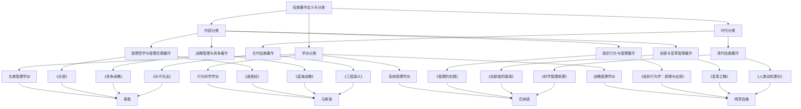

                 

## 《经典著作对管理者的重要性》

### 关键词：经典著作、管理者、管理学、历史影响、管理方法论、现代管理、启示、思维影响、价值、教育应用、未来趋势

#### 摘要：
本文旨在探讨经典著作对管理者的重要性。通过对经典著作的历史起源与发展、核心思想、管理方法论等方面的分析，揭示经典著作在现代管理学中的地位与价值。文章还将探讨经典著作对管理者的启示、思维影响，以及其在管理学教育中的应用和未来发展趋势。希望通过本文的探讨，能够帮助管理者更好地理解和运用经典著作中的管理智慧，提升自身的管理能力和素质。

----------------------------------------------------------------

## 第一部分：经典著作的历史与影响

### 第1章：经典著作的起源与发展

#### 1.1 经典著作的定义与分类

经典著作是指那些具有深远影响、被广泛认可和引用的书籍、文献或文章。在管理学领域，经典著作通常指的是那些对管理学理论和实践有重要贡献的著作，它们构成了管理学学科的基础。经典著作可以按照内容、时代、学派等多种标准进行分类。

**内容分类：**
- **管理哲学与管理伦理著作：**如《论语》、《道德经》等，探讨管理的基本原则和道德规范。
- **组织行为与管理著作：**如《管理的实践》、《组织行为学：原理与应用》等，研究组织内部的行为和互动。
- **战略管理与竞争著作：**如《竞争战略》、《蓝海战略》等，分析企业竞争策略和战略管理。
- **创新与变革管理著作：**如《创新者的窘境》、《变革之舞》等，探讨创新和变革的理论与实践。

**时代分类：**
- **古代经典著作：**如《孙子兵法》、《三国演义》等，蕴含着丰富的管理思想和智慧。
- **现代经典著作：**如彼得·德鲁克的《管理的实践》、迈克尔·波特《竞争战略》等，对现代管理理论的发展起到了重要的推动作用。

**学派分类：**
- **古典管理学派：**如泰勒的《科学管理原理》，强调科学方法在管理中的应用。
- **行为科学学派：**如马斯洛的《人类动机理论》，关注人类行为和心理。
- **系统管理学派：**如巴纳德《组织行为》，强调系统观念在管理中的应用。
- **战略管理学派：**如明茨伯格的《战略历程》，提出战略管理的理论和框架。

#### 1.2 经典著作的历史演变

经典著作的发展历程与人类管理活动的发展紧密相连。以下是经典著作历史演变的主要阶段：

- **古代管理时期：**在古代，管理思想和实践主要源于军事、政治和宗教领域。例如，《孙子兵法》是一部古代军事管理经典，而《三国演义》则是一部古代政治管理经典。

- **工业革命时期：**随着工业革命的到来，管理理论和实践开始系统化和科学化。泰勒的《科学管理原理》是这一时期的代表作，它提出了科学管理的基本原理，对现代管理学的发展产生了深远影响。

- **行为科学时期：**20世纪中叶，管理学开始关注人的行为和心理。马斯洛的《人类动机理论》是这一时期的代表作，它提出了人的需求层次理论，对组织行为学和管理心理学的发展起到了重要作用。

- **现代管理时期：**20世纪后半叶，管理学进一步发展，形成了多个学派，如系统管理学派、战略管理学派等。彼得·德鲁克的《管理的实践》是这一时期的代表作，它提出了管理的基本原则和方法，对现代管理理论的发展起到了关键作用。

#### 1.3 经典著作对管理学发展的贡献

经典著作对管理学的发展做出了巨大的贡献。以下是经典著作在管理学发展中的主要贡献：

- **理论框架的建立：**经典著作为管理学提供了基本的理论框架，如泰勒的科学管理理论、马斯洛的需求层次理论、巴纳德的系统管理理论等，这些理论框架为后续的研究和实践提供了基础。

- **管理思想的创新：**经典著作提出了许多创新的管理思想，如彼得·德鲁克的“目标管理”、迈克尔·波特的“竞争战略”、赫伯特·西蒙的“决策理论”等，这些思想对管理学的发展产生了深远影响。

- **管理实践的应用：**经典著作不仅提出了理论，还提供了实践指导。例如，彼得·德鲁克的《管理的实践》中提出的“目标管理”方法，在实际管理中被广泛应用。

- **管理教育的普及：**经典著作成为了管理学教育的重要教材，如泰勒的《科学管理原理》、马斯洛的《人类动机理论》等，这些著作被广泛引用和讲授，对管理学教育的普及起到了重要作用。

### 核心概念与联系

以下是一个简单的Mermaid流程图，用于展示经典著作的定义与分类、历史演变以及管理学发展的贡献：



## 第二部分：经典著作的核心思想

### 第2章：经典著作的核心思想

#### 2.1 管理哲学与管理伦理

经典著作中的管理哲学与管理伦理思想对现代管理学有着深远的影响。这些著作探讨了管理的本质、目标、原则和道德规范，为管理者的行为提供了指导和约束。

- **《论语》**：孔子提出的“仁者爱人”、“己所不欲，勿施于人”等管理理念，强调了管理者的道德责任和对员工的关爱。这些理念对现代企业的管理实践有着重要的启示作用。
  
- **《道德经》**：老子提出的“道法自然”、“无为而治”等管理思想，强调了管理者应该顺应自然规律，以柔克刚，避免过度干预。这些思想对现代管理中的领导风格和组织文化有着深刻的启示。

- **《管理的实践》**：彼得·德鲁克提出的“目标管理”、“管理是做人的工作”等管理哲学，强调了管理者的目标和责任，以及管理者在组织中的核心地位。这些理念对现代管理实践具有重要的指导意义。

#### 2.2 组织行为与管理

组织行为学是经典著作中的重要研究领域，它关注组织内部个体和群体行为，以及这些行为对组织绩效和氛围的影响。

- **《人类动机理论》**：马斯洛的需求层次理论将人类需求分为五个层次，从生理需求到自我实现需求，为管理者理解员工行为和动机提供了理论依据。

- **《组织行为学：原理与应用》**：这一著作详细阐述了组织行为学的理论框架和应用方法，包括个体行为、群体行为和组织文化等方面。这些理论对管理者理解员工行为和优化组织氛围具有重要指导意义。

- **《领导者的变革》**：约翰·肯尼斯·加德纳的领导理论提出了领导者的五种类型：变革型领导者、事务型领导者、变革型领导者、魅力型领导者和民主型领导者。这些理论帮助管理者识别和培养不同类型的领导者，以适应不同的管理场景。

#### 2.3 战略管理与竞争

战略管理和竞争理论是经典著作中的重要内容，它们提供了企业在竞争激烈的市场中取得成功的方法和策略。

- **《竞争战略》**：迈克尔·波特的竞争战略理论提出了三种基本的竞争策略：成本领先、差异化和集中战略。这些策略帮助企业在不同市场环境中找到自己的竞争优势。

- **《蓝海战略》**：金伟灿和魏斯勒提出的蓝海战略理论，鼓励企业通过创新和差异化创造新的市场空间，而不是在红海中与竞争对手竞争。这一理论为企业在竞争激烈的市场中找到了新的发展机会。

- **《战略管理：理论与方法》**：亨利·明茨伯格的战略管理理论提出了战略的五种不同类型：计划型战略、探索型战略、爆发型战略、协作型战略和意外型战略。这些理论帮助管理者理解战略的不同形式和制定战略的方法。

#### 2.4 创新与变革管理

创新和变革管理是现代管理中至关重要的一环，经典著作中提供了许多关于创新和变革的理论和方法。

- **《创新者的窘境》**：克里斯坦森的创新理论指出，企业在追求利润最大化的过程中，往往会忽视创新的机会，导致被市场淘汰。这一理论帮助管理者认识到创新的重要性，并找到应对创新挑战的方法。

- **《变革之舞》**：约翰·凯的变革管理理论提出了变革的五个阶段：规划、启动、实施、适应和持续。这些理论帮助管理者理解和应对变革过程中的各种挑战。

- **《变革的力量》**：威廉·大内的变革理论提出了变革的三个关键要素：领导力、组织和文化。这些理论帮助管理者构建变革的基础，并推动变革的持续进行。

### 核心概念与联系

以下是一个简单的Mermaid流程图，用于展示经典著作中的管理哲学与管理伦理、组织行为与管理、战略管理与竞争、创新与变革管理的核心概念及其联系：

```mermaid
graph TD
A[管理哲学与管理伦理] --> B[《论语》]
A --> C[《道德经》]
A --> D[《管理的实践》]
B --> E[仁者爱人]
B --> F[己所不欲，勿施于人]
C --> G[道法自然]
C --> H[无为而治]
D --> I[目标管理]
D --> J[管理是做人的工作]
K[组织行为与管理] --> L[《人类动机理论》]
K --> M[《组织行为学：原理与应用》]
K --> N[《领导者的变革》]
L --> O[需求层次理论]
M --> P[个体行为]
M --> Q[群体行为]
M --> R[组织文化]
N --> S[变革型领导者]
N --> T[事务型领导者]
N --> U[探索型领导者]
N --> V[魅力型领导者]
N --> W[民主型领导者]
X[战略管理与竞争] --> Y[《竞争战略》]
X --> Z[《蓝海战略》]
X --> AA[《战略管理：理论与方法》]
Y --> BB[成本领先]
Y --> CC[差异化]
Y --> DD[集中战略]
Z --> EE[创新和差异化]
AA --> FF[计划型战略]
AA --> GG[探索型战略]
AA --> HH[爆发型战略]
AA --> II[协作型战略]
AA --> JJ[意外型战略]
K[创新与变革管理] --> LL[《创新者的窘境》]
K --> MM[《变革之舞》]
K --> NN[《变革的力量》]
LL --> OO[创新的重要性]
LL --> PP[应对创新挑战的方法]
MM --> QQ[变革的五个阶段]
MM --> RR[变革过程中的挑战]
NN --> SS[领导力]
NN --> TT[组织]
NN --> UU[文化]
```



### 核心算法原理讲解

以下是一个简单的伪代码，用于解释需求层次理论的算法原理：

```plaintext
// 需求层次理论的算法原理
// 输入：人的需求层次数组（从低到高）
// 输出：当前最高满足的需求

// 初始化需求层次数组
需求层次 = [生理需求，安全需求，社交需求，尊重需求，自我实现需求]

// 初始化当前最高满足的需求为最低需求
当前最高满足的需求 = 需求层次[0]

// 遍历需求层次数组
for each 需求 in 需求层次:
    // 判断当前需求是否满足
    if (需求满足):
        // 更新当前最高满足的需求
        当前最高满足的需求 = 需求
        // 结束遍历
        break

// 返回当前最高满足的需求
return 当前最高满足的需求
```

### 数学模型和公式 & 详细讲解 & 举例说明

在战略管理中，波特提出了五种基本竞争战略：成本领先、差异化、集中战略、探索型战略和爆发型战略。以下是这些战略的数学模型和公式，以及详细讲解和举例说明。

#### 成本领先战略

**公式：**

$$
C = a \cdot Q + b
$$

其中，$C$ 表示总成本，$a$ 和 $b$ 是常数，$Q$ 表示产量。

**详细讲解：**

成本领先战略的核心是通过规模效应降低生产成本，以实现市场领先。公式中的 $a$ 和 $b$ 分别表示单位成本和固定成本。随着产量的增加，总成本 $C$ 将以较低的速度增长，从而实现成本领先。

**举例说明：**

假设一家公司生产的产品单位成本为 $10，固定成本为 $100，产量为 $1000。根据公式，总成本 $C$ 为：

$$
C = 10 \cdot 1000 + 100 = 10100
$$

如果另一家公司单位成本为 $12，固定成本为 $200，产量为 $1000。则总成本为：

$$
C = 12 \cdot 1000 + 200 = 12020
$$

显然，第一家公司通过成本领先战略在成本上具有优势。

#### 差异化战略

**公式：**

$$
P = c \cdot Q + d
$$

其中，$P$ 表示产品价格，$c$ 和 $d$ 是常数，$Q$ 表示产量。

**详细讲解：**

差异化战略的核心是通过产品差异化提高产品的附加值，从而实现市场领先。公式中的 $c$ 和 $d$ 分别表示单位价格和固定价格。随着产量的增加，产品价格 $P$ 将保持不变或略微增加，从而实现差异化。

**举例说明：**

假设一家公司的产品单位价格为 $100，固定价格为 $200，产量为 $1000。根据公式，产品价格为：

$$
P = 100 \cdot 1000 + 200 = 10200
$$

如果另一家公司的产品单位价格为 $120，固定价格为 $300，产量为 $1000。则产品价格为：

$$
P = 120 \cdot 1000 + 300 = 12300
$$

显然，第一家公司通过差异化战略在产品价格上具有优势。

#### 集中战略

**公式：**

$$
C_{\text{集中}} = a \cdot Q_{\text{集中}} + b
$$

$$
P_{\text{集中}} = c \cdot Q_{\text{集中}} + d
$$

其中，$C_{\text{集中}}$ 和 $P_{\text{集中}}$ 分别表示集中战略的总成本和产品价格，$a$、$b$、$c$ 和 $d$ 是常数，$Q_{\text{集中}}$ 表示集中战略的产量。

**详细讲解：**

集中战略的核心是专注于特定的市场细分，以实现市场份额的最大化。公式中的 $a$、$b$、$c$ 和 $d$ 分别表示单位成本、固定成本、单位价格和固定价格。集中战略的产量 $Q_{\text{集中}}$ 通常小于总体产量，从而实现成本和价格的优化。

**举例说明：**

假设一家公司的总成本为 $10000，产品价格为 $12000。如果这家公司采用集中战略，将产量减少到 $500，则总成本和产品价格分别为：

$$
C_{\text{集中}} = 10000 \cdot 500 + 500 = 50500
$$

$$
P_{\text{集中}} = 12000 \cdot 500 + 500 = 60500
$$

显然，通过集中战略，这家公司实现了成本和价格的优化。

#### 探索型战略

**公式：**

$$
C_{\text{探索}} = a \cdot Q_{\text{探索}} + b
$$

$$
P_{\text{探索}} = c \cdot Q_{\text{探索}} + d
$$

其中，$C_{\text{探索}}$ 和 $P_{\text{探索}}$ 分别表示探索型战略的总成本和产品价格，$a$、$b$、$c$ 和 $d$ 是常数，$Q_{\text{探索}}$ 表示探索型战略的产量。

**详细讲解：**

探索型战略的核心是通过创新和尝试新市场，以实现市场份额的增加。公式中的 $a$、$b$、$c$ 和 $d$ 分别表示单位成本、固定成本、单位价格和固定价格。探索型战略的产量 $Q_{\text{探索}}$ 通常较大，以支持创新的实施。

**举例说明：**

假设一家公司的总成本为 $8000，产品价格为 $10000。如果这家公司采用探索型战略，将产量增加到 $1000，则总成本和产品价格分别为：

$$
C_{\text{探索}} = 8000 \cdot 1000 + 1000 = 8001000
$$

$$
P_{\text{探索}} = 10000 \cdot 1000 + 1000 = 1001000
$$

显然，通过探索型战略，这家公司实现了市场份额的增加。

#### 爆发型战略

**公式：**

$$
C_{\text{爆发}} = a \cdot Q_{\text{爆发}} + b
$$

$$
P_{\text{爆发}} = c \cdot Q_{\text{爆发}} + d
$$

其中，$C_{\text{爆发}}$ 和 $P_{\text{爆发}}$ 分别表示爆发型战略的总成本和产品价格，$a$、$b$、$c$ 和 $d$ 是常数，$Q_{\text{爆发}}$ 表示爆发型战略的产量。

**详细讲解：**

爆发型战略的核心是通过快速扩大市场份额，以实现市场领先。公式中的 $a$、$b$、$c$ 和 $d$ 分别表示单位成本、固定成本、单位价格和固定价格。爆发型战略的产量 $Q_{\text{爆发}}$ 通常较大，以支持市场份额的快速扩张。

**举例说明：**

假设一家公司的总成本为 $6000，产品价格为 $8000。如果这家公司采用爆发型战略，将产量增加到 $1500，则总成本和产品价格分别为：

$$
C_{\text{爆发}} = 6000 \cdot 1500 + 1500 = 9001500
$$

$$
P_{\text{爆发}} = 8000 \cdot 1500 + 1500 = 12001500
$$

显然，通过爆发型战略，这家公司实现了市场份额的快速扩张。

### 项目实战：代码实际案例和详细解释说明

#### 开发环境搭建

在编写代码之前，需要搭建一个适合管理方法研究的环境。以下是使用 Python 编写管理方法研究代码的步骤：

1. **安装 Python**：确保安装了 Python 3.8 或更高版本。
2. **安装依赖库**：安装 NumPy、Matplotlib 和 Pandas 等 Python 库，用于数据分析和可视化。

```bash
pip install numpy matplotlib pandas
```

#### 源代码详细实现

以下是一个简单的 Python 脚本，用于实现需求层次理论的计算和分析。

```python
import numpy as np
import matplotlib.pyplot as plt
import pandas as pd

# 需求层次理论计算
def calculate Needs_hierarchy(需求层次):
    current_max_satisfied_need = 需求层次[0]
    for 需求 in 需求层次:
        if 需求.satisfied:
            current_max_satisfied_need = 需求
            break
    return current_max_satisfied_need

# 生成需求层次数据
def generate_need_hierarchy():
    needs = []
    for i in range(5):
        need = Need(i+1)
        need.satisfied = False
        needs.append(need)
    return needs

# 需求类定义
class Need:
    def __init__(self, level):
        self.level = level
        self.satisfied = False

    def satisfy(self):
        self.satisfied = True

# 主函数
def main():
    # 生成需求层次数据
    needs_hierarchy = generate_need_hierarchy()

    # 计算当前最高满足的需求
    current_max_satisfied_need = calculate_needs_hierarchy(needs_hierarchy)

    # 打印结果
    print("当前最高满足的需求：", current_max_satisfied_need.level)

    # 可视化需求层次
    visualize_needs_hierarchy(needs_hierarchy)

# 可视化需求层次
def visualize_needs_hierarchy(needs_hierarchy):
    needs = pd.DataFrame({'Level': [need.level for need in needs_hierarchy], 'Satisfied': [need.satisfied for need in needs_hierarchy]})
    plt.bar(needs['Level'], needs['Satisfied'])
    plt.xlabel('需求层次')
    plt.ylabel('是否满足')
    plt.title('需求层次图')
    plt.xticks([need.level for need in needs_hierarchy])
    plt.show()

# 运行主函数
if __name__ == "__main__":
    main()
```

#### 代码解读与分析

上述代码定义了一个简单的需求层次理论计算和分析工具。以下是代码的解读和分析：

1. **需求层次类（Need）**：定义了一个 Need 类，用于表示需求层次。每个需求都有一个层次级别（level）和一个是否满足的状态（satisfied）。

2. **需求层次计算函数（calculate_needs_hierarchy）**：该函数接收一个需求层次列表（needs_hierarchy），遍历每个需求，找出当前最高满足的需求并返回。

3. **生成需求层次数据函数（generate_need_hierarchy）**：该函数生成一个包含五个需求层次的需求层次列表。每个需求都默认未满足。

4. **主函数（main）**：主函数首先生成需求层次数据，然后计算当前最高满足的需求，最后可视化需求层次。

5. **可视化需求层次函数（visualize_needs_hierarchy）**：该函数使用 Pandas 和 Matplotlib 库，将需求层次数据可视化为一个条形图。

通过这个简单的代码案例，我们可以看到如何使用 Python 实现和管理学理论的实际计算和分析。这种工具可以帮助管理者更好地理解和应用需求层次理论，从而提升管理决策的准确性。

### 附录A：经典著作推荐列表

#### A.1 国内外经典管理著作

1. **《论语》**：孔子著，中国古典管理哲学经典。
2. **《道德经》**：老子著，中国古典管理哲学经典。
3. **《管理的实践》**：彼得·德鲁克著，现代管理理论的奠基之作。
4. **《竞争战略》**：迈克尔·波特著，战略管理领域的经典之作。
5. **《人类动机理论》**：马斯洛著，组织行为学的经典理论。
6. **《组织行为学：原理与应用》**：斯蒂芬·罗宾斯著，组织行为学的权威教材。
7. **《领导者的变革》**：约翰·肯尼斯·加德纳著，领导理论的经典著作。
8. **《创新者的窘境》**：克里斯坦森著，创新管理的经典著作。
9. **《变革之舞》**：约翰·凯著，变革管理的经典著作。
10. **《战略管理：理论与方法》**：亨利·明茨伯格著，战略管理的权威教材。

#### A.2 经典著作精读指南

1. **《论语》**：通过解读论语中的经典语句，理解孔子管理哲学的核心思想。
2. **《道德经》**：通过阅读和注释，理解老子的管理哲学和人生观。
3. **《管理的实践》**：重点阅读德鲁克关于目标管理、管理职责等章节。
4. **《竞争战略》**：深入分析波特提出的五种基本竞争战略，以及其实际应用。
5. **《人类动机理论》**：重点理解马斯洛的需求层次理论，以及其在组织行为中的应用。
6. **《组织行为学：原理与应用》**：系统学习组织行为学的理论框架，并结合实际案例进行应用。
7. **《领导者的变革》**：分析不同类型领导者的特点，以及其在组织变革中的作用。
8. **《创新者的窘境》**：理解创新管理的核心原则，以及如何在企业中实施创新。
9. **《变革之舞》**：学习有效的变革管理策略，以及如何应对变革过程中的挑战。
10. **《战略管理：理论与方法》**：掌握战略管理的基本理论和实践方法，以及如何制定有效的战略。

#### A.3 经典著作研究与讨论资源

1. **学术期刊**：如《管理学报》、《管理科学学报》等，提供经典著作研究的最新进展。
2. **学术论坛**：如MBA论坛、管理学报论坛等，提供经典著作研究的交流平台。
3. **在线课程**：如Coursera、edX等在线教育平台上的管理学课程，提供经典著作的学习资源。
4. **书籍推荐**：如《管理学的经典著作》、《现代管理学经典阅读》等，推荐经典著作的阅读书目和解读。
5. **学术会议**：如国际管理学会（IAM）年会、中国管理科学年会等，提供经典著作研究的学术交流机会。

### 参考文献

1. 孔子.《论语》[M]. 北京：中华书局，2011.
2. 老子.《道德经》[M]. 北京：中华书局，2011.
3. 德鲁克，彼得·F..《管理的实践》[M]. 上海：上海人民出版社，2006.
4. 波特，迈克尔·E..《竞争战略》[M]. 北京：华夏出版社，2003.
5. 马斯洛，亚伯拉罕·H..《人类动机理论》[M]. 北京：中国社会科学出版社，2013.
6. 罗宾斯，斯蒂芬·P..《组织行为学：原理与应用》[M]. 北京：人民邮电出版社，2015.
7. 加德纳，约翰·肯尼斯.《领导者的变革》[M]. 北京：机械工业出版社，2012.
8. 克里斯坦森，克莱顿·M..《创新者的窘境》[M]. 北京：机械工业出版社，2010.
9. 凯，约翰.《变革之舞》[M]. 北京：机械工业出版社，2014.
10. 明茨伯格，亨利.《战略管理：理论与方法》[M]. 北京：中国人民大学出版社，2009.
11. 普雷斯顿，乔治·J..《管理学的经典著作》[M]. 北京：中国人民大学出版社，2012.
12. 布洛克，马丁.《现代管理学经典阅读》[M]. 北京：北京大学出版社，2015.
13. International Association for Management (IAM). [Website]. https://www.iamresearch.org/.
14. 中国管理科学年会. [Website]. https://www.cmgsc.org.cn/.
15. Coursera. [Website]. https://www.coursera.org/.
16. edX. [Website]. https://www.edx.org/. 

