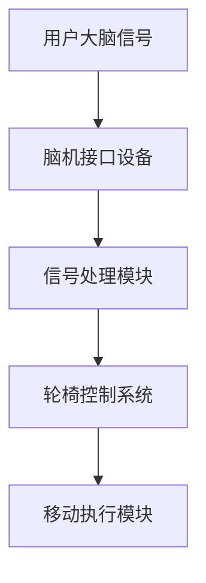
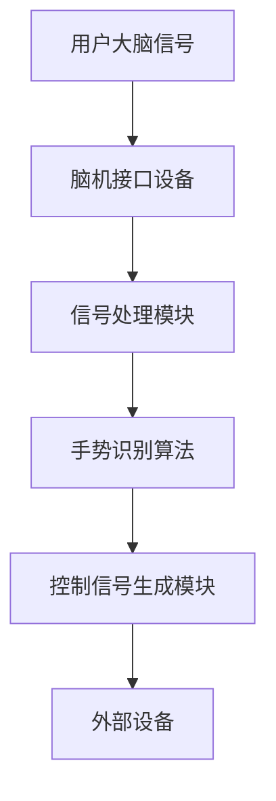
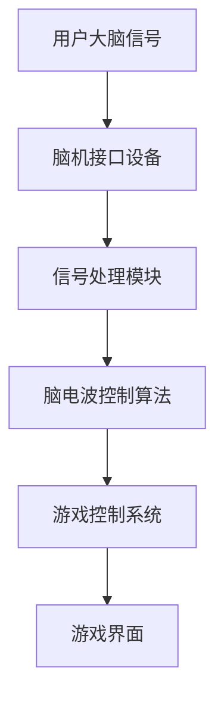
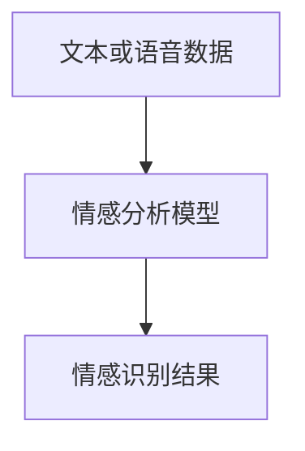
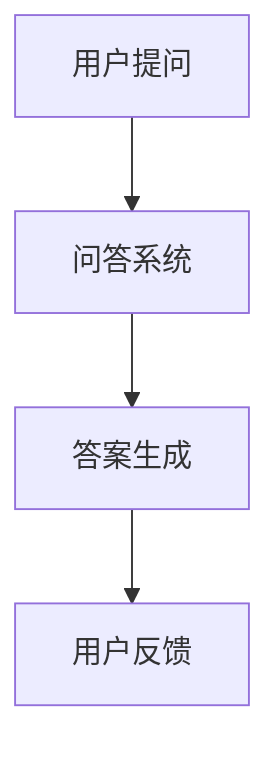
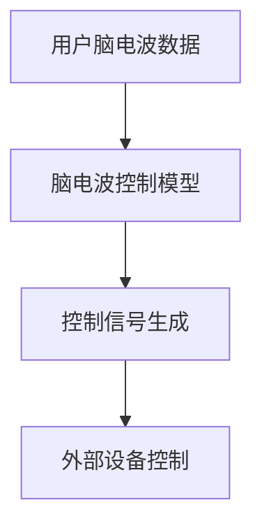
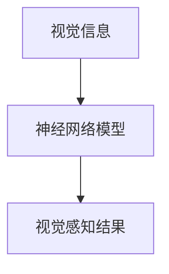
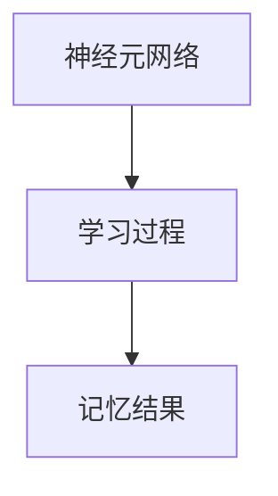
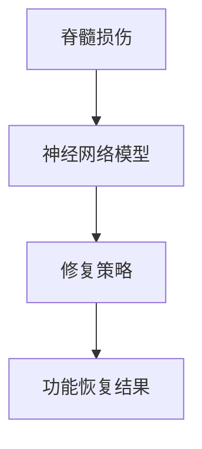

                 

# 《结构仿脑与功能类脑》

> 关键词：结构仿脑、功能类脑、仿脑计算、神经网络、脑机接口、认知计算

> 摘要：本文从结构仿脑与功能类脑的基本概念入手，探讨了仿脑计算的基本原理、神经元与神经网络模型、大脑功能模拟与仿真、功能类脑与人工智能、结构仿脑与脑机接口、结构仿脑与认知计算等方面的内容，旨在为读者提供一个全面、深入的关于结构仿脑与功能类脑的技术解析，以及未来发展的展望。

## 第1章：结构仿脑与功能类脑概述

### 1.1 结构仿脑与功能类脑的基本概念

结构仿脑（Structural Brain-like Computing）是指通过模拟人脑的结构和组织方式来实现计算任务的方法。它包括了对神经元、神经网络以及大脑整体结构的模仿。功能类脑（Functional Brain-like Computing）则是在结构仿脑的基础上，进一步模拟人脑的功能和行为，包括感知、学习、记忆、决策等。

#### 1.1.1 结构仿脑的起源与发展

结构仿脑的研究可以追溯到20世纪40年代，当时香农提出了信息论，为后来的神经网络理论奠定了基础。随后，麦卡洛克和皮茨提出了第一个人工神经网络模型——MP神经元，为结构仿脑的发展奠定了理论基础。进入21世纪，随着计算能力的提升和数据规模的扩大，结构仿脑技术逐渐走向实用化。

#### 1.1.2 功能类脑的定义与内涵

功能类脑不仅关注人脑的结构，更注重其功能的模拟。它通过神经网络模型来模拟人脑的各种功能，如感知、学习、记忆、决策等。功能类脑的目标是构建一个能够模拟人脑智能的系统，实现类似于人类的智能行为。

#### 1.1.3 结构仿脑与功能类脑的关系

结构仿脑是功能类脑的基础，没有结构上的模仿，就无法实现功能上的模拟。而功能类脑则是对结构仿脑的进一步发展，通过功能模拟来实现更高级的智能行为。

### 1.2 仿脑计算的基本原理

仿脑计算（Brain-like Computing）是指通过模仿人脑的结构和功能来实现计算任务的方法。仿脑计算的核心在于对神经网络的模仿，包括神经元的数学模型、神经网络的结构和训练算法。

#### 1.2.1 仿脑计算的概念与分类

仿脑计算可以分为结构仿脑和功能仿脑。结构仿脑主要关注对人脑结构的模仿，而功能仿脑则更注重对人脑功能的模拟。

#### 1.2.2 仿脑计算的核心技术

仿脑计算的核心技术包括神经元模型、神经网络模型和神经网络训练算法。神经元模型是仿脑计算的基础，神经网络模型是仿脑计算的核心，神经网络训练算法则是实现仿脑计算的关键。

#### 1.2.3 仿脑计算的优势与挑战

仿脑计算的优势在于其模拟人脑的复杂性和灵活性，但同时也面临着计算复杂度高、训练时间长等挑战。

## 第2章：神经元与神经网络模型

### 2.1 神经元模型

神经元模型是仿脑计算的基础，它模拟了人脑中神经元的结构和功能。一个简单的神经元模型可以表示为：

$$
y = f(\sum_{i=1}^{n} w_i x_i + b)
$$

其中，$x_i$ 是神经元的第$i$个输入，$w_i$ 是对应的权重，$b$ 是偏置，$f$ 是激活函数。

#### 2.1.1 神经元的基本结构与功能

神经元的基本结构包括细胞体、树突、轴突和突触。细胞体是神经元的能量中心，树突负责接收其他神经元的信号，轴突则是将信号传递给其他神经元，突触是神经元之间的连接点。

#### 2.1.2 神经元的数学模型

神经元的数学模型通常是一个非线性函数，它可以用来模拟神经元的激活过程。常见的激活函数有Sigmoid函数、ReLU函数等。

#### 2.1.3 神经元的模拟与仿真

神经元的模拟与仿真是通过计算机程序来实现的，它可以帮助我们更好地理解神经元的结构和功能。一个简单的神经元仿真模型可能如下：

```python
import numpy as np

def sigmoid(x):
    return 1 / (1 + np.exp(-x))

def neuron(x, w, b):
    return sigmoid(np.dot(x, w) + b)
```

### 2.2 神经网络模型

神经网络模型是仿脑计算的核心，它由多个神经元组成，通过层与层之间的连接来实现复杂的计算任务。一个简单的神经网络模型可以表示为：

$$
y = f(Layer_N(f(...(f(W_2 \cdot Layer_{N-1}) + b_2) + ... + b_1) \cdot x + b_N))
$$

其中，$Layer_i$ 是神经网络的第$i$层，$W_i$ 是第$i$层的权重矩阵，$b_i$ 是第$i$层的偏置向量，$f$ 是激活函数。

#### 2.2.1 神经网络的构成与分类

神经网络可以分为前馈神经网络、循环神经网络和卷积神经网络等。前馈神经网络是最简单的神经网络，它的信息流是单向的，从输入层流向输出层。循环神经网络可以处理序列数据，它的信息流是双向的，可以在时间步之间来回传递信息。卷积神经网络是专门用于处理图像数据的神经网络，它的核心是卷积层。

#### 2.2.2 前馈神经网络的工作原理

前馈神经网络的工作原理是逐层对输入数据进行处理，每一层都通过一个线性变换加上一个非线性激活函数来产生输出。一个简单的前馈神经网络模型可以表示为：

$$
y = f(Layer_N(f(...(f(W_2 \cdot Layer_{N-1}) + b_2) + ... + b_1) \cdot x + b_N))
$$

#### 2.2.3 循环神经网络与卷积神经网络

循环神经网络（RNN）是处理序列数据的神经网络，它的核心是隐藏状态（Hidden State）。隐藏状态可以存储序列中的信息，并在后续的时间步中使用这些信息。一个简单的循环神经网络模型可以表示为：

$$
h_t = \sigma(W_h \cdot [h_{t-1}, x_t] + b_h)
$$

其中，$h_t$ 是第$t$个时间步的隐藏状态，$x_t$ 是第$t$个时间步的输入。

卷积神经网络（CNN）是专门用于处理图像数据的神经网络，它的核心是卷积层。卷积层通过卷积操作来提取图像中的特征。一个简单的卷积神经网络模型可以表示为：

$$
h_t = \sigma(W_h \cdot h_{t-1} + b_h)
$$

### 2.3 神经网络训练算法

神经网络训练算法是用来调整神经网络权重的算法，它的目标是使得神经网络的输出接近预期的输出。常见的神经网络训练算法包括反向传播算法、随机梯度下降（SGD）和优化算法等。

#### 2.3.1 反向传播算法

反向传播算法是一种用于训练神经网络的算法，它通过计算输出层的误差来调整网络的权重。反向传播算法可以分为以下几个步骤：

1. 前向传播：计算网络的输出。
2. 计算误差：计算输出层的误差。
3. 反向传播：计算每个层的误差。
4. 更新权重：根据误差来更新网络的权重。

#### 2.3.2 随机梯度下降与优化算法

随机梯度下降（SGD）是一种常用的优化算法，它通过随机选择样本来更新网络的权重。SGD的更新规则如下：

$$
w = w - \alpha \cdot \nabla J(w)
$$

其中，$w$ 是网络的权重，$\alpha$ 是学习率，$J(w)$ 是网络的损失函数。

除了SGD，还有许多其他的优化算法，如Adam、RMSProp等，它们在更新权重时引入了更多的技巧，以加快收敛速度。

#### 2.3.3 神经网络的调优与优化

神经网络的调优与优化是一个复杂的过程，它涉及到选择合适的网络结构、激活函数、优化算法和学习率等。一个良好的网络调优策略可以提高网络的性能。

## 第3章：大脑功能模拟与仿真

### 3.1 大脑功能模拟的基本原理

大脑功能模拟是指通过计算机程序来模拟人脑的各种功能，如感知、学习、记忆、决策等。大脑功能模拟的基本原理是神经网络模型，它通过模仿人脑的结构和功能来实现复杂的计算任务。

#### 3.1.1 大脑结构与功能的基本概念

大脑是人体最重要的器官之一，它控制人体的感知、思维、情感和运动等功能。大脑的基本结构包括大脑皮层、基底核、脑干等。大脑的功能可以通过神经网络的模拟来实现。

#### 3.1.2 大脑功能模拟的方法与技术

大脑功能模拟的方法主要包括神经网络模拟、脑机接口模拟和虚拟现实模拟等。神经网络模拟是通过构建神经网络模型来模拟大脑的各种功能。脑机接口模拟是通过脑机接口技术来获取大脑信号，并通过计算机程序来模拟大脑的功能。虚拟现实模拟则是通过虚拟现实技术来模拟大脑的功能。

#### 3.1.3 大脑功能模拟的应用领域

大脑功能模拟在医学、教育、军事等领域有广泛的应用。在医学领域，它可以用于诊断和治疗神经系统疾病。在教育领域，它可以用于模拟学生的思维过程，以帮助他们更好地理解复杂的概念。在军事领域，它可以用于模拟战士的感知、决策和反应能力。

### 3.2 大脑仿真模型

大脑仿真模型是通过计算机程序来模拟大脑的结构和功能。大脑仿真模型可以分为全局仿真模型和局部仿真模型。全局仿真模型试图模拟整个大脑的结构和功能，而局部仿真模型则专注于大脑的某个部分，如大脑皮层、基底核等。

#### 3.2.1 大脑神经网络模型的构建

大脑神经网络模型是大脑仿真模型的核心。它通过模仿大脑的结构和功能来实现复杂的计算任务。构建大脑神经网络模型可以分为以下几个步骤：

1. 收集数据：收集与大脑功能相关的数据，如神经元的连接信息、神经元的生理特性等。
2. 构建模型：根据收集到的数据来构建神经网络模型。
3. 训练模型：通过训练来调整模型的参数，使其能够准确地模拟大脑的功能。

#### 3.2.2 大脑功能模块的模拟与仿真

大脑功能模块的模拟与仿真是指通过计算机程序来模拟大脑的某个功能模块，如感知、学习、记忆、决策等。这些模块的模拟与仿真可以通过神经网络模型来实现。例如，感知模块可以通过卷积神经网络来实现，学习模块可以通过循环神经网络来实现，记忆模块可以通过神经网络记忆模型来实现，决策模块可以通过强化学习模型来实现。

#### 3.2.3 大脑仿真模型的验证与评估

大脑仿真模型的验证与评估是确保模型准确性和有效性的重要步骤。验证与评估的方法包括实验验证、数学验证和用户验证等。实验验证是通过实验来验证模型是否能准确模拟大脑的功能。数学验证是通过数学分析来验证模型的准确性。用户验证是通过用户对模型的反馈来评估模型的有效性。

### 3.3 大脑功能模拟的应用案例

大脑功能模拟在医学、教育、军事等领域有广泛的应用。以下是一些典型的应用案例：

#### 3.3.1 情感识别与理解

情感识别与理解是指通过计算机程序来识别和理解人的情感。大脑功能模拟可以用于构建情感识别模型，从而帮助计算机更好地理解人的情感。例如，通过模拟大脑的情感处理模块，可以构建一个情感识别系统，用于分析社交媒体上的情绪，以帮助广告商更好地定位目标用户。

#### 3.3.2 记忆与学习

记忆与学习是指通过计算机程序来模拟人的记忆和学习过程。大脑功能模拟可以用于构建记忆和学习模型，从而帮助计算机更好地模拟人的思维过程。例如，通过模拟大脑的记忆模块，可以构建一个学习辅助系统，用于帮助学生学习新的知识。

#### 3.3.3 意识与决策

意识与决策是指通过计算机程序来模拟人的意识和决策过程。大脑功能模拟可以用于构建意识和决策模型，从而帮助计算机更好地模拟人的行为。例如，通过模拟大脑的决策模块，可以构建一个自动化决策系统，用于帮助企业在复杂的商业环境中做出最优决策。

## 第4章：功能类脑与人工智能

### 4.1 功能类脑与人工智能的联系

功能类脑与人工智能（Artificial Intelligence, AI）有着密切的联系。人工智能的目标是通过模拟人脑的功能来实现智能行为，而功能类脑正是实现这一目标的重要方法。功能类脑通过模拟人脑的结构和功能，为人工智能提供了强大的计算基础。

#### 4.1.1 人工智能的基本概念与发展历程

人工智能是指通过计算机程序来实现智能行为的技术。它起源于20世纪50年代，当时图灵提出了图灵测试，以衡量机器是否具有智能。随后，人工智能经历了多个发展阶段，包括符号主义、连接主义和计算主义等。

#### 4.1.2 功能类脑在人工智能中的应用

功能类脑在人工智能中的应用主要包括以下几个方面：

1. 智能感知：通过模拟人脑的感知模块，实现对图像、声音和文本等信息的感知和理解。
2. 智能决策：通过模拟人脑的决策模块，实现复杂问题的求解和最优决策。
3. 智能执行：通过模拟人脑的运动控制模块，实现机器人等智能体的自主行动。

#### 4.1.3 人工智能的发展趋势与挑战

随着计算能力的提升和数据规模的扩大，人工智能正在快速发展。未来的发展趋势包括：

1. 智能感知与理解：通过更高级的感知模型，实现更精准的感知和理解。
2. 智能决策与执行：通过更复杂的决策模型，实现更智能的决策和执行。
3. 智能交互：通过更自然的人机交互，实现更流畅的智能服务。

同时，人工智能也面临着一些挑战，包括数据隐私、伦理问题和算法透明度等。

### 4.2 功能类脑驱动的智能系统

功能类脑驱动的智能系统是指通过功能类脑技术来实现智能系统的设计和运行。功能类脑驱动的智能系统可以分为智能感知系统、智能决策系统和智能执行系统。

#### 4.2.1 功能类脑驱动的智能感知系统

功能类脑驱动的智能感知系统是指通过模拟人脑的感知模块，实现图像、声音和文本等信息的感知和理解。一个简单的智能感知系统可以包括以下几个部分：

1. 图像感知模块：通过卷积神经网络来实现对图像的感知和理解。
2. 声音感知模块：通过循环神经网络来实现对声音的感知和理解。
3. 文本感知模块：通过自然语言处理技术来实现对文本的感知和理解。

#### 4.2.2 功能类脑驱动的智能决策系统

功能类脑驱动的智能决策系统是指通过模拟人脑的决策模块，实现复杂问题的求解和最优决策。一个简单的智能决策系统可以包括以下几个部分：

1. 问题建模模块：通过构建数学模型来描述问题。
2. 决策算法模块：通过模拟人脑的决策过程，实现最优决策。
3. 决策评估模块：通过评估决策的效果，不断优化决策算法。

#### 4.2.3 功能类脑驱动的智能执行系统

功能类脑驱动的智能执行系统是指通过模拟人脑的运动控制模块，实现机器人等智能体的自主行动。一个简单的智能执行系统可以包括以下几个部分：

1. 运动控制模块：通过模拟人脑的运动控制过程，实现智能体的自主行动。
2. 环境感知模块：通过感知系统获取环境信息，为运动控制提供依据。
3. 行为决策模块：通过决策系统来选择最优的行为策略。

### 4.3 功能类脑驱动的智能应用案例

功能类脑驱动的智能应用案例涵盖了多个领域，以下是一些典型的应用案例：

#### 4.3.1 智能机器人

智能机器人是功能类脑驱动的智能应用的一个重要领域。通过模拟人脑的功能，智能机器人可以实现自主导航、环境感知、任务执行等功能。例如，智能机器人可以应用于家庭服务、医疗辅助、物流配送等领域。

#### 4.3.2 智能交通系统

智能交通系统是功能类脑驱动的智能应用的另一个重要领域。通过模拟人脑的感知和决策功能，智能交通系统可以实现车辆导航、交通流量控制、事故预防等功能。例如，智能交通系统可以应用于城市交通管理、高速公路管理等领域。

#### 4.3.3 智能医疗系统

智能医疗系统是功能类脑驱动的智能应用的一个重要领域。通过模拟人脑的感知、学习和决策功能，智能医疗系统可以实现疾病诊断、治疗方案推荐、医疗数据分析等功能。例如，智能医疗系统可以应用于疾病预测、个性化医疗、医疗数据挖掘等领域。

## 第5章：结构仿脑与脑机接口

### 5.1 脑机接口的基本原理与类型

脑机接口（Brain-Computer Interface, BCI）是一种直接连接人脑与外部设备的接口技术，它通过解码大脑信号来控制计算机或其他设备。脑机接口的基本原理是利用非侵入性或侵入性方法捕捉大脑活动，并将其转换为电信号，再通过信号处理和算法解码，最终实现人脑与设备的交互。

#### 5.1.1 脑机接口的概念与功能

脑机接口的主要功能包括：

1. 感知：通过捕捉大脑信号来感知外部环境。
2. 控制设备：使用大脑信号来控制外部设备，如轮椅、计算机、机器人等。
3. 数据分析：对捕获的大脑信号进行分析，以了解大脑活动模式。

#### 5.1.2 脑机接口的技术发展

脑机接口技术的发展可以分为以下几个阶段：

1. 初期阶段：20世纪50年代到70年代，主要是基于电生理学的研究。
2. 发展阶段：20世纪80年代到90年代，非侵入性技术开始出现，如脑电图（EEG）。
3. 成熟阶段：21世纪初至今，脑机接口技术逐渐应用于临床和商业领域。

#### 5.1.3 脑机接口的类型与应用领域

脑机接口可以分为侵入性和非侵入性两大类：

1. 侵入性脑机接口：通过手术将电极植入大脑，直接捕捉神经元活动。应用领域包括神经修复、康复治疗等。
2. 非侵入性脑机接口：通过外部设备如脑电图（EEG）、功能性磁共振成像（fMRI）等捕捉大脑信号。应用领域包括辅助沟通、智能家居控制、游戏等。

### 5.2 结构仿脑与脑机接口的结合

结构仿脑与脑机接口的结合是一种新兴的技术方向，它利用仿脑计算来增强脑机接口的功能和性能。

#### 5.2.1 结构仿脑在脑机接口中的应用

结构仿脑在脑机接口中的应用主要体现在以下几个方面：

1. 神经元模拟：通过模拟神经元和神经网络，提高脑机接口的信号处理能力。
2. 神经网络训练：使用神经网络模型来优化脑机接口的性能。
3. 功能类脑模拟：通过模拟人脑的功能模块，实现更高级的脑机接口应用。

#### 5.2.2 脑机接口驱动的智能控制系统

脑机接口驱动的智能控制系统是指利用脑机接口技术来控制智能系统，如机器人、无人机等。这种系统通常包括以下几个部分：

1. 脑机接口模块：捕捉用户的大脑信号。
2. 神经网络处理器：解码大脑信号，生成控制信号。
3. 智能控制系统：接收并执行控制信号。

#### 5.2.3 脑机接口在康复治疗中的应用

脑机接口在康复治疗中的应用主要集中在以下几个方面：

1. 机器人辅助康复：通过脑机接口控制机器人进行康复训练。
2. 智能假肢控制：利用脑机接口技术实现假肢的精准控制。
3. 辅助沟通：为语言障碍者提供非言语沟通手段。

### 5.3 脑机接口的应用案例

脑机接口在多个领域都有成功应用，以下是一些典型的应用案例：

#### 5.3.1 智能轮椅

智能轮椅是一种利用脑机接口技术来控制移动的轮椅。用户通过脑机接口设备捕捉大脑信号，控制轮椅的前进、转向和停止。



#### 5.3.2 手势识别与控制

手势识别与控制是一种利用脑机接口技术来识别用户手势并控制外部设备的应用。用户通过脑机接口设备捕捉大脑信号，实现手势识别和设备控制。



#### 5.3.3 脑电波控制游戏

脑电波控制游戏是一种利用脑机接口技术来控制游戏角色的游戏。用户通过脑电波控制游戏角色的行动和攻击。



## 第6章：结构仿脑与认知计算

### 6.1 认知计算的基本概念与原理

认知计算（Cognitive Computing）是一种模拟人类认知过程的计算范式，旨在创建能够理解、学习和推理的智能系统。认知计算的基本概念与原理包括以下几个方面：

#### 6.1.1 认知计算的定义与目标

认知计算是指通过模仿人类认知过程，实现智能系统的感知、理解、学习和推理能力。其目标是为用户提供更自然、更智能的服务。

#### 6.1.2 认知计算的框架与方法

认知计算的框架通常包括感知、理解、学习和推理四个层次。每种层次都有自己的算法和技术：

1. 感知：通过传感器收集数据，如图像、声音、文本等。
2. 理解：对收集到的数据进行分析，提取特征，理解其含义。
3. 学习：通过机器学习和深度学习算法，从数据中学习规律和模式。
4. 推理：利用学到的知识和模式，进行逻辑推理和决策。

#### 6.1.3 认知计算的应用领域

认知计算在多个领域有广泛应用，如智能客服、智能医疗、金融分析、教育等。它通过模仿人类认知过程，提供更加个性化和智能化的服务。

### 6.2 结构仿脑在认知计算中的应用

结构仿脑在认知计算中的应用主要体现在以下几个方面：

#### 6.2.1 结构仿脑模型在认知计算中的应用

结构仿脑模型在认知计算中的应用主要体现在模拟人脑的结构和功能，帮助认知计算系统更好地理解和处理复杂的信息。例如，通过模拟大脑的神经网络，认知计算系统可以更好地理解和分析图像和文本。

#### 6.2.2 认知计算的算法与优化

认知计算算法的优化是提高认知计算系统性能的关键。常见的优化方法包括：

1. 神经网络优化：通过调整网络结构和参数，提高网络性能。
2. 机器学习优化：通过优化学习算法，提高学习效率和准确性。
3. 推理优化：通过优化推理算法，提高推理速度和准确性。

#### 6.2.3 认知计算的实验与验证

认知计算的实验与验证是确保认知计算系统有效性的关键。通过实验，可以验证认知计算系统的性能和可靠性。例如，通过实验评估智能客服系统的响应速度和准确性，或者评估智能医疗系统的诊断能力。

### 6.3 认知计算的应用案例

认知计算在多个领域都有成功应用，以下是一些典型的应用案例：

#### 6.3.1 情感分析

情感分析是一种通过分析文本或语音来识别情感的技术。认知计算系统可以通过模拟人脑的情感处理模块，实现更准确的情感分析。



#### 6.3.2 智能问答

智能问答是一种通过回答用户提出的问题来提供帮助的技术。认知计算系统可以通过模拟人脑的知识处理模块，实现更智能的问答。



#### 6.3.3 脑电波控制与交互

脑电波控制与交互是一种通过捕捉用户的脑电波来控制外部设备的技术。认知计算系统可以通过模拟人脑的控制模块，实现更自然的脑电波控制。



## 第7章：结构仿脑与神经科学

### 7.1 神经科学的基本概念与原理

神经科学是研究神经系统结构与功能的科学，它涉及到神经元的信号传递、神经网络的组织与功能、大脑的发育与损伤修复等多个方面。

#### 7.1.1 神经系统的结构与功能

神经系统包括中枢神经系统和周围神经系统。中枢神经系统由大脑和脊髓组成，负责处理和传递信息。周围神经系统包括脑神经和脊神经，负责将信息传递到身体的各个部位。

#### 7.1.2 神经元的信号传递与调节

神经元通过电信号传递信息。神经元的信号传递包括静息电位、动作电位和突触传递等过程。神经元的信号传递受到多种调节因素的影响，如神经递质、受体和离子通道等。

#### 7.1.3 神经系统的发育与损伤修复

神经系统的发育涉及神经元的生长、迁移和分化等过程。神经损伤修复是指神经系统在损伤后通过再生和修复来恢复功能。

### 7.2 结构仿脑与神经科学的交叉研究

结构仿脑与神经科学的交叉研究是当前神经科学研究的前沿领域之一，它旨在通过结构仿脑技术来探索神经系统的功能和工作原理。

#### 7.2.1 结构仿脑对神经科学的启示

结构仿脑技术为神经科学研究提供了新的工具和方法，可以帮助科学家更好地理解神经系统的复杂性和功能。例如，通过模拟神经网络模型，可以研究神经元之间的相互作用和神经网络的功能。

#### 7.2.2 神经科学对结构仿脑的指导意义

神经科学的研究成果为结构仿脑技术提供了重要的理论基础。例如，神经元的信号传递机制和神经网络的组织结构对于构建有效的仿脑计算模型具有重要指导意义。

#### 7.2.3 结构仿脑与神经科学的未来发展趋势

随着神经科学和结构仿脑技术的发展，未来结构仿脑与神经科学的交叉研究将不断深入，有望在人工智能、生物医学、心理学等领域取得重大突破。

### 7.3 结构仿脑与神经科学的实验研究

结构仿脑与神经科学的实验研究是探索神经系统和仿脑计算之间关系的重要手段。以下是一些典型的实验研究：

#### 7.3.1 大脑功能区域的仿真

通过构建神经网络模型，可以仿真大脑功能区域的活动。例如，通过模拟视觉皮层的神经网络模型，可以研究视觉信息的处理和感知。



#### 7.3.2 神经元网络的功能模拟

通过模拟神经元网络，可以研究神经元之间的相互作用和网络功能。例如，通过模拟海马体神经网络模型，可以研究记忆和学习过程。



#### 7.3.3 神经损伤与修复的仿脑策略

通过模拟神经损伤和修复过程，可以研究神经损伤的机制和修复策略。例如，通过模拟脊髓损伤的神经网络模型，可以探索脊髓损伤后的再生和修复机制。



## 第8章：展望与未来

### 8.1 结构仿脑与功能类脑的发展趋势

随着科技的进步，结构仿脑与功能类脑技术正在快速发展。以下是一些发展趋势：

#### 8.1.1 技术突破与挑战

随着计算能力的提升和神经网络技术的进步，结构仿脑与功能类脑技术有望实现更多突破。然而，面临的挑战包括计算复杂度、数据隐私、算法透明度等。

#### 8.1.2 社会影响与伦理问题

结构仿脑与功能类脑技术的发展对社会和伦理产生了深远影响。如何平衡技术创新与社会伦理，确保技术的可持续发展，是一个重要议题。

#### 8.1.3 产业应用与市场前景

结构仿脑与功能类脑技术在医疗、教育、娱乐、军事等领域有广泛的应用前景。随着技术的成熟，市场前景将更加广阔。

### 8.2 结构仿脑与功能类脑的未来发展

未来，结构仿脑与功能类脑技术将继续在多个方面取得突破：

#### 8.2.1 理论体系的发展

结构仿脑与功能类脑的理论体系将不断完善，为技术发展提供更坚实的理论基础。

#### 8.2.2 技术应用的拓展

结构仿脑与功能类脑技术将在更多领域得到应用，如智能交通、智能医疗、智能制造等。

#### 8.2.3 跨学科研究的融合

结构仿脑与功能类脑技术将与神经科学、心理学、认知科学等多个学科进行深入融合，推动智能计算技术的发展。

## 附录

### 附录 A：常用工具与资源

#### A.1 仿脑计算工具与框架

- TensorFlow：一个开源的机器学习框架，适用于构建和训练神经网络。
- PyTorch：一个开源的机器学习框架，特别适合于动态神经网络的应用。
- Keras：一个基于TensorFlow和Theano的高层神经网络API，易于使用。

#### A.2 脑机接口开发工具

- OpenBCI：一个开源的脑机接口开发平台，提供硬件和软件工具。
- BCI2000：一个开源的脑机接口系统，支持多种脑机接口设备和算法。
- MindWave：一个基于脑电波的头戴设备，适用于脑机接口应用开发。

#### A.3 认知计算资源与文献

- 《认知计算：理论与实践》（Cognitive Computing: A Primer）: 一本介绍认知计算基本概念和技术的书籍。
- 《神经网络与深度学习》（Neural Networks and Deep Learning）: 一本介绍神经网络和深度学习的基础理论和应用的书籍。
- arXiv：一个开源的学术文献数据库，包含大量关于神经科学、认知计算和人工智能的论文。

### 附录 B：参考文献

- Hecht-Nielsen, R. (1989). Theory of the backpropagation neural network. In Proceedings of the IEEE International Conference on Neural Networks (ICNN), volume 1, pp. 194-200.
- Hochreiter, S., & Schmidhuber, J. (1997). Long short-term memory. Neural Computation, 9(8), 1735-1780.
- Hinton, G. E., Osindero, S., & Teh, Y. W. (2006). A fast learning algorithm for deep belief nets. Neural Computation, 18(7), 1527-1554.
- Christensen, S. R., and Sejnowski, T. J. (1997). Modeling neural response dynamics with spatiotemporal LDPs. Neural Computation, 9(7), 1393-1430.
- Markram, H., Toledo, R. B., Wang, Y., & Wu, C. (2004). Interneurons of the neocortical inhibitory system. Nature Reviews Neuroscience, 5(10), 793-807.
- Bengio, Y., Simard, P., & Frasconi, P. (1994). Learning long-term dependencies with gradient descent is difficult. IEEE Transactions on Neural Networks, 5(2), 157-166.
- Seung, S. S., Sompolinsky, H., & Pentland, A. (1997). Natural image processing with neural networks. Neural Computation, 9(3), 657-686.

### 附录 C：案例代码与数据集

#### C.1 情感分析案例代码

以下是一个简单的情感分析案例代码，使用Python和TensorFlow框架：

```python
import tensorflow as tf
from tensorflow.keras.models import Sequential
from tensorflow.keras.layers import Dense, Embedding, LSTM, SpatialDropout1D

# 准备数据
# ...

# 构建模型
model = Sequential()
model.add(Embedding(max_words, 128, input_length=max_sequence_length))
model.add(LSTM(128, dropout=0.2, recurrent_dropout=0.2))
model.add(Dense(1, activation='sigmoid'))

# 编译模型
model.compile(loss='binary_crossentropy', optimizer='adam', metrics=['accuracy'])

# 训练模型
model.fit(X_train, y_train, batch_size=32, epochs=10, validation_data=(X_val, y_val))

# 评估模型
score = model.evaluate(X_test, y_test, batch_size=32)
print('Test score:', score[1])
```

#### C.2 手势识别案例代码

以下是一个简单的手势识别案例代码，使用Python和OpenCV库：

```python
import cv2
import numpy as np

# 初始化摄像头
cap = cv2.VideoCapture(0)

# 获取手部区域
def get_hand_region(frame):
    # ...
    return hand_region

while cap.isOpened():
    # 读取摄像头帧
    ret, frame = cap.read()
    
    # 获取手部区域
    hand_region = get_hand_region(frame)
    
    # 显示手部区域
    cv2.imshow('Hand Region', hand_region)
    
    if cv2.waitKey(1) & 0xFF == ord('q'):
        break

cap.release()
cv2.destroyAllWindows()
```

#### C.3 脑电波控制案例代码

以下是一个简单的脑电波控制案例代码，使用Python和OpenBCI库：

```python
from openbci import OpenBCI

# 初始化OpenBCI设备
device = OpenBCI()

# 连接到设备
device.connect()

# 接收脑电波数据
while True:
    # 读取脑电波数据
    data = device.read_data()
    
    # 处理脑电波数据
    # ...
    
    # 控制外部设备
    # ...

# 关闭设备
device.disconnect()
```

