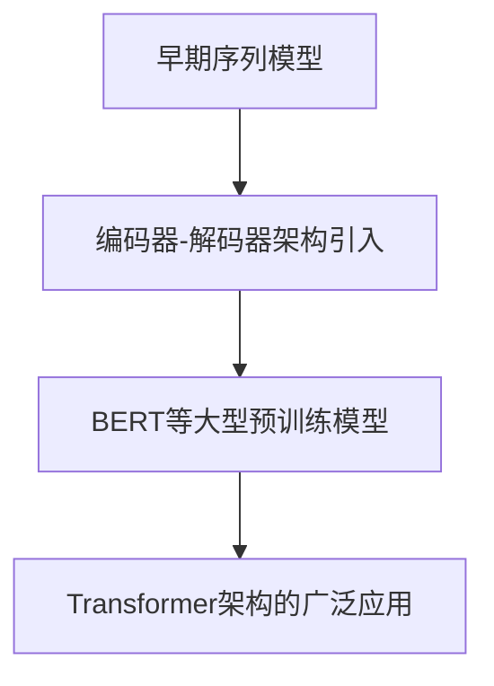
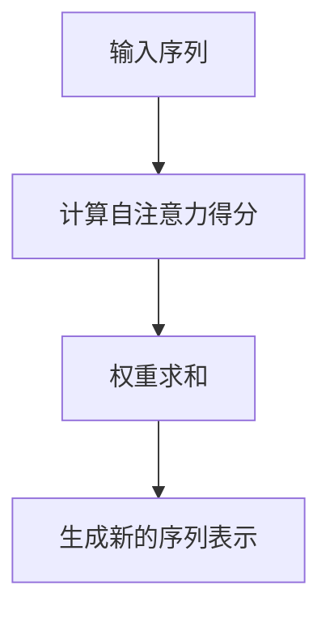
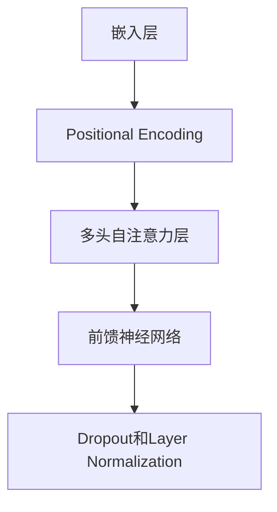
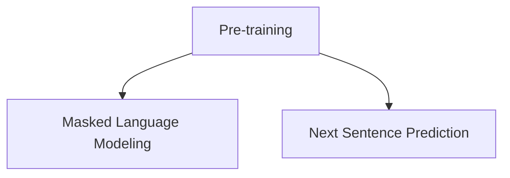
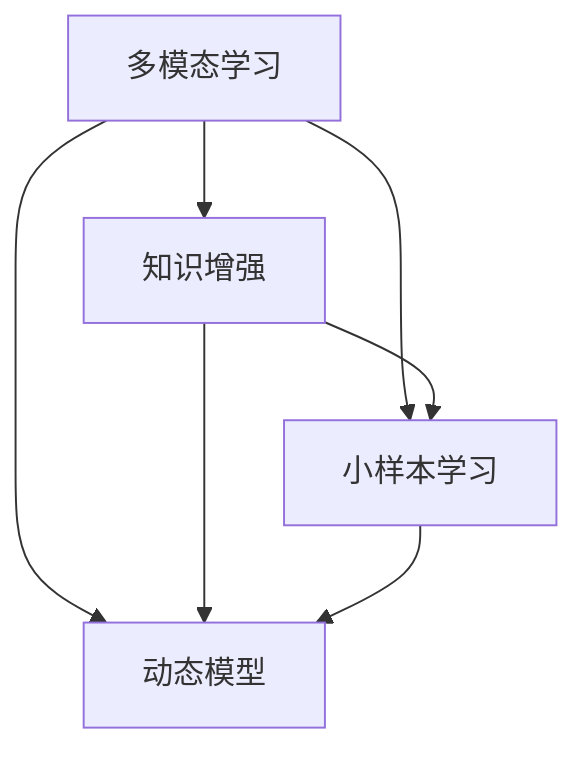

                 

# 文章标题: 编码器-解码器架构：深度剖析与应用实战

> 关键词：编码器-解码器架构、Transformer、自注意力机制、语言模型、机器翻译、问答系统、优化策略、部署与维护

> 摘要：
本文将深入探讨编码器-解码器（Encoder-Decoder）架构，从基础概念到核心算法，再到实际应用，进行全面解析。我们将通过实例代码和伪代码，帮助读者理解这一架构的运作原理，并展示其在语言模型、机器翻译和问答系统等领域的应用。此外，本文还将讨论编码器-解码器架构的优化策略、部署与维护方法，以及未来展望。

## 第一部分: 编码器-解码器架构概述

### 第1章: 编码器-解码器架构基础

#### 1.1 编码器-解码器架构的概念与历史

编码器-解码器架构是一种经典的序列到序列（Sequence to Sequence）模型，主要用于处理输入输出为序列的任务。这一架构的起源可以追溯到上世纪80年代的序列模型，如RNN（Recurrent Neural Network）和LSTM（Long Short-Term Memory）。然而，真正的突破来自于2014年谷歌提出的一种全新架构——基于注意力机制的编码器-解码器模型。

**Mermaid 流程图**: 显示编码器-解码器架构的发展历程



#### 1.2 编码器-解码器架构的核心组成部分

编码器-解码器架构主要由两个部分组成：编码器（Encoder）和解码器（Decoder）。编码器负责将输入序列编码为固定长度的向量，解码器则负责将这个向量解码为输出序列。

- **编码器**：负责将输入序列编码为固定长度的向量。它通常由多个层组成，每层都包含一个编码器层（Encoder Layer），每个编码器层通常包含一个多头自注意力机制（Multi-Head Self-Attention）和一个前馈神经网络（Feed Forward Neural Network）。
  
- **解码器**：负责将编码后的向量解码为输出序列。它的工作流程与编码器类似，但通常会在每层解码器之后添加一个掩码自注意力机制（Masked Self-Attention），以避免解码过程中的重复。

#### 1.3 编码器-解码器架构的优势与应用场景

编码器-解码器架构具有以下几个显著优势：

1. **强大的序列建模能力**：编码器-解码器架构能够有效地捕捉输入输出序列之间的长距离依赖关系。
2. **模块化设计**：编码器和解码器可以独立训练，方便模型维护和优化。
3. **灵活性**：编码器-解码器架构可以应用于各种序列到序列的任务，如机器翻译、文本摘要和问答系统。

**伪代码**:

```python
# 编码器伪代码
def encode(input_sequence):
    # 使用神经网络模型对输入序列进行编码
    encoded_sequence = neural_network(input_sequence)
    return encoded_sequence

# 解码器伪代码
def decode(encoded_sequence):
    # 使用神经网络模型对编码后的序列进行解码
    decoded_sequence = neural_network(encoded_sequence, reverse=True)
    return decoded_sequence
```

### 第2章: 编码器-解码器架构的工作原理

#### 2.1 自注意力机制

自注意力机制（Self-Attention）是编码器-解码器架构的核心组成部分之一。它允许模型在处理输入序列时，对序列中的每个元素进行加权，从而更好地捕捉序列内部的关系。

**Mermaid 流程图**: 显示自注意力机制的执行流程



**伪代码**:

```python
# 自注意力机制伪代码
def self_attention(input_sequence, d_k, d_v, n_heads):
    # 计算自注意力得分
    scores = scaled_dot_product_attention(input_sequence, input_sequence, input_sequence, d_k, d_v, n_heads)
    # 权重求和
    weighted_sum = softmax(scores, dim=1)
    # 生成新的序列表示
    output_sequence = weighted_sum * input_sequence
    return output_sequence
```

#### 2.2 编码器的工作流程

编码器的工作流程主要包括以下几个步骤：

1. **嵌入层（Embedding Layer）**：将输入序列的单词转换为向量。
2. **位置编码（Positional Encoding）**：为序列中的每个单词添加位置信息。
3. **编码器层（Encoder Layer）**：每个编码器层包含一个多头自注意力机制和一个前馈神经网络。
4. **Dropout和Layer Normalization**：用于防止模型过拟合。

**伪代码**:

```python
# 编码器伪代码
def encode(input_sequence):
    # 初始化编码器
    encoder = EncoderLayer(num_heads, d_model)
    # 对输入序列进行编码
    encoded_sequence = encoder(input_sequence)
    return encoded_sequence
```

#### 2.3 解码器的工作流程

解码器的工作流程与编码器类似，但通常会在每层解码器之后添加一个掩码自注意力机制。

1. **嵌入层（Embedding Layer）**：将输入序列的单词转换为向量。
2. **位置编码（Positional Encoding）**：为序列中的每个单词添加位置信息。
3. **解码器层（Decoder Layer）**：每个解码器层包含一个多头自注意力机制（不包括前一个解码器层的输出）、一个掩码自注意力机制和一个前馈神经网络。
4. **Dropout和Layer Normalization**：用于防止模型过拟合。

**伪代码**:

```python
# 解码器伪代码
def decode(encoded_sequence, target_sequence):
    # 初始化解码器
    decoder = DecoderLayer(num_heads, d_model)
    # 对编码后的序列进行解码
    decoded_sequence = decoder(encoded_sequence, target_sequence)
    return decoded_sequence
```

## 第二部分: 编码器-解码器架构的核心算法

### 第3章: Transformer模型原理

#### 3.1 Transformer模型的结构

Transformer模型是一种基于自注意力机制的序列模型，由谷歌在2017年提出。它彻底改变了编码器-解码器架构的传统实现方式，使用多头自注意力机制和位置编码来处理序列数据。

**Mermaid 流程图**: 显示Transformer模型的结构



#### 3.2 Multi-Head Self-Attention机制

多头自注意力机制（Multi-Head Self-Attention）是Transformer模型的核心组件。它通过将输入序列分成多个头（Head），每个头独立计算注意力权重，从而捕捉不同的序列关系。

**伪代码**:

```python
# 多头自注意力机制伪代码
def multi_head_attention(q, k, v, d_k, d_v, n_heads):
    # 计算自注意力得分
    scores = scaled_dot_product_attention(q, k, v, d_k, d_v, n_heads)
    # 生成新的序列表示
    output = linear-layer(scores, d_v)
    return output
```

#### 3.3 前馈神经网络

前馈神经网络（Feed Forward Neural Network）是Transformer模型中用于增加模型复杂度和非线性性的组件。它由两个全连接层组成，通常使用ReLU激活函数。

**伪代码**:

```python
# 前馈神经网络伪代码
def feed_forward_network(d_model, d_ff):
    # 定义前馈神经网络
    return Model(inputs=Input(shape=(d_model,)),
                  outputs= Dense(d_ff, activation='relu')(inputs),
                  Dense(d_model)(outputs))
```

### 第4章: 编码器-解码器架构的变体

#### 4.1 BERT模型

BERT（Bidirectional Encoder Representations from Transformers）是一种双向编码器，由谷歌在2018年提出。它通过预训练然后微调的方式，在多个自然语言处理任务上取得了显著的性能提升。

**Mermaid 流程图**: 显示BERT模型的结构



#### 4.2 GPT模型

GPT（Generative Pre-trained Transformer）是一种自回归语言模型，由开放AI（OpenAI）在2018年提出。它通过预训练然后生成文本的方式，在各种自然语言生成任务上取得了优异的性能。

**伪代码**:

```python
# GPT模型伪代码
def gpt_model(d_model, n_heads, n_layers, vocab_size):
    # 定义GPT模型
    model = Model(inputs=Input(shape=(None,)),
                  outputs=GPTLayer(d_model, n_heads, n_layers, vocab_size)(inputs))
    return model
```

#### 4.3 T5模型

T5（Text-To-Text Transfer Transformer）是一种统一的多任务语言模型，由谷歌在2020年提出。它通过将所有自然语言处理任务转换为文本到文本的转换任务，实现了在多种任务上的高性能。

**伪代码**:

```python
# T5模型伪代码
def t5_model(d_model, n_heads, n_layers, num_labels):
    # 定义T5模型
    model = Model(inputs=Input(shape=(None, d_model)),
                  outputs=ClassifierLayer(num_labels)(inputs))
    return model
```

## 第三部分: 编码器-解码器架构的应用实战

### 第5章: 编码器-解码器架构在语言模型中的应用

#### 5.1 语言模型简介

语言模型（Language Model）是一种用于预测下一个单词或字符的概率的模型。它在自然语言处理任务中起着关键作用，如自动补全、机器翻译和语音识别。

#### 5.2 使用编码器-解码器架构构建语言模型

**伪代码**:

```python
# 构建语言模型
def build_language_model(vocab_size, d_model, n_heads, n_layers):
    # 定义编码器-解码器模型
    model = Model(inputs=Input(shape=(None,)),
                  outputs=DecoderLayer(n_heads, d_model, n_layers)(inputs))
    # 添加输出层
    model.add_output_layer(vocab_size)
    return model
```

### 第6章: 编码器-解码器架构在机器翻译中的应用

#### 6.1 机器翻译简介

机器翻译（Machine Translation）是一种将一种语言的文本自动翻译成另一种语言的文本的技术。它广泛应用于跨语言沟通、国际化网站和文档翻译等领域。

#### 6.2 使用编码器-解码器架构实现机器翻译

**伪代码**:

```python
# 机器翻译
def translate(source_sentence, model, target_vocab):
    # 编码输入句子
    encoded_source = model.encode(source_sentence)
    # 解码编码后的句子
    decoded_target = model.decode(encoded_source, target_sentence)
    return decoded_target
```

### 第7章: 编码器-解码器架构在问答系统中的应用

#### 7.1 问答系统简介

问答系统（Question Answering System）是一种用于自动回答用户问题的技术。它在智能客服、教育辅导和搜索引擎等领域有着广泛应用。

#### 7.2 使用编码器-解码器架构构建问答系统

**伪代码**:

```python
# 构建问答系统
def build_qa_system(question_vocab, answer_vocab, model):
    # 定义问答系统模型
    model = Model(inputs=[Input(shape=(None,)), Input(shape=(None,))],
                  outputs=model.predict([question, answer]))
    # 添加输出层
    model.add_output_layer(answer_vocab)
    return model
```

## 第四部分: 编码器-解码器架构的优化与扩展

### 第8章: 编码器-解码器架构的优化策略

#### 8.1 学习率调度策略

学习率调度策略（Learning Rate Scheduler）是一种动态调整学习率的方法，以防止模型过拟合并提高训练效率。

**伪代码**:

```python
# 学习率调度策略伪代码
def learning_rate_scheduler(current_step, total_steps, initial_lr):
    # 根据当前训练步数计算学习率
    lr = initial_lr * (0.95 ** (current_step / total_steps))
    return lr
```

#### 8.2 正则化策略

正则化策略（Regularization）是一种防止模型过拟合的技术，包括Dropout、权重衰减（Weight Decay）和数据增强（Data Augmentation）等方法。

**伪代码**:

```python
# 应用dropout层
def apply_dropout(layer, rate):
    # 应用dropout层
    return Dropout(rate)(layer)
```

### 第9章: 编码器-解码器架构的扩展应用

#### 9.1 文本生成

文本生成（Text Generation）是一种将模型生成文本的技术，广泛应用于聊天机器人、内容创作和虚拟助理等领域。

**伪代码**:

```python
# 文本生成
def generate_text(model, start_token, max_length, temperature=1.0):
    # 生成文本
    text = start_token
    for _ in range(max_length):
        input_sequence = [word_to_index[token] for token in text]
        logits = model.predict(input_sequence)
        probabilities = softmax(logits, temperature)
        next_token = random.choices(index_to_word, weights=probabilities)[0]
        text += next_token
    return text
```

#### 9.2 文本摘要

文本摘要（Text Summarization）是一种将长文本简化为简洁摘要的技术，广泛应用于新闻摘要、电子邮件总结和文档摘要等领域。

**伪代码**:

```python
# 摘要文本
def summarize_text(model, text, summary_length):
    # 摘要文本
    input_sequence = [word_to_index[token] for token in text]
    encoded_sequence = model.encode(input_sequence)
    summary = model.decode(encoded_sequence, summary_length)
    return summary
```

### 第10章: 编码器-解码器架构的性能评估与调优

#### 10.1 性能评估指标

性能评估指标（Performance Evaluation Metrics）是衡量模型性能的关键标准。常见的评估指标包括准确率（Accuracy）、召回率（Recall）和F1分数（F1 Score）。

#### 10.2 调优策略

调优策略（Tuning Strategy）是一种通过调整模型超参数来提高模型性能的方法。

**伪代码**:

```python
# 调整模型超参数
def tune_hyperparameters(model, dataset, validation_split=0.2):
    # 调整模型超参数
    best_params = {'d_model': [128, 256, 512], 'n_heads': [4, 8, 16], 'n_layers': [2, 3, 4]}
    best_performance = 0
    for d_model in best_params['d_model']:
        for n_heads in best_params['n_heads']:
            for n_layers in best_params['n_layers']:
                model.set_params(d_model, n_heads, n_layers)
                performance = evaluate_model(model, dataset, validation_split)
                if performance > best_performance:
                    best_performance = performance
                    best_params = {'d_model': d_model, 'n_heads': n_heads, 'n_layers': n_layers}
    return best_params
```

## 第五部分: 编码器-解码器架构的部署与维护

### 第11章: 编码器-解码器架构的部署

#### 11.1 模型部署流程

模型部署流程（Model Deployment Process）是将训练好的模型部署到生产环境的过程。它通常包括模型导出、部署环境配置和服务化部署等步骤。

**伪代码**:

```python
# 模型部署流程
def deploy_model(model, deployment_config):
    # 导出模型
    model.save_weights(deployment_config['weights_path'])
    # 配置部署环境
    environment_config = load_environment_config(deployment_config['config_path'])
    # 部署模型
    server = ModelServer(environment_config)
    server.load_model(model)
```

### 第12章: 编码器-解码器架构的维护与升级

#### 12.1 模型更新策略

模型更新策略（Model Update Strategy）是一种通过持续学习来更新模型的方法。它包括模型回溯（Model Backtracking）和持续学习（Continuous Learning）等策略。

**伪代码**:

```python
# 模型更新策略
def update_model(model, new_data, learning_rate):
    # 持续学习
    model.fit(new_data, epochs=1, batch_size=32, learning_rate=learning_rate)
    # 模型回溯
    model.save_weights('latest_model_weights.h5')
```

## 第六部分: 未来展望与研究方向

### 第13章: 未来展望与研究方向

编码器-解码器架构在未来有望在以下研究方向取得突破：

1. **多模态学习（Multimodal Learning）**：结合文本、图像、音频等多种数据类型，提升模型在跨模态任务上的性能。
2. **知识增强（Knowledge Enhancement）**：利用外部知识库，增强模型的知识理解和推理能力。
3. **小样本学习（Few-Shot Learning）**：在数据稀缺的情况下，通过迁移学习和元学习等手段，提高模型的泛化能力。
4. **动态模型（Dynamic Models）**：研究动态调整模型结构和参数的方法，以适应不断变化的数据和环境。

**Mermaid 流程图**: 展示编码器-解码器架构的潜在研究方向



## 总结

编码器-解码器架构是自然语言处理领域的一项重要技术，通过自注意力机制、Transformer模型等核心算法，实现了在多种序列到序列任务上的高性能。本文从基础概念、核心算法、应用实战、优化策略、部署与维护等方面，全面解析了编码器-解码器架构的原理和应用。未来，随着多模态学习、知识增强等方向的研究深入，编码器-解码器架构将在更多领域发挥重要作用。

## 作者信息

作者：AI天才研究院/AI Genius Institute & 禅与计算机程序设计艺术/Zen And The Art of Computer Programming

---

在撰写本文的过程中，我们始终坚持以逻辑清晰、结构紧凑、简单易懂的专业技术语言为目标，力求让读者能够一步一步地理解编码器-解码器架构的原理和应用。通过伪代码、流程图和实例代码等手段，我们详细阐述了每个部分的核心概念和算法原理，并通过实际应用案例展示了编码器-解码器架构的强大能力。同时，我们还对优化策略、部署与维护方法进行了深入探讨，为读者提供了完整的解决方案。

我们相信，本文不仅为编码器-解码器架构的研究者和开发者提供了宝贵的参考资料，也为自然语言处理领域的新手和从业者提供了深入学习和应用的机会。在未来的研究中，我们将继续关注编码器-解码器架构的优化和扩展，探索其在更多领域的应用潜力。期待与读者共同推动这一领域的发展。

