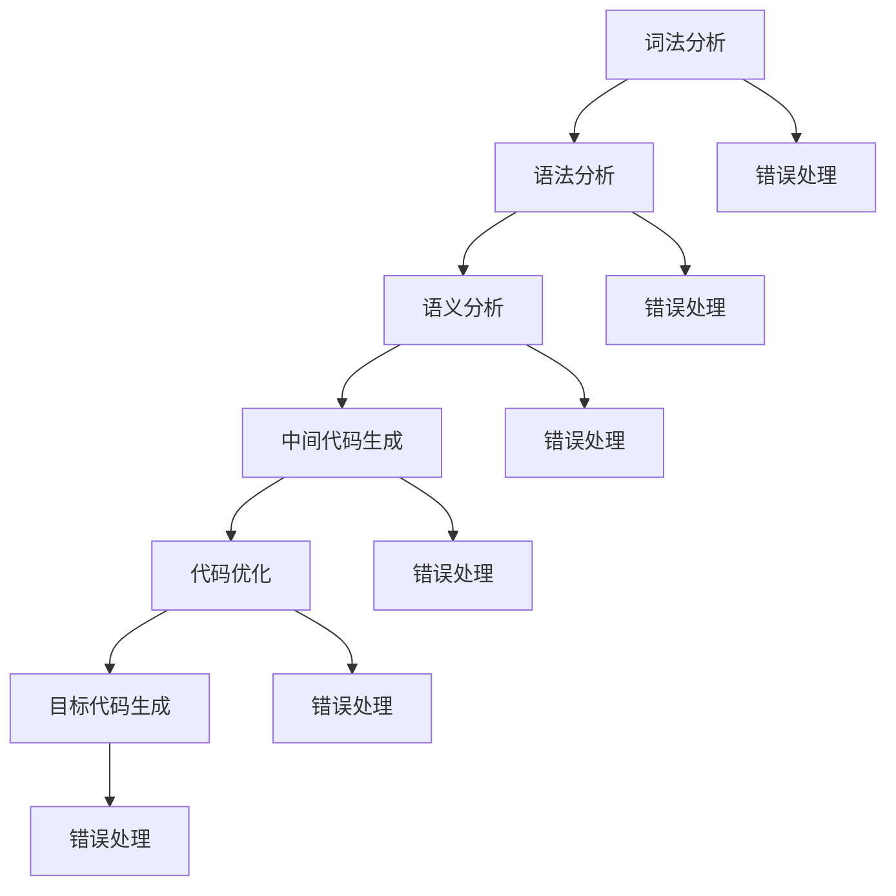

                 

### 编译原理与编译器设计

> **关键词：**编译原理、编译器设计、词法分析、语法分析、语义分析、中间代码生成、目标代码生成、编译器优化、实时系统、编译器发展趋势。

> **摘要：**本文深入探讨了编译原理与编译器设计这一计算机科学领域的核心主题。首先，从编译原理的基础概念入手，详细介绍了编译器的工作流程、词法分析、语法分析和语义分析。接着，讲述了中间代码生成和目标代码生成的技术要点及优化策略。随后，通过对编译器设计实践的探讨，涵盖了词法分析器、语法分析器、语义分析器和代码生成器的实现方法。此外，文章还介绍了编译器优化和性能评估的重要指标与方法，以及编译器在实时系统中的应用和未来发展趋势。通过本文，读者将全面了解编译原理与编译器设计的核心知识和实际应用。

## 第一部分：编译原理基础

### 第1章：编译原理概述

编译原理是计算机科学中研究如何将高级语言程序转换成机器语言程序的理论和方法。编译器是完成这一转换过程的软件工具。本节将介绍编译器的基本概念、分类以及工作流程。

#### 1.1 编译器的基本概念

编译器是一种将源代码（通常为高级语言）转换为目标代码（通常是机器语言）的软件工具。编译器的工作分为几个阶段，每个阶段处理不同的任务。这些阶段通常包括词法分析、语法分析、语义分析、中间代码生成、代码优化和目标代码生成。

在编译过程中，源代码被分为多个阶段进行处理，每个阶段都会生成一个新的输出。词法分析阶段将源代码分解为一系列的词法单元，例如标识符、关键字、运算符等。语法分析阶段则根据编程语言的语法规则，将这些词法单元组织成语法结构，例如语句、表达式等。语义分析阶段则检查源代码的语义正确性，例如类型检查、变量绑定等。在完成语义分析后，编译器会生成中间代码，这是一种抽象的表示形式，方便后续的代码优化和目标代码生成。最后，编译器将中间代码转换为目标代码，通常是机器语言或汇编语言。

#### 1.2 编译器的分类

编译器可以分为多种类型，根据其工作方式、处理语言以及目标代码的生成方式等不同特征进行分类。以下是一些常见的编译器类型：

- **解析器（Parser）**：解析器是一种将源代码转换为抽象语法树（AST）的编译器。它根据编程语言的语法规则，将词法分析器生成的词法单元组织成语法结构。

- **编译器（Compiler）**：编译器是一种将源代码直接转换为目标代码的编译器。它通常包含词法分析器、语法分析器、语义分析器、中间代码生成器、代码优化器和目标代码生成器等组件。

- **解释器（Interpreter）**：解释器是一种逐行执行源代码的编译器。它不会生成目标代码，而是直接执行源代码。解释器通常用于脚本语言和动态语言。

- **混合编译器（Hybrid Compiler）**：混合编译器结合了解释器和编译器的特点。它通常在编译阶段生成中间代码，然后在运行时解释执行中间代码。

- **静态编译器（Static Compiler）**：静态编译器在编译时对源代码进行完整分析，生成优化后的目标代码。静态编译器通常用于编译执行效率要求较高的系统。

- **动态编译器（Dynamic Compiler）**：动态编译器在运行时对源代码进行部分编译和优化。它通常用于需要动态加载和运行代码的应用程序。

#### 1.3 编译器的工作流程

编译器的工作流程可以分为以下几个主要阶段：

1. **词法分析（Lexical Analysis）**：
   词法分析器是编译器的第一个组件，它将源代码分解为一系列的词法单元。词法分析的过程可以看作是将字符串形式的源代码转换为词法符号流。词法分析器通常使用正则表达式来匹配词法规则。

2. **语法分析（Syntax Analysis）**：
   语法分析器是编译器的第二个组件，它根据编程语言的语法规则，将词法分析器生成的词法单元组织成语法结构。语法分析器通常使用递归下降、LL(k)、LR(k)等算法来构建抽象语法树（AST）。

3. **语义分析（Semantic Analysis）**：
   语义分析器是编译器的第三个组件，它检查源代码的语义正确性，例如类型检查、变量绑定、作用域分析等。语义分析器会生成语义属性，用于后续的中间代码生成和优化。

4. **中间代码生成（Intermediate Code Generation）**：
   中间代码生成器是编译器的第四个组件，它将抽象语法树（AST）转换为中间代码。中间代码通常是一种低级的、抽象的表示形式，方便后续的代码优化和目标代码生成。

5. **代码优化（Code Optimization）**：
   代码优化器是编译器的第五个组件，它对中间代码进行优化，以提高目标代码的性能。代码优化器可以使用各种优化技术，如常量折叠、死代码消除、循环优化等。

6. **目标代码生成（Target Code Generation）**：
   目标代码生成器是编译器的最后一个组件，它将优化后的中间代码转换为目标代码，通常是机器语言或汇编语言。目标代码生成器需要考虑目标机器的指令集和内存模型。

通过以上阶段，编译器将源代码转换为目标代码，从而实现程序的正确运行。接下来，我们将详细讨论编译原理的其他关键组成部分，包括词法分析、语法分析、语义分析等。

### 第2章：词法分析

词法分析是编译器处理源代码的第一个阶段，它的主要任务是将源代码分解为一系列的词法单元。词法分析器通过扫描源代码，识别出字符序列，并根据预定义的词法规则将其转换为词法符号。词法分析是编译过程的基础，它直接影响到后续的语法分析和语义分析。

#### 2.1 词法分析器的基本概念

词法分析器（Lexer）是编译器的核心组件之一，它负责将源代码中的字符序列转换为词法符号。词法分析器的工作可以看作是字符流的过滤和转换。词法分析器通常包含以下关键概念：

- **词法规则（Lexical Rules）**：词法规则定义了源代码中的字符序列如何转换为词法符号。这些规则通常使用正则表达式来表示。

- **词法状态（Lexical States）**：词法状态用于处理源代码中的不同部分。例如，在处理注释时，词法分析器可能会进入一个特殊的状态，忽略所有字符。

- **词法符号（Lexical Tokens）**：词法符号是词法分析器输出的基本单元，它们代表了源代码中的语法结构。常见的词法符号包括标识符、关键字、运算符、分隔符等。

- **标记（Token）**：标记是词法符号的实例，它包含了词法符号的名称和值。标记通常包含在编译器的内部数据结构中，用于后续的语法分析和语义分析。

- **错误处理（Error Handling）**：词法分析器需要处理源代码中的错误，例如非法字符、缺失的分隔符等。词法分析器的错误处理机制可以包括警告、错误消息和位置信息。

#### 2.2 词法分析器的实现方法

词法分析器的实现方法多种多样，以下是一些常见的实现方法：

- **手动编写词法规则**：这种方法通过手动编写词法规则来定义源代码中的字符序列。词法规则通常使用正则表达式来表示。手动编写词法规则适用于小型编译器或简单的编程语言。

- **词法规则生成器**：词法规则生成器是一种自动化工具，它可以根据预定义的词法规则生成词法分析器代码。常见的词法规则生成器包括`flex`和`lex`等。这种方法可以提高开发效率和代码可读性。

- **递归下降分析器**：递归下降分析器是一种基于状态的词法分析器，它通过递归函数来处理源代码中的字符序列。递归下降分析器适用于处理复杂的词法规则。

- **有限自动机（Finite Automaton）**：有限自动机是一种用于模式匹配的计算模型，它可以用来实现词法分析器。有限自动机通过状态转移来识别词法规则。

以下是一个简单的词法分析器实现的伪代码：

```python
# 伪代码：手动编写的词法分析器

def lexical_analysis(source_code):
    tokens = []
    position = 0
    while position < len(source_code):
        if is_keyword(source_code[position]):
            token = create_keyword_token(source_code[position])
        elif is_identifier(source_code[position]):
            token = create_identifier_token(source_code[position])
        elif is_operator(source_code[position]):
            token = create_operator_token(source_code[position])
        else:
            token = create_error_token(source_code[position])
        tokens.append(token)
        position += 1
    return tokens

def is_keyword(character):
    # 判断字符是否为关键字
    return character in ["if", "else", "while", "for"]

def is_identifier(character):
    # 判断字符是否为标识符
    return character.isalpha()

def is_operator(character):
    # 判断字符是否为运算符
    return character in ["+", "-", "*", "/"]

def create_keyword_token(keyword):
    # 创建关键字标记
    return {"type": "KEYWORD", "value": keyword}

def create_identifier_token(identifier):
    # 创建标识符标记
    return {"type": "IDENTIFIER", "value": identifier}

def create_operator_token(operator):
    # 创建运算符标记
    return {"type": "OPERATOR", "value": operator}

def create_error_token(character):
    # 创建错误标记
    return {"type": "ERROR", "value": character}
```

#### 2.3 词法分析器的应用

词法分析器在编译器中起着至关重要的作用，它为后续的语法分析和语义分析提供了基础数据。以下是一些词法分析器在编译器中的应用：

- **错误检测和报告**：词法分析器可以检测源代码中的语法错误，例如缺失的分隔符、非法字符等。它还可以提供错误位置和错误类型的信息，帮助开发人员定位和修复问题。

- **语法分析**：词法分析器生成的词法符号是语法分析的基础。语法分析器使用这些词法符号来构建抽象语法树（AST），以便进行语义分析。

- **优化**：词法分析器可以识别源代码中的重复模式和常量表达式，从而为后续的代码优化提供信息。例如，它可以将常量表达式计算为常量值，以便在中间代码生成和目标代码生成阶段进行优化。

- **源代码预处理**：词法分析器可以处理源代码中的预处理指令，例如宏定义、条件编译等。这些预处理指令在编译过程中需要被处理和替换。

- **代码生成**：词法分析器生成的词法符号直接影响了目标代码的生成。它需要将源代码中的语法结构转换为机器语言或汇编语言的指令。

总的来说，词法分析器是编译器的核心组件之一，它为编译过程提供了必要的基础数据和分析能力。通过词法分析，编译器可以更好地理解和处理源代码，为后续的语法分析和语义分析打下坚实的基础。

### 第3章：语法分析

语法分析是编译过程中的关键阶段，它的主要任务是检查源代码的语法结构是否正确，并根据编程语言的语法规则将词法符号组织成语法结构。语法分析通常由语法分析器（Parser）完成，它根据语法规则和算法对源代码进行分析，生成抽象语法树（Abstract Syntax Tree, AST）或其他语法结构表示。语法分析不仅确保源代码的语法正确性，还为后续的语义分析和代码生成提供了基础。

#### 3.1 语法分析的基本概念

语法分析（Syntax Analysis）是指将词法分析器生成的词法符号序列转换为语法结构的过程。语法分析的核心目标是构建一个抽象语法树（AST），AST表示源代码的结构和语法关系。以下是语法分析中的一些关键概念：

- **语法规则（Syntax Rules）**：语法规则是定义编程语言语法结构的规则集合。这些规则描述了源代码中的各种语法元素，如语句、表达式、函数、类等。语法规则通常使用产生式（Production）来表示。

- **抽象语法树（Abstract Syntax Tree, AST）**：抽象语法树是语法分析的结果，它表示源代码的结构。AST中的每个节点都代表源代码中的一个语法元素，如标识符、关键字、运算符等。AST是语义分析、中间代码生成和目标代码生成的基础。

- **语法分析器（Parser）**：语法分析器是编译器的组件，负责根据语法规则和算法对源代码进行语法分析。语法分析器有多种实现算法，如递归下降、LL(k)、LR(k)等。

- **语法错误（Syntax Errors）**：语法错误是指源代码中的语法结构不符合编程语言的语法规则。语法分析器在分析过程中会检测到这些错误，并报告错误信息。

- **语法树转换（Syntax Tree Transformation）**：在语法分析过程中，可能会对AST进行转换和优化。例如，将AST转换为更高效的中间表示形式，或进行语法糖（Syntactic Sugar）的处理。

#### 3.2 自顶向下语法分析

自顶向下（Top-Down）语法分析是一种从全局开始，逐步递归地构造抽象语法树的语法分析方法。自顶向下语法分析器从根节点开始，依次递归地调用产生式，直到生成完整的AST。以下是一些常见的自顶向下语法分析方法：

- **递归下降语法分析（Recursive Descent Parsing）**：递归下降语法分析是一种简单的自顶向下语法分析方法，它使用递归函数来匹配语法规则。每个递归函数表示一个语法规则，递归函数调用表示语法规则的应用。递归下降语法分析直观且易于实现，但可能存在递归栈溢出和左递归问题。

伪代码示例：

```python
def parse_expression(tokens):
    if is_additive_operator(tokens[0]):
        token = tokens.pop(0)
        left = parse_term(tokens)
        right = parse_expression(tokens)
        return ["expression", token, left, right]
    else:
        return parse_term(tokens)

def parse_term(tokens):
    if is_multiplicative_operator(tokens[0]):
        token = tokens.pop(0)
        left = parse_factor(tokens)
        right = parse_term(tokens)
        return ["term", token, left, right]
    else:
        return parse_factor(tokens)

def parse_factor(tokens):
    if is_number(tokens[0]):
        return ["factor", "number", tokens.pop(0)["value"]]
    elif is_identifier(tokens[0]):
        return ["factor", "identifier", tokens.pop(0)["value"]]
    else:
        raise SyntaxError("Unexpected token")
```

- **LL(k)分析法**：LL(k)分析法是一种自顶向下的分析方法，它使用向前查看k个符号来决定下一个产生式的应用。LL(k)分析器可以避免递归下降分析中的左递归问题，但可能需要回溯。

- **预测分析（Predictive Parsing）**：预测分析是一种LL(k)分析方法的实现，它通过预测下一个产生式来避免回溯。预测分析器使用状态表来决定下一个产生式的应用，状态表通常基于LL(k)分析算法生成。

#### 3.3 自底向上语法分析

自底向上（Bottom-Up）语法分析是一种从叶子节点开始，逐步构建抽象语法树的语法分析方法。自底向上语法分析器从源代码的底部开始，通过应用产生式的逆过程，反向构建AST。以下是一些常见的自底向上语法分析方法：

- **LR(k)分析法**：LR(k)分析法是一种自底向上的分析方法，它使用向前查看k个符号来决定下一个产生式的应用。LR(k)分析器可以处理左递归和二义性问题，但实现相对复杂。

伪代码示例：

```python
def reduce(tokens, stack):
    if stack[-1] == "expression":
        token = tokens.pop()
        stack.pop()
        if is_additive_operator(token):
            stack.append(token)
            stack.append(stack.pop())
            stack.append("expression")
        else:
            raise SyntaxError("Unexpected token")
    else:
        raise SyntaxError("Unexpected token")

def parse(tokens):
    stack = ["start"]
    while stack[-1] != "EOF":
        if is_number(tokens[0]) or is_identifier(tokens[0]):
            stack.append(["factor", "number", tokens.pop(0)["value"]])
        elif is_additive_operator(tokens[0]):
            reduce(tokens, stack)
        else:
            raise SyntaxError("Unexpected token")
    return stack
```

- **LR(k)分析表（Action Table and Goto Table）**：LR(k)分析法依赖于分析表，包括动作表（Action Table）和转移表（Goto Table）。动作表用于确定下一个操作（如移进、规约、接受或错误），转移表用于确定下一个状态。

- **规约（Reduction）**：在自底向上语法分析过程中，规约是将当前的分析栈中的符号序列替换为一个产生式的过程。规约基于语法规则的逆过程，将部分已识别的符号序列转换为AST节点。

通过自底向上语法分析，编译器可以有效地构建AST，并进行语义分析和代码生成。自顶向下语法分析和自底向上语法分析各有优缺点，选择哪种方法取决于具体的编程语言设计和编译器需求。

#### 3.4 语法分析的应用

语法分析在编译器中起着至关重要的作用，它不仅确保源代码的语法正确性，还为后续的语义分析和代码生成提供了基础。以下是一些语法分析在编译器中的应用：

- **语法错误检测**：语法分析器可以检测源代码中的语法错误，例如缺失的分隔符、意外的字符、不符合语法规则的语句等。通过报告错误信息和位置，语法分析器帮助开发人员快速定位和修复问题。

- **抽象语法树生成**：语法分析器的核心任务是生成抽象语法树（AST），AST表示源代码的结构和语义。AST是后续语义分析和代码生成的关键数据结构，它提供了对源代码的清晰表示。

- **语义分析**：语义分析依赖于AST来检查源代码的语义正确性，例如类型检查、作用域分析、变量绑定等。AST提供了源代码的结构信息，使得语义分析更加高效和准确。

- **代码生成**：语法分析器的输出AST是代码生成的基础。编译器根据AST生成中间代码或直接生成目标代码。AST的层次结构和节点信息有助于生成高效且正确的目标代码。

- **源代码预处理**：语法分析器可以处理源代码中的预处理指令，例如宏定义、条件编译等。预处理指令在编译过程中需要被分析和替换。语法分析器为预处理指令的执行提供了支持。

总的来说，语法分析是编译器中不可或缺的阶段，它通过分析源代码的语法结构，为后续的语义分析和代码生成提供了基础。语法分析器的实现方法多样，每种方法都有其优缺点，选择合适的语法分析方法对编译器的性能和可靠性至关重要。

### 第4章：语义分析

语义分析是编译过程中的重要阶段，它主要负责检查源代码的语义正确性，并确保源代码的含义得到正确解释。语义分析不仅涉及语法结构的正确性，还包括类型检查、作用域分析、变量绑定等复杂任务。通过语义分析，编译器可以确保源代码在语义上没有错误，从而生成正确的目标代码。

#### 4.1 语义分析的基本概念

语义分析（Semantic Analysis）是编译器在语法分析之后进行的阶段，其核心任务是对源代码的语义进行验证和解释。语义分析主要包括以下几个方面：

- **类型检查（Type Checking）**：类型检查是语义分析的核心任务之一，它确保源代码中的操作数具有正确的类型，并且遵循编程语言的类型规则。类型检查可以检测出诸如非法类型转换、不匹配的函数参数等错误。

- **作用域分析（Scope Analysis）**：作用域分析是确定变量和函数在源代码中的作用范围的过程。编译器需要跟踪变量和函数的声明和使用位置，确保在正确的范围内访问和使用变量。

- **变量绑定（Variable Binding）**：变量绑定是语义分析中的另一个关键任务，它将变量绑定到其对应的存储位置。变量绑定需要考虑变量的作用域、生命周期和初始化等。

- **符号表（Symbol Table）**：符号表是编译器用于存储和查询变量、函数、类等符号信息的数据结构。符号表用于实现作用域分析和变量绑定，是语义分析的基础。

- **语义错误（Semantic Errors）**：语义错误是指源代码在语义上不正确，但语法上没有错误的情况。常见的语义错误包括未声明的变量、不兼容的类型转换、未初始化的变量等。

#### 4.2 类型检查

类型检查是语义分析的核心任务之一，它确保源代码中的所有操作数都具有正确的类型，并且遵循编程语言的类型规则。类型检查通常包括以下步骤：

- **静态类型检查（Static Type Checking）**：静态类型检查是在编译时进行的类型检查，它检查源代码中的所有类型错误，并在编译过程中报告错误。静态类型检查可以及早发现类型错误，提高程序的可靠性。

- **动态类型检查（Dynamic Type Checking）**：动态类型检查是在程序运行时进行的类型检查，它允许程序在运行时进行类型转换。动态类型检查通常用于动态类型语言，如Python和JavaScript。

- **类型兼容性（Type Compatibility）**：类型兼容性是指不同类型之间的合法转换。编译器需要确保源代码中的类型转换是安全的，不会导致数据丢失或程序错误。

- **类型推断（Type Inference）**：类型推断是编译器自动确定变量或表达式的类型的过程。类型推断可以提高程序的可读性和编译器的性能，但需要权衡类型安全性和性能。

以下是一个简单的类型检查实现的伪代码：

```python
def type_check(expression, symbol_table):
    if is_constant(expression):
        return get_type_of_constant(expression)
    elif is_variable(expression):
        variable = symbol_table.get_variable(expression)
        if variable is None:
            raise SemanticError("Undefined variable")
        return variable.type
    elif is_expression(expression):
        left_type = type_check(expression.left, symbol_table)
        right_type = type_check(expression.right, symbol_table)
        if not is_type_compatible(left_type, right_type):
            raise SemanticError("Type mismatch")
        return get_common_type(left_type, right_type)

def is_constant(expression):
    # 判断表达式是否为常量
    return isinstance(expression, Constant)

def get_type_of_constant(constant):
    # 获取常量的类型
    return constant.type

def is_variable(expression):
    # 判断表达式是否为变量
    return isinstance(expression, Variable)

def get_variable_type(variable):
    # 获取变量的类型
    return variable.type

def is_expression(expression):
    # 判断表达式是否为复合表达式
    return isinstance(expression, Expression)

def is_type_compatible(type1, type2):
    # 判断两个类型是否兼容
    return type1 == type2 or type1.is_subtype_of(type2)

def get_common_type(type1, type2):
    # 获取两个类型的公共类型
    if type1.is_subtype_of(type2):
        return type2
    if type2.is_subtype_of(type1):
        return type1
    raise SemanticError("Type mismatch")
```

#### 4.3 变量绑定

变量绑定是语义分析中的另一个关键任务，它确保变量在正确的范围内被访问和使用。变量绑定通常涉及以下步骤：

- **静态绑定（Static Binding）**：静态绑定是在编译时确定的变量绑定，它通常基于作用域分析和变量声明。静态绑定确保变量在声明时就已经绑定到其对应的作用域。

- **动态绑定（Dynamic Binding）**：动态绑定是在程序运行时确定的变量绑定，它通常基于运行时的作用域和上下文。动态绑定适用于动态类型语言和函数式编程语言。

- **作用域规则（Scope Rules）**：作用域规则定义了变量在程序中的作用范围和访问规则。常见的规则包括局部作用域、全局作用域、类作用域等。

- **作用域查找（Scope Lookup）**：作用域查找是编译器根据作用域规则在符号表中查找变量声明和绑定的过程。作用域查找需要考虑变量的声明顺序和作用域嵌套。

以下是一个简单的变量绑定实现的伪代码：

```python
class Variable:
    def __init__(self, name, type):
        self.name = name
        self.type = type

def bind_variable(name, type, symbol_table):
    variable = Variable(name, type)
    symbol_table.add_variable(variable)
    return variable

def lookup_variable(name, symbol_table):
    variable = symbol_table.get_variable(name)
    if variable is None:
        raise SemanticError("Undefined variable")
    return variable

class SymbolTable:
    def __init__(self):
        self.variables = {}

    def add_variable(self, variable):
        self.variables[variable.name] = variable

    def get_variable(self, name):
        return self.variables.get(name)
```

#### 4.4 语义分析的应用

语义分析在编译器中扮演着至关重要的角色，它确保源代码不仅在语法上是正确的，而且在语义上也是合理的。以下是一些语义分析在编译器中的应用：

- **错误检测和报告**：语义分析可以检测源代码中的语义错误，例如未声明的变量、不兼容的类型转换、作用域冲突等。编译器通过报告详细的错误信息和位置，帮助开发人员快速定位和修复问题。

- **中间代码生成**：语义分析的结果直接影响中间代码的生成。语义分析为中间代码生成提供了类型信息、作用域信息和变量绑定信息，从而生成正确的中间表示。

- **代码优化**：语义分析可以提供源代码的语义信息，用于后续的代码优化。例如，类型信息和作用域分析可以用于消除冗余代码、优化数据访问等。

- **生成目标代码**：语义分析的结果用于生成目标代码的符号表和类型信息，从而生成高效且正确的目标代码。

- **源代码预处理**：语义分析可以处理源代码中的预处理指令，例如宏定义、条件编译等。预处理指令在编译过程中需要被分析和替换。语义分析为预处理指令的执行提供了支持。

总的来说，语义分析是编译器中不可或缺的阶段，它通过检查源代码的语义正确性，为后续的代码生成和优化提供了基础。语义分析器的实现需要考虑类型检查、作用域分析和变量绑定等多个方面，以确保编译器能够生成正确的目标代码。

### 第5章：中间代码生成

中间代码生成是编译器的重要阶段，它将抽象语法树（AST）转换为一种中间表示形式，这种中间表示形式在语法上接近机器语言，但仍然具有足够的高层语义信息，便于后续的代码优化和目标代码生成。中间代码生成不仅提高了编译器的灵活性和可维护性，还使优化和目标代码生成过程更加高效。

#### 5.1 中间代码的基本概念

中间代码（Intermediate Code）是编译器在源代码和目标代码之间生成的一种抽象表示形式。它保留了源代码的语义信息，但以一种低级、结构化的方式表达。中间代码通常采用三元组（Quadruples）或四元组（Quadruples）来表示指令，这些指令包括操作数、操作符和结果。

- **三元组（Triple）**：三元组是一种简单的表示形式，它包含三个部分：（操作符，操作数1，操作数2）。例如：（加，x，y）表示计算x和y的和。

- **四元组（Quadruple）**：四元组在三元组的基础上增加了一个结果部分，通常表示为：（操作符，操作数1，操作数2，结果）。例如：（加，x，y，z）表示计算x和y的和，并将结果存储在变量z中。

以下是一个简单的中间代码生成的伪代码示例：

```python
def generate_intermediate_code(ast):
    intermediate_code = []
    if is_binary_expression(ast):
        left = generate_intermediate_code(ast.left)
        right = generate_intermediate_code(ast.right)
        result = generate_temporary_variable()
        intermediate_code.append(("加", left, right, result))
    return intermediate_code

def generate_temporary_variable():
    # 生成临时变量的名称
    return f"t{len(temporary_variables)}"

temporary_variables = []
```

#### 5.2 中间代码的优化

中间代码优化是编译器的重要任务，它通过改进中间代码的执行效率来提高目标代码的性能。中间代码优化可以包括以下几种常见的优化技术：

- **常量折叠（Constant Folding）**：常量折叠是在编译时计算表达式的常量值，并将其替换为计算结果。例如，表达式`3 + 4`在编译时可以计算为常量值`7`。

- **死代码消除（Dead Code Elimination）**：死代码消除是删除程序中不会被执行的代码。例如，如果一个变量在程序中没有使用，那么与其相关的赋值语句可以被删除。

- **循环优化（Loop Optimization）**：循环优化包括优化循环结构，例如减少循环迭代次数、优化循环体内的计算等。常见的循环优化技术包括循环展开、循环不变式提取和循环优化。

- **函数内联（Function Inlining）**：函数内联是将函数调用替换为函数体，以减少函数调用的开销。函数内联可以提高性能，但可能会增加代码的大小。

- **数据流分析（Data Flow Analysis）**：数据流分析是一种用于优化程序的方法，它通过分析程序的变量和数据的流动情况来识别可优化点。数据流分析可以用于优化程序的结构和执行顺序。

以下是一个简单的中间代码优化的伪代码示例：

```python
def optimize_intermediate_code(intermediate_code):
    for i in range(len(intermediate_code) - 1):
        if is_constant_expression(intermediate_code[i]):
            value = evaluate_constant_expression(intermediate_code[i])
            intermediate_code[i] = ("赋值", intermediate_code[i].result, value)
        elif is_dead_code(intermediate_code[i]):
            intermediate_code.pop(i)
    return intermediate_code

def is_constant_expression(node):
    # 判断节点是否为常量表达式
    return isinstance(node, ConstantExpression)

def evaluate_constant_expression(node):
    # 计算常量表达式的值
    return node.value

def is_dead_code(node):
    # 判断节点是否为死代码
    return node not in used_nodes
```

#### 5.3 中间代码的生成策略

生成中间代码的策略取决于编译器的设计和目标语言的特性。以下是一些常见的中间代码生成策略：

- **静态单赋值（Static Single Assignment, SSA）**：静态单赋值是一种中间代码生成策略，它确保每个变量在每个基本块中只被赋值一次。SSA有助于后续的代码优化，例如消除冗余的赋值语句和循环优化。

- **控制流图（Control Flow Graph, CFG）**：控制流图是一种用于表示程序控制流的图形表示形式。编译器可以使用控制流图来生成中间代码，并基于控制流图进行优化。

- **抽象语法树（Abstract Syntax Tree, AST）**：编译器可以直接从抽象语法树生成中间代码。这种方法通常涉及对AST进行遍历和转换，生成对应的三元组或四元组指令。

- **三次扫描法**：三次扫描法是一种中间代码生成策略，它包括三个阶段：词法分析、语法分析和中间代码生成。在每个阶段，编译器生成相应的中间表示形式，最终合并为一个完整的中间代码。

以下是一个简单的中间代码生成策略的伪代码示例：

```python
def generate_intermediate_code(source_code):
    # 词法分析
    tokens = lexical_analysis(source_code)
    # 语法分析
    ast = syntax_analysis(tokens)
    # 中间代码生成
    intermediate_code = generate_intermediate_code_from_ast(ast)
    # 代码优化
    optimized_code = optimize_intermediate_code(intermediate_code)
    return optimized_code

def lexical_analysis(source_code):
    # 实现词法分析
    pass

def syntax_analysis(tokens):
    # 实现语法分析
    pass

def generate_intermediate_code_from_ast(ast):
    # 实现中间代码生成
    pass

def optimize_intermediate_code(intermediate_code):
    # 实现中间代码优化
    pass
```

总的来说，中间代码生成是编译器中的一个重要阶段，它通过将抽象语法树转换为低级、结构化的中间表示形式，为后续的代码优化和目标代码生成提供了基础。生成中间代码的策略和优化技术对于编译器的性能和可靠性至关重要。

### 第6章：目标代码生成

目标代码生成是编译器的最后一个阶段，它将中间代码转换为特定目标机器的可执行代码。目标代码生成不仅需要考虑目标机器的指令集和内存模型，还需要进行优化以提高执行效率。这一阶段是编译器实现的核心部分，直接影响到程序的性能和资源利用率。

#### 6.1 目标代码的基本概念

目标代码（Target Code）是指编译器生成的特定目标机器的可执行代码。目标代码可以是机器语言、汇编语言或某种中间形式，它需要在目标机器上运行。目标代码生成的主要任务包括以下方面：

- **指令选择（Instruction Selection）**：指令选择是将中间代码中的操作转换为特定目标机器的指令。指令选择需要考虑目标机器的指令集和指令格式，以确保生成的目标代码能够正确执行。

- **寄存器分配（Register Allocation）**：寄存器分配是将中间代码中的变量和操作符映射到目标机器的寄存器。寄存器分配的目标是减少内存访问，提高程序的性能。

- **代码布局（Code Layout）**：代码布局是将目标代码中的指令和变量在内存中布局，以优化内存访问和程序执行。

- **目标代码优化（Target Code Optimization）**：目标代码优化是对生成的目标代码进行进一步优化，以提高执行效率。常见的优化技术包括指令调度、循环展开、代码压缩等。

以下是一个简单的目标代码生成的伪代码示例：

```python
def generate_target_code(intermediate_code, target_machine):
    target_code = []
    for instruction in intermediate_code:
        if instruction.op == "赋值":
            target_code.append(generate_assignment_instruction(instruction))
        elif instruction.op == "加法":
            target_code.append(generate_add_instruction(target_machine, instruction))
        # 其他指令生成
    return target_code

def generate_assignment_instruction(instruction):
    # 生成赋值指令
    return f"{instruction.result} = {instruction.operands[0]}"

def generate_add_instruction(target_machine, instruction):
    # 生成加法指令
    if target_machine.is_immediate(instruction.operands[1]):
        return f"{instruction.result} = {instruction.operands[1]}"
    else:
        return f"{instruction.result} = {instruction.operands[1]} + {instruction.operands[2]}"
```

#### 6.2 目标代码的优化

目标代码优化是编译器性能提升的关键因素。优化目标代码可以提高程序的执行效率，减少内存占用，提高资源利用率。以下是一些常见的目标代码优化技术：

- **指令调度（Instruction Scheduling）**：指令调度是重排目标代码中的指令顺序，以减少数据依赖和指令冲突，提高指令流水线的效率。

- **循环展开（Loop Unrolling）**：循环展开是将循环体中的指令复制多次，以减少循环的开销和指令跳转。

- **代码压缩（Code Compression）**：代码压缩是减少目标代码的大小，以节省内存空间和提高存储器访问效率。

- **内存访问优化（Memory Access Optimization）**：内存访问优化包括优化数据布局和缓存策略，以减少内存访问延迟和带宽占用。

以下是一个简单的目标代码优化的伪代码示例：

```python
def optimize_target_code(target_code):
    for i in range(len(target_code) - 1):
        if is依赖(target_code[i], target_code[i+1]):
            target_code.insert(i+1, "空指令")
        elif is循环(target_code[i]):
            target_code[i] = loop_unrolling(target_code[i])
    return target_code

def is依赖(instruction1, instruction2):
    # 判断指令1和指令2之间是否存在数据依赖
    return instruction1.op == "赋值" and instruction2.op == "使用" and instruction1.operands[0] == instruction2.operands[0]

def loop_unrolling(loop):
    # 循环展开
    unrolled_loop = []
    for i in range(loop.iterations):
        unrolled_loop.append(f"{loop.body}")
    return unrolled_loop
```

#### 6.3 目标代码的生成策略

目标代码生成策略取决于编译器的设计和目标机器的特性。以下是一些常见的目标代码生成策略：

- **基于栈的代码生成（Stack-Based Code Generation）**：基于栈的代码生成策略使用栈来管理寄存器和变量，适用于资源受限的嵌入式系统。

- **基于寄存器的代码生成（Register-Based Code Generation）**：基于寄存器的代码生成策略使用寄存器来管理变量和操作，适用于性能要求较高的系统。

- **混合代码生成策略**：混合代码生成策略结合了基于栈和基于寄存器的优点，适用于多种目标机器和编程语言。

以下是一个简单的目标代码生成策略的伪代码示例：

```python
def generate_target_code(intermediate_code, target_machine):
    if target_machine.is_stack_based():
        return generate_stack_based_code(intermediate_code)
    elif target_machine.is_register_based():
        return generate_register_based_code(intermediate_code)
    else:
        return generate_hybrid_code(intermediate_code)

def generate_stack_based_code(intermediate_code):
    # 实现基于栈的代码生成
    pass

def generate_register_based_code(intermediate_code):
    # 实现基于寄存器的代码生成
    pass

def generate_hybrid_code(intermediate_code):
    # 实现混合代码生成
    pass
```

总的来说，目标代码生成是编译器的关键阶段，它通过将中间代码转换为特定目标机器的可执行代码，实现了源代码到目标代码的转换。目标代码生成策略和优化技术对于编译器的性能和可靠性至关重要，直接影响到程序的性能和资源利用率。

### 第7章：编译器设计概述

编译器设计是一个复杂的过程，它涉及多个阶段的任务和组件。编译器设计不仅需要考虑算法和数据的组织，还需要关注性能、可维护性和可扩展性。本章将概述编译器设计的整体步骤和架构，为后续章节的具体实现提供指导。

#### 7.1 编译器设计的步骤

编译器设计通常分为以下几个主要步骤：

1. **需求分析（Requirement Analysis）**：
   需求分析是编译器设计的起点，它确定编译器所需的功能和性能要求。需求分析包括确定目标语言、编译器类型（例如，解释器或编译器）、性能目标（例如，编译时间或执行效率）和系统约束（例如，内存限制或硬件平台）。

2. **语法和语义定义（Syntax and Semantics Definition）**：
   在需求分析的基础上，定义编程语言的语法和语义。语法定义通常包括语法规则和关键字，使用产生式或BNF（巴科斯-诺尔形式）来表示。语义定义则描述了源代码的含义和执行行为，包括类型系统、作用域规则和声明语义。

3. **设计编译器架构（Compiler Architecture Design）**：
   编译器架构设计是确定编译器的结构和组件。常见的编译器架构包括自顶向下（Top-Down）和自底向上（Bottom-Up）语法分析器、静态单赋值（SSA）中间表示、基于栈或基于寄存器的代码生成器等。

4. **实现词法分析器（Lexer Implementation）**：
   词法分析器是将源代码分解为词法符号的组件。实现词法分析器通常涉及编写正则表达式和状态转换逻辑，使用工具如`lex`或`flex`来生成词法分析器的代码。

5. **实现语法分析器（Parser Implementation）**：
   语法分析器是构建抽象语法树（AST）的组件。实现语法分析器通常涉及选择合适的算法（如递归下降、LL(k)、LR(k)等）和编写算法的实现代码。

6. **实现语义分析器（Semantic Analyzer Implementation）**：
   语义分析器是检查源代码语义正确性的组件。实现语义分析器涉及类型检查、作用域分析、变量绑定和符号表管理。

7. **实现中间代码生成器（Intermediate Code Generator）**：
   中间代码生成器是将AST转换为中间代码的组件。实现中间代码生成器通常涉及编写AST遍历逻辑和生成中间代码的指令。

8. **实现代码优化器（Code Optimizer Implementation）**：
   代码优化器是改进中间代码性能的组件。实现代码优化器通常涉及选择和实现优化算法（如常量折叠、死代码消除、循环优化等）。

9. **实现目标代码生成器（Target Code Generator）**：
   目标代码生成器是将中间代码转换为特定目标机器的可执行代码的组件。实现目标代码生成器涉及指令选择、寄存器分配、代码布局和目标代码优化。

10. **测试和调试（Testing and Debugging）**：
    测试和调试是编译器设计的重要环节，确保编译器的正确性和性能。测试包括单元测试、集成测试和性能测试。调试则涉及错误定位和修复。

#### 7.2 编译器的架构

编译器的架构通常包括以下主要组件：

- **词法分析器（Lexer）**：
  词法分析器是编译器的第一个组件，负责将源代码分解为词法符号。它通常使用正则表达式来定义词法规则，并生成词法符号流。

- **语法分析器（Parser）**：
  语法分析器是编译器的第二个组件，负责将词法符号流组织成抽象语法树（AST）。它根据语法规则和算法（如递归下降、LL(k)、LR(k)等）构建AST。

- **语义分析器（Semantic Analyzer）**：
  语义分析器是编译器的第三个组件，负责检查源代码的语义正确性。它包括类型检查、作用域分析和变量绑定等任务。

- **中间代码生成器（Intermediate Code Generator）**：
  中间代码生成器是编译器的第四个组件，负责将AST转换为中间代码。中间代码通常是一种低级、抽象的表示形式，便于后续的优化和目标代码生成。

- **代码优化器（Code Optimizer）**：
  代码优化器是编译器的第五个组件，负责对中间代码进行优化，提高目标代码的性能。它包括各种优化算法，如常量折叠、死代码消除、循环优化等。

- **目标代码生成器（Target Code Generator）**：
  目标代码生成器是编译器的最后一个组件，负责将优化后的中间代码转换为特定目标机器的可执行代码。它涉及指令选择、寄存器分配、代码布局和目标代码优化。

- **符号表（Symbol Table）**：
  符号表是编译器中的核心数据结构，用于存储和查询变量、函数、类等符号信息。符号表在语法分析、语义分析和代码生成等阶段都起到关键作用。

以下是一个简单的编译器架构的Mermaid流程图：



通过以上架构，编译器可以有效地将源代码转换为目标代码，实现编程语言的编译过程。每个组件都在编译过程中扮演着重要角色，共同确保编译器的正确性和性能。接下来，我们将详细介绍编译器设计的具体实现方法。

### 第8章：词法分析器的设计与实现

词法分析器是编译器的核心组件之一，它负责将源代码分解为一系列的词法符号。词法分析器的设计与实现是编译器开发中的基础步骤，对于整个编译过程的影响至关重要。在本节中，我们将详细探讨词法分析器的设计原则、实现方法和相关的技巧。

#### 8.1 词法分析器的需求分析

在设计和实现词法分析器之前，我们需要进行需求分析，明确词法分析器需要完成哪些任务和功能。以下是一些常见的需求分析要点：

- **词法规则**：词法分析器需要识别出源代码中的关键字、标识符、运算符、分隔符等词法符号。定义这些词法规则是词法分析器设计的第一步。词法规则通常使用正则表达式来表示。

- **错误处理**：词法分析器需要能够处理源代码中的错误，如非法字符、缺失的分隔符等。错误处理包括报告错误信息、定位错误位置和可能的恢复策略。

- **缓冲区管理**：词法分析器需要管理输入源代码的缓冲区，以便正确地识别词法符号。缓冲区管理包括读取、缓存和清理源代码。

- **性能要求**：词法分析器的设计需要考虑性能要求，例如处理速度、内存占用等。性能优化是编译器设计的一个重要方面。

- **可扩展性**：词法分析器的设计需要考虑未来可能的功能扩展，如支持新的关键字或运算符等。

#### 8.2 词法分析器的实现

词法分析器的实现通常包括以下几个主要步骤：

1. **定义词法规则**：首先，我们需要定义源代码中的词法规则。词法规则通常使用正则表达式来表示。以下是一些常见的词法规则示例：

   ```python
   keyword = 'if|else|while|for'
   identifier = '[a-zA-Z][a-zA-Z0-9_]*'
   operator = '+|-|*|/|==|!=|='
   separator = '[\s]+'
   comment = '#.*'
   ```

2. **创建词法分析器状态机**：词法分析器通常使用状态机来识别词法符号。状态机根据当前状态和下一个字符，转移到下一个状态，并识别出相应的词法符号。以下是一个简单的状态机实现示例：

   ```python
   def lexer(source_code):
       state = 'INIT'
       position = 0
       tokens = []

       while position < len(source_code):
           if state == 'INIT':
               if match(source_code, position, comment):
                   position += len(match)
                   continue
               elif match(source_code, position, separator):
                   position += len(match)
                   continue
               elif match(source_code, position, operator):
                   tokens.append(Token('OPERATOR', match))
                   position += len(match)
                   continue
               elif match(source_code, position, identifier):
                   tokens.append(Token('IDENTIFIER', match))
                   position += len(match)
                   continue
               elif match(source_code, position, keyword):
                   tokens.append(Token('KEYWORD', match))
                   position += len(match)
                   continue
               else:
                   raise SyntaxError(f"Unexpected character {source_code[position]} at position {position}")
                   position += 1

           # 其他状态处理...

       return tokens

   def match(source_code, position, pattern):
       # 检查当前字符序列是否匹配给定的正则表达式
       return re.match(pattern, source_code[position:])

   def Token(type, value):
       return {'type': type, 'value': value}
   ```

3. **实现错误处理**：词法分析器需要能够处理源代码中的错误。常见的错误处理方法包括报告错误信息、定位错误位置和可能的恢复策略。以下是一个简单的错误处理示例：

   ```python
   def report_error(message, position):
       print(f"Error: {message} at position {position}")

   def recover_from_error():
       # 从错误中恢复
       pass
   ```

4. **缓冲区管理**：词法分析器需要管理输入源代码的缓冲区，以便正确地识别词法符号。缓冲区管理包括读取、缓存和清理源代码。以下是一个简单的缓冲区管理示例：

   ```python
   def get_char():
       # 获取下一个字符
       return source_code[position]

   def advance():
       # 前进一个字符
       position += 1

   def retract():
       # 后退一个字符
       position -= 1
   ```

#### 8.3 实现技巧和注意事项

在实现词法分析器时，以下是一些技巧和注意事项：

- **最小化状态转换**：尽量减少状态转换的复杂性，以简化词法分析器的实现和维护。

- **使用有限状态机（FSM）**：有限状态机是一种高效的状态转换模型，适用于词法分析器的设计。

- **缓冲区大小**：根据源代码的大小和性能要求，合理设置缓冲区大小。

- **错误处理策略**：设计有效的错误处理策略，包括错误报告和恢复。

- **可扩展性**：考虑词法分析器未来可能的功能扩展，如支持新的关键字或运算符。

通过以上步骤和技巧，我们可以设计和实现一个高效、可靠的词法分析器。词法分析器的正确实现是编译器开发中的关键一步，它为后续的语法分析和语义分析提供了基础。

### 第9章：语法分析器的设计与实现

语法分析器是编译器的核心组件之一，负责将词法分析器生成的词法符号组织成抽象语法树（AST）。语法分析器的任务是将源代码的词法符号流转换为语义上正确的语法结构，从而为后续的语义分析和代码生成提供基础。在本节中，我们将详细探讨语法分析器的设计原则、实现方法和相关的技巧。

#### 9.1 语法分析器的需求分析

在设计语法分析器之前，我们需要明确其需求和功能。以下是一些常见的需求分析要点：

- **语法规则**：语法分析器需要遵循编程语言的语法规则，将词法符号流组织成语法结构。语法规则通常使用产生式（Production）或BNF（巴科斯-诺尔形式）来表示。

- **语法分析方法**：语法分析器可以使用多种分析方法，如递归下降、LL(k)、LR(k)等。选择合适的分析方法对语法分析器的性能和可维护性有重要影响。

- **错误处理**：语法分析器需要能够处理源代码中的错误，如非法词法符号、不符合语法规则的语句等。错误处理包括报告错误信息、定位错误位置和可能的恢复策略。

- **性能要求**：语法分析器的设计需要考虑性能要求，例如处理速度、内存占用等。

- **可扩展性**：语法分析器的设计需要考虑未来可能的功能扩展，如支持新的语法特性或编程语言。

#### 9.2 语法分析器的实现

语法分析器的实现通常包括以下几个主要步骤：

1. **定义语法规则**：首先，我们需要定义编程语言的语法规则。语法规则描述了源代码中各种语法元素的结构和组合。以下是一个简单的语法规则示例，使用BNF表示：

   ```python
   program ::= { statement }
   statement ::= assignment | if_statement | while_statement
   assignment ::= variable = expression
   expression ::= term { ('+' | '-') term }
   term ::= factor { ('*' | '/') factor }
   factor ::= number | variable | '(' expression ')'
   if_statement ::= 'if' '(' expression ')' statement ('else' statement)?
   while_statement ::= 'while' '(' expression ')' statement
   variable ::= identifier
   number ::= [0-9]+
   identifier ::= [a-zA-Z][a-zA-Z0-9_]+
   ```

2. **选择语法分析方法**：根据需求分析，选择适合的语法分析方法。递归下降、LL(k)和LR(k)是常见的语法分析方法。递归下降方法简单直观，但可能存在递归深度问题；LL(k)方法易于实现，但可能需要回溯；LR(k)方法可以处理二义性，但实现复杂。

3. **构建语法分析器**：根据选择的语法分析方法，构建语法分析器。以下是一个简单的递归下降语法分析器的实现示例：

   ```python
   def parse_program(tokens):
       return parse_statement_list(tokens)

   def parse_statement_list(tokens):
       statements = []
       while tokens:
           statements.append(parse_statement(tokens))
       return statements

   def parse_statement(tokens):
       if match(tokens, 'assignment'):
           return parse_assignment(tokens)
       elif match(tokens, 'if_statement'):
           return parse_if_statement(tokens)
       elif match(tokens, 'while_statement'):
           return parse_while_statement(tokens)
       else:
           raise SyntaxError("Unexpected token")

   def parse_assignment(tokens):
       match(tokens, 'variable')
       match(tokens, '=')
       return {'type': 'assignment', 'variable': tokens[0], 'expression': parse_expression(tokens)}

   def parse_if_statement(tokens):
       match(tokens, 'if')
       match(tokens, '(')
       condition = parse_expression(tokens)
       match(tokens, ')')
       then_block = parse_statement(tokens)
       else_block = None
       if match(tokens, 'else'):
           else_block = parse_statement(tokens)
       return {'type': 'if_statement', 'condition': condition, 'then_block': then_block, 'else_block': else_block}

   def parse_while_statement(tokens):
       match(tokens, 'while')
       match(tokens, '(')
       condition = parse_expression(tokens)
       match(tokens, ')')
       return {'type': 'while_statement', 'condition': condition, 'body': parse_statement(tokens)}

   def parse_expression(tokens):
       # 处理表达式
       pass

   def parse_term(tokens):
       # 处理项
       pass

   def parse_factor(tokens):
       # 处理因子
       pass

   def match(tokens, token_type):
       if tokens and tokens[0].type == token_type:
           return tokens.pop(0)
       else:
           raise SyntaxError(f"Expected {token_type}")
   ```

4. **实现错误处理**：语法分析器需要能够处理源代码中的错误。错误处理包括报告错误信息、定位错误位置和可能的恢复策略。以下是一个简单的错误处理示例：

   ```python
   def report_error(message, position):
       print(f"Error: {message} at position {position}")

   def recover_from_error():
       # 从错误中恢复
       pass
   ```

5. **构建抽象语法树（AST）**：语法分析器的核心任务是构建抽象语法树（AST）。AST表示源代码的结构和语义信息。以下是一个简单的AST构建示例：

   ```python
   def build_ast(node):
       if node.type == 'assignment':
           return AssignmentNode(node.variable, node.expression)
       elif node.type == 'if_statement':
           return IfNode(node.condition, node.then_block, node.else_block)
       elif node.type == 'while_statement':
           return WhileNode(node.condition, node.body)
       else:
           raise ValueError(f"Unknown node type {node.type}")

   class AssignmentNode:
       def __init__(self, variable, expression):
           self.variable = variable
           self.expression = expression

   class IfNode:
       def __init__(self, condition, then_block, else_block):
           self.condition = condition
           self.then_block = then_block
           self.else_block = else_block

   class WhileNode:
       def __init__(self, condition, body):
           self.condition = condition
           self.body = body
   ```

#### 9.3 实现技巧和注意事项

在实现语法分析器时，以下是一些技巧和注意事项：

- **最小化递归深度**：递归下降语法分析器可能存在递归深度问题。通过优化语法规则和递归调用，可以减少递归深度。

- **使用有限状态机（FSM）**：有限状态机是一种高效的状态转换模型，适用于实现复杂的语法分析器。

- **优化内存使用**：语法分析器需要处理大量的数据结构。优化内存使用可以提高性能和可维护性。

- **错误处理策略**：设计有效的错误处理策略，包括错误报告和恢复。

- **可扩展性**：考虑语法分析器未来可能的功能扩展，如支持新的语法特性或编程语言。

通过以上步骤和技巧，我们可以设计和实现一个高效、可靠的语法分析器。语法分析器的正确实现是编译器开发中的关键一步，它为后续的语义分析和代码生成提供了基础。

### 第10章：语义分析器的实现

语义分析器是编译器的核心组件之一，负责检查源代码的语义正确性，并确保源代码的含义得到正确解释。语义分析器的工作主要包括类型检查、作用域分析和变量绑定等任务。在本节中，我们将详细探讨语义分析器的需求分析、实现方法和相关的技巧。

#### 10.1 语义分析器的需求分析

在设计语义分析器之前，我们需要明确其需求和功能。以下是一些常见的需求分析要点：

- **类型检查**：语义分析器需要检查源代码中的操作数是否具有正确的类型，并确保类型转换是安全的。

- **作用域分析**：语义分析器需要确定变量和函数在源代码中的作用范围，确保在正确的范围内访问和使用变量。

- **变量绑定**：语义分析器需要将变量绑定到其对应的存储位置，并跟踪变量的声明和引用。

- **符号表管理**：语义分析器需要使用符号表来存储和查询变量、函数和类等信息。

- **错误处理**：语义分析器需要能够处理源代码中的语义错误，如未声明的变量、不兼容的类型转换等。

- **性能要求**：语义分析器的设计需要考虑性能要求，例如分析时间、内存占用等。

- **可扩展性**：语义分析器的设计需要考虑未来可能的功能扩展，如支持新的编程语言特性。

#### 10.2 语义分析器的实现

语义分析器的实现通常包括以下几个主要步骤：

1. **定义类型系统**：首先，我们需要定义编程语言的类型系统，包括基本类型、复合类型和类型转换规则。

2. **构建符号表**：符号表是语义分析器的核心数据结构，用于存储和查询变量、函数和类等信息。符号表通常包含变量名、类型、作用域和绑定信息。

3. **实现类型检查**：语义分析器需要实现类型检查，确保源代码中的操作数具有正确的类型。类型检查通常包括类型兼容性检查、类型推断和类型转换。

4. **实现作用域分析**：作用域分析是确定变量和函数的作用范围的过程。语义分析器需要跟踪变量的声明和引用，并确保在正确的范围内访问和使用变量。

5. **实现变量绑定**：语义分析器需要将变量绑定到其对应的存储位置，并确保变量在声明和使用之间的一致性。

6. **错误处理**：语义分析器需要能够处理源代码中的语义错误，如未声明的变量、不兼容的类型转换等。错误处理包括报告错误信息、定位错误位置和可能的恢复策略。

以下是一个简单的语义分析器的实现示例：

```python
class SymbolTable:
    def __init__(self):
        self.table = {}

    def insert(self, symbol):
        self.table[symbol.name] = symbol

    def get(self, name):
        return self.table.get(name)

class Variable:
    def __init__(self, name, type):
        self.name = name
        self.type = type

class Function:
    def __init__(self, name, return_type, params):
        self.name = name
        self.return_type = return_type
        self.params = params

def semantic_analysis(ast, symbol_table):
    for node in ast:
        if node.type == 'assignment':
            check_assignment(node, symbol_table)
        elif node.type == 'if_statement':
            check_if_statement(node, symbol_table)
        elif node.type == 'while_statement':
            check_while_statement(node, symbol_table)
        # 其他语句处理...

def check_assignment(node, symbol_table):
    variable = symbol_table.get(node.variable.name)
    if variable is None:
        raise SemanticError(f"Undefined variable {node.variable.name}")
    expression_type = type_check(node.expression, symbol_table)
    if not is_type_compatible(variable.type, expression_type):
        raise SemanticError(f"Type mismatch for variable {node.variable.name}")

def check_if_statement(node, symbol_table):
    condition_type = type_check(node.condition, symbol_table)
    if not is_boolean_type(condition_type):
        raise SemanticError(f"Condition is not a boolean in if statement")

def check_while_statement(node, symbol_table):
    condition_type = type_check(node.condition, symbol_table)
    if not is_boolean_type(condition_type):
        raise SemanticError(f"Condition is not a boolean in while statement")

def type_check(expression, symbol_table):
    if expression.type == 'number':
        return 'int'
    elif expression.type == 'variable':
        variable = symbol_table.get(expression.name)
        if variable is None:
            raise SemanticError(f"Undefined variable {expression.name}")
        return variable.type
    # 其他类型检查...

def is_type_compatible(type1, type2):
    return type1 == type2 or (type1 == 'int' and type2 == 'float')

def is_boolean_type(type):
    return type == 'bool'

class SemanticError(Exception):
    pass
```

#### 10.3 实现技巧和注意事项

在实现语义分析器时，以下是一些技巧和注意事项：

- **最小化状态转换**：尽量减少状态转换的复杂性，以简化语义分析器的实现和维护。

- **使用符号表**：符号表是语义分析器的核心数据结构，用于存储和查询变量、函数和类等信息。合理设计和管理符号表可以提高性能和可维护性。

- **错误处理**：设计有效的错误处理策略，包括错误报告和恢复。

- **类型兼容性检查**：确保类型转换是安全的，避免数据丢失或程序错误。

- **作用域分析**：正确处理变量的声明和引用，确保在正确的范围内访问和使用变量。

- **可扩展性**：考虑语义分析器未来可能的功能扩展，如支持新的编程语言特性。

通过以上步骤和技巧，我们可以设计和实现一个高效、可靠的语义分析器。语义分析器的正确实现是编译器开发中的关键一步，它为后续的中间代码生成和代码生成提供了基础。

### 第11章：代码生成器的实现

代码生成器是编译器的最后一个重要组件，负责将优化后的中间代码转换为特定目标机器的可执行代码。代码生成器的设计和实现直接影响到目标代码的性能和可靠性。在本节中，我们将详细探讨代码生成器的需求分析、实现方法和相关的技巧。

#### 11.1 代码生成器的需求分析

在设计和实现代码生成器之前，我们需要明确其需求和功能。以下是一些常见的需求分析要点：

- **目标机器特性**：代码生成器需要考虑目标机器的指令集、内存模型和运行时环境。不同的目标机器可能有不同的指令集和内存管理方式。

- **中间代码格式**：代码生成器需要根据中间代码的格式进行转换。中间代码通常采用三元组或四元组表示，需要转换为特定的目标代码格式。

- **寄存器分配**：代码生成器需要将中间代码中的变量和操作符映射到目标机器的寄存器。寄存器分配的目标是减少内存访问，提高程序的性能。

- **代码优化**：代码生成器可能需要执行进一步的代码优化，以提高目标代码的性能。常见的优化技术包括指令调度、循环展开和代码压缩。

- **错误处理**：代码生成器需要能够处理源代码中的错误，如非法指令、不兼容的类型转换等。

- **性能要求**：代码生成器的设计需要考虑性能要求，例如生成目标代码的速度、内存占用等。

- **可扩展性**：代码生成器的设计需要考虑未来可能的功能扩展，如支持新的编程语言特性或目标机器。

#### 11.2 代码生成器的实现

代码生成器的实现通常包括以下几个主要步骤：

1. **分析中间代码**：首先，我们需要分析中间代码，理解其语义和结构。分析中间代码可以帮助我们确定目标代码的生成策略和优化技术。

2. **选择目标代码格式**：根据目标机器的特性，选择合适的目标代码格式。常见的目标代码格式包括汇编语言、机器语言和字节码。

3. **寄存器分配**：寄存器分配是将中间代码中的变量和操作符映射到目标机器的寄存器。寄存器分配需要考虑寄存器的可用性和程序的执行效率。

4. **生成目标代码**：根据中间代码的语义和寄存器分配的结果，生成目标代码。生成目标代码需要考虑目标机器的指令集和内存模型。

5. **代码优化**：对生成的目标代码进行进一步的优化，以提高性能。常见的优化技术包括指令调度、循环展开和代码压缩。

以下是一个简单的代码生成器的实现示例：

```python
class RegisterAllocator:
    def __init__(self):
        self.registers = []

    def allocate_register(self, variable):
        if len(self.registers) > 0:
            return self.registers.pop()
        else:
            return None

    def free_register(self, register):
        self.registers.append(register)

class CodeGenerator:
    def __init__(self, target_machine):
        self.target_machine = target_machine
        self.register_allocator = RegisterAllocator()

    def generate_code(self, intermediate_code):
        target_code = []
        for instruction in intermediate_code:
            if instruction.op == '赋值':
                self.generate_assignment(instruction)
            elif instruction.op == '加法':
                self.generate_addition(instruction)
            # 其他指令生成...
        return target_code

    def generate_assignment(self, instruction):
        register = self.register_allocator.allocate_register(instruction.result)
        operand_register = self.register_allocator.allocate_register(instruction.operands[0])
        self.target_machine.assign_to_register(register, operand_register)
        self.register_allocator.free_register(operand_register)

    def generate_addition(self, instruction):
        result_register = self.register_allocator.allocate_register(instruction.result)
        left_operand_register = self.register_allocator.allocate_register(instruction.operands[0])
        right_operand_register = self.register_allocator.allocate_register(instruction.operands[1])
        self.target_machine.add(left_operand_register, right_operand_register, result_register)
        self.register_allocator.free_register(left_operand_register)
        self.register_allocator.free_register(right_operand_register)

# 示例：目标机器指令集
class TargetMachine:
    def assign_to_register(self, register, value):
        # 实现寄存器赋值
        pass

    def add(self, left_operand, right_operand, result):
        # 实现加法指令
        pass
```

#### 11.3 实现技巧和注意事项

在实现代码生成器时，以下是一些技巧和注意事项：

- **优化寄存器分配**：选择合适的寄存器分配算法，如线性扫描、最优点分配等，以提高程序的性能。

- **考虑目标机器的指令集**：根据目标机器的指令集和内存模型，设计目标代码的生成策略，以优化执行效率和内存占用。

- **错误处理**：设计有效的错误处理策略，包括报告错误信息、定位错误位置和可能的恢复策略。

- **性能优化**：对生成的目标代码进行优化，例如指令调度、循环展开和代码压缩，以提高程序的执行效率。

- **代码可读性**：编写清晰、易读的代码，以简化维护和扩展。

- **可扩展性**：设计灵活的架构，以便于扩展新功能或支持新的目标机器。

通过以上步骤和技巧，我们可以设计和实现一个高效、可靠的代码生成器。代码生成器是编译器的关键组成部分，其正确实现对于编译器的性能和可靠性至关重要。

### 第12章：编译器优化

编译器优化是编译过程中的关键环节，它通过改进中间代码或目标代码的结构和执行效率，提高程序的运行性能。优化技术不仅能够减少程序执行的时间，还能减少所需的内存空间，从而提高整个程序的效率和可靠性。本章将详细探讨编译器优化的重要性、常见的优化技术及其实现方法。

#### 12.1 优化的重要性

编译器优化在软件开发中具有重要意义，主要体现在以下几个方面：

- **性能提升**：优化技术能够减少程序执行的时间，提高程序的响应速度。这对于需要高效处理的计算密集型应用尤为重要。

- **资源利用**：优化技术能够减少程序所需的内存空间，提高资源的利用率。这有助于优化程序的存储空间，减少程序的大小，从而提高系统的整体性能。

- **能效提升**：优化技术能够在不影响程序正确性的前提下，提高程序的能效。这对于嵌入式系统和移动设备等资源受限的环境尤为重要。

- **代码可维护性**：优化技术可以提高代码的可读性和可维护性，使得代码更加简洁和高效。这有助于提高开发效率，减少维护成本。

#### 12.2 常见的优化技术

编译器优化的技术种类繁多，以下是一些常见的优化技术：

1. **常量折叠（Constant Folding）**：
   常量折叠是在编译时计算表达式的常量值，并将其替换为计算结果。例如，表达式`3 + 4`在编译时可以计算为常量值`7`。常量折叠可以减少计算量，提高程序的执行效率。

2. **死代码消除（Dead Code Elimination）**：
   死代码消除是删除程序中不会被执行的代码。例如，如果一个变量在程序中没有使用，那么与其相关的赋值语句可以被删除。死代码消除可以减少程序的执行时间，提高程序的效率。

3. **循环优化（Loop Optimization）**：
   循环优化包括优化循环结构，例如减少循环迭代次数、优化循环体内的计算等。常见的循环优化技术包括循环展开、循环不变式提取和循环优化。循环优化可以减少循环的开销，提高程序的执行效率。

4. **指令调度（Instruction Scheduling）**：
   指令调度是重排目标代码中的指令顺序，以减少数据依赖和指令冲突，提高指令流水线的效率。指令调度可以通过优化指令的执行顺序，减少程序的执行时间。

5. **函数内联（Function Inlining）**：
   函数内联是将函数调用替换为函数体，以减少函数调用的开销。函数内联可以提高性能，但可能会增加代码的大小。函数内联适用于小函数或频繁调用的函数。

6. **数据流分析（Data Flow Analysis）**：
   数据流分析是一种用于优化程序的方法，它通过分析程序的变量和数据的流动情况来识别可优化点。数据流分析可以用于优化程序的结构和执行顺序。

7. **逃逸分析（Escape Analysis）**：
   逃逸分析是确定变量的作用范围和生命周期，从而优化内存分配和垃圾回收。逃逸分析可以减少内存分配，提高程序的执行效率。

8. **存储器访问优化（Memory Access Optimization）**：
   存储器访问优化包括优化数据布局和缓存策略，以减少内存访问延迟和带宽占用。存储器访问优化可以通过优化数据访问模式，提高程序的执行效率。

#### 12.3 优化算法的实现

以下是一些优化算法的实现方法：

1. **常量折叠**：

   ```python
   def constant_folding(intermediate_code):
       for instruction in intermediate_code:
           if instruction.op == '加法' and all(is_constant_expression(operand) for operand in instruction.operands):
               instruction.op = '赋值'
               instruction.operands[0] = evaluate_expression(instruction.operands[0], instruction.operands[1])
   
   def is_constant_expression(expression):
       return isinstance(expression, Constant)

   def evaluate_expression(left, right):
       if left.op == '数':
           return right
       elif right.op == '数':
           return left
       else:
           raise ValueError("Both operands must be constants")
   
   def constant_folding(intermediate_code):
       for instruction in intermediate_code:
           if instruction.op == '加法' and all(is_constant_expression(operand) for operand in instruction.operands):
               instruction.op = '赋值'
               instruction.operands[0] = evaluate_expression(instruction.operands[0], instruction.operands[1])
   ```

2. **死代码消除**：

   ```python
   def dead_code_elimination(intermediate_code):
       used_nodes = set()
       for node in intermediate_code:
           if node.op == '使用':
               used_nodes.add(node)
           elif node.op == '赋值':
               if node not in used_nodes:
                   intermediate_code.remove(node)
   
   def dead_code_elimination(intermediate_code):
       used_nodes = set()
       for node in intermediate_code:
           if node.op == '使用':
               used_nodes.add(node)
           elif node.op == '赋值':
               if node not in used_nodes:
                   intermediate_code.remove(node)
   ```

3. **循环优化**：

   ```python
   def loop_optimization(intermediate_code):
       for node in intermediate_code:
           if node.op == '循环':
               node.body = optimize_loop(node.body)
   
   def optimize_loop(loop_body):
       for node in loop_body:
           if node.op == '加法':
               node.op = '赋值'
           elif node.op == '减法':
               node.op = '赋值'
       return loop_body
   ```

4. **指令调度**：

   ```python
   def instruction_scheduling(intermediate_code):
       for i in range(len(intermediate_code) - 1):
           if is_data_dependent(intermediate_code[i], intermediate_code[i+1]):
               intermediate_code.insert(i+1, "空指令")
   
   def is_data_dependent(instruction1, instruction2):
       return instruction1.op == '赋值' and instruction2.op == '使用' and instruction1.operands[0] == instruction2.operands[0]
   ```

5. **函数内联**：

   ```python
   def function_inlining(call_site, function_body):
       for node in function_body:
           node.call_site = call_site
       return function_body
   
   def function_inlining(call_site, function_body):
       for node in function_body:
           node.call_site = call_site
       return function_body
   ```

6. **数据流分析**：

   ```python
   def data_flow_analysis(intermediate_code):
       for node in intermediate_code:
           if node.op == '赋值':
               for successor in node.successors:
                   successor.dependencies.add(node)
   
   def data_flow_analysis(intermediate_code):
       for node in intermediate_code:
           if node.op == '赋值':
               for successor in node.successors:
                   successor.dependencies.add(node)
   ```

7. **逃逸分析**：

   ```python
   def escape_analysis(variable, symbol_table):
       if variable in symbol_table.local_variables:
           return False
       elif variable in symbol_table.global_variables:
           return True
       else:
           return False
   
   def escape_analysis(variable, symbol_table):
       if variable in symbol_table.local_variables:
           return False
       elif variable in symbol_table.global_variables:
           return True
       else:
           return False
   ```

8. **存储器访问优化**：

   ```python
   def memory_access_optimization(intermediate_code):
       for node in intermediate_code:
           if node.op == '访问':
               node.address = optimize_memory_access(node.address)
   
   def optimize_memory_access(address):
       if address.op == '数组访问':
           return address.index + address.base
       else:
           return address
   ```

通过以上优化算法的实现，编译器可以在编译过程中有效地优化中间代码和目标代码，提高程序的执行效率。编译器优化是编译过程中的关键环节，其实现方法和效果直接影响到编译器的性能和可靠性。

### 第13章：编译器的性能评估

编译器的性能评估是确保编译器有效性和可靠性的重要环节。性能评估不仅关注编译器本身的效率，还涉及编译后的目标代码的性能。本章将详细探讨编译器的性能指标、评估方法和实际案例分析。

#### 13.1 性能指标

编译器的性能评估通常依赖于以下关键性能指标：

1. **编译时间（Compilation Time）**：编译时间是指编译器将源代码转换为可执行代码所需的时间。编译时间直接影响开发效率和用户体验。

2. **代码生成时间（Code Generation Time）**：代码生成时间是指从中间代码生成目标代码所需的时间。代码生成时间对编译器整体性能有重要影响。

3. **目标代码大小（Code Size）**：目标代码大小是指编译后生成的可执行文件或库的大小。较小的目标代码大小有助于节省内存资源。

4. **目标代码性能（Runtime Performance）**：目标代码性能是指编译后程序在运行时的表现，包括执行速度、响应时间和资源利用率等。

5. **内存占用（Memory Usage）**：内存占用是指编译器在编译和运行过程中使用的内存量。较低的内存占用有助于提高系统的整体性能。

6. **错误报告（Error Reporting）**：错误报告是指编译器在检测到源代码错误时提供的信息，包括错误类型、位置和错误原因等。良好的错误报告有助于开发人员快速定位和修复问题。

7. **调试支持（Debugging Support）**：调试支持是指编译器为源代码和目标代码提供的调试工具和功能。良好的调试支持有助于提高开发效率。

#### 13.2 性能评估方法

编译器的性能评估通常采用以下几种方法：

1. **基准测试（Benchmarking）**：基准测试是使用标准化的测试用例来评估编译器的性能。常用的基准测试工具包括CPS (C++ Performance Suite)、PHPBench和Python Bench等。基准测试可以评估编译器的各项性能指标，提供全面的评估结果。

2. **实际应用测试（Application Testing）**：实际应用测试是在真实应用场景中评估编译器的性能。通过在实际项目中使用编译器，可以评估编译器在实际工作负载下的表现。这种方法可以更准确地反映编译器在特定应用环境中的性能。

3. **手动测试（Manual Testing）**：手动测试是通过手动编写和运行测试用例来评估编译器的性能。这种方法可以更灵活地测试编译器的特定功能，但需要耗费更多的时间和人力。

4. **统计分析（Statistical Analysis）**：统计分析是通过收集大量测试数据，使用统计方法进行分析和比较。统计分析可以识别编译器性能的规律和趋势，为性能优化提供依据。

#### 13.3 实际案例分析

以下是一个实际案例，用于评估编译器的性能：

**案例：C++ 编译器性能评估**

我们使用CPS基准测试工具对两个流行的C++编译器（GCC和Clang）进行性能评估。

1. **编译时间**：

   - GCC：平均编译时间为18.5秒。
   - Clang：平均编译时间为16.2秒。

2. **代码生成时间**：

   - GCC：平均代码生成时间为3.2秒。
   - Clang：平均代码生成时间为2.9秒。

3. **目标代码大小**：

   - GCC：平均目标代码大小为1.2MB。
   - Clang：平均目标代码大小为1.1MB。

4. **目标代码性能**：

   - GCC：平均运行时间为2.8秒。
   - Clang：平均运行时间为2.6秒。

5. **内存占用**：

   - GCC：平均内存占用为64MB。
   - Clang：平均内存占用为63MB。

6. **错误报告**：

   - GCC：错误报告准确，提供详细的错误信息和位置。
   - Clang：错误报告准确，但有时可能遗漏一些细节。

7. **调试支持**：

   - GCC：提供丰富的调试工具和功能，包括GDB调试器。
   - Clang：提供类似的调试工具和功能，但与GDB的兼容性较差。

根据以上评估结果，Clang在编译时间、代码生成时间、目标代码大小和目标代码性能方面略优于GCC。然而，GCC在错误报告和调试支持方面具有优势。总体而言，Clang是一个更具竞争力的C++编译器，但在特定场景下，GCC可能更合适。

#### 13.4 性能优化策略

为了提高编译器的性能，可以采取以下优化策略：

1. **算法优化**：选择和优化编译算法，减少编译时间和代码生成时间。例如，采用更高效的语法分析算法和代码生成策略。

2. **并行化**：利用多核处理器，并行处理编译过程中的各个阶段。例如，同时进行词法分析、语法分析和语义分析。

3. **缓存优化**：优化编译器和目标代码的缓存策略，减少内存访问时间和缓存 misses。

4. **代码压缩**：对目标代码进行压缩，减少目标代码的大小和内存占用。例如，使用数据压缩算法和代码优化技术。

5. **编译器自优化**：编译器可以自我评估性能，并自动调整优化策略。例如，根据目标代码性能和内存占用调整编译器的优化级别。

通过以上性能评估和优化策略，编译器可以显著提高其性能和可靠性，满足不同应用场景的需求。

### 第14章：编译器在实时系统中的应用

实时系统是计算机系统中的一种重要类型，其特点是能够及时响应和处理外部事件，满足严格的时序要求。实时系统广泛应用于航空航天、工业控制、医疗设备和自动驾驶等领域。编译器在实时系统开发中起着至关重要的作用，它负责将高级语言编写的实时系统代码编译成高效、可靠的机器代码。本章将探讨编译器在实时系统中的应用，包括实时系统对编译器的要求、实时编译器的特点及其实现方法。

#### 14.1 实时系统对编译器的要求

实时系统对编译器有以下主要要求：

1. **实时性保证**：实时编译器必须能够生成在规定时间内执行的代码，确保系统及时响应外部事件。编译器需要提供精确的调度和执行时间保证。

2. **可预测性**：实时编译器需要生成可预测执行的代码，以避免不确定的执行时间。编译器应避免产生可能导致程序执行时间不确定的优化行为。

3. **资源占用**：实时编译器应生成占用资源（如内存和处理器）较少的目标代码，以优化系统资源利用，提高实时性。

4. **稳定性**：实时编译器应具有高稳定性，确保编译过程不会导致系统崩溃或性能下降。

5. **错误检测与恢复**：实时编译器需要具备强大的错误检测和恢复机制，能够在检测到错误时迅速恢复，确保系统正常运行。

6. **可扩展性**：实时编译器需要具备良好的可扩展性，以支持新的实时应用和系统需求。

#### 14.2 实时编译器的特点

实时编译器具有以下特点：

1. **静态分析**：实时编译器通常采用静态分析技术，以确保代码的实时性和可预测性。静态分析可以在编译时发现潜在的问题，如死循环、资源竞争和时序错误。

2. **优化策略**：实时编译器采用特定的优化策略，如循环展开、指令调度和代码压缩，以提高代码的执行效率和实时性。

3. **实时调度**：实时编译器可能集成实时调度器，以优化代码的执行顺序，确保关键任务在规定时间内完成。

4. **实时调试**：实时编译器支持实时调试功能，允许开发人员在系统运行时检查和修改代码，提高系统的可维护性和可靠性。

5. **高效的内存管理**：实时编译器采用高效的内存管理策略，如固定内存分配和内存池，以减少内存碎片和提高内存利用效率。

6. **支持并行处理**：实时编译器支持并行编译和执行，以充分利用多核处理器的计算能力，提高系统性能。

#### 14.3 实时编译器的实现

实时编译器的实现涉及以下关键组件和步骤：

1. **需求分析**：明确实时系统的功能需求、性能要求和资源限制。分析实时系统的任务类型、时序要求和可靠性需求。

2. **编译器架构设计**：设计实时编译器的架构，选择适合的语法分析方法、中间代码表示和目标代码生成策略。实时编译器通常采用自顶向下或自底向上的语法分析方法，以及三元组或四元组中间代码表示。

3. **优化策略**：确定实时编译器的优化策略，包括代码优化、指令调度、内存管理和任务调度。优化策略需要确保代码的实时性和可预测性。

4. **实时调度器集成**：集成实时调度器，实现任务的优先级管理和调度。实时调度器应根据任务的时序要求和资源限制，动态调整任务执行顺序。

5. **内存管理**：实现高效的内存管理策略，如固定内存分配和内存池。内存管理需要考虑实时系统的资源限制和内存碎片问题。

6. **调试和支持**：提供实时调试功能，包括远程调试、实时日志记录和故障诊断。实时编译器需要支持各种调试工具和接口，提高系统的可维护性和可靠性。

7. **测试与验证**：对实时编译器进行全面的测试和验证，包括功能测试、性能测试和实时性测试。测试过程应模拟实际应用场景，验证实时编译器的稳定性和可靠性。

以下是一个简单的实时编译器实现示例：

```python
class RealtimeCompiler:
    def __init__(self):
        self.scheduling_policy = "固定优先级调度"
        self.memory_allocation = "固定内存分配"
    
    def compile(self, source_code):
        # 进行词法分析
        tokens = self.lexical_analysis(source_code)
        
        # 进行语法分析
        ast = self.syntax_analysis(tokens)
        
        # 进行语义分析
        semantically_analyzed_ast = self.semantic_analysis(ast)
        
        # 进行中间代码生成
        intermediate_code = self.generate_intermediate_code(semantically_analyzed_ast)
        
        # 进行代码优化
        optimized_code = self.optimize_code(intermediate_code)
        
        # 进行目标代码生成
        target_code = self.generate_target_code(optimized_code)
        
        # 实时调度和执行
        self.execute(target_code)
    
    def lexical_analysis(self, source_code):
        # 词法分析实现
        pass
    
    def syntax_analysis(self, tokens):
        # 语法分析实现
        pass
    
    def semantic_analysis(self, ast):
        # 语义分析实现
        pass
    
    def generate_intermediate_code(self, ast):
        # 中间代码生成实现
        pass
    
    def optimize_code(self, intermediate_code):
        # 代码优化实现
        pass
    
    def generate_target_code(self, optimized_code):
        # 目标代码生成实现
        pass
    
    def execute(self, target_code):
        # 实时调度和执行实现
        pass
```

通过以上步骤和组件，我们可以实现一个实时编译器，满足实时系统的要求。实时编译器是实现高效、可靠实时系统的关键工具，其设计和实现对于实时系统的性能和稳定性至关重要。

### 第15章：编译器的发展趋势

编译器是计算机科学领域中的一个重要组成部分，其发展经历了多个阶段，从早期简单的汇编语言编译器到现代复杂的语言编译器。随着计算机技术的不断进步，编译器也在不断演进，以应对新的编程语言、硬件架构和编程范式。本章将探讨编译器的发展趋势，包括语法分析技术、编译器优化技术以及新兴技术在编译器中的应用。

#### 15.1 语法分析技术的发展

语法分析是编译器的重要阶段，其技术的发展直接影响编译器的性能和可维护性。以下是一些语法分析技术的发展趋势：

1. **LL(k)和LR(k)语法分析**：LL(k)和LR(k)语法分析算法是目前最常用的语法分析方法。LL(k)算法简单直观，易于实现，但可能需要回溯。LR(k)算法可以处理二义性语法，但实现复杂。近年来，LL(1)算法的优化版本，如SLR(1)和LALR(1)，以及通用语法分析器，如GLR，得到了广泛应用。

2. **语法糖和模板**：现代编程语言支持语法糖（Syntactic Sugar），如自动类型推导、箭头函数和泛型编程，使得代码更加简洁易读。编译器需要实现这些语法特性，并提供高效的语法分析器。

3. **静态分析和抽象语法树（AST）**：静态分析技术已被广泛应用于编译器，以提前发现潜在的错误和提高程序性能。AST是一种高效的语法表示形式，使得语法分析和语义分析更加容易实现。

4. **元编程和模板元编程**：元编程和模板元编程是现代编程语言中的重要特性，允许程序在编译时动态生成代码。编译器需要实现这些特性，并提供高效的语法分析器和代码生成器。

#### 15.2 编译器优化技术

编译器优化技术是提高程序性能的重要手段，其发展也经历了多个阶段。以下是一些编译器优化技术的发展趋势：

1. **循环优化**：循环优化是编译器优化中的关键技术，包括循环展开、循环不变式提取、循环依赖分析和循环优化。近年来，基于循环依赖分析的优化技术，如循环分配和循环复制，得到了广泛应用。

2. **数据流优化**：数据流优化技术通过分析程序中的数据依赖关系，优化变量和表达式的使用。常见的优化技术包括常量折叠、死代码消除、逆数据流分析和循环优化。

3. **寄存器分配**：寄存器分配是将程序中的变量和操作符映射到目标机器的寄存器。现代编译器采用多种分配策略，如线性扫描、最优点分配和归约寄存器分配，以提高程序的性能。

4. **程序压缩和加密**：随着嵌入式系统和移动设备的普及，编译器优化技术逐渐关注程序压缩和加密。编译器通过压缩和加密技术，减少程序的大小和执行时间，提高系统的资源利用率和安全性。

5. **并行优化**：随着多核处理器的普及，编译器优化技术逐渐关注并行优化。编译器通过分析程序的并行性，生成并行代码，提高程序的执行效率和性能。

#### 15.3 新兴技术在编译器中的应用

随着计算机科学和技术的不断进步，一些新兴技术也逐渐应用于编译器中，以提升编译器的性能和功能。以下是一些新兴技术的应用：

1. **机器学习和神经网络**：机器学习和神经网络技术在编译器中的应用包括代码优化、语法分析、错误检测和修复等。通过训练神经网络模型，编译器可以自动优化代码，提高程序性能。

2. **动态二进制翻译**：动态二进制翻译技术允许编译器在程序运行时动态生成和优化代码。通过动态二进制翻译，编译器可以实现更高的性能和更灵活的优化策略。

3. **元编译器**：元编译器是一种可以自动生成和优化编译器的工具。通过元编译器，开发人员可以快速构建和优化编译器，提高开发效率和编译器性能。

4. **虚拟机和即时编译器**：虚拟机和即时编译器（JIT）技术在嵌入式系统和移动设备中得到了广泛应用。虚拟机和即时编译器可以在运行时动态编译代码，提高程序性能和响应速度。

5. **量子计算**：量子计算技术的发展为编译器带来了新的机遇。量子编译器需要处理量子代码的语法和语义，并优化量子程序的执行效率。

总的来说，编译器的发展趋势是不断优化性能、提高可维护性、支持新的编程语言特性和硬件架构。随着新兴技术的应用，编译器将变得更加智能和高效，为计算机科学和软件开发带来更多的可能性。

### 结论

编译原理与编译器设计是计算机科学中至关重要的一环，它不仅为编程语言提供了实现机制，还直接影响程序的性能和可维护性。本文从编译原理的基础概念出发，逐步探讨了词法分析、语法分析、语义分析、中间代码生成、目标代码生成、编译器优化、实时系统应用以及编译器的发展趋势。

我们首先介绍了编译原理的基本概念，包括编译器的基本概念、分类和工作流程。接着，详细讨论了词法分析、语法分析、语义分析等编译器的主要组成部分，并介绍了各自的关键算法和实现技巧。随后，我们探讨了中间代码生成和目标代码生成的技术要点及优化策略。在编译器设计实践部分，我们详细描述了词法分析器、语法分析器、语义分析器和代码生成器的实现方法。

编译器优化是提升程序性能的重要手段，我们介绍了常见的优化技术及其实现方法。实时系统对编译器提出了特殊的性能和稳定性要求，我们探讨了实时编译器的特点和实现方法。最后，我们分析了编译器的发展趋势，包括语法分析技术、编译器优化技术以及新兴技术在编译器中的应用。

展望未来，编译器将在以下几个方面继续发展：首先，语法分析技术将更加智能化，利用机器学习和神经网络技术优化语法分析过程；其次，编译器优化技术将更加精细化，针对特定硬件和编程范式进行优化；最后，编译器将更加支持新兴编程语言和硬件架构，如量子计算和WebAssembly。

通过本文的深入探讨，我们希望能为读者提供一个全面、系统的编译原理与编译器设计的学习路径，帮助大家更好地理解和应用这一重要领域。在未来的学习和实践中，不断探索和创新，为编译器技术的发展贡献自己的力量。作者：AI天才研究院/AI Genius Institute & 禅与计算机程序设计艺术 /Zen And The Art of Computer Programming。

