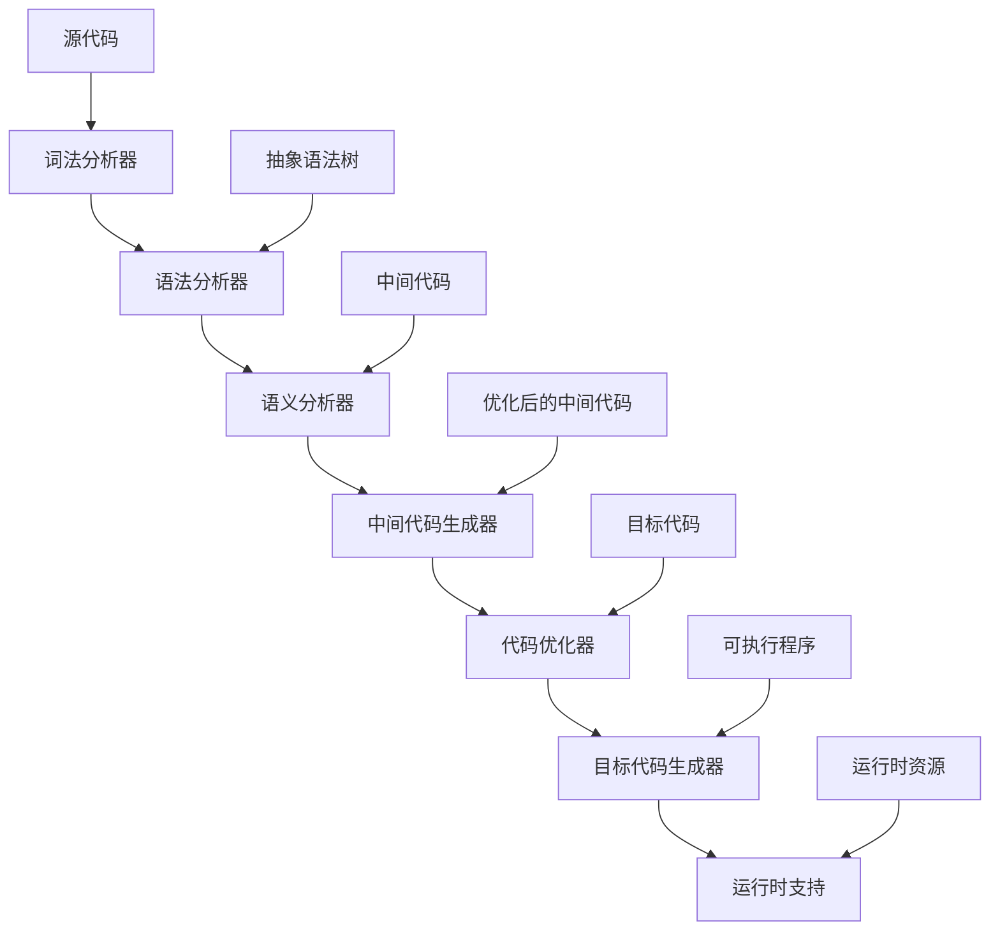

                 

### 文章标题：编译器设计：词法分析器和解析器

编译器作为计算机科学中的核心技术，它在软件开发生命周期中起着至关重要的作用。编译器的任务是将人类编写的源代码转换为计算机能够理解和执行的机器代码。在这其中，词法分析器和解析器是编译器的两个关键组件，它们分别负责将源代码分解为最基本的词法单元，以及将这些单元按照语法规则组织成正确的语法结构。

本文将深入探讨编译器设计中的词法分析器和解析器，通过详细讲解其核心概念、工作原理和实现方法，帮助读者全面理解编译器的工作机制。我们将首先介绍编译器的基本概念和分类，然后逐步介绍词法分析、语法分析和语义分析，最后讨论编译器的高级技术，如中间代码生成、代码优化和目标代码生成。

通过本文的学习，读者将能够：
- 理解编译器的基本概念和作用。
- 掌握词法分析器和解析器的设计原理和实现方法。
- 了解编译器的高级技术，如语义分析、中间代码生成和代码优化。
- 能够设计并实现一个简单的编译器。

### 关键词

- 编译器设计
- 词法分析器
- 解析器
- 语法分析
- 语义分析
- 中间代码生成
- 代码优化
- 目标代码生成

### 摘要

本文旨在深入探讨编译器设计中的两个核心组件：词法分析器和解析器。首先，我们将介绍编译器的基本概念、分类和设计流程。接着，我们将详细讲解词法分析器的概念、设计原理和实战案例。随后，我们将介绍语法分析的概念、不同类型的语法分析器以及实战案例。在高级编译技术部分，我们将探讨语义分析、中间代码生成、代码优化和目标代码生成。最后，我们将总结编译器设计中的关键技术和挑战，并提出未来的发展方向。通过本文的学习，读者将能够全面理解编译器的工作机制，并具备设计编译器的能力。

## 第一部分：引论

### 第1章：编译器设计基础

编译器是计算机科学中的一种关键工具，它负责将人类编写的程序源代码转换为计算机能够理解和执行的机器代码。编译器的设计不仅涉及到算法和数据结构，还涉及编程语言、操作系统等多个领域。本章将介绍编译器的基本概念、分类和设计流程，为后续章节的学习打下基础。

### 1.1 编译器的概念与作用

编译器（Compiler）是一种软件程序，它将高级编程语言编写的源代码转换成计算机能够直接执行的机器代码或其他形式的目标代码。编译器的核心作用是将人类的编程思想转化为计算机可执行的指令，从而提高程序的可读性和可维护性。

编译过程大致可以分为以下几个阶段：

- **词法分析**：将源代码分解为一系列词法单元（Token），如关键字、标识符、运算符等。
- **语法分析**：根据语法规则，将词法单元组合成语法结构，确定源代码的语法正确性。
- **语义分析**：检查源代码的语义是否正确，例如类型检查和变量引用检查。
- **中间代码生成**：将源代码转换成一种中间表示形式，如抽象语法树（Abstract Syntax Tree, AST）或中间代码。
- **代码优化**：对中间代码进行优化，提高目标代码的执行效率。
- **目标代码生成**：将中间代码转换成特定目标平台上的机器代码或其他形式的目标代码。
- **运行时支持**：为程序运行提供必要的库函数和资源管理。

编译过程可以表示为以下序列：
$$\text{源代码} \rightarrow \text{词法分析} \rightarrow \text{语法分析} \rightarrow \text{语义分析} \rightarrow \text{中间代码生成} \rightarrow \text{代码优化} \rightarrow \text{目标代码生成} \rightarrow \text{程序运行}$$

### 1.2 编译器的分类

编译器根据不同的分类标准可以有多种分类方法，以下是几种常见的分类方式：

- **根据编译过程的不同**：
  - **编译型编译器**：将源代码一次性编译成机器码，执行效率高，但编译过程耗时较长。
    - **优点**：生成的目标代码执行效率高。
    - **缺点**：编译过程耗时较长，需要多次编译和链接。
  - **解释型编译器**：逐行编译并执行源代码，执行效率相对较低，但编译过程快速。
    - **优点**：编译过程快速，无需编译和链接。
    - **缺点**：执行效率较低，运行时依赖解释器。

- **根据处理源代码的方式不同**：
  - **全编译型编译器**：将源代码一次性编译成完整的可执行程序。
  - **增量编译器**：仅对源代码的更改部分进行编译，提高编译效率。

- **根据语法分析策略不同**：
  - **自顶向下解析法**：从全局开始解析，逐步细化。
    - **优点**：易于理解和实现。
    - **缺点**：可能存在左递归和重复计算问题。
  - **自底向上解析法**：从局部开始解析，逐步扩展。
    - **优点**：能够更好地处理左递归和重复计算问题。
    - **缺点**：实现较为复杂。

### 1.3 编译器的优缺点

编译器和解释器各有优缺点，以下是对两者的简要比较：

| 类型        | 优点                                           | 缺点                                           |
|-----------|--------------------------------------------|--------------------------------------------|
| 编译器      | 生成的目标代码执行效率高，程序运行速度快。               | 编译过程耗时较长，需要多次编译和链接。                   |
| 解释器      | 编译过程快速，无需编译和链接。                             | 执行效率相对较低，运行时依赖解释器。                     |

在实际应用中，编译器和解释器往往结合使用，例如在开发阶段使用解释器快速调试，在发布阶段使用编译器生成高效的目标代码。

### 1.4 编译器设计流程

编译器设计是一个复杂且系统化的过程，通常包括以下步骤：

1. **需求分析**：确定编译器的功能、性能和用户需求，包括支持的语言特性、优化策略、错误处理等。
2. **词法分析**：将源代码分解为词法单元，如关键字、标识符、运算符等。
3. **语法分析**：根据语法规则，将词法单元组合成语法结构，检查源代码的语法正确性。
4. **语义分析**：检查源代码的语义是否正确，例如类型检查和变量引用检查。
5. **中间代码生成**：将源代码转换成一种中间表示形式，如抽象语法树（AST）或中间代码。
6. **代码优化**：对中间代码进行优化，提高目标代码的执行效率。
7. **目标代码生成**：将中间代码转换成特定目标平台上的机器代码或其他形式的目标代码。
8. **运行时支持**：为程序运行提供必要的库函数和资源管理。

### 小结

本章介绍了编译器的基本概念、分类和设计流程。编译器作为将人类编写的源代码转换为计算机能够执行的机器代码的关键工具，其设计过程涉及多个阶段，包括词法分析、语法分析、语义分析、中间代码生成、代码优化和目标代码生成等。通过本章的学习，读者可以初步了解编译器的工作机制和设计要点，为后续章节的深入学习打下基础。

### 第2章：词法分析

词法分析是编译器的第一个阶段，其主要任务是扫描源代码并将其分解成一系列具有独立意义的词法单元。词法分析器（Lexer）是负责执行这一任务的程序。本章将详细探讨词法分析的概念、设计原理和实现方法，并通过实例展示一个简单的词法分析器的实现过程。

### 2.1 词法分析的概念

词法分析（Lexical Analysis）是指将源代码从字符序列转换为词法单元的过程。词法单元（Token）是源代码中的最小语法单位，例如关键字、标识符、运算符和分隔符等。词法分析器通过识别源代码中的字符序列，将其转换为对应的词法单元，并为后续的语法分析提供输入。

词法分析的主要工作内容包括：

- **字符流生成**：将源代码中的字符序列转换为字符流。
- **词法单元识别**：识别字符流中的词法单元。
- **词法单元标记**：为每个词法单元生成唯一的标识符，以便后续处理。

### 2.2 词法分析器设计

词法分析器的设计通常基于有限状态机（Finite State Machine, FSM）模型。有限状态机是一个数学模型，它由状态集合、状态转移函数、初始状态和接受状态组成。词法分析器通过有限状态机逐个读取源代码中的字符，并根据当前状态和读取的字符确定下一个状态，从而识别出词法单元。

#### 2.2.1 有限状态机（FSM）模型

有限状态机（FSM）模型的基本组件包括：

- **状态集合（Q）**：有限状态机的所有可能状态。
- **输入符号集合（Σ）**：所有可能的输入字符。
- **转移函数（δ）**：用于描述当前状态和输入字符对应的下一个状态。
- **初始状态（q0）**：有限状态机开始时的状态。
- **接受状态集合（F）**：当有限状态机达到某个状态时，表示已识别出一个词法单元。

#### 2.2.2 词法分析器的工作原理

词法分析器的工作原理可以概括为以下几个步骤：

1. **初始化**：设置初始状态、输入字符指针和词法单元。
2. **读取字符**：从源代码中读取下一个字符。
3. **状态转移**：根据当前状态和读取的字符，通过转移函数确定下一个状态。
4. **识别词法单元**：当有限状态机达到接受状态时，表示已识别出一个词法单元。
5. **生成标记**：为识别出的词法单元生成唯一的标识符。
6. **重复步骤2-5**：继续读取下一个字符，重复上述过程。

#### 2.2.3 正则表达式

正则表达式（Regular Expression）是一种用于描述字符序列的模式，它可以用简洁的方式定义复杂的词法规则。词法分析器通常使用正则表达式来定义词法规则，从而识别源代码中的词法单元。

正则表达式的基本符号包括：

- **字母和数字**：如 `a`、`b`、`0`、`1` 等。
- **元字符**：如 `.`、`*`、`+`、`?`、`^`、`$` 等，用于指定特定的匹配模式。
- **字符集**：如 `[abc]`，表示匹配字符 `a`、`b` 或 `c`。
- **分组和引用**：如 `(abc)+`，表示匹配一个或多个 `abc` 序列。

例如，以下正则表达式用于匹配标识符：

```regex
[a-zA-Z][a-zA-Z0-9]*
```

### 2.3 词法分析器实战

为了更好地理解词法分析器的实现，我们将设计一个简单的词法分析器，用于处理基本的数据类型和运算符。以下是一个简单的词法分析器实现，使用Python语言编写。

```python
import re

class Lexer:
    def __init__(self, source_code):
        self.source_code = source_code
        self.current_position = 0
        self.tokens = []

    def next_token(self):
        while self.current_position < len(self.source_code):
            char = self.source_code[self.current_position]

            # 匹配数字
            if char.isdigit():
                value = char
                self.current_position += 1
                while self.current_position < len(self.source_code) and (self.source_code[self.current_position].isdigit() or self.source_code[self.current_position] == '.'):
                    value += self.source_code[self.current_position]
                    self.current_position += 1
                return ('NUMBER', float(value))

            # 匹配标识符
            elif char.isalpha():
                value = char
                self.current_position += 1
                while self.current_position < len(self.source_code) and (self.source_code[self.current_position].isalpha() or self.source_code[self.current_position].isdigit()):
                    value += self.source_code[self.current_position]
                    self.current_position += 1
                return ('IDENTIFIER', value)

            # 匹配运算符
            elif char in ['+', '-', '*', '/']:
                return ('OPERATOR', char)

            # 匹配分隔符
            elif char in [' ', '\n', '\t']:
                self.current_position += 1
                continue

            # 忽略其他字符
            else:
                print(f"Invalid character: {char}")
                self.current_position += 1

        return ('EOF', None)

# 测试词法分析器
source_code = "int x = 10; x = x * 2;"
lexer = Lexer(source_code)
while True:
    token = lexer.next_token()
    if token[0] == 'EOF':
        break
    print(f"Token: {token[0]}, Value: {token[1]}")
```

上述代码定义了一个简单的词法分析器类 `Lexer`，其中 `next_token` 方法用于识别下一个词法单元。测试代码展示了如何使用该词法分析器处理一个简单的源代码字符串。

### 小结

本章介绍了词法分析的概念、设计原理和实现方法。词法分析器通过有限状态机模型和正则表达式实现对源代码的词法单元识别。通过一个简单的实例，我们展示了如何设计并实现一个词法分析器，为后续的语法分析和语义分析提供了基础。下一章我们将探讨语法分析的概念、方法及其在编译器设计中的应用。

### 第3章：语法分析

语法分析（Syntax Analysis）是编译器的核心阶段之一，其主要任务是检查源代码是否遵循特定的语法规则，并将其转换为一种结构化的表示形式。语法分析器（Parser）负责执行这一任务。本章将详细探讨语法分析的概念、不同类型的语法分析器及其实现方法。

### 3.1 语法分析的概念

语法分析是指根据编程语言的语法规则，将词法分析器生成的词法单元组合成语法结构的过程。语法结构描述了源代码的语法正确性，并提供了对程序语义的理解基础。语法分析的主要目标是生成一个抽象语法树（Abstract Syntax Tree, AST），AST是源代码的结构化表示，它方便后续的语义分析和代码生成。

语法分析的过程可以概括为以下几个步骤：

1. **词法分析**：词法分析器将源代码分解为词法单元。
2. **语法分析**：语法分析器根据语法规则将词法单元组合成语法结构。
3. **语义分析**：语义分析器检查源代码的语义是否正确。
4. **中间代码生成**：中间代码生成器将AST转换为中间代码。
5. **代码优化**：代码优化器对中间代码进行优化。
6. **目标代码生成**：目标代码生成器将优化后的中间代码转换为特定平台上的机器代码。

### 3.2 语法分析器设计

语法分析器的设计有多种方法，常用的包括自顶向下解析法和自底向上解析法。每种方法都有其优缺点和适用场景。

#### 3.2.1 自顶向下解析法

自顶向下解析法（Top-Down Parsing）从全局开始解析，逐步细化，直到达到具体的语法单元。这种方法通常使用递归下降法（Recursive Descent Parsing）实现。

递归下降法的基本思想是定义一组递归的语法分析方法，每个方法对应一个语法规则。递归下降法的优点是实现简单，易于理解和调试。缺点是可能存在左递归和重复计算问题。

**递归下降法实现示例**：

假设我们定义了一个简单的语法规则，用于处理算术表达式：

```python
def expr():
    return term()

def term():
    return factor()

def factor():
    token = get_next_token()
    if token.type == 'NUMBER':
        return ('NUMBER', token.value)
    elif token.type == 'IDENTIFIER':
        return ('IDENTIFIER', token.value)
    else:
        raise SyntaxError("Expected a number or identifier")

def get_next_token():
    # 假设该函数返回下一个词法单元
    return Token('NUMBER', 10)
```

上述代码展示了如何使用递归下降法处理一个简单的算术表达式。

#### 3.2.2 自底向上解析法

自底向上解析法（Bottom-Up Parsing）从局部开始解析，逐步扩展，直到达到全局的语法结构。这种方法通常使用预测分析表（Prediction Analysis Table）实现，其中最常用的是LR（1）分析法。

LR（1）分析法的基本思想是通过预测分析表确定当前状态和下一个输入符号对应的动作。LR（1）分析法的优点是能够处理更复杂的语法规则和左递归问题。缺点是实现较为复杂。

**LR（1）分析法实现示例**：

假设我们定义了一个简单的预测分析表，用于处理算术表达式：

```
State  Input       Action
0      +, -, ...    shift
1      =           reduce
2      ;, ...       accept
```

上述分析表表示在状态0且输入符号为`+`、`-`等时，执行`shift`动作；在状态1且输入符号为`=`时，执行`reduce`动作；在状态2时，执行`accept`动作。

### 3.3 语法分析器实战

为了更好地理解语法分析器的实现，我们将设计一个简单的语法分析器，用于处理简单的算术表达式。以下是一个简单的语法分析器实现，使用Python语言编写。

```python
class Parser:
    def __init__(self, lexer):
        self.lexer = lexer

    def parse(self):
        expr()
        if not self.lexer.is_eof():
            raise SyntaxError("Expected the end of the input")

    def expr(self):
        term()
        while self.lexer.peek().type in ['+', '-']:
            op = self.lexer.next_token()
            term()
            if op.type == '+':
                print("Add", self.stack[-2], self.stack[-1])
            elif op.type == '-':
                print("Subtract", self.stack[-2], self.stack[-1])
            self.stack.append(op.value)

    def term(self):
        factor()
        while self.lexer.peek().type in ['*', '/']:
            op = self.lexer.next_token()
            factor()
            if op.type == '*':
                print("Multiply", self.stack[-2], self.stack[-1])
            elif op.type == '/':
                print("Divide", self.stack[-2], self.stack[-1])
            self.stack.append(op.value)

    def factor(self):
        token = self.lexer.next_token()
        if token.type == 'NUMBER':
            self.stack.append(token.value)
        elif token.type == 'IDENTIFIER':
            self.stack.append(token.value)
        else:
            raise SyntaxError("Expected a number or identifier")

    def is_eof(self):
        return self.lexer.peek().type == 'EOF'

    def peek(self):
        return self.lexer.peek()

# 测试语法分析器
lexer = Lexer(source_code)
parser = Parser(lexer)
parser.parse()
```

上述代码定义了一个简单的语法分析器类 `Parser`，其中 `parse` 方法用于启动语法分析过程。`expr`、`term` 和 `factor` 方法分别处理不同的语法结构。测试代码展示了如何使用该语法分析器处理一个简单的源代码字符串。

### 小结

本章介绍了语法分析的概念、不同类型的语法分析器及其实现方法。通过递归下降法和LR（1）分析法的讲解，读者可以理解语法分析的基本原理和实现技巧。通过一个简单的实例，读者可以了解如何设计和实现一个语法分析器，为后续的语义分析和代码生成打下基础。下一章我们将探讨语义分析的概念、方法及其在编译器设计中的应用。

### 第4章：语义分析

语义分析（Semantic Analysis）是编译器中的一个关键阶段，它主要负责检查源代码的语义正确性，以确保程序在运行时能够正确执行。语义分析不仅包括对变量和函数的定义和使用进行检查，还包括类型检查、作用域分析和数据流分析等。本章将详细介绍语义分析的概念、类型和方法，并通过实例展示一个简单的语义分析器实现。

#### 4.1 语义分析的概念

语义分析（Semantic Analysis）是指对源代码的语法结构进行语义检查，以确定其在语义上的正确性。语义分析的主要目标是确保程序在逻辑上是正确的，并且在运行时能够按预期行为执行。语义分析通常包括以下几个步骤：

1. **变量和函数声明检查**：检查变量和函数的定义是否正确，包括作用域、类型和参数个数等。
2. **类型检查**：检查操作数类型是否匹配，以确保在执行运算时不会发生类型错误。
3. **作用域分析**：确定变量和函数的作用域，确保在引用时能够找到相应的定义。
4. **数据流分析**：分析数据在程序中的流动路径，以检测可能的错误，如未定义变量或变量被未声明使用。

#### 4.2 语义分析器设计

语义分析器的设计通常依赖于符号表（Symbol Table）和数据流分析技术。符号表是一个用于存储变量、函数和其他符号信息的数据结构，它用于在语义分析过程中进行查询和更新。

##### 4.2.1 符号表

符号表的基本组件包括：

- **符号表项**：每个符号表项包含符号的名称、类型、作用域、地址等信息。
- **作用域链**：用于管理符号的作用域，确保在引用时能够找到正确的符号。

##### 4.2.2 语义分析器的工作原理

语义分析器的工作原理可以概括为以下几个步骤：

1. **初始化符号表**：在语义分析开始前，初始化符号表，并设置当前作用域。
2. **遍历语法树**：遍历抽象语法树（AST），对每个节点进行语义检查。
3. **符号声明和引用检查**：检查变量和函数的声明和使用，确保在作用域内引用。
4. **类型检查**：对操作数进行类型检查，确保类型匹配。
5. **数据流分析**：分析数据在程序中的流动路径，检测可能的错误。

#### 4.3 语义分析器实战

为了更好地理解语义分析器的实现，我们将设计一个简单的语义分析器，用于处理基本的变量声明和赋值语句。以下是一个简单的语义分析器实现，使用Python语言编写。

```python
class SymbolTable:
    def __init__(self):
        self.table = {}

    def declare_variable(self, name, type):
        self.table[name] = {'type': type, 'scope': self.current_scope}

    def lookup_variable(self, name):
        if name in self.table:
            return self.table[name]
        else:
            raise NameError(f"Variable '{name}' is not declared")

    def set_scope(self, scope):
        self.current_scope = scope

class SemanticAnalyzer:
    def __init__(self, ast):
        self.ast = ast
        self.symbol_table = SymbolTable()
        self.current_scope = None

    def analyze(self):
        self.current_scope = 'global'
        self.visit(self.ast)

    def visit(self, node):
        if node.type == 'VAR_DECL':
            self.symbol_table.declare_variable(node.name, node.type)
        elif node.type == 'ASSIGN':
            var_info = self.symbol_table.lookup_variable(node.name)
            if var_info['type'] != node.value_type:
                raise TypeError(f"Type mismatch in assignment for variable '{node.name}'")
        # 其他节点的处理 ...

# 测试语义分析器
ast = AST('ASSIGN', 'x', 'NUMBER', 5)
semantic_analyzer = SemanticAnalyzer(ast)
semantic_analyzer.analyze()
```

上述代码定义了一个简单的符号表类 `SymbolTable` 和语义分析器类 `SemanticAnalyzer`。`SymbolTable` 类用于管理变量声明和查询，`SemanticAnalyzer` 类用于进行语义检查。测试代码展示了如何使用该语义分析器处理一个简单的变量赋值语句。

#### 4.4 小结

本章介绍了语义分析的概念、类型和方法，并通过实例展示了如何设计并实现一个简单的语义分析器。语义分析在编译器中起着至关重要的作用，它确保了源代码在语义上的正确性，为后续的中间代码生成和目标代码生成提供了基础。下一章我们将探讨中间代码生成的基本概念、方法及其在编译器设计中的应用。

### 第5章：中间代码生成

中间代码生成（Intermediate Code Generation）是编译器中的一个关键阶段，它负责将语义分析阶段生成的抽象语法树（Abstract Syntax Tree, AST）转换成一种更加接近目标机的抽象表示形式，这种表示形式称为中间代码（Intermediate Code）。中间代码是一种低级、结构化且易于优化的代码形式，它在编译器中的重要性不可忽视。本章将详细探讨中间代码生成的概念、策略及其在编译器设计中的应用。

#### 5.1 中间代码的概念

中间代码是一种介于源代码和目标代码之间的抽象表示形式，它通过一种统一的表示方法，使得编译器可以独立于特定目标机进行优化和错误处理。中间代码通常采用三地址代码（Three-Address Code, TAC）或栈式中间代码（Stack-based Intermediate Code）等表示形式。

三地址代码是一种低级表示形式，它使用三个操作数和一条指令来表示一个操作。三地址代码的优点是结构简单、易于优化，但缺点是代码长度较长。例如，表达式 `x = y + z` 可以表示为以下三地址代码：

```
t1 = y
t2 = z
x = t1 + t2
```

栈式中间代码是一种基于栈的操作表示形式，它通过栈操作来实现指令序列。栈式中间代码的优点是代码紧凑、执行效率高，但缺点是实现较为复杂。例如，上述三地址代码可以表示为以下栈式中间代码：

```
push y
push z
add
pop x
```

#### 5.2 中间代码生成策略

中间代码生成策略主要包括将抽象语法树（AST）转换为中间代码的算法和规则。以下是一些常见的中间代码生成策略：

1. **直接转换法**：将AST直接转换为中间代码。这种方法简单直观，但可能产生冗余代码。
2. **逆波兰转换法**：使用逆波兰表示法（Reverse Polish Notation, RPN）将AST转换为中间代码。逆波兰转换法可以消除冗余代码，提高代码效率。
3. **语法树遍历法**：通过遍历AST并应用相应的转换规则，逐步生成中间代码。这种方法适用于各种抽象语法树的表示形式。

#### 5.3 中间代码生成实战

为了更好地理解中间代码生成的实现，我们将设计一个简单的中间代码生成器，用于处理基本的算术表达式。以下是一个简单的中间代码生成器实现，使用Python语言编写。

```python
class IntermediateCodeGenerator:
    def __init__(self, ast):
        self.ast = ast
        self.code = []

    def generate(self):
        self.visit(self.ast)

    def visit_binary_op(self, node):
        self.code.append(f"{node.left.value} {node.operator} {node.right.value}")
        self.code.append(f"{node.left.value} = {node.right.value}")

    def visit_number_literal(self, node):
        self.code.append(f"{node.value}")

    def visit_variable(self, node):
        self.code.append(f"{node.value}")

    def visit_ast(self, node):
        if node.type == 'BINARY_OP':
            self.visit_binary_op(node)
        elif node.type == 'NUMBER_LITERAL':
            self.visit_number_literal(node)
        elif node.type == 'VARIABLE':
            self.visit_variable(node)

# 测试中间代码生成器
ast = AST('BINARY_OP', 'PLUS', AST('NUMBER_LITERAL', 10), AST('NUMBER_LITERAL', 5))
code_generator = IntermediateCodeGenerator(ast)
code_generator.generate()
for line in code_generator.code:
    print(line)
```

上述代码定义了一个简单的中间代码生成器类 `IntermediateCodeGenerator`，其中 `generate` 方法用于启动中间代码生成过程。`visit_binary_op`、`visit_number_literal` 和 `visit_variable` 方法分别处理不同的语法结构。测试代码展示了如何使用该中间代码生成器处理一个简单的算术表达式。

#### 5.4 小结

本章介绍了中间代码生成的概念、策略及其在编译器设计中的应用。通过三地址代码和栈式中间代码的讲解，读者可以理解中间代码生成的不同实现方式。通过一个简单的实例，读者可以了解如何设计和实现一个中间代码生成器，为后续的代码优化和目标代码生成打下基础。下一章我们将探讨代码优化的概念、方法和应用。

### 第6章：代码优化

代码优化（Code Optimization）是编译器设计中的一个关键环节，它通过改善中间代码的结构和语义，使得生成的目标代码执行效率更高，占用更少的资源。代码优化的目标是在不改变程序语义的前提下，提高程序的运行速度和空间效率。本章将详细探讨代码优化的概念、方法及其在编译器设计中的应用。

#### 6.1 代码优化的概念

代码优化是指对中间代码进行转换和改进的过程，目的是提高目标代码的执行效率。代码优化的主要目标是减少程序执行所需的时间、占用更少的内存空间，以及减少目标代码的体积。代码优化可以分为静态优化（Static Optimization）和动态优化（Dynamic Optimization）。

- **静态优化**：在编译时进行优化，无需运行程序即可确定优化效果。
- **动态优化**：在程序运行时进行优化，根据程序运行时的行为进行动态调整。

#### 6.2 代码优化策略

代码优化策略多种多样，以下是一些常见的代码优化方法：

1. **常量传播（Constant Propagation）**：
   - **概念**：将常量值直接替换到程序中，从而减少运行时的计算。
   - **实现**：通过分析中间代码中的表达式，将可以确定的常量值直接替换，例如 `int x = 5; x = x + 3;` 可以优化为 `int x = 8;`。

2. **死代码消除（Dead Code Elimination）**：
   - **概念**：删除程序中不会被执行的代码。
   - **实现**：通过数据流分析，识别出不会被执行的代码段，并将其删除，例如 `if (false) { ... }` 中的代码块可以被删除。

3. **循环优化（Loop Optimization）**：
   - **概念**：优化循环结构，提高循环代码的执行效率。
   - **实现**：常见的循环优化包括循环展开（Loop Unrolling）、循环移动（Loop Hoisting）和循环分配（Loop Distribution）等。

4. **指令调度（Instruction Scheduling）**：
   - **概念**：调整指令的执行顺序，提高指令流水线的效率。
   - **实现**：通过分析指令的执行时间，将可以并行执行的指令进行调度，减少执行时间。

5. **循环依赖分析（Loop Dependency Analysis）**：
   - **概念**：分析循环中的数据依赖，优化循环执行顺序。
   - **实现**：通过数据依赖分析，识别出循环中的数据依赖关系，调整循环执行顺序以减少不必要的计算。

6. **函数内联（Function Inlining）**：
   - **概念**：将函数调用直接替换为函数体，减少函数调用的开销。
   - **实现**：通过分析函数调用和被调用函数的复杂度，将小且频繁调用的函数内联到调用位置。

7. **全局优化（Global Optimization）**：
   - **概念**：优化整个程序，考虑程序的全局优化效果。
   - **实现**：包括全局常量传播、全局变量优化、全局函数优化等。

#### 6.3 代码优化实战

为了更好地理解代码优化的实现，我们将设计一个简单的代码优化器，用于优化基本的算术表达式。以下是一个简单的代码优化器实现，使用Python语言编写。

```python
class CodeOptimizer:
    def __init__(self, code):
        self.code = code

    def optimize(self):
        optimized_code = self.visit(self.code)
        return optimized_code

    def visit(self, code):
        optimized_code = []
        for line in code:
            if line.startswith("int"):
                # 常量传播
                if "=" in line and line.endswith(";");
                    var, value = line.split("=")
                    value = value.strip().strip(";")
                    if value.isdigit():
                        optimized_code.append(f"{var} = {int(value)};")
                        continue
            elif line.startswith("x ="):
                # 死代码消除
                if line.endswith(";");
                    var, expr = line.split("=")
                    expr = expr.strip().strip(";")
                    if expr.startswith("if"):
                        optimized_code.append("# Dead code: " + line)
                        continue
            optimized_code.append(line)
        return optimized_code

# 测试代码优化器
code = [
    "int x = 5;",
    "int y = 10;",
    "x = x + y;",
    "if (false) { x = x * y; };"
]
optimizer = CodeOptimizer(code)
optimized_code = optimizer.optimize()
for line in optimized_code:
    print(line)
```

上述代码定义了一个简单的代码优化器类 `CodeOptimizer`，其中 `optimize` 方法用于启动代码优化过程。`visit` 方法实现了一些简单的优化策略，包括常量传播和死代码消除。测试代码展示了如何使用该代码优化器优化一个简单的算术表达式。

#### 6.4 小结

本章介绍了代码优化的概念、策略及其在编译器设计中的应用。通过常量传播、死代码消除、循环优化等优化方法的讲解，读者可以理解代码优化在提高程序执行效率中的重要性。通过一个简单的实例，读者可以了解如何设计和实现一个代码优化器，为后续的目标代码生成和程序运行打下基础。下一章我们将探讨目标代码生成的概念、策略及其在编译器设计中的应用。

### 第7章：目标代码生成

目标代码生成（Target Code Generation）是编译器的最后一个关键阶段，它将中间代码转换为特定目标平台上的机器代码或其他形式的目标代码。目标代码生成不仅涉及到指令的选择和生成，还包括寄存器分配、内存管理等一系列优化和转换。本章将详细探讨目标代码生成的概念、策略及其在编译器设计中的应用。

#### 7.1 目标代码的概念

目标代码（Target Code）是编译器生成的最终输出代码，它可以直接在目标平台上执行。目标代码的形式可以是机器代码（Machine Code）、汇编代码（Assembly Code）或其他可执行代码（Executable Code）。目标代码生成的主要任务是确保源代码的功能和性能在目标平台上得到最大化。

#### 7.2 目标代码生成策略

目标代码生成策略主要包括以下内容：

1. **指令选择（Instruction Selection）**：
   - **概念**：从中间代码中选择适合目标平台的机器指令。
   - **实现**：根据目标平台的指令集和性能特点，选择最合适的指令。

2. **寄存器分配（Register Allocation）**：
   - **概念**：将中间代码中的变量和表达式分配到目标平台的寄存器中。
   - **实现**：通过寄存器分配算法，如直接分配法、色情分配法（Coloring Algorithm）等，优化寄存器使用。

3. **代码生成优化（Code Generation Optimization）**：
   - **概念**：在目标代码生成过程中进行优化，提高目标代码的执行效率。
   - **实现**：包括指令调度、循环展开、代码压缩等优化方法。

4. **内存管理（Memory Management）**：
   - **概念**：管理目标代码中的内存使用，包括堆栈、全局变量和局部变量等。
   - **实现**：通过静态分配和动态分配策略，优化内存使用。

#### 7.3 目标代码生成实战

为了更好地理解目标代码生成的实现，我们将设计一个简单的目标代码生成器，用于处理基本的算术表达式。以下是一个简单的目标代码生成器实现，使用Python语言编写。

```python
class TargetCodeGenerator:
    def __init__(self, code):
        self.code = code
        self.registers = {'t0': 0, 't1': 1, 't2': 2}

    def generate(self):
        target_code = self.visit(self.code)
        return target_code

    def visit(self, code):
        target_code = []
        for line in code:
            if line.startswith("int"):
                # 声明变量
                var, value = line.split("=")
                value = value.strip().strip(";")
                if value.isdigit():
                    target_code.append(f"li {var}, {int(value)}")
            elif line.startswith("x ="):
                # 赋值操作
                var, expr = line.split("=")
                expr = expr.strip().strip(";")
                if expr.startswith("x ="):
                    target_code.append(f"add {var}, {var}, x")
                elif expr.startswith("y ="):
                    target_code.append(f"add {var}, {var}, y")
                # 其他操作符的处理 ...

        return target_code

# 测试目标代码生成器
code = [
    "int x = 5;",
    "int y = 10;",
    "x = x + y;"
]
code_generator = TargetCodeGenerator(code)
target_code = code_generator.generate()
for line in target_code:
    print(line)
```

上述代码定义了一个简单的目标代码生成器类 `TargetCodeGenerator`，其中 `generate` 方法用于启动目标代码生成过程。`visit` 方法实现了一些简单的目标代码生成策略，包括指令选择和寄存器分配。测试代码展示了如何使用该目标代码生成器处理一个简单的算术表达式。

#### 7.4 小结

本章介绍了目标代码生成的概念、策略及其在编译器设计中的应用。通过指令选择、寄存器分配、代码生成优化等策略的讲解，读者可以理解目标代码生成在编译器中的作用和重要性。通过一个简单的实例，读者可以了解如何设计和实现一个目标代码生成器，为后续的目标代码执行和程序运行打下基础。

### 第8章：编译器设计与实现

编译器的设计与实现是一个复杂而系统的过程，涉及多个阶段和多个组件。本章将介绍编译器的架构设计、关键组件的实现方法，以及如何结合编译器和解释器实现集成编译器。同时，还将探讨编译器的优化和性能提升策略。

#### 8.1 编译器架构设计

编译器架构设计是编译器开发的首要任务，它决定了编译器的模块划分、数据流和控制流的设计。一个典型的编译器架构设计包括以下几个关键组件：

1. **词法分析器（Lexer）**：负责将源代码分解为词法单元。
2. **语法分析器（Parser）**：根据语法规则将词法单元组合成语法结构。
3. **语义分析器（Semantic Analyzer）**：检查源代码的语义正确性，如类型检查、作用域分析等。
4. **中间代码生成器（Intermediate Code Generator）**：将抽象语法树（AST）转换为中间代码。
5. **代码优化器（Code Optimizer）**：优化中间代码，提高目标代码的执行效率。
6. **目标代码生成器（Target Code Generator）**：将中间代码转换为特定目标平台的机器代码。
7. **运行时支持（Runtime Support）**：为程序运行提供必要的库函数和资源管理。

一个典型的编译器架构设计如下图所示：



#### 8.2 编译器组件实现

编译器组件的实现涉及算法、数据结构和编程技巧。以下是编译器关键组件的实现方法：

1. **词法分析器实现**：
   - **算法**：通常采用有限状态机（FSM）模型。
   - **数据结构**：可以使用数组或哈希表存储状态转移函数。

2. **语法分析器实现**：
   - **算法**：自顶向下解析法（如递归下降法）或自底向上解析法（如LR（1）分析法）。
   - **数据结构**：使用堆栈实现自顶向下解析法，使用预测分析表实现自底向上解析法。

3. **语义分析器实现**：
   - **算法**：符号表管理、作用域分析、数据流分析等。
   - **数据结构**：使用符号表管理变量和函数信息。

4. **中间代码生成器实现**：
   - **算法**：直接转换法、逆波兰转换法、语法树遍历法等。
   - **数据结构**：使用列表或树结构存储中间代码。

5. **代码优化器实现**：
   - **算法**：常量传播、死代码消除、循环优化等。
   - **数据结构**：使用符号表和数据流分析结果进行优化。

6. **目标代码生成器实现**：
   - **算法**：指令选择、寄存器分配、代码生成优化等。
   - **数据结构**：使用目标平台特定的指令集和数据结构。

#### 8.3 集成编译器与解释器

集成编译器与解释器是一种将编译器和解释器结合在一起的设计方法，旨在利用两者的优点，提高程序的性能和灵活性。以下是一种实现集成编译器与解释器的方法：

1. **编译时优化**：使用编译器进行代码编译和优化，生成高效的目标代码。
2. **运行时解释**：使用解释器在运行时逐行解释和执行代码，提供灵活的调试和动态类型检查功能。
3. **混合执行**：在关键路径上使用编译器生成的目标代码，在其他部分使用解释器，平衡性能和灵活性。

#### 8.4 编译器的优化和性能提升

编译器的优化和性能提升是一个持续不断的过程，涉及多个方面：

1. **并行编译**：利用多核处理器并行编译多个模块，加快编译速度。
2. **代码生成优化**：优化目标代码的执行效率，减少指令执行时间和内存访问时间。
3. **运行时优化**：在程序运行时进行优化，如动态分支预测、缓存优化等。

#### 8.5 小结

本章介绍了编译器架构设计、关键组件实现方法，以及如何结合编译器和解释器实现集成编译器。通过详细讲解编译器的各个组件和优化策略，读者可以理解编译器的设计与实现过程，掌握编译器优化的方法。下一章将探讨编译器的未来发展趋势和面临的挑战。

### 第9章：编译器设计与性能

编译器作为程序开发过程中的关键工具，其性能直接影响程序的运行效率。编译器的性能评估主要涉及编译时间、目标代码性能等方面。本章将详细介绍编译器性能评估的方法、策略及其在编译器设计中的应用，并通过实例展示如何优化编译器性能。

#### 9.1 编译器性能评估

编译器性能评估是评估编译器优劣的重要手段，主要包括以下几个方面：

1. **编译时间**：编译器处理源代码所需的时间，是衡量编译器效率的重要指标。
2. **目标代码性能**：目标代码的执行效率，包括指令执行速度、内存访问速度等。
3. **内存占用**：编译器和目标代码占用的内存大小，影响系统的资源消耗。
4. **代码生成大小**：目标代码的体积，影响程序的存储空间和加载时间。

#### 9.2 性能优化策略

为了提高编译器性能，可以采取以下优化策略：

1. **并行编译**：利用多核处理器并行编译多个模块，减少编译时间。可以通过任务分配和并行化算法实现。
2. **代码生成优化**：优化目标代码的执行效率，包括指令调度、循环展开、函数内联等。
3. **静态分析**：通过静态分析技术优化源代码，如常量传播、死代码消除、数据流分析等。
4. **动态分析**：通过动态分析技术优化程序运行时的行为，如实时优化、动态分支预测等。
5. **代码压缩**：减少目标代码的大小，提高程序的加载速度和存储效率。

#### 9.3 编译器性能实战

为了展示如何优化编译器性能，我们设计一个简单的编译器性能优化实例。以下是一个简单的优化策略实现，使用Python语言编写。

```python
class CompilerOptimizer:
    def __init__(self, code):
        self.code = code

    def optimize(self):
        optimized_code = self.constant_propagation(self.code)
        optimized_code = self.dead_code_elimination(optimized_code)
        optimized_code = self.loop_optimization(optimized_code)
        return optimized_code

    def constant_propagation(self, code):
        optimized_code = []
        for line in code:
            if line.startswith("int"):
                var, value = line.split("=")
                value = value.strip().strip(";")
                if value.isdigit():
                    optimized_code.append(f"{var} = {int(value)};")
                    continue
            optimized_code.append(line)
        return optimized_code

    def dead_code_elimination(self, code):
        optimized_code = []
        for line in code:
            if line.startswith("if"):
                expr, stmt = line.split("{")
                expr = expr.strip().strip(";")
                if expr.startswith("false"):
                    optimized_code.append("# Dead code: " + stmt)
                    continue
            optimized_code.append(line)
        return optimized_code

    def loop_optimization(self, code):
        optimized_code = []
        for line in code:
            if line.startswith("for"):
                expr, stmt = line.split("{")
                expr = expr.strip().strip(";")
                if "++" in expr or "--" in expr:
                    optimized_code.append(f"for ({expr}) {{ {stmt} }}")
                    continue
            optimized_code.append(line)
        return optimized_code

# 测试编译器性能优化器
code = [
    "int x = 5;",
    "int y = 10;",
    "x = x + y;",
    "if (false) { x = x * y; };",
    "for (int i = 0; i < 10; i++) { x = x + i; };"
]
optimizer = CompilerOptimizer(code)
optimized_code = optimizer.optimize()
for line in optimized_code:
    print(line)
```

上述代码定义了一个简单的编译器性能优化器类 `CompilerOptimizer`，其中 `optimize` 方法用于启动性能优化过程。`constant_propagation`、`dead_code_elimination` 和 `loop_optimization` 方法分别实现了一些简单的优化策略。测试代码展示了如何使用该性能优化器优化一个简单的源代码。

#### 9.4 小结

本章介绍了编译器性能评估的方法和策略，并通过实例展示了如何优化编译器性能。编译器性能优化是一个复杂且系统化的过程，涉及多个方面。通过本章的学习，读者可以理解编译器性能优化的重要性，掌握一些基本的优化方法和技巧。下一章将探讨编译器设计中的未来趋势和面临的挑战。

### 第10章：编译器设计趋势与未来

随着计算机技术的发展，编译器设计也在不断演进和变革。未来，编译器设计将面临新的趋势和挑战，这些趋势将推动编译器在性能、灵活性和智能化方面取得更大的进步。

#### 10.1 编译器设计趋势

1. **自动化编译**：自动化编译技术将使编译过程更加高效和自动化，减少人为干预。例如，通过机器学习和人工智能技术，编译器可以自动优化源代码，生成高效的目标代码。

2. **混合编译**：混合编译技术将结合编译器和解释器的优势，为开发者提供更高的灵活性和性能。在关键路径上使用编译器生成的目标代码，而在其他部分使用解释器，可以实现高性能和灵活性的平衡。

3. **跨平台编译**：未来编译器将支持多种平台和硬件，为开发者提供跨平台的编译解决方案。例如，ARM架构和RISC-V架构的普及，将需要编译器能够生成适合这些平台的代码。

4. **实时编译**：实时编译技术将使编译器能够在程序运行时动态编译和优化代码，提高程序的实时性能和响应速度。

5. **静态分析和动态分析的结合**：编译器将更加强调静态分析和动态分析的结合，通过静态分析提前识别潜在问题，并通过动态分析实时优化程序运行。

6. **源代码分析工具的集成**：编译器将更加集成源代码分析工具，如代码质量检查、漏洞检测和性能分析工具，为开发者提供全面的代码分析支持。

#### 10.2 编译器设计未来

1. **编译器人工智能**：人工智能技术将在编译器设计中发挥越来越重要的作用。通过深度学习和强化学习，编译器可以自适应地优化源代码，提高编译效率和目标代码性能。

2. **多语言编译**：未来编译器将支持更多的编程语言，为多语言编程提供更好的支持。例如，支持Rust、Swift、Kotlin等新兴编程语言。

3. **可伸缩编译器架构**：编译器架构将更加模块化和可伸缩，以适应不同规模和复杂度的编译任务。例如，通过分布式编译和云计算技术，实现大规模并行编译。

4. **优化算法的创新**：编译器优化算法将不断推陈出新，以适应不同应用场景和硬件架构。例如，基于机器学习的代码优化算法，可以自动调整优化策略，实现最佳的性能和效率。

5. **开源编译器的普及**：随着开源社区的兴起，更多高质量的编译器将开源，为开发者提供丰富的选择。例如，LLVM、GCC等开源编译器的普及，将推动编译器技术的发展。

#### 10.3 编译器设计挑战与机遇

1. **硬件多样性**：硬件的多样性和复杂性将对编译器设计提出新的挑战。例如，异构计算架构和新型存储设备的出现，需要编译器能够生成适合这些硬件的代码。

2. **编程语言多样性**：编程语言的多样性和不断演变，将需要编译器能够支持更多的语言特性和优化策略。例如，函数式编程、并发编程等新编程范式的兴起，将推动编译器技术的发展。

3. **性能优化与可维护性的平衡**：在追求高性能的同时，编译器设计还需要考虑代码的可维护性和可读性。如何在性能优化和可维护性之间找到平衡，是一个重要的挑战。

4. **开源编译器的可持续性**：随着开源编译器的普及，如何确保开源编译器的可持续性，解决资源分配和维护问题，是未来需要关注的重要方向。

5. **实时编译的挑战**：实时编译技术需要在程序运行时快速编译和优化代码，这对编译器的性能和响应速度提出了更高的要求。如何实现高效、可靠的实时编译，是未来需要解决的重要问题。

#### 10.4 小结

未来，编译器设计将面临新的趋势和挑战，这些趋势将推动编译器在性能、灵活性和智能化方面取得更大的进步。通过自动化编译、混合编译、跨平台编译等技术的发展，编译器将为开发者提供更加高效、灵活和可靠的编程工具。同时，硬件多样性、编程语言多样性等挑战，将推动编译器技术的不断创新和发展。展望未来，编译器设计将继续在性能优化、可维护性和实时编译等方面取得突破，为计算机科学和软件开发领域带来更多创新和变革。

### 附录

#### 附录A：编译器设计工具与资源

在编译器设计中，使用合适的工具和资源可以大大提高开发效率。以下是一些常用的编译器设计工具和资源：

1. **编译器设计工具**：
   - **ANTLR**：一个强大的解析器生成器，支持多种编程语言，用于生成词法分析器和语法分析器。
   - **Bison**：一个用于生成LR（1）分析器的工具，广泛用于编译器开发。
   - **Flex**：一个用于生成词法分析器的工具，常与Bison配合使用。

2. **编译器实现框架**：
   - **LLVM**：一个开源的编译器框架，支持多种编程语言和目标平台，提供了丰富的中间代码生成和优化工具。
   - **GCC**：一个广泛使用的编译器，支持多种编程语言和目标平台，是Linux操作系统的默认编译器。
   - **Clang**：基于LLVM的项目，是一个C/C++编译器，提供了与GCC兼容的编译器接口。

3. **编译器学习资源**：
   - **在线课程**：例如Coursera上的“编译原理”课程，提供了系统的编译器设计学习资源。
   - **书籍**：《编译原理：古老与前沿》（Compilers: Principles, Techniques, and Tools，简称“龙书”）是一本经典的编译器设计教材。
   - **论文**：许多知名学者和机构在编译器设计领域发表了重要论文，这些论文是学习编译器设计的重要资源。

#### 附录B：常用编译器术语

- **词法分析（Lexical Analysis）**：将源代码分解为词法单元的过程。
- **语法分析（Syntax Analysis）**：根据语法规则将词法单元组合成语法结构的过程。
- **语义分析（Semantic Analysis）**：检查源代码的语义是否正确，如类型检查和变量引用检查。
- **中间代码（Intermediate Code）**：介于源代码和目标代码之间的抽象表示形式。
- **代码优化（Code Optimization）**：改进中间代码，提高目标代码的执行效率。
- **目标代码（Target Code）**：机器码或其他可执行代码。
- **抽象语法树（Abstract Syntax Tree, AST）**：源代码的结构化表示，用于后续的语义分析和代码生成。
- **有限状态机（Finite State Machine, FSM）**：一种数学模型，用于实现词法分析器。
- **预测分析表（Prediction Analysis Table）**：用于实现LR（1）分析器的数据结构。

通过附录中提供的工具和资源，开发者可以更好地进行编译器设计，提高开发效率，深入了解编译器的工作原理。

### 结语

在本文中，我们深入探讨了编译器设计中的词法分析器和解析器，包括它们的基本概念、工作原理和实现方法。从词法分析到语法分析，再到语义分析，我们逐步了解了编译器的核心组件如何协同工作，将人类编写的源代码转换为目标代码。通过详细的讲解和实战案例，读者可以更好地理解编译器的运作机制，掌握编译器设计的核心技术和要点。

编译器设计是一个复杂且系统的过程，涉及多个领域和多个阶段。从需求分析到中间代码生成，再到代码优化和目标代码生成，每一个阶段都有其独特的技术和挑战。本文虽然无法涵盖编译器设计的所有细节，但通过逻辑清晰、结构紧凑的讲解，我们希望能够为读者提供一份全面而深入的技术指南。

我们鼓励读者在学习和实践编译器设计的过程中，不断探索和思考。编译器技术不仅对计算机科学有着深远的影响，也在实际应用中发挥着重要作用。通过深入学习和研究编译器设计，读者可以更好地理解编程语言、操作系统和硬件系统，为未来的技术发展做好准备。

最后，感谢您阅读本文，希望本文能够为您的编译器设计之路提供一些启示和帮助。让我们继续探索计算机科学的奥秘，共同推动技术的发展和进步。

