                 

# 《网络安全、信息安全措施方案》

> 关键词：网络安全、信息安全、访问控制、防火墙、数据加密、安全审计、数学模型、项目实战

> 摘要：本文旨在全面剖析网络安全和信息安全的措施方案，包括网络安全基础、信息安全措施、信息安全案例研究和未来发展展望。通过深入分析核心概念、算法原理、数学模型，结合实际项目实战，旨在为读者提供一套完整、实用、具有前瞻性的网络安全和信息安全解决方案。

----------------------------------------------------------------

### 第一部分：网络安全基础

#### 1.1 网络安全概述

##### 1.1.1 网络安全的定义

网络安全是指保护计算机网络系统及其组件（如服务器、客户端、网络设备等）免受未经授权的访问、破坏、篡改和恶意攻击的一系列措施。网络安全涵盖了物理安全、网络安全、系统安全和数据安全等多个层面。

##### 1.1.2 网络安全的重要性

随着互联网的普及和信息技术的发展，网络安全已经成为全球各国和各个行业关注的焦点。网络安全的重要性主要体现在以下几个方面：

- 保护个人隐私和信息安全：网络安全措施能够防止个人信息泄露，保护用户的隐私和财产。
- 保障企业和国家利益：企业网络遭受攻击可能导致数据泄露、经济损失和声誉受损；国家网络遭受攻击可能影响国家安全和国民经济。
- 维护社会稳定：网络安全问题可能引发社会矛盾，影响社会稳定。

##### 1.1.3 网络安全的基本原则

网络安全的基本原则包括：

- 完整性：确保数据在传输和存储过程中不被未经授权的篡改。
- 可用性：确保网络服务在合法用户访问时能够正常使用。
- 机密性：确保数据在传输和存储过程中不被未经授权的人员获取。
- 可控性：对网络安全状态进行监控和管理，确保网络安全。

#### 1.2 网络安全威胁概述

##### 1.2.1 常见网络安全威胁

常见的网络安全威胁包括：

- 恶意软件：包括病毒、蠕虫、木马等，通过感染计算机系统或网络设备，窃取敏感信息或破坏系统。
- 网络攻击：包括拒绝服务攻击（DoS）、分布式拒绝服务攻击（DDoS）等，通过占用网络带宽或资源，导致网络服务不可用。
- 社会工程学攻击：通过欺骗手段获取用户敏感信息，如钓鱼邮件、电话诈骗等。
- 数据泄露：通过网络入侵、恶意软件等方式，非法获取并泄露敏感数据。

##### 1.2.2 威胁的类型与影响

网络安全威胁的类型主要包括：

- 外部威胁：来自互联网的攻击，如黑客入侵、恶意软件感染等。
- 内部威胁：来自组织内部员工的恶意行为或操作失误，如内部人员泄露敏感信息、滥用权限等。
- 意外威胁：由自然灾害、设备故障等非人为因素导致的网络中断和数据丢失。

网络安全威胁的影响包括：

- 财务损失：网络攻击可能导致企业经济损失，如支付卡数据泄露、业务中断等。
- 声誉损害：网络攻击可能导致企业声誉受损，影响客户信任。
- 业务中断：网络攻击可能导致企业关键业务无法正常运行，影响经营。
- 数据泄露：网络攻击可能导致敏感数据泄露，影响用户隐私和安全。

##### 1.2.3 威胁的发展趋势

网络安全威胁的发展趋势包括：

- 攻击手段越来越复杂，利用零日漏洞、自动化攻击等方式。
- 攻击目标逐渐向关键基础设施和网络服务提供商倾斜。
- 网络犯罪组织和个人利用网络攻击进行非法牟利。
- 互联网应用和服务不断增多，网络安全威胁的范围不断扩大。

#### 1.3 网络安全体系结构

##### 1.3.1 安全管理

安全管理是网络安全体系的核心，主要包括以下方面：

- 安全策略：制定组织的安全政策和规定，明确安全目标和责任。
- 安全意识培训：提高员工安全意识，降低内部威胁。
- 安全风险评估：识别和评估网络中的安全风险，制定相应的安全措施。
- 安全审计：对网络系统的安全状况进行定期审计，确保安全策略的有效执行。

##### 1.3.2 安全技术

安全技术是实现网络安全的关键手段，包括以下方面：

- 防火墙：用于过滤网络流量，防止非法访问。
- 入侵检测系统（IDS）：用于检测网络中的异常行为和攻击行为。
- 安全审计与日志管理：记录网络活动，发现安全事件。
- 加密技术：用于保护数据的机密性和完整性。
- 安全设备：如安全路由器、交换机等，提供网络隔离和访问控制。

##### 1.3.3 安全协议与标准

安全协议与标准是网络安全体系的基础，包括以下方面：

- 传输层安全协议（TLS）：用于加密网络通信，确保数据传输的安全性。
- 安全套接字层（SSL）：用于加密Web通信，保证Web浏览器的安全。
- 网络安全协议（IPsec）：用于加密网络数据包，确保IP层通信的安全。
- 安全标准：如ISO 27001、PCI DSS等，为组织提供安全管理的指导和要求。

----------------------------------------------------------------

### 第二部分：信息安全措施

#### 2.1 访问控制

##### 2.1.1 身份认证

身份认证是访问控制的基础，用于验证用户身份。常见的身份认证方法包括：

- 用户名和密码：最常用的身份认证方法，安全性较低，易受破解。
- 二因素认证（2FA）：结合用户名和密码，增加一个验证码或动态密码，提高安全性。
- 生物识别：如指纹识别、面部识别等，基于人体生物特征进行身份认证。

##### 2.1.2 授权与访问控制列表（ACL）

授权是确定用户对系统资源的访问权限。访问控制列表（ACL）是一种用于管理访问权限的机制，基于用户身份和访问请求，检查ACL规则以确定访问是否被允许。核心算法原理如下：

```plaintext
// 伪代码：访问控制列表（ACL）算法
Function checkAccess(userId, resourceId):
    for each rule in ACL:
        if (rule.userId == userId or rule.groupId in userGroups(userId)):
            if (rule.action == "allow" and resource matches rule.resource):
                return true
            if (rule.action == "deny" and resource matches rule.resource):
                return false
    return false

// ACL规则示例
ACL = [
    {userId: "Alice", action: "allow", resource: "*.doc"},
    {userId: "Bob", action: "deny", resource: "*.pdf"},
    {groupId: "Admins", action: "allow", resource: "/admin/*"},
]

// 使用示例
access = checkAccess("Alice", "/user/Alice.doc")
print(access) // 输出：true

access = checkAccess("Bob", "/user/Bob.pdf")
print(access) // 输出：false

access = checkAccess("Charlie", "/admin/settings")
print(access) // 输出：true
```

##### 2.1.3 双因素认证

双因素认证（2FA）是一种额外的安全层，要求用户在登录过程中提供两个不同的认证因素。常见的双因素认证方法包括：

- 动态验证码：通过短信、应用或硬件令牌生成的一次性验证码。
- 生物识别：如指纹识别、面部识别等，结合用户身份认证。
- 联合认证：结合多个认证因素，如用户名、密码和动态验证码。

#### 2.2 防火墙与入侵检测

##### 2.2.1 防火墙的工作原理

防火墙是一种网络安全设备，用于监控和控制网络流量，防止未经授权的访问和攻击。防火墙的工作原理包括：

- 包过滤：根据网络包的源地址、目的地址、端口号等信息，过滤非法流量。
- 状态检测：根据网络连接的状态，识别合法流量和攻击流量。
- 应用层网关：根据应用层协议，过滤非法应用流量。

##### 2.2.2 防火墙的类型

防火墙可分为以下类型：

- 硬件防火墙：物理设备，性能稳定，适用于大规模网络。
- 软件防火墙：安装在计算机或服务器上，适用于小规模网络。
- 云防火墙：基于云计算服务，适用于云环境。

##### 2.2.3 入侵检测系统的原理与应用

入侵检测系统（IDS）是一种用于检测网络中的异常行为和攻击行为的网络安全设备。其原理包括：

- 异常检测：通过分析网络流量和系统日志，识别异常行为。
- 预定义规则检测：根据预定义的规则，识别攻击行为。

入侵检测系统的应用包括：

- 安全监控：实时监测网络流量和系统日志，发现潜在威胁。
- 安全事件响应：识别安全事件，及时采取应对措施。
- 安全审计：记录和报告网络活动，确保合规性。

#### 2.3 数据加密

##### 2.3.1 对称加密与非对称加密

数据加密是保护数据机密性和完整性的重要手段。加密技术分为对称加密和非对称加密：

- 对称加密：加密和解密使用相同的密钥，如AES。
- 非对称加密：加密和解密使用不同的密钥，如RSA。

##### 2.3.2 加密算法简介

常见的加密算法包括：

- 对称加密算法：AES、DES、3DES。
- 非对称加密算法：RSA、ECC。
- 哈希算法：MD5、SHA-1、SHA-256。

##### 2.3.3 实例：SSL/TLS协议

SSL/TLS协议是一种用于加密Web通信的安全协议，其核心功能包括：

- 加密数据传输：确保Web客户端和服务器之间的数据传输安全。
- 认证服务器：验证服务器的合法性，确保数据传输到正确服务器。
- 完整性验证：确保数据在传输过程中未被篡改。

SSL/TLS协议的工作流程包括：

1. 客户端发送SSL/TLS握手请求。
2. 服务器发送证书，客户端验证服务器证书。
3. 双方协商加密算法和密钥。
4. 客户端发送加密后的数据。
5. 服务器解密数据，返回加密响应。
6. 双方进行后续数据传输。

#### 2.4 安全审计与日志管理

##### 2.4.1 安全审计的目的与意义

安全审计是一种对网络安全和信息安全措施进行评估和验证的方法。其目的和意义包括：

- 检查安全措施的有效性：确保安全策略和技术的有效性，及时发现和解决安全漏洞。
- 符合法律法规要求：确保组织符合相关法律法规要求，降低法律风险。
- 提高安全意识：通过安全审计，提高员工对网络安全和信息安全重要性的认识。

##### 2.4.2 日志管理的基本原则

日志管理是安全审计的重要基础。其基本原则包括：

- 完整性：确保日志记录的完整性和准确性，防止日志被篡改。
- 可审计性：确保日志可用于安全事件的分析和追溯。
- 及时性：及时记录和报告安全事件，确保快速响应。
- 可扩展性：支持日志存储和检索的扩展，满足不同规模组织的需求。

##### 2.4.3 常见日志分析工具

常见的日志分析工具包括：

- Logstash：用于收集、处理和存储日志数据的开源工具。
- ELK Stack：包括Elasticsearch、Logstash和Kibana，用于日志存储和可视化分析。
- Splunk：用于实时监控、分析和报告日志数据的企业级工具。

#### 2.5 安全策略与应急响应

##### 2.5.1 制定安全策略的步骤

制定安全策略的步骤包括：

1. 安全需求分析：分析组织的安全需求，确定安全目标和要求。
2. 制定安全策略：根据安全需求，制定具体的安全策略和措施。
3. 实施安全策略：将安全策略落实到实际操作中，确保有效执行。
4. 安全培训与宣传：提高员工的安全意识和技能，确保安全策略的普及和执行。

##### 2.5.2 安全事件响应流程

安全事件响应流程包括：

1. 事件识别：识别和报告安全事件。
2. 事件分析：分析事件的性质、原因和影响。
3. 应急响应：根据事件性质和影响，采取相应的应急措施。
4. 事件报告：向管理层和相关部门报告事件。
5. 事件跟踪：跟踪事件处理进展，确保事件得到妥善解决。

##### 2.5.3 常见安全事件与应对措施

常见安全事件包括：

- 恶意软件感染：应对措施包括清除恶意软件、修复漏洞、更新防护软件等。
- 数据泄露：应对措施包括追踪数据泄露源头、修复漏洞、加强数据加密等。
- 网络攻击：应对措施包括阻止攻击、检测攻击行为、恢复系统等。
- 社会工程学攻击：应对措施包括提高员工安全意识、加强身份认证、防范钓鱼攻击等。

----------------------------------------------------------------

### 第三部分：信息安全案例研究

#### 3.1 案例一：某公司网络安全事件分析

##### 3.1.1 案例背景

某公司是一家全球领先的科技企业，拥有庞大的用户基础和庞大的数据资源。由于公司网络和系统暴露在互联网上，容易成为黑客和网络犯罪分子的攻击目标。某天，公司网络出现异常，部分系统无法正常访问，公司紧急启动网络安全事件响应机制。

##### 3.1.2 事件类型与影响

事件类型为分布式拒绝服务攻击（DDoS），影响包括：

- 网络带宽占用率高达90%，导致公司内部网络访问速度明显下降。
- 部分关键业务系统无法正常访问，影响公司正常运营。
- 公司声誉受损，客户投诉增加。

##### 3.1.3 应对措施与效果评估

应对措施包括：

1. 启动DDoS攻击防护系统，通过流量清洗和过滤，降低攻击流量。
2. 加固网络安全设施，如防火墙、入侵检测系统等，防止进一步攻击。
3. 加强员工安全意识培训，提高对网络安全威胁的认识和应对能力。
4. 完善应急响应机制，确保在发生类似事件时能够快速响应和处理。

效果评估：

1. 攻击流量得到有效控制，网络带宽占用率下降至10%以下。
2. 关键业务系统恢复正常，公司运营恢复正常。
3. 员工安全意识得到提升，网络安全威胁识别和应对能力增强。
4. 应急响应机制完善，提高公司网络安全事件的应对效率。

##### 3.2 案例二：某银行信息安全防护方案

##### 3.2.1 银行信息安全的重要性

银行作为金融行业的核心机构，拥有大量的用户数据和金融资产。银行信息安全关系到用户隐私、资金安全和国家金融安全。因此，银行必须采取有效的信息安全防护措施，确保用户数据安全和金融资产安全。

##### 3.2.2 防护方案的制定与实施

防护方案主要包括以下方面：

1. 身份认证：采用双因素认证，确保用户身份的真实性。
2. 数据加密：采用AES等加密算法，确保数据在传输和存储过程中的安全性。
3. 防火墙与入侵检测：部署防火墙和入侵检测系统，防止外部攻击和内部威胁。
4. 安全审计：实时记录和监控网络活动，及时发现和应对安全事件。
5. 安全培训：定期对员工进行安全意识培训，提高安全防范能力。

实施步骤：

1. 制定详细的防护方案，明确安全目标和措施。
2. 部署防火墙、入侵检测系统和安全审计系统，确保防护设施正常运行。
3. 开展员工安全意识培训，提高员工安全意识和技能。
4. 定期进行安全评估和测试，发现和修复安全漏洞。
5. 建立完善的应急响应机制，确保在发生安全事件时能够快速响应和处理。

##### 3.2.3 成果与经验总结

成果：

1. 银行网络和系统安全性得到显著提升，有效防范了各种网络攻击和威胁。
2. 用户数据安全和金融资产安全得到保障，降低了安全事件的发生率和损失。
3. 员工安全意识和技能得到提升，有效降低了内部威胁的风险。

经验总结：

1. 防护方案需要根据实际情况进行动态调整，及时更新安全技术和措施。
2. 安全培训是提高员工安全意识和技能的重要手段，应定期开展。
3. 建立完善的应急响应机制，确保在发生安全事件时能够快速响应和处理。
4. 加强与相关部门和机构的合作，共同维护网络安全和信息安全。

##### 3.3 案例三：云计算环境下的信息安全挑战

##### 3.3.1 云计算安全概述

云计算是一种基于互联网的服务模式，通过虚拟化技术和分布式计算架构，提供可扩展的计算资源和服务。云计算环境下的信息安全挑战主要包括：

1. 数据安全：确保数据在存储、传输和处理过程中的机密性和完整性。
2. 访问控制：确保只有授权用户才能访问云资源和数据。
3. 负面影响：防范云计算服务提供商对用户数据和服务的负面影响。
4. 法律法规：遵循相关法律法规，确保云计算服务的合法合规。

##### 3.3.2 云服务提供商的安全责任

云服务提供商在信息安全方面承担以下责任：

1. 安全保障：确保云基础设施的安全性，防范网络攻击和硬件故障。
2. 数据保护：确保用户数据的安全性和完整性，采取加密、备份等措施。
3. 访问控制：提供严格的身份认证和授权机制，确保只有授权用户才能访问云资源和数据。
4. 法律合规：遵循相关法律法规，确保云服务提供商和用户之间的权益保障。

##### 3.3.3 客户在云计算中的安全策略

客户在云计算中需要采取以下安全策略：

1. 数据加密：采用加密技术，确保数据在存储、传输和处理过程中的机密性和完整性。
2. 多因素认证：采用双因素认证或多因素认证，提高用户身份验证的安全性。
3. 安全审计：定期进行安全审计，监控和记录云资源和数据的访问和操作行为。
4. 安全培训：定期对员工进行安全培训，提高安全意识和技能。
5. 法律法规遵守：遵循相关法律法规，确保云计算服务的合法合规。

#### 3.4 案例四：某电商平台网络安全事件分析

##### 3.4.1 案例背景

某电商平台是一家国内知名的电子商务公司，拥有庞大的用户基础和交易数据。由于公司网络和系统暴露在互联网上，容易成为黑客和网络犯罪分子的攻击目标。某天，公司网络出现异常，部分用户账户被盗用，公司紧急启动网络安全事件响应机制。

##### 3.4.2 事件类型与影响

事件类型为社交工程学攻击，影响包括：

- 部分用户账户被盗用，导致用户隐私泄露和财产损失。
- 公司声誉受损，用户信任度下降。
- 网络流量增加，服务器负载升高，影响平台正常运营。

##### 3.4.3 应对措施与效果评估

应对措施包括：

1. 加密用户数据：采用AES等加密算法，确保用户数据在存储和传输过程中的安全性。
2. 提高员工安全意识：开展安全意识培训，提高员工对社交工程学攻击的认识和防范能力。
3. 加强身份认证：采用双因素认证，提高用户身份验证的安全性。
4. 加强访问控制：通过ACL和权限管理，确保只有授权用户才能访问敏感数据和系统。
5. 完善应急响应机制：制定详细的应急响应流程，确保在发生类似事件时能够快速响应和处理。

效果评估：

1. 用户账户被盗用事件得到有效控制，用户隐私和财产安全得到保障。
2. 公司声誉得到恢复，用户信任度逐渐提升。
3. 网络流量和服务器负载恢复正常，平台运营恢复正常。
4. 员工安全意识和技能得到提升，社交工程学攻击防范能力增强。

#### 3.5 案例五：某医疗机构的网络安全事件分析

##### 3.5.1 案例背景

某医疗机构是一家综合性的医疗中心，拥有大量的患者信息和医疗设备。由于医疗机构网络和系统暴露在互联网上，容易成为黑客和网络犯罪分子的攻击目标。某天，医院网络出现异常，部分患者信息泄露，医院紧急启动网络安全事件响应机制。

##### 3.5.2 事件类型与影响

事件类型为数据泄露，影响包括：

- 部分患者信息泄露，导致患者隐私泄露和财产损失。
- 医院声誉受损，患者信任度下降。
- 医疗设备受到影响，可能导致医疗事故。

##### 3.5.3 应对措施与效果评估

应对措施包括：

1. 数据加密：采用AES等加密算法，确保患者数据在存储和传输过程中的安全性。
2. 加强身份认证：采用双因素认证，提高用户身份验证的安全性。
3. 加强访问控制：通过ACL和权限管理，确保只有授权用户才能访问敏感数据和系统。
4. 完善应急响应机制：制定详细的应急响应流程，确保在发生类似事件时能够快速响应和处理。
5. 法律法规遵守：遵循相关法律法规，确保医疗机构和网络服务的合法合规。

效果评估：

1. 患者信息泄露事件得到有效控制，患者隐私和财产安全得到保障。
2. 医院声誉得到恢复，患者信任度逐渐提升。
3. 医疗设备正常运行，未发生因网络攻击导致的医疗事故。
4. 医院安全意识和技能得到提升，网络安全威胁防范能力增强。

#### 3.6 案例六：某政府部门的网络安全事件分析

##### 3.6.1 案例背景

某政府部门是一家负责城市管理的政府部门，拥有大量的政府数据和公共资源。由于政府部门网络和系统暴露在互联网上，容易成为黑客和网络犯罪分子的攻击目标。某天，政府网络出现异常，部分政府数据泄露，政府紧急启动网络安全事件响应机制。

##### 3.6.2 事件类型与影响

事件类型为网络攻击，影响包括：

- 部分政府数据泄露，导致政府隐私泄露和财产损失。
- 政府部门声誉受损，公众信任度下降。
- 网络设备受到影响，可能导致政府业务中断。

##### 3.6.3 应对措施与效果评估

应对措施包括：

1. 加密政府数据：采用AES等加密算法，确保政府数据在存储和传输过程中的安全性。
2. 加强身份认证：采用双因素认证，提高用户身份验证的安全性。
3. 加强访问控制：通过ACL和权限管理，确保只有授权用户才能访问敏感数据和系统。
4. 完善应急响应机制：制定详细的应急响应流程，确保在发生类似事件时能够快速响应和处理。
5. 法律法规遵守：遵循相关法律法规，确保政府部门和网络服务的合法合规。

效果评估：

1. 政府数据泄露事件得到有效控制，政府隐私和财产安全得到保障。
2. 政府部门声誉得到恢复，公众信任度逐渐提升。
3. 网络设备正常运行，未发生因网络攻击导致的政府业务中断。
4. 政府安全意识和技能得到提升，网络安全威胁防范能力增强。

----------------------------------------------------------------

### 第四部分：网络安全与信息安全发展展望

#### 4.1 网络安全与信息安全的发展趋势

网络安全与信息安全的发展趋势包括：

1. **人工智能在网络安全中的应用**：人工智能（AI）技术将在网络安全领域发挥重要作用，如自动化威胁检测、恶意软件识别和防御策略优化。AI技术将提高网络安全系统的自适应能力和响应速度。

2. **区块链技术对信息安全的影响**：区块链技术具有去中心化、不可篡改和透明等特点，可用于增强数据安全和身份验证。未来，区块链技术有望在安全认证、数字签名和智能合约等领域得到广泛应用。

3. **物联网安全**：随着物联网（IoT）设备的广泛应用，物联网安全将成为一个重要议题。物联网安全挑战包括设备暴露、数据泄露和恶意攻击等。开发物联网安全标准和协议，加强设备安全防护将成为未来发展的重点。

4. **云安全**：云计算已经成为企业信息化的重要基础设施，云安全成为企业和用户关注的焦点。未来，云安全将注重多租户环境下的安全隔离、数据保护和合规性管理。

5. **零信任架构**：零信任架构（Zero Trust Architecture）强调不再信任内部网络，对所有访问请求进行严格的身份验证和授权。零信任架构将提高网络安全性和减少内部威胁。

#### 4.2 国家安全法与网络安全法规

1. **国家安全法对信息安全的要求**：国家安全法明确了信息安全的基本要求和职责，包括网络基础设施安全、关键信息基础设施保护、网络安全审查和跨境数据流动管理等。

2. **网络安全法律法规体系**：我国已经建立了较为完善的网络安全法律法规体系，包括《中华人民共和国网络安全法》、《中华人民共和国数据安全法》、《中华人民共和国密码法》等。这些法律法规为维护网络安全提供了法律依据。

3. **网络安全法规的实施与监管**：网络安全法规的实施和监管是确保信息安全的关键环节。政府部门将加强对网络安全法律法规的宣传和培训，提高企业和公民的网络安全意识。同时，加强对网络安全违法行为的执法和处罚力度，维护网络安全秩序。

#### 4.3 国际合作与标准制定

1. **国际合作**：网络安全是全球性问题，需要各国共同合作。未来，各国将在网络安全技术、政策法规和国际合作等方面加强交流与合作，共同应对网络安全威胁。

2. **标准制定**：标准化是网络安全发展的重要基础。国际标准化组织（ISO）和国际电信联盟（ITU）等国际组织将制定更多的网络安全标准和协议，为全球网络安全提供技术支持。

#### 4.4 未来发展趋势与挑战

1. **发展趋势**：

- 网络安全技术不断创新，如AI、区块链、物联网等新技术在网络安全领域的应用。
- 网络安全法规不断完善，提高企业和公民的网络安全意识和责任感。
- 国际合作与交流不断加强，共同应对全球网络安全挑战。

2. **挑战**：

- 网络攻击手段日益复杂，网络安全威胁持续增加。
- 数据隐私和隐私保护面临挑战，需要加强数据安全和隐私保护。
- 国际形势复杂多变，网络安全国际合作面临挑战。

总之，网络安全与信息安全是现代社会的重要议题。随着技术的进步和网络的普及，网络安全威胁将不断演变，对网络安全提出了更高的要求。未来，需要全球各国共同努力，创新网络安全技术，完善网络安全法规，加强国际合作，共同维护网络安全与信息安全。

### 附录

#### 附录 A：常用网络安全工具与资源

##### A.1 网络安全工具简介

以下是一些常用的网络安全工具：

- **Nmap**：一款网络探测工具，用于扫描网络设备、端口和服务。
- **Wireshark**：一款网络协议分析工具，用于捕获和分析网络数据包。
- **Kali Linux**：一款预装了大量网络安全工具的Linux发行版，用于渗透测试和漏洞分析。
- **Metasploit**：一款渗透测试框架，用于发现和利用网络安全漏洞。
- **OWASP ZAP**：一款开源网络应用安全测试工具，用于检测Web应用中的安全漏洞。

##### A.2 常见网络安全资源

以下是一些常见的网络安全资源：

- **OWASP**：开放网络应用安全项目，提供丰富的安全指南、工具和资源。
- **Security Stack**：一个综合性的网络安全社区，提供网络安全新闻、技术和工具。
- **Bug Bounty Programs**：各大科技公司和企业推出的漏洞奖励计划，鼓励研究人员发现和报告漏洞。
- **Reddit Security**：Reddit上的一个网络安全社区，讨论最新的安全威胁和解决方案。

##### A.3 网络安全社区与论坛

以下是一些知名的网络安全社区和论坛：

- **XSS Cheat Sheet**：提供XSS攻击的详细信息和技巧。
- **Black Hat**：一个全球性的网络安全会议，分享最新的安全研究和成果。
- **Defcon**：另一个全球性的网络安全会议，以黑客文化和技术交流著称。

#### 附录 B：网络安全数学模型与算法

##### B.1 加密算法原理

加密算法是网络安全的核心技术之一，分为对称加密和非对称加密。

- **对称加密**：使用相同的密钥进行加密和解密。常见的对称加密算法有AES、DES和3DES。
  - **AES（高级加密标准）**：使用128、192或256位的密钥，具有高效的加密速度。
  - **DES（数据加密标准）**：使用56位的密钥，已被认为安全性不足。
  - **3DES（三重DES）**：使用两个或三个DES密钥，提供较高的安全性。

- **非对称加密**：使用一对密钥（公钥和私钥）进行加密和解密。常见的非对称加密算法有RSA、ECC。
  - **RSA**：基于大数分解的难题，具有较高的安全性。
  - **ECC（椭圆曲线加密）**：使用椭圆曲线离散对数问题，具有更高的安全性能。

##### B.2 数字签名算法

数字签名算法用于验证消息的完整性和来源。常见的数字签名算法有RSA和ECDSA。

- **RSA签名**：使用RSA算法对消息进行签名和解密。签名过程：
  - **签名**：`s = RSA签名(m, private_key)`
  - **验证**：`is_valid = RSA验证(m, public_key, s)`

- **ECDSA签名**：使用椭圆曲线数字签名算法对消息进行签名和解密。签名过程：
  - **签名**：`signature = ECDSA签名(m, private_key)`
  - **验证**：`is_valid = ECDSA验证(m, public_key, signature)`

##### B.3 公钥基础设施（PKI）

公钥基础设施（PKI）是用于管理公钥加密的框架，包括公钥证书、证书颁发机构（CA）和证书撤销列表（CRL）。

- **公钥证书**：包含公钥、用户身份和证书颁发机构签名。
- **证书颁发机构（CA）**：负责颁发、管理和撤销公钥证书。
- **证书撤销列表（CRL）**：包含被撤销的证书列表，确保证书的有效性。

#### 附录 C：信息安全最佳实践

##### C.1 信息安全管理体系（ISMS）

信息安全管理体系（ISMS）是一种用于管理信息安全风险的体系结构，包括以下关键要素：

- **政策与目标**：制定信息安全政策和目标，确保信息安全与业务目标的一致性。
- **风险管理**：评估和管理信息安全风险，确保信息安全措施的适当性和有效性。
- **安全设计与实现**：设计并实现信息安全控制措施，确保信息系统的安全性。
- **安全监控与改进**：监控信息安全状况，持续改进信息安全管理体系。

##### C.2 数据泄露应对策略

数据泄露应对策略包括以下关键步骤：

- **数据分类**：对敏感数据进行分类，确定数据的重要性和保护要求。
- **安全措施**：采用加密、访问控制和数据备份等措施，确保数据的安全。
- **监控与检测**：实时监控和检测数据泄露事件，确保及时发现和应对。
- **应急响应**：制定数据泄露应急响应计划，确保在发生数据泄露时能够快速响应和处理。
- **报告与沟通**：及时报告数据泄露事件，与相关部门和用户进行沟通。

##### C.3 信息安全培训与意识提升

信息安全培训与意识提升是提高员工安全意识和技能的重要手段，包括以下关键内容：

- **安全基础知识**：培训员工了解信息安全的基本概念、技术和威胁。
- **安全政策和流程**：培训员工了解公司的安全政策和流程，确保其遵守和执行。
- **安全意识**：提高员工的安全意识，使其了解安全威胁和防范措施。
- **应急响应**：培训员工了解和掌握应急响应流程，确保在发生安全事件时能够快速响应。
- **持续培训**：定期开展信息安全培训，提高员工的安全意识和技能。

### Mermaid 流程图

```mermaid
graph TD
    A[网络安全体系结构] --> B[安全管理]
    A --> C[安全技术]
    A --> D[安全协议与标准]
    B --> E[用户权限管理]
    B --> F[日志审计]
    C --> G[防火墙]
    C --> H[入侵检测系统]
    D --> I[安全协议]
    D --> J[安全标准]
    E --> K[身份认证]
    E --> L[授权与访问控制列表]
    F --> M[事件响应]
    F --> N[日志分析]
    G --> O[包过滤]
    G --> P[状态检测]
    H --> Q[入侵检测]
    H --> R[攻击预警]
    I --> S[SSL/TLS]
    I --> T[IPsec]
    J --> U[ISO 27001]
    J --> V[PCI DSS]
    K --> W[单点登录]
    K --> X[双因素认证]
    L --> Y[访问控制]
    L --> Z[资源隔离]
    M --> AA[应急响应计划]
    M --> BB[应急演练]
    N --> CC[日志收集与存储]
    N --> DD[日志分析工具]
    O --> EE[基础防火墙]
    O --> FF[高级防火墙]
    P --> GG[防火墙]
    P --> HH[网络安全监控]
    Q --> II[入侵检测系统]
    Q --> JJ[入侵防御系统]
    R --> KK[SSL/TLS配置]
    R --> LL[安全传输配置]
    S --> MM[VPN]
    S --> NN[远程访问配置]
    T --> OO[管理体系标准实施]
    T --> PP[合规性认证]
    U --> QQ[支付卡数据安全策略]
    U --> RR[支付系统安全策略]
    V --> SS[身份验证配置]
    V --> TT[认证授权配置]
    W --> UU[双因素认证机制]
    W --> VV[多因素认证机制]
    X --> WW[访问控制策略实施]
    X --> XX[访问控制模型应用]
    Y --> YY[资源隔离技术实现]
    Y --> ZZ[虚拟化安全配置]
    Z --> AAA[资源隔离技术应用]
    Z --> BBB[虚拟化安全措施]
    AA --> BBB[应急响应流程执行]
    AA --> CCC[应急响应效果评估]
    BB --> EEEL[事件分类标准]
    BB --> FFEL[事件响应策略]
    CC --> GGGG[事件优先级确定]
    CC --> HHHH[事件报告与跟踪系统]
    DDD --> EEEL[日志收集与存储配置]
    DDD --> FFEL[日志存储策略]
    EEEL --> GGGG[日志分析与报告工具]
    GGGG --> HHHH[日志可视化工具]
    MMMM --> NNNN[网络安全监控配置策略]
    NNNN --> OOOO[网络安全监控指标]
    PPPP --> QQQQ[访问控制策略实施流程]
    QQQQ --> RRRR[访问控制效果评估]
    RRRR --> SSSS[访问控制策略调整]
    SSSS --> TTTT[资源隔离技术实施流程]
    TTTT --> UUUU[虚拟化安全措施评估]
    UUUU --> VVVV[资源隔离技术优化]
    VVVV --> WWWW[虚拟化安全策略优化]
    XXXX --> YYYYY[资源隔离技术改进]
    YYYYY --> ZZZZ[虚拟化安全体系完善]
    ZZZZ --> AAAAA[资源隔离技术效果评估]
    AAAAA --> BBBBA[安全管理体系优化]
    BBBBA --> CCCCB[数据泄露应对策略调整]
    CCCCB --> DDDB[数据泄露应急响应]
    DDDB --> EEEL[安全培训与意识提升计划]
    EEEL --> FFEL[安全意识教育实施]
    FFEL --> GGGG[安全管理政策与制度完善]
```



### 核心算法原理讲解

#### 访问控制列表（ACL）算法

访问控制列表（ACL）是一种用于限制或允许系统资源访问的机制。其核心原理是基于用户身份和访问请求，检查ACL规则以确定访问是否被允许。

```plaintext
// 伪代码：访问控制列表（ACL）算法
Function checkAccess(userId, resourceId):
    for each rule in ACL:
        if (rule.userId == userId or rule.groupId in userGroups(userId)):
            if (rule.action == "allow" and resource matches rule.resource):
                return true
            if (rule.action == "deny" and resource matches rule.resource):
                return false
    return false

// ACL规则示例
ACL = [
    {userId: "Alice", action: "allow", resource: "*.doc"},
    {userId: "Bob", action: "deny", resource: "*.pdf"},
    {groupId: "Admins", action: "allow", resource: "/admin/*"},
]

// 使用示例
access = checkAccess("Alice", "/user/Alice.doc")
print(access) // 输出：true

access = checkAccess("Bob", "/user/Bob.pdf")
print(access) // 输出：false

access = checkAccess("Charlie", "/admin/settings")
print(access) // 输出：true
```

#### 密码哈希算法

密码哈希算法用于将用户密码转换为不可逆的字符串，以存储在数据库中。常见算法包括MD5、SHA-1、SHA-256等。

```plaintext
// 伪代码：密码哈希算法（以SHA-256为例）
Function hashPassword(password):
    return SHA256(password)

// 使用示例
hashedPassword = hashPassword("mySecurePassword")
print(hashedPassword) // 输出：一个SHA-256哈希值
```

#### 公钥加密算法

公钥加密算法（如RSA）使用一对密钥：公钥和私钥。公钥用于加密，私钥用于解密。

```plaintext
// 伪代码：RSA加密与解密算法
Function encrypt(plaintext, publicKey):
    ciphertext = RSAEncrypt(plaintext, publicKey)
    return ciphertext

Function decrypt(ciphertext, privateKey):
    plaintext = RSADecrypt(ciphertext, privateKey)
    return plaintext

// RSA密钥生成
publicKey, privateKey = RSAKeyPairGenerate()

// 加密示例
ciphertext = encrypt("Hello, World!", publicKey)
print(ciphertext) // 输出：一个RSA加密后的字符串

// 解密示例
plaintext = decrypt(ciphertext, privateKey)
print(plaintext) // 输出："Hello, World!"
```

### 数学模型和数学公式

#### 密码强度评估模型

密码强度可以通过计算密码的熵（Entropy）来评估。熵是密码可能性的度量，公式如下：

```latex
H = -\sum_{i=1}^{n} p_i \log_2(p_i)
```

其中，\( p_i \) 是第 \( i \) 个字符的概率，\( n \) 是字符总数。

```plaintext
// 伪代码：计算密码熵
Function calculateEntropy(password):
    charFrequency = getCharacterFrequency(password)
    entropy = 0
    for each char in charFrequency:
        probability = charFrequency[char] / length(password)
        entropy += probability * log2(probability)
    return -entropy

// 使用示例
entropy = calculateEntropy("mySecurePassword123")
print(entropy) // 输出：一个熵值
```

#### 数字签名算法

数字签名用于确保消息的完整性和来源验证。常见的签名算法是RSA。

签名过程：

```latex
r = H(m) \\
s = RSASign(r, privateKey)
```

验证过程：

```latex
r = H(m) \\
v = RSASignVerify(r, s, publicKey)
```

其中，\( m \) 是消息，\( r \) 是哈希值，\( s \) 是签名，\( v \) 是验证结果。

### 项目实战

#### 安全审计系统开发

##### 开发环境搭建

- 开发工具：Python 3.8，PyCharm
- 库：Pandas，NumPy，Matplotlib

##### 源代码实现

```python
# 安全审计系统框架
import pandas as pd
import numpy as np
import matplotlib.pyplot as plt

# 数据处理
def process_logs(log_files):
    data = []
    for file in log_files:
        df = pd.read_csv(file)
        data.append(df)
    combined_data = pd.concat(data, ignore_index=True)
    return combined_data

# 日志分析
def analyze_logs(data):
    # 计算日志总数
    total_logs = data.shape[0]
    print(f"Total logs: {total_logs}")
    
    # 绘制日志分布图
    data['timestamp'] = pd.to_datetime(data['timestamp'])
    data.set_index('timestamp', inplace=True)
    data.resample('D').count().plot()
    plt.title('Log Distribution')
    plt.xlabel('Date')
    plt.ylabel('Log Count')
    plt.show()

    # 检测异常活动
    z_scores = np.abs((data['count'] - data['count'].mean()) / data['count'].std())
    abnormal_activities = data[z_scores > 3]
    print(f"Abnormal Activities:\n{abnormal_activities}")

# 主函数
if __name__ == "__main__":
    log_files = ["log1.csv", "log2.csv", "log3.csv"]
    data = process_logs(log_files)
    analyze_logs(data)
```

##### 代码解读与分析

- 数据处理：使用Pandas读取日志文件，合并数据并计算日志总数。
- 日志分析：绘制日志分布图，使用z-score检测异常活动。
- 主函数：处理日志文件并分析数据。

##### 安全审计系统效果

- 日志分布图：直观展示日志数量随时间的变化，便于发现异常时间段。
- 异常活动检测：识别潜在的安全威胁，如DDoS攻击或数据泄露。

通过上述开发环境搭建、源代码实现和代码解读与分析，我们构建了一个基本的安全审计系统，可以用于监控和检测日志中的异常活动，从而增强网络安全。

### 作者信息

作者：AI天才研究院/AI Genius Institute & 禅与计算机程序设计艺术 /Zen And The Art of Computer Programming

---

本文通过深入剖析网络安全和信息安全的措施方案，涵盖了核心概念、算法原理、数学模型、项目实战等多个方面，旨在为读者提供一套全面、实用、具有前瞻性的网络安全和信息安全解决方案。文章结合实际案例，分析了不同场景下的信息安全措施和应对策略，为网络安全从业者提供了有益的参考和指导。随着网络安全威胁的日益严峻，本文所提供的内容和方法将对维护网络安全、保护信息安全具有重要意义。希望读者能够结合实际工作和学习，不断积累和提升网络安全与信息安全的知识和技能。

