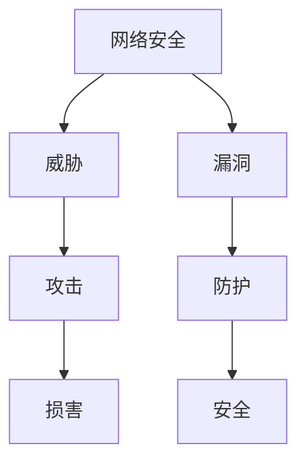

                 

### 文章标题

《网络安全创业：数字时代的守护者》

> 关键词：网络安全、创业、数字时代、防护策略、技术发展

> 摘要：本文从网络安全基础、创业实战、未来发展三个方面深入探讨网络安全创业的重要性、挑战与机遇，为数字时代的守护者提供实用的策略与方向。

### 《网络安全创业：数字时代的守护者》目录大纲

#### 第一部分：网络安全基础

**第1章：网络安全概述**

- 网络安全的概念与重要性
- 网络安全的三大要素
- 网络安全的威胁类型
- 网络安全的防护策略

**第2章：网络安全技术**

- 防火墙技术
- 入侵检测系统
- 虚拟专用网络
- 数据加密技术

**第3章：网络安全法律与标准**

- 网络安全法律法规
- 国际网络安全标准
- 我国网络安全标准体系

#### 第二部分：网络安全创业实战

**第4章：网络安全创业机会**

- 网络安全市场的现状与趋势
- 创业者应具备的网络安全知识
- 创业者的网络安全战略规划

**第5章：网络安全产品开发**

- 网络安全产品的需求分析
- 网络安全产品的设计与实现
- 网络安全产品的测试与部署

**第6章：网络安全项目管理**

- 网络安全项目的计划与执行
- 网络安全项目的风险管理与应对策略
- 网络安全项目的质量控制

**第7章：网络安全创业案例分析**

- 成功的网络安全创业案例
- 失败的网络安全创业案例
- 从案例中学习网络安全创业经验

#### 第三部分：网络安全创业未来发展

**第8章：网络安全创业的未来趋势**

- 网络安全技术的发展方向
- 网络安全创业的新模式
- 网络安全创业的国际合作与竞争

**第9章：网络安全创业者的自我提升**

- 技术能力的提升
- 管理能力的提升
- 创业心态的调整

**第10章：网络安全创业者的社会责任**

- 网络安全创业者的社会角色
- 网络安全创业的社会责任
- 实现社会责任的路径与方法

**附录**

- **附录A：网络安全创业工具与资源**

  - 主流网络安全工具介绍
  - 网络安全学习资源推荐
  - 网络安全创业相关书籍与文章推荐

### 核心概念与联系

为了更好地理解网络安全，我们需要首先明确几个核心概念：

- **网络安全（Cybersecurity）**：确保互联网、计算机系统和网络不受未经授权的访问、使用、披露、破坏、修改或破坏。
- **威胁（Threat）**：任何可能对网络安全构成危害的因素，如恶意软件、网络攻击等。
- **漏洞（Vulnerability）**：系统中存在的可能被威胁利用的弱点。
- **防护（Mitigation）**：采取的措施来减少或消除安全风险。

以下是网络安全核心概念的 Mermaid 流程图：



### 网络安全的重要性

在数字时代，网络安全已成为企业和个人生存与发展的关键。以下是一些关键点：

- **数据泄露**：数据泄露可能导致严重损失，包括财务损失、声誉受损和法律诉讼。
- **业务中断**：网络攻击可能导致业务中断，影响客户关系和公司利润。
- **法律法规**：许多国家和地区都有严格的网络安全法规，违反法规可能导致巨额罚款。
- **社会影响**：网络攻击可能影响国家安全、社会稳定和公共安全。

### 网络安全的三大要素

网络安全的核心在于保护系统的三个关键方面：

- **保密性（Confidentiality）**：确保信息只能被授权的个人或系统访问。
- **完整性（Integrity）**：确保数据在传输和存储过程中未被篡改。
- **可用性（Availability）**：确保系统和数据在需要时能够被访问和使用。

这三个要素通常被简称为CIA，是网络安全设计的基石。

### 网络安全的威胁类型

网络安全面临的威胁多种多样，以下是一些常见的威胁类型：

- **恶意软件（Malware）**：包括病毒、蠕虫、木马等，旨在破坏、窃取或篡改数据。
- **网络攻击（Network Attack）**：包括拒绝服务攻击（DDoS）、分布式拒绝服务攻击（DDoS）、窃取攻击等。
- **社会工程学（Social Engineering）**：通过欺骗手段诱骗用户泄露敏感信息。
- **网络钓鱼（Phishing）**：通过伪装成合法机构或个人，诱骗用户提供敏感信息。
- **中间人攻击（Man-in-the-Middle Attack）**：攻击者在通信双方之间拦截和篡改数据。

### 网络安全的防护策略

为了应对各种网络安全威胁，需要采取一系列防护策略：

- **防火墙（Firewall）**：监控网络流量，防止未经授权的访问。
- **入侵检测系统（IDS）**：检测和响应网络入侵行为。
- **安全信息与事件管理系统（SIEM）**：收集、监控和分析安全事件，提供实时响应。
- **数据加密（Data Encryption）**：保护数据的保密性和完整性。
- **访问控制（Access Control）**：确保只有授权用户才能访问系统和数据。
- **员工培训与意识提升**：提高员工对网络安全威胁的认识，防止内部威胁。

### 核心算法原理讲解

为了深入理解网络安全技术，我们需要了解一些核心算法原理。以下是一个简化的数据加密算法的伪代码：

```python
def encrypt(plaintext, key):
    ciphertext = ""
    for char in plaintext:
        shift = key % 26
        encrypted_char = chr((ord(char) - ord('a') + shift) % 26 + ord('a'))
        ciphertext += encrypted_char
    return ciphertext

def decrypt(ciphertext, key):
    plaintext = ""
    for char in ciphertext:
        shift = key % 26
        decrypted_char = chr((ord(char) - ord('a') - shift) % 26 + ord('a'))
        plaintext += decrypted_char
    return plaintext
```

这个算法使用凯撒密码进行加密和解密，通过对每个字符进行简单的位移操作。实际应用中，加密算法要复杂得多，以提供更强的安全性。

### 数学模型和公式

在网络安全领域，数学模型和公式经常用于分析和设计安全系统。以下是一个简单的数学模型，用于评估网络攻击的成功率：

$$
成功率 = \frac{威胁数量 \times 漏洞利用概率}{防护措施有效性}
$$

这个模型可以帮助我们评估在给定威胁和漏洞条件下，网络攻击的成功率。通过调整防护措施的有效性，我们可以降低攻击成功率。

### 网络安全技术的深入探讨

在了解了网络安全的基本概念和原理后，我们需要进一步探讨网络安全技术，以应对日益复杂的网络威胁。

#### 防火墙技术

防火墙是网络安全的第一道防线，它通过监控网络流量并阻止未经授权的访问，来保护内部网络。防火墙的工作原理可以分为以下几步：

1. **定义网络区域**：防火墙将网络划分为不同的区域，如内部网络、外部网络和可信网络，每个区域都有自己的安全策略。
2. **监控网络流量**：防火墙监控进出各个区域的网络流量，检查数据包的源地址、目的地址、端口号等信息。
3. **应用安全策略**：根据定义的安全策略，防火墙允许或拒绝网络流量。这些策略可以基于源地址、目的地址、端口号等条件进行配置。
4. **日志记录**：防火墙记录网络流量的详细信息，如访问时间、访问次数等，以便进行审计和监控。

防火墙可以分为以下几种类型：

- **包过滤防火墙**：根据数据包的源地址、目的地址、端口号等基本信息进行过滤。
- **状态检测防火墙**：在包过滤的基础上，跟踪数据包的连接状态，提供更精细的过滤能力。
- **应用层防火墙**：工作在应用层，可以识别和过滤特定应用层协议的数据包。

#### 入侵检测系统

入侵检测系统（IDS）是一种监控网络流量和系统活动，以识别潜在威胁和入侵行为的工具。IDS可以分为以下几类：

- **网络入侵检测系统（NIDS）**：监控网络流量，识别网络攻击。
- **主机入侵检测系统（HIDS）**：监控主机系统的日志文件和系统活动，识别主机上的威胁。
- **基于行为的入侵检测系统**：通过分析网络流量和系统活动的行为特征，识别异常行为。

IDS的工作原理可以分为以下几步：

1. **数据采集**：IDS从网络流量和主机系统日志中采集数据。
2. **预处理**：对采集的数据进行过滤和预处理，提取有用的信息。
3. **特征匹配**：将预处理后的数据与预定义的威胁特征库进行匹配，识别潜在的威胁。
4. **响应**：对检测到的威胁进行响应，如记录日志、报警或阻止攻击。

#### 虚拟专用网络

虚拟专用网络（VPN）是一种通过加密技术在公共网络上建立安全通信通道的技术。VPN的主要功能是：

- **加密通信**：VPN使用加密算法对数据进行加密，确保数据在传输过程中的保密性。
- **身份验证**：VPN要求用户进行身份验证，确保只有授权用户可以访问网络。
- **隐藏IP地址**：VPN隐藏用户的真实IP地址，防止第三方追踪用户活动。

VPN的常见实现方式包括：

- **隧道协议**：如IPSec、SSL/TLS等，用于建立加密通道。
- **客户端/服务器模型**：用户通过VPN客户端连接到VPN服务器，服务器再连接到目标网络。
- **网关/网关模型**：VPN网关之间直接建立加密通道，实现远程网络的互联。

#### 数据加密技术

数据加密技术是保护数据保密性和完整性的重要手段。常见的加密算法包括：

- **对称加密算法**：如AES、DES等，加密和解密使用相同的密钥。
- **非对称加密算法**：如RSA、ECC等，加密和解密使用不同的密钥。
- **哈希算法**：如SHA-256、MD5等，用于生成数据的数字指纹，确保数据的完整性。

数据加密技术的主要应用场景包括：

- **数据传输加密**：在数据传输过程中使用加密算法，确保数据在传输过程中的保密性和完整性。
- **存储加密**：在存储设备上对数据进行加密，防止未经授权的访问。
- **身份认证**：使用加密算法进行身份验证，确保只有授权用户可以访问系统和数据。

### 网络安全法律与标准

网络安全法律与标准是确保网络安全的重要基石，它们为网络安全提供了法律依据和技术指导。以下是对网络安全法律与标准的详细探讨。

#### 网络安全法律法规

网络安全法律法规是规范网络行为、保护网络空间安全的重要手段。不同国家和地区的网络安全法律各有特色，但通常包括以下主要内容：

1. **数据保护法**：如欧盟的《通用数据保护条例》（GDPR）和美国加州的《消费者隐私法案》（CCPA），规定了个人数据的收集、存储、使用和分享方式，保护个人隐私权利。
2. **网络犯罪法**：如美国的《计算机欺诈与滥用法》（CFAA）和《网络钓鱼法》，规定了网络犯罪行为，包括黑客攻击、网络钓鱼、诈骗等。
3. **网络安全法**：如中国的《网络安全法》和俄罗斯的《信息安全法》，规定了网络运营者的安全义务、网络信息内容管理、网络安全事件应对等。

#### 国际网络安全标准

国际网络安全标准由国际标准化组织（ISO）和国际电信联盟（ITU）等国际机构制定，为全球网络安全提供了技术指南。以下是一些重要的国际网络安全标准：

1. **ISO/IEC 27001**：信息安全管理体系（ISMS）标准，规定了建立、实施、维护和持续改进信息安全管理体系的要求。
2. **ISO/IEC 27002**：信息安全控制标准，提供了信息安全控制的实施指南。
3. **ISO/IEC 27017**：云计算信息安全控制标准，规定了云计算环境中信息安全控制的要求。
4. **ISO/IEC 27018**：个人数据处理信息安全控制标准，规定了处理个人数据时所需遵循的信息安全要求。

#### 我国网络安全标准体系

我国网络安全标准体系由国家标准的强制性标准和推荐性标准组成，涵盖了网络安全管理的各个层面。以下是我国网络安全标准体系中的几个重要标准：

1. **GB/T 22239**：信息安全技术—网络安全等级保护基本要求，规定了网络安全等级保护的基本要求和实施指南。
2. **GB/T 35279**：信息安全技术—网络安全事件报告标准，规定了网络安全事件的报告流程和管理要求。
3. **GB/T 32779**：信息安全技术—信息安全风险评估标准，规定了信息安全风险评估的方法和实施步骤。
4. **GB/T 33484**：信息安全技术—网络安全防护指南，提供了网络安全防护的技术指南和建议。

#### 网络安全法律法规与标准的关系

网络安全法律法规与标准之间存在密切的联系。法律法规提供了网络安全的基本法律框架和责任规定，而标准则提供了具体的技术实现指南和操作规范。

1. **法律法规对标准的支持**：法律法规通常要求组织和企业遵循相关的标准，以确保其信息安全管理体系和技术措施的合规性。
2. **标准对法律法规的补充**：标准为法律法规的实施提供了具体的技术指导，帮助组织和企业更好地理解和执行法律法规要求。

总之，网络安全法律与标准共同构建了网络安全的法治和技术基础，为数字时代的安全保障提供了有力支持。

### 网络安全创业机会

随着数字化转型的加速，网络安全市场的需求日益增长，为创业者提供了丰富的机会。以下是对网络安全市场现状与趋势的详细分析，以及创业者应具备的网络安全知识和战略规划。

#### 网络安全市场的现状

1. **市场需求增长**：随着云计算、大数据、物联网和人工智能等技术的广泛应用，网络安全需求不断增加。根据Gartner的预测，全球网络安全市场规模将从2020年的1510亿美元增长到2025年的2310亿美元。
2. **政府重视**：各国政府纷纷出台网络安全法律法规，加强对网络安全的监管和支持。例如，欧盟的《通用数据保护条例》（GDPR）和中国的《网络安全法》都对网络安全提出了严格要求。
3. **技术创新**：随着网络安全技术的发展，新兴技术如人工智能、区块链、物联网安全等正在逐渐成为网络安全市场的新热点。

#### 网络安全市场的趋势

1. **云计算安全**：随着云计算的普及，云计算安全成为企业关注的重点。创业者可以开发针对云计算环境的网络安全产品和服务，如云安全审计、云安全管理等。
2. **物联网安全**：物联网设备的普及带来了巨大的安全挑战。创业者可以专注于物联网设备的安全防护、数据安全传输等方面的技术研究和产品开发。
3. **人工智能安全**：人工智能技术在网络安全中的应用日益广泛，如威胁检测、自动化响应等。创业者可以探索人工智能在网络安全领域的创新应用。
4. **数据安全**：随着数据隐私保护法规的加强，数据安全成为企业关注的重点。创业者可以开发数据加密、数据脱敏、数据安全存储等产品。

#### 创业者应具备的网络安全知识

1. **技术知识**：创业者应具备一定的网络安全技术背景，了解常见的安全威胁、防护技术和漏洞利用方法。熟悉防火墙、入侵检测系统、数据加密等技术原理。
2. **法律法规知识**：了解网络安全相关的法律法规，如《网络安全法》、《通用数据保护条例》等，确保创业项目符合法规要求。
3. **项目管理能力**：具备项目管理和团队协作能力，确保创业项目能够按时、按质完成。
4. **市场洞察力**：了解市场需求和竞争态势，为创业项目制定合理的市场战略。

#### 创业者的网络安全战略规划

1. **市场定位**：明确创业项目的市场定位，选择具有潜力的细分市场，如云计算安全、物联网安全等。
2. **技术研发**：组建技术研发团队，持续投入资金和人力进行技术研究和产品开发。
3. **合作伙伴**：与行业内的技术合作伙伴建立合作关系，共同开发市场，提升市场竞争力。
4. **营销推广**：制定有效的营销策略，通过线上线下渠道进行推广，吸引潜在客户。
5. **法律法规遵守**：确保创业项目符合相关法律法规要求，避免法律风险。

总之，网络安全创业者在抓住市场机遇的同时，还需要具备扎实的专业知识、项目管理能力和市场洞察力，制定合理的战略规划，才能在激烈的市场竞争中脱颖而出。

### 网络安全产品开发

在网络安全领域，产品开发是一个复杂且要求极高的过程，涉及多个步骤和技术。以下将从需求分析、产品设计与实现、产品测试与部署等方面详细探讨网络安全产品的开发过程。

#### 需求分析

需求分析是产品开发的第一步，也是至关重要的一步。它决定了产品能否满足用户的需求和市场预期。以下是需求分析的主要步骤：

1. **确定目标用户**：明确目标用户群体，包括企业用户和个人用户，不同用户对安全产品的需求和关注点可能有所不同。
2. **了解市场需求**：通过市场调研、用户访谈、竞争分析等方式，了解市场需求和竞争态势，发现潜在的机会和挑战。
3. **需求收集**：收集用户的具体需求，包括功能需求、性能需求、安全需求等。功能需求通常包括用户希望实现的具体功能，如入侵检测、数据加密等；性能需求涉及系统性能指标，如响应时间、处理能力等；安全需求关注系统的安全防护能力，如防范网络攻击、数据泄露等。
4. **需求整理与验证**：对收集到的需求进行整理和分类，确保需求的完整性和一致性。通过与用户和利益相关者进行沟通，验证需求的准确性和可行性。

#### 产品设计与实现

在需求分析的基础上，进行产品设计与实现。以下是产品设计与实现的主要步骤：

1. **系统架构设计**：根据需求分析结果，设计系统的总体架构，包括硬件架构、软件架构和数据架构。系统架构应具有高扩展性、高可靠性和高安全性。
2. **模块划分**：将系统划分为多个模块，每个模块负责实现特定的功能，如入侵检测模块、加密模块、日志管理模块等。
3. **详细设计**：对每个模块进行详细设计，包括数据结构、算法和接口设计。详细设计应充分考虑系统的性能、安全性和可维护性。
4. **代码实现**：根据详细设计，进行代码编写和模块实现。代码实现应遵循良好的编程规范，确保代码的可读性和可维护性。
5. **集成与调试**：将各个模块进行集成，进行系统调试和测试，确保系统功能的完整性和正确性。

#### 产品测试与部署

产品测试与部署是确保产品质量和性能的关键步骤。以下是产品测试与部署的主要步骤：

1. **单元测试**：对各个模块进行单元测试，确保模块的功能和性能符合设计要求。单元测试通常使用自动化测试工具进行。
2. **集成测试**：将各个模块进行集成，进行集成测试，确保模块之间的接口和交互正确无误。集成测试通常包括功能测试、性能测试和安全性测试。
3. **系统测试**：对整个系统进行系统测试，确保系统的整体功能和性能符合设计要求。系统测试通常包括功能测试、性能测试、安全测试和用户接受测试。
4. **部署**：在测试通过后，将产品部署到实际环境中，包括硬件安装、软件配置和系统初始化。部署过程中应确保系统的稳定性和安全性。
5. **上线与监控**：产品上线后，进行实时监控和运维，确保系统的正常运行。监控内容包括系统性能、安全事件和用户反馈等。

#### 案例分析

以下是一个网络安全产品开发的实际案例，用于进一步说明产品开发的过程：

**项目背景**：一家企业希望开发一款针对云计算环境的网络安全产品，提供实时入侵检测和响应功能。

**需求分析**：
- **目标用户**：云计算服务提供商和企业用户。
- **市场需求**：保护云计算环境免受网络攻击和数据泄露。
- **功能需求**：实时入侵检测、自动化响应、日志管理、报告生成等。

**产品设计与实现**：
- **系统架构设计**：采用分布式架构，包括前端收集模块、后端分析模块和数据库模块。
- **模块划分**：前端收集模块负责从网络流量中提取数据；后端分析模块负责对数据进行实时分析和处理；数据库模块负责存储和管理数据。
- **详细设计**：前端收集模块采用网络流量分析技术，后端分析模块采用机器学习算法进行入侵检测，数据库模块采用分布式存储技术。
- **代码实现**：使用Python和Java进行开发，遵循MVC架构模式，确保代码的可维护性和可扩展性。
- **集成与调试**：将前端、后端和数据库模块进行集成，进行系统调试和测试，确保系统的稳定性和性能。

**产品测试与部署**：
- **单元测试**：对各个模块进行单元测试，确保模块的功能和性能符合设计要求。
- **集成测试**：对整个系统进行集成测试，确保模块之间的接口和交互正确无误。
- **系统测试**：对整个系统进行系统测试，确保系统的整体功能和性能符合设计要求。
- **部署**：将产品部署到云计算环境，包括硬件安装、软件配置和系统初始化。
- **上线与监控**：产品上线后，进行实时监控和运维，确保系统的正常运行。

通过以上案例，我们可以看到网络安全产品开发的过程涉及多个步骤和技术，需要综合考虑市场需求、技术实现和系统性能等多方面因素。只有经过详细的需求分析、精心设计和严格测试，才能确保产品的质量和性能，满足用户的需求。

### 网络安全项目管理

在网络安全产品开发过程中，项目管理是确保项目顺利进行、按时交付并符合质量要求的关键环节。以下将从项目计划与执行、风险管理与应对策略、质量控制等方面详细探讨网络安全项目管理的具体方法。

#### 项目计划与执行

项目计划是项目管理的第一步，它为项目的执行提供了明确的指导和时间表。以下是项目计划与执行的主要步骤：

1. **项目立项**：明确项目的目标和范围，制定项目立项文档，包括项目背景、目标、范围、可行性分析等。
2. **需求分析**：详细收集和分析用户需求，确定项目的具体功能和性能要求，编写需求说明书。
3. **制定项目计划**：制定详细的项目计划，包括项目进度计划、资源分配计划、成本预算计划等。项目进度计划应明确项目的里程碑和关键路径，资源分配计划应确保项目资源的合理利用，成本预算计划应控制项目的费用支出。
4. **执行项目计划**：按照项目计划进行项目执行，确保各项任务按时完成。项目经理应定期召开项目会议，跟踪项目进度，协调资源，解决项目中的问题和障碍。
5. **监控与调整**：定期监控项目进度和成本，与项目计划进行对比，发现偏差及时调整。如果项目进度滞后或成本超支，应采取相应的措施进行纠正。

#### 风险管理与应对策略

在网络安全项目中，风险管理是确保项目顺利进行的重要环节。以下是风险管理与应对策略的主要步骤：

1. **识别风险**：通过项目团队讨论、专家咨询、历史数据分析等方法，识别项目可能面临的风险。风险可以分为技术风险、市场风险、资源风险、法律风险等。
2. **评估风险**：对识别出的风险进行评估，包括风险发生的可能性、影响程度和紧急程度。评估结果可用于制定风险应对策略。
3. **制定风险应对策略**：根据评估结果，制定相应的风险应对策略，包括风险回避、风险转移、风险减轻和风险接受。对于高风险，应制定详细的应对措施和应急计划。
4. **执行风险应对策略**：在项目执行过程中，根据风险应对策略进行风险控制和应对。如果风险发生，应迅速采取相应的措施进行应对。

#### 质量控制

质量控制是确保项目交付成果符合质量标准的关键环节。以下是质量控制的主要步骤：

1. **制定质量标准**：根据项目需求和用户要求，制定项目的质量标准，包括功能质量、性能质量、安全质量等。
2. **实施质量控制**：在项目开发过程中，按照质量标准进行质量控制。质量控制包括单元测试、集成测试、系统测试等。
3. **质量评审**：定期进行质量评审，检查项目的质量是否符合标准，发现质量问题及时进行纠正。
4. **持续改进**：根据质量评审的结果，持续改进项目的质量管理体系和过程，提高项目的质量。

#### 案例分析

以下是一个网络安全项目管理的实际案例，用于进一步说明项目管理的方法：

**项目背景**：一家企业计划开发一款物联网安全监控平台，用于实时监控和防范物联网设备的安全威胁。

**项目计划与执行**：
- **项目立项**：明确项目目标和范围，包括实时监控物联网设备、防范恶意攻击、提供安全报告等。
- **需求分析**：通过用户调研和专家咨询，收集物联网设备的安全需求，编写需求说明书。
- **制定项目计划**：制定详细的项目计划，包括项目进度计划、资源分配计划、成本预算计划等。项目进度计划明确项目的里程碑，如需求分析、系统设计、编码实现、测试等。
- **执行项目计划**：按照项目计划进行项目执行，项目经理定期召开项目会议，跟踪项目进度，协调资源，解决项目中的问题和障碍。
- **监控与调整**：定期监控项目进度和成本，与项目计划进行对比，发现偏差及时调整。

**风险管理与应对策略**：
- **识别风险**：识别项目可能面临的风险，如技术风险（物联网设备多样性和兼容性）、市场风险（用户接受度和市场竞争）、资源风险（开发人员技能和资源调度）等。
- **评估风险**：对识别出的风险进行评估，确定风险的可能性和影响程度。
- **制定风险应对策略**：对高风险制定详细的应对措施，如技术风险通过技术调研和方案选择进行缓解，市场风险通过市场调研和产品定位进行应对。
- **执行风险应对策略**：在项目执行过程中，根据风险应对策略进行风险控制和应对。

**质量控制**：
- **制定质量标准**：根据项目需求和用户要求，制定项目的质量标准，包括功能质量（设备监控功能完整性）、性能质量（系统响应时间）、安全质量（安全防护能力）等。
- **实施质量控制**：在项目开发过程中，按照质量标准进行质量控制。对物联网设备进行兼容性测试、功能测试和性能测试，确保系统的质量和稳定性。
- **质量评审**：定期进行质量评审，检查项目的质量是否符合标准，发现质量问题及时进行纠正。
- **持续改进**：根据质量评审的结果，持续改进项目的质量管理体系和过程，提高项目的质量。

通过以上案例分析，我们可以看到网络安全项目管理涉及多个方面，需要综合考虑项目计划、风险管理和质量控制等因素。只有通过科学的项目管理方法，才能确保网络安全项目顺利进行，按时交付并符合质量要求。

### 网络安全创业案例分析

在网络安全创业领域，既有成功的典范，也有失败的教训。以下将通过具体案例，分析成功和失败的创业经验，以帮助创业者更好地理解和应对网络安全创业中的挑战。

#### 成功的网络安全创业案例

**案例一：CrowdStrike**

- **背景**：CrowdStrike成立于2011年，是一家提供云端的端点保护和威胁检测解决方案的公司。
- **成功因素**：
  - **技术创新**：CrowdStrike推出的CrowdStrike Falcon平台，采用云原生技术，实现了高效的端点保护和威胁检测。
  - **市场定位**：精准定位大型企业市场，满足企业对安全防护和合规需求。
  - **客户关系**：通过与客户建立紧密的合作关系，持续优化产品和服务，赢得客户信任。
  - **资金支持**：获得多家知名投资机构的资金支持，加速公司发展和市场扩张。

**案例二：Palo Alto Networks**

- **背景**：Palo Alto Networks成立于2005年，是一家提供下一代防火墙和其他网络安全解决方案的领导者。
- **成功因素**：
  - **持续创新**：公司持续投入研发，推出多项新技术，如基于人工智能的威胁检测和响应。
  - **全球化战略**：积极拓展国际市场，与全球领先的电信运营商和云计算服务提供商合作。
  - **品牌建设**：通过参加行业会议、发布白皮书和研究成果，提升品牌知名度和影响力。
  - **资本运作**：成功在美国纳斯达克上市，增强了公司资本实力和市场竞争力。

#### 失败的网络安全创业案例

**案例一：Silicon Gray Slacks**

- **背景**：Silicon Gray Slacks成立于2013年，是一家提供网络威胁情报服务的初创公司。
- **失败原因**：
  - **市场定位错误**：公司最初定位为个人用户市场，但未能吸引足够的客户。
  - **资金短缺**：由于市场定位错误，导致客户收入不足，资金链紧张。
  - **技术落后**：竞争对手推出了更先进的技术，使得Silicon Gray Slacks的产品逐渐失去竞争力。
  - **管理不善**：公司管理团队缺乏经验，无法有效应对市场变化和技术挑战。

**案例二：Internet Security Systems**

- **背景**：Internet Security Systems（ISS）成立于1994年，曾是美国领先的网络安全服务提供商。
- **失败原因**：
  - **并购扩张过快**：ISS在短短几年内进行了多次并购，导致公司管理混乱、资源分散。
  - **技术更新滞后**：未能及时跟进网络安全技术发展，产品和技术逐渐落后。
  - **市场竞争激烈**：面对日益激烈的市场竞争，ISS的市场份额逐渐下降。
  - **管理不善**：公司高层频繁更换，管理层缺乏稳定性和远见，导致公司战略方向失误。

#### 从案例中学习网络安全创业经验

1. **明确市场定位**：创业者应准确把握市场需求，为产品和服务找到合适的目标客户群体。
2. **持续技术创新**：紧跟网络安全技术发展，不断推出新技术和新产品，保持竞争力。
3. **建立稳定的客户关系**：通过优质的产品和服务赢得客户信任，建立长期合作关系。
4. **合理管理资金**：确保资金充足，避免因资金短缺导致业务停滞或失败。
5. **重视团队建设**：组建经验丰富、执行力强的团队，为公司的稳定发展提供保障。

通过以上分析，我们可以看到，成功的网络安全创业公司往往具备明确的市场定位、持续的技术创新、稳定的客户关系和有效的资金管理。而失败的创业公司则往往在市场定位、资金管理、技术创新和团队建设方面存在问题。创业者可以从这些成功和失败的案例中汲取经验，少走弯路，提高创业成功的几率。

### 网络安全创业的未来趋势

随着数字技术的不断进步，网络安全创业领域也面临着新的机遇与挑战。以下将探讨网络安全创业的未来趋势，包括技术的发展方向、新的商业模式以及国际合作与竞争等方面。

#### 网络安全技术的发展方向

1. **人工智能与机器学习**：人工智能和机器学习在网络安全中的应用日益广泛，可以提高威胁检测和响应的效率和准确性。例如，通过机器学习算法可以实时分析网络流量和日志数据，识别异常行为和潜在威胁。
2. **区块链技术**：区块链技术以其去中心化、不可篡改的特性在网络安全领域显示出巨大潜力。通过区块链技术可以实现数据的安全存储和传输，提高数据的安全性和可信度。
3. **物联网安全**：随着物联网设备的普及，物联网安全成为重要的研究方向。物联网设备的安全防护、数据隐私保护以及设备间的安全通信都是未来研究的重要方向。
4. **量子计算与量子加密**：量子计算具有极高的计算速度，未来可能对现有的加密技术构成威胁。同时，量子加密技术的研究也在不断深入，可以提供更高的安全防护能力。
5. **5G与边缘计算**：5G技术和边缘计算的快速发展，将带来更多的网络连接和计算需求，同时也带来了新的安全挑战。网络安全创业公司需要关注5G和边缘计算环境下的安全防护技术和方案。

#### 网络安全创业的新模式

1. **平台化服务**：随着云计算和SaaS（软件即服务）模式的普及，网络安全创业公司可以通过提供平台化的服务来降低客户的使用门槛，实现更广泛的覆盖。例如，通过云平台提供网络安全解决方案，客户可以按需购买和使用。
2. **协作防御**：在复杂的网络威胁环境中，单一企业难以独自应对。网络安全创业公司可以通过建立协作防御机制，与客户、同行以及第三方安全机构合作，共同应对网络威胁。
3. **安全托管服务**：提供安全托管服务，如安全事件响应、安全架构设计、安全培训等，可以帮助客户集中精力发展核心业务，同时获得专业的安全服务。
4. **安全咨询与服务**：为企业提供网络安全咨询和评估服务，帮助企业识别潜在的安全风险，制定和实施安全策略。
5. **安全社区与生态**：建立网络安全社区和生态系统，促进信息共享、技术交流和合作，提高整个行业的整体安全水平。

#### 网络安全创业的国际合作与竞争

1. **全球市场竞争**：随着网络安全需求的增长，全球市场竞争日益激烈。网络安全创业公司需要关注全球市场的动态，抓住国际市场的机遇。
2. **跨国合作与联盟**：通过跨国合作和联盟，可以整合全球资源，提高竞争力。例如，与海外知名企业和研究机构合作，共同开发新技术和新产品。
3. **合规与标准**：不同国家和地区对网络安全的法规和标准有所不同。创业公司需要了解和遵守各地的法律法规，确保产品和服务的合规性。
4. **技术创新与合作**：网络安全技术的快速发展需要不断的创新和合作。创业公司可以通过与高校、研究机构合作，共同开展技术研究和创新。

总之，网络安全创业的未来充满了机遇和挑战。创业者需要紧跟技术发展趋势，探索新的商业模式，加强国际合作，以应对快速变化的市场环境，实现持续发展和成功。

### 网络安全创业者的自我提升

在网络安全创业的道路上，个人能力的提升是确保团队发展和项目成功的关键。以下将从技术能力、管理能力和创业心态三个方面，探讨网络安全创业者如何进行自我提升。

#### 技术能力的提升

1. **持续学习**：网络安全技术发展迅速，创业者需要不断学习最新的技术和工具。通过阅读专业书籍、参加技术会议、在线课程等方式，保持对技术前沿的了解。
2. **实践经验**：理论知识需要通过实践来巩固。创业者可以参与开源项目，或者实际操作网络安全产品和系统，积累实际经验。
3. **技术交流**：参加技术社群和论坛，与同行交流经验和心得，分享技术见解，拓宽视野，提高解决问题的能力。
4. **技术认证**：考取相关技术认证，如CISSP、CEH等，可以证明自己在网络安全领域的专业能力，增强市场竞争力。

#### 管理能力的提升

1. **团队建设**：创业者需要了解团队管理的基本原则和方法，包括招聘、培训、激励和团队协作等。通过建立有效的团队管理体系，提高团队的整体效率和凝聚力。
2. **项目管理**：掌握项目管理的方法和工具，如敏捷开发、Scrum等，确保项目能够按时、按质完成。学习如何制定项目计划、分配任务、监控进度和风险管理。
3. **领导力**：培养领导力，能够激励团队、凝聚人心。通过参加领导力培训、阅读领导力书籍等方式，提升自己的领导能力。
4. **沟通能力**：提高沟通能力，确保信息传递的准确性和有效性。良好的沟通能力有助于团队协作，减少误解和冲突。

#### 创业心态的调整

1. **乐观心态**：创业过程中难免会遇到挫折和困难，创业者需要保持乐观心态，积极面对挑战。乐观的心态有助于创业者克服困难，保持前进的动力。
2. **韧性**：创业者需要具备韧性，能够在面对失败和挑战时迅速恢复，并从中吸取教训。韧性是成功创业者的必备品质。
3. **耐心**：创业是一个长期的过程，需要耐心和毅力。创业者应保持长期视角，不为短期利益所动，专注于长远发展。
4. **适应性**：在快速变化的市场环境中，创业者需要具备良好的适应性，能够迅速调整战略和方向，以应对市场变化。

总之，网络安全创业者通过提升技术能力、管理能力和调整创业心态，可以更好地应对创业中的各种挑战，实现个人和团队的发展。持续学习和自我提升，是创业成功的重要保障。

### 网络安全创业者的社会责任

作为网络安全创业者的我们，不仅肩负着推动技术进步和商业成功的责任，更承载着维护网络安全、保护公众利益的社会使命。以下将探讨网络安全创业者的社会角色、社会责任以及实现社会责任的路径与方法。

#### 社会角色

1. **安全守护者**：网络安全创业者的首要任务是保护网络安全，防止网络攻击和数据泄露。作为网络安全领域的专业人才，创业者应成为数字时代的守护者，确保网络空间的安全和稳定。
2. **行业引领者**：创业者通过技术创新和商业模式的探索，引领网络安全行业的发展。他们应推动行业标准的制定，引领行业向更安全、更高效的方向发展。
3. **社会责任传播者**：创业者通过自身的实践和影响力，传播网络安全知识和意识，提高公众对网络安全的认识，共同构建安全、健康的网络环境。

#### 社会责任

1. **数据保护**：创业者有责任确保用户数据的安全和隐私。这包括采用最新的加密技术、严格的访问控制措施以及完善的数据安全策略。
2. **技术开源**：通过开源项目，创业者可以将技术创新和经验分享给社区，推动整个行业的进步。开源项目不仅能提升公司的技术实力，还能增强社会对网络安全技术的信任。
3. **公益项目**：创业者可以通过参与或发起公益项目，帮助弱势群体和中小型企业提高网络安全水平。例如，为贫困地区的学校提供网络安全培训，为中小企业提供免费的安全咨询服务。
4. **政策倡导**：创业者可以通过参与行业研讨会、发表专业见解等方式，为网络安全政策的制定提供参考，推动政府和社会更加重视网络安全。

#### 实现社会责任的路径与方法

1. **产品与服务**：将社会责任融入产品和服务的开发过程中，提供安全、可靠的产品和服务。例如，在产品设计中考虑隐私保护、数据加密和安全审计等功能。
2. **合作与共建**：与其他网络安全企业、研究机构和政府部门合作，共同推动网络安全技术的发展和应用。通过建立联盟、共享资源和信息，形成合力，共同应对网络安全挑战。
3. **人才培养**：通过校企合作、专业培训等方式，培养更多的网络安全人才。创业者可以通过设立奖学金、实习机会等方式，支持年轻一代投身网络安全领域。
4. **社区参与**：积极参与网络安全社区的活动，如举办技术分享会、参与开源项目等。通过社区活动，传播网络安全知识，增强公众的网络安全意识。
5. **持续创新**：不断推动技术创新，开发新的安全解决方案，应对日益复杂的网络威胁。通过技术创新，提升整个行业的防护能力，为社会提供更可靠的安全保障。

总之，网络安全创业者应认识到自己在社会中的角色和责任，积极履行社会责任，推动网络安全技术的发展和应用。通过多种路径和方法，实现个人价值和社会价值的高度统一，为构建一个安全、健康的网络环境贡献自己的力量。

### 附录A：网络安全创业工具与资源

在网络安全创业的过程中，掌握合适的工具和资源对于提高效率、确保项目的成功至关重要。以下将介绍一些主流的网络安全工具、学习资源以及推荐的相关书籍与文章，以帮助创业者更好地开展网络安全创业工作。

#### 主流网络安全工具

1. **防火墙**：如Palo Alto Networks、Fortinet等，用于保护网络边界，防止未经授权的访问。
2. **入侵检测与防御系统（IDS/IPS）**：如Splunk、Snort等，用于实时监控和响应网络攻击。
3. **加密工具**：如OpenSSL、GPG等，用于实现数据传输和存储的加密。
4. **漏洞扫描器**：如Nessus、OpenVAS等，用于发现和评估系统中的安全漏洞。
5. **自动化工具**：如Ansible、Puppet等，用于自动化部署和管理网络安全配置。
6. **日志管理工具**：如ELK（Elasticsearch、Logstash、Kibana）等，用于收集、存储和分析安全日志。
7. **云安全工具**：如AWS Security Hub、Azure Security Center等，用于云环境中的安全监控和防护。

#### 网络安全学习资源

1. **在线课程**：
   - **Coursera**：提供多个网络安全相关的在线课程，如“网络安全基础”、“密码学基础”等。
   - **edX**：由哈佛大学和麻省理工学院合作提供，包括“网络安全与加密”等课程。
   - **Udemy**：提供丰富的网络安全专题课程，适合不同层次的学员。

2. **书籍**：
   - 《网络安全实战指南》（"Practical Cybersecurity for Business"）：详细介绍了网络安全的基本概念和实践方法。
   - 《黑客攻防技术宝典：系统实战篇》（"The Art of Exploitation"）：深入剖析了系统漏洞和攻击技术。
   - 《网络安全技术》（"Network Security Essentials"）：全面介绍了网络安全的基础理论和关键技术。

3. **专业社区与论坛**：
   - **Black Hat**：举办年度网络安全会议，提供最新的安全技术和研究。
   - **Defcon**：另一个著名的网络安全会议，汇集了全球顶尖的安全专家和爱好者。
   - **Reddit**：网络安全相关子版块（如r/netsec、r/cryptocurrency）是学习和交流的优质平台。

#### 网络安全创业相关书籍与文章推荐

1. **书籍**：
   - 《创业维艰》（"Hard Things About Hard Things"）：作者本·霍洛维茨分享了他作为创业者的经验和教训。
   - 《精益创业》（"The Lean Startup"）：作者埃里克·莱斯提出了精益创业的方法，适用于创业初期的资源优化和快速迭代。

2. **文章**：
   - **《网络安全创业者的九条生存法则》**：分析了网络安全创业者在市场中立足的九大策略。
   - **《物联网安全：挑战与机遇》**：探讨了物联网设备在网络安全领域的挑战和解决方案。
   - **《从0到1：开启商业与未来的秘密》**：作者彼得·蒂尔分享了关于技术创新和创业的深刻见解。

通过利用上述工具、资源和书籍，网络安全创业者可以更全面地了解网络安全领域的技术和商业实践，为创业项目的成功奠定坚实的基础。不断学习和实践，是提升创业能力、实现创业梦想的关键。

