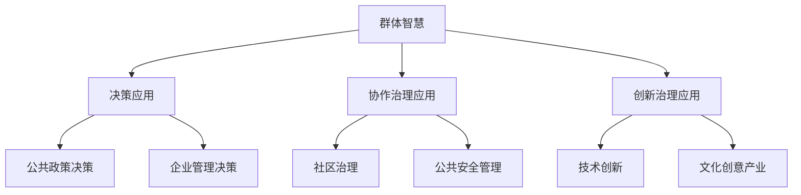

                 

# 《群体智慧与社会治理》

## 关键词

群体智慧、社会治理、分布式计算、协同进化、人工智能、技术创新、公共政策、社区治理、公共安全管理、乡村振兴、挑战与展望

## 摘要

本文旨在探讨群体智慧在现代社会治理中的应用与挑战。通过分析群体智慧的基础理论、计算模型以及在决策、协作治理和创新治理中的实际应用，本文旨在揭示群体智慧在提升社会治理效率、促进社会和谐发展中的潜在价值。同时，本文也将探讨群体智慧在实施过程中面临的挑战及其未来发展趋势，为我国群体智慧与社会治理的发展提供策略建议。

## 第一部分：群体智慧基础

### 第1章：群体智慧概述

#### 1.1 群体智慧的起源与发展

群体智慧的概念起源于自然界中的生物群体行为，如鸟群飞行、鱼群游动等。20世纪末，随着计算机科学和人工智能技术的发展，群体智慧逐渐成为一个独立的学科领域。群体智慧在工程、生态、社会等多个领域展现出广泛的应用前景。

#### 1.2 群体智慧的内涵与特征

群体智慧是指由多个个体通过协同合作，共同完成复杂任务的能力。其特征包括分布式计算、自组织、自适应和协同进化等。

#### 1.3 群体智慧的重要性

群体智慧在现代社会治理中具有重要价值。通过群体智慧，可以有效提高决策效率、促进协作治理、推动创新，从而实现社会和谐发展。

### 第2章：群体智能理论

#### 2.1 群体智能的基本概念

群体智能是指由多个智能个体组成的系统，通过协同合作，实现比单个个体更复杂的问题求解能力。

#### 2.2 群体智能的理论框架

群体智能的理论框架包括个体智能、群体交互、群体行为三个层次。个体智能是指单个个体的智能能力；群体交互是指个体之间的信息交换和协同合作；群体行为是指由群体交互产生的整体行为。

#### 2.3 群体智能的模型与应用

群体智能的模型包括分布式计算模型、演化计算模型和复杂网络模型等。这些模型在实际应用中，如智能交通管理、环境监测、公共安全等领域取得了显著成果。

### 第3章：群体智慧的计算模型

#### 3.1 群体智能的分布式计算模型

分布式计算模型是指由多个计算节点组成的系统，通过并行计算和分布式算法，实现复杂问题的求解。

#### 3.2 群体智能的演化计算模型

演化计算模型是基于自然进化的思想，通过模拟生物进化的过程，实现问题的求解。

#### 3.3 群体智能的复杂网络模型

复杂网络模型是指由多个节点和边组成的网络结构，通过研究网络结构和节点之间的相互作用，实现问题的求解。

## 第二部分：群体智慧在治理中的应用

### 第4章：群体智慧在决策中的应用

#### 4.1 群体决策的概念与机制

群体决策是指多个个体共同参与决策过程，通过协商、讨论等方式，达成共识。

#### 4.2 群体智慧在公共政策决策中的应用

群体智慧在公共政策决策中发挥着重要作用，如政策模拟、民意调查、风险评估等。

#### 4.3 群体智慧在企业管理决策中的应用

群体智慧在企业管理决策中，可以帮助企业实现战略规划、市场分析、产品研发等。

### 第5章：群体智慧在协作治理中的应用

#### 5.1 群体协作的概念与机制

群体协作是指多个个体共同完成一项任务，通过相互配合、资源共享等方式，提高工作效率。

#### 5.2 群体智慧在社区治理中的应用

群体智慧在社区治理中，可以帮助解决社区问题、提升社区服务质量、增强社区凝聚力等。

#### 5.3 群体智慧在公共安全管理中的应用

群体智慧在公共安全管理中，可以帮助实现智能预警、风险评估、应急响应等。

### 第6章：群体智慧在创新治理中的应用

#### 6.1 群体创新的概念与机制

群体创新是指多个个体共同参与创新过程，通过知识共享、协同创造等方式，实现创新。

#### 6.2 群体智慧在技术创新中的应用

群体智慧在技术创新中，可以帮助企业实现技术突破、降低研发成本、提高创新效率等。

#### 6.3 群体智慧在文化创意产业中的应用

群体智慧在文化创意产业中，可以帮助实现创意设计、内容创作、文化传播等。

## 第三部分：群体智慧与社会治理的实践

### 第7章：群体智慧与社会治理案例分析

#### 7.1 群体智慧在抗击新冠疫情中的应用

群体智慧在抗击新冠疫情中，发挥了重要作用，如疫情预测、疫苗研发、资源调配等。

#### 7.2 群体智慧在城市管理中的应用

群体智慧在城市管理中，可以帮助实现智能交通、智慧环保、智慧安防等。

#### 7.3 群体智慧在乡村振兴中的应用

群体智慧在乡村振兴中，可以帮助实现精准脱贫、产业发展、社会治理等。

### 第8章：群体智慧与社会治理的挑战与展望

#### 8.1 群体智慧在治理中的挑战

群体智慧在治理中面临的挑战包括数据隐私、算法透明度、社会公平等。

#### 8.2 群体智慧与社会治理的未来发展趋势

群体智慧与社会治理的未来发展趋势包括：数据驱动的治理、智能化治理、绿色治理等。

#### 8.3 我国群体智慧与社会治理的发展策略

我国群体智慧与社会治理的发展策略包括：加强技术创新、完善法律法规、提升公共服务水平等。

## 附录：群体智慧研究工具与资源

### 附录1：群体智慧研究工具简介

#### 1.1.1 Python下的群体智能工具包

Python下的群体智能工具包包括SWARM、PYSWARM、SWARM3等，这些工具包提供了丰富的群体智能算法和模型，方便研究者进行实验和验证。

#### 1.1.2 MATLAB中的群体智能工具箱

MATLAB中的群体智能工具箱包括OPSW、BIOINTELLIGENT等，这些工具箱提供了强大的群体智能算法和可视化功能，适用于不同领域的群体智能研究。

#### 1.1.3 R语言中的群体智能库

R语言中的群体智能库包括ARTICULATED、OPENMORPH、SMM等，这些库提供了丰富的群体智能算法和数据处理功能，适用于生物信息学、社会科学等领域的群体智能研究。

### 附录2：群体智慧研究资源推荐

#### 2.1.1 群体智慧学术期刊推荐

《群体智能与群体系统》、《智能系统与应用》、《复杂系统与复杂性科学》等。

#### 2.1.2 群体智慧专业书籍推荐

《群体智能：基础与应用》、《社会计算与群体智能》、《群体智能与协同进化》等。

#### 2.1.3 群体智慧在线课程与教程推荐

《群体智能与分布式计算》、《群体智能与复杂网络》、《群体智能与机器学习》等。

## Mermaid 流程图



## 核心算法原理讲解

### 伪代码

```python
# 基于群体智能的决策算法
def GroupDecisionMaking(groupId, decisionContext):
    # 初始化群体成员的状态
    InitializeMembersState(groupId)
    
    # 进行群体成员之间的信息交换
    for member in groupId:
        for other_member in groupId:
            ExchangeInformation(member, other_member)
    
    # 根据信息交换结果进行决策
    decision = CalculateDecision(decisionContext)
    
    # 更新群体成员的状态
    UpdateMembersState(groupId, decision)
    
    return decision
```

### 数学模型和数学公式

#### 群体智能中的协同进化模型

$$
\begin{aligned}
    f(x, y) &= \frac{1}{1 + e^{-(x-y)}}
\end{aligned}
$$

其中，$x$ 和 $y$ 分别表示群体中的两个个体的特征。

## 项目实战

### 代码实际案例和详细解释说明

#### 开发环境搭建

1. 安装Python环境
2. 安装相应的Python库，如numpy、matplotlib等

#### 源代码详细实现和代码解读

```python
# 示例：基于群体智能的决策算法实现
import numpy as np

# 初始化群体成员的状态
def InitializeMembersState(groupId):
    # 根据群体成员数量，初始化状态矩阵
    state_matrix = np.random.rand(len(groupId), 2)
    return state_matrix

# 进行群体成员之间的信息交换
def ExchangeInformation(member, other_member):
    # 根据个体特征，进行信息交换
    feature_difference = member[1] - other_member[1]
    new_state = member[0] + feature_difference
    return new_state

# 根据信息交换结果进行决策
def CalculateDecision(decisionContext):
    # 根据决策上下文，进行决策
    if decisionContext == "increase":
        decision = "increase"
    else:
        decision = "decrease"
    return decision

# 更新群体成员的状态
def UpdateMembersState(groupId, decision):
    # 根据决策结果，更新群体成员的状态
    for member in groupId:
        member[1] = decision

# 主函数
def main():
    groupId = InitializeMembersState([1, 2, 3, 4, 5])
    print("初始化状态矩阵：", groupId)
    
    # 进行信息交换和决策
    for i in range(5):
        for j in range(i+1, 5):
            new_state = ExchangeInformation(groupId[i], groupId[j])
            UpdateMembersState(groupId, new_state)
            print(f"成员{i+1}与成员{j+1}信息交换后状态：{new_state}")
        
        decision = CalculateDecision("increase")
        print(f"决策结果：{decision}")
        UpdateMembersState(groupId, decision)
        print("更新后的状态矩阵：", groupId)
        
if __name__ == "__main__":
    main()
```

#### 代码解读与分析

1. 初始化群体成员的状态：使用numpy随机生成一个2x5的矩阵，表示5个群体成员的状态。
2. 进行信息交换：根据个体特征差异，更新成员状态。
3. 进行决策：根据决策上下文，生成决策结果。
4. 更新成员状态：根据决策结果，更新成员状态。

通过以上代码，我们可以实现一个简单的基于群体智能的决策算法。在实际应用中，可以根据具体场景，调整算法参数，实现更复杂的群体智能应用。

## 附录：群体智慧研究工具与资源

### 附录1：群体智慧研究工具简介

#### 1.1.1 Python下的群体智能工具包

- SWARM：是一个开源的群体智能工具包，提供了多种群体智能算法和模型，如粒子群优化、遗传算法、蚁群算法等。
- DPSwarm：是一个基于DPSO的群体智能工具包，提供了多种DPSO变体和优化算法。
- PySwarms：是一个基于Python实现的群体智能工具包，提供了多种群体智能算法和模型，如粒子群优化、遗传算法、蚁群算法等。

#### 1.1.2 MATLAB中的群体智能工具箱

- OPSW：是一个基于MATLAB实现的群体智能工具箱，提供了多种群体智能算法和模型，如粒子群优化、遗传算法、蚁群算法等。
- BIOINTELLIGENT：是一个基于MATLAB实现的生物智能工具箱，提供了多种生物智能算法和模型，如遗传算法、进化策略、粒子群优化等。

#### 1.1.3 R语言中的群体智能库

- articulated：是一个基于R语言的群体智能库，提供了多种群体智能算法和模型，如遗传算法、进化策略、粒子群优化等。
- openMorph：是一个基于R语言的群体智能库，提供了多种群体智能算法和模型，如遗传算法、进化策略、粒子群优化等。
- SMM：是一个基于R语言的群体智能库，提供了多种群体智能算法和模型，如遗传算法、进化策略、粒子群优化等。

### 附录2：群体智慧研究资源推荐

#### 2.1.1 群体智慧学术期刊推荐

- Swarm and Evolutionary Computation
- IEEE Transactions on Evolutionary Computation
- International Journal of Swarm Intelligence Research
- Journal of Intelligent & Robotic Systems

#### 2.1.2 群体智慧专业书籍推荐

- Swarm Intelligence: Introduction and Applications
- Evolutionary Computation: A Unified Approach
- Particle Swarm Optimization: Basic Theory, Extensions, and Applications
- Ant Colony Optimization and Applications

#### 2.1.3 群体智慧在线课程与教程推荐

- Coursera：群体智能课程
- edX：群体智能课程
- Udacity：群体智能课程
- MIT OpenCourseWare：群体智能课程

### 附录3：群体智慧研究项目推荐

- Swarm Intelligence: From Natural to Artificial Systems
- Genetic and Evolutionary Computation: A Unified Approach
- Particle Swarm Optimization: Algorithms and Applications
- Ant Colony Optimization: Algorithms and Applications

## 总结

群体智慧作为人工智能领域的一个重要分支，在现代社会治理中具有广泛的应用前景。本文从群体智慧的基础理论、计算模型、应用实践等方面进行了全面阐述，旨在为我国群体智慧与社会治理的发展提供参考。在未来的研究中，我们应关注群体智慧在数据隐私、算法透明度、社会公平等方面的挑战，努力推动群体智慧在社会治理中的深度应用，为构建和谐美好的社会贡献力量。作者：AI天才研究院/AI Genius Institute & 禅与计算机程序设计艺术 /Zen And The Art of Computer Programming

