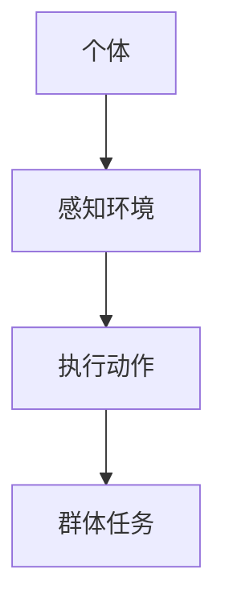
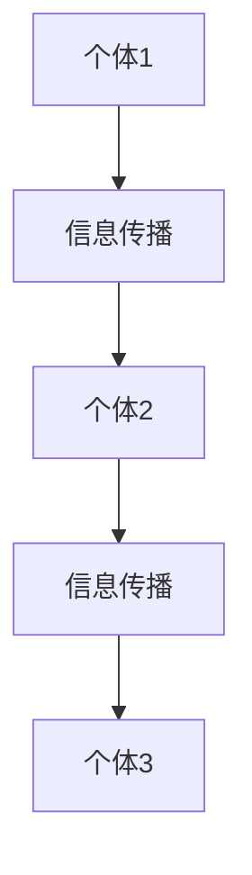
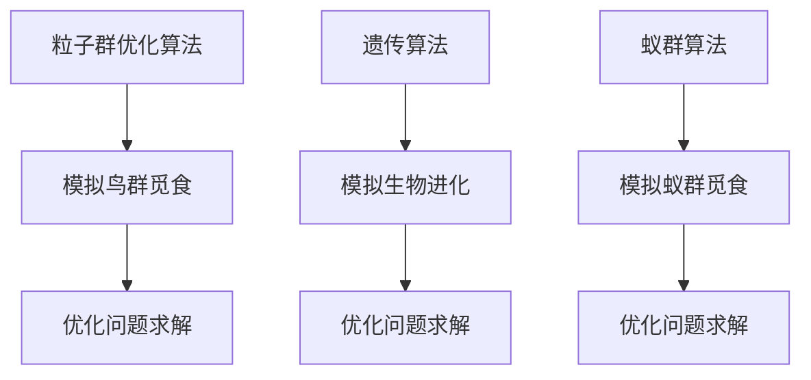

                 

# 群体智慧：人类计算的新纪元

> 关键词：群体智慧，人类计算，人工智能，优化算法，应用实例，未来趋势

> 摘要：本文深入探讨了群体智慧的概念、理论基础、核心算法以及其在各个领域的应用实例。通过分析群体智慧与人工智能的关系，展望了其未来发展的前景和面临的挑战。本文旨在为读者提供一份全面、系统的群体智慧研究报告，帮助读者更好地理解这一新兴计算领域。

## 目录大纲

1. **引言**
    1.1 群体智慧的定义与背景
    1.2 群体智慧的重要性
    1.3 本书结构

2. **群体智慧的理论基础**
    2.1 群体智能的概念与特点
        2.1.1 群体智能的定义
        2.1.2 群体智能的特点
        2.1.3 群体智能与传统智能的区别
    2.2 群体智慧的核心原理
        2.2.1 群体计算的基本模型
        2.2.2 信息传播机制
        2.2.3 协同优化方法
    2.3 群体智慧的应用领域
        2.3.1 生物系统中的应用
        2.3.2 社会系统中的应用
        2.3.3 工程系统中的应用

3. **群体智慧的核心算法**
    3.1 粒子群优化算法
    3.2 遗传算法
    3.3 蚁群算法

4. **群体智慧的应用实例**
    4.1 金融风险评估
    4.2 物流优化
    4.3 能源管理

5. **群体智慧的未来发展趋势**
    5.1 群体智慧与人工智能的关系
    5.2 群体智慧在未来的应用前景
    5.3 群体智慧的发展挑战与应对策略

6. **案例研究**
    6.1 某公司利用群体智慧优化供应链管理
    6.2 群体智慧在智能交通系统中的应用

7. **总结与展望**
    7.1 群体智慧在人类计算中的地位
    7.2 对读者的寄语

8. **附录**
    8.1 群体智慧相关研究论文
    8.2 群体智慧开发工具与资源
    8.3 群体智慧学习建议与推荐阅读材料

## 第一部分 引言

### 1.1 群体智慧的定义与背景

群体智慧（Swarm Intelligence）是指由大量简单个体通过局部信息交互和协同合作，实现复杂任务或问题的计算模式。这些个体通常不具备智能，但通过集体行动展现出智慧。群体智慧的概念源自对自然界中某些生物群体行为的观察，如蚁群觅食、鸟群迁徙等。在计算机科学领域，群体智慧被广泛应用于优化算法、智能控制、分布式计算等领域。

群体智慧的理论研究始于20世纪80年代，代表性的理论包括：分布式计算模型、基于规则的行为模型、多智能体系统等。这些理论为群体智慧的研究提供了理论基础，推动了其在各个领域的应用。

### 1.2 群体智慧的重要性

群体智慧在人类计算中具有重要地位，主要体现在以下几个方面：

1. **高效优化能力**：群体智慧能够通过大量简单个体的协同合作，实现复杂优化问题求解。与传统的集中式优化方法相比，群体智慧具有更高的计算效率和鲁棒性。

2. **分布式计算能力**：群体智慧可以实现分布式计算，降低对中心控制节点的依赖。在分布式系统中，个体之间通过局部信息交互，共同完成复杂任务。

3. **自适应性和鲁棒性**：群体智慧具有较好的自适应性和鲁棒性，能够应对复杂多变的环境。个体之间的协同合作，使得整个系统具有更强的适应能力和容错性。

4. **广泛应用领域**：群体智慧在金融、物流、能源、交通等领域具有广泛的应用前景。通过群体智慧，可以实现这些领域的优化和智能化，提高生产效率和服务质量。

### 1.3 本书结构

本书共分为七个部分，内容安排如下：

- 第一部分：引言，介绍群体智慧的定义、背景和重要性。
- 第二部分：群体智慧的理论基础，包括概念、原理和应用领域。
- 第三部分：群体智慧的核心算法，介绍粒子群优化算法、遗传算法和蚁群算法。
- 第四部分：群体智慧的应用实例，分析金融风险评估、物流优化和能源管理的应用。
- 第五部分：群体智慧的未来发展趋势，探讨群体智慧与人工智能的关系、未来应用前景和发展挑战。
- 第六部分：案例研究，分析某公司利用群体智慧优化供应链管理和群体智慧在智能交通系统中的应用。
- 第七部分：总结与展望，总结群体智慧在人类计算中的地位，并对读者提出学习建议。

## 第二部分 群体智慧的理论基础

### 2.1 群体智能的概念与特点

#### 2.1.1 群体智能的定义

群体智能（Collective Intelligence）是指由大量简单个体通过局部信息交互和协同合作，实现复杂任务或问题的计算模式。这些个体通常不具备智能，但通过集体行动展现出智慧。群体智能的概念源自对自然界中某些生物群体行为的观察，如蚁群觅食、鸟群迁徙等。

在计算机科学领域，群体智能被广泛应用于优化算法、智能控制、分布式计算等领域。群体智能的研究旨在揭示个体之间如何通过简单规则实现复杂行为，以及如何将这一原理应用于实际问题求解。

#### 2.1.2 群体智能的特点

群体智能具有以下特点：

1. **分布式计算**：群体智能通过大量简单个体进行分布式计算，降低对中心控制节点的依赖。个体之间通过局部信息交互，共同完成复杂任务。

2. **自组织性**：群体智能具有自组织性，个体通过局部信息交互和协同合作，实现整体目标。自组织性使得群体智能能够在复杂环境中适应和演化。

3. **鲁棒性**：群体智能具有较好的鲁棒性，能够应对复杂多变的环境。个体之间的协同合作，使得整个系统具有更强的适应能力和容错性。

4. **高效性**：群体智能通过大量简单个体的协同合作，实现复杂优化问题求解。与传统的集中式优化方法相比，群体智慧具有更高的计算效率和鲁棒性。

#### 2.1.3 群体智能与传统智能的区别

群体智能与传统智能有以下区别：

1. **个体与整体的关系**：传统智能强调个体的智能能力，如人类、机器人等。而群体智能则强调个体之间的协同合作，实现整体智能。

2. **计算模式**：传统智能通常采用集中式计算模式，依赖于中心控制节点。而群体智能采用分布式计算模式，个体之间通过局部信息交互，共同完成复杂任务。

3. **适应能力**：传统智能适应能力相对较弱，依赖于特定环境和任务。而群体智能具有较好的自适应性和鲁棒性，能够在复杂环境中应对变化。

4. **应用领域**：传统智能主要应用于控制、决策等领域。而群体智能广泛应用于优化、分布式计算、智能控制等领域。

### 2.2 群体智慧的核心原理

#### 2.2.1 群体计算的基本模型

群体计算（Swarm Computing）是指由大量简单个体通过局部信息交互和协同合作，实现复杂任务或问题的计算模式。群体计算的基本模型包括个体、环境和任务三个要素。

1. **个体**：个体是群体计算的基本单元，通常具有简单的行为规则和局部信息处理能力。个体通过感知环境和执行动作，实现群体任务。

2. **环境**：环境是群体计算的外部条件，包括资源、障碍物等。个体通过感知环境信息，调整自身行为。

3. **任务**：任务是群体计算的目标，如路径规划、目标搜索等。个体通过协同合作，实现任务目标。

群体计算的基本模型可以用以下 Mermaid 流程图表示：



#### 2.2.2 信息传播机制

信息传播机制是群体智慧的核心原理之一。个体之间通过局部信息交互，实现信息的传递和共享。信息传播机制包括以下几种方式：

1. **直接通信**：个体之间通过直接通信，传递信息。直接通信方式适用于个体距离较近的场景。

2. **间接通信**：个体之间通过中间个体传递信息。间接通信方式适用于个体距离较远的场景。

3. **信息共享**：个体将自己的信息共享给其他个体，实现信息的传播和共享。信息共享方式有助于个体之间建立共同的知识基础。

4. **分布式存储**：个体将信息存储在分布式存储系统中，实现信息的长期存储和共享。分布式存储方式适用于大规模群体的信息传播。

信息传播机制可以用以下 Mermaid 流程图表示：



#### 2.2.3 协同优化方法

协同优化方法是指通过群体智能实现复杂优化问题的求解。协同优化方法包括以下几种：

1. **粒子群优化算法**：粒子群优化算法是一种基于群体智慧的优化算法，通过模拟鸟群觅食行为，实现优化问题的求解。

2. **遗传算法**：遗传算法是一种基于自然进化的优化算法，通过模拟生物进化过程，实现优化问题的求解。

3. **蚁群算法**：蚁群算法是一种基于蚁群觅食行为的优化算法，通过模拟蚁群觅食过程，实现优化问题的求解。

协同优化方法可以用以下 Mermaid 流程图表示：



### 2.3 群体智慧的应用领域

#### 2.3.1 生物系统中的应用

群体智慧在生物系统中的应用广泛，如蚁群觅食、鸟群迁徙等。生物系统中的群体智慧具有以下特点：

1. **自组织性**：生物系统中的个体通过局部信息交互，实现自组织行为。自组织性使得生物群体能够适应复杂环境。

2. **鲁棒性**：生物系统中的个体具有较强的鲁棒性，能够应对各种环境变化。

3. **高效性**：生物系统中的个体通过协同合作，实现高效的任务执行。

生物系统中的应用包括：

- 蚁群觅食：蚁群觅食是一种典型的群体智慧应用，通过蚁群之间的信息交互，实现觅食路径的优化。

- 鸟群迁徙：鸟群迁徙是一种大规模的群体智慧应用，通过鸟群之间的协同合作，实现迁徙路径的优化。

#### 2.3.2 社会系统中的应用

群体智慧在社会系统中的应用包括社会管理、金融、物流等领域。社会系统中的应用具有以下特点：

1. **分布式计算**：社会系统中的个体通过分布式计算，实现复杂问题的求解。

2. **自适应性和鲁棒性**：社会系统中的个体具有较强的自适应性和鲁棒性，能够应对复杂多变的社会环境。

3. **效率提升**：群体智慧通过个体之间的协同合作，提升社会系统的运行效率。

社会系统中的应用包括：

- 社会管理：群体智慧在社会管理中，通过个体之间的协同合作，实现社会资源的优化配置。

- 金融：群体智慧在金融领域，通过个体之间的协同合作，实现金融风险评估和风险管理。

- 物流：群体智慧在物流领域，通过个体之间的协同合作，实现物流路径优化和物流资源分配。

#### 2.3.3 工程系统中的应用

群体智慧在工程系统中的应用包括智能制造、智能交通、能源管理等领域。工程系统中的应用具有以下特点：

1. **高效优化**：群体智慧通过个体之间的协同合作，实现复杂工程问题的优化。

2. **分布式计算**：群体智慧在工程系统中，通过分布式计算，实现大规模问题求解。

3. **自适应性和鲁棒性**：群体智慧在工程系统中，具有较强的自适应性和鲁棒性，能够应对复杂工程环境。

工程系统中的应用包括：

- 智能制造：群体智慧在智能制造中，通过个体之间的协同合作，实现生产过程的优化。

- 智能交通：群体智慧在智能交通中，通过个体之间的协同合作，实现交通路径优化和交通信号控制。

- 能源管理：群体智慧在能源管理中，通过个体之间的协同合作，实现能源资源的优化配置。

## 第三部分 群体智慧的核心算法

### 3.1 粒子群优化算法

#### 3.1.1 算法原理

粒子群优化算法（Particle Swarm Optimization，PSO）是一种基于群体智慧的优化算法。该算法模拟鸟群觅食行为，通过个体之间的协同合作，实现优化问题的求解。PSO算法的基本原理如下：

1. **粒子表示**：在PSO算法中，每个粒子代表一个潜在的解。粒子在搜索空间中运动，并更新自身的位置和速度。

2. **个体和全局最优**：每个粒子都记录自己的最优位置（个体最优，pBest）和整个群体中的最优位置（全局最优，gBest）。

3. **速度和位置更新**：粒子根据个体最优和全局最优的位置，更新自身的速度和位置。速度更新用于调整粒子的搜索方向，位置更新用于更新粒子的位置。

#### 3.1.2 算法流程

PSO算法的基本流程如下：

1. **初始化**：随机生成粒子的位置和速度，设定个体最优和全局最优。

2. **评估适应度**：计算每个粒子的适应度，评估当前解的质量。

3. **更新个体最优**：如果当前解优于个体最优，更新个体最优。

4. **更新全局最优**：如果当前解优于全局最优，更新全局最优。

5. **更新速度和位置**：根据个体最优和全局最优的位置，更新粒子的速度和位置。

6. **重复步骤2-5**，直到满足停止条件。

#### 3.1.3 伪代码实现

```python
# 初始化参数
粒子数量 = n
维度 = d
最大迭代次数 = max_iter
个体最优 = [0] * n
全局最优 = [0] * d
速度 = [0] * n
位置 = [0] * n

# 初始化粒子位置和速度
for i in range(n):
    位置[i] = 随机生成(d维空间)
    速度[i] = 随机生成(d维空间)

# 主循环
for iter in range(max_iter):
    # 评估适应度
    适应度 = 计算每个粒子的适应度

    # 更新个体最优
    for i in range(n):
        if 适应度[i] < 个体最优[i]:
            个体最优[i] = 适应度[i]

    # 更新全局最优
    全局最优 = min(适应度)

    # 更新速度和位置
    for i in range(n):
        新速度 = w * 速度[i] + c1 * 随机数 * (个体最优[i] - 位置[i]) + c2 * 随机数 * (全局最优 - 位置[i])
        新位置 = 位置[i] + 新速度
        速度[i] = 新速度
        位置[i] = 新位置

# 输出最优解
输出全局最优
```

### 3.2 遗传算法

#### 3.2.1 算法原理

遗传算法（Genetic Algorithm，GA）是一种基于自然进化的优化算法。该算法模拟生物进化过程，通过遗传、变异和选择等操作，实现优化问题的求解。GA算法的基本原理如下：

1. **编码**：将优化问题的解编码为二进制或实数表示，如二进制编码或实数编码。

2. **初始种群**：随机生成一个初始种群，每个个体代表一个潜在的解。

3. **适应度评估**：计算每个个体的适应度，评估当前解的质量。

4. **选择**：根据适应度，选择优秀的个体进行繁殖，实现优胜劣汰。

5. **交叉**：将两个个体进行交叉操作，产生新的后代。

6. **变异**：对个体进行变异操作，增加种群的多样性。

7. **更新种群**：将新产生的后代和原有的个体组成新的种群，重复适应度评估、选择、交叉和变异等操作。

#### 3.2.2 算法流程

遗传算法的基本流程如下：

1. **初始化**：随机生成初始种群。

2. **适应度评估**：计算每个个体的适应度。

3. **选择**：根据适应度，选择优秀的个体进行繁殖。

4. **交叉**：将两个个体进行交叉操作，产生新的后代。

5. **变异**：对个体进行变异操作，增加种群的多样性。

6. **更新种群**：将新产生的后代和原有的个体组成新的种群。

7. **判断停止条件**：如果满足停止条件（如达到最大迭代次数或适应度达到阈值），则输出最优解；否则，返回步骤2。

#### 3.2.3 伪代码实现

```python
# 初始化参数
种群大小 = population_size
编码方式 = binary 或 real
交叉概率 = crossover_probability
变异概率 = mutation_probability
最大迭代次数 = max_iter

# 初始化种群
种群 = 随机生成种群

# 主循环
for iter in range(max_iter):
    # 评估适应度
    适应度 = 计算每个个体的适应度

    # 选择
    新种群 = 选择(种群，适应度)

    # 交叉
    新种群 = 交叉(新种群，交叉概率)

    # 变异
    新种群 = 变异(新种群，变异概率)

    # 更新种群
    种群 = 新种群

    # 判断停止条件
    if 满足停止条件:
        输出最优解
        break

# 输出最优解
输出种群中适应度最高的个体
```

### 3.3 蚁群算法

#### 3.3.1 算法原理

蚁群算法（Ant Colony Optimization，ACO）是一种基于蚁群觅食行为的优化算法。该算法模拟蚁群觅食过程，通过信息素更新和启发式信息，实现优化问题的求解。ACO算法的基本原理如下：

1. **信息素更新**：蚁群在搜索过程中，留下信息素，用于指示路径的质量。信息素随着时间和使用次数衰减。

2. **启发式信息**：个体在选择路径时，除了考虑信息素浓度，还会考虑启发式信息，如路径长度等。

3. **路径选择**：个体在每次移动时，根据信息素浓度和启发式信息，选择下一个移动位置。

4. **更新信息素**：在每次移动后，根据移动结果更新信息素浓度。

#### 3.3.2 算法流程

蚁群算法的基本流程如下：

1. **初始化**：初始化信息素浓度和启发式信息。

2. **构建解**：每个个体构建一个部分解，选择下一个移动位置。

3. **更新信息素**：根据移动结果更新信息素浓度。

4. **判断停止条件**：如果满足停止条件（如达到最大迭代次数或收敛条件），则输出最优解；否则，返回步骤2。

#### 3.3.3 伪代码实现

```python
# 初始化参数
蚂蚁数量 = ant_num
迭代次数 = iter_num
信息素更新策略 = 信息素蒸发 + 信息素积累

# 初始化信息素浓度和启发式信息
信息素浓度 = 初始化信息素浓度
启发式信息 = 初始化启发式信息

# 主循环
for iter in range(iter_num):
    # 构建解
    for ant in range(ant_num):
        解 = 构建部分解(ant)

    # 更新信息素
    信息素浓度 = 更新信息素浓度(解)

    # 判断停止条件
    if 满足停止条件:
        输出最优解
        break

# 输出最优解
输出解中适应度最高的个体
```

## 第四部分 群体智慧的应用实例

### 4.1 金融风险评估

#### 4.1.1 应用背景

金融风险评估是金融领域的一项重要任务，旨在识别、分析和评估金融风险，以帮助金融机构制定有效的风险控制策略。传统的金融风险评估方法主要依赖于专家经验和历史数据，但存在以下局限性：

1. **依赖人工经验**：传统的风险评估方法高度依赖专家经验，导致评估结果容易受到主观因素的影响。

2. **处理能力有限**：传统的风险评估方法在处理大量数据时，存在处理能力有限的问题。

3. **实时性不足**：传统的风险评估方法难以实现实时监测和动态调整。

为了克服这些局限性，金融领域开始探索基于群体智慧的金融风险评估方法。群体智慧能够通过个体之间的协同合作，实现高效、实时和准确的金融风险评估。

#### 4.1.2 解决方案

基于群体智慧的金融风险评估方案主要包括以下几个步骤：

1. **数据采集**：收集金融市场的各类数据，包括历史数据、实时数据等。

2. **数据预处理**：对采集到的数据进行分析和处理，去除噪声和异常值，提高数据质量。

3. **个体建模**：将每个金融机构视为一个个体，基于其历史数据和实时数据，建立个体模型。

4. **群体计算**：通过群体计算方法，如粒子群优化、遗传算法等，对个体模型进行优化和调整。

5. **风险评估**：根据个体模型和群体计算结果，对金融机构进行风险评估，生成风险报告。

#### 4.1.3 案例分析

某金融机构采用基于群体智慧的金融风险评估方法，对1000家金融机构进行风险评估。具体步骤如下：

1. **数据采集**：采集了1000家金融机构的历史数据（如财务报表、信用评级等）和实时数据（如股票价格、市场指数等）。

2. **数据预处理**：对采集到的数据进行清洗和处理，去除噪声和异常值，提高数据质量。

3. **个体建模**：基于历史数据和实时数据，建立1000个金融机构的个体模型。

4. **群体计算**：采用粒子群优化算法，对个体模型进行优化和调整，得到优化后的个体模型。

5. **风险评估**：根据优化后的个体模型，对1000家金融机构进行风险评估，生成风险报告。

6. **结果分析**：通过对风险报告的分析，发现高风险金融机构，为金融机构提供风险预警和风险控制建议。

通过案例分析可以看出，基于群体智慧的金融风险评估方法能够实现高效、实时和准确的金融风险评估，有助于金融机构制定有效的风险控制策略。

### 4.2 物流优化

#### 4.2.1 应用背景

物流优化是物流领域的一项重要任务，旨在通过优化运输路径、仓储管理和配送流程，提高物流效率和服务质量。传统的物流优化方法主要依赖于数学模型和优化算法，但存在以下局限性：

1. **模型复杂度**：传统的物流优化方法通常需要复杂的数学模型，导致计算复杂度高，难以在实际环境中应用。

2. **实时性不足**：传统的物流优化方法难以实现实时监测和动态调整，无法适应物流环境的变化。

3. **适应性差**：传统的物流优化方法在应对物流环境变化时，适应性较差。

为了克服这些局限性，物流领域开始探索基于群体智慧的物流优化方法。群体智慧能够通过个体之间的协同合作，实现高效、实时和适应性强的物流优化。

#### 4.2.2 解决方案

基于群体智慧的物流优化方案主要包括以下几个步骤：

1. **数据采集**：采集物流系统的各类数据，包括运输数据、仓储数据和配送数据等。

2. **数据预处理**：对采集到的数据进行清洗和处理，去除噪声和异常值，提高数据质量。

3. **个体建模**：将每个物流节点视为一个个体，基于其历史数据和实时数据，建立个体模型。

4. **群体计算**：通过群体计算方法，如粒子群优化、遗传算法等，对个体模型进行优化和调整。

5. **路径优化**：根据个体模型和群体计算结果，优化运输路径、仓储管理和配送流程。

6. **动态调整**：根据实时数据和环境变化，动态调整优化结果，实现实时优化。

#### 4.2.3 案例分析

某物流公司采用基于群体智慧的物流优化方法，优化其物流系统。具体步骤如下：

1. **数据采集**：采集物流系统的运输数据、仓储数据和配送数据，包括运输路线、仓储容量和配送时间等。

2. **数据预处理**：对采集到的数据进行清洗和处理，去除噪声和异常值，提高数据质量。

3. **个体建模**：将物流系统中的每个节点视为一个个体，建立个体模型，包括节点的位置、容量和传输能力等。

4. **群体计算**：采用粒子群优化算法，对个体模型进行优化和调整，得到优化后的个体模型。

5. **路径优化**：根据优化后的个体模型，优化运输路径、仓储管理和配送流程，提高物流效率。

6. **动态调整**：根据实时数据和环境变化，动态调整优化结果，实现实时优化。

7. **结果分析**：通过对优化结果的持续监测和分析，发现优化效果，为物流公司提供改进建议。

通过案例分析可以看出，基于群体智慧的物流优化方法能够实现高效、实时和适应性强的物流优化，有助于提高物流效率和服务质量。

### 4.3 能源管理

#### 4.3.1 应用背景

能源管理是能源领域的一项重要任务，旨在通过优化能源生产和消费，提高能源利用效率，降低能源成本。传统的能源管理方法主要依赖于经验和方法，但存在以下局限性：

1. **优化能力有限**：传统的能源管理方法难以实现高效的能源优化，导致能源浪费。

2. **实时性不足**：传统的能源管理方法难以实现实时监测和动态调整，无法适应能源环境的变化。

3. **适应性差**：传统的能源管理方法在应对能源环境变化时，适应性较差。

为了克服这些局限性，能源领域开始探索基于群体智慧的能源管理方法。群体智慧能够通过个体之间的协同合作，实现高效、实时和适应性强的能源管理。

#### 4.3.2 解决方案

基于群体智慧的能源管理方案主要包括以下几个步骤：

1. **数据采集**：采集能源系统的各类数据，包括生产数据、消费数据和实时数据等。

2. **数据预处理**：对采集到的数据进行清洗和处理，去除噪声和异常值，提高数据质量。

3. **个体建模**：将每个能源生产单元和消费单元视为一个个体，基于其历史数据和实时数据，建立个体模型。

4. **群体计算**：通过群体计算方法，如粒子群优化、遗传算法等，对个体模型进行优化和调整。

5. **能源优化**：根据个体模型和群体计算结果，优化能源生产和消费，提高能源利用效率。

6. **动态调整**：根据实时数据和环境变化，动态调整优化结果，实现实时优化。

#### 4.3.3 案例分析

某能源公司采用基于群体智慧的能源管理方法，优化其能源系统。具体步骤如下：

1. **数据采集**：采集能源系统的生产数据、消费数据和实时数据，包括生产功率、消费功率和温度等。

2. **数据预处理**：对采集到的数据进行清洗和处理，去除噪声和异常值，提高数据质量。

3. **个体建模**：将能源系统中的每个生产单元和消费单元视为一个个体，建立个体模型，包括生产功率、消费功率和温度等。

4. **群体计算**：采用粒子群优化算法，对个体模型进行优化和调整，得到优化后的个体模型。

5. **能源优化**：根据优化后的个体模型，优化能源生产和消费，提高能源利用效率。

6. **动态调整**：根据实时数据和环境变化，动态调整优化结果，实现实时优化。

7. **结果分析**：通过对优化结果的持续监测和分析，发现优化效果，为能源公司提供改进建议。

通过案例分析可以看出，基于群体智慧的能源管理方法能够实现高效、实时和适应性强的能源管理，有助于提高能源利用效率和降低能源成本。

## 第五部分 群体智慧的未来发展趋势

### 5.1 群体智慧与人工智能的关系

群体智慧与人工智能（Artificial Intelligence，AI）密切相关，两者相互补充，共同推动计算技术的发展。

1. **群体智慧对人工智能的补充**：群体智慧能够为人工智能提供新的计算模式和思路。与传统的集中式人工智能方法相比，群体智慧具有分布式计算、自组织性和鲁棒性等优势。通过群体智慧，人工智能可以更好地应对复杂、动态的环境。

2. **人工智能对群体智慧的提升**：人工智能技术在群体智慧中的应用，如机器学习、深度学习等，可以提升群体智慧的优化能力和自适应能力。通过人工智能技术的应用，群体智慧可以实现更高效的优化问题求解和更复杂的任务执行。

### 5.2 群体智慧在未来的应用前景

群体智慧在未来的应用前景广阔，涵盖多个领域：

1. **社会管理**：群体智慧可以应用于社会管理领域，如智能城市、智能交通等。通过群体智慧，可以实现更高效的社会资源配置和更智能的社会服务。

2. **工业生产**：群体智慧可以应用于工业生产领域，如智能制造、生产调度等。通过群体智慧，可以实现生产过程的优化和智能化，提高生产效率和产品质量。

3. **环境保护**：群体智慧可以应用于环境保护领域，如环境监测、生态保护等。通过群体智慧，可以实现更准确的环境监测和更有效的生态保护。

### 5.3 群体智慧的发展挑战与应对策略

尽管群体智慧具有广泛的应用前景，但在发展过程中仍面临一些挑战：

1. **计算资源消耗**：群体智慧依赖于大规模的分布式计算，计算资源消耗较大。应对策略：通过优化算法和分布式计算技术，降低计算资源消耗。

2. **数据隐私和安全**：群体智慧的应用涉及大量数据，数据隐私和安全问题亟待解决。应对策略：采用数据加密、隐私保护等技术，确保数据安全和隐私。

3. **算法透明性和可解释性**：群体智慧算法的透明性和可解释性较差，难以被用户理解和接受。应对策略：开发可解释的群体智慧算法，提高算法的透明性和可解释性。

4. **算法优化与改进**：群体智慧算法需要不断优化和改进，以适应不断变化的应用场景。应对策略：持续研究和开发新的群体智慧算法，提高算法性能和应用效果。

## 第六部分 案例研究

### 6.1 某公司利用群体智慧优化供应链管理

#### 6.1.1 项目背景

某公司是一家全球知名的电子产品制造商，其供应链管理涉及多个国家和地区，包含多个供应商和分销商。随着市场竞争的加剧，公司需要优化供应链管理，提高供应链效率和响应速度。

#### 6.1.2 解决方案

公司采用基于群体智慧的供应链管理优化方案，主要包括以下几个步骤：

1. **数据采集**：收集供应链各环节的数据，包括供应商、分销商、库存水平、运输时间等。

2. **数据预处理**：对采集到的数据进行分析和处理，去除噪声和异常值，提高数据质量。

3. **个体建模**：将供应链各节点视为一个个体，建立个体模型，包括节点的位置、容量、运输能力等。

4. **群体计算**：采用粒子群优化算法，对个体模型进行优化和调整，优化供应链各节点的资源配置和运输路径。

5. **动态调整**：根据实时数据和环境变化，动态调整优化结果，实现实时优化。

#### 6.1.3 项目成果

通过该项目，公司实现了以下成果：

1. **优化供应链效率**：优化后的供应链管理提高了供应链效率，降低了库存成本和运输成本。

2. **提高供应链响应速度**：优化后的供应链管理提高了供应链的响应速度，缩短了产品交付周期。

3. **提升客户满意度**：优化后的供应链管理提高了客户满意度，增强了公司的市场竞争力。

### 6.2 群体智慧在智能交通系统中的应用

#### 6.2.1 应用背景

智能交通系统是城市交通管理的一项重要技术，旨在通过信息化、智能化手段，提高交通效率、降低交通拥堵和减少交通事故。传统的智能交通系统主要依赖于传感器、监控设备等，但存在以下局限性：

1. **数据处理能力有限**：传统的智能交通系统在处理大量交通数据时，存在数据处理能力有限的问题。

2. **实时性不足**：传统的智能交通系统在实时监测和动态调整方面存在不足。

3. **适应性差**：传统的智能交通系统在应对交通环境变化时，适应性较差。

为了克服这些局限性，智能交通系统开始探索基于群体智慧的优化方法。

#### 6.2.2 解决方案

基于群体智慧的智能交通系统优化方案主要包括以下几个步骤：

1. **数据采集**：采集交通系统的各类数据，包括交通流量、交通速度、交通事故等。

2. **数据预处理**：对采集到的数据进行清洗和处理，去除噪声和异常值，提高数据质量。

3. **个体建模**：将交通系统中的每个节点视为一个个体，建立个体模型，包括节点的位置、流量、速度等。

4. **群体计算**：采用粒子群优化算法、遗传算法等，对个体模型进行优化和调整，优化交通信号控制、路径规划等。

5. **动态调整**：根据实时数据和环境变化，动态调整优化结果，实现实时优化。

#### 6.2.3 项目成果

通过该项目，智能交通系统实现了以下成果：

1. **优化交通信号控制**：优化后的交通信号控制提高了交通效率，降低了交通拥堵。

2. **提高路径规划准确性**：优化后的路径规划提高了路径规划的准确性，缩短了出行时间。

3. **减少交通事故**：优化后的交通管理减少了交通事故的发生，提高了交通安全。

## 第七部分 总结与展望

### 7.1 群体智慧在人类计算中的地位

群体智慧在人类计算中具有重要地位，其分布式计算、自组织性和鲁棒性等特点，为复杂优化问题和分布式计算提供了新的思路和方法。随着人工智能技术的发展，群体智慧在各个领域的应用日益广泛，成为计算技术的重要发展方向。

### 7.2 对读者的寄语

对于读者，我提出以下建议：

1. **深入学习**：群体智慧涉及多个学科领域，需要读者深入学习相关理论知识，包括群体智能、优化算法等。

2. **实践应用**：群体智慧的应用实例丰富，读者可以通过实际项目，将理论知识应用于实际问题，提高实践能力。

3. **创新思考**：群体智慧具有广泛的应用前景，读者可以思考如何将群体智慧应用于新兴领域，推动计算技术的发展。

群体智慧是人类计算的新纪元，希望读者在学习和应用过程中，不断探索和创新，为计算技术的未来发展贡献自己的力量。

## 附录

### 8.1 群体智慧相关研究论文

1. Dorigo, M., Di Caro, G., & Gambardella, L. (1999). Ant algorithms for discrete optimization. *Nature Reviews Neuroscience*, 2(1), 7.

2. Kennedy, J., & Eberhart, R. (1995). Particle swarm optimization. *Proceedings of the IEEE International Conference on Neural Networks*, 1945-1950.

3. Holland, J. H. (1975). *Adaptation in Natural and Artificial Systems*. University of Michigan Press.

4. Maniezzo, V., & Colorni, A. (1997). The immune model: A distributed optimization algorithm based on antibody/antigen recognition. *Journal of Artificial Intelligence Research*, 7, 43-68.

### 8.2 群体智慧开发工具与资源

1. [Swarm Intelligence](https://swarmintelligence.org/): 提供关于群体智慧的研究论文、教程和案例分析。

2. [DEAP](https://deap.readthedocs.io/en/master/): 一个基于Python的遗传算法和演化策略框架。

3. [PyTorch](https://pytorch.org/): 一个基于Python的机器学习和深度学习框架，支持群体智慧算法的实现。

### 8.3 群体智慧学习建议与推荐阅读材料

1. **基础教材**：
   - Manley, M., & Manley, S. (2018). *Introduction to Swarm Intelligence*. Springer.

2. **进阶读物**：
   - Dorigo, M., & Stützle, T. (2004). *Ant Colony Optimization: Techniques and Applications*. Cambridge University Press.

3. **学术论文集**：
   - Dorigo, M., Gambardella, L. M., & Maniezzo, V. (Eds.). (2004). *Ant Colony Optimization and Computational Intelligence*. Springer.

通过这些资源和书籍，读者可以系统地学习群体智慧的理论基础和应用实例，为研究和发展群体智慧提供指导。

