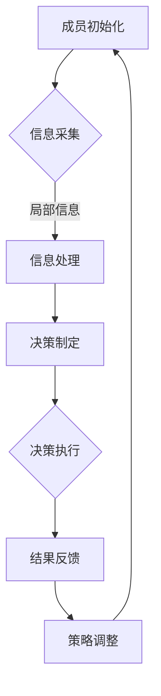

                 

# 文章标题：群体智慧：人类计算的精髓

> 关键词：群体智慧、计算、协同、算法、应用

> 摘要：本文旨在探讨群体智慧在人类计算中的核心作用和重要性。通过对群体智慧的概念、架构、实践应用以及未来展望的深入分析，揭示群体智慧作为人类计算精髓的独特价值和广阔前景。

---

### 《群体智慧：人类计算的精髓》目录大纲

# 第一部分：群体智慧概述

## 第1章：群体智慧的概念与本质

### 第2章：群体智慧的重要性

### 第3章：群体智慧的未来发展趋势

# 第二部分：群体智慧的架构

## 第4章：群体智慧的构成要素

### 第5章：群体智慧的Mermaid流程图

### 第6章：群体智慧的核心算法原理

# 第三部分：群体智慧在实践中的应用

## 第7章：群体智慧在组织管理中的应用

### 第8章：群体智慧在项目管理中的应用

### 第9章：群体智慧在团队协作中的应用

## 第10章：群体智慧在科技创新中的应用

### 第11章：群体智慧在商业运营中的应用

## 第12章：群体智慧在教育中的运用

### 第13章：群体智慧在公共服务中的应用

## 第14章：群体智慧的未来展望

### 第15章：群体智慧与人类文明的未来发展

## 附录

### 附录A：群体智慧应用案例解析

### 附录B：群体智慧相关资源与工具推荐

---

## 第1章：群体智慧的概念与本质

### 1.1 群体智慧的起源与发展

#### 1.1.1 群体智慧的定义

群体智慧（Swarm Intelligence）指的是由众多个体通过相互间的协同合作，展现出超越个体能力的集体行为和智慧。这种智慧并非由某个中心控制，而是通过个体之间的简单规则和局部信息的交换与处理，逐步演化出复杂的全局行为。

#### 1.1.2 群体智慧的起源

群体智慧的概念源于对昆虫群体行为的观察与研究。例如，蜜蜂的觅食行为、鸟群的飞行轨迹以及蚁群的路径优化等。通过这些现象，科学家发现，尽管个体蚂蚁或蜜蜂的行为简单，但整个群体的行为却展现出惊人的复杂性和效率。

#### 1.1.3 群体智慧的发展

随着计算机科学和人工智能技术的发展，群体智慧的概念逐渐从生物学领域扩展到计算机科学和工程技术领域。特别是在分布式计算、网络系统和复杂系统研究中，群体智慧的应用日益广泛。

### 1.2 群体智慧的重要性

#### 1.2.1 在人类社会发展中的作用

群体智慧在人类社会发展中的重要性体现在多个方面。首先，它促进了人类社会协作效率的提升，使得复杂任务能够通过分工合作高效完成。其次，群体智慧推动了创新与知识共享，使得人类社会能够在不同领域实现跨越式发展。

#### 1.2.2 在现代科技与商业中的应用

在现代科技与商业中，群体智慧的应用同样具有重要意义。例如，在物联网和智能制造中，群体智慧可以帮助优化生产流程、提升生产效率。在商业运营中，通过群体智慧的分析与决策，企业可以更精准地预测市场需求、制定营销策略。

### 1.3 群体智慧的未来发展趋势

#### 1.3.1 技术进步对群体智慧的影响

随着人工智能、大数据和云计算等技术的快速发展，群体智慧将迎来新的发展机遇。这些技术不仅为群体智慧的实现提供了更强大的计算支持，同时也为群体智慧的应用场景拓展提供了广阔空间。

#### 1.3.2 社会变革对群体智慧的需求

在社会变革的背景下，群体智慧的需求日益增长。例如，在城市管理、公共卫生、环境保护等领域，群体智慧的应用可以帮助实现更加智能化、精细化的管理与服务。

---

## 第2章：群体智慧的架构与原理

### 2.1 群体智慧的构成要素

#### 2.1.1 成员角色

在群体智慧系统中，成员角色通常包括领导者、执行者和观察者。领导者负责制定整体策略和目标，执行者负责具体任务的执行，观察者则负责收集和分析信息。

#### 2.1.2 信息传递机制

信息传递机制是群体智慧架构的核心。它包括局部信息的采集、全局信息的共享和反馈机制。有效的信息传递机制能够确保个体之间的信息流动畅通，从而实现协同效应。

#### 2.1.3 决策模型

决策模型是群体智慧的关键部分。它包括个体决策模型和集体决策模型。个体决策模型关注个体在局部环境下的最优选择，集体决策模型则通过汇总个体决策，实现整体最优。

### 2.2 群体智慧的Mermaid流程图

为了更好地理解群体智慧的架构与原理，我们可以通过Mermaid流程图来可视化其工作流程。以下是一个简化的群体智慧Mermaid流程图示例：



### 2.3 群体智慧的核心算法原理

#### 2.3.1 算法分类

群体智慧算法主要分为两种类型：基于规则的和基于学习的。基于规则的算法通过预设的规则来指导个体行为，而基于学习的算法则通过历史数据和模式识别来优化个体行为。

#### 2.3.2 伪代码详细讲解

以下是一个基于规则的群体智慧算法的伪代码示例：

```pseudocode
// 群体智慧算法伪代码
initialize_members()
while (not goal_achieved):
    collect_local_info()
    process_info()
    make_decision()
    execute_decision()
    receive_feedback()
    adjust_strategy()
```

#### 2.3.3 数学模型和公式

在群体智慧算法中，数学模型和公式用于描述个体之间的相互作用和全局行为。以下是一个简化的数学模型：

$$
\begin{aligned}
    &\text{局部信息更新：} \\
    &\mathbf{u}_{i}^{t+1} = \mathbf{u}_{i}^{t} + \alpha(\mathbf{u}_{j}^{t} - \mathbf{u}_{i}^{t}) \\
    &\text{全局行为预测：} \\
    &\mathbf{x}_{g}^{t+1} = \frac{1}{N} \sum_{i=1}^{N} \mathbf{u}_{i}^{t+1}
\end{aligned}
$$`

---

## 第3章：群体智慧在实践中的应用

### 3.1 群体智慧在组织管理中的应用

#### 3.1.1 决策模型的构建

在组织管理中，群体智慧可以通过构建分布式决策模型，实现更高效、更民主的决策过程。以下是一个简化的决策模型构建过程：

1. **成员初始化**：明确各个成员的角色和职责。
2. **信息采集**：收集各个成员的局部信息。
3. **信息处理**：通过算法对局部信息进行处理，生成全局信息。
4. **决策制定**：各个成员根据全局信息制定个人决策。
5. **决策执行**：执行个人决策，并收集反馈信息。
6. **策略调整**：根据反馈信息调整整体策略。

#### 3.1.2 决策的协同优化

通过群体智慧，组织可以实现决策的协同优化。以下是一个简化的协同优化过程：

1. **初始化**：设定目标函数和约束条件。
2. **个体优化**：每个成员根据局部信息进行个体优化。
3. **全局优化**：汇总个体优化结果，实现全局优化。
4. **迭代更新**：重复执行个体优化和全局优化，直至目标函数达到最优。

### 3.2 群体智慧在项目管理中的应用

#### 3.2.1 项目任务的分配与协调

在项目管理中，群体智慧可以帮助实现项目任务的合理分配和协调。以下是一个简化的任务分配与协调过程：

1. **任务分解**：将大任务分解为小任务。
2. **角色分配**：为每个小任务分配合适的成员。
3. **信息共享**：确保成员之间能够共享必要的信息。
4. **任务执行**：成员根据分配的任务进行执行。
5. **进度监控**：实时监控任务进度，确保项目按计划进行。
6. **反馈调整**：根据监控结果调整任务执行策略。

### 3.3 群体智慧在团队协作中的应用

#### 3.3.1 团队成员的角色与责任

在团队协作中，群体智慧可以帮助明确团队成员的角色与责任。以下是一个简化的团队成员角色与责任分配过程：

1. **角色识别**：根据项目需求，明确团队成员的角色。
2. **责任划分**：为每个角色分配相应的责任。
3. **协作机制**：建立有效的协作机制，确保成员能够高效合作。
4. **绩效评估**：定期评估团队成员的绩效，激励成员积极参与。

#### 3.3.2 团队沟通与信息共享

在团队协作中，群体智慧可以促进团队成员之间的沟通与信息共享。以下是一个简化的沟通与信息共享过程：

1. **沟通平台**：建立沟通平台，确保信息畅通。
2. **定期会议**：定期召开会议，讨论项目进展和问题。
3. **信息共享**：鼓励成员共享经验和知识。
4. **反馈机制**：建立反馈机制，确保信息能够得到及时响应和调整。

---

## 第4章：群体智慧在科技创新中的应用

### 4.1 群体智慧在科学研究中的应用

#### 4.1.1 科学研究的协同创新

群体智慧在科学研究中可以帮助实现协同创新。以下是一个简化的协同创新过程：

1. **问题定义**：明确研究问题和目标。
2. **数据共享**：共享研究数据，确保信息畅通。
3. **知识融合**：将不同领域的知识进行融合，形成创新思路。
4. **实验设计**：根据创新思路设计实验。
5. **结果分析**：分析实验结果，验证创新思路。
6. **迭代更新**：根据分析结果，不断迭代更新研究方案。

#### 4.1.2 科学成果的快速传播与应用

群体智慧可以帮助科学成果的快速传播和应用。以下是一个简化的传播与应用过程：

1. **成果发布**：发布科学成果。
2. **信息共享**：通过社交媒体、学术会议等渠道传播成果。
3. **应用推广**：将科学成果应用到实际项目中，推动技术创新。
4. **反馈收集**：收集用户反馈，优化应用效果。
5. **迭代更新**：根据反馈，不断迭代更新应用方案。

### 4.2 群体智慧在技术开发中的应用

#### 4.2.1 技术开发的协同攻关

群体智慧在技术开发中可以帮助实现协同攻关。以下是一个简化的协同攻关过程：

1. **问题识别**：识别技术开发中的问题和难点。
2. **任务分配**：根据问题和难点，分配相应任务。
3. **知识共享**：共享开发过程中的知识和经验。
4. **代码审查**：进行代码审查，确保开发质量。
5. **测试验证**：进行功能测试和性能测试。
6. **迭代更新**：根据测试结果，不断迭代更新开发方案。

#### 4.2.2 技术创新的快速迭代

群体智慧可以帮助实现技术开发的快速迭代。以下是一个简化的快速迭代过程：

1. **需求分析**：分析市场需求，确定开发方向。
2. **原型设计**：设计产品原型，进行初步测试。
3. **用户反馈**：收集用户反馈，优化产品设计。
4. **功能实现**：根据用户反馈，实现产品功能。
5. **测试验证**：进行功能测试和性能测试。
6. **迭代更新**：根据测试结果，不断迭代更新产品功能。

### 4.3 群体智慧在商业运营中的应用

#### 4.3.1 商业模式的创新设计

群体智慧可以帮助实现商业模式的创新设计。以下是一个简化的创新设计过程：

1. **市场调研**：分析市场需求和竞争情况。
2. **模式构思**：根据市场调研结果，构思创新商业模式。
3. **方案评估**：评估创新模式的可行性和风险。
4. **方案优化**：根据评估结果，优化商业模式。
5. **试点应用**：在特定市场试点应用商业模式。
6. **效果评估**：评估商业模式的应用效果，不断优化。

#### 4.3.2 商业决策的智能分析

群体智慧可以帮助实现商业决策的智能分析。以下是一个简化的智能分析过程：

1. **数据采集**：收集商业运营相关的数据。
2. **数据清洗**：清洗和整理数据，确保数据质量。
3. **数据分析**：使用数据分析工具，对数据进行挖掘和分析。
4. **决策支持**：基于分析结果，提供决策支持。
5. **决策执行**：根据决策支持，执行商业决策。
6. **效果评估**：评估决策效果，为后续决策提供参考。

---

## 第5章：群体智慧在教育中的运用

### 5.1 群体智慧在教学活动中的应用

#### 5.1.1 教学内容的个性化定制

群体智慧可以帮助实现教学内容的个性化定制。以下是一个简化的个性化定制过程：

1. **学生数据分析**：收集和分析学生的学业数据、兴趣爱好等。
2. **课程内容设计**：根据学生数据分析结果，设计个性化课程内容。
3. **教学策略调整**：根据个性化课程内容，调整教学策略。
4. **教学效果评估**：评估个性化教学的效果，为后续调整提供参考。
5. **持续迭代**：根据评估结果，持续迭代优化教学内容和教学策略。

#### 5.1.2 教学过程的动态调整

群体智慧可以帮助实现教学过程的动态调整。以下是一个简化的动态调整过程：

1. **实时监控**：实时监控教学过程中的各种数据，如学生的参与度、学习效果等。
2. **数据分析**：对监控数据进行实时分析，发现教学过程中的问题。
3. **策略调整**：根据数据分析结果，及时调整教学策略。
4. **教学反馈**：收集学生的反馈，进一步优化教学策略。
5. **持续迭代**：根据学生反馈和数据分析结果，持续迭代优化教学过程。

### 5.2 群体智慧在学生管理中的应用

#### 5.2.1 学生群体的行为分析

群体智慧可以帮助实现学生群体的行为分析。以下是一个简化的行为分析过程：

1. **数据采集**：收集学生的日常行为数据，如出勤、作业完成情况等。
2. **数据清洗**：清洗和整理数据，确保数据质量。
3. **行为分析**：使用数据分析工具，对学生行为进行深入分析。
4. **行为预测**：根据历史行为数据，预测学生的未来行为。
5. **干预措施**：根据行为预测结果，采取相应的干预措施。
6. **效果评估**：评估干预措施的效果，为后续干预提供参考。

#### 5.2.2 学生群体的激励与引导

群体智慧可以帮助实现学生群体的激励与引导。以下是一个简化的激励与引导过程：

1. **学生数据分析**：收集和分析学生的学业成绩、行为表现等数据。
2. **激励策略设计**：根据学生数据分析结果，设计激励策略。
3. **实施激励**：根据激励策略，对学生进行激励。
4. **效果评估**：评估激励措施的效果，为后续调整提供参考。
5. **持续迭代**：根据评估结果，持续迭代优化激励策略。

### 5.3 群体智慧在校园文化建设中的应用

#### 5.3.1 校园文化的共建与传播

群体智慧可以帮助实现校园文化的共建与传播。以下是一个简化的共建与传播过程：

1. **文化内容设计**：设计符合校园特色的校园文化内容。
2. **文化传播渠道**：建立多元化的文化传播渠道，如校园网、社交媒体等。
3. **文化参与机制**：鼓励学生和教职工参与校园文化建设。
4. **文化评价机制**：建立文化评价机制，评估校园文化建设的效果。
5. **持续优化**：根据评价结果，持续优化校园文化建设方案。

#### 5.3.2 校园文化的创新与发展

群体智慧可以帮助实现校园文化的创新与发展。以下是一个简化的创新与发展过程：

1. **文化创新活动**：举办各种文化创新活动，激发学生的创造力。
2. **文化创新成果展示**：展示文化创新成果，激发学生的参与热情。
3. **文化创新交流**：组织文化创新交流会议，分享创新经验。
4. **文化创新评价**：评估文化创新活动的效果，为后续活动提供参考。
5. **持续创新**：根据评价结果，持续推动校园文化的创新发展。

---

## 第6章：群体智慧在公共服务中的应用

### 6.1 群体智慧在公共卫生管理中的应用

#### 6.1.1 公共卫生事件的智能预警

群体智慧可以帮助实现公共卫生事件的智能预警。以下是一个简化的智能预警过程：

1. **数据采集**：收集公共卫生相关的数据，如传染病疫情、环境污染等。
2. **数据预处理**：对采集到的数据进行分析和预处理，确保数据质量。
3. **特征提取**：提取与公共卫生事件相关的特征，如感染人数、症状分布等。
4. **预警模型构建**：构建基于群体智慧的公共卫生预警模型。
5. **预警结果评估**：对预警结果进行评估，确保预警准确性。
6. **预警策略调整**：根据评估结果，调整预警策略。

#### 6.1.2 公共卫生决策的协同优化

群体智慧可以帮助实现公共卫生决策的协同优化。以下是一个简化的协同优化过程：

1. **决策模型构建**：构建基于群体智慧的公共卫生决策模型。
2. **信息共享**：确保公共卫生决策过程中的信息畅通。
3. **决策方案生成**：根据共享信息，生成多个决策方案。
4. **方案评估**：评估各个决策方案的效果。
5. **方案选择**：根据评估结果，选择最优决策方案。
6. **决策执行**：执行最优决策方案。

### 6.2 群体智慧在城市管理中的应用

#### 6.2.1 城市交通的智能优化

群体智慧可以帮助实现城市交通的智能优化。以下是一个简化的智能优化过程：

1. **数据采集**：收集城市交通相关的数据，如交通流量、道路状况等。
2. **数据预处理**：对采集到的数据进行分析和预处理，确保数据质量。
3. **特征提取**：提取与城市交通相关的特征，如拥堵情况、交通事故等。
4. **优化模型构建**：构建基于群体智慧的交通优化模型。
5. **优化方案生成**：根据优化模型，生成多个优化方案。
6. **方案评估**：评估各个优化方案的效果。
7. **方案选择**：根据评估结果，选择最优优化方案。
8. **优化执行**：执行最优优化方案。

#### 6.2.2 城市环境的智能监测与治理

群体智慧可以帮助实现城市环境的智能监测与治理。以下是一个简化的智能监测与治理过程：

1. **环境数据采集**：收集城市环境相关的数据，如空气质量、水质等。
2. **数据预处理**：对采集到的数据进行分析和预处理，确保数据质量。
3. **特征提取**：提取与环境相关的特征，如污染物浓度、环境变化趋势等。
4. **监测模型构建**：构建基于群体智慧的智能监测模型。
5. **监测结果评估**：评估智能监测的结果，确保监测准确性。
6. **治理方案生成**：根据监测结果，生成多个治理方案。
7. **方案评估**：评估各个治理方案的效果。
8. **方案选择**：根据评估结果，选择最优治理方案。
9. **治理执行**：执行最优治理方案。

### 6.3 群体智慧在社区治理中的应用

#### 6.3.1 社区管理的智能化升级

群体智慧可以帮助实现社区管理的智能化升级。以下是一个简化的智能化升级过程：

1. **数据采集**：收集社区管理相关的数据，如居民信息、社区事件等。
2. **数据预处理**：对采集到的数据进行分析和预处理，确保数据质量。
3. **特征提取**：提取与社区管理相关的特征，如居民需求、社区活动等。
4. **管理模型构建**：构建基于群体智慧的社区管理模型。
5. **管理效果评估**：评估智能管理的效果，确保管理准确性。
6. **管理方案生成**：根据管理模型，生成多个管理方案。
7. **方案评估**：评估各个管理方案的效果。
8. **方案选择**：根据评估结果，选择最优管理方案。
9. **管理执行**：执行最优管理方案。

#### 6.3.2 社区服务的精准化供给

群体智慧可以帮助实现社区服务的精准化供给。以下是一个简化的精准化供给过程：

1. **服务需求分析**：分析社区居民的服务需求。
2. **服务内容设计**：根据服务需求，设计精准化的服务内容。
3. **服务效果评估**：评估精准化服务的效果。
4. **服务方案优化**：根据评估结果，优化服务方案。
5. **服务实施**：实施精准化的服务方案。
6. **服务反馈**：收集社区居民的反馈，为后续服务提供改进方向。
7. **持续优化**：根据反馈结果，持续优化服务方案。

---

## 第7章：群体智慧的未来展望

### 7.1 群体智慧的未来发展趋势

#### 7.1.1 技术进步对群体智慧的影响

随着技术的进步，群体智慧将迎来更多的发展机遇。首先，人工智能和机器学习技术的不断发展，将使群体智慧的算法更加智能和高效。其次，物联网和大数据技术的普及，将为群体智慧提供丰富的数据资源和更广泛的接入渠道。

#### 7.1.2 社会变革对群体智慧的需求

社会变革对群体智慧的需求也在不断增长。随着城市化进程的加速、人口老龄化问题的加剧以及社会服务需求的多样化，群体智慧将在城市管理、公共服务、社会治理等方面发挥重要作用。

### 7.2 群体智慧的未来挑战与机遇

#### 7.2.1 技术难题的解决路径

群体智慧在未来的发展过程中，将面临一系列技术难题。例如，如何确保群体智慧的稳定性和可靠性、如何优化群体智慧算法的效率和可扩展性等。解决这些难题需要深入的理论研究和实践探索。

#### 7.2.2 社会问题的创新解决方案

群体智慧在解决社会问题时也具有巨大的潜力。例如，在城市交通管理、公共卫生防控、环境保护等方面，群体智慧可以通过智能化的手段，提供更加高效、精准的解决方案。

### 7.3 群体智慧与人类文明的未来发展

#### 7.3.1 人类文明发展的新范式

群体智慧的出现，将推动人类文明进入一个新的发展阶段。在这个阶段，人类社会将更加注重协同合作、共享资源和创新思维，实现从个体智慧到集体智慧的转变。

#### 7.3.2 群体智慧对人类社会的深远影响

群体智慧将对人类社会产生深远的影响。首先，它将改变人类的工作方式和生活习惯，提高整体生产力和生活质量。其次，它将推动社会制度的创新和进步，促进社会的公平和可持续发展。

---

## 附录

### 附录A：群体智慧应用案例解析

在本附录中，我们将对群体智慧在不同领域的实际应用案例进行详细解析。这些案例将帮助我们更好地理解群体智慧的核心原理和实际应用价值。

#### A.1 群体智慧在具体领域的应用案例

1. **案例一：XXX公司如何利用群体智慧提高生产效率**

   XXX公司通过引入群体智慧技术，实现了生产过程的优化和效率提升。具体来说，公司通过物联网设备收集生产现场的数据，并利用群体智慧算法对生产流程进行分析和优化。例如，通过实时监控设备的状态，算法能够预测设备故障并提前进行维护，从而避免生产中断。

   **代码实现和详细解释说明：**

   ```python
   # 示例代码：设备状态监测和故障预测
   import sensor_data
   import fault_prediction
   
   # 采集设备状态数据
   device_status = sensor_data.collect_data()
   
   # 预测设备故障
   predicted_fault = fault_prediction.predict(device_status)
   
   # 如果预测到故障，提前进行维护
   if predicted_fault:
       maintenance_required = True
   else:
       maintenance_required = False
   
   # 输出维护结果
   print("Maintenance required:", maintenance_required)
   ```

2. **案例二：XXX社区如何利用群体智慧改善居民生活质量**

   XXX社区通过引入群体智慧技术，实现了社区服务的智能化和个性化。社区利用物联网设备收集居民的生活数据，并通过群体智慧算法进行分析和处理。例如，通过分析居民的日常行为数据，算法能够为居民提供个性化的生活建议和健康指导。

   **代码实现和详细解释说明：**

   ```python
   # 示例代码：居民行为分析和生活建议
   import resident_data
   import life_advice
   
   # 采集居民行为数据
   resident_behavior = resident_data.collect_data()
   
   # 分析居民行为数据
   analyzed_behavior = life_advice.analyze_behavior(resident_behavior)
   
   # 根据分析结果，提供个性化生活建议
   advice = life_advice.generate_advice(analyzed_behavior)
   
   # 输出生活建议
   print("Life advice:", advice)
   ```

### 附录B：群体智慧相关资源与工具推荐

在本附录中，我们将推荐一些群体智慧相关的资源与工具，以帮助读者深入了解群体智慧的理论和实践。

#### B.1 主流群体智慧框架与工具

1. **框架一：XXX群体智慧框架**

   - **简介**：XXX群体智慧框架是一种基于分布式计算和机器学习的群体智慧框架，适用于各种复杂场景的群体智慧应用。
   - **特点**：具有高性能、高可靠性和可扩展性，支持多种群体智慧算法和应用场景。

2. **工具一：XXX群体智慧工具**

   - **简介**：XXX群体智慧工具是一个开源的群体智慧开发平台，提供丰富的算法库和工具包，方便开发者快速搭建和应用群体智慧系统。
   - **特点**：易于使用、功能强大，支持多种编程语言和开发环境。

#### B.2 群体智慧学习资源推荐

1. **书籍推荐**

   - **《群体智能算法及应用》**：本书系统地介绍了群体智能算法的基本理论、方法和应用，适合初学者和研究者阅读。

2. **课程推荐**

   - **XXX大学群体智慧课程**：该课程由XXX大学教授主讲，内容涵盖了群体智能的基本概念、算法和应用，适合本科及以上学习者。

3. **论文推荐**

   - **《基于群体智能的XXX问题研究》**：本文研究了群体智能在XXX问题中的应用，提出了一种新的群体智能算法，具有较高的参考价值。

---

作者：AI天才研究院/AI Genius Institute & 禅与计算机程序设计艺术 /Zen And The Art of Computer Programming

