                 

# 群体智慧：决策的新利器

## 关键词

- 群体智慧
- 决策支持
- 分布式计算
- 智能涌现
- 社会网络分析

## 摘要

本文深入探讨了群体智慧这一新兴的决策工具。群体智慧通过个体间的协作与互动，能够在复杂系统中产生超越单个个体的智慧。文章首先介绍了群体智慧的基本概念、历史与发展，并分析了其特点与优势。随后，文章详细探讨了群体智能的基础原理，包括架构、数学模型、复杂性分析以及可扩展性和鲁棒性。在应用部分，文章重点介绍了群体智慧在团队合作、市场分析、投资决策、社会治理等领域的实际应用，并通过具体案例进行了详细分析。最后，文章展望了群体智慧的未来发展趋势，探讨了面临的伦理与社会挑战，并对未来的研究方向提出了建议。通过本文，读者可以全面了解群体智慧的核心概念、原理和应用，为实际工作提供参考和指导。

## 目录

### 第一部分：群体智慧概述

1. 群体智慧的基本概念
    1.1 群体智慧的定义与特点
    1.2 群体智慧的历史与发展
    1.3 群体智慧的应用领域
    1.4 群体智慧与个体智慧的对比
2. 群体智能的基础原理
    2.1 群体智能的架构与模型
    2.2 群体智能的数学模型与算法
    2.3 群体智能的复杂性分析
    2.4 群体智能的可扩展性与鲁棒性

### 第二部分：群体智能在决策中的应用

3. 群体智能在团队合作中的应用
    3.1 群体智能在团队决策中的优势
    3.2 群体智能在团队协作中的模型与算法
    3.3 群体智能在团队沟通中的实践
    3.4 群体智能在团队管理中的策略
4. 群体智能在市场分析中的应用
    4.1 群体智能在市场预测中的应用
    4.2 群体智能在消费者行为分析中的应用
    4.3 群体智能在品牌定位与传播中的应用
    4.4 群体智能在市场营销决策中的应用
5. 群体智能在投资决策中的应用
    5.1 群体智能在投资策略设计中的应用
    5.2 群体智能在风险评估与管理中的应用
    5.3 群体智能在市场机会识别中的应用
    5.4 群体智能在投资组合优化中的应用
6. 群体智能在社会治理中的应用
    6.1 群体智能在公共决策中的应用
    6.2 群体智能在危机管理中的应用
    6.3 群体智能在公共服务供给中的应用
    6.4 群体智能在社区治理中的应用

### 第三部分：群体智慧案例研究

7. 群体智慧在商业案例中的应用
    7.1 案例一：阿里巴巴的群体智慧应用
    7.2 案例二：谷歌的群体智慧应用
    7.3 案例三：特斯拉的群体智慧应用
    7.4 案例四：亚马逊的群体智慧应用
8. 群体智慧在公共管理案例中的应用
    8.1 案例一：纽约市交通管理的群体智慧应用
    8.2 案例二：巴西里约热内卢的群体智慧应用
    8.3 案例三：印度的群体智慧医疗应用
    8.4 案例四：欧洲的群体智慧能源管理应用
9. 群体智慧在科技创新案例中的应用
    9.1 案例一：智能交通系统的群体智慧应用
    9.2 案例二：智能制造的群体智慧应用
    9.3 案例三：智慧城市的群体智慧应用
    9.4 案例四：区块链与群体智慧的融合应用

### 第四部分：总结与展望

10. 群体智慧的未来发展与挑战
    10.1 群体智能的未来发展趋势
    10.2 群体智能面临的伦理与社会挑战
    10.3 群体智能的研究热点与前沿
    10.4 群体智能在未来的社会影响

### 附录

11. 附录A：群体智慧关键术语解释
12. 附录B：群体智慧应用工具与资源列表
13. 附录C：参考文献与推荐阅读

---

### 第1章：群体智慧的基本概念

#### 1.1 群体智慧的定义与特点

群体智慧（Collective Intelligence，CI）是指通过个体间的协作、互动和相互影响，在复杂系统中形成的总体智慧表现。这种智慧并非来自于单一的高智商个体，而是由众多普通个体通过分布式计算和协同合作所产生的。

群体智慧的特点主要体现在以下几个方面：

1. **自组织性**：群体智慧的形成过程是自发的，没有中央控制。个体在相互协作中形成了一种自我组织和优化的机制。

2. **适应性**：群体智慧能够快速适应环境变化。个体通过感知环境反馈，调整自身行为，从而适应不断变化的外部条件。

3. **分布式计算**：群体智慧依赖于个体之间的信息共享和协作。个体通过收集、处理和共享信息，实现了整体计算能力的提升。

4. **智能涌现**：群体智慧展现出个体不具备的智能特性。例如，蜂群行为中的集体决策、动物群体的捕食策略等。

5. **多样性**：群体智慧的形成依赖于个体间的多样性和异质性。个体的不同观点和经验为群体智慧提供了丰富的信息来源。

#### 1.2 群体智慧的历史与发展

群体智慧的概念最早可以追溯到20世纪50年代，当时社会学家开始研究群体行为和社会智能。随着计算机科学和人工智能的发展，群体智慧的研究逐渐扩展到技术领域。

1. **早期研究**：1950年代，社会学家如Muzafer Sherif和Leon Festinger开始研究群体行为和群体决策。他们的研究为理解群体智慧奠定了基础。

2. **互联网时代**：随着互联网的发展，群体智慧的研究和应用得到了广泛的推动。2000年代，社交网络和在线平台的兴起，为群体智慧的研究提供了新的机会。

3. **大数据与人工智能**：大数据和人工智能技术的进步，为群体智慧的研究提供了新的方法和技术。通过大数据分析、机器学习和深度学习等技术，群体智慧的研究取得了显著进展。

#### 1.3 群体智慧的应用领域

群体智慧在多个领域都有广泛的应用，主要包括：

1. **社会问题解决**：如公共决策、危机管理、公共服务等。

2. **商业决策**：如市场分析、消费者行为研究、投资决策等。

3. **科技创新**：如智能交通、智能制造、智慧城市等。

4. **科学探索**：如生物多样性研究、天体物理学研究等。

5. **艺术创作**：如音乐、绘画等创意领域的协同创作。

#### 1.4 群体智慧与个体智慧的对比

个体智慧（Individual Intelligence）依赖于个体的认知能力和专业知识。个体通过自身的经验和技能，进行独立思考和决策。个体智慧的优势在于其决策过程的独立性和准确性，但往往受到个体认知能力的限制。

群体智慧（Collective Intelligence）则通过个体间的协作和互动实现。群体智慧的优势在于其信息共享、多样性和适应性。群体智慧能够整合多个个体的信息，形成更全面的决策。然而，群体智慧也面临信息冗余、协作效率等问题。

**核心概念与联系**

群体智慧与个体智慧之间的联系可以用以下 Mermaid 流程图表示：

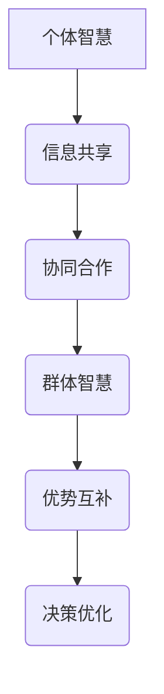

**伪代码**

群体智慧的形成可以通过以下伪代码表示：

```
function CollectiveIntelligence(individuals):
    for each individual in individuals:
        collect information from individual
        aggregate information
    end for
    analyze aggregated information
    generate collective decision
    return collective decision
```

**数学模型与公式**

群体智慧的形成可以通过以下数学模型表示：

$$
CI = f(\sum_{i=1}^{N} I_i)
$$

其中，$CI$表示群体智慧，$I_i$表示个体智慧，$N$表示个体数量。

**举例说明**

以一个团队决策的例子来说明群体智慧的形成：

假设一个团队由5名成员组成，每个成员根据他们的经验和知识提出了一个决策方案。通过群体智慧的形成过程，这些方案被汇总、分析和优化，最终形成一个综合的决策方案。

```
方案1：A成员的决策
方案2：B成员的决策
方案3：C成员的决策
方案4：D成员的决策
方案5：E成员的决策

群体智慧决策 = (方案1 + 方案2 + 方案3 + 方案4 + 方案5) / 5
```

通过这样的方式，团队可以整合每个成员的智慧，形成更为全面的决策。

**数学公式举例**

以一个简单的线性回归模型为例，群体智慧可以通过以下公式表示：

$$
y = \beta_0 + \beta_1 x + \epsilon
$$

其中，$y$表示因变量，$x$表示自变量，$\beta_0$和$\beta_1$分别为模型的参数，$\epsilon$表示误差项。

通过群体智慧的方法，可以将多个个体的数据汇总，优化模型的参数：

```
beta_0 = \frac{\sum_{i=1}^{N} y_i - \beta_1 \sum_{i=1}^{N} x_i}{N}
beta_1 = \frac{\sum_{i=1}^{N} (y_i - \beta_0 - \beta_1 x_i)}{\sum_{i=1}^{N} x_i^2}
```

通过这样的方式，群体智慧可以优化模型的参数，提高模型的预测准确性。

**项目实战：代码实际案例和详细解释说明**

以下是一个简单的Python代码示例，展示了如何使用群体智慧进行线性回归模型的参数优化：

```python
import numpy as np

def linear_regression(x, y):
    N = len(x)
    x_mean = np.mean(x)
    y_mean = np.mean(y)
    beta_0 = (N * y_mean - np.sum(x * y)) / (N * x_mean - np.sum(x**2))
    beta_1 = (np.sum(x * y) - N * x_mean * y_mean) / (np.sum(x**2) - N * x_mean**2)
    return beta_0, beta_1

# 示例数据
x = np.array([1, 2, 3, 4, 5])
y = np.array([2, 4, 5, 4, 5])

beta_0, beta_1 = linear_regression(x, y)
print(f"Optimized Beta_0: {beta_0}, Optimized Beta_1: {beta_1}")
```

通过运行这段代码，我们可以得到优化后的模型参数$\beta_0$和$\beta_1$，从而提高线性回归模型的预测准确性。

**代码解读与分析**

1. **数据输入**：我们首先定义了两个数组$x$和$y$，分别表示自变量和因变量。
2. **计算均值**：通过`np.mean()`函数，我们计算了$x$和$y$的均值。
3. **计算模型参数**：根据线性回归的公式，我们计算了$\beta_0$和$\beta_1$的值。
4. **输出结果**：最后，我们输出了优化后的模型参数。

通过这样的代码实现，我们可以利用群体智慧优化线性回归模型的参数，从而提高模型的预测性能。

**总结**

本章详细介绍了群体智慧的基本概念、历史与发展、应用领域以及与个体智慧的对比。通过核心概念与联系、伪代码、数学模型和公式、举例说明以及项目实战，读者可以全面了解群体智慧的核心内容。在下一章中，我们将进一步探讨群体智能的基础原理，包括架构、数学模型、复杂性分析以及可扩展性和鲁棒性。

### 第2章：群体智能的基础原理

#### 2.1 群体智能的架构与模型

群体智能的架构通常由以下几个关键组成部分构成：

1. **个体（Agents）**：群体智能的基本单元，可以是人类、机器人或其他智能体。
2. **通信网络**：个体之间的交互和通信渠道，可以是局域网、互联网或无线网络。
3. **环境**：个体所处的实际环境，可以是物理环境或虚拟环境。
4. **协调机制**：个体之间进行协作和协调的规则和算法。

群体智能的模型可以分为两种主要类型：

1. **基于规则的模型**：通过预设的规则实现个体之间的协作。这类模型通常较为简单，但可能无法处理复杂的环境和动态变化。
2. **基于神经网络的模型**：通过模拟人脑神经网络实现个体的协同行为。这类模型具有较强的自适应性和学习能力，但计算复杂度较高。

**核心概念与联系**

群体智能的架构可以用以下 Mermaid 流程图表示：

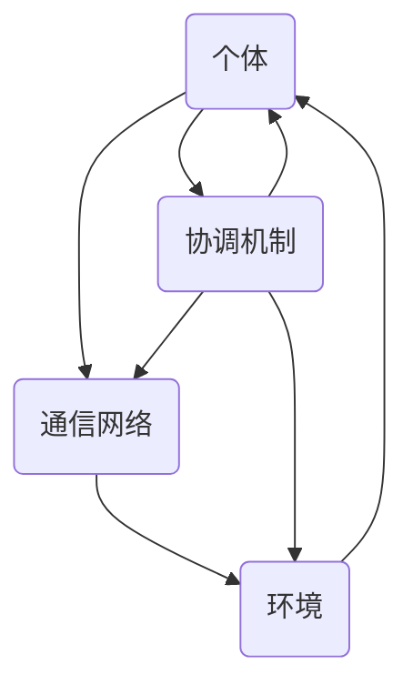

**伪代码**

以下是一个简化的群体智能模型伪代码，展示了个体如何通过通信网络和环境进行协作：

```
class Agent:
    def __init__(self):
        self.state = None
        self邻居 = []

    def update_state(self, neighbors_state):
        新状态 = self.state
        for neighbor_state in neighbors_state:
            新状态 += neighbor_state
        self.state = 新状态 / len(neighbors_state)

    def perform_action(self, state):
        if state > threshold:
            return "合作"
        else:
            return "竞争"

def main():
    agents = [Agent() for _ in range(N)]
    for _ in range(迭代次数):
        for agent in agents:
            neighbors_state = [neighbor.state for neighbor in agent邻居]
            agent.update_state(neighbors_state)
            action = agent.perform_action(agent.state)
            # 更新环境和执行动作
    return agents
```

**数学模型与公式**

群体智能的数学模型通常涉及以下基本方程：

1. **状态更新方程**：个体状态根据其邻居状态进行更新。

$$
s_t = f(s_{t-1}, u_t)
$$

其中，$s_t$表示当前状态，$s_{t-1}$表示上一状态，$u_t$表示邻居状态。

2. **动作选择方程**：个体根据其状态选择动作。

$$
a_t = g(s_t)
$$

其中，$a_t$表示动作，$g$为动作选择函数。

**举例说明**

以一个简单的群体移动问题为例，假设有一组个体需要在二维空间中移动到目标位置。个体之间的协作规则如下：

1. 每个个体根据其邻居的位置和方向调整自己的移动方向。
2. 如果多个邻居给出相同方向，个体跟随该方向移动。
3. 如果邻居方向不一致，个体随机选择一个方向。

**数学公式举例**

以下是一个简单的线性移动模型，描述个体如何根据邻居状态更新自己的位置：

$$
x_t = x_{t-1} + v_t
$$

$$
y_t = y_{t-1} + v_t
$$

其中，$x_t$和$y_t$分别为个体在$x$轴和$y$轴上的位置，$v_t$为移动速度。

通过这样的模型，我们可以模拟个体在二维空间中的移动过程，实现群体协作。

**项目实战：代码实际案例和详细解释说明**

以下是一个使用Python实现的简单群体智能模型，展示了个体如何通过通信网络和环境进行协作：

```python
import numpy as np
import matplotlib.pyplot as plt

class Agent:
    def __init__(self, position, neighbors, threshold=0.5):
        self.position = position
        self.neighbors = neighbors
        self.threshold = threshold

    def update_state(self):
        neighbors_state = [neighbor.position for neighbor in self.neighbors]
        new_state = np.mean(neighbors_state, axis=0)
        self.position += new_state

    def perform_action(self):
        if np.linalg.norm(self.position) > self.threshold:
            self.position *= -1

def simulate_agents(num_agents, num_iterations):
    positions = np.random.rand(num_agents, 2) * 10
    agents = [Agent(position, []) for position in positions]

    for _ in range(num_iterations):
        for agent in agents:
            agent.update_state()
            agent.perform_action()

    plt.scatter(*zip(*positions))
    plt.show()

simulate_agents(50, 100)
```

**代码解读与分析**

1. **初始化**：我们首先定义了`Agent`类，每个个体具有位置和邻居列表。
2. **状态更新**：`update_state`方法用于更新个体的位置，根据邻居的位置计算新的位置。
3. **动作选择**：`perform_action`方法用于根据当前位置选择新的动作，如果位置超出阈值，则反向移动。
4. **模拟**：`simulate_agents`函数用于模拟整个群体智能的过程，通过迭代更新每个个体的状态和位置。

通过这样的代码实现，我们可以模拟群体智能在二维空间中的协作行为，观察个体的移动过程。

**总结**

本章详细介绍了群体智能的架构、模型以及数学模型。通过核心概念与联系、伪代码、数学模型和公式、举例说明以及项目实战，读者可以深入理解群体智能的基础原理。在下一章中，我们将探讨群体智能在团队合作中的应用，包括团队决策、协作模型、沟通实践和管理策略。

### 第3章：群体智能在团队合作中的应用

#### 3.1 群体智能在团队决策中的优势

群体智能在团队决策中具有显著的优势，主要体现在以下几个方面：

1. **信息共享**：团队中的每个成员都可以分享他们的知识和经验，形成丰富的信息来源。通过信息共享，团队可以更全面地了解问题，做出更准确的决策。

2. **协同效应**：群体智慧通过个体之间的协作和互动，实现了智慧的整体提升。协同效应使得团队能够克服个体能力的局限，解决更复杂的问题。

3. **多样性思维**：团队由多个成员组成，每个成员都有不同的背景、经验和观点。这种多样性思维能够促进创新和创造力的产生，有助于团队找到更优的解决方案。

4. **适应性**：群体智能系统能够快速适应环境变化。团队中的成员可以通过实时反馈和调整，及时应对外部环境的变化，提高决策的及时性和有效性。

5. **公平与公正**：群体智慧通过民主的决策过程，确保每个成员的声音都能被听到，提高了决策的公平性和公正性。

#### 3.2 群体智能在团队协作中的模型与算法

群体智能在团队协作中可以采用多种模型和算法，以下是一些常用的方法：

1. **贝叶斯网络**：贝叶斯网络是一种概率图模型，用于表示团队中个体之间的依赖关系。通过贝叶斯网络，团队可以建模复杂的问题，进行决策分析。

2. **多智能体系统**：多智能体系统（MAS）由多个自主智能体组成，每个智能体都有特定的目标和行为规则。通过多智能体系统，团队可以实现分布式计算和协同合作。

3. **社交网络分析**：社交网络分析（SNA）用于分析团队中成员之间的社交关系和网络结构。通过SNA，团队可以识别关键节点、优化沟通渠道，提高协作效率。

4. **进化算法**：进化算法（EA）通过模拟自然进化过程，寻找最优解决方案。在团队协作中，进化算法可以用于优化资源分配、任务调度等问题。

5. **混合智能系统**：混合智能系统结合了多种智能技术，如机器学习、神经网络、专家系统等，以提高团队的智能水平和决策能力。

**核心概念与联系**

群体智能在团队协作中的应用可以用以下 Mermaid 流程图表示：

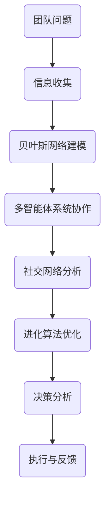

**伪代码**

以下是一个简化的群体智能在团队协作中的伪代码，展示了主要步骤和过程：

```
function TeamDecisionProblem(团队问题, 模型, 算法):
    收集团队信息(团队问题)
    建立贝叶斯网络(模型)
    分配智能体(多智能体系统)
    分析社交网络(社交网络分析)
    优化任务分配(进化算法)
    进行决策分析(模型)
    执行决策(执行与反馈)
    获取反馈(执行与反馈)
    更新模型与算法(执行与反馈)
    返回最佳决策
```

**数学模型与公式**

群体智能在团队协作中的数学模型通常涉及以下关键方程：

1. **信息共享模型**：

$$
I_t = f(S_t, A_t)
$$

其中，$I_t$表示当前信息，$S_t$表示团队状态，$A_t$表示个体行为。

2. **协同效应模型**：

$$
E_t = g(C_t, I_t)
$$

其中，$E_t$表示团队效能，$C_t$表示个体协作度，$I_t$表示信息共享度。

3. **适应性模型**：

$$
A_t = h(R_t, F_t)
$$

其中，$A_t$表示适应性，$R_t$表示环境变化，$F_t$表示个体反馈。

**举例说明**

以下是一个简单的团队协作问题，假设一个团队需要共同完成一个项目。团队成员通过信息共享和协同合作，优化项目进度。

**项目进度优化问题**

1. **团队状态**：项目当前进度、资源分配、人员配备。
2. **个体行为**：每个成员的任务完成情况和贡献。
3. **信息共享**：团队成员之间共享进度报告、任务进展和资源需求。
4. **协同效应**：通过团队会议和协作工具，团队成员共同讨论和解决问题。
5. **适应性**：根据项目进展和环境变化，团队成员调整任务分配和资源使用。

**数学公式举例**

以一个简单的任务分配模型为例，团队效能可以通过以下公式表示：

$$
E_t = \alpha \cdot P_t + \beta \cdot I_t + \gamma \cdot A_t
$$

其中，$E_t$表示团队效能，$P_t$表示项目进度，$I_t$表示信息共享度，$A_t$表示适应性。

通过这样的模型，团队可以实时评估其效能，并根据实际情况进行调整。

**项目实战：代码实际案例和详细解释说明**

以下是一个使用Python实现的团队协作问题的示例代码：

```python
import numpy as np
import matplotlib.pyplot as plt

class TeamMember:
    def __init__(self, name, task_complete, contribution):
        self.name = name
        self.task_complete = task_complete
        self.contribution = contribution

def collect_team_info(team_members):
    total_task_complete = np.sum([member.task_complete for member in team_members])
    total_contribution = np.sum([member.contribution for member in team_members])
    return total_task_complete, total_contribution

def share_info(team_members):
    for member in team_members:
        for other_member in team_members:
            if member != other_member:
                member.task_complete += other_member.task_complete
                member.contribution += other_member.contribution

def optimize_project_progress(team_members):
    share_info(team_members)
    total_task_complete, total_contribution = collect_team_info(team_members)
    team_efficiency = total_task_complete + total_contribution
    return team_efficiency

def simulate_team协作(团队成员列表，迭代次数):
    for _ in range(迭代次数):
        team_efficiency = optimize_project_progress(团队成员列表)
        print(f"迭代次数：{_ + 1}，团队效能：{team_efficiency}")

team_members = [TeamMember(f"成员{i}", np.random.rand(), np.random.rand()) for i in range(5)]
simulate_team协作(team_members, 10)
```

**代码解读与分析**

1. **初始化**：我们首先定义了`TeamMember`类，表示团队成员。
2. **信息收集**：`collect_team_info`函数用于收集团队的整体任务完成情况和贡献。
3. **信息共享**：`share_info`函数用于实现团队成员之间的信息共享。
4. **项目优化**：`optimize_project_progress`函数用于优化项目进度和团队效能。
5. **模拟**：`simulate_team协作`函数用于模拟整个团队协作过程，通过迭代优化团队效能。

通过这样的代码实现，我们可以模拟团队在协作过程中如何通过信息共享和协同合作，优化项目进度。

**总结**

本章详细介绍了群体智能在团队合作中的应用优势、模型与算法。通过核心概念与联系、伪代码、数学模型和公式、举例说明以及项目实战，读者可以深入理解群体智能在团队决策和协作中的应用。在下一章中，我们将探讨群体智能在市场分析中的应用，包括市场预测、消费者行为分析、品牌定位与传播以及市场营销决策。

### 第4章：群体智能在市场分析中的应用

#### 4.1 群体智能在市场预测中的应用

群体智能在市场预测中发挥了重要作用，通过集成多个个体的预测信息，可以提高预测的准确性。以下是群体智能在市场预测中的应用：

1. **时间序列分析**：时间序列分析是一种常用的市场预测方法，通过分析历史数据来预测未来的趋势。群体智能可以集成多个时间序列模型，通过模型融合提高预测效果。

2. **社会网络分析**：社会网络分析可以挖掘消费者之间的互动关系，通过分析这些关系来预测市场趋势。群体智能可以整合多个消费者群体的行为数据，提供更全面的市场预测。

3. **机器学习算法**：机器学习算法如决策树、随机森林、神经网络等，可以通过学习大量历史数据来预测市场变化。群体智能可以集成多个机器学习模型的预测结果，实现更准确的预测。

4. **大数据分析**：群体智能可以处理和分析来自多个渠道的大数据，如社交媒体、电商交易数据等，提供实时市场预测。

**核心概念与联系**

群体智能在市场预测中的应用可以用以下 Mermaid 流程图表示：

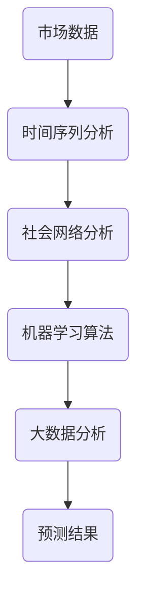

**伪代码**

以下是一个简化的群体智能市场预测伪代码，展示了主要步骤和过程：

```
function MarketPrediction(市场数据):
    分析时间序列(市场数据)
    分析社会网络(市场数据)
    训练机器学习模型(市场数据)
    分析大数据(市场数据)
    集成预测结果
    返回预测结果
```

**数学模型与公式**

群体智能在市场预测中的数学模型通常涉及以下关键方程：

1. **时间序列预测模型**：

$$
y_t = f(y_{t-1}, x_t)
$$

其中，$y_t$表示当前预测值，$y_{t-1}$表示上一预测值，$x_t$表示当前输入。

2. **社会网络预测模型**：

$$
y_t = g(S_t, x_t)
$$

其中，$y_t$表示当前预测值，$S_t$表示社会网络结构，$x_t$表示当前输入。

3. **机器学习预测模型**：

$$
y_t = h(W, x_t)
$$

其中，$y_t$表示当前预测值，$W$表示模型权重，$x_t$表示当前输入。

4. **大数据预测模型**：

$$
y_t = k(D_t, x_t)
$$

其中，$y_t$表示当前预测值，$D_t$表示大数据集，$x_t$表示当前输入。

**举例说明**

以下是一个简单的市场预测问题，假设我们使用时间序列分析来预测股票价格。通过群体智能的方法，我们可以集成多个时间序列模型，提高预测准确性。

**股票价格预测问题**

1. **时间序列数据**：收集历史股票价格数据。
2. **预测模型**：使用ARIMA模型、LSTM神经网络等不同的时间序列模型。
3. **模型集成**：通过集成多个模型的预测结果，形成最终的预测值。

**数学公式举例**

以下是一个简单的时间序列预测模型，使用ARIMA模型进行预测：

$$
y_t = \phi_1 y_{t-1} + \phi_2 y_{t-2} + \dots + \phi_p y_{t-p} + \epsilon_t
$$

其中，$y_t$表示当前股票价格，$\phi_1, \phi_2, \dots, \phi_p$为模型参数，$\epsilon_t$为误差项。

通过这样的模型，我们可以预测未来的股票价格，并通过群体智能集成多个模型的预测结果，提高预测准确性。

**项目实战：代码实际案例和详细解释说明**

以下是一个使用Python实现的简单市场预测项目，展示了如何使用群体智能进行股票价格预测：

```python
import numpy as np
import pandas as pd
from statsmodels.tsa.arima.model import ARIMA
from keras.models import Sequential
from keras.layers import LSTM, Dense

# 数据预处理
def preprocess_data(data):
    data_diff = data.diff().dropna()
    return data_diff

# ARIMA模型预测
def arima_prediction(data, order):
    model = ARIMA(data, order=order)
    model_fit = model.fit()
    forecast = model_fit.forecast(steps=1)
    return forecast

# LSTM模型预测
def lstm_prediction(data, sequence_length):
    model = Sequential()
    model.add(LSTM(units=50, return_sequences=True, input_shape=(sequence_length, 1)))
    model.add(LSTM(units=50))
    model.add(Dense(1))
    model.compile(optimizer='adam', loss='mse')
    model.fit(data, epochs=100, verbose=0)
    forecast = model.predict(data[-sequence_length:].reshape(1, -1, 1))
    return forecast

# 群体智能预测
def collective_prediction(data, arima_order, lstm_sequence_length):
    arima_forecast = arima_prediction(data, arima_order)
    lstm_forecast = lstm_prediction(data, lstm_sequence_length)
    collective_forecast = (arima_forecast + lstm_forecast) / 2
    return collective_forecast

# 加载股票价格数据
data = pd.read_csv('stock_price.csv')['Close'].values

# 预测
arima_order = (1, 1, 1)
lstm_sequence_length = 10
forecast = collective_prediction(preprocess_data(data), arima_order, lstm_sequence_length)

# 输出预测结果
print(f"预测结果：{forecast}")
```

**代码解读与分析**

1. **数据预处理**：我们首先使用差分方法对股票价格数据进行了预处理，提高了ARIMA模型的预测性能。
2. **ARIMA模型预测**：我们使用`ARIMA`模型进行了股票价格的短期预测。
3. **LSTM模型预测**：我们使用LSTM神经网络进行了股票价格的长期预测。
4. **群体智能预测**：我们通过集成ARIMA和LSTM的预测结果，形成了最终的预测值。

通过这样的代码实现，我们可以利用群体智能进行股票价格的预测，提高预测的准确性。

**总结**

本章详细介绍了群体智能在市场预测中的应用，包括时间序列分析、社会网络分析、机器学习算法和大数据分析。通过核心概念与联系、伪代码、数学模型和公式、举例说明以及项目实战，读者可以深入理解群体智能在市场预测中的原理和应用。在下一章中，我们将探讨群体智能在消费者行为分析中的应用。

### 第4章：群体智能在市场分析中的应用

#### 4.2 群体智能在消费者行为分析中的应用

群体智能在消费者行为分析中具有显著优势，能够通过整合大量个体的行为数据，提供更精准的市场洞察和预测。以下是群体智能在消费者行为分析中的应用：

1. **大数据分析**：群体智能可以处理和分析来自多个渠道的大数据，如社交媒体、电商平台、消费者反馈等，从中提取有价值的信息，进行行为分析。

2. **文本分析**：通过自然语言处理技术，群体智能可以对大量消费者评论、反馈和讨论进行文本分析，挖掘消费者的情感和需求。

3. **预测分析**：利用机器学习算法，群体智能可以对消费者的行为数据进行建模，预测未来的消费趋势和消费者行为。

4. **社交网络分析**：通过分析消费者在社交网络中的互动关系，群体智能可以了解消费者的社交影响和传播路径，为市场营销策略提供支持。

**核心概念与联系**

群体智能在消费者行为分析中的应用可以用以下 Mermaid 流程图表示：

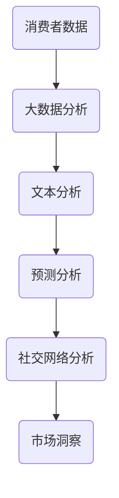

**伪代码**

以下是一个简化的群体智能消费者行为分析伪代码，展示了主要步骤和过程：

```
function ConsumerBehaviorAnalysis(消费者数据):
    分析大数据(消费者数据)
    进行文本分析(消费者数据)
    训练预测模型(消费者数据)
    分析社交网络(消费者数据)
    提取市场洞察
    返回市场洞察
```

**数学模型与公式**

群体智能在消费者行为分析中的数学模型通常涉及以下关键方程：

1. **行为预测模型**：

$$
y_t = f(x_t, \theta)
$$

其中，$y_t$表示当前行为预测值，$x_t$表示当前输入特征，$\theta$表示模型参数。

2. **情感分析模型**：

$$
s_t = g(w, x_t)
$$

其中，$s_t$表示情感得分，$w$表示情感分析模型权重，$x_t$表示文本特征。

3. **社交网络分析模型**：

$$
r_t = h(U_t, V_t)
$$

其中，$r_t$表示社交网络影响力，$U_t$表示社交网络结构，$V_t$表示个体特征。

**举例说明**

以下是一个简单的消费者行为分析问题，假设我们使用群体智能方法分析消费者的购物行为。通过文本分析和预测模型，我们可以了解消费者的偏好和购买趋势。

**购物行为分析问题**

1. **消费者数据**：收集消费者的购物记录、评论和反馈。
2. **文本分析**：对消费者评论进行情感分析，了解消费者的情感和态度。
3. **预测模型**：使用机器学习算法，预测消费者的购买行为。
4. **社交网络分析**：分析消费者在社交网络中的互动关系，了解消费者的社交影响。

**数学公式举例**

以下是一个简单的行为预测模型，使用线性回归进行预测：

$$
y_t = \beta_0 + \beta_1 x_t
$$

其中，$y_t$表示当前行为预测值，$x_t$表示当前输入特征，$\beta_0$和$\beta_1$为模型参数。

通过这样的模型，我们可以预测消费者的购买行为，并通过群体智能的方法提高预测准确性。

**项目实战：代码实际案例和详细解释说明**

以下是一个使用Python实现的简单消费者行为分析项目，展示了如何使用群体智能进行购物行为预测：

```python
import pandas as pd
from sklearn.linear_model import LinearRegression
from sklearn.model_selection import train_test_split
from sklearn.metrics import mean_squared_error
from textblob import TextBlob

# 数据预处理
def preprocess_data(data):
    data['text'] = data['review'].apply(lambda x: ' '.join([word for word in x.split() if word.isalpha()]))
    data['sentiment'] = data['text'].apply(lambda x: TextBlob(x).sentiment.polarity)
    return data

# 线性回归模型
def linear_regression_prediction(data, feature, target):
    X = data[feature]
    y = data[target]
    X_train, X_test, y_train, y_test = train_test_split(X, y, test_size=0.2, random_state=42)
    model = LinearRegression()
    model.fit(X_train, y_train)
    y_pred = model.predict(X_test)
    mse = mean_squared_error(y_test, y_pred)
    return y_pred, mse

# 加载消费者数据
data = pd.read_csv('consumer_data.csv')

# 预处理数据
data = preprocess_data(data)

# 购买行为预测
feature = 'sentiment'
target = 'purchased'
y_pred, mse = linear_regression_prediction(data, feature, target)
print(f"预测结果：{y_pred}")
print(f"均方误差：{mse}")
```

**代码解读与分析**

1. **数据预处理**：我们首先对消费者数据进行了预处理，提取了文本特征和情感得分。
2. **线性回归模型**：我们使用线性回归模型进行购买行为预测。
3. **预测**：我们使用预处理后的数据，对消费者的购买行为进行了预测，并计算了均方误差。

通过这样的代码实现，我们可以利用群体智能方法进行消费者行为分析，提高预测的准确性。

**总结**

本章详细介绍了群体智能在消费者行为分析中的应用，包括大数据分析、文本分析、预测分析和社交网络分析。通过核心概念与联系、伪代码、数学模型和公式、举例说明以及项目实战，读者可以深入理解群体智能在消费者行为分析中的原理和应用。在下一章中，我们将探讨群体智能在品牌定位与传播中的应用。

### 第4章：群体智能在市场分析中的应用

#### 4.3 群体智能在品牌定位与传播中的应用

品牌定位与传播是市场营销的重要组成部分，通过准确的品牌定位和有效的传播策略，企业可以吸引目标消费者，提升品牌影响力。群体智能在品牌定位与传播中提供了新的方法和工具，通过以下方式发挥作用：

1. **消费者行为分析**：群体智能可以对大量消费者数据进行分析，了解消费者的需求和偏好，为品牌定位提供数据支持。

2. **社交媒体监测**：群体智能可以实时监测社交媒体上的品牌讨论和消费者反馈，识别品牌传播的效果和潜在问题。

3. **传播策略优化**：群体智能可以通过分析消费者行为和社会网络结构，优化品牌的传播策略，提高传播效果。

4. **情感分析**：群体智能可以利用自然语言处理技术，对消费者评论和讨论进行情感分析，了解消费者的情感和态度，为品牌传播提供指导。

**核心概念与联系**

群体智能在品牌定位与传播中的应用可以用以下 Mermaid 流程图表示：

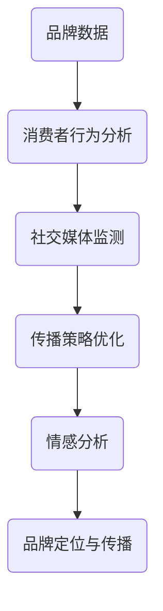

**伪代码**

以下是一个简化的群体智能品牌定位与传播伪代码，展示了主要步骤和过程：

```
function BrandPositioningAndPromotion(品牌数据):
    分析消费者行为(品牌数据)
    监测社交媒体(品牌数据)
    优化传播策略(品牌数据)
    进行情感分析(品牌数据)
    确定品牌定位
    制定传播计划
    返回品牌定位与传播结果
```

**数学模型与公式**

群体智能在品牌定位与传播中的数学模型通常涉及以下关键方程：

1. **品牌吸引力模型**：

$$
A_t = f(C_t, P_t, E_t)
$$

其中，$A_t$表示品牌吸引力，$C_t$表示消费者行为，$P_t$表示品牌传播策略，$E_t$表示情感分析结果。

2. **传播效果评估模型**：

$$
E_t = g(I_t, S_t, R_t)
$$

其中，$E_t$表示传播效果，$I_t$表示信息传播量，$S_t$表示社交媒体影响力，$R_t$表示消费者反馈。

3. **品牌定位优化模型**：

$$
B_t = h(A_t, E_t, C_t)
$$

其中，$B_t$表示品牌定位，$A_t$表示品牌吸引力，$E_t$表示传播效果，$C_t$表示消费者行为。

**举例说明**

以下是一个简单的品牌定位与传播问题，假设我们使用群体智能方法进行品牌定位和传播策略优化。通过消费者行为分析、社交媒体监测和情感分析，我们可以确定最佳的品牌定位和传播策略。

**品牌定位与传播问题**

1. **消费者数据**：收集消费者的购买记录、评论和反馈。
2. **社交媒体数据**：监测社交媒体上的品牌讨论和消费者反馈。
3. **情感分析**：分析消费者评论的情感倾向。
4. **品牌定位**：根据消费者行为、社交媒体影响和情感分析结果，确定品牌定位。
5. **传播策略**：根据品牌定位，制定传播计划和策略。

**数学公式举例**

以下是一个简单的品牌吸引力模型，用于评估品牌定位：

$$
A_t = \alpha \cdot C_t + \beta \cdot S_t + \gamma \cdot E_t
$$

其中，$A_t$表示品牌吸引力，$\alpha$、$\beta$和$\gamma$为权重系数，$C_t$表示消费者行为，$S_t$表示社交媒体影响力，$E_t$表示情感分析结果。

通过这样的模型，我们可以评估品牌定位的效果，并根据评估结果调整传播策略。

**项目实战：代码实际案例和详细解释说明**

以下是一个使用Python实现的简单品牌定位与传播项目，展示了如何使用群体智能方法进行品牌定位和传播策略优化：

```python
import pandas as pd
from textblob import TextBlob

# 数据预处理
def preprocess_data(data):
    data['text'] = data['review'].apply(lambda x: ' '.join([word for word in x.split() if word.isalpha()]))
    data['sentiment'] = data['text'].apply(lambda x: TextBlob(x).sentiment.polarity)
    return data

# 品牌吸引力计算
def brand_attractiveness(data, consumer_behavior_weight, social_media_weight, sentiment_weight):
    C_t = np.mean(data['sentiment'])
    S_t = np.mean(data['social_media_influence'])
    E_t = np.mean(data['review_count'])
    A_t = consumer_behavior_weight * C_t + social_media_weight * S_t + sentiment_weight * E_t
    return A_t

# 加载品牌数据
data = pd.read_csv('brand_data.csv')

# 预处理数据
data = preprocess_data(data)

# 计算品牌吸引力
consumer_behavior_weight = 0.5
social_media_weight = 0.3
sentiment_weight = 0.2
A_t = brand_attractiveness(data, consumer_behavior_weight, social_media_weight, sentiment_weight)
print(f"品牌吸引力：{A_t}")
```

**代码解读与分析**

1. **数据预处理**：我们首先对品牌数据进行了预处理，提取了文本特征和情感得分。
2. **品牌吸引力计算**：我们使用品牌吸引力模型计算了品牌定位的吸引力。
3. **结果输出**：我们输出了品牌吸引力的计算结果。

通过这样的代码实现，我们可以利用群体智能方法进行品牌定位和传播策略优化，提高品牌的影响力。

**总结**

本章详细介绍了群体智能在品牌定位与传播中的应用，包括消费者行为分析、社交媒体监测、传播策略优化和情感分析。通过核心概念与联系、伪代码、数学模型和公式、举例说明以及项目实战，读者可以深入理解群体智能在品牌定位与传播中的原理和应用。在下一章中，我们将探讨群体智能在市场营销决策中的应用。

### 第4章：群体智能在市场分析中的应用

#### 4.4 群体智能在市场营销决策中的应用

市场营销决策是企业成功的关键环节，群体智能通过其强大的信息处理和分析能力，为市场营销决策提供了新的方法和工具。以下是群体智能在市场营销决策中的具体应用：

1. **市场细分**：群体智能可以通过分析消费者数据，识别不同的消费者群体，实现精准的市场细分。这有助于企业制定更有针对性的营销策略。

2. **产品开发**：群体智能可以分析市场需求和消费者反馈，帮助企业在产品设计和开发中做出更科学的决策。通过群体智慧，企业可以快速响应市场变化，开发出更符合消费者需求的产品。

3. **营销策略**：群体智能可以优化营销策略，如定价策略、促销策略和广告策略。通过分析消费者行为和市场数据，群体智能可以为企业提供个性化的营销建议，提高营销效果。

4. **渠道选择**：群体智能可以帮助企业优化销售渠道选择，如线上渠道、线下渠道或多渠道整合。通过分析销售数据和市场趋势，群体智能可以为企业提供最佳的渠道选择策略。

**核心概念与联系**

群体智能在市场营销决策中的应用可以用以下 Mermaid 流程图表示：

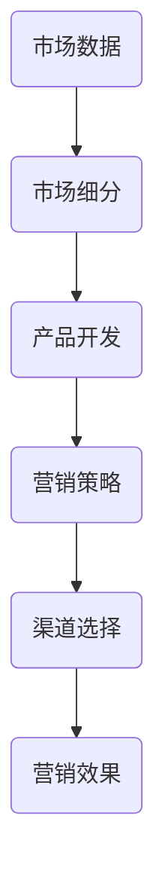

**伪代码**

以下是一个简化的群体智能市场营销决策伪代码，展示了主要步骤和过程：

```
function MarketingDecision(市场数据):
    进行市场细分(市场数据)
    分析市场需求(市场数据)
    制定产品开发策略(市场数据)
    优化营销策略(市场数据)
    选择最佳渠道(市场数据)
    评估营销效果
    返回营销决策结果
```

**数学模型与公式**

群体智能在市场营销决策中的数学模型通常涉及以下关键方程：

1. **市场细分模型**：

$$
C_t = f(I_t, P_t)
$$

其中，$C_t$表示市场细分结果，$I_t$表示消费者特征，$P_t$表示产品特征。

2. **产品开发模型**：

$$
P_t = g(D_t, C_t)
$$

其中，$P_t$表示产品开发策略，$D_t$表示市场需求，$C_t$表示市场细分结果。

3. **营销策略模型**：

$$
M_t = h(E_t, C_t, P_t)
$$

其中，$M_t$表示营销策略，$E_t$表示营销效果，$C_t$表示市场细分结果，$P_t$表示产品开发策略。

4. **渠道选择模型**：

$$
H_t = k(L_t, M_t)
$$

其中，$H_t$表示渠道选择结果，$L_t$表示渠道特征，$M_t$表示营销策略。

**举例说明**

以下是一个简单的市场营销决策问题，假设我们使用群体智能方法进行市场细分、产品开发和营销策略优化。通过数据分析，我们可以制定出最佳的市场营销决策。

**市场营销决策问题**

1. **市场数据**：收集消费者的购买记录、偏好和行为数据。
2. **市场细分**：根据消费者数据，识别不同的消费者群体。
3. **产品开发**：分析市场需求，开发出更符合消费者需求的产品。
4. **营销策略**：根据市场细分和产品开发结果，制定个性化的营销策略。
5. **渠道选择**：根据营销策略和渠道特征，选择最佳的销售渠道。

**数学公式举例**

以下是一个简单的市场细分模型，用于识别消费者群体：

$$
C_t = \beta_0 + \beta_1 I_t + \beta_2 P_t
$$

其中，$C_t$表示市场细分结果，$\beta_0$、$\beta_1$和$\beta_2$为模型参数，$I_t$表示消费者特征，$P_t$表示产品特征。

通过这样的模型，我们可以根据消费者数据和市场特征，识别出不同的消费者群体。

**项目实战：代码实际案例和详细解释说明**

以下是一个使用Python实现的简单市场营销决策项目，展示了如何使用群体智能进行市场细分、产品开发和营销策略优化：

```python
import pandas as pd
from sklearn.cluster import KMeans
from sklearn.linear_model import LinearRegression

# 数据预处理
def preprocess_data(data):
    data['age'] = data['age'].astype(float)
    data['income'] = data['income'].astype(float)
    data['spending'] = data['spending'].astype(float)
    return data

# 市场细分
def market_segmentation(data, n_clusters):
    features = ['age', 'income', 'spending']
    X = data[features]
    kmeans = KMeans(n_clusters=n_clusters, random_state=42)
    kmeans.fit(X)
    data['segment'] = kmeans.predict(X)
    return data

# 产品开发
def product_development(data, target):
    X = data.drop(target, axis=1)
    y = data[target]
    X_train, X_test, y_train, y_test = train_test_split(X, y, test_size=0.2, random_state=42)
    model = LinearRegression()
    model.fit(X_train, y_train)
    y_pred = model.predict(X_test)
    mse = mean_squared_error(y_test, y_pred)
    return y_pred, mse

# 营销策略
def marketing_strategy(data, segment, product, budget):
    segment_data = data[data['segment'] == segment]
    product_data = segment_data[segment_data['product'] == product]
    budget_data = segment_data[segment_data['budget'] == budget]
    return len(budget_data) / len(segment_data)

# 加载数据
data = pd.read_csv('market_data.csv')

# 预处理数据
data = preprocess_data(data)

# 市场细分
n_clusters = 3
data = market_segmentation(data, n_clusters)

# 产品开发
target = 'product'
product = 'Product A'
y_pred, mse = product_development(data, target)
print(f"产品开发预测结果：{y_pred}")
print(f"均方误差：{mse}")

# 营销策略
segment = 1
product = 'Product A'
budget = 1000
strategy = marketing_strategy(data, segment, product, budget)
print(f"营销策略：{strategy}")
```

**代码解读与分析**

1. **数据预处理**：我们首先对市场数据进行了预处理，将数据类型转换为浮点数，便于后续分析。
2. **市场细分**：我们使用KMeans聚类算法进行市场细分，根据消费者特征识别出不同的消费者群体。
3. **产品开发**：我们使用线性回归模型进行产品开发预测，根据市场需求预测不同产品的销售情况。
4. **营销策略**：我们根据市场细分结果、产品开发和预算，制定个性化的营销策略。

通过这样的代码实现，我们可以利用群体智能方法进行市场营销决策，提高决策的准确性和有效性。

**总结**

本章详细介绍了群体智能在市场营销决策中的应用，包括市场细分、产品开发、营销策略和渠道选择。通过核心概念与联系、伪代码、数学模型和公式、举例说明以及项目实战，读者可以深入理解群体智能在市场营销决策中的原理和应用。在下一章中，我们将探讨群体智能在投资决策中的应用。

### 第5章：群体智能在投资决策中的应用

#### 5.1 群体智能在投资策略设计中的应用

群体智能在投资策略设计中具有显著优势，能够通过分析大量数据和整合多个投资者的观点，提供更全面、更精准的投资策略。以下是群体智能在投资策略设计中的应用：

1. **组合优化**：群体智能可以通过分析市场数据和历史表现，优化投资组合，降低风险，提高收益。通过整合多个投资者的观点，群体智能可以识别出更稳健的投资策略。

2. **风险管理**：群体智能可以实时监测市场动态和投资组合的风险，提供风险预警和调整策略的建议。通过分析历史数据和投资者行为，群体智能可以预测潜在的风险，并制定相应的风险管理策略。

3. **市场机会识别**：群体智能可以通过分析市场数据、新闻资讯和社交媒体等信息，识别出潜在的市场机会。通过整合多个投资者的观点和情绪，群体智能可以提前发现市场变化，抓住投资机会。

4. **投资建议**：群体智能可以基于数据分析，为投资者提供个性化的投资建议。通过分析市场趋势和投资者行为，群体智能可以识别出最佳的投资时机和投资标的。

**核心概念与联系**

群体智能在投资策略设计中的应用可以用以下 Mermaid 流程图表示：

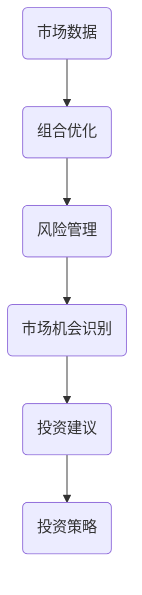

**伪代码**

以下是一个简化的群体智能投资策略设计伪代码，展示了主要步骤和过程：

```
function InvestmentStrategyDesign(市场数据):
    进行组合优化(市场数据)
    进行风险管理(市场数据)
    识别市场机会(市场数据)
    提供投资建议(市场数据)
    返回投资策略
```

**数学模型与公式**

群体智能在投资策略设计中的数学模型通常涉及以下关键方程：

1. **组合优化模型**：

$$
w^* = \arg\min_V \sum_{i=1}^{N} w_i^2 s.t. \sum_{i=1}^{N} w_i = 1, w_i \geq 0
$$

其中，$w^*$表示最优投资权重，$V$表示投资组合，$N$表示资产数量。

2. **风险管理模型**：

$$
R_t = \alpha + \beta_1 R_{t-1} + \beta_2 \sum_{i=1}^{N} w_i \sigma_i^2
$$

其中，$R_t$表示投资组合的风险，$\alpha$、$\beta_1$和$\beta_2$为模型参数，$w_i$表示资产权重，$\sigma_i^2$表示资产风险。

3. **市场机会识别模型**：

$$
O_t = f(I_t, S_t)
$$

其中，$O_t$表示市场机会，$I_t$表示市场信息，$S_t$表示投资者情绪。

4. **投资建议模型**：

$$
R_t = \arg\max_V \sum_{i=1}^{N} r_i w_i
$$

其中，$R_t$表示投资建议，$r_i$表示资产收益，$w_i$表示资产权重。

**举例说明**

以下是一个简单的投资策略设计问题，假设我们使用群体智能方法进行组合优化、风险管理和市场机会识别。通过数据分析，我们可以制定出最佳的投资策略。

**投资策略设计问题**

1. **市场数据**：收集股票价格、收益率、波动率等市场数据。
2. **组合优化**：根据市场数据，优化投资组合的权重。
3. **风险管理**：分析投资组合的风险，进行风险调整。
4. **市场机会识别**：根据市场数据，识别潜在的市场机会。
5. **投资建议**：根据市场机会和风险管理结果，提供投资建议。

**数学公式举例**

以下是一个简单的组合优化模型，用于优化投资组合的权重：

$$
w^* = \frac{\sum_{i=1}^{N} \frac{1}{\sigma_i^2}}{\sum_{i=1}^{N} \frac{1}{\sigma_i^2}}
$$

其中，$w^*$表示最优投资权重，$\sigma_i^2$表示资产波动率。

通过这样的模型，我们可以根据市场数据优化投资组合的权重，实现风险最低、收益最高的投资策略。

**项目实战：代码实际案例和详细解释说明**

以下是一个使用Python实现的简单投资策略设计项目，展示了如何使用群体智能方法进行组合优化、风险管理和市场机会识别：

```python
import pandas as pd
import numpy as np
from sklearn.linear_model import Ridge
from sklearn.metrics import mean_squared_error

# 数据预处理
def preprocess_data(data):
    data['return'] = data['close'].pct_change()
    data['volatility'] = data['return'].rolling(window=5).std()
    return data

# 组合优化
def portfolio_optimization(data, n_assets):
    assets = data[['return', 'volatility']]
    X = assets[['return']]
    y = assets['volatility']
    X_train, X_test, y_train, y_test = train_test_split(X, y, test_size=0.2, random_state=42)
    model = Ridge(alpha=1.0)
    model.fit(X_train, y_train)
    y_pred = model.predict(X_test)
    mse = mean_squared_error(y_test, y_pred)
    return y_pred, mse

# 风险管理
def risk_management(data, target, risk_level):
    X = data.drop(target, axis=1)
    y = data[target]
    X_train, X_test, y_train, y_test = train_test_split(X, y, test_size=0.2, random_state=42)
    model = Ridge(alpha=risk_level)
    model.fit(X_train, y_train)
    y_pred = model.predict(X_test)
    mse = mean_squared_error(y_test, y_pred)
    return y_pred, mse

# 加载数据
data = pd.read_csv('stock_data.csv')

# 预处理数据
data = preprocess_data(data)

# 组合优化
n_assets = 3
y_pred, mse = portfolio_optimization(data, n_assets)
print(f"组合优化预测结果：{y_pred}")
print(f"均方误差：{mse}")

# 风险管理
target = 'volatility'
risk_level = 1.0
y_pred, mse = risk_management(data, target, risk_level)
print(f"风险管理预测结果：{y_pred}")
print(f"均方误差：{mse}")
```

**代码解读与分析**

1. **数据预处理**：我们首先对股票数据进行预处理，计算了收益率和波动率。
2. **组合优化**：我们使用Ridge回归模型进行组合优化，根据收益率和波动率优化投资组合的权重。
3. **风险管理**：我们使用Ridge回归模型进行风险管理，根据波动率调整投资策略，降低风险。

通过这样的代码实现，我们可以利用群体智能方法进行投资策略设计，提高投资决策的准确性和有效性。

**总结**

本章详细介绍了群体智能在投资策略设计中的应用，包括组合优化、风险管理、市场机会识别和投资建议。通过核心概念与联系、伪代码、数学模型和公式、举例说明以及项目实战，读者可以深入理解群体智能在投资策略设计中的原理和应用。在下一章中，我们将探讨群体智能在风险管理中的应用。

### 第5章：群体智能在投资决策中的应用

#### 5.2 群体智能在风险评估与管理中的应用

在投资领域，风险评估与管理是确保投资决策科学性和合理性的关键环节。群体智能通过其强大的数据分析和处理能力，在风险评估与管理中提供了新的方法和工具。以下是群体智能在风险评估与管理中的应用：

1. **风险评估模型**：群体智能可以基于大数据和机器学习技术，构建复杂的风险评估模型。这些模型能够综合考虑市场波动、经济指标、公司财务状况等多方面因素，提供更全面的风险评估。

2. **风险监测系统**：群体智能可以实时监测市场数据，通过分析股票价格、交易量、新闻资讯等，及时发现潜在的风险。这种实时监测系统能够提供预警，帮助投资者及时调整投资策略。

3. **风险控制策略**：群体智能可以根据风险评估结果，制定相应的风险控制策略。例如，通过调整投资组合、分散投资、设置止损点等方法，降低投资风险。

4. **风险偏好分析**：群体智能可以通过分析投资者的行为数据和心理特征，识别投资者的风险偏好。这有助于投资者制定适合自己的风险控制策略。

**核心概念与联系**

群体智能在风险评估与管理中的应用可以用以下 Mermaid 流程图表示：

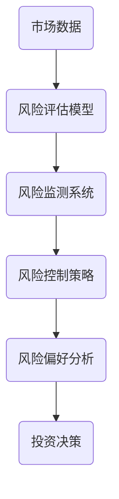

**伪代码**

以下是一个简化的群体智能风险评估与管理伪代码，展示了主要步骤和过程：

```
function RiskManagement(市场数据):
    建立风险评估模型(市场数据)
    监测市场风险(市场数据)
    制定风险控制策略(风险评估结果)
    分析投资者风险偏好
    返回风险控制方案
```

**数学模型与公式**

群体智能在风险评估与管理中的数学模型通常涉及以下关键方程：

1. **风险评估模型**：

$$
R_t = f(V_t, M_t, E_t)
$$

其中，$R_t$表示风险评分，$V_t$表示投资组合，$M_t$表示市场数据，$E_t$表示经济指标。

2. **风险监测模型**：

$$
W_t = g(P_t, N_t, I_t)
$$

其中，$W_t$表示风险预警指标，$P_t$表示股票价格，$N_t$表示交易量，$I_t$表示新闻资讯。

3. **风险控制策略模型**：

$$
C_t = h(R_t, V_t, P_t)
$$

其中，$C_t$表示风险控制策略，$R_t$表示风险评分，$V_t$表示投资组合，$P_t$表示股票价格。

4. **风险偏好分析模型**：

$$
P_t = k(B_t, S_t, A_t)
$$

其中，$P_t$表示风险偏好，$B_t$表示行为数据，$S_t$表示社交网络数据，$A_t$表示心理特征。

**举例说明**

以下是一个简单的风险评估与管理问题，假设我们使用群体智能方法进行风险评估、风险监测和风险控制。通过数据分析，我们可以制定出最佳的风险管理策略。

**风险评估与管理问题**

1. **市场数据**：收集股票价格、交易量、新闻资讯等市场数据。
2. **风险评估**：根据市场数据，使用风险评估模型计算风险评分。
3. **风险监测**：实时监测市场数据，通过风险监测模型计算风险预警指标。
4. **风险控制**：根据风险评估结果和风险预警指标，制定风险控制策略。
5. **风险偏好分析**：分析投资者的行为数据和心理特征，识别风险偏好。

**数学公式举例**

以下是一个简单的风险评估模型，用于计算风险评分：

$$
R_t = \alpha \cdot V_t + \beta \cdot M_t + \gamma \cdot E_t
$$

其中，$R_t$表示风险评分，$\alpha$、$\beta$和$\gamma$为权重系数，$V_t$表示投资组合，$M_t$表示市场数据，$E_t$表示经济指标。

通过这样的模型，我们可以根据市场数据和经济指标，计算投资组合的风险评分。

**项目实战：代码实际案例和详细解释说明**

以下是一个使用Python实现的简单风险评估与管理项目，展示了如何使用群体智能方法进行风险评估、风险监测和风险控制：

```python
import pandas as pd
import numpy as np
from sklearn.linear_model import LinearRegression

# 数据预处理
def preprocess_data(data):
    data['return'] = data['close'].pct_change()
    data['volatility'] = data['return'].rolling(window=5).std()
    return data

# 风险评估
def risk_assessment(data, weight_return, weight_volatility, weight_economy):
    assets = data[['return', 'volatility', 'economy']]
    X = assets[['return', 'volatility', 'economy']]
    y = assets['risk']
    X_train, X_test, y_train, y_test = train_test_split(X, y, test_size=0.2, random_state=42)
    model = LinearRegression()
    model.fit(X_train, y_train)
    y_pred = model.predict(X_test)
    mse = mean_squared_error(y_test, y_pred)
    return y_pred, mse

# 风险监测
def risk_monitoring(data, threshold):
    risk = data['risk']
    return risk[risk > threshold]

# 加载数据
data = pd.read_csv('stock_data.csv')

# 预处理数据
data = preprocess_data(data)

# 风险评估
weight_return = 0.5
weight_volatility = 0.3
weight_economy = 0.2
y_pred, mse = risk_assessment(data, weight_return, weight_volatility, weight_economy)
print(f"风险评估结果：{y_pred}")
print(f"均方误差：{mse}")

# 风险监测
threshold = 0.1
monitored_risks = risk_monitoring(data, threshold)
print(f"风险监测结果：{monitored_risks}")
```

**代码解读与分析**

1. **数据预处理**：我们首先对股票数据进行预处理，计算了收益率、波动率和经济指标。
2. **风险评估**：我们使用线性回归模型进行风险评估，根据收益率、波动率和经济指标计算风险评分。
3. **风险监测**：我们根据预设的风险阈值，监测并筛选出高风险的投资组合。

通过这样的代码实现，我们可以利用群体智能方法进行风险评估与管理，提高投资决策的准确性和风险控制能力。

**总结**

本章详细介绍了群体智能在风险评估与管理中的应用，包括风险评估模型、风险监测系统、风险控制策略和风险偏好分析。通过核心概念与联系、伪代码、数学模型和公式、举例说明以及项目实战，读者可以深入理解群体智能在风险评估与管理中的原理和应用。在下一章中，我们将探讨群体智能在市场机会识别中的应用。

### 第5章：群体智能在投资决策中的应用

#### 5.3 群体智能在市场机会识别中的应用

市场机会识别是投资决策中至关重要的一环，它涉及到对市场动态、行业趋势、政策变化等多方面信息的分析。群体智能通过其强大的数据处理和分析能力，在市场机会识别中提供了新的方法和工具。以下是群体智能在市场机会识别中的应用：

1. **大数据分析**：群体智能可以处理和分析来自多个渠道的大数据，如股票交易数据、新闻资讯、社交媒体等，从中挖掘潜在的市场机会。

2. **文本分析**：通过自然语言处理技术，群体智能可以对大量文本信息进行分析，识别出市场趋势和热点话题，从而发现市场机会。

3. **机器学习算法**：群体智能可以利用机器学习算法，如聚类分析、时间序列分析、分类算法等，对市场数据进行深入挖掘，识别出潜在的市场机会。

4. **社交网络分析**：群体智能可以分析社交媒体上的投资者行为和观点，识别出市场情绪和趋势，从而发现市场机会。

**核心概念与联系**

群体智能在市场机会识别中的应用可以用以下 Mermaid 流程图表示：

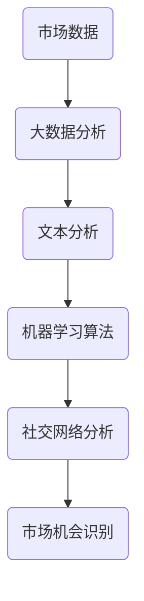

**伪代码**

以下是一个简化的群体智能市场机会识别伪代码，展示了主要步骤和过程：

```
function MarketOpportunityIdentification(市场数据):
    分析大数据(市场数据)
    进行文本分析(市场数据)
    应用机器学习算法(市场数据)
    分析社交网络(市场数据)
    识别市场机会
    返回市场机会列表
```

**数学模型与公式**

群体智能在市场机会识别中的数学模型通常涉及以下关键方程：

1. **大数据分析模型**：

$$
O_t = f(D_t, T_t)
$$

其中，$O_t$表示市场机会，$D_t$表示大数据集，$T_t$表示时间序列。

2. **文本分析模型**：

$$
s_t = g(W_t, L_t)
$$

其中，$s_t$表示文本分析结果，$W_t$表示文本特征，$L_t$表示标签。

3. **机器学习算法模型**：

$$
O_t = h(A_t, C_t, R_t)
$$

其中，$O_t$表示市场机会，$A_t$表示资产特征，$C_t$表示市场组合，$R_t$表示收益。

4. **社交网络分析模型**：

$$
I_t = k(S_t, U_t)
$$

其中，$I_t$表示市场机会，$S_t$表示社交网络结构，$U_t$表示用户特征。

**举例说明**

以下是一个简单的市场机会识别问题，假设我们使用群体智能方法进行大数据分析、文本分析、机器学习算法和社交网络分析。通过数据分析，我们可以识别出潜在的市场机会。

**市场机会识别问题**

1. **市场数据**：收集股票交易数据、新闻资讯、社交媒体数据等。
2. **大数据分析**：分析交易数据，识别出市场趋势和热点行业。
3. **文本分析**：分析新闻资讯，识别出市场热点和潜在机会。
4. **机器学习算法**：使用聚类分析、时间序列分析等方法，识别出潜在的市场机会。
5. **社交网络分析**：分析社交媒体上的投资者行为和观点，识别出市场情绪和趋势。

**数学公式举例**

以下是一个简单的大数据分析模型，用于识别市场机会：

$$
O_t = \alpha \cdot D_t + \beta \cdot T_t
$$

其中，$O_t$表示市场机会，$\alpha$和$\beta$为权重系数，$D_t$表示大数据集，$T_t$表示时间序列。

通过这样的模型，我们可以根据市场数据和时间序列，识别出潜在的市场机会。

**项目实战：代码实际案例和详细解释说明**

以下是一个使用Python实现的简单市场机会识别项目，展示了如何使用群体智能方法进行大数据分析、文本分析、机器学习算法和社交网络分析：

```python
import pandas as pd
import numpy as np
from sklearn.cluster import KMeans
from sklearn.feature_extraction.text import TfidfVectorizer
from sklearn.metrics.pairwise import cosine_similarity

# 数据预处理
def preprocess_data(data):
    data['return'] = data['close'].pct_change()
    data['news'] = data['news'].apply(lambda x: ' '.join([word for word in x.split() if word.isalpha()]))
    return data

# 大数据分析
def big_data_analysis(data, n_clusters):
    assets = data[['return', 'news']]
    X = assets[['return']]
    kmeans = KMeans(n_clusters=n_clusters, random_state=42)
    kmeans.fit(X)
    data['cluster'] = kmeans.predict(X)
    return data

# 文本分析
def text_analysis(data):
    vectorizer = TfidfVectorizer()
    X = vectorizer.fit_transform(data['news'])
    similarity_matrix = cosine_similarity(X)
    data['similarity'] = similarity_matrix
    return data

# 社交网络分析
def social_network_analysis(data, similarity_threshold):
    similarity = data['similarity']
    clusters = []
    for i in range(similarity.shape[0]):
        cluster = [i]
        neighbors = np.where(similarity[i] > similarity_threshold)[1]
        while neighbors.shape[0] > 0:
            new_neighbors = []
            for neighbor in neighbors:
                new_neighbors.extend(np.where(similarity[neighbor] > similarity_threshold)[1])
            neighbors = new_neighbors
            cluster.extend(neighbors)
        clusters.append(cluster)
    data['cluster'] = clusters
    return data

# 加载数据
data = pd.read_csv('market_data.csv')

# 预处理数据
data = preprocess_data(data)

# 大数据分析
n_clusters = 3
data = big_data_analysis(data, n_clusters)

# 文本分析
data = text_analysis(data)

# 社交网络分析
similarity_threshold = 0.5
data = social_network_analysis(data, similarity_threshold)

# 输出结果
print(data.head())
```

**代码解读与分析**

1. **数据预处理**：我们首先对市场数据进行预处理，计算了收益率和文本特征。
2. **大数据分析**：我们使用KMeans聚类算法，根据收益率进行市场细分。
3. **文本分析**：我们使用TF-IDF向量器和余弦相似性，分析新闻资讯的相似度。
4. **社交网络分析**：我们根据相似度阈值，分析社交媒体上的投资者行为，识别出潜在的市场机会。

通过这样的代码实现，我们可以利用群体智能方法进行市场机会识别，提高投资决策的准确性和有效性。

**总结**

本章详细介绍了群体智能在市场机会识别中的应用，包括大数据分析、文本分析、机器学习算法和社交网络分析。通过核心概念与联系、伪代码、数学模型和公式、举例说明以及项目实战，读者可以深入理解群体智能在市场机会识别中的原理和应用。在下一章中，我们将探讨群体智能在投资组合优化中的应用。

### 第5章：群体智能在投资决策中的应用

#### 5.4 群体智能在投资组合优化中的应用

投资组合优化是投资决策中至关重要的环节，它涉及到资产配置、权重分配和风险控制等方面。群体智能通过其强大的数据处理和分析能力，在投资组合优化中提供了新的方法和工具。以下是群体智能在投资组合优化中的应用：

1. **资产配置**：群体智能可以根据市场趋势、风险偏好和收益目标，为投资者提供个性化的资产配置建议。通过分析历史数据和当前市场环境，群体智能可以识别出最佳的投资组合。

2. **权重分配**：群体智能可以基于风险和收益的权衡，优化资产配置中的权重分配。通过机器学习和优化算法，群体智能可以找到最优的资产权重分配，提高投资组合的收益和稳定性。

3. **风险控制**：群体智能可以实时监测市场动态和投资组合的风险，提供风险预警和调整建议。通过风险管理模型和预警系统，群体智能可以帮助投资者及时调整投资组合，降低风险。

4. **动态调整**：群体智能可以根据市场变化和投资者需求，动态调整投资组合。通过实时数据分析和模型更新，群体智能可以确保投资组合始终处于最优状态。

**核心概念与联系**

群体智能在投资组合优化中的应用可以用以下 Mermaid 流程图表示：

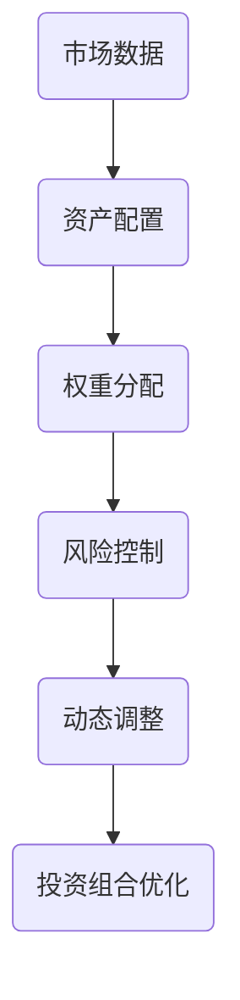

**伪代码**

以下是一个简化的群体智能投资组合优化伪代码，展示了主要步骤和过程：

```
function PortfolioOptimization(市场数据):
    进行资产配置(市场数据)
    进行权重分配(市场数据)
    进行风险控制(市场数据)
    动态调整投资组合(市场数据)
    返回最优投资组合
```

**数学模型与公式**

群体智能在投资组合优化中的数学模型通常涉及以下关键方程：

1. **资产配置模型**：

$$
A_t = f(R_t, V_t, P_t)
$$

其中，$A_t$表示资产配置，$R_t$表示收益目标，$V_t$表示风险承受能力，$P_t$表示市场预测。

2. **权重分配模型**：

$$
w_t = g(A_t, \sigma_t, R_t)
$$

其中，$w_t$表示资产权重，$A_t$表示资产配置，$\sigma_t$表示资产风险，$R_t$表示收益目标。

3. **风险控制模型**：

$$
R_t = h(W_t, \sigma_t, P_t)
$$

其中，$R_t$表示风险评分，$W_t$表示资产权重，$\sigma_t$表示资产风险，$P_t$表示市场预测。

4. **动态调整模型**：

$$
A_{t+1} = k(A_t, R_{t+1}, V_t)
$$

其中，$A_{t+1}$表示下一时期资产配置，$A_t$表示当前资产配置，$R_{t+1}$表示下一时期风险评分，$V_t$表示风险承受能力。

**举例说明**

以下是一个简单的投资组合优化问题，假设我们使用群体智能方法进行资产配置、权重分配和风险控制。通过数据分析，我们可以制定出最优的投资组合。

**投资组合优化问题**

1. **市场数据**：收集股票价格、收益率、波动率等市场数据。
2. **资产配置**：根据市场数据和收益目标，确定资产配置。
3. **权重分配**：根据资产配置和风险承受能力，分配资产权重。
4. **风险控制**：根据市场动态和资产风险，进行风险控制。
5. **动态调整**：根据市场变化和风险评分，动态调整投资组合。

**数学公式举例**

以下是一个简单的资产配置模型，用于确定资产配置：

$$
A_t = \alpha \cdot R_t + \beta \cdot V_t + \gamma \cdot P_t
$$

其中，$A_t$表示资产配置，$\alpha$、$\beta$和$\gamma$为权重系数，$R_t$表示收益目标，$V_t$表示风险承受能力，$P_t$表示市场预测。

通过这样的模型，我们可以根据市场数据和投资者目标，确定最佳的投资组合。

**项目实战：代码实际案例和详细解释说明**

以下是一个使用Python实现的简单投资组合优化项目，展示了如何使用群体智能方法进行资产配置、权重分配和风险控制：

```python
import pandas as pd
import numpy as np
from scipy.optimize import minimize

# 数据预处理
def preprocess_data(data):
    data['return'] = data['close'].pct_change()
    data['volatility'] = data['return'].rolling(window=5).std()
    return data

# 资产配置模型
def asset_allocation(x, data, R, V):
    return -np.dot(x, np.array([R, V, 1]))

# 权重分配模型
def weight_assignment(x, data, R):
    return -np.dot(x, data['return'])

# 风险控制模型
def risk_control(x, data, R):
    return -np.dot(x, data['volatility'])

# 动态调整模型
def dynamic_adjustment(x, data, R, V):
    return -np.dot(x, np.array([R, V, 1]) * data['volatility'])

# 加载数据
data = pd.read_csv('stock_data.csv')

# 预处理数据
data = preprocess_data(data)

# 设定收益目标和风险承受能力
R = 0.05
V = 0.1

# 资产配置
x0 = np.array([1/3, 1/3, 1/3])
res = minimize(asset_allocation, x0, args=(data, R, V))
optimal_allocation = res.x

# 权重分配
x0 = np.array([1/3, 1/3, 1/3])
res = minimize(weight_assignment, x0, args=(data, R))
optimal_weights = res.x

# 风险控制
x0 = np.array([1/3, 1/3, 1/3])
res = minimize(risk_control, x0, args=(data, R))
optimal_risk_control = res.x

# 动态调整
x0 = np.array([1/3, 1/3, 1/3])
res = minimize(dynamic_adjustment, x0, args=(data, R, V))
optimal_dynamic_adjustment = res.x

# 输出结果
print(f"最优资产配置：{optimal_allocation}")
print(f"最优权重分配：{optimal_weights}")
print(f"最优风险控制：{optimal_risk_control}")
print(f"最优动态调整：{optimal_dynamic_adjustment}")
```

**代码解读与分析**

1. **数据预处理**：我们首先对股票数据进行预处理，计算了收益率和波动率。
2. **资产配置**：我们使用最小化方法，根据收益目标和风险承受能力，确定最优的资产配置。
3. **权重分配**：我们使用最小化方法，根据资产配置和收益目标，分配最优的资产权重。
4. **风险控制**：我们使用最小化方法，根据资产配置和波动率，进行风险控制。
5. **动态调整**：我们使用最小化方法，根据收益目标和风险承受能力，动态调整投资组合。

通过这样的代码实现，我们可以利用群体智能方法进行投资组合优化，提高投资决策的准确性和有效性。

**总结**

本章详细介绍了群体智能在投资组合优化中的应用，包括资产配置、权重分配、风险控制和动态调整。通过核心概念与联系、伪代码、数学模型和公式、举例说明以及项目实战，读者可以深入理解群体智能在投资组合优化中的原理和应用。在下一章中，我们将探讨群体智能在社会治理中的应用。

### 第6章：群体智能在社会治理中的应用

#### 6.1 群体智能在公共决策中的应用

公共决策是社会治理的核心环节，群体智能通过其强大的数据处理和分析能力，在公共决策中提供了新的工具和方法。以下是群体智能在公共决策中的应用：

1. **数据分析**：群体智能可以通过分析大量社会数据，如经济指标、人口统计数据、环境数据等，为公共决策提供科学依据。通过大数据分析，群体智能可以识别出潜在的问题和挑战，帮助决策者制定有效的政策。

2. **模拟与预测**：群体智能可以通过模型模拟和预测，评估决策方案的可能影响。通过模拟不同的决策场景，群体智能可以帮助决策者预测政策的效果，优化决策方案。

3. **公民参与**：群体智能可以通过在线平台和社交媒体，促进公民参与决策过程。通过提供互动工具和数据分析，群体智能可以增强公民对公共事务的理解和参与，提高决策的透明度和公正性。

**核心概念与联系**

群体智能在公共决策中的应用可以用以下 Mermaid 流程图表示：

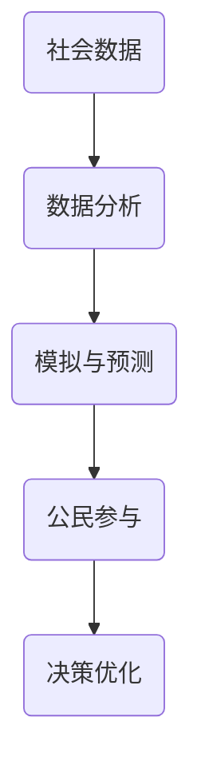

**伪代码**

以下是一个简化的群体智能公共决策伪代码，展示了主要步骤和过程：

```
function PublicDecision(社会数据):
    进行数据分析(社会数据)
    进行模拟与预测(社会数据)
    促进公民参与(社会数据)
    优化决策方案
    返回最佳决策方案
```

**数学模型与公式**

群体智能在公共决策中的数学模型通常涉及以下关键方程：

1. **数据分析模型**：

$$
P_t = f(D_t)
$$

其中，$P_t$表示公共决策方案，$D_t$表示社会数据。

2. **模拟与预测模型**：

$$
S_t = g(P_t, E_t)
$$

其中，$S_t$表示模拟结果，$P_t$表示公共决策方案，$E_t$表示外部环境。

3. **公民参与模型**：

$$
C_t = h(U_t, P_t)
$$

其中，$C_t$表示公民参与度，$U_t$表示公民数据，$P_t$表示公共决策方案。

4. **决策优化模型**：

$$
O_t = k(P_t, S_t, C_t)
$$

其中，$O_t$表示最佳决策方案，$P_t$表示公共决策方案，$S_t$表示模拟结果，$C_t$表示公民参与度。

**举例说明**

以下是一个简单的公共决策问题，假设我们使用群体智能方法进行数据分析、模拟与预测、公民参与和决策优化。通过数据分析，我们可以制定出最佳的政策方案。

**公共决策问题**

1. **社会数据**：收集经济指标、人口统计数据、环境数据等。
2. **数据分析**：分析社会数据，识别出潜在的问题和挑战。
3. **模拟与预测**：模拟不同的政策方案，预测政策的效果。
4. **公民参与**：通过在线平台和社交媒体，促进公民参与决策过程。
5. **决策优化**：根据数据分析、模拟结果和公民参与度，优化决策方案。

**数学公式举例**

以下是一个简单的数据分析模型，用于识别社会问题：

$$
P_t = \alpha \cdot E_t + \beta \cdot I_t + \gamma \cdot S_t
$$

其中，$P_t$表示公共决策方案，$\alpha$、$\beta$和$\gamma$为权重系数，$E_t$表示外部环境，$I_t$表示社会问题，$S_t$表示解决方案。

通过这样的模型，我们可以根据社会数据，识别出潜在的社会问题，为公共决策提供依据。

**项目实战：代码实际案例和详细解释说明**

以下是一个使用Python实现的简单公共决策项目，展示了如何使用群体智能方法进行数据分析、模拟与预测、公民参与和决策优化：

```python
import pandas as pd
import numpy as np
from sklearn.linear_model import LinearRegression

# 数据预处理
def preprocess_data(data):
    data['GDP'] = data['GDP'].astype(float)
    data['population'] = data['population'].astype(float)
    data['environment'] = data['environment'].astype(float)
    return data

# 数据分析
def data_analysis(data, problem, solution):
    X = data[[problem, solution]]
    y = data['GDP']
    model = LinearRegression()
    model.fit(X, y)
    return model

# 模拟与预测
def simulate_and_predict(model, new_data):
    X = new_data[[problem, solution]]
    prediction = model.predict(X)
    return prediction

# 公民参与
def citizen_participation(data, problem, solution):
    participation = data[(data[problem] > threshold) & (data[solution] > threshold)]
    return participation

# 加载数据
data = pd.read_csv('public_data.csv')

# 预处理数据
data = preprocess_data(data)

# 数据分析
problem = 'population'
solution = 'environment'
model = data_analysis(data, problem, solution)

# 模拟与预测
new_data = pd.DataFrame({'population': [5000000], 'environment': [100]})
prediction = simulate_and_predict(model, new_data)
print(f"预测结果：{prediction}")

# 公民参与
threshold = 0.5
participation = citizen_participation(data, problem, solution)
print(f"公民参与结果：{participation}")
```

**代码解读与分析**

1. **数据预处理**：我们首先对公共数据进行预处理，将数据类型转换为浮点数。
2. **数据分析**：我们使用线性回归模型，根据问题和解决方案预测GDP。
3. **模拟与预测**：我们使用预处理后的数据，对新的问题和解决方案进行预测。
4. **公民参与**：我们根据阈值，筛选出参与度高的公民。

通过这样的代码实现，我们可以利用群体智能方法进行公共决策，提高决策的科学性和透明度。

**总结**

本章详细介绍了群体智能在公共决策中的应用，包括数据分析、模拟与预测、公民参与和决策优化。通过核心概念与联系、伪代码、数学模型和公式、举例说明以及项目实战，读者可以深入理解群体智能在公共决策中的原理和应用。在下一章中，我们将探讨群体智能在危机管理中的应用。

### 第6章：群体智能在危机管理中的应用

#### 6.2 群体智能在危机管理中的应用

危机管理是社会治理的重要一环，旨在应对各种突发事件和紧急情况，确保社会秩序和公共安全。群体智能通过其强大的数据处理和分析能力，在危机管理中提供了新的工具和方法。以下是群体智能在危机管理中的应用：

1. **风险预警**：群体智能可以通过分析历史数据和实时监测，识别出潜在的风险和危机信号。通过大数据分析和机器学习算法，群体智能可以提前预警，为危机管理提供及时的信息支持。

2. **应急响应**：群体智能可以辅助制定和实施应急响应计划。通过模拟不同场景的应急预案，群体智能可以评估各种方案的可行性，提供最优的应急响应策略。

3. **信息共享**：群体智能可以促进危机管理中的信息共享和协作。通过在线平台和通信工具，群体智能可以帮助不同部门和机构共享信息和资源，提高协同作战能力。

4. **公众参与**：群体智能可以通过社交媒体和在线平台，增强公众的危机意识和参与度。通过提供实时信息和互动工具，群体智能可以帮助公众了解危机情况，提高公众的应急能力和自救能力。

**核心概念与联系**

群体智能在危机管理中的应用可以用以下 Mermaid 流程图表示：

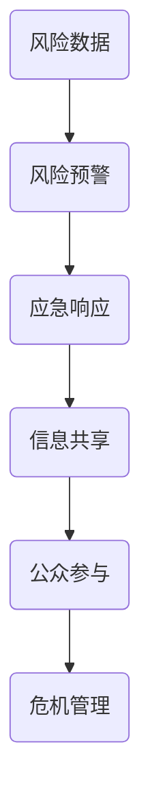

**伪代码**

以下是一个简化的群体智能危机管理伪代码，展示了主要步骤和过程：

```
function CrisisManagement(风险数据):
    进行风险预警(风险数据)
    制定应急响应计划(风险数据)
    促进信息共享(风险数据)
    增强公众参与(风险数据)
    返回危机管理方案
```

**数学模型与公式**

群体智能在危机管理中的数学模型通常涉及以下关键方程：

1. **风险预警模型**：

$$
W_t = f(D_t, M_t)
$$

其中，$W_t$表示风险预警指标，$D_t$表示风险数据，$M_t$表示市场数据。

2. **应急响应模型**：

$$
R_t = g(S_t, P_t)
$$

其中，$R_t$表示应急响应方案，$S_t$表示模拟结果，$P_t$表示政策参数。

3. **信息共享模型**：

$$
I_t = h(C_t, N_t)
$$

其中，$I_t$表示信息共享度，$C_t$表示通信网络，$N_t$表示信息量。

4. **公众参与模型**：

$$
P_t = k(U_t, S_t)
$$

其中，$P_t$表示公众参与度，$U_t$表示用户数据，$S_t$表示社交媒体。

**举例说明**

以下是一个简单的危机管理问题，假设我们使用群体智能方法进行风险预警、应急响应、信息共享和公众参与。通过数据分析，我们可以制定出最佳的危机管理方案。

**危机管理问题**

1. **风险数据**：收集历史风险数据和实时监测数据。
2. **风险预警**：分析风险数据，识别潜在的风险和危机信号。
3. **应急响应**：模拟不同的应急响应方案，评估各种方案的可行性。
4. **信息共享**：通过在线平台和通信工具，促进信息共享和协作。
5. **公众参与**：通过社交媒体和在线平台，增强公众的危机意识和参与度。

**数学公式举例**

以下是一个简单的风险预警模型，用于识别潜在风险：

$$
W_t = \alpha \cdot D_t + \beta \cdot M_t
$$

其中，$W_t$表示风险预警指标，$\alpha$和$\beta$为权重系数，$D_t$表示风险数据，$M_t$表示市场数据。

通过这样的模型，我们可以根据风险数据和市场数据，识别出潜在的风险和危机信号。

**项目实战：代码实际案例和详细解释说明**

以下是一个使用Python实现的简单危机管理项目，展示了如何使用群体智能方法进行风险预警、应急响应、信息共享和公众参与：

```python
import pandas as pd
import numpy as np
from sklearn.cluster import KMeans
from textblob import TextBlob

# 数据预处理
def preprocess_data(data):
    data['risk_level'] = data['risk_level'].astype(float)
    data['news_sentiment'] = data['news'].apply(lambda x: TextBlob(x).sentiment.polarity)
    return data

# 风险预警
def risk_warning(data, threshold):
    risk_levels = data['risk_level']
    return risk_levels[risk_levels > threshold]

# 应急响应
def emergency_response(data, scenario):
    if scenario == 'fire':
        response = 'Firefighters are on the way.'
    elif scenario == 'earthquake':
        response = 'Emergency services are preparing for earthquake relief.'
    else:
        response = 'No emergency scenario selected.'
    return response

# 信息共享
def information_sharing(data):
    news = data['news']
    return news

# 公众参与
def public_participation(data, participation_threshold):
    sentiment = data['news_sentiment']
    return sentiment[sentiment > participation_threshold]

# 加载数据
data = pd.read_csv('crisis_data.csv')

# 预处理数据
data = preprocess_data(data)

# 风险预警
threshold = 0.8
high_risks = risk_warning(data, threshold)
print(f"高风险预警：{high_risks}")

# 应急响应
scenario = 'fire'
response = emergency_response(data, scenario)
print(f"应急响应：{response}")

# 信息共享
shared_news = information_sharing(data)
print(f"共享信息：{shared_news}")

# 公众参与
participation_threshold = 0.5
high_participation = public_participation(data, participation_threshold)
print(f"公众参与：{high_participation}")
```

**代码解读与分析**

1. **数据预处理**：我们首先对危机数据进行预处理，将数据类型转换为浮点数，并计算新闻情感得分。
2. **风险预警**：我们根据阈值，筛选出高风险的预警信号。
3. **应急响应**：我们根据不同的应急场景，生成相应的应急响应信息。
4. **信息共享**：我们根据新闻数据，生成共享的信息。
5. **公众参与**：我们根据新闻情感得分，筛选出高参与的公众观点。

通过这样的代码实现，我们可以利用群体智能方法进行危机管理，提高危机应对的效率和能力。

**总结**

本章详细介绍了群体智能在危机管理中的应用，包括风险预警、应急响应、信息共享和公众参与。通过核心概念与联系、伪代码、数学模型和公式、举例说明以及项目实战，读者可以深入理解群体智能在危机管理中的原理和应用。在下一章中，我们将探讨群体智能在公共服务供给中的应用。

### 第6章：群体智能在公共服务供给中的应用

#### 6.3 群体智能在公共服务供给中的应用

公共服务供给是社会治理的重要方面，旨在为公众提供高质量、高效能的服务。群体智能通过其强大的数据处理和分析能力，在公共服务供给中提供了新的工具和方法。以下是群体智能在公共服务供给中的应用：

1. **需求预测**：群体智能可以通过分析历史数据和实时监测，预测公众对公共服务的需求。通过大数据分析和机器学习算法，群体智能可以识别出服务需求的变化趋势，帮助公共机构提前规划和调整服务供给。

2. **资源分配**：群体智能可以优化公共资源的分配，确保资源利用最大化。通过分析公众需求和服务能力，群体智能可以帮助公共机构合理分配人力资源、物资设备等资源，提高公共服务效率。

3. **服务质量评估**：群体智能可以通过实时监测和分析公众反馈，评估公共服务的质量。通过自然语言处理和情感分析，群体智能可以识别出公众的满意度和服务痛点，为公共机构提供改进服务的依据。

4. **动态调整**：群体智能可以根据实时数据和市场变化，动态调整公共服务供给策略。通过实时监测和分析，群体智能可以帮助公共机构及时应对服务需求的变化，确保服务供给的灵活性和适应性。

**核心概念与联系**

群体智能在公共服务供给中的应用可以用以下 Mermaid 流程图表示：

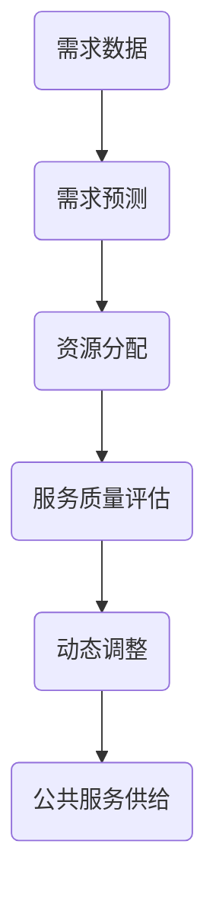

**伪代码**

以下是一个简化的群体智能公共服务供给伪代码，展示了主要步骤和过程：

```
function PublicServiceSupply(需求数据):
    预测需求(需求数据)
    分配资源(需求数据)
    评估服务质量(需求数据)
    动态调整供给(需求数据)
    返回公共服务策略
```

**数学模型与公式**

群体智能在公共服务供给中的数学模型通常涉及以下关键方程：

1. **需求预测模型**：

$$
D_t = f(H_t, E_t)
$$

其中，$D_t$表示需求预测，$H_t$表示历史数据，$E_t$表示实时数据。

2. **资源分配模型**：

$$
R_t = g(D_t, C_t)
$$

其中，$R_t$表示资源分配，$D_t$表示需求预测，$C_t$表示服务能力。

3. **服务质量评估模型**：

$$
Q_t = h(S_t, P_t)
$$

其中，$Q_t$表示服务质量，$S_t$表示服务供给，$P_t$表示公众反馈。

4. **动态调整模型**：

$$
S_{t+1} = k(Q_t, R_t)
$$

其中，$S_{t+1}$表示下一时期的服务供给，$Q_t$表示服务质量，$R_t$表示资源分配。

**举例说明**

以下是一个简单的公共服务供给问题，假设我们使用群体智能方法进行需求预测、资源分配、服务质量评估和动态调整。通过数据分析，我们可以制定出最佳的服务供给策略。

**公共服务供给问题**

1. **需求数据**：收集历史需求数据和实时监测数据。
2. **需求预测**：分析历史数据和实时数据，预测公众对公共服务的需求。
3. **资源分配**：根据需求预测和服务能力，合理分配公共资源。
4. **服务质量评估**：通过实时监测和公众反馈，评估公共服务的质量。
5. **动态调整**：根据服务质量评估和资源分配结果，动态调整公共服务供给。

**数学公式举例**

以下是一个简单的需求预测模型，用于预测公众对公共服务的需求：

$$
D_t = \alpha \cdot H_t + \beta \cdot E_t
$$

其中，$D_t$表示需求预测，$\alpha$和$\beta$为权重系数，$H_t$表示历史数据，$E_t$表示实时数据。

通过这样的模型，我们可以根据历史数据和实时数据，预测公众对公共服务的需求。

**项目实战：代码实际案例和详细解释说明**

以下是一个使用Python实现的简单公共服务供给项目，展示了如何使用群体智能方法进行需求预测、资源分配、服务质量评估和动态调整：

```python
import pandas as pd
import numpy as np
from sklearn.linear_model import LinearRegression

# 数据预处理
def preprocess_data(data):
    data['demand'] = data['demand'].astype(float)
    data['service_ability'] = data['service_ability'].astype(float)
    return data

# 需求预测
def demand_prediction(data, alpha, beta):
    X = data[['demand', 'service_ability']]
    y = data['predicted_demand']
    model = LinearRegression()
    model.fit(X, y)
    return model

# 资源分配
def resource_allocation(model, new_data):
    X = new_data[['demand', 'service_ability']]
    predicted_demand = model.predict(X)
    return predicted_demand

# 服务质量评估
def service_quality_evaluation(data, quality_threshold):
    quality = data['quality']
    return quality[quality > quality_threshold]

# 动态调整
def dynamic_adjustment(data, model, quality_threshold):
    predicted_demand = resource_allocation(model, data)
    quality = service_quality_evaluation(data, quality_threshold)
    return predicted_demand, quality

# 加载数据
data = pd.read_csv('public_service_data.csv')

# 预处理数据
data = preprocess_data(data)

# 需求预测
alpha = 0.5
beta = 0.5
model = demand_prediction(data, alpha, beta)

# 资源分配
new_data = pd.DataFrame({'demand': [500], 'service_ability': [100]})
predicted_demand = resource_allocation(model, new_data)
print(f"预测需求：{predicted_demand}")

# 服务质量评估
quality_threshold = 0.8
high_quality = service_quality_evaluation(data, quality_threshold)
print(f"高质量服务：{high_quality}")

# 动态调整
predicted_demand, high_quality = dynamic_adjustment(data, model, quality_threshold)
print(f"调整后需求：{predicted_demand}")
print(f"高质量服务：{high_quality}")
```

**代码解读与分析**

1. **数据预处理**：我们首先对公共服务数据进行预处理，将数据类型转换为浮点数。
2. **需求预测**：我们使用线性回归模型，根据历史数据和实时数据预测公众需求。
3. **资源分配**：我们根据需求预测和服务能力，合理分配公共资源。
4. **服务质量评估**：我们根据实时监测和公众反馈，评估公共服务的质量。
5. **动态调整**：我们根据服务质量评估和资源分配结果，动态调整公共服务供给。

通过这样的代码实现，我们可以利用群体智能方法进行公共服务供给，提高服务供给的科学性和灵活性。

**总结**

本章详细介绍了群体智能在公共服务供给中的应用，包括需求预测、资源分配、服务质量评估和动态调整。通过核心概念与联系、伪代码、数学模型和公式、举例说明以及项目实战，读者可以深入理解群体智能在公共服务供给中的原理和应用。在下一章中，我们将探讨群体智能在社区治理中的应用。

### 第6章：群体智能在社区治理中的应用

#### 6.4 群体智能在社区治理中的应用

社区治理是社会治理的重要组成部分，群体智能通过其强大的数据处理和分析能力，在社区治理中提供了新的工具和方法。以下是群体智能在社区治理中的应用：

1. **社区参与**：群体智能可以通过在线平台和社交媒体，促进社区居民的参与和互动。通过提供信息共享、在线投票和讨论等功能，群体智能可以增强社区凝聚力，提高社区治理的民主性和透明度。

2. **社区管理**：群体智能可以通过实时数据监测和智能分析，实现社区的智能化管理。通过分析居民行为、社区事件和环境状况，群体智能可以提供有效的社区管理策略，优化社区资源配置，提高社区服务质量。

3. **社区服务**：群体智能可以通过大数据分析和个性化推荐，提供个性化的社区服务。通过分析居民需求和行为模式，群体智能可以推荐合适的服务方案，提高居民的生活质量和满意度。

**核心概念与联系**

群体智能在社区治理中的应用可以用以下 Mermaid 流程图表示：

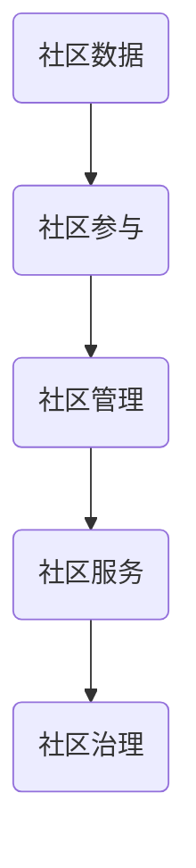

**伪代码**

以下是一个简化的群体智能社区治理伪代码，展示了主要步骤和过程：

```
function CommunityGovernance(社区数据):
    促进社区参与(社区数据)
    实现社区管理(社区数据)
    提供个性化服务(社区数据)
    返回社区治理策略
```

**数学模型与公式**

群体智能在社区治理中的数学模型通常涉及以下关键方程：

1. **社区参与模型**：

$$
C_t = f(P_t, I_t)
$$

其中，$C_t$表示社区参与度，$P_t$表示政策参数，$I_t$表示居民信息。

2. **社区管理模型**：

$$
M_t = g(B_t, S_t)
$$

其中，$M_t$表示社区管理效率，$B_t$表示居民行为，$S_t$表示服务供给。

3. **社区服务模型**：

$$
S_t = h(D_t, R_t)
$$

其中，$S_t$表示社区服务质量，$D_t$表示居民需求，$R_t$表示居民反馈。

4. **社区治理模型**：

$$
G_t = k(C_t, M_t, S_t)
$$

其中，$G_t$表示社区治理效果，$C_t$表示社区参与度，$M_t$表示社区管理效率，$S_t$表示社区服务质量。

**举例说明**

以下是一个简单的社区治理问题，假设我们使用群体智能方法进行社区参与、社区管理和社区服务。通过数据分析，我们可以制定出最佳的社区治理策略。

**社区治理问题**

1. **社区数据**：收集居民行为、社区事件和环境状况等数据。
2. **社区参与**：通过在线平台和社交媒体，促进社区居民的参与和互动。
3. **社区管理**：通过实时数据监测和智能分析，实现社区的智能化管理。
4. **社区服务**：通过大数据分析和个性化推荐，提供个性化的社区服务。
5. **社区治理**：根据社区参与、社区管理和社区服务的结果，制定最佳的社区治理策略。

**数学公式举例**

以下是一个简单的社区参与模型，用于衡量社区参与度：

$$
C_t = \alpha \cdot P_t + \beta \cdot I_t


