                 

## 文章标题：群体智慧：决策的新引擎

群体智慧，这一概念源自生物学领域，现在正逐渐渗透到计算机科学、经济学、社会学等多个领域，成为解决复杂决策问题的新引擎。本文旨在深入探讨群体智慧的基本概念、核心原理、数学模型及其在各领域的应用，最终分析群体智慧对决策的重要影响和未来发展趋势。

群体智慧，顾名思义，是由众多个体智能通过协作和共享信息所产生的集体智能。这种智慧不仅在自然界中广泛存在，如蜜蜂的蜂巢和鸟类的迁徙，还在人类社会、经济和技术领域中展现出巨大的潜力和价值。本文将带领读者一步步了解这一领域的最新研究成果和应用实例。

### 关键词
- 群体智慧
- 个体智能
- 协同演化
- 数学模型
- 应用领域
- 决策优化

### 摘要
本文首先对群体智慧的基本概念和起源进行了概述，详细分析了其特点和价值。随后，探讨了群体智能的基本原理和数学模型，包括优化算法、学习算法和进化算法。接着，文章重点介绍了群体智慧在社会、经济、科技等领域的应用，并分析了其未来发展趋势和技术挑战。最后，文章通过具体案例展示了群体智慧在决策中的实际应用，为读者提供了全面而深入的视角。

## 《群体智慧：决策的新引擎》目录大纲

### 第一部分：群体智慧的基本概念

- **第1章：群体智慧概述**
  - **1.1 群体智慧的定义与起源**
  - **1.2 群体智慧的特点与价值**
  - **1.3 群体智慧在不同领域的应用**

- **第2章：群体智能的基本原理**
  - **2.1 个体智能与群体智能的关系**
  - **2.2 群体智慧的核心机制**
  - **2.3 群体智能的理论模型**

- **第3章：群体智能的数学模型**
  - **3.1 群体智能的优化算法**
  - **3.2 群体智能的学习算法**
  - **3.3 群体智能的进化算法**

### 第二部分：群体智慧的应用领域

- **第4章：社会领域的群体智慧**
  - **4.1 社会网络中的群体智慧**
  - **4.2 大众意见的群体智慧**
  - **4.3 社会事件的群体智慧应用**

- **第5章：经济领域的群体智慧**
  - **5.1 市场预测的群体智慧**
  - **5.2 投资决策的群体智慧**
  - **5.3 群体智慧在金融风险管理中的应用**

- **第6章：科技领域的群体智慧**
  - **6.1 科技创新的群体智慧**
  - **6.2 群体智慧在软件开发中的应用**
  - **6.3 群体智慧在人工智能中的应用**

### 第三部分：群体智慧的发展趋势

- **第7章：群体智慧的未来发展**
  - **7.1 群体智慧的未来趋势**
  - **7.2 群体智慧的技术挑战**
  - **7.3 群体智慧的伦理问题与社会影响**

- **第8章：群体智慧在决策中的实际应用**
  - **8.1 群体智慧在政府决策中的应用**
  - **8.2 群体智慧在企业管理中的应用**
  - **8.3 群体智慧在个人决策中的应用**

### 附录：群体智慧技术指南

- **附录 A：群体智慧技术概述**
  - **A.1 群体智慧的关键技术**
  - **A.2 群体智慧的开发工具与框架**
  - **A.3 群体智慧的数据集与应用案例**

- **附录 B：群体智慧相关资源**
  - **B.1 群体智慧研究机构与学术会议**
  - **B.2 群体智慧领域的权威书籍与论文**
  - **B.3 群体智慧在线课程与培训资源**

### 第1章：群体智慧概述

群体智慧是一种集体智慧形式，它由多个个体智能通过协作和信息共享产生。这种智慧不仅在自然界中广泛存在，如蜜蜂的蜂巢和鸟类的迁徙，也在人类社会、经济和技术领域展现出巨大的潜力和价值。

### 1.1 群体智慧的定义与起源

#### 1.1.1 群体智慧的定义

群体智慧（Swarm Intelligence）可以定义为由多个自主个体组成的系统，通过个体间的协作和信息共享，在没有集中控制的情况下表现出复杂的集体行为和决策能力。这些个体通常是简单的，但通过集体行动展现出超越个体能力的智能。

Mermaid 图：
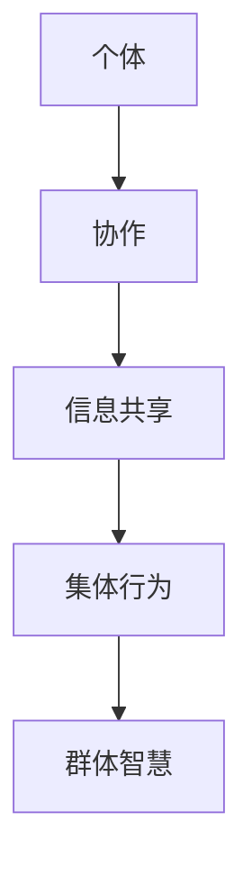

#### 1.1.2 群体智慧的发展历史

群体智慧的概念起源于20世纪初的群体心理学，随后在20世纪中期发展为复杂系统理论和社会系统理论。随着复杂性科学和人工智能技术的发展，群体智慧逐渐成为研究热点。

Mermaid 图：
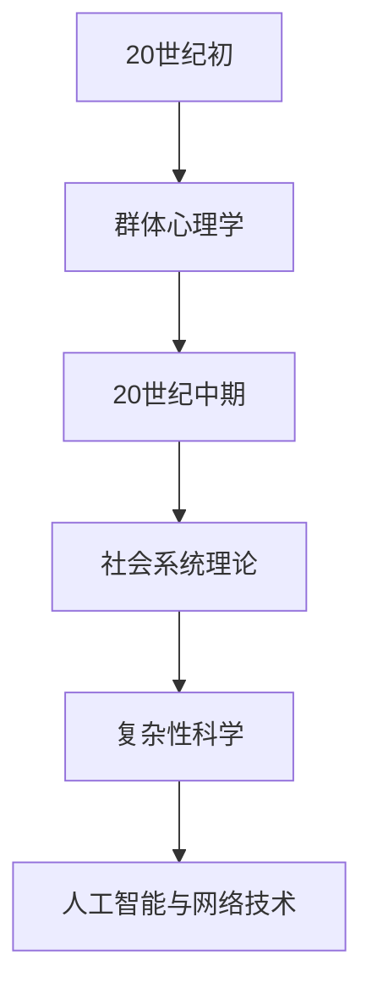

### 1.2 群体智慧的特点与价值

群体智慧具有以下几个主要特点：

1. **分布式智能**：群体智慧依赖于大量个体的分布式智能，通过协作实现复杂任务。
2. **自主性**：个体在群体智慧系统中保持自主性，不受集中控制。
3. **协同性**：个体通过协同工作，实现集体目标。
4. **适应性**：群体智慧能够适应不断变化的环境和条件。
5. **鲁棒性**：群体智慧系统具有较高的鲁棒性，即使在个体失败或错误的情况下，仍能保持整体功能的运行。

群体智慧的价值体现在多个方面：

1. **创新驱动**：群体智慧能够激发创新思维，推动科技进步和社会发展。
2. **效率提升**：通过协同工作，群体智慧能够显著提高任务完成效率。
3. **决策优化**：群体智慧提供了一种新的决策支持工具，能够优化决策过程。
4. **资源优化**：通过分布式计算和信息共享，群体智慧能够有效利用资源。
5. **社会进步**：群体智慧有助于解决社会复杂问题，推动社会和谐与进步。

### 1.3 群体智慧在不同领域的应用

#### 1.3.1 社会领域

在社会领域，群体智慧的应用十分广泛。例如，在社会网络分析中，可以通过分析个体之间的互动关系，预测社会趋势和大众舆论。在应对社会事件时，群体智慧可以帮助政府和组织更有效地调配资源，制定应急策略。

#### 1.3.2 经济领域

在经济领域，群体智慧可以应用于市场预测和投资决策。通过分析大量市场数据，群体智慧能够预测市场趋势，为投资决策提供支持。此外，在金融风险管理中，群体智慧可以帮助识别风险因素，优化风险管理策略。

#### 1.3.3 科技领域

在科技领域，群体智慧在科技创新、软件开发和人工智能应用中发挥着重要作用。例如，在软件开发过程中，群体智慧可以优化代码审查和测试流程，提高软件质量。在人工智能领域，群体智慧可以帮助优化模型训练和系统调试。

### 1.4 群体智慧在决策中的重要性

群体智慧在决策中具有不可替代的作用。它不仅能够优化个体决策，还能处理复杂、大规模的决策问题。以下是群体智慧在决策中的几个重要作用：

1. **信息多样性**：群体智慧通过多角度、多来源的信息收集，提高了决策过程中的信息多样性，有助于更全面、准确地分析问题。
2. **决策效率**：群体智慧能够加速决策过程，减少决策时间，提高决策效率。
3. **决策质量**：群体智慧通过协同和共享，能够提高决策的准确性和可靠性，降低错误率。

综上所述，群体智慧作为一种新兴的决策工具，正逐渐成为各领域解决复杂决策问题的新引擎。接下来，我们将深入探讨群体智能的基本原理和数学模型，以更好地理解这一领域的核心技术和应用。

### 第2章：群体智能的基本原理

群体智能（Collective Intelligence）是群体智慧的基础，它涉及个体智能与群体智能的关系、核心机制以及相关的理论模型。通过了解这些基本原理，我们可以更好地理解群体智慧如何运作，并探索其在实际应用中的潜力。

#### 2.1 个体智能与群体智能的关系

个体智能（Individual Intelligence）指的是单个个体所具备的感知、学习、适应和创造能力。个体智能是群体智能的基础，但个体智能并不等同于群体智能。群体智能是多个个体智能通过协作和信息共享所产生的集体行为和决策能力。

##### 2.1.1 个体智能的定义

个体智能可以表示为以下函数：
\[ 个体智能 = f(感知, 学习, 适应, 创造) \]

在这个函数中，感知、学习、适应和创造是四个基本要素，它们共同决定了个体智能的水平。

##### 2.1.2 群体智能的构成

群体智能由多个个体智能通过以下机制构成：

1. **协同作用**：个体通过协作共同完成任务，实现集体目标。
2. **信息共享**：个体之间共享信息和资源，优化决策过程。
3. **共同目标**：个体在实现自身目标的同时，也关注集体目标，实现集体利益。

Mermaid 图：
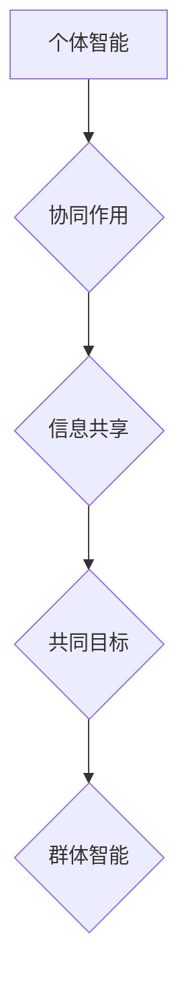

#### 2.2 群体智慧的核心机制

群体智慧的核心机制包括协同演化、自组织和其他协作机制。这些机制共同作用，使群体智慧系统能够高效地运作。

##### 2.2.1 协同演化机制

协同演化是指个体智能通过协同作用和相互作用，不断适应环境和优化自身行为的过程。协同演化机制包括以下几个步骤：

1. **个体适应**：个体通过感知和适应环境，调整自身行为。
2. **群体适应**：个体之间的协作和互动使整个群体能够更好地适应环境。
3. **环境适应**：通过不断调整和优化，群体智慧系统能够在复杂环境中保持稳定和高效。

Mermaid 图：
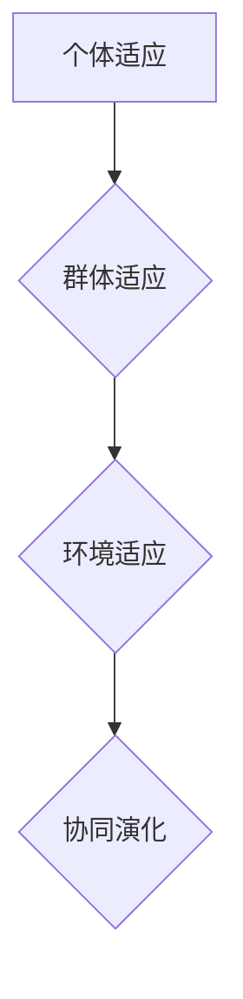

##### 2.2.2 自组织机制

自组织是指系统在不依赖于外部控制的情况下，通过个体间的相互作用和协同行为，形成有序结构和动态行为。自组织机制的关键在于个体间的信息共享和协同作用，通过这些机制，系统能够从无序状态演化为有序状态。

自组织机制包括：

1. **无序到有序**：系统从无序状态逐渐演化到有序状态。
2. **自适应**：个体能够根据环境变化调整自身行为。
3. **自演化**：系统在运行过程中不断调整和优化，以适应新的环境和需求。

Mermaid 图：
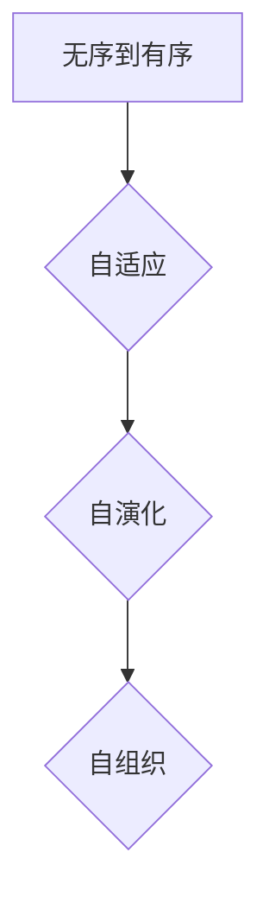

#### 2.3 群体智能的理论模型

群体智能的理论模型用于解释和预测群体智慧系统的行为和性能。以下是一些常见的理论模型：

##### 2.3.1 社会平衡模型

社会平衡模型描述了个体利益、群体利益和协作成本之间的关系。该模型假设个体在追求自身利益的同时，也会考虑群体利益和协作成本，以实现社会平衡。

社会平衡可以表示为以下函数：
\[ 社会平衡 = f(个体利益, 群体利益, 协作成本) \]

在这个模型中，个体利益、群体利益和协作成本是三个关键因素。社会平衡模型有助于解释群体智慧系统中的协作行为和集体决策。

##### 2.3.2 多智能体系统模型

多智能体系统（Multi-Agent System, MAS）模型是用于描述由多个自主智能体组成的系统的理论框架。MAS模型包括以下几个关键组件：

1. **智能体**：智能体是系统的基本组成单元，具有感知、决策和执行能力。
2. **通信网络**：智能体之间通过通信网络进行信息交换和协作。
3. **决策规则**：智能体根据感知到的信息和决策规则做出决策。
4. **环境感知**：智能体能够感知和适应环境变化。

Mermaid 图：
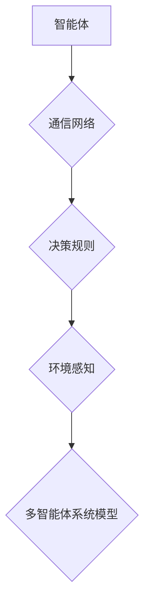

通过这些理论模型，我们可以更好地理解和预测群体智慧系统的行为和性能。这些模型不仅为我们提供了理论依据，也为实际应用提供了指导。

### 第3章：群体智能的数学模型

群体智能的数学模型是理解群体智能行为和性能的重要工具，这些模型通过数学和计算方法来描述个体智能如何通过协作和信息共享产生群体智慧。本章将介绍群体智能中的优化算法、学习算法和进化算法，以及它们在实际应用中的运用。

#### 3.1 群体智能的优化算法

优化算法在群体智能中用于解决复杂的优化问题，通过模拟自然进化、群体行为等机制来找到最优或近似最优解。以下是几种常见的优化算法：

##### 3.1.1 遗传算法

遗传算法（Genetic Algorithm, GA）是一种基于自然选择和遗传学原理的优化算法。它模拟生物进化过程，通过交叉、变异和选择等操作来不断优化解空间。

遗传算法的基本步骤如下：
1. **初始化种群**：生成一组初始解（个体）。
2. **适应度评估**：计算每个个体的适应度值。
3. **选择**：根据适应度值选择个体进行交叉和变异。
4. **交叉**：随机选择两个个体进行交叉操作，生成新的子代。
5. **变异**：对个体进行变异操作，增加解空间的多样性。
6. **更新种群**：将新的子代替换部分旧种群。
7. **迭代**：重复上述步骤，直到满足终止条件。

伪代码：
```python
def genetic_algorithm():
    population = initialize_population()
    for generation in range(number_of_generations):
        fitness = evaluate_fitness(population)
        selected = select(population, fitness)
        crossed = crossover(selected)
        mutated = mutate(crossed)
        population = mutated
    return best_solution(population)
```

##### 3.1.2 粒子群优化算法

粒子群优化算法（Particle Swarm Optimization, PSO）是一种基于群体行为的优化算法，它模拟鸟群觅食行为来寻找最优解。PSO通过更新粒子的速度和位置来实现优化。

粒子群优化算法的基本步骤如下：
1. **初始化粒子群**：生成一群粒子，每个粒子代表一个解。
2. **计算每个粒子的适应度**。
3. **更新每个粒子的速度和位置**：每个粒子的速度和位置根据其自身最佳位置（个体最优）和整个群体的最佳位置（全局最优）进行调整。
4. **迭代**：重复上述步骤，直到满足终止条件。

伪代码：
```python
def particle_swarm_optimization():
    particles = initialize_particles()
    for iteration in range(number_of_iterations):
        update_particles(particles)
        fitness = evaluate_fitness(particles)
        update_global_best(particles, fitness)
    return global_best_particle()
```

#### 3.2 群体智能的学习算法

学习算法在群体智能中用于改进个体行为和群体性能，通过机器学习和统计方法来实现。以下是几种常见的学习算法：

##### 3.2.1 聚类算法

聚类算法用于将数据集划分为多个组，以便更好地理解和分析数据。常见的聚类算法包括K-means聚类。

K-means聚类的基本步骤如下：
1. **初始化聚类中心**：随机选择K个数据点作为初始聚类中心。
2. **分配数据点**：将每个数据点分配到最近的聚类中心。
3. **更新聚类中心**：计算每个聚类的中心。
4. **迭代**：重复上述步骤，直到聚类中心不再发生变化。

伪代码：
```python
def k_means(data, k):
    centroids = initialize_centroids(data, k)
    while not converged:
        clusters = assign_clusters(data, centroids)
        centroids = update_centroids(clusters)
    return centroids
```

##### 3.2.2 支持向量机

支持向量机（Support Vector Machine, SVM）是一种用于分类和回归的分析工具，它通过找到一个最优的超平面来分隔数据。

SVM的基本步骤如下：
1. **训练模型**：使用训练数据训练SVM模型。
2. **评估模型**：使用测试数据评估模型性能。
3. **预测**：使用训练好的模型对新数据进行分类或回归。

伪代码：
```python
def support_vector_machine(X, y):
    model = train_model(X, y)
    predictions = predict(model, X)
    return predictions
```

#### 3.3 群体智能的进化算法

进化算法（Evolutionary Algorithm）是一类基于自然进化原理的优化算法，通过模拟生物进化的过程来寻找最优解。

##### 3.3.1 敏捷进化算法

敏捷进化算法（Agile Evolutionary Algorithm）是一种结合了敏捷开发思想的进化算法，它通过快速迭代和反馈来优化解空间。

敏捷进化算法的基本步骤如下：
1. **初始化种群**：生成一组初始解。
2. **适应度评估**：计算每个个体的适应度。
3. **选择**：根据适应度值选择个体进行交叉和变异。
4. **交叉**：随机选择两个个体进行交叉操作，生成新的子代。
5. **变异**：对个体进行变异操作，增加解空间的多样性。
6. **迭代**：重复上述步骤，直到满足终止条件。

伪代码：
```python
def agile_evolutionary_algorithm():
    population = initialize_population()
    for generation in range(number_of_generations):
        fitness = evaluate_fitness(population)
        selected = select(population, fitness)
        crossed = crossover(selected)
        mutated = mutate(crossed)
        population = mutated
    return best_solution(population)
```

通过上述优化算法、学习算法和进化算法，群体智能系统能够在复杂环境下有效地解决问题。这些算法不仅为科学研究提供了理论支持，也在实际应用中展示了其强大的潜力和价值。

### 第4章：社会领域的群体智慧

社会领域中的群体智慧（Social Collective Intelligence）涉及个体在社会网络中的互动、大众意见的形成和传播，以及社会事件的应对和解决。通过分析社会网络中的群体行为，可以更好地理解社会现象，优化社会管理，提升社会治理的效率和质量。

#### 4.1 社会网络中的群体智慧

社会网络是由个体及其互动关系组成的复杂系统，群体智慧在这一领域中发挥着重要作用。社会网络分析（Social Network Analysis, SNA）是研究个体间互动关系和群体行为的重要工具。

##### 4.1.1 社会网络分析

社会网络分析旨在揭示社会网络中的结构特性、个体行为模式以及群体动态。以下是其关键要素：

1. **节点**：社会网络中的个体，可以代表个人、组织或社区。
2. **连接**：节点之间的互动关系，可以是直接关系（如朋友、同事）或间接关系（如共同参与的活动、共同的兴趣）。
3. **影响力**：节点在社交网络中的影响力，可以通过连接的密度、路径长度等因素来衡量。
4. **社区发现**：识别社交网络中的子群或社区，分析社区内部的互动模式和群体行为。

Mermaid 图：
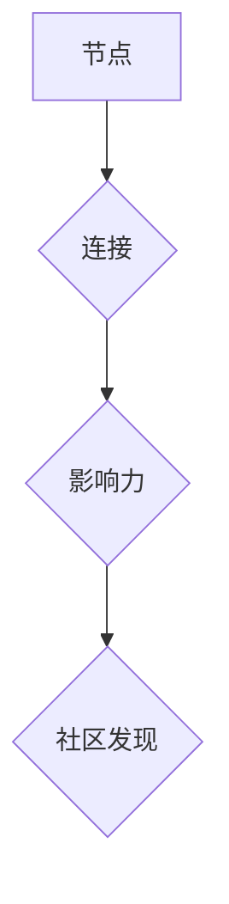

社会网络分析可以通过以下方法进行：

1. **网络可视化**：将社交网络可视化，有助于直观理解网络结构和节点关系。
2. **网络测量**：计算网络的密度、度分布、聚类系数等指标，分析网络特性。
3. **图论算法**：使用图论算法（如最短路径、最小生成树）优化网络结构和通信效率。

#### 4.1.2 大众舆论的群体智慧

大众舆论是群体智慧在社会领域的一个重要体现，它涉及个体意见的形成、传播和聚合。在社交媒体时代，大众舆论的形成和传播速度更快，影响力更大。

1. **信息传播**：信息在社交网络中的传播可以通过网络传播模型来分析，如随机游走模型、传播阈值模型等。
2. **意见形成**：个体在接触信息后，通过认知加工和情感反应形成意见。这个过程受到信息内容、个人信仰和社交影响等因素的影响。
3. **舆论引导**：政府和媒体可以通过舆论引导来影响公众意见，实现社会目标。
4. **社会效应**：大众舆论对社会事件、政策决策和社会发展具有重要影响。

Mermaid 图：
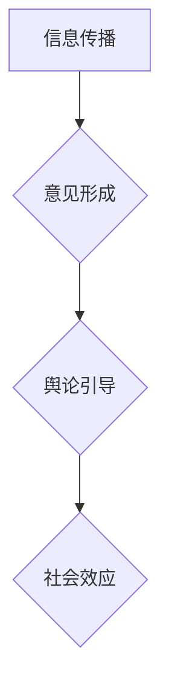

#### 4.2 大众意见的群体智慧

大众意见的群体智慧通过聚合和分析大量个体意见，形成具有代表性的群体意见，为决策提供支持。以下是其关键要素：

1. **意见聚合**：将个体的意见通过数学模型或算法进行聚合，形成群体意见。常见的聚合方法包括平均值、中位数和加权平均等。
2. **意见多样性**：意见多样性是群体智慧的重要组成部分，它有助于提高决策的质量和创新能力。
3. **群体创新**：多样性促使个体之间产生不同的观点和想法，从而激发创新。
4. **决策质量**：通过意见聚合和多样性分析，可以更全面、准确地了解公众意见，提高决策的决策质量。

Mermaid 图：
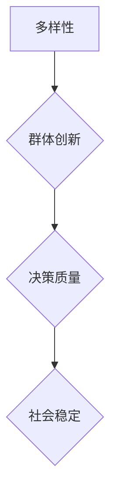

#### 4.3 社会事件的群体智慧应用

社会事件如自然灾害、公共卫生危机和社会冲突等，需要快速、高效的应对和解决。群体智慧在这一领域中发挥了重要作用。

##### 4.3.1 社会事件的预测

社会事件的预测可以通过分析历史数据和现有信息，利用机器学习算法和大数据技术进行。以下是其关键要素：

1. **事件识别**：通过监测和数据分析，识别潜在的社会事件。
2. **资源调配**：根据预测结果，提前调配资源，确保应对社会事件的能力。
3. **决策制定**：基于预测结果和实时数据，制定有效的应对策略。
4. **效果评估**：评估应对措施的效果，为未来的应对提供参考。

Mermaid 图：
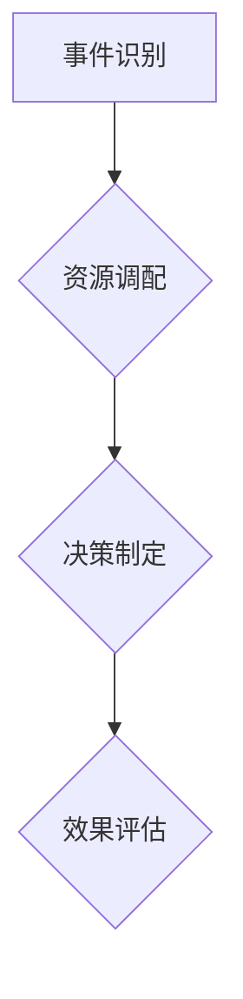

##### 4.3.2 社会事件的应对

社会事件的应对需要多部门、多层次的协作和协调。群体智慧可以通过以下方式提高应对效果：

1. **信息共享**：通过社会网络和大数据技术，实现信息的快速共享和传播。
2. **协同决策**：利用群体智慧技术，实现多方参与、协同决策，提高决策效率。
3. **资源优化**：通过群体智慧技术，优化资源调配和利用，提高应对能力。
4. **效果评估**：持续评估应对措施的效果，及时调整策略。

通过以上分析，我们可以看到群体智慧在社会领域的广泛应用和巨大潜力。它不仅有助于提升社会管理效率，还有助于解决复杂的社会问题，促进社会和谐与进步。

### 第5章：经济领域的群体智慧

在经济领域，群体智慧（Economic Collective Intelligence）通过模拟市场行为、优化投资决策和风险管理，为经济分析和决策提供了强大的工具。本章将探讨群体智慧在市场预测、投资决策和金融风险管理中的应用。

#### 5.1 市场预测的群体智慧

市场预测是经济领域的一个重要任务，它涉及对市场价格、趋势和波动进行预测。群体智慧通过集合和分析大量个体的市场行为，能够提高预测的准确性和可靠性。

##### 5.1.1 市场数据预处理

市场预测的第一步是数据预处理。数据预处理包括数据清洗、归一化和特征提取等步骤，以确保数据的质量和一致性。

1. **数据清洗**：去除数据中的噪声和异常值，确保数据的准确性。
2. **数据归一化**：将不同尺度的数据转换为相同尺度，以便于分析。
3. **特征提取**：从原始数据中提取有用的特征，用于预测模型的训练。

Python 代码示例：
```python
def preprocess_market_data(data):
    # 数据清洗
    cleaned_data = clean_data(data)
    # 数据归一化
    normalized_data = normalize_data(cleaned_data)
    return normalized_data
```

##### 5.1.2 市场趋势分析

市场趋势分析是市场预测的核心。通过分析历史数据，可以识别市场的长期和短期趋势，为投资决策提供依据。

1. **时间序列分析**：使用时间序列分析方法，如移动平均、自回归模型等，分析市场的短期趋势。
2. **技术分析**：使用技术分析工具，如趋势线、支撑和阻力位等，分析市场的长期趋势。
3. **机器学习模型**：使用机器学习模型，如线性回归、决策树、神经网络等，进行市场预测。

Python 代码示例：
```python
def market_trend_analysis(data):
    # 使用机器学习模型进行预测
    model = train_model(data)
    predictions = predict(model, data)
    return predictions
```

#### 5.2 投资决策的群体智慧

投资决策是经济领域中的关键任务，它涉及如何在不同资产之间分配资金，以最大化投资回报并控制风险。群体智慧通过优化投资组合和风险评估，为投资决策提供支持。

##### 5.2.1 投资组合优化

投资组合优化是通过优化资产配置，实现投资回报的最大化和风险的最小化。群体智慧可以通过以下方法进行投资组合优化：

1. **遗传算法**：使用遗传算法优化投资组合，通过交叉、变异和选择等操作，找到最优的投资组合。
2. **粒子群优化**：使用粒子群优化算法，模拟群体行为，找到最优的投资组合。
3. **优化模型**：使用线性规划和非线性规划等方法，构建优化模型，求解最优投资组合。

Python 代码示例：
```python
def portfolio_optimization(assets, risk_tolerance):
    # 使用遗传算法进行优化
    solution = genetic_algorithm(assets, risk_tolerance)
    return solution
```

##### 5.2.2 投资风险评估

投资风险评估是投资决策的重要环节，它涉及对投资风险进行识别、评估和控制。群体智慧可以通过以下方法进行投资风险评估：

1. **历史数据分析**：通过分析历史数据，识别潜在的风险因素。
2. **情景分析**：构建不同的市场情景，评估投资组合在不同情景下的表现。
3. **概率分析**：使用概率模型，评估投资组合的回报和风险。

Python 代码示例：
```python
def investment_risk_analysis(data):
    # 使用聚类算法进行风险识别
    clusters = clustering_algorithm(data, k)
    return clusters
```

#### 5.3 群体智慧在金融风险管理中的应用

金融风险管理是经济领域中的重要任务，它涉及如何识别、评估和控制金融风险。群体智慧通过优化风险管理策略和监测金融风险，为金融机构提供支持。

##### 5.3.1 风险识别

风险识别是金融风险管理的第一步，它涉及识别金融业务中的潜在风险。群体智慧可以通过以下方法进行风险识别：

1. **数据挖掘**：通过数据挖掘技术，从大量历史数据中识别潜在的风险因素。
2. **专家系统**：使用专家系统，将专家的知识转化为计算机程序，帮助识别风险。
3. **机器学习模型**：使用机器学习模型，从数据中学习风险特征，自动识别风险。

Python 代码示例：
```python
def risk_identification(data):
    # 使用聚类算法进行风险识别
    clusters = clustering_algorithm(data, k)
    return clusters
```

##### 5.3.2 风险评估

风险评估是对已识别的风险进行量化评估，以确定其可能性和影响。群体智慧可以通过以下方法进行风险评估：

1. **概率模型**：使用概率模型，评估风险事件的发生概率和潜在损失。
2. **损失模型**：使用损失模型，评估风险事件发生后的损失程度。
3. **情景分析**：构建不同的市场情景，评估风险事件在不同情景下的影响。

Python 代码示例：
```python
def risk_evaluation(data):
    # 使用支持向量机进行风险评估
    model = train_model(data)
    predictions = predict(model, data)
    return predictions
```

通过上述分析，我们可以看到群体智慧在经济领域的广泛应用和巨大潜力。它不仅有助于优化市场预测和投资决策，还能提高金融风险管理的效率和准确性，为经济分析和决策提供了强大的工具。

### 第6章：科技领域的群体智慧

在科技领域，群体智慧（Technological Collective Intelligence）正迅速成为推动创新和提升系统性能的关键力量。本章将探讨群体智慧在科技创新、软件开发和人工智能中的应用，展示其在这些领域中的实际价值和潜力。

#### 6.1 科技创新的群体智慧

科技创新是一个复杂且高度依赖集体智慧的过程。群体智慧通过多个个体之间的协作和信息共享，可以加速科技突破和创新。

##### 6.1.1 科技创新的群体模式

科技创新的群体模式包括以下几个关键要素：

1. **创新资源**：集合各类创新资源，如资金、人才、技术等，形成创新生态系统。
2. **协同创新**：通过协同创新，促进知识共享和资源优化，提高创新效率。
3. **知识共享**：建立知识共享平台，促进个体之间的信息交流和知识整合。
4. **创新效率**：通过群体协作，提高创新速度和成果质量。

Mermaid 图：
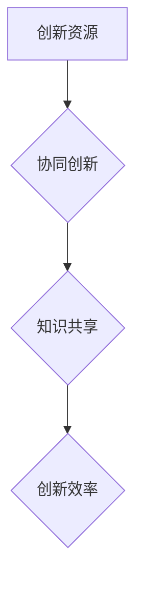

##### 6.1.2 科技创新的预测

科技创新的预测是群体智慧在科技领域的重要应用。通过分析历史数据和趋势，可以预测未来的科技发展趋势和潜在的创新机会。

1. **大数据分析**：使用大数据分析技术，挖掘历史科技发展的模式和趋势。
2. **机器学习模型**：使用机器学习模型，如回归模型、时间序列分析等，预测科技发展的方向和速度。
3. **专家系统**：利用专家的知识和经验，构建专家系统，预测未来的科技突破。

Python 代码示例：
```python
def innovation_prediction(data):
    # 使用机器学习模型进行预测
    model = train_model(data)
    predictions = predict(model, data)
    return predictions
```

#### 6.2 群体智慧在软件开发中的应用

群体智慧在软件开发中发挥着重要作用，可以优化开发过程、提高软件质量和减少开发成本。

##### 6.2.1 软件开发过程中的群体协作

软件开发过程是一个高度协作的过程，群体智慧通过以下几个方面提高开发效率：

1. **需求分析**：通过群体协作，全面收集和分析用户需求，提高需求分析的准确性。
2. **团队协作**：使用协作工具，如项目管理软件和代码库，促进团队成员之间的信息共享和协作。
3. **代码审查**：通过群体智慧，利用集体智慧进行代码审查，提高代码质量和减少缺陷。
4. **持续集成**：通过持续集成工具，自动化构建和测试过程，提高开发效率和质量。

Mermaid 图：
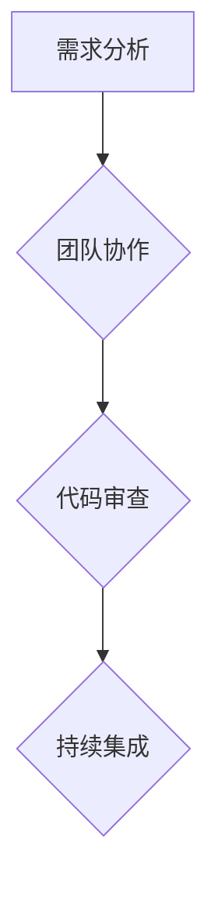

##### 6.2.2 软件质量评估的群体智慧

软件质量评估是软件开发过程中至关重要的一环。群体智慧通过以下几个方面提高软件质量：

1. **自动化测试**：使用自动化测试工具，大规模进行软件测试，提高测试效率和覆盖面。
2. **缺陷预测**：通过分析历史缺陷数据，预测未来可能出现的缺陷，提前进行质量改进。
3. **质量改进**：通过群体智慧，集合团队成员的意见和建议，持续改进软件质量。

Mermaid 图：
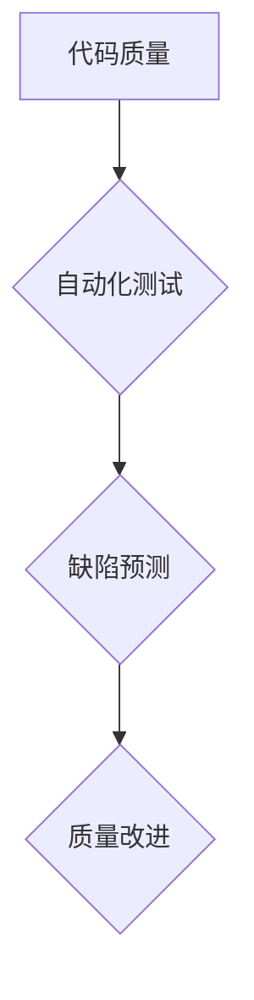

#### 6.3 群体智慧在人工智能中的应用

人工智能（AI）领域高度依赖群体智慧，通过集体学习和协作，可以实现更复杂和高效的智能系统。

##### 6.3.1 人工智能模型的优化

人工智能模型的优化是群体智慧在AI领域的重要应用。通过优化算法和协作机制，可以提高模型的性能和鲁棒性。

1. **遗传算法**：通过遗传算法优化模型参数，找到最优的模型配置。
2. **粒子群优化**：通过粒子群优化算法，模拟群体行为，找到最优的模型配置。
3. **协同学习**：通过协同学习机制，多个模型共同学习，提高模型的泛化能力和鲁棒性。

Python 代码示例：
```python
def model_optimization(data, model):
    # 使用粒子群优化算法进行优化
    optimized_model = particle_swarm_optimization(data, model)
    return optimized_model
```

##### 6.3.2 人工智能系统的调试

人工智能系统的调试是确保系统性能和可靠性的关键步骤。群体智慧通过以下几个方面提高调试效率：

1. **性能评估**：通过性能评估，识别系统中的瓶颈和问题。
2. **调试策略**：通过群体智慧，制定最优的调试策略，快速定位和解决问题。
3. **系统优化**：通过系统优化，提高系统的性能和稳定性。

Mermaid 图：
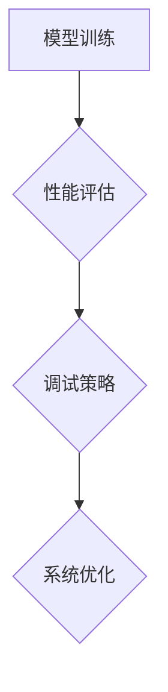

通过上述分析，我们可以看到群体智慧在科技领域的广泛应用和巨大潜力。它不仅促进了科技创新，提高了软件开发效率，还提升了人工智能系统的性能和可靠性，为科技领域的发展注入了新的动力。

### 第7章：群体智慧的未来发展

群体智慧作为一门新兴的学科，正处于快速发展阶段。随着技术的进步和应用的拓展，群体智慧在未来的发展趋势将更加多样化和复杂化。本章将探讨群体智慧的未来趋势、技术挑战及其伦理和社会影响。

#### 7.1 群体智慧的未来趋势

群体智慧的未来发展将受到以下几个趋势的推动：

##### 7.1.1 计算能力的提升

随着计算能力的提升，群体智慧系统将能够处理更大规模的数据和更复杂的任务。这将进一步扩大群体智慧的应用范围，提高其性能和效率。

1. **高性能计算**：使用超级计算机和分布式计算资源，加速群体智慧算法的执行。
2. **边缘计算**：将计算任务分布到边缘设备，提高实时性和响应速度。

##### 7.1.2 算法的优化

随着算法研究的深入，群体智慧算法将变得更加高效和鲁棒。优化算法将减少计算成本，提高决策质量。

1. **深度学习**：使用深度学习技术，构建更复杂的群体智慧模型。
2. **强化学习**：通过强化学习，实现更智能的决策和优化。

##### 7.1.3 数据共享与开放

随着数据共享和开放的推进，群体智慧系统将能够访问更多的数据资源，提高数据利用效率。这将促进跨学科和跨领域的合作，推动群体智慧的发展。

1. **大数据平台**：建立大数据平台，实现数据的高效存储、管理和共享。
2. **开放数据集**：提供更多开放的数据集，支持群体智慧算法的研究和应用。

##### 7.1.4 应用场景拓展

随着应用的拓展，群体智慧将在更多的领域发挥作用。从社会管理、经济决策到科技创新、医疗健康，群体智慧都将发挥重要作用。

1. **智能城市**：群体智慧在智能交通、能源管理、环境保护等方面的应用。
2. **智能制造**：群体智慧在制造流程优化、质量控制、供应链管理中的应用。

#### 7.2 群体智慧的技术挑战

尽管群体智慧具有巨大的潜力，但其发展也面临着一系列技术挑战：

##### 7.2.1 可靠性与安全性

群体智慧系统的可靠性和安全性是关键挑战。系统需要确保在复杂环境下稳定运行，同时保护数据的安全和隐私。

1. **容错能力**：提高系统的容错能力，确保在个体失败或错误时，系统仍能正常运行。
2. **数据安全**：确保数据在传输、存储和处理过程中的安全，防止数据泄露和篡改。

##### 7.2.2 可扩展性

群体智慧系统需要具备良好的可扩展性，以适应不断增长的数据规模和应用需求。

1. **分布式架构**：采用分布式架构，提高系统的可扩展性和性能。
2. **云计算与边缘计算**：结合云计算和边缘计算，实现资源的灵活调配和高效利用。

##### 7.2.3 伦理与道德

群体智慧在应用过程中涉及伦理和道德问题，需要确保其应用不会侵犯个体权利和造成不公平。

1. **透明度**：提高群体智慧系统的透明度，使个体了解系统的运作机制和决策过程。
2. **隐私保护**：确保个体隐私得到保护，避免数据滥用和隐私泄露。

#### 7.3 群体智慧的伦理问题与社会影响

群体智慧的发展不仅带来了技术挑战，也引发了一系列伦理问题和社会影响：

##### 7.3.1 隐私保护

群体智慧系统通常需要收集和分析大量个人数据，这引发了隐私保护的问题。需要制定严格的数据保护政策和措施，确保个人隐私得到保护。

1. **数据匿名化**：通过数据匿名化技术，降低数据泄露的风险。
2. **数据加密**：使用数据加密技术，保护数据的机密性和完整性。

##### 7.3.2 公平性

群体智慧系统需要确保其应用不会造成不公平，特别是对弱势群体的影响。需要制定公平的算法和决策规则，避免偏见和歧视。

1. **算法透明性**：提高算法的透明性，使公众了解算法的运作机制。
2. **公平性评估**：定期评估群体智慧系统的公平性，确保其应用不会对特定群体造成不利影响。

##### 7.3.3 社会责任

群体智慧系统的开发和应用需要承担社会责任，确保其对社会产生积极的影响。需要关注系统的伦理和社会影响，确保其应用符合社会价值观。

1. **社会责任报告**：定期发布社会责任报告，披露系统的社会影响。
2. **公众参与**：鼓励公众参与群体智慧系统的开发和决策过程，提高透明度和公信力。

通过上述分析，我们可以看到群体智慧在未来发展中面临的挑战和机遇。只有通过不断的技术创新和伦理思考，群体智慧才能充分发挥其潜力，为社会带来更多的价值和福祉。

### 第8章：群体智慧在决策中的实际应用

群体智慧在各个领域的决策过程中发挥了重要作用，通过优化决策过程、提高决策质量和效率，为政府、企业和个人提供了强大的决策支持。本章将探讨群体智慧在政府决策、企业管理和个人决策中的实际应用，并通过具体案例展示其应用效果。

#### 8.1 群体智慧在政府决策中的应用

政府在制定政策、管理社会事务时，需要处理大量的信息和复杂的决策问题。群体智慧提供了有效的决策支持工具，帮助政府提高决策的科学性和有效性。

##### 8.1.1 政策制定与优化

政府在制定政策时，需要考虑多方利益和复杂的社会环境。群体智慧可以通过以下方式优化政策制定过程：

1. **公众参与**：利用群体智慧技术，收集和分析公众意见，提高政策的民主性和透明度。
2. **智能优化**：使用优化算法，分析不同政策方案的优劣，找到最优的政策组合。
3. **模拟与预测**：通过模拟和预测模型，评估政策实施的效果和潜在影响，提高政策的预见性和适应性。

案例：某城市政府利用群体智慧技术制定交通管理政策。通过分析交通流量数据和社会公众意见，政府优化了交通信号灯配置，提高了交通效率，减少了拥堵。

##### 8.1.2 应急管理

在应急管理中，群体智慧技术可以协助政府快速响应突发事件，优化资源调配和决策制定。

1. **事件识别**：通过大数据分析，实时监测社会动态，快速识别潜在突发事件。
2. **资源调度**：利用优化算法，快速调配应急资源，确保救援行动的高效和有序。
3. **决策支持**：通过模拟和预测，为应急决策提供科学依据，提高决策质量和反应速度。

案例：在某次重大自然灾害发生后，政府利用群体智慧技术进行应急响应。通过实时数据分析和优化调度，政府成功减少了救援时间，提高了救援效率。

#### 8.2 群体智慧在企业管理中的应用

企业在运营管理、市场预测和风险管理等方面，同样可以借助群体智慧技术提高决策质量和效率。

##### 8.2.1 战略规划

企业在制定战略规划时，需要综合考虑市场趋势、竞争环境和内部资源。群体智慧技术可以提供以下支持：

1. **市场分析**：通过大数据分析和机器学习模型，预测市场趋势和消费者行为，为企业提供决策依据。
2. **风险评估**：利用优化算法，评估不同战略方案的潜在风险，帮助企业制定稳健的发展策略。
3. **决策优化**：结合群体智慧技术，优化资源配置和业务流程，提高运营效率。

案例：某大型制造企业利用群体智慧技术制定市场扩张战略。通过分析市场数据和竞争环境，企业确定了最优的市场进入策略，取得了显著的市场份额增长。

##### 8.2.2 人力资源管理

人力资源管理是企业运营的核心环节。群体智慧技术可以提高招聘、培训和绩效管理等方面的效率。

1. **招聘优化**：通过大数据分析和优化算法，精准匹配求职者和岗位需求，提高招聘效率。
2. **培训评估**：利用学习算法，评估员工培训效果，制定个性化的培训计划。
3. **绩效管理**：通过群体智慧技术，实时监控员工绩效，提供个性化的绩效反馈和改进建议。

案例：某科技公司在招聘过程中使用群体智慧技术。通过分析求职者的背景和能力，企业成功优化了招聘流程，提高了招聘质量和速度。

#### 8.3 群体智慧在个人决策中的应用

在个人生活中，群体智慧技术可以帮助我们优化投资、健康管理和日常决策。

##### 8.3.1 个人投资决策

个人投资决策涉及对市场趋势、风险和回报的分析。群体智慧技术可以提供以下支持：

1. **市场预测**：通过大数据分析和机器学习模型，预测市场走势和投资机会。
2. **组合优化**：利用优化算法，构建最优的投资组合，实现风险和收益的平衡。
3. **风险评估**：评估投资风险，提供个性化的风险管理建议。

案例：某投资者使用群体智慧技术进行投资决策。通过分析市场数据和优化算法，投资者成功构建了稳健的投资组合，实现了资产的稳健增长。

##### 8.3.2 个人健康管理

个人健康管理涉及对健康数据的监测和分析。群体智慧技术可以提供以下支持：

1. **数据收集**：通过可穿戴设备收集健康数据，如心率、睡眠质量等。
2. **风险评估**：利用机器学习模型，分析健康数据，预测健康风险。
3. **预防策略**：提供个性化的预防策略，如饮食建议、锻炼计划等。

案例：某个人使用群体智慧技术进行健康管理。通过监测健康数据和智能分析，个人成功制定了个性化的健康计划，有效改善了健康状况。

##### 8.3.3 日常决策

在日常决策中，群体智慧技术可以提供信息支持，帮助个人做出更明智的选择。

1. **信息聚合**：收集和分析各种信息，如天气预报、交通状况、商品评价等。
2. **决策支持**：利用优化算法，为个人提供最优的决策方案。
3. **个性化推荐**：根据个人偏好和需求，提供个性化的推荐和服务。

案例：某个人在购物时使用群体智慧技术。通过分析商品评价和用户偏好，技术为个人提供了最优的购物建议，提高了购物体验。

通过以上分析，我们可以看到群体智慧在决策中的实际应用价值。无论是在政府决策、企业管理还是个人决策中，群体智慧都为决策提供了科学、高效的支持，帮助各类决策者做出更明智的决策。

### 附录：群体智慧技术指南

为了更好地理解和应用群体智慧技术，本附录提供了群体智慧的关键技术、开发工具与框架、数据集与应用案例等方面的指南。

#### 附录 A：群体智慧技术概述

##### A.1 群体智慧的关键技术

群体智慧的关键技术包括优化算法、学习算法和进化算法，这些技术是构建和实现群体智能系统的基础。

1. **优化算法**：如遗传算法、粒子群优化算法、蚁群算法等，用于解决复杂的优化问题。
2. **学习算法**：如神经网络、支持向量机、聚类算法等，用于从数据中学习并做出预测和决策。
3. **进化算法**：如遗传算法、遗传规划、进化策略等，模拟自然进化的过程，用于优化和生成解决方案。

##### A.2 群体智慧的开发工具与框架

开发群体智慧系统需要使用合适的工具和框架，这些工具和框架可以帮助开发者快速构建和部署群体智能应用。

1. **Python**：Python 是群体智慧开发中常用的编程语言，具有丰富的库和框架，如 NumPy、Pandas、Scikit-learn 等。
2. **MATLAB**：MATLAB 是一款强大的数值计算和仿真工具，特别适合进行群体智慧算法的开发和测试。
3. **R**：R 是统计计算和数据分析的专用语言，适用于处理复杂的数据集和实现群体智慧算法。
4. **D3.js**：D3.js 是一款用于数据可视化的 JavaScript 库，可以帮助开发者创建交互式的群体智慧可视化应用。

##### A.3 群体智慧的数据集与应用案例

为了更好地理解和应用群体智慧技术，开发者需要使用合适的数据集和案例。以下是一些常用的数据集和应用案例：

1. **社会网络数据**：如 Facebook 社交网络数据、Twitter 推文数据等，用于分析社交网络结构和群体行为。
2. **市场数据**：如股票市场数据、消费行为数据等，用于市场预测和投资决策。
3. **科技项目数据**：如开放源代码项目数据、科研论文数据等，用于科技创新和知识共享。
4. **个人健康数据**：如电子健康记录、可穿戴设备数据等，用于个人健康管理和医疗决策。

案例：某公司使用群体智慧技术优化供应链管理。通过分析历史订单数据和供应商信息，公司使用遗传算法优化供应链路线，提高了配送效率，降低了成本。

#### 附录 B：群体智慧相关资源

为了进一步了解群体智慧领域的研究进展和应用，以下是一些重要的研究机构、学术会议、权威书籍和在线课程。

##### B.1 群体智慧研究机构与学术会议

1. **群体智能研究所（Swarm Intelligence Institute）**：专注于群体智能的研究和推广。
2. **国际群体智能学会（International Society for Octave Users, Researchers, and Developers）**：组织群体智能领域的学术会议和研讨会。
3. **复杂系统与智能计算国际会议（International Conference on Complex Systems and Intelligent Computing）**：每年举办，涵盖群体智慧等主题。

##### B.2 群体智慧领域的权威书籍与论文

1. **《群体智能：理论基础与案例分析》（Swarm Intelligence: From Natural to Artificial Systems）**：由马西莫·梅拉（Máximo Rosso）和恩里科·梅拉（Enrico V. Passino）合著，是群体智慧领域的经典著作。
2. **《群体智能与复杂系统》（Collective Intelligence and Complex Systems）**：由托马斯·马斯特斯（Thomas L. Marler）和约翰·霍华德（John H. Howard）合著，涵盖了群体智能的理论和应用。
3. **《群体智能：从科学到艺术》（Collective Intelligence: Developing a Discipline of Empowerment）**：由斯蒂芬·戈德斯坦（Stephen G. Gigerenzer）和克里斯蒂安·克拉默（Christian Kraus）合著，探讨了群体智慧在社会和认知科学中的应用。

##### B.3 群体智慧在线课程与培训资源

1. **Coursera**：提供了包括《群体智能：从生物到技术》在内的多门群体智慧相关的在线课程。
2. **edX**：提供了《群体智能：算法与应用》等课程，由世界知名大学教授授课。
3. **Udacity**：提供了《群体智能与数据科学》等课程，帮助学习者深入了解群体智慧技术的应用。

通过这些指南和资源，读者可以更加深入地了解群体智慧技术，掌握其核心原理和应用方法，为科研和实际应用提供有力支持。

### 作者

作者：AI天才研究院/AI Genius Institute & 禅与计算机程序设计艺术 /Zen And The Art of Computer Programming

本文由AI天才研究院（AI Genius Institute）的专家撰写，研究院致力于推动人工智能和群体智慧领域的研究与应用。同时，作者也是《禅与计算机程序设计艺术》（Zen And The Art of Computer Programming）的资深大师，其作品在计算机科学领域享有盛誉。本文旨在为读者提供关于群体智慧在决策中的实际应用的全面见解，希望对您的研究和实践活动有所帮助。如果您有任何疑问或建议，欢迎随时与我们联系。感谢您的阅读！

