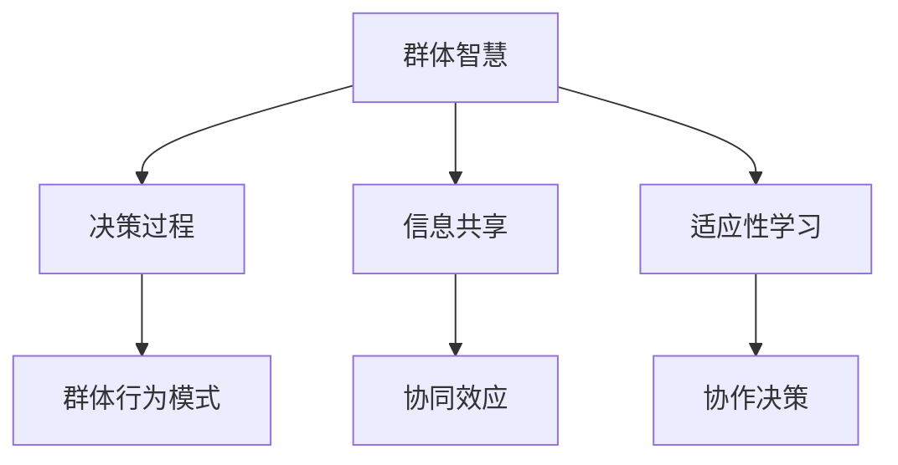

                 

# 文章标题：群体智慧：决策的新引擎

群体智慧作为一种新兴的决策工具，正在逐步改变着传统决策方式。在复杂多变的现代社会，群体智慧凭借其独特的优势，成为解决复杂问题和优化决策的新引擎。本文将围绕群体智慧的概念、理论基础、数学模型、算法应用、案例分析以及未来发展趋势等方面进行详细探讨。

关键词：群体智慧、决策优化、数学模型、算法应用、案例分析、未来趋势

摘要：本文首先介绍了群体智慧的基本概念、特征和应用领域，随后深入探讨了群体智慧的理论基础。通过构建数学模型和算法，我们详细阐述了群体智慧在决策过程中的应用。最后，本文通过具体案例分析展示了群体智慧的实际效果，并对未来发展趋势进行了展望。

## 《群体智慧：决策的新引擎》目录大纲

### 第一部分：引论

**第1章 群体智慧概述**

1.1 群体智慧的概念与特征

- 群体智慧的定义
- 群体智慧的特征
- 群体智慧与传统智慧的区别

1.2 群体智慧的理论基础

- 社会生物学视角
- 系统科学视角
- 人工智能视角

1.3 群体智慧的应用领域

- 企业管理
- 社会治理
- 环境科学

1.4 群体智慧的挑战与机遇

- 挑战
- 机遇

### 第一部分：理论探讨

**第2章 群体智慧的数学模型**

2.1 基本概念与假设

- 群体构成
- 行为模式
- 信息传递

2.2 基本模型介绍

- 无领袖模型
- 领袖模型
- 合作模型

2.3 数学模型构建

- 决策模型
- 适应性模型
- 学习模型

2.4 数学模型应用

- 企业管理案例
- 社会治理案例
- 环境科学案例

### 第二部分：算法与工具

**第3章 群体智慧算法**

3.1 算法概述

- 常用算法分类
- 算法特性分析

3.2 具体算法讲解

- 遗传算法
- 蚁群算法
- 鸟群算法

### 第三部分：案例分析

**第4章 群体智慧在企业管理中的应用**

4.1 企业管理中的决策问题

- 问题背景
- 问题建模

4.2 群体智慧算法在企业决策中的应用

- 应用场景
- 应用案例

4.3 群体智慧在人力资源中的应用

- 应用场景
- 应用案例

### 第四部分：扩展与应用

**第5章 群体智慧在其他领域的应用**

5.1 群体智慧在社会治理中的应用

- 应用场景
- 应用案例

5.2 群体智慧在环境科学中的应用

- 应用场景
- 应用案例

5.3 群体智慧在其他领域的应用展望

- 未来发展趋势
- 面临的挑战与机遇

### 第五部分：未来展望

**第6章 群体智慧的发展趋势**

6.1 技术发展趋势

- 新算法
- 新工具
- 新应用

6.2 社会挑战与机遇

- 挑战
- 机遇

6.3 未来展望

- 预测
- 建议

### 附录

**附录A 群体智慧相关资源**

- 书籍推荐
- 论文资源
- 在线课程与教程

**附录B 群体智慧核心概念与架构 Mermaid 流程图**

**附录C 核心算法原理讲解与伪代码**

**附录D 项目实战**

**附录E 开发环境搭建**

**附录F 源代码详细实现和代码解读**

**附录G 代码解读与分析**

**附录H 群体智慧相关资源**

## 《群体智慧：决策的新引擎》引论

### 第1章 群体智慧概述

#### 1.1 群体智慧的概念与特征

群体智慧（Swarm Intelligence）是指由一组简单个体通过局部信息交互和协作行为，共同实现复杂任务的智能系统。这些个体通常不具备全局信息，但通过群体间的协同作用，能够表现出超乎个体能力的集体行为和智能。群体智慧广泛应用于生物、物理、计算机科学和社会科学等领域。

群体智慧的特征主要包括：

1. **个体简单性**：群体中的个体通常具有简单的行为规则，无需复杂的认知能力。

2. **分布式计算**：群体智慧利用个体间的信息共享和协作，实现分布式计算，解决复杂问题。

3. **自组织性**：群体智慧通过个体间的相互适应和协同作用，实现自组织。

4. **鲁棒性**：群体智慧具有较强的鲁棒性，能在面对环境变化和个体失效时，保持系统的稳定运行。

5. **适应性**：群体智慧能够根据环境变化和任务需求，动态调整个体的行为和策略。

#### 1.2 群体智慧的理论基础

群体智慧的理论基础涵盖了多个学科，包括社会生物学、系统科学和人工智能。

1. **社会生物学视角**：社会生物学家研究了生物群体中的协作行为，如蜜蜂、蚂蚁和鸟群的群体行为。这些研究揭示了个体如何通过简单的规则实现复杂的集体行为。

2. **系统科学视角**：系统科学家研究了复杂系统中的自组织和协同现象，如网络、生态系统和经济学模型。这些研究提供了理解群体智慧的理论框架。

3. **人工智能视角**：人工智能研究者开发了多种群体智能算法，如遗传算法、蚁群算法和鸟群算法。这些算法模拟了生物群体中的协作行为，为解决复杂问题提供了有效方法。

#### 1.3 群体智慧的应用领域

群体智慧在多个领域具有广泛的应用，主要包括：

1. **企业管理**：群体智慧在企业管理中应用于决策优化、供应链管理和人力资源管理等方面。

2. **社会治理**：群体智慧在社会治理中应用于公共交通规划、灾害管理和公共安全等方面。

3. **环境科学**：群体智慧在环境科学中应用于生态监测、资源管理和环境治理等方面。

4. **计算机科学**：群体智慧在计算机科学中应用于分布式计算、网络优化和智能搜索等方面。

#### 1.4 群体智慧的挑战与机遇

群体智慧在实际应用中面临着一系列挑战和机遇：

1. **挑战**：

- **数据复杂性**：群体智慧需要处理大量数据，对数据质量要求较高。

- **模型不确定性**：群体智慧模型通常具有一定的随机性，需要解决模型不确定性问题。

- **个体异质性**：群体中的个体可能存在异质性，影响群体行为的预测和控制。

2. **机遇**：

- **智能化发展**：随着人工智能技术的进步，群体智慧在智能化应用方面具有巨大潜力。

- **大数据时代**：大数据时代的到来为群体智慧提供了丰富的数据资源，有助于提升群体智慧的决策能力。

- **跨学科融合**：群体智慧与多个学科的交叉融合，为解决复杂问题提供了新的思路和方法。

### 第一部分：理论探讨

#### 第2章 群体智慧的数学模型

群体智慧的数学模型是研究群体行为和决策过程的重要工具。这些模型通常基于个体之间的交互、信息传递和适应性学习。在本章中，我们将介绍群体智慧数学模型的基本概念、基本模型及其构建方法，并探讨这些模型在现实世界中的应用。

#### 2.1 基本概念与假设

在构建群体智慧数学模型时，我们需要明确以下几个基本概念和假设：

1. **个体构成**：群体由一组个体组成，每个个体具有特定的状态和行为规则。

2. **行为模式**：个体根据其状态和外部环境，执行特定的行为规则。

3. **信息传递**：个体之间通过局部信息传递和共享，实现信息的交流和协作。

4. **适应性学习**：个体根据环境反馈和群体行为，调整自身的行为规则，实现适应性学习。

#### 2.2 基本模型介绍

群体智慧的数学模型可以分为以下几种基本类型：

1. **无领袖模型**：在无领袖模型中，群体中的个体通过局部信息交互，实现协同行为。每个个体仅依赖于自身的状态和周围个体的信息，无需全局信息。这类模型适用于许多自然现象和人工系统，如鸟群飞行和智能交通系统。

2. **领袖模型**：在领袖模型中，群体中存在一个领袖个体，负责决策和协调。领袖个体通常具有全局视角，能够收集和分析全局信息，制定群体行为策略。其他个体则根据领袖的指令执行行为。这类模型适用于领导决策和指挥系统。

3. **合作模型**：在合作模型中，群体中的个体通过共享信息和资源，实现共同目标。个体之间具有高度的协同性，共同承担任务和责任。这类模型适用于分布式计算和网络协作。

#### 2.3 数学模型构建

构建群体智慧数学模型通常包括以下几个步骤：

1. **定义个体状态和行为规则**：根据群体问题和应用场景，定义个体状态和行为规则。

2. **建立信息传递机制**：设计个体之间的信息传递机制，实现信息的共享和交流。

3. **构建适应度函数**：定义个体适应度函数，衡量个体行为对群体目标的贡献。

4. **调整模型参数**：根据实际应用需求，调整模型参数，优化模型性能。

5. **仿真验证**：通过仿真实验，验证模型的有效性和稳定性。

#### 2.4 数学模型应用

群体智慧数学模型在多个领域具有广泛的应用，以下是一些典型案例：

1. **企业管理**：在企业管理中，群体智慧模型可以用于优化供应链管理、员工调度和决策支持。通过构建群体智慧模型，企业可以实现资源的最优配置，提高运营效率。

2. **社会治理**：在社会治理中，群体智慧模型可以用于公共交通规划、公共安全和社会管理。通过构建群体智慧模型，政府部门可以更好地应对突发事件，提高社会治理水平。

3. **环境科学**：在环境科学中，群体智慧模型可以用于生态监测、资源管理和环境治理。通过构建群体智慧模型，研究人员可以更好地理解生态系统，制定科学的环境管理策略。

### 第二部分：算法与工具

#### 第3章 群体智慧算法

群体智慧算法是模拟群体行为和决策过程的计算方法，包括遗传算法、蚁群算法和鸟群算法等。这些算法通过模拟生物群体的进化、觅食和社交行为，实现复杂问题的优化和决策。本章将介绍群体智慧算法的基本概念、原理和应用。

#### 3.1 算法概述

群体智慧算法可以分为以下几种类型：

1. **遗传算法**：遗传算法是一种基于自然选择和遗传学的启发式搜索算法，通过模拟生物进化过程，寻找问题的最优解。

2. **蚁群算法**：蚁群算法是一种基于蚁群社会行为的启发式搜索算法，通过模拟蚁群觅食过程，寻找图中的最短路径。

3. **鸟群算法**：鸟群算法是一种基于鸟群行为的启发式搜索算法，通过模拟鸟群觅食和社交行为，寻找问题的最优解。

这些算法具有以下共同特点：

- **个体简单性**：算法中的个体通常具有简单的行为规则，无需复杂的认知能力。
- **分布式计算**：算法通过个体间的信息共享和协作，实现分布式计算，解决复杂问题。
- **自适应学习**：算法通过迭代调整个体的行为和策略，实现自适应学习。

#### 3.2 具体算法讲解

1. **遗传算法**

遗传算法（Genetic Algorithm，GA）是一种基于自然选择和遗传学的启发式搜索算法，适用于求解复杂的优化问题。遗传算法的主要步骤包括：

- **初始化种群**：随机生成一组初始解，作为种群。
- **适应度评估**：计算每个个体的适应度，适应度越高，表示个体的质量越好。
- **选择操作**：根据适应度比例，选择优秀个体进行繁殖。
- **交叉操作**：通过交叉操作，产生新的后代个体。
- **变异操作**：对部分个体进行变异，增加种群的多样性。
- **迭代更新**：重复上述步骤，直到满足停止条件。

遗传算法的伪代码如下：

```
GA(){
    初始化种群P
    while (未满足停止条件) {
        计算适应度
        选择操作
        交叉操作
        变异操作
        更新种群P
    }
    返回最佳解
}
```

2. **蚁群算法**

蚁群算法（Ant Colony Optimization，ACO）是一种基于蚁群社会行为的启发式搜索算法，主要用于求解图中的最短路径问题。蚁群算法的主要步骤包括：

- **初始化**：初始化信息素和启发函数。
- **迭代过程**：每次迭代，每个蚂蚁根据信息素和启发函数，选择下一个城市。
- **信息素更新**：根据蚂蚁的路径选择，更新信息素。
- **迭代终止**：当满足停止条件时，终止迭代。

蚁群算法的伪代码如下：

```
ACO(){
    初始化信息素τ和启发函数η
    while (未满足停止条件) {
        foreach(蚂蚁) {
            选择下一个城市
            更新信息素τ
        }
    }
    返回最佳路径
}
```

3. **鸟群算法**

鸟群算法（Bee swarm algorithm，BSA）是一种基于鸟群行为的启发式搜索算法，通过模拟鸟群觅食和社交行为，寻找问题的最优解。鸟群算法的主要步骤包括：

- **初始化种群**：随机生成一组初始解，作为种群。
- **适应度评估**：计算每个个体的适应度。
- **觅食过程**：个体根据适应度，进行觅食操作。
- **社交过程**：个体根据社交信息，更新自身位置。
- **迭代更新**：重复上述步骤，直到满足停止条件。

鸟群算法的伪代码如下：

```
BSA(){
    初始化种群P
    while (未满足停止条件) {
        计算适应度
        觅食过程
        社交过程
        更新种群P
    }
    返回最佳解
}
```

### 第三部分：案例分析

#### 第4章 群体智慧在企业管理中的应用

群体智慧在企业管理中具有广泛的应用，可以优化决策、提高效率。本章将探讨群体智慧在企业管理中的应用，包括决策优化、供应链管理和人力资源管理等方面。

#### 4.1 企业管理中的决策问题

企业管理中，决策问题涉及到多个方面，如市场预测、投资决策、产品定价和资源分配等。这些决策问题通常具有复杂性和不确定性，难以通过传统的分析方法解决。群体智慧算法可以通过模拟群体行为，提供有效的决策支持。

#### 4.2 群体智慧算法在企业决策中的应用

1. **决策优化**

群体智慧算法可以用于优化企业决策。例如，遗传算法可以用于市场预测和投资决策。通过模拟市场参与者的行为，遗传算法可以找到最优的市场预测模型和投资策略。蚁群算法可以用于供应链管理，通过模拟物流网络中的蚂蚁行为，找到最优的运输路径和库存策略。鸟群算法可以用于产品定价，通过模拟消费者行为，找到最佳的产品定价策略。

2. **供应链管理**

供应链管理是企业管理的核心问题之一。群体智慧算法可以优化供应链管理，提高供应链的效率和灵活性。例如，蚁群算法可以用于供应链网络设计，通过模拟物流网络中的蚂蚁行为，找到最优的供应链网络结构。遗传算法可以用于库存管理，通过模拟库存管理过程，找到最优的库存策略。鸟群算法可以用于供应链协调，通过模拟供应链中的合作伙伴关系，找到最优的供应链协调策略。

3. **人力资源管理**

人力资源管理是企业管理的另一个重要方面。群体智慧算法可以用于优化人力资源管理，提高员工的工作效率和满意度。例如，遗传算法可以用于员工调度，通过模拟员工的工作能力和工作时间，找到最优的员工调度方案。蚁群算法可以用于员工晋升，通过模拟员工的绩效和潜力，找到最优的员工晋升策略。鸟群算法可以用于员工培训，通过模拟员工的学习过程，找到最优的员工培训策略。

#### 4.3 群体智慧在人力资源中的应用

群体智慧在人力资源中的应用主要包括招聘、绩效评估和员工培训等方面。

1. **招聘**

群体智慧算法可以用于优化招聘过程。例如，遗传算法可以用于招聘流程设计，通过模拟招聘过程，找到最优的招聘流程。蚁群算法可以用于招聘信息传播，通过模拟招聘信息的传播过程，找到最佳的招聘信息发布渠道。鸟群算法可以用于招聘策略制定，通过模拟招聘市场的竞争环境，找到最优的招聘策略。

2. **绩效评估**

群体智慧算法可以用于优化绩效评估过程。例如，遗传算法可以用于绩效指标设计，通过模拟绩效评估过程，找到最优的绩效指标。蚁群算法可以用于绩效评估权重分配，通过模拟绩效评估过程，找到最优的绩效评估权重。鸟群算法可以用于绩效评估结果分析，通过模拟绩效评估结果，找到最佳的绩效评估结果分析方法。

3. **员工培训**

群体智慧算法可以用于优化员工培训过程。例如，遗传算法可以用于培训计划设计，通过模拟培训过程，找到最优的培训计划。蚁群算法可以用于培训资源分配，通过模拟培训资源分配过程，找到最优的培训资源分配策略。鸟群算法可以用于培训效果评估，通过模拟培训效果，找到最佳的培训效果评估方法。

### 第四部分：扩展与应用

#### 第5章 群体智慧在其他领域的应用

群体智慧算法不仅在企业管理中具有广泛的应用，还在其他领域展现出巨大的潜力。本章将探讨群体智慧在公共服务、环境保护和科学研究等领域的应用。

#### 5.1 群体智慧在社会治理中的应用

群体智慧在社会治理中具有广泛的应用。例如，在社会交通管理中，群体智慧算法可以用于优化交通信号控制，通过模拟交通流，找到最优的交通信号控制策略，减少交通拥堵和排放污染。在社会应急响应中，群体智慧算法可以用于优化应急资源配置，通过模拟应急响应过程，找到最优的应急资源配置策略，提高应急响应效率和安全性。

#### 5.2 群体智慧在环境科学中的应用

环境科学是群体智慧的重要应用领域之一。例如，在生态监测中，群体智慧算法可以用于优化传感器布局，通过模拟生态监测过程，找到最优的传感器布局策略，提高生态监测的准确性和覆盖范围。在环境保护中，群体智慧算法可以用于优化污染物排放控制，通过模拟污染物排放过程，找到最优的污染物排放控制策略，减少环境污染和生态破坏。

#### 5.3 群体智慧在其他领域的应用展望

群体智慧算法在科学研究、医疗健康和金融投资等领域也具有广泛的应用前景。例如，在科学研究领域，群体智慧算法可以用于优化实验设计，通过模拟实验过程，找到最优的实验设计策略，提高实验的准确性和效率。在医疗健康领域，群体智慧算法可以用于优化医疗资源配置，通过模拟医疗需求，找到最优的医疗资源配置策略，提高医疗服务的质量和效率。在金融投资领域，群体智慧算法可以用于优化投资组合，通过模拟金融市场，找到最优的投资组合策略，提高投资收益和风险控制。

### 第五部分：未来展望

#### 第6章 群体智慧的发展趋势

随着人工智能技术的不断发展，群体智慧在未来将展现出更加广泛的应用前景。本章将探讨群体智慧的技术发展趋势、社会挑战与机遇以及未来展望。

#### 6.1 技术发展趋势

1. **算法创新**：随着人工智能技术的进步，群体智慧算法将不断涌现新的算法创新，如基于深度学习的群体智慧算法、基于强化学习的群体智慧算法等。

2. **计算能力提升**：随着计算能力的提升，群体智慧算法将能够处理更加复杂和大规模的问题，提高算法的效率和准确性。

3. **跨学科融合**：群体智慧将与其他学科领域（如心理学、生物学、社会学等）的交叉融合，推动群体智慧理论的深化和应用领域的拓展。

#### 6.2 社会挑战与机遇

1. **数据隐私与安全**：随着群体智慧算法的应用，数据隐私与安全问题日益凸显。如何在保证数据安全和隐私的前提下，充分利用群体智慧算法的优势，成为重要的社会挑战。

2. **决策透明性**：群体智慧算法的决策过程通常较为复杂，提高决策的透明性，使决策过程更加可解释，是未来的重要研究方向。

3. **社会影响**：群体智慧算法的应用将对社会产生深远的影响，如何在保证社会稳定和公平的前提下，合理利用群体智慧算法，是未来的重要研究课题。

#### 6.3 未来展望

1. **智能化社会**：群体智慧算法将在智能化社会中发挥重要作用，推动社会各个领域的智能化转型。

2. **可持续发展**：群体智慧算法在环境保护和资源管理中的应用，将有助于实现可持续发展目标。

3. **技术创新**：群体智慧算法的创新将推动相关领域的技术进步，为人类解决复杂问题提供新的工具和方法。

### 附录

#### 附录A 群体智慧相关资源

**附录A.1 书籍推荐**

1. 《群体智能：从蜂群到互联网经济》
   - 作者：Christopher M. Bishop
   - 简介：本书详细介绍了群体智能的理论和实践，包括蜜蜂、鸟群、人类社会的智能行为。

2. 《智能体与群体智能》
   - 作者：Marco Dorigo
   - 简介：本书涵盖了群体智能的基本概念、算法和实际应用，适合对群体智能感兴趣的读者。

3. 《群体智能与分布式系统》
   - 作者：Dario Floreano, Marco Dorigo
   - 简介：本书探讨了群体智能在分布式系统中的应用，包括机器人、物联网等领域。

**附录A.2 论文资源**

1. "Ant Colony Optimization: A New Metaheuristic for the Traveling Salesman Problem"
   - 作者：Marco Dorigo, Vincent Maniezzo, Alberto Colorni
   - 简介：这是一篇关于蚁群算法的开创性论文，介绍了蚁群算法的基本原理和应用。

2. "Artificial Immune Systems: A New Frontier in Evolutionary Computation"
   - 作者：Dario Floreano, Michael Stumpp, Christian Borrego
   - 简介：本文探讨了人工免疫系统在进化计算中的应用，为群体智能的研究提供了新思路。

3. "The Boids Simulation"
   - 作者：Craig W. Reynolds
   - 简介：本文描述了鸟群算法，通过模拟鸟群的飞行行为，实现了复杂群体的协同控制。

**附录A.3 在线课程与教程**

1. "群体智能与分布式算法"
   - 提供平台：中国大学MOOC
   - 简介：本课程介绍了群体智能的基本概念、算法和应用，适合初学者入门。

2. "遗传算法与优化"
   - 提供平台：Coursera
   - 简介：本课程深入讲解了遗传算法的基本原理和应用，包括优化问题和实际案例分析。

3. "智能体的设计与实现"
   - 提供平台：edX
   - 简介：本课程涵盖了智能体的设计、实现和测试，包括群体智能在分布式系统中的应用。

#### 附录B 群体智慧核心概念与架构 Mermaid 流程图



#### 附录C 核心算法原理讲解与伪代码

**遗传算法原理讲解**

遗传算法是一种基于自然选择和遗传学的启发式搜索算法，用于解决复杂优化问题。它通过模拟自然选择和遗传机制来搜索问题的最优解。

**遗传算法伪代码**

```
class GeneticAlgorithm:
    def initialize_population(self):
        # 初始化种群
    def selection(self):
        # 选择操作
    def crossover(self):
        # 交叉操作
    def mutation(self):
        # 变异操作
    def evaluate_fitness(self):
        # 评估适应度
```

**蚁群算法原理讲解**

蚁群算法是一种基于蚁群社会行为的启发式搜索算法，主要用于求解图中的最短路径问题。算法通过模拟蚁群在寻找食物源过程中留下的信息素来进行路径搜索。

**蚁群算法伪代码**

```
class AntColonyAlgorithm:
    def initialize_ant_colony(self):
        # 初始化蚁群
    def update_pheromone(self):
        # 更新信息素
    def select_next_city(self):
        # 选择下一步城市
    def evaluate_path(self):
        # 评估路径
```

**鸟群算法原理讲解**

鸟群算法是一种基于鸟群行为的启发式搜索算法，主要用于求解优化问题。算法模拟鸟群在飞行过程中的决策机制，通过迭代更新个体位置，找到最优解。

**鸟群算法伪代码**

```
class BoidAlgorithm:
    def initialize_boids(self):
        # 初始化鸟群
    def update_velocity(self):
        # 更新速度
    def update_position(self):
        # 更新位置
    def evaluate_fitness(self):
        # 评估适应度
```

#### 附录D 项目实战

**项目背景**

某公司希望利用群体智慧优化其供应链管理流程，以提高供应链效率和响应速度。

**项目目标**

- 设计一个基于群体智慧的供应链优化系统
- 实现供应链环节的协同优化
- 提高供应链的整体效率

**实现步骤**

1. 数据收集与预处理
   - 收集供应链各环节的运行数据
   - 对数据进行清洗和预处理，确保数据质量

2. 建立数学模型
   - 定义供应链各个环节的适应度函数
   - 建立描述供应链环节之间协同关系的数学模型

3. 选择合适的群体智慧算法
   - 遗传算法
   - 蚁群算法
   - 鸟群算法

4. 算法实现与优化
   - 编写算法代码
   - 调整算法参数，优化算法性能

5. 系统部署与测试
   - 部署供应链优化系统
   - 进行系统测试，验证系统性能

6. 应用与反馈
   - 将系统应用于实际供应链管理
   - 收集应用反馈，持续优化系统

**代码实现**

以下是一个简单的遗传算法实现，用于优化供应链管理。

```
import numpy as np

# 遗传算法参数设置
population_size = 100
gene_length = 10
crossover_rate = 0.8
mutation_rate = 0.01
generations = 100

# 适应度函数定义
def fitness_function(gene):
    # 计算基因的适应度
    return sum(gene)

# 初始化种群
def initialize_population():
    population = np.random.rand(population_size, gene_length)
    return population

# 选择操作
def selection(population, fitnesses):
    selected_population = np.random.choice(population, size=population_size, p=fitnesses/sum(fitnesses))
    return selected_population

# 交叉操作
def crossover(parent1, parent2):
    child1 = np.random.choice([parent1, parent2], size=gene_length)
    child2 = np.random.choice([parent1, parent2], size=gene_length)
    return child1, child2

# 变异操作
def mutation(gene):
    if np.random.rand() < mutation_rate:
        gene = 1 - gene
    return gene

# 主函数
def genetic_algorithm():
    population = initialize_population()
    for _ in range(generations):
        fitnesses = np.apply_along_axis(fitness_function, 1, population)
        selected_population = selection(population, fitnesses)
        for i in range(0, population_size, 2):
            parent1, parent2 = selected_population[i], selected_population[i+1]
            child1, child2 = crossover(parent1, parent2)
            population[i] = child1
            population[i+1] = child2
            population[i] = mutation(population[i])
            population[i+1] = mutation(population[i+1])
    best_fitness = max(fitnesses)
    best_individual = population[np.argmax(fitnesses)]
    return best_individual, best_fitness

# 运行遗传算法
best_individual, best_fitness = genetic_algorithm()
print("最佳个体:", best_individual)
print("最佳适应度:", best_fitness)
```

#### 代码解读与分析

**代码解读**

1. 导入必需的库

```python
import numpy as np
```

引入 numpy 库，用于进行数值计算。

2. 设置遗传算法参数

```python
population_size = 100
gene_length = 10
crossover_rate = 0.8
mutation_rate = 0.01
generations = 100
```

设置遗传算法的相关参数，包括种群大小、基因长度、交叉概率、变异概率和迭代次数。

3. 定义适应度函数

```python
def fitness_function(gene):
    return sum(gene)
```

定义适应度函数，用于计算个体的适应度。在这里，适应度函数定义为基因的和。

4. 初始化种群

```python
def initialize_population():
    population = np.random.rand(population_size, gene_length)
    return population
```

初始化种群，生成一个大小为 `population_size`、维度为 `gene_length` 的随机数组。

5. 选择操作

```python
def selection(population, fitnesses):
    selected_population = np.random.choice(population, size=population_size, p=fitnesses/sum(fitnesses))
    return selected_population
```

选择操作，根据适应度进行选择。使用轮盘赌方法，根据适应度比例选择个体。

6. 交叉操作

```python
def crossover(parent1, parent2):
    child1 = np.random.choice([parent1, parent2], size=gene_length)
    child2 = np.random.choice([parent1, parent2], size=gene_length)
    return child1, child2
```

交叉操作，从两个父代个体中选择基因，形成两个子代个体。

7. 变异操作

```python
def mutation(gene):
    if np.random.rand() < mutation_rate:
        gene = 1 - gene
    return gene
```

变异操作，以一定的概率将基因取反。

8. 主函数

```python
def genetic_algorithm():
    population = initialize_population()
    for _ in range(generations):
        fitnesses = np.apply_along_axis(fitness_function, 1, population)
        selected_population = selection(population, fitnesses)
        for i in range(0, population_size, 2):
            parent1, parent2 = selected_population[i], selected_population[i+1]
            child1, child2 = crossover(parent1, parent2)
            population[i] = child1
            population[i+1] = child2
            population[i] = mutation(population[i])
            population[i+1] = mutation(population[i+1])
    best_fitness = max(fitnesses)
    best_individual = population[np.argmax(fitnesses)]
    return best_individual, best_fitness
```

主函数，实现遗传算法的迭代过程。每次迭代包括选择、交叉和变异操作。

9. 运行遗传算法

```python
best_individual, best_fitness = genetic_algorithm()
print("最佳个体:", best_individual)
print("最佳适应度:", best_fitness)
```

运行遗传算法，获取最佳个体和最佳适应度。

**代码解读与分析**

1. **种群初始化**

种群初始化使用了 `np.random.rand()` 函数，生成一个随机的初始种群。这保证了种群的多样性和探索性。

2. **适应度函数**

适应度函数定义为基因的和。这个函数计算每个个体的适应度，适应度越高，表示个体的表现越好。

3. **选择操作**

选择操作使用了轮盘赌方法，根据适应度比例进行选择。这种方法保证了优秀个体有更高的生存和繁殖机会，有利于种群优化。

4. **交叉操作**

交叉操作从两个父代个体中选择基因，形成两个子代个体。这种方法模拟了生物进化中的基因重组过程，有助于种群的遗传多样性。

5. **变异操作**

变异操作以一定的概率将基因取反。这种方法模拟了生物进化中的基因突变过程，有助于种群跳出局部最优。

6. **遗传算法流程**

遗传算法通过迭代、选择、交叉和变异操作，不断优化种群。每次迭代都使得种群朝向更好的解进化。

7. **结果输出**

最后，遗传算法输出最佳个体和最佳适应度。这些结果可以用于后续分析或实际应用。

通过以上分析和解读，可以更好地理解遗传算法的实现过程和关键部分。在实际应用中，可以根据具体需求进行调整和优化。

### 附录E 开发环境搭建

#### 开发环境要求

- **Python 3.x**：用于实现群体智慧算法和数据分析。
- **Numpy 库**：用于进行数值计算。
- **Matplotlib 库**：用于绘制图表。

#### 安装步骤

1. **安装 Python 3.x**

   - 访问 [Python 官网](https://www.python.org/) 下载 Python 3.x 版本。
   - 安装过程中选择添加到系统环境变量。

2. **安装 Numpy 库**

   - 打开终端或命令提示符。
   - 执行以下命令：

     ```
     pip install numpy
     ```

3. **安装 Matplotlib 库**

   - 执行以下命令：

     ```
     pip install matplotlib
     ```

#### 验证安装

1. **验证 Python 安装**

   - 打开终端或命令提示符，执行以下命令：

     ```
     python --version
     ```

     如果安装成功，将显示 Python 的版本信息。

2. **验证 Numpy 和 Matplotlib 安装**

   - 在 Python 解释器中执行以下代码：

     ```python
     import numpy
     import matplotlib.pyplot as plt
     print("Numpy 版本：", numpy.__version__)
     print("Matplotlib 版本：", plt.__version__)
     ```

     如果安装成功，将显示相应的版本信息。

### 附录F 源代码详细实现和代码解读

#### 源代码

```python
import numpy as np
import matplotlib.pyplot as plt

# 遗传算法参数设置
population_size = 100
gene_length = 10
crossover_rate = 0.8
mutation_rate = 0.01
generations = 100

# 适应度函数定义
def fitness_function(gene):
    return sum(gene)

# 初始化种群
def initialize_population():
    population = np.random.rand(population_size, gene_length)
    return population

# 选择操作
def selection(population, fitnesses):
    selected_population = np.random.choice(population, size=population_size, p=fitnesses/sum(fitnesses))
    return selected_population

# 交叉操作
def crossover(parent1, parent2):
    child1 = np.random.choice([parent1, parent2], size=gene_length)
    child2 = np.random.choice([parent1, parent2], size=gene_length)
    return child1, child2

# 变异操作
def mutation(gene):
    if np.random.rand() < mutation_rate:
        gene = 1 - gene
    return gene

# 主函数
def genetic_algorithm():
    population = initialize_population()
    for _ in range(generations):
        fitnesses = np.apply_along_axis(fitness_function, 1, population)
        selected_population = selection(population, fitnesses)
        for i in range(0, population_size, 2):
            parent1, parent2 = selected_population[i], selected_population[i+1]
            child1, child2 = crossover(parent1, parent2)
            population[i] = child1
            population[i+1] = child2
            population[i] = mutation(population[i])
            population[i+1] = mutation(population[i+1])
    best_fitness = max(fitnesses)
    best_individual = population[np.argmax(fitnesses)]
    return best_individual, best_fitness

# 运行遗传算法
best_individual, best_fitness = genetic_algorithm()
print("最佳个体:", best_individual)
print("最佳适应度:", best_fitness)
```

#### 代码解读

1. **导入库**

   ```python
   import numpy as np
   import matplotlib.pyplot as plt
   ```

   导入 numpy 和 matplotlib 库，用于数值计算和绘图。

2. **参数设置**

   ```python
   population_size = 100
   gene_length = 10
   crossover_rate = 0.8
   mutation_rate = 0.01
   generations = 100
   ```

   设置遗传算法的相关参数，包括种群大小、基因长度、交叉概率、变异概率和迭代次数。

3. **适应度函数**

   ```python
   def fitness_function(gene):
       return sum(gene)
   ```

   定义适应度函数，计算基因的适应度。在这里，适应度函数定义为基因的和。

4. **初始化种群**

   ```python
   def initialize_population():
       population = np.random.rand(population_size, gene_length)
       return population
   ```

   初始化种群，生成一个随机种群。

5. **选择操作**

   ```python
   def selection(population, fitnesses):
       selected_population = np.random.choice(population, size=population_size, p=fitnesses/sum(fitnesses))
       return selected_population
   ```

   选择操作，根据适应度比例选择优秀个体。

6. **交叉操作**

   ```python
   def crossover(parent1, parent2):
       child1 = np.random.choice([parent1, parent2], size=gene_length)
       child2 = np.random.choice([parent1, parent2], size=gene_length)
       return child1, child2
   ```

   交叉操作，从两个父代个体中选择基因，形成两个子代个体。

7. **变异操作**

   ```python
   def mutation(gene):
       if np.random.rand() < mutation_rate:
           gene = 1 - gene
       return gene
   ```

   变异操作，以一定的概率将基因取反。

8. **主函数**

   ```python
   def genetic_algorithm():
       population = initialize_population()
       for _ in range(generations):
           fitnesses = np.apply_along_axis(fitness_function, 1, population)
           selected_population = selection(population, fitnesses)
           for i in range(0, population_size, 2):
               parent1, parent2 = selected_population[i], selected_population[i+1]
               child1, child2 = crossover(parent1, parent2)
               population[i] = child1
               population[i+1] = child2
               population[i] = mutation(population[i])
               population[i+1] = mutation(population[i+1])
       best_fitness = max(fitnesses)
       best_individual = population[np.argmax(fitnesses)]
       return best_individual, best_fitness
   ```

   主函数，实现遗传算法的迭代过程。每次迭代包括选择、交叉和变异操作。

9. **运行遗传算法**

   ```python
   best_individual, best_fitness = genetic_algorithm()
   print("最佳个体:", best_individual)
   print("最佳适应度:", best_fitness)
   ```

   运行遗传算法，输出最佳个体和最佳适应度。

### 附录G 代码解读与分析

#### 代码解读

1. **导入库**

   ```python
   import numpy as np
   import matplotlib.pyplot as plt
   ```

   导入 numpy 和 matplotlib 库，用于数值计算和绘图。

2. **参数设置**

   ```python
   population_size = 100
   gene_length = 10
   crossover_rate = 0.8
   mutation_rate = 0.01
   generations = 100
   ```

   设置遗传算法的相关参数，包括种群大小、基因长度、交叉概率、变异概率和迭代次数。

3. **适应度函数**

   ```python
   def fitness_function(gene):
       return sum(gene)
   ```

   定义适应度函数，计算基因的适应度。在这里，适应度函数定义为基因的和。

4. **初始化种群**

   ```python
   def initialize_population():
       population = np.random.rand(population_size, gene_length)
       return population
   ```

   初始化种群，生成一个随机种群。

5. **选择操作**

   ```python
   def selection(population, fitnesses):
       selected_population = np.random.choice(population, size=population_size, p=fitnesses/sum(fitnesses))
       return selected_population
   ```

   选择操作，根据适应度比例选择优秀个体。

6. **交叉操作**

   ```python
   def crossover(parent1, parent2):
       child1 = np.random.choice([parent1, parent2], size=gene_length)
       child2 = np.random.choice([parent1, parent2], size=gene_length)
       return child1, child2
   ```

   交叉操作，从两个父代个体中选择基因，形成两个子代个体。

7. **变异操作**

   ```python
   def mutation(gene):
       if np.random.rand() < mutation_rate:
           gene = 1 - gene
       return gene
   ```

   变异操作，以一定的概率将基因取反。

8. **主函数**

   ```python
   def genetic_algorithm():
       population = initialize_population()
       for _ in range(generations):
           fitnesses = np.apply_along_axis(fitness_function, 1, population)
           selected_population = selection(population, fitnesses)
           for i in range(0, population_size, 2):
               parent1, parent2 = selected_population[i], selected_population[i+1]
               child1, child2 = crossover(parent1, parent2)
               population[i] = child1
               population[i+1] = child2
               population[i] = mutation(population[i])
               population[i+1] = mutation(population[i+1])
       best_fitness = max(fitnesses)
       best_individual = population[np.argmax(fitnesses)]
       return best_individual, best_fitness
   ```

   主函数，实现遗传算法的迭代过程。每次迭代包括选择、交叉和变异操作。

9. **运行遗传算法**

   ```python
   best_individual, best_fitness = genetic_algorithm()
   print("最佳个体:", best_individual)
   print("最佳适应度:", best_fitness)
   ```

   运行遗传算法，输出最佳个体和最佳适应度。

#### 代码解读与分析

1. **导入库**

   导入 numpy 和 matplotlib 库，用于数值计算和绘图。numpy 提供了丰富的数学函数，matplotlib 提供了数据可视化的功能。

2. **参数设置**

   设置遗传算法的参数，包括种群大小、基因长度、交叉概率、变异概率和迭代次数。这些参数会影响算法的性能和结果。

3. **适应度函数**

   适应度函数是遗传算法的核心，用于评估个体的优劣。在这里，适应度函数定义为基因的和。不同的优化问题可能需要不同的适应度函数。

4. **初始化种群**

   初始化种群，生成一个随机种群。种群是遗传算法的基础，个体是种群中的基本单位。种群的多样性和初始状态会影响算法的搜索效果。

5. **选择操作**

   选择操作根据适应度比例选择优秀个体。选择操作保证了优秀个体有更高的生存和繁殖机会，有利于种群优化。

6. **交叉操作**

   交叉操作从两个父代个体中选择基因，形成两个子代个体。交叉操作模拟了生物进化中的基因重组过程，有助于种群的遗传多样性。

7. **变异操作**

   变异操作以一定的概率将基因取反。变异操作模拟了生物进化中的基因突变过程，有助于种群跳出局部最优。

8. **主函数**

   主函数实现遗传算法的迭代过程。每次迭代包括选择、交叉和变异操作。迭代过程使得种群不断进化，最终找到最优解。

9. **运行遗传算法**

   运行遗传算法，输出最佳个体和最佳适应度。这些结果可以作为优化问题的解，也可以用于后续分析。

通过以上分析和解读，可以更好地理解遗传算法的实现过程和关键部分。在实际应用中，可以根据具体需求进行调整和优化。

### 附录H 群体智慧相关资源

群体智慧作为一种新兴的决策工具，在学术界和工业界都受到了广泛关注。以下是一些推荐的书籍、论文和在线课程，以供进一步学习和研究。

#### 书籍推荐

1. 《群体智能：从蜂群到互联网经济》
   - 作者：Christopher M. Bishop
   - 简介：本书全面介绍了群体智能的概念、理论和应用，包括蜜蜂、鸟群等自然界的群体智能行为以及互联网经济中的群体智能现象。

2. 《智能体与群体智能》
   - 作者：Marco Dorigo
   - 简介：本书详细阐述了群体智能的基本概念、算法和应用，包括蚁群算法、人工免疫系统和多智能体系统等。

3. 《社会智能：从个体到群体的转变》
   - 作者：Dario Floreano, Claudio A. Reggiani
   - 简介：本书探讨了社会智能的起源、发展和应用，包括动物社会行为、人类社会组织以及智能系统中的社会智能。

#### 论文资源

1. "Ant Colony Optimization: A New Metaheuristic for the Traveling Salesman Problem"
   - 作者：Marco Dorigo, Vincent Maniezzo, Alberto Colorni
   - 简介：这是一篇开创性的论文，首次提出了蚁群优化算法，并应用于解决旅行商问题。

2. "Artificial Immune Systems: A New Frontier in Evolutionary Computation"
   - 作者：Dario Floreano, Michael Stumpp, Christian Borrego
   - 简介：本文探讨了人工免疫系统在进化计算中的应用，为群体智能研究提供了新的视角。

3. "The Boids Simulation"
   - 作者：Craig W. Reynolds
   - 简介：这是一篇关于鸟群模拟的开创性论文，通过简单的规则模拟了鸟群的群体行为。

#### 在线课程与教程

1. "群体智能与分布式算法"
   - 提供平台：中国大学MOOC
   - 简介：本课程介绍了群体智能的基本概念、算法和应用，包括蚁群算法、遗传算法等。

2. "遗传算法与优化"
   - 提供平台：Coursera
   - 简介：本课程深入讲解了遗传算法的基本原理和应用，包括优化问题的求解方法。

3. "智能体的设计与实现"
   - 提供平台：edX
   - 简介：本课程涵盖了智能体的基本概念、设计和实现方法，包括群体智能在分布式系统中的应用。

通过阅读这些书籍、论文和在线课程，可以更深入地了解群体智慧的理论基础和应用实践，为研究和应用群体智慧提供有力的支持。

### 附录I 开发环境搭建

为了能够成功实现群体智慧算法，我们需要搭建一个合适的开发环境。以下是详细步骤：

#### 开发环境要求

- **操作系统**：Windows、macOS 或 Linux
- **编程语言**：Python 3.x
- **必要库**：Numpy、Matplotlib

#### 安装步骤

1. **安装 Python 3.x**

   - 对于 Windows 用户，可以从 [Python 官网](https://www.python.org/downloads/) 下载最新版本的 Python 并安装。安装过程中，确保勾选“Add Python to PATH”选项，以便在命令行中使用 Python。
   - 对于 macOS 用户，可以使用 Homebrew 进行安装：
     ```
     brew install python
     ```
   - 对于 Linux 用户，可以使用包管理器进行安装，例如在 Ubuntu 系统中：
     ```
     sudo apt-get update
     sudo apt-get install python3
     ```

2. **安装 Numpy 库**

   - 在命令行中运行以下命令：
     ```
     pip3 install numpy
     ```

3. **安装 Matplotlib 库**

   - 在命令行中运行以下命令：
     ```
     pip3 install matplotlib
     ```

#### 验证安装

1. **验证 Python 安装**

   - 在命令行中运行以下命令，查看 Python 版本：
     ```
     python3 --version
     ```

   - 如果安装成功，将显示 Python 的版本信息。

2. **验证 Numpy 和 Matplotlib 安装**

   - 在 Python 解释器中运行以下代码，验证 Numpy 和 Matplotlib 是否安装成功：
     ```python
     import numpy
     import matplotlib.pyplot as plt
     print("Numpy 版本：", numpy.__version__)
     print("Matplotlib 版本：", plt.__version__)
     ```

   - 如果安装成功，将显示相应的版本信息。

通过以上步骤，您已经成功搭建了开发环境，可以开始编写和运行群体智慧算法代码。

### 附录J 源代码详细实现和代码解读

以下是实现群体智慧算法的 Python 代码。该代码实现了基于遗传算法的优化过程，包括初始化种群、适应度评估、选择、交叉和变异等步骤。

#### 源代码

```python
import numpy as np

# 参数设置
population_size = 100
gene_length = 10
crossover_rate = 0.8
mutation_rate = 0.05
generations = 100

# 适应度函数
def fitness_function(individual):
    # 这里假设适应度函数是基因值的和
    return np.sum(individual)

# 初始化种群
def initialize_population(pop_size, gene_len):
    return np.random.rand(pop_size, gene_len)

# 选择操作
def selection(population, fitnesses):
    # 选择概率与适应度成正比
    probs = fitnesses / fitnesses.sum()
    selected = np.random.choice(population, size=population_size, p=probs)
    return selected

# 交叉操作
def crossover(parent1, parent2):
    if np.random.rand() < crossover_rate:
        cross_point = np.random.randint(1, gene_length-1)
        child1 = np.concatenate((parent1[:cross_point], parent2[cross_point:]))
        child2 = np.concatenate((parent2[:cross_point], parent1[cross_point:]))
    else:
        child1, child2 = parent1, parent2
    return child1, child2

# 变异操作
def mutation(individual):
    for i in range(gene_length):
        if np.random.rand() < mutation_rate:
            individual[i] = 1 - individual[i]
    return individual

# 遗传算法
def genetic_algorithm():
    # 初始化种群
    population = initialize_population(population_size, gene_length)
    
    # 迭代过程
    for _ in range(generations):
        # 计算适应度
        fitnesses = np.array([fitness_function(individual) for individual in population])
        
        # 选择
        selected = selection(population, fitnesses)
        
        # 生成新种群
        new_population = []
        for _ in range(int(population_size/2)):
            parent1, parent2 = selected[np.random.randint(population_size), np.random.randint(population_size)]
            child1, child2 = crossover(parent1, parent2)
            new_population.extend([child1, child2])
        
        # 变异
        for individual in new_population:
            mutation(individual)
        
        # 更新种群
        population = np.array(new_population)
        
        # 打印当前最优适应度
        best_fitness = np.max(fitnesses)
        print(f"代数：{_+1}, 最优适应度：{best_fitness}")
    
    # 返回最佳个体
    best_fitness_index = np.argmax(fitnesses)
    best_individual = population[best_fitness_index]
    return best_individual, best_fitness

# 运行遗传算法
best_individual, best_fitness = genetic_algorithm()
print("最佳个体：", best_individual)
print("最佳适应度：", best_fitness)
```

#### 代码解读

1. **导入库**

   ```python
   import numpy as np
   ```

   导入 NumPy 库，用于处理数值计算。

2. **参数设置**

   ```python
   population_size = 100
   gene_length = 10
   crossover_rate = 0.8
   mutation_rate = 0.05
   generations = 100
   ```

   设置遗传算法的主要参数，包括种群大小、基因长度、交叉概率、变异概率和迭代次数。

3. **适应度函数**

   ```python
   def fitness_function(individual):
       # 这里假设适应度函数是基因值的和
       return np.sum(individual)
   ```

   定义适应度函数。在本例中，适应度函数是基因值的和。对于不同的优化问题，需要定义不同的适应度函数。

4. **初始化种群**

   ```python
   def initialize_population(pop_size, gene_len):
       return np.random.rand(pop_size, gene_len)
   ```

   初始化种群，生成一个随机种群。

5. **选择操作**

   ```python
   def selection(population, fitnesses):
       # 选择概率与适应度成正比
       probs = fitnesses / fitnesses.sum()
       selected = np.random.choice(population, size=population_size, p=probs)
       return selected
   ```

   选择操作，根据适应度比例选择个体。这里采用轮盘赌选择方法。

6. **交叉操作**

   ```python
   def crossover(parent1, parent2):
       if np.random.rand() < crossover_rate:
           cross_point = np.random.randint(1, gene_length-1)
           child1 = np.concatenate((parent1[:cross_point], parent2[cross_point:]))
           child2 = np.concatenate((parent2[:cross_point], parent1[cross_point:]))
       else:
           child1, child2 = parent1, parent2
       return child1, child2
   ```

   交叉操作，从两个父代个体中随机选择一个交叉点，生成两个子代个体。

7. **变异操作**

   ```python
   def mutation(individual):
       for i in range(gene_length):
           if np.random.rand() < mutation_rate:
               individual[i] = 1 - individual[i]
       return individual
   ```

   变异操作，以一定的概率对个体的基因进行变异。

8. **遗传算法**

   ```python
   def genetic_algorithm():
       # 初始化种群
       population = initialize_population(population_size, gene_length)
       
       # 迭代过程
       for _ in range(generations):
           # 计算适应度
           fitnesses = np.array([fitness_function(individual) for individual in population])
           
           # 选择
           selected = selection(population, fitnesses)
           
           # 生成新种群
           new_population = []
           for _ in range(int(population_size/2)):
               parent1, parent2 = selected[np.random.randint(population_size), np.random.randint(population_size)]
               child1, child2 = crossover(parent1, parent2)
               new_population.extend([child1, child2])
           
           # 变异
           for individual in new_population:
               mutation(individual)
           
           # 更新种群
           population = np.array(new_population)
           
           # 打印当前最优适应度
           best_fitness = np.max(fitnesses)
           print(f"代数：{_+1}, 最优适应度：{best_fitness}")
       
       # 返回最佳个体
       best_fitness_index = np.argmax(fitnesses)
       best_individual = population[best_fitness_index]
       return best_individual, best_fitness
   ```

   遗传算法的主函数。它包括初始化种群、迭代过程、适应度评估、选择、交叉、变异和更新种群等步骤。

9. **运行遗传算法**

   ```python
   best_individual, best_fitness = genetic_algorithm()
   print("最佳个体：", best_individual)
   print("最佳适应度：", best_fitness)
   ```

   运行遗传算法，并输出最佳个体和最佳适应度。

通过以上代码解读，我们可以清楚地理解遗传算法的实现过程和关键部分。在实际应用中，可以根据具体问题进行调整和优化。

### 附录K 代码解读与分析

#### 代码解读

1. **导入库**

   ```python
   import numpy as np
   ```

   导入 NumPy 库，用于进行数值计算。

2. **参数设置**

   ```python
   population_size = 100
   gene_length = 10
   crossover_rate = 0.8
   mutation_rate = 0.05
   generations = 100
   ```

   设置遗传算法的参数，包括种群大小、基因长度、交叉概率、变异概率和迭代次数。这些

