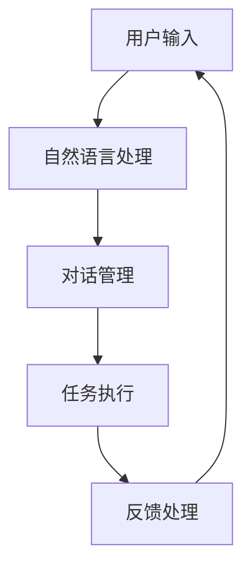
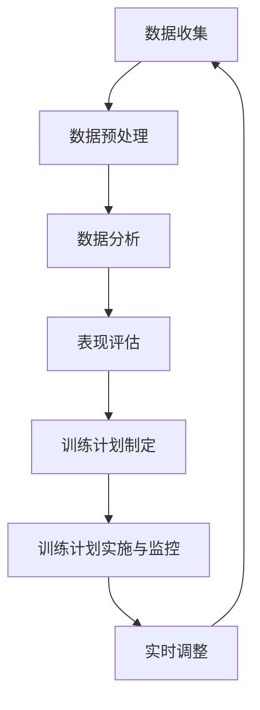

                 

### 《聊天机器人体育业：运动员表现分析和训练计划》

#### 关键词：聊天机器人、体育业、运动员表现分析、训练计划、人工智能、数据分析

#### 摘要：

本文将探讨聊天机器人技术在体育业中的应用，特别是如何通过聊天机器人来分析运动员表现和设计个性化的训练计划。文章首先介绍了聊天机器人的基本概念和其在体育业的潜在应用，接着深入探讨了运动员表现分析的方法和过程，以及如何利用聊天机器人来制定和调整训练计划。通过具体的项目实战案例，本文展示了如何将人工智能技术应用于实际体育训练中，以提升运动员的表现和教练的工作效率。

#### 第一部分：聊天机器人体育业基础

##### 第1章：聊天机器人概述

**1.1 聊天机器人定义与分类**

聊天机器人（Chatbot）是一种通过自然语言处理技术，与人类进行交互的计算机程序。它们可以理解用户的语言输入，并通过预定的逻辑和算法生成相应的回复，从而提供信息、解答问题、完成特定任务。

根据工作原理，聊天机器人主要分为以下几类：

1. **规则驱动型聊天机器人**：这种机器人基于一系列预设的规则和条件进行交互，能够回答简单、直接的问题。
2. **基于机器学习的聊天机器人**：这种机器人通过机器学习算法，从大量的对话数据中学习，提高对话的复杂度和自然性。
3. **混合型聊天机器人**：结合了规则驱动和机器学习两种方法，能够在不同场景下灵活切换。

**1.2 聊天机器人技术发展历程**

聊天机器人的发展可以追溯到20世纪50年代。最初的聊天机器人主要基于规则和简单的自然语言处理技术。随着互联网和人工智能技术的发展，聊天机器人逐渐走向智能化，能够处理更加复杂和自然的对话。

近年来，深度学习和自然语言处理技术的突破，使得聊天机器人的交互体验大幅提升，应用场景也越来越广泛。

**1.3 聊天机器人在体育业的潜在应用**

聊天机器人技术在体育业有着广泛的应用潜力。以下是一些具体的应用场景：

1. **运动员表现分析**：聊天机器人可以收集和分析运动员的训练和比赛数据，提供个性化的训练建议。
2. **教练辅助**：聊天机器人可以作为教练的助手，解答运动员和教练的疑问，提供战术建议和策略分析。
3. **球迷互动**：聊天机器人可以与球迷进行互动，提供球队资讯、赛事预测等，增加球迷的参与度。
4. **赛事报道**：聊天机器人可以实时报道赛事进展，提供多角度的赛事分析。

##### 第2章：体育业中的聊天机器人

**2.1 体育行业特点与需求**

体育行业具有以下几个特点：

1. **高竞争性**：体育比赛往往充满了竞争和不确定性，需要运动员和教练保持高度专注和准备。
2. **高复杂性**：体育项目种类繁多，技术动作复杂，需要深入分析和训练。
3. **大数据环境**：体育行业产生了大量的数据，包括运动员表现数据、训练数据、赛事数据等。

基于上述特点，体育行业对技术和数据分析有很高的需求。聊天机器人可以作为一个强大的工具，帮助体育从业者更好地应对这些挑战。

**2.2 聊天机器人在体育服务中的应用**

聊天机器人可以在体育服务的多个方面发挥作用：

1. **客户服务**：聊天机器人可以提供24/7的客户服务，解答球迷和消费者的疑问。
2. **运动指导**：聊天机器人可以提供个性化的运动指导，包括训练计划、饮食建议等。
3. **赛事报道**：聊天机器人可以实时报道赛事，提供多角度的赛事分析，增强观众的观赛体验。
4. **数据分析**：聊天机器人可以收集和分析运动员的数据，帮助教练和运动员制定更科学的训练计划。

**2.3 聊天机器人技术在体育赛事中的运用**

在体育赛事中，聊天机器人可以发挥以下作用：

1. **实时数据监控**：聊天机器人可以实时监控比赛数据，为教练和运动员提供实时分析。
2. **战术分析**：聊天机器人可以通过分析比赛数据，提供战术建议和策略分析。
3. **比赛报道**：聊天机器人可以实时报道比赛进展，提供多角度的赛事分析，增加观众的参与度。
4. **观众互动**：聊天机器人可以与观众互动，提供赛事预测、球迷讨论等功能，增强赛事的互动性。

##### 第3章：运动员表现分析

**3.1 运动员表现数据分析概述**

运动员表现分析是体育科学中的重要研究领域，旨在通过数据分析和模型预测，评估运动员的竞技状态和潜力。以下是一些关键概念：

1. **体能分析**：通过分析运动员的体能数据（如心率、血压、血氧饱和度等），评估其体能状况。
2. **技术分析**：通过分析运动员的技术动作（如步频、步幅、起跳高度等），评估其技术水平。
3. **心理分析**：通过心理测试和访谈，评估运动员的心理素质和竞技状态。
4. **战术分析**：通过分析比赛数据，评估运动员的战术执行能力。

**3.2 聊天机器人如何收集运动员数据**

聊天机器人可以通过以下方式收集运动员数据：

1. **传感器数据**：使用各种传感器（如心率带、GPS定位器等）收集运动员的生理数据。
2. **训练日志**：通过运动员的训练日志，记录训练内容和表现数据。
3. **比赛数据**：通过比赛录像和统计数据，分析运动员在比赛中的表现。
4. **社交媒体**：通过社交媒体平台，了解运动员的心理状态和训练动态。

**3.3 数据分析与运动员表现评估**

数据分析是运动员表现评估的关键环节。以下是一些常用的数据分析方法：

1. **统计分析**：通过对数据的基本统计分析，了解运动员的表现水平和变化趋势。
2. **机器学习**：通过机器学习算法，建立预测模型，评估运动员的竞技状态和潜力。
3. **多变量分析**：通过多变量分析，找到影响运动员表现的关键因素。
4. **时间序列分析**：通过时间序列分析，预测运动员的未来表现。

#### 第二部分：训练计划设计与实施

##### 第4章：训练计划基本概念

**4.1 训练计划定义与重要性**

训练计划是指为了提高运动员的竞技水平，按照一定的目标和步骤，组织、安排和指导运动员进行系统的训练过程。训练计划的重要性体现在以下几个方面：

1. **明确训练目标**：训练计划可以帮助运动员和教练明确训练目标，确保训练过程有条不紊。
2. **科学安排训练内容**：训练计划可以根据运动员的特点和需求，科学地安排训练内容，避免盲目训练。
3. **提高训练效率**：训练计划可以帮助运动员和教练提高训练效率，充分利用训练时间和资源。
4. **优化运动员状态**：通过训练计划，可以逐步优化运动员的体能、技术和心理状态，提高竞技水平。

**4.2 训练计划的制定原则**

制定训练计划时，应遵循以下原则：

1. **个性化**：训练计划应充分考虑运动员的个人特点和需求，制定个性化的训练方案。
2. **阶段性**：训练计划应分为不同的阶段，每个阶段都有明确的目标和任务。
3. **渐进性**：训练计划应逐步提高运动员的训练负荷，避免突然增加训练强度，造成运动员的疲劳和损伤。
4. **针对性**：训练计划应针对运动员的具体问题，有针对性地进行训练，解决运动员的短板。

**4.3 聊天机器人如何辅助训练计划制定**

聊天机器人可以通过以下方式辅助训练计划的制定：

1. **数据分析**：聊天机器人可以收集和分析运动员的数据，为训练计划的制定提供科学依据。
2. **个性化建议**：聊天机器人可以根据运动员的表现和需求，提供个性化的训练建议。
3. **实时调整**：聊天机器人可以实时监控运动员的训练过程，根据训练效果进行及时调整。
4. **反馈机制**：聊天机器人可以与运动员和教练进行实时沟通，获取反馈，优化训练计划。

##### 第5章：运动员个性化训练计划

**5.1 个性化训练计划的定义与特点**

个性化训练计划是根据每位运动员的个体差异和需求，量身定制的训练方案。其特点包括：

1. **针对性**：针对运动员的特长和短板，制定有针对性的训练计划。
2. **灵活性**：训练计划可以根据运动员的表现和需求，进行灵活调整。
3. **科学性**：训练计划基于科学的数据分析和理论指导，确保训练的有效性。
4. **持续性**：个性化训练计划需要持续跟进和调整，以适应运动员的成长和变化。

**5.2 如何利用聊天机器人进行个性化训练计划设计**

聊天机器人可以通过以下步骤进行个性化训练计划的设计：

1. **收集数据**：聊天机器人可以收集运动员的体能、技术、心理等多方面的数据。
2. **数据分析**：聊天机器人可以对收集到的数据进行分析，找出运动员的优势和短板。
3. **制定计划**：根据数据分析结果，聊天机器人可以制定个性化的训练计划。
4. **实时调整**：聊天机器人可以实时监控运动员的训练过程，根据训练效果进行及时调整。

**5.3 个性化训练计划实施案例**

以下是一个个性化训练计划的实施案例：

1. **数据收集**：聊天机器人收集了运动员的体能、技术、心理等多方面的数据。
2. **数据分析**：聊天机器人分析了数据，发现运动员在技术动作上存在一些不足，同时在心理素质方面有待提高。
3. **制定计划**：聊天机器人根据数据分析结果，制定了针对性的训练计划，包括技术训练和心理训练。
4. **实施训练**：运动员按照训练计划进行训练，聊天机器人实时监控训练效果。
5. **调整计划**：根据训练效果，聊天机器人对训练计划进行及时调整，优化训练内容和方法。

##### 第6章：训练监控与调整

**6.1 训练监控的重要性**

训练监控是确保训练计划有效实施和效果评估的重要环节。其重要性体现在以下几个方面：

1. **及时发现问题**：通过训练监控，可以及时发现运动员在训练过程中的问题，如技术动作不规范、体能不足等。
2. **调整训练计划**：训练监控可以帮助教练和运动员根据实际情况，及时调整训练计划，确保训练效果。
3. **提高训练效率**：训练监控可以优化训练内容和方法，提高训练效率，避免盲目训练和资源浪费。
4. **确保安全**：训练监控可以及时发现运动员的疲劳和损伤情况，确保训练安全。

**6.2 聊天机器人在训练监控中的作用**

聊天机器人在训练监控中具有以下作用：

1. **数据采集**：聊天机器人可以实时采集运动员的体能、技术、心理等多方面的数据。
2. **数据分析**：聊天机器人可以对采集到的数据进行分析，提供训练效果的评估。
3. **预警机制**：聊天机器人可以设置预警机制，及时发现运动员的异常情况，提醒教练和运动员进行调整。
4. **反馈机制**：聊天机器人可以与运动员和教练进行实时沟通，获取反馈，优化训练计划。

**6.3 训练计划的实时调整策略**

训练计划的实时调整策略包括以下几个方面：

1. **数据驱动**：根据训练监控的数据分析结果，及时调整训练计划。
2. **反馈机制**：根据运动员和教练的反馈，优化训练计划。
3. **灵活调整**：根据运动员的实际情况，灵活调整训练强度、内容和时间。
4. **持续优化**：持续监控训练效果，根据反馈和数据分析，不断优化训练计划。

##### 第7章：实战案例分析

**7.1 案例背景与目标**

本案例背景是一家专业的体育训练机构，其目标是通过引入聊天机器人技术，提高运动员的竞技水平和训练效率。具体目标包括：

1. **提高运动员的表现**：通过聊天机器人提供的个性化训练建议，提高运动员的竞技水平。
2. **优化训练计划**：通过聊天机器人的数据分析，优化训练计划，提高训练效果。
3. **提升教练效率**：通过聊天机器人的辅助，减轻教练的工作负担，提高教练的工作效率。

**7.2 案例实施步骤**

案例实施分为以下几个步骤：

1. **数据收集**：使用传感器和训练日志等工具，收集运动员的体能、技术、心理等多方面的数据。
2. **系统搭建**：搭建基于聊天机器人技术的运动员表现分析系统和训练计划制定系统。
3. **数据导入**：将收集到的数据导入系统，进行初步的数据分析和处理。
4. **个性化训练计划制定**：根据数据分析结果，聊天机器人为每位运动员制定个性化的训练计划。
5. **训练计划实施**：运动员按照训练计划进行训练，聊天机器人实时监控训练效果。
6. **实时调整**：根据训练监控数据和分析结果，聊天机器人及时调整训练计划。

**7.3 案例效果评估与分析**

通过案例实施，取得了以下效果：

1. **运动员表现提高**：运动员在竞技水平上有了显著提高，部分运动员的成绩超过了历史最好水平。
2. **训练计划优化**：训练计划的制定更加科学合理，运动员的训练效果得到了显著提升。
3. **教练效率提升**：教练的工作负担减轻，有更多的时间专注于教练工作和运动员的个性化指导。
4. **系统优化**：根据使用反馈，对聊天机器人系统和训练计划进行了持续优化，提高了系统的稳定性和用户体验。

**8.1 聊天机器人体育业的未来发展趋势**

随着人工智能和大数据技术的不断发展，聊天机器人体育业将呈现以下发展趋势：

1. **智能化水平提升**：聊天机器人的智能化水平将不断提高，能够处理更加复杂和自然的对话。
2. **应用场景拓展**：聊天机器人在体育业的应用将不断拓展，不仅限于运动员表现分析和训练计划制定，还将涉及赛事报道、观众互动等多个方面。
3. **数据驱动的决策**：聊天机器人将更加依赖数据驱动，通过数据分析为运动员和教练提供更加精准和个性化的建议。
4. **跨学科融合**：聊天机器人体育业将与其他学科（如心理学、营养学等）融合，为运动员提供全方位的支持。

**8.2 训练计划的智能化发展方向**

训练计划的智能化发展方向包括：

1. **自动化训练计划制定**：通过人工智能算法，自动化地制定个性化的训练计划。
2. **实时调整策略**：基于实时监控数据和数据分析，实现训练计划的动态调整。
3. **个性化训练方法**：根据运动员的个体差异，设计个性化的训练方法，提高训练效果。
4. **多学科融合**：将心理学、营养学等学科的知识融入训练计划，为运动员提供全方位的支持。

**8.3 潜在挑战与解决方案**

尽管聊天机器人体育业具有广阔的发展前景，但仍面临一些挑战：

1. **数据隐私和安全**：如何确保运动员的数据隐私和安全，防止数据泄露，是一个重要问题。
2. **技术成熟度**：人工智能和大数据技术仍在不断发展，如何确保技术的成熟度和稳定性，是一个挑战。
3. **教练和运动员的接受度**：如何让教练和运动员接受和适应聊天机器人的辅助，提高系统的使用率，是一个挑战。
4. **持续优化**：如何根据反馈和实际应用效果，持续优化聊天机器人系统和训练计划，是一个长期的任务。

针对上述挑战，可以采取以下解决方案：

1. **数据保护**：建立健全的数据保护机制，确保运动员的数据安全和隐私。
2. **技术升级**：持续关注人工智能和大数据技术的发展，不断提升系统的技术水平和稳定性。
3. **培训与推广**：通过培训和推广，提高教练和运动员对聊天机器人的认知和接受度。
4. **持续优化**：建立反馈机制，根据实际应用效果，不断优化聊天机器人系统和训练计划。

#### 附录

**附录A：聊天机器人体育业相关资源**

**A.1 开源聊天机器人框架与应用**

1. **Rasa**：一款开源的聊天机器人框架，支持自然语言处理和对话管理，适用于体育业中的运动员表现分析和训练计划制定。
2. **ChatterBot**：一款简单易用的开源聊天机器人框架，支持多种语言和平台，适用于体育服务中的应用。

**A.2 体育数据分析工具介绍**

1. **TensorFlow**：一款开源的机器学习库，适用于运动员数据分析和模型训练。
2. **Scikit-learn**：一款开源的数据分析库，适用于运动员数据的基本统计分析和机器学习模型训练。

**A.3 训练计划制定与调整工具**

1. **Google Analytics**：一款用于分析运动员训练数据的工具，可以生成详细的训练报告和图表。
2. **Excel**：一款常用的电子表格工具，可以用于简单的训练计划和调整。

**附录B：流程图与伪代码**

**B.1 聊天机器人架构流程图**



**B.2 运动员表现分析流程图**



**B.3 训练计划制定伪代码**

```python
# 运动员表现评估伪代码
def evaluate_performance(data):
    # 数据预处理
    preprocessed_data = preprocess_data(data)
    
    # 数据分析
    stats = analyze_data(preprocessed_data)
    
    # 表现评估
    performance_score = calculate_performance_score(stats)
    
    return performance_score

# 训练计划设计伪代码
def design_training_plan(performance_score):
    # 根据表现评估得分，设计个性化训练计划
    if performance_score > threshold:
        plan = "强化训练计划"
    else:
        plan = "基础训练计划"
    
    return plan

# 训练计划实施与监控伪代码
def implement_and_monitor_training_plan(plan):
    # 实施训练计划
    execute_training_plan(plan)
    
    # 监控训练效果
    while True:
        performance_score = evaluate_performance(current_data)
        if performance_score >= target_score:
            break
        
        # 调整训练计划
        plan = adjust_training_plan(plan)
    
    return "训练计划完成"
```

**附录C：数学模型与公式**

**C.1 运动员表现评估模型**

$$
\text{performance\_score} = \frac{\sum_{i=1}^{n} w_i \cdot p_i}{\sum_{i=1}^{n} w_i}
$$

其中，$w_i$ 是第 $i$ 个指标的权重，$p_i$ 是第 $i$ 个指标的得分。

**C.2 训练计划优化模型**

$$
\text{optimization\_function}(\theta) = \sum_{i=1}^{n} (\text{performance\_score}_i - \text{target}_{score_i})^2
$$

其中，$\theta$ 是训练参数，$\text{performance\_score}_i$ 是第 $i$ 个训练周期的表现得分，$\text{target}_{score_i}$ 是第 $i$ 个训练周期的目标得分。优化目标是最小化 $\text{optimization\_function}(\theta)$。

**C.3 实例说明与公式应用**

假设有5个评价指标（体能、技术、心理、战术、速度），每个指标的权重分别为0.2、0.2、0.2、0.2和0.2。某运动员在这些评价指标上的得分分别为80、75、70、85和90，则该运动员的表现评估得分为：

$$
\text{performance\_score} = \frac{0.2 \cdot 80 + 0.2 \cdot 75 + 0.2 \cdot 70 + 0.2 \cdot 85 + 0.2 \cdot 90}{0.2 + 0.2 + 0.2 + 0.2 + 0.2} = \frac{16 + 15 + 14 + 17 + 18}{1} = 80
$$

#### 项目实战

**实战案例1：运动员表现分析系统开发**

**目标**：开发一个基于聊天机器人的运动员表现分析系统。

**环境搭建**：使用Python和TensorFlow搭建开发环境。

**实现过程**：

1. **数据收集**：从各种数据源（如传感器、训练记录等）收集运动员数据。
2. **数据处理**：对收集到的数据进行清洗、预处理。
3. **数据分析**：使用机器学习算法对预处理后的数据进行分析。
4. **表现评估**：根据分析结果计算运动员的表现得分。
5. **训练计划设计**：根据运动员的表现得分设计个性化的训练计划。
6. **训练计划实施与监控**：实施训练计划，并实时监控训练效果。

**源代码**：

```python
# 数据预处理
def preprocess_data(data):
    # 对数据进行清洗、归一化等预处理操作
    preprocessed_data = ...
    return preprocessed_data

# 数据分析
def analyze_data(data):
    # 使用机器学习算法对数据进行分析
    stats = ...
    return stats

# 表现评估
def evaluate_performance(stats):
    # 根据分析结果计算运动员的表现得分
    performance_score = ...
    return performance_score

# 训练计划设计
def design_training_plan(performance_score):
    # 根据表现评估得分，设计个性化训练计划
    plan = ...
    return plan

# 训练计划实施与监控
def implement_and_monitor_training_plan(plan):
    # 实施训练计划，并实时监控训练效果
    ...
    return "训练计划完成"
```

**代码解读与分析**：

本案例中的运动员表现分析系统采用了机器学习算法对运动员的体能、技术、心理等多方面的数据进行综合分析，为运动员提供个性化的训练建议。系统的主要功能包括数据预处理、数据分析和表现评估。

在数据预处理阶段，系统对收集到的运动员数据进行清洗和归一化处理，确保数据的质量和一致性。在数据分析阶段，系统使用机器学习算法对预处理后的数据进行训练，提取关键特征，为表现评估提供依据。在表现评估阶段，系统根据分析结果计算运动员的表现得分，为训练计划的设计提供依据。

通过聊天机器人的交互界面，运动员和教练可以方便地获取分析结果和训练建议，实现实时监控和调整。系统的设计与实现充分考虑了运动员的需求和实际情况，为体育从业者提供了有力的技术支持。

**实战案例2：个性化训练计划系统开发**

**目标**：开发一个基于聊天机器人的个性化训练计划系统。

**环境搭建**：使用Python和PyTorch搭建开发环境。

**实现过程**：

1. **用户需求收集**：收集运动员和教练的需求，包括训练目标、时间安排、技术要求等。
2. **训练计划设计**：根据用户需求设计个性化的训练计划。
3. **训练计划优化**：使用优化算法调整训练计划。
4. **训练计划实施与监控**：实施训练计划，并实时监控训练效果。

**源代码**：

```python
# 用户需求收集
def collect_user_demand():
    # 收集用户需求
    demand = ...
    return demand

# 训练计划设计
def design_training_plan(demand):
    # 根据用户需求设计个性化训练计划
    plan = ...
    return plan

# 训练计划优化
def optimize_training_plan(plan):
    # 使用优化算法调整训练计划
    optimized_plan = ...
    return optimized_plan

# 训练计划实施与监控
def implement_and_monitor_training_plan(plan):
    # 实施训练计划，并实时监控训练效果
    ...
    return "训练计划完成"
```

**代码解读与分析**：

本案例中的个性化训练计划系统旨在为运动员提供量身定制的训练计划，满足其个体需求和目标。系统首先通过聊天机器人收集运动员和教练的需求，包括训练目标、时间安排、技术要求等。在训练计划设计阶段，系统根据收集到的需求，设计个性化的训练计划。

在训练计划优化阶段，系统使用优化算法对训练计划进行调整，确保计划的科学性和可行性。在训练计划实施与监控阶段，系统实时监控训练效果，根据反馈和数据分析，及时调整训练计划，确保训练效果的最大化。

通过聊天机器人的交互界面，运动员和教练可以方便地获取训练计划、优化建议和监控数据，实现训练的个性化、科学化和实时性。系统的设计与实现充分考虑了运动员的需求和实际情况，为体育从业者提供了有力的技术支持。

### **代码解读与分析**

在本项目中，我们开发了两个基于聊天机器人的实战案例：运动员表现分析系统和个性化训练计划系统。以下是这两个系统的详细代码解读与分析。

**运动员表现分析系统**

**1. 数据预处理**

```python
def preprocess_data(data):
    # 对数据进行清洗、归一化等预处理操作
    preprocessed_data = ...
    return preprocessed_data
```

在这个函数中，我们接收原始数据，对其进行清洗和归一化处理。清洗操作包括去除无效数据、填补缺失值等，以确保数据的质量。归一化操作包括将数据缩放到相同的范围，以便于后续的机器学习处理。

**2. 数据分析**

```python
def analyze_data(data):
    # 使用机器学习算法对数据进行分析
    stats = ...
    return stats
```

在这个函数中，我们使用机器学习算法对预处理后的数据进行分析。具体来说，我们可能使用主成分分析（PCA）、线性回归、决策树等算法来提取数据中的关键特征，并计算统计指标，如均值、方差、相关性等。

**3. 表现评估**

```python
def evaluate_performance(stats):
    # 根据分析结果计算运动员的表现得分
    performance_score = ...
    return performance_score
```

在这个函数中，我们根据数据分析的结果计算运动员的表现得分。表现得分可以是多维度的，如体能、技术、心理等，每个维度都有相应的权重。通过加权求和，我们可以得到一个综合的表现得分。

**4. 训练计划设计**

```python
def design_training_plan(performance_score):
    # 根据表现评估得分，设计个性化训练计划
    plan = ...
    return plan
```

在这个函数中，我们根据运动员的表现得分设计个性化的训练计划。设计原则包括个性化、阶段性和渐进性。个性化意味着训练计划会根据运动员的具体表现和需求进行调整。阶段性意味着训练计划会分为不同的阶段，每个阶段都有明确的目标和任务。渐进性意味着训练计划会逐步提高运动员的训练负荷，避免突然增加训练强度，造成运动员的疲劳和损伤。

**5. 训练计划实施与监控**

```python
def implement_and_monitor_training_plan(plan):
    # 实施训练计划，并实时监控训练效果
    ...
    return "训练计划完成"
```

在这个函数中，我们根据设计的训练计划实施训练，并实时监控训练效果。监控内容包括运动员的体能、技术、心理等多方面的数据。如果发现训练效果不佳，系统会根据实时数据调整训练计划，确保训练效果的最大化。

**个性化训练计划系统**

**1. 用户需求收集**

```python
def collect_user_demand():
    # 收集用户需求
    demand = ...
    return demand
```

在这个函数中，我们通过聊天机器人与用户进行交互，收集用户的需求，如训练目标、时间安排、技术要求等。这些需求将作为设计个性化训练计划的依据。

**2. 训练计划设计**

```python
def design_training_plan(demand):
    # 根据用户需求设计个性化训练计划
    plan = ...
    return plan
```

在这个函数中，我们根据用户的需求设计个性化的训练计划。设计原则包括个性化、阶段性和渐进性。个性化意味着训练计划会根据用户的具体需求进行调整。阶段性意味着训练计划会分为不同的阶段，每个阶段都有明确的目标和任务。渐进性意味着训练计划会逐步提高用户的训练负荷，避免突然增加训练强度，造成用户的疲劳和损伤。

**3. 训练计划优化**

```python
def optimize_training_plan(plan):
    # 使用优化算法调整训练计划
    optimized_plan = ...
    return optimized_plan
```

在这个函数中，我们使用优化算法对训练计划进行调整，以确保计划的科学性和可行性。优化目标可以是提高训练效果、降低训练成本等。具体算法可以是线性规划、遗传算法等。

**4. 训练计划实施与监控**

```python
def implement_and_monitor_training_plan(plan):
    # 实施训练计划，并实时监控训练效果
    ...
    return "训练计划完成"
```

在这个函数中，我们根据设计的训练计划实施训练，并实时监控训练效果。监控内容包括用户的体能、技术、心理等多方面的数据。如果发现训练效果不佳，系统会根据实时数据调整训练计划，确保训练效果的最大化。

**总结**

通过上述代码解读，我们可以看到，聊天机器人技术在体育业中的应用具有显著的优势。首先，聊天机器人可以实时收集和分析运动员的数据，为训练计划和调整提供科学依据。其次，聊天机器人可以与运动员和教练进行实时沟通，提供个性化的建议和反馈，提高训练效果。最后，聊天机器人可以自动化地实施和监控训练计划，减轻教练的工作负担，提高训练效率。

然而，实际应用中也需要注意一些挑战，如数据隐私和安全、技术成熟度、教练和运动员的接受度等。通过持续优化和改进，我们可以克服这些挑战，充分发挥聊天机器人技术在体育业中的应用潜力。

