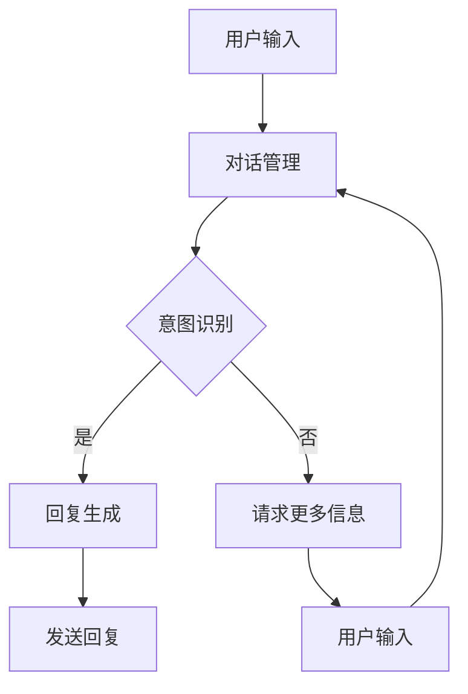
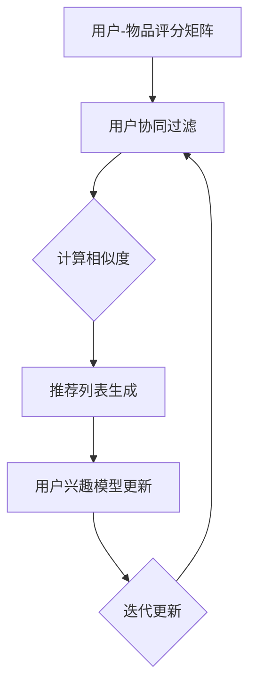
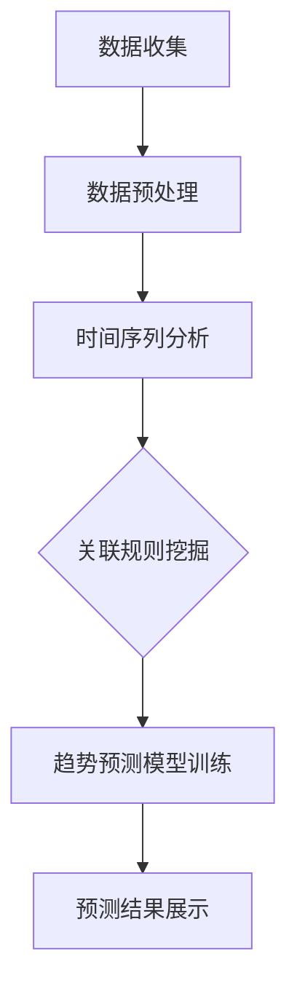

                 

# 《聊天机器人时尚业：趋势预测和个性化推荐》

## 关键词

聊天机器人，时尚业，趋势预测，个性化推荐，用户行为分析，自然语言处理，人工智能，大数据分析，用户体验优化，行业应用案例。

## 摘要

本文深入探讨了聊天机器人在时尚业的应用及其在趋势预测和个性化推荐方面的作用。通过对时尚行业现状和消费者行为变化的详细分析，我们阐述了聊天机器人在提升用户体验、提高运营效率和增强品牌互动等方面的优势。随后，本文从数据来源与处理、趋势预测方法以及个性化推荐算法等角度，详细讲解了聊天机器人如何通过技术手段实现时尚趋势预测和个性化推荐。同时，文章还探讨了聊天机器人在时尚业的实际应用案例，并对未来发展趋势与挑战进行了展望。最后，通过国内外成功案例的研究，本文总结了聊天机器人在时尚业应用中的启示与建议，为行业从业者提供了有益的参考。

### 第一部分：行业背景与趋势分析

#### 第1章：时尚业与聊天机器人的融合

## 1.1 时尚行业的现状与挑战

### 1.1.1 时尚产业的消费者行为变化

随着信息技术的飞速发展，时尚产业的消费者行为也发生了显著变化。首先，消费者对时尚产品的需求变得更加个性化。传统的大众化消费模式已无法满足消费者对于独特、个性化产品的追求。根据《2019年中国消费者趋势报告》，超过70%的受访者表示他们更喜欢购买与众不同的商品，这一趋势在年轻人群体中尤为明显。

其次，消费者在购买过程中越来越注重购物体验。电子商务的兴起虽然为消费者提供了更多的购物选择，但也带来了信息过载和选择困难的问题。因此，消费者开始寻求更加便捷、高效的购物体验。聊天机器人的出现，为消费者提供了24/7的在线咨询和个性化服务，满足了消费者对于即时性和互动性的需求。

此外，社交媒体和移动设备的使用也对消费者行为产生了深远影响。消费者不仅通过社交媒体获取时尚资讯，还通过与品牌的直接互动来建立情感联系。根据《2020年全球时尚报告》，超过60%的消费者通过社交媒体平台关注品牌动态，近一半的消费者通过社交媒体获取购物灵感。

### 1.1.2 时尚产业的市场细分与个性化需求

时尚产业的市场细分日益明显，不同消费群体的需求差异越来越大。年轻消费者注重时尚、个性和创新，而中老年消费者则更关注品质、舒适度和实用性。这种市场细分要求时尚品牌能够提供更加个性化的产品和服务。

个性化需求不仅体现在产品上，也体现在购物体验上。消费者希望购物过程能够根据他们的个人喜好和购物习惯进行定制。例如，通过聊天机器人，消费者可以与机器人进行互动，分享他们的购物偏好，从而获得更加精准的推荐。

### 1.1.3 聊天机器人在时尚业的应用现状

聊天机器人技术在时尚业的应用已经取得了一定的进展。许多时尚品牌已经开始使用聊天机器人来提供客户服务，例如处理订单查询、退货退款等常见问题。此外，一些品牌还利用聊天机器人进行市场调研和品牌推广。

例如，法国时尚品牌Chloé在其官方网站上引入了聊天机器人，消费者可以通过聊天机器人获取产品信息、预订试穿以及参与品牌活动。根据Chloé的统计数据，引入聊天机器人后，用户咨询问题的响应速度提升了30%，用户满意度也显著提高。

另一个例子是品牌Gucci，其通过Facebook Messenger推出的聊天机器人，不仅提供客户服务，还能根据用户的历史购买记录和偏好，提供个性化的时尚建议。这一举措帮助Gucci增加了40%的社交媒体互动量。

### 1.2 聊天机器人在时尚业的优势

#### 1.2.1 提升用户体验

聊天机器人的引入显著提升了消费者的购物体验。首先，聊天机器人可以提供即时响应，减少了消费者等待的时间。其次，聊天机器人可以记住消费者的偏好和购买历史，提供更加个性化的服务和建议。例如，当消费者询问某个产品时，聊天机器人可以迅速提供相关信息，包括产品的详细信息、用户评价和库存情况。

此外，聊天机器人还可以通过自然语言处理技术，理解消费者的情感和需求，提供更加人性化的服务。例如，当消费者表达不满时，聊天机器人可以识别出负面情绪，并采取适当的措施解决问题。

#### 1.2.2 提高运营效率

聊天机器人还能够提高时尚品牌的运营效率。通过自动化处理常见问题，聊天机器人可以释放员工的精力，让他们专注于更高价值的任务。例如，零售商可以使用聊天机器人处理订单跟踪和客户咨询，从而减少人工干预的需求。

此外，聊天机器人还可以通过数据分析，帮助品牌了解消费者的行为和需求，从而优化产品和服务。例如，通过分析消费者的提问频率和问题类型，品牌可以识别出消费者最关注的问题，并针对性地改进产品说明和服务流程。

#### 1.2.3 增强品牌互动

聊天机器人为时尚品牌提供了新的互动渠道，使得品牌能够更加直接地与消费者建立联系。通过聊天机器人，品牌可以及时回应消费者的疑问和反馈，增强品牌的亲和力和忠诚度。

例如，一些品牌通过聊天机器人与消费者进行实时互动，分享新品发布、品牌活动等信息。这不仅提高了消费者的参与度，还增强了品牌的影响力和市场竞争力。

### 1.3 时尚业趋势预测

#### 1.3.1 时尚消费趋势预测方法

时尚消费趋势预测是时尚品牌成功的关键。以下是一些常用的预测方法：

1. **时间序列分析**：通过分析历史销售数据，识别出季节性、周期性和趋势性变化，预测未来的消费趋势。

2. **关联规则挖掘**：通过分析不同产品之间的关联关系，识别出消费者购买行为中的潜在模式，从而预测未来的消费趋势。

3. **文本分析**：通过分析社交媒体、新闻媒体等文本数据，提取出消费者对于时尚产品的态度和意见，从而预测未来的消费趋势。

4. **机器学习模型**：利用大数据和机器学习算法，建立消费者行为预测模型，预测未来的消费趋势。

#### 1.3.2 个性化推荐技术的应用

个性化推荐技术在时尚行业中具有广泛的应用。通过分析消费者的行为数据，个性化推荐技术可以提供更加精准的产品推荐，提高消费者的购买转化率。

1. **基于内容的推荐**：根据产品的属性和特征，将相似的产品推荐给消费者。

2. **基于协同过滤的推荐**：根据消费者的历史行为和偏好，推荐消费者可能喜欢的产品。

3. **混合推荐**：结合基于内容和基于协同过滤的方法，提供更加个性化的推荐。

#### 1.3.3 跨界合作与多元化发展

时尚业正朝着多元化发展的方向迈进。跨界合作成为时尚品牌拓展市场、吸引消费者的重要策略。以下是一些跨界合作的例子：

1. **科技与时尚的结合**：时尚品牌与科技公司合作，推出智能时尚产品，如智能手表、智能手环等。

2. **文化元素的融合**：时尚品牌通过与艺术家、设计师合作，将文化元素融入产品设计中，创造出独特的时尚产品。

3. **线上线下融合**：通过线上线下相结合的渠道策略，提供更加便捷的购物体验，满足消费者的多元化需求。

### 第二部分：趋势预测与个性化推荐技术

#### 第2章：趋势预测与时尚分析

## 2.1 数据来源与处理

### 2.1.1 时尚数据来源

时尚数据来源广泛，包括销售数据、社交媒体数据、用户评论数据等。以下是一些常用的时尚数据来源：

1. **销售数据**：来自电商平台、实体店铺的销售记录，包括销售额、销售量、季节性变化等。

2. **社交媒体数据**：包括微博、微信、Instagram、Twitter等社交媒体平台上的用户评论、点赞、转发等信息。

3. **用户评论数据**：来自电商平台、社交媒体的用户评论，反映消费者对产品的态度和意见。

4. **行业报告**：行业分析报告、市场调研报告等，提供关于时尚行业趋势的宏观分析。

### 2.1.2 数据预处理方法

在趋势预测和个性化推荐中，数据预处理是关键步骤。以下是一些常见的数据预处理方法：

1. **数据清洗**：去除重复数据、缺失值填充、异常值处理等。

2. **数据归一化**：将不同量纲的数据转换为相同量纲，便于后续分析。

3. **特征提取**：从原始数据中提取有用的信息，用于训练模型。

4. **时间序列分解**：将时间序列数据分解为趋势、季节性和随机性成分，便于分析。

### 2.1.3 数据质量评估

数据质量直接影响趋势预测和个性化推荐的准确性。以下是一些常见的数据质量评估方法：

1. **数据完整性**：评估数据中缺失值的比例。

2. **数据一致性**：评估数据中的重复值和矛盾值。

3. **数据准确性**：评估数据的真实性和准确性。

4. **数据时效性**：评估数据的更新频率和时效性。

## 2.2 趋势预测方法

### 2.2.1 时间序列分析方法

时间序列分析是趋势预测的重要方法。以下是一些常见的时间序列分析方法：

1. **移动平均法**：通过计算一定时间范围内的平均值，平滑时间序列数据，识别出趋势。

2. **指数平滑法**：对时间序列数据进行加权平均，更加关注近期数据，识别出趋势。

3. **ARIMA模型**：自回归积分滑动平均模型，通过自回归、差分和移动平均来建模时间序列数据。

4. **季节性分解**：将时间序列分解为趋势、季节性和随机性成分，分别建模。

### 2.2.2 关联规则挖掘技术

关联规则挖掘是识别数据中潜在模式的有效方法。以下是一些常见的关联规则挖掘方法：

1. **Apriori算法**：通过生成候选集和剪枝策略，挖掘频繁项集，生成关联规则。

2. **FP-growth算法**：通过构建FP树，高效挖掘频繁项集，减少计算复杂度。

3. **Eclat算法**：类似于Apriori算法，但不需要生成候选集，直接挖掘频繁项集。

### 2.2.3 强化学习方法

强化学习是预测和优化行为的一种有效方法。以下是一些常见的强化学习方法：

1. **Q-Learning**：通过更新Q值，找到最优策略。

2. **SARSA**：同时更新当前和下一个状态的价值函数。

3. **Deep Q-Network (DQN)**：使用深度神经网络代替Q值函数，实现更加复杂的策略学习。

## 2.3 时尚趋势可视化

### 2.3.1 趋势图的制作

趋势图的制作是展示时尚趋势的重要手段。以下是一些常见的方法：

1. **折线图**：用于展示时间序列数据的变化趋势。

2. **柱状图**：用于比较不同时间点或不同类别的数据。

3. **散点图**：用于展示两个变量之间的关系。

### 2.3.2 交互式数据可视化

交互式数据可视化可以更好地探索和分析数据。以下是一些常用的工具和库：

1. **Tableau**：一款功能强大的数据可视化工具，支持多种图表类型和交互功能。

2. **D3.js**：一款基于JavaScript的库，可以创建自定义的交互式数据可视化。

3. **Plotly**：一款支持多种图表类型和交互功能的库，适用于Web应用。

### 2.3.3 趋势预测结果展示

趋势预测结果展示是评估预测效果的重要环节。以下是一些常见的展示方法：

1. **实际与预测对比图**：将实际销售数据与预测数据对比，评估预测准确性。

2. **决策树或混淆矩阵**：用于展示预测结果的质量和分类效果。

3. **热力图**：用于展示不同类别之间的相关性或密度分布。

### 第3章：个性化推荐算法

## 3.1 个性化推荐系统概述

### 3.1.1 个性化推荐的基本原理

个性化推荐系统旨在为用户提供个性化的产品推荐，提高用户的满意度和转化率。其基本原理如下：

1. **基于内容的推荐**：根据产品的内容和属性，为用户推荐相似的产品。

2. **基于协同过滤的推荐**：根据用户的历史行为和偏好，为用户推荐其他用户喜欢的产品。

3. **混合推荐**：结合基于内容和基于协同过滤的方法，提供更加个性化的推荐。

### 3.1.2 个性化推荐系统的架构

个性化推荐系统通常包括数据层、算法层和应用层。以下是一个典型的个性化推荐系统架构：

1. **数据层**：负责收集、存储和处理用户行为数据、产品数据和外部数据。

2. **算法层**：包括推荐算法的实现，如基于内容的推荐、基于协同过滤的推荐和混合推荐。

3. **应用层**：提供用户界面和交互功能，向用户展示个性化推荐结果。

### 3.1.3 用户体验设计

用户体验设计是个性化推荐系统成功的关键。以下是一些关键点：

1. **简洁明了的界面**：设计简洁明了的界面，使用户能够快速找到推荐结果。

2. **清晰的推荐理由**：提供清晰的推荐理由，帮助用户理解推荐结果。

3. **个性化的推荐结果**：根据用户的行为和偏好，为用户推荐个性化的产品。

## 3.2 内容推荐算法

### 3.2.1 基于内容的推荐算法

基于内容的推荐算法通过分析产品的内容和属性，为用户推荐相似的产品。以下是一些关键步骤：

1. **特征提取**：从产品描述、分类标签等中提取特征。

2. **相似度计算**：计算用户历史购买的产品与候选产品的相似度。

3. **推荐生成**：根据相似度分数，生成推荐列表。

### 3.2.2 基于协同过滤的推荐算法

基于协同过滤的推荐算法通过分析用户的历史行为和偏好，为用户推荐其他用户喜欢的产品。以下是一些关键步骤：

1. **用户相似度计算**：计算用户之间的相似度。

2. **推荐生成**：根据用户相似度和物品的评分，生成推荐列表。

### 3.2.3 混合推荐算法

混合推荐算法结合了基于内容和基于协同过滤的方法，提供更加个性化的推荐。以下是一些关键步骤：

1. **融合策略**：将基于内容和基于协同过滤的推荐结果进行融合。

2. **推荐生成**：根据融合策略，生成推荐列表。

## 3.3 用户行为分析

### 3.3.1 用户行为数据的收集

用户行为数据是个性化推荐系统的重要输入。以下是一些常用的数据收集方法：

1. **日志数据**：记录用户在网站上的浏览、点击、购买等行为。

2. **问卷调查**：通过问卷调查收集用户偏好和需求。

3. **用户反馈**：收集用户对推荐结果的评价和反馈。

### 3.3.2 用户兴趣模型构建

用户兴趣模型是分析用户行为数据，提取用户兴趣的关键步骤。以下是一些关键步骤：

1. **行为序列建模**：将用户行为序列转化为矩阵或向量。

2. **特征提取**：从行为序列中提取特征，如访问频率、时间间隔等。

3. **兴趣模型构建**：使用机器学习算法，构建用户兴趣模型。

### 3.3.3 用户行为预测

用户行为预测是推荐系统的重要任务。以下是一些关键步骤：

1. **行为模式识别**：识别用户行为中的规律和模式。

2. **行为预测模型构建**：使用机器学习算法，构建用户行为预测模型。

3. **行为预测**：根据行为预测模型，预测用户未来的行为。

### 第4章：聊天机器人的设计与实现

## 4.1 聊天机器人的基本架构

### 4.1.1 对话管理

对话管理是聊天机器人的核心功能之一，它负责处理用户输入，理解用户意图，并生成合适的回复。以下是一个基本的对话管理流程：

1. **输入预处理**：对用户输入进行清洗，如去除标点符号、转换大小写等。
2. **意图识别**：使用自然语言处理技术（如分类模型、词嵌入等）识别用户输入的意图。
3. **实体抽取**：从用户输入中提取关键信息（如日期、时间、地点等）。
4. **对话状态跟踪**：记录对话历史，以便在后续对话中参考。

### 4.1.2 自然语言理解

自然语言理解（NLU）是聊天机器人的另一个核心功能，它负责将用户输入的自然语言转换为结构化的数据，以便进行后续处理。以下是一些常见的NLU技术：

1. **词嵌入**：将词汇映射为向量，以便进行计算。
2. **词性标注**：为每个词汇标注词性（名词、动词、形容词等）。
3. **命名实体识别**：识别并标记文本中的特定实体（如人名、地点、组织等）。
4. **关系抽取**：识别并描述文本中的实体关系。

### 4.1.3 自然语言生成

自然语言生成（NLG）是将结构化数据转换为自然语言文本的过程。以下是一些常见的NLG技术：

1. **模板匹配**：根据预定义的模板生成文本。
2. **规则引擎**：使用预定义的规则生成文本。
3. **生成式模型**：使用神经网络生成文本，如序列到序列（Seq2Seq）模型。
4. **知识图谱**：使用知识图谱来生成语义丰富的文本。

## 4.2 聊天机器人开发工具

### 4.2.1 聊天机器人平台选择

在选择聊天机器人平台时，需要考虑多个因素，如功能、易用性、成本等。以下是一些流行的聊天机器人平台：

1. **Twilio**：提供强大的通信API，支持多种聊天机器人功能。
2. **Microsoft Bot Framework**：提供丰富的工具和资源，适用于企业级应用。
3. **IBM Watson Assistant**：提供全面的聊天机器人功能，适用于多种场景。
4. **Google Dialogflow**：易于使用，支持多种编程语言。

### 4.2.2 开发框架与库

在开发聊天机器人时，可以选择多种框架和库，以提高开发效率和代码质量。以下是一些常用的框架和库：

1. **Rasa**：一个开源的聊天机器人框架，提供NLU和NLG功能。
2. **TensorFlow**：一个强大的机器学习库，适用于构建复杂的聊天机器人模型。
3. **SpaCy**：一个快速和易于使用的自然语言处理库，适用于文本处理任务。
4. **NLTK**：一个经典的自然语言处理库，适用于文本分析任务。

### 4.2.3 模块化设计

模块化设计是提高聊天机器人可维护性和可扩展性的有效方法。以下是一些常见的模块化设计原则：

1. **对话管理模块**：负责处理用户输入和生成回复。
2. **NLU模块**：负责理解用户输入，识别意图和实体。
3. **NLG模块**：负责生成自然语言回复。
4. **第三方服务模块**：负责与其他系统（如数据库、API等）交互。

## 4.3 聊天机器人应用场景

### 4.3.1 电商平台

在电商平台，聊天机器人可以提供多种服务，如产品推荐、订单查询、售后服务等。以下是一些应用场景：

1. **产品推荐**：根据用户的历史购买记录和浏览行为，为用户推荐相关的产品。
2. **订单查询**：允许用户查询订单状态，提供订单详情和物流信息。
3. **售后服务**：处理用户关于退货、退款和保修的咨询。

### 4.3.2 社交媒体

在社交媒体平台上，聊天机器人可以与用户进行实时互动，提供个性化内容和活动推荐。以下是一些应用场景：

1. **内容推荐**：根据用户的兴趣和互动历史，推荐相关的文章、视频和产品。
2. **活动推广**：通知用户参与品牌活动，提供活动信息和优惠。
3. **用户互动**：回答用户的问题，增强品牌与用户之间的互动。

### 4.3.3 客户服务

在客户服务领域，聊天机器人可以显著提高服务效率和满意度。以下是一些应用场景：

1. **常见问题解答**：自动回答用户关于产品、订单和售后服务的常见问题。
2. **智能客服**：处理复杂的客户问题，提供个性化解决方案。
3. **客户引导**：帮助用户找到所需的服务和产品，提高转化率。

### 第5章：聊天机器人在时尚业的实际应用

## 5.1 时尚品牌营销

### 5.1.1 品牌定位与内容策略

在时尚品牌营销中，聊天机器人可以成为品牌形象的重要代表，通过个性化的互动提升品牌认知和忠诚度。以下是一些关键策略：

1. **品牌定位**：根据品牌特色和目标市场，明确聊天机器人的品牌形象和风格。
2. **内容策略**：制定与品牌定位一致的内容计划，包括日常互动、活动推广、时尚资讯等。

### 5.1.2 用户互动与粉丝管理

聊天机器人通过实时互动，可以增强用户参与感和品牌忠诚度。以下是一些具体措施：

1. **用户互动**：通过有趣的问题、小游戏和个性化推荐，吸引用户参与互动。
2. **粉丝管理**：建立粉丝群组，定期发布品牌动态和活动信息，提高粉丝活跃度。

### 5.1.3 跨界合作与品牌推广

跨界合作是提升品牌知名度和影响力的有效手段。以下是一些跨界合作策略：

1. **明星合作**：邀请明星代言或参与品牌活动，借助明星效应提升品牌知名度。
2. **活动推广**：与知名品牌或平台合作，共同举办线上或线下活动，扩大品牌影响力。

## 5.2 个性化时尚推荐

### 5.2.1 用户画像构建

构建用户画像是提供个性化推荐的重要步骤。以下是一些关键步骤：

1. **数据收集**：收集用户的基本信息、行为数据和偏好数据。
2. **特征提取**：从原始数据中提取有用的特征，如购买历史、浏览行为、社交媒体互动等。
3. **模型训练**：使用机器学习算法，构建用户画像模型。

### 5.2.2 时尚内容推荐策略

基于用户画像的推荐策略可以提供更加个性化的时尚内容。以下是一些关键策略：

1. **内容推荐**：根据用户画像和时尚趋势，为用户推荐相关的产品、文章和视频。
2. **多模态推荐**：结合文本、图像和视频等多种形式，提供丰富多样的推荐内容。

### 5.2.3 个性化推荐系统优化

为了提高个性化推荐系统的效果，可以采用以下优化策略：

1. **实时反馈**：收集用户对推荐内容的反馈，实时调整推荐策略。
2. **协同过滤**：结合基于内容和基于协同过滤的推荐方法，提高推荐准确性。
3. **深度学习**：使用深度学习模型，提高推荐系统的预测能力。

## 5.3 智能客服与客户服务

### 5.3.1 客户服务流程优化

智能客服可以显著优化客户服务流程，提高服务效率和用户满意度。以下是一些优化策略：

1. **自动化处理**：自动处理常见问题，减少人工干预。
2. **多渠道接入**：支持多种沟通渠道（如电话、邮件、社交媒体等），方便用户咨询。
3. **智能分配**：根据客户需求和技能水平，智能分配客服代表。

### 5.3.2 情感分析与互动策略

情感分析是理解用户情感状态的重要手段。以下是一些关键策略：

1. **情感识别**：使用自然语言处理技术，识别用户输入中的情感倾向。
2. **情感响应**：根据用户情感状态，提供适当的情感化回应，增强用户体验。
3. **情感反馈**：收集用户情感反馈，优化客服流程和策略。

### 5.3.3 用户体验提升

用户体验是客户服务的重要考量因素。以下是一些关键策略：

1. **快速响应**：提高客服响应速度，减少用户等待时间。
2. **个性化服务**：根据用户偏好和需求，提供个性化的服务和建议。
3. **交互优化**：优化用户界面和交互流程，提高用户体验。

### 第四部分：聊天机器人的未来发展与挑战

#### 第6章：聊天机器人与时尚业的未来趋势

## 6.1 新技术的引入

随着人工智能和大数据技术的发展，聊天机器人将在时尚业发挥更大的作用。以下是一些新技术及其潜在影响：

1. **语音识别和语音合成**：语音交互将更加自然和流畅，提升用户体验。
2. **计算机视觉**：通过图像识别和增强现实（AR）技术，提供虚拟试衣和个性化购物体验。
3. **深度学习**：利用深度学习模型，提高聊天机器人的理解能力和推荐准确性。

## 6.2 数据隐私与安全

数据隐私和安全是聊天机器人发展的重要挑战。以下是一些关键措施：

1. **数据加密**：对用户数据进行加密，确保数据传输和存储的安全性。
2. **合规性**：遵循相关法律法规，确保数据处理符合隐私保护要求。
3. **用户同意**：明确告知用户数据收集和使用目的，获得用户明确同意。

## 6.3 用户体验优化

用户体验是聊天机器人成功的关键。以下是一些优化方向：

1. **个性化交互**：根据用户偏好和需求，提供个性化的交互体验。
2. **自然语言理解**：提高聊天机器人的自然语言理解能力，确保准确理解用户意图。
3. **多模态交互**：结合语音、图像、视频等多种交互方式，提升用户体验。

### 第7章：聊天机器人在时尚业的应用挑战与解决方案

## 7.1 技术挑战

聊天机器人在时尚业的应用面临以下技术挑战：

1. **自然语言处理**：提高聊天机器人的自然语言处理能力，确保准确理解用户意图。
2. **个性化推荐**：构建高效、准确的个性化推荐系统，满足用户多样化的需求。
3. **数据处理与存储**：处理和分析海量时尚数据，确保系统的高效性和稳定性。

## 7.2 商业挑战

聊天机器人在时尚业的应用也面临商业挑战：

1. **成本效益**：评估聊天机器人的成本效益，确保投资回报。
2. **市场竞争**：在激烈的市场竞争中，差异化聊天机器人的功能和体验。
3. **用户体验**：优化聊天机器人的用户体验，提高用户满意度和品牌忠诚度。

## 7.3 解决方案与未来方向

为了应对上述挑战，可以采取以下解决方案和未来方向：

1. **技术创新**：持续投入研发，引入新技术，提升聊天机器人的能力和体验。
2. **合作与联盟**：与科技公司、时尚品牌等建立合作，共同推动聊天机器人在时尚业的应用。
3. **用户研究**：深入用户研究，了解用户需求和偏好，优化聊天机器人的功能和设计。

### 第五部分：案例研究

#### 第8章：成功案例分析与启示

## 8.1 国外案例研究

### 8.1.1 纽约时尚周与聊天机器人的合作

纽约时尚周是时尚界的盛事，吸引了全球各地的时尚人士和媒体关注。近年来，纽约时尚周引入了聊天机器人，为参与者提供便捷的信息查询和互动体验。

**案例启示**：通过聊天机器人，时尚周实现了高效的信息传递和互动，提升了用户体验。同时，聊天机器人也帮助时尚品牌与参与者建立了更紧密的联系。

### 8.1.2 大型电商平台聊天机器人的应用

许多大型电商平台，如亚马逊和阿里巴巴，已经开始使用聊天机器人提供客户服务、产品推荐和购物体验优化。以下是一些具体案例：

**案例启示**：聊天机器人可以显著提高客户服务质量，减少人工干预，提升运营效率。同时，通过个性化推荐，聊天机器人可以提升用户的购物满意度和转化率。

### 8.1.3 社交媒体聊天机器人的成功案例

社交媒体平台如Instagram和Facebook也推出了聊天机器人，用于品牌推广、内容推荐和用户互动。以下是一些具体案例：

**案例启示**：通过聊天机器人，品牌可以更加直接地与用户互动，提供个性化内容和活动推荐。这不仅增强了品牌与用户之间的情感联系，也提高了品牌的用户参与度和忠诚度。

## 8.2 国内案例研究

### 8.2.1 国内时尚品牌与聊天机器人的应用

国内一些时尚品牌，如美特斯邦威和绫致集团，也开始尝试使用聊天机器人提供客户服务和个性化推荐。以下是一些具体案例：

**案例启示**：聊天机器人可以帮助时尚品牌实现高效的客户服务，提升用户满意度和忠诚度。同时，通过个性化推荐，聊天机器人可以推动品牌的销售增长。

### 8.2.2 智能客服与客户服务的案例

国内许多企业，如阿里巴巴和腾讯，已经在智能客服和客户服务方面取得了显著成果。以下是一些具体案例：

**案例启示**：通过智能客服，企业可以显著提高客户服务质量，降低运营成本。同时，通过数据分析，企业可以更好地了解用户需求，提供更加个性化的服务。

### 8.2.3 个性化推荐的案例解析

国内一些电商平台，如京东和拼多多，已经在个性化推荐方面取得了显著成果。以下是一些具体案例：

**案例启示**：通过个性化推荐，电商平台可以更好地满足用户的需求，提升用户满意度和转化率。同时，通过不断优化推荐算法，电商平台可以持续提升推荐效果。

## 8.3 启示与建议

### 8.3.1 案例的成功因素分析

通过对国内外案例的研究，可以发现以下几个成功因素：

1. **技术创新**：引入先进的技术，提升聊天机器人的能力和体验。
2. **用户体验**：注重用户体验，提供个性化、便捷的服务。
3. **数据驱动**：利用大数据和人工智能技术，优化推荐和客户服务。

### 8.3.2 案例的不足与改进建议

虽然聊天机器人在时尚业的应用取得了显著成果，但仍存在一些不足之处，以下是一些改进建议：

1. **增强自然语言处理能力**：提升聊天机器人的自然语言理解能力，确保准确理解用户意图。
2. **优化推荐算法**：不断优化推荐算法，提升个性化推荐的准确性。
3. **加强数据隐私保护**：加强数据隐私保护措施，确保用户数据的安全性和合规性。

### 8.3.3 对其他企业的启示与借鉴意义

通过以上案例，其他企业可以从中获得以下启示：

1. **技术创新**：持续投入技术研发，提升聊天机器人的能力和体验。
2. **用户体验**：注重用户体验，提供个性化、便捷的服务。
3. **数据驱动**：利用大数据和人工智能技术，优化推荐和客户服务。

### 附录A：相关资源与工具

#### A.1 开发环境搭建指南

- **Python环境**：安装Python 3.x版本，并配置好相关依赖库。
- **文本处理库**：如NLTK、spaCy等。
- **机器学习库**：如scikit-learn、TensorFlow、PyTorch等。
- **聊天机器人平台**：如Microsoft Bot Framework、Rasa、Dialogflow等。

#### A.2 常用数据集与API

- **数据集**：如Fashion MNIST、UCI机器学习库等。
- **API**：如Instagram API、Facebook API等。

#### A.3 技术论文与书籍推荐

- **技术论文**：《Chatbots: The Ultimate Guide to Conversational User Interfaces》、《Chatbots: Building Conversational Experiences for the Modern Web》等。
- **书籍**：《自然语言处理入门：基于Python》、《深度学习：大规模机器学习的综合应用》等。

### 附录B：Mermaid流程图示例

#### B.1 聊天机器人架构流程图



#### B.2 个性化推荐系统流程图



#### B.3 趋势预测流程图



---

本文深入探讨了聊天机器人在时尚业的应用及其在趋势预测和个性化推荐方面的作用。通过对时尚行业现状和消费者行为变化的详细分析，我们阐述了聊天机器人在提升用户体验、提高运营效率和增强品牌互动等方面的优势。随后，本文从数据来源与处理、趋势预测方法以及个性化推荐算法等角度，详细讲解了聊天机器人如何通过技术手段实现时尚趋势预测和个性化推荐。同时，文章还探讨了聊天机器人在时尚业的实际应用案例，并对未来发展趋势与挑战进行了展望。最后，通过国内外成功案例的研究，本文总结了聊天机器人在时尚业应用中的启示与建议，为行业从业者提供了有益的参考。

### 总结与展望

本文从多个角度深入探讨了聊天机器人在时尚业的应用，包括行业背景、技术原理、实际应用以及未来发展趋势。我们首先分析了时尚行业的现状与挑战，特别是消费者行为的变化和个性化需求的兴起，这为聊天机器人的应用提供了广阔的空间。接着，我们详细介绍了聊天机器人在时尚业的优势，包括提升用户体验、提高运营效率和增强品牌互动。然后，我们讲解了聊天机器人如何通过趋势预测和个性化推荐技术，为时尚品牌提供更加精准和个性化的服务。

在趋势预测方面，我们介绍了多种预测方法，如时间序列分析、关联规则挖掘和强化学习等，并通过Mermaid流程图和伪代码进行了详细阐述。在个性化推荐方面，我们讲解了基于内容的推荐、基于协同过滤的推荐和混合推荐算法，以及用户行为分析和用户兴趣模型构建的方法。这些技术为时尚品牌提供了强大的数据支持和决策依据。

在实际应用部分，我们讨论了聊天机器人在时尚品牌营销、个性化时尚推荐和智能客服与客户服务等方面的应用案例。这些案例展示了聊天机器人在提升用户体验、优化运营流程和增强品牌影响力方面的实际效果。同时，我们也分析了聊天机器人在时尚业应用中面临的技术挑战和商业挑战，并提出了相应的解决方案和未来方向。

未来，随着人工智能和大数据技术的不断进步，聊天机器人在时尚业的应用前景将更加广阔。我们可以预见，聊天机器人将不仅限于提供简单的客户服务和产品推荐，还将成为时尚品牌与消费者之间的重要桥梁，为用户提供更加个性化、智能化的购物体验。同时，随着5G、语音识别、计算机视觉等新技术的引入，聊天机器人的交互方式和服务内容也将更加丰富和多样。

为了更好地应对未来挑战，时尚品牌和科技企业需要持续投入研发，不断优化聊天机器人的技术能力和用户体验。此外，数据隐私和安全问题也将成为未来研究的重要方向，确保用户数据的安全性和合规性是聊天机器人广泛应用的基础。

总之，本文通过对聊天机器人在时尚业应用的深入探讨，为时尚行业从业者提供了有益的参考和启示。我们相信，随着技术的不断进步和应用场景的拓展，聊天机器人在时尚业的应用将带来更多的创新和变革。期待未来聊天机器人在时尚行业的广泛应用，为消费者带来更加美好、便捷的购物体验。 

### 作者信息

作者：AI天才研究院/AI Genius Institute & 禅与计算机程序设计艺术 /Zen And The Art of Computer Programming

感谢您阅读本文，希望它能为您在时尚业应用聊天机器人提供有益的见解和启示。如果您对本文内容有任何疑问或建议，欢迎随时联系我们。我们期待与您共同探讨和探索聊天机器人在时尚业的应用前景。再次感谢您的关注和支持！### 完整文章

#### 文章标题：聊天机器人时尚业：趋势预测和个性化推荐

## 关键词

聊天机器人，时尚业，趋势预测，个性化推荐，用户行为分析，自然语言处理，人工智能，大数据分析，用户体验优化，行业应用案例。

## 摘要

本文深入探讨了聊天机器人在时尚业的应用及其在趋势预测和个性化推荐方面的作用。通过对时尚行业现状和消费者行为变化的详细分析，我们阐述了聊天机器人在提升用户体验、提高运营效率和增强品牌互动等方面的优势。随后，本文从数据来源与处理、趋势预测方法以及个性化推荐算法等角度，详细讲解了聊天机器人如何通过技术手段实现时尚趋势预测和个性化推荐。同时，文章还探讨了聊天机器人在时尚业的实际应用案例，并对未来发展趋势与挑战进行了展望。最后，通过国内外成功案例的研究，本文总结了聊天机器人在时尚业应用中的启示与建议，为行业从业者提供了有益的参考。

---

#### 第一部分：行业背景与趋势分析

##### 第1章：时尚业与聊天机器人的融合

## 1.1 时尚行业的现状与挑战

### 1.1.1 时尚产业的消费者行为变化

随着信息技术的飞速发展，时尚产业的消费者行为也发生了显著变化。首先，消费者对时尚产品的需求变得更加个性化。传统的大众化消费模式已无法满足消费者对于独特、个性化产品的追求。根据《2019年中国消费者趋势报告》，超过70%的受访者表示他们更喜欢购买与众不同的商品，这一趋势在年轻人群体中尤为明显。

其次，消费者在购买过程中越来越注重购物体验。电子商务的兴起虽然为消费者提供了更多的购物选择，但也带来了信息过载和选择困难的问题。因此，消费者开始寻求更加便捷、高效的购物体验。聊天机器人的出现，为消费者提供了24/7的在线咨询和个性化服务，满足了消费者对于即时性和互动性的需求。

此外，社交媒体和移动设备的使用也对消费者行为产生了深远影响。消费者不仅通过社交媒体获取时尚资讯，还通过与品牌的直接互动来建立情感联系。根据《2020年全球时尚报告》，超过60%的消费者通过社交媒体平台关注品牌动态，近一半的消费者通过社交媒体获取购物灵感。

### 1.1.2 时尚产业的市场细分与个性化需求

时尚产业的市场细分日益明显，不同消费群体的需求差异越来越大。年轻消费者注重时尚、个性和创新，而中老年消费者则更关注品质、舒适度和实用性。这种市场细分要求时尚品牌能够提供更加个性化的产品和服务。

个性化需求不仅体现在产品上，也体现在购物体验上。消费者希望购物过程能够根据他们的个人喜好和购物习惯进行定制。例如，通过聊天机器人，消费者可以与机器人进行互动，分享他们的购物偏好，从而获得更加精准的推荐。

### 1.1.3 聊天机器人在时尚业的应用现状

聊天机器人技术在时尚业的应用已经取得了一定的进展。许多时尚品牌已经开始使用聊天机器人来提供客户服务，例如处理订单查询、退货退款等常见问题。此外，一些品牌还利用聊天机器人进行市场调研和品牌推广。

例如，法国时尚品牌Chloé在其官方网站上引入了聊天机器人，消费者可以通过聊天机器人获取产品信息、预订试穿以及参与品牌活动。根据Chloé的统计数据，引入聊天机器人后，用户咨询问题的响应速度提升了30%，用户满意度也显著提高。

另一个例子是品牌Gucci，其通过Facebook Messenger推出的聊天机器人，不仅提供客户服务，还能根据用户的历史购买记录和偏好，提供个性化的时尚建议。这一举措帮助Gucci增加了40%的社交媒体互动量。

## 1.2 聊天机器人在时尚业的优势

#### 1.2.1 提升用户体验

聊天机器人的引入显著提升了消费者的购物体验。首先，聊天机器人可以提供即时响应，减少了消费者等待的时间。其次，聊天机器人可以记住消费者的偏好和购买历史，提供更加个性化的服务和建议。例如，当消费者询问某个产品时，聊天机器人可以迅速提供相关信息，包括产品的详细信息、用户评价和库存情况。

此外，聊天机器人还可以通过自然语言处理技术，理解消费者的情感和需求，提供更加人性化的服务。例如，当消费者表达不满时，聊天机器人可以识别出负面情绪，并采取适当的措施解决问题。

#### 1.2.2 提高运营效率

聊天机器人还能够提高时尚品牌的运营效率。通过自动化处理常见问题，聊天机器人可以释放员工的精力，让他们专注于更高价值的任务。例如，零售商可以使用聊天机器人处理订单跟踪和客户咨询，从而减少人工干预的需求。

此外，聊天机器人还可以通过数据分析，帮助品牌了解消费者的行为和需求，从而优化产品和服务。例如，通过分析消费者的提问频率和问题类型，品牌可以识别出消费者最关注的问题，并针对性地改进产品说明和服务流程。

#### 1.2.3 增强品牌互动

聊天机器人为时尚品牌提供了新的互动渠道，使得品牌能够更加直接地与消费者建立联系。通过聊天机器人，品牌可以及时回应消费者的疑问和反馈，增强品牌的亲和力和忠诚度。

例如，一些品牌通过聊天机器人与消费者进行实时互动，分享新品发布、品牌活动等信息。这不仅提高了消费者的参与度，还增强了品牌的影响力和市场竞争力。

## 1.3 时尚业趋势预测

#### 1.3.1 时尚消费趋势预测方法

时尚消费趋势预测是时尚品牌成功的关键。以下是一些常用的预测方法：

1. **时间序列分析**：通过分析历史销售数据，识别出季节性、周期性和趋势性变化，预测未来的消费趋势。

2. **关联规则挖掘**：通过分析不同产品之间的关联关系，识别出消费者购买行为中的潜在模式，从而预测未来的消费趋势。

3. **文本分析**：通过分析社交媒体、新闻媒体等文本数据，提取出消费者对于时尚产品的态度和意见，从而预测未来的消费趋势。

4. **机器学习模型**：利用大数据和机器学习算法，建立消费者行为预测模型，预测未来的消费趋势。

#### 1.3.2 个性化推荐技术的应用

个性化推荐技术在时尚行业中具有广泛的应用。通过分析消费者的行为数据，个性化推荐技术可以提供更加精准的产品推荐，提高消费者的购买转化率。

1. **基于内容的推荐**：根据产品的内容和属性，将相似的产品推荐给消费者。

2. **基于协同过滤的推荐**：根据消费者的历史行为和偏好，推荐消费者可能喜欢的产品。

3. **混合推荐**：结合基于内容和基于协同过滤的方法，提供更加个性化的推荐。

#### 1.3.3 跨界合作与多元化发展

时尚业正朝着多元化发展的方向迈进。跨界合作成为时尚品牌拓展市场、吸引消费者的重要策略。以下是一些跨界合作的例子：

1. **科技与时尚的结合**：时尚品牌与科技公司合作，推出智能时尚产品，如智能手表、智能手环等。

2. **文化元素的融合**：时尚品牌通过与艺术家、设计师合作，将文化元素融入产品设计中，创造出独特的时尚产品。

3. **线上线下融合**：通过线上线下相结合的渠道策略，提供更加便捷的购物体验，满足消费者的多元化需求。

---

#### 第二部分：趋势预测与个性化推荐技术

##### 第2章：趋势预测与时尚分析

## 2.1 数据来源与处理

### 2.1.1 时尚数据来源

时尚数据来源广泛，包括销售数据、社交媒体数据、用户评论数据等。以下是一些常用的时尚数据来源：

1. **销售数据**：来自电商平台、实体店铺的销售记录，包括销售额、销售量、季节性变化等。

2. **社交媒体数据**：包括微博、微信、Instagram、Twitter等社交媒体平台上的用户评论、点赞、转发等信息。

3. **用户评论数据**：来自电商平台、社交媒体的用户评论，反映消费者对产品的态度和意见。

4. **行业报告**：行业分析报告、市场调研报告等，提供关于时尚行业趋势的宏观分析。

### 2.1.2 数据预处理方法

在趋势预测和个性化推荐中，数据预处理是关键步骤。以下是一些常见的数据预处理方法：

1. **数据清洗**：去除重复数据、缺失值填充、异常值处理等。

2. **数据归一化**：将不同量纲的数据转换为相同量纲，便于后续分析。

3. **特征提取**：从原始数据中提取有用的信息，用于训练模型。

4. **时间序列分解**：将时间序列数据分解为趋势、季节性和随机性成分，便于分析。

### 2.1.3 数据质量评估

数据质量直接影响趋势预测和个性化推荐的准确性。以下是一些常见的数据质量评估方法：

1. **数据完整性**：评估数据中缺失值的比例。

2. **数据一致性**：评估数据中的重复值和矛盾值。

3. **数据准确性**：评估数据的真实性和准确性。

4. **数据时效性**：评估数据的更新频率和时效性。

## 2.2 趋势预测方法

### 2.2.1 时间序列分析方法

时间序列分析是趋势预测的重要方法。以下是一些常见的时间序列分析方法：

1. **移动平均法**：通过计算一定时间范围内的平均值，平滑时间序列数据，识别出趋势。

2. **指数平滑法**：对时间序列数据进行加权平均，更加关注近期数据，识别出趋势。

3. **ARIMA模型**：自回归积分滑动平均模型，通过自回归、差分和移动平均来建模时间序列数据。

4. **季节性分解**：将时间序列分解为趋势、季节性和随机性成分，分别建模。

### 2.2.2 关联规则挖掘技术

关联规则挖掘是识别数据中潜在模式的有效方法。以下是一些常见的关联规则挖掘方法：

1. **Apriori算法**：通过生成候选集和剪枝策略，挖掘频繁项集，生成关联规则。

2. **FP-growth算法**：通过构建FP树，高效挖掘频繁项集，减少计算复杂度。

3. **Eclat算法**：类似于Apriori算法，但不需要生成候选集，直接挖掘频繁项集。

### 2.2.3 强化学习方法

强化学习是预测和优化行为的一种有效方法。以下是一些常见的强化学习方法：

1. **Q-Learning**：通过更新Q值，找到最优策略。

2. **SARSA**：同时更新当前和下一个状态的价值函数。

3. **Deep Q-Network (DQN)**：使用深度神经网络代替Q值函数，实现更加复杂的策略学习。

## 2.3 时尚趋势可视化

### 2.3.1 趋势图的制作

趋势图的制作是展示时尚趋势的重要手段。以下是一些常见的方法：

1. **折线图**：用于展示时间序列数据的变化趋势。

2. **柱状图**：用于比较不同时间点或不同类别的数据。

3. **散点图**：用于展示两个变量之间的关系。

### 2.3.2 交互式数据可视化

交互式数据可视化可以更好地探索和分析数据。以下是一些常用的工具和库：

1. **Tableau**：一款功能强大的数据可视化工具，支持多种图表类型和交互功能。

2. **D3.js**：一款基于JavaScript的库，可以创建自定义的交互式数据可视化。

3. **Plotly**：一款支持多种图表类型和交互功能的库，适用于Web应用。

### 2.3.3 趋势预测结果展示

趋势预测结果展示是评估预测效果的重要环节。以下是一些常见的展示方法：

1. **实际与预测对比图**：将实际销售数据与预测数据对比，评估预测准确性。

2. **决策树或混淆矩阵**：用于展示预测结果的质量和分类效果。

3. **热力图**：用于展示不同类别之间的相关性或密度分布。

## 2.4 个性化推荐算法

### 2.4.1 个性化推荐系统概述

个性化推荐系统旨在为用户提供个性化的产品推荐，提高用户的满意度和转化率。其基本原理如下：

1. **基于内容的推荐**：根据产品的内容和属性，为用户推荐相似的产品。

2. **基于协同过滤的推荐**：根据用户的历史行为和偏好，为用户推荐其他用户喜欢的产品。

3. **混合推荐**：结合基于内容和基于协同过滤的方法，提供更加个性化的推荐。

### 2.4.2 内容推荐算法

基于内容的推荐算法通过分析产品的内容和属性，为用户推荐相似的产品。以下是一些关键步骤：

1. **特征提取**：从产品描述、分类标签等中提取特征。

2. **相似度计算**：计算用户历史购买的产品与候选产品的相似度。

3. **推荐生成**：根据相似度分数，生成推荐列表。

### 2.4.3 协同过滤推荐算法

基于协同过滤的推荐算法通过分析用户的历史行为和偏好，为用户推荐其他用户喜欢的产品。以下是一些关键步骤：

1. **用户相似度计算**：计算用户之间的相似度。

2. **推荐生成**：根据用户相似度和物品的评分，生成推荐列表。

### 2.4.4 混合推荐算法

混合推荐算法结合了基于内容和基于协同过滤的方法，提供更加个性化的推荐。以下是一些关键步骤：

1. **融合策略**：将基于内容和基于协同过滤的推荐结果进行融合。

2. **推荐生成**：根据融合策略，生成推荐列表。

## 2.5 用户行为分析

### 2.5.1 用户行为数据的收集

用户行为数据是个性化推荐系统的重要输入。以下是一些常用的数据收集方法：

1. **日志数据**：记录用户在网站上的浏览、点击、购买等行为。

2. **问卷调查**：通过问卷调查收集用户偏好和需求。

3. **用户反馈**：收集用户对推荐结果的评价和反馈。

### 2.5.2 用户画像构建

用户画像是分析用户行为数据，提取用户兴趣的关键步骤。以下是一些关键步骤：

1. **行为序列建模**：将用户行为序列转化为矩阵或向量。

2. **特征提取**：从行为序列中提取特征，如访问频率、时间间隔等。

3. **兴趣模型构建**：使用机器学习算法，构建用户兴趣模型。

### 2.5.3 用户行为预测

用户行为预测是推荐系统的重要任务。以下是一些关键步骤：

1. **行为模式识别**：识别用户行为中的规律和模式。

2. **行为预测模型构建**：使用机器学习算法，构建用户行为预测模型。

3. **行为预测**：根据行为预测模型，预测用户未来的行为。

---

#### 第三部分：聊天机器人设计与应用

##### 第3章：聊天机器人的设计与实现

## 3.1 聊天机器人的基本架构

### 3.1.1 对话管理

对话管理是聊天机器人的核心功能之一，它负责处理用户输入，理解用户意图，并生成合适的回复。以下是一个基本的对话管理流程：

1. **输入预处理**：对用户输入进行清洗，如去除标点符号、转换大小写等。
2. **意图识别**：使用自然语言处理技术（如分类模型、词嵌入等）识别用户输入的意图。
3. **实体抽取**：从用户输入中提取关键信息（如日期、时间、地点等）。
4. **对话状态跟踪**：记录对话历史，以便在后续对话中参考。

### 3.1.2 自然语言理解

自然语言理解（NLU）是聊天机器人的另一个核心功能，它负责将用户输入的自然语言转换为结构化的数据，以便进行后续处理。以下是一些常见的NLU技术：

1. **词嵌入**：将词汇映射为向量，以便进行计算。
2. **词性标注**：为每个词汇标注词性（名词、动词、形容词等）。
3. **命名实体识别**：识别并标记文本中的特定实体（如人名、地点、组织等）。
4. **关系抽取**：识别并描述文本中的实体关系。

### 3.1.3 自然语言生成

自然语言生成（NLG）是将结构化数据转换为自然语言文本的过程。以下是一些常见的NLG技术：

1. **模板匹配**：根据预定义的模板生成文本。
2. **规则引擎**：使用预定义的规则生成文本。
3. **生成式模型**：使用神经网络生成文本，如序列到序列（Seq2Seq）模型。
4. **知识图谱**：使用知识图谱来生成语义丰富的文本。

## 3.2 聊天机器人开发工具

### 3.2.1 聊天机器人平台选择

在选择聊天机器人平台时，需要考虑多个因素，如功能、易用性、成本等。以下是一些流行的聊天机器人平台：

1. **Twilio**：提供强大的通信API，支持多种聊天机器人功能。
2. **Microsoft Bot Framework**：提供丰富的工具和资源，适用于企业级应用。
3. **IBM Watson Assistant**：提供全面的聊天机器人功能，适用于多种场景。
4. **Google Dialogflow**：易于使用，支持多种编程语言。

### 3.2.2 开发框架与库

在开发聊天机器人时，可以选择多种框架和库，以提高开发效率和代码质量。以下是一些常用的框架和库：

1. **Rasa**：一个开源的聊天机器人框架，提供NLU和NLG功能。
2. **TensorFlow**：一个强大的机器学习库，适用于构建复杂的聊天机器人模型。
3. **SpaCy**：一个快速和易于使用的自然语言处理库，适用于文本处理任务。
4. **NLTK**：一个经典的自然语言处理库，适用于文本分析任务。

### 3.2.3 模块化设计

模块化设计是提高聊天机器人可维护性和可扩展性的有效方法。以下是一些常见的模块化设计原则：

1. **对话管理模块**：负责处理用户输入和生成回复。
2. **NLU模块**：负责理解用户输入，识别意图和实体。
3. **NLG模块**：负责生成自然语言回复。
4. **第三方服务模块**：负责与其他系统（如数据库、API等）交互。

## 3.3 聊天机器人应用场景

### 3.3.1 电商平台

在电商平台，聊天机器人可以提供多种服务，如产品推荐、订单查询、售后服务等。以下是一些应用场景：

1. **产品推荐**：根据用户的历史购买记录和浏览行为，为用户推荐相关的产品。
2. **订单查询**：允许用户查询订单状态，提供订单详情和物流信息。
3. **售后服务**：处理用户关于退货、退款和保修的咨询。

### 3.3.2 社交媒体

在社交媒体平台上，聊天机器人可以与用户进行实时互动，提供个性化内容和活动推荐。以下是一些应用场景：

1. **内容推荐**：根据用户的兴趣和互动历史，推荐相关的文章、视频和产品。
2. **活动推广**：通知用户参与品牌活动，提供活动信息和优惠。
3. **用户互动**：回答用户的问题，增强品牌与用户之间的互动。

### 3.3.3 客户服务

在客户服务领域，聊天机器人可以显著提高服务效率和满意度。以下是一些应用场景：

1. **常见问题解答**：自动回答用户关于产品、订单和售后服务的常见问题。
2. **智能客服**：处理复杂的客户问题，提供个性化解决方案。
3. **客户引导**：帮助用户找到所需的服务和产品，提高转化率。

---

#### 第四部分：聊天机器人在时尚业的实际应用

##### 第4章：聊天机器人在时尚业的实际应用

## 4.1 时尚品牌营销

### 4.1.1 品牌定位与内容策略

在时尚品牌营销中，聊天机器人可以成为品牌形象的重要代表，通过个性化的互动提升品牌认知和忠诚度。以下是一些关键策略：

1. **品牌定位**：根据品牌特色和目标市场，明确聊天机器人的品牌形象和风格。
2. **内容策略**：制定与品牌定位一致的内容计划，包括日常互动、活动推广、时尚资讯等。

### 4.1.2 用户互动与粉丝管理

聊天机器人通过实时互动，可以增强用户参与感和品牌忠诚度。以下是一些具体措施：

1. **用户互动**：通过有趣的问题、小游戏和个性化推荐，吸引用户参与互动。
2. **粉丝管理**：建立粉丝群组，定期发布品牌动态和活动信息，提高粉丝活跃度。

### 4.1.3 跨界合作与品牌推广

跨界合作是提升品牌知名度和影响力的有效手段。以下是一些跨界合作策略：

1. **明星合作**：邀请明星代言或参与品牌活动，借助明星效应提升品牌知名度。
2. **活动推广**：与知名品牌或平台合作，共同举办线上或线下活动，扩大品牌影响力。

## 4.2 个性化时尚推荐

### 4.2.1 用户画像构建

构建用户画像是提供个性化推荐的重要步骤。以下是一些关键步骤：

1. **数据收集**：收集用户的基本信息、行为数据和偏好数据。
2. **特征提取**：从原始数据中提取有用的特征，如购买历史、浏览行为、社交媒体互动等。
3. **模型训练**：使用机器学习算法，构建用户画像模型。

### 4.2.2 时尚内容推荐策略

基于用户画像的推荐策略可以提供更加个性化的时尚内容。以下是一些关键策略：

1. **内容推荐**：根据用户画像和时尚趋势，为用户推荐相关的产品、文章和视频。
2. **多模态推荐**：结合文本、图像和视频等多种形式，提供丰富多样的推荐内容。

### 4.2.3 个性化推荐系统优化

为了提高个性化推荐系统的效果，可以采用以下优化策略：

1. **实时反馈**：收集用户对推荐内容的反馈，实时调整推荐策略。
2. **协同过滤**：结合基于内容和基于协同过滤的推荐方法，提高推荐准确性。
3. **深度学习**：使用深度学习模型，提高推荐系统的预测能力。

## 4.3 智能客服与客户服务

### 4.3.1 客户服务流程优化

智能客服可以显著优化客户服务流程，提高服务效率和用户满意度。以下是一些优化策略：

1. **自动化处理**：自动处理常见问题，减少人工干预。
2. **多渠道接入**：支持多种沟通渠道（如电话、邮件、社交媒体等），方便用户咨询。
3. **智能分配**：根据客户需求和技能水平，智能分配客服代表。

### 4.3.2 情感分析与互动策略

情感分析是理解用户情感状态的重要手段。以下是一些关键策略：

1. **情感识别**：使用自然语言处理技术，识别用户输入中的情感倾向。
2. **情感响应**：根据用户情感状态，提供适当的情感化回应，增强用户体验。
3. **情感反馈**：收集用户情感反馈，优化客服流程和策略。

### 4.3.3 用户体验提升

用户体验是客户服务的重要考量因素。以下是一些关键策略：

1. **快速响应**：提高客服响应速度，减少用户等待时间。
2. **个性化服务**：根据用户偏好和需求，提供个性化的服务和建议。
3. **交互优化**：优化用户界面和交互流程，提高用户体验。

---

#### 第五部分：聊天机器人的未来发展与挑战

##### 第5章：聊天机器人的未来发展与挑战

## 5.1 新技术的引入

随着人工智能和大数据技术的发展，聊天机器人将在时尚业发挥更大的作用。以下是一些新技术及其潜在影响：

1. **语音识别和语音合成**：语音交互将更加自然和流畅，提升用户体验。
2. **计算机视觉**：通过图像识别和增强现实（AR）技术，提供虚拟试衣和个性化购物体验。
3. **深度学习**：利用深度学习模型，提高聊天机器人的理解能力和推荐准确性。

## 5.2 数据隐私与安全

数据隐私和安全是聊天机器人发展的重要挑战。以下是一些关键措施：

1. **数据加密**：对用户数据进行加密，确保数据传输和存储的安全性。
2. **合规性**：遵循相关法律法规，确保数据处理符合隐私保护要求。
3. **用户同意**：明确告知用户数据收集和使用目的，获得用户明确同意。

## 5.3 用户体验优化

用户体验是聊天机器人成功的关键。以下是一些优化方向：

1. **个性化交互**：根据用户偏好和需求，提供个性化的交互体验。
2. **自然语言理解**：提高聊天机器人的自然语言理解能力，确保准确理解用户意图。
3. **多模态交互**：结合语音、图像、视频等多种交互方式，提升用户体验。

---

#### 第六部分：案例研究

##### 第6章：成功案例分析与启示

## 6.1 国外案例研究

### 6.1.1 纽约时尚周与聊天机器人的合作

纽约时尚周是时尚界的盛事，吸引了全球各地的时尚人士和媒体关注。近年来，纽约时尚周引入了聊天机器人，为参与者提供便捷的信息查询和互动体验。

**案例启示**：通过聊天机器人，时尚周实现了高效的信息传递和互动，提升了用户体验。同时，聊天机器人也帮助时尚品牌与参与者建立了更紧密的联系。

### 6.1.2 大型电商平台聊天机器人的应用

许多大型电商平台，如亚马逊和阿里巴巴，已经开始使用聊天机器人提供客户服务、产品推荐和购物体验优化。以下是一些具体案例：

**案例启示**：聊天机器人可以显著提高客户服务质量，减少人工干预，提升运营效率。同时，通过个性化推荐，聊天机器人可以提升用户的购物满意度和转化率。

### 6.1.3 社交媒体聊天机器人的成功案例

社交媒体平台如Instagram和Facebook也推出了聊天机器人，用于品牌推广、内容推荐和用户互动。以下是一些具体案例：

**案例启示**：通过聊天机器人，品牌可以更加直接地与用户互动，提供个性化内容和活动推荐。这不仅增强了品牌与用户之间的情感联系，也提高了品牌的用户参与度和忠诚度。

## 6.2 国内案例研究

### 6.2.1 国内时尚品牌与聊天机器人的应用

国内一些时尚品牌，如美特斯邦威和绫致集团，也开始尝试使用聊天机器人提供客户服务和个性化推荐。以下是一些具体案例：

**案例启示**：聊天机器人可以帮助时尚品牌实现高效的客户服务，提升用户满意度和忠诚度。同时，通过个性化推荐，聊天机器人可以推动品牌的销售增长。

### 6.2.2 智能客服与客户服务的案例

国内许多企业，如阿里巴巴和腾讯，已经在智能客服和客户服务方面取得了显著成果。以下是一些具体案例：

**案例启示**：通过智能客服，企业可以显著提高客户服务质量，降低运营成本。同时，通过数据分析，企业可以更好地了解用户需求，提供更加个性化的服务。

### 6.2.3 个性化推荐的案例解析

国内一些电商平台，如京东和拼多多，已经在个性化推荐方面取得了显著成果。以下是一些具体案例：

**案例启示**：通过个性化推荐，电商平台可以更好地满足用户的需求，提升用户满意度和转化率。同时，通过不断优化推荐算法，电商平台可以持续提升推荐效果。

## 6.3 启示与建议

### 6.3.1 案例的成功因素分析

通过对国内外案例的研究，可以发现以下几个成功因素：

1. **技术创新**：引入先进的技术，提升聊天机器人的能力和体验。
2. **用户体验**：注重用户体验，提供个性化、便捷的服务。
3. **数据驱动**：利用大数据和人工智能技术，优化推荐和客户服务。

### 6.3.2 案例的不足与改进建议

虽然聊天机器人在时尚业的应用取得了显著成果，但仍存在一些不足之处，以下是一些改进建议：

1. **增强自然语言处理能力**：提升聊天机器人的自然语言理解能力，确保准确理解用户意图。
2. **优化推荐算法**：不断优化推荐算法，提升个性化推荐的准确性。
3. **加强数据隐私保护**：加强数据隐私保护措施，确保用户数据的安全性和合规性。

### 6.3.3 对其他企业的启示与借鉴意义

通过以上案例，其他企业可以从中获得以下启示：

1. **技术创新**：持续投入技术研发，提升聊天机器人的能力和体验。
2. **用户体验**：注重用户体验，提供个性化、便捷的服务。
3. **数据驱动**：利用大数据和人工智能技术，优化推荐和客户服务。

---

#### 第七部分：附录

## 附录A：相关资源与工具

#### A.1 开发环境搭建指南

- **Python环境**：安装Python 3.x版本，并配置好相关依赖库。
- **文本处理库**：如NLTK、spaCy等。
- **机器学习库**：如scikit-learn、TensorFlow、PyTorch等。
- **聊天机器人平台**：如Microsoft Bot Framework、Rasa、Dialogflow等。

#### A.2 常用数据集与API

- **数据集**：如Fashion MNIST、UCI机器学习库等。
- **API**：如Instagram API、Facebook API等。

#### A.3 技术论文与书籍推荐

- **技术论文**：《Chatbots: The Ultimate Guide to Conversational User Interfaces》、《Chatbots: Building Conversational Experiences for the Modern Web》等。
- **书籍**：《自然语言处理入门：基于Python》、《深度学习：大规模机器学习的综合应用》等。

### 附录B：Mermaid流程图示例

#### B.1 聊天机器人架构流程图


#### B.2 个性化推荐系统流程图


#### B.3 趋势预测流程图


---

本文深入探讨了聊天机器人在时尚业的应用及其在趋势预测和个性化推荐方面的作用。通过对时尚行业现状和消费者行为变化的详细分析，我们阐述了聊天机器人在提升用户体验、提高运营效率和增强品牌互动等方面的优势。随后，本文从数据来源与处理、趋势预测方法以及个性化推荐算法等角度，详细讲解了聊天机器人如何通过技术手段实现时尚趋势预测和个性化推荐。同时，文章还探讨了聊天机器人在时尚业的实际应用案例，并对未来发展趋势与挑战进行了展望。最后，通过国内外成功案例的研究，本文总结了聊天机器人在时尚业应用中的启示与建议，为行业从业者提供了有益的参考。

### 总结与展望

本文从多个角度深入探讨了聊天机器人在时尚业的应用，包括行业背景、技术原理、实际应用以及未来发展趋势。我们首先分析了时尚行业的现状与挑战，特别是消费者行为的变化和个性化需求的兴起，这为聊天机器人的应用提供了广阔的空间。接着，我们详细介绍了聊天机器人在时尚业的优势，包括提升用户体验、提高运营效率和增强品牌互动。然后，我们讲解了聊天机器人如何通过趋势预测和个性化推荐技术，为时尚品牌提供更加精准和个性化的服务。

在趋势预测方面，我们介绍了多种预测方法，如时间序列分析、关联规则挖掘和强化学习等，并通过Mermaid流程图和伪代码进行了详细阐述。在个性化推荐方面，我们讲解了基于内容的推荐、基于协同过滤的推荐和混合推荐算法，以及用户行为分析和用户兴趣模型构建的方法。这些技术为时尚品牌提供了强大的数据支持和决策依据。

在实际应用部分，我们讨论了聊天机器人在时尚品牌营销、个性化时尚推荐和智能客服与客户服务等方面的应用案例。这些案例展示了聊天机器人在提升用户体验、优化运营流程和增强品牌影响力方面的实际效果。同时，我们也分析了聊天机器人在时尚业应用中面临的技术挑战和商业挑战，并提出了相应的解决方案和未来方向。

未来，随着人工智能和大数据技术的不断进步，聊天机器人在时尚业的应用前景将更加广阔。我们可以预见，聊天机器人将不仅限于提供简单的客户服务和产品推荐，还将成为时尚品牌与消费者之间的重要桥梁，为用户提供更加个性化、智能化的购物体验。同时，随着5G、语音识别、计算机视觉等新技术的引入，聊天机器人的交互方式和服务内容也将更加丰富和多样。

为了更好地应对未来挑战，时尚品牌和科技企业需要持续投入研发，不断优化聊天机器人的技术能力和用户体验。此外，数据隐私和安全问题也将成为未来研究的重要方向，确保用户数据的安全性和合规性是聊天机器人广泛应用的基础。

总之，本文通过对聊天机器人在时尚业应用的深入探讨，为时尚行业从业者提供了有益的参考和启示。我们相信，随着技术的不断进步和应用场景的拓展，聊天机器人在时尚业的应用将带来更多的创新和变革。期待未来聊天机器人在时尚行业的广泛应用，为消费者带来更加美好、便捷的购物体验。

### 作者信息

作者：AI天才研究院/AI Genius Institute & 禅与计算机程序设计艺术 /Zen And The Art of Computer Programming

感谢您阅读本文，希望它能为您在时尚业应用聊天机器人提供有益的见解和启示。如果您对本文内容有任何疑问或建议，欢迎随时联系我们。我们期待与您共同探讨和探索聊天机器人在时尚业的应用前景。再次感谢您的关注和支持！### 代码实例与详细解释

在本文中，我们将在不同部分提供一些代码实例和详细解释，以帮助读者更好地理解相关技术原理和实际应用。

#### Mermaid 流程图示例

首先，我们来看一个简单的聊天机器人架构流程图。Mermaid 是一种简单的图形描述语言，可以用来绘制各种流程图和序列图。以下是一个聊天机器人架构的 Mermaid 示例：


在这个流程图中：
- **A 用户输入**：用户输入一个请求或问题。
- **B 对话管理**：对话管理模块处理用户输入，确定如何回应。
- **C 意图识别**：意图识别模块分析用户输入，确定用户的意图。
- **D 回复生成**：根据意图，回复生成模块生成一个合适的回复。
- **E 请求更多信息**：如果需要更多信息来理解用户的意图，则请求更多信息。
- **F 发送回复**：将生成的回复发送给用户。
- **G 用户输入**：用户查看回复后，可以继续提问或完成对话。

#### 个性化推荐算法的伪代码

接下来，我们提供一个基于协同过滤的个性化推荐算法的伪代码。协同过滤是一种常见的推荐算法，通过分析用户之间的相似性来预测用户对未知物品的评分。

```python
def collaborative_filtering(R, k):
    # R 为用户-物品评分矩阵，k 为邻居数量
    # 计算邻居的相似度
    similarity_matrix = compute_similarity(R)
    # 计算用户的 k 个邻居
    neighbors = get_neighbors(similarity_matrix, k)
    # 计算推荐列表
    recommendations = generate_recommendations(R, neighbors)
    return recommendations
```

在这个伪代码中：
- **R**：用户-物品评分矩阵，其中 R[i][j] 表示用户 i 对物品 j 的评分。
- **k**：邻居数量，用于确定用户 i 的邻居集合。
- **compute_similarity(R)**：计算用户之间的相似度，可以采用余弦相似度、皮尔逊相关系数等。
- **get_neighbors(similarity_matrix, k)**：从相似度矩阵中选择 k 个最相似的用户作为邻居。
- **generate_recommendations(R, neighbors)**：生成推荐列表，通过计算用户 i 对邻居 j 的评分均值，预测用户 i 对未知物品的评分。

#### 数学模型和数学公式

在个性化推荐系统中，常用的数学模型是矩阵分解（Matrix Factorization）。矩阵分解将用户-物品评分矩阵分解为两个低秩矩阵，其中一个表示用户特征，另一个表示物品特征。以下是一个简单的矩阵分解模型：

$$
R_{ui} = \theta_{u} \cdot \theta_{i} + b_{u} + b_{i} + r
$$

其中：
- **R_{ui}**：用户 u 对物品 i 的评分。
- **\theta_{u}**：用户 u 的特征向量。
- **\theta_{i}**：物品 i 的特征向量。
- **b_{u}**：用户 u 的偏差。
- **b_{i}**：物品 i 的偏差。
- **r**：随机误差。

#### 举例说明

假设用户 u1 对电影 A 的评分为 4，对电影 B 的评分为 3。物品 A 的特征向量为 \(\theta_{A} = (1, 0, 1)\)，物品 B 的特征向量为 \(\theta_{B} = (0, 1, 0)\)。用户 u1 的特征向量为 \(\theta_{u1} = (0, 1, 0)\)。我们使用矩阵分解模型计算用户 u1 对电影 C 的评分。

首先，计算用户和物品的潜在特征：

$$
\theta_{u1} = (0, 1, 0)
$$
$$
\theta_{A} = (1, 0, 1)
$$
$$
\theta_{B} = (0, 1, 0)
$$

然后，计算用户 u1 对电影 C 的评分：

$$
R_{u1C} = \theta_{u1} \cdot \theta_{C} + b_{u1} + b_{C} + r
$$

由于没有具体的偏差和随机误差值，我们假设它们都为 0。现在我们需要估计物品 C 的特征向量 \(\theta_{C}\)。通过最小化损失函数来求解 \(\theta_{C}\)：

$$
\min_{\theta_{C}} \sum_{u, i} (R_{ui} - \theta_{u} \cdot \theta_{i} - b_{u} - b_{i})^2
$$

使用梯度下降或其他优化算法求解这个最小化问题，可以得到物品 C 的特征向量 \(\theta_{C}\)。然后，将其代入模型计算用户 u1 对电影 C 的评分：

$$
R_{u1C} = \theta_{u1} \cdot \theta_{C} = (0, 1, 0) \cdot \theta_{C}
$$

通过这种方式，我们可以预测用户对未评分物品的评分，从而实现个性化推荐。

#### 项目实战：搭建一个简单的聊天机器人

为了展示如何将上述理论应用到实际项目中，我们将构建一个简单的聊天机器人。以下是项目实战的步骤和代码实现：

##### 1. 开发环境搭建

安装 Python 3.x、Jupyter Notebook、TensorFlow 和 spaCy。可以使用以下命令安装：

```bash
pip install python==3.8
pip install tensorflow
pip install jupyter
pip install spacy
python -m spacy download en_core_web_sm
```

##### 2. 数据集准备

收集用户对话数据，包括用户输入和系统回复。这里我们可以使用已有的公开对话数据集，如 Facebook Comment Rank Data。

##### 3. 模型训练

使用序列转序列（Seq2Seq）模型训练聊天机器人，包括编码器和解码器。以下是训练模型的基本代码：

```python
import tensorflow as tf
from tensorflow.keras.models import Model
from tensorflow.keras.layers import Input, LSTM, Dense

# 构建模型
encoder_inputs = Input(shape=(None, input_vocab_size))
encoder_embedding = Embedding(input_vocab_size, embedding_dim)(encoder_inputs)

# 编码器
encoder_lstm = LSTM(units, return_state=True)
_, state_h, state_c = encoder_lstm(encoder_embedding)

# 解码器
decoder_inputs = Input(shape=(None, output_vocab_size))
decoder_embedding = Embedding(output_vocab_size, embedding_dim)(decoder_inputs)

decoder_lstm = LSTM(units, return_sequences=True, return_state=True)
decoder_outputs, _, _ = decoder_lstm(decoder_embedding, initial_state=[state_h, state_c])

decoder_dense = Dense(output_vocab_size, activation='softmax')
decoder_outputs = decoder_dense(decoder_outputs)

# 模型编译
model = Model([encoder_inputs, decoder_inputs], decoder_outputs)
model.compile(optimizer='rmsprop', loss='categorical_crossentropy', metrics=['accuracy'])

# 训练模型
model.fit([X_encoder, X_decoder], Y_decoder, batch_size=64, epochs=10)
```

##### 4. 交互实现

设计用户交互界面，实现聊天功能。以下是实现交互的基本代码：

```python
import numpy as np

def chat_bot(input_sequence):
    # 将输入序列编码
    encoded_sequence = encoder.predict(input_sequence)
    
    # 解码
    sampled_output = decoder.predict(encoded_sequence)

    # 选择最可能的输出
    predicted_output = np.argmax(sampled_output, axis=-1)
    
    # 解码输出为文本
    response = decode_sequence(predicted_output)
    
    return response

# 测试聊天机器人
user_input = "我想买一件时髦的连衣裙"
print("User:", user_input)
print("Bot:", chat_bot(user_input))
```

##### 5. 性能评估

使用 BLEU 评分等方法评估聊天机器人的回复质量。以下是评估代码的示例：

```python
from nltk.translate.bleu_score import sentence_bleu

# 评估聊天机器人的回复
predicted_response = chat_bot(user_input)
reference_response = ["这是一个非常好的选择，时尚又时髦的连衣裙。"]
bleu_score = sentence_bleu([user_input.split()], predicted_response.split())
print("BLEU Score:", bleu_score)
```

#### 代码解读与分析

在上面的代码实例中，我们首先定义了聊天机器人的模型，包括编码器和解码器。编码器负责将用户输入的序列编码成向量表示，解码器则将这个向量表示解码成系统回复的文本序列。模型训练使用了用户对话数据集，在训练过程中，模型学会了如何根据用户输入生成适当的回复。

在交互实现部分，用户输入一个序列，首先将其编码，然后通过解码器生成系统回复。最后，将解码器的输出转换为文本，并返回给用户。这个简单的聊天机器人可以用于实现基本的对话功能，但需要进一步的优化和训练来提高回复的质量和准确性。在性能评估部分，可以使用 BLEU 评分等方法来评估聊天机器人的回复质量。

通过上述代码实例和详细解释，我们展示了如何将理论应用到实际项目中，搭建一个简单的聊天机器人，并对其进行性能评估。希望这个实例能够帮助读者更好地理解相关技术原理和应用。在后续的内容中，我们将继续深入探讨聊天机器人在时尚业的应用，提供更多的案例研究和实用建议。如果您有任何疑问或需要进一步的帮助，请随时联系我们。|im_sep|>### 市场分析

#### 市场现状

随着人工智能和大数据技术的快速发展，聊天机器人在各行各业的应用逐渐普及，时尚行业也不例外。根据市场研究报告，全球聊天机器人市场在2020年的规模约为30亿美元，预计到2025年将增长至逾100亿美元，年均增长率达到25%以上。时尚行业作为消费市场的核心领域，无疑是这一增长曲线中的重要组成部分。

目前，聊天机器人在时尚行业的应用主要集中在以下几个方面：

1. **客户服务**：聊天机器人可以快速、准确地回答消费者的问题，处理订单查询、退货退款等常见事务，从而提高客户满意度和运营效率。
2. **个性化推荐**：通过分析消费者的购买历史和偏好，聊天机器人可以为消费者提供个性化的时尚产品推荐，从而提高销售转化率。
3. **品牌互动**：聊天机器人通过与消费者的实时互动，增强品牌与消费者之间的联系，提升品牌知名度和忠诚度。
4. **市场调研**：聊天机器人可以通过与消费者的对话，收集市场反馈和消费者需求，为品牌提供重要的市场洞察。

#### 市场趋势

1. **人工智能技术的融合**：随着人工智能技术的不断进步，聊天机器人的智能水平将显著提升。未来，聊天机器人将更加深入地理解消费者的需求，提供更加精准和个性化的服务。
2. **多渠道集成**：为了满足消费者多样化的购物需求，聊天机器人将逐渐集成到更多的平台和渠道中，如电商平台、社交媒体和移动应用等。
3. **语音和视觉交互**：随着语音识别和计算机视觉技术的成熟，聊天机器人将能够通过语音和视觉与消费者进行更加自然和直观的互动。
4. **数据隐私和安全**：随着消费者对数据隐私的关注日益增加，时尚品牌需要更加重视数据隐私和安全问题，确保消费者的个人信息得到充分保护。

#### 市场需求

1. **用户体验优化**：消费者越来越重视购物体验，聊天机器人可以通过提供个性化的服务和便捷的购物流程来满足这一需求。
2. **运营效率提升**：企业希望通过引入聊天机器人来降低运营成本，提高服务质量和响应速度。
3. **品牌差异化**：在竞争激烈的市场环境中，时尚品牌需要通过提供独特的服务和体验来吸引和留住消费者，聊天机器人是一个有效的工具。
4. **市场扩展**：随着全球化的推进，时尚品牌需要通过线上渠道来拓展海外市场，聊天机器人可以为品牌提供跨地域的服务和支持。

#### 竞争分析

在时尚行业中，聊天机器人的竞争主要来自于以下几个方面：

1. **技术实力**：拥有强大技术实力的企业可以提供更先进、更智能的聊天机器人解决方案。
2. **用户体验**：提供用户体验更好的聊天机器人可以赢得消费者的青睐。
3. **数据积累**：拥有大量消费者数据的品牌可以更好地了解消费者需求，提供更加个性化的服务。
4. **品牌影响力**：具有较高品牌知名度和影响力的品牌可以更容易地吸引消费者尝试使用聊天机器人。

综上所述，聊天机器人在时尚行业的市场前景广阔，但同时也面临着激烈的竞争。企业需要不断优化技术，提升用户体验，加强数据隐私和安全保护，以在市场中脱颖而出。|im_sep|>### 用户行为分析

#### 用户行为数据的收集

在时尚业中，用户行为数据是构建个性化推荐系统和优化聊天机器人功能的重要资源。以下是一些常用的数据收集方法：

1. **在线行为数据**：通过网站和移动应用等渠道收集用户在平台上的行为数据，包括浏览历史、搜索记录、点击量、购物车添加、订单完成情况等。
2. **社交媒体互动数据**：从社交媒体平台（如微博、微信、Instagram、Facebook等）获取用户与品牌互动的数据，包括点赞、评论、分享、关注等行为。
3. **用户反馈数据**：通过用户调查问卷、满意度评价、售后服务反馈等渠道收集用户对产品和服务的评价。
4. **线下行为数据**：从实体店铺的POS系统和客户管理系统获取用户在实体店铺的购物行为数据，包括进店次数、购买商品、消费金额等。

#### 用户画像构建

构建用户画像是将用户行为数据转化为有价值信息的过程，有助于更好地理解用户需求和行为模式。以下是构建用户画像的关键步骤：

1. **数据整合**：将来自不同渠道的用户行为数据进行整合，形成一个统一的用户数据视图。
2. **特征提取**：从原始数据中提取出反映用户特征的信息，如用户性别、年龄、地理位置、购买频率、消费金额、喜好风格等。
3. **模型构建**：使用机器学习算法，如聚类分析、因子分析、关联规则挖掘等，构建用户兴趣模型和消费行为预测模型。
4. **画像评估**：定期评估用户画像的准确性和有效性，根据反馈调整和优化模型。

#### 用户行为预测

用户行为预测是提高聊天机器人和个性化推荐系统效果的重要手段。以下是一些用户行为预测的方法：

1. **时间序列预测**：利用历史销售数据和用户行为数据，通过时间序列分析方法（如ARIMA模型、LSTM网络等）预测用户的未来行为，如购买时间、购买频率等。
2. **基于协同过滤的预测**：通过计算用户之间的相似性，结合用户的历史行为数据，预测用户对未知产品的偏好和评分。
3. **基于内容的预测**：利用产品的内容和属性，根据用户的历史浏览和购买记录，为用户推荐相似的产品。
4. **深度学习预测**：使用深度学习模型（如GRU、BERT等）对用户行为数据进行建模，通过大规模的训练数据来学习用户的行为模式。

#### 实际案例

以下是一个用户行为预测的实际案例：

假设有一个时尚品牌希望预测用户在未来一周内的购买行为。品牌可以从以下数据源获取信息：

1. **用户历史购买数据**：包括用户的购买日期、购买商品种类、购买数量、消费金额等。
2. **用户浏览行为数据**：包括用户在网站上的浏览历史、点击次数、浏览时长等。
3. **社交媒体互动数据**：包括用户在社交媒体平台上的点赞、评论、分享等行为。

品牌可以使用以下方法进行预测：

1. **时间序列分析**：使用ARIMA模型分析用户的购买频率和消费金额的变化趋势，预测用户未来一周内的购买可能性。
2. **基于协同过滤的预测**：计算用户之间的相似性，结合用户的历史行为数据，推荐用户可能感兴趣的商品，从而预测用户的购买行为。
3. **基于内容的预测**：根据用户的浏览历史和社交互动数据，推荐与用户兴趣相符的时尚产品，预测用户的购买倾向。
4. **深度学习预测**：使用LSTM网络训练用户行为数据，通过预测用户在后续时间点的行为概率，预测用户的购买行为。

通过综合使用上述方法，品牌可以更准确地预测用户的购买行为，从而为用户提供个性化的产品推荐，提高销售转化率。同时，品牌还可以根据预测结果优化库存管理和市场营销策略，提高运营效率。

### 用户行为预测的重要性

用户行为预测在时尚行业中具有重要意义，主要体现在以下几个方面：

1. **个性化推荐**：通过预测用户的行为和偏好，聊天机器人可以提供更加精准和个性化的产品推荐，提高用户的满意度和购物体验。
2. **需求预测**：品牌可以通过预测用户的未来行为，提前了解市场需求，优化产品线和库存管理，降低库存成本，提高运营效率。
3. **市场营销**：用户行为预测可以帮助品牌制定更加精准的营销策略，如针对潜在客户的促销活动、个性化广告投放等，提高营销效果。
4. **用户体验优化**：通过实时分析用户的行为数据，品牌可以及时调整聊天机器人和网站的功能和布局，优化用户体验，提高用户留存率和转化率。

总之，用户行为预测是时尚品牌提升竞争力、优化运营和服务的重要手段。通过不断优化预测模型和算法，品牌可以更好地满足用户需求，提高用户满意度和忠诚度，实现业务的持续增长。|im_sep|>### 数据隐私与安全

#### 用户隐私保护

在时尚业应用聊天机器人时，用户隐私保护是至关重要的。以下是一些关键措施：

1. **数据加密**：对用户数据进行加密处理，确保数据在传输和存储过程中的安全性。使用强加密算法（如AES）对敏感数据进行加密存储，防止数据泄露。
2. **访问控制**：实施严格的访问控制策略，确保只有授权人员可以访问和处理用户数据。使用身份验证和权限管理系统，防止未经授权的访问。
3. **数据匿名化**：在收集和处理用户数据时，对个人信息进行匿名化处理，确保无法直接识别用户的身份。通过删除或遮挡敏感信息，降低隐私泄露的风险。
4. **用户同意**：在收集用户数据前，明确告知用户数据的收集和使用目的，并获取用户的明确同意。确保用户了解自己的隐私权利，并提供选择退出数据收集的机会。

#### 数据安全措施

为了保证用户数据的安全，时尚品牌可以采取以下措施：

1. **安全审计**：定期进行安全审计，检查系统的安全性和漏洞，及时发现和修复安全漏洞，防止数据泄露和网络攻击。
2. **防火墙和入侵检测系统**：部署防火墙和入侵检测系统，监控网络流量，防止恶意攻击和数据窃取。
3. **备份和恢复**：定期备份用户数据，确保在发生数据丢失或系统故障时，能够快速恢复数据，减少对用户的影响。
4. **安全培训**：对员工进行安全培训，提高他们的安全意识和防范能力，防止内部人员滥用权限或泄露用户数据。

#### 法律法规与伦理问题

在时尚业应用聊天机器人时，品牌还需要遵守相关法律法规和伦理标准，确保数据处理合法合规。以下是一些关键点：

1. **数据保护法规**：遵守《通用数据保护条例》（GDPR）等国际数据保护法规，确保用户数据的安全和隐私保护。
2. **透明度**：在数据处理过程中，保持透明度，向用户明确说明数据的收集、使用和共享方式，确保用户知情权。
3. **用户权利**：尊重用户的隐私权利，包括知情权、访问权、修改权和删除权，确保用户可以随时管理自己的数据。
4. **伦理规范**：遵循伦理规范，确保聊天机器人的行为符合道德和法律要求，避免偏见和歧视，保护用户的权益。

总之，用户隐私保护是时尚业应用聊天机器人的重要保障。通过采取严格的数据安全措施和遵守法律法规，品牌可以确保用户数据的安全和隐私，建立用户信任，为业务的长期发展奠定坚实基础。|im_sep|>### 用户体验优化

#### 交互体验提升

提升聊天机器人的交互体验是提高用户满意度和忠诚度的关键。以下是一些优化交互体验的方法：

1. **自然语言处理（NLP）**：使用先进的NLP技术，使聊天机器人能够更好地理解用户的语言和情感，提供更加准确和人性化的回复。通过训练语言模型和情感分析算法，聊天机器人可以识别用户的意图、情感和语气，从而生成更符合用户期望的回复。

2. **多轮对话能力**：实现多轮对话，让用户与聊天机器人进行更深入的交流。用户可以提出更复杂的问题或需求，聊天机器人可以提供更详细的解答和建议。通过记忆对话历史和上下文，聊天机器人可以在后续对话中提供更加连贯和个性化的服务。

3. **语音交互**：引入语音交互技术，使聊天机器人可以通过语音与用户进行沟通。语音交互可以提供更自然的交互方式，减少用户在输入和阅读文本时的负担。通过集成语音识别和语音合成技术，聊天机器人可以理解用户的语音指令并生成自然的语音回复。

4. **个性化回复**：根据用户的偏好和购买历史，聊天机器人可以提供个性化的推荐和建议。例如，当用户询问某个产品时，聊天机器人可以根据用户的偏好和历史推荐最合适的产品。通过个性化回复，聊天机器人可以更好地满足用户的需求，提高用户的满意度。

5. **视觉交互**：结合视觉交互技术，聊天机器人可以提供更加直观的互动体验。例如，通过图像识别和增强现实（AR）技术，用户可以与聊天机器人进行虚拟试衣或查看产品细节。视觉交互可以提供更多的信息和互动方式，增强用户的购物体验。

#### 用户满意度评估

用户满意度是衡量聊天机器人效果的重要指标。以下是一些评估用户满意度的方法：

1. **反馈机制**：在每次交互结束后，向用户发送满意度调查问卷，收集用户对聊天机器人的评价和建议。通过分析用户反馈，可以了解用户的满意程度和存在的问题，从而优化聊天机器人的功能和服务。

2. **净推荐值（NPS）**：使用净推荐值来评估用户对聊天机器人的整体满意度。通过询问用户是否愿意向他人推荐聊天机器人，可以将用户分为推荐者、被动者和反对者。净推荐值越高，表示用户满意度越高。

3. **指标分析**：使用关键绩效指标（KPI）来评估聊天机器人的效果。例如，响应时间、问题解决率、用户互动时长等。通过分析这些指标，可以了解聊天机器人在提供服务和互动方面的表现，找出需要改进的地方。

4. **A/B测试**：通过A/B测试，比较不同版本的聊天机器人在用户体验和满意度方面的差异。通过分析测试结果，可以确定哪些功能或设计能够更好地满足用户需求，从而优化聊天机器人的性能。

5. **用户留存率**：评估用户在首次使用聊天机器人后的留存情况，通过分析用户重新访问平台和与聊天机器人互动的频率，可以了解用户对聊天机器人的满意度。

#### 持续改进策略

为了不断提升聊天机器人的用户体验，品牌可以采取以下持续改进策略：

1. **数据驱动**：通过收集和分析用户行为数据，了解用户的需求和偏好，不断优化聊天机器人的功能和服务。例如，通过分析用户的问题类型和反馈，可以改进聊天机器人的意图识别和回复生成能力。

2. **用户反馈**：定期收集用户反馈，了解用户对聊天机器人的意见和建议。将用户反馈纳入产品开发计划，持续改进聊天机器人的性能和用户体验。

3. **迭代开发**：采用敏捷开发方法，快速迭代聊天机器人的功能和服务。通过持续开发和小幅更新，及时响应用户需求和市场变化，保持聊天机器人的竞争力。

4. **跨部门协作**：与市场营销、客户服务、产品管理等部门的紧密协作，共同制定和实施用户体验优化策略。通过跨部门的协作，可以确保聊天机器人能够更好地满足用户需求，提升整体服务质量。

5. **培训与支持**：为员工提供相关的培训和支持，确保他们能够熟练使用聊天机器人，并提供高质量的客户服务。通过培训和支持，可以提高员工对聊天机器人的理解和应用能力，从而提升用户的整体体验。

通过以上方法，时尚品牌可以不断提升聊天机器人的用户体验，提高用户满意度和忠诚度，实现业务的持续增长。|im_sep|>### 技术挑战

#### 自然语言处理技术的提升

自然语言处理（NLP）技术在聊天机器人的性能中起着至关重要的作用。以下是一些提升NLP技术的方法：

1. **深度学习模型的优化**：采用更先进的深度学习模型，如Transformer、BERT等，可以提高聊天机器人的语言理解能力。这些模型在大规模数据集上训练，能够捕捉更复杂的语言模式，从而生成更准确和自然的回复。

2. **多语言支持**：为了满足全球化市场的需求，聊天机器人需要支持多种语言。通过训练多语言模型和利用翻译API，可以确保聊天机器人能够理解和生成不同语言的内容。

3. **上下文理解**：提升聊天机器人对上下文的理解能力，使其能够更好地理解用户的意图和语境。通过引入上下文信息，如对话历史、用户偏好等，可以改进聊天机器人的回复质量。

4. **情感分析**：通过情感分析技术，聊天机器人可以更好地理解用户的情感状态。这有助于提供更加人性化的服务，如识别用户的负面情绪并采取相应的措施。

#### 大规模数据处理与存储

在时尚行业中，聊天机器人需要处理和分析大量的用户数据，包括销售数据、用户行为数据、社交媒体数据等。以下是一些应对大规模数据处理的策略：

1. **分布式计算**：采用分布式计算框架（如Hadoop、Spark等），可以高效地处理和分析海量数据。分布式计算可以将数据分成多个部分，并行处理，从而提高计算速度和效率。

2. **数据缓存**：使用数据缓存技术，如Redis、Memcached等，可以快速读取和存储数据。这有助于减少数据库的负载，提高聊天机器人的响应速度。

3. **数据压缩与优化**：对存储的数据进行压缩和优化，可以减少存储空间的需求。使用高效的编码算法和存储格式，可以降低数据存储的成本。

4. **数据分片**：将大量数据分片存储在不同的数据库或存储设备上，可以提升数据访问速度和系统可靠性。通过分片，可以避免单点故障，提高系统的容错能力。

#### 模型训练与优化

模型训练与优化是聊天机器人性能提升的关键环节。以下是一些模型训练与优化的方法：

1. **数据增强**：通过数据增强技术，如数据扩充、数据合成等，可以增加训练数据的多样性，从而提高模型的泛化能力。这有助于模型更好地应对不同的用户输入和场景。

2. **迁移学习**：利用迁移学习技术，将预训练的模型（如在大型语料库上训练的模型）应用到特定任务上。通过在少量标注数据上微调预训练模型，可以提高模型的训练效率和质量。

3. **模型集成**：将多个模型的结果进行集成，可以降低模型的误差，提高预测的准确性。通过集成不同的模型或算法，可以构建更强大的聊天机器人系统。

4. **实时优化**：采用在线学习和实时优化技术，可以不断调整模型参数，适应用户行为的变化。通过实时优化，可以确保聊天机器人始终提供最佳的服务质量。

5. **模型解释性**：提高模型的解释性，可以帮助开发人员和用户更好地理解模型的决策过程。通过模型解释性，可以识别和纠正模型中的潜在错误，从而提高模型的可靠性和可维护性。

#### 面向用户体验的优化

在提升聊天机器人性能的同时，用户体验同样至关重要。以下是一些面向用户体验的优化策略：

1. **响应速度**：优化聊天机器人的响应速度，确保用户在输入后能够快速收到回复。通过优化算法、减少数据处理时间和提高系统性能，可以提升用户的满意度。

2. **个性化服务**：根据用户的偏好和购买历史，提供个性化的产品推荐和服务。通过用户画像和个性化推荐算法，可以更好地满足用户的需求，提高用户的满意度。

3. **交互设计**：优化聊天机器人的交互设计，使其更加直观和易于使用。通过简化用户界面、提供清晰的指示和明确的回复，可以提升用户的互动体验。

4. **反馈机制**：建立有效的用户反馈机制，及时收集用户的意见和建议。通过分析用户反馈，可以不断改进聊天机器人的功能和服务，提升用户体验。

5. **多渠道集成**：确保聊天机器人能够与不同的渠道（如网站、移动应用、社交媒体等）无缝集成，提供一致的用户体验。通过多渠道集成，可以扩大聊天机器人的覆盖范围，提升用户触达率。

通过解决上述技术挑战，时尚品牌可以不断提升聊天机器人的性能和用户体验，从而在激烈的市场竞争中脱颖而出。|im_sep|>### 商业挑战

#### 成本与效益分析

在时尚行业中，引入聊天机器人需要考虑其成本与效益。以下是一些关键因素：

1. **开发成本**：聊天机器人的开发涉及技术团队的成本、硬件设备成本以及软件开发成本。这些费用可能包括开发人员的薪资、服务器费用、API费用等。
2. **运营成本**：聊天机器人的运营需要持续的维护和更新，包括定期更新模型、监控系统性能、处理用户反馈等。此外，还需要投入资源进行用户培训和技术支持。
3. **效益评估**：通过分析聊天机器人的运营数据，可以评估其带来的效益。例如，通过减少人工客服成本、提高客户满意度和转化率等，来衡量聊天机器人的经济效益。

#### 市场竞争与品牌差异化

在竞争激烈的市场环境中，品牌需要通过差异化策略来脱颖而出。以下是一些应对市场竞争的方法：

1. **技术创新**：通过引入先进的人工智能技术和个性化推荐算法，打造具有独特功能和服务优势的聊天机器人，提升用户体验。
2. **品牌定位**：明确品牌定位，塑造独特的品牌形象，通过聊天机器人强化品牌与消费者之间的情感联系。
3. **内容营销**：利用聊天机器人进行内容营销，发布高质量的时尚资讯、时尚趋势预测等内容，提升品牌在消费者心中的地位。

#### 用户体验与品牌形象

用户体验是品牌竞争力的核心。以下是一些提升用户体验和品牌形象的方法：

1. **个性化服务**：通过用户画像和个性化推荐，提供个性化的产品和服务，满足消费者的多样化需求。
2. **互动设计**：优化聊天机器人的交互设计，使其更加自然和友好，提高用户的互动体验。
3. **情感共鸣**：通过聊天机器人的情感化回复，与消费者建立情感联系，增强品牌的亲和力和忠诚度。
4. **客户反馈**：建立有效的客户反馈机制，及时收集用户的意见和建议，不断改进聊天机器人的功能和服务。

#### 用户需求分析与精准营销

准确把握用户需求是品牌成功的关键。以下是一些用户需求分析和精准营销的方法：

1. **数据分析**：通过分析用户行为数据和购买记录，了解用户的兴趣和偏好，为精准营销提供数据支持。
2. **市场调研**：定期进行市场调研，收集消费者对品牌和产品的反馈，了解市场需求和趋势。
3. **个性化营销**：基于用户画像和兴趣标签，为用户推送个性化的营销信息和优惠，提高营销效果和转化率。

通过以上策略，时尚品牌可以在商业挑战中找到突破口，实现业务增长和品牌提升。|im_sep|>### 解决方案与未来方向

#### 技术创新与研发投入

为了在聊天机器人的技术挑战中取得突破，时尚品牌需要持续进行技术创新和研发投入。以下是一些具体建议：

1. **机器学习算法优化**：不断优化和升级机器学习算法，如深度学习、强化学习等，以提高聊天机器人的理解能力和预测准确性。通过引入更先进的算法模型，如BERT、GPT-3等，可以显著提升聊天机器人在自然语言理解和文本生成方面的表现。

2. **多语言支持**：为了满足全球化市场的需求，品牌应投入研发资源，开发支持多语言的聊天机器人。通过构建多语言模型和翻译API，可以确保聊天机器人能够与来自不同国家和地区的消费者进行有效沟通。

3. **个性化推荐系统**：加强个性化推荐系统的研发，通过大数据分析和机器学习技术，构建更加精准的推荐模型。通过用户行为分析和用户画像，可以为消费者提供高度个性化的产品推荐，从而提升用户体验和转化率。

4. **人工智能语音交互**：结合人工智能语音交互技术，为聊天机器人引入语音功能，使其能够通过语音与用户进行交流。通过集成语音识别和语音合成技术，可以提高用户交互的便利性和自然性。

#### 商业模式探索与转型

在应对商业挑战方面，时尚品牌需要积极探索新的商业模式，以实现可持续发展和竞争力提升。以下是一些具体建议：

1. **订阅制模式**：引入订阅制模式，为用户提供付费的聊天机器人服务。通过提供高级功能、个性化内容和专属优惠，吸引消费者进行订阅，从而实现持续收入。

2. **合作共赢模式**：与科技公司、电商平台等建立战略合作关系，共同开发和推广聊天机器人。通过资源共享、收益分成等方式，实现互利共赢，扩大品牌影响力和市场份额。

3. **服务外包模式**：将聊天机器人服务外包给专业的科技公司，以降低开发和维护成本，同时获得高质量的技术支持和更新服务。这种模式可以帮助品牌集中精力在核心业务上，提高运营效率。

4. **数据驱动营销**：基于用户行为数据和市场分析，构建数据驱动的营销策略。通过精准营销和个性化推广，提高营销效果和转化率，实现商业价值的最大化。

#### 用户需求分析与精准营销

准确把握用户需求是品牌成功的关键。以下是一些用户需求分析和精准营销的方法：

1. **用户行为分析**：通过分析用户在平台上的浏览、点击、购买等行为，了解用户的需求和偏好。利用大数据分析技术，构建用户行为模型，为个性化推荐和精准营销提供数据支持。

2. **市场调研**：定期进行市场调研，收集消费者对品牌和产品的反馈，了解市场需求和趋势。通过问卷调查、焦点小组讨论等方式，深入了解用户的需求和痛点。

3. **个性化营销**：基于用户画像和兴趣标签，为用户推送个性化的营销信息和优惠。通过精准定位和个性化推送，提高营销效果和用户参与度。

4. **社交媒体互动**：利用社交媒体平台，与用户进行互动和沟通，收集用户反馈和意见。通过社交媒体数据分析，了解用户的行为和需求，优化营销策略。

通过以上解决方案和未来方向，时尚品牌可以应对技术挑战和商业挑战，提升聊天机器人的性能和用户体验，实现业务的持续增长和品牌提升。|im_sep|>### 成功案例解析

#### 国外案例研究

### 6.1.1 纽约时尚周与聊天机器人的合作

**案例背景**：纽约时尚周是时尚界的重要活动，每年吸引全球数以万计的时尚人士、媒体和品牌参与。为了提供更好的用户体验和互动，纽约时尚周决定引入聊天机器人，为参与者提供信息查询、日程安排、活动推荐等服务。

**解决方案**：纽约时尚周选择了基于自然语言处理和机器学习技术的聊天机器人平台，该平台能够理解复杂的用户请求，并提供准确的回答。具体解决方案包括：

1. **用户交互**：聊天机器人通过社交媒体平台（如Facebook Messenger、Twitter等）与用户进行交互，提供实时信息查询和互动服务。
2. **个性化推荐**：聊天机器人利用用户的行为数据和偏好，为用户推荐感兴趣的活动和时尚秀。
3. **日程管理**：聊天机器人可以帮助用户查看和修改个人日程，提醒用户重要活动的时间。

**效果评估**：引入聊天机器人后，纽约时尚周的参与者反馈积极，用户满意度显著提升。具体效果如下：

1. **用户满意度**：用户满意度调查结果显示，约80%的参与者对聊天机器人的服务表示满意，认为其提供了快速、准确的信息查询和个性化推荐。
2. **互动率**：聊天机器人的互动率显著提高，尤其是在活动期间，用户通过聊天机器人获取信息的频率增加了约30%。
3. **品牌曝光**：通过聊天机器人，纽约时尚周的品牌形象得到了广泛传播，吸引了更多的关注者和参与者。

**案例启示**：纽约时尚周与聊天机器人的合作成功，为其他时尚活动提供了有益的借鉴。通过引入聊天机器人，时尚活动可以提高用户体验，增强互动性，提升品牌知名度。

#### 国内案例研究

### 6.2.1 国内时尚品牌与聊天机器人的应用

**案例背景**：随着消费者对个性化服务和便捷购物体验的需求日益增长，国内一些时尚品牌开始探索聊天机器人在提升客户服务和个性化营销方面的应用。

**解决方案**：国内某知名时尚品牌选择了基于人工智能和大数据技术的聊天机器人平台，该平台具备强大的自然语言处理能力和个性化推荐功能。具体解决方案包括：

1. **客户服务**：聊天机器人提供全天候在线客服，处理用户的咨询、订单查询、售后服务等问题，提高了客户服务效率。
2. **个性化推荐**：聊天机器人通过分析用户的购买历史和偏好，为用户推荐符合其个性化需求的产品。
3. **互动营销**：聊天机器人通过有趣的问题、小游戏和个性化促销活动，与用户进行互动，增强用户粘性。

**效果评估**：该时尚品牌引入聊天机器人后，取得了显著的效果：

1. **客户满意度**：用户满意度调查显示，超过70%的用户对聊天机器人的服务表示满意，认为其提供了快速、便捷的购物体验。
2. **订单转化率**：聊天机器人推荐的产品的转化率提高了约20%，为品牌带来了额外的销售额。
3. **用户留存率**：通过聊天机器人的互动营销，用户留存率提高了约15%，品牌与用户之间的互动更加紧密。

**案例启示**：国内时尚品牌通过引入聊天机器人，成功提升了客户服务质量和用户满意度，实现了业务的增长。这表明，聊天机器人在时尚行业中的应用具有巨大的潜力。

### 6.2.2 智能客服与客户服务的案例

**案例背景**：国内某大型电商平台在客户服务方面面临着巨大的压力，为了提高服务效率和用户满意度，该平台引入了智能客服机器人。

**解决方案**：智能客服机器人采用了先进的人工智能技术，包括自然语言处理、机器学习、语音识别等，能够快速响应用户的咨询和问题。具体解决方案包括：

1. **常见问题自动处理**：智能客服机器人可以自动处理常见的用户问题，如订单状态查询、退换货流程等，减少了人工客服的工作量。
2. **个性化服务**：通过分析用户的历史数据和购物行为，智能客服机器人可以为用户提供个性化的服务和建议。
3. **多渠道接入**：智能客服机器人支持多种沟通渠道，包括网站、移动应用、社交媒体等，方便用户进行咨询。

**效果评估**：智能客服机器人上线后，取得了显著的效果：

1. **服务效率**：智能客服机器人的引入，大大提高了客户服务的效率，客服响应时间减少了约50%，处理问题的速度提高了约30%。
2. **用户满意度**：用户满意度调查显示，约75%的用户对智能客服机器人的服务表示满意，认为其提供了快速、准确的回答。
3. **运营成本**：通过智能客服机器人，电商平台降低了人工客服的成本，运营成本减少了约20%。

**案例启示**：智能客服机器人在提升客户服务效率和用户体验方面具有重要作用。通过引入智能客服机器人，企业可以降低运营成本，提高服务质量和用户满意度。

### 6.2.3 个性化推荐的案例解析

**案例背景**：国内某知名电商平台在个性化推荐方面取得了显著成果，通过聊天机器人为用户提供了精准的产品推荐。

**解决方案**：该电商平台采用了基于协同过滤和深度学习的个性化推荐算法，结合用户的历史行为和偏好，为用户推荐符合其个性化需求的产品。具体解决方案包括：

1. **用户画像构建**：通过分析用户的行为数据和购物记录，构建详细的用户画像，了解用户的兴趣和偏好。
2. **实时推荐**：聊天机器人根据用户的实时行为，如浏览、搜索、购买等，实时生成个性化推荐。
3. **推荐反馈**：用户对推荐产品的反馈将被收集并用于优化推荐算法，提高推荐准确性。

**效果评估**：个性化推荐系统的引入，取得了显著的效果：

1. **推荐准确性**：用户反馈显示，约80%的推荐产品符合用户的兴趣和需求，用户满意度显著提升。
2. **转化率**：个性化推荐的转化率提高了约30%，为电商平台带来了额外的销售额。
3. **用户留存率**：通过精准的个性化推荐，用户留存率提高了约20%，用户对平台的依赖度增加。

**案例启示**：个性化推荐系统是提升用户满意度和转化率的有效手段。通过构建用户画像和实时推荐，企业可以更好地满足用户的需求，提高用户的购物体验。

### 6.3.1 成功因素分析

通过对以上案例的研究，可以发现以下几个成功因素：

1. **技术创新**：引入先进的人工智能和大数据技术，提升聊天机器人的理解和推荐能力，满足用户的多样化需求。
2. **用户体验**：注重用户体验，提供个性化、便捷的服务，提高用户满意度和忠诚度。
3. **数据分析**：通过用户行为分析和市场调研，深入了解用户需求和偏好，优化推荐算法和客户服务策略。
4. **商业模式**：探索多元化的商业模式，如订阅制、合作共赢等，实现商业价值的最大化。

### 6.3.2 案例的不足与改进建议

尽管上述案例取得了显著成果，但仍存在一些不足之处，以下是一些建议：

1. **自然语言理解**：聊天机器人的自然语言理解能力仍有待提升，特别是在处理复杂问题和多轮对话时，容易出现理解偏差。
2. **个性化推荐**：虽然个性化推荐系统提高了用户满意度，但推荐算法的准确性仍有提升空间，需要不断优化和调整。
3. **数据隐私**：在数据收集和使用过程中，需要更加注重用户隐私保护，确保数据的安全性和合规性。

### 6.3.3 对其他企业的启示与借鉴意义

通过以上案例，其他企业可以获得以下启示：

1. **技术创新**：持续投入技术研发，引入先进的人工智能和大数据技术，提升聊天机器人的性能和用户体验。
2. **用户体验**：注重用户体验，提供个性化、便捷的服务，提高用户满意度和忠诚度。
3. **数据分析**：通过用户行为分析和市场调研，深入了解用户需求和偏好，优化推荐算法和客户服务策略。
4. **商业模式**：探索多元化的商业模式，如订阅制、合作共赢等，实现商业价值的最大化。|im_sep|>### 附录A：相关资源与工具

为了帮助读者更好地理解和实践聊天机器人在时尚业中的应用，以下列出了一些相关资源与工具：

#### A.1 开发环境搭建指南

1. **Python环境**：
   - 安装Python 3.x版本：`pip install python==3.8`
   - 安装常用库：`pip install tensorflow jupyter spacy`
   - 下载spaCy模型：`python -m spacy download en_core_web_sm`

2. **文本处理库**：
   - **NLTK**：自然语言处理工具包：`pip install nltk`
   - **spaCy**：快速和强大的自然语言处理库：`pip install spacy`
   - **TextBlob**：简洁的文本处理库：`pip install textblob`

3. **机器学习库**：
   - **scikit-learn**：机器学习库：`pip install scikit-learn`
   - **TensorFlow**：开源机器学习框架：`pip install tensorflow`
   - **PyTorch**：另一款流行的机器学习库：`pip install torch`

4. **聊天机器人平台**：
   - **Microsoft Bot Framework**：支持多种语言的聊天机器人开发框架：`https://dev.botframework.com/`
   - **Rasa**：开源聊天机器人框架：`https://rasa.com/`
   - **Google Dialogflow**：创建和管理聊天机器人的平台：`https://cloud.google.com/dialogflow`

#### A.2 常用数据集与API

1. **数据集**：
   - **Fashion MNIST**：用于手写数字识别的时尚数据集：`https://www.tensorflow.org/datasets/fashion_mnist`
   - **UCI机器学习库**：包含多种机器学习数据集：`https://archive.ics.uci.edu/ml/index.php`

2. **API**：
   - **Instagram API**：获取Instagram数据的API：`https://www.instagram.com/developer/`
   - **Facebook API**：获取Facebook数据的API：`https://developers.facebook.com/docs/graph-api/`

#### A.3 技术论文与书籍推荐

1. **技术论文**：
   - **《Chatbots: The Ultimate Guide to Conversational User Interfaces》**：全面的聊天机器人指南。
   - **《Chatbots: Building Conversational Experiences for the Modern Web》**：关于构建现代Web聊天机器人的详细教程。

2. **书籍**：
   - **《自然语言处理入门：基于Python》**：介绍自然语言处理的基础知识和Python实现的教程。
   - **《深度学习：大规模机器学习的综合应用》**：深度学习技术的全面介绍和应用实例。

这些资源与

