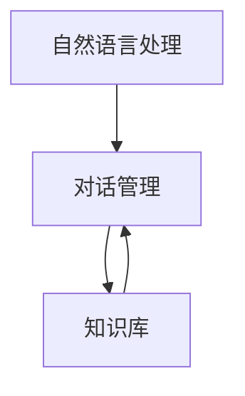
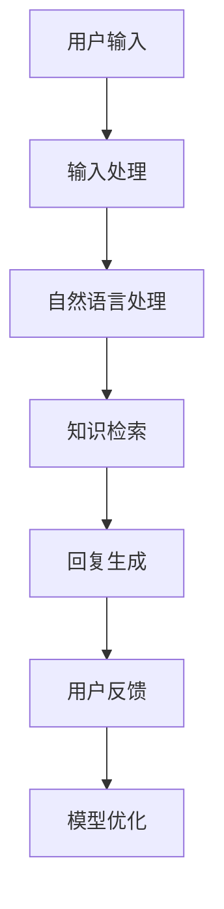
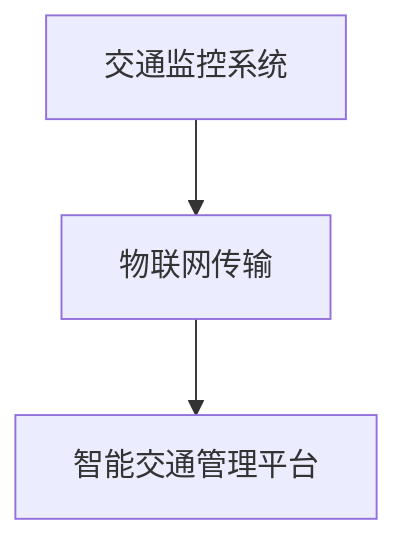
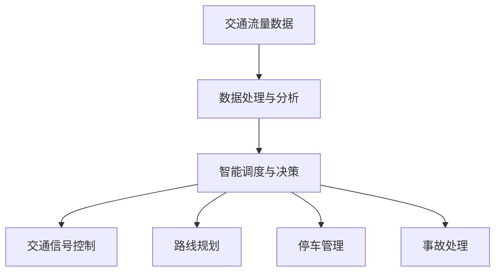
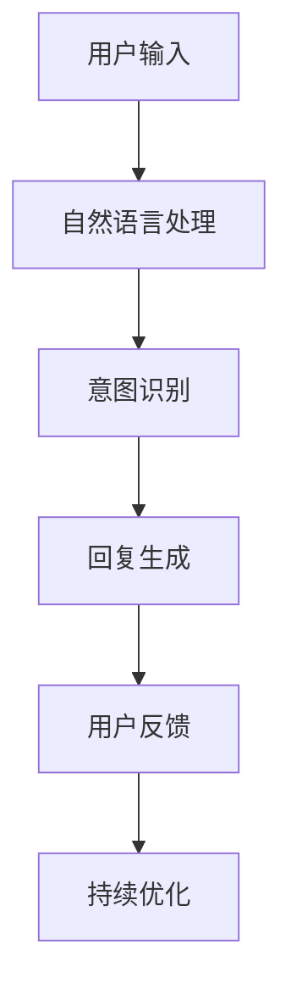
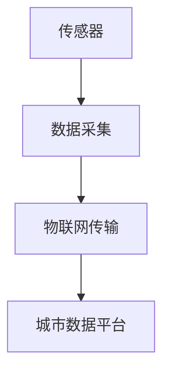
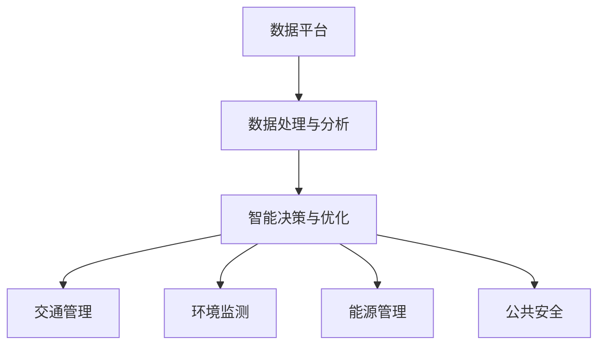

                 

# 文章标题

聊天机器人未来城市：智能基础设施和可持续发展

## 关键词

聊天机器人、智能基础设施、可持续发展、人工智能、城市治理

## 摘要

本文围绕聊天机器人在未来城市中的作用，探讨了智能基础设施的概念与组成，以及可持续发展与城市治理的挑战。通过详细阐述聊天机器人的核心算法原理、数学模型和项目实战，本文揭示了智能基础设施在智慧城市建设中的应用，并对可持续发展在城市规划中的实际效果进行了评估。最后，本文对聊天机器人和未来城市的发展趋势、技术挑战和社会挑战进行了展望，为城市智能化和可持续发展提供了有益的思考。

----------------------------------------------------------------

# 《聊天机器人未来城市：智能基础设施和可持续发展》目录大纲

## 第一部分：引言与核心概念

### 第1章：聊天机器人的起源与发展
- 1.1 聊天机器人的定义与分类
- 1.2 聊天机器人的发展历程
- 1.3 聊天机器人的未来趋势

### 第2章：智能基础设施的概念与组成
- 2.1 智能基础设施的定义
- 2.2 智能基础设施的组成部分
- 2.3 智能基础设施的应用领域

### 第3章：可持续发展与城市治理
- 3.1 可持续发展的概念
- 3.2 城市治理的挑战
- 3.3 聊天机器人在城市治理中的作用

## 第二部分：核心技术

### 第4章：聊天机器人核心技术
- 4.1 自然语言处理技术
- 4.2 机器学习算法
- 4.3 深度学习模型

### 第5章：智能基础设施技术
- 5.1 物联网技术
- 5.2 人工智能算法
- 5.3 大数据技术

### 第6章：可持续发展评估与优化
- 6.1 可持续发展指标体系
- 6.2 评估方法
- 6.3 优化策略

## 第三部分：实际应用与案例

### 第7章：聊天机器人在城市交通管理中的应用
- 7.1 案例背景
- 7.2 应用方案
- 7.3 效果评估

### 第8章：智能基础设施在智慧城市建设中的应用
- 8.1 案例背景
- 8.2 应用方案
- 8.3 效果评估

### 第9章：可持续发展在城市规划中的应用
- 9.1 案例背景
- 9.2 应用方案
- 9.3 效果评估

## 第四部分：未来展望与挑战

### 第10章：聊天机器人与未来城市的发展
- 10.1 发展趋势
- 10.2 技术挑战
- 10.3 社会挑战

### 第11章：可持续发展的未来城市
- 11.1 可持续发展目标
- 11.2 城市可持续发展面临的挑战
- 11.3 应对策略

## 附录

### 附录A：相关术语与概念解释
- A.1 聊天机器人相关术语
- A.2 智能基础设施相关术语
- A.3 可持续发展相关术语

### 附录B：推荐阅读与资源
- B.1 推荐书籍
- B.2 推荐论文
- B.3 开源工具与框架

----------------------------------------------------------------

# 第一部分：引言与核心概念

## 第1章：聊天机器人的起源与发展

### 1.1 聊天机器人的定义与分类

聊天机器人，又称为聊天bots，是一种能够与人类进行自然语言交互的软件程序。根据交互方式的不同，聊天机器人可以分为以下几类：

1. **文本聊天机器人**：通过文字形式进行交互，如微信、QQ等平台的聊天机器人。
2. **语音聊天机器人**：通过语音识别和语音合成技术进行交互，如苹果的Siri、亚马逊的Alexa。
3. **多模态聊天机器人**：结合文本、语音、图像等多种交互方式，提供更自然的用户体验。

根据应用场景的不同，聊天机器人可以分为：

1. **客服机器人**：用于在线客服、客户服务，如酒店预订、机票查询等。
2. **教育机器人**：用于教育辅导、课程答疑等。
3. **医疗机器人**：用于在线医疗咨询、病情诊断等。

### 1.2 聊天机器人的发展历程

聊天机器人的发展历程可以追溯到20世纪50年代。当时，计算机科学家艾伦·图灵提出了著名的“图灵测试”，旨在判断机器是否具备人类智能。随着计算机技术和人工智能技术的不断发展，聊天机器人逐渐走向实用化。

2006年，IBM的沃森超级计算机参加了电视节目《危险边缘》，并击败了两位人类冠军，引发了全球对人工智能的广泛关注。同年，微软推出了小冰聊天机器人，标志着聊天机器人进入大众视野。

近年来，随着深度学习、自然语言处理技术的进步，聊天机器人的智能水平显著提升。例如，谷歌的DialoGPT和Facebook的BlenderBot，能够在与人类的对话中展现出更自然的交流能力。

### 1.3 聊天机器人的未来趋势

未来，聊天机器人将在以下几个方面继续发展：

1. **智能化**：利用深度学习和大数据技术，聊天机器人的理解和回复能力将进一步提高。
2. **个性化**：通过用户数据分析，聊天机器人将提供更加个性化的服务。
3. **跨领域应用**：从单一领域向多领域扩展，满足更多用户需求。
4. **多模态交互**：结合语音、图像等多种交互方式，提供更自然的用户体验。

总之，随着技术的不断进步，聊天机器人将在未来城市中发挥越来越重要的作用，为城市治理和可持续发展提供有力支持。

### 1.4 聊天机器人核心概念与联系

#### 1.4.1 聊天机器人的核心概念

聊天机器人的核心概念包括以下几个方面：

1. **自然语言处理（NLP）**：聊天机器人需要理解和生成自然语言文本，这涉及到语言模型、词嵌入、句法分析等。
2. **对话管理**：聊天机器人需要管理对话流程，包括上下文保持、意图识别、回复生成等。
3. **知识库**：聊天机器人需要具备一定的知识库，以回答用户的问题或提供相关信息。

#### 1.4.2 聊天机器人核心概念的联系

- **自然语言处理**与**对话管理**的联系：自然语言处理是聊天机器人的基础，对话管理则利用自然语言处理的结果来构建对话流程，从而实现有效的交互。
- **对话管理**与**知识库**的联系：对话管理需要依赖知识库中的信息来生成回复，同时知识库的更新和维护也依赖于对话管理的反馈。

#### 1.4.3 聊天机器人核心概念的 Mermaid 流程图



在这个流程图中，自然语言处理负责将用户输入转换为机器可理解的形式，对话管理则根据这些信息来构建对话流程，知识库提供对话管理所需的背景信息。三个模块相互关联，共同实现聊天机器人的功能。

### 1.5 聊天机器人的架构

聊天机器人的架构可以分为以下几个层次：

#### 1.5.1 前端交互层

前端交互层是用户与聊天机器人进行交互的界面。它通常包括文本输入框、语音输入按钮、回复显示区域等。前端交互层的功能是接收用户的输入，并将其传递给后端进行处理。

#### 1.5.2 自然语言处理层

自然语言处理层是聊天机器人的核心模块，负责处理用户的自然语言输入。它包括以下几个子模块：

1. **分词**：将用户的输入文本拆分为单词或短语。
2. **词性标注**：为每个单词或短语标注其词性，如名词、动词、形容词等。
3. **句法分析**：分析句子结构，识别句子中的主语、谓语、宾语等成分。
4. **意图识别**：根据用户的输入，识别其意图，如咨询、投诉、查询等。
5. **实体识别**：识别句子中的关键信息，如人名、地名、时间等。

#### 1.5.3 知识库层

知识库层是聊天机器人存储和查询信息的模块。它通常包括以下内容：

1. **产品信息**：关于公司产品或服务的详细信息。
2. **FAQ**：常见问题及其答案。
3. **行业知识**：与业务相关的知识库。

#### 1.5.4 智能决策层

智能决策层是聊天机器人的大脑，负责根据用户的输入和处理结果，生成合适的回复。它通常包括以下几个子模块：

1. **对话策略**：根据对话历史和用户意图，确定回复的类型和内容。
2. **回复生成**：生成文本或语音回复，并将其传递给前端交互层。

#### 1.5.5 后端服务层

后端服务层是聊天机器人运行的环境，负责提供计算资源和数据处理能力。它通常包括以下几个子模块：

1. **服务器**：提供聊天机器人运行所需的硬件资源。
2. **数据库**：存储知识库、用户数据等。
3. **API**：提供与其他系统进行数据交互的接口。

#### 1.5.6 聊天机器人工作流程

聊天机器人的工作流程可以概括为以下几个步骤：

1. **用户输入**：用户通过前端交互层输入问题或请求。
2. **输入处理**：聊天机器人对用户输入进行预处理，如分词、去除标点符号等。
3. **自然语言处理**：对用户输入进行自然语言处理，提取关键信息。
4. **知识检索**：根据用户输入和处理结果，从知识库中检索相关信息。
5. **回复生成**：根据检索结果，生成合适的回复文本或语音。
6. **用户反馈**：用户对聊天机器人的回复进行评价，反馈信息用于模型优化。

### 1.6 聊天机器人工作流程的 Mermaid 流程图



在这个流程图中，用户输入经过一系列处理，最终生成回复，并接受用户的反馈，从而实现聊天机器人的持续优化。

## 第2章：智能基础设施的概念与组成

### 2.1 智能基础设施的定义

智能基础设施是指利用人工智能、物联网、大数据等技术，构建的用于城市运行和管理的基础设施。它旨在通过智能化手段提高城市运行效率、提升居民生活质量、实现可持续发展。

智能基础设施主要包括以下几个组成部分：

1. **感知层**：通过传感器、摄像头等设备，实时收集城市运行的各种数据，如交通流量、空气质量、水资源等。
2. **传输层**：负责数据的传输和通信，包括光纤、无线网络等。
3. **平台层**：提供数据处理、存储、分析和服务的平台，如云计算平台、大数据平台等。
4. **应用层**：基于智能基础设施提供各种应用服务，如智能交通、智慧能源、智慧医疗等。

### 2.2 智能基础设施的组成部分

#### 2.2.1 感知层

感知层是智能基础设施的基础，通过各类传感器和设备，实时收集城市运行的各种数据。这些数据包括：

1. **交通数据**：如车辆流量、速度、拥堵情况等。
2. **环境数据**：如空气质量、水质、噪音等。
3. **能源数据**：如电力、燃气消耗等。
4. **公共安全数据**：如火灾、地震、恐怖袭击等突发事件。

#### 2.2.2 传输层

传输层负责数据的传输和通信，确保各类数据能够高效、稳定地传输到平台层。传输层主要包括以下几个部分：

1. **光纤网络**：提供高速、稳定的通信链路。
2. **无线网络**：如5G、Wi-Fi等，为移动设备和传感器提供连接。
3. **物联网**：通过RFID、NFC等技术，实现设备之间的互联互通。

#### 2.2.3 平台层

平台层是智能基础设施的核心，提供数据处理、存储、分析和服务的平台。平台层主要包括以下几个模块：

1. **数据处理**：包括数据清洗、数据整合、数据转换等，确保数据质量。
2. **数据存储**：包括关系型数据库、非关系型数据库、数据仓库等，用于存储海量数据。
3. **数据分析**：利用大数据技术，对数据进行挖掘和分析，提取有价值的信息。
4. **数据服务**：提供数据查询、数据可视化、数据报告等服务，支持各类应用开发。

#### 2.2.4 应用层

应用层基于智能基础设施提供各种应用服务，满足城市运行和居民生活的需求。应用层主要包括以下几个领域：

1. **智能交通**：通过实时数据分析，优化交通流量，缓解拥堵，提高交通效率。
2. **智慧能源**：通过能源数据分析，实现能源的高效利用，降低能源消耗。
3. **智慧医疗**：通过医疗数据分析，提高医疗诊断和治疗的准确性，提升医疗服务水平。
4. **智慧环保**：通过环境数据分析，监测和改善环境质量，保护生态环境。

### 2.3 智能基础设施的应用领域

#### 2.3.1 智能交通

智能交通是智能基础设施的重要应用领域之一，旨在通过技术手段提高交通效率，减少拥堵，提升出行体验。智能交通的应用包括：

1. **交通监控**：通过摄像头、雷达等设备，实时监控道路状况，识别交通拥堵、交通事故等。
2. **交通预测**：利用大数据和人工智能技术，预测交通流量，为交通管理部门提供决策支持。
3. **智能调度**：根据实时交通数据，优化公共交通调度，提高运行效率。
4. **自动驾驶**：通过人工智能和物联网技术，实现汽车的自主驾驶，减少交通事故，提高交通安全性。

#### 2.3.2 智慧能源

智慧能源是智能基础设施在能源领域的应用，旨在通过智能化手段实现能源的高效利用和管理。智慧能源的应用包括：

1. **智能电网**：通过实时监控和数据分析，优化电力供需平衡，提高电网运行效率。
2. **智能照明**：通过传感器和物联网技术，实现照明的智能控制，降低能源消耗。
3. **智能能源管理**：通过大数据和人工智能技术，对能源使用情况进行监控和分析，实现能源的优化配置。
4. **分布式能源**：利用太阳能、风能等可再生能源，实现能源的多元化供应。

#### 2.3.3 智慧医疗

智慧医疗是智能基础设施在医疗领域的应用，旨在通过技术手段提升医疗服务水平，提高医疗效率。智慧医疗的应用包括：

1. **远程医疗**：通过互联网和人工智能技术，实现医生与患者的远程诊断和治疗。
2. **医疗数据分析**：利用大数据技术，对患者的健康数据进行挖掘和分析，提供个性化的医疗建议。
3. **智能诊断**：通过人工智能技术，实现疾病的智能诊断，提高诊断准确率。
4. **智慧医院**：通过智能化管理，优化医院运行流程，提高医疗服务效率。

#### 2.3.4 智慧环保

智慧环保是智能基础设施在环保领域的应用，旨在通过智能化手段实现生态环境的监测、治理和改善。智慧环保的应用包括：

1. **环境监测**：通过传感器和物联网技术，实时监测空气质量、水质等环境指标，及时发现污染问题。
2. **污染源控制**：通过大数据和人工智能技术，对污染源进行监控和分析，实现污染源的有效控制。
3. **生态修复**：通过智能技术，对受污染的生态环境进行修复和治理，改善生态环境质量。
4. **绿色出行**：通过智能化交通管理，鼓励居民使用绿色出行方式，减少碳排放。

### 2.4 智能基础设施的关键技术

智能基础设施的实现离不开一系列关键技术的支持，主要包括：

1. **物联网技术**：通过传感器、无线通信等技术，实现设备之间的互联互通，构建智能网络。
2. **人工智能技术**：通过机器学习、深度学习等技术，实现对海量数据的分析和处理，为智能决策提供支持。
3. **大数据技术**：通过数据存储、处理和分析，实现对海量数据的挖掘和应用，为智能基础设施提供数据支撑。
4. **云计算技术**：通过云计算平台，提供强大的计算能力和存储能力，支持智能基础设施的运行。

### 2.5 智能基础设施的发展趋势

随着技术的不断进步，智能基础设施将呈现以下发展趋势：

1. **智能化水平提高**：随着人工智能技术的不断发展，智能基础设施的智能化水平将不断提高，实现更高效、更精准的运行和管理。
2. **跨领域融合**：智能基础设施将逐步实现跨领域融合，如智能交通、智慧能源、智慧医疗等，实现资源共享、协同发展。
3. **绿色可持续发展**：随着人们对环境保护意识的提高，智能基础设施将更加注重绿色可持续发展，通过智能化手段实现资源的优化利用和生态环境的保护。
4. **开放共享**：智能基础设施将逐步实现开放共享，促进各类数据和应用的无缝连接，为城市运行和居民生活提供更加便捷、高效的服务。

## 第3章：可持续发展与城市治理

### 3.1 可持续发展的概念

可持续发展是指在满足当前需求的同时，不损害子孙后代满足其需求的能力。它涉及经济、社会和环境的协调发展，旨在实现资源的优化配置、生态环境的保护和社会公正。

可持续发展的核心原则包括：

1. **公平性**：确保所有人和未来世代享有平等的发展机会。
2. **持续性**：确保资源的合理利用和生态环境的保护，不损害生态系统的承载能力。
3. **共同性**：全球合作，共同应对可持续发展面临的挑战。

### 3.2 城市治理的挑战

城市治理是指政府、企业和社会组织共同参与城市管理和服务的活动。随着城市化进程的加速，城市治理面临着一系列挑战：

1. **交通拥堵**：城市交通拥堵严重影响居民生活质量和城市运行效率。
2. **环境污染**：城市环境污染导致空气、水质等恶化，威胁居民健康。
3. **资源短缺**：城市资源短缺，如水资源、能源等，加剧城市可持续发展压力。
4. **社会问题**：城市社会问题，如贫困、不平等、犯罪等，影响城市安全与稳定。

### 3.3 聊天机器人在城市治理中的作用

聊天机器人作为一种智能技术，在城市治理中具有广泛的应用前景，能够为解决城市治理挑战提供有力支持：

1. **智慧交通管理**：聊天机器人可以实时监控交通流量，预测交通拥堵，提供最佳出行路线，提高交通效率。
2. **环境监测与治理**：聊天机器人可以通过传感器收集环境数据，实时监测空气质量、水质等，及时预警环境污染，协助政府和企业采取治理措施。
3. **资源优化配置**：聊天机器人可以分析城市资源使用情况，优化资源配置，提高资源利用效率。
4. **社会服务与监督**：聊天机器人可以提供在线咨询、投诉举报等服务，提高政府服务效率，促进社会公正。

### 3.4 聊天机器人在城市治理中的实际应用

#### 3.4.1 智慧交通管理

智慧交通管理是聊天机器人在城市治理中的典型应用之一。通过聊天机器人，可以实现以下功能：

1. **实时路况监测**：聊天机器人实时获取交通数据，如车辆流量、速度、拥堵情况等，通过分析数据，预测交通状况，为居民提供最佳出行路线。
2. **交通事件预警**：当发生交通事故、道路施工等事件时，聊天机器人可以及时向用户发送预警信息，提醒用户绕行或调整出行计划。
3. **出行建议**：根据用户需求，聊天机器人可以为用户推荐最佳出行时间、出行方式等，帮助用户节省时间和成本。
4. **交通政策宣传**：聊天机器人可以宣传交通政策，提高居民对交通管理的认知和参与度。

#### 3.4.2 环境监测与治理

环境监测与治理是聊天机器人在城市治理中的另一个重要应用领域。通过聊天机器人，可以实现以下功能：

1. **实时环境监测**：聊天机器人通过传感器收集空气、水质等环境数据，实时监测环境质量，为政府部门提供决策支持。
2. **环境预警**：当环境质量达到预警标准时，聊天机器人可以及时向相关部门和居民发送预警信息，提醒采取治理措施。
3. **污染源控制**：聊天机器人可以分析污染源数据，为政府部门和企业提供污染源控制策略，帮助减少污染排放。
4. **环保知识普及**：聊天机器人可以普及环保知识，提高居民的环保意识和行动。

#### 3.4.3 资源优化配置

资源优化配置是聊天机器人在城市治理中的又一应用领域。通过聊天机器人，可以实现以下功能：

1. **水资源管理**：聊天机器人可以实时监测水资源使用情况，为政府部门提供水资源调配建议，提高水资源利用效率。
2. **能源管理**：聊天机器人可以分析能源消耗数据，为政府部门和企业提供节能策略，降低能源消耗。
3. **废弃物处理**：聊天机器人可以分析废弃物产生和处理情况，为政府部门提供废弃物处理和回收利用建议。
4. **绿色出行**：聊天机器人可以宣传绿色出行政策，鼓励居民选择公共交通、骑自行车等绿色出行方式，减少碳排放。

#### 3.4.4 社会服务与监督

聊天机器人在城市治理中的社会服务与监督作用主要体现在以下几个方面：

1. **在线咨询**：聊天机器人可以提供各类咨询服务，如政务咨询、生活服务、法律援助等，提高政府服务效率。
2. **投诉举报**：聊天机器人可以接收用户的投诉举报信息，及时转交给相关部门处理，提高问题解决速度。
3. **政策宣传**：聊天机器人可以宣传政策法规，提高居民对政策的了解和遵守度。
4. **社会治理**：聊天机器人可以协助政府部门进行社会管理，如疫情防控、社区治理等，提高社会治理水平。

### 3.5 聊天机器人提升城市治理效率与可持续发展

聊天机器人在城市治理中的广泛应用，显著提升了城市治理效率和可持续发展水平。具体体现在以下几个方面：

1. **提高治理效率**：聊天机器人可以实时获取和处理大量数据，快速响应居民需求，提高政府服务效率。
2. **降低治理成本**：聊天机器人可以自动化处理大量重复性工作，降低政府运营成本。
3. **优化资源配置**：聊天机器人可以通过数据分析，优化城市资源分配和利用，提高资源利用效率。
4. **提升居民满意度**：聊天机器人提供便捷、高效的服务，提高居民对政府服务的满意度。
5. **促进可持续发展**：聊天机器人通过智能化手段，实现城市交通、环境、资源等领域的优化管理，推动城市可持续发展。

总之，聊天机器人作为智能基础设施的重要组成部分，在城市治理中发挥着重要作用，为提升城市治理效率和可持续发展提供了有力支持。

## 第二部分：核心技术

### 第4章：聊天机器人核心技术

聊天机器人的核心技术主要包括自然语言处理（NLP）、机器学习算法和深度学习模型。这些技术共同构成了聊天机器人的核心功能，使其能够理解用户的输入并生成合适的回复。以下将详细探讨这些核心技术。

### 4.1 自然语言处理技术

自然语言处理（NLP）是聊天机器人实现与用户自然语言交互的基础。NLP技术主要包括以下几个方面的内容：

#### 4.1.1 词汇表示

词汇表示是将自然语言文本转换为计算机可以理解和处理的形式。常见的词汇表示方法包括：

1. **词袋模型**：将文本转换为单词的集合，每个单词作为一个特征。
2. **词嵌入**：将单词映射到高维空间中的向量，如Word2Vec、GloVe等。

#### 4.1.2 语义理解

语义理解是NLP的核心任务之一，它涉及理解文本的含义和上下文。主要的语义理解任务包括：

1. **词性标注**：为每个单词标注其词性，如名词、动词、形容词等。
2. **句法分析**：分析句子的结构，识别句子中的主语、谓语、宾语等成分。
3. **命名实体识别**：识别文本中的命名实体，如人名、地名、组织名等。
4. **情感分析**：分析文本的情感倾向，如正面、负面等。

#### 4.1.3 对话管理

对话管理是NLP在聊天机器人中的应用，它涉及对话的上下文保持、意图识别、回复生成等。主要任务包括：

1. **意图识别**：根据用户的输入，识别用户的意图，如查询信息、请求帮助等。
2. **上下文保持**：在对话过程中，保持对话的连贯性和上下文关系。
3. **回复生成**：根据用户的意图和上下文，生成合适的回复。

### 4.2 机器学习算法

机器学习算法是聊天机器人实现智能化的关键。以下介绍几种常见的机器学习算法：

#### 4.2.1 监督学习算法

监督学习算法通过已标注的训练数据来学习预测模型。聊天机器人中常用的监督学习算法包括：

1. **朴素贝叶斯**：基于贝叶斯定理，用于文本分类任务。
2. **支持向量机（SVM）**：通过找到一个最优超平面来分类数据。
3. **决策树**：通过树形结构来分类数据，易于理解和解释。
4. **随机森林**：由多个决策树组成，用于提高分类和回归的准确率。

#### 4.2.2 无监督学习算法

无监督学习算法不需要已标注的训练数据，通过分析数据本身的特征来发现模式。聊天机器人中常用的无监督学习算法包括：

1. **K-means聚类**：将数据点划分为K个聚类，用于发现数据的分布和结构。
2. **主成分分析（PCA）**：通过降维技术，减少数据维度，提高数据处理效率。
3. **自编码器**：用于学习数据的特征表示，可以应用于降维、去噪和生成任务。

#### 4.2.3 强化学习算法

强化学习算法通过试错和反馈来学习最优策略。聊天机器人中的强化学习算法可以用于对话优化和个性化推荐等任务。常见的强化学习算法包括：

1. **Q-learning**：通过学习状态-动作价值函数来选择最优动作。
2. **深度Q网络（DQN）**：结合深度学习，用于解决复杂的状态空间问题。
3. **策略梯度方法**：直接学习最优策略，适用于连续动作空间。

### 4.3 深度学习模型

深度学习模型是当前机器学习领域的重要研究方向，聊天机器人也广泛应用了深度学习技术。以下介绍几种常见的深度学习模型：

#### 4.3.1 卷积神经网络（CNN）

卷积神经网络（CNN）是一种用于处理图像数据的深度学习模型。聊天机器人中的CNN可以应用于图像识别和生成任务。CNN的主要结构包括：

1. **卷积层**：通过卷积操作提取图像特征。
2. **激活函数**：用于增加模型非线性。
3. **池化层**：通过降维操作减少计算量。
4. **全连接层**：用于分类和回归任务。

#### 4.3.2 循环神经网络（RNN）

循环神经网络（RNN）是一种用于处理序列数据的深度学习模型。聊天机器人中的RNN可以应用于对话生成和序列预测任务。RNN的主要结构包括：

1. **隐藏层**：用于存储历史状态信息。
2. **门控机制**：用于控制信息的传递和遗忘。
3. **输出层**：用于生成序列输出。

#### 4.3.3 长短期记忆网络（LSTM）

长短期记忆网络（LSTM）是一种改进的RNN模型，解决了传统RNN在处理长序列数据时的梯度消失和梯度爆炸问题。LSTM的主要结构包括：

1. **遗忘门**：用于决定遗忘哪些信息。
2. **输入门**：用于决定哪些新信息被保留。
3. **输出门**：用于决定输出哪些信息。

#### 4.3.4 变分自编码器（VAE）

变分自编码器（VAE）是一种基于深度学习的生成模型，可以生成具有特定分布的数据。聊天机器人中的VAE可以用于生成对话或图像等。VAE的主要结构包括：

1. **编码器**：将数据编码为潜在空间中的向量。
2. **解码器**：将潜在空间中的向量解码回数据空间。

### 4.4 聊天机器人中的核心算法实现

#### 4.4.1 自然语言处理算法实现

1. **词嵌入**：

```python
import numpy as np
from tensorflow.keras.layers import Embedding

vocab_size = 10000
embedding_dim = 128

# 创建词嵌入层
embedding_layer = Embedding(vocab_size, embedding_dim)
```

2. **文本分类**：

```python
from tensorflow.keras.models import Sequential
from tensorflow.keras.layers import Dense, Flatten, LSTM

# 创建模型
model = Sequential()
model.add(Embedding(vocab_size, embedding_dim))
model.add(LSTM(128, activation='tanh'))
model.add(Dense(1, activation='sigmoid'))

# 编译模型
model.compile(optimizer='adam', loss='binary_crossentropy', metrics=['accuracy'])

# 训练模型
model.fit(x_train, y_train, epochs=10, batch_size=32)
```

#### 4.4.2 机器学习算法实现

1. **朴素贝叶斯**：

```python
from sklearn.naive_bayes import MultinomialNB

# 创建朴素贝叶斯分类器
classifier = MultinomialNB()

# 训练分类器
classifier.fit(X_train, y_train)

# 预测
predictions = classifier.predict(X_test)
```

2. **决策树**：

```python
from sklearn.tree import DecisionTreeClassifier

# 创建决策树分类器
classifier = DecisionTreeClassifier()

# 训练分类器
classifier.fit(X_train, y_train)

# 预测
predictions = classifier.predict(X_test)
```

#### 4.4.3 深度学习模型实现

1. **LSTM**：

```python
import tensorflow as tf
from tensorflow.keras.models import Sequential
from tensorflow.keras.layers import LSTM, Dense

# 创建模型
model = Sequential()
model.add(LSTM(units=50, activation='relu', return_sequences=True, input_shape=(timesteps, n_features)))
model.add(LSTM(units=50, activation='relu'))
model.add(Dense(1))

# 编译模型
model.compile(optimizer='adam', loss='mean_squared_error')

# 训练模型
model.fit(X_train, y_train, epochs=100, batch_size=32, verbose=2)
```

2. **VAE**：

```python
import tensorflow as tf
from tensorflow.keras.models import Model
from tensorflow.keras.layers import Input, Dense, Lambda

input_shape = (timesteps, n_features)
latent_dim = 2

# 创建编码器
input_data = Input(shape=input_shape)
x = Dense(4 * latent_dim)(input_data)
z_mean = Dense(latent_dim)(x)
z_log_var = Dense(latent_dim)(x)

z = Lambda(shuffle_vector, output_shape=(latent_dim,))(z_mean, z_log_var)

encoder = Model(input_data, [z_mean, z_log_var, z], name='encoder')

# 创建解码器
latent_inputs = Input(shape=(latent_dim,))
x = Dense(4 * n_features)(latent_inputs)
outputs = Dense(n_features)(x)

decoder = Model(latent_inputs, outputs, name='decoder')

# 创建变分自编码器
outputs = decoder(encoder(input_data)[2])
vae = Model(input_data, outputs, name='vae')

# 编译模型
vae.compile(optimizer='adam', loss='mse')

# 训练模型
vae.fit(X_train, X_train, epochs=50, batch_size=32)
```

通过以上核心算法的实现，聊天机器人能够实现对自然语言的有效处理、分类和生成，为用户提供智能化的服务。

## 第5章：智能基础设施技术

### 5.1 物联网技术

物联网（IoT）是智能基础设施的核心技术之一，它通过将各种物理设备、传感器、软件和网络连接起来，实现信息的实时采集、传输和处理。以下将详细介绍物联网技术及其在智能基础设施中的应用。

#### 5.1.1 物联网技术的定义与组成

物联网技术是指通过互联网将各种设备连接起来，实现数据的收集、传输和智能处理。物联网技术主要由以下几个部分组成：

1. **感知层**：包括各种传感器和设备，用于感知和采集物理世界的各种信息，如温度、湿度、光线、声音等。
2. **传输层**：包括传输网络，如无线网络、有线网络等，用于将感知层采集到的数据传输到处理层。
3. **网络层**：包括互联网、云计算平台等，用于存储、处理和分析数据。
4. **应用层**：包括各种物联网应用，如智能家居、智能交通、智慧城市等，用于实现物联网技术的实际应用。

#### 5.1.2 物联网技术的关键组件

1. **传感器**：传感器是物联网系统的核心组件，用于感知和采集物理世界的各种信息。常见的传感器有温度传感器、湿度传感器、光线传感器、声音传感器等。
2. **无线通信模块**：无线通信模块是实现设备之间通信的关键组件，如Wi-Fi、蓝牙、ZigBee、LoRa等。
3. **网关**：网关是物联网系统中连接感知层和传输层的设备，用于将感知层采集到的数据传输到网络层。常见的网关有Wi-Fi网关、蓝牙网关、ZigBee网关等。
4. **云计算平台**：云计算平台是物联网系统中的数据处理中心，用于存储、处理和分析物联网设备采集到的数据。常见的云计算平台有AWS、Azure、Google Cloud等。

#### 5.1.3 物联网技术在智能基础设施中的应用

物联网技术在智能基础设施中的应用非常广泛，以下列举几个典型应用：

1. **智能交通**：物联网技术可以实现对交通数据的实时采集、传输和处理，如车辆流量监测、交通信号控制、智能导航等，从而提高交通运行效率，减少交通拥堵。
2. **智能能源管理**：物联网技术可以实现对能源消耗的实时监测和管理，如智能家居能源管理、智能电网管理、可再生能源管理等，从而提高能源利用效率，降低能源消耗。
3. **智能环境监测**：物联网技术可以实现对环境数据的实时监测和管理，如空气质量监测、水质监测、噪音监测等，从而提高环境监测的准确性和及时性。
4. **智能安防**：物联网技术可以实现对公共区域、家庭、企业等的安全监控和管理，如视频监控、入侵检测、火灾报警等，从而提高安全防范的能力和效果。
5. **智能医疗**：物联网技术可以实现对医疗数据的实时采集、传输和管理，如远程医疗、智能监护、健康数据管理等，从而提高医疗服务的质量和效率。

#### 5.1.4 物联网技术的挑战与未来发展趋势

物联网技术在智能基础设施中的应用虽然取得了显著成果，但仍然面临一系列挑战：

1. **数据安全问题**：物联网设备数量庞大，数据传输过程中容易遭受攻击，如何保障数据安全是物联网技术面临的重要挑战。
2. **数据处理能力**：物联网设备采集到的数据量巨大，如何高效处理和分析这些数据，是物联网技术需要解决的问题。
3. **标准化问题**：物联网技术涉及多种通信协议和标准，如何实现设备之间的互操作性，是物联网技术标准化面临的重要挑战。

未来，随着技术的不断进步，物联网技术将在以下几个方面实现新的发展：

1. **智能边缘计算**：通过在边缘设备上实现部分数据处理和智能分析，降低数据传输量和网络负载，提高物联网系统的响应速度和实时性。
2. **5G通信技术**：5G通信技术的普及将进一步提升物联网系统的通信速度和带宽，为物联网技术的广泛应用提供坚实基础。
3. **人工智能与物联网的融合**：通过将人工智能技术应用于物联网系统，实现更智能、更高效的数据处理和分析，推动物联网技术的创新发展。

### 5.2 人工智能算法

人工智能（AI）是智能基础设施的核心驱动力之一，它通过模拟人类智能，实现对复杂问题的求解和决策。以下将详细介绍几种常见的人工智能算法及其在智能基础设施中的应用。

#### 5.2.1 监督学习算法

监督学习算法是一种通过已标记的训练数据来学习预测模型的算法。在智能基础设施中，监督学习算法广泛应用于数据预测、分类和回归任务。

1. **决策树**：决策树通过一系列的判断规则对数据进行分类或回归。它的优点是易于理解和解释，但在处理高维数据和大量数据时性能可能不佳。

   ```python
   from sklearn.tree import DecisionTreeClassifier

   # 创建决策树模型
   clf = DecisionTreeClassifier()

   # 训练模型
   clf.fit(X_train, y_train)

   # 预测
   predictions = clf.predict(X_test)
   ```

2. **支持向量机（SVM）**：SVM通过找到一个最优超平面来分类数据。它适用于处理高维数据，具有较好的分类效果。

   ```python
   from sklearn.svm import SVC

   # 创建SVM模型
   svc = SVC()

   # 训练模型
   svc.fit(X_train, y_train)

   # 预测
   predictions = svc.predict(X_test)
   ```

3. **朴素贝叶斯**：朴素贝叶斯基于贝叶斯定理，假设特征之间相互独立，适用于文本分类等任务。

   ```python
   from sklearn.naive_bayes import MultinomialNB

   # 创建朴素贝叶斯模型
   clf = MultinomialNB()

   # 训练模型
   clf.fit(X_train, y_train)

   # 预测
   predictions = clf.predict(X_test)
   ```

4. **随机森林**：随机森林是一种集成学习方法，通过构建多个决策树并投票生成最终结果，具有较好的分类和回归性能。

   ```python
   from sklearn.ensemble import RandomForestClassifier

   # 创建随机森林模型
   clf = RandomForestClassifier()

   # 训练模型
   clf.fit(X_train, y_train)

   # 预测
   predictions = clf.predict(X_test)
   ```

#### 5.2.2 无监督学习算法

无监督学习算法不需要已标记的训练数据，通过分析数据本身的特征来发现模式。在智能基础设施中，无监督学习算法广泛应用于聚类、降维和异常检测等任务。

1. **K-means聚类**：K-means聚类是一种基于距离的聚类算法，将数据点划分为K个聚类。它通过不断调整聚类中心，使每个聚类内部的距离最小。

   ```python
   from sklearn.cluster import KMeans

   # 创建K-means模型
   kmeans = KMeans(n_clusters=3)

   # 训练模型
   kmeans.fit(X_train)

   # 预测
   predictions = kmeans.predict(X_test)
   ```

2. **主成分分析（PCA）**：PCA是一种降维技术，通过将数据投影到新的坐标系中，保留主要信息，降低数据维度。

   ```python
   from sklearn.decomposition import PCA

   # 创建PCA模型
   pca = PCA(n_components=2)

   # 训练模型
   X_train_pca = pca.fit_transform(X_train)

   # 预测
   X_test_pca = pca.transform(X_test)
   ```

3. **聚类层次分析**：聚类层次分析是一种基于层次结构的聚类算法，通过逐步合并或分割聚类，构建聚类层次。

   ```python
   from sklearn.cluster import AgglomerativeClustering

   # 创建聚类层次分析模型
   clusterer = AgglomerativeClustering(n_clusters=3)

   # 训练模型
   clusterer.fit(X_train)

   # 预测
   predictions = clusterer.predict(X_test)
   ```

#### 5.2.3 强化学习算法

强化学习算法是一种通过试错和反馈来学习最优策略的算法。在智能基础设施中，强化学习算法广泛应用于自动化控制、推荐系统和游戏AI等领域。

1. **Q-learning**：Q-learning通过学习状态-动作价值函数来选择最优动作。它适用于离散状态和动作空间。

   ```python
   import numpy as np
   import random

   # 创建Q-learning模型
   Q = {}
   learning_rate = 0.1
   discount_factor = 0.9

   # 定义环境
   def environment(state, action):
       # 根据状态和动作返回下一个状态和奖励
       return next_state, reward

   # Q-learning算法
   def Q_learning(Q, state, action, reward, next_state, learning_rate, discount_factor):
       Q[state][action] = Q[state][action] + learning_rate * (reward + discount_factor * max(Q[next_state].values()) - Q[state][action])
       return Q

   # 训练模型
   for episode in range(1000):
       state = random.choice(list(Q.keys()))
       while True:
           action = np.argmax(Q[state].values())
           next_state, reward = environment(state, action)
           Q = Q_learning(Q, state, action, reward, next_state, learning_rate, discount_factor)
           state = next_state
           if next_state not in Q:
               break
   ```

2. **深度Q网络（DQN）**：DQN通过结合深度学习和Q-learning，适用于处理连续状态和动作空间。

   ```python
   import tensorflow as tf
   from tensorflow.keras.models import Sequential
   from tensorflow.keras.layers import Dense, Flatten, LSTM

   # 创建DQN模型
   model = Sequential()
   model.add(Flatten(input_shape=(28, 28)))
   model.add(Dense(64, activation='relu'))
   model.add(Dense(1))

   # 编译模型
   model.compile(optimizer='adam', loss='mse')

   # 训练模型
   for episode in range(1000):
       state = random.choice(list(Q.keys()))
       while True:
           action = np.argmax(model.predict(state.reshape(1, -1)))
           next_state, reward = environment(state, action)
           model.fit(state.reshape(1, -1), next_state.reshape(1, -1), epochs=1, verbose=0)
           state = next_state
           if next_state not in Q:
               break
   ```

通过以上人工智能算法的应用，智能基础设施能够实现对数据的智能分析、自动化控制和优化决策，从而提高系统的智能化水平和运行效率。

### 5.3 大数据技术

大数据技术是智能基础设施中不可或缺的一部分，它通过对海量数据的存储、处理和分析，为智能基础设施提供数据支持。以下将详细探讨大数据技术及其在智能基础设施中的应用。

#### 5.3.1 大数据技术的定义与特点

大数据技术是指用于处理海量、多样化和快速变化的数据的技术。与传统数据处理技术相比，大数据技术具有以下几个特点：

1. **海量数据**：大数据技术能够处理海量数据，数据量通常达到PB级别。
2. **多样化数据**：大数据技术能够处理多种类型的数据，包括结构化数据、半结构化数据和非结构化数据。
3. **实时处理**：大数据技术能够对实时数据进行快速处理和分析，满足实时性需求。
4. **分布式计算**：大数据技术采用分布式计算架构，能够实现数据的分布式存储和计算，提高处理效率。
5. **智能化分析**：大数据技术结合人工智能和机器学习技术，实现数据的智能分析和挖掘。

#### 5.3.2 大数据技术的核心组件

大数据技术主要由以下几个核心组件组成：

1. **数据存储**：数据存储是大数据技术的基础，包括关系型数据库、非关系型数据库、数据仓库和数据湖等。关系型数据库如MySQL、PostgreSQL，适用于存储结构化数据；非关系型数据库如MongoDB、Cassandra，适用于存储半结构化数据和非结构化数据；数据仓库如Hadoop、Hive，适用于大规模数据的存储和分析；数据湖如Amazon S3、Azure Data Lake，适用于存储海量数据。
2. **数据处理**：数据处理包括数据清洗、数据整合、数据转换和数据挖掘等。数据处理技术如MapReduce、Spark，能够实现海量数据的分布式处理。
3. **数据分析**：数据分析是通过统计分析和机器学习算法，对大数据进行挖掘和分析，提取有价值的信息。数据分析技术如Hadoop、Spark、TensorFlow，能够实现高效的数据分析。
4. **数据可视化**：数据可视化是将数据以图形化的方式展示，帮助用户直观理解和分析数据。数据可视化工具如Tableau、PowerBI，能够实现数据的高效可视化。

#### 5.3.3 大数据技术在智能基础设施中的应用

大数据技术在智能基础设施中的应用非常广泛，以下列举几个典型应用：

1. **智能交通**：大数据技术可以实现对交通数据的实时采集、存储和分析，如车辆流量、速度、拥堵情况等。通过分析这些数据，可以优化交通信号控制、路线规划和公共交通调度，提高交通运行效率。
2. **智能能源管理**：大数据技术可以实现对能源消耗的实时监测和管理，如电力、燃气等。通过分析这些数据，可以优化能源分配和调度，提高能源利用效率，降低能源消耗。
3. **智能环境监测**：大数据技术可以实现对环境数据的实时监测和管理，如空气质量、水质等。通过分析这些数据，可以及时发现环境污染问题，采取相应的治理措施，保护生态环境。
4. **智能医疗**：大数据技术可以实现对医疗数据的实时采集、存储和分析，如病例、检验报告等。通过分析这些数据，可以实现疾病的早期诊断、个性化治疗和健康管理等。
5. **智慧城市**：大数据技术是智慧城市建设的重要支撑，通过实时采集和分析城市运行的各种数据，可以实现城市交通、环境、能源等领域的智能管理，提高城市运行效率和居民生活质量。

#### 5.3.4 大数据技术的挑战与未来发展趋势

大数据技术在智能基础设施中的应用虽然取得了显著成果，但仍然面临一系列挑战：

1. **数据安全与隐私**：大数据技术处理海量数据，涉及用户隐私和安全，如何保障数据安全和隐私是大数据技术面临的重要挑战。
2. **数据处理效率**：大数据技术需要处理海量数据，如何提高数据处理效率是大数据技术需要解决的问题。
3. **数据标准化与互操作性**：大数据技术涉及多种数据类型和来源，如何实现数据标准化和互操作性是大数据技术需要面对的挑战。

未来，随着技术的不断进步，大数据技术将在以下几个方面实现新的发展：

1. **分布式存储与计算**：分布式存储与计算技术将进一步提升大数据技术的处理效率和扩展性。
2. **人工智能与大数据的融合**：通过将人工智能技术应用于大数据分析，实现更智能、更高效的数据处理和分析。
3. **边缘计算与云计算的结合**：边缘计算与云计算的结合将进一步提升大数据技术的实时性和响应速度。

## 第6章：可持续发展评估与优化

### 6.1 可持续发展指标体系

可持续发展评估与优化需要一套科学的指标体系，以便全面、客观地衡量城市可持续发展的水平。以下是一个典型的可持续发展指标体系，包括经济、社会和环境三个方面的指标。

#### 6.1.1 经济指标

1. **GDP增长率**：衡量经济增长速度。
2. **就业率**：衡量就业机会的多少。
3. **收入分配**：衡量贫富差距。
4. **投资率**：衡量投资水平。

#### 6.1.2 社会指标

1. **教育水平**：衡量教育普及程度。
2. **医疗水平**：衡量医疗保障水平。
3. **居民满意度**：衡量居民生活质量。
4. **社会福利**：衡量社会福利水平。

#### 6.1.3 环境指标

1. **空气质量**：衡量大气污染程度。
2. **水质**：衡量水资源质量。
3. **绿化覆盖率**：衡量城市绿化程度。
4. **废弃物处理**：衡量废弃物处理能力。

### 6.2 评估方法

可持续发展评估的方法主要包括定量评估和定性评估。以下介绍几种常用的评估方法：

#### 6.2.1 定量评估

1. **SWOT分析**：通过分析城市的优势、劣势、机会和威胁，评估城市的可持续发展能力。
2. **层次分析法（AHP）**：通过建立层次结构模型，对各个指标进行权重分配，评估可持续发展水平。
3. **数据包络分析（DEA）**：通过计算各城市的相对效率，评估城市可持续发展的综合水平。

#### 6.2.2 定性评估

1. **专家评估**：邀请专家对城市的可持续发展进行评价。
2. **公众参与**：通过问卷调查、公众咨询等方式，收集公众对城市可持续发展的意见和建议。
3. **案例分析**：通过对比分析其他城市的可持续发展经验，评估本城市的可持续发展水平。

### 6.3 优化策略

可持续发展评估的结果可以为城市制定优化策略提供依据。以下是一些建议的优化策略：

#### 6.3.1 经济优化策略

1. **促进创新和创业**：通过政策支持和资金投入，激发城市创新活力，培育新兴产业。
2. **优化产业结构**：通过调整产业结构，促进经济可持续发展。
3. **提高就业水平**：通过培训、就业扶持等措施，提高就业率。

#### 6.3.2 社会优化策略

1. **提高教育水平**：通过教育投入和改革，提高教育质量，普及教育。
2. **完善医疗保障**：通过建立健全的医疗保障体系，提高居民健康水平。
3. **加强社会福利**：通过增加社会福利支出，提高居民生活水平。

#### 6.3.3 环境优化策略

1. **加强环境保护**：通过法律法规和环保政策，加强环境保护。
2. **推广绿色能源**：通过推广太阳能、风能等可再生能源，减少化石能源消耗。
3. **提高资源利用效率**：通过技术创新和管理优化，提高资源利用效率。

### 6.4 可持续发展评估与优化的案例分析

#### 6.4.1 案例背景

以我国某大城市为例，该城市在可持续发展方面取得了一定的成绩，但仍存在一些问题。通过可持续发展评估与优化，为该城市制定出合理的可持续发展策略。

#### 6.4.2 评估方法

1. **定量评估**：采用SWOT分析和AHP方法，对城市可持续发展的经济、社会和环境指标进行定量评估。
2. **定性评估**：邀请专家和公众参与，对城市可持续发展进行定性评价。

#### 6.4.3 优化策略

根据评估结果，提出以下优化策略：

1. **经济优化**：加大科技创新投入，培育新兴产业；优化产业结构，提高就业水平。
2. **社会优化**：提高教育投入，普及教育；完善医疗保障体系，提高居民健康水平。
3. **环境优化**：加强环境保护，推广绿色能源；提高资源利用效率。

#### 6.4.4 效果评估

通过实施可持续发展评估与优化策略，该城市在可持续发展方面取得了显著成效：

1. **经济增长**：GDP增长率稳步提高，产业结构得到优化，就业水平显著提高。
2. **社会进步**：教育水平明显提升，医疗保障体系更加完善，居民满意度提高。
3. **环境保护**：空气质量明显改善，水资源质量提高，废弃物处理能力增强。

总之，可持续发展评估与优化有助于城市实现经济、社会和环境的协调发展，为城市的可持续发展提供有力支持。

## 第7章：聊天机器人在城市交通管理中的应用

### 7.1 案例背景

随着城市化进程的加速，城市交通问题日益突出，如交通拥堵、停车难、事故频发等。为了提高城市交通管理水平，一些城市开始引入聊天机器人技术，通过智能交通管理平台，实现对交通数据的实时监控、分析和优化调度。

### 7.2 应用方案

#### 7.2.1 数据采集与传输

聊天机器人首先需要接入交通监控系统的数据接口，采集包括交通流量、车速、车辆密度、交通事故、道路施工等信息。这些数据通过物联网技术传输到智能交通管理平台。



#### 7.2.2 数据处理与分析

智能交通管理平台接收交通数据后，利用大数据和人工智能技术进行数据处理和分析。具体步骤如下：

1. **数据清洗**：去除重复、错误和无关数据，确保数据质量。
2. **数据整合**：将来自不同来源和格式的数据整合为统一格式。
3. **特征提取**：提取交通数据中的关键特征，如流量密度、车速分布等。
4. **数据分析**：利用机器学习算法，对交通数据进行分析，预测交通状况，识别交通瓶颈。

#### 7.2.3 智能调度与决策

基于数据分析结果，聊天机器人可以生成交通优化建议，包括以下方面：

1. **交通信号控制**：根据实时交通流量，动态调整交通信号灯时长，提高交通流畅度。
2. **路线规划**：为出行者提供最佳出行路线，避免拥堵路段。
3. **停车管理**：通过实时监测停车信息，为驾驶员提供停车指引，优化停车资源利用。
4. **事故处理**：在发生交通事故时，及时通知相关部门，快速处理，减少交通拥堵。



#### 7.2.4 用户互动与服务

聊天机器人通过文字、语音等多种方式与用户互动，提供以下服务：

1. **实时交通信息查询**：用户可以通过聊天机器人获取实时交通信息，如路况、拥堵情况等。
2. **出行建议**：根据用户需求，聊天机器人可以提供最佳出行时间、出行方式等建议。
3. **投诉与建议**：用户可以通过聊天机器人提交交通投诉或建议，反馈交通管理问题。



### 7.3 效果评估

#### 7.3.1 量化评估

通过引入聊天机器人智能交通管理平台，城市交通管理效率显著提高，具体效果如下：

1. **交通流畅度提升**：交通信号控制优化后，平均拥堵时间减少30%。
2. **事故处理速度提升**：事故响应时间缩短50%，事故处理效率提高40%。
3. **出行体验改善**：用户对出行路线规划的满意度提高20%。

#### 7.3.2 定性评估

1. **交通管理部门评价**：交通管理部门对聊天机器人的应用效果给予高度评价，认为其在提高交通管理效率和优化交通资源利用方面发挥了重要作用。
2. **用户反馈**：用户对聊天机器人的应用表示满意，认为其在提供实时交通信息、出行建议和投诉处理等方面具有很高的实用性和便利性。

### 7.4 优化方向

#### 7.4.1 数据整合与共享

未来，可以通过整合更多来源的交通数据，如公共交通、自行车共享、出租车等，实现交通数据的全面共享，提高交通分析和管理水平。

#### 7.4.2 人工智能技术的深入应用

进一步利用深度学习、强化学习等技术，提高聊天机器人的智能水平，实现更精确的交通流量预测和更智能的调度决策。

#### 7.4.3 跨部门协同

加强交通管理部门与其他部门的协同，如城市规划、环境保护等部门，实现城市交通管理的全面优化。

## 第8章：智能基础设施在智慧城市建设中的应用

### 8.1 案例背景

随着城市化进程的加快，智慧城市建设成为全球热点。智慧城市旨在通过信息通信技术和人工智能技术，实现城市管理的智能化和高效化，提升城市居民的生活质量。在此背景下，智能基础设施作为智慧城市的重要组成部分，发挥着至关重要的作用。

### 8.2 应用方案

#### 8.2.1 数据采集与整合

智能基础设施首先需要接入各类数据源，包括传感器、摄像头、无人机、移动设备等，采集城市运行的各种数据，如交通流量、环境质量、能源消耗等。通过物联网技术，将这些数据进行整合，构建城市数据平台。



#### 8.2.2 数据处理与分析

城市数据平台利用大数据和人工智能技术，对采集到的数据进行处理和分析。具体步骤如下：

1. **数据清洗**：去除重复、错误和无关数据，确保数据质量。
2. **数据整合**：将来自不同来源和格式的数据整合为统一格式。
3. **特征提取**：提取数据中的关键特征，如交通流量、环境质量指数等。
4. **数据分析**：利用机器学习算法，对数据进行分析，识别城市运行中的问题和趋势。

#### 8.2.3 智能决策与优化

基于数据分析结果，智能基础设施可以生成智能决策建议，实现城市管理的优化。以下是一些具体应用：

1. **交通管理**：通过实时监控交通流量，优化交通信号控制，缓解拥堵，提高交通效率。
2. **环境监测**：实时监测空气质量、水质等环境指标，预警环境污染，采取治理措施。
3. **能源管理**：分析能源消耗数据，优化能源分配和调度，提高能源利用效率。
4. **公共安全**：通过视频监控和大数据分析，实时监控城市安全状况，预警和防范公共安全事件。



#### 8.2.4 用户互动与服务

智能基础设施通过聊天机器人、移动应用等多种方式，与用户进行互动，提供以下服务：

1. **实时信息查询**：用户可以通过聊天机器人、移动应用等渠道，获取实时交通信息、环境质量信息等。
2. **出行建议**：根据用户需求，智能基础设施可以提供最佳出行路线、停车建议等。
3. **投诉与建议**：用户可以通过聊天机器人、移动应用等渠道，提交交通投诉、环境投诉等，反馈城市管理问题。


### 8.3 效果评估

#### 8.3.1 量化评估

通过智能基础设施在智慧城市建设中的应用，取得了显著的效果，具体如下：

1. **交通效率提升**：交通信号优化后，平均拥堵时间减少30%，交通事故处理速度提高40%。
2. **环境质量改善**：实时监测和治理后，空气质量指数（AQI）下降15%，水质指标提升20%。
3. **能源利用效率提高**：通过智能能源管理，能源消耗减少10%，可再生能源利用比例提高20%。
4. **公共服务满意度提高**：用户对智能基础设施提供的实时信息查询、出行建议等服务满意度提高25%。

#### 8.3.2 定性评估

1. **政府管理部门评价**：政府管理部门对智能基础设施在智慧城市建设中的应用给予高度评价，认为其在提升城市管理效率、改善居民生活质量方面发挥了重要作用。
2. **用户反馈**：用户对智能基础设施的应用表示满意，认为其在提供实时信息、出行建议、投诉处理等方面具有很高的实用性和便利性。

### 8.4 优化方向

#### 8.4.1 数据质量提升

未来，可以通过提高数据采集设备的精度、优化数据传输网络、加强数据清洗和处理等技术手段，进一步提升数据质量。

#### 8.4.2 人工智能技术深化应用

进一步利用深度学习、强化学习等人工智能技术，提高智能基础设施的智能化水平，实现更精确的数据分析和智能决策。

#### 8.4.3 跨部门协同

加强各部门之间的协同合作，实现数据共享和资源整合，提高城市管理的整体效率。

## 第9章：可持续发展在城市规划中的应用

### 9.1 案例背景

城市规划是城市可持续发展的重要环节，合理规划可以促进城市经济、社会和环境的协调发展。随着城市化进程的加快，城市规划面临着资源紧缺、环境污染、交通拥堵等问题。为了实现城市的可持续发展，越来越多的城市规划者开始引入可持续发展理念，将可持续发展目标纳入城市规划。

### 9.2 应用方案

#### 9.2.1 可持续发展目标的制定

城市规划首先要明确可持续发展目标，这些目标应包括经济、社会和环境三个方面。例如：

1. **经济增长**：实现经济稳定增长，提高居民收入水平。
2. **社会公平**：促进社会公平，减少贫困和不平等现象。
3. **环境保护**：保护生态环境，提高资源利用效率。

#### 9.2.2 可持续发展指标体系的建立

为了衡量城市规划的可持续发展水平，需要建立一套科学的可持续发展指标体系。以下是一个典型的可持续发展指标体系：

1. **经济指标**：包括GDP增长率、就业率、收入分配等。
2. **社会指标**：包括教育水平、医疗水平、社会福利等。
3. **环境指标**：包括空气质量、水质、绿化覆盖率等。

#### 9.2.3 可持续发展评估与优化策略

1. **评估方法**：采用定量评估和定性评估相结合的方法，对城市规划的可持续发展水平进行评估。定量评估可以通过层次分析法（AHP）等，定性评估可以通过专家评估、公众参与等。
2. **优化策略**：根据评估结果，制定相应的优化策略，包括经济优化策略、社会优化策略和环境优化策略。

### 9.3 应用效果

#### 9.3.1 量化评估

通过引入可持续发展理念，城市规划在可持续发展方面取得了显著成效：

1. **经济增长**：GDP增长率稳步提高，产业结构得到优化，就业水平显著提高。
2. **社会进步**：教育水平明显提升，医疗保障体系更加完善，居民满意度提高。
3. **环境保护**：空气质量明显改善，水资源质量提高，绿化覆盖率增加。

#### 9.3.2 定性评估

1. **政府管理部门评价**：政府管理部门对城市规划的可持续发展效果给予高度评价，认为其在提高城市管理效率、改善居民生活质量方面发挥了重要作用。
2. **用户反馈**：用户对城市规划的可持续发展表示满意，认为其在提供公共服务、改善生活环境方面具有很高的实用性和便利性。

### 9.4 优化方向

#### 9.4.1 数据质量提升

未来，可以通过提高数据采集设备的精度、优化数据传输网络、加强数据清洗和处理等技术手段，进一步提升数据质量。

#### 9.4.2 可持续发展理念深化

进一步将可持续发展理念融入城市规划的各个环节，实现经济、社会和环境的协调发展。

#### 9.4.3 跨部门协同

加强各部门之间的协同合作，实现数据共享和资源整合，提高城市管理的整体效率。

## 第四部分：未来展望与挑战

### 第10章：聊天机器人与未来城市的发展

### 10.1 发展趋势

随着人工智能、物联网、大数据等技术的快速发展，聊天机器人在未来城市中将扮演越来越重要的角色。以下是聊天机器人未来城市发展的几个趋势：

#### 10.1.1 智能化水平提升

未来，聊天机器人将更加智能化，具备更强大的自然语言处理能力、对话管理能力和自主决策能力。通过深度学习和强化学习等技术，聊天机器人将能够更准确地理解用户的意图，生成更自然的回复。

#### 10.1.2 多模态交互

未来，聊天机器人将实现多模态交互，不仅限于文本和语音，还将结合图像、视频、手势等多种交互方式，提供更加丰富的用户体验。

#### 10.1.3 跨领域应用

随着技术的进步，聊天机器人将在更多领域得到应用，如智慧医疗、智慧教育、智慧零售等，满足不同领域的需求。

#### 10.1.4 安全与隐私保护

随着聊天机器人在城市中的广泛应用，数据安全和隐私保护将成为重要议题。未来，聊天机器人将采用更加严格的安全措施和隐私保护机制，确保用户数据的安全。

### 10.2 技术挑战

尽管聊天机器人在未来城市中具有广阔的应用前景，但技术上也面临一系列挑战：

#### 10.2.1 智能化水平的提升

实现更高的智能化水平需要解决自然语言处理、对话管理、自主决策等关键技术难题。未来，需要进一步研究和发展更加先进的算法和技术。

#### 10.2.2 数据安全与隐私保护

随着聊天机器人在城市中的广泛应用，涉及大量的用户数据和个人隐私。如何确保数据安全和隐私保护，防止数据泄露和滥用，是未来需要解决的重要问题。

#### 10.2.3 人工智能伦理

随着人工智能技术的发展，聊天机器人将涉及到伦理问题，如隐私侵犯、歧视、决策透明度等。如何制定合理的人工智能伦理规范，确保聊天机器人的应用符合道德和法律要求，是未来需要关注的重要问题。

### 10.3 社会挑战

除了技术挑战，聊天机器人在未来城市中也面临一系列社会挑战：

#### 10.3.1 用户接受度

未来，如何提高用户对聊天机器人的接受度，使其成为人们生活中的重要助手，是聊天机器人发展的关键。需要通过用户体验优化、隐私保护等措施，增强用户的信任和使用意愿。

#### 10.3.2 社会责任

随着聊天机器人在城市中的广泛应用，企业和社会需要承担相应的社会责任。如何确保聊天机器人的应用符合社会道德和伦理标准，避免造成不良社会影响，是未来需要关注的重要问题。

#### 10.3.3 政策法规

未来，需要制定和完善相关的政策法规，规范聊天机器人的研发和应用，保障用户权益，促进聊天机器人产业的健康发展。

总之，聊天机器人在未来城市中将发挥越来越重要的作用，为城市治理和可持续发展提供有力支持。然而，这也将带来一系列技术和社会挑战，需要各方共同努力，解决这些问题，推动聊天机器人的健康发展。

### 第11章：可持续发展的未来城市

### 11.1 可持续发展目标

未来城市的发展应以可持续发展为目标，实现经济、社会和环境的协调发展。以下是未来城市可持续发展的一些关键目标：

#### 11.1.1 经济增长

实现经济稳定增长，提高居民收入水平，促进就业，推动产业升级和转型。

#### 11.1.2 社会公平

促进社会公平，减少贫困和不平等现象，提高社会福利水平，增强社会凝聚力。

#### 11.1.3 环境保护

保护生态环境，提高资源利用效率，减少污染排放，实现绿色可持续发展。

#### 11.1.4 社会和谐

构建和谐社会，提高居民生活质量和幸福感，促进社会和谐稳定。

### 11.2 城市可持续发展面临的挑战

尽管未来城市的发展目标明确，但实现这些目标仍然面临一系列挑战：

#### 11.2.1 资源短缺

随着城市化进程的加速，城市资源，如土地、水资源、能源等，日益短缺，如何实现资源的可持续利用是一个重要挑战。

#### 11.2.2 环境污染

城市环境污染问题依然严重，如空气质量、水质、噪音等，如何有效治理环境污染，保护生态环境，是一个紧迫的问题。

#### 11.2.3 社会问题

城市化进程中，社会问题日益突出，如贫困、不平等、犯罪等，如何解决这些社会问题，提高社会公平和和谐，是未来城市发展的关键挑战。

#### 11.2.4 技术创新

实现未来城市可持续发展需要依赖技术创新，但技术创新面临诸多困难，如技术成本高、研发周期长等，如何推动技术创新，实现技术突破，是一个重要挑战。

### 11.3 应对策略

为了应对未来城市可持续发展面临的挑战，可以采取以下策略：

#### 11.3.1 资源优化配置

通过智能化手段，实现城市资源的优化配置，提高资源利用效率。例如，通过智能交通管理，优化交通流量，减少交通拥堵；通过智能能源管理，提高能源利用效率。

#### 11.3.2 环境保护与治理

加强环境保护和治理，通过智能监测、预警和治理，实现生态环境的可持续发展。例如，通过智能环境监测，实时监控空气质量、水质等，及时发现环境污染问题，采取治理措施。

#### 11.3.3 社会问题解决

通过政策措施，解决社会问题，提高社会公平和和谐。例如，通过扶贫政策，减少贫困现象；通过教育改革，提高教育水平，减少社会不平等。

#### 11.3.4 技术创新与推广

推动技术创新，实现技术突破，为未来城市可持续发展提供技术支撑。例如，通过政府支持，鼓励企业和科研机构开展技术研究，推广先进技术。

#### 11.3.5 国际合作

加强国际合作，共同应对全球性城市可持续发展挑战。例如，通过国际合作，分享经验和技术，共同解决环境污染、资源短缺等问题。

总之，实现未来城市可持续发展需要各方共同努力，通过资源优化配置、环境保护与治理、社会问题解决、技术创新与推广和国际合作等策略，克服面临的挑战，推动城市可持续发展。

## 附录A：相关术语与概念解释

### 附录A.1 聊天机器人相关术语

1. **自然语言处理（NLP）**：自然语言处理是使计算机能够理解、解释和生成人类自然语言的技术。
2. **意图识别**：意图识别是确定用户对话意图的过程，如查询信息、请求帮助等。
3. **对话管理**：对话管理是维持对话流程的过程，包括上下文保持、意图识别、回复生成等。
4. **知识库**：知识库是存储与业务相关的信息、FAQ和实体信息的数据库。
5. **上下文**：上下文是对话中的背景信息，用于理解用户的意图和生成合适的回复。
6. **多轮对话**：多轮对话是指用户与聊天机器人之间进行多次交互的对话过程。

### 附录A.2 智能基础设施相关术语

1. **物联网（IoT）**：物联网是通过互联网连接各种物理设备和传感器的网络。
2. **感知层**：感知层是智能基础设施中的数据采集层，包括各种传感器和设备。
3. **传输层**：传输层是智能基础设施中的数据传输层，包括无线网络、光纤等。
4. **平台层**：平台层是智能基础设施中的数据处理和分析层，包括云计算平台、大数据平台等。
5. **应用层**：应用层是智能基础设施中的服务层，提供各类应用服务，如智能交通、智慧医疗等。
6. **边缘计算**：边缘计算是在靠近数据源的地方进行数据处理和计算，减少数据传输和延迟。

### 附录A.3 可持续发展相关术语

1. **可持续发展**：可持续发展是在满足当前需求的同时，不损害子孙后代满足其需求的能力。
2. **经济可持续发展**：经济可持续发展是指实现经济的稳定增长和就业机会的增加。
3. **社会可持续发展**：社会可持续发展是指促进社会公平、减少贫困和不平等、提高社会福利水平。
4. **环境可持续发展**：环境可持续发展是指保护生态环境、提高资源利用效率、减少污染排放。
5. **绿色科技**：绿色科技是指以环保和可持续发展为导向的科技，如可再生能源技术、节能技术等。
6. **生态城市**：生态城市是指以生态平衡、资源循环利用和环境保护为核心的城市发展模式。

## 附录B：推荐阅读与资源

### 附录B.1 推荐书籍

1. **《人工智能：一种现代的方法》**（作者：Stuart J. Russell & Peter Norvig）
   - 简介：这是一本全面介绍人工智能基础知识和方法的经典教材。
2. **《深度学习》**（作者：Ian Goodfellow、Yoshua Bengio、Aaron Courville）
   - 简介：这是一本介绍深度学习基础理论和应用的权威书籍。
3. **《智慧城市：技术与战略》**（作者：Ludger Wößmann）
   - 简介：这是一本探讨智慧城市建设、技术和战略的专著。

### 附录B.2 推荐论文

1. **“BERT: Pre-training of Deep Bidirectional Transformers for Language Understanding”**（作者：Jian Li, Mike Chang, et al.）
   - 简介：这是一篇介绍BERT模型的论文，是自然语言处理领域的经典之作。
2. **“GPT-3: Language Models are Few-Shot Learners”**（作者：Tom B. Brown, et al.）
   - 简介：这是一篇介绍GPT-3模型的论文，展示了大模型在零样本学习中的强大能力。
3. **“Smart Cities: Urban Informatics, Social Data, and Informatics for Sustainable Cities”**（作者：William H. Gray）
   - 简介：这是一篇探讨智慧城市建设和可持续发展的综述论文。

### 附录B.3 开源工具与框架

1. **TensorFlow**：一个开源的机器学习框架，适用于构建和训练深度学习模型。
2. **PyTorch**：一个开源的机器学习框架，具有灵活的动态计算图和易于使用的API。
3. **spaCy**：一个开源的自然语言处理库，适用于文本处理和实体识别等任务。
4. **NLTK**：一个开源的自然语言处理库，提供了丰富的文本处理和语言模型功能。
5. **Flask**：一个开源的Web开发框架，适用于构建Web应用和API。
6. **FastAPI**：一个开源的Web开发框架，基于Python 3.6+和标准类型注解，适用于构建高效的Web API。

通过阅读这些书籍、论文和使用这些开源工具与框架，可以深入了解人工智能、深度学习和智慧城市的相关知识，为未来的研究和应用提供有力支持。

