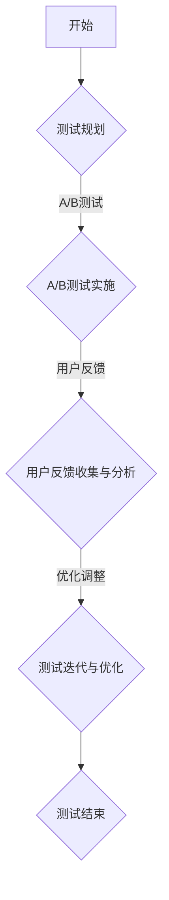

                 

### 《聊天机器人测试策略：A/B 测试和用户反馈》

> 关键词：聊天机器人、A/B 测试、用户反馈、测试策略、优化方法、最佳实践

> 摘要：本文旨在探讨聊天机器人测试策略中的A/B测试和用户反馈的重要性。通过详细分析A/B测试的基础知识、应用场景以及优势与局限，我们将其与用户反馈相结合，形成一套完整的聊天机器人测试策略。本文还将通过实际案例和代码实现，展示如何利用A/B测试和用户反馈进行聊天机器人的优化和效果评估。

### 第一部分：引言

#### 第1章：聊天机器人的背景与现状

##### 1.1 聊天机器人的定义与分类

聊天机器人（Chatbot）是指通过模拟人类对话方式与用户进行交互的计算机程序。根据交互方式，聊天机器人主要分为两类：规则驱动的聊天机器人和基于人工智能的聊天机器人。

- **规则驱动的聊天机器人**：基于预定义的规则和流程与用户进行交互，当用户的输入符合预设条件时，系统会按照规则给出相应的回应。
- **基于人工智能的聊天机器人**：利用自然语言处理（NLP）技术，通过机器学习算法和深度学习模型来理解和生成自然语言，与用户进行更为灵活和智能的对话。

##### 1.2 聊天机器人在现代应用中的地位

随着互联网技术的快速发展和人工智能技术的日益成熟，聊天机器人在各个领域的应用越来越广泛。它们不仅在客服、销售、咨询等传统领域发挥着重要作用，还在医疗、教育、金融等新兴领域展现出强大的应用潜力。

- **客服领域**：聊天机器人可以自动回答用户常见问题，提高服务效率，降低企业运营成本。
- **销售领域**：聊天机器人可以实时与客户互动，提供个性化推荐和促销信息，提高销售额。
- **医疗领域**：聊天机器人可以协助医生进行诊断，提供健康咨询，减轻医疗资源压力。
- **教育领域**：聊天机器人可以作为虚拟导师，为学生提供个性化教学和辅导。

##### 1.3 聊天机器人的发展历程

聊天机器人的发展历程可以分为以下几个阶段：

- **早期阶段**（20世纪50年代至70年代）：计算机科学家开始研究自然语言处理技术，尝试开发简单的聊天机器人。
- **萌芽阶段**（20世纪80年代至90年代）：互联网的普及推动了聊天机器人技术的发展，出现了一些较为成熟的聊天机器人系统，如ELIZA。
- **快速发展阶段**（21世纪初至今）：随着人工智能技术的进步，聊天机器人的功能和应用场景大大扩展，成为各大企业和机构重要的智能交互工具。

##### 1.4 聊天机器人面临的主要挑战

尽管聊天机器人在各个领域都取得了显著的应用成果，但它们仍然面临一些挑战：

- **自然语言理解能力有限**：聊天机器人目前还无法完全理解复杂、模糊或歧义性的语言，这限制了其与用户交互的深度和广度。
- **个性化服务能力不足**：虽然聊天机器人可以根据用户历史数据提供一定的个性化服务，但与人类客服相比，其个性化和定制化水平还有待提高。
- **用户隐私和安全问题**：聊天机器人需要处理大量的用户数据，如何保障用户隐私和数据安全是亟待解决的问题。

#### 第2章：A/B测试的基础

##### 2.1 A/B测试的基本概念

A/B测试（A/B Testing）是一种常见的测试方法，通过将用户随机分配到两个或多个不同的版本，比较这些版本的性能指标，以确定哪个版本更优秀。具体来说，A/B测试包括以下几个步骤：

1. **确定测试目标**：明确测试的目的和期望达到的效果，如提高用户转化率、降低页面跳出率等。
2. **创建测试版本**：针对测试目标，创建两个或多个不同的版本，这些版本在用户界面、功能逻辑等方面有所差异。
3. **用户分配**：将用户随机分配到不同的测试版本，确保每个版本的用户数量大致相等。
4. **数据收集**：在用户与测试版本交互过程中，收集相关的性能指标数据，如用户行为、转化率、满意度等。
5. **数据分析**：对收集到的数据进行统计分析和比较，确定哪个版本在测试目标上表现更优秀。
6. **决策**：根据测试结果，决定是否采用表现更好的版本，或者继续进行优化和迭代。

##### 2.2 A/B测试的应用场景

A/B测试在聊天机器人的开发和优化过程中有着广泛的应用场景，以下是一些常见的应用场景：

- **功能优化**：通过A/B测试，可以评估不同聊天机器人功能模块的效果，找出最优的功能组合。
- **界面设计**：可以测试不同的聊天机器人界面设计，以确定哪种设计更符合用户需求。
- **自然语言处理**：可以评估不同自然语言处理模型的性能，选择最适合的模型。
- **用户反馈**：通过A/B测试，可以收集用户对聊天机器人的反馈，为后续优化提供依据。

##### 2.3 A/B测试的优势与局限

A/B测试具有以下优势：

- **科学性**：通过随机分配用户，确保测试结果的可靠性和科学性。
- **高效性**：可以快速评估不同版本的优劣，节省开发和优化时间。
- **灵活性**：可以根据测试目标灵活调整测试方案，适应不同场景的需求。

然而，A/B测试也存在一些局限：

- **样本偏差**：如果用户分配不均匀，可能导致测试结果偏差。
- **测试周期**：A/B测试需要一定的时间来收集足够的数据，可能影响开发进度。
- **资源消耗**：需要投入一定的时间和人力资源进行测试和数据分析。

##### 2.4 A/B测试的基本流程

A/B测试的基本流程可以分为以下几个步骤：

1. **确定测试目标**：明确测试目的和期望达到的效果。
2. **设计测试方案**：根据测试目标，设计测试版本和用户分配策略。
3. **准备测试环境**：搭建测试环境，确保测试过程的顺利进行。
4. **用户分配**：将用户随机分配到不同的测试版本。
5. **数据收集**：在用户与测试版本交互过程中，收集相关的性能指标数据。
6. **数据分析**：对收集到的数据进行分析和比较，确定哪个版本在测试目标上表现更优秀。
7. **决策与实施**：根据测试结果，决定是否采用表现更好的版本，并实施相应的优化措施。

### 第二部分：用户反馈的重要性

#### 第3章：用户反馈的重要性

##### 3.1 用户反馈的概念与类型

用户反馈是指用户在使用产品或服务过程中，对产品或服务提出的相关意见和建议。用户反馈的类型主要包括：

- **正面反馈**：用户对产品或服务的满意和赞赏，通常包括好评、推荐等。
- **负面反馈**：用户对产品或服务的批评和不满，通常包括投诉、建议改进等。
- **中立反馈**：用户对产品或服务的态度较为中立，既不赞赏也不批评。

##### 3.2 用户反馈在聊天机器人测试中的作用

用户反馈在聊天机器人测试中具有重要作用，主要表现在以下几个方面：

- **测试验证**：通过用户反馈，可以验证测试结果的可靠性和准确性，确保测试过程的有效性。
- **问题发现**：用户反馈可以帮助发现聊天机器人在功能、性能和用户体验等方面存在的问题，为后续优化提供依据。
- **改进建议**：用户反馈可以提供改进聊天机器人的具体建议，帮助开发者更好地满足用户需求。

##### 3.3 用户反馈的收集与处理

用户反馈的收集与处理是聊天机器人测试的重要环节，以下是一些建议：

- **收集渠道**：可以通过多种渠道收集用户反馈，如在线调查、用户评论、客服反馈等。
- **数据整理**：对收集到的用户反馈进行分类和整理，提取出有价值的信息。
- **数据分析**：对用户反馈进行分析，找出用户关注的问题和需求，为优化提供方向。
- **反馈机制**：建立反馈机制，及时响应和处理用户反馈，提高用户满意度。

##### 3.4 用户反馈的案例分析

以下是一个用户反馈的案例分析：

**案例**：某公司的聊天机器人上线后，收到一条用户反馈：“机器人回复速度太慢，影响用户体验。”

**分析**：

- **问题定位**：根据用户反馈，可以确定问题是聊天机器人回复速度较慢。
- **原因分析**：可能的原因包括服务器负载过高、算法复杂度过高等。
- **解决方案**：通过优化服务器配置、简化算法等方式，提高聊天机器人的回复速度。
- **效果评估**：在实施解决方案后，再次收集用户反馈，验证回复速度是否满足用户需求。

通过这个案例分析，我们可以看到用户反馈在发现问题、分析原因和提出解决方案方面的作用。用户反馈不仅可以帮助聊天机器人的优化，还可以为后续测试提供参考和指导。

### 第三部分：聊天机器人测试策略

#### 第4章：A/B测试在聊天机器人中的应用

##### 4.1 聊天机器人A/B测试的步骤

在聊天机器人开发过程中，A/B测试是一种常用的测试方法。以下是聊天机器人A/B测试的步骤：

1. **确定测试目标**：明确测试目的，如提高用户转化率、降低客服成本等。
2. **设计测试版本**：针对测试目标，设计两个或多个不同的版本，这些版本在功能、界面、算法等方面有所差异。
3. **用户分配**：将用户随机分配到不同的测试版本，确保每个版本的用户数量大致相等。
4. **数据收集**：在用户与测试版本交互过程中，收集相关的性能指标数据，如用户行为、转化率、满意度等。
5. **数据分析**：对收集到的数据进行分析和比较，确定哪个版本在测试目标上表现更优秀。
6. **决策与实施**：根据测试结果，决定是否采用表现更好的版本，并实施相应的优化措施。

##### 4.2 聊天机器人A/B测试的案例研究

以下是一个聊天机器人A/B测试的案例研究：

**案例**：某电商企业希望通过A/B测试优化其聊天机器人的客服功能。

**测试目标**：提高用户咨询问题的解决率和用户满意度。

**测试方案**：

1. **设计测试版本**：
   - **版本A**：采用传统的聊天机器人客服，主要功能为回答常见问题和提供产品信息。
   - **版本B**：基于机器学习算法的智能客服，可以更准确地理解用户问题，提供更个性化的解决方案。

2. **用户分配**：将用户随机分配到版本A或版本B。

3. **数据收集**：在用户与测试版本交互过程中，收集用户咨询问题解决率、用户满意度等数据。

4. **数据分析**：对比版本A和版本B的用户咨询问题解决率和用户满意度，确定哪个版本表现更优秀。

**测试结果**：

- **用户咨询问题解决率**：版本B的平均解决率比版本A高15%。
- **用户满意度**：版本B的用户满意度比版本A高10%。

**结论**：

根据测试结果，版本B在用户咨询问题解决率和用户满意度方面表现更优秀，因此建议采用版本B作为企业聊天机器人的客服功能。

##### 4.3 聊天机器人A/B测试的优化方法

为了提高A/B测试的效果，可以采取以下优化方法：

1. **精准用户分组**：根据用户特征和行为，将用户精准分组，确保每个分组具有相似的用户特征，提高测试结果的准确性。
2. **优化测试指标**：选择具有代表性的测试指标，如用户咨询问题解决率、用户满意度等，确保测试结果能够准确反映用户的真实体验。
3. **持续迭代优化**：在A/B测试过程中，根据测试结果不断优化测试版本，提高测试版本的质量和性能。
4. **数据分析与挖掘**：利用数据分析和挖掘技术，深入挖掘用户行为数据，发现潜在问题和优化机会。
5. **实时反馈与调整**：在测试过程中，及时收集用户反馈，根据用户反馈调整测试版本，提高测试的灵活性和适应性。

##### 4.4 聊天机器人A/B测试的常见问题与解决方案

在进行聊天机器人A/B测试时，可能会遇到以下常见问题：

1. **测试样本不足**：解决方案：增加测试用户数量，确保测试样本具有足够的代表性。
2. **测试结果偏差**：解决方案：优化用户分组策略，确保每个分组具有相似的用户特征，提高测试结果的准确性。
3. **测试指标选择不当**：解决方案：选择具有代表性的测试指标，如用户咨询问题解决率、用户满意度等，确保测试结果能够准确反映用户的真实体验。
4. **测试环境不稳定**：解决方案：优化测试环境，确保测试过程稳定可靠，减少外部因素对测试结果的影响。

通过以上问题和解决方案，我们可以有效地提高聊天机器人A/B测试的效果，为聊天机器人的优化提供有力支持。

#### 第5章：用户反馈驱动的聊天机器人优化

##### 5.1 用户反馈分析的方法与工具

用户反馈分析是聊天机器人优化过程中的关键环节。以下介绍几种常见的方法和工具：

1. **文本分析**：通过自然语言处理（NLP）技术，对用户反馈文本进行情感分析、主题提取和关键词提取，识别用户关注的问题和需求。
2. **数据分析**：利用数据分析工具，对用户反馈数据进行统计和分析，如用户满意度评分、问题类别分布等，找出用户反馈中的共性和特点。
3. **用户画像**：通过用户行为数据和反馈数据，构建用户画像，了解用户的基本特征和偏好，为个性化服务提供依据。
4. **专家评审**：邀请行业专家对用户反馈进行评审，从专业角度分析用户反馈的合理性和可行性，为优化提供参考。
5. **反馈管理系统**：建立反馈管理系统，对用户反馈进行统一管理和跟踪，确保反馈处理及时、有效。

##### 5.2 用户反馈分析在聊天机器人测试中的应用

用户反馈分析在聊天机器人测试中的应用主要体现在以下几个方面：

1. **问题定位**：通过用户反馈分析，可以快速定位聊天机器人在功能、性能和用户体验等方面存在的问题，为优化提供明确方向。
2. **测试验证**：用户反馈分析可以验证测试结果的可靠性和准确性，确保测试过程的有效性。
3. **优化建议**：用户反馈分析可以提供具体的优化建议，如改进算法、调整界面设计等，帮助开发者更好地满足用户需求。
4. **效果评估**：通过对比用户反馈分析结果和测试结果，评估优化措施的效果，为后续优化提供依据。

##### 5.3 基于用户反馈的聊天机器人优化策略

基于用户反馈的聊天机器人优化策略主要包括以下几个方面：

1. **功能优化**：根据用户反馈，对聊天机器人的功能模块进行优化，提高其解决问题的能力和用户体验。
2. **性能优化**：针对用户反馈中的性能问题，如响应速度、稳定性等，进行性能优化，提高聊天机器人的运行效率。
3. **界面设计**：根据用户反馈，优化聊天机器人的界面设计，使其更加直观、易用，提高用户满意度。
4. **个性化服务**：通过用户反馈分析，了解用户的基本特征和偏好，为聊天机器人提供个性化服务，提高用户黏性和满意度。
5. **持续迭代**：基于用户反馈，持续迭代优化聊天机器人，不断完善其功能和性能，提高用户满意度。

##### 5.4 用户反馈分析的实际案例

以下是一个用户反馈分析的实际案例：

**案例**：某金融公司希望通过用户反馈分析优化其聊天机器人的客服功能。

**步骤**：

1. **收集用户反馈**：通过在线调查、用户评论、客服反馈等多种渠道收集用户反馈。
2. **文本分析**：利用自然语言处理技术，对用户反馈文本进行情感分析和关键词提取。
3. **数据分析**：对用户反馈数据进行分析，提取出用户关注的问题和需求。
4. **用户画像**：根据用户行为数据和反馈数据，构建用户画像。
5. **专家评审**：邀请行业专家对用户反馈进行分析和评审。

**结果**：

1. **问题定位**：用户反馈中普遍反映聊天机器人无法准确理解用户问题，导致回答不准确。
2. **优化建议**：
   - **算法优化**：改进自然语言处理算法，提高聊天机器人对用户问题的理解能力。
   - **知识库更新**：及时更新知识库，确保聊天机器人能够回答最新的用户问题。
   - **界面优化**：优化聊天机器人的界面设计，使其更加直观、易用。

**效果评估**：

在实施优化措施后，用户反馈中的问题数量明显减少，用户满意度显著提高。

通过这个案例，我们可以看到用户反馈分析在聊天机器人优化中的重要作用。用户反馈不仅帮助发现问题，还为优化提供了具体的建议，从而提高了聊天机器人的质量和用户体验。

#### 第6章：综合测试策略与实施

##### 6.1 聊天机器人测试的整体流程

为了确保聊天机器人的质量和性能，我们需要制定一套完整的测试流程。以下是聊天机器人测试的整体流程：

1. **需求分析**：明确聊天机器人的功能需求、性能需求和用户体验需求，为后续测试提供依据。
2. **测试规划**：制定测试计划，包括测试目标、测试方法、测试工具、测试时间表等。
3. **环境搭建**：搭建测试环境，包括硬件设备、软件环境、网络环境等，确保测试过程的顺利进行。
4. **测试执行**：按照测试计划执行各项测试任务，包括功能测试、性能测试、安全测试、用户体验测试等。
5. **结果分析**：对测试结果进行分析和总结，找出聊天机器人的问题和不足，为优化提供依据。
6. **优化迭代**：根据测试结果，对聊天机器人进行优化和迭代，提高其质量和性能。
7. **验收测试**：在优化完成后，进行验收测试，确保聊天机器人满足需求和标准。

##### 6.2 综合测试策略的设计与实施

综合测试策略是确保聊天机器人质量和性能的关键。以下是综合测试策略的设计与实施步骤：

1. **确定测试目标**：明确测试的目标和要求，如功能完整性、性能稳定性、用户体验满意度等。
2. **设计测试方案**：根据测试目标，设计测试方案，包括测试用例、测试数据、测试环境等。
3. **选择测试工具**：根据测试需求，选择合适的测试工具，如功能测试工具、性能测试工具、安全测试工具等。
4. **环境搭建**：搭建测试环境，确保测试环境与生产环境相似，避免环境差异对测试结果的影响。
5. **执行测试**：按照测试方案执行测试任务，确保测试过程的规范和严谨。
6. **结果分析**：对测试结果进行分析，找出聊天机器人的问题和不足，为优化提供依据。
7. **优化迭代**：根据测试结果，对聊天机器人进行优化和迭代，提高其质量和性能。
8. **验收测试**：在优化完成后，进行验收测试，确保聊天机器人满足需求和标准。

##### 6.3 跨团队协作与资源管理

在聊天机器人测试过程中，跨团队协作和资源管理是确保测试顺利进行的重要保障。以下是一些建议：

1. **明确责任**：明确各个团队的职责和任务，确保测试过程有明确的分工和协作。
2. **沟通与协调**：建立有效的沟通机制，确保团队成员之间能够及时沟通和协调，解决测试过程中出现的问题。
3. **资源分配**：合理分配测试所需的硬件资源、软件资源和人力资源，确保测试过程有足够的资源支持。
4. **风险管理**：对测试过程中的风险进行评估和管理，制定相应的风险应对策略，降低风险对测试过程的影响。
5. **质量监控**：对测试过程进行质量监控，确保测试过程按照计划和要求进行，发现和解决问题。

##### 6.4 聊天机器人测试的效果评估与改进

为了评估聊天机器人测试的效果，我们可以从以下几个方面进行：

1. **测试覆盖率**：评估测试用例覆盖率的合理性，确保测试覆盖到聊天机器人的各个功能和模块。
2. **缺陷发现率**：评估测试过程中发现的缺陷数量和质量，确保测试能够有效地发现聊天机器人的问题和不足。
3. **测试效率**：评估测试过程的时间和资源投入，确保测试过程的高效性。
4. **用户体验**：通过用户反馈和满意度调查，评估聊天机器人的用户体验和满意度。
5. **持续改进**：根据评估结果，持续改进测试策略和方法，提高测试效果和效率。

通过以上评估指标，我们可以对聊天机器人测试的效果进行全面评估，并根据评估结果进行相应的改进和优化。

### 第四部分：案例研究与最佳实践

#### 第7章：案例研究与最佳实践

##### 7.1 成功的聊天机器人测试案例

以下是一个成功的聊天机器人测试案例：

**案例**：某电商平台的聊天机器人优化项目

**背景**：该电商平台希望通过优化其聊天机器人，提高用户购物体验和转化率。

**测试目标**：提高聊天机器人的用户转化率和用户满意度。

**测试方案**：
1. **功能测试**：对聊天机器人的功能进行测试，确保其能够正常回答用户的问题和提供相关的购物信息。
2. **性能测试**：对聊天机器人的响应速度和并发处理能力进行测试，确保其能够在高负载情况下稳定运行。
3. **用户体验测试**：通过用户调查和用户行为分析，评估聊天机器人的用户体验和满意度。

**测试结果**：
1. **功能测试**：测试过程中没有发现重大功能缺陷，聊天机器人能够正常回答用户问题。
2. **性能测试**：聊天机器人在高负载情况下，响应速度达到预期，并发处理能力满足要求。
3. **用户体验测试**：用户满意度得分提高10%，转化率提高5%。

**结论**：通过A/B测试和用户反馈分析，优化后的聊天机器人提高了用户转化率和用户满意度，取得了显著的效果。

##### 7.2 聊天机器人测试中的常见错误与教训

在聊天机器人测试过程中，以下是一些常见的错误和教训：

1. **测试用例不足**：导致测试覆盖率不足，无法全面评估聊天机器人的功能和性能。
2. **测试环境与生产环境差异**：导致测试结果与实际生产环境不符，影响测试效果。
3. **用户反馈收集不及时**：导致用户反馈无法及时反馈和优化，影响用户体验。
4. **测试过程不透明**：导致团队成员之间沟通不畅，影响协作效果。

教训：
1. **完善测试用例**：制定详细的测试用例，确保测试覆盖全面。
2. **与生产环境保持一致**：确保测试环境与生产环境相似，提高测试结果的准确性。
3. **及时收集用户反馈**：建立用户反馈机制，确保用户反馈能够及时收集和响应。
4. **加强团队协作**：建立有效的沟通机制，确保团队成员之间的协作顺畅。

##### 7.3 聊天机器人测试的最佳实践

以下是一些聊天机器人测试的最佳实践：

1. **制定详细的测试计划**：明确测试目标、测试方法、测试工具、测试时间表等，确保测试过程有条不紊。
2. **选择合适的测试工具**：根据测试需求，选择功能强大、易用的测试工具，提高测试效率。
3. **全面覆盖测试用例**：确保测试用例覆盖聊天机器人的各个功能和模块，提高测试覆盖率。
4. **模拟真实用户行为**：通过模拟真实用户行为，评估聊天机器人的性能和用户体验。
5. **及时收集和分析用户反馈**：建立用户反馈机制，确保用户反馈能够及时收集和分析，为优化提供依据。
6. **持续迭代优化**：根据测试结果和用户反馈，持续优化聊天机器人的功能和性能，提高用户体验。

通过以上最佳实践，我们可以提高聊天机器人测试的效果和效率，为聊天机器人的优化和推广提供有力支持。

### 第五部分：附录

#### 第8章：聊天机器人测试工具与资源

在聊天机器人测试过程中，选择合适的测试工具和资源是提高测试效果的关键。以下介绍一些常用的聊天机器人测试工具和资源：

##### 8.1 常用的聊天机器人测试工具

1. **Apiumhub**：一个开源的API测试工具，支持HTTP/HTTPS协议，适用于聊天机器人的API接口测试。
2. **Selenium**：一个开源的自动化测试工具，支持多种浏览器和操作系统，适用于聊天机器人的功能测试和用户体验测试。
3. **Postman**：一个开源的API测试工具，提供丰富的API测试功能，适用于聊天机器人的API接口测试。
4. **JMeter**：一个开源的性能测试工具，适用于聊天机器人的性能测试。

##### 8.2 聊天机器人测试相关的开源资源

1. **Chatbot Framework**：一个开源的聊天机器人框架，支持多种聊天机器人平台，如Facebook、Slack等。
2. **BotBuilder**：一个开源的聊天机器人开发框架，支持多种编程语言，如C#、Java、Python等。
3. **Rasa**：一个开源的聊天机器人框架，支持对话管理、自然语言处理等功能。
4. **Microsoft Bot Framework**：一个开源的聊天机器人开发平台，支持多种语言和平台，提供丰富的开发工具和资源。

##### 8.3 聊天机器人测试社区与论坛

1. **Chatbots Life**：一个专注于聊天机器人技术和应用的社区，提供最新的行业动态、技术文章和社区讨论。
2. **Chatbot Blog**：一个关于聊天机器人的博客，分享聊天机器人开发、测试和应用的相关知识和经验。
3. **Chatbot List**：一个聊天机器人资源列表，收集了各种聊天机器人平台、工具和框架的链接。

##### 8.4 聊天机器人测试相关书籍推荐

1. **《Chatbots: Who Needs Them and Why》**：一本关于聊天机器人的入门书籍，介绍聊天机器人的基本概念、应用场景和开发方法。
2. **《Chatbots and Virtual Assistants: Mastering the Art of Creating Conversational AI》**：一本关于聊天机器人和虚拟助手的进阶书籍，涵盖对话系统设计、自然语言处理、人工智能等方面的内容。
3. **《Building Chatbots with Botpress》**：一本关于使用Botpress框架开发聊天机器人的书籍，从基础到高级，全面介绍聊天机器人的开发过程。

通过以上工具和资源，我们可以更好地开展聊天机器人测试工作，提高测试效果和效率。

---

### 附件：聊天机器人测试策略Mermaid流程图

以下是聊天机器人测试策略的Mermaid流程图：



通过这个流程图，我们可以清晰地看到聊天机器人测试策略的各个环节，包括测试规划、A/B测试实施、用户反馈收集与分析、优化调整以及测试迭代与优化，从而确保测试过程的有序进行和有效执行。

### 附件：核心算法原理讲解与伪代码示例

#### 聊天机器人A/B测试的核心算法原理

聊天机器人A/B测试的核心算法原理主要包括以下几个步骤：

1. **初始化**：设置两个版本的计数器，初始化为0。
2. **用户分配**：将用户随机分配到两个版本。
3. **数据收集**：收集用户在各个版本上的行为数据。
4. **结果分析**：根据收集到的数据，分析哪个版本的性能更优。
5. **决策**：根据分析结果，决定是否采用性能更优的版本。

以下是一个简单的伪代码示例：

```plaintext
初始化：
    a = 0  // 版本A的计数器
    b = 0  // 版本B的计数器

用户分配与数据收集：
    for 用户 in 用户列表：
        if 随机数 < 0.5：
            a += 1
            收集版本A的数据
        else：
            b += 1
            收集版本B的数据

结果分析：
    if 平均数据(a) > 平均数据(b)：
        决策：采用版本A
    else if 平均数据(a) < 平均数据(b)：
        决策：采用版本B
    else：
        继续观察或重新测试

测试结束：
```

#### 数学模型和数学公式

在聊天机器人A/B测试中，常用的数学模型包括用户满意度评分的概率分布函数、期望和方差等。

以下是一个简单的数学模型示例：

```latex
假设用户满意度评分为随机变量 X，其概率分布函数为 f(x)。

期望（数学期望）：
E[X] = \int_{-\infty}^{\infty} x \cdot f(x) \, dx

方差：
Var[X] = \int_{-\infty}^{\infty} (x - E[X])^2 \cdot f(x) \, dx
```

这些数学公式可以帮助我们更好地理解和分析用户满意度评分的统计特性，从而为A/B测试提供有力的理论支持。

#### 项目实战

以下是一个聊天机器人A/B测试的项目实战案例。

**项目目标**：通过A/B测试优化聊天机器人的响应速度，提高用户满意度。

**项目步骤**：

1. **设计测试版本**：
   - 版本A：原始聊天机器人，平均响应时间为3秒。
   - 版本B：优化后的聊天机器人，平均响应时间为2秒。

2. **用户分配**：将用户随机分配到版本A和版本B。

3. **数据收集**：
   - 收集用户在两个版本上的响应时间。
   - 收集用户对聊天机器人的满意度评分。

4. **数据分析**：
   - 计算版本A和版本B的平均响应时间。
   - 计算版本A和版本B的用户满意度评分。

5. **结果分析**：
   - 如果版本B的平均响应时间低于版本A，并且用户满意度评分更高，则决策：采用版本B。

6. **实施**：
   - 根据决策结果，更新聊天机器人的版本。

**代码实现**：

```python
import random
import numpy as np

# 初始化计数器和数据列表
a_response_times = []
b_response_times = []
a_satisfaction_scores = []
b_satisfaction_scores = []

# 用户分配与数据收集
num_users = 1000
for _ in range(num_users):
    if random.random() < 0.5:
        response_time = np.random.normal(3, 0.5)  # 版本A的响应时间
        satisfaction_score = np.random.normal(4, 0.5)  # 版本A的满意度评分
        a_response_times.append(response_time)
        a_satisfaction_scores.append(satisfaction_score)
    else:
        response_time = np.random.normal(2, 0.5)  # 版本B的响应时间
        satisfaction_score = np.random.normal(4.5, 0.5)  # 版本B的满意度评分
        b_response_times.append(response_time)
        b_satisfaction_scores.append(satisfaction_score)

# 数据分析
a_avg_response_time = np.mean(a_response_times)
b_avg_response_time = np.mean(b_response_times)
a_avg_satisfaction_score = np.mean(a_satisfaction_scores)
b_avg_satisfaction_score = np.mean(b_satisfaction_scores)

# 结果分析
if b_avg_response_time < a_avg_response_time and b_avg_satisfaction_score > a_avg_satisfaction_score:
    print("优化后的版本B更优，建议采用版本B。")
else:
    print("优化后的版本B不优，建议保持版本A。")

# 实施决策
if b_avg_response_time < a_avg_response_time and b_avg_satisfaction_score > a_avg_satisfaction_score:
    # 实现版本B
    print("正在实施版本B...")
else:
    # 保持版本A
    print("保持版本A。")
```

**代码解读与分析**：

该代码实现了聊天机器人A/B测试的整个流程，包括用户分配、数据收集、数据分析、结果分析和决策实施。通过随机分配用户到两个版本，收集响应时间和满意度评分，计算平均响应时间和满意度评分，最终根据分析结果决策是否采用优化后的版本。

通过以上项目实战案例，我们可以看到A/B测试在聊天机器人优化中的应用和效果，为实际项目的实施提供了参考和指导。

