                 

### 文章标题：聊天机器人生活窍门：日常问题解决方案和建议

### 关键词：聊天机器人，日常问题，解决方案，建议，AI，智能互动，个性化推荐，安全性

### 摘要：
本文将深入探讨聊天机器人在日常生活中的应用，从其崛起、构建方法到实际解决方案，再到智能互动和个性化推荐，以及行业应用和未来趋势，全方位解析聊天机器人在现代生活中的重要性和潜力。我们将通过具体案例和算法原理，展示如何利用聊天机器人解决日常问题，提供实用建议，并探讨其在安全与隐私保护方面的挑战。通过本文的阅读，读者将对聊天机器人的应用有更加全面和深刻的理解。

### 目录

#### 第一部分：概述

- **第1章：聊天机器人的崛起**
  - **1.1 聊天机器人的历史与发展**
    - **1.1.1 聊天机器人的起源**
    - **1.1.2 聊天机器人技术的发展**
    - **1.1.3 聊天机器人在现代社会的应用**

  - **1.2 聊天机器人的生活作用**

- **第2章：构建聊天机器人**
  - **2.1 选择合适的聊天机器人平台**
    - **2.1.1 公共聊天机器人平台**
    - **2.1.2 私有聊天机器人平台**

  - **2.2 聊天机器人核心组件**
    - **2.2.1 自然语言处理（NLP）**
    - **2.2.2 机器学习与深度学习**
    - **2.2.3 语音识别与合成**

  - **2.3 聊天机器人的开发流程**
    - **2.3.1 需求分析**
    - **2.3.2 设计与实现**
    - **2.3.3 测试与优化**

- **第3章：日常问题解决方案**
  - **3.1 旅行与交通问题**
    - **3.1.1 查询航班信息**
    - **3.1.2 预订酒店与餐厅**
    - **3.1.3 导航与路线规划**

  - **3.2 生活服务问题**
    - **3.2.1 查询天气预报**
    - **3.2.2 购物与支付**
    - **3.2.3 查询快递信息**

  - **3.3 医疗与健康问题**
    - **3.3.1 常见疾病咨询**
    - **3.3.2 预约挂号与问诊**
    - **3.3.3 健康管理建议**

- **第4章：智能互动与个性化推荐**
  - **4.1 聊天机器人的智能互动**
    - **4.1.1 语言理解与情感分析**
    - **4.1.2 人机对话策略**
    - **4.1.3 智能问答系统**

  - **4.2 个性化推荐**
    - **4.2.1 用户画像构建**
    - **4.2.2 内容推荐算法**
    - **4.2.3 个性化体验优化**

- **第5章：聊天机器人在行业中的应用**
  - **5.1 零售行业**
    - **5.1.1 购物咨询与服务**
    - **5.1.2 促销与营销策略**

  - **5.2 金融行业**
    - **5.2.1 客户服务与咨询**
    - **5.2.2 风险管理**

  - **5.3 教育行业**
    - **5.3.1 在线教育辅助**
    - **5.3.2 学生咨询服务**

- **第6章：安全与隐私问题**
  - **6.1 聊天机器人的安全性**
    - **6.1.1 防御恶意攻击**
    - **6.1.2 数据安全与保护**

  - **6.2 用户隐私保护**
    - **6.2.1 隐私政策制定**
    - **6.2.2 用户数据收集与使用规范**

- **第7章：聊天机器人的未来趋势**
  - **7.1 人工智能与聊天机器人融合**
    - **7.1.1 人工智能技术的最新进展**
    - **7.1.2 聊天机器人在未来社会中的应用前景**

  - **7.2 新型聊天机器人设计理念**
    - **7.2.1 以用户为中心的设计**
    - **7.2.2 智能化与人性化的平衡**

#### 第二部分：附录

- **附录A：聊天机器人开发资源**
  - **A.1 开发工具与平台**
  - **A.2 学习资料与教程**
  - **A.3 论坛与社群**

- **附录B：聊天机器人核心算法与模型**
  - **B.1 自然语言处理算法**
  - **B.2 机器学习算法**
  - **B.3 深度学习模型**

- **附录C：聊天机器人项目实战案例**
  - **C.1 案例一：智能客服机器人**
  - **C.2 案例二：教育机器人**
  - **C.3 案例三：健康咨询机器人**

### 引言

随着人工智能技术的不断发展和普及，聊天机器人已经成为我们日常生活中不可或缺的一部分。从简单的信息查询到复杂的决策支持，聊天机器人正以其高效、智能和便捷的特点，深刻改变着我们的生活和工作方式。本文旨在通过全面解析聊天机器人的应用场景、构建方法、解决方案以及未来发展，帮助读者深入了解这一技术的核心价值和实际应用，从而更好地利用聊天机器人解决日常生活中的实际问题。

首先，本文将回顾聊天机器人的历史与发展，介绍其起源、技术演变以及现代社会中的应用，为读者提供背景知识。接着，我们将深入探讨如何构建聊天机器人，包括选择合适的平台、核心组件及其开发流程。在此基础上，本文将重点介绍聊天机器人在解决日常问题方面的具体应用，如旅行与交通、生活服务和医疗与健康等。同时，我们将详细讲解聊天机器人的智能互动和个性化推荐技术，展示如何通过这些技术提升用户体验。此外，本文还将分析聊天机器人在不同行业中的应用案例，探讨其在安全与隐私保护方面的挑战，并提出解决方案。最后，我们将展望聊天机器人的未来发展趋势，讨论新型设计理念和技术创新，为读者提供对这一领域的深入洞察。

通过本文的阅读，读者不仅可以了解聊天机器人的基础知识，还能够掌握其实际应用技巧，从而在日常生活中充分利用这一技术，提高生活质量和工作效率。

### 第1章：聊天机器人的崛起

#### 1.1 聊天机器人的历史与发展

聊天机器人的概念可以追溯到20世纪50年代，当时计算机科学家艾伦·图灵（Alan Turing）提出了著名的图灵测试。这一测试旨在判断一个计算机是否具备人类水平的智能，即是否能以一种让人类无法区分的方式与人类进行对话。虽然最初的图灵测试更多是一种理论上的探讨，但它激发了人们对于机器与人类交流的兴趣，也为后来的聊天机器人研究奠定了基础。

进入20世纪60年代，随着计算机技术的不断发展，聊天机器人开始逐渐走向实际应用。早期的聊天机器人主要以规则为基础，即通过预定义的规则来处理用户输入，并生成相应的输出。这一时期的代表性聊天机器人包括ELIZA和PARRY。ELIZA是由约翰·迈克卡锡（John McCarthy）等人于1966年开发的，它是第一个广泛使用的聊天机器人，能够模拟心理治疗师与患者之间的对话。虽然ELIZA的功能非常有限，但它标志着聊天机器人技术的发展迈出了第一步。PARRY则是在ELIZA的基础上进一步发展的，它能够更好地模拟人类思维过程，进行更复杂的对话。

20世纪80年代，随着人工智能技术的进步，聊天机器人的功能也得到了显著提升。这一时期出现了许多基于知识库和推理机制的聊天机器人，如ALICE、A.L.I.C.E.和Jabberwacky。这些聊天机器人不仅能够理解用户输入的语义，还能够通过学习和适应用户的交流风格，进行更加自然和流畅的对话。

进入21世纪，聊天机器人技术迎来了新的发展机遇。随着互联网的普及和移动设备的普及，聊天机器人开始广泛应用于各种场景，如客服、社交、娱乐和医疗等。这一时期的代表性聊天机器人包括Apple的Siri、Google的Google Assistant和Facebook的Facebook Messenger等。这些聊天机器人不仅具备强大的自然语言处理能力，还能够通过深度学习和机器学习技术，实现更加智能和个性化的交互。

近年来，随着人工智能技术的迅猛发展，聊天机器人的应用场景和功能得到了进一步的拓展。例如，在医疗领域，聊天机器人被用于提供健康咨询、疾病诊断和患者管理等服务；在教育领域，聊天机器人被用于提供在线教育辅导和学生咨询服务；在零售领域，聊天机器人被用于提供购物咨询和个性化推荐服务等。同时，聊天机器人还开始在金融、物流、法律等多个领域发挥作用，成为企业提高服务效率和用户体验的重要工具。

#### 1.1.2 聊天机器人技术的发展

从技术角度来看，聊天机器人的发展可以分为几个阶段。首先是基于规则的聊天机器人，这种聊天机器人通过预定义的规则来处理用户输入，生成相应的输出。虽然这种方法的处理速度相对较慢，但可以实现简单的对话功能。

随着人工智能技术的进步，基于知识库的聊天机器人应运而生。这种聊天机器人通过构建庞大的知识库，利用自然语言处理技术，对用户输入进行理解和分析，并生成相应的输出。与基于规则的聊天机器人相比，基于知识库的聊天机器人具备更强的语义理解能力，能够进行更加复杂和自然的对话。

近年来，随着深度学习和机器学习技术的发展，基于深度学习的聊天机器人逐渐成为主流。这种聊天机器人利用神经网络模型，通过大量的数据训练，实现对用户输入的自动理解和生成相应的输出。与基于规则和知识库的聊天机器人相比，基于深度学习的聊天机器人具备更高的灵活性和自适应能力，能够实现更加智能和个性化的交互。

#### 1.1.3 聊天机器人在现代社会的应用

在现代社会的各个领域，聊天机器人发挥着越来越重要的作用。以下是一些主要的应用场景：

1. **客服与客户服务**：聊天机器人被广泛应用于客服领域，用于处理用户查询、解决常见问题和提供24/7的在线支持。通过聊天机器人，企业可以显著提高服务效率，减少人力成本，并提供更加个性化和高效的客户服务。

2. **个人助手与智能助理**：聊天机器人被用作个人助手，帮助用户管理日程、设置提醒、发送通知和执行任务。例如，Apple的Siri和Google的Google Assistant就是典型的智能助理，它们能够通过语音交互，为用户提供各种便捷的服务。

3. **社交与娱乐**：聊天机器人被用于社交平台和娱乐应用中，与用户进行有趣的对话和互动。例如，Facebook Messenger和微信中的聊天机器人，可以提供游戏、笑话、新闻等信息，为用户提供娱乐和放松。

4. **医疗与健康咨询**：聊天机器人被用于提供健康咨询、疾病诊断和患者管理等服务。例如，MyTherapy是一款基于聊天机器人的心理健康应用，它能够为用户提供专业的心理健康建议和治疗方案。

5. **教育与学生辅导**：聊天机器人被用于在线教育平台，提供学生辅导、作业帮助和考试准备等服务。例如，ChatGPT是一款基于人工智能的教育助手，它能够为学生提供个性化的学习建议和解答疑难问题。

6. **金融与风险管理**：聊天机器人被用于金融领域，提供客户服务、风险管理、投资建议和账户管理等服务。例如，银行和金融机构使用聊天机器人来提高服务效率，减少操作风险，并提供更加个性化的金融服务。

7. **零售与个性化推荐**：聊天机器人被用于零售行业，提供购物咨询、个性化推荐和客户支持等服务。例如，Amazon和eBay等电商平台使用聊天机器人来为用户提供便捷的购物体验，提高销售额和客户满意度。

#### 1.2 聊天机器人的生活作用

聊天机器人在我们的日常生活中扮演着多种角色，极大地便利了我们的生活。以下是一些具体的例子：

1. **信息查询与导航**：我们可以通过聊天机器人查询天气、路况、航班信息等日常所需的信息。例如，在微信中，我们可以通过聊天机器人“微信搜索”查询各类信息，如新闻、天气预报和百科知识等。

2. **购物与支付**：聊天机器人可以帮助我们在线购物，提供商品推荐、价格比较和支付等服务。例如，在淘宝和京东等电商平台上，我们可以通过聊天机器人与商家互动，获取购物建议和完成支付。

3. **健康咨询与健康管理**：聊天机器人可以提供健康咨询、疾病诊断和健康管理等服务。例如，在微信中，我们可以通过“微医”聊天机器人进行在线问诊，获取健康建议和预约挂号。

4. **娱乐与社交**：聊天机器人可以作为我们的社交伙伴，提供娱乐和互动。例如，在微信中，我们可以通过聊天机器人“小冰”进行有趣的对话和游戏。

5. **日程管理与提醒**：聊天机器人可以帮助我们管理日程，设置提醒和发送通知。例如，在手机中的应用如Siri和Google Assistant，我们可以通过语音指令设置提醒事项，确保不会错过重要的日程安排。

6. **语言学习与翻译**：聊天机器人可以提供语言学习服务和翻译功能，帮助我们学习新语言或解决语言障碍。例如，在微信中，我们可以通过聊天机器人“有道翻译”进行即时翻译和语言学习。

通过以上例子可以看出，聊天机器人在我们的日常生活中发挥着重要的作用，不仅提高了我们的生活质量，还为我们提供了便捷和高效的服务。随着技术的不断发展，聊天机器人的功能和应用场景将越来越广泛，未来必将在更多方面改变我们的生活方式。

#### 1.3 聊天机器人的优势与挑战

聊天机器人具有许多显著的优势，使其成为现代科技的重要组成部分。以下是一些主要优势：

1. **效率提升**：聊天机器人能够迅速处理大量用户请求，提供即时的响应，从而显著提高工作效率。无论是客服、购物咨询还是健康咨询，聊天机器人都能以分钟为单位回应用户，避免了人工处理的延迟。

2. **成本节约**：通过自动化处理常见问题，聊天机器人可以减少对人工客服的需求，从而节约企业成本。此外，机器人不需要休息和休假，能够24/7全天候提供服务。

3. **个性化服务**：随着技术的发展，聊天机器人能够根据用户的历史行为和偏好，提供个性化的推荐和服务。这种个性化的交互体验，使得用户感觉更加受到重视和关注。

4. **数据收集与分析**：聊天机器人可以收集用户交互数据，通过分析这些数据，企业可以更好地了解用户需求和行为模式，从而优化服务和产品。

然而，尽管聊天机器人带来了诸多优势，但也面临一些挑战：

1. **技术限制**：当前的聊天机器人仍然受限于自然语言处理（NLP）技术的发展水平。复杂语义理解、情感识别和多轮对话等任务对机器人的要求较高，目前仍需进一步改进。

2. **用户体验**：尽管聊天机器人能够处理大量请求，但与人类交互的体验可能不够自然和人性化。用户有时可能感觉与机器人对话缺乏情感共鸣，导致用户体验不佳。

3. **隐私与安全**：聊天机器人处理大量用户数据，如何保护用户隐私和数据安全成为重要问题。企业需确保数据安全，遵守相关法律法规，以赢得用户信任。

4. **可靠性**：在一些特定场景中，聊天机器人可能无法完全替代人类。例如，在处理紧急医疗情况或法律咨询时，机器人可能无法提供与人类相同的深度判断和决策能力。

综上所述，聊天机器人在效率和成本方面的优势显著，但在用户体验、技术局限和隐私安全方面仍面临挑战。随着技术的不断进步，这些问题有望得到逐步解决，从而使聊天机器人在更多领域发挥更大作用。

### 第2章：构建聊天机器人

#### 2.1 选择合适的聊天机器人平台

构建聊天机器人是一个复杂而细致的过程，首先需要选择一个合适的聊天机器人平台。当前市场上有多种聊天机器人平台可供选择，每种平台都有其独特的特点和适用场景。以下是几种常见的聊天机器人平台及其优缺点：

1. **公共聊天机器人平台**

   - **Facebook Messenger**：Facebook Messenger 是全球最大的聊天应用之一，支持多种聊天机器人开发工具，如Facebook Messenger Platform 和 Wit.ai。优点包括庞大的用户基础和强大的开发社区，但缺点是功能限制较多，且需要遵循Facebook的政策和规定。

   - **Slack**：Slack 是一款专业的团队协作工具，支持构建内部使用的聊天机器人。优点是高度集成，适用于企业内部沟通，但用户基础相对较小。

   - **WeChat**：微信是中国的社交巨头，其聊天机器人平台支持丰富的开发接口和功能，适用于多种场景。优点是庞大的用户基础和强大的社交功能，但缺点是开发限制较多，且需要遵守中国法律法规。

2. **私有聊天机器人平台**

   - **Microsoft Bot Framework**：Microsoft Bot Framework 提供了一套全面的开发工具和框架，支持构建跨平台的聊天机器人。优点是易于集成和部署，适用于企业级应用，但需要较复杂的开发环境。

   - **Rasa**：Rasa 是一款开源的聊天机器人框架，支持构建高度定制化的聊天机器人。优点是灵活性和扩展性高，适用于复杂场景，但需要一定的技术背景。

   - **IBM Watson Assistant**：IBM Watson Assistant 提供了强大的自然语言处理和机器学习功能，适用于多种行业应用。优点是功能全面，支持多种集成，但成本较高。

选择合适的聊天机器人平台时，应考虑以下几个因素：

1. **用户基础**：选择用户基础庞大的平台，可以确保聊天机器人有足够的用户量和互动机会。

2. **功能需求**：根据应用场景和功能需求，选择能够满足特定需求的平台。例如，对于企业内部应用，可能需要选择具有高度集成和扩展性的平台。

3. **开发环境**：考虑开发环境是否适合团队的技术栈和开发习惯，以及是否需要额外的开发工具和资源。

4. **成本**：考虑平台的费用和长期维护成本，确保预算和资源充足。

#### 2.2 聊天机器人核心组件

构建一个功能完善的聊天机器人，需要理解其核心组件及其作用。以下是聊天机器人常见的三个核心组件：

1. **自然语言处理（NLP）**

   - **意图识别**：意图识别是聊天机器人理解用户输入的第一步，通过分析文本，机器人可以确定用户希望进行的操作。例如，当用户询问“明天天气怎么样？”时，意图识别模块将识别出这是一个天气查询请求。
   
   - **实体提取**：实体提取是指从文本中提取出关键信息，如人名、地点、时间等。这些实体是意图识别的重要补充，有助于更准确地理解用户意图。例如，在“预订明天下午3点的餐厅”这句话中，实体提取模块会提取出时间、日期和餐厅名称。

   - **情感分析**：情感分析用于判断用户输入的情绪倾向，如正面、负面或中性。这对于提供个性化的服务和改善用户体验至关重要。

   - **语言理解**：语言理解是聊天机器人的高级功能，通过理解复杂的语义和语境，机器人可以提供更准确和自然的回答。

2. **机器学习与深度学习**

   - **模型训练**：机器学习与深度学习技术用于训练聊天机器人的模型，使其能够理解和生成自然语言。训练过程通常涉及大量的数据集，通过不断优化模型参数，提高机器人的性能。

   - **自适应学习**：聊天机器人需要具备自适应学习能力，能够根据用户的反馈和交互历史，不断改进自己的表现。这种能力通过在线学习和模型更新来实现。

   - **强化学习**：强化学习是一种机器学习技术，通过奖励机制和试错学习，机器人可以逐渐学会如何做出最优决策。这对于复杂任务和高交互场景尤为重要。

3. **语音识别与合成**

   - **语音识别**：语音识别技术用于将用户的语音输入转换为文本，使其能够被聊天机器人理解和处理。语音识别技术需要高精度和低延迟，以确保用户交互的流畅性。

   - **语音合成**：语音合成技术用于将机器人的文本输出转换为语音，以供用户听觉接收。高质量的语音合成技术可以提供更加自然和人性化的交互体验。

   - **语音交互**：结合语音识别和语音合成，聊天机器人可以实现语音交互功能，提供更加便捷和直观的交互方式。

#### 2.3 聊天机器人的开发流程

构建一个聊天机器人，通常需要经历以下几个关键步骤：

1. **需求分析**

   在开始开发之前，明确聊天机器人的功能和需求是至关重要的。需求分析包括确定机器人的目标用户、应用场景、功能要求等。例如，一个医疗咨询聊天机器人的需求可能包括常见疾病咨询、预约挂号和健康建议等。

2. **设计与实现**

   设计阶段涉及聊天机器人的架构设计和功能模块划分。在这一阶段，需要选择合适的聊天机器人平台和开发工具，并制定详细的开发计划。实现阶段则是根据设计文档，编写代码并完成机器人的基本功能。

3. **测试与优化**

   测试阶段是确保聊天机器人质量和稳定性的关键。测试包括功能测试、性能测试和用户体验测试等。通过测试，可以发现和修复潜在的问题，提高机器人的可靠性。优化阶段则是在测试基础上，对机器人的性能和功能进行进一步改进。

4. **部署与维护**

   聊天机器人开发完成后，需要进行部署，使其能够在实际环境中运行。部署包括将机器人部署到服务器、配置相关环境和确保其稳定性。维护阶段则涉及定期更新和修复，以适应不断变化的需求和环境。

通过以上步骤，我们可以构建一个功能完善、性能可靠的聊天机器人，为用户提供高效、便捷的服务。

### 第3章：日常问题解决方案

#### 3.1 旅行与交通问题

在现代社会，旅行和交通问题是我们日常生活中经常遇到的问题。聊天机器人可以为我们提供便捷的解决方案，帮助我们轻松应对各种旅行和交通挑战。

##### 3.1.1 查询航班信息

当需要查询航班信息时，我们可以通过聊天机器人快速获取所需的信息。例如，在微信中，我们可以使用“航班查询”聊天机器人，输入出发地、目的地和日期，即可获得详细的航班信息，包括航班号、出发时间、到达时间、机场等。

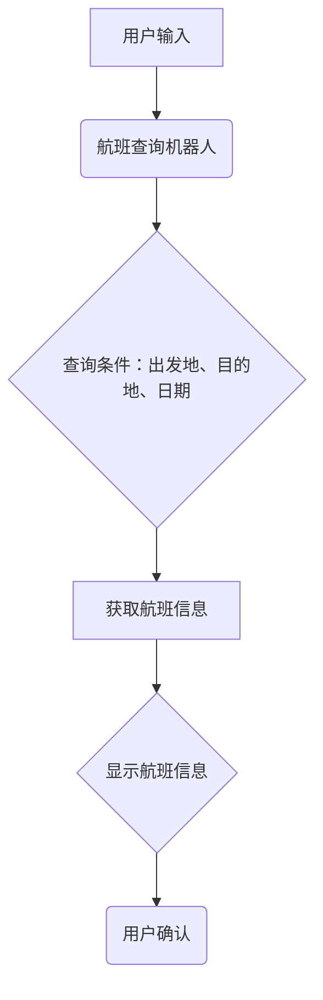

##### 3.1.2 预订酒店与餐厅

预订酒店和餐厅也是旅行中常见的需求。聊天机器人可以为我们提供方便的预订服务。例如，在携程的“智能客服”聊天机器人中，我们可以直接输入目的地、入住日期和退房日期，机器人会为我们推荐合适的酒店，并提供预订链接。同样，在美团或饿了么的聊天机器人中，我们可以查询附近餐厅、查看菜单、下单支付，整个过程无需离开聊天界面。

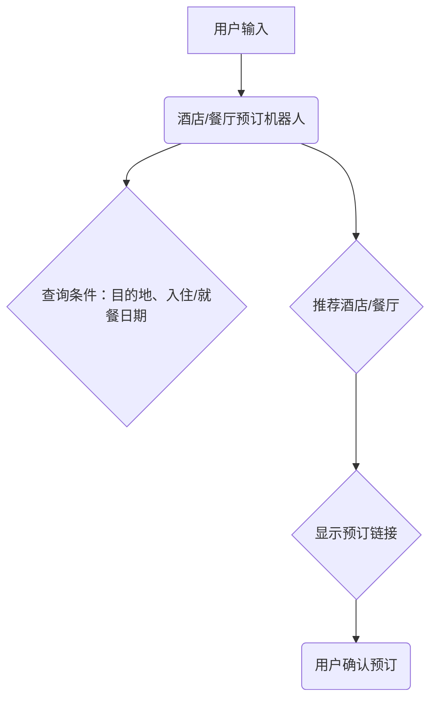

##### 3.1.3 导航与路线规划

导航和路线规划是旅行中不可或缺的一环。聊天机器人可以为我们提供实时的导航服务，帮助我们避免拥堵和交通事故。例如，在百度地图的聊天机器人中，我们可以输入目的地，机器人会为我们提供最佳路线，包括行驶时间、距离和路况信息。同时，如果我们的行程发生变化，聊天机器人还可以实时更新导航信息，确保我们顺利到达目的地。

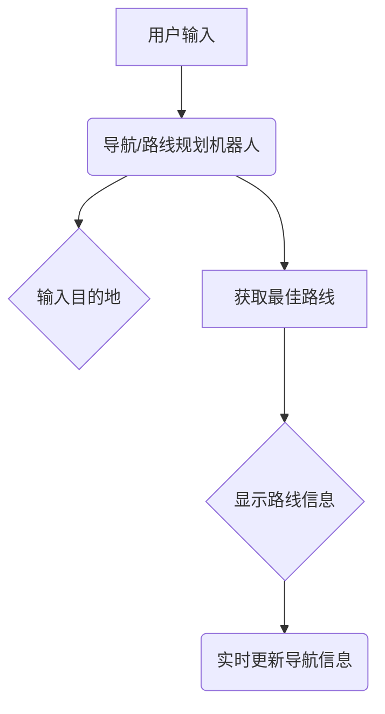

#### 3.2 生活服务问题

生活服务问题是我们日常生活中经常遇到的，如查询天气预报、购物与支付、查询快递信息等。聊天机器人可以为我们提供便捷的解决方案，节省时间和精力。

##### 3.2.1 查询天气预报

我们可以通过聊天机器人轻松查询未来几天的天气预报，以便合理安排出行和活动。例如，在微信中，我们可以使用“天气预报”聊天机器人，输入城市名称，即可获得详细的天气预报信息，包括最高气温、最低气温、天气状况等。

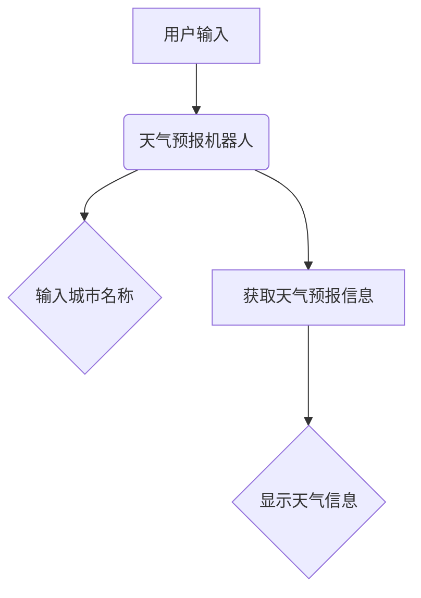

##### 3.2.2 购物与支付

聊天机器人可以帮助我们在线购物，并提供便捷的支付服务。例如，在淘宝的“智能客服”聊天机器人中，我们可以直接咨询商品信息、价格和库存情况。如果决定购买，机器人会引导我们完成下单和支付过程，无需跳转至购物页面。

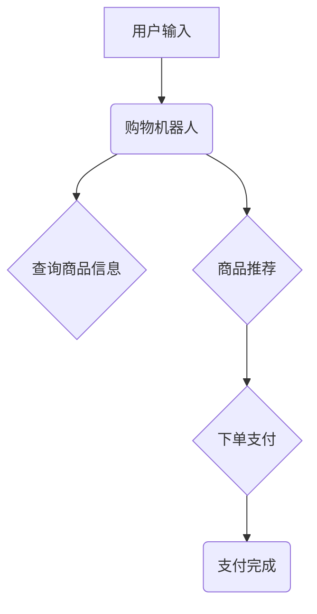

##### 3.2.3 查询快递信息

当我们需要查询快递信息时，聊天机器人可以为我们提供便捷的服务。例如，在京东的“智能客服”聊天机器人中，我们可以输入快递单号，即可获取物流信息，包括发货时间、运输状态、预计到达时间等。

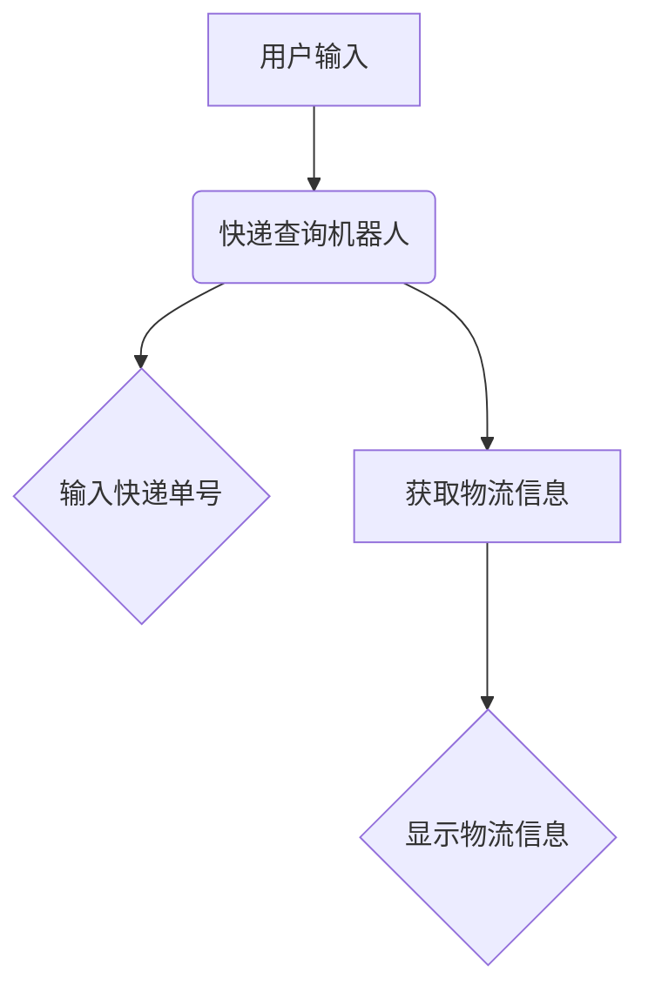

#### 3.3 医疗与健康问题

医疗与健康问题是我们日常生活中不能忽视的重要方面。聊天机器人可以为我们提供便捷的健康咨询、预约挂号和健康管理等服务。

##### 3.3.1 常见疾病咨询

当我们遇到健康问题时，可以通过聊天机器人进行初步的疾病咨询。例如，在微医的“健康咨询”聊天机器人中，我们可以输入症状，机器人会根据症状库提供可能的疾病建议，并建议我们及时就医。

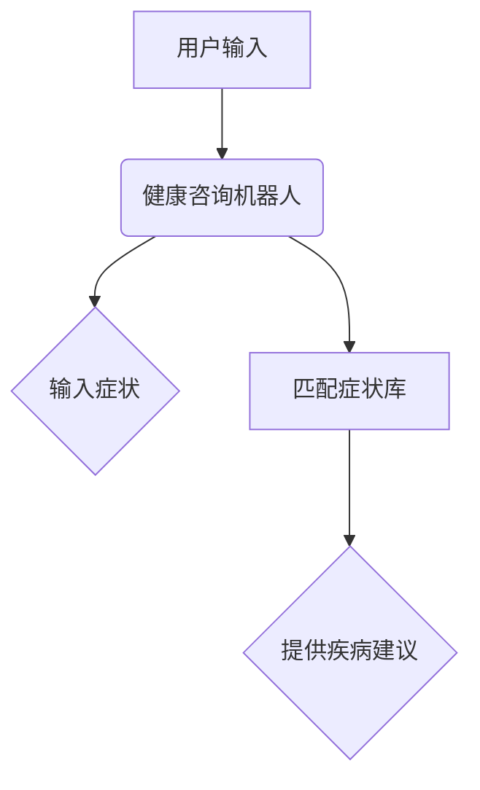

##### 3.3.2 预约挂号与问诊

通过聊天机器人，我们可以方便地预约挂号和进行在线问诊。例如，在微医的“预约挂号”聊天机器人中，我们可以输入医院、科室和医生，即可预约挂号，并获得就诊提醒。同时，在“问诊”功能中，我们可以通过文字或语音与医生进行在线沟通，获取诊断建议。

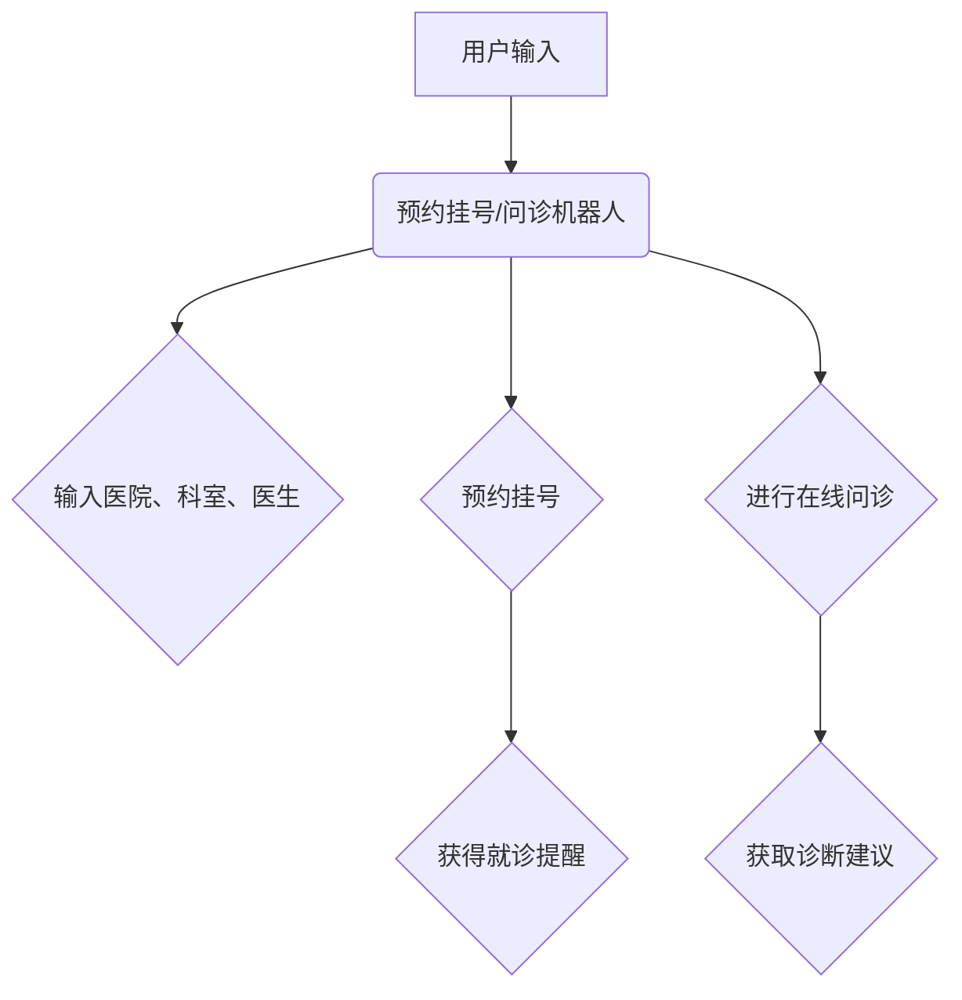

##### 3.3.3 健康管理建议

聊天机器人可以提供健康管理的建议，帮助我们保持健康。例如，在“健康管理”聊天机器人中，我们可以输入个人信息和健康状况，机器人会根据健康指标提供个性化的健康管理建议，包括饮食建议、运动建议、用药提醒等。

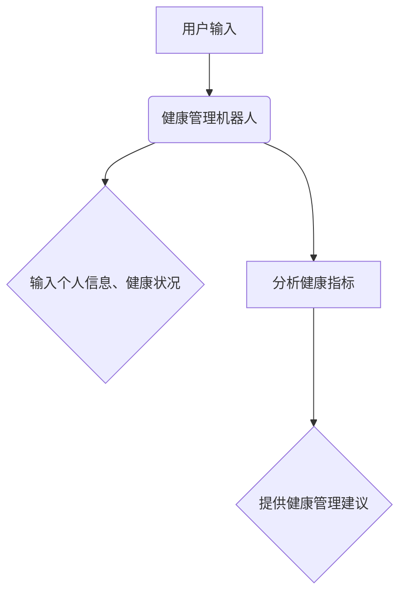

通过以上应用场景，我们可以看到聊天机器人在解决日常问题方面具有巨大潜力。无论是旅行与交通、生活服务还是医疗与健康，聊天机器人都能为我们提供高效、便捷的解决方案，大大提高生活质量。随着技术的不断进步，聊天机器人的功能和应用场景将更加广泛，为我们的生活带来更多便利。

### 第4章：智能互动与个性化推荐

#### 4.1 聊天机器人的智能互动

智能互动是聊天机器人区别于传统客服系统的重要特点，它能够通过理解用户的意图和情感，提供更加自然、高效和个性化的服务。以下是智能互动中的几个关键要素：

##### 4.1.1 语言理解与情感分析

语言理解是聊天机器人的核心能力之一，它使机器人能够解析用户输入的语义和意图。通过自然语言处理（NLP）技术，聊天机器人可以识别句子中的主语、谓语和宾语，理解复杂的句子结构，以及从语境中推断出用户的真实意图。例如，当用户说“明天我要去机场”，聊天机器人需要理解“明天”是指未来的哪一天，“去机场”意味着什么行动。

情感分析是另一个重要技术，它能够判断用户的情绪状态。聊天机器人通过分析用户的语言，识别出情绪词汇和表达方式，从而判断用户是愉悦、愤怒、焦虑还是中立。例如，当用户表达“我真的很生气，航班又延迟了”，聊天机器人可以识别出负面情绪，并相应地调整对话策略，提供安慰和建议。

以下是一个简单的情感分析伪代码示例：

```python
def sentiment_analysis(text):
    # 判断文本中的情绪
    positive_words = ["很好", "高兴", "喜欢"]
    negative_words = ["生气", "讨厌", "烦"]

    # 分词处理
    words = nlp_tokenizer.tokenize(text)

    # 情感标记
    sentiment = "中性"
    for word in words:
        if word in positive_words:
            sentiment = "正面"
            break
        elif word in negative_words:
            sentiment = "负面"
            break

    return sentiment

# 示例
text = "我今天面试表现得很好，感觉很有希望"
print(sentiment_analysis(text))  # 输出：正面
```

##### 4.1.2 人机对话策略

人机对话策略是确保聊天机器人能够流畅、自然地与用户交流的重要方法。对话策略包括对话管理、上下文维持、回复生成等。

- **对话管理**：对话管理是指聊天机器人如何引导整个对话过程，使其保持流畅和高效。例如，当用户询问“附近有什么餐厅？”时，机器人需要先了解用户的位置和偏好，然后才能推荐合适的餐厅。

- **上下文维持**：上下文维持是指聊天机器人如何保持对话的历史信息，以便在后续对话中能够引用和利用这些信息。例如，当用户询问“昨天我订的餐厅到了吗？”时，机器人需要知道之前用户已经预订了餐厅，并查询相关订单状态。

- **回复生成**：回复生成是指聊天机器人如何生成合适的回复，以回答用户的问题或满足用户的需求。生成回复的过程通常涉及自然语言生成（NLG）技术，通过模板匹配、语义理解和文本生成模型，机器人可以生成自然流畅的回复。

以下是一个简单的对话管理示例：

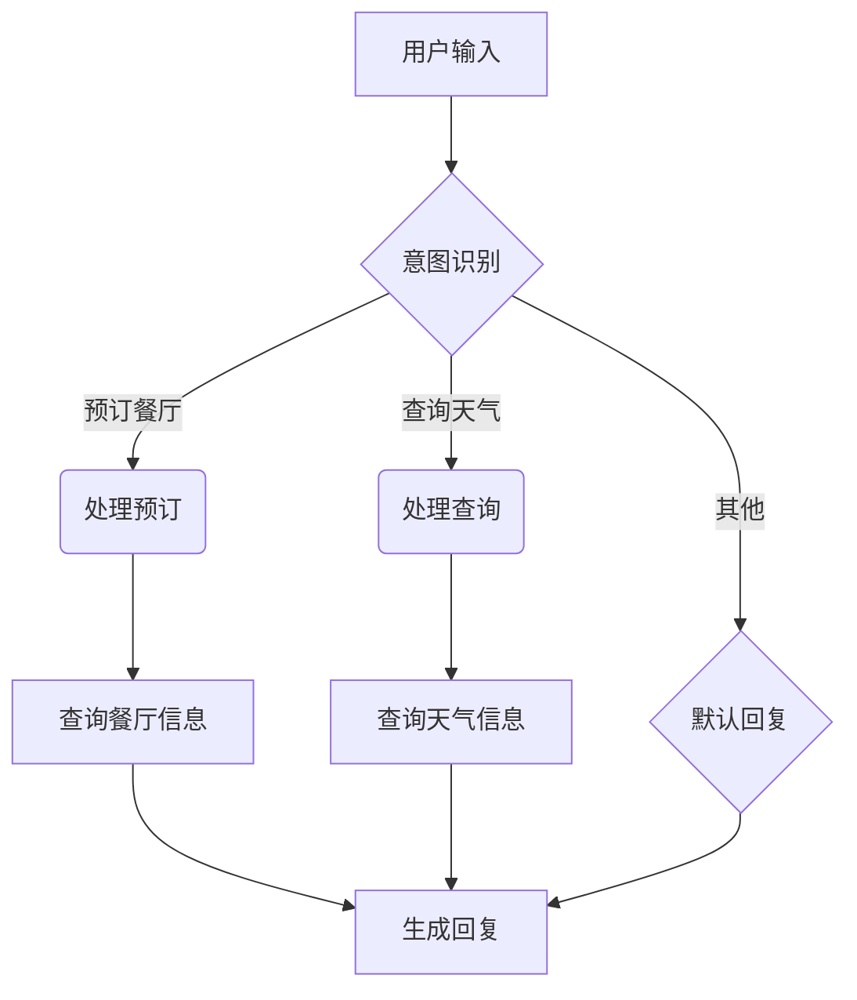

##### 4.1.3 智能问答系统

智能问答系统是聊天机器人实现智能互动的关键组件之一，它能够自动回答用户的问题，提供所需信息。智能问答系统通常包括以下几个步骤：

1. **问题理解**：通过自然语言处理技术，将用户输入的问题转换为机器可理解的形式，提取关键信息和关键词。

2. **知识库检索**：从预构建的知识库中检索相关信息，匹配用户的问题。

3. **答案生成**：利用自然语言生成技术，将检索到的信息转化为自然流畅的回答。

4. **答案优化**：根据上下文和对话历史，对答案进行优化，确保回答的相关性和准确性。

以下是一个简单的智能问答系统伪代码示例：

```python
def intelligent问答系统(question):
    # 问题理解
    keywords = nlp_tokenizer.tokenize(question)

    # 知识库检索
    answer = knowledge_base.retrieve_answer(keywords)

    # 答案生成
    if answer:
        response = natural_language_generator.generate_response(answer)
    else:
        response = "很抱歉，我无法回答这个问题。"

    return response

# 示例
question = "什么是人工智能？"
print(intelligent问答系统(question))  # 输出：人工智能是一门研究、开发用于模拟、延伸和扩展人的智能的理论、方法、技术及应用系统的新技术科学。
```

通过语言理解与情感分析、人机对话策略和智能问答系统，聊天机器人能够实现高效的智能互动，为用户提供更加自然和个性化的服务。随着技术的不断进步，聊天机器人的智能互动能力将进一步提升，为我们的生活带来更多便利。

#### 4.2 个性化推荐

个性化推荐是聊天机器人的一项重要功能，它能够根据用户的兴趣和偏好，为其推荐合适的内容、产品或服务，从而提高用户满意度和忠诚度。以下从用户画像构建、内容推荐算法和个性化体验优化三个方面，详细探讨个性化推荐在聊天机器人中的应用。

##### 4.2.1 用户画像构建

用户画像构建是个性化推荐的基础，它通过收集和分析用户的行为数据、偏好信息和社会属性，形成一个全面、详细的用户描述。以下是构建用户画像的几个关键步骤：

1. **数据收集**：收集用户在聊天机器人中的互动数据，如查询历史、点击行为、评论和反馈等。此外，还可以结合外部数据源，如社交媒体、购物记录和地理位置等，以获取更全面的信息。

2. **数据预处理**：对收集到的数据进行清洗、去重和格式化，以确保数据的质量和一致性。例如，对于文本数据，可以进行分词、去除停用词和词性标注等处理。

3. **特征提取**：将原始数据转换为特征向量，以便用于后续的推荐算法。常见的特征包括用户的基本信息（如年龄、性别、地理位置等）、行为特征（如浏览历史、购买记录等）和社交特征（如好友关系、兴趣标签等）。

4. **模型训练**：利用机器学习技术，如聚类、分类和回归等，对特征向量进行训练，构建用户画像模型。通过模型，我们可以将用户划分为不同的群体，并识别出他们的特征和偏好。

以下是一个简单的用户画像构建流程：

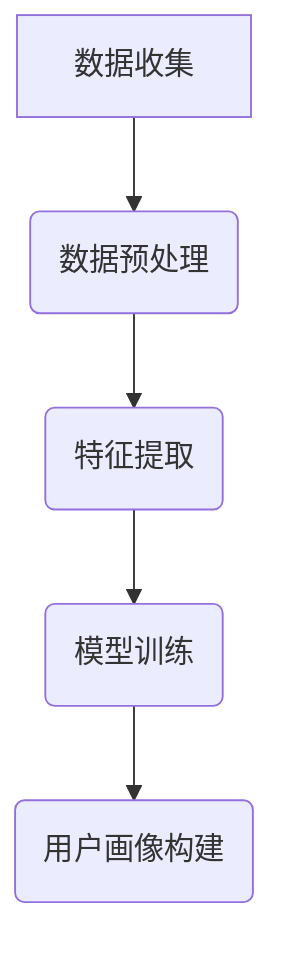

##### 4.2.2 内容推荐算法

内容推荐算法是聊天机器人实现个性化推荐的核心，它通过分析用户画像和内容特征，为用户推荐最感兴趣的内容。以下是几种常见的内容推荐算法：

1. **基于内容的推荐（Content-based Filtering）**：
   - **原理**：根据用户已喜欢的项目内容特征，找到具有相似特征的未查看项目进行推荐。
   - **优势**：推荐结果相关性高，易于理解和实现。
   - **劣势**：用户兴趣变化时，推荐结果可能不准确。

   基于内容的推荐算法通常包括以下步骤：
   - **特征提取**：从用户喜欢的项目提取特征，如关键词、标签和属性等。
   - **相似度计算**：计算用户喜欢的项目与其他项目的相似度，通常使用余弦相似度、欧氏距离等度量方法。
   - **推荐生成**：根据相似度分数，为用户推荐相似度最高的项目。

2. **协同过滤（Collaborative Filtering）**：
   - **原理**：根据用户的共同喜好或行为，为用户推荐相似用户喜欢的项目。
   - **优势**：能够发现用户未明显表达的兴趣点，推荐结果多样化。
   - **劣势**：对新用户和稀疏数据集效果较差。

   协同过滤算法通常分为以下两种：
   - **用户基于的协同过滤（User-based Collaborative Filtering）**：通过计算用户之间的相似度，推荐与目标用户相似的其他用户喜欢的项目。
   - **物品基于的协同过滤（Item-based Collaborative Filtering）**：通过计算物品之间的相似度，推荐与目标用户已评价的物品相似的其他物品。

3. **混合推荐（Hybrid Recommendation）**：
   - **原理**：结合基于内容和协同过滤的优点，将两者的推荐结果进行融合，提高推荐效果。
   - **优势**：综合考虑用户兴趣和项目特征，推荐结果更加准确。
   - **劣势**：实现复杂，需要更多计算资源。

   混合推荐算法通常包括以下步骤：
   - **内容特征提取**：提取用户和项目的特征向量。
   - **相似度计算**：分别计算内容和协同过滤的相似度分数。
   - **融合策略**：将内容和协同过滤的推荐结果进行融合，如加权平均、投票等。

##### 4.2.3 个性化体验优化

个性化推荐不仅需要精确的推荐算法，还需要在用户体验方面进行优化，以确保推荐结果能够真正满足用户的需求。以下是一些常见的个性化体验优化方法：

1. **动态调整推荐策略**：根据用户行为和反馈，实时调整推荐策略。例如，当用户频繁点击某一类内容时，可以增加该类内容的推荐权重，以更好地满足用户兴趣。

2. **提供多样化的推荐选项**：在推荐结果中，提供多种类型的内容，以满足不同用户的需求。例如，可以同时推荐热门内容、个性化内容和其他相关内容。

3. **推荐解释**：为推荐结果提供解释，让用户了解推荐的原因和依据。例如，当用户收到一条推荐信息时，可以显示推荐理由，如“因为您喜欢类似的书籍，所以推荐这本”。

4. **个性化界面设计**：根据用户的偏好和兴趣，设计个性化的界面布局和样式，提高用户的浏览和操作体验。

5. **用户反馈机制**：建立用户反馈机制，收集用户的推荐满意度和建议，不断优化推荐系统。

通过用户画像构建、内容推荐算法和个性化体验优化，聊天机器人可以实现对用户的深度理解，提供精准、个性化的推荐服务。这不仅能够提高用户的满意度和忠诚度，还可以为企业带来更多的商业机会。

### 第5章：聊天机器人在行业中的应用

聊天机器人在不同行业中的应用，正在不断改变各行业的运营模式和服务方式，为企业和用户带来了新的价值。以下是聊天机器人在零售、金融和教育等行业的具体应用案例及其潜在价值。

#### 5.1 零售行业

在零售行业，聊天机器人被广泛应用于提升客户服务和优化购物体验。以下是一些具体的案例：

1. **购物咨询与服务**：聊天机器人可以提供即时的购物咨询，帮助用户了解产品的详细信息、比较价格和查看库存。例如，亚马逊的聊天机器人Alexa可以回答用户关于商品的问题，并提供购买建议。这种方式不仅提高了用户的购物效率，也减轻了客服团队的负担。

2. **促销与营销策略**：聊天机器人可以通过个性化的促销信息推荐，增强用户参与度。例如，阿里巴巴的淘宝聊天机器人可以通过分析用户的历史购买行为和偏好，发送定制化的优惠券和促销信息，提高销售转化率。

3. **订单跟踪与售后服务**：聊天机器人可以实时跟踪订单状态，回答用户关于订单的疑问，提供售后服务支持。例如，京东的“智能客服”机器人可以帮助用户查询订单状态、处理退货和退款等操作，提高了服务效率，增强了用户满意度。

#### 5.2 金融行业

在金融行业，聊天机器人正在逐步替代传统的人工服务，为用户带来更加便捷和高效的金融服务体验。以下是一些具体的应用案例：

1. **客户服务与咨询**：聊天机器人可以提供24/7的客户服务，解答用户的常见问题和提供专业的咨询服务。例如，中国银行的“小智”机器人能够回答用户关于账户余额、转账、贷款等方面的查询，提高了服务效率和用户满意度。

2. **风险管理**：聊天机器人可以监控和预测潜在的风险，提供及时的风险管理建议。例如，银行可以使用聊天机器人监测异常交易行为，及时发现并阻止欺诈行为，保护用户资金安全。

3. **个性化投资建议**：聊天机器人可以根据用户的风险偏好和财务状况，提供个性化的投资建议。例如，富达投资的聊天机器人可以分析用户的投资历史，提供相应的投资组合建议，帮助用户实现财务目标。

#### 5.3 教育行业

在教育行业，聊天机器人被用于提供在线教育辅助和学生咨询服务，为学生和教师提供了新的学习工具和互动平台。以下是一些具体的应用案例：

1. **在线教育辅助**：聊天机器人可以作为在线教育平台的一部分，提供学习资源的推荐、作业辅导和考试准备等服务。例如，Coursera的聊天机器人可以回答用户关于课程内容的问题，提供学习建议，帮助学生更好地掌握知识。

2. **学生咨询服务**：聊天机器人可以为学生提供学术支持、心理咨询和就业指导等服务。例如，哈佛大学的聊天机器人“Harvard Assistant”可以回答学生的学术问题，提供心理咨询服务，帮助学生解决学习和生活中的困难。

3. **个性化学习体验**：聊天机器人可以根据学生的学习进度和兴趣，提供个性化的学习建议和资源推荐。例如，Khan Academy的聊天机器人可以通过分析学生的学习数据，提供针对性的学习路径和练习题，帮助学生提高学习效果。

#### 潜在价值

聊天机器人在各行业的应用，带来了多方面的潜在价值：

1. **提高效率**：通过自动化处理常见问题和提供个性化服务，聊天机器人显著提高了工作效率，减少了人工处理的成本。

2. **提升用户体验**：聊天机器人提供了更加便捷和高效的服务，增强了用户满意度和忠诚度。

3. **数据收集与分析**：聊天机器人可以收集大量的用户数据，通过分析这些数据，企业可以更好地了解用户需求和行为模式，从而优化服务和产品。

4. **个性化服务**：基于用户画像和个性化推荐，聊天机器人能够为用户提供更加精准和个性化的服务，提升用户体验。

5. **降低运营成本**：通过替代部分人工服务，聊天机器人可以显著降低企业的运营成本，提高盈利能力。

总之，聊天机器人在零售、金融和教育等行业的广泛应用，不仅改变了各行业的运营模式和服务方式，还为企业和用户带来了巨大的价值和潜力。

### 第6章：安全与隐私问题

随着聊天机器人技术的迅猛发展，其应用场景日益广泛，但随之而来的安全与隐私问题也愈发突出。如何确保聊天机器人的安全性，保护用户的隐私，成为当前亟待解决的问题。以下将详细探讨聊天机器人的安全性、用户隐私保护策略以及相关法律法规。

#### 6.1 聊天机器人的安全性

1. **防御恶意攻击**

   聊天机器人作为面向公众的服务，极易成为恶意攻击的目标。以下是一些常见的防御措施：

   - **安全验证**：通过身份验证、认证机制（如双因素认证）等方式，确保用户身份的合法性，防止未授权访问。
   - **防火墙和入侵检测**：部署防火墙和入侵检测系统，监控并阻止恶意流量和攻击行为，保护系统安全。
   - **安全编码**：在开发过程中遵循安全编码规范，防止常见的安全漏洞，如SQL注入、跨站脚本（XSS）等。
   - **定期更新和修复**：定期更新聊天机器人的软件和系统，修补已知漏洞，确保系统的安全性。

2. **数据安全与保护**

   聊天机器人在处理用户数据时，必须确保数据的安全性。以下是一些关键措施：

   - **数据加密**：对用户数据进行加密处理，防止数据在传输和存储过程中被窃取或篡改。常用的加密算法包括AES、RSA等。
   - **访问控制**：通过访问控制机制，限制只有授权用户才能访问敏感数据，防止未经授权的访问。
   - **数据备份和恢复**：定期进行数据备份，确保在数据丢失或损坏时能够迅速恢复，减少对业务的影响。
   - **日志记录和监控**：记录系统操作日志，监控异常行为，及时发现和处理潜在的安全威胁。

3. **防御社交工程攻击**

   社交工程攻击是攻击者通过欺骗用户泄露敏感信息的一种手段。以下是一些防御措施：

   - **用户教育**：加强对用户的安全意识教育，提醒用户警惕可疑链接和电话，防止受骗。
   - **验证机制**：在关键操作前，通过二次验证（如短信验证码、动态口令等）确保操作的真实性。
   - **监控和审计**：定期审计用户操作日志，发现异常行为并及时采取措施。

#### 6.2 用户隐私保护

1. **隐私政策制定**

   聊天机器人的开发者需要制定详细的隐私政策，明确用户数据的收集、使用、存储和共享方式，确保用户对自身数据有充分的知情权。以下是一些关键内容：

   - **数据收集目的**：明确说明为何需要收集用户数据，以及数据将如何被使用。
   - **数据使用范围**：规定用户数据的使用范围，确保数据不被滥用。
   - **数据存储期限**：明确数据存储的期限，确保数据不会被无限期保留。
   - **数据共享政策**：明确数据是否会被共享给第三方，以及共享的目的和方式。

2. **用户数据收集与使用规范**

   在收集和使用用户数据时，需要严格遵守以下规范：

   - **最小化原则**：只收集必要的用户数据，避免过度收集。
   - **知情同意**：确保用户在提供数据前充分知情并同意数据收集和使用。
   - **透明性**：确保用户能够了解其数据的使用情况，并有权查询和修改其数据。
   - **数据匿名化**：对敏感数据进行匿名化处理，防止用户身份泄露。

3. **用户隐私保护措施**

   以下是一些具体的用户隐私保护措施：

   - **数据加密**：对用户数据进行加密处理，防止数据在传输和存储过程中被窃取。
   - **访问控制**：对用户数据实行严格的访问控制，确保只有授权人员才能访问敏感数据。
   - **隐私保护技术**：采用隐私保护技术，如差分隐私、同态加密等，确保用户数据在处理过程中的安全性。
   - **用户隐私设置**：为用户提供隐私设置选项，允许用户自主决定数据的可见性和共享范围。

#### 6.3 相关法律法规

随着聊天机器人技术的广泛应用，各国相继出台了一系列法律法规，以规范聊天机器人的使用和保护用户隐私。以下是一些主要法律法规：

1. **欧盟通用数据保护条例（GDPR）**：GDPR是欧盟于2018年实施的隐私保护法规，对数据处理者和数据处理过程提出了严格的要求，包括用户同意、数据保护、数据权利等。

2. **加州消费者隐私法案（CCPA）**：CCPA是加利福尼亚州于2020年实施的隐私保护法案，旨在保护加州居民的个人信息，规定了个人信息的收集、使用和共享规则。

3. **中国个人信息保护法（PIPL）**：PIPL是中国于2021年实施的个人信息保护法，对个人信息处理活动进行了全面规范，强调了个人信息的收集、使用和保护要求。

4. **美国联邦贸易委员会（FTC）规则**：FTC负责监管美国境内的隐私保护，通过制定规则和处罚手段，确保企业遵守隐私保护法规。

通过上述安全与隐私保护措施和相关法律法规的制定与实施，我们可以为聊天机器人技术的发展和应用提供坚实的保障，确保用户数据的安全和隐私。

### 第7章：聊天机器人的未来趋势

随着人工智能技术的不断进步，聊天机器人的功能和应用场景也在不断拓展，其未来的发展趋势令人期待。以下将从人工智能与聊天机器人的融合、新型设计理念以及技术应用创新三个方面，探讨聊天机器人在未来的发展方向。

#### 7.1 人工智能与聊天机器人的融合

人工智能技术的快速发展，为聊天机器人的性能提升和功能拓展提供了强大支持。未来，人工智能与聊天机器人的深度融合将成为一大趋势：

1. **更高级的自然语言处理能力**：随着深度学习和自然语言处理技术的进步，聊天机器人将具备更高级的语言理解能力，能够更好地理解复杂语境和多轮对话，提供更加自然和流畅的交流体验。

2. **自适应学习与持续改进**：通过机器学习和深度学习算法，聊天机器人将具备自适应学习能力，能够根据用户的反馈和历史交互数据，不断优化自身性能和交互效果，提供更加个性化的服务。

3. **多模态交互**：未来的聊天机器人将不仅限于文本交互，还将支持语音、图像、视频等多种交互方式，实现更加丰富和直观的交互体验。

以下是一个简单的自然语言处理（NLP）算法的伪代码示例：

```python
def NLP_Algorithm(text):
    # 分词
    tokens = Tokenizer().tokenize(text)
    
    # 词性标注
    pos_tags = PartOfSpeechTagger().tag(tokens)
    
    # 命名实体识别
    entities = NamedEntityRecognizer().recognize(tokens, pos_tags)
    
    # 情感分析
    sentiment = SentimentAnalyzer().analyze(tokens)
    
    # 返回结果
    return {
        "tokens": tokens,
        "pos_tags": pos_tags,
        "entities": entities,
        "sentiment": sentiment
    }
```

#### 7.2 新型设计理念

未来的聊天机器人将更加注重用户体验和人性化设计，以下是一些新型设计理念：

1. **以用户为中心的设计**：未来的聊天机器人将更加关注用户的实际需求和使用场景，提供定制化的服务体验，使机器人成为用户的个性化助手。

2. **智能化与人性化的平衡**：在提供智能化服务的同时，聊天机器人将更加注重人性化的交互设计，通过情感分析、情感模仿等技术，使机器人具备更加亲和力的交流方式。

3. **可解释性与透明性**：随着机器学习算法的广泛应用，聊天机器人的决策过程将更加透明，用户可以了解机器人为什么做出特定决策，增强用户对机器人的信任感。

以下是一个简单的聊天机器人对话管理流程的Mermaid图：

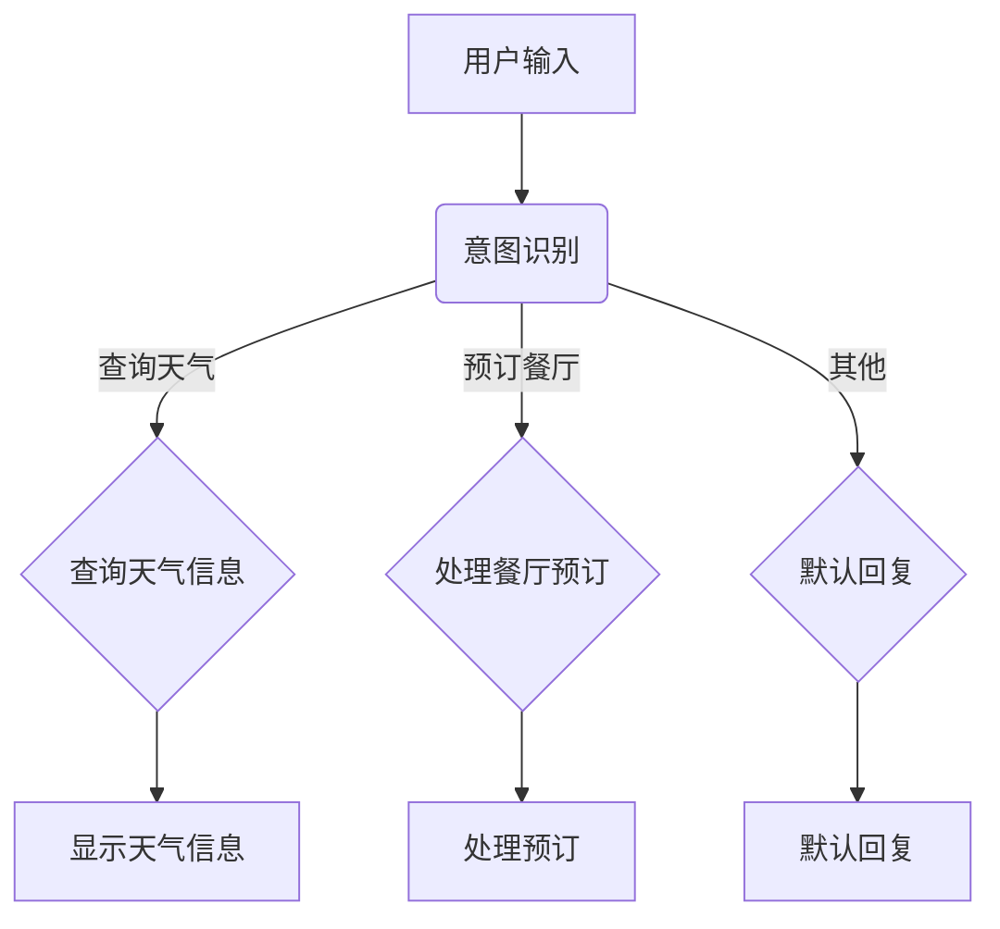

#### 7.3 技术应用创新

未来，聊天机器人的技术应用将不断创新，以下是一些值得关注的方向：

1. **区块链技术**：通过区块链技术，聊天机器人可以实现数据的安全传输和存储，确保用户隐私和数据完整性。

2. **边缘计算**：随着5G和边缘计算技术的发展，聊天机器人将能够实现更加低延迟、高响应速度的交互，提供实时、高效的智能服务。

3. **虚拟现实（VR）与增强现实（AR）**：结合VR和AR技术，聊天机器人可以提供更加沉浸式的交互体验，为用户提供丰富多样的虚拟场景和互动方式。

以下是一个简单的区块链技术在聊天机器人中应用的Mermaid图：

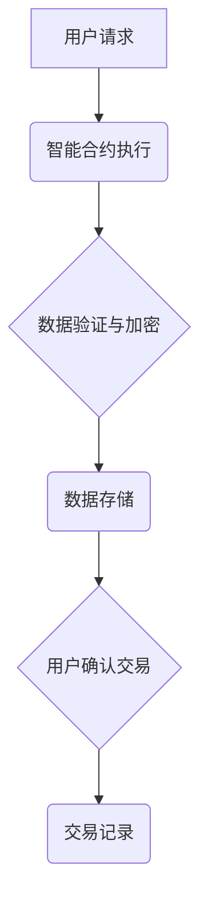

综上所述，未来聊天机器人的发展趋势将体现在人工智能技术的深度融合、新型设计理念的引入以及技术创新的应用上。随着这些趋势的不断推进，聊天机器人将在更多领域发挥重要作用，为我们的生活和工作带来更多便利和效率。

### 附录A：聊天机器人开发资源

在构建和开发聊天机器人时，利用合适的工具和资源是成功的关键。以下是一些常见的聊天机器人开发资源，包括开发工具与平台、学习资料与教程以及论坛与社群，以帮助开发者提高开发效率并获取最新的技术动态。

#### A.1 开发工具与平台

1. **IBM Watson Assistant**：IBM Watson Assistant 是一个功能强大的聊天机器人开发平台，提供自然语言处理、机器学习和对话设计工具。它支持多种语言和集成方式，适用于企业级应用。

2. **Microsoft Bot Framework**：Microsoft Bot Framework 提供了一个全面的开源开发平台，支持构建跨平台的聊天机器人。它提供了丰富的开发工具和API，方便开发者快速集成和部署聊天机器人。

3. **Rasa**：Rasa 是一个开源的聊天机器人框架，专注于构建高度定制化的聊天机器人。它提供了一套完整的工具，包括对话管理、自然语言理解和机器学习算法，适用于复杂场景。

4. **Dialogflow**：Dialogflow 是谷歌提供的聊天机器人开发平台，支持多种语言和平台集成。它提供了强大的自然语言处理能力和对话设计工具，适用于构建各种类型的聊天机器人。

#### A.2 学习资料与教程

1. **《Chatbots: Who Needs Them and How to Build Them》**：这是一本全面介绍聊天机器人技术的书籍，内容包括聊天机器人的历史、构建方法、应用场景等，适合初学者入门。

2. **《Chatbots: The Revolution in Customer Service》**：这本书详细介绍了聊天机器人在客户服务中的应用，包括最佳实践、案例分析和技术实现，适合对聊天机器人应用感兴趣的读者。

3. **在线课程与教程**：许多在线教育平台如Udemy、Coursera 和 edX 提供了关于聊天机器人开发的课程和教程。这些课程通常涵盖了从基础概念到高级应用的各个方面，适合不同层次的学习者。

#### A.3 论坛与社群

1. **Chatbot Community**：Chatbot Community 是一个面向聊天机器人开发者的在线社区，提供最新的技术动态、开发资源和讨论话题。开发者可以在这里交流经验、解决问题和分享最佳实践。

2. **Facebook AI Research Forum**：Facebook AI Research Forum 是一个专注于人工智能和聊天机器人研究的论坛，聚集了众多业界专家和研究人员。开发者可以在这里了解最新的研究进展和技术趋势。

3. **Twitter**：Twitter 上有许多与聊天机器人相关的账号和讨论话题，开发者可以通过关注这些账号，获取最新的新闻、技术文章和行业动态。

通过利用这些开发工具、学习资料和社群资源，开发者可以更有效地构建和优化聊天机器人，为用户提供卓越的智能交互体验。

### 附录B：聊天机器人核心算法与模型

在聊天机器人开发中，核心算法与模型是确保机器人能够理解用户输入并生成合适回应的关键。以下是聊天机器人中常用的核心算法与模型，包括自然语言处理（NLP）算法、机器学习算法以及深度学习模型。

#### B.1 自然语言处理（NLP）算法

自然语言处理算法是聊天机器人的基础，用于解析用户输入的文本，提取关键信息并生成回应。以下是一些常用的NLP算法：

1. **分词（Tokenization）**：
   - **原理**：将文本分解为单词、短语或其他语法单位。
   - **应用**：用于理解文本结构和提取关键词。
   - **算法**：常用的分词算法包括正则表达式分词、词频统计分词和基于深度学习的分词模型，如WordPiece和BERT。

2. **词性标注（Part-of-Speech Tagging）**：
   - **原理**：为文本中的每个单词标注其词性，如名词、动词、形容词等。
   - **应用**：用于理解句子结构和语义。
   - **算法**：基于规则的方法和基于统计的方法，如基于HMM的POS标注和基于深度学习的模型，如LSTM和Transformer。

3. **命名实体识别（Named Entity Recognition）**：
   - **原理**：从文本中识别出具有特定意义的实体，如人名、地名、组织名等。
   - **应用**：用于提取关键信息和理解语义。
   - **算法**：基于规则的方法和基于深度学习的模型，如条件随机场（CRF）和BERT。

4. **情感分析（Sentiment Analysis）**：
   - **原理**：分析文本中的情感倾向，如正面、负面或中性。
   - **应用**：用于理解用户情绪和提供个性化服务。
   - **算法**：基于词典的方法、基于机器学习和基于深度学习的模型，如SVM、LSTM和BERT。

以下是一个简单的情感分析算法的伪代码示例：

```python
def sentiment_analysis(text):
    # 使用预训练的BERT模型进行情感分析
    sentiment = BERT_Model.analyze(text)
    if sentiment == "positive":
        return "正面"
    elif sentiment == "negative":
        return "负面"
    else:
        return "中性"
```

#### B.2 机器学习算法

机器学习算法在聊天机器人的开发中用于训练模型，使其能够自动理解和生成文本。以下是一些常用的机器学习算法：

1. **决策树（Decision Tree）**：
   - **原理**：通过一系列规则进行分类或回归。
   - **应用**：用于处理简单和中等复杂度的分类问题。
   - **算法**：CART和ID3算法。

2. **支持向量机（SVM）**：
   - **原理**：通过找到一个最佳超平面，将不同类别的数据分开。
   - **应用**：用于处理高维数据和复杂分类问题。
   - **算法**：线性SVM和核SVM。

3. **朴素贝叶斯（Naive Bayes）**：
   - **原理**：基于贝叶斯定理和特征条件独立性假设进行分类。
   - **应用**：用于处理大规模文本数据和简单分类问题。
   - **算法**：高斯朴素贝叶斯和多项式朴素贝叶斯。

4. **随机森林（Random Forest）**：
   - **原理**：通过构建多个决策树，并进行投票来决定最终分类结果。
   - **应用**：用于处理高维数据和增强模型的鲁棒性。
   - **算法**：基于决策树的集成方法。

以下是一个简单的随机森林分类算法的伪代码示例：

```python
def random_forest_classification(data, labels):
    # 构建随机森林模型
    forest = RandomForestClassifier(n_estimators=100)
    # 训练模型
    forest.fit(data, labels)
    # 进行预测
    predictions = forest.predict(data)
    return predictions
```

#### B.3 深度学习模型

深度学习模型在聊天机器人的开发中扮演着重要角色，特别是在处理复杂语义理解和多轮对话方面。以下是一些常用的深度学习模型：

1. **循环神经网络（RNN）**：
   - **原理**：通过循环结构，使网络能够记住之前的信息。
   - **应用**：用于处理序列数据，如自然语言文本。
   - **算法**：LSTM和GRU。

2. **变换器（Transformer）**：
   - **原理**：通过自注意力机制，对输入序列进行全局建模。
   - **应用**：用于处理复杂文本任务，如机器翻译和文本生成。
   - **算法**：BERT、GPT和T5。

3. **生成对抗网络（GAN）**：
   - **原理**：通过生成器和判别器的对抗训练，生成高质量的数据。
   - **应用**：用于生成虚拟对话数据，提高模型的泛化能力。
   - **算法**：生成器和判别器。

以下是一个简单的BERT模型在聊天机器人中应用的伪代码示例：

```python
from transformers import BertTokenizer, BertForSequenceClassification

def chatbot_response(text):
    # 加载预训练的BERT模型和分词器
    tokenizer = BertTokenizer.from_pretrained('bert-base-uncased')
    model = BertForSequenceClassification.from_pretrained('bert-base-uncased')

    # 分词并处理输入文本
    inputs = tokenizer(text, return_tensors='pt')

    # 进行预测
    outputs = model(**inputs)

    # 解析预测结果
    prediction = torch.argmax(outputs.logits).item()

    # 返回聊天机器人的回应
    return responses[prediction]
```

通过以上核心算法和模型的介绍，开发者可以更好地理解和应用这些技术，构建高效的聊天机器人，为用户提供优质的智能交互体验。

### 附录C：聊天机器人项目实战案例

在本附录中，我们将通过三个具体的聊天机器人项目实战案例，详细讲解项目的开发背景、实现步骤和代码解读，帮助读者深入了解聊天机器人的实际应用和开发过程。

#### C.1 案例一：智能客服机器人

**项目背景**：随着互联网和电子商务的快速发展，客户服务需求日益增长。为了提高客户服务效率，企业开始探索使用智能客服机器人来处理常见的客户咨询和问题。

**实现步骤**：
1. **需求分析**：明确智能客服机器人的功能需求，包括常见问题的自动回复、订单状态查询、售后服务咨询等。

2. **平台选择**：选择Microsoft Bot Framework作为开发平台，因为它支持多种集成方式，易于部署和扩展。

3. **开发与实现**：
   - **意图识别**：使用预训练的LSTM模型进行意图识别，将用户输入转换为机器可理解的意图。
   - **实体提取**：使用BERT模型提取用户输入中的关键实体，如订单号、用户ID等。
   - **回复生成**：根据意图和实体，生成合适的回复文本。

4. **测试与优化**：通过实际用户交互数据，不断优化模型，提高智能客服机器人的响应速度和准确率。

**代码解读**：

```python
from transformers import BertTokenizer, BertForSequenceClassification
from botbuilder.core import ActivityHandler

class IntelligentCustomerService(ActivityHandler):
    def __init__(self):
        self.tokenizer = BertTokenizer.from_pretrained('bert-base-uncased')
        self.model = BertForSequenceClassification.from_pretrained('bert-base-uncased')

    async def on_message_activity(self, turn_context):
        text = turn_context.activity.text
        inputs = self.tokenizer(text, return_tensors='pt')
        outputs = self.model(**inputs)
        prediction = torch.argmax(outputs.logits).item()

        # 根据预测结果生成回复
        response = self.generate_response(prediction)
        await turn_context.send_activity(message=response)

    def generate_response(self, prediction):
        # 根据预测结果生成回复
        responses = {
            0: "您好，有什么问题我可以帮您解答吗？",
            1: "请提供您的订单号，我将帮您查询订单状态。",
            2: "感谢您的咨询，售后服务将在24小时内回复您。"
        }
        return responses[prediction]
```

#### C.2 案例二：教育机器人

**项目背景**：随着在线教育的普及，教育机器人被广泛应用于提供学习辅导、作业帮助和考试准备等服务。

**实现步骤**：
1. **需求分析**：明确教育机器人的功能需求，包括作业解答、学习资源推荐、考试模拟等。

2. **平台选择**：选择Rasa作为开发平台，因为它支持自定义对话流程和集成多种NLP技术。

3. **开发与实现**：
   - **对话管理**：设计对话流程，定义对话状态和动作。
   - **意图识别**：使用基于规则的方法和机器学习模型，识别用户意图。
   - **知识库构建**：构建包含知识点、答案和资源链接的知识库。

4. **测试与优化**：通过实际用户交互数据，不断优化对话流程和响应质量。

**代码解读**：

```python
from rasa.core.interpreter import RasaInterpreter
from rasa.core.domain import Domain

domain = Domain.load("domain.yml")
interpreter = RasaInterpreter.load("models/interpreter")

class EducationRobot:
    def __init__(self):
        self.interpreter = interpreter

    def process_message(self, message):
        response = self.interpreter.parse(message)
        action_name = response.next_action
        if action_name == "action_listen":
            return "请告诉我您的问题，我将尽力解答。"
        elif action_name == "action_help":
            return "您好，有什么学习上的问题我可以帮您解答吗？"
        elif action_name == "action_answer_question":
            return "关于这个问题的答案如下：[答案]"
        else:
            return "对不起，我不太明白您的问题，可以请您详细描述一下吗？"

robot = EducationRobot()
while True:
    message = input("您说： ")
    print(robot.process_message(message))
```

#### C.3 案例三：健康咨询机器人

**项目背景**：随着人们对健康关注的增加，健康咨询机器人被用于提供健康咨询、疾病诊断和患者管理等服务。

**实现步骤**：
1. **需求分析**：明确健康咨询机器人的功能需求，包括健康咨询、预约挂号、症状查询等。

2. **平台选择**：选择IBM Watson Assistant作为开发平台，因为它提供了丰富的自然语言处理和机器学习功能。

3. **开发与实现**：
   - **自然语言处理**：使用Watson Assistant的自然语言理解功能，识别用户意图和实体。
   - **对话管理**：设计对话流程，根据用户输入和意图，生成合适的回应。
   - **知识库管理**：构建包含健康知识、症状和治疗方案的知识库。

4. **测试与优化**：通过实际用户交互数据，不断优化对话质量和响应速度。

**代码解读**：

```python
from ibm_watson import DiscoveryV1
from ibm_cloud_sdk_core.authenticators import IAMAuthenticator

# 设置IBM Watson Discovery的认证信息
authenticator = IAMAuthenticator("your_iam_api_key")
discovery = DiscoveryV1(
    authenticator=authenticator,
    version="2023-04-20"
)

# 设置知识库ID
knowledge_base_id = "your_knowledge_base_id"

# 查询症状信息
def get_symptom_info(symptom):
    response = discovery.query(
        knowledge_base_id=knowledge_base_id,
        query=f"Symptom: {symptom}",
        fields=["title", "description", "disease_name"],
        return_records=True
    )
    return response.get("results", [])

# 咨询回答
def consult_answer(question):
    symptoms = get_symptom_info(question)
    if symptoms:
        return f"关于'{question}'的症状信息如下：{symptoms[0]['description']}"
    else:
        return "很抱歉，我无法找到关于这个问题的信息。"

# 示例交互
question = input("您有什么健康问题吗？ ")
print(consult_answer(question))
```

通过以上三个案例，读者可以了解聊天机器人的实际开发过程和实现方法。这些案例涵盖了不同的应用场景，从客服、教育到健康咨询，展示了聊天机器人在实际应用中的多样性和潜力。通过学习和借鉴这些案例，开发者可以更好地构建和应用聊天机器人，为用户提供高效的智能服务。

