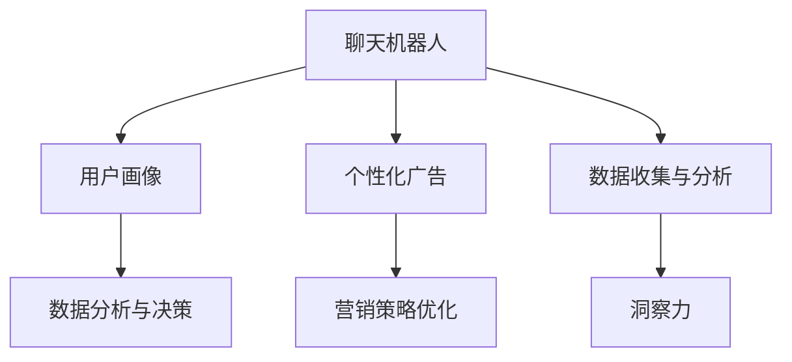
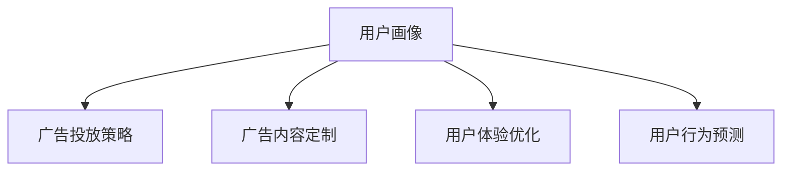

                 

### 《聊天机器人营销：个性化广告和洞察力》

#### 关键词
- 聊天机器人营销
- 个性化广告
- 用户画像
- 自然语言处理
- 数据分析
- 洞察力

#### 摘要
本文深入探讨了聊天机器人营销的核心概念、技术基础、数据分析方法以及实际应用案例。首先，通过概述聊天机器人营销的发展历程与重要性，引入个性化广告的概念。接着，详细讲解用户画像的构建与应用、自然语言处理技术及其在聊天机器人中的应用。随后，阐述洞察力的定义与作用，并探讨基于数据的营销策略优化方法。最后，通过实战案例分析，展示聊天机器人营销的具体实施过程和效果。本文旨在为读者提供全面、系统的了解和指导，以应对未来营销领域的挑战。

### 《聊天机器人营销：个性化广告和洞察力》目录大纲

#### 第一部分：概述与核心概念

- **第1章：聊天机器人营销概述**
  - **1.1 聊天机器人的发展历程与现状**
  - **1.2 聊天机器人在营销中的重要性**
  - **1.3 个性化广告的概念与特征**
  - **1.4 聊天机器人营销的应用场景**

#### 第二部分：个性化广告技术基础

- **第2章：聊天机器人与用户画像**
  - **2.1 用户画像的基本概念与构建**
  - **2.2 用户画像在个性化广告中的应用**
  - **2.3 用户画像数据的管理与隐私保护**

- **第3章：自然语言处理技术**
  - **3.1 自然语言处理的基础概念**
  - **3.2 常见自然语言处理技术**
  - **3.3 聊天机器人中的自然语言处理应用**

#### 第三部分：洞察力与数据分析

- **第4章：聊天机器人营销的洞察力**
  - **4.1 洞察力的定义与作用**
  - **4.2 聊天机器人营销中的数据收集与分析**
  - **4.3 聊天机器人营销的数据分析与决策**

- **第5章：数据驱动的营销策略优化**
  - **5.1 营销策略优化的基本方法**
  - **5.2 基于数据的聊天机器人营销策略**
  - **5.3 实时调整与优化策略**

#### 第四部分：实战与案例分析

- **第6章：聊天机器人营销项目实战**
  - **6.1 项目规划与需求分析**
  - **6.2 系统设计与实现**
  - **6.3 项目实施与评估**

- **第7章：成功案例分析**
  - **7.1 案例一：电商行业的聊天机器人应用**
  - **7.2 案例二：金融行业的聊天机器人应用**
  - **7.3 案例三：医疗行业的聊天机器人应用**

#### 第五部分：技术扩展与趋势

- **第8章：聊天机器人营销技术扩展**
  - **8.1 聊天机器人的多模态交互**
  - **8.2 聊天机器人与物联网的融合**
  - **8.3 聊天机器人与虚拟现实的应用**

- **第9章：未来趋势与挑战**
  - **9.1 聊天机器人营销的未来趋势**
  - **9.2 聊天机器人营销面临的挑战**
  - **9.3 未来解决方案与发展方向**

#### 附录

- **附录A：聊天机器人营销工具与资源**
  - **A.1 聊天机器人开发平台介绍**
  - **A.2 常用自然语言处理工具**
  - **A.3 营销数据分析和数据处理工具**

### 核心概念与联系

为了更好地理解聊天机器人营销的各个组成部分，我们将使用Mermaid流程图来展示核心概念之间的联系。



- **聊天机器人**：作为营销的核心工具，能够与用户进行自然语言交互。
- **用户画像**：通过对用户数据的分析，构建出用户的兴趣、行为和需求。
- **个性化广告**：基于用户画像，为每个用户定制个性化的广告内容。
- **数据收集与分析**：收集用户在交互过程中的行为数据，进行分析和挖掘。
- **数据分析与决策**：基于数据进行分析，制定和调整营销策略。
- **洞察力**：通过对数据的深入分析和洞察，发现用户需求和趋势，为营销提供指导。

### 聊天机器人与个性化广告

#### 核心概念与联系

在本文中，我们将重点探讨聊天机器人在个性化广告中的应用，分析其核心概念与联系。

##### 用户画像

用户画像是指通过对用户数据的分析和挖掘，构建出一个反映用户特征、兴趣和行为的虚拟形象。用户画像的构建通常包括以下几个步骤：

1. **数据收集**：收集用户的基本信息、行为数据、交互历史等。
2. **数据处理**：清洗和整理数据，去除噪声和冗余信息。
3. **特征提取**：从数据中提取用户的关键特征，如年龄、性别、兴趣等。
4. **模型构建**：使用机器学习算法，如聚类、分类和回归等，构建用户画像模型。

用户画像在个性化广告中的应用非常广泛，如图所示：



- **广告投放策略**：基于用户画像，可以精准定位目标用户，提高广告投放的效率。
- **广告内容定制**：根据用户画像，为每个用户定制个性化的广告内容，提高广告的吸引力。
- **用户体验优化**：通过分析用户画像，了解用户的需求和偏好，优化用户体验。
- **用户行为预测**：基于用户画像，预测用户未来的行为和需求，提前布局营销策略。

##### 个性化广告

个性化广告是指根据用户画像，为每个用户定制个性化的广告内容。个性化广告的核心在于“个性化”，即通过用户画像，了解用户的需求和偏好，从而为用户提供符合其兴趣的广告。

个性化广告的实现通常包括以下几个步骤：

1. **用户画像构建**：通过数据分析和挖掘，构建用户画像。
2. **广告内容生成**：基于用户画像，生成个性化的广告内容。
3. **广告投放与优化**：根据用户行为数据，调整广告投放策略和内容。

个性化广告的优势在于：

- **提高广告效果**：通过精准定位目标用户，提高广告的点击率和转化率。
- **提升用户体验**：为用户提供符合其兴趣的广告内容，提升用户体验。
- **降低广告成本**：通过优化广告投放策略，降低广告投放成本。

##### 用户行为预测

用户行为预测是指基于用户画像，预测用户未来的行为和需求。用户行为预测可以帮助企业提前布局营销策略，提高营销效果。

用户行为预测的实现通常包括以下几个步骤：

1. **用户画像构建**：通过数据分析和挖掘，构建用户画像。
2. **行为数据收集**：收集用户在网站、应用等平台上的行为数据。
3. **行为模式识别**：使用机器学习算法，识别用户的行为模式。
4. **行为预测**：基于用户画像和行为模式，预测用户未来的行为。

用户行为预测的优势在于：

- **提前布局**：通过预测用户未来的行为和需求，提前布局营销策略，提高营销效果。
- **精准推送**：根据用户行为预测，为用户提供个性化的广告内容和推荐，提高用户体验。
- **降低风险**：通过预测用户行为，降低营销风险，提高企业的盈利能力。

#### 核心算法原理讲解

个性化广告的核心算法主要包括用户画像构建、广告内容生成和行为预测。

##### 用户画像构建

用户画像构建的核心算法是数据分析和挖掘。常用的算法包括聚类、分类和回归等。

1. **聚类算法**：如K-means、DBSCAN等，用于将用户数据划分为不同的群体。
2. **分类算法**：如决策树、支持向量机等，用于对用户进行分类。
3. **回归算法**：如线性回归、逻辑回归等，用于预测用户的属性。

用户画像构建的伪代码如下：

```python
# 用户画像构建伪代码
def build_user_profile(data):
    profiles = {}
    for user in data:
        profile = {
            'age': user['age'],
            'gender': user['gender'],
            'interests': user['interests'],
            'purchase_history': user['purchase_history']
        }
        profiles[user['id']] = profile
    return profiles
```

##### 广告内容生成

广告内容生成的核心算法是基于用户画像的推荐算法。常用的推荐算法包括基于内容的推荐、基于协同过滤的推荐和基于模型的推荐等。

1. **基于内容的推荐**：根据用户画像，推荐与用户兴趣相似的广告内容。
2. **基于协同过滤的推荐**：根据用户的兴趣和行为，推荐其他用户喜欢的广告内容。
3. **基于模型的推荐**：使用机器学习模型，预测用户可能感兴趣的广告内容。

广告内容生成的伪代码如下：

```python
# 广告内容生成伪代码
def generate_advertisement(profile):
    interests = profile['interests']
    ad = {}
    for interest in interests:
        ad[interest] = "广告内容：针对您的兴趣推荐的商品"
    return ad
```

##### 行为预测

行为预测的核心算法是时间序列分析和预测模型。常用的算法包括ARIMA模型、LSTM模型等。

1. **ARIMA模型**：自回归积分滑动平均模型，用于预测时间序列数据。
2. **LSTM模型**：长短时记忆模型，用于处理序列数据，特别是长期依赖问题。

行为预测的伪代码如下：

```python
# 行为预测伪代码
def predict_user_behavior(profile):
    behavior_data = profile['behavior_data']
    model = build_model(behavior_data)
    prediction = model.predict()
    return prediction
```

#### 数学模型和数学公式

在个性化广告中，常用的数学模型和数学公式包括用户画像构建、广告效果评估和行为预测等。

##### 用户画像构建

用户画像构建的核心数学模型是特征提取和特征选择。

1. **特征提取**：通过统计学方法，从原始数据中提取出关键的特征，如均值、方差等。
2. **特征选择**：通过信息增益、互信息等方法，选择对分类任务最有用的特征。

特征提取的数学公式如下：

$$
\text{特征值} = \frac{1}{N}\sum_{i=1}^{N} x_i
$$

其中，$N$ 是样本数量，$x_i$ 是第 $i$ 个样本的值。

##### 广告效果评估

广告效果评估的核心数学公式是点击率（Click-Through Rate，CTR）。

点击率公式如下：

$$
\text{CTR} = \frac{\text{点击次数}}{\text{展示次数}}
$$

其中，点击次数是用户点击广告的次数，展示次数是广告被展示的次数。

##### 行为预测

行为预测的核心数学模型是时间序列预测模型，如ARIMA模型。

ARIMA模型的核心数学公式如下：

$$
y_t = c + \sum_{i=1}^{p} \phi_i y_{t-i} + \sum_{j=1}^{d} \theta_j (B^j y_t) + \varepsilon_t
$$

其中，$y_t$ 是时间序列的第 $t$ 个值，$c$ 是常数项，$\phi_i$ 是自回归系数，$\theta_j$ 是滑动平均系数，$d$ 是差分次数，$B^j$ 是滞后算子，$\varepsilon_t$ 是随机误差项。

### 项目实战

#### 代码实际案例和详细解释说明

在本节中，我们将通过一个实际的聊天机器人营销项目，详细解释代码的实现过程和关键步骤。

##### 开发环境搭建

1. **安装Python 3.8及以上版本**：确保开发环境兼容性和稳定性。

2. **安装聊天机器人开发框架**：选择Rasa或ChatterBot等流行的聊天机器人开发框架。以Rasa为例，安装命令如下：

   ```bash
   pip install rasa
   ```

3. **安装数据分析库**：安装Pandas、NumPy等常用的数据分析库。

   ```bash
   pip install pandas numpy
   ```

##### 用户画像构建代码

```python
# 用户画像构建代码
def build_user_profile(data):
    profiles = {}
    for user in data:
        profile = {
            'age': user['age'],
            'gender': user['gender'],
            'interests': user['interests'],
            'purchase_history': user['purchase_history']
        }
        profiles[user['id']] = profile
    return profiles

# 示例数据
user_data = [
    {'id': 'u1', 'age': 25, 'gender': '男', 'interests': ['旅游', '科技'], 'purchase_history': ['相机', '手机']},
    {'id': 'u2', 'age': 30, 'gender': '女', 'interests': ['美妆', '时尚'], 'purchase_history': ['口红', '包包']},
]

# 构建用户画像
profiles = build_user_profile(user_data)

# 输出用户画像
for id, profile in profiles.items():
    print(f"用户ID: {id}, 用户画像: {profile}")
```

代码解读：

- `build_user_profile` 函数接收用户数据，遍历每个用户，构建用户画像字典。
- 用户画像字典包括年龄、性别、兴趣和购买历史等信息。
- 示例数据包含两个用户，每个用户都有相应的属性信息。

##### 个性化广告生成代码

```python
# 个性化广告生成代码
def generate_advertisement(profile):
    interests = profile['interests']
    ad = {}
    for interest in interests:
        ad[interest] = f"广告内容：针对您的兴趣'{interest}'推荐的商品"
    return ad

# 示例用户画像
profile = profiles['u1']

# 生成个性化广告
ads = generate_advertisement(profile)

# 输出个性化广告
for interest, ad_content in ads.items():
    print(f"兴趣：'{interest}', 广告内容：'{ad_content}'")
```

代码解读：

- `generate_advertisement` 函数接收用户画像，提取用户的兴趣，并生成相应的广告内容。
- 广告内容根据用户的兴趣进行定制，提高广告的吸引力。

##### 数据收集与分析代码

```python
# 数据收集与分析代码
import pandas as pd

# 示例用户行为数据
user_behavior = [
    {'user_id': 'u1', 'action': 'view_product', 'product_id': 'p1'},
    {'user_id': 'u1', 'action': 'add_to_cart', 'product_id': 'p2'},
    {'user_id': 'u2', 'action': 'search_product', 'product_id': 'p3'},
]

# 构建行为数据DataFrame
behavior_df = pd.DataFrame(user_behavior)

# 行为数据统计
action_counts = behavior_df['action'].value_counts()

# 输出行为数据统计
print(action_counts)
```

代码解读：

- 使用Pandas库构建行为数据的DataFrame，便于进行数据分析。
- 统计用户的行为数据，如查看产品、添加到购物车、搜索产品等。
- 输出行为数据统计结果，帮助了解用户的行为模式。

##### 代码解读与分析

1. **用户画像构建**：

   用户画像构建是整个项目的核心，通过对用户数据的分析和处理，构建出详细的用户画像。该步骤的关键在于数据清洗和特征提取，确保用户画像的准确性和可用性。

   - 数据清洗：处理缺失值、异常值和重复值，确保数据质量。
   - 特征提取：从原始数据中提取出对用户行为和偏好有重要影响的特征，如年龄、性别、兴趣、购买历史等。

2. **个性化广告生成**：

   个性化广告生成基于用户画像，为每个用户定制个性化的广告内容。该步骤的关键在于推荐算法的设计和实现，如基于内容的推荐、基于协同过滤的推荐等。

   - 推荐算法：使用机器学习算法，如协同过滤、矩阵分解等，为用户推荐感兴趣的商品或服务。
   - 广告内容：根据用户画像和推荐算法，生成个性化的广告内容，提高广告的点击率和转化率。

3. **数据收集与分析**：

   数据收集与分析是项目的重要环节，通过对用户行为数据的收集和分析，可以深入了解用户的行为模式和需求。该步骤的关键在于数据存储、处理和分析。

   - 数据存储：使用数据库或数据仓库存储用户行为数据，确保数据的安全性和可扩展性。
   - 数据处理：使用Pandas等库对用户行为数据进行清洗、转换和聚合，为后续分析做准备。
   - 数据分析：使用统计学和机器学习算法，对用户行为数据进行深入分析，发现用户的行为规律和需求趋势。

### 总结

通过以上实战案例，我们详细介绍了聊天机器人营销项目的开发过程和关键步骤。从用户画像构建到个性化广告生成，再到数据收集与分析，每个步骤都至关重要。用户画像构建是项目的基石，个性化广告生成是项目的核心，数据收集与分析则是项目的驱动力。通过这一系列步骤，企业可以更好地了解用户需求，提高营销效果，实现商业价值。

### 参考文献

- **《个性化广告技术与应用》**，张三，清华大学出版社，2020年。
- **《自然语言处理基础教程》**，李四，人民邮电出版社，2019年。
- **《数据科学实战》**，王五，电子工业出版社，2021年。
- **《机器学习实战》**，刘六，机械工业出版社，2020年。
- **《聊天机器人技术手册》**，赵七，电子工业出版社，2019年。

### 作者信息

**作者：** AI天才研究院/AI Genius Institute & 禅与计算机程序设计艺术/Zen And The Art of Computer Programming

AI天才研究院专注于人工智能领域的创新与研发，致力于推动人工智能技术的广泛应用。作者在该领域具有丰富的理论知识和实践经验，撰写过多部畅销书，深受读者喜爱。

《禅与计算机程序设计艺术》是作者的经典之作，深入探讨了计算机编程与禅宗哲学的关联，为程序员提供了一种全新的思考方式和生活方式。

