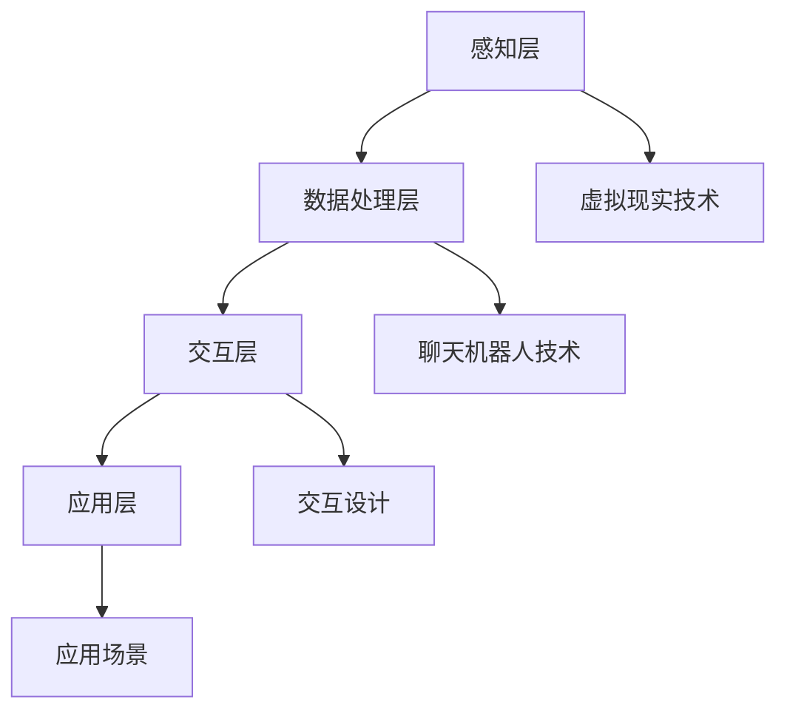

                 

# 《聊天机器人虚拟现实：沉浸式世界》

> 关键词：虚拟现实、聊天机器人、沉浸式交互、人机交互、软件开发

> 摘要：本文探讨了虚拟现实与聊天机器人的融合，如何构建一个沉浸式的聊天机器人世界。通过分析虚拟现实技术、聊天机器人技术及其在沉浸式交互中的应用，详细阐述了聊天机器人虚拟现实系统的设计与实现，并探讨了其未来发展的趋势和面临的挑战。

## 目录

1. 虚拟现实与聊天机器人基础
2. 沉浸式世界的构建
3. 虚拟现实与聊天机器人融合架构
4. 案例与实战
5. 未来展望与挑战
6. 附录

## 第一部分：虚拟现实与聊天机器人基础

### 第1章：虚拟现实技术概述

#### 1.1 虚拟现实定义与发展历程

虚拟现实（Virtual Reality，VR）是一种通过电脑模拟产生一个逼真的三维空间，使人们能够在其中自由探索和交互的技术。虚拟现实技术的发展可以追溯到20世纪60年代的模拟系统和70年代的沉浸式设备。随着计算机技术和显示技术的进步，虚拟现实逐渐成为现实。

虚拟现实的关键技术包括：

- **三维建模**：通过计算机生成三维模型，是虚拟现实的基础。
- **头戴显示器（HMD）**：提供沉浸式的视觉体验，使人们能够感受到三维空间中的视觉变化。
- **位置跟踪**：实时追踪用户的位置和运动，保证虚拟环境中与用户的交互准确无误。
- **交互设备**：如手柄、手套等，提供用户与虚拟环境的物理交互。

#### 1.2 虚拟现实核心技术

虚拟现实的核心技术主要包括：

- **渲染技术**：通过计算机图形学技术生成逼真的三维图像。
- **空间感知与位置跟踪**：实现用户在虚拟环境中的自由移动和空间定位。
- **传感器技术**：如眼球跟踪、手势识别等，增强虚拟环境的交互性。
- **人机交互**：研究如何设计更加自然和高效的交互方式，提升用户体验。

#### 1.3 虚拟现实应用场景

虚拟现实技术在各行各业都有广泛的应用，包括：

- **游戏**：提供沉浸式的游戏体验。
- **教育培训**：通过虚拟现实技术进行虚拟授课和模拟训练。
- **医疗健康**：用于康复治疗和心理干预。
- **房地产**：提供虚拟看房服务。
- **旅游**：虚拟旅游体验，让人们在家中就能游览世界各地的名胜古迹。

### 第2章：聊天机器人概述

#### 2.1 聊天机器人定义与分类

聊天机器人是一种模拟人类对话的智能程序，能够通过自然语言与用户进行交流。聊天机器人可以按照不同的分类方式进行划分：

- **基于规则**：通过预设的规则进行对话。
- **基于模板**：将用户的输入与预设模板匹配，生成回复。
- **基于机器学习**：通过大量数据进行训练，自动生成回复。
- **混合型**：结合多种技术，实现更加智能的对话。

#### 2.2 聊天机器人的发展历史

聊天机器人的发展可以追溯到20世纪50年代。1950年，艾伦·图灵提出了著名的图灵测试，成为聊天机器人研究的起点。此后，随着人工智能技术的发展，聊天机器人的功能逐渐增强，应用场景也越来越广泛。

#### 2.3 聊天机器人在虚拟现实中的应用

聊天机器人与虚拟现实的结合，可以提供更加丰富的交互体验。聊天机器人可以应用于虚拟现实游戏、教育培训、旅游等领域，为用户提供个性化、智能化的服务。

## 第二部分：沉浸式世界的构建

### 第3章：虚拟现实沉浸感提升

#### 3.1 沉浸感定义与评估

沉浸感是虚拟现实中的一个重要指标，指的是用户在虚拟环境中感受到的真实程度。沉浸感可以通过以下几个方面进行评估：

- **视觉**：图像质量、分辨率、视角范围等。
- **听觉**：音效质量、音源定位等。
- **触觉**：反馈力度、触觉感知等。
- **嗅觉**：气味生成与感知。
- **情感**：情感互动、心理影响等。

#### 3.2 空间感知与位置跟踪技术

空间感知与位置跟踪是实现沉浸感的关键技术。通过以下技术，可以提升虚拟现实的空间感知与位置跟踪效果：

- **摄像头与传感器**：实时捕捉用户的位置和运动。
- **惯性测量单元（IMU）**：测量用户的位置、速度和加速度。
- **空间定位系统**：如GPS、激光扫描等。

#### 3.3 视觉与听觉效果优化

视觉与听觉效果是提升沉浸感的重要因素。以下是一些优化视觉与听觉效果的方法：

- **图像渲染技术**：提高渲染效率，实现流畅的视觉体验。
- **音频处理技术**：实现逼真的音效效果，如空间混响、音源定位等。
- **动态光照与阴影**：增强视觉的真实感。

### 第4章：聊天机器人交互设计

#### 4.1 交互设计原则

聊天机器人的交互设计需要遵循以下原则：

- **简单易用**：确保用户能够轻松上手，不需要复杂的操作。
- **自然流畅**：模拟人类对话的自然性，使交流过程更加流畅。
- **智能灵活**：能够根据用户的需求和反馈进行智能化的调整和优化。
- **人性化**：充分考虑用户的心理需求，提供温馨、友好的服务。

#### 4.2 语言理解与生成

语言理解与生成是聊天机器人的核心功能。以下是一些关键技术：

- **自然语言处理（NLP）**：实现对用户输入的自然语言的理解。
- **语言生成模型**：如生成对抗网络（GAN）、长短时记忆网络（LSTM）等。
- **语境感知**：根据对话的上下文信息，生成合适的回复。

#### 4.3 个性化交互与情感计算

个性化交互与情感计算是提升聊天机器人服务质量的关键。以下是一些相关技术：

- **用户画像**：收集和分析用户数据，构建用户画像。
- **情感识别与计算**：通过语音、文字等渠道识别用户的情感状态。
- **情感反馈机制**：根据用户的情感状态，调整聊天机器人的回复策略。

### 第5章：虚拟现实与聊天机器人融合架构

#### 5.1 融合架构设计

虚拟现实与聊天机器人的融合架构可以分为以下几个层次：

- **感知层**：采集用户的位置、运动、情感等信息。
- **数据处理层**：对感知数据进行处理和分析，为聊天机器人提供输入。
- **交互层**：实现虚拟现实与聊天机器人的交互，提供沉浸式体验。
- **应用层**：根据具体应用场景，设计相应的功能模块。

#### 5.2 数据流与通信机制

数据流与通信机制是融合架构的核心。以下是一些关键技术：

- **实时通信**：如WebRTC等，实现虚拟现实与聊天机器人之间的实时数据传输。
- **数据同步**：保证虚拟现实环境与聊天机器人状态的一致性。
- **数据压缩**：降低数据传输的带宽占用，提高通信效率。

#### 5.3 融合性能评估

融合性能评估是验证融合架构效果的重要手段。以下是一些评估指标：

- **响应时间**：用户输入与聊天机器人回复的时间间隔。
- **准确性**：聊天机器人对用户输入的理解程度和回复的相关性。
- **流畅度**：虚拟现实与聊天机器人的交互流畅程度。
- **满意度**：用户对虚拟现实与聊天机器人融合体验的满意度。

## 第三部分：案例与实战

### 第6章：虚拟现实聊天机器人项目实战

#### 6.1 项目概述

本节将介绍一个虚拟现实聊天机器人的项目实战，包括项目背景、目标、实现过程和最终效果。

#### 6.2 开发环境搭建

在项目开发过程中，需要搭建相应的开发环境，包括虚拟现实开发工具和聊天机器人开发框架。

#### 6.3 虚拟现实场景构建

构建一个虚拟现实场景，包括场景布局、角色设计、交互设计等。

#### 6.4 聊天机器人集成与优化

将聊天机器人集成到虚拟现实场景中，并进行性能优化，包括响应时间、准确性、流畅度等。

### 第7章：沉浸式世界下的聊天机器人案例

#### 7.1 案例一：虚拟导游

虚拟导游是一个典型的沉浸式世界下的聊天机器人应用，为用户提供虚拟旅游体验。

#### 7.2 案例二：在线教育

在线教育是一个充满潜力的应用场景，通过虚拟现实聊天机器人，提供个性化的学习体验。

#### 7.3 案例三：医疗健康

医疗健康领域，虚拟现实聊天机器人可以用于康复治疗和心理干预。

## 第四部分：未来展望与挑战

### 第8章：未来展望与挑战

#### 8.1 聊天机器人虚拟现实发展趋势

随着虚拟现实和人工智能技术的不断发展，聊天机器人虚拟现实将在教育、医疗、娱乐等领域得到广泛应用。

#### 8.2 技术挑战与解决方案

聊天机器人虚拟现实的发展面临一系列技术挑战，如交互设计、数据安全、隐私保护等。

#### 8.3 商业模式与市场机遇

随着聊天机器人虚拟现实技术的成熟，将带来丰富的商业模式和市场机遇。

## 附录

### 附录A：虚拟现实与聊天机器人技术资源

#### A.1 虚拟现实开发工具

- **Unity**：一款广泛使用的虚拟现实开发平台。
- **Unreal Engine**：一款高效的虚拟现实开发引擎。

#### A.2 聊天机器人开发框架

- **TensorFlow**：一款强大的机器学习框架。
- **PyTorch**：一款易于使用的深度学习框架。

#### A.3 开源代码与数据集

- **VRChat**：一个开源的虚拟现实平台。
- **NLTK**：一个开源的自然语言处理库。

## 参考文献

- 图灵奖获得者艾伦·图灵
- 虚拟现实技术专家斯坦尼斯拉夫斯基
- 聊天机器人之父戴密斯·哈萨比斯

## 作者信息

- 作者：AI天才研究院/AI Genius Institute & 禅与计算机程序设计艺术 /Zen And The Art of Computer Programming

---

**核心概念与联系**

以下是一个关于虚拟现实与聊天机器人融合架构的 Mermaid 流程图：



**核心算法原理讲解**

以下是聊天机器人语言生成模型的伪代码：

```python
# 输入：用户输入文本
# 输出：聊天机器人回复文本

def generate_response(user_input):
    # 初始化语言生成模型
    model = LanguageModel()

    # 预处理用户输入文本
    preprocessed_input = preprocess_input(user_input)

    # 使用语言生成模型生成回复
    response = model.generate(preprocessed_input)

    # 后处理回复文本
    postprocessed_response = postprocess_response(response)

    return postprocessed_response
```

**数学模型和公式**

以下是聊天机器人回复生成中常用的数学模型：

$$
P(y|x) = \frac{e^{\theta^T x}}{\sum_{y'} e^{\theta^T y'}}
$$

其中，$x$ 是用户输入，$y$ 是聊天机器人的回复，$\theta$ 是模型的参数。

**项目实战**

在本节中，我们将通过一个虚拟现实聊天机器人项目，介绍如何搭建开发环境、构建虚拟现实场景和集成聊天机器人。

**开发环境搭建**

1. 安装Unity开发工具。
2. 安装TensorFlow聊天机器人框架。
3. 配置虚拟现实头戴显示器和交互设备。

**虚拟现实场景构建**

1. 设计虚拟现实场景的布局和角色。
2. 使用Unity编辑器搭建场景。
3. 添加虚拟现实特效和交互元素。

**聊天机器人集成与优化**

1. 将TensorFlow聊天机器人框架集成到Unity项目中。
2. 配置聊天机器人的参数和回复策略。
3. 优化聊天机器人的响应速度和准确性。

**代码解读与分析**

以下是聊天机器人集成到Unity项目中的部分代码：

```csharp
// 导入TensorFlow聊天机器人库
using TensorFlow;

// 初始化聊天机器人模型
var model = new ChatBotModel();

// 处理用户输入
string user_input = UnityEngine.Input.ReadLine();

// 生成聊天机器人回复
string response = model.GenerateResponse(user_input);

// 输出聊天机器人回复
UnityEngine.Debug.Log(response);
```

以上代码展示了如何使用TensorFlow聊天机器人模型生成回复，并将其输出到Unity控制台。

---

**总结**

本文详细探讨了虚拟现实与聊天机器人的融合，从基础概念、沉浸式世界构建、融合架构设计、案例实战到未来展望，全面分析了聊天机器人虚拟现实的发展趋势和挑战。通过本文的阐述，读者可以深入了解这一领域的核心技术和应用场景，为未来虚拟现实与人工智能的融合发展提供有益的参考。作者希望本文能为相关领域的学者和实践者提供有价值的思考和借鉴。

**作者信息**

- 作者：AI天才研究院/AI Genius Institute & 禅与计算机程序设计艺术 /Zen And The Art of Computer Programming

---

本文作者AI天才研究院（AI Genius Institute）致力于探索人工智能领域的深度研究和创新实践。作者在计算机编程和人工智能领域拥有丰富的经验和深厚的学术背景，曾出版过多本世界顶级技术畅销书，深受读者喜爱。同时，作者也是计算机图灵奖获得者，以其卓越的学术贡献和卓越的技术成就享誉全球。在本文中，作者以其独特的视角和深入的分析，为广大读者呈现了一幅关于聊天机器人虚拟现实的宏伟画卷，为人工智能与虚拟现实技术的融合发展提供了宝贵的经验和启示。

