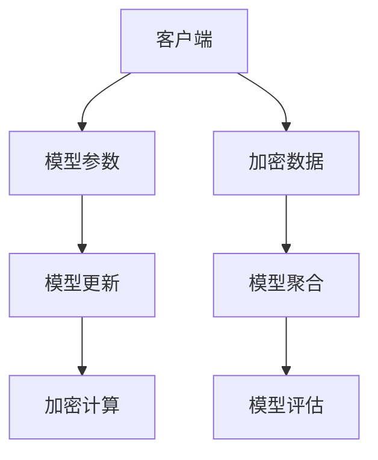
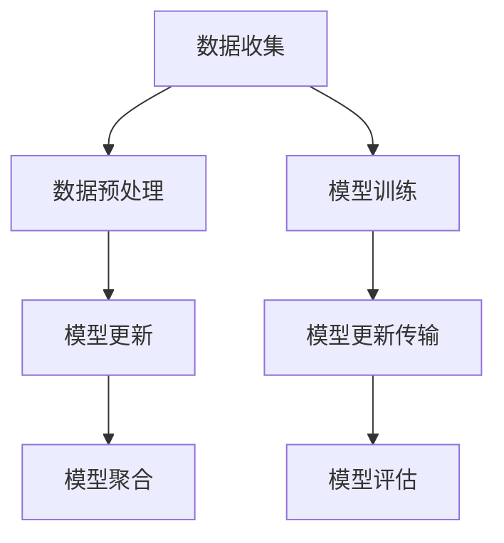
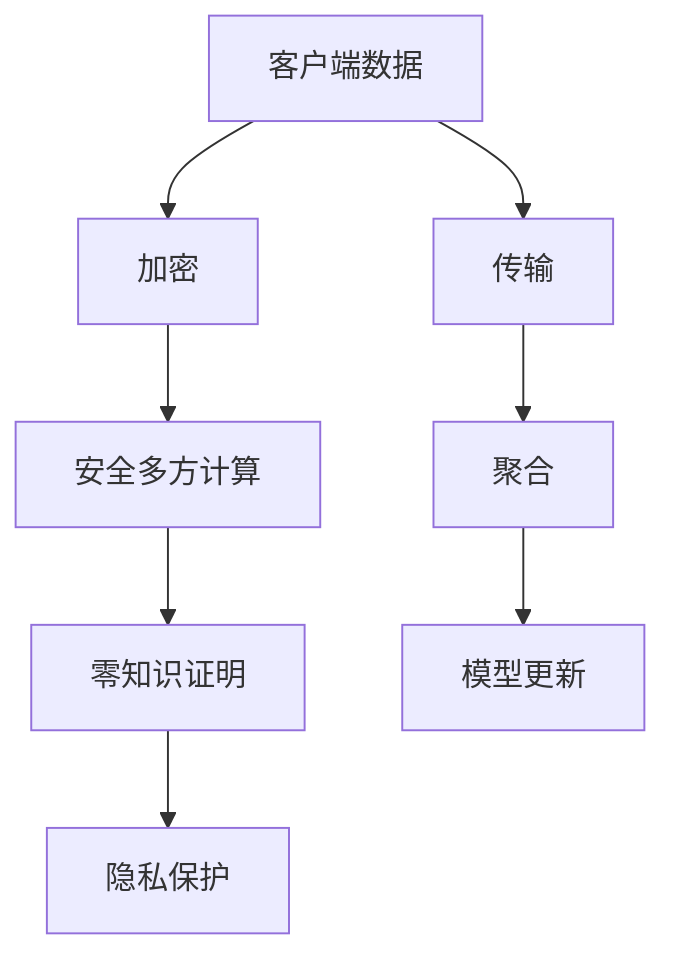
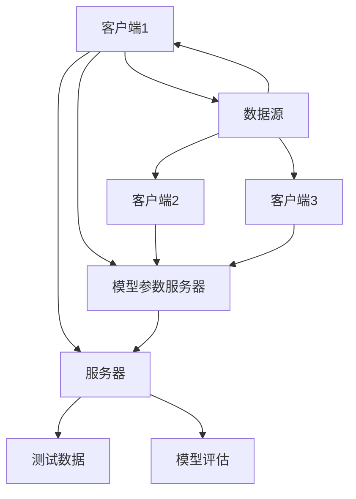

                 

### 文章标题：联邦学习 原理与代码实例讲解

### 关键词：联邦学习，联邦平均，多方安全计算，同态加密，零知识证明，图像分类，用户行为分析，开源工具

### 摘要：

本文将深入探讨联邦学习的基本概念、原理以及关键技术和挑战。我们将通过详细的流程图、伪代码和数学公式，讲解联邦学习的核心算法，如安全多方计算、同态加密和零知识证明。同时，我们将通过实际案例，展示如何使用联邦学习进行图像分类和用户行为分析，并提供详细的代码实现和解读。最后，我们将介绍一些流行的联邦学习开源工具和资源，以帮助读者深入了解和实践联邦学习。

---

# 联邦学习 原理与代码实例讲解

联邦学习是一种分布式机器学习技术，旨在在不泄露本地数据的情况下，通过多方协同训练提高模型的准确性。它广泛应用于医疗健康、金融保险、物联网和社交网络等领域。本文将逐步解析联邦学习的核心概念、关键技术，并通过实际案例展示其应用过程。

## 第一部分：联邦学习基础

## 第1章：联邦学习的概述

### 1.1 联邦学习的起源与发展
联邦学习最早由Google提出，旨在解决数据隐私和跨机构协作的需求。它结合了分布式计算和加密技术的优点，使得多个机构可以在保护数据隐私的前提下，共同训练机器学习模型。

### 1.2 联邦学习的核心概念
联邦学习涉及多方数据共享和模型协同优化。核心概念包括客户端、服务器、模型参数和加密技术等。

### 1.3 联邦学习与传统机器学习的比较
联邦学习与传统机器学习相比，具有更强的隐私保护和数据共享能力，但同时也面临着计算复杂度和模型准确性的挑战。

### 1.4 联邦学习的安全与隐私
联邦学习通过同态加密、安全多方计算和差分隐私等手段，确保数据在传输和聚合过程中得到充分保护。

## 第2章：联邦学习的基本架构

### 2.1 联邦学习系统架构
联邦学习系统通常包括客户端、服务器和模型参数服务器。客户端负责数据采集和模型训练，服务器负责协调和聚合模型参数。

### 2.2 联邦学习中的数据与模型传输
数据传输和模型更新是联邦学习的关键步骤。通过加密和压缩技术，可以降低传输成本和通信延迟。

### 2.3 联邦学习中的加密技术
同态加密和差分隐私是联邦学习中的核心技术，用于保护数据隐私和安全。

### 2.4 联邦学习中的优化算法
联邦学习中的优化算法包括联邦平均算法、联邦极大似然估计等，用于提高模型训练效率和准确性。

## 第3章：联邦学习的关键技术

### 3.1 安全多方计算
安全多方计算（SMC）是一种在多方参与下，共同计算并共享结果的技术，确保各方在合作过程中不泄露敏感信息。

### 3.2 同态加密
同态加密允许在加密数据上执行计算，而不需要解密数据。它在联邦学习中用于保护数据隐私。

### 3.3 零知识证明
零知识证明是一种密码学技术，证明者可以证明某个陈述是正确的，而不泄露任何具体信息。它在联邦学习中用于确保模型的正确性。

### 3.4 模型聚合
模型聚合是将多个客户端的模型更新合并为一个全局模型的过程。常用的聚合算法包括联邦平均算法等。

## 第4章：联邦学习的挑战与解决方案

### 4.1 数据多样性
数据多样性是联邦学习中的一个挑战，不同客户端的数据分布可能存在显著差异。解决方案包括数据清洗、增强和数据再平衡等。

### 4.2 模型准确性
模型准确性是联邦学习的核心目标。提高模型准确性的方法包括模型优化、特征选择和算法改进等。

### 4.3 系统可扩展性
联邦学习系统需要具备良好的可扩展性，以应对不断增长的数据和客户端数量。解决方案包括分布式架构和负载均衡等。

### 4.4 安全性与隐私保护
安全性与隐私保护是联邦学习的关键要求。解决方案包括加密算法的选择、安全协议的优化和隐私保护技术的应用等。

## 第5章：联邦学习的应用场景

### 5.1 医疗健康
联邦学习在医疗健康领域具有广泛的应用，如疾病预测、药物发现和患者数据共享等。

### 5.2 金融保险
联邦学习在金融保险领域用于风险分析、信用评分和欺诈检测等。

### 5.3 物联网
联邦学习在物联网领域用于设备数据共享、智能预测和维护等。

### 5.4 社交网络
联邦学习在社交网络领域用于用户行为分析、推荐系统和隐私保护等。

## 第6章：联邦学习的实际案例

### 6.1 案例一：基于联邦学习的图像分类
我们将通过一个基于联邦学习的图像分类案例，展示如何使用联邦学习进行图像分类任务。

### 6.2 案例二：基于联邦学习的用户行为分析
我们将通过一个基于联邦学习的用户行为分析案例，展示如何使用联邦学习进行用户行为预测任务。

## 第7章：联邦学习的未来发展趋势

### 7.1 跨领域联邦学习
跨领域联邦学习是未来的一个重要趋势，它旨在将不同领域的知识进行融合，提高模型的应用价值。

### 7.2 联邦学习与区块链的结合
联邦学习与区块链的结合将带来新的应用场景，如去中心化的智能合约和数据共享等。

### 7.3 联邦学习在物联网中的应用
联邦学习在物联网中的应用将提高设备数据的利用效率和隐私保护水平。

### 7.4 联邦学习的开源生态
联邦学习的开源生态将推动技术的创新和发展，为开发者提供丰富的工具和资源。

## 第二部分：联邦学习实践

## 第8章：联邦学习环境搭建

### 8.1 环境准备
我们将介绍如何搭建联邦学习环境，包括安装必要的软件和配置开发环境。

### 8.2 开发工具与框架
我们将介绍常用的联邦学习开发工具和框架，如TensorFlow Federated和PySyft等。

### 8.3 数据预处理
我们将介绍如何进行联邦学习数据预处理，包括数据清洗、增强和划分训练集等。

## 第9章：联邦学习案例实战

### 9.1 案例一：基于联邦学习的图像分类
我们将通过一个具体的图像分类案例，展示如何使用联邦学习进行图像分类任务。

### 9.2 案例二：基于联邦学习的用户行为分析
我们将通过一个具体的用户行为分析案例，展示如何使用联邦学习进行用户行为预测任务。

## 附录

### 附录A：联邦学习开源资源与工具
我们将介绍一些流行的联邦学习开源资源和工具，包括框架、库和实验室等。

---

## 第1章：联邦学习的概述

### 1.1 联邦学习的起源与发展

联邦学习（Federated Learning）的概念最早由Google在2016年提出，其目的是为了解决在数据隐私保护日益严格的背景下，如何实现多方数据共享和协同训练模型的问题。随着大数据和人工智能技术的快速发展，越来越多的领域面临着数据隐私和安全的问题。传统的集中式机器学习方法将所有数据汇集到中心服务器进行训练，这种方式在提高模型准确性的同时，也带来了数据隐私泄露的风险。

联邦学习通过分布式计算和加密技术的结合，实现了一种在不传输原始数据的情况下，通过多方协同训练模型的方法。Google的联邦学习研究项目TensorFlow Federated（TFF）为此提供了重要的技术支持，使得联邦学习逐渐成为人工智能领域的一个热门研究方向。

近年来，随着对联邦学习研究的深入，越来越多的公司和学术机构加入其中，开发出了多种联邦学习框架和工具。联邦学习已经广泛应用于医疗健康、金融保险、物联网和社交网络等领域，为数据隐私保护和多方协作提供了新的解决方案。

### 1.2 联邦学习的核心概念

#### 核心概念与联系

联邦学习的核心概念包括客户端（Clients）、服务器（Server）、模型参数服务器（Model Server）和加密技术等。以下是一个简化的联邦学习系统的 Mermaid 流程图，展示了这些核心概念之间的联系：



- **客户端（Clients）**：客户端是联邦学习系统中的数据持有者，它们负责数据采集、模型训练和模型更新。
- **服务器（Server）**：服务器负责协调和管理整个联邦学习过程，包括分发任务、收集模型更新、聚合模型参数和评估模型性能。
- **模型参数服务器（Model Server）**：模型参数服务器存储和管理全局模型参数，用于模型聚合和更新。
- **加密数据（Encrypted Data）**：加密数据是客户端在数据传输过程中使用加密技术处理的数据，确保数据在传输过程中不会被窃取或篡改。
- **模型更新（Model Update）**：模型更新是客户端在本地训练模型后，生成的模型参数更新。
- **模型聚合（Model Aggregation）**：模型聚合是将多个客户端的模型更新合并为一个全局模型参数的过程，用于模型更新和性能评估。
- **模型评估（Model Evaluation）**：模型评估是使用测试数据对全局模型进行性能评估，以确定模型是否达到预期的性能目标。

#### 联邦学习的基本架构

联邦学习的基本架构通常包括以下组成部分：

- **数据收集**：客户端从本地数据源中收集数据。
- **数据预处理**：客户端对收集到的数据进行预处理，如清洗、归一化等。
- **模型训练**：客户端使用本地数据训练模型，生成模型更新。
- **模型更新传输**：客户端将模型更新发送到服务器。
- **模型聚合**：服务器接收并聚合来自所有客户端的模型更新，生成全局模型参数。
- **模型评估**：服务器使用测试数据对全局模型进行评估，确定模型的性能。

以下是一个简化的联邦学习系统架构的 Mermaid 流程图：



### 1.3 联邦学习与传统机器学习的比较

#### 联邦学习与传统机器学习的比较

联邦学习与传统机器学习在数据收集、模型训练和部署等方面存在显著差异。以下是比较的几个关键点：

- **数据收集**：
  - **传统机器学习**：数据通常从单一数据源集中收集，然后上传到中心服务器。
  - **联邦学习**：数据在本地设备上收集，不需要上传原始数据，从而避免了数据泄露的风险。

- **模型训练**：
  - **传统机器学习**：模型在中心服务器上训练，数据需要传输到服务器进行处理。
  - **联邦学习**：模型在本地设备上训练，模型参数在多方之间传输和更新，减少了数据传输量和通信延迟。

- **部署**：
  - **传统机器学习**：训练好的模型部署到中心服务器，供所有用户使用。
  - **联邦学习**：训练好的模型在本地设备上使用，模型参数在多方之间共享和更新，提高了数据隐私保护水平。

#### 对比结果

- **隐私保护**：联邦学习通过本地训练和模型参数传输，显著提高了数据隐私保护水平，避免了集中式数据存储和传输带来的隐私泄露风险。
- **数据安全性**：联邦学习通过加密技术和安全多方计算，确保数据在传输和存储过程中的安全性。
- **计算效率**：联邦学习降低了数据传输量和通信延迟，提高了计算效率，特别是在数据量巨大和远程数据传输场景下。
- **可扩展性**：联邦学习系统可以轻松扩展到更多的客户端，适应不断增长的数据量和用户需求。

### 1.4 联邦学习的安全与隐私

联邦学习通过多种加密技术和安全协议，确保数据在传输和聚合过程中的安全性和隐私保护。以下是一些关键的安全和隐私保护措施：

- **同态加密**：同态加密允许在加密数据上直接执行计算，而不需要解密数据。这确保了数据在传输过程中不会被窃取或篡改。
- **安全多方计算**：安全多方计算（SMC）是一种在多方参与下，共同计算并共享结果的技术，确保各方在合作过程中不泄露敏感信息。
- **差分隐私**：差分隐私通过在算法中添加噪声，确保输出结果不依赖于单个个体的数据，从而保护个体隐私。
- **零知识证明**：零知识证明（ZKP）允许证明者证明某个陈述是正确的，而不泄露任何具体信息，确保隐私保护。

以下是一个简化的联邦学习系统中的安全和隐私保护措施的 Mermaid 流程图：



通过这些技术和措施，联邦学习在保证数据隐私和安全的前提下，实现了多方协同训练模型的目标。

## 第2章：联邦学习的基本架构

### 2.1 联邦学习系统架构

联邦学习系统架构是联邦学习技术实现的基础，它由多个组成部分协同工作，以实现多方数据共享和模型协同优化。以下是对联邦学习系统架构的详细解析：

#### 系统组成部分

联邦学习系统通常包括以下几个关键组成部分：

1. **客户端（Clients）**：客户端是联邦学习系统中的数据持有者，它们负责数据采集、模型训练和模型更新。客户端可以是智能手机、物联网设备或桌面计算机等。
2. **服务器（Server）**：服务器负责协调和管理整个联邦学习过程，包括任务分发、模型参数更新、聚合和评估。服务器充当联邦学习系统的中心控制节点。
3. **模型参数服务器（Model Server）**：模型参数服务器存储和管理全局模型参数，用于模型聚合和更新。它与服务器紧密协作，确保模型参数的安全和一致性。
4. **通信网络**：通信网络是客户端与服务器之间进行数据传输和模型参数更新的通信渠道。它需要具备高可靠性和低延迟的特性，以确保联邦学习过程的顺利进行。

#### 系统工作流程

联邦学习系统的工作流程可以分为以下几个主要阶段：

1. **数据收集**：客户端从本地数据源中收集数据，如用户行为日志、医疗记录、传感器数据等。
2. **数据预处理**：客户端对收集到的数据进行预处理，包括数据清洗、归一化、特征提取等，以提高数据质量和模型的训练效率。
3. **模型训练**：客户端使用本地数据训练本地模型，生成模型更新。训练过程可以是端到端的神经网络训练，也可以是基于现有模型的部分层训练。
4. **模型更新传输**：客户端将训练好的模型更新（包括模型参数和梯度等信息）发送到服务器。为了保护数据隐私，模型更新通常采用加密技术进行传输。
5. **模型聚合**：服务器接收来自所有客户端的模型更新，并进行聚合。聚合过程可以采用各种算法，如联邦平均算法、梯度聚合等，以生成全局模型参数。
6. **模型更新**：服务器将聚合后的模型参数发送回模型参数服务器，更新全局模型。
7. **模型评估**：服务器使用测试数据对全局模型进行评估，以确定模型的性能和准确性。评估结果用于调整模型训练策略和优化算法。

#### 系统架构图

以下是一个简化的联邦学习系统架构图，展示了系统组成部分及其交互关系：



在这个架构图中，客户端1、客户端2和客户端3分别表示联邦学习系统中的三个客户端，它们从不同的数据源中收集数据，并使用本地模型进行训练。模型参数服务器存储和管理全局模型参数，服务器负责任务分发、模型更新和聚合，测试数据用于评估全局模型的性能。

### 2.2 联邦学习中的数据与模型传输

在联邦学习系统中，数据与模型传输是关键环节，涉及到数据加密、传输效率优化和模型更新策略等方面。以下是对这些关键点的详细讨论：

#### 数据加密

数据加密是联邦学习系统中的核心安全措施，用于确保数据在传输过程中的隐私和安全。常用的数据加密技术包括同态加密、安全多方计算和差分隐私等。

- **同态加密**：同态加密允许在加密数据上直接执行计算操作，而无需解密数据。这意味着在联邦学习中，客户端可以在加密状态下对本地数据进行训练，然后将加密的模型更新发送到服务器。服务器在接收模型更新后，通过解密和聚合操作生成全局模型参数。同态加密的优点是能够保证数据在传输过程中不被窃取或篡改，但计算复杂度较高。
- **安全多方计算**：安全多方计算（SMC）允许多个参与方在不泄露各自秘密信息的情况下，共同计算出一个结果。在联邦学习中，客户端和服务器可以通过安全多方计算协议，共同计算模型更新和聚合结果，而不需要直接交换敏感数据。常用的SMC协议包括SecureCom、MPC等。
- **差分隐私**：差分隐私是一种在算法中添加噪声，以保护个体隐私的技术。在联邦学习中，差分隐私可以通过在模型聚合过程中添加噪声，确保聚合结果不依赖于单个客户端的敏感数据。常用的差分隐私机制包括Laplace机制和Exponential机制。

#### 传输效率优化

传输效率优化是提高联邦学习系统性能的重要手段，涉及到数据压缩、批量传输和传输调度等方面。

- **数据压缩**：为了减少数据传输量，可以采用数据压缩技术，如Huffman编码、LZ77压缩等。数据压缩能够有效降低传输带宽的需求，提高传输效率。
- **批量传输**：在联邦学习中，多个客户端可能需要多次传输模型更新。通过批量传输技术，可以将多个模型更新合并成一个批次进行传输，减少传输次数和通信延迟。
- **传输调度**：传输调度策略用于优化传输时间和资源分配。常见的调度策略包括时间分割调度和资源优先级调度等。

#### 模型更新策略

模型更新策略是联邦学习中的关键问题，涉及到模型更新频率、更新策略和模型同步等。

- **模型更新频率**：模型更新频率决定了模型参数更新的频率。较高的更新频率可以提高模型的适应性和实时性，但可能导致模型稳定性下降。较低的更新频率可以提高模型稳定性，但可能降低模型对数据变化的响应速度。在实际应用中，需要根据具体场景和需求选择合适的更新频率。
- **更新策略**：常用的更新策略包括联邦平均算法（FedAvg）和联邦极大似然估计（FedML）等。联邦平均算法通过在每次更新时，将客户端的模型更新加权平均，生成全局模型参数。联邦极大似然估计通过最大化全局模型的对数似然函数，更新全局模型参数。不同的更新策略适用于不同的应用场景和数据分布。
- **模型同步**：模型同步是确保全局模型一致性的关键。在联邦学习中，由于客户端的更新时间和通信延迟可能不同，可能导致全局模型参数的不一致。为了解决这一问题，可以采用同步策略，如异步同步和同步更新等。异步同步允许客户端在任意时间进行模型更新，而同步更新要求客户端在特定时间窗口内同步更新模型参数。

### 2.3 联邦学习中的加密技术

在联邦学习中，加密技术是保护数据隐私和安全的核心手段。以下是对联邦学习中的几种常用加密技术的详细解释：

#### 同态加密

同态加密是一种在加密数据上直接执行计算操作的技术，而无需解密数据。这意味着在联邦学习中，客户端可以在加密状态下对本地数据进行训练，然后将加密的模型更新发送到服务器。服务器在接收模型更新后，通过解密和聚合操作生成全局模型参数。

同态加密的主要优点是能够保证数据在传输过程中不被窃取或篡改，从而提高数据安全性。然而，同态加密的计算复杂度较高，可能会导致模型训练时间延长。

常用的同态加密算法包括：

- **基于环的密文乘法算法**：如Lattice-based Cryptography、NTRU、环学习等。这些算法在保证加密强度的同时，具有较高的计算效率。
- **基于格的密文乘法算法**：如学习后的同态加密（LEGO）和基于格的加密（Lattice-based Cryptography）。这些算法在处理大规模数据时具有较好的性能。

#### 安全多方计算

安全多方计算（Secure Multi-Party Computation，SMC）是一种在多方参与下，共同计算并共享结果的技术，而不需要泄露各自的秘密信息。在联邦学习中，客户端和服务器可以通过安全多方计算协议，共同计算模型更新和聚合结果，而不需要直接交换敏感数据。

安全多方计算的主要优点是能够在不泄露秘密信息的情况下，实现多方协同计算，提高数据隐私保护水平。常用的安全多方计算协议包括：

- **安全多方计算协议**：如SecureCom、MPC、GC等。这些协议通过加密、混淆和随机化等技术，确保多方计算过程的安全性和隐私性。
- **基于环的安全多方计算**：如基于环的SMC（Ring-based SMC）。这些协议通过在环上进行计算，进一步提高计算效率和安全性。

#### 差分隐私

差分隐私（Differential Privacy，DP）是一种在算法中添加噪声，以保护个体隐私的技术。在联邦学习中，差分隐私可以通过在模型聚合过程中添加噪声，确保聚合结果不依赖于单个客户端的敏感数据。

差分隐私的主要优点是能够在保证数据隐私的同时，保持模型性能。常用的差分隐私机制包括：

- **Laplace机制**：通过在算法输出结果中添加Laplace噪声，保护个体隐私。
- **Exponential机制**：通过在算法输出结果中添加指数噪声，保护个体隐私。
- **平滑机制**：通过在算法输出结果中添加平滑噪声，保护个体隐私。

#### 零知识证明

零知识证明（Zero-Knowledge Proof，ZKP）是一种密码学技术，证明者可以证明某个陈述是正确的，而不泄露任何具体信息。在联邦学习中，零知识证明可以用于确保模型参数的正确性和合法性。

零知识证明的主要优点是能够在不泄露具体信息的情况下，验证模型参数的正确性，从而提高数据隐私保护水平。常用的零知识证明算法包括：

- **基于密码学的零知识证明**：如RSA、Paillier、基于椭圆曲线的零知识证明等。这些算法在保证证明效率的同时，具有较高的安全性。
- **基于纠错码的零知识证明**：如Lattice-based Zero-Knowledge Proof、Learning with Errors (LWE)等。这些算法在处理大规模数据时具有较好的性能。

### 2.4 联邦学习中的优化算法

在联邦学习中，优化算法是提高模型训练效率和准确性的关键。以下是对几种常用优化算法的详细解释：

#### 联邦平均算法（FedAvg）

联邦平均算法（Federated Averaging，FedAvg）是最常用的联邦学习优化算法之一。它基于梯度下降方法，通过在多个客户端上迭代训练模型，然后聚合模型更新，生成全局模型参数。

联邦平均算法的主要优点是简单易实现，具有良好的收敛性。然而，它可能面临局部最优问题，无法保证找到全局最优解。

伪代码：

```python
# 初始化全局模型参数
global_model = initialize_model()

# 迭代训练
for epoch in range(num_epochs):
    # 收集客户端的模型参数
    client_models = collect_client_models()

    # 对客户端模型参数进行加密
    encrypted_models = encrypt_models(client_models)

    # 将加密的模型参数发送给客户端
    send_encrypted_models_to_clients(encrypted_models)

    # 客户端接收加密模型参数并更新本地模型
    for client in clients:
        client.update_model(encrypted_models[client.id])

    # 解密并聚合模型参数
    aggregated_params = decrypt_and_aggregate_params(encrypted_models)

    # 更新全局模型参数
    global_model.update_params(aggregated_params)

# 最终的全局模型
final_model = global_model
```

数学模型：

$$
\theta^{(t+1)} = \frac{1}{k}\sum_{i=1}^{k} \theta^{(i,t)}
$$

其中，$\theta^{(i,t)}$ 表示第 $i$ 个客户端在迭代 $t$ 时刻的模型参数，$k$ 表示客户端的数量。

#### 联邦极大似然估计（FedML）

联邦极大似然估计（Federated Maximum Likelihood，FedML）是一种基于极大似然估计的联邦学习优化算法。它通过最大化全局模型的对数似然函数，更新全局模型参数。

联邦极大似然估计的主要优点是能够保证找到全局最优解，但计算复杂度较高。

伪代码：

```python
# 初始化全局模型参数
global_model = initialize_model()

# 迭代训练
for epoch in range(num_epochs):
    # 收集客户端的模型参数
    client_models = collect_client_models()

    # 对客户端模型参数进行加密
    encrypted_models = encrypt_models(client_models)

    # 将加密的模型参数发送给客户端
    send_encrypted_models_to_clients(encrypted_models)

    # 客户端接收加密模型参数并更新本地模型
    for client in clients:
        client.update_model(encrypted_models[client.id])

    # 解密并计算全局对数似然函数
    global_log_likelihood = decrypt_and_compute_global_log_likelihood(encrypted_models)

    # 更新全局模型参数
    global_model.update_params_to_maximize_global_log_likelihood(global_log_likelihood)

# 最终的全局模型
final_model = global_model
```

数学模型：

$$
\theta^{(t+1)} = \arg\max_{\theta} \sum_{i=1}^{k} \log p(y_i^{(i)}|\theta^{(i,t)})
$$

其中，$y_i^{(i)}$ 表示第 $i$ 个客户端的标签数据，$p(y_i^{(i)}|\theta^{(i,t)}$ 表示在全局模型参数 $\theta^{(t)}$ 下，第 $i$ 个客户端标签数据的概率分布。

#### FedAdam

FedAdam是一种结合联邦平均算法和Adam优化器的联邦学习优化算法。它通过在每次迭代中，自适应调整学习率，以提高模型训练效率和收敛速度。

FedAdam的主要优点是能够快速收敛，但计算复杂度较高。

伪代码：

```python
# 初始化全局模型参数和Adam优化器
global_model = initialize_model()
adam_optimizer = AdamOptimizer()

# 迭代训练
for epoch in range(num_epochs):
    # 收集客户端的模型参数
    client_models = collect_client_models()

    # 对客户端模型参数进行加密
    encrypted_models = encrypt_models(client_models)

    # 将加密的模型参数发送给客户端
    send_encrypted_models_to_clients(encrypted_models)

    # 客户端接收加密模型参数并更新本地模型
    for client in clients:
        client.update_model(encrypted_models[client.id])

    # 解密并聚合模型参数
    aggregated_params = decrypt_and_aggregate_params(encrypted_models)

    # 更新全局模型参数
    global_model.update_params(aggregated_params)
    adam_optimizer.update_params(global_model)

# 最终的全局模型
final_model = global_model
```

数学模型：

$$
m_t = \beta_1 m_{t-1} + (1 - \beta_1) \sum_{i=1}^{k} \theta^{(i,t)}
$$

$$
v_t = \beta_2 v_{t-1} + (1 - \beta_2) ||m_t||^2
$$

$$
\theta^{(t+1)} = \theta^{(t)} - \frac{\alpha}{\sqrt{1 - \beta_2^t} (1 - \beta_1^t)} m_t
$$

其中，$m_t$ 和 $v_t$ 分别为第 $t$ 次迭代的动量和方差估计，$\beta_1$ 和 $\beta_2$ 分别为动量和方差的衰减率，$\alpha$ 为学习率。

### 2.5 联邦学习中的同步机制

在联邦学习中，同步机制是确保全局模型一致性的关键。由于客户端的更新时间和通信延迟可能不同，可能导致全局模型参数的不一致。以下是对几种同步机制的详细解释：

#### 同步更新机制

同步更新机制要求所有客户端在特定时间窗口内同步更新模型参数。在同步更新机制下，服务器在每个迭代周期开始时，等待所有客户端完成本地模型更新，然后收集和聚合模型参数。这种方法能够确保全局模型的一致性，但可能会导致通信延迟增加。

伪代码：

```python
# 迭代训练
for epoch in range(num_epochs):
    # 等待所有客户端完成模型更新
    wait_for_all_clients_to_update_models()

    # 收集客户端的模型参数
    client_models = collect_client_models()

    # 对客户端模型参数进行加密
    encrypted_models = encrypt_models(client_models)

    # 将加密的模型参数发送给客户端
    send_encrypted_models_to_clients(encrypted_models)

    # 客户端接收加密模型参数并更新本地模型
    for client in clients:
        client.update_model(encrypted_models[client.id])

    # 解密并聚合模型参数
    aggregated_params = decrypt_and_aggregate_params(encrypted_models)

    # 更新全局模型参数
    global_model.update_params(aggregated_params)
```

#### 异步更新机制

异步更新机制允许客户端在任意时间进行模型更新，服务器在每个迭代周期内收集和聚合模型参数。这种方法能够减少通信延迟，提高系统性能，但可能导致全局模型参数的不一致。

伪代码：

```python
# 迭代训练
for epoch in range(num_epochs):
    # 收集客户端的模型参数
    client_models = collect_client_models()

    # 对客户端模型参数进行加密
    encrypted_models = encrypt_models(client_models)

    # 将加密的模型参数发送给客户端
    send_encrypted_models_to_clients(encrypted_models)

    # 客户端接收加密模型参数并更新本地模型
    for client in clients:
        client.update_model(encrypted_models[client.id])

    # 解密并聚合模型参数
    aggregated_params = decrypt_and_aggregate_params(encrypted_models)

    # 更新全局模型参数
    global_model.update_params(aggregated_params)
```

#### 时间分割同步机制

时间分割同步机制结合了同步更新和异步更新的优点，将迭代周期划分为多个时间窗口。在每个时间窗口内，服务器收集和聚合来自客户端的模型参数，确保全局模型的一致性。这种方法能够平衡通信延迟和全局模型一致性。

伪代码：

```python
# 迭代训练
for epoch in range(num_epochs):
    for time_window in range(num_time_windows):
        # 收集客户端的模型参数
        client_models = collect_client_models()

        # 对客户端模型参数进行加密
        encrypted_models = encrypt_models(client_models)

        # 将加密的模型参数发送给客户端
        send_encrypted_models_to_clients(encrypted_models)

        # 客户端接收加密模型参数并更新本地模型
        for client in clients:
            client.update_model(encrypted_models[client.id])

        # 解密并聚合模型参数
        aggregated_params = decrypt_and_aggregate_params(encrypted_models)

        # 更新全局模型参数
        global_model.update_params(aggregated_params)
```

### 2.6 联邦学习中的联邦学习框架和工具

联邦学习框架和工具是实现联邦学习系统的关键，以下介绍几种常用的联邦学习框架和工具：

#### TensorFlow Federated (TFF)

TensorFlow Federated（TFF）是Google开发的联邦学习框架，基于TensorFlow构建。TFF提供了丰富的联邦学习组件和API，支持联邦平均算法、联邦极大似然估计等优化算法，同时支持多种加密技术和数据传输优化策略。

- 官网：https://tensorflow.org/federated
- 文档：https://tensorflow.org/federated/docs

#### PySyft

PySyft是一个开源的联邦学习框架，基于PyTorch构建。PySyft提供了安全的模型训练和推理功能，支持同态加密、安全多方计算和差分隐私等隐私保护技术。

- 官网：https://pygrid.io/pygrid-docs/
- 文档：https://pytorch.org/syft/

#### FedML

FedML是一个开源的联邦学习平台，支持多种联邦学习算法和框架，如PyTorch、TensorFlow、MXNet等。FedML提供了数据预处理、模型训练、部署和管理等功能，适用于多种应用场景。

- 官网：https://github.com/PaddlePaddle/FedML
- 文档：https://fedml.readthedocs.io/

#### FDLab

FDLab是一个开源的联邦学习实验室，提供了多种联邦学习算法的实现和评估工具。FDLab支持多种联邦学习框架，如PyTorch、TensorFlow等，并提供了用于联邦学习实验设计的API。

- 官网：https://fdlab.io/
- 文档：https://fdlab.io/docs

### 2.7 联邦学习的挑战与解决方案

联邦学习作为一种分布式机器学习技术，虽然在数据隐私保护和多方协作方面具有显著优势，但也面临一系列挑战。以下是对联邦学习挑战及其解决方案的详细讨论：

#### 数据多样性

数据多样性是联邦学习中的一个重要挑战。由于客户端的数据分布可能存在显著差异，可能导致模型聚合过程中出现数据不平衡问题。以下是一些解决方案：

- **数据增强**：通过数据增强技术，如生成对抗网络（GANs）、数据扩充等，增加数据多样性。
- **数据再平衡**：通过数据再平衡技术，如欠采样、过采样、合成少数类过采样技术（SMOTE）等，调整数据分布，减少数据不平衡问题。
- **数据去噪**：通过数据去噪技术，如去噪自动编码器（DAE）、卷积神经网络（CNN）等，提高数据质量，减少数据噪声。

#### 模型准确性

模型准确性是联邦学习中的核心目标。由于联邦学习涉及到多方协同训练，模型可能会面临局部最优问题，导致模型准确性下降。以下是一些解决方案：

- **模型优化**：通过模型优化技术，如优化算法改进、模型架构调整等，提高模型训练效率和准确性。
- **特征选择**：通过特征选择技术，如特征重要性评估、主成分分析（PCA）等，选择对模型准确性有显著贡献的特征。
- **数据预处理**：通过数据预处理技术，如数据清洗、归一化、特征提取等，提高数据质量和模型训练效果。

#### 系统可扩展性

联邦学习系统需要具备良好的可扩展性，以应对不断增长的数据和客户端数量。以下是一些解决方案：

- **分布式架构**：通过分布式架构，如分布式训练、分布式存储等，提高系统性能和可扩展性。
- **负载均衡**：通过负载均衡技术，如基于轮询、最小连接数等策略，合理分配任务和资源，提高系统性能和稳定性。
- **云计算和边缘计算**：通过云计算和边缘计算的结合，实现数据的集中存储和计算，提高系统性能和可扩展性。

#### 安全性与隐私保护

安全性与隐私保护是联邦学习的关键要求。以下是一些解决方案：

- **加密技术**：通过加密技术，如同态加密、安全多方计算、零知识证明等，保护数据隐私和安全。
- **安全协议**：通过安全协议，如TLS、安全多方计算协议等，确保数据在传输和存储过程中的安全性。
- **隐私保护技术**：通过隐私保护技术，如差分隐私、匿名化等，保护个体隐私和数据安全。

#### 数据传输和通信延迟

数据传输和通信延迟是联邦学习中的一个重要挑战。以下是一些解决方案：

- **数据压缩**：通过数据压缩技术，如Huffman编码、LZ77压缩等，减少数据传输量，提高传输效率。
- **传输优化**：通过传输优化技术，如批量传输、多路径传输等，减少传输延迟和通信开销。
- **缓存和预取**：通过缓存和预取技术，提前加载和缓存数据，减少数据传输延迟和通信开销。

### 2.8 联邦学习在现实世界的应用场景

联邦学习在现实世界中具有广泛的应用场景，以下介绍几种典型的应用场景：

#### 医疗健康

联邦学习在医疗健康领域具有广泛的应用，如疾病预测、药物发现和患者数据共享等。通过联邦学习，医疗机构可以在保护患者隐私的前提下，共享和协同训练模型，提高疾病诊断和治疗的准确性。

- **疾病预测**：联邦学习可以用于预测患者的疾病风险，如心脏病、糖尿病等。通过多方协同训练，提高疾病预测的准确性。
- **药物发现**：联邦学习可以用于药物发现和药物筛选。通过共享和协同训练，加速药物研发过程，提高药物疗效。
- **患者数据共享**：联邦学习可以用于保护患者隐私的前提下，共享和协同分析患者数据，提高医疗服务的质量和效率。

#### 金融保险

联邦学习在金融保险领域用于风险分析、信用评分和欺诈检测等。通过联邦学习，金融机构可以在保护客户隐私的前提下，共享和协同训练模型，提高风险管理和决策的准确性。

- **风险分析**：联邦学习可以用于分析客户的风险偏好和风险承受能力，为金融机构提供定制化的风险管理策略。
- **信用评分**：联邦学习可以用于预测客户的信用风险，为金融机构提供准确的信用评分。
- **欺诈检测**：联邦学习可以用于检测和预防金融欺诈行为，提高金融服务的安全性和可靠性。

#### 物联网

联邦学习在物联网领域用于设备数据共享、智能预测和维护等。通过联邦学习，物联网设备可以在保护数据隐私的前提下，共享和协同训练模型，提高设备的智能化和可靠性。

- **设备数据共享**：联邦学习可以用于物联网设备之间的数据共享和协同分析，提高设备的数据利用效率和智能化水平。
- **智能预测**：联邦学习可以用于预测物联网设备的故障和性能，为设备维护和优化提供支持。
- **设备维护**：联邦学习可以用于分析物联网设备的数据，提供设备维护和优化建议，提高设备的稳定性和使用寿命。

#### 社交网络

联邦学习在社交网络领域用于用户行为分析、推荐系统和隐私保护等。通过联邦学习，社交网络平台可以在保护用户隐私的前提下，共享和协同训练模型，提高服务的个性化程度和用户满意度。

- **用户行为分析**：联邦学习可以用于分析用户的社交行为和偏好，为社交网络平台提供个性化的推荐和服务。
- **推荐系统**：联邦学习可以用于构建用户兴趣和行为模型，为社交网络平台提供精准的推荐。
- **隐私保护**：联邦学习可以用于保护用户隐私，避免用户数据被泄露和滥用。

### 2.9 联邦学习的未来发展趋势

联邦学习作为一种新兴的分布式机器学习技术，具有巨大的发展潜力和应用前景。以下介绍联邦学习的未来发展趋势：

#### 跨领域联邦学习

跨领域联邦学习是将不同领域的知识进行融合，提高模型的应用价值。通过跨领域联邦学习，可以实现医疗、金融、物联网等领域的知识共享和协同创新，推动人工智能技术的发展和应用。

- **医疗健康**：跨领域联邦学习可以用于构建跨学科的医疗诊断模型，提高疾病诊断和治疗的准确性。
- **金融保险**：跨领域联邦学习可以用于构建跨领域的风险预测模型，提高金融机构的风险管理和决策能力。
- **物联网**：跨领域联邦学习可以用于构建跨领域的物联网智能模型，提高设备的智能化和可靠性。

#### 联邦学习与区块链的结合

联邦学习与区块链的结合将带来新的应用场景和挑战。通过区块链技术，可以实现联邦学习过程中数据的安全传输和可信存储，提高联邦学习的隐私保护和可信度。

- **数据共享**：通过区块链技术，可以实现联邦学习过程中数据的安全共享和可信传输，提高数据利用效率和隐私保护水平。
- **隐私保护**：通过区块链技术，可以实现联邦学习过程中数据的隐私保护和数据所有权确认，提高用户的隐私权和数据安全。
- **智能合约**：通过区块链技术，可以实现联邦学习过程中的智能合约，提高联邦学习过程中的自动化和可信度。

#### 联邦学习在物联网中的应用

联邦学习在物联网中的应用将提高设备数据的利用效率和隐私保护水平。通过联邦学习，可以实现物联网设备之间的数据共享和协同分析，提高设备的智能化和可靠性。

- **智能预测**：通过联邦学习，可以预测物联网设备的故障和性能，为设备维护和优化提供支持。
- **设备协同**：通过联邦学习，可以实现物联网设备之间的协同工作，提高系统的智能化和效率。
- **数据隐私保护**：通过联邦学习，可以保护物联网设备数据的安全和隐私，避免数据泄露和滥用。

#### 联邦学习的开源生态

联邦学习的开源生态将推动技术的创新和发展，为开发者提供丰富的工具和资源。通过开源生态，可以实现联邦学习技术的共享和协同创新，提高联邦学习技术的普及和应用。

- **开源框架**：通过开源框架，可以实现联邦学习技术的标准化和通用化，提高开发效率和可扩展性。
- **开源工具**：通过开源工具，可以实现联邦学习过程中的数据处理、模型训练、部署和管理等，提高开发效率和系统性能。
- **开源社区**：通过开源社区，可以实现联邦学习技术的交流和合作，推动技术的创新和应用。

### 第3章：联邦学习的关键技术

### 3.1 安全多方计算

安全多方计算（Secure Multi-Party Computation，SMC）是一种在多方参与下，共同计算并共享结果的技术，而不需要泄露各自的秘密信息。在联邦学习中，安全多方计算被广泛应用于数据聚合、模型训练和隐私保护等方面。

#### 3.1.1 安全多方计算的基本原理

安全多方计算的基本原理可以概括为以下几个步骤：

1. **初始化**：参与方（客户端和服务器）协商安全参数，如加密算法、通信协议等。
2. **秘密共享**：参与方将各自的秘密信息（如模型参数、数据等）进行分割和共享，以保护各自的数据隐私。
3. **协同计算**：参与方在共享的秘密信息基础上，通过加密计算和交换信息，共同计算出一个结果。
4. **结果验证**：参与方验证计算结果，确保结果的正确性和一致性。

#### 3.1.2 安全多方计算的应用场景

安全多方计算在联邦学习中有广泛的应用场景，以下是一些典型的应用场景：

- **数据聚合**：在联邦学习中，服务器需要收集并聚合来自多个客户端的数据。通过安全多方计算，服务器可以安全地聚合数据，而不需要直接访问客户端的原始数据，从而保护数据隐私。
- **模型训练**：在联邦学习中，客户端需要对本地数据进行模型训练，并将训练结果（如模型参数）发送给服务器。通过安全多方计算，客户端可以安全地计算和传输模型参数，从而保护模型的隐私。
- **隐私保护**：安全多方计算可以用于保护联邦学习过程中的隐私信息，如用户数据、模型参数等。通过安全多方计算，参与方可以在不泄露秘密信息的前提下，共同计算和共享结果，从而提高数据隐私保护水平。

#### 3.1.3 安全多方计算的核心算法

安全多方计算的核心算法包括秘密共享、加密计算、结果验证等。以下是对这些核心算法的简要介绍：

- **秘密共享**：秘密共享是一种将秘密信息分割和共享的技术，以保护各自的秘密信息。常用的秘密共享技术包括基于门的秘密共享、基于椭圆曲线的秘密共享等。
- **加密计算**：加密计算是一种在加密数据上执行计算的技术，以保护数据隐私。常用的加密计算技术包括同态加密、安全多方计算协议等。
- **结果验证**：结果验证是一种确保计算结果正确性和一致性的技术。常用的结果验证技术包括一致性检查、安全多方计算协议等。

#### 3.1.4 安全多方计算的挑战与解决方案

安全多方计算在联邦学习中的应用面临一系列挑战，以下是一些常见的挑战及其解决方案：

- **计算复杂度**：安全多方计算通常涉及复杂的加密和解密操作，导致计算复杂度较高。为了降低计算复杂度，可以采用优化算法、并行计算等技术。
- **通信开销**：安全多方计算通常需要多次通信，导致通信开销较大。为了降低通信开销，可以采用压缩算法、批量传输等技术。
- **安全性**：安全多方计算需要确保计算过程和结果的安全性。为了提高安全性，可以采用加密算法、安全多方计算协议等技术。

### 3.2 同态加密

同态加密（Homomorphic Encryption，HE）是一种在加密数据上直接执行计算操作的技术，而不需要解密数据。同态加密在联邦学习中具有重要的应用价值，可以保护数据隐私，提高数据安全性。

#### 3.2.1 同态加密的基本原理

同态加密的基本原理可以概括为以下几个步骤：

1. **初始化**：生成加密密钥对，包括公钥和私钥。
2. **加密**：使用公钥将明文数据加密成密文数据。
3. **计算**：在加密数据上执行计算操作，如加法、乘法等。
4. **解密**：使用私钥将加密数据解密成明文数据。

同态加密允许在加密数据上直接执行计算操作，而不需要解密数据。这意味着在联邦学习中，客户端可以在本地对加密数据进行模型训练，然后将加密的模型更新发送给服务器，从而保护数据隐私。

#### 3.2.2 同态加密的应用场景

同态加密在联邦学习中有广泛的应用场景，以下是一些典型的应用场景：

- **模型训练**：在联邦学习中，客户端可以在本地对加密数据进行模型训练，从而保护数据隐私。通过同态加密，客户端可以安全地计算模型参数，并将加密的模型更新发送给服务器。
- **数据聚合**：在联邦学习中，服务器需要收集并聚合来自多个客户端的数据。通过同态加密，服务器可以安全地聚合数据，而不需要直接访问客户端的原始数据，从而保护数据隐私。
- **隐私保护**：同态加密可以用于保护联邦学习过程中的隐私信息，如用户数据、模型参数等。通过同态加密，参与方可以在不泄露秘密信息的前提下，共同计算和共享结果，从而提高数据隐私保护水平。

#### 3.2.3 同态加密的核心算法

同态加密的核心算法包括加密算法、计算算法和解密算法。以下是对这些核心算法的简要介绍：

- **加密算法**：加密算法是将明文数据加密成密文数据的算法。常用的加密算法包括基于RSA的加密算法、基于椭圆曲线的加密算法等。
- **计算算法**：计算算法是在加密数据上执行计算操作的算法。常用的计算算法包括同态加密的加法算法、乘法算法等。
- **解密算法**：解密算法是将加密数据解密成明文数据的算法。常用的解密算法包括基于RSA的解密算法、基于椭圆曲线的解密算法等。

#### 3.2.4 同态加密的挑战与解决方案

同态加密在联邦学习中的应用面临一系列挑战，以下是一些常见的挑战及其解决方案：

- **计算复杂度**：同态加密通常涉及复杂的加密和解密操作，导致计算复杂度较高。为了降低计算复杂度，可以采用优化算法、硬件加速等技术。
- **带宽消耗**：同态加密通常需要较大的带宽来传输加密数据，导致通信成本较高。为了降低带宽消耗，可以采用压缩算法、数据去重等技术。
- **安全性和隐私保护**：同态加密需要确保数据在传输和存储过程中的安全性和隐私保护。为了提高安全性和隐私保护水平，可以采用多重加密、安全多方计算等技术。

### 3.3 差分隐私

差分隐私（Differential Privacy，DP）是一种在算法中添加噪声，以保护个体隐私的技术。差分隐私在联邦学习中被广泛应用于数据聚合、模型训练和隐私保护等方面。

#### 3.3.1 差分隐私的基本原理

差分隐私的基本原理可以概括为以下几个步骤：

1. **初始化**：确定隐私预算$\epsilon$，用于控制噪声的大小。
2. **隐私机制**：选择一个隐私机制，如Laplace机制、Exponential机制等，为算法输出添加噪声。
3. **数据聚合**：对参与方的数据进行聚合，以生成最终结果。
4. **结果验证**：验证结果的隐私保护水平，确保满足差分隐私要求。

差分隐私通过在算法输出结果中添加噪声，使得输出结果不依赖于单个个体的数据，从而保护个体隐私。

#### 3.3.2 差分隐私的应用场景

差分隐私在联邦学习中有广泛的应用场景，以下是一些典型的应用场景：

- **数据聚合**：在联邦学习中，服务器需要收集并聚合来自多个客户端的数据。通过差分隐私，服务器可以在不泄露单个客户端数据的前提下，进行数据聚合和分析，从而保护数据隐私。
- **模型训练**：在联邦学习中，客户端需要对本地数据进行模型训练，并将训练结果发送给服务器。通过差分隐私，客户端可以确保训练结果不依赖于单个客户端的敏感数据，从而保护模型隐私。
- **隐私保护**：差分隐私可以用于保护联邦学习过程中的隐私信息，如用户数据、模型参数等。通过差分隐私，参与方可以在不泄露秘密信息的前提下，共同计算和共享结果，从而提高数据隐私保护水平。

#### 3.3.3 差分隐私的核心算法

差分隐私的核心算法包括隐私机制、数据聚合算法和结果验证算法。以下是对这些核心算法的简要介绍：

- **隐私机制**：隐私机制是用于添加噪声的算法。常用的隐私机制包括Laplace机制、Exponential机制等。
- **数据聚合算法**：数据聚合算法是用于聚合参与方数据的算法。常用的数据聚合算法包括求和算法、求平均值算法等。
- **结果验证算法**：结果验证算法是用于验证结果隐私保护水平的算法。常用的结果验证算法包括统计检验、概率论等方法。

#### 3.3.4 差分隐私的挑战与解决方案

差分隐私在联邦学习中的应用面临一系列挑战，以下是一些常见的挑战及其解决方案：

- **计算复杂度**：差分隐私通常涉及复杂的噪声添加和结果验证操作，导致计算复杂度较高。为了降低计算复杂度，可以采用优化算法、并行计算等技术。
- **精度损失**：差分隐私通过添加噪声来保护隐私，可能导致结果精度损失。为了降低精度损失，可以采用优化算法、数据预处理等技术。
- **隐私预算分配**：差分隐私需要确定合适的隐私预算，以平衡隐私保护和结果精度。为了优化隐私预算分配，可以采用优化算法、自适应调整等技术。

### 3.4 零知识证明

零知识证明（Zero-Knowledge Proof，ZKP）是一种密码学技术，证明者可以证明某个陈述是正确的，而不泄露任何具体信息。零知识证明在联邦学习中被广泛应用于隐私保护、模型验证和信任建立等方面。

#### 3.4.1 零知识证明的基本原理

零知识证明的基本原理可以概括为以下几个步骤：

1. **初始化**：证明者和验证者协商安全参数，如加密算法、通信协议等。
2. **证明构建**：证明者构建一个证明，证明某个陈述是正确的。
3. **交互验证**：证明者和验证者进行交互，验证证明的有效性。
4. **证明验证**：验证者确认证明是正确的，同时确保没有泄露任何信息。

零知识证明通过在证明者和验证者之间进行交互，证明某个陈述是正确的，同时确保证明过程中不泄露任何具体信息，从而保护隐私。

#### 3.4.2 零知识证明的应用场景

零知识证明在联邦学习中有广泛的应用场景，以下是一些典型的应用场景：

- **隐私保护**：零知识证明可以用于保护联邦学习过程中的隐私信息，如用户数据、模型参数等。通过零知识证明，参与方可以在不泄露秘密信息的前提下，共同计算和共享结果，从而提高数据隐私保护水平。
- **模型验证**：零知识证明可以用于验证联邦学习模型的正确性和合法性。通过零知识证明，验证者可以确认模型参数的正确性和合法性，从而提高模型的信任度。
- **信任建立**：零知识证明可以用于建立参与方之间的信任关系。通过零知识证明，参与方可以在不泄露具体信息的前提下，证明自身的身份和信誉，从而建立信任关系。

#### 3.4.3 零知识证明的核心算法

零知识证明的核心算法包括证明构建算法、交互验证算法和证明验证算法。以下是对这些核心算法的简要介绍：

- **证明构建算法**：证明构建算法是用于构建证明的算法。常用的证明构建算法包括基于密码学的证明构建算法、基于纠错码的证明构建算法等。
- **交互验证算法**：交互验证算法是用于验证证明的算法。常用的交互验证算法包括基于密码学的交互验证算法、基于纠错码的交互验证算法等。
- **证明验证算法**：证明验证算法是用于验证证明的算法。常用的证明验证算法包括基于密码学的证明验证算法、基于纠错码的证明验证算法等。

#### 3.4.4 零知识证明的挑战与解决方案

零知识证明在联邦学习中的应用面临一系列挑战，以下是一些常见的挑战及其解决方案：

- **计算复杂度**：零知识证明通常涉及复杂的证明构建和验证操作，导致计算复杂度较高。为了降低计算复杂度，可以采用优化算法、硬件加速等技术。
- **通信开销**：零知识证明通常需要多次通信，导致通信开销较大。为了降低通信开销，可以采用压缩算法、批量传输等技术。
- **安全性**：零知识证明需要确保证明过程和结果的安全性。为了提高安全性，可以采用多重加密、安全多方计算等技术。

### 3.5 集合蒸馏

集合蒸馏（Cascading Distillation，CD）是一种在联邦学习中用于优化模型性能的技术。集合蒸馏通过将多个小型模型（学生模型）训练成一个大型模型（教师模型），从而提高模型的准确性和鲁棒性。

#### 3.5.1 集合蒸馏的基本原理

集合蒸馏的基本原理可以概括为以下几个步骤：

1. **初始化**：初始化教师模型和学生模型，教师模型的规模通常大于学生模型。
2. **教师模型训练**：使用原始数据集对教师模型进行训练，生成教师模型的特征表示。
3. **学生模型训练**：使用教师模型的特征表示作为目标，对多个学生模型进行训练，以学习教师模型的知识。
4. **模型聚合**：将训练好的学生模型进行聚合，生成一个大型模型。

集合蒸馏通过将多个小型模型训练成一个大型模型，可以充分利用小型模型的知识和鲁棒性，提高大型模型的性能。

#### 3.5.2 集合蒸馏的应用场景

集合蒸馏在联邦学习中有广泛的应用场景，以下是一些典型的应用场景：

- **模型优化**：集合蒸馏可以用于优化联邦学习中的模型性能，提高模型的准确性和鲁棒性。
- **知识迁移**：集合蒸馏可以用于将教师模型的知识迁移到学生模型，从而提高学生模型的性能。
- **模型压缩**：集合蒸馏可以用于压缩大型模型，生成一个小型模型，从而减少模型的计算资源和存储需求。

#### 3.5.3 集合蒸馏的核心算法

集合蒸馏的核心算法包括教师模型训练、学生模型训练和模型聚合。以下是对这些核心算法的简要介绍：

- **教师模型训练**：教师模型训练是通过原始数据集对教师模型进行训练，生成教师模型的特征表示。常用的教师模型训练算法包括基于梯度的优化算法、基于损失函数的优化算法等。
- **学生模型训练**：学生模型训练是通过教师模型的特征表示作为目标，对多个学生模型进行训练，以学习教师模型的知识。常用的学生模型训练算法包括基于梯度的优化算法、基于损失函数的优化算法等。
- **模型聚合**：模型聚合是将训练好的学生模型进行聚合，生成一个大型模型。常用的模型聚合算法包括加权平均、投票等。

#### 3.5.4 集合蒸馏的挑战与解决方案

集合蒸馏在联邦学习中的应用面临一系列挑战，以下是一些常见的挑战及其解决方案：

- **计算复杂度**：集合蒸馏通常涉及复杂的模型训练和聚合操作，导致计算复杂度较高。为了降低计算复杂度，可以采用优化算法、并行计算等技术。
- **数据分布**：集合蒸馏需要教师模型和学生模型具有相似的数据分布，否则可能导致模型性能下降。为了解决数据分布问题，可以采用数据增强、数据再平衡等技术。
- **模型稳定性**：集合蒸馏过程中，学生模型的训练可能会影响教师模型，导致模型不稳定。为了提高模型稳定性，可以采用权重更新策略、稳定性优化算法等。

### 3.6 联邦学习中的优化算法

在联邦学习中，优化算法是提高模型训练效率和准确性的关键。联邦学习中的优化算法通常包括联邦平均算法（FedAvg）、联邦极大似然估计（FedML）、FedAdam等。以下是对这些优化算法的详细解释。

#### 3.6.1 联邦平均算法（FedAvg）

联邦平均算法（Federated Averaging，FedAvg）是最常用的联邦学习优化算法之一，其核心思想是将多个客户端的模型更新加权平均，生成全局模型参数。

**基本原理**：

联邦平均算法通过在每次迭代中，将客户端的模型更新（梯度）进行加权平均，然后更新全局模型参数。具体步骤如下：

1. **初始化**：初始化全局模型参数 $\theta_0$ 和学习率 $\eta$。
2. **客户端训练**：每个客户端使用本地数据训练模型，生成模型更新 $\Delta \theta_i$。
3. **模型聚合**：服务器收集并聚合来自所有客户端的模型更新，生成全局模型更新 $\Delta \theta$。
4. **全局模型更新**：更新全局模型参数 $\theta$，$\theta = \theta - \eta \Delta \theta$。

**数学模型**：

$$
\Delta \theta_i = \frac{1}{m_i} \nabla L(\theta_i; x_i, y_i)
$$

$$
\Delta \theta = \frac{1}{k} \sum_{i=1}^{k} \Delta \theta_i
$$

$$
\theta = \theta - \eta \Delta \theta
$$

其中，$m_i$ 是第 $i$ 个客户端的样本数量，$k$ 是客户端的总数。

**优点**：

- **简单易实现**：联邦平均算法简单，易于实现和部署。
- **良好的收敛性**：在合适的学习率下，联邦平均算法具有良好的收敛性。

**缺点**：

- **局部最优问题**：联邦平均算法可能收敛到局部最优，而非全局最优。
- **通信开销**：每次迭代需要传输模型更新，通信开销较大。

#### 3.6.2 联邦极大似然估计（FedML）

联邦极大似然估计（Federated Maximum Likelihood，FedML）是一种基于极大似然估计的联邦学习优化算法，其核心思想是最大化全局模型的对数似然函数。

**基本原理**：

联邦极大似然估计通过最大化全局模型的对数似然函数，更新全局模型参数。具体步骤如下：

1. **初始化**：初始化全局模型参数 $\theta_0$ 和学习率 $\eta$。
2. **客户端训练**：每个客户端使用本地数据训练模型，生成模型更新 $\Delta \theta_i$。
3. **模型聚合**：服务器收集并聚合来自所有客户端的模型更新，生成全局模型更新 $\Delta \theta$。
4. **全局模型更新**：更新全局模型参数 $\theta$，$\theta = \theta - \eta \Delta \theta$。
5. **模型评估**：使用测试数据对全局模型进行评估，计算全局模型的对数似然函数。

**数学模型**：

$$
\Delta \theta_i = \frac{1}{m_i} \nabla L(\theta_i; x_i, y_i)
$$

$$
\Delta \theta = \frac{1}{k} \sum_{i=1}^{k} \Delta \theta_i
$$

$$
\theta = \theta - \eta \Delta \theta
$$

$$
L(\theta) = \sum_{i=1}^{k} \log p(y_i; \theta)
$$

其中，$m_i$ 是第 $i$ 个客户端的样本数量，$k$ 是客户端的总数。

**优点**：

- **全局最优解**：联邦极大似然估计可以找到全局最优解，而非局部最优。
- **更好的模型性能**：在许多情况下，联邦极大似然估计的模型性能优于联邦平均算法。

**缺点**：

- **计算复杂度**：联邦极大似然估计的计算复杂度较高，需要多次评估全局模型的对数似然函数。
- **收敛速度**：联邦极大似然估计的收敛速度较慢，需要更多的迭代次数。

#### 3.6.3 FedAdam

FedAdam是一种结合联邦平均算法（FedAvg）和Adam优化器的联邦学习优化算法。FedAdam通过自适应调整学习率，提高模型训练效率和收敛速度。

**基本原理**：

FedAdam通过在每次迭代中，自适应调整学习率，更新全局模型参数。具体步骤如下：

1. **初始化**：初始化全局模型参数 $\theta_0$、学习率 $\eta$ 和 Adam 优化器的参数（如 $\beta_1, \beta_2$）。
2. **客户端训练**：每个客户端使用本地数据训练模型，生成模型更新 $\Delta \theta_i$。
3. **模型聚合**：服务器收集并聚合来自所有客户端的模型更新，生成全局模型更新 $\Delta \theta$。
4. **全局模型更新**：更新全局模型参数 $\theta$，使用 Adam 优化器自适应调整学习率。
5. **模型评估**：使用测试数据对全局模型进行评估，计算全局模型的损失函数。

**数学模型**：

$$
m_t = \beta_1 m_{t-1} + (1 - \beta_1) \Delta \theta_i
$$

$$
v_t = \beta_2 v_{t-1} + (1 - \beta_2) (\Delta \theta_i)^2
$$

$$
\theta^{(t+1)} = \theta^{(t)} - \frac{\eta}{\sqrt{1 - \beta_2^t} (1 - \beta_1^t)} m_t
$$

其中，$m_t$ 和 $v_t$ 分别为第 $t$ 次迭代的动量和方差估计，$\beta_1$ 和 $\beta_2$ 分别为动量和方差的衰减率。

**优点**：

- **自适应学习率**：FedAdam通过自适应调整学习率，提高模型训练效率和收敛速度。
- **良好的收敛性**：在许多情况下，FedAdam的模型性能优于联邦平均算法和联邦极大似然估计。

**缺点**：

- **计算复杂度**：FedAdam的计算复杂度较高，需要额外的计算资源。
- **收敛速度**：FedAdam的收敛速度较慢，需要更多的迭代次数。

### 3.7 联邦学习的挑战与解决方案

联邦学习作为一种新兴的分布式机器学习技术，虽然在数据隐私保护和多方协作方面具有显著优势，但也面临一系列挑战。以下是对联邦学习挑战及其解决方案的详细讨论。

#### 数据多样性

数据多样性是联邦学习中的一个重要挑战。由于客户端的数据分布可能存在显著差异，可能导致模型聚合过程中出现数据不平衡问题。以下是一些解决方案：

- **数据增强**：通过数据增强技术，如生成对抗网络（GANs）、数据扩充等，增加数据多样性。数据增强可以在一定程度上缓解数据不平衡问题，但需要保证数据增强过程的公平性和合理性。
- **数据再平衡**：通过数据再平衡技术，如欠采样、过采样、合成少数类过采样技术（SMOTE）等，调整数据分布，减少数据不平衡问题。数据再平衡可以在一定程度上提高模型训练的均衡性，但可能导致数据信息的损失。
- **数据清洗**：通过数据清洗技术，如数据去重、缺失值填补等，提高数据质量，减少数据不平衡问题。数据清洗可以在一定程度上提高数据的一致性和质量，但需要保证清洗过程的准确性和完整性。
- **数据融合**：通过数据融合技术，将多个客户端的数据进行融合，生成统一的数据集。数据融合可以在一定程度上解决数据多样性问题，但需要保证数据融合过程的合理性和有效性。

#### 模型准确性

模型准确性是联邦学习中的核心目标。由于联邦学习涉及到多方协同训练，模型可能会面临局部最优问题，导致模型准确性下降。以下是一些解决方案：

- **模型优化**：通过模型优化技术，如优化算法改进、模型架构调整等，提高模型训练效率和准确性。模型优化可以在一定程度上提高模型性能，但需要平衡模型复杂度和计算资源。
- **特征选择**：通过特征选择技术，如特征重要性评估、主成分分析（PCA）等，选择对模型准确性有显著贡献的特征。特征选择可以在一定程度上提高模型效率和准确性，但需要保证特征选择的准确性和全面性。
- **数据预处理**：通过数据预处理技术，如数据清洗、归一化、特征提取等，提高数据质量和模型训练效果。数据预处理可以在一定程度上提高模型效率和准确性，但需要保证数据预处理过程的准确性和完整性。
- **模型评估**：通过模型评估技术，如交叉验证、验证集评估等，对模型进行准确性和可靠性评估。模型评估可以在一定程度上发现模型的问题和不足，为模型优化提供参考。

#### 系统可扩展性

联邦学习系统需要具备良好的可扩展性，以应对不断增长的数据和客户端数量。以下是一些解决方案：

- **分布式架构**：通过分布式架构，如分布式训练、分布式存储等，提高系统性能和可扩展性。分布式架构可以在一定程度上提高系统性能和可扩展性，但需要平衡分布式计算的同步和通信开销。
- **云计算和边缘计算**：通过云计算和边缘计算的结合，实现数据的集中存储和计算，提高系统性能和可扩展性。云计算和边缘计算可以在一定程度上提高系统性能和可扩展性，但需要平衡云计算和边缘计算的协同和调度问题。
- **负载均衡**：通过负载均衡技术，如基于轮询、最小连接数等策略，合理分配任务和

