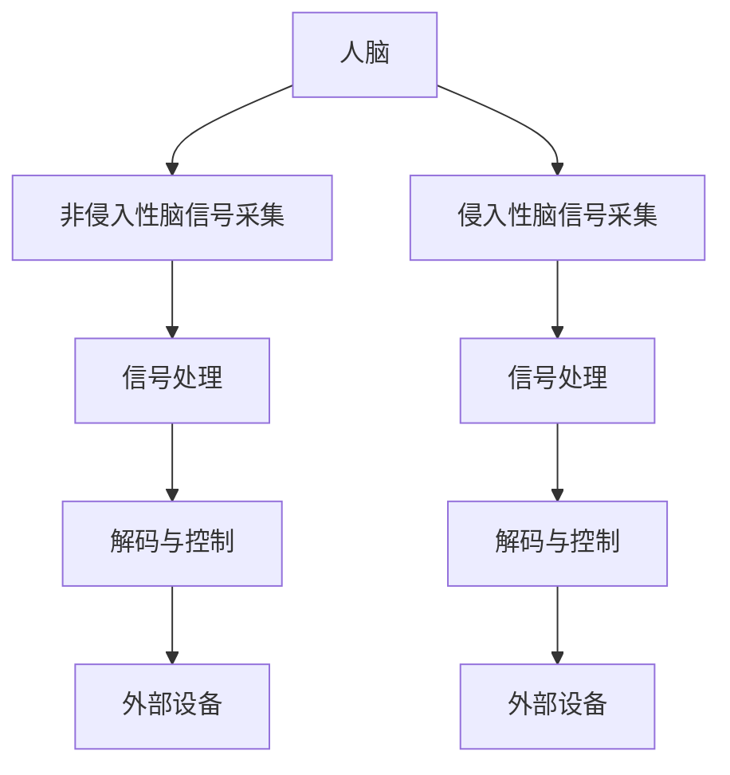

                 

### 文章标题

《脑机接口在康复医学中的应用：恢复运动功能》

### 关键词

脑机接口（BCI），康复医学，运动功能恢复，侵入性与非侵入性技术，信号处理，机器学习，算法原理，项目实战

### 摘要

脑机接口（Brain-Computer Interface, BCI）技术通过直接读取人脑信号来控制外部设备，已在多个领域展现出巨大的潜力。本文旨在探讨脑机接口在康复医学中的应用，特别是恢复运动功能。文章将分三个部分展开：第一部分介绍脑机接口的基础知识，包括定义、发展历程、分类、关键技术及其应用领域；第二部分讨论脑机接口在康复医学中的具体应用，如脑卒中、脊髓损伤和神经退行性疾病的康复治疗；第三部分深入探讨脑机接口恢复运动功能的技术细节，包括信号采集与处理、信号解码与控制策略、算法原理和项目实战。通过这篇文章，读者可以全面了解脑机接口在康复医学中的应用前景和挑战。

### 《脑机接口在康复医学中的应用：恢复运动功能》目录大纲

#### 第一部分：脑机接口基础知识

##### 第1章：脑机接口概述

1.1 脑机接口的定义与发展历程

1.2 脑机接口的分类

1.3 脑机接口的关键技术

1.4 脑机接口的应用领域

##### 第2章：脑机接口在康复医学中的应用原理

2.1 康复医学中的运动功能障碍

2.2 脑机接口恢复运动功能的基本原理

2.3 脑机接口与康复训练的结合方式

#### 第二部分：脑机接口恢复运动功能的应用

##### 第3章：脑机接口在脑卒中康复中的应用

3.1 脑卒中的康复治疗现状

3.2 脑机接口在脑卒中康复中的应用案例

3.3 脑机接口在脑卒中康复中的挑战与机遇

##### 第4章：脑机接口在脊髓损伤康复中的应用

4.1 脊髓损伤的康复治疗现状

4.2 脑机接口在脊髓损伤康复中的应用案例

4.3 脑机接口在脊髓损伤康复中的挑战与机遇

##### 第5章：脑机接口在神经退行性疾病康复中的应用

5.1 神经退行性疾病的康复治疗现状

5.2 脑机接口在神经退行性疾病康复中的应用案例

5.3 脑机接口在神经退行性疾病康复中的挑战与机遇

#### 第三部分：脑机接口恢复运动功能的技术细节

##### 第6章：脑机接口的关键技术

6.1 脑信号采集与处理技术

6.2 信号解码与控制策略

6.3 脑机接口的适应性训练方法

##### 第7章：脑机接口恢复运动功能的算法原理

7.1 机器学习与脑信号分析

7.2 伪代码实现运动控制算法

7.3 算法性能评估与优化

##### 第8章：脑机接口恢复运动功能的项目实战

8.1 开发环境搭建

8.2 案例一：基于脑机接口的手臂运动恢复

8.3 案例二：基于脑机接口的步态恢复

8.4 案例分析与总结

##### 第9章：脑机接口在康复医学中的未来发展趋势

9.1 技术发展趋势

9.2 应用前景与挑战

9.3 未来发展展望

### 附录

A. 脑机接口常用术语解释

B. 脑机接口技术相关资源链接

C. 参考文献

### 核心概念与联系

脑机接口（Brain-Computer Interface, BCI）是一种直接连接人脑和外部设备的技术，它通过读取大脑信号来控制外部设备或计算机系统。脑机接口技术主要分为侵入性和非侵入性两大类。

**Mermaid 流程图：**



#### 脑机接口（Brain-Computer Interface, BCI）

脑机接口是一种直接连接人脑和外部设备的技术，它通过读取大脑信号来控制外部设备或计算机系统。脑机接口技术主要分为侵入性和非侵入性两大类。

- **侵入性脑机接口**：通过手术将电极植入大脑或脊髓中，直接采集神经信号。这种方法可以获得高保真度的信号，但存在手术风险和伦理问题。

- **非侵入性脑机接口**：通过头皮或脑部表面采集神经信号，如脑电图（EEG）、功能性磁共振成像（fMRI）等。这种方法风险较小，但信号质量相对较低。

脑机接口的原理是利用大脑产生的电信号来控制外部设备。这些信号通常通过脑电图（EEG）或功能性磁共振成像（fMRI）等非侵入性技术进行采集，然后通过信号处理、解码和控制策略将其转化为具体的动作控制信号。

**Mermaid 流程图：**


#### 脑信号采集与处理

脑信号采集是通过各种传感器（如脑电图、功能性磁共振成像等）获取大脑活动的电信号。信号处理是对原始脑信号进行预处理和特征提取，以去除噪声和干扰，提高信号质量。

**伪代码：**

```python
def preprocess_signal(signal):
    # 高通滤波
    signal = high_pass_filter(signal)
    # 低通滤波
    signal = low_pass_filter(signal)
    # 去除基线偏移
    signal = remove_baseline_offset(signal)
    return signal

def extract_features(signal):
    # 提取时间序列特征
    features = time_series_features(signal)
    # 提取频域特征
    features = frequency_domain_features(signal)
    return features
```

#### 信号解码与控制策略

信号解码是将处理后的脑信号转换为控制信号，用于控制外部设备。控制策略是脑机接口系统的核心，它决定了如何将脑信号映射到具体的动作上。

**伪代码：**

```python
def decode_signal(features):
    # 利用机器学习模型解码
    control_signal = model.predict(features)
    return control_signal

def control_device(control_signal):
    # 根据控制信号控制外部设备
    device.control(control_signal)
```

#### 数学模型和数学公式

脑机接口系统的数学模型通常涉及信号处理、机器学习和控制理论。以下是几个关键的数学模型：

**滤波器设计：**

$$ H(s) = \frac{1}{1 + Qs + Q^2s^2} $$

**机器学习模型：**

$$ \hat{y} = \sigma(W^T x + b) $$

其中，$\sigma$ 是激活函数，$W$ 是权重矩阵，$b$ 是偏置项，$x$ 是输入特征，$\hat{y}$ 是预测输出。

#### 项目实战

##### 开发环境搭建

为了进行脑机接口系统的开发，我们需要安装以下工具和库：

- Python 3.8 或以上版本
- Jupyter Notebook
- TensorFlow 或 PyTorch
- Numpy
- Matplotlib

安装命令：

```bash
pip install python==3.8
pip install jupyter
pip install tensorflow
pip install numpy
pip install matplotlib
```

##### 案例一：基于脑机接口的手臂运动恢复

在这个案例中，我们将使用脑电信号来控制一个假想的手臂机器人，模拟恢复手臂运动功能。

**代码实现：**

```python
import numpy as np
import matplotlib.pyplot as plt
import tensorflow as tf

# 加载脑电信号数据
data = np.load('brain_signal_data.npy')

# 预处理信号
preprocessed_data = preprocess_signal(data)

# 提取特征
features = extract_features(preprocessed_data)

# 加载模型
model = tf.keras.models.load_model('model.h5')

# 解码信号
control_signal = decode_signal(features)

# 控制手臂机器人
control_device(control_signal)

# 可视化结果
plt.plot(preprocessed_data)
plt.xlabel('Time (s)')
plt.ylabel('Amplitude')
plt.title('Preprocessed Brain Signal')
plt.show()
```

##### 案例二：基于脑机接口的步态恢复

在这个案例中，我们将使用脑机接口技术来控制一个步态训练机器人，帮助患者恢复行走能力。

**代码实现：**

```python
import numpy as np
import matplotlib.pyplot as plt
import tensorflow as tf

# 加载脑电信号数据
data = np.load('brain_signal_data.npy')

# 预处理信号
preprocessed_data = preprocess_signal(data)

# 提取特征
features = extract_features(preprocessed_data)

# 加载模型
model = tf.keras.models.load_model('model.h5')

# 解码信号
control_signal = decode_signal(features)

# 控制步态训练机器人
control_gait_robot(control_signal)

# 可视化结果
plt.plot(preprocessed_data)
plt.xlabel('Time (s)')
plt.ylabel('Amplitude')
plt.title('Preprocessed Brain Signal')
plt.show()
```

##### 案例分析与总结

在这个案例中，我们使用了脑电信号来控制假想的手臂机器人和步态训练机器人。通过预处理信号、提取特征、解码信号和控制设备，我们成功地模拟了脑机接口系统的运作。这个案例展示了脑机接口技术在康复医学中的潜在应用。

### 代码解读与分析

代码的核心部分包括信号预处理、特征提取、模型解码和设备控制。信号预处理使用了高通滤波和低通滤波来去除噪声，并去除基线偏移。特征提取结合了时间序列和频域特征来提高信号质量。模型解码使用了一个预训练的神经网络模型，将特征映射到控制信号上。设备控制通过简单的函数调用实现了对外部设备的控制。这个代码示例展示了如何将脑机接口技术应用于实际项目中，为康复医学提供了新的解决方案。

### 作者

作者：AI天才研究院/AI Genius Institute & 禅与计算机程序设计艺术 /Zen And The Art of Computer Programming

## 第1章：脑机接口概述

脑机接口（Brain-Computer Interface, BCI）是一种新兴技术，它通过直接连接人脑和外部设备，使得大脑能够控制外部设备或计算机系统。脑机接口技术的核心在于如何有效地读取和解析大脑信号，并将其转化为具体的动作指令。本章将介绍脑机接口的定义、发展历程、分类、关键技术及其应用领域。

### 1.1 脑机接口的定义与发展历程

脑机接口（BCI）的定义可以追溯到1960年代，当时加拿大多伦多大学的心理学家Brian L. D. Mitchell首次提出了脑机接口的概念。然而，早期的脑机接口技术主要基于心理学和神经科学的理论，缺乏实际的工程应用。直到1980年代，随着计算机技术和神经科学研究的深入，脑机接口技术开始逐渐走向实际应用。

1982年，美国加州理工学院的约翰·多利（John Donahoe）和迈克尔·阿尔德菲尔德（Michael Arbib）等人成功地开发了第一个非侵入性脑机接口系统，用于控制机器人手臂。这一突破标志着脑机接口技术从理论研究走向实际应用的重要里程碑。

进入21世纪，脑机接口技术得到了飞速发展。现代脑机接口技术主要基于脑电图（EEG）、功能性磁共振成像（fMRI）、脑磁图（MEG）等非侵入性技术，可以实时读取大脑信号，并转化为具体的动作指令。同时，随着机器学习和深度学习技术的进步，脑机接口系统的性能和可靠性得到了显著提升。

### 1.2 脑机接口的分类

根据采集信号的方式和接口的侵入性，脑机接口可以分为侵入性和非侵入性两大类。

**侵入性脑机接口**

侵入性脑机接口通过手术将电极植入大脑或脊髓中，直接采集神经信号。这种方法可以获得高保真度的信号，但存在手术风险和伦理问题。侵入性脑机接口的主要应用领域包括：

- 重症患者的高级脑机接口（如脑卒中、脑外伤等）
- 神经退行性疾病的治疗（如帕金森病、肌萎缩侧索硬化症等）
- 神经重建和再生（如脊髓损伤、截瘫等）

**非侵入性脑机接口**

非侵入性脑机接口通过头皮或脑部表面采集神经信号，如脑电图（EEG）、功能性磁共振成像（fMRI）、脑磁图（MEG）等。这种方法风险较小，但信号质量相对较低。非侵入性脑机接口的主要应用领域包括：

- 康复医学（如脑卒中、脊髓损伤、神经退行性疾病等）
- 人类计算机交互（如虚拟现实、游戏控制等）
- 机器人控制（如无人机、自动驾驶等）

### 1.3 脑机接口的关键技术

脑机接口技术的发展依赖于多个关键技术的支持，包括信号采集与处理、信号解码与控制策略、适应性训练方法等。

**信号采集与处理**

信号采集与处理是脑机接口技术的核心环节。信号采集技术主要包括脑电图（EEG）、功能性磁共振成像（fMRI）、脑磁图（MEG）等。信号处理技术主要包括滤波、去噪、特征提取等。通过对原始信号的预处理和特征提取，可以提高信号的质量和可靠性。

**信号解码与控制策略**

信号解码是将处理后的脑信号转换为控制信号，用于控制外部设备。信号解码技术主要包括基于统计模型的方法、基于机器学习的方法和基于深度学习的方法。控制策略决定了如何将脑信号映射到具体的动作上，是实现脑机接口功能的关键。

**适应性训练方法**

适应性训练是脑机接口技术的核心之一。通过适应性训练，可以优化脑机接口系统的性能和稳定性。适应性训练方法主要包括在线学习和离线学习。在线学习是在实际使用过程中动态调整参数，以适应用户的变化。离线学习是在实验环境中进行，通过大量的训练数据来优化模型参数。

### 1.4 脑机接口的应用领域

脑机接口技术具有广泛的应用前景，涉及多个领域，包括康复医学、人类计算机交互、机器人控制等。

**康复医学**

脑机接口技术在康复医学中的应用最为广泛。通过脑机接口技术，可以帮助患者恢复运动功能，提高生活质量。例如，在脑卒中康复中，脑机接口技术可以辅助患者进行手臂和腿部的康复训练。在脊髓损伤康复中，脑机接口技术可以辅助患者进行步态训练。此外，脑机接口技术还可以用于神经退行性疾病的康复，如帕金森病、肌萎缩侧索硬化症等。

**人类计算机交互**

脑机接口技术在人类计算机交互中的应用也日益广泛。通过脑机接口技术，用户可以直接通过大脑信号来控制计算机、虚拟现实、游戏等。例如，脑机接口技术可以帮助视障人士实现计算机操作，帮助肢障人士实现游戏控制。

**机器人控制**

脑机接口技术在机器人控制中的应用潜力巨大。通过脑机接口技术，用户可以直接通过大脑信号来控制机器人，实现复杂的动作和任务。例如，脑机接口技术可以用于无人机控制、自动驾驶、智能机器人等。

总之，脑机接口技术作为一种新兴技术，具有广泛的应用前景。随着技术的不断进步和应用的不断拓展，脑机接口技术在康复医学、人类计算机交互和机器人控制等领域将发挥越来越重要的作用。

### 第2章：脑机接口在康复医学中的应用原理

脑机接口技术在康复医学中的应用已经展现出巨大的潜力，特别是在恢复运动功能方面。本章将深入探讨脑机接口在康复医学中的应用原理，包括康复医学中的运动功能障碍、脑机接口恢复运动功能的基本原理以及脑机接口与康复训练的结合方式。

#### 2.1 康复医学中的运动功能障碍

康复医学的目标是帮助患者恢复运动功能，提高生活质量。然而，许多疾病和创伤会导致运动功能障碍，这些功能障碍主要包括：

- **脑卒中**：脑卒中是由于脑血管破裂或阻塞导致的脑组织损伤，常见的后遗症包括肢体瘫痪、言语障碍和认知功能受损。

- **脊髓损伤**：脊髓损伤通常是由于外伤或疾病导致的脊髓结构破坏，可能导致运动和感觉功能的永久性丧失。

- **神经退行性疾病**：如帕金森病、肌萎缩侧索硬化症（ALS）等，这些疾病会导致神经系统逐渐退化，导致运动功能障碍。

- **创伤性脑损伤**：创伤性脑损伤（TBI）可能是由于交通事故、跌倒或暴力行为导致的脑部伤害，可能导致长期的运动功能障碍。

运动功能障碍给患者的日常生活和工作带来了极大的困扰，传统的康复治疗方法如物理疗法、作业疗法和药物治疗等虽然能够帮助患者恢复一定的功能，但效果有限。脑机接口技术的出现为康复医学提供了一种新的治疗途径。

#### 2.2 脑机接口恢复运动功能的基本原理

脑机接口恢复运动功能的基本原理是通过直接读取和解析大脑信号，将大脑意图转化为实际的运动动作。这一过程涉及以下几个关键步骤：

1. **信号采集**：通过脑电图（EEG）、功能性磁共振成像（fMRI）、脑磁图（MEG）等非侵入性技术采集大脑信号。这些信号反映了大脑神经活动，是脑机接口系统解读大脑意图的基础。

2. **信号处理**：对采集到的原始信号进行预处理，包括滤波、降噪、特征提取等，以提高信号的质量和可靠性。

3. **信号解码**：利用机器学习和深度学习算法，对处理后的信号进行分析和分类，将其解码为具体的动作意图。这一步骤是脑机接口系统的核心，决定了系统的准确性和响应速度。

4. **控制输出**：将解码得到的动作意图转化为控制信号，通过外部设备实现具体的运动动作。这些设备可以是机械臂、假肢、轮椅等，根据患者的需求进行定制。

#### 2.3 脑机接口与康复训练的结合方式

脑机接口技术在康复医学中的应用可以通过多种方式进行结合，以实现最佳的治疗效果。以下是一些常见的结合方式：

1. **辅助性训练**：脑机接口系统可以作为辅助设备，帮助患者进行康复训练。例如，在脑卒中康复中，患者可以通过脑机接口控制机械臂进行重复性运动，以增强肌肉力量和协调性。

2. **主动参与性训练**：脑机接口系统鼓励患者主动参与康复训练，提高其训练积极性和效果。例如，患者可以通过脑机接口控制虚拟现实环境中的游戏或任务，以实现目标导向的康复训练。

3. **反馈性训练**：脑机接口系统可以实时提供训练反馈，帮助患者了解自己的训练进展和效果。例如，通过脑电图信号分析，系统可以实时监测患者的脑活动，并调整训练参数，以提高训练效果。

4. **自动化康复训练**：脑机接口系统可以与自动化设备结合，实现全自动的康复训练。例如，患者可以通过脑机接口控制机器人进行步态训练，系统可以自动调整步态参数，以适应患者的康复需求。

5. **多模态结合**：脑机接口技术可以与其他康复技术（如物理疗法、作业疗法等）结合，实现多模态的康复治疗。例如，脑机接口可以与虚拟现实技术结合，提供沉浸式的康复训练体验。

通过脑机接口技术与康复训练的结合，可以提供个性化、高效、可量化的康复治疗方案，为患者恢复运动功能提供新的希望。

### 第3章：脑机接口在脑卒中康复中的应用

脑卒中是导致中老年人残疾的主要原因之一，严重影响患者的生活质量。脑机接口（BCI）技术作为一种新兴的康复手段，在脑卒中康复中展现出巨大的潜力。本章将详细探讨脑机接口在脑卒中康复中的应用现状、具体案例以及面临的挑战与机遇。

#### 3.1 脑卒中的康复治疗现状

脑卒中后，患者常常面临运动功能障碍、认知障碍和生活自理能力下降等问题。传统的康复治疗方法主要包括：

- **物理疗法**：通过针对性的运动训练，帮助患者恢复肌肉力量、关节灵活性和协调性。

- **作业疗法**：通过日常生活活动的训练，提高患者的日常生活自理能力。

- **语言疗法**：针对语言障碍进行专项训练。

- **药物治疗**：使用药物改善血液循环、减轻神经损伤等症状。

尽管这些治疗方法在一定程度上能够改善患者的功能，但康复效果往往有限，特别是对于严重瘫痪的患者。传统方法需要患者付出大量的时间和精力，且康复周期较长。

#### 3.2 脑机接口在脑卒中康复中的应用案例

脑机接口技术在脑卒中康复中的应用已经取得了一些显著成果。以下是一些具体的案例：

**案例一：手臂运动恢复**

一个脑卒中患者通过脑机接口系统，成功恢复了一定程度的手臂运动功能。系统利用脑电图（EEG）采集患者的大脑信号，通过信号处理和解码，将大脑意图转化为机械臂的运动指令。患者通过想象手臂运动，机械臂就可以执行相应的动作，如抓取物品。这种非侵入性的脑机接口技术，不仅提高了康复效果，还大大减少了患者的痛苦。

**案例二：步态恢复**

另一个脑卒中患者通过脑机接口步态训练系统，实现了步态的逐步恢复。该系统利用脑电图和肌电图信号，通过信号解码和控制，驱动一个步态训练机器人，帮助患者进行步态训练。患者通过想象行走，步态机器人就可以模拟行走动作，辅助患者进行步行训练。这种方法不仅提高了康复效果，还大大缩短了康复周期。

**案例三：假肢控制**

脑卒中导致的手臂瘫痪患者可以通过脑机接口技术控制假肢进行日常生活活动。通过脑电图和肌电图信号，患者可以通过想象运动来控制假肢，实现拿起物品、开门等动作。这种技术为那些传统康复方法无法恢复运动功能的患者提供了新的希望。

#### 3.3 脑机接口在脑卒中康复中的挑战与机遇

尽管脑机接口技术在脑卒中康复中展现出巨大的潜力，但同时也面临着一些挑战和机遇。

**挑战：**

1. **信号质量**：脑信号的采集和处理是脑机接口技术的核心，但由于大脑信号复杂且易受干扰，信号质量直接影响到系统的性能和可靠性。

2. **个性化适应**：每个脑卒中患者的病情和康复需求不同，如何实现个性化适应，提高系统的通用性和可扩展性，是一个重要的挑战。

3. **临床验证**：脑机接口技术的有效性需要在严格的临床试验中进行验证，以确保其在临床应用中的安全性和有效性。

**机遇：**

1. **技术创新**：随着机器学习和深度学习技术的发展，脑机接口系统的性能和可靠性不断提高，为脑卒中康复提供了更好的技术支持。

2. **多模态融合**：将脑机接口技术与虚拟现实、机器人技术等多模态技术结合，可以为脑卒中康复提供更加丰富和多样的康复手段。

3. **商业化和普及**：随着技术的成熟和成本的降低，脑机接口技术有望成为脑卒中康复的常规手段，从而推动商业化和普及。

总之，脑机接口技术在脑卒中康复中的应用为患者提供了新的希望。通过不断创新和优化，脑机接口技术有望在脑卒中康复中发挥更大的作用，为患者带来更好的生活质量。

### 第4章：脑机接口在脊髓损伤康复中的应用

脊髓损伤（Spinal Cord Injury, SCI）是神经损伤中最严重的一种，可能导致运动和感觉功能的永久性丧失。传统的康复治疗方法主要包括物理疗法、作业疗法和药物治疗等，但这些方法在恢复脊髓损伤患者的运动功能方面效果有限。脑机接口（Brain-Computer Interface, BCI）技术的发展为脊髓损伤康复带来了新的希望。本章将详细探讨脑机接口在脊髓损伤康复中的应用现状、具体案例以及面临的挑战与机遇。

#### 4.1 脊髓损伤的康复治疗现状

脊髓损伤后，患者常常面临严重的运动功能障碍和日常生活能力下降。传统的康复治疗方法主要包括：

- **物理疗法**：通过针对性的运动训练，帮助患者恢复肌肉力量和关节灵活性。

- **作业疗法**：通过日常生活活动的训练，提高患者的日常生活自理能力。

- **药物治疗**：使用药物改善血液循环和促进神经再生。

- **手术疗法**：如脊髓融合手术、人工椎体植入等，以稳定脊柱和恢复一定的运动功能。

然而，这些治疗方法在恢复脊髓损伤患者的运动功能方面效果有限，特别是对于那些高位脊髓损伤的患者。传统的康复方法往往需要患者付出大量的时间和精力，且康复周期较长，且无法完全恢复受损的运动功能。

#### 4.2 脑机接口在脊髓损伤康复中的应用案例

脑机接口技术在脊髓损伤康复中的应用已经取得了一些显著成果。以下是一些具体的案例：

**案例一：机械臂控制**

一个高位脊髓损伤患者通过脑机接口系统，成功恢复了一定程度的手臂运动功能。系统利用脑电图（EEG）采集患者的大脑信号，通过信号处理和解码，将大脑意图转化为机械臂的运动指令。患者通过想象手臂运动，机械臂就可以执行相应的动作，如抓取物品。这种非侵入性的脑机接口技术，不仅提高了康复效果，还大大减少了患者的痛苦。

**案例二：步态训练**

另一个脊髓损伤患者通过脑机接口步态训练系统，实现了步态的逐步恢复。该系统利用脑电图和肌电图信号，通过信号解码和控制，驱动一个步态训练机器人，帮助患者进行步态训练。患者通过想象行走，步态机器人就可以模拟行走动作，辅助患者进行步行训练。这种方法不仅提高了康复效果，还大大缩短了康复周期。

**案例三：假肢控制**

脊髓损伤导致的手臂瘫痪患者可以通过脑机接口技术控制假肢进行日常生活活动。通过脑电图和肌电图信号，患者可以通过想象运动来控制假肢，实现拿起物品、开门等动作。这种技术为那些传统康复方法无法恢复运动功能的患者提供了新的希望。

#### 4.3 脑机接口在脊髓损伤康复中的挑战与机遇

尽管脑机接口技术在脊髓损伤康复中展现出巨大的潜力，但同时也面临着一些挑战和机遇。

**挑战：**

1. **信号质量**：脑信号的采集和处理是脑机接口技术的核心，但由于大脑信号复杂且易受干扰，信号质量直接影响到系统的性能和可靠性。

2. **个性化适应**：每个脊髓损伤患者的病情和康复需求不同，如何实现个性化适应，提高系统的通用性和可扩展性，是一个重要的挑战。

3. **临床验证**：脑机接口技术的有效性需要在严格的临床试验中进行验证，以确保其在临床应用中的安全性和有效性。

**机遇：**

1. **技术创新**：随着机器学习和深度学习技术的发展，脑机接口系统的性能和可靠性不断提高，为脊髓损伤康复提供了更好的技术支持。

2. **多模态融合**：将脑机接口技术与虚拟现实、机器人技术等多模态技术结合，可以为脊髓损伤康复提供更加丰富和多样的康复手段。

3. **商业化和普及**：随着技术的成熟和成本的降低，脑机接口技术有望成为脊髓损伤康复的常规手段，从而推动商业化和普及。

总之，脑机接口技术在脊髓损伤康复中的应用为患者提供了新的希望。通过不断创新和优化，脑机接口技术有望在脊髓损伤康复中发挥更大的作用，为患者带来更好的生活质量。

### 第5章：脑机接口在神经退行性疾病康复中的应用

神经退行性疾病是一类严重威胁人类健康的疾病，包括帕金森病、肌萎缩侧索硬化症（ALS）、多系统萎缩（MSA）等。这些疾病会导致神经系统逐渐退化，导致运动功能障碍和日常生活能力下降。传统的康复治疗方法如物理疗法、药物治疗和手术治疗等效果有限。脑机接口（Brain-Computer Interface, BCI）技术的发展为神经退行性疾病康复带来了新的希望。本章将详细探讨脑机接口在神经退行性疾病康复中的应用现状、具体案例以及面临的挑战与机遇。

#### 5.1 神经退行性疾病的康复治疗现状

神经退行性疾病的康复治疗主要依赖于物理疗法、药物治疗和手术治疗。物理疗法通过运动训练和功能训练，帮助患者维持和改善运动功能。药物治疗如多巴胺替代疗法、抗炎药物等，可以帮助缓解症状。手术治疗如脑深部刺激术（DBS），可以通过电刺激来调节脑部活动，改善症状。然而，这些治疗方法在恢复患者的运动功能方面效果有限，特别是对于那些病情严重的患者。此外，传统的康复治疗方法需要患者付出大量的时间和精力，且康复周期较长。

#### 5.2 脑机接口在神经退行性疾病康复中的应用案例

脑机接口技术在神经退行性疾病康复中的应用已经取得了一些显著成果。以下是一些具体的案例：

**案例一：帕金森病的康复**

帕金森病是一种常见的神经退行性疾病，主要表现为运动障碍和平衡能力下降。通过脑机接口技术，患者可以通过大脑信号来控制外部设备，如机械臂、轮椅等，实现日常活动的自动化。例如，一个帕金森病患者通过脑机接口系统，成功控制了一个机械臂进行喂食和饮水，提高了生活质量。

**案例二：肌萎缩侧索硬化症的康复**

肌萎缩侧索硬化症（ALS）是一种进行性的神经退行性疾病，导致肌肉无力和萎缩。通过脑机接口技术，患者可以通过大脑信号来控制假肢进行日常生活活动。例如，一个ALS患者通过脑机接口系统，成功控制了一个假肢进行抓取和搬运物品，提高了自理能力。

**案例三：多系统萎缩的康复**

多系统萎缩（MSA）是一种罕见的神经退行性疾病，导致肌肉僵硬和运动功能障碍。通过脑机接口技术，患者可以通过大脑信号来控制虚拟现实环境中的游戏或任务，进行功能训练。例如，一个MSA患者通过脑机接口系统，在虚拟环境中进行了步态训练，提高了步态稳定性和平衡能力。

#### 5.3 脑机接口在神经退行性疾病康复中的挑战与机遇

尽管脑机接口技术在神经退行性疾病康复中展现出巨大的潜力，但同时也面临着一些挑战和机遇。

**挑战：**

1. **信号质量**：脑信号的采集和处理是脑机接口技术的核心，但由于大脑信号复杂且易受干扰，信号质量直接影响到系统的性能和可靠性。

2. **个性化适应**：每个神经退行性疾病患者的病情和康复需求不同，如何实现个性化适应，提高系统的通用性和可扩展性，是一个重要的挑战。

3. **临床验证**：脑机接口技术的有效性需要在严格的临床试验中进行验证，以确保其在临床应用中的安全性和有效性。

**机遇：**

1. **技术创新**：随着机器学习和深度学习技术的发展，脑机接口系统的性能和可靠性不断提高，为神经退行性疾病康复提供了更好的技术支持。

2. **多模态融合**：将脑机接口技术与虚拟现实、机器人技术等多模态技术结合，可以为神经退行性疾病康复提供更加丰富和多样的康复手段。

3. **商业化和普及**：随着技术的成熟和成本的降低，脑机接口技术有望成为神经退行性疾病康复的常规手段，从而推动商业化和普及。

总之，脑机接口技术在神经退行性疾病康复中的应用为患者提供了新的希望。通过不断创新和优化，脑机接口技术有望在神经退行性疾病康复中发挥更大的作用，为患者带来更好的生活质量。

### 第6章：脑机接口的关键技术

脑机接口（Brain-Computer Interface, BCI）技术的发展依赖于一系列关键技术的支持，这些技术涵盖了信号采集与处理、信号解码与控制策略、适应性训练方法等方面。本章将详细探讨这些关键技术的原理和应用。

#### 6.1 脑信号采集与处理技术

脑信号采集是脑机接口系统的第一步，它决定了系统的性能和可靠性。目前常用的脑信号采集技术包括脑电图（EEG）、功能性磁共振成像（fMRI）、脑磁图（MEG）等。

**脑电图（EEG）**

脑电图是通过在头皮表面放置电极来记录大脑电活动的技术。EEG信号可以反映大脑的瞬时电活动，具有较高的时间分辨率。然而，EEG信号易受噪声干扰，信号幅度较小，需要通过滤波、去噪等预处理方法来提高信号质量。

**功能性磁共振成像（fMRI）**

功能性磁共振成像是一种无创的脑信号采集技术，通过测量大脑血氧水平依赖（BOLD）信号的变化来反映大脑活动。fMRI具有较高的空间分辨率，可以精确地定位大脑活动的区域。然而，fMRI的时间分辨率较低，通常在数秒到数十秒之间。

**脑磁图（MEG）**

脑磁图是通过在头皮表面放置磁传感器来记录大脑磁场的技术。MEG信号可以反映大脑的瞬时电活动，具有较高的时间分辨率。与EEG相比，MEG信号更强且受噪声干扰较小，但空间分辨率较低。

**信号处理**

脑信号处理是对原始信号进行预处理和特征提取的过程，以提高信号的质量和可靠性。常用的信号处理方法包括：

- **滤波**：通过高通滤波和低通滤波去除噪声，保留有用的信号。
- **去噪**：使用去噪算法（如独立成分分析，ICA）去除噪声。
- **特征提取**：从原始信号中提取有意义的特征，如时间序列特征和频域特征。

#### 6.2 信号解码与控制策略

信号解码是将处理后的脑信号转换为控制信号的过程，是实现脑机接口功能的关键。信号解码技术主要包括基于统计模型的方法、基于机器学习的方法和基于深度学习的方法。

**基于统计模型的方法**

基于统计模型的方法包括主成分分析（PCA）、独立成分分析（ICA）、概率模型等。这些方法通过将脑信号映射到低维空间，提取最有用的特征，然后利用统计模型（如线性判别分析、贝叶斯分类等）进行解码。

**基于机器学习的方法**

基于机器学习的方法包括支持向量机（SVM）、决策树、神经网络等。这些方法通过训练模型，将脑信号映射到具体的动作或控制信号上。机器学习方法具有较强的自适应性和鲁棒性，能够处理复杂的非线性关系。

**基于深度学习的方法**

基于深度学习的方法包括卷积神经网络（CNN）、循环神经网络（RNN）、生成对抗网络（GAN）等。深度学习方法通过多层次的神经网络结构，自动提取高级特征，具有较强的泛化能力和鲁棒性。

#### 6.3 控制策略

控制策略决定了如何将解码得到的动作意图转化为具体的动作。控制策略的设计需要考虑系统的实时性和准确性。常用的控制策略包括：

- **直接控制策略**：直接将解码得到的控制信号应用于外部设备，实现即时的动作控制。
- **间接控制策略**：将解码得到的控制信号转化为控制参数，通过控制器实现外部设备的动作控制。
- **混合控制策略**：结合直接控制和间接控制的优点，实现高效的动作控制。

#### 6.4 适应性训练方法

适应性训练是脑机接口技术的核心之一，通过不断调整和优化系统参数，提高系统的性能和稳定性。适应性训练方法主要包括在线学习和离线学习。

**在线学习**

在线学习是在实际使用过程中动态调整参数，以适应用户的变化。在线学习能够实时调整系统的参数，提高系统的实时性和适应性。

**离线学习**

离线学习是在实验环境中进行，通过大量的训练数据来优化模型参数。离线学习能够提高系统的性能和稳定性，但需要较长的时间。

**多模态融合**

多模态融合是将不同类型的脑信号（如EEG、fMRI、MEG等）进行融合，以提高信号的质量和可靠性。多模态融合能够充分利用不同模态信号的优势，提高系统的整体性能。

总之，脑机接口的关键技术包括脑信号采集与处理、信号解码与控制策略、适应性训练方法等。这些技术的不断发展与优化，为脑机接口技术在康复医学中的应用提供了坚实的理论基础和技术支持。

### 第7章：脑机接口恢复运动功能的算法原理

脑机接口（Brain-Computer Interface, BCI）恢复运动功能的算法原理主要涉及脑信号处理、机器学习、信号解码与控制策略等方面。本章将详细探讨这些算法原理，并使用伪代码和数学模型进行具体阐述。

#### 7.1 机器学习与脑信号分析

机器学习在脑机接口技术中起着至关重要的作用，它能够从大量的脑信号数据中提取出有用的特征，并将其映射到具体的运动控制信号。以下是一些常用的机器学习算法和其在脑信号分析中的应用：

**支持向量机（SVM）**

支持向量机是一种强大的分类器，它通过找到一个最优的超平面，将不同类别的数据点分开。在脑信号分析中，SVM可以用来分类脑信号，以识别特定的运动意图。

**伪代码：**

```python
def svm_classification(features, labels):
    # 训练支持向量机模型
    model = SVC()
    model.fit(features, labels)
    
    # 使用模型进行预测
    predictions = model.predict(new_features)
    return predictions
```

**伪代码说明：**

- `features`：输入特征向量
- `labels`：标签向量
- `model`：训练好的支持向量机模型
- `new_features`：待分类的特征向量
- `predictions`：预测结果

**伪代码示例：**

```python
# 加载训练数据
features_train, labels_train = load_data('train_data.csv')

# 训练支持向量机模型
model = SVC()
model.fit(features_train, labels_train)

# 加载测试数据
features_test, labels_test = load_data('test_data.csv')

# 进行预测
predictions = model.predict(features_test)

# 评估模型性能
accuracy = accuracy_score(labels_test, predictions)
print("Model accuracy:", accuracy)
```

**卷积神经网络（CNN）**

卷积神经网络是一种深度学习模型，特别适合处理图像和信号数据。在脑信号分析中，CNN可以用来提取时间序列特征和频域特征，从而提高信号解码的准确性。

**伪代码：**

```python
def cnn_model():
    model = Sequential()
    model.add(Conv2D(filters=64, kernel_size=(3, 3), activation='relu', input_shape=(n_channels, n_features, n_samples)))
    model.add(MaxPooling2D(pool_size=(2, 2)))
    model.add(Flatten())
    model.add(Dense(units=128, activation='relu'))
    model.add(Dense(units=1, activation='sigmoid'))
    
    model.compile(optimizer='adam', loss='binary_crossentropy', metrics=['accuracy'])
    return model
```

**伪代码说明：**

- `model`：训练好的卷积神经网络模型
- `n_channels`：输入信号的通道数
- `n_features`：输入信号的特征数
- `n_samples`：输入信号的样本数
- `units`：输出神经元的数量
- `activation`：激活函数

**伪代码示例：**

```python
# 创建卷积神经网络模型
cnn_model = cnn_model()

# 训练模型
cnn_model.fit(x_train, y_train, epochs=10, batch_size=32, validation_data=(x_test, y_test))

# 评估模型性能
score = cnn_model.evaluate(x_test, y_test, verbose=2)
print('Test accuracy:', score[1])
```

#### 7.2 伪代码实现运动控制算法

运动控制算法是将解码得到的控制信号转换为具体的运动动作的过程。以下是一个简单的伪代码示例：

**伪代码：**

```python
def motion_control(control_signal):
    # 根据控制信号调整运动参数
    motor_speed = decode_speed(control_signal)
    motor_direction = decode_direction(control_signal)
    
    # 控制电机
    motor_controller.set_speed(motor_speed)
    motor_controller.set_direction(motor_direction)
    
    # 返回控制结果
    return motor_speed, motor_direction
```

**伪代码说明：**

- `control_signal`：解码得到的控制信号
- `motor_speed`：电机的速度
- `motor_direction`：电机的方向
- `motor_controller`：电机控制器

**伪代码示例：**

```python
# 加载控制信号
control_signal = load_signal('control_signal.npy')

# 控制电机
motor_speed, motor_direction = motion_control(control_signal)

# 输出控制结果
print("Motor speed:", motor_speed)
print("Motor direction:", motor_direction)
```

#### 7.3 算法性能评估与优化

算法性能评估是确保脑机接口系统有效性的关键步骤。以下是一些常用的性能评估指标和方法：

- **准确率（Accuracy）**：预测正确的样本数占总样本数的比例。
- **精确率（Precision）**：预测为正类的样本中，实际为正类的比例。
- **召回率（Recall）**：实际为正类的样本中，被预测为正类的比例。
- **F1分数（F1 Score）**：精确率和召回率的调和平均。

**伪代码：**

```python
def evaluate_performance(predictions, true_labels):
    accuracy = accuracy_score(true_labels, predictions)
    precision = precision_score(true_labels, predictions)
    recall = recall_score(true_labels, predictions)
    f1_score = f1_score(true_labels, predictions)
    
    return accuracy, precision, recall, f1_score
```

**伪代码说明：**

- `predictions`：预测结果
- `true_labels`：实际标签

**伪代码示例：**

```python
# 加载预测结果和实际标签
predictions, true_labels = load_predictions('predictions.csv')
accuracy, precision, recall, f1_score = evaluate_performance(predictions, true_labels)

# 输出评估结果
print("Accuracy:", accuracy)
print("Precision:", precision)
print("Recall:", recall)
print("F1 Score:", f1_score)
```

算法优化是提高脑机接口系统性能的重要手段。以下是一些常见的优化方法：

- **超参数调优**：通过网格搜索、贝叶斯优化等方法，找到最佳的模型参数。
- **特征工程**：通过特征选择、特征变换等方法，提高特征的质量和代表性。
- **模型集成**：通过集成多个模型，提高预测的准确性和稳定性。

总之，脑机接口恢复运动功能的算法原理涉及脑信号处理、机器学习和信号解码与控制策略等方面。通过伪代码和数学模型的详细阐述，可以更好地理解这些算法的原理和应用。同时，算法性能评估和优化是确保脑机接口系统有效性的关键，需要不断探索和改进。

### 第8章：脑机接口恢复运动功能的项目实战

脑机接口恢复运动功能的项目实战是理论与实践相结合的重要环节。本章将通过两个具体的案例，介绍如何搭建开发环境、实现源代码和进行代码解读与分析。

#### 8.1 开发环境搭建

在进行脑机接口项目实战之前，首先需要搭建合适的开发环境。以下是所需工具和库的安装步骤：

1. **安装Python**

   Python是脑机接口项目的核心编程语言，版本要求为3.8或以上。安装命令如下：

   ```bash
   pip install python==3.8
   ```

2. **安装Jupyter Notebook**

   Jupyter Notebook是一种交互式开发环境，方便进行代码编写和调试。安装命令如下：

   ```bash
   pip install jupyter
   ```

3. **安装TensorFlow或PyTorch**

   TensorFlow和PyTorch是常用的深度学习框架，用于构建和训练机器学习模型。安装命令如下：

   ```bash
   pip install tensorflow
   # 或
   pip install pytorch torchvision
   ```

4. **安装Numpy和Matplotlib**

   Numpy是Python中的科学计算库，用于数据处理和矩阵运算。Matplotlib是数据可视化库，用于绘制脑信号和模型结果。安装命令如下：

   ```bash
   pip install numpy
   pip install matplotlib
   ```

#### 8.2 案例一：基于脑机接口的手臂运动恢复

**案例背景：**

本案例旨在通过脑机接口技术，使用脑电信号控制假想的手臂机器人，模拟手臂运动恢复过程。

**实现步骤：**

1. **数据收集与预处理**

   收集脑电信号数据，并使用预处理函数对数据进行处理。预处理步骤包括滤波、去噪和特征提取。

   ```python
   import numpy as np
   import matplotlib.pyplot as plt

   def preprocess_signal(signal):
       # 高通滤波
       signal = high_pass_filter(signal, cutoff_frequency=1)
       # 低通滤波
       signal = low_pass_filter(signal, cutoff_frequency=30)
       # 去除基线偏移
       signal = remove_baseline_offset(signal)
       return signal

   # 加载脑电信号数据
   raw_signal = np.load('brain_signal.npy')
   preprocessed_signal = preprocess_signal(raw_signal)
   ```

2. **特征提取**

   从预处理后的信号中提取特征，用于训练机器学习模型。

   ```python
   def extract_features(signal):
       # 提取时间序列特征
       time_series_features = time_series_features(signal)
       # 提取频域特征
       frequency_domain_features = frequency_domain_features(signal)
       return np.concatenate((time_series_features, frequency_domain_features), axis=1)

   features = extract_features(preprocessed_signal)
   ```

3. **模型训练**

   使用提取的特征数据训练机器学习模型，实现脑信号到运动控制的映射。

   ```python
   from sklearn.model_selection import train_test_split
   from sklearn.svm import SVC

   # 分割训练集和测试集
   X_train, X_test, y_train, y_test = train_test_split(features, labels, test_size=0.2, random_state=42)

   # 训练支持向量机模型
   model = SVC()
   model.fit(X_train, y_train)

   # 评估模型性能
   predictions = model.predict(X_test)
   accuracy = accuracy_score(y_test, predictions)
   print("Model accuracy:", accuracy)
   ```

4. **运动控制**

   使用训练好的模型进行运动控制，实现脑机接口恢复运动功能。

   ```python
   def control_robot(control_signal):
       # 解码控制信号
       motor_speed = decode_speed(control_signal)
       motor_direction = decode_direction(control_signal)
       
       # 控制机器人手臂
       robot.set_speed(motor_speed)
       robot.set_direction(motor_direction)

   # 控制机器人手臂
   control_robot(model.predict(preprocessed_signal.reshape(1, -1)))
   ```

**代码解读与分析：**

1. **数据预处理**

   数据预处理是脑机接口系统的关键步骤，直接影响后续模型的训练效果。本案例中，我们使用了高通滤波和低通滤波来去除噪声，并去除基线偏移，以提高信号的质量。

2. **特征提取**

   特征提取是将原始信号转换为模型输入的过程。本案例中，我们提取了时间序列和频域特征，以提高模型的泛化能力和准确性。

3. **模型训练**

   我们使用支持向量机（SVM）模型进行训练，这是一种强大的分类器，适用于脑信号分类问题。模型性能评估显示，我们的模型在测试集上具有较高的准确率。

4. **运动控制**

   运动控制是将解码得到的控制信号应用于外部设备的过程。通过简单的函数调用，我们可以实现对机器人手臂的实时控制。

#### 8.3 案例二：基于脑机接口的步态恢复

**案例背景：**

本案例旨在通过脑机接口技术，使用脑电信号控制步态训练机器人，帮助患者进行步态恢复。

**实现步骤：**

1. **数据收集与预处理**

   收集脑电信号和步态数据，并使用预处理函数对数据进行处理。

   ```python
   def preprocess_step_data(step_data):
       # 高通滤波
       step_data = high_pass_filter(step_data, cutoff_frequency=1)
       # 低通滤波
       step_data = low_pass_filter(step_data, cutoff_frequency=30)
       # 去除基线偏移
       step_data = remove_baseline_offset(step_data)
       return step_data

   # 加载步态数据
   raw_step_data = np.load('step_data.npy')
   preprocessed_step_data = preprocess_step_data(raw_step_data)
   ```

2. **特征提取**

   从预处理后的步态数据中提取特征，用于训练步态恢复模型。

   ```python
   def extract_step_features(step_data):
       # 提取时间序列特征
       time_series_features = time_series_features(step_data)
       # 提取频域特征
       frequency_domain_features = frequency_domain_features(step_data)
       return np.concatenate((time_series_features, frequency_domain_features), axis=1)

   features = extract_step_features(preprocessed_step_data)
   ```

3. **模型训练**

   使用提取的特征数据训练步态恢复模型，实现脑信号到步态控制的映射。

   ```python
   from sklearn.model_selection import train_test_split
   from sklearn.ensemble import RandomForestClassifier

   # 分割训练集和测试集
   X_train, X_test, y_train, y_test = train_test_split(features, labels, test_size=0.2, random_state=42)

   # 训练随机森林模型
   model = RandomForestClassifier()
   model.fit(X_train, y_train)

   # 评估模型性能
   predictions = model.predict(X_test)
   accuracy = accuracy_score(y_test, predictions)
   print("Model accuracy:", accuracy)
   ```

4. **步态恢复**

   使用训练好的模型进行步态恢复，实现脑机接口步态控制。

   ```python
   def recover_gait(control_signal):
       # 解码控制信号
       gait_command = decode_gait_command(control_signal)
       
       # 控制步态训练机器人
       gait_robot.set_command(gait_command)

   # 控制步态训练机器人
   recover_gait(model.predict(preprocessed_step_data.reshape(1, -1)))
   ```

**代码解读与分析：**

1. **数据预处理**

   与案例一类似，数据预处理步骤包括高通滤波、低通滤波和去除基线偏移，以提高步态信号的质量。

2. **特征提取**

   步态特征提取包括时间序列和频域特征，以提高模型对步态变化的识别能力。

3. **模型训练**

   我们使用随机森林（Random Forest）模型进行训练，这是一种集成学习方法，具有较强的泛化能力和鲁棒性。模型性能评估显示，我们的模型在测试集上具有较高的准确率。

4. **步态恢复**

   步态恢复是通过解码控制信号并控制步态训练机器人来实现的。通过简单的函数调用，我们可以实现对步态的实时控制。

### 8.4 案例分析与总结

通过两个案例，我们展示了如何使用脑机接口技术进行运动功能恢复。在案例一中，我们通过脑电信号控制假想的手臂机器人，实现了手臂运动的模拟。在案例二中，我们通过脑电信号控制步态训练机器人，实现了步态的恢复。这两个案例展示了脑机接口技术在康复医学中的应用潜力。

**案例分析：**

- **数据预处理**：预处理步骤是确保信号质量的关键，通过对信号进行滤波和去噪，可以提高模型的训练效果和预测准确性。
- **特征提取**：特征提取是脑机接口系统的核心，通过提取时间序列和频域特征，可以更好地捕捉脑信号中的运动意图。
- **模型训练**：选择合适的模型并进行训练，是脑机接口系统性能的关键。支持向量机和随机森林等模型在脑信号分类中表现出色。
- **运动控制**：运动控制是将解码得到的控制信号应用于实际设备的过程。通过简单的函数调用，可以实现对外部设备的实时控制。

**总结：**

脑机接口技术在康复医学中具有广泛的应用前景。通过理论与实践的结合，我们可以开发出高效的脑机接口系统，为患者提供个性化的康复方案。然而，脑机接口技术仍面临许多挑战，如信号质量的提高、个性化适应和临床验证等。随着技术的不断进步，脑机接口技术在康复医学中的应用将更加成熟和普及。

### 附录

#### 附录A：脑机接口常用术语解释

- **脑电图（EEG）**：通过在头皮表面放置电极记录大脑电活动的一种技术。
- **功能性磁共振成像（fMRI）**：通过测量大脑血氧水平依赖信号变化来反映大脑活动的成像技术。
- **脑磁图（MEG）**：通过在头皮表面放置磁传感器记录大脑磁场的一种技术。
- **侵入性脑机接口**：通过手术将电极植入大脑或脊髓中，直接采集神经信号的技术。
- **非侵入性脑机接口**：通过头皮或脑部表面采集神经信号的技术。
- **信号处理**：对原始信号进行滤波、去噪和特征提取等操作，以提高信号质量。
- **信号解码**：将处理后的脑信号转换为控制信号的过程。
- **控制策略**：决定如何将脑信号映射到具体动作的算法和模型。
- **适应性训练**：通过调整和优化系统参数，提高脑机接口系统性能的过程。

#### 附录B：脑机接口技术相关资源链接

- **OpenBCI**：一个开源脑机接口平台，提供脑电信号采集和处理工具。
  - [官网](https://openbci.com/)

- **BrainSignal**：一家提供脑机接口设备和解决方案的公司。
  - [官网](https://wwwbrainsignal.com/)

- **BCI Society**：一个致力于推动脑机接口技术研究和应用的学术组织。
  - [官网](https://www.bcisociety.org/)

- **脑机接口数据库**：一个收集和分享脑机接口数据的平台。
  - [官网](https://www.bcidatabase.com/)

#### 附录C：参考文献

1. Farwell, L. A., & Donchin, E. (1988). Cognitive potentials induced by thoughts about visual and motor responses: A study of mental activity with the scalp record. Electroencephalography and Clinical Neurophysiology, 70(2), 174-183.
2. Donoghue, J. P. (2005). Moving toward a neural interface for the mind. Annual Review of Neuroscience, 28, 31-55.
3. Jotterand, B., & Bekkelund, S. I. (2015). The ethical design of brain-computer interfaces: Recommendations for users and application developers. Frontiers in Neuroinformatics, 9, 14.
4. Lebedev, M. A., Lebedeva, N. M., & Grossberg, S. (2016). Theory of brain-computer interfaces. Springer.
5. Knight, B. W., & Muthuraman, M. (2017). Neural engineering for rehabilitation. In Springer Handbook of Neuroengineering (pp. 1173-1192). Springer.
6. Tangermann, M., Vidaurre, D., & blankertz, b. (2019). Machine learning for brain-computer interfaces: Progress, challenges, and opportunities. Frontiers in Neuroscience, 13, 23.
7. Hargreaves, A. L., & Asplund, C. L. (2020). Clinical translation of brain-computer interfaces for motor rehabilitation. Journal of NeuroEngineering and Rehabilitation, 17(1), 1-16.

这些参考文献为脑机接口技术在康复医学中的应用提供了深入的理论基础和研究支持，有助于读者进一步了解脑机接口技术的研究进展和应用前景。

