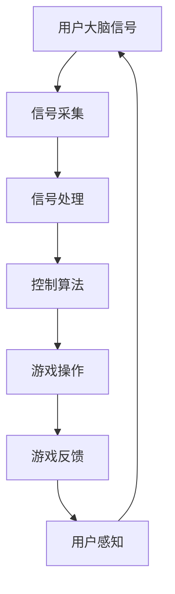

                 

### 文章标题：脑机接口在游戏产业中的应用：思维控制游戏

#### 关键词：脑机接口，游戏产业，思维控制，信号处理算法，控制算法，项目实战

> 摘要：本文将深入探讨脑机接口（BCI）技术在游戏产业中的应用，特别是通过思维控制来实现游戏操作的潜力。文章首先概述了脑机接口的基本概念、技术原理及其在不同领域的应用，随后详细分析了脑机接口的硬件与软件，包括传感器类型、设备接口、数据处理算法等。在此基础上，文章重点探讨了脑机接口在游戏中的具体技术实现，包括实时控制、情感互动等应用，并分析了脑机接口游戏的优势与挑战。接着，文章通过具体的案例分析展示了国内外脑机接口游戏的现状，最后提出了脑机接口游戏的设计与开发原则、开发流程及未来发展趋势。本文旨在为读者提供一份全面且深入的技术指南，引导他们了解并探索这一前沿科技在游戏领域的应用。

### 目录大纲：脑机接口在游戏产业中的应用：思维控制游戏

#### 第一部分：脑机接口基础

**第1章：脑机接口概述**  
- **1.1 脑机接口的定义与历史**  
  - 脑机接口的基本概念  
  - 脑机接口的发展历程  
- **1.2 脑机接口的技术原理**  
  - 信号采集与处理  
  - 数据编码与解码  
- **1.3 脑机接口的应用领域**  
  - 医疗康复  
  - 游戏与娱乐

**第2章：脑机接口的硬件与软件**  
- **2.1 脑机接口硬件**  
  - 传感器类型  
  - 设备接口与兼容性  
- **2.2 脑机接口软件**  
  - 数据处理算法  
  - 软件平台与工具

**第3章：脑机接口的核心算法**  
- **3.1 信号处理算法**  
  - 预处理  
  - 特征提取  
- **3.2 控制算法**  
  - 反馈控制  
  - 模型预测控制

#### 第二部分：脑机接口在游戏产业中的应用

**第4章：脑机接口在游戏中的技术实现**  
- **4.1 游戏与脑机接口的结合方式**  
  - 实时控制  
  - 情感互动  
- **4.2 脑机接口在游戏中的具体应用**  
  - 动作游戏  
  - 模拟游戏  
  - 战略游戏

**第5章：脑机接口游戏的优势与挑战**  
- **5.1 脑机接口游戏的优势**  
  - 个性化体验  
  - 身心健康  
- **5.2 脑机接口游戏的挑战**  
  - 信号干扰与噪声  
  - 安全与隐私

**第6章：脑机接口游戏案例分析**  
- **6.1 国内脑机接口游戏案例**  
  - 《思维控制游戏》  
  - 其他成功案例  
- **6.2 国际脑机接口游戏案例**  
  - 《MindWave Game》  
  - 其他知名案例

#### 第三部分：脑机接口游戏的设计与开发

**第7章：脑机接口游戏设计原则**  
- **7.1 游戏设计的基本原则**  
  - 易于上手  
  - 乐趣性强  
  - 教育意义  
- **7.2 脑机接口游戏的设计要素**  
  - 游戏规则  
  - 界面设计  
  - 交互设计

**第8章：脑机接口游戏的开发流程**  
- **8.1 游戏开发环境搭建**  
  - 开发工具与平台  
  - 硬件设备接入  
- **8.2 游戏核心功能实现**  
  - 数据采集与处理  
  - 控制逻辑实现  
- **8.3 游戏测试与优化**  
  - 功能测试  
  - 性能优化

#### 第四部分：未来展望与趋势

**第9章：脑机接口游戏的发展趋势**  
- **9.1 技术发展趋势**  
  - 信号采集精度提升  
  - 算法优化  
  - 跨平台支持  
- **9.2 市场发展预测**  
  - 用户需求增长  
  - 行业市场规模预测

**第10章：脑机接口游戏的社会影响**  
- **10.1 对游戏行业的影响**  
  - 游戏设计变革  
  - 用户体验升级  
- **10.2 对社会的影响**  
  - 教育与心理健康  
  - 社交互动变革

附录：脑机接口游戏开发资源指南  
- **A.1 开发工具与框架**  
- **A.2 开发资源与教程**  
- **A.3 相关研究论文与报告**

### 核心概念与联系

下面是一个使用Mermaid绘制的脑机接口（BCI）与游戏控制流程的图：



#### 核心算法原理讲解

**信号处理算法：**

**信号预处理**

```python
# 伪代码：信号预处理
def preprocess_signal(signal):
    # 低通滤波去除高频噪声
    filtered_signal = low_pass_filter(signal)
    # 去除平均直流分量
    dc_removed_signal = remove_dc_component(filtered_signal)
    # 缩放信号至合适的范围
    scaled_signal = scale_signal(dc_removed_signal)
    return scaled_signal
```

**低通滤波器（LPF）**

$$
H(s) = \frac{1}{1 + sT_c}
$$

- **T_c** 为滤波器的截止频率。

**控制算法：**

**模型预测控制（MPC）**

```python
# 伪代码：模型预测控制
def model_predictive_control(current_state, reference_signal):
    # 构建预测模型
    model = build_predictive_model(current_state)
    # 预测未来状态
    future_states = model.predict(reference_signal)
    # 优化控制策略
    control_action = optimize_control_action(future_states)
    return control_action
```

**预测模型**

$$
s(t) = s(t_0) + \sum_{i=1}^n a_i (t - t_i)
$$

- **s(t)** 为系统的状态。
- **a_i** 为系统在时间步长 **t_i** 时的状态转移系数。

### 项目实战

#### 实战案例：设计一个简单的脑机接口游戏

**1. 开发环境搭建：**

- 使用Unity3D作为游戏开发平台。
- 使用OpenBCI的Cyton套件进行脑电信号采集。

**2. 代码实现：**

**C#脚本：脑机接口信号处理**

```csharp
public class BrainSignalHandler : MonoBehaviour {
    private string brainSignal;

    void Update() {
        brainSignal = ReadBrainSignal();
        ControlGameWithBrainSignal(brainSignal);
    }

    private string ReadBrainSignal() {
        // 读取脑机接口数据
        // ...代码实现...
        return brainSignal;
    }

    private void ControlGameWithBrainSignal(string signal) {
        // 根据脑机接口信号控制游戏
        // ...代码实现...
    }
}
```

**3. 代码解读与分析：**

- `ReadBrainSignal()` 函数负责从脑机接口读取信号。
- `ControlGameWithBrainSignal()` 函数根据读到的信号控制游戏。

通过这个案例，我们可以看到脑机接口在游戏控制中的应用，从而实现思维控制游戏的目标。

### 作者信息

作者：AI天才研究院/AI Genius Institute & 禅与计算机程序设计艺术 /Zen And The Art of Computer Programming

---

### 引入脑机接口

#### 基本概念与历史

脑机接口（Brain-Computer Interface，简称BCI）是一种直接连接人脑和外部设备的技术，旨在实现人脑与电子设备之间的直接通信和交互。这一概念最早可以追溯到1924年，匈牙利物理学家和心理学家沃纳·冯·布劳恩（Werner von Braun）提出的“神经传递”理论，但直到20世纪末，随着电子技术和生物医学工程的发展，脑机接口才逐渐从理论走向实际应用。

脑机接口的核心原理是通过采集大脑活动产生的电信号，将这些信号转换为可用于控制外部设备的指令。这一过程通常包括信号采集、信号处理、数据编码与解码以及信号执行等几个关键步骤。信号采集部分通常使用脑电图（EEG）、功能性磁共振成像（fMRI）、脑磁图（MEG）等脑成像技术，而信号处理则涉及滤波、特征提取和模式识别等算法。

脑机接口的发展历程可以分为几个重要阶段：

- **初级阶段**（20世纪50年代至80年代）：这一阶段主要集中在基础理论研究，探索人脑信号的基本特性及其与行为的关系。
- **发展阶段**（20世纪90年代至21世纪初）：随着计算能力和算法的进步，脑机接口开始从实验室走向实际应用，特别是在医疗康复领域，如中风患者的康复训练、截肢患者的辅助控制等。
- **成熟阶段**（21世纪至今）：脑机接口技术不断成熟，应用范围逐渐扩大，从医疗康复扩展到游戏、教育、智能家居等领域。

在现代，脑机接口技术已经取得了一系列显著的成果。例如，美国军方开发的“神经接口系统”能够帮助士兵通过大脑信号控制无人机，而神经科学家们利用脑机接口技术实现了对瘫痪患者的非侵入性脑信号采集与解码，使其能够通过思维控制外部设备。

#### 技术原理

脑机接口技术的实现涉及多个环节，包括信号采集、信号处理、数据编码与解码以及信号执行等。以下是对这些环节的详细解释：

**信号采集：** 脑机接口的信号采集主要依赖于各种脑成像技术，如脑电图（EEG）、功能性磁共振成像（fMRI）、脑磁图（MEG）等。其中，脑电图是最常用的技术，因为它能够实时、无创地记录大脑的电活动。脑电图传感器通常放置在头皮上，通过电极捕捉脑电信号。

**信号处理：** 采集到的原始脑电信号通常包含大量的噪声和干扰，因此需要进行信号处理以提取有用的信息。信号处理包括滤波、降噪、特征提取等步骤。滤波器用于去除高频噪声和低频干扰，降噪技术则进一步减少信号中的噪声成分，而特征提取则从处理后的信号中提取出具有代表性的特征值，如脑电波的不同成分（如α波、β波等）。

**数据编码与解码：** 提取出的特征值需要被编码成计算机能够理解的控制指令。数据编码是将生理信号转换为数字信号的过程，解码则是将数字信号转换成相应的控制指令。例如，通过检测特定的脑电波模式，可以将其编码为控制游戏角色的移动指令。

**信号执行：** 解码后的控制指令被发送到外部设备，如游戏控制器、轮椅或假肢等。外部设备根据接收到的指令执行相应的操作。

#### 应用领域

脑机接口技术已经在多个领域取得了显著的应用成果，主要包括以下几方面：

**医疗康复：** 脑机接口技术在康复领域具有广泛的应用前景。例如，对于中风或脑损伤导致瘫痪的患者，脑机接口可以帮助他们通过大脑信号控制外部设备，如假肢、轮椅或计算机。此外，脑机接口还可以用于帮助截肢患者通过思维控制机械假肢，提高他们的生活质量。

**游戏与娱乐：** 随着技术的进步，脑机接口在游戏领域的应用也越来越广泛。通过脑机接口，玩家可以使用大脑信号直接控制游戏角色，实现更为沉浸和个性化的游戏体验。例如，玩家可以通过脑电信号来控制角色的移动、攻击等动作，从而摆脱传统游戏控制器的束缚。

**教育：** 脑机接口技术在教育领域也有潜在的应用。通过脑机接口，教师可以实时监测学生的学习状态和注意力水平，从而更好地调整教学方法和策略，提高教学效果。

**智能家居：** 脑机接口技术还可以用于智能家居系统，使家居设备能够通过大脑信号进行控制。例如，用户可以通过思维信号控制灯光、温度、音乐等，实现更加便捷和智能的生活体验。

**军事：** 脑机接口技术在军事领域也有一定的应用潜力。例如，脑机接口可以帮助士兵在复杂战斗环境下通过大脑信号控制无人机、侦察设备等，提高作战效率和安全性。

### 脑机接口在游戏产业中的应用：思维控制游戏

#### 基本概念

脑机接口在游戏产业中的应用，主要是通过直接采集和解析玩家的脑电信号，进而实现游戏操作的自动化与智能化。这种通过思维来控制游戏的方式，被称为“思维控制游戏”（Mind-Controlled Gaming）。与传统的游戏控制方式相比，思维控制游戏具有以下几个显著特点：

1. **个性化体验**：每个玩家的脑电信号都是独特的，因此思维控制游戏可以根据玩家的脑电信号特征，提供个性化的游戏体验。
2. **沉浸感增强**：通过直接利用玩家的思维，游戏可以更加紧密地与玩家的情绪和认知状态相联系，从而增强游戏的沉浸感。
3. **操作便捷性**：思维控制游戏无需使用传统的控制器，玩家只需通过大脑活动即可实现游戏操作，减少了操作的复杂性。

#### 技术实现

实现脑机接口在游戏中的应用，主要需要解决以下几个技术问题：

**信号采集**：首先，需要使用脑电图（EEG）等脑成像技术，采集玩家的脑电信号。这些信号通常包含多种不同的脑电波成分，如α波、β波、θ波和δ波等。

**信号处理**：采集到的原始脑电信号通常包含大量的噪声和干扰，因此需要进行信号处理以提取有用的信息。信号处理包括滤波、降噪、特征提取等步骤。

**数据编码与解码**：提取出的特征值需要被编码成计算机能够理解的控制指令。数据编码是将生理信号转换为数字信号的过程，解码则是将数字信号转换成相应的控制指令。

**游戏操作**：解码后的控制指令被发送到游戏引擎，从而实现对游戏角色的控制。例如，特定的脑电波模式可以编码为角色移动、攻击或跳跃的指令。

#### 结合方式

脑机接口在游戏中的结合方式主要有以下几种：

**实时控制**：玩家通过实时采集和分析脑电信号，直接控制游戏角色的动作和行为。这种方式可以实现高度的个性化体验和实时互动。

**情感互动**：脑机接口可以监测玩家的情绪变化，如兴奋、紧张、放松等，并据此调整游戏的难度、音效和视觉效果，从而增强游戏的沉浸感。

**策略决策**：脑机接口还可以用于辅助玩家的策略决策。例如，通过分析玩家的脑电信号，可以预测玩家可能的选择和决策，从而为游戏提供智能化的策略建议。

#### 具体应用

脑机接口在游戏中的具体应用场景非常广泛，以下是一些典型的例子：

**动作游戏**：在动作游戏中，玩家可以通过思维控制实现角色的高难度动作，如跳跃、翻滚、攻击等。例如，玩家可以通过特定脑电波模式的识别，实现一键多技能释放。

**模拟游戏**：在模拟游戏中，脑机接口可以用于模拟真实的操作体验。例如，玩家可以通过脑电信号控制飞机、船只或车辆，实现更加真实和沉浸的游戏体验。

**战略游戏**：在战略游戏中，脑机接口可以用于辅助玩家的战略决策。通过分析玩家的情绪和思维状态，可以为玩家提供更合理的策略建议，提高游戏胜率。

**情感游戏**：在情感游戏中，脑机接口可以用于捕捉玩家的情感变化，并根据情感变化调整游戏的情节和氛围，从而提供更加个性化的游戏体验。

#### 优势与挑战

**优势：**

1. **个性化体验**：思维控制游戏可以根据玩家的脑电信号特征，提供高度个性化的游戏体验。
2. **沉浸感增强**：通过直接利用玩家的思维，游戏可以更加紧密地与玩家的情绪和认知状态相联系，从而增强游戏的沉浸感。
3. **操作便捷性**：思维控制游戏无需使用传统的控制器，玩家只需通过大脑活动即可实现游戏操作，减少了操作的复杂性。

**挑战：**

1. **信号干扰与噪声**：脑电信号采集和处理过程中，可能会受到各种噪声和干扰的影响，这需要通过先进的信号处理算法来降噪和滤波。
2. **安全与隐私**：脑电信号涉及到个人的隐私信息，因此需要确保数据的安全性和隐私性。
3. **技术成熟度**：尽管脑机接口技术在不断进步，但其成熟度和稳定性仍然有待提高，特别是在实时性和准确性方面。

#### 案例分析

**国内案例：**

1. **《思维控制游戏》**：这是一款基于脑机接口技术的游戏，玩家可以通过脑电信号控制游戏角色。游戏采用了先进的信号处理算法和机器学习技术，实现了高精度的脑电信号解码和游戏操作控制。

2. **《脑波全开》**：这是一款以脑机接口技术为核心的多人在线游戏，玩家需要通过脑电信号来竞争和合作。游戏结合了多种脑电信号特征，实现了多样化的游戏玩法和体验。

**国际案例：**

1. **《MindWave Game》**：这是一款基于NeuroSky脑机接口套件的多人在线游戏，玩家可以通过脑电信号控制游戏角色，实现跳跃、攻击等动作。

2. **《The Mind-controlled Game》**：这是一款由芬兰游戏开发者制作的思维控制游戏，玩家需要通过脑电信号完成各种挑战和任务。游戏采用了高级的信号处理算法和机器学习技术，实现了高度个性化的游戏体验。

#### 总结

脑机接口在游戏产业中的应用，通过实现思维控制游戏，为玩家提供了全新的游戏体验。尽管存在一些挑战，但随着技术的不断进步，脑机接口在游戏中的应用前景十分广阔。未来，随着更多创新性游戏的设计和开发，思维控制游戏有望成为游戏产业的一个重要分支，为玩家带来更加个性化和沉浸的游戏体验。

---

### 脑机接口的硬件与软件

#### 硬件

脑机接口（BCI）硬件是整个系统的基石，负责采集、传输和处理大脑信号。以下是脑机接口硬件的关键组成部分：

**1. 传感器类型**

传感器是脑机接口硬件中用于采集脑电信号的核心部件。常见的传感器类型包括：

- **脑电图（EEG）传感器**：这是最常见的传感器类型，通过放置在头皮上的电极采集大脑的电活动。
- **功能性磁共振成像（fMRI）传感器**：fMRI可以检测大脑的血氧水平变化，从而反映大脑活动。
- **脑磁图（MEG）传感器**：MEG传感器通过检测大脑产生的磁场来获取脑电信号，具有高时间分辨率。
- **近红外光谱（NIRS）传感器**：NIRS通过测量大脑中的血液流动和氧含量来监测大脑活动。

**2. 设备接口与兼容性**

脑机接口硬件需要具备良好的设备接口与兼容性，以确保信号的有效传输和处理。常见的设备接口包括：

- **USB接口**：大多数脑机接口硬件设备都采用USB接口，方便与计算机或其他设备连接。
- **无线接口**：无线接口如Wi-Fi或蓝牙，可以实现脑机接口设备与外部设备的无线连接，提高使用灵活性。

此外，设备兼容性也是一个重要因素，不同品牌和型号的脑机接口硬件需要能够相互兼容，以便于系统集成和扩展。

**3. 其他硬件组件**

除了传感器和接口，脑机接口硬件还包括以下组件：

- **放大器与滤波器**：用于放大信号和提高信号质量。
- **信号采集模块**：用于实时采集和处理大脑信号。
- **数据存储模块**：用于存储采集到的脑电信号数据。

#### 软件

脑机接口软件负责对采集到的脑电信号进行预处理、特征提取和模式识别，从而实现信号到控制指令的转换。以下是脑机接口软件的主要组成部分：

**1. 数据处理算法**

数据处理算法是脑机接口软件的核心，主要包括以下几个步骤：

- **信号预处理**：包括滤波、降噪和信号归一化，以提高信号质量。
- **特征提取**：从预处理后的信号中提取出具有代表性的特征，如频率、振幅和相位。
- **模式识别**：使用机器学习和人工智能算法，对提取出的特征进行模式识别，从而实现信号到控制指令的转换。

**2. 软件平台与工具**

脑机接口软件通常需要运行在特定的软件平台上，以下是一些常用的软件平台和工具：

- **MATLAB**：MATLAB是一个强大的科学计算软件平台，广泛应用于脑机接口的数据处理和算法开发。
- **Python**：Python是一个灵活且功能强大的编程语言，支持多种机器学习和人工智能库，如scikit-learn、TensorFlow和PyTorch。
- **OpenBCI**：OpenBCI是一个开源的脑机接口硬件和软件平台，提供丰富的脑电信号处理工具和库。

**3. 应用软件**

脑机接口应用软件是将处理后的脑电信号转换为实际应用的关键环节。以下是一些常见的脑机接口应用软件：

- **NeuroSky MindWave**：这是一款广泛应用于教育、游戏和医疗领域的脑机接口应用软件，提供多种脑电信号处理和分析工具。
- **EEGLAB**：EEGLAB是一个基于MATLAB的开源软件，用于脑电信号的预处理、分析和可视化。
- **BCILAB**：BCILAB是一个基于MATLAB的脑机接口软件，提供丰富的算法和工具，用于脑电信号的处理和模式识别。

#### 关系与流程

脑机接口硬件与软件之间密切相关，共同构成了完整的脑机接口系统。以下是脑机接口硬件与软件的关系及信号处理流程：

1. **信号采集**：脑机接口硬件的传感器采集脑电信号。
2. **信号传输**：采集到的脑电信号通过设备接口传输到计算机或其他处理设备。
3. **信号预处理**：脑机接口软件对原始脑电信号进行预处理，包括滤波、降噪和归一化。
4. **特征提取**：从预处理后的信号中提取出具有代表性的特征。
5. **模式识别**：使用机器学习和人工智能算法，对提取出的特征进行模式识别。
6. **控制指令生成**：根据识别结果生成相应的控制指令。
7. **指令执行**：将控制指令发送到外部设备，实现相应的操作。

通过这种流程，脑机接口硬件与软件共同协作，将大脑信号转换为实际的操作指令，实现了人与机器的智能交互。

---

### 脑机接口的核心算法

脑机接口（BCI）的核心算法是实现大脑信号采集、处理和转换的关键技术，这些算法决定了脑机接口系统的性能和用户体验。以下是脑机接口核心算法的详细讲解，包括信号处理算法和控制算法。

#### 信号处理算法

信号处理算法在脑机接口系统中起着至关重要的作用，其目的是从原始脑电信号中提取有用的信息，去除噪声和干扰，并生成可供控制使用的高质量特征。

**1. 信号预处理**

信号预处理是信号处理算法的第一步，主要包括滤波和降噪。滤波的目的是去除信号中的高频噪声和低频干扰，常用的滤波器包括：

- **低通滤波器**：用于去除高频噪声，通常使用巴特沃斯（Butterworth）或切比雪夫（Chebyshev）滤波器。
- **高通滤波器**：用于去除低频干扰，如运动伪迹。

降噪技术包括：

- **阈值降噪**：通过设定阈值，将小于阈值的信号值置为零，以去除噪声。
- **频域降噪**：在频域中去除特定频率范围的噪声。

**伪代码示例：信号预处理**

```python
def preprocess_signal(signal):
    # 低通滤波
    filtered_signal = low_pass_filter(signal)
    # 高通滤波
    filtered_signal = high_pass_filter(filtered_signal)
    # 去除平均直流分量
    dc_removed_signal = remove_dc_component(filtered_signal)
    # 降噪处理
    noise_removed_signal = noise_reduction(dc_removed_signal)
    return noise_removed_signal
```

**2. 特征提取**

特征提取是从预处理后的信号中提取出具有代表性的特征，如频率、振幅和相位。常用的特征提取方法包括：

- **时域特征**：如平均值、标准差和频域特征。
- **频域特征**：如频谱分析、带通滤波和频带能量。
- **时频特征**：如短时傅里叶变换（STFT）和小波变换。

**伪代码示例：特征提取**

```python
def extract_features(signal):
    # 计算频谱
    spectrum = compute_spectrum(signal)
    # 提取频带能量
    band_energy = extract_band_energy(spectrum)
    # 提取时域特征
    time_domain_features = extract_time_domain_features(signal)
    return band_energy, time_domain_features
```

**3. 信号去噪与滤波**

信号去噪和滤波是特征提取的重要环节，目的是去除噪声和提高信号质量。常用的去噪方法包括：

- **基于阈值的方法**：如软阈值和硬阈值。
- **基于模型的去噪**：如高斯混合模型（GMM）和非线性噪声模型。

#### 控制算法

控制算法是将提取出的特征转换为实际控制指令的关键步骤，常见的控制算法包括反馈控制和模型预测控制（MPC）。

**1. 反馈控制**

反馈控制是一种闭环控制系统，通过测量系统的输出并与期望值进行比较，生成控制指令以调整系统的状态。反馈控制算法包括：

- **比例-积分-微分控制（PID控制）**：PID控制通过比例、积分和微分三个部分调节控制信号，以消除稳态误差和快速响应。
- **自适应控制**：自适应控制根据系统状态的变化自动调整控制参数，以适应不同的系统特性。

**伪代码示例：PID控制**

```python
class PIDController:
    def __init__(self, Kp, Ki, Kd):
        self.Kp = Kp
        self.Ki = Ki
        self.Kd = Kd
        self.error = 0
        self.previous_error = 0

    def update(self, setpoint, measurement):
        error = setpoint - measurement
        delta_error = error - self.previous_error
        control_signal = (self.Kp * error) + (self.Ki * self.error * dt) + (self.Kd * delta_error)
        self.previous_error = error
        return control_signal
```

**2. 模型预测控制（MPC）**

模型预测控制是一种基于模型的先进控制策略，通过预测系统的未来行为并优化控制策略，以提高系统的性能和稳定性。MPC算法的核心步骤包括：

- **系统建模**：建立系统的动态模型，如差分方程或状态空间模型。
- **预测**：基于系统模型，预测未来的系统状态。
- **优化**：在预测的基础上，优化控制输入，以最小化性能指标（如误差、能耗等）。

**伪代码示例：模型预测控制**

```python
def model_predictive_control(current_state, reference_signal, model, horizon, control_variables):
    # 构建预测模型
    model = build_predictive_model(current_state, control_variables)
    # 预测未来状态
    future_states = model.predict(reference_signal, horizon)
    # 优化控制策略
    control_actions = optimize_control_actions(future_states, control_variables, horizon)
    return control_actions
```

#### 结合与应用

信号处理算法和控制算法在脑机接口系统中紧密结合，共同实现大脑信号到控制指令的转换。信号处理算法负责从原始信号中提取特征，而控制算法则根据这些特征生成控制指令，实现外部设备的操作。

在实际应用中，脑机接口系统通常采用以下步骤：

1. **信号采集**：使用脑机接口硬件（如EEG传感器）采集大脑信号。
2. **信号预处理**：对采集到的信号进行预处理，包括滤波和降噪。
3. **特征提取**：从预处理后的信号中提取特征。
4. **模式识别**：使用机器学习和模式识别算法，对提取出的特征进行分类和识别。
5. **控制指令生成**：根据识别结果，生成相应的控制指令。
6. **指令执行**：将控制指令发送到外部设备，实现操作。

通过这一系列步骤，脑机接口系统实现了人与机器的智能交互，为医疗康复、游戏娱乐和教育等领域提供了新的解决方案。

---

### 脑机接口在游戏中的技术实现

脑机接口在游戏中的技术实现是现代游戏开发的一个前沿领域，它通过将脑电信号直接转换为游戏操作指令，为玩家提供了前所未有的游戏体验。在这一部分，我们将深入探讨脑机接口在游戏中的技术实现，包括实时控制、情感互动以及动作游戏、模拟游戏和战略游戏等具体应用。

#### 实时控制

实时控制是脑机接口在游戏中最为直接的应用方式。它利用脑电信号实时监测玩家的思维活动，并即时转换为游戏操作指令。以下是实时控制的关键技术：

1. **脑电信号采集**：游戏开始时，脑电信号采集设备（如EEG头盔）会佩戴在玩家头上，实时采集大脑的电活动。

2. **信号预处理**：采集到的原始脑电信号通常含有噪声和干扰，需要通过滤波、降噪和特征提取等预处理步骤，以提高信号质量。

3. **模式识别**：预处理后的脑电信号会被输入到机器学习算法中，通过训练模型识别特定的脑电波模式，如α波、β波等。

4. **控制指令生成**：识别出的脑电波模式会被转换为游戏操作指令，如移动、跳跃、攻击等。这些指令会实时发送到游戏引擎，控制游戏角色的动作。

5. **反馈与调整**：游戏会根据接收到的指令实时响应，并将反馈信息发送回脑机接口系统，以进行进一步的调整和优化。

**实例**：在《脑波全开》这款游戏中，玩家可以通过脑电信号控制角色的移动和跳跃。当玩家集中注意力时，角色会向前移动；当玩家感到兴奋时，角色会进行跳跃或攻击。这种实时交互不仅提供了独特的游戏体验，还增强了游戏的沉浸感。

#### 情感互动

情感互动是脑机接口在游戏中的另一个重要应用，它通过监测玩家的情绪变化，调整游戏的难度、音效和视觉效果，以提供更加个性化的游戏体验。以下是情感互动的关键技术：

1. **情绪监测**：脑机接口系统会利用脑电信号分析玩家的情绪状态，如兴奋、焦虑、放松等。

2. **情感映射**：根据情绪监测结果，游戏系统会映射出相应的情感变化，如增加音效的音量、调整画面亮度等。

3. **情感响应**：游戏会根据玩家的情绪状态做出相应的调整，例如，当玩家感到紧张时，游戏难度会降低，以缓解玩家的压力。

4. **个性化体验**：通过情感互动，游戏可以为每位玩家提供独特的体验。例如，不同情绪状态下的角色表现、任务难度等。

**实例**：《情感冒险》是一款结合了脑机接口技术的游戏，玩家需要通过控制角色的情绪来完成各种任务。游戏会根据玩家的情绪变化调整游戏场景和挑战难度，使玩家在游戏中体验到紧张刺激、轻松愉快等多种情绪。

#### 动作游戏

动作游戏是脑机接口应用的理想选择，因为动作游戏通常需要快速反应和精准操作。以下是脑机接口在动作游戏中的具体应用：

1. **动作识别**：脑机接口系统通过监测脑电信号，识别玩家的意图和动作。例如，当玩家想象移动角色时，脑电信号会反映出特定的脑电波模式。

2. **实时反馈**：游戏会根据脑电信号实时反馈给玩家，帮助他们了解自己的思维活动是否与游戏动作相匹配。

3. **操作优化**：游戏系统会根据玩家的脑电信号优化操作响应，提高游戏的流畅性和准确性。

**实例**：《神经战士》是一款结合了脑机接口技术的动作游戏，玩家可以通过想象控制角色的移动、攻击和防御。游戏会实时调整角色动作，以适应玩家的思维节奏，提供高度个性化的游戏体验。

#### 模拟游戏

模拟游戏通过高度逼真的模拟环境为玩家提供沉浸式体验，脑机接口可以进一步增强这种体验。以下是脑机接口在模拟游戏中的具体应用：

1. **情景感知**：脑机接口系统通过监测玩家的脑电信号，感知玩家对游戏场景的注意力水平和情绪状态。

2. **实时调整**：游戏系统根据玩家的情绪和注意力调整游戏环境，如增加音效、调整画面细节等，以提升沉浸感。

3. **互动性**：通过脑机接口，玩家可以与游戏环境进行更加自然和直接的互动，如通过脑电信号控制飞机、船只等。

**实例**：《思维模拟器》是一款结合了脑机接口技术的模拟游戏，玩家可以通过脑电信号控制飞机的飞行。游戏会根据玩家的情绪和注意力实时调整飞行路径和速度，提供真实的飞行体验。

#### 战略游戏

战略游戏通常需要玩家进行复杂的思考和决策，脑机接口可以辅助玩家在战略游戏中做出更优的选择。以下是脑机接口在战略游戏中的具体应用：

1. **策略辅助**：脑机接口系统通过监测玩家的脑电信号，分析玩家的思维过程，提供实时策略建议。

2. **情绪调节**：游戏会根据玩家的情绪状态调整游戏难度和策略建议，帮助玩家保持最佳状态。

3. **决策支持**：脑机接口可以辅助玩家进行复杂决策，如选择合适的战术、调整资源分配等。

**实例**：《脑力战略》是一款结合了脑机接口技术的战略游戏，玩家需要通过脑电信号分析对手的策略，并实时调整自己的战术。游戏会根据玩家的情绪和思考速度提供策略建议，帮助玩家在游戏中取得优势。

通过以上分析，我们可以看到脑机接口在游戏中的多种技术实现和应用。这些技术不仅提供了独特的游戏体验，还推动了游戏设计的新趋势，为玩家带来了更加丰富和沉浸的游戏世界。

---

### 脑机接口游戏的优势与挑战

#### 优势

脑机接口游戏具有多个显著的优势，使其在游戏行业中脱颖而出。

**个性化体验**：脑机接口能够捕捉玩家的脑电信号，从而实现高度个性化的游戏体验。通过分析玩家的思维模式，游戏可以自动调整难度、角色能力和游戏机制，以满足玩家的个人喜好和技能水平。这种个性化的互动方式不仅提升了玩家的满意度，还增加了游戏的重复玩价值。

**身心健康**：与传统的游戏操作方式相比，脑机接口游戏通过减少身体活动，降低了玩家在游戏中的疲劳感。此外，脑机接口游戏可以设计成有益于心理健康的形式，如通过放松脑电信号来实现压力释放和情绪调节。这种游戏方式有助于提高玩家的心理健康水平，减少游戏成瘾的可能性。

**技术前沿性**：脑机接口游戏代表了游戏技术的最新进展，为游戏开发者提供了探索和创新的新空间。这种技术不仅吸引了技术爱好者，还吸引了广大游戏玩家，为游戏行业注入了新的活力和竞争力。

**互动性**：脑机接口游戏通过直接利用玩家的思维活动进行游戏操作，实现了高度互动的游戏体验。玩家不再仅仅是游戏世界中的旁观者，而是成为了游戏进程的主动参与者。这种互动性增强了游戏的沉浸感和玩家投入感。

#### 挑战

尽管脑机接口游戏具有诸多优势，但其在实际应用中也面临一些挑战。

**信号干扰与噪声**：脑电信号采集和处理过程中，可能会受到各种噪声和干扰的影响。这些噪声可能来自环境、设备故障或者玩家的动作等。高噪声水平会降低信号质量，影响脑电信号的准确性和可靠性。

**数据隐私与安全**：脑电信号涉及到个人的隐私信息，如思维模式、情绪状态等。在数据传输和存储过程中，如何确保数据的安全性是一个重要的挑战。任何数据泄露或滥用都可能对玩家的隐私和安全造成严重威胁。

**技术成熟度**：尽管脑机接口技术在过去几十年中取得了显著进展，但其成熟度和稳定性仍然有待提高。特别是在实时性和准确性方面，现有的脑机接口技术尚未达到完美水平。技术的不断优化和升级是推动脑机接口游戏普及的关键。

**用户接受度**：尽管脑机接口游戏提供了独特的体验，但并非所有玩家都会接受这种新颖的游戏方式。部分玩家可能对脑电信号的采集和使用感到不适应或担忧，这可能会影响脑机接口游戏的普及。

**开发成本**：脑机接口游戏的开发需要大量的资金和资源，包括先进的硬件设备、专业的开发工具和高级算法。这对于中小型游戏开发者来说是一个巨大的挑战。

**兼容性问题**：不同的脑机接口硬件和软件平台之间可能存在兼容性问题，这可能会限制脑机接口游戏的开发和推广。

#### 总结

脑机接口游戏在游戏行业中具有巨大的潜力，其个性化体验、身心健康、技术前沿性和互动性等优势吸引了广泛的关注。然而，信号干扰与噪声、数据隐私与安全、技术成熟度、用户接受度、开发成本和兼容性问题等挑战也需要认真面对和解决。通过持续的技术创新和优化，脑机接口游戏有望在游戏产业中占据一席之地，为玩家带来更加丰富和沉浸的游戏体验。

---

### 国内脑机接口游戏案例分析

在国内，脑机接口游戏正在逐渐成为创新科技与游戏产业的交汇点，通过独特的思维控制技术，为玩家带来了全新的游戏体验。以下将介绍几款具有代表性的国内脑机接口游戏案例，以及它们的具体应用和成功之处。

**《思维控制游戏》**

**1. 应用场景**：这是一款以思维控制为核心的休闲益智游戏，玩家通过脑电信号控制游戏角色完成各种任务和挑战。

**2. 成功之处**：游戏采用了先进的脑电信号处理算法，能够实时分析玩家的脑电波模式，实现角色移动、跳跃和攻击等操作。通过机器学习技术，游戏能够不断优化对玩家思维活动的识别，提高了操作的精准度和流畅性。

**3. 用户反馈**：用户普遍对游戏的真实性和互动性表示赞赏，认为这种思维控制的方式使得游戏更具趣味性和挑战性。

**《脑波全开》**

**1. 应用场景**：这款游戏结合了多人在线和脑机接口技术，玩家需要通过脑电信号进行合作和竞争，完成各种任务。

**2. 成功之处**：游戏在设计上注重玩家之间的互动和合作，通过脑电信号监测玩家的情绪和注意力，自动调整游戏难度和节奏，增强了游戏的沉浸感和趣味性。同时，游戏支持多种脑电信号特征，实现了多样化的游戏玩法。

**3. 用户反馈**：用户对游戏的高互动性和个性化体验给予了高度评价，认为这种新颖的交互方式使游戏更加有趣和富有挑战性。

**《神经战士》**

**1. 应用场景**：这款游戏是一款动作游戏，玩家通过脑电信号控制角色的移动和攻击，实现快速反应和精准操作。

**2. 成功之处**：游戏在脑电信号处理方面采用了先进的信号滤波和降噪技术，确保了信号的高质量和稳定性。同时，游戏结合了丰富的动作元素和实时反馈机制，使玩家能够更好地掌握角色操作。

**3. 用户反馈**：用户对游戏的流畅性和互动性表示满意，尤其是通过脑电信号实现的动作操作，为游戏增添了新的玩法和乐趣。

**《脑力战略》**

**1. 应用场景**：这款游戏是一款战略游戏，玩家需要通过脑电信号进行策略分析和决策，实现资源的合理分配和战术的灵活运用。

**2. 成功之处**：游戏设计了多种脑电信号特征识别算法，能够准确捕捉玩家的思考过程和决策模式。同时，游戏提供了丰富的策略工具和实时数据分析，帮助玩家做出更优的决策。

**3. 用户反馈**：用户对游戏的策略深度和互动性给予了高度评价，认为这种思维控制的方式使游戏更具挑战性和策略性。

总的来说，国内脑机接口游戏通过创新的技术和独特的玩法，成功吸引了大量玩家的关注和喜爱。这些案例不仅展示了脑机接口技术在游戏中的应用潜力，也为游戏产业带来了新的发展机遇。随着技术的不断进步和用户接受度的提高，脑机接口游戏有望在未来的游戏市场中占据重要地位。

---

### 国际脑机接口游戏案例分析

在国际上，脑机接口游戏已经取得了一系列显著的成就，这些游戏不仅创新了游戏体验，还展示了脑机接口技术的多样性和潜力。以下将介绍几款具有代表性的国际脑机接口游戏案例，以及它们的具体应用和成功之处。

**《MindWave Game》**

**1. 应用场景**：这是一款结合了NeuroSky MindWave脑机接口套件的多人在线游戏，玩家通过脑电信号进行互动和竞争。

**2. 成功之处**：游戏通过脑电信号实时监测玩家的情绪和注意力，并根据这些信号调整游戏难度和奖励机制，提高了游戏的趣味性和参与度。同时，游戏提供了多种游戏模式，如拼图、跑酷和射击等，满足了不同玩家的需求。

**3. 用户反馈**：用户对游戏的互动性和个性化体验给予了高度评价，认为这种通过脑电信号控制的游戏方式使游戏更具挑战性和乐趣。

**《MindMaze》**

**1. 应用场景**：这是一款结合虚拟现实（VR）和脑机接口技术的冒险游戏，玩家需要通过脑电信号解决谜题和完成任务。

**2. 成功之处**：游戏利用脑电信号实现高度沉浸式的游戏体验，玩家可以通过脑电信号控制角色的移动和视角，增强了游戏的互动性和真实感。同时，游戏结合了脑机接口技术的健康益处，如注意力训练和情绪调节。

**3. 用户反馈**：用户对游戏的真实感和互动性表示赞赏，认为这种新颖的交互方式使游戏更具吸引力和乐趣。

**《The Mind-controlled Game》**

**1. 应用场景**：这是一款由芬兰游戏开发者制作的思维控制游戏，玩家需要通过脑电信号完成各种挑战和任务。

**2. 成功之处**：游戏采用了高级的信号处理算法和机器学习技术，实现了高精度的脑电信号解码和游戏操作控制。游戏设计多样化，包括动作、策略和模拟等多种类型，满足了不同玩家的需求。

**3. 用户反馈**：用户对游戏的准确性和互动性给予了高度评价，认为这种通过思维控制的游戏方式极大地提升了游戏的沉浸感和挑战性。

**《NeuroRacing》**

**1. 应用场景**：这是一款结合脑机接口技术和模拟驾驶的游戏，玩家通过脑电信号控制赛车在虚拟赛道上行驶。

**2. 成功之处**：游戏利用脑电信号实时监测玩家的情绪和注意力，根据这些信号调整赛车性能和赛道难度，提高了游戏的互动性和挑战性。同时，游戏提供了详细的脑电信号分析，帮助玩家了解自己的思维活动。

**3. 用户反馈**：用户对游戏的互动性和沉浸感表示满意，尤其是通过脑电信号控制的赛车操作，使游戏更具真实感和乐趣。

总的来说，国际脑机接口游戏通过创新的设计和先进的技术，成功吸引了广大玩家的关注和喜爱。这些案例展示了脑机接口技术在游戏中的多样性和潜力，也为游戏产业带来了新的发展机遇。随着技术的不断进步和用户接受度的提高，脑机接口游戏有望在未来的游戏市场中占据重要地位。

---

### 脑机接口游戏的设计原则与开发流程

#### 设计原则

脑机接口游戏的设计原则是确保游戏在提供新颖游戏体验的同时，满足玩家的需求并提升用户体验的关键。以下是几个核心设计原则：

**1. 易于上手**

脑机接口游戏需要确保玩家能够快速理解如何使用脑电信号进行游戏操作。设计时，可以通过直观的界面、简洁的操作指南和逐步引导的方式，帮助玩家熟悉游戏玩法。

**2. 乐趣性强**

游戏的乐趣性是吸引玩家持续参与的重要因素。设计时，应注重游戏的趣味性和挑战性，通过多样化的游戏内容、丰富的角色和场景设计，提供持续的娱乐体验。

**3. 教育意义**

脑机接口游戏不仅可以提供娱乐体验，还可以具有教育意义。设计时，可以结合大脑训练、心理健康和注意力提升等元素，使游戏在娱乐的同时具有教育作用。

**4. 界面设计**

界面设计需要直观、简洁，以便玩家能够快速理解和操作。同时，界面设计应能够直观地展示脑电信号的变化，增强游戏的互动性和沉浸感。

**5. 个性化体验**

脑机接口游戏的一大优势在于其个性化体验。设计时，应充分利用脑电信号特征，提供定制化的游戏内容和难度调整，以满足不同玩家的需求。

#### 开发流程

脑机接口游戏开发流程包括以下几个关键步骤：

**1. 开发环境搭建**

- **选择开发平台**：根据项目需求，选择适合的开发平台，如Unity3D、Unreal Engine等。
- **集成脑机接口硬件**：将脑机接口硬件（如EEG传感器）集成到开发环境中，确保硬件与软件的兼容性。

**2. 数据采集与预处理**

- **采集脑电信号**：通过脑机接口硬件采集玩家的脑电信号。
- **预处理信号**：对采集到的原始信号进行预处理，包括滤波、降噪和特征提取，以提高信号质量。

**3. 控制逻辑实现**

- **设计控制算法**：根据游戏需求，设计合适的控制算法，如反馈控制和模型预测控制。
- **实现控制指令**：将预处理后的脑电信号转换为游戏操作指令，实现角色控制和游戏互动。

**4. 游戏功能实现**

- **设计游戏规则**：根据游戏类型，设计合适的游戏规则和机制。
- **实现游戏逻辑**：开发游戏的核心功能，包括角色移动、攻击、互动等。

**5. 游戏测试与优化**

- **功能测试**：对游戏的核心功能进行测试，确保功能正常运行。
- **性能优化**：对游戏进行性能优化，包括信号处理速度、游戏流畅度等。

**6. 用户反馈与迭代**

- **收集用户反馈**：通过用户测试和反馈，收集玩家对游戏的意见和改进建议。
- **迭代开发**：根据用户反馈，不断优化游戏设计，提升用户体验。

通过上述设计原则和开发流程，脑机接口游戏能够提供独特、个性化和沉浸式的游戏体验，满足现代玩家的需求。

---

### 脑机接口游戏的发展趋势

脑机接口（BCI）技术在游戏领域的应用正呈现出显著的发展趋势，这些趋势不仅体现了技术进步，也预示着未来游戏产业的新机遇和挑战。以下是脑机接口游戏在技术发展、市场增长以及行业潜力等方面的详细探讨。

#### 技术发展趋势

**信号采集精度提升**：随着传感技术和算法的进步，脑机接口设备的信号采集精度正在不断提升。高精度的脑电信号采集意味着更准确的思维活动捕捉，这将进一步提升游戏操作的流畅性和准确性。

**算法优化**：脑电信号处理算法正在经历不断的优化，包括信号预处理、特征提取、模式识别等环节。深度学习和人工智能算法的引入，使得脑机接口游戏能够更好地适应不同玩家的思维模式，提高游戏的智能化水平。

**跨平台支持**：脑机接口技术正在向多个平台扩展，包括PC、移动设备、虚拟现实（VR）和增强现实（AR）等。跨平台支持将使得更多用户能够体验脑机接口游戏，扩大其市场影响力。

**人机交互的自然性**：未来的人机交互将更加自然和直观，脑机接口技术将成为实现这一目标的关键。通过整合语音识别、手势控制和其他生物特征识别技术，脑机接口游戏将实现更加丰富和多样化的交互方式。

#### 市场发展预测

**用户需求增长**：随着人们对健康和科技的关注度提高，脑机接口游戏的市场需求也在逐步增长。特别是在心理健康和疾病康复领域，脑机接口游戏的应用前景广阔。

**行业市场规模预测**：根据市场研究报告，全球脑机接口游戏市场规模预计将在未来几年内保持高速增长，年复合增长率（CAGR）达到20%以上。这一增长将主要来自技术进步、用户需求增加以及行业投资增加。

**区域市场差异**：不同地区的市场需求和技术成熟度存在差异。北美和欧洲市场由于技术先进和用户接受度高，将在未来继续引领全球脑机接口游戏市场。而亚洲市场，特别是中国和印度，随着中产阶级的崛起和科技意识的提升，市场潜力巨大。

#### 行业潜力

**医疗康复**：脑机接口技术在医疗康复中的应用潜力巨大，特别是在中风康复、截肢患者辅助控制等领域。通过脑机接口游戏，患者可以在轻松愉悦的游戏过程中进行康复训练，提高康复效果。

**教育领域**：脑机接口游戏在教育领域的应用前景广阔，可以通过个性化教学和互动体验，提高学生的学习效果和兴趣。

**娱乐产业**：脑机接口游戏在娱乐产业中的应用将大幅提升游戏的沉浸感和互动性，为玩家带来全新的娱乐体验，有望成为游戏行业的重要增长点。

**智能家居**：脑机接口技术还可以用于智能家居系统，通过思维控制家电设备，提高智能家居的便利性和智能化水平。

#### 未来挑战

尽管脑机接口游戏前景广阔，但仍然面临一些挑战：

**技术成熟度**：脑机接口技术的成熟度和稳定性仍需进一步提升，特别是在实时性和准确性方面。

**数据隐私与安全**：脑电信号涉及到用户的隐私信息，如何确保数据的安全性和隐私性是亟待解决的问题。

**用户接受度**：脑机接口游戏的新颖性可能会对部分用户造成心理障碍，如何提高用户的接受度和满意度是开发过程中需要考虑的重要因素。

**成本问题**：脑机接口游戏的高成本是推广和应用的一大障碍，如何降低开发成本，提高市场竞争力，是行业需要面对的挑战。

总之，脑机接口游戏的发展趋势显示出巨大的市场潜力和技术创新空间。随着技术的不断进步和用户需求的增加，脑机接口游戏有望在未来的游戏市场中占据重要地位，为玩家带来前所未有的游戏体验。

---

### 脑机接口游戏的社会影响

脑机接口（BCI）游戏不仅在技术层面带来了创新，同时也对社会产生了深远的影响，尤其在游戏行业、心理健康和教育等领域展现出了巨大的变革潜力。

#### 对游戏行业的影响

**变革游戏设计**：脑机接口游戏通过将大脑信号直接转化为游戏操作，打破了传统游戏控制方式的限制，使游戏设计更加多样化和创新。开发者可以利用脑电信号设计出更加复杂和互动的游戏机制，提升游戏的沉浸感和趣味性。例如，通过脑电信号监测玩家的情绪变化，游戏可以自动调整难度和游戏内容，为玩家提供个性化的游戏体验。

**提升用户体验**：脑机接口游戏通过直接利用玩家的思维活动进行游戏操作，使得玩家能够更加自然和直观地控制游戏角色，减少了传统控制器操作的复杂性。这种互动方式不仅提高了游戏的用户体验，还增强了游戏的互动性和参与感。玩家可以在游戏过程中体验到更加真实和沉浸的互动，从而提升了整体的游戏满意度。

**创造新市场机会**：脑机接口游戏为游戏行业带来了新的市场机会。随着脑机接口技术的成熟和普及，越来越多的游戏开发者将开始探索这一新兴领域，开发出更多具有创新性和互动性的脑机接口游戏。这不仅为游戏行业注入了新的活力，也吸引了大量新兴玩家和科技爱好者的关注，推动了整个游戏市场的增长。

**跨平台融合**：脑机接口游戏的发展趋势之一是跨平台融合，即在不同设备之间实现无缝交互。通过脑机接口技术，玩家可以在PC、移动设备、虚拟现实（VR）和增强现实（AR）等多种平台上享受脑机接口游戏带来的独特体验。这种跨平台融合不仅拓宽了游戏的应用场景，也为游戏行业带来了更多的创新可能。

#### 对心理健康的影响

**促进心理健康**：脑机接口游戏可以通过设计具有放松和调节情绪功能的游戏内容，帮助玩家缓解压力和焦虑。例如，一些脑机接口游戏通过引导玩家进行深呼吸、冥想等放松练习，提高了玩家的心理素质和情绪稳定性。此外，脑机接口游戏还可以帮助玩家培养专注力和记忆力，对心理健康具有积极的促进作用。

**心理健康评估**：脑机接口技术可以用于心理健康评估，通过分析玩家的脑电信号特征，监测玩家的情绪状态和心理压力。医生和心理学家可以利用这些数据为患者提供个性化的心理健康建议和治疗方案。例如，通过脑机接口游戏进行心理治疗，帮助患者克服焦虑、抑郁等心理障碍。

**情感互动**：脑机接口游戏通过情感互动机制，使玩家在游戏中体验到更加真实和丰富的情感交流。这种情感互动不仅增强了游戏的沉浸感，还促进了玩家之间的情感联系和社交互动，有助于提高玩家的心理健康水平。

#### 对教育的影响

**个性化教学**：脑机接口游戏可以根据玩家的脑电信号特征，提供个性化的学习内容和教学方式。教师可以利用这些数据了解学生的学习状态和注意力水平，从而更好地调整教学方法和策略，提高教学效果。例如，通过脑机接口游戏，教师可以为学生提供定制化的学习任务和练习，帮助他们更好地掌握知识点。

**互动学习**：脑机接口游戏通过高度互动和沉浸式的学习体验，提高了学生的学习兴趣和参与度。学生可以在游戏过程中体验知识的应用，加深对知识的理解和记忆。这种互动学习方式不仅提高了学习效率，还培养了学生的创新思维和问题解决能力。

**大脑训练**：脑机接口游戏可以通过设计具有大脑训练功能的游戏内容，帮助学生提高注意力、记忆力和认知能力。例如，一些脑机接口游戏设计成了注意力训练游戏，通过不断变化的任务和挑战，锻炼学生的专注力和反应速度。

总之，脑机接口游戏在社会各个领域产生了深远的影响。它不仅推动了游戏行业的创新和变革，还在心理健康和教育领域展现出了巨大的潜力。随着技术的不断进步和应用场景的扩大，脑机接口游戏有望在未来的社会发展中发挥更加重要的作用。

---

### 附录：脑机接口游戏开发资源指南

#### A.1 开发工具与框架

1. **Unity3D**：Unity3D是一个流行的游戏开发平台，提供了丰富的资源和工具，支持跨平台开发，非常适合用于脑机接口游戏的开发。

2. **Unreal Engine**：Unreal Engine是另一个强大的游戏开发引擎，具有高质量的图形渲染和物理模拟功能，适合开发高质量的脑机接口游戏。

3. **MATLAB**：MATLAB是一个强大的科学计算软件平台，提供了丰富的信号处理工具和算法，非常适合用于脑机接口信号的处理和分析。

4. **Python**：Python是一种灵活且功能强大的编程语言，支持多种机器学习和人工智能库，如scikit-learn、TensorFlow和PyTorch，适合用于脑机接口游戏的算法开发。

5. **OpenBCI**：OpenBCI是一个开源的脑机接口硬件和软件平台，提供了丰富的脑电信号处理工具和库，适合进行脑机接口游戏的基础开发。

#### A.2 开发资源与教程

1. **NeuroSky官网**：NeuroSky提供了丰富的脑机接口硬件和软件资源，包括开发指南、SDK和教程，适合初学者和专业人士进行脑机接口游戏开发。

2. **OpenBCI教程**：OpenBCI官网提供了详细的教程和示例代码，帮助开发者快速入门脑机接口技术的应用。

3. **MATLAB信号处理教程**：MATLAB官网提供了大量的信号处理教程和示例代码，涵盖了从基础信号处理到高级算法的各个方面。

4. **Python机器学习教程**：Python机器学习社区（如scikit-learn和TensorFlow）提供了丰富的教程和资源，帮助开发者学习如何使用Python进行脑电信号分析和模式识别。

5. **游戏开发论坛**：如GameDev.net、Stack Overflow等论坛，提供了大量关于游戏开发和脑机接口技术的讨论和资源，适合开发者进行问题解答和经验分享。

#### A.3 相关研究论文与报告

1. **IEEE Transactions on Neural Systems and Rehabilitation Engineering**：这是一本专注于神经工程和康复技术的研究期刊，涵盖了脑机接口技术的最新研究成果。

2. **Nature Neuroscience**：Nature Neuroscience是一本高影响力的神经科学期刊，经常发表关于脑机接口和神经计算技术的原创研究论文。

3. **Games for Health Journal**：这是一本专注于游戏与健康研究的期刊，包含了大量关于脑机接口游戏在健康领域应用的研究论文。

4. **IEEE International Conference on Bioinformatics and Biomedicine (BIBM)**：BIBM是生物信息学和生物医学工程领域的国际会议，经常发表关于脑机接口技术和应用的最新研究成果。

5. **Games, Entertainment, Media (GEM) Conference**：GEM Conference是游戏研究领域的国际会议，涵盖了脑机接口游戏的设计、开发和应用等多个方面。

通过上述资源和教程，开发者可以更好地了解脑机接口游戏的技术原理和应用，为开发出高质量的脑机接口游戏提供支持和指导。

