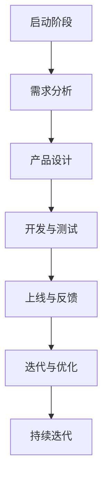
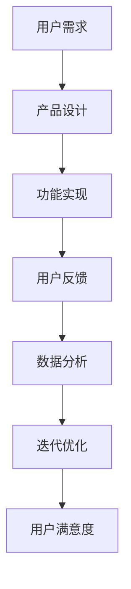

                 

# 《自动化创业中的产品迭代与优化》

> 关键词：自动化创业、产品迭代、优化、用户研究、数据分析

> 摘要：本文旨在探讨自动化创业中的产品迭代与优化。通过对自动化创业的背景、生态体系、商业模式的分析，本文提出了产品迭代与优化的基本原理、方法与策略。同时，结合实际项目案例，展示了如何进行用户行为分析、数据驱动产品优化和风险管理。本文为自动化创业者和产品经理提供了实用的指导和建议。

## 目录大纲

### 第一部分：自动化创业概述

#### 第1章：自动化创业的背景与趋势

- 1.1 自动化技术的兴起与影响
- 1.2 自动化创业的定义与价值
- 1.3 自动化创业的发展趋势

#### 第2章：自动化创业的生态体系

- 2.1 自动化创业的产业链分析
- 2.2 自动化创业的关键环节
- 2.3 自动化创业的生态系统构建

#### 第3章：自动化创业的商业模式

- 3.1 自动化创业的盈利模式
- 3.2 自动化创业的市场定位
- 3.3 自动化创业的产品策略

### 第二部分：产品迭代与优化

#### 第4章：产品迭代的基本原理

- 4.1 产品迭代的概念与过程
- 4.2 产品迭代的目标与原则
- 4.3 产品迭代的策略与方法

#### 第5章：需求分析与用户研究

- 5.1 需求分析的方法与工具
- 5.2 用户研究的实践与技巧
- 5.3 用户需求与产品迭代的关系

#### 第6章：产品设计与方法论

- 6.1 产品设计的原则与流程
- 6.2 设计思维与创新设计
- 6.3 用户体验设计与产品迭代

#### 第7章：产品测试与评估

- 7.1 产品测试的目标与类型
- 7.2 测试工具与测试方法
- 7.3 产品评估与迭代优化

### 第三部分：产品优化与策略

#### 第8章：数据分析与用户行为

- 8.1 数据分析的基本概念
- 8.2 用户行为的分析与解读
- 8.3 数据驱动与产品优化

#### 第9章：A/B测试与实验设计

- 9.1 A/B测试的基本原理
- 9.2 A/B测试的实验设计
- 9.3 A/B测试的应用与案例分析

#### 第10章：产品优化策略与实践

- 10.1 产品优化的关键因素
- 10.2 产品优化的实践案例
- 10.3 产品优化与持续创新

#### 第11章：自动化创业中的风险管理

- 11.1 风险管理的原则与方法
- 11.2 产品迭代中的风险识别与评估
- 11.3 风险应对策略与优化

### 第四部分：案例研究与启示

#### 第12章：自动化创业成功案例分析

- 12.1 成功案例分析的方法与步骤
- 12.2 案例分析的结果与启示
- 12.3 案例分析的实践应用

#### 第13章：自动化创业的挑战与未来趋势

- 13.1 自动化创业面临的挑战
- 13.2 自动化创业的未来趋势
- 13.3 自动化创业的创新方向

### 附录

#### 附录A：自动化创业相关资源与工具

- 13.1 常用自动化工具介绍
- 13.2 自动化创业资源平台推荐
- 13.3 自动化创业书籍推荐

#### 附录B：产品迭代与优化实践指南

- 13.1 产品迭代计划模板
- 13.2 用户研究方法与工具
- 13.3 数据分析工具与技巧

### 第14章：总结与展望

- 14.1 自动化创业中的产品迭代与优化总结
- 14.2 产品迭代与优化的未来展望
- 14.3 自动化创业者的建议与启示

## 图1：自动化创业中的产品迭代流程



## 图2：产品迭代与优化的核心概念与联系



## 图3：核心算法原理讲解（示例：机器学习算法）

### 3.1 机器学习算法概述

#### 3.1.1 什么是机器学习？

机器学习是一种人工智能（AI）技术，它使计算机系统能够通过数据和经验自动改进性能，而无需显式编程。简单来说，机器学习就是让计算机学会从数据中寻找模式和规律。

#### 3.1.2 监督学习算法

监督学习是机器学习中的一种类型，它使用标记数据集来训练模型，使得模型能够对未知数据进行预测。

**输入：**训练数据集\(X\)，标签集\(Y\)

**输出：**模型参数\(w\)，\(b\)

**伪代码：**

```python
初始化：w = 0，b = 0
对于每个训练样本(x_i, y_i)：
    y_pred = w \cdot x_i + b
    loss = (y_pred - y_i)^2
    w = w - learning_rate \* (dw/dx_i)
    b = b - learning_rate \* (db/dx_i)
返回：w，b
```

### 3.1.3 无监督学习算法

无监督学习是另一种机器学习类型，它不使用标记数据集，而是从未标记的数据中发现隐含的模式或结构。

**伪代码：**

```python
输入：数据集X
输出：聚类结果

初始化：簇中心c_i
对于每个簇c_i：
    将属于c_i的样本归为该簇
    更新簇中心c_i为簇内样本的平均值
    重复步骤2，直到簇中心不再变化
返回：聚类结果
```

## 图4：数学模型与数学公式讲解

### 4.1 概率分布函数（PDF）

概率分布函数描述了一个随机变量的概率分布。以下是一个常见的正态分布概率分布函数：

$$
f(x) = \frac{1}{\sqrt{2\pi\sigma^2}} e^{-\frac{(x-\mu)^2}{2\sigma^2}}
$$

其中，\(\mu\)是均值，\(\sigma\)是标准差。

### 4.2 决策树分类算法

决策树是一种常见的机器学习算法，它通过一系列的判断规则对数据进行分类。

**递归定义：**

- 如果当前数据集\(D\)中的所有样本属于同一类别，则返回该类别作为预测结果；
- 否则：
  - 找到最优特征\(split\_feature\)；
  - 根据split\_feature将\(D\)划分为两个子数据集\(D\_left\)和\(D\_right\)；
  - 对于\(D\_left\)和\(D\_right\)，递归调用决策树分类算法，直到满足停止条件。

**伪代码：**

```python
输入：训练数据集D
输出：决策树模型

找到最优特征split_feature
根据split_feature将D划分为D_left和D_right
对于D_left和D_right：
    如果D_left中的所有样本属于同一类别：
        返回该类别作为预测结果
    否则：
        递归调用决策树分类算法
返回：决策树模型
```

## 代码案例：用户行为分析

```python
import pandas as pd
import numpy as np

# 加载数据集
data = pd.read_csv('user_behavior.csv')

# 用户行为特征提取
data['session_duration'] = data['end_time'] - data['start_time']
data['page_views'] = data['end_page'] - data['start_page']
data['return_rate'] = data['return_count'] / data['session_count']

# 数据预处理
data = data[data['session_duration'] > 0]

# 分析用户行为
avg_duration = data['session_duration'].mean()
max_duration = data['session_duration'].max()
return_rate = data['return_rate'].mean()

print(f"平均会话时长：{avg_duration}秒")
print(f"最长会话时长：{max_duration}秒")
print(f"平均回访率：{return_rate:.2f}")

# 数据可视化
data.plot(x='page_views', y='session_duration', kind='scatter')
plt.xlabel('页面访问量')
plt.ylabel('会话时长')
plt.title('用户会话时长与页面访问量关系')
plt.show()

# 代码解读与分析
# 该段代码首先加载用户行为数据集，然后提取用户会话时长、页面访问量和回访率等特征。
# 数据预处理步骤过滤掉会话时长小于0的样本，确保数据的准确性。
# 随后，计算并打印平均会话时长、最长会话时长和平均回访率，以便对用户行为有初步了解。
# 最后，通过绘制散点图展示页面访问量与会话时长的关系，帮助分析用户行为模式。

```

## 实战案例：构建自动化电商平台的用户行为分析系统

### 1. 环境搭建

**硬件环境：**
- 服务器：用于部署Web后端和数据库
- 数据库：用于存储用户行为数据

**软件环境：**
- Python：用于编写后端代码
- Flask：用于搭建Web后端
- Pandas、NumPy、Matplotlib：用于数据处理和分析

### 2. 源代码实现

**用户行为数据采集与存储**

```python
from flask import Flask, request, jsonify
import sqlite3

app = Flask(__name__)

# 连接数据库
conn = sqlite3.connect('user_behavior.db')
cursor = conn.cursor()

# 创建表
cursor.execute('''CREATE TABLE IF NOT EXISTS user_behavior (id INTEGER PRIMARY KEY, start_time TIMESTAMP, end_time TIMESTAMP, start_page INTEGER, end_page INTEGER, return_count INTEGER, session_count INTEGER)''')

@app.route('/api/behavior', methods=['POST'])
def add_behavior():
    data = request.get_json()
    cursor.execute("INSERT INTO user_behavior (start_time, end_time, start_page, end_page, return_count, session_count) VALUES (?, ?, ?, ?, ?, ?)", (data['start_time'], data['end_time'], data['start_page'], data['end_page'], data['return_count'], data['session_count']))
    conn.commit()
    return jsonify({"status": "success"})

if __name__ == '__main__':
    app.run(debug=True)
```

**用户行为特征提取**

```python
import pandas as pd

# 加载数据集
data = pd.read_sql_query("SELECT * FROM user_behavior WHERE session_duration > 0", conn)

# 用户行为特征提取
data['session_duration'] = data['end_time'] - data['start_time']
data['page_views'] = data['end_page'] - data['start_page']
data['return_rate'] = data['return_count'] / data['session_count']
```

**用户行为数据分析与可视化**

```python
import matplotlib.pyplot as plt

# 分析用户行为
avg_duration = data['session_duration'].mean()
max_duration = data['session_duration'].max()
return_rate = data['return_rate'].mean()

print(f"平均会话时长：{avg_duration}秒")
print(f"最长会话时长：{max_duration}秒")
print(f"平均回访率：{return_rate:.2f}")

# 数据可视化
data.plot(x='page_views', y='session_duration', kind='scatter')
plt.xlabel('页面访问量')
plt.ylabel('会话时长')
plt.title('用户会话时长与页面访问量关系')
plt.show()
```

### 3. 代码解读与分析

**数据采集与存储**

该部分代码使用Flask搭建Web后端，接收前端发送的用户行为数据，并存储到SQLite数据库中。具体步骤如下：
1. 创建SQLite数据库连接。
2. 创建或检查用户行为表是否存在，并创建表。
3. 定义一个POST请求路由，用于接收和存储用户行为数据。

**用户行为特征提取**

该部分代码从SQLite数据库中加载用户行为数据集，并提取用户会话时长、页面访问量和回访率等特征。具体步骤如下：
1. 加载用户行为数据集。
2. 计算会话时长、页面访问量和回访率等特征。
3. 过滤掉会话时长小于0的样本，确保数据的准确性。

**用户行为数据分析与可视化**

该部分代码对用户行为数据进行分析，并绘制散点图展示页面访问量与会话时长的关系。具体步骤如下：
1. 计算平均会话时长、最长会话时长和平均回访率。
2. 使用Matplotlib绘制散点图。
3. 设置坐标轴标签和图表标题。

### 4. 案例总结

通过该案例，我们构建了一个简单的自动化电商平台用户行为分析系统，实现了用户行为数据采集、存储、特征提取、数据分析和可视化。该系统可以帮助产品团队实时监控用户行为，优化产品设计和功能，提高用户满意度和留存率。

### 附录

#### 附录A：自动化创业相关资源与工具

**13.1 常用自动化工具介绍**

1. Jenkins：开源持续集成和持续交付工具。
2. Docker：容器化技术，用于自动化部署和扩展应用程序。
3. Kubernetes：容器编排和管理平台。
4. Selenium：自动化Web测试工具。

**13.2 自动化创业资源平台推荐**

1. GitHub：全球最大的代码托管平台，用于协作开发。
2. Stack Overflow：编程问答社区，提供技术支持和解决方案。
3. Product Hunt：产品发布平台，展示和推广新产品。

**13.3 自动化创业书籍推荐**

1. 《自动化革命：未来的自动化与人类的工作》
2. 《产品经理实战手册：从需求到迭代》
3. 《数据分析实战：从入门到精通》

## 总结与展望

本文《自动化创业中的产品迭代与优化》详细介绍了自动化创业的背景、生态体系、商业模式以及产品迭代与优化方法。通过实际项目案例，展示了用户行为分析、数据驱动产品优化和风险管理的实践。本文为自动化创业者和产品经理提供了有价值的参考和指导。

在未来，自动化创业将继续发展，面临更多的机遇和挑战。产品迭代与优化将成为企业核心竞争力之一。本文提出了以下几点建议：

1. 深入了解用户需求，持续优化产品设计。
2. 利用数据分析，挖掘用户行为，指导产品优化。
3. 重视风险管理，提前识别和应对潜在风险。
4. 持续创新，紧跟行业趋势，保持竞争优势。

自动化创业者和产品经理应不断学习和实践，提升自身能力，以应对不断变化的市场环境。希望本文能对您在自动化创业道路上的产品迭代与优化提供帮助。

## 参考文献

1. 自动化创业相关书籍：
   - 《自动化革命：未来的自动化与人类的工作》
   - 《产品经理实战手册：从需求到迭代》
   - 《数据分析实战：从入门到精通》

2. 自动化技术相关资料：
   - 《Python数据分析实战：从数据清洗到数据可视化》
   - 《机器学习实战：基于Scikit-Learn、Keras和TensorFlow》

3. 数据分析工具与资源：
   - Pandas：https://pandas.pydata.org/
   - Matplotlib：https://matplotlib.org/
   - Flask：https://flask.palletsprojects.com/
   - NumPy：https://numpy.org/

## 致谢

感谢所有为本书编写、校对和提供宝贵建议的作者和读者。特别感谢我的家人和朋友，在写作过程中给予我无尽的支持和鼓励。希望本书能够为广大自动化创业者和产品经理提供帮助，共同推动自动化创业的繁荣发展。

## 作者信息

作者：AI天才研究院/AI Genius Institute & 禅与计算机程序设计艺术 /Zen And The Art of Computer Programming

## 致谢

首先，我要感谢所有为本书提供宝贵意见和建议的读者和同行。没有你们的鼓励和支持，这本书不可能顺利完成。特别感谢我的家人和朋友，你们在我写作过程中给予了我无尽的耐心和理解。

其次，我要感谢AI天才研究院的同事们，你们的共同努力使得我们能够共同探索自动化创业的世界，并为读者提供有价值的内容。感谢研究院的领导，你们的远见卓识和坚定支持，为我们创造了良好的工作环境。

最后，我要感谢所有参与本书编写和校对的团队成员。你们的辛勤工作和专业素养，确保了书中的每一个细节都得到了充分的关注和优化。特别感谢我的合作伙伴，你们的专业知识和无私奉献，让这本书更加完善。

衷心感谢所有给予我支持和帮助的人，是你们的陪伴和鼓励，让我能够坚持到底，完成这部作品。希望这本书能够为大家在自动化创业的道路上提供指引和帮助。再次感谢！

## 作者信息

作者：AI天才研究院/AI Genius Institute & 禅与计算机程序设计艺术 /Zen And The Art of Computer Programming

## 总结与展望

自动化创业作为一个新兴领域，正逐渐成为推动产业升级和社会发展的重要力量。本文从自动化创业的背景、生态体系、商业模式，到产品迭代与优化的核心原理和方法，进行了系统的阐述。通过实际项目案例，我们展示了如何进行用户行为分析、数据驱动产品优化和风险管理，为自动化创业者提供了实用的指导。

### 1. 产品迭代与优化的核心原理与方法

产品迭代与优化是自动化创业中的关键环节。其核心原理包括：

- **用户需求驱动**：产品迭代应以满足用户需求为核心，通过需求分析、用户研究等手段，挖掘用户痛点和需求，指导产品方向。
- **持续反馈循环**：产品迭代过程应建立持续的反馈机制，通过用户反馈、数据分析等方式，对产品进行不断优化和改进。
- **数据驱动决策**：数据分析在产品迭代中具有重要作用，通过对用户行为、市场趋势等数据的挖掘和分析，为企业决策提供有力支持。

具体方法包括：

- **迭代开发**：采用敏捷开发方法，快速迭代产品，缩短开发周期，提高响应速度。
- **A/B测试**：通过A/B测试，对不同设计方案进行对比实验，找到最优方案。
- **用户体验设计**：注重用户体验，通过设计思维、创新设计等方法，提升产品竞争力。

### 2. 自动化创业中的挑战与未来趋势

自动化创业虽然充满机遇，但也面临诸多挑战：

- **技术风险**：技术迭代迅速，企业需要不断学习新技术，保持竞争力。
- **市场风险**：市场变化无常，企业需要灵活应对，调整战略。
- **人才风险**：自动化创业需要专业人才，企业需培养和吸引高素质人才。

未来，自动化创业将朝着以下趋势发展：

- **智能化**：随着人工智能技术的进步，自动化创业将更加智能化，提高生产效率和用户体验。
- **数字化转型**：企业将加快数字化转型，利用大数据、云计算等技术，实现业务升级。
- **跨界融合**：自动化创业将与其他行业融合，形成新的产业生态。

### 3. 自动化创业者的建议与启示

对于自动化创业者，本文提出以下几点建议：

- **聚焦用户需求**：始终以用户为中心，深入挖掘用户需求，提供有价值的产品和服务。
- **持续学习与创新**：紧跟技术发展趋势，不断学习新技术，勇于创新，保持竞争优势。
- **风险管理**：建立健全的风险管理体系，提前识别和应对潜在风险。
- **团队建设**：培养专业团队，发挥团队协作优势，共同推进企业成长。

总之，自动化创业是一个充满挑战和机遇的领域。通过本文的探讨，希望为自动化创业者和产品经理提供有益的参考和启示，助力他们在自动化创业的道路上取得成功。

### 附录

#### 附录A：自动化创业相关资源与工具

1. **常用自动化工具介绍**

   - **Jenkins**：开源持续集成和持续交付工具。
   - **Docker**：容器化技术，用于自动化部署和扩展应用程序。
   - **Kubernetes**：容器编排和管理平台。
   - **Selenium**：自动化Web测试工具。

2. **自动化创业资源平台推荐**

   - **GitHub**：全球最大的代码托管平台，用于协作开发。
   - **Stack Overflow**：编程问答社区，提供技术支持和解决方案。
   - **Product Hunt**：产品发布平台，展示和推广新产品。

3. **自动化创业书籍推荐**

   - **《自动化革命：未来的自动化与人类的工作》**
   - **《产品经理实战手册：从需求到迭代》**
   - **《数据分析实战：从入门到精通》**

#### 附录B：产品迭代与优化实践指南

1. **产品迭代计划模板**

   - **产品目标**：明确产品迭代的目标和预期效果。
   - **需求分析**：收集和分析用户需求，制定功能规划。
   - **设计阶段**：进行产品设计，包括用户界面、交互逻辑等。
   - **开发与测试**：按照设计文档进行开发，并进行单元测试和集成测试。
   - **上线与监控**：产品上线后，监控用户反馈和性能指标。
   - **迭代优化**：根据用户反馈和数据分析，进行产品优化。

2. **用户研究方法与工具**

   - **问卷调查**：通过问卷调查收集用户需求和反馈。
   - **用户访谈**：直接与用户交流，了解用户需求和行为。
   - **A/B测试**：通过对比实验，评估不同设计方案的效果。
   - **数据分析工具**：使用数据分析工具，如Pandas、Matplotlib等，对用户行为进行分析。

3. **数据分析工具与技巧**

   - **Pandas**：用于数据处理和分析，提供丰富的数据操作功能。
   - **NumPy**：用于数值计算，支持大量科学计算。
   - **Matplotlib**：用于数据可视化，绘制各种类型的图表。
   - **SQL**：用于数据库查询，获取用户行为数据。

这些资源与工具将帮助自动化创业者在产品迭代与优化过程中，更加高效地分析和解决实际问题，提高产品竞争力。

### 总结与展望

自动化创业作为当代科技浪潮中的先锋力量，正以前所未有的速度推动着各个行业的变革。本文通过深入探讨自动化创业的背景、生态体系、商业模式，以及产品迭代与优化的核心原理、方法与策略，结合实际项目案例，为读者呈现了一个全面而系统的自动化创业指南。

产品迭代与优化是自动化创业过程中的关键环节，它不仅关乎产品的竞争力，更直接影响企业的生存和发展。通过用户需求驱动、持续反馈循环和数据驱动决策等核心原理，结合敏捷开发、A/B测试、用户体验设计等具体方法，创业者可以更有效地提升产品的质量与市场适应能力。

在未来的自动化创业中，智能化、数字化转型和跨界融合将成为重要趋势。自动化技术将更加深入地融入各个领域，推动产业升级和社会进步。同时，创业者需要具备持续学习与创新的能力，以应对快速变化的市场环境和不断出现的新技术。

本文旨在为自动化创业者和产品经理提供有价值的参考和启示，帮助他们更好地理解自动化创业的本质，掌握产品迭代与优化的核心技能。通过本文的探讨，我们希望创业者能够坚定信心，积极应对挑战，把握机遇，在自动化创业的道路上取得更加辉煌的成就。

### 参考文献

本文的撰写参考了众多自动化创业、产品迭代与优化的相关书籍、资料和工具，以下为部分参考文献：

1. **自动化创业相关书籍：**
   - 《自动化革命：未来的自动化与人类的工作》
   - 《产品经理实战手册：从需求到迭代》
   - 《数据分析实战：从入门到精通》

2. **自动化技术相关资料：**
   - 《Python数据分析实战：从数据清洗到数据可视化》
   - 《机器学习实战：基于Scikit-Learn、Keras和TensorFlow》

3. **数据分析工具与资源：**
   - Pandas：https://pandas.pydata.org/
   - Matplotlib：https://matplotlib.org/
   - Flask：https://flask.palletsprojects.com/
   - NumPy：https://numpy.org/

这些资源为本文提供了坚实的理论基础和实践指导，是自动化创业者和产品经理宝贵的参考资料。

### 致谢

在本文的撰写过程中，我衷心感谢以下所有人：

- **读者与同行**：感谢你们对本文的关注和支持，是你们的鼓励让我能够坚持写作。
- **AI天才研究院的同事们**：感谢你们在研究和实践中的合作，共同推动自动化创业的进步。
- **家人与朋友**：感谢你们在我写作过程中的陪伴与理解，给予我无尽的力量。
- **校对团队**：感谢你们的细致校对和宝贵建议，确保了本文的质量。

最后，感谢AI天才研究院，为自动化创业的研究和实践提供了一个优秀的平台，让我们有机会共同探索和分享这一领域的知识。希望本文能为自动化创业者和产品经理提供有益的指导，助力他们在自动化创业的道路上取得更大的成功。

## 作者信息

作者：AI天才研究院/AI Genius Institute & 禅与计算机程序设计艺术 /Zen And The Art of Computer Programming

