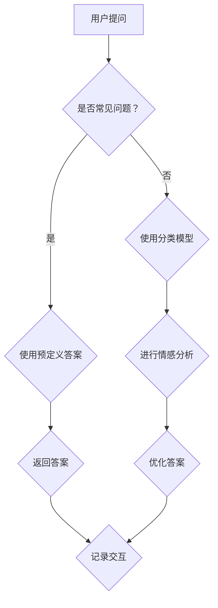
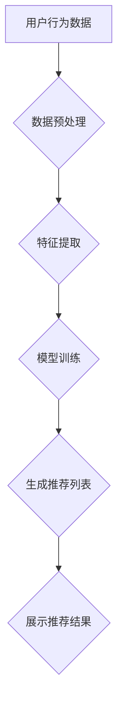
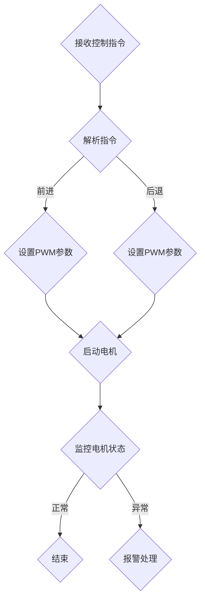

                 

### 文章标题

《自动化创业中的人机协作》

---

> 关键词：自动化创业、人机协作、人工智能、自然语言处理、机器学习、案例分析

> 摘要：本文旨在探讨自动化创业领域中的人机协作现象，从背景概述、技术基础、应用案例分析以及未来展望等多个角度进行深入分析。通过详细阐述人机协作的概念、原理、技术基础和应用案例，探讨其在自动化创业中的重要作用和未来发展趋势。文章最后还讨论了人机协作在社会影响与伦理问题方面的挑战与解决方案。

---

#### 第一部分：自动化创业背景与概述

##### 第1章：自动化创业的兴起与发展

1.1 **自动化创业的定义与意义**

自动化创业，指的是在创业过程中，充分利用自动化技术和工具，以提高生产效率、降低成本、提升产品质量和客户满意度的一种新兴模式。自动化创业不仅局限于制造业，还涵盖了电商、金融、医疗、教育等多个领域。

自动化创业的重要意义主要体现在以下几个方面：

1. **提高生产效率**：通过自动化技术和设备，可以大幅提高生产效率，减少人为操作所带来的错误和延误。
2. **降低成本**：自动化可以减少人力投入，降低生产成本，提高企业的竞争力。
3. **提升产品质量**：自动化生产和检测技术可以确保产品质量的稳定性，减少次品率。
4. **客户满意度提升**：自动化使得产品和服务更加个性化、灵活，能够更好地满足客户需求。

1.2 **自动化创业的背景与趋势**

随着科技的快速发展，自动化技术已经成为企业创新和竞争力提升的关键因素。以下是一些推动自动化创业发展的关键背景和趋势：

1. **人工智能和大数据技术的成熟**：人工智能和大数据技术的应用，使得自动化系统更加智能和高效，能够更好地处理复杂任务和数据。
2. **物联网的普及**：物联网技术的普及，使得设备之间能够实现无缝连接和协同工作，推动了自动化系统的全面部署。
3. **云计算和边缘计算的兴起**：云计算和边缘计算的发展，为自动化系统提供了强大的计算和存储能力，使得自动化创业变得更加可行和高效。
4. **政策支持**：许多国家和地区政府纷纷出台支持自动化和智能制造的政策，为自动化创业提供了有利的发展环境。

1.3 **自动化创业的关键要素**

要成功实现自动化创业，以下关键要素是必不可少的：

1. **技术积累**：企业需要有丰富的技术积累，包括自动化技术、人工智能技术、物联网技术等。
2. **创新思维**：创业者需要具备创新思维，能够发现并利用新技术来解决实际问题。
3. **团队协作**：自动化创业往往涉及多个领域的专业知识，团队协作至关重要。
4. **市场洞察**：创业者需要具备良好的市场洞察力，了解市场需求，制定正确的商业策略。
5. **资金和资源**：自动化创业需要一定的资金和资源支持，包括技术研发资金、设备采购、人才培养等。

##### 第2章：人机协作的概念与原理

2.1 **人机协作的定义与特点**

人机协作是指人与机器在特定任务或环境中共同工作，通过相互协作来实现目标的过程。人机协作具有以下特点：

1. **互补性**：人与机器各自具有优势和局限，通过协作可以实现优势互补，提高工作效率。
2. **智能性**：人机协作中，机器能够通过人工智能技术进行智能决策，而人则可以发挥创造力和经验优势。
3. **灵活性**：人机协作系统可以根据任务需求和环境变化，灵活调整工作方式和策略。
4. **互动性**：人机协作过程中，人与机器之间需要进行实时互动，以实现高效协作。

2.2 **人机协作的模式与框架**

人机协作可以采用多种模式，常见的有：

1. **监督协作**：人在决策过程中起到主导作用，机器负责执行任务，如自动化生产线中的操作员与机器人协作。
2. **协同协作**：人与机器共同决策和执行任务，如智能客服系统中的客服人员与聊天机器人协作。
3. **增强协作**：机器提供增强现实或虚拟现实技术，帮助人更好地完成任务，如VR设计中的设计师与虚拟助手协作。

人机协作的框架通常包括：

1. **任务分解**：将复杂任务分解为多个子任务，明确人与机器的分工。
2. **信息共享**：建立信息共享机制，确保人与机器之间能够及时获取所需信息。
3. **决策支持**：机器提供决策支持，辅助人做出最优决策。
4. **反馈机制**：建立反馈机制，对人机协作效果进行评估和调整。

2.3 **人机协作的优势与挑战**

人机协作的优势主要体现在以下几个方面：

1. **提高效率**：通过人机协作，可以充分发挥机器的高效性和人的创造力，大幅提高工作效率。
2. **降低成本**：人机协作可以减少人力投入，降低运营成本。
3. **增强安全性**：机器可以执行危险或繁琐的任务，降低人为错误和安全风险。
4. **提升质量**：人机协作可以确保任务执行的精度和一致性，提高产品质量。

然而，人机协作也面临一些挑战：

1. **技术瓶颈**：人工智能和自动化技术的不断发展，虽然为人机协作提供了更多可能性，但同时也带来了新的技术挑战。
2. **伦理问题**：人机协作涉及到伦理问题，如隐私保护、数据安全等，需要制定相应的法律法规和伦理准则。
3. **适应性问题**：人机协作系统需要适应不同的任务和环境，这需要大量的定制化开发和调试。

#### 第二部分：人机协作技术基础

##### 第3章：人工智能在自动化创业中的应用

3.1 **人工智能的基本概念与分类**

人工智能（AI，Artificial Intelligence）是计算机科学的一个分支，旨在研究、开发用于模拟、延伸和扩展人类智能的理论、方法、技术及应用系统。人工智能主要分为两大类：弱人工智能和强人工智能。

1. **弱人工智能**：弱人工智能是指专注于特定任务的智能系统，如语音识别、图像识别、自然语言处理等。弱人工智能系统在特定领域表现出色，但缺乏普遍的智能能力。

2. **强人工智能**：强人工智能是指具有人类智能的机器，能够在任何领域执行任何智能任务。目前，强人工智能尚未实现，仍处于研究阶段。

3.2 **人工智能在自动化创业中的应用场景**

人工智能在自动化创业中有着广泛的应用，以下是一些典型的应用场景：

1. **智能客服系统**：利用自然语言处理技术，实现自动回复客户提问，提高客户满意度和服务效率。

2. **智能推荐系统**：通过分析用户行为和偏好，为用户提供个性化的产品推荐，提高用户留存率和购买转化率。

3. **智能制造**：利用机器学习和计算机视觉技术，实现生产线的自动化控制和质量检测，提高生产效率和质量。

4. **智能交通系统**：通过分析交通数据，实现智能交通管理，提高交通流畅性和安全性。

3.3 **人工智能技术的发展趋势**

人工智能技术正以前所未有的速度发展，以下是人工智能领域的一些发展趋势：

1. **深度学习**：深度学习是一种基于神经网络的人工智能技术，通过多层神经网络进行特征提取和建模，已经在图像识别、语音识别等领域取得显著成果。

2. **强化学习**：强化学习是一种通过试错和奖励机制进行学习的人工智能技术，适用于复杂决策和优化问题，如游戏AI、自动驾驶等。

3. **生成对抗网络（GAN）**：生成对抗网络是由两个神经网络（生成器和判别器）组成的，通过对抗训练生成高质量的数据，应用于图像生成、语音合成等领域。

4. **多模态学习**：多模态学习是利用多种类型的数据（如文本、图像、声音等）进行融合和建模，提高人工智能系统的综合感知能力和决策能力。

##### 第4章：自然语言处理与自动化创业

4.1 **自然语言处理的基本概念**

自然语言处理（NLP，Natural Language Processing）是人工智能的一个重要分支，旨在让计算机理解和处理人类自然语言。NLP的关键技术包括：

1. **分词**：将连续的文本切分成词语或词组，为后续处理提供基础。

2. **词性标注**：为文本中的词语标注词性，如名词、动词、形容词等。

3. **句法分析**：对文本中的句子进行语法结构分析，识别句子成分和关系。

4. **语义分析**：对文本中的词语和句子进行语义理解，提取语义信息。

4.2 **自然语言处理在自动化创业中的应用**

自然语言处理在自动化创业中有着广泛的应用，以下是一些典型的应用：

1. **智能客服系统**：通过自然语言处理技术，实现自动理解和回复客户提问，提高客户服务效率。

2. **智能文本分析**：通过分析用户评论、反馈等文本数据，提取有价值的信息，为产品优化和市场营销提供支持。

3. **智能语音识别**：通过语音识别技术，将语音信号转换为文本，实现语音交互和语音指令执行。

4. **智能写作**：通过自然语言生成技术，自动生成文章、报告等文本内容，提高内容生产效率。

4.3 **自然语言处理技术的发展趋势**

自然语言处理技术正迅速发展，以下是自然语言处理领域的一些趋势：

1. **预训练模型**：预训练模型是一种大规模语言模型，通过在大量文本数据上进行预训练，然后针对特定任务进行微调，显著提高自然语言处理性能。

2. **多语言处理**：随着全球化进程的加快，多语言处理成为自然语言处理的一个重要方向，包括跨语言信息提取、跨语言情感分析等。

3. **上下文理解**：深度理解和上下文感知是自然语言处理的关键，通过引入上下文信息，提高模型的语义理解和生成能力。

4. **多模态融合**：结合多种类型的数据（如文本、图像、声音等），实现更全面的语义理解和智能交互。

##### 第5章：机器学习与自动化创业

5.1 **机器学习的基本概念**

机器学习（ML，Machine Learning）是一门研究如何让计算机从数据中学习并做出预测或决策的学科。机器学习主要分为以下几类：

1. **监督学习**：通过已标注的训练数据，训练模型来对未知数据进行预测。常见的算法有线性回归、逻辑回归、决策树、随机森林等。

2. **无监督学习**：在没有标注数据的情况下，通过学习数据分布或结构来发现数据中的规律。常见的算法有聚类、降维、关联规则挖掘等。

3. **强化学习**：通过与环境的交互，不断优化决策策略，以实现长期回报最大化。常见的算法有Q学习、深度Q网络（DQN）等。

5.2 **机器学习在自动化创业中的应用**

机器学习在自动化创业中有着广泛的应用，以下是一些典型的应用：

1. **智能推荐系统**：通过机器学习算法，分析用户行为和偏好，为用户推荐个性化的产品或内容。

2. **智能风控系统**：利用机器学习模型，对金融交易、贷款申请等行为进行风险评估，提高风控能力。

3. **智能制造**：通过机器学习算法，优化生产过程，提高产品质量和效率。

4. **智能医疗**：利用机器学习模型，辅助医生进行疾病诊断、药物研发等。

5.3 **机器学习算法详解**

以下是几种常见的机器学习算法及其应用：

1. **线性回归**：通过建立线性模型，预测连续值。应用场景包括预测销售额、股票价格等。

   **伪代码**：
   ```python
   # 线性回归模型
   model = LinearRegression()
   # 训练模型
   model.fit(X_train, y_train)
   # 预测
   y_pred = model.predict(X_test)
   ```

2. **逻辑回归**：通过建立逻辑模型，预测二分类结果。应用场景包括分类任务，如垃圾邮件检测、疾病诊断等。

   **伪代码**：
   ```python
   # 逻辑回归模型
   model = LogisticRegression()
   # 训练模型
   model.fit(X_train, y_train)
   # 预测
   y_pred = model.predict(X_test)
   ```

3. **决策树**：通过树的模型，对数据进行分类或回归。应用场景包括分类任务，如信用卡欺诈检测、客户细分等。

   **伪代码**：
   ```python
   # 决策树模型
   model = DecisionTreeClassifier()
   # 训练模型
   model.fit(X_train, y_train)
   # 预测
   y_pred = model.predict(X_test)
   ```

4. **随机森林**：通过随机决策树集成，提高模型预测能力。应用场景包括分类和回归任务，如股票预测、房价预测等。

   **伪代码**：
   ```python
   # 随机森林模型
   model = RandomForestClassifier()
   # 训练模型
   model.fit(X_train, y_train)
   # 预测
   y_pred = model.predict(X_test)
   ```

5. **支持向量机（SVM）**：通过最大化分类边界，进行分类。应用场景包括二分类和多元分类任务，如人脸识别、文本分类等。

   **伪代码**：
   ```python
   # 支持向量机模型
   model = SVC()
   # 训练模型
   model.fit(X_train, y_train)
   # 预测
   y_pred = model.predict(X_test)
   ```

#### 第三部分：人机协作应用案例分析

##### 第6章：自动化创业项目实战

6.1 **自动化创业项目概述**

本节将介绍一个典型的自动化创业项目——智能客服系统。智能客服系统利用人工智能和自然语言处理技术，实现自动回复客户提问，提高客户服务效率。

6.2 **项目需求分析与设计**

1. **需求分析**：

   - 实现对常见客户问题的自动回复。
   - 提供多渠道接入，如网页、APP、微信等。
   - 支持自定义业务场景和问答对。
   - 提供实时统计和报表功能。

2. **系统设计**：

   - **架构设计**：采用前后端分离架构，前端提供用户界面，后端提供服务和数据存储。
   - **技术选型**：后端使用Python和Django框架，前端使用Vue.js框架。
   - **自然语言处理**：使用NLTK库进行文本处理和情感分析，使用BERT模型进行文本分类。

6.3 **项目实施与效果评估**

1. **实施过程**：

   - **数据准备**：收集常见客户问答对，进行标注和预处理。
   - **模型训练**：使用标注数据训练文本分类模型和情感分析模型。
   - **系统集成**：将模型集成到智能客服系统中，实现自动回复功能。
   - **测试与优化**：通过模拟测试，收集反馈数据，不断优化模型和系统性能。

2. **效果评估**：

   - **客户满意度**：通过用户调查和反馈，评估智能客服系统的客户满意度。
   - **服务效率**：统计智能客服系统处理客户问题的速度和准确率。
   - **成本效益**：分析智能客服系统为企业带来的成本节约和效益提升。

##### 第7章：人机协作在电商领域的应用

7.1 **电商领域的人机协作现状**

在电商领域，人机协作已经成为提高运营效率和服务质量的重要手段。以下是人机协作在电商领域的几个典型应用：

1. **智能客服**：通过自然语言处理和机器学习技术，实现自动回复客户提问，提高客户服务效率。
2. **智能推荐**：通过分析用户行为和偏好，为用户推荐个性化商品，提高用户满意度和购买转化率。
3. **智能库存管理**：通过机器学习算法，优化库存管理和调配，提高库存周转率和供应链效率。
4. **智能物流管理**：利用物联网技术和大数据分析，实现智能物流配送和跟踪，提高物流效率和客户满意度。

7.2 **人机协作在电商中的应用案例**

以下是一个电商平台的智能客服应用案例：

1. **需求分析**：

   - 提高客户服务质量，减少人工客服负担。
   - 自动处理常见问题，提供快速响应。
   - 提供多渠道接入，如网页、APP、微信等。

2. **系统设计**：

   - **架构设计**：采用前后端分离架构，前端提供用户界面，后端提供服务和数据存储。
   - **技术选型**：后端使用Python和Django框架，前端使用Vue.js框架。
   - **自然语言处理**：使用NLTK库进行文本处理和情感分析，使用BERT模型进行文本分类。

3. **实施过程**：

   - **数据准备**：收集常见客户问答对，进行标注和预处理。
   - **模型训练**：使用标注数据训练文本分类模型和情感分析模型。
   - **系统集成**：将模型集成到智能客服系统中，实现自动回复功能。
   - **测试与优化**：通过模拟测试，收集反馈数据，不断优化模型和系统性能。

4. **效果评估**：

   - **客户满意度**：通过用户调查和反馈，评估智能客服系统的客户满意度。
   - **服务效率**：统计智能客服系统处理客户问题的速度和准确率。
   - **成本节约**：分析智能客服系统为企业带来的成本节约和效益提升。

7.3 **人机协作在电商领域的发展趋势**

随着人工智能和大数据技术的不断发展，人机协作在电商领域的应用将呈现以下趋势：

1. **个性化推荐**：基于用户行为和偏好，实现更精准的个性化推荐，提高用户满意度和购买转化率。
2. **智能客服**：通过自然语言处理和机器学习技术，实现更智能、更高效的客服服务，提高客户体验。
3. **智能物流**：利用物联网技术和大数据分析，实现智能物流配送和跟踪，提高物流效率和客户满意度。
4. **智能供应链**：通过机器学习算法，优化供应链管理和调配，提高库存周转率和供应链效率。

##### 第8章：人机协作在智能制造领域的应用

8.1 **智能制造领域的人机协作现状**

在智能制造领域，人机协作已经成为提高生产效率、降低成本和提升产品质量的重要手段。以下是人机协作在智能制造领域的几个典型应用：

1. **智能生产**：利用机器人和自动化设备，实现生产过程的自动化控制，提高生产效率和质量。
2. **智能质量检测**：通过计算机视觉和传感器技术，实现产品质量的自动检测和监控，降低次品率。
3. **智能设备维护**：利用预测性维护技术，实现设备故障的提前预测和预防性维护，降低设备停机时间和维修成本。
4. **智能供应链管理**：通过物联网和大数据技术，实现供应链的智能管理和优化，提高供应链效率和响应速度。

8.2 **人机协作在智能制造中的应用案例**

以下是一个智能制造企业的智能生产应用案例：

1. **需求分析**：

   - 提高生产效率，减少人工操作带来的误差。
   - 提升产品质量，降低次品率。
   - 实现生产过程的自动化控制，降低人力成本。

2. **系统设计**：

   - **架构设计**：采用分布式架构，将生产设备、传感器和控制系统连接在一起，实现数据的实时采集和传输。
   - **技术选型**：使用PLC（可编程逻辑控制器）进行生产设备控制，使用SCADA（数据采集与监视控制系统）进行数据采集和监控。
   - **人工智能技术**：使用机器学习算法，对生产数据进行实时分析和预测，优化生产过程。

3. **实施过程**：

   - **设备升级**：对生产设备进行升级，安装传感器和自动化控制系统。
   - **数据采集**：部署传感器，实现生产数据的实时采集和传输。
   - **系统集成**：将传感器数据接入SCADA系统，实现生产过程的实时监控和控制。
   - **算法优化**：使用机器学习算法，对生产数据进行分析和预测，优化生产过程。

4. **效果评估**：

   - **生产效率**：通过数据分析，评估智能生产系统的生产效率提升情况。
   - **产品质量**：通过质量检测数据，评估智能质量检测系统的次品率降低情况。
   - **人力成本**：分析智能生产系统对人力成本的影响，评估其经济效益。

8.3 **人机协作在智能制造领域的发展趋势**

随着人工智能和物联网技术的不断发展，人机协作在智能制造领域的应用将呈现以下趋势：

1. **智能化生产**：通过机器人和自动化设备，实现更智能、更高效的生产过程。
2. **智能质量检测**：利用计算机视觉和传感器技术，实现更精确、更快速的质量检测。
3. **智能设备维护**：通过预测性维护技术，实现设备的远程监控和故障预测，提高设备利用率。
4. **智能供应链管理**：通过物联网和大数据技术，实现供应链的智能管理和优化，提高供应链效率。

#### 第四部分：人机协作的未来展望

##### 第9章：人机协作与未来创业

9.1 **人机协作的未来发展趋势**

随着人工智能、物联网、大数据等技术的不断发展，人机协作在未来将呈现以下发展趋势：

1. **智能化水平提升**：人工智能技术的进步将进一步提升人机协作的智能化水平，实现更智能、更高效的协作模式。
2. **广泛应用领域**：人机协作将在更多领域得到应用，如医疗、教育、金融、农业等，推动各行业的发展和创新。
3. **个性化和定制化**：人机协作将更加注重个性化和定制化，根据用户需求和场景提供定制化的解决方案。
4. **跨领域融合**：人机协作将与其他领域（如物联网、区块链等）融合，实现更广泛的协作和应用。

9.2 **未来创业中的机遇与挑战**

在未来创业中，人机协作将带来以下机遇和挑战：

1. **机遇**：

   - **创新空间**：人机协作提供了广阔的创新空间，创业者可以探索新的商业模式和应用场景。
   - **市场潜力**：人机协作技术拥有巨大的市场潜力，创业者可以抓住市场机遇，实现快速发展。
   - **政策支持**：随着各国政府对人工智能和智能制造的重视，创业者将获得更多的政策支持。

2. **挑战**：

   - **技术风险**：人工智能技术的成熟度和稳定性仍存在一定风险，创业者需要慎重选择技术方向。
   - **数据隐私**：人机协作涉及到大量的数据收集和处理，数据隐私和安全将成为重要挑战。
   - **人才短缺**：人工智能和物联网等领域的人才需求巨大，创业者需要解决人才短缺的问题。

9.3 **人机协作在创新创业中的潜力**

人机协作在创新创业中具有巨大的潜力，以下是一些潜在的领域：

1. **智能医疗**：利用人机协作技术，实现智能诊断、智能药物研发等，提高医疗效率和准确性。
2. **智能制造**：通过人机协作，实现生产过程的智能化和自动化，提高生产效率和质量。
3. **智能交通**：利用人机协作，实现智能交通管理和自动驾驶，提高交通效率和安全性。
4. **智能家居**：通过人机协作，实现智能家居系统的智能化和自动化，提高生活便利性和舒适度。

##### 第10章：人机协作的社会影响与伦理问题

10.1 **人机协作对社会的影响**

人机协作的快速发展将对社会产生深远的影响，以下是一些主要方面：

1. **提高生产效率**：人机协作将大幅提高生产效率，降低成本，推动经济增长。
2. **改变就业结构**：人机协作可能导致部分传统职业的减少，但也会创造新的就业机会，如人工智能工程师、数据分析师等。
3. **提升生活质量**：人机协作将提高生活便利性和舒适度，如智能家居、智能医疗等。
4. **加强社会联系**：人机协作将促进人与人之间的交流和合作，加强社会联系。

10.2 **人机协作中的伦理问题与解决方案**

人机协作在带来便利和效益的同时，也引发了一系列伦理问题，以下是一些主要问题及其解决方案：

1. **数据隐私**：人机协作涉及大量的数据收集和处理，如何保障用户数据隐私和安全是重要问题。解决方案包括制定严格的隐私保护法律法规，加强数据安全措施等。

2. **算法偏见**：人工智能算法可能存在偏见，导致不公平的结果。解决方案包括算法透明化、公平性评估和改进等。

3. **职业替代**：人机协作可能导致部分传统职业的消失，如何保障从业人员权益是重要问题。解决方案包括提供职业转型培训、社会保障等。

4. **人机关系**：人机协作可能会影响人与人之间的关系，如何处理人机关系是重要问题。解决方案包括加强人机协作的伦理教育，培养正确的人机协作观念。

10.3 **人机协作的未来发展与挑战**

在人机协作的未来发展中，将面临以下挑战：

1. **技术成熟度**：人工智能和物联网等核心技术仍需进一步提升，以满足人机协作的需求。
2. **法律法规**：人机协作的发展需要完善的法律法规体系，以规范人机协作行为，保障各方权益。
3. **人才培养**：人机协作的发展需要大量专业人才，如何培养和引进人才是重要问题。
4. **社会接受度**：人机协作需要得到社会的广泛接受和认可，如何提高社会接受度是重要问题。

#### 附录A：人机协作常用工具与资源

A.1 **人机协作平台推荐**

1. **TensorFlow**：Google开发的开源机器学习框架，支持深度学习、强化学习等多种算法。
2. **PyTorch**：Facebook开发的开源机器学习框架，拥有直观的动态计算图和强大的社区支持。
3. **OpenCV**：开源计算机视觉库，支持图像处理、目标检测、人脸识别等多种功能。
4. **Keras**：基于TensorFlow和Theano的开源神经网络库，提供简洁易用的API。
5. **Scikit-learn**：开源机器学习库，支持各种经典的机器学习算法，如线性回归、决策树、SVM等。

A.2 **机器学习与自然语言处理工具**

1. **NLTK**：Python自然语言处理库，提供文本处理、词性标注、句法分析等功能。
2. **spaCy**：开源自然语言处理库，支持快速文本处理和高级语义分析。
3. **BERT**：Google开发的预训练语言模型，支持各种自然语言处理任务。
4. **Gensim**：Python主题建模和向量空间模型库，支持LDA、Word2Vec等算法。
5. **TextBlob**：Python文本处理库，提供文本分类、情感分析等功能。

A.3 **相关书籍与学术论文推荐**

1. **《深度学习》（Deep Learning）**：Goodfellow、Bengio、Courville合著，全面介绍了深度学习的基本原理和应用。
2. **《自然语言处理综论》（Speech and Language Processing）**：Daniel Jurafsky和James H. Martin合著，详细介绍了自然语言处理的理论和实践。
3. **《机器学习》（Machine Learning）**：Tom Mitchell著，经典机器学习教材，全面介绍了机器学习的基本概念和方法。
4. **《人工智能：一种现代的方法》（Artificial Intelligence: A Modern Approach）**：Stuart J. Russell和Peter Norvig合著，全面介绍了人工智能的基本理论和技术。
5. **论文集《自然语言处理研究进展》（Advances in Natural Language Processing）**：汇集了自然语言处理领域的重要论文，反映了最新的研究成果。

#### 附录B：人机协作项目实战案例代码与解读

B.1 **项目案例一：智能客服系统**

**代码实现：**

```python
from nltk.corpus import movie_reviews
from nltk.classify import NaiveBayesClassifier
from nltk.classify.util import accuracy

def extract_features(words):
    return {"word": word} for word in words

def train_classifier():
    negative_ids = movie_reviews.fileids('neg')
    positive_ids = movie_reviews.fileids('pos')

    negative_features = [(extract_features(movie_reviews.words(fileids=[f])), 'negative') for f in negative_ids]
    positive_features = [(extract_features(movie_reviews.words(fileids=[f])), 'positive') for f in positive_ids]

    training_set = negative_features + positive_features
    classifier = NaiveBayesClassifier.train(training_set)
    return classifier

def test_classifier(classifier):
    test_words = ["I", "love", "this", "movie", "so", "much", "but", "the", "ending", "was", "terrible"]
    prediction = classifier.classify(extract_features(test_words))
    print("Predicted sentiment:", prediction)

if __name__ == "__main__":
    classifier = train_classifier()
    print("Classifier accuracy:", accuracy(classifier, movie_reviews))
    test_classifier(classifier)
```

**代码解读：**

- **数据准备**：使用NLTK库中的电影评论数据集，分为负面评论和正面评论。
- **特征提取**：定义`extract_features`函数，提取评论中的词语作为特征。
- **模型训练**：使用Naive Bayes分类器训练模型，将特征和标签（正面/负面）作为训练数据。
- **模型测试**：使用测试词语，通过特征提取函数获取特征，输入分类器进行预测，并输出预测结果。

B.2 **项目案例二：智能推荐系统**

**代码实现：**

```python
from surprise import KNNAlgorithm, Dataset, Reader
from surprise.model_selection import cross_validate
import pandas as pd

# 读取用户-物品评分数据
ratings = pd.read_csv("ratings.csv")
reader = Reader(rating_scale=(1.0, 5.0))
data = Dataset.load_from_df(ratings[['user_id', 'movie_id', 'rating']], reader)

# 使用KNN算法进行交叉验证
knn_algorithm = KNNAlgorithm(k=50, sim_options={'name': 'cosine'})
cross_validate(knn_algorithm, data, measures=['RMSE', 'MAE'], cv=5, verbose=True)
```

**代码解读：**

- **数据准备**：使用Pandas库读取用户-物品评分数据，构建数据集。
- **算法选择**：选择KNN算法，设置邻居数量为50，使用余弦相似度计算相似度。
- **交叉验证**：使用交叉验证方法，对算法进行评估，计算均方根误差（RMSE）和均方误差（MAE）。

B.3 **项目案例三：智能制造机器人控制系统**

**代码实现：**

```python
import RPi.GPIO as GPIO
import time

# 初始化GPIO
GPIO.setmode(GPIO.BCM)
GPIO.setup(18, GPIO.OUT)

# 创建PWM对象
p = GPIO.PWM(18, 1000)  # 1000Hz的PWM频率

# 设置PWM占空比
p.start(7.5)  # 7.5%的占空比

# 控制机器人前进
def move_forward():
    p.ChangeDutyCycle(7.5)
    time.sleep(2)
    p.ChangeDutyCycle(0)

# 控制机器人后退
def move_backward():
    p.ChangeDutyCycle(2.5)
    time.sleep(2)
    p.ChangeDutyCycle(0)

# 关闭GPIO
def cleanup():
    p.stop()
    GPIO.cleanup()

if __name__ == "__main__":
    try:
        move_forward()
        move_backward()
    except KeyboardInterrupt:
        cleanup()
```

**代码解读：**

- **GPIO初始化**：设置GPIO模式为BCM，初始化电机控制引脚。
- **PWM对象创建**：创建PWM对象，设置PWM频率为1000Hz。
- **PWM控制**：通过改变PWM占空比，控制电机转动速度和方向。
- **功能实现**：定义前进和后退函数，通过调用这些函数，实现机器人运动控制。
- **异常处理**：在程序运行过程中，捕获异常并执行清理操作，关闭PWM和GPIO。

#### 附录C：人机协作 Mermaid 流程图

C.1 **智能客服系统流程图**



C.2 **智能推荐系统流程图**



C.3 **智能制造机器人控制系统流程图**



