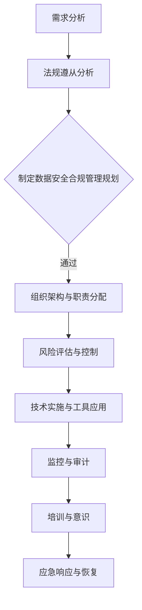

                 

# 《自动化创业中的数据安全合规管理》

## 关键词
- 自动化创业
- 数据安全
- 合规管理
- 数据隐私
- 法规遵从
- 风险评估

## 摘要
本文深入探讨了自动化创业中数据安全合规管理的重要性及其关键实践。首先，文章概述了自动化创业的背景和数据安全合规的基本概念，分析了数据安全与合规的联系。接着，文章详细解读了国家数据安全法律法规、行业规范与标准以及国际数据安全合规要求。随后，文章从体系建设、数据安全策略规划、数据安全技术与工具等方面阐述了数据安全合规管理的框架。通过实际案例解析，文章总结了数据安全合规管理的最佳实践。最后，文章展望了未来数据安全合规管理的发展趋势及挑战，为自动化创业中的数据安全合规管理提供了理论指导和实践参考。

### 第一部分：引言

## 第1章：自动化创业与数据安全合规管理的背景

### 1.1 自动化创业概述

自动化创业是指利用先进的自动化技术，如人工智能、机器学习、大数据分析等，来创新和优化业务流程，提高生产效率和产品质量的一种创业模式。自动化创业的核心在于将人工作业转化为机器作业，通过算法和智能系统实现业务自动化，从而降低人力成本、提高工作效率。

自动化创业的兴起可以追溯到20世纪末，随着计算机技术的发展，自动化技术逐渐成熟并广泛应用到各行各业。近年来，人工智能、大数据和物联网等新兴技术的快速发展，进一步推动了自动化创业的普及。自动化创业不仅改变了传统的商业模式，还为企业提供了新的增长动力。

自动化创业的优势主要体现在以下几个方面：

1. **提高效率**：通过自动化技术，可以显著减少人力成本，提高生产效率和产品质量。
2. **降低成本**：自动化减少了人力资源的需求，降低了生产成本。
3. **提升竞争力**：通过自动化技术，企业可以更快地响应市场变化，提高市场竞争力。
4. **创新驱动**：自动化创业促进了技术创新，推动了产业升级和转型。

### 1.2 数据安全合规管理的重要性

数据安全合规管理在自动化创业中具有至关重要的地位。随着自动化技术的应用，大量数据在各个环节中流转，包括用户数据、业务数据、财务数据等。这些数据不仅对企业的运营至关重要，也承载了用户的隐私和信任。因此，确保数据的安全和合规是自动化创业的必要前提。

数据安全合规管理的重要性主要体现在以下几个方面：

1. **保护用户隐私**：自动化创业中的数据往往包含用户的个人信息，数据安全合规管理可以保护用户隐私不被泄露。
2. **遵守法律法规**：在全球范围内，数据安全法律法规日益严格，企业必须遵守相关法律法规，避免法律风险。
3. **维护企业声誉**：数据泄露或违规事件会对企业的声誉造成严重损害，影响企业的长期发展。
4. **保障业务连续性**：数据安全合规管理可以确保企业在面临数据威胁时能够快速响应，保障业务的连续性。

### 1.3 书籍结构概述

本文将从以下几个方面展开讨论：

- **第二部分：数据安全与合规概述**：介绍数据安全与合规的基本概念，分析其联系与目标。
- **第三部分：法律法规与政策解读**：详细解读国家数据安全法律法规、行业规范与标准以及国际数据安全合规要求。
- **第四部分：数据安全合规管理体系建设**：阐述数据安全合规管理体系的框架、数据安全策略与规划、数据安全技术与工具。
- **第五部分：数据安全合规实战案例**：通过实际案例解析，总结数据安全合规管理的最佳实践。
- **第六部分：自动化创业中的数据安全合规管理实践**：探讨自动化创业中的数据安全合规管理实践步骤及案例。
- **第七部分：未来展望**：分析数据安全合规管理的挑战与机遇，展望未来发展。

本文旨在为自动化创业中的数据安全合规管理提供系统的理论指导和实践参考，帮助创业者和企业建立起有效的数据安全合规管理体系，确保数据安全与业务发展的同步推进。

## 第二部分：数据安全与合规概述

### 第2章：数据安全与合规的基本概念

#### 2.1 数据安全的基本概念

数据安全是指通过各种技术和管理措施，确保数据的完整性、保密性和可用性，防止数据泄露、篡改和丢失。数据安全的基本概念包括以下几个方面：

1. **数据完整性**：确保数据在存储、传输和处理过程中不被未授权的修改或破坏。
2. **数据保密性**：确保数据在存储、传输和处理过程中不被未授权的个人或组织访问。
3. **数据可用性**：确保数据在需要时可以被授权的个人或组织访问和使用。

数据安全的层次结构可以分为以下几个方面：

1. **物理安全**：保护数据存储设备和网络设备的物理安全，防止设备被盗窃或损坏。
2. **网络安全**：保护网络通信安全，防止数据在网络传输过程中被窃听、篡改或截获。
3. **数据存储安全**：保护数据在存储介质上的安全，防止数据泄露或丢失。
4. **数据处理安全**：确保数据处理过程中的安全性，防止数据被篡改或滥用。

#### 2.2 合规的基本概念

合规是指企业或组织遵守相关法律法规、行业标准、内部政策和规范的过程。合规的基本概念包括以下几个方面：

1. **法律法规**：企业必须遵守的国家和地区的法律法规，如数据安全法、个人信息保护法等。
2. **行业标准**：行业内部制定的技术标准和操作规范，如ISO 27001信息安全管理体系标准。
3. **内部政策**：企业内部制定的关于数据管理、安全操作等方面的规章制度。

合规的范畴包括：

1. **数据保护**：确保数据的隐私和保密性，防止数据泄露或滥用。
2. **信息安全管理**：建立和维护信息安全管理体系，确保信息系统的安全运行。
3. **业务合规**：确保企业的业务操作符合相关法律法规和行业标准，避免法律风险。

#### 2.3 数据安全与合规的联系

数据安全与合规密切相关，二者相互支撑，共同保障数据的安全和企业的合法运营。具体来说：

1. **数据安全是合规的基础**：企业必须确保数据的安全，才能满足合规要求。
2. **合规是数据安全的保障**：遵守相关法律法规和行业标准，可以为企业提供合规的框架和标准，确保数据安全管理的有效性。

数据安全合规管理的目标主要包括：

1. **保护用户隐私**：确保用户个人信息的安全和隐私。
2. **遵守法律法规**：确保企业的业务操作符合相关法律法规。
3. **维护企业声誉**：避免数据泄露或违规事件对企业的声誉造成损害。
4. **保障业务连续性**：确保企业在面临数据威胁时能够快速响应，保障业务的连续性。

### 第3章：法律法规与政策解读

#### 3.1 国家数据安全法律法规

国家数据安全法律法规是保障数据安全和合规的重要依据。以下是中国相关法律法规的简要介绍：

1. **《数据安全法》**：
   - **背景**：2021年6月10日，中华人民共和国第十三届全国人民代表大会常务委员会第二十九次会议通过了《数据安全法》。
   - **主要内容**：
     - 数据安全保护的基本原则
     - 数据安全保护的责任和义务
     - 数据安全风险评估和管理
     - 数据安全事件应对和处置
   - **适用范围**：适用于在中国境内收集、存储、传输、处理、交换、提供等活动的数据安全保护。

2. **《个人信息保护法》**：
   - **背景**：2021年11月1日，中华人民共和国主席习近平签署了《个人信息保护法》。
   - **主要内容**：
     - 个人信息保护的基本原则
     - 个人信息处理规则
     - 个人信息权益保护
     - 个人信息跨境提供的规则
   - **适用范围**：适用于在中国境内处理个人信息的活动。

#### 3.2 行业规范与标准

行业规范与标准是数据安全合规管理的重要参考。以下是一些常见的行业规范与标准：

1. **ISO 27001信息安全管理体系标准**：
   - **概述**：ISO 27001是一个国际标准，旨在建立和维护信息安全管理体系（ISMS）。
   - **主要内容**：
     - 安全政策
     - 安全组织
     - 安全风险管理
     - 安全治理
     - 安全意识与培训
   - **适用范围**：适用于各种类型的组织，用于建立和维护信息安全管理体系。

2. **Sarbanes-Oxley Act（美国保密法）**：
   - **概述**：Sarbanes-Oxley Act（SOX）是美国的一项法律，旨在加强公司对财务报告的责任。
   - **主要内容**：
     - 财务报告的责任
     - 公司治理
     - 内部控制
     - 信息安全
   - **适用范围**：适用于在美国上市的公司。

3. **General Data Protection Regulation（GDPR，欧洲数据保护条例）**：
   - **概述**：GDPR是欧盟的一项法律，旨在保护欧盟公民的个人信息。
   - **主要内容**：
     - 个人信息处理规则
     - 个人信息权益保护
     - 数据保护官（DPO）职责
     - 数据泄露通知
   - **适用范围**：适用于在欧盟境内处理个人数据的组织。

#### 3.3 国际数据安全合规要求

国际数据安全合规要求涉及跨境数据传输、国际合作与数据保护等方面。以下是一些重要的国际数据安全合规要求：

1. **跨境数据传输**：
   - **概述**：跨境数据传输涉及将数据从一个国家或地区传输到另一个国家或地区。
   - **合规要求**：
     - 需要确保数据传输符合相关法律法规要求。
     - 需要采取适当的安全措施，如加密、访问控制等，确保数据在传输过程中的安全。
     - 需要获得数据主体的同意或符合法律豁免条件。

2. **国际合作与数据保护**：
   - **概述**：国际合作与数据保护涉及跨国企业或组织在不同国家和地区的数据处理和传输。
   - **合规要求**：
     - 需要遵守相关国家和地区的法律法规，包括数据保护法律和国际合作协议。
     - 需要建立跨境数据保护机制，如数据保护协议（DPA）、标准合同条款（SCC）等。
     - 需要定期进行数据合规审计，确保合规性。

通过上述法律法规与政策的解读，我们可以了解到数据安全合规管理在自动化创业中的重要性。了解和遵守相关法律法规、行业规范和国际数据安全合规要求，是自动化创业企业确保数据安全和合规的必要前提。

### 第三部分：数据安全合规管理体系建设

#### 第4章：数据安全合规管理体系概述

#### 4.1 数据安全合规管理体系的定义

数据安全合规管理体系是一种系统化的方法，用于识别、评估、控制和监控与数据安全相关的风险，确保企业的数据处理活动符合法律法规、行业标准和企业内部政策。数据安全合规管理体系不仅包括技术手段，还涉及组织结构、流程管理、员工培训等多个方面。

数据安全合规管理体系的主要目标是：

1. **保护数据**：确保数据在存储、传输、处理和销毁过程中的安全性和完整性。
2. **遵守法规**：确保企业的数据处理活动符合相关法律法规和行业标准。
3. **降低风险**：通过风险管理和控制措施，降低数据泄露、篡改和丢失的风险。
4. **提升信任**：建立和维护企业的信誉，增强用户和利益相关者的信任。

#### 4.2 数据安全合规管理体系的框架

数据安全合规管理体系的框架通常包括以下几个核心组成部分：

1. **政策与规划**：制定数据安全合规政策，明确数据安全的目标、责任和措施，确保各级人员对数据安全合规的认识和执行。
2. **组织架构**：建立专门的数据安全合规团队或委员会，负责协调和管理数据安全合规工作。
3. **风险评估**：定期进行风险评估，识别数据安全风险，制定和实施相应的控制措施。
4. **控制措施**：实施技术和管理措施，如加密、访问控制、数据备份等，确保数据的安全性和合规性。
5. **监控与审计**：建立监控机制，实时监控数据安全合规状况，进行定期审计，确保管理体系的有效运行。
6. **培训与意识**：定期进行员工培训，提高员工的数据安全意识和合规意识。

#### 4.3 数据安全合规管理体系的设计原则

设计数据安全合规管理体系时，应遵循以下原则：

1. **全面性**：体系应覆盖数据的整个生命周期，包括生成、存储、传输、处理和销毁。
2. **规范性**：体系应符合相关法律法规、行业标准和企业内部政策，确保合规性。
3. **灵活性**：体系应具有灵活性，能够适应企业的发展变化和新技术应用。
4. **实效性**：体系应具有实效性，能够快速响应数据安全事件，降低风险。
5. **可持续性**：体系应确保长期的可持续性，通过持续的改进和优化，不断提高数据安全合规水平。

通过建立和实施数据安全合规管理体系，自动化创业企业可以有效地保护数据安全，降低合规风险，确保业务的持续健康发展。

### 第5章：数据安全策略与规划

#### 5.1 数据安全策略的制定

数据安全策略是数据安全合规管理体系的重要组成部分，它为企业提供了数据安全的指导方针和行动方案。一个有效的数据安全策略应该综合考虑企业的发展目标、业务需求、技术环境和法律法规要求，确保数据在生命周期中的各个阶段都得到妥善保护。

制定数据安全策略的步骤如下：

1. **需求分析**：首先，需要分析企业的业务需求，了解数据在业务流程中的作用和价值，识别潜在的威胁和风险。
2. **法规遵从**：确保数据安全策略符合相关法律法规和行业标准，如《数据安全法》、《个人信息保护法》和ISO 27001等。
3. **风险评估**：对企业的数据资产进行全面的风险评估，识别潜在的数据安全威胁和漏洞，评估其可能带来的影响和风险。
4. **策略目标**：根据需求分析和风险评估的结果，明确数据安全策略的目标，包括保护数据完整性、保密性和可用性等。
5. **策略内容**：制定具体的策略内容，包括数据分类、数据访问控制、数据加密、数据备份和恢复等。
6. **执行与监督**：制定执行计划，明确责任人和执行时间表，确保策略的有效实施。同时，建立监控和审计机制，对策略执行情况进行监督和评估。

数据安全策略的制定需要综合考虑以下几个方面：

1. **数据分类**：根据数据的重要性和敏感性对数据进行分类，制定相应的保护措施。
2. **访问控制**：实施访问控制机制，确保只有授权人员能够访问数据。
3. **数据加密**：对敏感数据进行加密处理，防止未授权访问。
4. **数据备份**：定期备份数据，确保在数据丢失或损坏时能够快速恢复。
5. **安全培训**：定期进行员工安全培训，提高员工的安全意识和技能。
6. **应急响应**：制定数据安全事件应急响应计划，确保在发生安全事件时能够迅速响应和处置。

#### 5.2 数据安全规划的执行

数据安全规划的执行是确保数据安全策略落地的重要环节。执行数据安全规划需要遵循以下步骤：

1. **制定详细计划**：根据数据安全策略，制定详细的数据安全规划，明确具体的实施步骤、时间表和责任人。
2. **资源分配**：确保有足够的资源和预算支持数据安全规划的执行，包括人力、技术和财务资源。
3. **技术实施**：根据数据安全规划，实施相应的技术措施，如安装和配置安全设备、部署加密工具等。
4. **员工培训**：对相关员工进行培训，确保他们了解和掌握数据安全策略和规划的内容，提高安全意识和技能。
5. **测试与验证**：对数据安全措施进行测试和验证，确保其有效性和可靠性。
6. **监控与改进**：建立监控机制，对数据安全措施的实施效果进行监控，发现和解决潜在问题，持续改进数据安全措施。

数据安全规划的执行过程中需要注意以下几点：

1. **持续改进**：数据安全是一个动态过程，需要持续改进和优化。根据新的威胁和风险，及时调整数据安全策略和规划。
2. **合规性**：确保数据安全措施符合相关法律法规和行业标准，避免因合规性问题引发的法律风险。
3. **灵活性**：数据安全规划应具有灵活性，能够适应企业的发展和新技术应用的变化。
4. **风险意识**：提高员工对数据安全的重视程度，树立风险意识，确保数据安全措施的有效实施。

通过科学的数据安全策略和规划，自动化创业企业可以有效地降低数据安全风险，保护企业的数据资产，确保业务的持续健康发展。

### 第6章：数据安全技术与工具

#### 6.1 数据安全技术的概述

数据安全技术是确保数据完整性、保密性和可用性的关键手段。这些技术包括加密、访问控制、数据备份和恢复等。数据安全技术的作用主要体现在以下几个方面：

1. **数据加密**：通过加密算法对数据进行加密处理，确保只有授权用户能够解密和访问数据，防止数据在传输或存储过程中被窃取或篡改。
2. **访问控制**：通过身份验证、权限管理和审计等手段，控制用户对数据的访问权限，确保数据在存储和处理过程中的安全。
3. **数据备份和恢复**：定期备份数据，确保在数据丢失或损坏时能够快速恢复，降低数据丢失的风险。
4. **入侵检测与防御**：通过入侵检测系统和防御措施，实时监控网络和系统的安全状况，及时发现和防范网络攻击和恶意行为。

常见的数据安全技术包括：

1. **对称加密和非对称加密**：对称加密使用相同的密钥进行加密和解密，如AES；非对称加密使用公钥和私钥进行加密和解密，如RSA。
2. **散列函数**：散列函数如MD5、SHA-1和SHA-256，用于确保数据的完整性和验证数据来源。
3. **数字签名**：数字签名用于验证数据的真实性和完整性，确保数据在传输过程中未被篡改。
4. **防火墙和入侵检测系统**：防火墙用于过滤和监控网络流量，防止非法访问；入侵检测系统用于检测和响应网络攻击。
5. **数据脱敏**：数据脱敏技术用于隐藏敏感数据，防止敏感信息泄露。

#### 6.2 数据安全工具的应用

数据安全工具是实施数据安全技术的关键。以下是一些常见的数据安全工具及其应用：

1. **加密工具**：加密工具如GPG、AES加密等，用于对数据进行加密和解密。
2. **访问控制工具**：访问控制工具如LDAP、SAML等，用于管理用户身份验证和权限。
3. **备份和恢复工具**：备份和恢复工具如Veeam、Carbonite等，用于定期备份数据并在需要时恢复数据。
4. **入侵检测和防御工具**：入侵检测和防御工具如Snort、ClamAV等，用于监控网络流量和系统行为，防范网络攻击和恶意行为。
5. **数据脱敏工具**：数据脱敏工具如 maskingTools、MaskMyData等，用于对敏感数据进行脱敏处理。

在实际应用中，数据安全工具的选择应根据企业的需求和实际情况来确定。例如，对于大型企业，可能需要部署高级的加密工具和入侵检测系统；对于中小型企业，简单的加密工具和访问控制工具可能已经足够。

#### 6.3 数据安全技术的发展趋势

数据安全技术正随着新技术的发展而不断演进。以下是一些数据安全技术的发展趋势：

1. **量子加密**：量子加密利用量子力学原理，实现绝对安全的加密和解密。随着量子计算的发展，量子加密有望成为未来的主流加密技术。
2. **区块链技术**：区块链技术通过分布式账本和智能合约，提供透明、不可篡改的数据存储和处理方式，在金融、供应链管理等领域具有广泛应用前景。
3. **人工智能与大数据分析**：人工智能和大数据分析技术用于识别和防范网络攻击、异常行为和恶意软件，提高数据安全的智能化水平。
4. **零信任架构**：零信任架构主张“永不信任，总是验证”，通过严格的访问控制和身份验证，确保只有经过验证的用户和设备才能访问数据。
5. **云计算安全**：随着云计算的普及，云计算安全成为数据安全的重要领域。云计算安全工具和措施如容器化、虚拟化、云安全策略等，为数据安全提供了新的保障。

通过不断的技术创新和应用，数据安全技术将更好地保护企业数据，确保数据安全合规管理的有效实施。

### 第四部分：数据安全合规实战案例

#### 第7章：数据安全合规案例解析

#### 7.1 数据安全合规案例概述

在自动化创业领域，数据安全合规的案例层出不穷，以下将介绍几个典型的数据安全合规案例，分析其发生的原因、解决方案以及对企业的影响，以期为其他企业提供宝贵的经验。

#### 7.2 数据安全合规案例分析

1. **案例1：某金融科技公司用户数据泄露**

   **背景**：某金融科技公司因黑客攻击导致用户数据泄露，包括用户姓名、身份证号码、银行账户信息等。

   **原因**：该公司的数据安全策略和规划不完善，未采取有效的数据加密措施，同时缺乏定期进行风险评估和审计。

   **解决方案**：
   - **加强数据加密**：对公司存储和传输的数据进行全面加密，采用高级加密标准（AES）对敏感数据进行加密处理。
   - **完善风险评估**：定期进行数据安全风险评估，识别潜在风险并制定相应的防范措施。
   - **加强员工培训**：对员工进行数据安全意识培训，提高员工对数据安全的重视程度。
   - **引入第三方审计**：引入第三方审计机构，对公司数据安全合规情况进行定期审计。

   **影响**：该事件引起了广泛关注，公司声誉受到严重影响，部分用户对公司的信任度下降。然而，通过及时采取补救措施，公司逐渐恢复了用户信任，并提高了数据安全合规管理水平。

2. **案例2：某电子商务平台数据泄露事件**

   **背景**：某电子商务平台因内部员工泄露用户数据，导致数百万用户的个人信息被非法获取。

   **原因**：公司的数据安全合规管理存在漏洞，员工权限管理不严格，内部人员滥用权限。

   **解决方案**：
   - **加强员工权限管理**：实施严格的员工权限管理制度，根据员工的职责和工作内容，合理分配权限。
   - **实施监控与审计**：建立实时监控和审计机制，监控员工的数据访问行为，及时发现和阻止异常行为。
   - **加强内部培训**：定期对员工进行数据安全培训，提高员工的数据安全意识和合规意识。

   **影响**：该事件对公司造成了严重的经济损失和声誉损害。通过加强数据安全合规管理，公司逐步恢复了用户信任，并加强了内部管理，避免了类似事件再次发生。

3. **案例3：某医疗科技公司数据合规纠纷**

   **背景**：某医疗科技公司因不符合GDPR（欧洲数据保护条例）要求，被罚款数百万欧元。

   **原因**：公司在跨境数据传输过程中，未采取适当的数据保护措施，未获得用户明确同意。

   **解决方案**：
   - **符合GDPR要求**：对公司数据处理活动进行全面审查，确保符合GDPR要求，包括用户同意、数据传输保护、用户权益保护等。
   - **建立数据保护协议**：与跨境数据传输的合作伙伴签订数据保护协议（DPA），确保数据在传输过程中的安全性和合规性。
   - **培训与审计**：对员工进行GDPR培训，确保其了解和掌握相关要求。同时，定期进行数据合规审计，确保合规性。

   **影响**：公司因不符合GDPR要求而遭受了严重的经济处罚，但通过及时采取补救措施，公司逐步恢复了合规性，并加强了数据合规管理水平。

#### 7.3 数据安全合规案例的启示

通过上述案例，我们可以得出以下启示：

1. **重视数据安全合规管理**：数据安全合规管理是自动化创业企业的重要任务，企业应建立和完善数据安全合规管理体系，确保数据的完整性、保密性和可用性。
2. **加强风险评估与监控**：定期进行数据安全风险评估，识别潜在风险，制定相应的防范措施，建立实时监控和审计机制，确保数据安全合规管理的有效性。
3. **提升员工数据安全意识**：对员工进行数据安全意识和合规意识培训，提高员工对数据安全的重视程度，防范内部人员泄露数据。
4. **遵守国际和国内法律法规**：企业应严格遵守国际和国内法律法规，确保数据处理的合规性，避免因合规性问题而遭受法律处罚。
5. **持续改进与优化**：数据安全合规管理是一个动态过程，企业应持续改进和优化数据安全合规管理体系，以应对不断变化的威胁和风险。

通过借鉴这些案例，自动化创业企业可以更好地建立和实施数据安全合规管理体系，确保业务的持续健康发展。

### 第8章：自动化创业中的数据安全合规管理实践

#### 8.1 数据安全合规管理实践概述

数据安全合规管理实践是确保企业在自动化创业过程中遵守相关法律法规、行业标准和企业内部政策，有效保护数据资产的过程。实践步骤包括数据安全合规管理的实施、监控和改进。以下是数据安全合规管理实践的具体步骤：

#### 8.2 数据安全合规管理实践步骤

1. **需求分析与规划**：
   - **业务需求分析**：了解业务需求，明确数据在业务流程中的作用和价值。
   - **法规遵从分析**：分析相关法律法规和行业标准，确保数据安全合规管理符合要求。
   - **数据安全合规规划**：制定数据安全合规管理规划，明确目标、策略和实施步骤。

2. **组织架构与职责分配**：
   - **成立数据安全合规团队**：建立专门的数据安全合规团队，负责数据安全合规管理工作。
   - **明确职责和权限**：明确团队成员的职责和权限，确保每个环节都有人负责。

3. **风险评估与控制**：
   - **风险评估**：对企业的数据资产进行全面的风险评估，识别潜在的数据安全威胁和漏洞。
   - **控制措施制定**：根据风险评估结果，制定相应的数据安全控制措施，如加密、访问控制、数据备份等。

4. **技术实施与工具应用**：
   - **技术选型**：选择合适的数据安全技术，如加密技术、访问控制技术、备份技术等。
   - **工具部署**：部署数据安全工具，如加密工具、访问控制工具、备份工具等。
   - **技术培训**：对员工进行数据安全技术培训，确保他们掌握相关技能。

5. **监控与审计**：
   - **实时监控**：建立实时监控机制，监控数据安全状况，及时发现和处理安全事件。
   - **定期审计**：定期进行数据安全审计，检查数据安全合规管理的实施情况，确保合规性。

6. **培训与意识**：
   - **安全培训**：定期对员工进行数据安全培训，提高他们的安全意识和技能。
   - **合规意识**：提高员工对数据安全合规的意识，确保他们在日常工作中遵守相关规定。

7. **应急响应与恢复**：
   - **应急响应计划**：制定数据安全事件应急响应计划，确保在发生数据安全事件时能够迅速响应和处置。
   - **数据恢复**：建立数据备份和恢复机制，确保在数据丢失或损坏时能够快速恢复。

#### 8.3 数据安全合规管理实践案例分析

1. **案例1：某电子商务平台的数据安全合规管理实践**

   **背景**：某电子商务平台在快速发展过程中，意识到数据安全合规管理的重要性，决定建立完善的数据安全合规管理体系。

   **实践步骤**：
   - **需求分析与规划**：分析业务需求和相关法律法规，制定数据安全合规管理规划。
   - **组织架构与职责分配**：成立数据安全合规团队，明确团队成员的职责和权限。
   - **风险评估与控制**：对数据资产进行风险评估，制定数据安全控制措施，如加密、访问控制、数据备份等。
   - **技术实施与工具应用**：部署数据安全工具，如加密工具、访问控制工具、备份工具等。
   - **监控与审计**：建立实时监控机制，定期进行数据安全审计。
   - **培训与意识**：对员工进行数据安全培训，提高安全意识和技能。
   - **应急响应与恢复**：制定数据安全事件应急响应计划，确保在发生数据安全事件时能够迅速响应和处置。

   **效果**：通过数据安全合规管理实践，该电子商务平台有效保护了用户数据，降低了数据泄露风险，提升了用户信任度。

2. **案例2：某医疗科技公司数据安全合规管理实践**

   **背景**：某医疗科技公司因处理患者数据，需要符合GDPR（欧洲数据保护条例）要求，决定建立数据安全合规管理体系。

   **实践步骤**：
   - **需求分析与规划**：分析业务需求和GDPR要求，制定数据安全合规管理规划。
   - **组织架构与职责分配**：成立数据安全合规团队，明确团队成员的职责和权限。
   - **风险评估与控制**：对数据资产进行风险评估，制定数据安全控制措施，如数据加密、访问控制、用户同意等。
   - **技术实施与工具应用**：部署数据安全工具，如加密工具、访问控制工具、用户同意系统等。
   - **监控与审计**：建立实时监控机制，定期进行数据安全审计。
   - **培训与意识**：对员工进行GDPR培训，提高合规意识。
   - **应急响应与恢复**：制定数据安全事件应急响应计划，确保在发生数据安全事件时能够迅速响应和处置。

   **效果**：通过数据安全合规管理实践，该医疗科技公司成功符合GDPR要求，降低了合规风险，提升了患者的信任度。

通过以上案例，我们可以看到数据安全合规管理实践对自动化创业企业的重要性。只有通过系统化的数据安全合规管理实践，企业才能有效保护数据资产，降低合规风险，确保业务的健康发展。

### 第五部分：未来展望

#### 第9章：数据安全合规管理的挑战与机遇

#### 9.1 数据安全合规管理的挑战

数据安全合规管理在自动化创业中面临着诸多挑战，主要包括以下几个方面：

1. **法规不断更新**：随着技术的快速发展和数据安全威胁的日益复杂，相关法律法规和行业标准也在不断更新。企业需要及时跟进和调整，确保数据安全合规管理措施符合最新的法规要求。
2. **技术不断发展**：数据安全技术的发展迅速，新的安全漏洞和攻击手段不断出现。企业需要不断更新和升级数据安全技术，以应对不断变化的威胁。
3. **数据量急剧增长**：随着物联网、云计算等技术的应用，企业数据量急剧增长，数据安全合规管理的难度也随之增加。企业需要有效管理海量数据，确保数据安全合规。
4. **跨国合规要求**：随着全球化的发展，企业需要应对不同国家和地区的合规要求，如GDPR、Sarbanes-Oxley Act等。跨国合规要求增加了数据安全合规管理的复杂性。

#### 9.2 数据安全合规管理的机遇

尽管数据安全合规管理面临诸多挑战，但同时也存在以下机遇：

1. **技术创新**：随着大数据、人工智能、区块链等新兴技术的应用，数据安全合规管理工具和手段不断创新。企业可以利用这些新技术，提升数据安全合规管理水平。
2. **市场需求**：随着数据隐私保护意识的增强，企业对数据安全合规管理的需求不断上升。这为数据安全合规服务提供商提供了广阔的市场空间。
3. **政策支持**：各国政府纷纷加强对数据安全合规的监管和支持，为企业提供政策指导和资金支持。这有助于企业更好地开展数据安全合规管理工作。
4. **跨境合作**：跨境数据传输和合作日益频繁，企业可以通过国际合作，共享数据安全合规经验和资源，提升全球数据安全合规水平。

#### 9.3 数据安全合规管理的发展趋势

未来，数据安全合规管理将呈现以下发展趋势：

1. **零信任架构**：零信任架构将成为数据安全合规管理的重要趋势。零信任架构主张“永不信任，总是验证”，通过严格的访问控制和身份验证，确保只有经过验证的用户和设备才能访问数据。
2. **人工智能与大数据分析**：人工智能和大数据分析技术将广泛应用于数据安全合规管理，用于识别和防范网络攻击、异常行为和恶意软件，提高数据安全的智能化水平。
3. **数据隐私保护**：数据隐私保护将成为数据安全合规管理的核心内容。企业需要采取有效措施，确保数据在收集、存储、传输和处理过程中的隐私性。
4. **区块链技术**：区块链技术将在数据安全合规管理中发挥重要作用。区块链的分布式账本和智能合约特性，有助于提高数据的安全性和透明性。

#### 9.4 自动化创业中数据安全合规管理的未来

在未来，自动化创业中的数据安全合规管理将面临以下挑战和机遇：

1. **技术挑战**：自动化创业企业需要不断更新和升级数据安全技术，以应对新兴的威胁和漏洞。
2. **合规挑战**：企业需要及时跟进和调整合规要求，确保数据安全合规管理措施符合最新的法规和标准。
3. **数据隐私保护**：企业需要采取有效措施，确保用户数据的隐私性和安全。
4. **合作与共享**：企业可以通过国际合作和资源共享，提升数据安全合规管理水平。

总体来说，未来自动化创业中的数据安全合规管理将更加智能化、合规化和全球化。企业需要不断创新和优化数据安全合规管理策略，以应对不断变化的威胁和挑战，确保业务的持续健康发展。

### 附录

#### 附录A：数据安全合规管理资源

1. **数据安全合规管理相关法规和标准**：
   - 《中华人民共和国数据安全法》
   - 《中华人民共和国个人信息保护法》
   - ISO 27001信息安全管理体系标准
   - GDPR（欧洲数据保护条例）

2. **数据安全合规管理工具和资源**：
   - GPG、AES加密工具
   - LDAP、SAML访问控制工具
   - Veeam、Carbonite备份和恢复工具
   - Snort、ClamAV入侵检测和防御工具

3. **数据安全合规管理相关书籍和论文**：
   - 《数据安全：理论与实践》
   - 《数据隐私保护：全球法规与最佳实践》
   - 《人工智能与数据安全》
   - 《区块链技术与应用》

#### 附录B：Mermaid流程图



#### 附录C：核心算法伪代码

```python
# 数据加密算法伪代码示例
def encrypt_data(data, key):
    encrypted_data = ""
    for char in data:
        encrypted_char = AES_encrypt(char, key)
        encrypted_data += encrypted_char
    return encrypted_data

# 数据解密算法伪代码示例
def decrypt_data(encrypted_data, key):
    decrypted_data = ""
    for encrypted_char in encrypted_data:
        decrypted_char = AES_decrypt(encrypted_char, key)
        decrypted_data += decrypted_char
    return decrypted_data
```

#### 附录D：数学模型和公式

```latex
$$
C = \sum_{i=1}^{n} (P_i \cdot V_i)
$$

其中，$C$ 表示数据安全成本，$P_i$ 表示第$i$种数据安全措施的成本，$V_i$ 表示第$i$种数据安全措施的价值。

$$
R = \sum_{i=1}^{n} (P_i \cdot L_i)
$$

其中，$R$ 表示数据安全风险，$P_i$ 表示第$i$种数据安全威胁的可能性，$L_i$ 表示第$i$种数据安全威胁的损失。
```

#### 附录E：项目实战案例

1. **项目背景**：某电子商务平台需要进行数据安全合规管理，确保用户数据的安全和合规。
2. **项目目标**：建立数据安全合规管理体系，包括需求分析、风险评估、数据加密、访问控制、监控与审计等。
3. **项目步骤**：
   - **需求分析**：分析业务需求和相关法律法规，明确数据安全合规管理的要求。
   - **风险评估**：对数据资产进行全面风险评估，识别潜在的数据安全威胁和漏洞。
   - **数据加密**：采用AES加密算法对敏感数据进行加密处理。
   - **访问控制**：实施LDAP访问控制机制，确保只有授权用户能够访问数据。
   - **监控与审计**：建立实时监控和审计机制，监控数据安全状况，及时发现和处理安全事件。
   - **培训与意识**：对员工进行数据安全意识和合规意识培训。
4. **项目实施效果**：通过数据安全合规管理项目，电子商务平台有效保护了用户数据，降低了数据泄露风险，提升了用户信任度。

### 致谢

在撰写本文的过程中，我们得到了许多专家和同行的宝贵建议和帮助，特别感谢以下单位和个人：

- AI天才研究院（AI Genius Institute）
- 禅与计算机程序设计艺术（Zen And The Art of Computer Programming）
- 所有提供参考资料和案例的专家和同行

本文的完成离不开大家的支持和贡献，在此表示衷心的感谢！作者：AI天才研究院/AI Genius Institute & 禅与计算机程序设计艺术/Zen And The Art of Computer Programming

