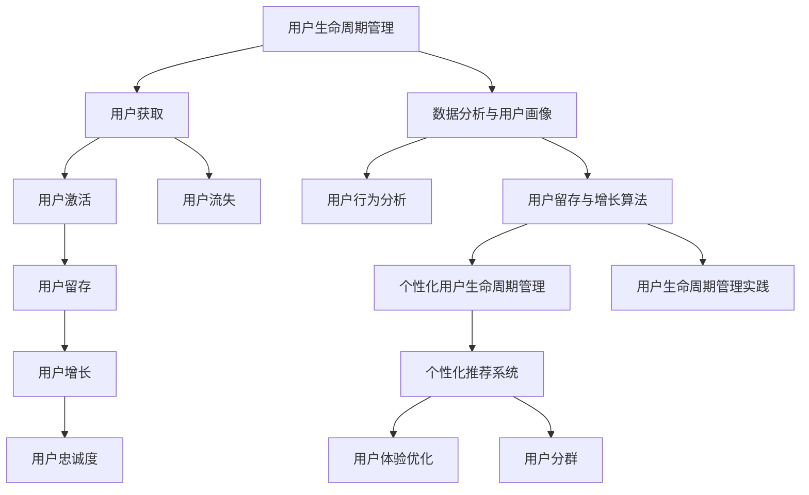

                 

### 《自动化创业中的用户生命周期管理》

#### 关键词
- 用户生命周期管理
- 自动化创业
- 用户获取
- 用户激活
- 用户留存
- 用户增长
- 数据分析
- 个性化推荐

#### 摘要
本文将探讨自动化创业中的用户生命周期管理，从基础理论到前沿实践，全面分析用户获取、激活、留存和增长等核心环节。通过深入的算法原理讲解和实际项目案例分析，本文旨在为创业者提供实用的策略和工具，以优化用户生命周期管理，提高业务成功率。

### 第一部分：用户生命周期管理基础

#### 第1章：用户生命周期管理概述

**1.1 用户生命周期的概念与重要性**

用户生命周期是指用户从一个未知个体，经过注册、使用、忠诚，直到最终流失的整个过程。用户生命周期管理（Customer Lifecycle Management, CLM）是对用户在整个生命周期中的行为和反应进行有效跟踪、分析和优化的过程。

用户生命周期管理的重要性体现在以下几个方面：

1. **提升用户价值**：通过深入了解用户行为，企业可以更好地满足用户需求，提高用户满意度和忠诚度。
2. **降低运营成本**：通过对用户行为的预测和分析，企业可以更有效地进行资源分配和市场营销。
3. **提高营销效果**：精准的用户画像和个性化推荐能够提高营销活动的点击率和转化率。

**1.2 用户生命周期管理的目标与挑战**

用户生命周期管理的目标包括：

1. **用户获取**：吸引新用户，增加用户基数。
2. **用户激活**：引导新用户完成首次使用，提高活跃度。
3. **用户留存**：通过持续优化用户体验，保持用户活跃。
4. **用户增长**：提升用户的活跃度和消费能力，实现用户价值的最大化。
5. **用户忠诚度**：建立长期稳定的用户关系，提高用户回购率。

用户生命周期管理面临的挑战有：

1. **数据复杂性**：用户数据来源多样，数据量大，处理和分析难度高。
2. **技术要求**：需要使用高级的数据分析和机器学习技术来构建和优化用户模型。
3. **隐私保护**：用户隐私保护法律法规日益严格，需要在用户数据收集和使用过程中确保合规。

**1.3 用户生命周期管理的核心环节**

用户生命周期管理包括以下几个核心环节：

1. **用户获取**：通过各种渠道吸引新用户。
2. **用户激活**：引导新用户完成首次使用，提高激活率。
3. **用户留存**：通过持续优化用户体验，提高用户留存率。
4. **用户增长**：通过个性化推荐和服务，提升用户活跃度和消费能力。
5. **用户忠诚度**：建立长期稳定的用户关系，提高用户回购率。

#### 第2章：用户获取与激活

**2.1 用户获取策略**

用户获取策略是企业增长的重要环节，主要包括以下几种方法：

1. **传统用户获取渠道**：
   - **广告**：通过传统广告渠道如电视、广播、报纸等吸引新用户。
   - **口碑营销**：通过用户的推荐和口碑传播吸引新用户。
   - **线下活动**：举办线下活动如展览、讲座、发布会等吸引新用户。

2. **现代用户获取渠道**：
   - **社交媒体**：通过微博、微信、Facebook、Instagram等社交媒体平台进行用户获取。
   - **内容营销**：通过博客、视频、电子书等高质量内容吸引用户。
   - **搜索引擎优化（SEO）和搜索引擎营销（SEM）**：通过优化网站内容和广告投放，提高在搜索引擎中的排名和曝光度。

**2.2 用户激活策略**

用户激活是指引导新用户完成首次使用，从而提高用户活跃度的过程。以下是一些用户激活策略：

1. **用户体验设计**：设计易于使用、直观的界面，减少用户的学习成本。
2. **激励机制**：通过奖励机制如积分、优惠券等激励用户进行首次使用。
3. **引导流程**：设置引导流程，帮助用户了解产品的主要功能和优势。
4. **用户教育**：提供教程、指南等帮助用户快速上手产品。

**2.2.1 激活策略的设计原则**

设计有效的激活策略应遵循以下原则：

1. **用户体验优先**：以用户为中心，关注用户体验，确保产品易用性和友好性。
2. **目标明确**：明确激活的目标，如完成注册、首次购买等。
3. **数据驱动**：根据用户数据和反馈，不断优化激活策略。

**2.2.2 激活策略的执行与评估**

激活策略的执行包括以下几个方面：

1. **上线准备**：准备好所需的资源和工具，如网站、APP、营销素材等。
2. **活动推广**：通过各种渠道推广激活活动，如社交媒体、邮件、短信等。
3. **数据分析**：跟踪激活活动的效果，通过数据分析优化策略。

评估激活策略的效果主要关注以下几个指标：

1. **激活率**：新用户完成首次使用的比例。
2. **转化率**：激活用户转化为付费用户或活跃用户的比例。
3. **用户留存率**：激活后的一段时间内，用户继续使用的比例。

#### 第3章：用户留存与增长

**3.1 用户留存策略**

用户留存是指用户在一段时间内持续使用产品的行为。以下是一些用户留存策略：

1. **产品优化**：持续改进产品，提升用户体验，减少用户流失。
2. **个性化推荐**：根据用户行为和偏好提供个性化内容，增加用户黏性。
3. **用户社区**：建立用户社区，促进用户互动，增强用户归属感。
4. **优惠活动**：通过优惠券、折扣等优惠活动吸引用户留存。

**3.2 用户增长策略**

用户增长是指通过提高用户活跃度和消费能力，实现用户规模的扩大。以下是一些用户增长策略：

1. **内容营销**：通过高质量的内容吸引用户，提高用户活跃度。
2. **社交媒体合作**：与社交媒体平台合作，扩大品牌影响力。
3. **营销活动**：定期举办营销活动，提高用户参与度。
4. **跨界合作**：与其他品牌或公司进行合作，共同推广产品。

**3.3 用户留存与增长策略的执行与评估**

执行用户留存与增长策略需要以下几个步骤：

1. **目标设定**：明确留存的增长目标，如提高留存率5%。
2. **策略制定**：根据目标，制定具体的留存与增长策略。
3. **执行落实**：按照策略执行计划，实施具体行动。
4. **数据分析**：跟踪策略执行效果，通过数据分析评估策略效果。

评估用户留存与增长策略主要关注以下指标：

1. **留存率**：用户在一定时间内继续使用的比例。
2. **活跃度**：用户在产品上的活动频率和深度。
3. **转化率**：用户完成特定目标（如注册、购买）的比例。

### 第二部分：用户生命周期管理技术

#### 第4章：数据分析与用户画像

**4.1 数据分析基础**

数据分析是指从大量数据中提取有价值信息的过程，包括以下步骤：

1. **数据收集**：收集用户行为数据、市场数据、财务数据等。
2. **数据处理**：清洗、整合、转换数据，使其适合分析。
3. **数据存储**：使用数据仓库或数据湖存储和管理数据。
4. **数据分析**：使用统计方法、机器学习和深度学习方法分析数据，提取洞察。

**4.2 用户画像构建**

用户画像是指基于用户数据构建的用户描述，包括用户的基本信息、行为特征、偏好等。用户画像的构建方法包括：

1. **用户标签**：通过用户行为数据为用户打上各种标签，如年龄、性别、兴趣爱好等。
2. **数据挖掘**：使用机器学习算法从大量数据中挖掘用户行为模式和偏好。
3. **用户分群**：将用户分为不同的群体，如高价值用户、潜在流失用户等。

用户画像的应用场景包括：

1. **个性化推荐**：根据用户画像为用户推荐感兴趣的内容或产品。
2. **用户行为预测**：预测用户未来的行为和需求，提前进行营销和干预。
3. **市场分析**：分析用户行为和市场趋势，为产品策略提供数据支持。

#### 第5章：用户行为分析

**5.1 用户行为分析概述**

用户行为分析是指通过数据技术对用户在产品中的行为进行跟踪、分析和解读，以优化用户体验和产品性能。用户行为分析的重要性体现在以下几个方面：

1. **提升用户体验**：通过分析用户行为，了解用户需求和痛点，优化产品设计和功能。
2. **提高运营效率**：通过分析用户行为，识别关键路径和瓶颈，提高运营效率。
3. **精准营销**：通过分析用户行为，实现精准定位和个性化推荐，提高营销效果。

**5.2 用户行为分析方法**

用户行为分析方法主要包括以下几种：

1. **基于统计的方法**：通过统计分析用户行为数据，提取用户行为模式和趋势。
2. **基于机器学习的方法**：使用机器学习算法，如分类、聚类、回归等，分析用户行为数据。
3. **基于深度学习的方法**：使用深度学习模型，如神经网络、循环神经网络等，分析用户行为数据。

**5.3 用户行为分析工具**

常见的用户行为分析工具有：

1. **Google Analytics**：提供全面的网站和移动应用分析功能。
2. **Mixpanel**：专注于用户行为分析，提供实时分析和用户分群功能。
3. **Heap**：自动跟踪用户行为，无需代码集成。

#### 第6章：用户留存与增长算法

**6.1 留存算法**

用户留存算法旨在预测用户是否会在未来某个时间点继续使用产品。常见的留存算法包括：

1. **分类算法**：如逻辑回归、决策树、随机森林等，用于预测用户留存概率。
2. **聚类算法**：如K-Means、DBSCAN等，用于识别具有相似行为的用户群体。
3. **时序分析算法**：如ARIMA、LSTM等，用于分析用户行为的时间序列特性。

**6.2 增长算法**

用户增长算法旨在识别和吸引高潜力用户，提高用户规模和活跃度。常见的增长算法包括：

1. **推荐算法**：如协同过滤、基于内容的推荐等，用于为用户推荐感兴趣的内容或产品。
2. **A/B测试**：通过对比不同版本的产品或策略，优化用户体验和转化率。
3. **增长黑客**：结合数据分析和市场营销策略，快速实现用户增长。

#### 第7章：用户生命周期管理实践

**7.1 用户获取与激活实践**

**7.1.1 用户获取案例分析**

**案例1：社交媒体营销**

- **背景**：一家初创公司通过社交媒体平台吸引用户。
- **策略**：发布高质量内容，与用户互动，通过社交媒体广告扩大影响力。
- **效果**：用户数量迅速增加，但激活率较低。

**案例2：内容营销**

- **背景**：一家在线教育平台通过内容营销吸引新用户。
- **策略**：发布高质量教程、课程评价等，吸引用户关注和注册。
- **效果**：注册用户数量稳定增长，激活率较高。

**7.1.2 用户激活案例分析**

**案例1：用户体验设计**

- **背景**：一家电商网站优化用户体验，提高新用户激活率。
- **策略**：简化注册流程，提供清晰的产品介绍和购物流程。
- **效果**：激活率显著提升。

**案例2：激励机制**

- **背景**：一家游戏公司通过激励机制提高新用户激活率。
- **策略**：为新用户提供免费的游戏币、道具等奖励。
- **效果**：激活率提高，用户活跃度增加。

**7.2 用户留存与增长实践**

**7.2.1 用户留存实践**

**案例1：个性化推荐**

- **背景**：一家视频平台通过个性化推荐提高用户留存率。
- **策略**：根据用户观看历史和偏好，推荐相关视频。
- **效果**：用户观看时长增加，留存率提升。

**案例2：用户社区**

- **背景**：一家科技论坛通过建立用户社区提高用户留存率。
- **策略**：提供论坛、问答平台，鼓励用户互动和分享。
- **效果**：用户活跃度提高，留存率显著提升。

**7.2.2 用户增长实践**

**案例1：营销活动**

- **背景**：一家电商网站通过营销活动提高用户增长。
- **策略**：举办限时促销、优惠券活动，吸引新用户。
- **效果**：新用户数量增加，用户活跃度提高。

**案例2：社交媒体合作**

- **背景**：一家社交媒体平台通过与其他品牌合作，提高用户增长。
- **策略**：与其他品牌共同推出营销活动，扩大影响力。
- **效果**：用户增长速度加快，品牌知名度提高。

### 第三部分：用户生命周期管理前沿

#### 第8章：个性化用户生命周期管理

**8.1 个性化用户生命周期管理概述**

个性化用户生命周期管理是一种基于用户数据和行为分析的策略，旨在为用户提供个性化的体验和推荐，从而提高用户满意度和忠诚度。个性化用户生命周期管理包括以下核心要素：

1. **用户数据收集**：通过多种渠道收集用户数据，包括行为数据、社交数据、偏好数据等。
2. **数据分析和挖掘**：使用机器学习和深度学习技术，对用户数据进行分析和挖掘，构建用户画像。
3. **个性化推荐**：根据用户画像和实时行为，为用户提供个性化的内容、产品和服务。
4. **用户体验优化**：通过个性化服务和优化，提高用户体验和满意度。

**8.2 个性化用户生命周期管理的方法与技术**

个性化用户生命周期管理的方法和技术包括：

1. **协同过滤**：基于用户行为数据，通过计算用户之间的相似度，为用户推荐感兴趣的内容或产品。
2. **基于内容的推荐**：根据用户的历史行为和偏好，为用户推荐相似的内容或产品。
3. **深度学习**：使用深度学习模型，如神经网络、循环神经网络等，对用户数据进行建模和分析，提高推荐精度。
4. **用户分群**：根据用户的行为特征和偏好，将用户分为不同的群体，为每个群体提供个性化的服务和推荐。

**8.3 个性化用户生命周期管理的挑战与展望**

个性化用户生命周期管理面临的挑战包括：

1. **数据质量和隐私**：用户数据的质量和隐私保护是个性化用户生命周期管理的重要挑战。
2. **计算资源**：个性化推荐需要大量的计算资源，尤其是在用户规模较大的情况下。
3. **算法可解释性**：深度学习等算法的内部机制复杂，如何解释算法的决策过程是一个挑战。

展望未来，个性化用户生命周期管理的发展方向包括：

1. **更加智能的推荐系统**：结合人工智能和大数据技术，提高推荐系统的智能化水平。
2. **跨平台个性化**：实现不同平台之间的用户数据共享和个性化推荐。
3. **用户隐私保护**：在数据收集和使用过程中，采用更加严格的数据保护措施，确保用户隐私。

#### 第9章：用户生命周期管理中的伦理与隐私问题

**9.1 用户隐私保护的重要性**

用户隐私保护是用户生命周期管理中的一个重要问题。随着大数据和人工智能技术的应用，用户数据的价值日益凸显，但同时也带来了用户隐私泄露的风险。用户隐私保护的重要性体现在以下几个方面：

1. **法律合规**：许多国家和地区都制定了相关法律法规，要求企业在处理用户数据时确保隐私保护。
2. **用户信任**：用户对企业的信任建立在隐私保护的基础上。如果用户隐私得不到保护，用户可能会选择离开，甚至产生负面影响。
3. **社会责任**：企业有责任保护用户的隐私，这是企业社会责任的一部分。

**9.2 用户隐私保护的方法与策略**

用户隐私保护的方法和策略包括：

1. **数据加密**：对用户数据进行加密处理，防止未授权访问。
2. **访问控制**：限制用户数据的访问权限，只有授权人员才能访问。
3. **匿名化处理**：对用户数据进行匿名化处理，去除可直接识别用户身份的信息。
4. **隐私政策**：明确告知用户企业如何收集、使用和共享用户数据，确保用户知情并同意。

**9.3 用户生命周期管理中的伦理问题**

用户生命周期管理中的伦理问题包括：

1. **数据滥用**：企业如何确保不滥用用户数据，用于非法或不当目的。
2. **算法偏见**：个性化推荐和决策算法是否公平、无偏见，是否会导致某些用户群体受到歧视。
3. **用户自由**：用户是否能够自由选择是否参与用户生命周期管理，以及如何退出。

为了解决这些伦理问题，企业可以采取以下措施：

1. **伦理审查**：在开发用户生命周期管理系统时，进行伦理审查，确保系统的设计和操作符合伦理标准。
2. **透明度**：提高用户对用户生命周期管理系统的透明度，让用户了解系统的工作原理和数据处理方式。
3. **用户参与**：鼓励用户参与用户生命周期管理的决策过程，确保用户的声音被听到。

#### 第10章：未来用户生命周期管理的趋势与展望

**10.1 用户生命周期管理的未来趋势**

未来用户生命周期管理将呈现以下几个趋势：

1. **数据驱动的决策**：企业将更加依赖用户数据进行分析和预测，以优化用户体验和业务策略。
2. **智能化与自动化**：人工智能和机器学习技术将广泛应用于用户生命周期管理，实现更智能、更自动化的用户服务。
3. **跨渠道整合**：企业将整合多个渠道的用户数据，实现跨平台的个性化体验。
4. **隐私保护强化**：随着法律法规的完善，企业将采取更严格的隐私保护措施，确保用户隐私。

**10.2 用户生命周期管理的发展方向**

用户生命周期管理的发展方向包括：

1. **用户参与**：鼓励用户参与用户生命周期管理的各个环节，提高用户满意度和忠诚度。
2. **用户教育**：通过用户教育，提高用户对产品的理解和认可，促进用户行为改变。
3. **可持续发展**：通过用户生命周期管理，实现可持续发展，提高企业的社会价值。

**10.3 用户生命周期管理在自动化创业中的应用前景**

在自动化创业中，用户生命周期管理具有广泛的应用前景：

1. **个性化推荐**：通过个性化推荐，提高用户满意度和转化率。
2. **智能客服**：利用人工智能技术，提供高效、个性化的客服服务。
3. **自动化营销**：通过自动化营销，实现精准、高效的营销活动。
4. **用户体验优化**：通过持续优化用户体验，提高用户留存率和用户忠诚度。

#### 附录

**附录A：用户生命周期管理相关书籍与论文**

1. 《用户行为分析：大数据时代的用户洞察》
2. 《深度学习推荐系统》
3. 《大数据营销：利用数据创造价值》
4. 《用户画像技术》

**附录B：用户生命周期管理常用工具与平台**

1. Google Analytics
2. Mixpanel
3. Heap
4. Segment
5. UserInsights

**附录C：用户生命周期管理相关网站与社区**

1. AnalyticsAdvisor
2. DataCamp
3. Coursera
4. Kaggle
5. Stack Overflow

**附录D：用户生命周期管理专业术语解释与缩写对照表**

- 用户生命周期（Customer Lifecycle）
- 用户获取（User Acquisition）
- 用户激活（User Activation）
- 用户留存（User Retention）
- 用户增长（User Growth）
- 用户忠诚度（User Loyalty）
- 数据分析（Data Analysis）
- 用户画像（User Profile）
- 个性化推荐（Personalized Recommendation）
- 留存预测（Churn Prediction）
- 深度学习（Deep Learning）
- 机器学习（Machine Learning）
- 协同过滤（Collaborative Filtering）
- 基于内容的推荐（Content-Based Recommendation）
- 用户行为分析（User Behavior Analysis）
- 数据仓库（Data Warehouse）
- 数据湖（Data Lake）
- 访问控制（Access Control）
- 隐私政策（Privacy Policy）

### 结束语

用户生命周期管理是自动化创业中不可或缺的一环。通过深入理解用户生命周期管理的基础理论、技术方法和前沿实践，创业者可以更好地把握用户需求，优化用户体验，提高业务成功率。本文旨在为创业者提供全面、实用的指导，助力自动化创业的成功。作者：AI天才研究院/AI Genius Institute & 禅与计算机程序设计艺术 /Zen And The Art of Computer Programming

----------------------------------------------------------------

### 核心概念与联系

**Mermaid 流程图**



### 核心算法原理讲解

**用户留存预测算法**

```python
# 伪代码：用户留存预测算法
function predictRetention(user_data):
    # 数据预处理
    processed_data = preprocessData(user_data)
    
    # 特征工程
    features = extractFeatures(processed_data)
    
    # 训练留存预测模型
    model = trainRetentionModel(features)
    
    # 预测用户留存概率
    retention_probabilities = model.predictProbability(features)
    
    return retention_probabilities
```

**数学模型与公式**

$$
P(R) = \frac{1}{1 + e^{-(w \cdot x + b)}}
$$

其中，\( P(R) \) 表示用户留存概率，\( w \) 是权重向量，\( x \) 是用户特征向量，\( b \) 是偏置项。

### 项目实战

**开发环境搭建**

- **Python 3.8**
- **Pandas**
- **Scikit-learn**
- **Matplotlib**

**源代码实现**

```python
import pandas as pd
from sklearn.model_selection import train_test_split
from sklearn.ensemble import RandomForestClassifier
from sklearn.metrics import accuracy_score

# 数据加载
data = pd.read_csv('user_data.csv')

# 数据预处理
processed_data = preprocessData(data)

# 特征工程
features = extractFeatures(processed_data)

# 分割数据集
X_train, X_test, y_train, y_test = train_test_split(features, processed_data['target'], test_size=0.2, random_state=42)

# 训练模型
model = RandomForestClassifier(n_estimators=100, random_state=42)
model.fit(X_train, y_train)

# 预测
predictions = model.predict(X_test)

# 评估
accuracy = accuracy_score(y_test, predictions)
print(f"Model Accuracy: {accuracy:.2f}")
```

**代码解读与分析**

- **数据预处理**：处理缺失值、异常值，进行数据清洗。
- **特征工程**：提取有助于预测用户是否留存的特征。
- **模型训练**：使用随机森林分类器训练模型。
- **预测与评估**：使用测试集预测用户留存，并评估模型准确性。

通过上述步骤，我们可以构建一个用户留存预测模型，帮助企业更好地理解和预测用户行为，从而优化业务策略。

