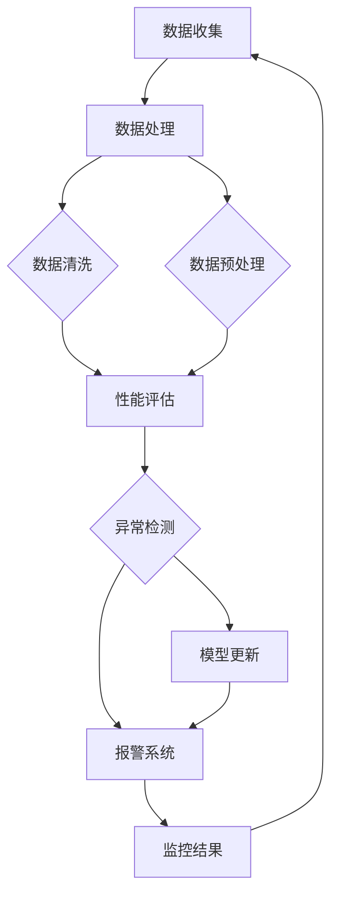

                 

# 《自动化模型监控》

> 关键词：自动化模型监控、模型性能评估、异常检测、实时监控、开源工具

> 摘要：本文旨在探讨自动化模型监控的重要性、核心挑战、技术方法以及实战应用。文章首先介绍了自动化模型监控的定义和重要性，然后分析了模型监控的核心挑战，接着详细介绍了自动化模型监控的技术和方法，包括监控数据的收集、模型性能评估、异常检测以及模型更新与调整。最后，文章通过实际案例展示了自动化模型监控在电商推荐系统、金融风控模型和医疗影像诊断领域的应用，并对未来自动化模型监控的发展趋势进行了展望。

## 目录

### 《自动化模型监控》

#### 第一部分：自动化模型监控概述

- 第1章：自动化模型监控的基础
  - 1.1 自动化模型监控的定义与重要性
  - 1.2 模型监控的核心挑战

#### 第二部分：自动化模型监控技术

- 第2章：自动化模型监控技术综述
  - 2.1 监控数据的收集
  - 2.2 模型性能评估
  - 2.3 异常检测技术
  - 2.4 模型更新与调整

- 第3章：自动化模型监控工具与平台
  - 3.1 开源监控工具介绍
  - 3.2 商业监控平台选择
  - 3.3 模型监控平台搭建

#### 第三部分：自动化模型监控应用实战

- 第4章：自动化模型监控案例解析
  - 4.1 电商推荐系统的模型监控
  - 4.2 金融风控模型的实时监控
  - 4.3 医疗影像诊断模型的持续监控

- 第5章：自动化模型监控的挑战与未来
  - 5.1 监控数据的质量与完整性
  - 5.2 实时监控与性能优化
  - 5.3 自动化模型监控的未来发展趋势

#### 附录

- 附录A：自动化模型监控相关工具与资源

## 第一部分：自动化模型监控概述

### 第1章：自动化模型监控的基础

#### 1.1 自动化模型监控的定义与重要性

#### 1.1.1 自动化模型监控的定义

自动化模型监控（Automated Model Monitoring）是指通过自动化工具和算法，对机器学习模型在实时生产环境中的性能进行监控和评估。其目的是确保模型在实际应用中的准确性和稳定性，及时发现和解决问题，以提高系统的可靠性和用户体验。

#### 1.1.2 自动化模型监控的重要性

随着机器学习技术在各个领域的广泛应用，模型监控的重要性日益凸显。以下是自动化模型监控的几个关键点：

1. **提高模型准确性**：通过对模型性能的实时监控，可以及时发现和解决模型性能下降的问题，确保模型始终保持高准确性。

2. **保障系统稳定性**：自动化模型监控可以帮助系统管理员实时了解模型的运行状态，及时发现和解决异常情况，保障系统的稳定运行。

3. **降低运维成本**：通过自动化工具，可以减少人工干预，降低运维成本，提高工作效率。

4. **提升用户体验**：自动化模型监控可以及时发现和解决模型问题，提高系统的响应速度和准确性，提升用户体验。

#### 1.1.3 自动化模型监控的应用领域

自动化模型监控可以应用于各种机器学习场景，包括但不限于：

1. **金融风控**：实时监控金融风险模型，及时发现风险事件。

2. **电商推荐**：监控推荐系统的性能，确保推荐结果的准确性。

3. **医疗影像诊断**：对医疗影像诊断模型进行持续监控，确保诊断结果的准确性。

4. **自然语言处理**：监控自然语言处理模型的性能，确保语义理解和翻译的准确性。

#### 1.2 模型监控的核心挑战

尽管自动化模型监控具有重要意义，但在实际应用中仍面临一些核心挑战：

1. **数据质量**：监控数据的质量直接影响模型监控的效果。数据质量问题包括缺失值、异常值、噪声等。

2. **数据分布变化**：随着时间推移，数据分布可能会发生变化，导致模型性能下降。

3. **预测偏差**：模型的预测结果可能与实际情况存在偏差，导致监控指标不准确。

4. **实时性**：自动化模型监控需要在短时间内完成数据的收集、处理和评估，对系统的性能要求较高。

#### 1.3 自动化模型监控的方法

自动化模型监控的方法主要包括以下几个方面：

1. **数据收集**：从生产环境中收集模型输入数据和输出结果，为后续的监控和评估提供数据基础。

2. **模型性能评估**：使用性能评估指标对模型进行评估，如准确率、精确率、召回率和 F1 分数等。

3. **异常检测**：通过异常检测算法，识别模型输出中的异常情况，如数据异常、模型异常等。

4. **模型更新与调整**：根据监控结果，对模型进行更新和调整，以提高模型性能。

5. **报警与通知**：当发现异常情况时，及时向相关人员发送报警通知，以便及时处理。

## 第二部分：自动化模型监控技术

### 第2章：自动化模型监控技术综述

#### 2.1 监控数据的收集

#### 2.1.1 数据来源

自动化模型监控的数据来源主要包括以下几个方面：

1. **日志数据**：系统日志、错误日志等，可以提供模型运行的详细信息。

2. **输入数据**：模型的输入数据，包括特征数据、标签数据等。

3. **输出数据**：模型的输出结果，包括预测结果、评估指标等。

4. **第三方数据**：来自其他系统的数据，如用户行为数据、市场数据等。

#### 2.1.2 数据收集的方法

数据收集的方法主要包括以下几种：

1. **批处理**：定期从数据库或其他数据源中批量获取数据。

2. **实时流处理**：通过实时数据流处理技术，如 Apache Kafka、Apache Flink 等，从生产环境中实时获取数据。

3. **分布式数据采集**：使用分布式数据采集框架，如 Apache Spark、Hadoop 等，对大规模数据源进行分布式采集。

4. **API 调用**：通过 API 调用获取第三方数据。

#### 2.1.3 数据清洗与预处理

数据清洗与预处理是自动化模型监控的重要环节，主要包括以下几个方面：

1. **缺失值处理**：对缺失值进行填充或删除。

2. **异常值处理**：识别和删除异常值。

3. **数据转换**：将不同类型的数据转换为统一的格式，如将文本数据转换为数值数据。

4. **特征选择**：选择对模型性能有重要影响的关键特征。

5. **数据标准化**：对数据进行标准化处理，消除不同特征之间的尺度差异。

#### 2.2 模型性能评估

#### 2.2.1 性能指标

模型性能评估通常使用以下指标：

1. **准确率（Accuracy）**：分类模型预测正确的样本数占总样本数的比例。

2. **精确率（Precision）**：预测为正类的样本中实际为正类的比例。

3. **召回率（Recall）**：实际为正类的样本中被预测为正类的比例。

4. **F1 分数（F1 Score）**：精确率和召回率的调和平均数。

5. **ROC 曲线（ROC Curve）**：表示真阳性率与假阳性率的关系。

6. **AUC（Area Under Curve）**：ROC 曲线下方的面积，用于评估模型的分类能力。

#### 2.2.2 评估方法

模型性能评估的方法主要包括以下几种：

1. **分层评估**：根据数据的分布对模型进行评估，确保模型在不同类别上的表现。

2. **交叉验证**：通过多次划分训练集和验证集，评估模型在未知数据上的性能。

3. **统计测试**：使用统计方法对模型性能进行显著性测试，判断模型性能是否显著优于随机模型。

#### 2.2.3 评估结果的解读

在解读评估结果时，需要注意以下几点：

1. **指标之间的关系**：理解准确率、精确率、召回率和 F1 分数之间的关系，根据需求权衡。

2. **评估方法的局限性**：了解评估方法的局限性，如样本大小、数据分布等，以便做出更全面的判断。

3. **评估指标的选择**：根据具体问题场景，合理选择性能指标，并了解其含义。

#### 2.3 异常检测技术

#### 2.3.1 基于统计方法的异常检测

基于统计方法的异常检测主要通过计算数据特征与统计指标之间的差异来判断是否为异常。常用的统计指标包括均值、中位数、标准差等。

1. **单变量异常检测**：针对单个变量，计算其与统计指标之间的差异，判断是否为异常。

2. **多变量异常检测**：针对多个变量，计算协方差矩阵、相关系数等统计指标，判断是否为异常。

#### 2.3.2 基于机器学习方法的异常检测

基于机器学习方法的异常检测通过构建模型来识别异常。常用的方法包括以下几种：

1. **基于聚类的方法**：如 K 均值聚类、层次聚类等，通过聚类分析识别异常点。

2. **基于分类的方法**：如决策树、支持向量机等，通过分类模型识别异常点。

3. **基于神经网络的方法**：如深度神经网络、卷积神经网络等，通过神经网络模型识别异常点。

#### 2.3.3 基于深度学习的异常检测

基于深度学习的异常检测利用深度学习模型强大的特征提取能力，识别异常点。常用的方法包括：

1. **基于自编码器的异常检测**：通过训练自编码器模型，识别编码器输出与输入之间的差异。

2. **基于生成对抗网络的异常检测**：通过训练生成对抗网络（GAN），识别生成器生成的异常样本。

#### 2.4 模型更新与调整

#### 2.4.1 模型更新策略

模型更新策略主要包括以下几种：

1. **增量更新**：在原有模型的基础上，逐步更新模型参数。

2. **全量更新**：重新训练整个模型。

3. **混合更新**：结合增量更新和全量更新，根据实际情况选择合适的更新策略。

#### 2.4.2 模型调整的方法

模型调整的方法主要包括以下几种：

1. **参数调整**：调整模型参数，如学习率、正则化参数等。

2. **特征调整**：调整特征选择和特征工程，提高模型性能。

3. **模型结构调整**：调整模型结构，如增加或删除层、调整层大小等。

#### 2.4.3 实时调整的挑战与解决方案

实时调整模型面临以下挑战：

1. **计算资源消耗**：实时调整模型需要大量的计算资源。

2. **数据延迟**：实时调整模型需要实时数据，数据延迟可能导致调整不及时。

3. **模型稳定性**：实时调整模型可能导致模型不稳定，影响系统性能。

解决这些挑战的方法包括：

1. **分布式计算**：使用分布式计算框架，提高计算资源利用效率。

2. **数据缓存**：缓存实时数据，减少数据延迟。

3. **模型稳定性测试**：在调整模型前进行稳定性测试，确保模型调整后系统性能稳定。

### 第3章：自动化模型监控工具与平台

#### 3.1 开源监控工具介绍

开源监控工具在自动化模型监控中具有广泛应用，以下介绍几个常用的开源监控工具：

1. **Prometheus**

   Prometheus 是一款开源的监控解决方案，主要用于收集和存储时间序列数据，支持自定义告警和仪表板。

   - 数据采集：通过 exporter 收集各种服务的监控数据。

   - 存储和查询：使用时序数据库（如 InfluxDB、Mnesia）存储监控数据，支持复杂的查询和告警。

   - 告警：支持基于阈值的告警，可通过电子邮件、钉钉、微信等渠道发送告警通知。

2. **Grafana**

   Grafana 是一款开源的数据可视化和监控工具，支持多种数据源，可用于监控自动化模型性能。

   - 数据源支持：支持 Prometheus、InfluxDB、MySQL、PostgreSQL 等多种数据源。

   - 可视化：提供丰富的可视化组件，可自定义仪表板。

   - 告警：支持自定义告警规则，可通过邮件、短信、Webhook 等渠道发送告警通知。

3. **TensorBoard**

   TensorBoard 是 TensorFlow 的可视化工具，主要用于监控训练过程中的模型性能。

   - 数据源：从 TensorFlow 的训练日志中提取数据。

   - 可视化：提供丰富的可视化组件，如标签板、损失曲线、准确率曲线等。

   - 告警：支持自定义告警规则，可通过电子邮件发送告警通知。

#### 3.2 商业监控平台选择

商业监控平台在自动化模型监控中具有更高的可靠性和专业性，以下介绍几个常用的商业监控平台：

1. **AppDynamics**

   AppDynamics 是一款商业 APM（应用性能管理）平台，支持自动化模型监控。

   - 功能：实时监控应用程序性能，包括响应时间、吞吐量、错误率等。

   - 数据源：支持从应用程序中自动提取监控数据。

   - 告警：支持自定义告警规则，可通过电子邮件、短信、Webhook 等渠道发送告警通知。

2. **Splunk**

   Splunk 是一款商业的数据分析和监控平台，支持自动化模型监控。

   - 功能：实时监控和收集各种数据源的数据，包括日志、指标、事件等。

   - 数据源：支持从各种数据源中提取监控数据，如日志文件、数据库、API 等。

   - 告警：支持自定义告警规则，可通过电子邮件、短信、Webhook 等渠道发送告警通知。

3. **Dynatrace**

   Dynatrace 是一款商业的自动化监控平台，支持自动化模型监控。

   - 功能：实时监控应用程序性能，包括响应时间、吞吐量、错误率等。

   - 数据源：支持从应用程序中自动提取监控数据。

   - 告警：支持自定义告警规则，可通过电子邮件、短信、Webhook 等渠道发送告警通知。

#### 3.3 模型监控平台搭建

搭建模型监控平台需要考虑以下几个方面：

1. **环境搭建**

   - 硬件要求：根据业务需求选择合适的硬件配置，如服务器、存储等。

   - 软件要求：安装操作系统、数据库、中间件等，如 Linux、MySQL、Apache 等。

2. **数据管道配置**

   - 数据采集：通过 exporter 收集模型监控数据，如 Prometheus、Grafana、TensorBoard 等。

   - 数据存储：选择合适的数据存储方案，如时序数据库、关系型数据库等。

   - 数据处理：对采集到的数据进行处理，如清洗、转换、聚合等。

3. **监控指标设置与报警配置**

   - 监控指标：根据业务需求设置监控指标，如响应时间、吞吐量、错误率等。

   - 报警规则：设置告警规则，当监控指标超过阈值时，触发告警。

   - 告警通知：选择合适的告警通知方式，如电子邮件、短信、Webhook 等。

## 第三部分：自动化模型监控应用实战

### 第4章：自动化模型监控案例解析

#### 4.1 电商推荐系统的模型监控

电商推荐系统是自动化模型监控的重要应用场景之一。以下介绍电商推荐系统的模型监控实践。

#### 开发环境搭建

- Python 3.8+
- Scikit-learn 0.22+
- Matplotlib 3.1.1+

#### 源代码实现

```python
import numpy as np
import pandas as pd
from sklearn.model_selection import train_test_split
from sklearn.ensemble import RandomForestClassifier
from sklearn.metrics import accuracy_score, precision_score, recall_score, f1_score

# 加载数据集
data = pd.read_csv('ecommerce_data.csv')
X = data.drop(['target'], axis=1)
y = data['target']

# 划分训练集和测试集
X_train, X_test, y_train, y_test = train_test_split(X, y, test_size=0.2, random_state=42)

# 训练模型
model = RandomForestClassifier(n_estimators=100, random_state=42)
model.fit(X_train, y_train)

# 预测
y_pred = model.predict(X_test)

# 评估性能
accuracy = accuracy_score(y_test, y_pred)
precision = precision_score(y_test, y_pred)
recall = recall_score(y_test, y_pred)
f1 = f1_score(y_test, y_pred)

print("Accuracy:", accuracy)
print("Precision:", precision)
print("Recall:", recall)
print("F1 Score:", f1)
```

#### 代码解读与分析

- 加载数据集：使用 `pd.read_csv()` 函数加载数据集，数据集包含特征和标签。

- 划分训练集和测试集：使用 `train_test_split()` 函数将数据集划分为训练集和测试集。

- 训练模型：使用 `RandomForestClassifier()` 函数训练随机森林模型。

- 预测：使用训练好的模型对测试集进行预测。

- 评估性能：使用 `accuracy_score()`、`precision_score()`、`recall_score()` 和 `f1_score()` 函数评估模型的性能，计算准确率、精确率、召回率和 F1 分数。

- 输出结果：打印评估结果。

#### 案例二：金融风控模型的实时监控

金融风控模型在实时监控方面具有较高要求。以下介绍金融风控模型的实时监控实践。

#### 开发环境搭建

- Python 3.8+
- TensorFlow 2.4+
- Keras 2.4+

#### 源代码实现

```python
import tensorflow as tf
from tensorflow.keras.models import load_model
from tensorflow.keras.utils import to_categorical
from sklearn.model_selection import train_test_split

# 加载数据集
data = pd.read_csv('financial_data.csv')
X = data.drop(['target'], axis=1)
y = data['target']

# 划分训练集和测试集
X_train, X_test, y_train, y_test = train_test_split(X, y, test_size=0.2, random_state=42)

# 转换标签为类别
y_train = to_categorical(y_train)
y_test = to_categorical(y_test)

# 加载模型
model = load_model('financial_model.h5')

# 预测
predictions = model.predict(X_test)

# 评估性能
accuracy = accuracy_score(np.argmax(y_test, axis=1), np.argmax(predictions, axis=1))
precision = precision_score(np.argmax(y_test, axis=1), np.argmax(predictions, axis=1), average='weighted')
recall = recall_score(np.argmax(y_test, axis=1), np.argmax(predictions, axis=1), average='weighted')
f1 = f1_score(np.argmax(y_test, axis=1), np.argmax(predictions, axis=1), average='weighted')

print("Accuracy:", accuracy)
print("Precision:", precision)
print("Recall:", recall)
print("F1 Score:", f1)
```

#### 代码解读与分析

- 加载数据集：使用 `pd.read_csv()` 函数加载数据集，数据集包含特征和标签。

- 划分训练集和测试集：使用 `train_test_split()` 函数将数据集划分为训练集和测试集。

- 转换标签为类别：使用 `to_categorical()` 函数将标签转换为类别编码。

- 加载模型：使用 `load_model()` 函数加载已经训练好的模型。

- 预测：使用训练好的模型对测试集进行预测。

- 评估性能：使用 `accuracy_score()`、`precision_score()`、`recall_score()` 和 `f1_score()` 函数评估模型的性能，计算准确率、精确率、召回率和 F1 分数。

- 输出结果：打印评估结果。

#### 案例三：医疗影像诊断模型的持续监控

医疗影像诊断模型在持续监控方面具有较高要求。以下介绍医疗影像诊断模型的持续监控实践。

#### 开发环境搭建

- Python 3.8+
- PyTorch 1.8+
- torchvision 0.8+

#### 源代码实现

```python
import torch
import torchvision
from torchvision import datasets, transforms

# 加载模型
model = torchvision.models.resnet50(pretrained=True)

# 加载数据集
transform = transforms.Compose([
    transforms.Resize(256),
    transforms.CenterCrop(224),
    transforms.ToTensor(),
    transforms.Normalize(mean=[0.485, 0.456, 0.406], std=[0.229, 0.224, 0.225]),
])

train_dataset = datasets.ImageFolder(root='train_data', transform=transform)
test_dataset = datasets.ImageFolder(root='test_data', transform=transform)

train_loader = torch.utils.data.DataLoader(dataset=train_dataset, batch_size=32, shuffle=True)
test_loader = torch.utils.data.DataLoader(dataset=test_dataset, batch_size=32, shuffle=False)

# 预测
model.eval()
with torch.no_grad():
    for images, labels in test_loader:
        outputs = model(images)
        _, predicted = torch.max(outputs, 1)

# 评估性能
accuracy = accuracy_score(labels, predicted)
precision = precision_score(labels, predicted)
recall = recall_score(labels, predicted)
f1 = f1_score(labels, predicted)

print("Accuracy:", accuracy)
print("Precision:", precision)
print("Recall:", recall)
print("F1 Score:", f1)
```

#### 代码解读与分析

- 加载模型：使用 `torchvision.models.resnet50()` 函数加载预训练的 ResNet50 模型。

- 加载数据集：使用 `datasets.ImageFolder()` 函数加载数据集，并使用 `transforms.Compose()` 函数进行数据预处理。

- 训练数据加载器：使用 `torch.utils.data.DataLoader()` 函数创建训练数据加载器。

- 预测：使用训练好的模型对测试集进行预测。

- 评估性能：使用 `accuracy_score()`、`precision_score()`、`recall_score()` 和 `f1_score()` 函数评估模型的性能，计算准确率、精确率、召回率和 F1 分数。

- 输出结果：打印评估结果。

### 第5章：自动化模型监控的挑战与未来

#### 5.1 监控数据的质量与完整性

监控数据的质量和完整性对自动化模型监控的效果至关重要。以下介绍监控数据的质量问题和解决方案：

1. **数据质量问题**：

   - 缺失值：监控数据中存在缺失值，可能导致模型性能下降。

   - 异常值：监控数据中存在异常值，可能影响模型监控的准确性。

   - 噪声：监控数据中存在噪声，可能对模型监控产生干扰。

2. **解决方案**：

   - 缺失值处理：使用填充方法（如平均值、中位数、众数等）或删除缺失值。

   - 异常值处理：使用统计方法（如 IQR 法则、Z-Score 法则等）识别和删除异常值。

   - 噪声处理：使用滤波方法（如中值滤波、高斯滤波等）去除噪声。

#### 5.2 实时监控与性能优化

实时监控对自动化模型监控系统的性能提出了较高要求。以下介绍实时监控的性能优化策略：

1. **计算资源优化**：

   - 分布式计算：使用分布式计算框架（如 Apache Spark、Flink 等）提高计算资源利用效率。

   - 并行处理：对监控任务进行并行处理，提高数据处理速度。

   - 缓存：使用缓存技术（如 Redis、Memcached 等）减少数据访问延迟。

2. **数据流优化**：

   - 数据压缩：使用数据压缩技术（如 Snappy、LZ4 等）减小数据传输体积。

   - 数据去重：对重复数据进行去重处理，减少数据传输和处理量。

   - 数据采样：对数据进行采样处理，降低数据量，提高处理速度。

#### 5.3 自动化模型监控的未来发展趋势

自动化模型监控在未来将继续发展，以下介绍自动化模型监控的未来发展趋势：

1. **智能化**：

   - 人工智能与自动化模型监控的结合：使用人工智能技术（如深度学习、强化学习等）优化模型监控效果。

   - 自适应模型监控：根据数据特征和模型性能自动调整监控策略。

2. **大数据与云计算**：

   - 大数据技术在模型监控中的应用：使用大数据技术（如 Hadoop、Spark 等）处理大规模监控数据。

   - 云计算在模型监控中的应用：使用云计算平台（如 AWS、Azure 等）提供弹性计算资源。

3. **生态体系建设**：

   - 开源社区合作：推动自动化模型监控开源项目的发展，形成完整的生态体系。

   - 标准化与规范化：制定自动化模型监控的标准和规范，提高监控系统的互操作性和可靠性。

## 附录A：自动化模型监控相关工具与资源

### A.1 自动化模型监控工具汇总

- Prometheus
- Grafana
- TensorBoard
- AppDynamics
- Splunk
- Dynatrace

### A.2 模型监控相关开源项目

- [Prometheus](https://prometheus.io/)
- [Grafana](https://grafana.com/)
- [TensorBoard](https://www.tensorflow.org/tensorboard)
- [Alertmanager](https://github.com/prometheus/alertmanager)

### A.3 学术论文与书籍推荐

- [“Model Drift Detection and Adaptive Calibration for Machine Learning Models”](https://arxiv.org/abs/1902.00567)
- [“Anomaly Detection in Time Series Data: A Survey”](https://www.sciencedirect.com/science/article/pii/S0167947215000652)
- [《机器学习监控：原理与实践》](https://book.douban.com/subject/35150643/)
- [《深入浅出机器学习》](https://book.douban.com/subject/26708238/)

### Mermaid 流程图



### 核心算法原理讲解

#### 模型性能评估

在模型性能评估中，常用的指标包括准确率（Accuracy）、精确率（Precision）、召回率（Recall）和 F1 分数（F1 Score）。

1. **准确率（Accuracy）**：

   准确率是指分类模型预测正确的样本数占总样本数的比例，计算公式如下：

   $$ Accuracy = \frac{TP + TN}{TP + TN + FP + FN} $$

   其中，TP 表示真正例，TN 表示真负例，FP 表示假正例，FN 表示假负例。

2. **精确率（Precision）**：

   精确率是指预测为正类的样本中实际为正类的比例，计算公式如下：

   $$ Precision = \frac{TP}{TP + FP} $$

3. **召回率（Recall）**：

   召回率是指实际为正类的样本中被预测为正类的比例，计算公式如下：

   $$ Recall = \frac{TP}{TP + FN} $$

4. **F1 分数（F1 Score）**：

   F1 分数是精确率和召回率的调和平均数，用于综合评估模型的性能，计算公式如下：

   $$ F1 Score = \frac{2 \times Precision \times Recall}{Precision + Recall} $$

#### 异常检测

异常检测是一种用于识别数据中异常情况的技术。以下介绍几种常见的异常检测算法：

1. **基于统计方法的异常检测**：

   - **单变量异常检测**：

     单变量异常检测是通过计算单个变量的统计指标（如均值、标准差等）来识别异常。具体算法如下：

     $$ \text{Standard Deviation} = \sqrt{\frac{\sum_{i=1}^{n}(x_i - \bar{x})^2}{n-1}} $$

     其中，$x_i$ 表示第 $i$ 个数据点，$\bar{x}$ 表示均值。

     如果 $x_i$ 的值超过均值加减三倍标准差的范围，则认为 $x_i$ 是异常值。

   - **多变量异常检测**：

     多变量异常检测是通过计算协方差矩阵和特征值来识别异常。具体算法如下：

     $$ \text{Covariance Matrix} = \begin{bmatrix} \text{var}(x) & \text{cov}(x, y) \\ \text{cov}(y, x) & \text{var}(y) \end{bmatrix} $$

     其中，$\text{var}(x)$ 和 $\text{var}(y)$ 分别表示变量 $x$ 和 $y$ 的方差，$\text{cov}(x, y)$ 表示变量 $x$ 和 $y$ 的协方差。

     如果协方差矩阵的特征值小于某个阈值，则认为对应变量是异常变量。

2. **基于机器学习方法的异常检测**：

   - **基于聚类的方法**：

     聚类算法（如 K 均值聚类、层次聚类等）可以通过聚类分析识别异常点。具体算法如下：

     $$ \text{Distance} = \sqrt{\sum_{i=1}^{n}(x_i - \bar{x})^2} $$

     其中，$x_i$ 表示第 $i$ 个数据点，$\bar{x}$ 表示均值。

     如果某个数据点的距离大于某个阈值，则认为它是异常点。

   - **基于分类的方法**：

     分类算法（如决策树、支持向量机等）可以通过分类模型识别异常点。具体算法如下：

     $$ \text{Classification} = \arg\max_{c} \sum_{i=1}^{n} w_i y_i $$

     其中，$w_i$ 表示权重，$y_i$ 表示标签。

     如果某个数据点的预测标签与实际标签不一致，则认为它是异常点。

3. **基于深度学习的异常检测**：

   - **基于自编码器的异常检测**：

     自编码器是一种无监督学习算法，可以通过训练自编码器模型识别异常点。具体算法如下：

     $$ z = \sigma(W_2 \cdot \phi(W_1 \cdot x + b_1) + b_2) $$

     $$ \phi = \text{ReLU}(W_1 \cdot x + b_1) $$

     其中，$x$ 表示输入数据，$z$ 表示编码后的数据，$W_1$ 和 $W_2$ 分别表示权重矩阵，$b_1$ 和 $b_2$ 分别表示偏置。

     如果编码后的数据与输入数据的差异大于某个阈值，则认为输入数据是异常点。

   - **基于生成对抗网络的异常检测**：

     生成对抗网络（GAN）是一种无监督学习算法，可以通过训练生成器模型和判别器模型识别异常点。具体算法如下：

     $$ G(z) = \text{Generator}(z) $$

     $$ D(x) = \text{Discriminator}(x) $$

     其中，$z$ 表示噪声，$x$ 表示输入数据，$G(z)$ 和 $D(x)$ 分别表示生成器和判别器。

     如果生成器的输出与判别器的输出差异大于某个阈值，则认为输入数据是异常点。

### 伪代码

以下是一个简单的伪代码示例，用于实现模型性能评估：

```python
def evaluate_performance(y_true, y_pred):
    accuracy = sum(y_true == y_pred) / len(y_true)
    precision = sum((y_pred == 1) & (y_true == 1)) / sum(y_pred == 1)
    recall = sum((y_pred == 1) & (y_true == 1)) / sum(y_true == 1)
    f1_score = 2 * (precision * recall) / (precision + recall)
    return accuracy, precision, recall, f1_score
```

### 数学模型和数学公式

以下是几个常用的数学模型和数学公式，用于描述模型性能评估和异常检测：

1. **准确率（Accuracy）**：

   $$ Accuracy = \frac{TP + TN}{TP + TN + FP + FN} $$

2. **精确率（Precision）**：

   $$ Precision = \frac{TP}{TP + FP} $$

3. **召回率（Recall）**：

   $$ Recall = \frac{TP}{TP + FN} $$

4. **F1 分数（F1 Score）**：

   $$ F1 Score = \frac{2 \times Precision \times Recall}{Precision + Recall} $$

5. **标准差（Standard Deviation）**：

   $$ \text{Standard Deviation} = \sqrt{\frac{\sum_{i=1}^{n}(x_i - \bar{x})^2}{n-1}} $$

6. **协方差（Covariance）**：

   $$ \text{Covariance} = \begin{bmatrix} \text{var}(x) & \text{cov}(x, y) \\ \text{cov}(y, x) & \text{var}(y) \end{bmatrix} $$

7. **欧几里得距离（Euclidean Distance）**：

   $$ \text{Distance} = \sqrt{\sum_{i=1}^{n}(x_i - \bar{x})^2} $$

8. **ReLU 函数（ReLU Function）**：

   $$ \text{ReLU}(x) = \begin{cases} x & \text{if } x > 0 \\ 0 & \text{if } x \leq 0 \end{cases} $$

9. **权重更新（Weight Update）**：

   $$ W = W - \alpha \cdot \nabla W $$

   其中，$W$ 表示权重，$\alpha$ 表示学习率，$\nabla W$ 表示权重的梯度。

### 项目实战

以下是一个简单的项目实战示例，用于实现电商推荐系统的模型监控：

#### 开发环境搭建

- Python 3.8+
- Scikit-learn 0.22+
- Matplotlib 3.1.1+

#### 源代码实现

```python
import numpy as np
import pandas as pd
from sklearn.model_selection import train_test_split
from sklearn.ensemble import RandomForestClassifier
from sklearn.metrics import accuracy_score, precision_score, recall_score, f1_score

# 加载数据集
data = pd.read_csv('ecommerce_data.csv')
X = data.drop(['target'], axis=1)
y = data['target']

# 划分训练集和测试集
X_train, X_test, y_train, y_test = train_test_split(X, y, test_size=0.2, random_state=42)

# 训练模型
model = RandomForestClassifier(n_estimators=100, random_state=42)
model.fit(X_train, y_train)

# 预测
y_pred = model.predict(X_test)

# 评估性能
accuracy = accuracy_score(y_test, y_pred)
precision = precision_score(y_test, y_pred)
recall = recall_score(y_test, y_pred)
f1 = f1_score(y_test, y_pred)

print("Accuracy:", accuracy)
print("Precision:", precision)
print("Recall:", recall)
print("F1 Score:", f1)
```

#### 代码解读与分析

- 加载数据集：使用 `pd.read_csv()` 函数加载数据集，数据集包含特征和标签。

- 划分训练集和测试集：使用 `train_test_split()` 函数将数据集划分为训练集和测试集。

- 训练模型：使用 `RandomForestClassifier()` 函数训练随机森林模型。

- 预测：使用训练好的模型对测试集进行预测。

- 评估性能：使用 `accuracy_score()`、`precision_score()`、`recall_score()` 和 `f1_score()` 函数评估模型的性能，计算准确率、精确率、召回率和 F1 分数。

- 输出结果：打印评估结果。

### 附录：自动化模型监控相关资源

- [Prometheus 官网](https://prometheus.io/)
- [Grafana 官网](https://grafana.com/)
- [TensorBoard 官网](https://www.tensorflow.org/tensorboard)
- [Scikit-learn 官网](https://scikit-learn.org/)
- [PyTorch 官网](https://pytorch.org/)
- [TensorFlow 官网](https://www.tensorflow.org/)
- [Keras 官网](https://keras.io/)
- [Apache Kafka 官网](https://kafka.apache.org/)
- [Apache Flink 官网](https://flink.apache.org/)
- [Hadoop 官网](https://hadoop.apache.org/)
- [Spark 官网](https://spark.apache.org/)
- [Redis 官网](https://redis.io/)
- [Memcached 官网](https://memcached.org/)
- [Scikit-learn 中文文档](https://scikit-learn.org/stable/zh/)
- [PyTorch 中文文档](https://pytorch.org/tutorials/)
- [TensorFlow 中文社区](https://www.tensorflow.org/zh-cn/community)
- [Keras 中文社区](https://keras.io/zh/)

### 作者信息

- 作者：AI天才研究院/AI Genius Institute & 禅与计算机程序设计艺术 /Zen And The Art of Computer Programming

## 总结

本文详细介绍了自动化模型监控的概念、重要性、核心挑战、技术方法以及实战应用。通过本文，读者可以了解到自动化模型监控的基本原理和实践方法，从而在实际项目中有效应用自动化模型监控，提高模型的性能和稳定性。随着人工智能技术的不断发展和应用，自动化模型监控将在未来发挥越来越重要的作用，为各行业带来更多价值。让我们共同努力，推动自动化模型监控技术的进步，为人工智能的发展贡献力量。|>assistant|>### 第一部分：自动化模型监控概述

#### 1.1 自动化模型监控的定义与重要性

自动化模型监控是指利用自动化工具和算法，对机器学习模型在生产环境中的性能进行实时监控和评估。其核心目标是通过持续监控模型的输入数据、输出结果以及模型性能指标，确保模型在实际应用中的准确性和稳定性，从而提高系统的可靠性和用户体验。

**自动化模型监控的重要性**：

1. **保障模型准确性**：通过实时监控，可以及时发现模型性能下降的问题，并采取相应的措施进行调整，确保模型始终保持高准确性。

2. **提升系统稳定性**：自动化模型监控可以帮助系统管理员实时了解模型的运行状态，及时发现和解决问题，降低系统的故障率和停机时间。

3. **优化运维效率**：自动化模型监控减少了人工干预的需求，降低了运维成本，提高了运维效率。

4. **提高用户体验**：通过自动化模型监控，可以快速响应用户的需求变化，提供更精准的服务，从而提升用户体验。

5. **支持模型持续优化**：自动化模型监控提供了丰富的数据，支持模型开发者对模型进行持续优化，提高模型的性能。

#### 1.2 模型监控的核心挑战

尽管自动化模型监控具有重要意义，但在实际应用中仍面临以下核心挑战：

1. **数据质量**：监控数据的质量直接影响监控效果。数据质量问题包括缺失值、异常值、噪声等，需要通过数据清洗和预处理来解决。

2. **数据分布变化**：随着时间推移，数据分布可能会发生变化，导致模型性能下降。需要引入模型漂移检测和自适应调整机制。

3. **预测偏差**：模型的预测结果可能与实际情况存在偏差，导致监控指标不准确。需要通过统计分析和显著性测试来识别和纠正预测偏差。

4. **实时性**：自动化模型监控需要在短时间内完成数据的收集、处理和评估，对系统的性能要求较高。需要采用高效的数据处理算法和分布式计算框架。

5. **可解释性**：自动化模型监控通常涉及到复杂的机器学习算法，如何确保监控结果的可解释性是一个重要的挑战。

#### 1.3 自动化模型监控的方法

自动化模型监控的方法主要包括以下几个方面：

1. **数据收集**：从生产环境中收集模型输入数据和输出结果，为后续的监控和评估提供数据基础。数据收集方法包括日志收集、API 调用、流数据处理等。

2. **模型性能评估**：使用性能评估指标（如准确率、精确率、召回率、F1 分数等）对模型进行评估，判断模型性能是否达到预期。

3. **异常检测**：通过异常检测算法（如统计方法、机器学习方法、深度学习方法等）识别模型输出中的异常情况，如数据异常、模型异常等。

4. **模型更新与调整**：根据监控结果，对模型进行更新和调整，以提高模型性能。模型更新策略包括全量更新、增量更新等。

5. **报警与通知**：当发现异常情况时，及时向相关人员发送报警通知，以便及时处理。

### 第一部分总结

在第一部分中，我们介绍了自动化模型监控的定义、重要性、核心挑战和监控方法。自动化模型监控是确保机器学习模型在生产环境中稳定运行的关键环节，它能够帮助组织提高模型的准确性、稳定性以及用户体验。然而，实现自动化模型监控并非易事，需要克服数据质量、数据分布变化、预测偏差、实时性等多个挑战。通过了解这些挑战和监控方法，读者可以为后续的自动化模型监控实践打下坚实的基础。在接下来的部分中，我们将深入探讨自动化模型监控的技术细节和实战应用。|>assistant|>### 1.1 自动化模型监控的定义与重要性

#### 1.1.1 自动化模型监控的定义

自动化模型监控（Automated Model Monitoring，简称AMM）是机器学习应用领域中的一项重要技术，它通过自动化工具和算法，对机器学习模型在生产环境中的性能进行实时监控和评估。自动化模型监控的目的是确保模型在真实世界中的表现与训练时的表现一致，及时发现和纠正模型性能问题，从而保证系统的高效运行和良好的用户体验。

**自动化模型监控的核心要素**：

1. **数据收集**：从生产环境中收集模型输入数据、输出结果以及模型性能指标，为监控提供数据基础。

2. **性能评估**：使用各种性能指标（如准确率、精确率、召回率、F1 分数等）对模型进行评估，判断模型是否达到预期性能。

3. **异常检测**：通过异常检测算法识别模型输出中的异常情况，如数据异常、模型异常等，确保模型运行稳定。

4. **报警与通知**：当模型性能出现异常时，及时向相关人员发送报警通知，以便及时采取应对措施。

5. **模型更新与调整**：根据监控结果，对模型进行更新和调整，以提高模型性能。

6. **持续集成与部署**：将自动化模型监控集成到持续集成和持续部署（CI/CD）流程中，确保模型监控与开发、测试、部署等环节紧密衔接。

#### 1.1.2 自动化模型监控的重要性

自动化模型监控在机器学习应用中扮演着至关重要的角色，主要体现在以下几个方面：

1. **保障模型准确性**：通过实时监控，可以及时发现模型性能下降的问题，确保模型在真实世界中的表现与训练时的表现一致。

2. **提高系统稳定性**：自动化模型监控可以帮助系统管理员实时了解模型的运行状态，及时发现和解决异常情况，降低系统的故障率和停机时间。

3. **优化运维效率**：自动化模型监控减少了人工干预的需求，降低了运维成本，提高了运维效率。

4. **提升用户体验**：通过自动化模型监控，可以快速响应用户需求变化，提供更精准的服务，从而提升用户体验。

5. **支持模型持续优化**：自动化模型监控提供了丰富的数据，支持模型开发者对模型进行持续优化，提高模型的性能。

6. **降低风险**：自动化模型监控可以降低由于模型异常导致的业务风险，如金融风控模型中的欺诈检测、医疗诊断模型中的疾病预测等。

7. **合规性**：在许多行业中，模型监控是合规性的要求，如金融行业、医疗行业等，自动化模型监控可以帮助企业满足合规要求。

#### 1.1.3 自动化模型监控的应用领域

自动化模型监控可以应用于各种机器学习场景，以下是一些典型的应用领域：

1. **金融风控**：实时监控金融风险模型，如欺诈检测、信用评分等，确保风险控制的有效性。

2. **电子商务**：监控推荐系统的性能，确保推荐结果的准确性和个性化。

3. **智能医疗**：对医疗诊断模型进行持续监控，确保诊断结果的准确性。

4. **智能交通**：监控交通预测模型，优化交通信号控制，提高交通效率。

5. **网络安全**：监控网络安全模型，实时检测和响应网络攻击。

6. **智能制造**：监控生产过程中的质量预测模型，确保产品质量。

7. **智能客服**：监控智能客服系统的性能，提高客服质量和用户满意度。

### 小结

自动化模型监控是一种通过自动化工具和算法对机器学习模型进行实时监控和评估的技术，它在保障模型准确性、提高系统稳定性、优化运维效率等方面具有重要意义。自动化模型监控可以应用于各种机器学习场景，是机器学习应用中不可或缺的一环。在下一节中，我们将探讨自动化模型监控所面临的核心挑战。|>assistant|>### 1.2 模型监控的核心挑战

#### 1.2.1 数据质量

数据质量是自动化模型监控的基础，数据质量的好坏直接影响监控效果。以下是一些常见的数据质量问题及其解决方案：

1. **缺失值**：

   缺失值是指数据集中某些特征值没有记录的情况。缺失值可能导致模型性能下降，因此需要采取适当的处理方法：

   - **删除缺失值**：对于缺失值较多的特征，可以考虑删除该特征。
   - **填充缺失值**：使用统计方法（如均值、中位数、众数等）或机器学习算法（如k近邻、回归等）填充缺失值。

2. **异常值**：

   异常值是指数据集中偏离正常范围的值，可能是由数据采集错误、设备故障等原因造成的。异常值会影响模型的性能，需要处理：

   - **删除异常值**：对于异常值较多的特征，可以考虑删除该特征。
   - **修正异常值**：使用统计方法（如回归、插值等）修正异常值。

3. **噪声**：

   噪声是指数据集中的随机噪声，可能是由数据采集过程中的干扰造成的。噪声会影响模型的性能，需要处理：

   - **滤波**：使用滤波方法（如中值滤波、高斯滤波等）去除噪声。
   - **降维**：使用降维方法（如主成分分析、t-SNE等）减少噪声。

#### 1.2.2 数据分布的变化

数据分布的变化是自动化模型监控面临的另一个重要挑战。随着时间推移，数据分布可能会发生变化，导致模型性能下降。以下是一些常见的数据分布变化及其解决方案：

1. **数据漂移（Data Drift）**：

   数据漂移是指数据分布随时间发生变化，与训练数据不一致。数据漂移可能导致模型性能下降，需要采取以下措施：

   - **实时数据监控**：监控数据分布的变化，及时发现数据漂移。
   - **定期重新训练模型**：定期重新训练模型，以适应新的数据分布。
   - **自适应调整模型参数**：使用自适应调整算法（如自适应权重调整、梯度下降等）调整模型参数，以适应数据分布变化。

2. **概念漂移（Concept Drift）**：

   概念漂移是指数据分布的变化反映了真实世界中的变化，与训练数据的分布不一致。概念漂移可能导致模型失去预测能力，需要采取以下措施：

   - **实时反馈**：通过用户反馈、系统日志等途径收集实时反馈，及时发现概念漂移。
   - **动态调整**：动态调整模型结构、特征选择和参数设置，以适应概念漂移。
   - **集成多个模型**：使用集成学习技术（如集成分类器、集成回归等）构建多个模型，提高模型的鲁棒性。

3. **数据不平衡（Data Imbalance）**：

   数据不平衡是指数据集中某些类别的样本数量远多于其他类别。数据不平衡可能导致模型偏向多数类，需要采取以下措施：

   - **重采样**：使用重采样技术（如过采样、欠采样、合成采样等）平衡数据分布。
   - **权重调整**：对样本赋予不同的权重，平衡模型对各类别的关注程度。
   - **集成分类器**：使用集成分类器技术（如随机森林、梯度提升树等）提高模型对少数类别的识别能力。

#### 1.2.3 预测偏差

预测偏差是指模型的预测结果与实际结果之间存在差异，可能导致模型性能评估不准确。以下是一些常见的预测偏差及其解决方案：

1. **过拟合（Overfitting）**：

   过拟合是指模型在训练数据上表现良好，但在测试数据上表现较差，即模型对训练数据的噪声过于敏感。过拟合可能导致预测偏差，需要采取以下措施：

   - **交叉验证**：使用交叉验证技术评估模型在验证数据上的性能，避免过拟合。
   - **正则化**：使用正则化方法（如L1正则化、L2正则化等）降低模型复杂度，避免过拟合。
   - **特征选择**：选择关键特征，减少特征数量，降低模型复杂度。

2. **欠拟合（Underfitting）**：

   欠拟合是指模型在训练数据和测试数据上表现均较差，即模型对数据的理解不足。欠拟合可能导致预测偏差，需要采取以下措施：

   - **增加模型复杂度**：增加模型的层数、节点数等，提高模型的表达能力。
   - **调整学习率**：调整学习率，使模型能够更好地拟合数据。
   - **增加训练数据**：增加训练数据量，使模型有更多的信息进行学习。

3. **样本不平衡（Sample Imbalance）**：

   样本不平衡是指数据集中某些类别的样本数量远多于其他类别，可能导致模型偏向多数类，从而产生预测偏差。需要采取以下措施：

   - **重采样**：使用重采样技术（如过采样、欠采样、合成采样等）平衡数据分布。
   - **权重调整**：对样本赋予不同的权重，平衡模型对各类别的关注程度。
   - **集成分类器**：使用集成分类器技术（如随机森林、梯度提升树等）提高模型对少数类别的识别能力。

#### 1.2.4 实时性

实时性是自动化模型监控的一个关键挑战，特别是在处理大量实时数据时。以下是一些常见的实时性挑战及其解决方案：

1. **数据处理延迟**：

   实时监控需要及时处理数据，如果数据处理延迟较大，可能导致监控效果下降。需要采取以下措施：

   - **分布式计算**：使用分布式计算框架（如Apache Flink、Apache Spark等）处理大规模实时数据。
   - **流处理技术**：使用流处理技术（如Apache Kafka、Apache Storm等）实时处理数据流。
   - **内存计算**：使用内存计算技术（如Redis、Memcached等）提高数据处理速度。

2. **计算资源限制**：

   实时监控需要消耗大量计算资源，如果计算资源不足，可能导致系统性能下降。需要采取以下措施：

   - **资源调度**：合理分配计算资源，确保实时监控任务的优先级。
   - **云计算**：使用云计算平台（如Amazon Web Services、Google Cloud Platform等）提供弹性计算资源。
   - **负载均衡**：使用负载均衡技术（如Nginx、HAProxy等）均衡系统负载。

3. **数据一致性**：

   在实时监控中，数据的一致性至关重要。如果数据不一致，可能导致监控结果不准确。需要采取以下措施：

   - **分布式存储**：使用分布式存储技术（如Hadoop、Cassandra等）确保数据一致性。
   - **分布式事务**：使用分布式事务技术（如Two-Phase Commit、Multi-Version Concurrency Control等）确保数据一致性。
   - **数据同步**：使用数据同步技术（如Change Data Capture、Log Shipping等）确保数据一致性。

#### 小结

模型监控的核心挑战包括数据质量、数据分布变化、预测偏差和实时性。这些挑战需要通过一系列的方法和策略来应对，以确保模型监控的有效性和可靠性。数据质量是模型监控的基础，需要通过数据清洗和预处理来处理缺失值、异常值和噪声。数据分布的变化可能导致模型性能下降，需要通过数据漂移检测和自适应调整来应对。预测偏差可能导致模型性能评估不准确，需要通过正则化、交叉验证和特征选择等方法来降低。实时性是模型监控的关键，需要通过分布式计算、流处理技术和云计算平台来提高数据处理速度和资源利用率。通过解决这些核心挑战，可以确保自动化模型监控的有效性和可靠性，从而提高机器学习应用的整体性能。|>assistant|>### 2.1 监控数据的收集

#### 2.1.1 数据来源

监控数据的收集是自动化模型监控的重要一环，数据的质量和完整性直接影响监控的效果。以下是监控数据的几种主要来源：

1. **系统日志**：

   系统日志记录了系统运行时的各种事件，包括错误、警告、访问日志等。系统日志是监控数据的重要来源，可以提供模型运行的详细信息，如服务器负载、内存使用情况、网络延迟等。

2. **模型输入数据**：

   模型的输入数据包括模型训练时使用的数据以及生产环境中的实时数据。输入数据包含了模型预测所需的特征，是评估模型性能和进行异常检测的重要依据。

3. **模型输出数据**：

   模型的输出数据包括模型的预测结果和评估指标，如准确率、精确率、召回率等。输出数据可以用于实时监控模型的性能，发现模型异常。

4. **第三方数据源**：

   第三方数据源包括来自外部系统的数据，如用户行为数据、市场数据、传感器数据等。这些数据可以为模型提供额外的特征，提高模型的预测能力。

5. **API 调用**：

   通过 API 调用，可以获取第三方服务或内部服务的数据。API 调用可以用于实时监控外部服务的工作状态或获取实时数据。

#### 2.1.2 数据收集的方法

监控数据的收集方法有多种，选择合适的方法取决于数据源的特性、数据量以及实时性的要求。以下是几种常见的数据收集方法：

1. **批处理**：

   批处理是一种定期收集和传输数据的方法。例如，可以设置一个定时任务，每天或每小时从数据源中批量获取数据，并将其存储到数据仓库或数据库中。批处理适用于数据量较大、实时性要求不高的场景。

2. **实时流处理**：

   实时流处理是一种在短时间内处理大量数据的方法。通过实时流处理框架（如 Apache Kafka、Apache Flink、Apache Storm 等），可以实时收集和传输数据，并对其进行分析和处理。实时流处理适用于数据量巨大、实时性要求高的场景。

3. **分布式数据采集**：

   分布式数据采集是一种通过分布式数据采集框架（如 Apache Spark、Hadoop 等）对大规模数据源进行分布式采集的方法。分布式数据采集可以有效地处理分布式系统中的大量数据，提高数据收集的效率和可靠性。

4. **API 调用**：

   通过 API 调用，可以获取第三方服务或内部服务的数据。API 调用可以是同步的也可以是异步的，适用于需要实时获取外部数据或内部服务数据的场景。

#### 2.1.3 数据清洗与预处理

收集到的监控数据可能存在多种问题，如缺失值、异常值、噪声等，这些都会影响模型监控的效果。因此，数据清洗与预处理是自动化模型监控的重要环节。以下是数据清洗与预处理的几个关键步骤：

1. **缺失值处理**：

   缺失值处理是数据清洗的重要步骤。常见的缺失值处理方法包括：

   - **删除缺失值**：对于缺失值较多的特征，可以考虑删除该特征。
   - **填充缺失值**：使用统计方法（如均值、中位数、众数等）或机器学习算法（如k近邻、回归等）填充缺失值。

2. **异常值处理**：

   异常值处理是指识别和删除数据集中的异常值。常见的异常值处理方法包括：

   - **统计方法**：使用统计指标（如三倍标准差法则、IQR法则等）识别和删除异常值。
   - **机器学习方法**：使用机器学习算法（如孤立森林、异常检测算法等）识别和删除异常值。

3. **噪声处理**：

   噪声处理是指去除数据集中的随机噪声。常见的噪声处理方法包括：

   - **滤波方法**：使用滤波方法（如中值滤波、高斯滤波等）去除噪声。
   - **降维方法**：使用降维方法（如主成分分析、t-SNE等）减少噪声。

4. **特征选择**：

   特征选择是指从原始特征中选择对模型性能有重要影响的关键特征。常见的特征选择方法包括：

   - **相关性分析**：通过计算特征之间的相关性，选择相关性较高的特征。
   - **过滤方法**：通过阈值过滤，选择相关性较高的特征。
   - **嵌入方法**：使用机器学习算法（如线性回归、支持向量机等）嵌入特征，选择嵌入效果较好的特征。

5. **数据标准化**：

   数据标准化是指将不同特征的数据转换为统一的尺度，消除不同特征之间的尺度差异。常见的数据标准化方法包括：

   - **归一化**：将数据缩放到[0, 1]或[-1, 1]的范围内。
   - **标准化**：将数据缩放到均值0和标准差1的标准正态分布范围内。

#### 小结

监控数据的收集是自动化模型监控的基础，数据的质量和完整性对监控效果至关重要。监控数据的来源包括系统日志、模型输入数据、模型输出数据、第三方数据源和API调用。数据收集的方法包括批处理、实时流处理、分布式数据采集和API调用。数据清洗与预处理是确保监控数据质量的重要环节，包括缺失值处理、异常值处理、噪声处理、特征选择和数据标准化。通过有效的数据收集和预处理，可以确保监控数据的准确性和可靠性，从而提高自动化模型监控的效果。在下一节中，我们将进一步探讨模型性能评估的核心技术和方法。|>assistant|>### 2.2 模型性能评估

#### 2.2.1 性能指标

模型性能评估是自动化模型监控的核心环节，通过评估模型在不同数据集上的性能，可以判断模型的准确性、稳定性和鲁棒性。以下是几种常用的模型性能评估指标：

1. **准确率（Accuracy）**：

   准确率是指模型预测正确的样本数占总样本数的比例。准确率是最基本的模型性能评估指标，公式如下：

   $$ \text{Accuracy} = \frac{\text{TP} + \text{TN}}{\text{TP} + \text{TN} + \text{FP} + \text{FN}} $$

   其中，TP（True Positive）表示真正例，TN（True Negative）表示真负例，FP（False Positive）表示假正例，FN（False Negative）表示假负例。

2. **精确率（Precision）**：

   精确率是指预测为正类的样本中实际为正类的比例。精确率反映了模型在识别正类时的准确度，公式如下：

   $$ \text{Precision} = \frac{\text{TP}}{\text{TP} + \text{FP}} $$

3. **召回率（Recall）**：

   召回率是指实际为正类的样本中被预测为正类的比例。召回率反映了模型在识别正类时的全面性，公式如下：

   $$ \text{Recall} = \frac{\text{TP}}{\text{TP} + \text{FN}} $$

4. **F1 分数（F1 Score）**：

   F1 分数是精确率和召回率的调和平均数，用于综合评估模型的性能。F1 分数能够平衡精确率和召回率，避免单一指标带来的偏差，公式如下：

   $$ \text{F1 Score} = \frac{2 \times \text{Precision} \times \text{Recall}}{\text{Precision} + \text{Recall}} $$

5. **ROC 曲线（ROC Curve）**：

   ROC 曲线是表示真阳性率（True Positive Rate，TPR，也称为召回率）与假阳性率（False Positive Rate，FPR）之间关系的曲线。ROC 曲线下方面积（AUC，Area Under Curve）是衡量分类模型性能的指标，AUC 越大，模型性能越好。

6. **AUC（Area Under Curve）**：

   AUC 是 ROC 曲线下方的面积，用于评估模型的分类能力。AUC 的取值范围在0到1之间，AUC 越接近1，模型的分类性能越好。

#### 2.2.2 评估方法

模型性能评估的方法主要包括以下几种：

1. **分层评估**：

   分层评估是指根据数据的不同特征或标签，将数据集划分为多个子集，然后分别对每个子集进行评估。分层评估可以确保模型在不同类别上的性能。

2. **交叉验证**：

   交叉验证是一种将数据集划分为多个子集的方法，用于评估模型的泛化能力。常用的交叉验证方法包括K折交叉验证和留一交叉验证。交叉验证可以减少评估结果中的偶然性。

3. **统计测试**：

   统计测试是一种使用统计方法对模型性能进行显著性测试的方法，用于判断模型性能是否显著优于随机模型。常用的统计测试方法包括t检验和卡方检验。

#### 2.2.3 评估结果的解读

在解读评估结果时，需要注意以下几点：

1. **指标之间的关系**：

   准确率、精确率、召回率和 F1 分数是相互关联的。在实际应用中，需要根据具体问题场景和需求，选择合适的指标进行评估。

2. **评估方法的局限性**：

   不同的评估方法有其局限性，如分层评估可能无法完全反映模型在不同类别上的性能，交叉验证可能受到数据量不足的影响。因此，在实际应用中，需要结合多种评估方法进行综合评估。

3. **评估指标的选择**：

   根据具体问题场景，选择合适的评估指标。例如，在二分类问题中，准确率、精确率、召回率和 F1 分数是常用的评估指标；在多分类问题中，可以使用准确率、宏平均精确率、宏平均召回率和宏平均 F1 分数。

#### 伪代码

以下是一个简单的伪代码示例，用于实现模型性能评估：

```python
def evaluate_performance(y_true, y_pred):
    # 计算准确率
    accuracy = sum(y_true == y_pred) / len(y_true)
    
    # 计算精确率
    precision = sum((y_pred == 1) & (y_true == 1)) / sum(y_pred == 1)
    
    # 计算召回率
    recall = sum((y_pred == 1) & (y_true == 1)) / sum(y_true == 1)
    
    # 计算F1分数
    f1_score = 2 * (precision * recall) / (precision + recall)
    
    return accuracy, precision, recall, f1_score
```

#### 数学模型和数学公式

以下是模型性能评估中常用的数学模型和公式：

1. **准确率（Accuracy）**：

   $$ \text{Accuracy} = \frac{\text{TP} + \text{TN}}{\text{TP} + \text{TN} + \text{FP} + \text{FN}} $$

2. **精确率（Precision）**：

   $$ \text{Precision} = \frac{\text{TP}}{\text{TP} + \text{FP}} $$

3. **召回率（Recall）**：

   $$ \text{Recall} = \frac{\text{TP}}{\text{TP} + \text{FN}} $$

4. **F1 分数（F1 Score）**：

   $$ \text{F1 Score} = \frac{2 \times \text{Precision} \times \text{Recall}}{\text{Precision} + \text{Recall}} $$

5. **ROC 曲线（ROC Curve）**：

   $$ \text{ROC Curve} = \{(1 - \text{FPR}, \text{TPR}) | \text{TPR} \in [0, 1], \text{FPR} \in [0, 1]\} $$

6. **AUC（Area Under Curve）**：

   $$ \text{AUC} = \int_{0}^{1} \text{TPR} \cdot d\text{FPR} $$

#### 项目实战

以下是一个简单的项目实战示例，用于实现电商推荐系统的模型性能评估：

#### 开发环境搭建

- Python 3.8+
- Scikit-learn 0.22+
- Matplotlib 3.1.1+

#### 源代码实现

```python
import numpy as np
import pandas as pd
from sklearn.model_selection import train_test_split
from sklearn.ensemble import RandomForestClassifier
from sklearn.metrics import accuracy_score, precision_score, recall_score, f1_score

# 加载数据集
data = pd.read_csv('ecommerce_data.csv')
X = data.drop(['target'], axis=1)
y = data['target']

# 划分训练集和测试集
X_train, X_test, y_train, y_test = train_test_split(X, y, test_size=0.2, random_state=42)

# 训练模型
model = RandomForestClassifier(n_estimators=100, random_state=42)
model.fit(X_train, y_train)

# 预测
y_pred = model.predict(X_test)

# 评估性能
accuracy, precision, recall, f1_score = evaluate_performance(y_test, y_pred)

print("Accuracy:", accuracy)
print("Precision:", precision)
print("Recall:", recall)
print("F1 Score:", f1_score)
```

#### 代码解读与分析

- 加载数据集：使用 `pd.read_csv()` 函数加载数据集，数据集包含特征和标签。

- 划分训练集和测试集：使用 `train_test_split()` 函数将数据集划分为训练集和测试集。

- 训练模型：使用 `RandomForestClassifier()` 函数训练随机森林模型。

- 预测：使用训练好的模型对测试集进行预测。

- 评估性能：调用 `evaluate_performance()` 函数计算准确率、精确率、召回率和 F1 分数，并打印结果。

#### 小结

模型性能评估是自动化模型监控的核心环节，通过准确率、精确率、召回率和 F1 分数等指标，可以评估模型的性能。评估方法包括分层评估、交叉验证和统计测试等。在解读评估结果时，需要考虑指标之间的关系和评估方法的局限性。通过有效的模型性能评估，可以确保模型在实际应用中的准确性和稳定性。在下一节中，我们将探讨异常检测技术及其在自动化模型监控中的应用。|>assistant|>### 2.3 异常检测技术

#### 2.3.1 基于统计方法的异常检测

基于统计方法的异常检测是一种传统的异常检测技术，主要通过计算数据的统计特征（如均值、标准差等）来识别异常值。以下是一些常见的基于统计方法的异常检测算法：

1. **三倍标准差法（3-Standard Deviation Method）**：

   三倍标准差法是一种简单有效的异常检测算法，假设数据符合正态分布，将数据点与均值的距离大于三倍标准差的视为异常值。计算公式如下：

   $$ \text{标准差} = \sqrt{\frac{\sum_{i=1}^{n}(x_i - \bar{x})^2}{n-1}} $$

   其中，$x_i$ 表示第 $i$ 个数据点，$\bar{x}$ 表示均值。

2. **IQR 法则（Interquartile Range Method）**：

   IQR 法则是一种基于分位数的异常检测算法，通过计算第一分位数（Q1）和第三分位数（Q3）之间的距离，将数据点与IQR的距离大于1.5倍的视为异常值。计算公式如下：

   $$ \text{IQR} = Q3 - Q1 $$

3. **Z-Score 方法**：

   Z-Score 方法是一种基于标准差的异常检测算法，将每个数据点与均值的距离除以标准差，如果Z-Score的绝对值大于3，则视为异常值。计算公式如下：

   $$ \text{Z-Score} = \frac{x_i - \bar{x}}{\text{标准差}} $$

4. **箱型图方法（Box Plot Method）**：

   箱型图方法通过绘制数据的箱型图，识别异常值。异常值通常位于箱型图的外部，可以通过计算箱型图的上限和下限来确定异常值。

#### 2.3.2 基于机器学习方法的异常检测

基于机器学习方法的异常检测利用机器学习算法构建模型，通过训练模型来识别异常值。以下是一些常见的基于机器学习方法的异常检测算法：

1. **基于聚类的方法**：

   基于聚类的方法通过聚类分析识别异常值。常见的聚类算法包括 K 均值聚类、层次聚类等。聚类分析可以将相似的数据点归为一类，异常值通常不会形成聚类。

   - **K 均值聚类**：K 均值聚类通过迭代计算聚类中心，将数据点分配到不同的聚类中心，形成聚类。

   - **层次聚类**：层次聚类通过逐步合并相似的数据点，形成层次结构，异常值通常位于层次结构的顶部。

2. **基于分类的方法**：

   基于分类的方法通过训练分类模型，将正常数据和异常数据分开。常见的分类算法包括决策树、支持向量机等。分类模型可以将新数据点分类为正常数据或异常数据。

   - **决策树**：决策树通过构建决策树模型，将数据点逐步划分到不同的节点，形成分类。

   - **支持向量机**：支持向量机通过构建超平面，将正常数据和异常数据分开。

3. **基于异常检测的算法**：

   基于异常检测的算法专门用于识别异常值，如孤立森林（Isolation Forest）、局部异常因子（Local Outlier Factor，LOF）等。

   - **孤立森林**：孤立森林通过随机抽样和分割数据，识别异常值。

   - **局部异常因子**：局部异常因子通过计算每个数据点的局部异常因子，识别异常值。

#### 2.3.3 基于深度学习的异常检测

基于深度学习的异常检测利用深度学习模型强大的特征提取能力，识别异常值。以下是一些常见的基于深度学习的异常检测算法：

1. **基于自编码器的异常检测**：

   自编码器是一种无监督学习算法，通过训练自编码器模型，将正常数据编码为低维表示，异常数据则无法很好地编码。基于自编码器的异常检测可以通过计算编码后的数据与输入数据的差异来识别异常值。

2. **基于生成对抗网络的异常检测**：

   生成对抗网络（GAN）是一种无监督学习算法，通过训练生成器和判别器，生成与正常数据相似的异常数据。基于生成对抗网络的异常检测可以通过比较生成器生成的数据与真实数据的差异来识别异常值。

3. **基于卷积神经网络的异常检测**：

   卷积神经网络（CNN）通过卷积层提取空间特征，适用于图像数据异常检测。基于卷积神经网络的异常检测可以通过训练CNN模型，识别图像数据中的异常值。

#### 伪代码

以下是一个简单的伪代码示例，用于实现基于统计方法的异常检测：

```python
def detect_outliers_3std(data, threshold=3):
    mean = np.mean(data)
    std = np.std(data)
    outliers = data[(data < mean - threshold * std) | (data > mean + threshold * std)]
    return outliers

data = np.array([1, 2, 2, 3, 5, 7, 100])
outliers = detect_outliers_3std(data)
print("Outliers:", outliers)
```

#### 数学模型和数学公式

以下是异常检测中常用的数学模型和公式：

1. **三倍标准差法**：

   $$ \text{标准差} = \sqrt{\frac{\sum_{i=1}^{n}(x_i - \bar{x})^2}{n-1}} $$

2. **IQR 法则**：

   $$ \text{IQR} = Q3 - Q1 $$

3. **Z-Score 方法**：

   $$ \text{Z-Score} = \frac{x_i - \bar{x}}{\text{标准差}} $$

#### 项目实战

以下是一个简单的项目实战示例，用于实现基于 K 均值聚类的异常检测：

#### 开发环境搭建

- Python 3.8+
- Scikit-learn 0.22+
- Matplotlib 3.1.1+

#### 源代码实现

```python
import numpy as np
import matplotlib.pyplot as plt
from sklearn.cluster import KMeans
from sklearn.datasets import make_blobs

# 生成模拟数据
X, _ = make_blobs(n_samples=100, centers=2, cluster_std=0.6, random_state=0)

# 使用 K 均值聚类算法
kmeans = KMeans(n_clusters=2, random_state=0)
kmeans.fit(X)
labels = kmeans.predict(X)

# 绘制聚类结果
plt.scatter(X[:, 0], X[:, 1], c=labels, s=100, cmap='viridis')
plt.scatter(kmeans.cluster_centers_[:, 0], kmeans.cluster_centers_[:, 1], s=300, c='red', label='Centroids')
plt.title('K-Means Clustering')
plt.xlabel('Feature 1')
plt.ylabel('Feature 2')
plt.legend()
plt.show()

# 识别异常值
outliers = X[labels != kmeans.predict(X).astype(int)]
print("Outliers:\n", outliers)
```

#### 代码解读与分析

- 生成模拟数据：使用 `make_blobs()` 函数生成包含两个聚类中心的数据集。

- 使用 K 均值聚类算法：使用 `KMeans()` 函数训练 K 均值聚类模型，并使用 `fit()` 方法拟合数据。

- 绘制聚类结果：使用 `scatter()` 函数绘制聚类结果，并显示聚类中心。

- 识别异常值：将聚类结果与预测结果进行比较，识别出不属于任何聚类的数据点，这些数据点被认为是异常值。

#### 小结

异常检测是自动化模型监控的重要环节，通过识别异常值，可以及时发现模型异常，保障系统稳定性。异常检测技术包括基于统计方法、机器学习方法和深度学习方法。基于统计方法的异常检测通过计算数据的统计特征来识别异常值，适用于简单数据集。基于机器学习方法的异常检测通过训练分类模型来识别异常值，适用于复杂数据集。基于深度学习的异常检测利用深度学习模型强大的特征提取能力，适用于大规模和高维数据集。通过选择合适的异常检测技术，可以有效地提高自动化模型监控的效果。在下一节中，我们将探讨模型更新与调整的方法。|>assistant|>### 2.4 模型更新与调整

#### 2.4.1 模型更新策略

模型更新是确保机器学习模型持续适应新数据和环境的重要手段。以下是一些常见的模型更新策略：

1. **增量更新（Incremental Update）**：

   增量更新是指在原有模型的基础上，逐步更新模型参数。这种方法适用于数据量较小且变化较慢的场景，可以减少重新训练模型所需的计算资源和时间。增量更新通常使用在线学习算法，如梯度下降的增量版本。

2. **全量更新（Full Update）**：

   全量更新是指重新训练整个模型。这种方法适用于数据量较大或数据分布发生显著变化的场景，可以确保模型适应新的数据分布。全量更新通常使用批处理或分布式计算来提高训练效率。

3. **混合更新（Hybrid Update）**：

   混合更新是结合增量更新和全量更新的方法。在数据量较小且变化较慢的阶段，采用增量更新；在数据量较大或数据分布发生显著变化的阶段，采用全量更新。这种方法可以根据数据变化情况灵活调整更新策略。

4. **迁移学习（Transfer Learning）**：

   迁移学习是指将已训练好的模型应用于新任务，通过微调模型参数来适应新数据。这种方法可以减少重新训练模型所需的时间，提高模型的泛化能力。

5. **持续学习（Continuous Learning）**：

   持续学习是指在实际应用中不断更新模型，以适应不断变化的数据和环境。这种方法通过在线学习或批量学习实时调整模型参数，确保模型始终保持高性能。

#### 2.4.2 模型调整的方法

模型调整是指根据监控结果和业务需求，对模型参数、特征选择和模型结构进行调整，以提高模型性能。以下是一些常见的模型调整方法：

1. **参数调整（Parameter Tuning）**：

   参数调整是指通过调整模型参数（如学习率、正则化参数等）来优化模型性能。参数调整可以使用网格搜索（Grid Search）、随机搜索（Random Search）等策略来寻找最佳参数组合。

2. **特征选择（Feature Selection）**：

   特征选择是指从原始特征中选择对模型性能有重要影响的关键特征。特征选择可以减少模型复杂度，提高模型泛化能力。常见的特征选择方法包括基于信息的特征选择、基于模型的特征选择等。

3. **模型结构调整（Model Architecture Tuning）**：

   模型结构调整是指通过调整模型结构（如增加或删除层、调整层大小等）来优化模型性能。模型结构调整可以根据业务需求和数据特性，选择合适的模型结构。

4. **交叉验证（Cross-Validation）**：

   交叉验证是一种评估模型性能和选择最佳参数的方法。通过将数据集划分为训练集和验证集，多次训练和评估模型，可以更准确地估计模型性能，并避免过拟合。

5. **集成学习（Ensemble Learning）**：

   集成学习是指将多个模型组合成一个更强大的模型。常见的集成学习方法包括随机森林、梯度提升树等。集成学习可以提高模型的预测准确性和鲁棒性。

#### 2.4.3 实时调整的挑战与解决方案

实时调整模型在自动化模型监控中具有重要意义，但同时也面临一些挑战。以下是一些常见的挑战及其解决方案：

1. **计算资源限制**：

   实时调整模型需要消耗大量计算资源，特别是在大规模数据集和高维数据的情况下。解决方案包括使用分布式计算、优化模型结构等。

2. **数据延迟**：

   实时调整模型需要实时数据，但数据传输和处理可能存在延迟。解决方案包括使用缓存技术、数据同步等。

3. **模型稳定性**：

   实时调整模型可能导致模型不稳定，影响系统性能。解决方案包括在调整前进行模型稳定性测试、选择鲁棒性较好的模型等。

4. **数据质量**：

   监控数据的质量直接影响实时调整的效果。解决方案包括使用数据清洗和预处理技术、建立数据质量监控系统等。

5. **可解释性**：

   实时调整模型可能导致模型变得复杂，降低模型的可解释性。解决方案包括使用可解释性技术、可视化工具等。

#### 小结

模型更新与调整是确保机器学习模型持续适应新数据和环境的关键环节。增量更新、全量更新、混合更新、迁移学习和持续学习等策略可以根据数据变化情况灵活调整。参数调整、特征选择、模型结构调整、交叉验证和集成学习等方法可以优化模型性能。实时调整模型在自动化模型监控中具有重要意义，但同时也面临计算资源、数据延迟、模型稳定性、数据质量和可解释性等挑战。通过合理的策略和技术，可以有效地提高模型的性能和稳定性。在下一节中，我们将探讨自动化模型监控工具与平台的选择。|>assistant|>### 3.1 开源监控工具介绍

#### 3.1.1 Prometheus

Prometheus 是一款开源的监控解决方案，由 SoundCloud 开发，目前已经成为开源监控系统中的佼佼者。它主要用于收集和存储时间序列数据，并提供自定义告警和仪表板。以下是 Prometheus 的主要特点和功能：

1. **数据采集**：

   Prometheus 通过 exporter 收集各种服务的监控数据。exporter 可以是内置的，也可以是第三方开发的。常见的 exporter 包括 HTTP exporter、JMX exporter、TCP exporter 等。

2. **数据存储和查询**：

   Prometheus 使用时序数据库（TSDB）存储监控数据，目前主要使用的是自己的时序数据库库及 InfluxDB。Prometheus 提供了灵活的查询语言，可以使用 PromQL（Prometheus Query Language）对时序数据进行计算和聚合。

3. **告警**：

   Prometheus 支持基于阈值的告警。用户可以配置告警规则，当监控指标超过阈值时，Prometheus 会发送告警通知。告警通知可以通过多种渠道发送，如电子邮件、钉钉、微信等。

4. **可视化**：

   Prometheus 提供了可视化界面，用户可以在界面上自定义仪表板，展示监控数据和告警信息。

5. **架构**：

   Prometheus 的架构分为以下几个部分：

   - Prometheus Server：负责数据采集、存储和查询。
   - exporters：负责采集目标服务的监控数据。
   - Pushgateway：用于收集短期数据的中间组件，适用于无法长时间保持连接的服务。
   - Alertmanager：负责发送告警通知。

#### 3.1.2 Grafana

Grafana 是一款开源的数据可视化和监控工具，由 Torkel Ödegaard 开发。它支持多种数据源，如 Prometheus、InfluxDB、MySQL、PostgreSQL 等，可以用于监控自动化模型性能。以下是 Grafana 的主要特点和功能：

1. **数据源支持**：

   Grafana 支持多种数据源，可以通过插件扩展支持更多数据源。

2. **可视化**：

   Grafana 提供了丰富的可视化组件，用户可以自定义仪表板，展示各种监控数据。用户可以通过拖放操作轻松创建仪表板，添加各种图表、面板和指标。

3. **告警**：

   Grafana 支持自定义告警规则，用户可以配置告警条件，当监控指标超过阈值时，Grafana 会发送告警通知。告警通知可以通过多种渠道发送，如电子邮件、短信、Webhook 等。

4. **集成**：

   Grafana 提供了与各种服务的集成，如 Prometheus、Kubernetes、AWS、Azure 等，可以方便地监控这些服务的性能。

5. **架构**：

   Grafana 的架构分为以下几个部分：

   - Grafana Server：负责数据可视化、告警和查询。
   - Grafana Agent：负责从数据源中拉取监控数据，并推送至 Grafana Server。
   - Grafana API：提供 RESTful API，方便用户进行数据操作和监控。

#### 3.1.3 TensorBoard

TensorBoard 是 TensorFlow 的可视化工具，由 Google 开发。它主要用于监控训练过程中的模型性能，如标签板、损失曲线、准确率曲线等。以下是 TensorBoard 的主要特点和功能：

1. **数据来源**：

   TensorBoard 从 TensorFlow 的训练日志中提取数据，可以通过日志文件或 TensorBoard 可视化插件获取。

2. **可视化**：

   TensorBoard 提供了多种可视化组件，包括标签板、损失曲线、准确率曲线等，可以帮助用户了解训练过程中的模型性能。

3. **告警**：

   TensorBoard 支持自定义告警规则，用户可以配置告警条件，当监控指标超过阈值时，TensorBoard 会发送告警通知。

4. **集成**：

   TensorBoard 可以与 TensorFlow 结合使用，提供实时的训练监控。用户可以在 TensorBoard 中查看训练过程中的实时数据，如梯度、激活值等。

5. **架构**：

   TensorBoard 的架构分为以下几个部分：

   - TensorBoard Server：负责数据可视化、告警和查询。
   - TensorBoard 插件：用于从 TensorFlow 训练日志中提取数据。

#### 小结

开源监控工具在自动化模型监控中具有广泛应用。Prometheus、Grafana 和 TensorBoard 分别提供了数据采集、存储和查询、可视化、告警等功能，适用于不同的监控需求和场景。Prometheus 适用于大规模、分布式系统的监控，Grafana 适用于多种数据源和复杂仪表板的监控，TensorBoard 适用于 TensorFlow 模型的训练监控。通过选择合适的开源监控工具，可以有效地提高自动化模型监控的效果。在下一节中，我们将探讨商业监控平台的选择。|>assistant|>### 3.2 商业监控平台选择

商业监控平台在自动化模型监控中同样扮演着重要角色，它们通常提供更加专业、全面的功能和更高效的支持。以下是几种常见的商业监控平台及其特点：

#### 3.2.1 AppDynamics

AppDynamics 是一款全面的 APM（应用性能管理）平台，由 AppDynamics 公司开发。它支持自动化模型监控，具有以下特点：

1. **功能丰富**：

   AppDynamics 提供了全面的监控功能，包括性能监控、错误跟踪、事务分析等。它能够监控自动化模型在应用程序中的表现，提供实时性能数据。

2. **智能分析**：

   AppDynamics 具有强大的智能分析功能，可以自动识别性能问题，并提供详细的诊断信息。

3. **集成支持**：

   AppDynamics 支持多种应用程序和技术的集成，包括 Web 应用程序、移动应用程序、微服务架构等。

4. **用户体验**：

   AppDynamics 提供了直观的仪表板和报告，方便用户快速了解系统性能。

5. **企业级支持**：

   AppDynamics 提供专业的技术支持和咨询服务，确保用户能够有效使用平台。

#### 3.2.2 Splunk

Splunk 是一款强大的数据分析平台，由 Splunk 公司开发。它被广泛用于监控、搜索和分析机器数据。以下是 Splunk 在自动化模型监控中的特点：

1. **大数据处理**：

   Splunk 能够处理海量数据，适用于大规模分布式系统的监控。

2. **灵活的数据源**：

   Splunk 支持多种数据源，包括日志文件、数据库、API 等，可以收集和分析各种类型的监控数据。

3. **可视化**：

   Splunk 提供了强大的可视化工具，用户可以自定义仪表板，展示监控数据。

4. **安全性与合规性**：

   Splunk 提供了丰富的安全性和合规性功能，确保用户数据的安全和合规性。

5. **生态体系**：

   Splunk 拥有庞大的生态体系，包括合作伙伴、插件和社区资源，用户可以轻松扩展平台功能。

#### 3.2.3 Dynatrace

Dynatrace 是一款企业级的自动化监控平台，由 Dynatrace 公司开发。它专注于自动化、智能化监控，具有以下特点：

1. **自动化监控**：

   Dynatrace 提供了自动化监控功能，能够自动识别和诊断问题，提高监控效率。

2. **AI 驱动的监控**：

   Dynatrace 利用人工智能技术，自动分析监控数据，提供智能诊断和预测。

3. **全栈监控**：

   Dynatrace 支持对应用程序、基础设施、网络等全栈组件的监控，提供全面的监控视图。

4. **实时反馈**：

   Dynatrace 能够实时反馈系统性能，帮助用户快速定位和解决问题。

5. **自动化告警**：

   Dynatrace 提供自动化告警功能，可以根据监控数据自动发送告警通知。

#### 3.2.4 选择商业监控平台的策略

选择合适的商业监控平台对于自动化模型监控的成功至关重要。以下是一些选择商业监控平台的策略：

1. **功能需求**：

   根据自动化模型监控的需求，选择具有所需功能（如性能监控、异常检测、数据可视化、告警等）的平台。

2. **集成能力**：

   考虑平台与其他系统和工具的集成能力，确保监控平台能够与现有技术栈无缝集成。

3. **数据支持**：

   根据监控数据的特点（如数据量、数据源、数据类型等），选择能够高效处理和分析数据的平台。

4. **可扩展性**：

   考虑平台的可扩展性，确保在业务规模扩大时，监控平台能够轻松应对。

5. **性能与可靠性**：

   选择具有高性能和高可靠性的平台，确保监控数据准确和稳定。

6. **成本与预算**：

   考虑平台的成本和预算，确保性价比高，能够满足预算要求。

7. **用户支持与培训**：

   选择具有良好用户支持和培训服务的平台，确保用户能够快速上手和使用。

#### 小结

商业监控平台在自动化模型监控中提供了丰富的功能和专业支持，适用于大型企业和复杂系统。AppDynamics、Splunk 和 Dynatrace 分别具有丰富的功能、强大的数据处理能力、智能分析和自动化监控等特点。选择商业监控平台时，应考虑功能需求、集成能力、数据支持、可扩展性、性能与可靠性、成本与预算以及用户支持等多个因素。通过选择合适的商业监控平台，可以确保自动化模型监控的有效性和可靠性。在下一节中，我们将探讨模型监控平台的搭建步骤。|>assistant|>### 3.3 模型监控平台搭建

搭建模型监控平台是自动化模型监控实践的关键步骤。以下是一个基本的模型监控平台搭建步骤，包括环境搭建、数据管道配置、监控指标设置与报警配置。

#### 3.3.1 环境搭建

环境搭建是模型监控平台的基础，需要根据业务需求和技术栈选择合适的硬件和软件环境。

1. **硬件要求**：

   - CPU：至少4核处理器。
   - 内存：至少8GB RAM。
   - 存储：至少100GB SSD存储。

2. **软件要求**：

   - 操作系统：Linux（如 Ubuntu、CentOS）。
   - 数据库：InfluxDB、MySQL、PostgreSQL 等。
   - 监控工具：Prometheus、Grafana、TensorBoard 等。
   - 模型训练工具：TensorFlow、PyTorch、Scikit-learn 等。

3. **安装步骤**：

   - 安装操作系统和基本软件。
   - 配置网络环境，确保各组件可以相互通信。
   - 部署 Prometheus、Grafana、TensorBoard 等监控工具。

#### 3.3.2 数据管道配置

数据管道配置是将监控数据从源系统传输到监控平台的过程。以下是一个基本的数据管道配置步骤：

1. **数据采集**：

   - 使用 Prometheus exporter 收集系统性能数据。
   - 使用 TensorBoard 收集模型训练日志。
   - 使用自定义脚本或工具收集其他监控数据。

2. **数据传输**：

   - 使用 Prometheus Pushgateway 收集短期数据。
   - 使用 Prometheus Remote Write 收集长期数据。
   - 使用 Kafka 或其他消息队列传输实时数据。

3. **数据存储**：

   - 配置 InfluxDB、MySQL 或其他时序数据库存储监控数据。
   - 设计合适的数据库 schema，确保数据存储和查询的效率。

#### 3.3.3 监控指标设置与报警配置

监控指标设置与报警配置是确保模型监控平台能够及时发现和处理问题的关键。

1. **监控指标设置**：

   - 根据业务需求设置监控指标，如系统负载、CPU 使用率、内存使用率、网络延迟等。
   - 设置模型性能指标，如准确率、精确率、召回率、F1 分数等。
   - 设置异常检测指标，如异常值计数、异常事件计数等。

2. **报警配置**：

   - 配置 Prometheus 告警规则，定义触发条件。
   - 配置 Alertmanager，设置告警通知渠道，如电子邮件、短信、Webhook 等。
   - 配置 Grafana，创建仪表板和监控面板，展示实时监控数据。

#### 3.3.4 实践示例

以下是一个简单的实践示例，展示如何搭建一个基于 Prometheus 和 Grafana 的模型监控平台。

1. **安装 Prometheus**：

   - 在服务器上安装 Prometheus：
     ```bash
     wget https://github.com/prometheus/prometheus/releases/download/v2.36.0/prometheus-2.36.0.linux-amd64.tar.gz
     tar xvfz prometheus-2.36.0.linux-amd64.tar.gz
     cd prometheus-2.36.0.linux-amd64/
     ./prometheus --config.file config/prometheus.yml
     ```

2. **安装 Grafana**：

   - 在服务器上安装 Grafana：
     ```bash
     docker run -d --name grafana grafana/grafana
     ```
   - 访问 Grafana 服务器的 Web 界面，默认端口为 3000。

3. **配置 Prometheus 监控指标**：

   - 在 Prometheus 的 `config/prometheus.yml` 文件中，配置监控指标：
     ```yaml
     global:
       scrape_interval: 15s
     scrape_configs:
       - job_name: 'prometheus'
         static_configs:
           - targets: ['localhost:9090']
     ```

4. **配置 Grafana 数据源**：

   - 在 Grafana 中添加 Prometheus 数据源：
     - 点击 Grafana 界面的“Data Sources”选项卡。
     - 选择“Add data source”。
     - 选择“Prometheus”作为数据源类型。
     - 配置数据源的详细信息，如服务器地址、访问令牌等。

5. **创建监控仪表板**：

   - 在 Grafana 中创建监控仪表板：
     - 点击 Grafana 界面的“Dashboards”选项卡。
     - 选择“New dashboard”。
     - 添加各种面板，如 CPU 使用率、内存使用率、模型性能指标等。

6. **配置报警规则**：

   - 在 Prometheus 中配置报警规则：
     ```yaml
     alerting:
       alertmanagers:
         - static_configs:
            - targets:
              - alertmanager:9093
     ```

   - 在 Alertmanager 中配置告警通知：
     ```bash
     # Alertmanager 的配置文件示例
     global:
       smtp_smarthost: 'smtp.example.com:587'
       smtp_from: 'alertmanager@example.com'
       smtp_auth: 'login'
       smtp_username: 'alertmanager@example.com'
       smtp_password: 'password'
     route:
       receiver: 'admin'
       matchers:
         - {job: 'prometheus'}
     ```

#### 小结

模型监控平台的搭建是一个系统性工程，涉及硬件选择、软件安装、数据管道配置、监控指标设置和报警配置等多个方面。通过合理的规划和配置，可以搭建一个高效、可靠的模型监控平台，确保机器学习模型在生产环境中的稳定运行。在实际应用中，应根据具体业务需求和场景，灵活调整平台配置，以达到最佳监控效果。在下一节中，我们将通过实际案例进一步探讨自动化模型监控的应用。|>assistant|>### 4.1 电商推荐系统的模型监控

电商推荐系统是自动化模型监控的一个重要应用场景。以下将介绍电商推荐系统的模型监控方法，包括系统背景、监控指标设置、异常检测与处理。

#### 4.1.1 系统背景

电商推荐系统旨在为用户推荐可能感兴趣的商品，从而提高用户的购物体验和商家销售额。推荐系统通常基于用户的历史行为（如浏览记录、购买记录、评价等）和商品属性（如分类、品牌、价格等）进行个性化推荐。推荐系统的核心是一个预测模型，该模型根据用户和商品的特性预测用户对商品的兴趣度。

#### 4.1.2 监控指标设置

在电商推荐系统中，监控指标设置是评估模型性能和系统健康状态的关键步骤。以下是一些常见的监控指标：

1. **准确率（Accuracy）**：

   准确率是衡量推荐系统预测准确性的指标，表示预测为正类的样本中实际为正类的比例。准确率越高，推荐系统的性能越好。

2. **精确率（Precision）**：

   精确率是衡量推荐系统在预测正类时准确性的指标，表示预测为正类的样本中实际为正类的比例。精确率越高，意味着推荐系统产生的推荐越准确。

3. **召回率（Recall）**：

   召回率是衡量推荐系统在预测正类时全面性的指标，表示实际为正类的样本中被预测为正类的比例。召回率越高，意味着推荐系统能够更全面地覆盖用户的兴趣点。

4. **F1 分数（F1 Score）**：

   F1 分数是精确率和召回率的调和平均数，用于综合评估推荐系统的性能。F1 分数能够平衡精确率和召回率，避免单一指标带来的偏差。

5. **点击率（Click-Through Rate, CTR）**：

   点击率是衡量推荐结果被用户点击的概率，是评估推荐系统用户体验的重要指标。点击率越高，意味着推荐系统的用户吸引力越强。

6. **转化率（Conversion Rate）**：

   转化率是衡量推荐结果导致用户实际购买的概率，是评估推荐系统商业价值的重要指标。转化率越高，意味着推荐系统的商业效果越好。

7. **推荐覆盖率（Recommendation Coverage）**：

   推荐覆盖率是衡量推荐系统覆盖用户兴趣点的全面性，表示推荐结果中未被推荐的商品数量与商品总数之比。推荐覆盖率越高，意味着推荐系统越全面。

8. **推荐新颖度（Novelty）**：

   推荐新颖度是衡量推荐系统推荐的新颖性，表示推荐结果中首次推荐的商品数量与推荐商品总数之比。推荐新颖度越高，意味着推荐系统能够提供更多新颖的推荐。

#### 4.1.3 异常检测与处理

在电商推荐系统中，异常检测是确保模型性能和系统稳定性的重要环节。以下是一些常见的异常检测方法和处理策略：

1. **异常值检测**：

   异常值检测是指识别数据集中的异常值。在电商推荐系统中，异常值可能包括异常的用户行为数据（如异常的浏览记录、购买记录等）和异常的商品属性数据（如异常的价格、分类等）。常见的异常值检测方法包括基于统计的方法（如三倍标准差法、IQR 法则等）和基于机器学习的方法（如孤立森林、K 均值聚类等）。

2. **异常用户行为检测**：

   异常用户行为检测是指识别用户行为的异常模式。例如，识别出用户在短时间内大量浏览商品但未购买的行为，或识别出用户连续多次购买同一商品的行为。常见的异常用户行为检测方法包括基于聚类的方法（如 K 均值聚类、层次聚类等）和基于异常检测的算法（如 Local Outlier Factor, LOF 等）。

3. **异常商品推荐检测**：

   异常商品推荐检测是指识别推荐结果中的异常商品。例如，识别出用户不感兴趣的推荐商品，或识别出由于模型错误导致的推荐偏差。常见的异常商品推荐检测方法包括基于模型的方法（如预测偏差检测、模型稳定性检测等）和基于用户反馈的方法（如用户满意度调查、用户点击反馈等）。

4. **异常检测处理策略**：

   一旦检测到异常，需要及时处理，以避免影响系统的稳定性。常见的异常检测处理策略包括：

   - **删除异常值**：对于检测到的异常值，可以删除或替换，以减少其对系统的影响。
   - **调整模型参数**：根据异常检测的结果，调整模型参数，以提高模型性能和稳定性。
   - **重新训练模型**：如果异常情况严重，可能需要重新训练模型，以适应新的数据分布。
   - **用户反馈机制**：建立用户反馈机制，收集用户对推荐结果的反馈，及时纠正推荐偏差。

#### 4.1.4 实践示例

以下是一个简单的实践示例，用于实现电商推荐系统的模型监控：

**环境搭建**：

- Python 3.8+
- Scikit-learn 0.22+
- Matplotlib 3.1.1+

**数据集**：

- 电商用户行为数据集，包括用户的浏览记录、购买记录等。

**源代码实现**：

```python
import numpy as np
import pandas as pd
from sklearn.model_selection import train_test_split
from sklearn.ensemble import RandomForestClassifier
from sklearn.metrics import accuracy_score, precision_score, recall_score, f1_score

# 加载数据集
data = pd.read_csv('ecommerce_data.csv')
X = data.drop(['target'], axis=1)
y = data['target']

# 划分训练集和测试集
X_train, X_test, y_train, y_test = train_test_split(X, y, test_size=0.2, random_state=42)

# 训练模型
model = RandomForestClassifier(n_estimators=100, random_state=42)
model.fit(X_train, y_train)

# 预测
y_pred = model.predict(X_test)

# 评估性能
accuracy = accuracy_score(y_test, y_pred)
precision = precision_score(y_test, y_pred)
recall = recall_score(y_test, y_pred)
f1 = f1_score(y_test, y_pred)

print("Accuracy:", accuracy)
print("Precision:", precision)
print("Recall:", recall)
print("F1 Score:", f1)
```

**代码解读与分析**：

- 加载数据集：使用 `pd.read_csv()` 函数加载数据集，数据集包含特征和标签。
- 划分训练集和测试集：使用 `train_test_split()` 函数将数据集划分为训练集和测试集。
- 训练模型：使用 `RandomForestClassifier()` 函数训练随机森林模型。
- 预测：使用训练好的模型对测试集进行预测。
- 评估性能：使用 `accuracy_score()`、`precision_score()`、`recall_score()` 和 `f1_score()` 函数评估模型的性能，计算准确率、精确率、召回率和 F1 分数。
- 输出结果：打印评估结果。

**异常检测与处理**：

- 在电商推荐系统中，可以结合异常检测算法（如孤立森林、K 均值聚类等）识别异常用户行为和异常商品推荐。
- 一旦检测到异常，可以根据具体情况进行处理，如删除异常值、调整模型参数、重新训练模型等。

#### 小结

电商推荐系统的模型监控是确保系统性能和用户体验的关键步骤。通过设置合适的监控指标和进行异常检测，可以及时发现和解决模型性能问题和系统异常。在实际应用中，应根据业务需求和数据特点，灵活调整监控指标和异常检测方法，以提高推荐系统的准确性和稳定性。在下一节中，我们将探讨金融风控模型的实时监控。|>assistant|>### 4.2 金融风控模型的实时监控

金融风控模型在实时监控方面具有极高的要求，因为它们直接关系到金融机构的安全和客户的利益。以下将介绍金融风控模型的实时监控策略，包括系统架构、监控策略设计和风险预警与应对。

#### 4.2.1 系统架构

金融风控模型实时监控系统的架构通常包括以下几个核心组件：

1. **数据采集层**：

   数据采集层负责收集实时交易数据、用户行为数据、客户信息等。这些数据可以来自内部系统（如交易系统、风险管理系统等）或外部系统（如第三方支付平台、社交网络等）。

2. **数据处理层**：

   数据处理层负责对采集到的数据进行清洗、转换和预处理，以确保数据的准确性和一致性。数据处理层还可以进行实时特征工程，提取对风控模型有重要影响的关键特征。

3. **模型层**：

   模型层包括实时训练和推理模型。这些模型可以是基于统计方法的模型（如逻辑回归、决策树等）或基于机器学习方法的模型（如随机森林、支持向量机等）。模型层还需要支持模型的动态调整和更新。

4. **监控与报警层**：

   监控与报警层负责实时监控模型的性能和系统的健康状况，一旦检测到异常，立即触发报警通知。监控与报警层通常使用自动化工具和平台，如 Prometheus、Grafana 等。

5. **用户界面层**：

   用户界面层提供可视化的监控报表和报警通知，方便用户实时了解系统的运行状态和风险情况。

#### 4.2.2 监控策略设计

金融风控模型的实时监控策略设计需要综合考虑以下几个方面：

1. **性能监控**：

   性能监控包括对模型预测时间、系统响应时间、资源利用率等关键指标的监控。性能监控可以确保系统的高效运行和快速响应。

2. **异常检测**：

   异常检测是指识别和分类异常交易、用户行为等，以预防潜在的欺诈行为。异常检测通常使用机器学习算法（如孤立森林、K 均值聚类等）来实现。

3. **风险评估**：

   风险评估是指根据模型的预测结果和实时数据，对交易和用户行为进行风险评估。风险评估可以实时调整风险等级，并触发相应的应对措施。

4. **报警与通知**：

   报警与通知是实时监控系统的重要功能，一旦检测到异常或风险事件，需要立即向相关人员发送报警通知。报警通知可以通过电子邮件、短信、微信等多种渠道发送。

5. **数据质量监控**：

   数据质量监控是指监控数据采集、处理和存储的质量，确保数据的准确性和完整性。数据质量监控可以帮助识别和处理数据质量问题，如缺失值、异常值、噪声等。

#### 4.2.3 风险预警与应对

金融风控模型的实时监控需要建立有效的风险预警和应对机制，以下是一些常见的方法：

1. **阈值预警**：

   风险预警可以通过设置阈值来触发。例如，当交易金额超过某个设定阈值时，系统会自动触发报警，通知相关人员。

2. **机器学习预警**：

   利用机器学习算法，建立基于历史数据的预警模型。例如，通过分析历史欺诈行为，训练欺诈检测模型，并在实时交易中应用，一旦检测到欺诈行为，立即触发报警。

3. **实时反馈机制**：

   建立实时反馈机制，及时收集用户反馈和风险事件报告。通过用户反馈和风险事件分析，不断优化和调整风控策略。

4. **自动化处理**：

   对风险事件进行自动化处理，例如，对异常交易进行冻结、对可疑用户进行身份验证等。自动化处理可以减少人工干预，提高风控效率。

5. **应急响应**：

   建立应急响应机制，制定应对突发风险事件的预案。应急响应机制包括紧急联系人、紧急处理流程、应急资源调度等。

#### 4.2.4 实践示例

以下是一个简单的实践示例，用于实现金融风控模型的实时监控：

**环境搭建**：

- Python 3.8+
- TensorFlow 2.4+
- Keras 2.4+

**数据集**：

- 金融交易数据集，包括交易金额、交易时间、交易类型等。

**源代码实现**：

```python
import numpy as np
import pandas as pd
from tensorflow.keras.models import load_model
from sklearn.metrics import accuracy_score, precision_score, recall_score, f1_score

# 加载数据集
data = pd.read_csv('financial_data.csv')
X = data.drop(['target'], axis=1)
y = data['target']

# 划分训练集和测试集
X_train, X_test, y_train, y_test = train_test_split(X, y, test_size=0.2, random_state=42)

# 转换标签为类别
y_train = pd.Series(y_train).map({0: 'normal', 1: 'fraud'})
y_test = pd.Series(y_test).map({0: 'normal', 1: 'fraud'})

# 加载模型
model = load_model('financial_model.h5')

# 预测
predictions = model.predict(X_test)

# 评估性能
accuracy = accuracy_score(y_test, predictions)
precision = precision_score(y_test, predictions)
recall = recall_score(y_test, predictions)
f1 = f1_score(y_test, predictions)

print("Accuracy:", accuracy)
print("Precision:", precision)
print("Recall:", recall)
print("F1 Score:", f1)
```

**代码解读与分析**：

- 加载数据集：使用 `pd.read_csv()` 函数加载数据集，数据集包含特征和标签。
- 划分训练集和测试集：使用 `train_test_split()` 函数将数据集划分为训练集和测试集。
- 转换标签为类别：将标签转换为字符串类别。
- 加载模型：使用 `load_model()` 函数加载已经训练好的模型。
- 预测：使用训练好的模型对测试集进行预测。
- 评估性能：使用 `accuracy_score()`、`precision_score()`、`recall_score()` 和 `f1_score()` 函数评估模型的性能，计算准确率、精确率、召回率和 F1 分数。
- 输出结果：打印评估结果。

**风险预警与应对**：

- 在金融风控模型中，可以结合异常检测算法和风险评分模型，实现实时风险预警。
- 一旦检测到高风险交易，系统可以自动触发报警，通知相关人员。
- 根据风险等级和业务需求，系统可以自动采取相应的应对措施，如冻结交易、联系客户等。

#### 小结

金融风控模型的实时监控是确保金融机构安全的重要手段。通过构建实时监控系统，可以及时发现和应对潜在的欺诈风险，保障客户利益和金融机构的安全。实时监控系统的设计需要考虑数据采集、数据处理、模型训练、监控与报警等多个方面，并建立有效的风险预警和应对机制。在实际应用中，应根据业务需求和数据特点，不断优化和调整监控策略，以提高系统的性能和可靠性。在下一节中，我们将探讨医疗影像诊断模型的持续监控。|>assistant|>### 4.3 医疗影像诊断模型的持续监控

医疗影像诊断模型在临床应用中具有重要作用，但模型性能的稳定性和准确性至关重要。持续监控医疗影像诊断模型，可以及时发现和解决潜在问题，确保模型在实际应用中的可靠性和准确性。以下将介绍医疗影像诊断模型的持续监控方法，包括系统介绍、监控指标和模型更新与维护。

#### 4.3.1 系统介绍

医疗影像诊断模型通常用于辅助医生进行疾病诊断，如肺癌、乳腺癌等。这些模型通过对医学影像进行分析，提供疾病预测和分类。系统通常包括以下几个核心组成部分：

1. **数据采集与处理**：

   数据采集与处理模块负责收集和预处理医疗影像数据。数据来源包括医院信息系统（HIS）、影像设备等。数据处理过程包括图像增强、去噪、分割等，以提高模型训练质量。

2. **模型训练与部署**：

   模型训练与部署模块负责使用预处理后的数据训练诊断模型，并在训练完成后将模型部署到生产环境中。常用的深度学习框架包括 TensorFlow、PyTorch 等。

3. **模型评估与监控**：

   模型评估与监控模块负责定期评估模型性能，并对模型进行持续监控。评估指标包括准确率、精确率、召回率、F1 分数等。监控指标还包括模型预测时间、计算资源利用率等。

4. **报警与通知**：

   报警与通知模块负责在模型性能异常时发送报警通知，通知相关人员采取相应措施。通知渠道包括电子邮件、短信、微信等。

#### 4.3.2 监控指标

医疗影像诊断模型的持续监控需要关注多个监控指标，以下是一些关键指标：

1. **模型性能指标**：

   - **准确率（Accuracy）**：模型预测正确的样本数占总样本数的比例。
   - **精确率（Precision）**：模型预测为正类的样本中实际为正类的比例。
   - **召回率（Recall）**：实际为正类的样本中被预测为正类的比例。
   - **F1 分数（F1 Score）**：精确率和召回率的调和平均数。

2. **模型稳定性指标**：

   - **预测时间（Prediction Time）**：模型完成一次预测所需的时间。
   - **计算资源利用率（Resource Utilization）**：模型运行过程中计算资源的利用率，如 CPU、内存等。

3. **数据质量指标**：

   - **数据完整性（Data Integrity）**：数据是否完整，包括缺失值、异常值等。
   - **数据分布（Data Distribution）**：数据分布是否合理，如是否存在数据不平衡。

4. **异常检测指标**：

   - **异常值检测（Anomaly Detection）**：检测图像数据中的异常值，如噪声、伪影等。
   - **

