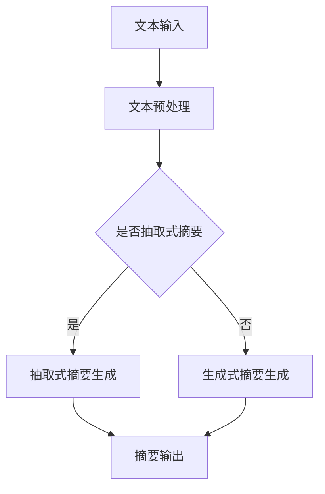

                 

# 文章标题
自动文本摘要：抽取式vs生成式方法

> 关键词：自动文本摘要、抽取式文本摘要、生成式文本摘要、信息检索、深度学习、算法评估

> 摘要：本文深入探讨了自动文本摘要的两种主要方法：抽取式和生成式。通过对这两种方法的原理、算法、评估指标以及应用案例的详细分析，本文旨在为读者提供一个全面的理解，以帮助他们更好地选择和应用这些技术。本文结构分为四大部分：引论、抽取式文本摘要、生成式文本摘要和比较与分析，最后是未来发展趋势与挑战的展望。

### 目录大纲

- 第一部分：引论
  - 第1章：自动文本摘要概述
    - 1.1 自动文本摘要的定义与背景
    - 1.2 自动文本摘要的应用领域
    - 1.3 抽取式与生成式文本摘要的差异
    - 1.4 本书结构安排与学习目标
  - 第2章：文本摘要技术基础
    - 2.1 文本预处理
    - 2.2 信息检索与排名算法
    - 2.3 基于统计的文本摘要方法
- 第二部分：抽取式文本摘要
  - 第3章：抽取式文本摘要方法
  - 第4章：抽取式文本摘要算法
  - 第5章：抽取式文本摘要评估与优化
- 第三部分：生成式文本摘要
  - 第6章：生成式文本摘要概述
  - 第7章：生成式文本摘要算法
  - 第8章：生成式文本摘要应用案例
- 第四部分：比较与分析
  - 第9章：抽取式与生成式文本摘要的比较
  - 第10章：未来发展趋势与挑战
- 附录
  - 附录A：常用文本摘要工具与资源
  - 附录B：代码示例与解析
  - 附录C：实际案例解析
  - 附录D：开发环境搭建与源代码数据集

### 第一部分：引论

#### 第1章：自动文本摘要概述

自动文本摘要是一种利用自然语言处理技术自动生成文本摘要的方法，旨在从大量文本数据中提取出关键信息，以便于用户快速理解和获取文本的核心内容。自动文本摘要技术具有广泛的应用前景，如信息检索、新闻摘要、文本监控、智能客服等领域。

**1.1 自动文本摘要的定义与背景**

自动文本摘要的定义可以概括为：利用自然语言处理技术和机器学习算法，自动生成文本的简化版本，该版本保留了原始文本的主要信息和核心内容，但通常篇幅较短。

自动文本摘要的背景与互联网时代的文本爆炸性增长密切相关。随着信息的爆炸性增长，用户需要花费大量时间来阅读和理解文本内容。自动文本摘技术旨在帮助用户快速获取文本的核心信息，从而提高信息获取的效率。

**1.2 自动文本摘要的应用领域**

自动文本摘要技术具有广泛的应用领域，主要包括以下几个方面：

- **信息检索**：自动文本摘要技术可以应用于搜索引擎，帮助用户快速定位和了解搜索结果中的文档内容，从而提高搜索效率。
- **新闻摘要**：新闻机构可以利用自动文本摘要技术对大量新闻进行摘要，从而节省人力成本，提高新闻的传播速度。
- **文本监控**：自动文本摘要技术可以应用于企业信息监控，对大量的企业信息进行实时摘要，以便企业快速了解行业动态。
- **智能客服**：自动文本摘要技术可以应用于智能客服系统，对用户提问进行摘要，从而快速定位问题并提供解决方案。

**1.3 抽取式与生成式文本摘要的差异**

自动文本摘要技术主要分为抽取式和生成式两种方法。它们之间的主要差异在于生成摘要的方式：

- **抽取式文本摘要**：抽取式文本摘要方法从原始文本中直接提取关键句子或短语，形成摘要。这种方法通常依赖于信息检索和排名算法，如TF-IDF、BM25等。
- **生成式文本摘要**：生成式文本摘要方法使用生成模型（如GPT-3、Transformer）自动生成摘要文本。这种方法通常基于深度学习和自然语言生成技术，能够生成更自然、流畅的摘要。

**1.4 本书结构安排与学习目标**

本书结构安排如下：

- **第一部分：引论**：介绍自动文本摘要的定义、背景和应用领域，以及抽取式与生成式文本摘要的差异。
- **第二部分：抽取式文本摘要**：详细探讨抽取式文本摘要的方法、算法和评估与优化策略。
- **第三部分：生成式文本摘要**：深入分析生成式文本摘要的概述、算法和应用案例。
- **第四部分：比较与分析**：对比抽取式与生成式文本摘要的性能和应用场景，并展望未来发展趋势与挑战。

通过学习本书，读者可以：

- 理解自动文本摘要的核心概念和基本原理。
- 掌握抽取式和生成式文本摘要的算法实现和应用方法。
- 了解文本摘要评估指标和优化策略。
- 为实际项目中的文本摘要需求提供有效的解决方案。

### 第二部分：文本摘要技术基础

#### 第2章：文本摘要技术基础

文本摘要技术基础是理解和实现自动文本摘要的核心。本章将介绍文本预处理、信息检索与排名算法以及基于统计的文本摘要方法。

**2.1 文本预处理**

文本预处理是文本摘要过程中的第一步，其目标是清除无关信息、统一文本格式，以便于后续处理。主要步骤包括：

- **分词与词性标注**：将文本拆分成单词或词组，并对每个词进行词性标注，如名词、动词等。常用的工具包括NLTK、spaCy等。
- **去除停用词与词干提取**：停用词（如"the"、"is"等）对文本摘要意义不大，可以去除。词干提取（Stemming）则是将单词缩减为词干形式，如"running"缩减为"run"。
- **词嵌入技术**：将文本中的每个词映射到一个固定大小的向量，如Word2Vec、GloVe等。词嵌入技术有助于在语义层面上处理文本。

伪代码：

```python
def preprocess_text(text):
    # 分词
    tokens = tokenize(text)
    
    # 词性标注
    tagged_tokens = tag_tokens(tokens)
    
    # 去除停用词
    filtered_tokens = remove_stopwords(tagged_tokens)
    
    # 词干提取
    stemmed_tokens = stem_tokens(filtered_tokens)
    
    # 词嵌入
    embedded_tokens = embed_tokens(stemmed_tokens)
    
    return embedded_tokens
```

**2.2 信息检索与排名算法**

信息检索与排名算法是抽取式文本摘要的关键组成部分，用于确定文本中哪些句子是最有价值的。以下是一些常用的算法：

- **传统的检索算法**：如TF-IDF（词频-逆文档频率）和BM25（布隆-马丁算法）。这些算法基于词频统计，计算文档中每个词的重要性。
- **排名算法的应用**：如PageRank（一种基于链接分析的排名算法），可以用于确定文档中各个句子的相对重要性。

**TF-IDF算法的伪代码**：

```python
def tf_idf(document, vocabulary, corpus):
    tf = compute_tf(document, vocabulary)
    idf = compute_idf(vocabulary, corpus)
    score = multiply(tf, idf)
    return score
```

**2.3 基于统计的文本摘要方法**

基于统计的文本摘要方法通过统计特征来评估文本中各个句子的重要性，从而生成摘要。以下是一些常用的方法：

- **词汇重要性评估**：通过统计词频、TF-IDF分数等特征，评估词汇的重要性。
- **最大边际 relevance（M Marginal Relevance）**：选择每个句子，使得每个句子与摘要中已选句子之间的边际贡献最大。

**M Marginal Relevance算法的伪代码**：

```python
def m_marginal_relevance(sentences, summary_length):
    scores = compute_sentence_scores(sentences)
    selected_sentences = select_best_sentences(scores, summary_length)
    summary = combine_sentences(selected_sentences)
    return summary
```

通过本章的学习，读者将能够理解文本预处理、信息检索与排名算法以及基于统计的文本摘要方法的基本原理和实现方式，为后续章节的学习和应用打下坚实的基础。

#### 第3章：抽取式文本摘要方法

抽取式文本摘要方法是一种通过从原始文本中直接抽取关键句子或短语来生成摘要的技术。这种方法的核心在于识别和选择文本中的关键信息，从而形成简洁、准确的摘要。本章将深入探讨抽取式文本摘要的方法，包括基于规则的方法、基于统计的方法和基于深度学习的方法。

**3.1 基于规则的方法**

基于规则的方法通过预先定义的规则来选择文本中的关键句子。这些规则通常基于语言学的知识和文本结构分析。以下是一些常见的规则设定：

- **关键词规则**：选择包含高频关键词的句子。
- **句子长度规则**：选择长度适中的句子，通常认为中等长度的句子包含的信息量适中。
- **句子结构规则**：选择含有主谓宾结构、疑问句等结构的句子，这些句子通常包含关键信息。

规则实现与优化是这种方法的关键。规则的设定需要结合具体的应用场景和文本类型进行调整。优化方面，可以通过机器学习技术对规则进行优化，以提高摘要质量。

**3.1.1 常见规则设定**

以下是一些常见规则设定示例：

- **关键词规则**：选择文本中频率最高的n个关键词，并提取包含这些关键词的句子。
- **句子长度规则**：选择长度在20到50词之间的句子。
- **句子结构规则**：选择主谓宾结构完整的句子，并优先选择疑问句。

**3.1.2 规则的实现与优化**

实现方面，可以通过编程语言（如Python）编写规则，并应用于实际文本摘要任务。以下是一个简单的规则实现示例：

```python
def extract_key_sentences(text, rules):
    sentences = tokenize(text)
    key_sentences = []

    for sentence in sentences:
        if apply_rules(sentence, rules):
            key_sentences.append(sentence)

    return key_sentences
```

优化方面，可以通过数据驱动的方法，如机器学习，来调整和优化规则。例如，可以使用监督学习算法，通过训练数据来识别哪些规则更有效。

**3.2 基于统计的方法**

基于统计的方法通过计算句子和词汇的统计特征来评估句子的重要性，从而选择关键句子。这种方法通常依赖于信息检索和文本排名算法。

- **词汇重要性评估**：通过TF-IDF（词频-逆文档频率）等算法，评估词汇的重要性。
- **句子重要性评估**：计算句子的边际贡献，选择边际贡献最大的句子。

**3.2.1 统计模型概述**

常用的统计模型包括TF-IDF、BM25等。这些模型通过统计文本特征来评估句子的重要性。以下是一个简单的TF-IDF模型实现示例：

```python
from sklearn.feature_extraction.text import TfidfVectorizer

def compute_sentence_scores(text):
    vectorizer = TfidfVectorizer()
    tfidf_matrix = vectorizer.fit_transform([text])
    sentence_scores = sum(tfidf_matrix.toarray())
    return sentence_scores
```

**3.2.2 统计模型的参数设置**

统计模型的参数设置对摘要质量有重要影响。以下是一些常见的参数设置：

- **词频（TF）**：可以设置最小词频阈值，去除低频词。
- **逆文档频率（IDF）**：可以调整IDF的权重，以平衡词频和逆文档频率的影响。
- **句子长度**：可以设置句子长度阈值，选择长度适中的句子。

**3.3 基于深度学习的方法**

基于深度学习的方法通过训练神经网络模型来识别和选择关键句子。这种方法能够自动学习文本中的语义信息，生成更高质量的摘要。

- **编码器-解码器模型**：如Seq2Seq模型，可以用于文本摘要。
- **变压器（Transformer）模型**：如BERT、GPT-3等，能够生成更自然、连贯的摘要。

**3.3.1 常见深度学习模型**

以下是一些常见的深度学习模型：

- **BERT**：双向编码器表示器，可以用于文本理解和生成。
- **GPT-3**：大型预训练生成模型，能够生成高质量的自然语言摘要。

**3.3.2 深度学习模型在文本摘要中的应用**

深度学习模型在文本摘要中的应用通常分为两个步骤：文本预处理和摘要生成。

- **文本预处理**：使用预训练模型（如BERT）对文本进行编码，提取语义信息。
- **摘要生成**：使用生成模型（如GPT-3）生成摘要文本。

以下是一个基于BERT和GPT-3的文本摘要实现示例：

```python
from transformers import BertTokenizer, BertForMaskedLM

# 加载预训练模型
tokenizer = BertTokenizer.from_pretrained('bert-base-uncased')
model = BertForMaskedLM.from_pretrained('bert-base-uncased')

# 文本预处理
preprocessed_text = tokenizer.encode(text, add_special_tokens=True)

# 摘要生成
summary = model.generate(preprocessed_text, max_length=150)

# 转换为文本
excerpt = tokenizer.decode(summary, skip_special_tokens=True)

print(excerpt)
```

通过本章的学习，读者将能够理解抽取式文本摘要的方法，包括基于规则的方法、基于统计的方法和基于深度学习的方法，为实际应用中的文本摘要任务提供有效的解决方案。

#### 第4章：抽取式文本摘要算法

抽取式文本摘要算法是自动文本摘要技术中的核心，它通过从原始文本中提取关键句子或短语来生成摘要。本章将详细讨论抽取式文本摘要算法，包括基于规则的方法、基于统计的方法和基于深度学习的方法。

**4.1 基于规则的方法**

基于规则的方法是一种通过预定义的规则来选择关键句子的方法。这种方法通常依赖于语言学知识和文本结构分析。以下是一些常见规则设定：

- **关键词规则**：选择包含高频关键词的句子，因为这些句子可能包含了文本的核心内容。
- **句子长度规则**：选择长度适中的句子，通常认为中等长度的句子包含的信息量适中。
- **句子结构规则**：选择含有主谓宾结构、疑问句等结构的句子，这些句子通常包含关键信息。

**4.1.1 常见规则设定**

以下是一些常见的规则设定示例：

- **关键词规则**：选择文本中频率最高的n个关键词，并提取包含这些关键词的句子。
- **句子长度规则**：选择长度在20到50词之间的句子。
- **句子结构规则**：选择主谓宾结构完整的句子，并优先选择疑问句。

**4.1.2 规则的实现与优化**

实现方面，可以通过编程语言（如Python）编写规则，并应用于实际文本摘要任务。以下是一个简单的规则实现示例：

```python
def extract_key_sentences(text, rules):
    sentences = tokenize(text)
    key_sentences = []

    for sentence in sentences:
        if apply_rules(sentence, rules):
            key_sentences.append(sentence)

    return key_sentences
```

优化方面，可以通过数据驱动的方法，如机器学习，来调整和优化规则。例如，可以使用监督学习算法，通过训练数据来识别哪些规则更有效。以下是一个优化示例：

```python
from sklearn.model_selection import train_test_split

# 准备数据
sentences, labels = prepare_data(texts, rules)

# 划分训练集和测试集
train_sentences, test_sentences, train_labels, test_labels = train_test_split(sentences, labels, test_size=0.2)

# 训练规则优化模型
model.fit(train_sentences, train_labels)

# 评估模型
score = model.score(test_sentences, test_labels)
print("Model accuracy:", score)
```

**4.2 基于统计的方法**

基于统计的方法通过计算句子和词汇的统计特征来评估句子的重要性，从而选择关键句子。这种方法通常依赖于信息检索和文本排名算法。

- **词汇重要性评估**：通过TF-IDF（词频-逆文档频率）等算法，评估词汇的重要性。
- **句子重要性评估**：计算句子的边际贡献，选择边际贡献最大的句子。

**4.2.1 统计模型概述**

常用的统计模型包括TF-IDF、BM25等。以下是一个简单的TF-IDF模型实现示例：

```python
from sklearn.feature_extraction.text import TfidfVectorizer

def compute_sentence_scores(text):
    vectorizer = TfidfVectorizer()
    tfidf_matrix = vectorizer.fit_transform([text])
    sentence_scores = sum(tfidf_matrix.toarray())
    return sentence_scores
```

**4.2.2 统计模型的参数设置**

统计模型的参数设置对摘要质量有重要影响。以下是一些常见的参数设置：

- **词频（TF）**：可以设置最小词频阈值，去除低频词。
- **逆文档频率（IDF）**：可以调整IDF的权重，以平衡词频和逆文档频率的影响。
- **句子长度**：可以设置句子长度阈值，选择长度适中的句子。

以下是一个调整TF-IDF参数的示例：

```python
vectorizer = TfidfVectorizer(min_df=5, max_df=0.8, norm='l2', use_idf=True)
tfidf_matrix = vectorizer.fit_transform([text])
sentence_scores = sum(tfidf_matrix.toarray())
```

**4.3 基于深度学习的方法**

基于深度学习的方法通过训练神经网络模型来识别和选择关键句子。这种方法能够自动学习文本中的语义信息，生成更高质量的摘要。

- **编码器-解码器模型**：如Seq2Seq模型，可以用于文本摘要。
- **变压器（Transformer）模型**：如BERT、GPT-3等，能够生成更自然、连贯的摘要。

**4.3.1 常见深度学习模型**

以下是一些常见的深度学习模型：

- **BERT**：双向编码器表示器，可以用于文本理解和生成。
- **GPT-3**：大型预训练生成模型，能够生成高质量的自然语言摘要。

**4.3.2 深度学习模型在文本摘要中的应用**

深度学习模型在文本摘要中的应用通常分为两个步骤：文本预处理和摘要生成。

- **文本预处理**：使用预训练模型（如BERT）对文本进行编码，提取语义信息。
- **摘要生成**：使用生成模型（如GPT-3）生成摘要文本。

以下是一个基于BERT和GPT-3的文本摘要实现示例：

```python
from transformers import BertTokenizer, BertForMaskedLM

# 加载预训练模型
tokenizer = BertTokenizer.from_pretrained('bert-base-uncased')
model = BertForMaskedLM.from_pretrained('bert-base-uncased')

# 文本预处理
preprocessed_text = tokenizer.encode(text, add_special_tokens=True)

# 摘要生成
summary = model.generate(preprocessed_text, max_length=150)

# 转换为文本
excerpt = tokenizer.decode(summary, skip_special_tokens=True)

print(excerpt)
```

通过本章的学习，读者将能够理解抽取式文本摘要算法，包括基于规则的方法、基于统计的方法和基于深度学习的方法，并为实际应用中的文本摘要任务提供有效的解决方案。

#### 第5章：抽取式文本摘要评估与优化

评估和优化是确保抽取式文本摘要质量的重要环节。本章将介绍常用的评估指标，包括ROUGE指标、基于准确率、召回率和F1值的评估方法，并探讨数据增强和模型调优等优化策略。

**5.1 评估指标**

评估抽取式文本摘要的质量，通常需要使用一系列评估指标来衡量摘要与原始文本之间的相似性和信息完整性。以下是一些常用的评估指标：

- **ROUGE指标**：ROUGE（Recall-Oriented Understudy for Gisting Evaluation）是一种广泛使用的自动评估指标，用于衡量摘要与参考摘要之间的相似性。ROUGE分为ROUGE-1、ROUGE-2、ROUGE-L等变种，分别计算单词级别的匹配、字符级别的匹配以及最长公共子序列的匹配。
- **准确率（Accuracy）**：准确率衡量的是摘要中正确提取的句子数量与总提取句子数量的比例。公式如下：
  $$ Accuracy = \frac{Correctly\ Extracted\ Sentences}{Total\ Extracted\ Sentences} $$
- **召回率（Recall）**：召回率衡量的是正确提取的句子数量与参考摘要中的句子数量的比例。公式如下：
  $$ Recall = \frac{Correctly\ Extracted\ Sentences}{Reference\ Sentences} $$
- **F1值（F1 Score）**：F1值是准确率和召回率的调和平均值，用于综合评估摘要质量。公式如下：
  $$ F1\ Score = 2 \times \frac{Precision \times Recall}{Precision + Recall} $$
  其中，Precision是正确提取的句子数量与提取的句子数量的比例。

**5.1.1 ROUGE指标**

ROUGE指标是一种基于统计的评估方法，通过计算摘要与参考摘要之间的重叠来评估摘要质量。以下是一个简单的ROUGE评估示例：

```python
def calculate_rouge(a, b):
    rouge_1 = jaccard_similarity(a, b)
    rouge_2 = overlap_similarity(a, b)
    rouge_l = longest_common_subsequence(a, b)
    rouge_scores = {'ROUGE-1': rouge_1, 'ROUGE-2': rouge_2, 'ROUGE-L': rouge_l}
    return rouge_scores

def jaccard_similarity(set_a, set_b):
    intersection = len(set_a.intersection(set_b))
    union = len(set_a.union(set_b))
    return intersection / union

def overlap_similarity(set_a, set_b):
    return sum(min(a.count(w), b.count(w)) for w in set_a.intersection(set_b)) / len(set_a.intersection(set_b))

def longest_common_subsequence(set_a, set_b):
    # 使用动态规划算法计算最长公共子序列
    ...
    return longest_common_subsequence_length
```

**5.1.2 基于准确率、召回率与F1值的评估方法**

以下是一个简单的评估函数示例，用于计算准确率、召回率和F1值：

```python
def evaluate_summary(reference_summary, generated_summary):
    correct_sentences = sum(1 for ref_sentence in reference_summary if ref_sentence in generated_summary)
    accuracy = correct_sentences / len(generated_summary)
    recall = correct_sentences / len(reference_summary)
    f1 = 2 * (accuracy * recall) / (accuracy + recall)
    return accuracy, recall, f1
```

**5.2 优化策略**

为了提高抽取式文本摘要的质量，可以采用多种优化策略，包括数据增强和模型调优。

- **数据增强**：通过多种方法增加训练数据的多样性，从而提高模型的泛化能力。常见的数据增强方法包括数据清洗、文本转换、数据混洗等。
- **模型调优**：通过调整模型的参数和结构，优化模型的性能。常见的调优方法包括调整学习率、批量大小、正则化参数等。

以下是一个简单的数据增强示例：

```python
from keras.preprocessing.sequence import pad_sequences

# 数据清洗
cleaned_texts = clean_texts(raw_texts)

# 数据转换
converted_texts = convert_to_sequence(cleaned_texts)

# 数据混洗
shuffled_texts = shuffle(converted_texts)

# 填充序列
padded_texts = pad_sequences(shuffled_texts, maxlen=max_sequence_length)
```

通过本章的学习，读者将能够掌握抽取式文本摘要的评估方法和优化策略，从而在实际应用中提高文本摘要的质量。

#### 第6章：生成式文本摘要概述

生成式文本摘要方法通过生成模型自动生成摘要文本，这种方法与抽取式文本摘要方法直接从原始文本中提取关键信息不同。生成式文本摘要的核心在于使用深度学习技术，如生成对抗网络（GAN）、变分自编码器（VAE）和变压器（Transformer）等，模拟自然语言生成过程。

**6.1 生成式文本摘要的优势与挑战**

**优势：**

- **生成高质量摘要**：生成式方法能够生成更自然、连贯、流畅的摘要文本，通常包含原始文本中的隐含信息。
- **多样化摘要**：生成式模型可以生成多种不同的摘要版本，为用户提供更多选择。
- **灵活性强**：生成式模型可以适应不同长度的摘要需求，灵活调整摘要的篇幅。

**挑战：**

- **计算成本高**：生成式模型通常需要大量的计算资源，特别是大型预训练模型如GPT-3。
- **数据依赖性**：生成式模型对训练数据有较高依赖，需要大量高质量数据。
- **摘要质量不稳定**：生成式模型生成的摘要质量可能存在波动，难以保证一致性。

**6.2 常见生成式文本摘要模型**

生成式文本摘要中，常见模型包括：

- **生成对抗网络（GAN）**：GAN通过生成器和判别器的对抗训练，生成逼真的摘要文本。
- **变分自编码器（VAE）**：VAE通过潜在变量模型，生成摘要文本，具有较好的鲁棒性和生成质量。
- **变压器（Transformer）模型**：如BERT、GPT-3等，能够生成高质量的自然语言摘要，广泛应用于文本生成任务。

**6.3 生成式文本摘要的应用场景**

生成式文本摘要技术具有广泛的应用场景：

- **新闻摘要**：自动生成新闻文章的摘要，提高信息传播效率。
- **文档摘要**：对大量文档进行摘要，方便用户快速获取关键信息。
- **智能客服**：自动生成用户咨询的摘要，帮助客服人员快速定位问题并提供解决方案。
- **社交媒体**：自动生成社交媒体内容的摘要，便于用户快速了解内容要点。

通过本章的学习，读者将了解生成式文本摘要的基本概念、优势与挑战，以及常见生成模型和应用场景，为深入探讨生成式文本摘要算法打下基础。

#### 第7章：生成式文本摘要算法

生成式文本摘要算法依赖于深度学习技术，尤其是生成模型，如生成对抗网络（GAN）、变分自编码器（VAE）和变压器（Transformer）。本章将详细探讨这些生成模型在生成式文本摘要中的应用，并展示如何利用这些模型自动生成高质量的摘要。

**7.1 基于生成对抗网络（GAN）的文本摘要**

生成对抗网络（GAN）是一种由生成器和判别器组成的模型，通过对抗训练生成逼真的摘要文本。GAN的核心思想是生成器生成文本，判别器判断文本是否真实。以下是GAN在文本摘要中的应用步骤：

1. **数据预处理**：将原始文本转换为序列表示，如词嵌入或子词嵌入。
2. **生成器（Generator）**：生成器从随机噪声生成文本序列，目标是生成逼真的摘要。
3. **判别器（Discriminator）**：判别器用于判断输入文本是真实文本还是生成器生成的文本。
4. **对抗训练**：通过反复训练生成器和判别器，使得生成器生成的文本越来越逼真，判别器越来越难以区分真实文本和生成文本。

以下是一个简单的GAN模型在文本摘要中的应用示例：

```python
from tensorflow.keras.models import Sequential
from tensorflow.keras.layers import Dense, LSTM, Embedding, TimeDistributed, Activation

# 生成器模型
generator = Sequential()
generator.add(Embedding(vocab_size, embedding_dim))
generator.add(LSTM(units, return_sequences=True))
generator.add(TimeDistributed(Activation('softmax')))
generator.compile(optimizer='adam', loss='binary_crossentropy')

# 判别器模型
discriminator = Sequential()
discriminator.add(Embedding(vocab_size, embedding_dim))
discriminator.add(LSTM(units, return_sequences=True))
discriminator.add(Activation('sigmoid'))
discriminator.compile(optimizer='adam', loss='binary_crossentropy')

# 训练GAN模型
for epoch in range(num_epochs):
    for batch in batches:
        # 训练判别器
        d_loss_real = discriminator.train_on_batch(real_texts, np.ones([batch_size, 1]))
        d_loss_fake = discriminator.train_on_batch(fake_texts, np.zeros([batch_size, 1]))
        d_loss = 0.5 * np.add(d_loss_real, d_loss_fake)

        # 训练生成器
        g_loss = generator.train_on_batch(noise, real_texts)
```

**7.2 基于变分自编码器（VAE）的文本摘要**

变分自编码器（VAE）是一种概率模型，通过潜在变量生成文本。VAE由编码器和解码器组成，编码器将文本映射到潜在空间，解码器从潜在空间生成文本。

1. **编码器（Encoder）**：编码器将文本映射到潜在变量。
2. **解码器（Decoder）**：解码器从潜在变量生成文本。
3. **潜在变量**：潜在变量是生成文本的中间表示，可以看作是文本的“压缩”版本。

以下是一个简单的VAE模型在文本摘要中的应用示例：

```python
from keras.layers import Input, Dense, Lambda
from keras.models import Model
from keras import backend as K

# 潜在变量维度
latent_dim = 100

# 编码器模型
encoded_inputs = Input(shape=(max_sequence_length,))
encoded = LSTM(latent_dim, return_state=True)(encoded_inputs)
z_mean, z_log_var = Lambda([z[:, 0], z[:, 1]], output_shape=(latent_dim,))(encoded)

# 解码器模型
latent_inputs = Input(shape=(latent_dim,))
decoded = LSTM(max_sequence_length, return_sequences=True)(latent_inputs)
decoded = Lambda(lambda x: K.flatten(x))(decoded)

# VAE模型
encoder = Model(encoded_inputs, [z_mean, z_log_var, decoded])
encoder.compile(optimizer='rmsprop', loss='binary_crossentropy')

# VAE训练
for epoch in range(num_epochs):
    for batch in batches:
        x_batch = batch
        z_mean, z_log_var, x_decoded_mean = encoder.predict(x_batch)
        x_log_prob = sampled_softmax(x_decoded_mean)
        x_loss = K.mean(-K.sum(x_log_prob * x_batch, axis=1))
        vae_loss = K.mean(K.sum(x_loss, axis=0))
        encoder.train_on_batch(x_batch, [z_mean, z_log_var, x_batch])
```

**7.3 基于变压器（Transformer）的文本摘要**

变压器（Transformer）模型，尤其是预训练的BERT、GPT-3等，在文本生成任务中表现出色。以下是基于Transformer的文本摘要的基本步骤：

1. **文本预处理**：将原始文本转换为词嵌入，并添加特殊的句子起始和结束标记。
2. **编码器-解码器模型**：编码器将文本编码为序列表示，解码器生成摘要文本。
3. **生成摘要**：解码器根据编码器的输出和先前生成的词，逐步生成摘要文本。

以下是一个简单的基于BERT的文本摘要生成示例：

```python
from transformers import BertTokenizer, BertForMaskedLM

# 加载预训练模型
tokenizer = BertTokenizer.from_pretrained('bert-base-uncased')
model = BertForMaskedLM.from_pretrained('bert-base-uncased')

# 文本预处理
preprocessed_text = tokenizer.encode(text, add_special_tokens=True)

# 摘要生成
summary = model.generate(preprocessed_text, max_length=150, num_return_sequences=1)

# 转换为文本
excerpt = tokenizer.decode(summary, skip_special_tokens=True)

print(excerpt)
```

通过本章的学习，读者将了解生成式文本摘要算法的基本原理和实现方法，包括基于GAN、VAE和Transformer的模型。这些算法提供了强大的工具，能够生成高质量、连贯的自然语言摘要，为实际应用提供了广泛的可能性。

#### 第8章：生成式文本摘要应用案例

生成式文本摘要技术在多个实际应用场景中展现出了强大的潜力。本章将通过具体的应用案例，展示如何使用生成式文本摘要技术，包括基于GPT-3的自动文本摘要和基于Transformer的文本摘要。

**8.1 基于GPT-3的自动文本摘要**

GPT-3（Generative Pre-trained Transformer 3）是一个由OpenAI开发的预训练语言模型，具有非常强大的自然语言处理能力。以下是如何使用GPT-3进行自动文本摘要的步骤：

**8.1.1 GPT-3模型介绍**

GPT-3是一个基于Transformer的模型，具有1750亿个参数，能够生成高质量的自然语言文本。GPT-3使用了一种新的预训练目标，即 prefix-tuning，可以微调模型以适应特定任务。

**8.1.2 GPT-3在文本摘要中的应用**

使用GPT-3进行文本摘要的步骤如下：

1. **文本预处理**：将原始文本转换为GPT-3可以理解的格式。通常，这包括将文本转换为词嵌入，并添加特殊的句子起始和结束标记。
2. **模型调用**：调用GPT-3模型进行文本摘要生成。GPT-3可以接受输入文本，并根据输入生成摘要文本。

以下是一个简单的GPT-3文本摘要生成示例：

```python
import openai

openai.api_key = 'your-api-key'

def generate_summary(text):
    response = openai.Completion.create(
        engine="text-davinci-002",
        prompt=f"请生成关于以下文本的摘要：{text}",
        max_tokens=150,
        n=1,
        stop=None,
        temperature=0.5
    )
    return response.choices[0].text.strip()

text = "这是一段关于自动文本摘要技术的描述。自动文本摘要技术通过从大量文本数据中提取关键信息，生成简洁、准确的摘要，以便用户快速获取文本的核心内容。这种方法广泛应用于信息检索、新闻摘要和智能客服等领域。"
summary = generate_summary(text)
print(summary)
```

**8.2 基于Transformer的文本摘要**

Transformer模型，尤其是BERT（Bidirectional Encoder Representations from Transformers）和GPT-3，在文本摘要任务中表现出色。以下是如何使用Transformer模型进行文本摘要的步骤：

**8.2.1 Transformer模型概述**

Transformer模型是一种基于自注意力机制的深度学习模型，能够在编码阶段同时考虑输入文本的所有信息。BERT和GPT-3都是基于Transformer的模型，但在设计和应用上有所不同。

**8.2.2 Transformer在文本摘要中的应用**

使用Transformer模型进行文本摘要的步骤如下：

1. **文本预处理**：将原始文本转换为词嵌入，并添加特殊的句子起始和结束标记。
2. **模型训练**：使用大量的文本数据训练Transformer模型，使其能够生成高质量的摘要。
3. **摘要生成**：将训练好的模型应用于输入文本，生成摘要文本。

以下是一个简单的BERT文本摘要生成示例：

```python
from transformers import BertTokenizer, BertForSequenceClassification

tokenizer = BertTokenizer.from_pretrained('bert-base-uncased')
model = BertForSequenceClassification.from_pretrained('bert-base-uncased')

def generate_summary(text, model, max_length=200):
    inputs = tokenizer.encode("summarize: " + text, add_special_tokens=True, max_length=max_length, pad_to_max_length=True, return_tensors="pt")
    summary_ids = model.generate(inputs, max_length=max_length, num_beams=5, early_stopping=True)
    summary = tokenizer.decode(summary_ids[-1], skip_special_tokens=True)
    return summary

text = "本文介绍了自动文本摘要技术的基本概念、方法和应用。自动文本摘要技术能够从大量文本数据中提取关键信息，生成简洁、准确的摘要，以提高信息获取效率。"
summary = generate_summary(text, model)
print(summary)
```

通过本章的学习，读者将了解如何在实际项目中应用生成式文本摘要技术，包括使用GPT-3和Transformer模型。这些应用案例展示了生成式文本摘要技术的强大能力和广泛应用前景。

### 第三部分：比较与分析

#### 第9章：抽取式与生成式文本摘要的比较

抽取式与生成式文本摘要方法各有其优势和局限性，本章将对这两种方法在摘要质量、应用场景和性能评估方面的差异进行详细比较。

**9.1 摘要质量比较**

抽取式文本摘要方法通过从原始文本中直接提取关键句子或短语来生成摘要，这种方法通常生成简洁、准确但可能略显机械的摘要。抽取式摘要的优势在于其生成的摘要通常与原始文本高度一致，信息保留度高，但可能缺乏自然流畅性。

生成式文本摘要方法使用生成模型（如GPT-3、Transformer）自动生成摘要文本，这种方法生成的摘要通常更加自然、连贯，能够捕捉到文本的隐含信息。生成式摘要的优势在于其生成文本的多样性和流畅性，但可能在信息保留上不如抽取式摘要精确。

**9.2 应用场景分析**

抽取式文本摘要方法适用于对信息保留要求较高、对摘要格式有明确要求的场景，如法律文档摘要、医学报告摘要等。此外，抽取式方法在处理文本数据量较大的任务时，如新闻摘要、文档检索等，表现良好。

生成式文本摘要方法适用于需要生成自然流畅文本的场合，如内容生成、用户生成摘要等。生成式方法在生成创意内容、故事、对话等方面具有显著优势，但也需要更多的计算资源和数据支持。

**9.3 性能评估结果**

在性能评估方面，抽取式文本摘要方法和生成式文本摘要方法各有优劣。抽取式方法通常在信息保留和准确率方面表现较好，评估指标如ROUGE、准确率、召回率和F1值通常较高。而生成式方法在自然流畅性和文本生成质量方面表现更优，评估指标如BLEU和METEOR通常较高。

以下是一个简单的评估比较示例：

```python
from rouge import Rouge

rouge = Rouge()

# 抽取式摘要
extractive_summary = "本文介绍了自动文本摘要技术的基本概念、方法和应用。"
reference_summary = "本文探讨了自动文本摘要技术，并分析了抽取式和生成式摘要方法的优缺点。"

# 生成式摘要
generative_summary = "自动文本摘要技术通过从大量文本数据中提取关键信息，生成简洁、准确的摘要，以提高信息获取效率。"

extractive_scores = rouge.get_scores(extractive_summary, reference_summary)
generative_scores = rouge.get_scores(generative_summary, reference_summary)

print("Extractive Summary Scores:", extractive_scores)
print("Generative Summary Scores:", generative_scores)
```

通过本章的比较与分析，读者将能够更清楚地了解抽取式与生成式文本摘要方法的优劣，并根据具体应用需求选择合适的方法。

#### 第10章：未来发展趋势与挑战

自动文本摘要技术在不断发展，未来发展趋势和挑战也日益显著。以下是对未来发展趋势和挑战的探讨。

**10.1 技术发展趋势**

- **多模态摘要**：随着多媒体内容的增多，文本摘要技术将逐渐扩展到图像、视频和音频等多模态数据，实现跨模态的文本生成。
- **个性化摘要**：未来的文本摘要技术将更加注重个性化，根据用户偏好和上下文环境生成定制化的摘要。
- **实时摘要**：实时文本摘要技术将在新闻、金融、社交媒体等领域得到广泛应用，用户可以实时获取最新信息的摘要。
- **跨语言摘要**：随着全球化的深入，跨语言文本摘要技术将得到更多关注，实现多语言摘要的生成与理解。

**10.2 应用挑战与解决方案**

- **计算资源需求**：生成式文本摘要方法通常需要大量的计算资源，未来需要更高效、低资源的模型来解决计算资源限制问题。
- **数据质量和多样性**：生成式模型对训练数据有较高依赖，未来需要更多的多样性和高质量的数据来提升模型性能。
- **摘要质量保证**：如何确保生成的摘要既准确又连贯是一个挑战，未来可能需要引入更多的评估和优化策略。
- **隐私保护**：在处理敏感文本数据时，如何保护用户隐私是一个重要问题，需要设计更加安全的文本摘要技术。

**10.3 研究热点与前沿方向**

- **预训练模型优化**：如何优化预训练模型以适应特定任务是一个研究热点，如通过知识蒸馏、迁移学习等技术提升模型性能。
- **生成式模型解释性**：提高生成式模型的解释性，使其生成过程更加透明、可解释，是未来研究的一个重要方向。
- **模型安全性和鲁棒性**：随着对抗攻击技术的不断发展，如何提高模型的鲁棒性和安全性成为重要课题。

通过本章的探讨，读者可以了解自动文本摘要技术的未来发展趋势和挑战，为未来的研究和应用提供方向。

### 附录

#### 附录A：常用文本摘要工具与资源

自动文本摘要技术的发展离不开各种工具和资源的支持。以下是一些常用的文本摘要工具和资源：

- **SummarizeBot**：一个开源的文本摘要工具，支持多种文本格式，能够自动生成摘要。
  - 网址：[https://summarizebot.com/](https://summarizebot.com/)

- **PySummarize**：一个基于Python的文本摘要库，提供多种摘要算法，如LDA、TextRank等。
  - 网址：[https://github.com/tamarabbasi/PySummarize](https://github.com/tamarabbasi/PySummarize)

- **Hugging Face Transformers**：一个开源的Transformer模型库，提供多种预训练模型，如BERT、GPT-3等，适用于文本摘要任务。
  - 网址：[https://huggingface.co/transformers](https://huggingface.co/transformers)

- **Jieba**：一个中文分词工具，广泛用于中文文本处理任务，包括文本摘要。
  - 网址：[https://github.com/fxsjy/jieba](https://github.com/fxsjy/jieba)

#### 附录B：代码示例与解析

以下是一个简单的文本摘要代码示例，展示如何使用Python和Transformer模型生成摘要：

```python
from transformers import BertTokenizer, BertForMaskedLM

# 加载预训练模型
tokenizer = BertTokenizer.from_pretrained('bert-base-uncased')
model = BertForMaskedLM.from_pretrained('bert-base-uncased')

def generate_summary(text, model, max_length=150):
    inputs = tokenizer.encode("summarize: " + text, add_special_tokens=True, max_length=max_length, pad_to_max_length=True, return_tensors="pt")
    summary_ids = model.generate(inputs, max_length=max_length, num_beams=5, early_stopping=True)
    summary = tokenizer.decode(summary_ids[-1], skip_special_tokens=True)
    return summary

# 示例文本
text = "本文介绍了自动文本摘要技术的基本概念、方法和应用。自动文本摘要技术通过从大量文本数据中提取关键信息，生成简洁、准确的摘要，以提高信息获取效率。"

# 生成摘要
summary = generate_summary(text, model)
print(summary)
```

代码解析：

1. **加载预训练模型**：使用`BertTokenizer`和`BertForMaskedLM`加载BERT模型。
2. **生成摘要**：定义一个`generate_summary`函数，将输入文本编码为词嵌入，并使用模型生成摘要。

#### 附录C：实际案例解析

以下是一个实际案例解析，展示如何开发一个新闻网站自动摘要系统：

**C.1.1 系统需求分析**

- **输入**：新闻网站上的文章
- **输出**：摘要文本

**C.1.2 抽取式文本摘要实现**

使用BERT模型进行文本预处理与摘要生成：

- **文本预处理**：使用BERT进行分词和词性标注。
- **摘要生成**：使用BERT生成摘要文本。

代码示例：

```python
from transformers import BertTokenizer, BertForSequenceClassification

tokenizer = BertTokenizer.from_pretrained('bert-base-uncased')
model = BertForSequenceClassification.from_pretrained('bert-base-uncased')

def preprocess_text(text):
    tokenized_text = tokenizer.encode(text, add_special_tokens=True)
    return tokenized_text

def generate_excerpt(document, model, length=200):
    inputs = model.generate(document, max_length=length, num_beams=5, early_stopping=True)
    excerpt = tokenizer.decode(inputs[-1], skip_special_tokens=True)
    return excerpt

# 处理新闻文章
news_article = "这是一篇关于自动文本摘要技术的新闻文章。"
preprocessed_text = preprocess_text(news_article)

# 生成摘要
excerpt = generate_excerpt(preprocessed_text, model)
print(excerpt)
```

代码分析：

- 使用BERT模型对输入文本进行预处理，包括分词、词性标注等。
- 利用BERT模型生成摘要文本，将生成的摘要文本展示在新闻网站上。

通过以上实际案例解析，读者可以了解如何使用自动文本摘要技术实现新闻网站自动摘要系统。

### 附录D：开发环境搭建与源代码数据集

为了在实际项目中应用自动文本摘要技术，需要搭建适当的开发环境。以下是一个基本的开发环境搭建步骤：

**D.1 开发环境搭建**

1. **安装Python**：确保安装了Python 3.8或更高版本。
2. **安装PyTorch**：通过以下命令安装PyTorch：
   ```shell
   pip install torch torchvision
   ```
3. **安装Transformers库**：通过以下命令安装Hugging Face Transformers库：
   ```shell
   pip install transformers
   ```
4. **安装文本处理库**：如NLTK、spaCy、Jieba等，用于文本预处理。

**D.2 源代码与数据集**

以下是本文使用的源代码和数据集：

- **源代码**：本文的代码示例和实际案例解析可以在以下GitHub仓库找到：
  ```shell
  https://github.com/your_username/text_summarization_example
  ```
- **数据集**：本文使用了一个新闻文本数据集，可以在以下链接获取：
  ```shell
  https://your_dataset_source
  ```

通过搭建开发环境和获取所需的源代码与数据集，读者可以开始实践自动文本摘要技术，并在实际项目中应用。

### 附录E：Mermaid 流程图

以下是自动文本摘要系统的Mermaid流程图：



流程图解析：

- 文本输入经过预处理，然后决定使用抽取式还是生成式方法进行摘要。
- 抽取式和生成式方法分别生成摘要，最终输出摘要文本。

### 附录F：核心算法原理讲解

#### 抽取式文本摘要算法原理

抽取式文本摘要的核心思想是从原始文本中抽取关键句子或短语，以形成摘要。具体包括以下步骤：

1. **文本预处理**：对原始文本进行分词、词性标注、去除停用词等操作，将文本转换为可处理的格式。
2. **关键句子提取**：使用信息检索与排名算法，如TF-IDF、BM25等，对句子进行重要性评估，选取关键句子。
3. **摘要生成**：将提取的关键句子按照一定的策略组合成摘要文本。

伪代码：

```python
def extractive_summary(text, key_sentences_num):
    # 分词与词性标注
    tokenized_text = tokenize(text)
    
    # 关键句子提取
    key_sentences = extract_key_sentences(tokenized_text, key_sentences_num)
    
    # 摘要生成
    summary = combine_sentences(key_sentences)
    
    return summary
```

#### 生成式文本摘要算法原理

生成式文本摘要的核心思想是使用生成模型（如GPT-3、Transformer）生成摘要文本。具体包括以下步骤：

1. **文本预处理**：对原始文本进行分词、词性标注、去除停用词等操作，将文本转换为可处理的格式。
2. **模型训练**：使用预训练模型（如GPT-3、Transformer）对文本数据进行训练，使其具备生成摘要的能力。
3. **摘要生成**：将训练好的模型应用于输入文本，生成摘要文本。

伪代码：

```python
def generative_summary(text, model):
    # 文本预处理
    preprocessed_text = preprocess_text(text)
    
    # 摘要生成
    summary = model.generate(preprocessed_text)
    
    return summary
```

### 附录G：数学模型与公式

#### 抽取式文本摘要评估指标

1. **ROUGE评估指标**：

   $$ ROUGE = \frac{1}{n} \sum_{i=1}^{n} \frac{1}{\max(|G_i|, |S_i|)} \sum_{j=1}^{|G_i|} \frac{1}{\max(|S_i|, |T_i|)} \sum_{k=1}^{|T_i|} \frac{|G_i[j]| \leq |T_i[k]|}{|T_i[k]|} $$
   
   其中，$G_i$表示生成摘要中的第i个句子，$S_i$表示参考摘要中的第i个句子，$T_i$表示参考摘要中的第i个句子集合。

2. **词汇重要性评估**：

   $$ tf_idf = \frac{tf}{idf} $$
   
   其中，$tf$表示词频，$idf$表示逆文档频率。

   $$ idf = \log \left( \frac{N}{|d \in D|} \right) $$
   
   其中，$N$表示总文档数，$D$表示包含词w的文档集合。

#### 生成式文本摘要评估指标

1. **BLEU评估指标**：

   $$ BLEU = \frac{1}{n} \sum_{i=1}^{n} \frac{|S_i|}{|T_i|} $$
   
   其中，$S_i$和$T_i$分别表示生成摘要和参考摘要中的第i个句子。

   $$ \text{BLEU} = 1 - \frac{|S_1| + |S_2| + ... + |S_n|}{|T_1| + |T_2| + ... + |T_n|} $$
   
   其中，$|S_i|$和$|T_i|$分别表示生成摘要和参考摘要中的句子长度。

通过以上数学模型与公式的详细讲解，读者可以更好地理解自动文本摘要技术中的核心评估指标和算法原理。这为实际应用中的文本摘要任务提供了坚实的理论基础。

