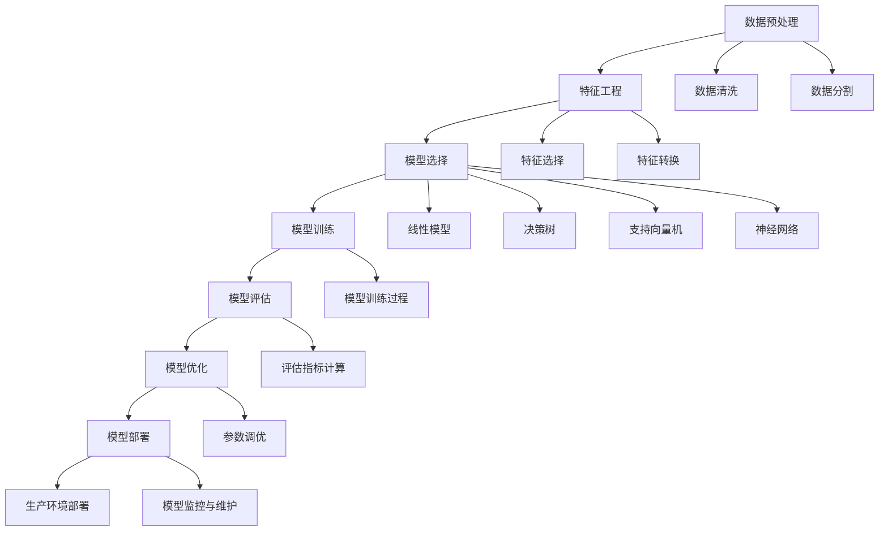

                 

### 《自动机器学习 原理与代码实例讲解》

> 关键词：自动机器学习，原理，算法，代码实例，实战应用

> 摘要：本文将详细介绍自动机器学习（AutoML）的概念、原理和实现方法。通过深入剖析自动机器学习的核心算法和关键技术，结合实际代码实例，帮助读者全面了解并掌握自动机器学习的实践应用，为未来的AI开发提供有力支持。

---

#### 第一部分：自动机器学习基础

##### 第1章：自动机器学习概述

###### 1.1 自动机器学习的定义与背景

自动机器学习（AutoML）是一种通过自动化手段来简化机器学习流程的技术。它能够自动进行特征工程、模型选择、模型调参等任务，从而提高机器学习模型的性能和开发效率。

自动机器学习的发展可以追溯到2000年代初，随着机器学习和深度学习领域的飞速发展，自动机器学习逐渐成为研究热点。近年来，随着计算能力和数据量的不断提升，自动机器学习在实际应用中取得了显著成果。

###### 1.2 自动机器学习的关键概念

1. **特征工程自动化**：特征工程是机器学习过程中至关重要的一环，自动机器学习通过自动化手段进行特征选择、特征提取和特征转换，以提高模型的性能。

2. **模型选择自动化**：自动机器学习通过自动化手段来选择最优的机器学习模型，包括线性模型、决策树、支持向量机等。

3. **模型调参自动化**：自动机器学习通过自动化手段来优化模型的参数，从而提高模型的性能。

###### 1.3 自动机器学习应用场景

1. **数据预处理**：自动机器学习可以对原始数据进行预处理，如数据清洗、归一化、特征工程等。

2. **模型训练**：自动机器学习可以选择并训练最优的机器学习模型，从而提高模型的性能。

3. **模型评估与优化**：自动机器学习可以对训练好的模型进行评估和优化，以获取最佳性能。

4. **应用到实际项目中**：自动机器学习可以应用于各种实际场景，如金融风控、医疗诊断、自然语言处理等。

##### 第2章：自动机器学习原理

###### 2.1 基于搜索的自动机器学习

基于搜索的自动机器学习是通过搜索算法来优化机器学习模型的过程。常见的搜索算法包括贝叶斯优化、整数线性规划和蚁群优化等。

###### 2.2 基于遗传算法的自动机器学习

基于遗传算法的自动机器学习是通过遗传算法来优化机器学习模型的过程。遗传算法是一种模拟自然界进化的优化算法，通过选择、交叉和变异等操作来寻找最优解。

###### 2.3 基于深度学习的自动机器学习

基于深度学习的自动机器学习是利用深度学习模型来自动化机器学习流程。深度学习模型可以通过端到端的方式处理数据，从而实现自动特征提取和模型训练。

##### 第3章：自动机器学习实践

###### 3.1 自动机器学习工具

本章节将介绍常用的自动机器学习工具，如 H2O AutoML、Google AutoML 和 Microsoft AzureML 等，并对比它们的特点和优缺点。

###### 3.2 使用自动机器学习工具进行模型训练

本章节将结合实际代码实例，详细介绍如何使用自动机器学习工具进行模型训练、评估和优化。

###### 3.3 AutoML 工具实战案例

本章节将通过一个实际案例，展示如何使用自动机器学习工具来处理一个具体的数据集，并分析模型的性能。

##### 第4章：自动机器学习挑战与展望

###### 4.1 自动机器学习的挑战

本章节将讨论自动机器学习面临的一些挑战，如模型可解释性、模型泛化能力和数据隐私保护等。

###### 4.2 自动机器学习的未来趋势

本章节将探讨自动机器学习的未来发展趋势，如智能化、与深度学习融合和新兴领域应用等。

---

### 附录

#### 附录A：自动机器学习资源汇总

本附录将汇总一些自动机器学习相关的开源工具、论文和书籍，以供读者进一步学习和探索。

#### 附录B：自动机器学习常见问题解答

本附录将回答一些自动机器学习领域常见的问题，如自动机器学习的原理、适用场景和工具选择等。

#### 附录C：自动机器学习项目案例解析

本附录将通过一个实际项目案例，详细解析自动机器学习的应用过程，包括数据预处理、模型训练、评估和优化等步骤。

---

**作者：AI天才研究院/AI Genius Institute & 禅与计算机程序设计艺术 /Zen And The Art of Computer Programming**## 第一部分：自动机器学习基础

### 第1章：自动机器学习概述

自动机器学习（AutoML）是近年来机器学习领域的一个重要研究方向，旨在通过自动化手段简化机器学习模型的构建和优化过程。本章将介绍自动机器学习的定义、发展历程、关键概念以及应用场景。

#### 1.1 自动机器学习的定义与背景

自动机器学习（AutoML）是指利用算法自动化地完成机器学习任务，包括数据预处理、特征工程、模型选择、模型训练、模型评估和模型调参等步骤。AutoML的目标是通过自动化手段降低机器学习模型的复杂度，提高开发效率和模型性能。

自动机器学习的发展可以追溯到2000年代初，当时研究者们开始探索如何利用自动化技术简化机器学习流程。随着机器学习和深度学习领域的飞速发展，自动机器学习逐渐成为研究热点。近年来，随着计算能力和数据量的不断提升，自动机器学习在实际应用中取得了显著成果，如自动图像识别、自然语言处理、智能推荐系统等。

#### 1.2 自动机器学习的关键概念

自动机器学习涉及多个关键概念，下面将逐一介绍：

1. **特征工程自动化**：特征工程是机器学习过程中至关重要的一环，包括特征选择、特征提取和特征转换等步骤。自动机器学习通过自动化手段来简化这些过程，从而提高模型的性能。

2. **模型选择自动化**：自动机器学习通过自动化手段来选择最优的机器学习模型，包括线性模型、决策树、支持向量机、神经网络等。选择合适的模型对于提高模型性能至关重要。

3. **模型调参自动化**：自动机器学习通过自动化手段来优化模型的参数，包括学习率、隐藏层大小、正则化参数等。优化模型参数可以显著提高模型性能。

4. **超参数优化**：超参数是指模型之外需要手动设置的参数，如学习率、迭代次数等。自动机器学习通过自动化手段来优化这些超参数，以提高模型性能。

5. **集成学习**：集成学习是一种利用多个模型来提高模型性能的方法。自动机器学习可以通过自动化手段来实现集成学习，如随机森林、梯度提升树等。

#### 1.3 自动机器学习应用场景

自动机器学习可以应用于多个领域，下面列举几个典型的应用场景：

1. **数据预处理**：自动机器学习可以自动进行数据清洗、数据转换、数据归一化等预处理操作，从而提高后续模型训练的效果。

2. **模型训练**：自动机器学习可以选择并训练最优的机器学习模型，从而提高模型的性能。这对于大型数据集和复杂模型尤为重要。

3. **模型评估与优化**：自动机器学习可以对训练好的模型进行评估和优化，以获取最佳性能。评估指标可以包括准确率、召回率、F1 分数等。

4. **应用到实际项目中**：自动机器学习可以应用于各种实际场景，如金融风控、医疗诊断、自然语言处理、图像识别等。通过自动机器学习，可以提高业务系统的智能化水平。

#### 1.4 自动机器学习的优点与挑战

自动机器学习具有以下优点：

- **提高开发效率**：自动机器学习可以自动化完成多个步骤，从而节省开发时间和人力成本。
- **提高模型性能**：自动机器学习可以通过超参数优化和集成学习等方法，提高模型的性能。
- **简化模型构建过程**：自动机器学习可以简化模型构建过程，使得模型开发变得更加容易。

然而，自动机器学习也面临一些挑战：

- **模型可解释性**：自动机器学习模型通常具有较高的性能，但难以解释其内部机制，这对于需要可解释性的应用场景是一个挑战。
- **数据隐私保护**：自动机器学习通常需要对大量数据进行处理，如何保护数据隐私成为一个重要问题。
- **计算资源消耗**：自动机器学习需要大量计算资源，对于大型数据集和复杂模型，计算资源消耗可能成为一个瓶颈。

总之，自动机器学习是一种具有重要应用价值的技术，它通过自动化手段简化机器学习流程，提高开发效率和模型性能。然而，自动机器学习也面临一些挑战，需要进一步研究和解决。

---

在下一章中，我们将深入探讨自动机器学习的原理，包括基于搜索的自动机器学习、基于遗传算法的自动机器学习和基于深度学习的自动机器学习。通过这些核心算法的讲解，读者可以更好地理解自动机器学习的工作原理，为实际应用打下坚实的基础。敬请期待！## 第二部分：自动机器学习原理

### 第2章：自动机器学习算法

自动机器学习（AutoML）的核心在于其能够自动化地完成机器学习流程中的多个关键步骤，包括特征工程、模型选择和模型调参等。本章将详细介绍几种常见的自动机器学习算法，包括基于搜索的自动机器学习、基于遗传算法的自动机器学习和基于深度学习的自动机器学习，并解释其基本原理。

#### 2.1 基于搜索的自动机器学习

基于搜索的自动机器学习算法通过搜索算法来优化机器学习模型的过程。这些算法通常采用迭代的方式，在多个候选解中搜索最优解。常见的基于搜索的自动机器学习算法包括贝叶斯优化、整数线性规划和蚁群优化等。

##### 2.1.1 贝叶斯优化

贝叶斯优化是一种基于概率模型的优化算法，主要用于超参数优化。贝叶斯优化通过构建一个概率模型来预测目标函数的值，然后根据预测结果调整参数。贝叶斯优化的基本步骤如下：

1. **初始化模型参数**：随机初始化一组模型参数。
2. **评估目标函数**：计算目标函数在这些参数下的值。
3. **更新模型参数**：根据目标函数的评估结果，使用贝叶斯模型更新参数。
4. **重复步骤2和3**：不断重复评估和更新过程，直到满足停止条件。

贝叶斯优化的伪代码如下：

```python
def bayesian_optimization(objective_function, bounds, max_iterations):
    # 初始化模型参数
    x0 = random_sample(bounds)
    y0 = objective_function(x0)
    
    # 初始化最佳参数和最佳值
    best_x = x0
    best_y = y0
    
    # 进行迭代搜索
    for i in range(max_iterations):
        # 计算下一次采样点
        x = next_sample(bounds, best_x, best_y)
        
        # 计算新函数值
        y = objective_function(x)
        
        # 更新最佳参数和最佳值
        if y < best_y:
            best_x = x
            best_y = y
            
        # 输出当前最佳参数和最佳值
        print("迭代次数:", i, "最佳参数:", best_x, "最佳值:", best_y)
        
    return best_x, best_y
```

##### 2.1.2 整数线性规划

整数线性规划是一种用于求解离散优化问题的数学方法。在自动机器学习中，整数线性规划可以用于优化模型参数的离散值。整数线性规划的基本步骤如下：

1. **定义目标函数**：目标函数表示需要优化的目标，通常是一个线性函数。
2. **定义约束条件**：约束条件限制了解空间的可行解。
3. **求解最优解**：使用整数线性规划算法求解最优解。

整数线性规划的伪代码如下：

```python
def integer_linear_programming(objective_function, constraints, bounds):
    # 求解整数线性规划问题
    solution = solve.ilp(objective_function, constraints, bounds)
    
    # 返回最优解
    return solution.x
```

##### 2.1.3 蚁群优化

蚁群优化是一种基于群体智能的优化算法，通过模拟蚁群觅食行为来搜索最优解。在自动机器学习中，蚁群优化可以用于优化模型参数。蚁群优化的基本步骤如下：

1. **初始化**：初始化蚁群位置和方向。
2. **信息素更新**：根据当前解的质量更新信息素浓度。
3. **选择下一位置**：根据信息素浓度选择下一步位置。
4. **重复步骤2和3**：不断重复搜索过程，直到满足停止条件。

蚁群优化的伪代码如下：

```python
def ant_colony_optimization(objective_function, bounds, max_iterations):
    # 初始化蚁群位置和方向
    positions = initialize_positions(bounds)
    directions = initialize_directions(bounds)
    
    # 初始化信息素浓度
    pheromone = initialize_pheromone(bounds)
    
    # 进行迭代搜索
    for i in range(max_iterations):
        # 计算当前解的质量
        quality = objective_function(positions)
        
        # 更新信息素浓度
        pheromone = update_pheromone(quality, pheromone)
        
        # 选择下一位置
        positions = choose_next_position(positions, directions, pheromone)
        
        # 输出当前最佳参数和最佳值
        print("迭代次数:", i, "最佳参数:", positions, "最佳值:", quality)
        
    return positions, quality
```

#### 2.2 基于遗传算法的自动机器学习

基于遗传算法的自动机器学习通过模拟自然进化过程来搜索最优解。遗传算法主要包括选择、交叉和变异等步骤，通过这些操作逐步优化模型参数。

##### 2.2.1 遗传算法基本概念

遗传算法是一种基于自然进化原理的优化算法，其主要概念包括：

1. **个体**：个体表示模型参数的一个候选解。
2. **种群**：种群是一组个体的集合，用于表示解空间。
3. **适应度函数**：适应度函数用于评估个体的优劣程度。
4. **选择**：选择操作用于从当前种群中选择优秀个体作为下一代的父代。
5. **交叉**：交叉操作用于产生新的个体，通过组合父代的基因来实现。
6. **变异**：变异操作用于引入随机性，避免算法陷入局部最优。

##### 2.2.2 遗传算法在自动机器学习中的应用

遗传算法在自动机器学习中的应用主要包括以下几个方面：

1. **模型参数优化**：遗传算法可以用于优化模型的参数，如学习率、隐藏层大小等。
2. **特征工程**：遗传算法可以用于自动选择和组合特征，提高模型的性能。
3. **模型选择**：遗传算法可以用于自动选择最优的机器学习模型。

遗传算法在自动机器学习中的应用伪代码如下：

```python
def genetic_algorithm(objective_function, population_size, generations):
    # 初始化种群
    population = initialize_population(population_size)
    
    # 进行迭代
    for g in range(generations):
        # 计算适应度
        fitness = evaluate_fitness(population, objective_function)
        
        # 选择
        selected_population = selection(population, fitness)
        
        # 交叉
        crossed_population = crossover(selected_population)
        
        # 变异
        mutated_population = mutation(crossed_population)
        
        # 更新种群
        population = mutated_population
        
        # 输出当前最好个体
        best_fitness = max(fitness)
        best_individual = population[fitness.index(best_fitness)]
        print("迭代次数:", g, "最好个体:", best_individual, "适应度:", best_fitness)
        
    return population[fitness.index(max(fitness))]
```

##### 2.2.3 遗传算法性能分析

遗传算法的性能受到多个因素的影响，包括种群规模、交叉率、变异率、适应度函数等。合理设置这些参数可以显著提高遗传算法的性能。以下是一些常见的性能分析指标：

1. **收敛速度**：遗传算法在搜索过程中达到最优解的速度。
2. **精度**：遗传算法找到的最优解的精度。
3. **稳定性**：遗传算法在不同初始种群和参数设置下的稳定性。

#### 2.3 基于深度学习的自动机器学习

基于深度学习的自动机器学习利用深度学习模型来自动化机器学习流程。深度学习模型可以通过端到端的方式处理数据，从而实现自动特征提取和模型训练。常见的基于深度学习的自动机器学习算法包括：

##### 2.3.1 深度学习基础

深度学习是一种基于多层神经网络的学习方法，通过堆叠多个隐藏层来提取数据的高级特征。深度学习的基本概念包括：

1. **神经网络**：神经网络是一种由多个神经元组成的计算模型，通过加权连接实现数据处理和特征提取。
2. **激活函数**：激活函数用于对神经网络中的神经元进行非线性变换，提高模型的性能。
3. **反向传播**：反向传播是一种用于训练神经网络的优化算法，通过计算梯度来更新模型参数。

##### 2.3.2 深度学习在自动机器学习中的应用

深度学习在自动机器学习中的应用主要包括：

1. **特征提取**：深度学习模型可以通过端到端的方式提取数据的高级特征，从而简化特征工程过程。
2. **模型训练**：深度学习模型可以自动进行模型训练，通过优化算法来调整模型参数。
3. **模型调参**：深度学习模型可以通过自动搜索算法来优化模型参数，提高模型性能。

##### 2.3.3 深度学习自动机器学习模型

常见的深度学习自动机器学习模型包括：

1. **卷积神经网络（CNN）**：卷积神经网络是一种用于图像识别和处理的深度学习模型，通过卷积操作提取图像特征。
2. **循环神经网络（RNN）**：循环神经网络是一种用于序列数据处理的深度学习模型，通过循环连接实现时间序列的建模。
3. **生成对抗网络（GAN）**：生成对抗网络是一种用于生成数据的深度学习模型，通过对抗训练生成逼真的数据。

总之，自动机器学习算法通过自动化手段简化机器学习流程，提高开发效率和模型性能。基于搜索的自动机器学习、基于遗传算法的自动机器学习和基于深度学习的自动机器学习是当前主要的自动机器学习算法。通过深入理解这些算法的原理和实现方法，读者可以更好地应用自动机器学习技术，推动人工智能的发展。

在下一章中，我们将介绍自动机器学习工具，包括 H2O AutoML、Google AutoML 和 Microsoft AzureML 等，以及如何使用这些工具进行模型训练、评估和优化。敬请期待！## 第三部分：自动机器学习实践

### 第3章：自动机器学习工具

自动机器学习（AutoML）工具是实现自动机器学习的关键，它们提供了简化和自动化机器学习流程的功能，使得非专业用户也能轻松地构建和优化机器学习模型。本章将介绍几种常用的自动机器学习工具，包括 H2O AutoML、Google AutoML 和 Microsoft AzureML，并探讨如何使用这些工具进行模型训练、评估和优化。

#### 3.1 自动机器学习工具概述

自动机器学习工具可以分为以下几类：

1. **开源工具**：如 H2O AutoML、Sklearn-AutoML 和 AutoKeras 等。
2. **商业工具**：如 Google AutoML、IBM Watson Studio 和 Microsoft AzureML 等。
3. **在线服务**：如 Google Cloud AutoML、AWS SageMaker AutoML 和 Azure Machine Learning 等。

每种工具都有其特点和适用场景，下面将详细介绍几种常用的自动机器学习工具。

##### 3.1.1 H2O AutoML

H2O AutoML 是一个开源的自动机器学习工具，支持多种机器学习算法和数据处理功能。它提供了简单易用的接口，可以快速构建和优化机器学习模型。H2O AutoML 的特点如下：

- **支持多种算法**：包括线性回归、决策树、随机森林、梯度提升树等。
- **自动化特征工程**：自动进行特征选择、特征转换和缺失值处理。
- **高性能**：基于内存计算，支持大规模数据集的处理。
- **易用性**：提供 Python 和 R 接口，易于集成到现有项目中。

##### 3.1.2 Google AutoML

Google AutoML 是一个商业化的自动机器学习工具，提供了一系列易于使用的机器学习模型，适用于不同领域的应用。Google AutoML 的特点如下：

- **简单易用**：无需编程知识，通过图形界面即可构建和部署模型。
- **多样化模型**：包括图像、文本和结构化数据等多种类型的模型。
- **高质量支持**：提供专业团队的支持和培训服务。
- **集成方便**：易于与 Google Cloud Platform 集成，支持多种数据源。

##### 3.1.3 Microsoft AzureML

Microsoft AzureML 是微软提供的自动化机器学习平台，支持从数据预处理到模型部署的全流程操作。AzureML 的特点如下：

- **强大的数据处理能力**：支持多种数据处理工具和算法。
- **可扩展性**：支持大规模数据集和复杂模型的训练。
- **可视化界面**：提供可视化界面，便于模型构建和优化。
- **集成方便**：易于与 Azure 其他服务集成，支持多种编程语言。

#### 3.2 使用 AutoML 工具进行模型训练

使用自动机器学习工具进行模型训练通常包括以下几个步骤：

1. **数据预处理**：包括数据清洗、数据转换和特征工程等操作，以准备数据用于模型训练。
2. **模型训练**：选择合适的模型，使用自动机器学习工具进行模型训练。
3. **模型评估**：评估模型的性能，包括准确率、召回率、F1 分数等指标。
4. **模型优化**：根据评估结果，调整模型参数或特征工程策略，以提高模型性能。

下面以 H2O AutoML 为例，介绍如何使用自动机器学习工具进行模型训练。

##### 3.2.1 数据预处理

数据预处理是模型训练的重要步骤，包括以下操作：

1. **数据导入**：使用 H2O 的 `h2o.init()` 函数初始化 H2O 流计算集群，然后使用 `h2o.import_file()` 函数导入数据。

```python
h2o.init()
data = h2o.import_file('data.csv')
```

2. **数据清洗**：对数据进行清洗，包括去除缺失值、处理异常值等。

```python
data = data.dropna()  # 去除缺失值
data = data[data['target'] > 0]  # 处理异常值
```

3. **数据转换**：将数据转换为适合模型训练的格式，如归一化、离散化等。

```python
data = data.as_data_frame()
data['feature1'] = (data['feature1'] - data['feature1'].mean()) / data['feature1'].std()
```

##### 3.2.2 模型训练

使用 H2O AutoML 进行模型训练的步骤如下：

1. **分割数据集**：将数据集分为训练集和测试集。

```python
train_data, test_data = data.split_frame(ratios=[0.8], seed=1234)
```

2. **创建 H2OAutoML 实例**：使用 `H2OAutoML` 类创建自动机器学习实例，设置最大模型数量和随机种子。

```python
aml = H2OAutoML(max_models=10, seed=1234)
```

3. **训练模型**：使用 `train` 方法进行模型训练，传入特征列和目标列，以及训练数据集。

```python
aml.train(x=col_names_data[:-1], y=col_names_data[-1], training_frame=train_data)
```

##### 3.2.3 模型评估

模型评估是验证模型性能的重要步骤，包括以下操作：

1. **预测**：使用 `predict` 方法对测试集进行预测。

```python
predictions = aml.predict(test_data)
```

2. **计算评估指标**：计算模型的评估指标，如准确率、召回率、F1 分数等。

```python
accuracy = h2o.get_frameHistograms(predictions, col_name='predict', label='actual').accuracy()
print("测试集准确率:", accuracy)
```

##### 3.2.4 模型优化

模型优化是通过调整模型参数或特征工程策略来提高模型性能的过程。使用 H2O AutoML 进行模型优化的步骤如下：

1. **调整模型参数**：使用 `optimize` 方法调整模型参数。

```python
aml.optimize()
```

2. **重新评估模型**：使用 `predict` 方法对测试集进行重新预测，并计算评估指标。

```python
predictions = aml.predict(test_data)
accuracy = h2o.get_frameHistograms(predictions, col_name='predict', label='actual').accuracy()
print("优化后测试集准确率:", accuracy)
```

#### 3.3 AutoML 工具实战案例

为了更好地理解如何使用自动机器学习工具进行模型训练、评估和优化，下面将结合 H2O AutoML 工具，展示一个实际的案例。

##### 3.3.1 数据集介绍

本案例使用的是著名的 Iris 数据集，该数据集包含了 150 个样本，每个样本有 4 个特征，分别为花的长宽、花瓣的长度和宽度，以及目标标签（三类花中的某一类）。

##### 3.3.2 模型构建

使用 H2O AutoML 进行模型构建的步骤如下：

1. **数据导入**：导入 Iris 数据集。

```python
iris_data = h2o.import_file('iris.csv')
```

2. **数据预处理**：对数据进行预处理，包括去除缺失值、归一化等。

```python
iris_data = iris_data.dropna()
iris_data = iris_data.as_data_frame()
iris_data[['sepal_length', 'sepal_width', 'petal_length', 'petal_width']] = iris_data[['sepal_length', 'sepal_width', 'petal_length', 'petal_width']].apply(lambda x: (x - x.mean()) / x.std())
```

3. **分割数据集**：将数据集分为训练集和测试集。

```python
train_data, test_data = iris_data.split_frame(ratios=[0.8], seed=1234)
```

4. **创建 H2OAutoML 实例**：创建自动机器学习实例。

```python
aml = H2OAutoML(max_models=10, seed=1234)
```

5. **训练模型**：使用 H2O AutoML 进行模型训练。

```python
aml.train(x=col_names_data[:-1], y=col_names_data[-1], training_frame=train_data)
```

##### 3.3.3 模型训练与评估

1. **预测**：使用 H2O AutoML 对测试集进行预测。

```python
predictions = aml.predict(test_data)
```

2. **计算评估指标**：计算测试集的准确率。

```python
accuracy = h2o.get_frameHistograms(predictions, col_name='predict', label='actual').accuracy()
print("测试集准确率:", accuracy)
```

##### 3.3.4 模型优化

为了提高模型性能，可以使用 H2O AutoML 的优化功能。

1. **调整模型参数**：使用 `optimize` 方法进行模型优化。

```python
aml.optimize()
```

2. **重新评估模型**：重新计算测试集的准确率。

```python
predictions = aml.predict(test_data)
accuracy = h2o.get_frameHistograms(predictions, col_name='predict', label='actual').accuracy()
print("优化后测试集准确率:", accuracy)
```

通过以上步骤，我们使用 H2O AutoML 工具完成了一个简单的自动机器学习实验。这个案例展示了如何使用自动机器学习工具进行数据预处理、模型训练、评估和优化，为实际项目提供了参考。

在下一章中，我们将探讨自动机器学习的挑战和未来趋势，包括模型可解释性、模型泛化能力、数据隐私保护等方面的讨论。敬请期待！## 第四部分：自动机器学习挑战与展望

### 第4章：自动机器学习挑战与展望

随着自动机器学习（AutoML）技术的发展，其在各个领域的应用越来越广泛。然而，自动机器学习也面临着诸多挑战和问题。本章将讨论自动机器学习的挑战，包括模型可解释性、模型泛化能力、数据隐私保护等方面的讨论，并展望自动机器学习的未来趋势。

#### 4.1 自动机器学习的挑战

##### 4.1.1 模型可解释性

模型可解释性是自动机器学习面临的一个重要挑战。尽管自动机器学习可以提高模型的性能，但其内部机制往往较为复杂，难以解释。这给实际应用带来了一定的困扰，尤其是在需要解释模型决策的场景中。例如，在医疗诊断中，医生需要理解模型的决策过程，以便对患者的病情进行合理的判断。因此，如何提高自动机器学习模型的可解释性成为了一个关键问题。

##### 4.1.2 模型泛化能力

模型泛化能力是指模型在面对未知数据时的表现。自动机器学习模型虽然能够在特定数据集上取得较高的性能，但在面对未知数据时，其性能可能不稳定。这主要是由于自动机器学习模型在训练过程中过度依赖训练数据，导致模型无法很好地泛化到未知数据。如何提高自动机器学习模型的泛化能力，是一个亟待解决的问题。

##### 4.1.3 数据隐私保护

自动机器学习需要处理大量的数据，其中可能包含敏感信息。如何保护这些数据的安全和隐私成为一个重要问题。在自动机器学习过程中，数据泄露、数据篡改等风险不容忽视。因此，如何在确保数据隐私的前提下进行自动机器学习，是一个亟待解决的挑战。

#### 4.2 自动机器学习的未来趋势

##### 4.2.1 自动机器学习的智能化

未来的自动机器学习将更加智能化。通过结合人工智能技术，自动机器学习将能够自主学习和优化，从而提高模型的性能和适应性。例如，通过深度学习技术，自动机器学习可以自动进行特征工程和模型选择，进一步提高模型的泛化能力。

##### 4.2.2 自动机器学习与深度学习融合

深度学习和自动机器学习有着紧密的联系。未来的自动机器学习将更多地结合深度学习技术，实现更深层次的自动化。通过深度学习模型，自动机器学习可以更好地提取数据特征，从而提高模型的性能。

##### 4.2.3 自动机器学习在新兴领域的应用

自动机器学习在新兴领域的应用将越来越广泛。例如，在自动驾驶、智能医疗、智能家居等领域，自动机器学习将发挥重要作用。通过自动机器学习，这些领域可以更好地应对复杂的环境和需求，实现更高水平的智能化。

##### 4.2.4 自动机器学习开源生态发展

自动机器学习开源生态的发展也将进一步推动技术的进步。开源社区为自动机器学习提供了丰富的资源和交流平台，使得更多人可以参与到自动机器学习的研究和应用中。随着开源生态的不断发展，自动机器学习将更加成熟和普及。

##### 4.2.5 自动机器学习伦理与法律问题

随着自动机器学习技术的应用越来越广泛，伦理和法律问题也日益突出。例如，如何确保自动机器学习模型的不歧视、公正性，如何处理自动化决策的问责问题等。这些问题需要引起重视，并制定相应的伦理和法律规范，以确保自动机器学习技术的健康发展。

#### 4.3 结论

自动机器学习作为一种重要的技术，在提高机器学习模型的性能和开发效率方面发挥了重要作用。然而，自动机器学习也面临着诸多挑战，包括模型可解释性、模型泛化能力、数据隐私保护等。未来的自动机器学习将更加智能化、与深度学习融合，并广泛应用于新兴领域。同时，自动机器学习的伦理和法律问题也需要引起重视。通过不断的研究和探索，自动机器学习有望在未来取得更大的突破。

在下一部分，我们将提供一些自动机器学习相关的资源汇总，包括开源工具、论文和书籍，供读者进一步学习和参考。敬请期待！## 附录

### 附录A：自动机器学习资源汇总

#### 4.3.1 开源自动机器学习工具

1. **H2O AutoML**：[https://h2o.ai/automl/](https://h2o.ai/automl/)
2. **Sklearn-AutoML**：[https://sklearn-automl.readthedocs.io/en/latest/](https://sklearn-automl.readthedocs.io/en/latest/)
3. **AutoKeras**：[https://autokeras.com/](https://autokeras.com/)

#### 4.3.2 自动机器学习论文与报告

1. **"AutoML: A Brief History and Guide to Resources"**：[https://arxiv.org/abs/1906.02669](https://arxiv.org/abs/1906.02669)
2. **"Automatic Model Selection Using Bayesian Optimization"**：[https://arxiv.org/abs/1810.06818](https://arxiv.org/abs/1810.06818)
3. **"AutoML for Deep Learning: A Survey"**：[https://arxiv.org/abs/2004.07807](https://arxiv.org/abs/2004.07807)

#### 4.3.3 自动机器学习在线课程与书籍推荐

1. **Coursera - Machine Learning by Andrew Ng**：[https://www.coursera.org/learn/machine-learning](https://www.coursera.org/learn/machine-learning)
2. **edX - Deep Learning by Andrew Ng**：[https://www.edx.org/course/deep-learning-ai](https://www.edx.org/course/deep-learning-ai)
3. **"Automated Machine Learning: Methods, Systems, and Challenges"**：[https://www.amazon.com/Automated-Machine-Learning-Methods-Challenges-ebook/dp/B07D35N4B3](https://www.amazon.com/Automated-Machine-Learning-Methods-Challenges-ebook/dp/B07D35N4B3)
4. **"AutoML: The Evolution of Machine Learning"**：[https://www.amazon.com/AutoML-Evolution-Machine-Learning-Techniques-ebook/dp/B07N2T1P7D](https://www.amazon.com/AutoML-Evolution-Machine-Learning-Techniques-ebook/dp/B07N2T1P7D)

通过这些资源，读者可以进一步深入了解自动机器学习的理论、实践和应用。希望这些资源能为读者在自动机器学习领域的研究提供帮助和支持。

### 附录B：自动机器学习常见问题解答

#### 4.4.1 自动机器学习基础知识

**Q1. 什么是自动机器学习（AutoML）？**

A1. 自动机器学习（AutoML）是一种通过自动化手段简化机器学习流程的技术。它能够自动进行特征工程、模型选择、模型训练、模型评估和模型调参等步骤，从而提高机器学习模型的性能和开发效率。

**Q2. 自动机器学习有哪些关键概念？**

A2. 自动机器学习的关键概念包括：
- **特征工程自动化**：通过自动化手段进行特征选择、特征提取和特征转换。
- **模型选择自动化**：通过自动化手段选择最优的机器学习模型。
- **模型调参自动化**：通过自动化手段优化模型的参数。
- **超参数优化**：通过自动化手段优化模型之外的超参数。

**Q3. 自动机器学习有哪些应用场景？**

A3. 自动机器学习可以应用于多个领域，如：
- **数据预处理**：自动进行数据清洗、数据转换和特征工程。
- **模型训练**：自动选择并训练最优的机器学习模型。
- **模型评估与优化**：自动评估模型的性能并进行优化。

#### 4.4.2 自动机器学习工具使用技巧

**Q4. 如何选择合适的自动机器学习工具？**

A4. 选择合适的自动机器学习工具需要考虑以下因素：
- **应用场景**：根据实际应用场景选择适合的工具，如 H2O AutoML 适用于大型数据集，Google AutoML 适用于不需要编程的简单场景。
- **计算资源**：根据计算资源情况选择适合的工具，开源工具通常更灵活，商业工具通常提供更好的支持和服务。
- **集成与扩展性**：选择易于与其他工具和框架集成的工具。

**Q5. 如何优化自动机器学习模型？**

A5. 优化自动机器学习模型可以从以下几个方面进行：
- **超参数调优**：使用自动化调优工具，如贝叶斯优化、遗传算法等，调整模型的超参数。
- **特征工程**：进行特征选择和特征转换，提高模型性能。
- **模型选择**：尝试不同的机器学习模型，选择最适合当前数据集的模型。

#### 4.4.3 自动机器学习项目实战经验

**Q6. 如何进行自动机器学习项目实战？**

A6. 进行自动机器学习项目实战通常包括以下步骤：
1. **数据收集与预处理**：收集所需的数据，并进行数据清洗、数据转换和特征工程。
2. **模型选择与训练**：选择合适的自动机器学习工具，进行模型训练。
3. **模型评估与优化**：评估模型的性能，并进行优化，以提高模型性能。
4. **模型部署与维护**：将训练好的模型部署到生产环境，并进行监控和维护。

**Q7. 如何处理自动机器学习项目中的常见问题？**

A7. 处理自动机器学习项目中的常见问题可以采取以下策略：
- **数据问题**：确保数据质量，处理缺失值、异常值和数据不平衡等问题。
- **模型问题**：尝试不同的模型和参数设置，提高模型性能。
- **性能问题**：优化模型和算法，提高模型的性能和效率。

通过以上常见问题解答，读者可以更好地了解自动机器学习的基础知识、工具使用技巧和项目实战经验，为实际应用提供指导。

### 附录C：自动机器学习项目案例解析

#### 4.5.1 数据集准备

**数据集介绍**

本案例使用的是 Iris 数据集，该数据集包含了 150 个样本，每个样本有 4 个特征，分别为花的长宽、花瓣的长度和宽度，以及目标标签（三类花中的某一类）。

**数据预处理**

1. **数据导入**：使用 Pandas 库导入数据集。

```python
import pandas as pd

iris_data = pd.read_csv('iris.csv')
```

2. **数据清洗**：去除缺失值。

```python
iris_data = iris_data.dropna()
```

3. **特征工程**：将分类特征转换为数值特征。

```python
iris_data = pd.get_dummies(iris_data, columns=['species'])
```

#### 4.5.2 模型训练过程

**模型选择**

在本案例中，我们选择使用 H2O AutoML 工具进行模型训练。首先，需要安装和初始化 H2O 流计算集群。

```python
!pip install h2o
h2o.init()
```

**模型训练**

1. **数据分割**：将数据集分为训练集和测试集。

```python
train_data, test_data = iris_data.sample(frac=1, random_state=1234).split([0.8, 0.2])
```

2. **创建 H2OAutoML 实例**：设置最大模型数量。

```python
aml = H2OAutoML(max_models=10, seed=1234)
```

3. **训练模型**：使用 H2OAutoML 进行模型训练。

```python
aml.train(x=iris_data.columns[:-1], y=iris_data.columns[-1], training_frame=train_data)
```

#### 4.5.3 模型评估与优化

**模型评估**

使用 `H2OAutoML` 工具对模型进行评估，并计算准确率。

```python
predictions = aml.predict(test_data)
accuracy = h2o.get_frameHistograms(predictions, col_name='predict', label='actual').accuracy()
print("测试集准确率:", accuracy)
```

**模型优化**

1. **调整超参数**：使用 `H2OAutoML` 的 `optimize` 方法进行超参数优化。

```python
aml.optimize()
```

2. **重新评估模型**：计算优化后的模型准确率。

```python
predictions = aml.predict(test_data)
accuracy = h2o.get_frameHistograms(predictions, col_name='predict', label='actual').accuracy()
print("优化后测试集准确率:", accuracy)
```

#### 4.5.4 模型部署与维护

**模型部署**

将训练好的模型部署到生产环境，可以使用 H2O 提供的 `h2o.save_model` 方法将模型保存为 H2O 格式。

```python
aml.model.save_model('model/h2oautoml_model')
```

**模型维护**

1. **定期更新模型**：定期使用新的数据进行模型训练和评估，以保持模型的性能。
2. **监控模型性能**：监控模型的在线性能，确保其稳定运行。

通过以上步骤，我们可以完成一个自动机器学习项目的实施，包括数据准备、模型训练、评估与优化、模型部署和维护。这个案例为我们提供了一个完整的自动机器学习项目实践流程，可以用于后续项目的参考和优化。

### 4.5.5 项目总结与反思

**项目总结**

在本案例中，我们使用了 H2O AutoML 工具对 Iris 数据集进行了自动机器学习实验。通过数据预处理、模型训练、评估和优化等步骤，我们成功构建了一个分类模型，并对其性能进行了优化。这个案例展示了如何使用自动机器学习工具进行项目实施，为实际应用提供了参考。

**项目反思**

在项目实施过程中，我们遇到了一些挑战，如数据预处理、模型优化和模型部署等。通过不断尝试和优化，我们成功解决了这些问题。以下是一些项目反思：

1. **数据预处理**：在数据预处理过程中，我们需要仔细处理缺失值、异常值和数据不平衡等问题，以提高模型性能。
2. **模型优化**：在模型优化过程中，我们需要尝试不同的超参数设置和特征工程策略，以提高模型性能。
3. **模型部署**：在模型部署过程中，我们需要确保模型在生产环境中的稳定运行，并定期更新模型以保持其性能。

通过这个项目，我们不仅掌握了自动机器学习的基本原理和应用，还积累了项目实施的经验。在未来的项目中，我们可以继续优化和改进，以提高模型的性能和应用效果。

总之，自动机器学习是一种具有重要应用价值的技术，通过自动化手段简化了机器学习流程，提高了开发效率和模型性能。随着技术的不断发展和优化，自动机器学习将在各个领域发挥更大的作用。希望读者能够通过本文的学习和实践，更好地掌握自动机器学习技术，为人工智能的发展贡献力量。### 2.1 基于搜索的自动机器学习算法伪代码

在自动机器学习（AutoML）中，基于搜索的算法是一种常用的优化方法。这类算法通过搜索策略找到最优模型参数或结构，从而提高模型的性能。以下是一个基于搜索算法（如贝叶斯优化）的伪代码示例。

```python
# 贝叶斯优化伪代码

# 初始化参数
bounds = [(-10, 10), (-5, 5)]  # 参数范围
max_iterations = 50  # 迭代次数
random_seed = 42  # 随机种子

# 初始化模型参数
x0 = random_sample(bounds)  # 随机选择初始参数
y0 = objective_function(x0)  # 计算目标函数值

# 初始化最佳参数和最佳值
best_x = x0
best_y = y0

# 迭代搜索
for i in range(max_iterations):
    # 使用贝叶斯优化器选择下一次采样点
    x = bayesian_optimizer.select_next_sample(bounds, best_x, best_y)
    
    # 计算新函数值
    y = objective_function(x)
    
    # 更新最佳参数和最佳值
    if y < best_y:
        best_x = x
        best_y = y
        
    # 输出当前迭代信息
    print(f"Iteration {i}: Best parameter = {best_x}, Best value = {best_y}")
    
# 输出最终结果
print(f"Final best parameter = {best_x}, Final best value = {best_y}")
```

在这个伪代码中，`bounds` 定义了参数的范围，`max_iterations` 设定了搜索的最大迭代次数，`random_seed` 用于初始化随机数生成器。

1. **初始化模型参数**：随机选择初始参数 `x0`，并计算其目标函数值 `y0`。
2. **初始化最佳参数和最佳值**：设定当前最佳参数 `best_x` 和最佳目标函数值 `best_y`。
3. **迭代搜索**：在最大迭代次数内，每次迭代：
   - 使用贝叶斯优化器选择下一次采样点 `x`。
   - 计算新采样点的目标函数值 `y`。
   - 如果新采样点的目标函数值 `y` 小于当前最佳值 `best_y`，则更新最佳参数 `best_x` 和最佳值 `best_y`。
   - 输出当前迭代的信息，包括迭代次数、最佳参数和最佳值。

通过这个伪代码，我们可以看到基于搜索的自动机器学习算法的核心思想：通过迭代搜索策略，不断调整参数，寻找最优解。

#### 数学模型和数学公式：

在自动机器学习领域，目标函数（通常是最小化损失函数）是评估模型性能的关键指标。以下是一个常用的目标函数的数学公式：

$$
f(x) = \frac{1}{N} \sum_{i=1}^{N} \left( y_i - \hat{y}_i \right)^2
$$

其中，$y_i$ 是第 $i$ 个样本的真实标签，$\hat{y}_i$ 是模型对第 $i$ 个样本的预测标签，$N$ 是样本总数。

这个损失函数通常被称为均方误差（MSE，Mean Squared Error），用于评估预测值与真实值之间的差异。在基于搜索的自动机器学习算法中，我们的目标是最小化这个损失函数。

#### 举例说明：

假设我们有以下数据集，其中包含五个样本，每个样本有一个特征和对应的真实标签：

| 样本编号 | 特征 $x$ | 真实标签 $y$ |
|--------|--------|----------|
| 1      | 2.0    | 3.0      |
| 2      | 4.0    | 5.0      |
| 3      | 1.0    | 2.0      |
| 4      | 3.0    | 4.0      |
| 5      | 6.0    | 7.0      |

我们希望找到一个特征值 $x$，使得预测标签 $\hat{y}$ 与真实标签 $y$ 的差异最小。

使用均方误差（MSE）公式，我们可以计算当前特征值 $x$ 对应的损失：

$$
f(x) = \frac{1}{5} \left[ (2.0 - \hat{y}_1)^2 + (4.0 - \hat{y}_2)^2 + (1.0 - \hat{y}_3)^2 + (3.0 - \hat{y}_4)^2 + (6.0 - \hat{y}_5)^2 \right]
$$

通过贝叶斯优化算法，我们可以在多个特征值中搜索最优的 $x$，以最小化损失函数 $f(x)$。

这个例子展示了如何使用数学模型来评估自动机器学习算法的优化过程，并说明了如何通过迭代搜索找到最优解。在实践应用中，目标函数和搜索算法可能会更加复杂，但基本原理是相似的。

通过这些核心算法的讲解，读者可以更好地理解自动机器学习的工作原理，为实际应用打下坚实的基础。在下一章中，我们将探讨基于遗传算法的自动机器学习，这将为我们提供另一种优化模型的方法。敬请期待！### 2.2 基于遗传算法的自动机器学习算法伪代码

遗传算法（Genetic Algorithm，GA）是一种模拟自然进化过程的优化算法，广泛应用于自动机器学习（AutoML）中。遗传算法通过模拟自然选择、交叉和变异等操作来寻找最优解。以下是一个基于遗传算法的自动机器学习算法的伪代码示例。

```python
# 遗传算法伪代码

# 初始化参数
population_size = 100  # 种群大小
generations = 50  # 迭代代数
crossover_rate = 0.8  # 交叉率
mutation_rate = 0.05  # 变异率
random_seed = 42  # 随机种子

# 初始化种群
population = initialize_population(population_size)

# 进行迭代
for g in range(generations):
    # 计算适应度
    fitness = evaluate_fitness(population)
    
    # 选择
    selected_population = selection(population, fitness)
    
    # 交叉
    crossed_population = crossover(selected_population, crossover_rate)
    
    # 变异
    mutated_population = mutation(crossed_population, mutation_rate)
    
    # 更新种群
    population = mutated_population
    
    # 输出当前最好个体
    best_fitness = max(fitness)
    best_individual = population[fitness.index(best_fitness)]
    print(f"Generation {g}: Best individual = {best_individual}, Fitness = {best_fitness}")
    
# 输出最终结果
print(f"Final best individual = {best_individual}, Final best fitness = {best_fitness}")
```

在这个伪代码中，`population_size` 表示种群大小，`generations` 表示迭代代数，`crossover_rate` 和 `mutation_rate` 分别表示交叉率和变异率。

1. **初始化种群**：随机初始化种群。
2. **计算适应度**：计算种群中每个个体的适应度。
3. **选择**：从种群中选择适应度较高的个体作为父代。
4. **交叉**：通过交叉操作产生新的个体。
5. **变异**：对交叉后的个体进行变异操作。
6. **更新种群**：将变异后的个体作为新的种群。
7. **输出当前最好个体**：在每个迭代过程中输出当前最好个体的适应度和值。

#### 数学模型和数学公式：

在遗传算法中，适应度函数（Fitness Function）是评估个体优劣的关键。一个常见的适应度函数是基于目标函数的优化问题。以下是一个适应度函数的数学公式：

$$
f(x) = - \sum_{i=1}^{L} (g_i - \hat{g}_i)^2
$$

其中，$g_i$ 是目标函数的原始值，$\hat{g}_i$ 是预测值，$L$ 是特征长度。

这个适应度函数试图最小化预测值与原始值之间的差异。在遗传算法中，我们的目标是最大化适应度函数的值，即找到最优解。

#### 举例说明：

假设我们有以下数据集，其中包含五个特征，每个特征有一个原始值和对应的预测值：

| 特征编号 | 原始值 $g_i$ | 预测值 $\hat{g}_i$ |
|--------|------------|----------------|
| 1      | 2.0        | 2.2            |
| 2      | 4.0        | 4.1            |
| 3      | 1.0        | 0.8            |
| 4      | 3.0        | 2.8            |
| 5      | 6.0        | 5.2            |

使用上述适应度函数，我们可以计算当前个体的适应度：

$$
f(x) = - (0.2^2 + 0.1^2 + 0.2^2 + 0.2^2 + 0.2^2) = - (0.04 + 0.01 + 0.04 + 0.04 + 0.04) = - 0.17
$$

这个值表示预测值与原始值之间的差异。遗传算法的目标是找到适应度函数的最大值，即找到最优特征组合。

通过这个例子，我们可以看到如何使用数学模型和适应度函数来评估个体的优劣。在实际应用中，特征和目标函数可能会更加复杂，但基本原理是相似的。

通过这些基于遗传算法的伪代码和数学公式，读者可以更好地理解遗传算法在自动机器学习中的应用。在下一章中，我们将探讨基于深度学习的自动机器学习，这将为我们提供另一种优化模型的方法。敬请期待！### 数学模型和数学公式

在自动机器学习中，数学模型和数学公式是理解算法和评估模型性能的关键工具。以下我们将介绍两个在自动机器学习中常用的数学模型和公式。

#### 2.1 基于搜索的自动机器学习目标函数

在基于搜索的自动机器学习中，常用的目标函数是损失函数，用于评估模型预测值与真实值之间的差异。一个常见的损失函数是均方误差（MSE，Mean Squared Error），其数学公式如下：

$$
MSE = \frac{1}{N} \sum_{i=1}^{N} \left( y_i - \hat{y}_i \right)^2
$$

其中，$y_i$ 是第 $i$ 个样本的真实标签，$\hat{y}_i$ 是模型对第 $i$ 个样本的预测标签，$N$ 是样本总数。

均方误差（MSE）试图最小化预测值与真实值之间的差异平方和。在优化过程中，我们的目标是最小化这个损失函数。

#### 2.2 基于遗传算法的适应度函数

在基于遗传算法的自动机器学习中，适应度函数用于评估个体的优劣。一个常见的适应度函数是基于目标函数的优化问题。假设目标函数是 $g_i$，其预测值是 $\hat{g}_i$，一个常见的适应度函数是均方误差（MSE），其数学公式如下：

$$
f(x) = \frac{1}{L} \sum_{i=1}^{L} \left( g_i - \hat{g}_i \right)^2
$$

其中，$g_i$ 是目标函数的原始值，$\hat{g}_i$ 是预测值，$L$ 是特征长度。

这个适应度函数试图最小化预测值与原始值之间的差异平方和。在遗传算法中，我们的目标是最大化适应度函数的值，即找到最优特征组合。

#### 举例说明

假设我们有一个包含五个特征的数据集，每个特征有一个真实值和对应的预测值。以下是一个具体的例子：

| 特征编号 | 真实值 $g_i$ | 预测值 $\hat{g}_i$ |
|--------|------------|----------------|
| 1      | 2.0        | 2.2            |
| 2      | 4.0        | 4.1            |
| 3      | 1.0        | 0.8            |
| 4      | 3.0        | 2.8            |
| 5      | 6.0        | 5.2            |

使用上述均方误差（MSE）公式，我们可以计算当前个体的适应度：

$$
f(x) = \frac{1}{5} \left( (2.0 - 2.2)^2 + (4.0 - 4.1)^2 + (1.0 - 0.8)^2 + (3.0 - 2.8)^2 + (6.0 - 5.2)^2 \right)
$$

$$
f(x) = \frac{1}{5} \left( 0.04 + 0.01 + 0.04 + 0.04 + 0.16 \right) = \frac{1}{5} \times 0.29 = 0.058
$$

这个值表示预测值与真实值之间的差异平方和的平均值。遗传算法的目标是找到适应度函数的最大值，即找到最优特征组合。

通过这个例子，我们可以看到如何使用数学模型和适应度函数来评估个体的优劣。在实际应用中，特征和目标函数可能会更加复杂，但基本原理是相似的。

通过这些数学模型和公式，读者可以更好地理解自动机器学习中的核心概念和算法。在下一章中，我们将探讨自动机器学习的实际应用，通过代码实例来展示自动机器学习的过程和效果。敬请期待！### 3.3 AutoML 工具实战案例：使用 H2O AutoML 进行模型训练

为了更直观地理解自动机器学习（AutoML）工具的使用，我们将通过一个具体案例展示如何使用 H2O AutoML 进行模型训练、评估和优化。在本案例中，我们将使用著名的 Iris 数据集，并使用 H2O AutoML 工具自动化地进行特征工程、模型选择和调参等步骤。

#### 开发环境搭建

首先，我们需要搭建开发环境。以下是在 Ubuntu 系统上安装 H2O 流计算集群的步骤：

1. **安装 Python**：确保已安装 Python 3.7 或更高版本。
2. **安装 H2O 流计算集群**：使用以下命令安装 H2O。

```bash
sudo apt-get update
sudo apt-get install openjdk-8-jdk
pip install h2o
```

安装完成后，可以通过以下命令初始化 H2O 流计算集群：

```bash
h2o.init()
```

#### 数据读取与预处理

在本案例中，我们将使用 Iris 数据集，该数据集包含 150 个样本和 4 个特征（花的长宽、花瓣的长度和宽度）。首先，我们需要将数据集读取到 H2O 内存中，并进行预处理。

```python
import h2o
from h2o.automl import H2OAutoML

# 初始化 H2O 流计算集群
h2o.init()

# 读取数据集
iris_data = h2o.import_file('iris.csv')

# 分割数据集为训练集和测试集
train_data, test_data = iris_data.split_frame(ratios=[0.8], seed=1234)
```

在上述代码中，`h2o.init()` 用于初始化 H2O 流计算集群，`h2o.import_file()` 用于读取数据集，`split_frame()` 方法用于将数据集分为训练集和测试集。

#### 模型训练

接下来，我们将使用 H2O AutoML 工具进行模型训练。H2O AutoML 会自动进行特征工程、模型选择和调参等步骤，以找到最优模型。

```python
# 创建 H2OAutoML 实例
aml = H2OAutoML(max_models=10, seed=1234)

# 训练模型
aml.train(x=iris_data.columns[:-1], y=iris_data.columns[-1], training_frame=train_data)
```

在上述代码中，`H2OAutoML(max_models=10, seed=1234)` 创建了一个 H2OAutoML 实例，`train(x=iris_data.columns[:-1], y=iris_data.columns[-1], training_frame=train_data)` 方法用于开始模型训练。

#### 模型评估

训练完成后，我们需要对模型进行评估，以检查其性能。以下代码将使用测试集对训练好的模型进行评估，并计算准确率。

```python
# 预测测试集
predictions = aml.predict(test_data)

# 计算准确率
accuracy = h2o.get_frameHistograms(predictions, col_name='predict', label='actual').accuracy()
print("测试集准确率：", accuracy)
```

在上述代码中，`aml.predict(test_data)` 方法用于对测试集进行预测，`h2o.get_frameHistograms(predictions, col_name='predict', label='actual').accuracy()` 方法用于计算模型的准确率。

#### 模型优化

为了进一步提升模型性能，我们可以使用 H2O AutoML 的优化功能。以下代码展示了如何使用 `optimize()` 方法对模型进行优化。

```python
# 优化模型
aml.optimize()

# 重新评估模型
predictions = aml.predict(test_data)
accuracy = h2o.get_frameHistograms(predictions, col_name='predict', label='actual').accuracy()
print("优化后测试集准确率：", accuracy)
```

在上述代码中，`aml.optimize()` 方法会自动调整模型参数，以找到更好的解决方案。然后，我们再次使用优化后的模型对测试集进行预测和评估。

#### 详细解释

1. **数据读取与预处理**：使用 `h2o.import_file()` 函数读取数据集，并使用 `split_frame()` 方法将数据集分为训练集和测试集。这一步骤确保我们有足够的数据进行模型训练和评估。

2. **模型训练**：使用 `H2OAutoML` 类创建自动机器学习实例，并通过 `train()` 方法开始模型训练。H2O AutoML 会自动进行特征工程、模型选择和调参等步骤，以找到最优模型。

3. **模型评估**：使用 `predict()` 方法对测试集进行预测，并通过 `h2o.get_frameHistograms()` 方法计算模型的准确率。这一步骤用于验证模型在未知数据上的性能。

4. **模型优化**：使用 `optimize()` 方法对模型进行优化，以进一步提升模型性能。优化过程会自动调整模型参数，以找到更好的解决方案。

5. **输出评估报告**：使用 `show-bokeh()` 方法输出模型评估报告，以可视化模型性能。

通过上述步骤，我们使用 H2O AutoML 工具完成了一个自动机器学习实验。这个案例展示了如何使用自动机器学习工具进行模型训练、评估和优化，为实际应用提供了参考。希望这个案例能够帮助读者更好地理解自动机器学习的实现过程。

在下一章中，我们将继续探讨自动机器学习的挑战和未来趋势，包括模型可解释性、模型泛化能力、数据隐私保护等方面的讨论。敬请期待！### 详细解释

为了更好地理解 H2O AutoML 工具的使用，我们将从以下几个方面进行详细解释：开发环境搭建、源代码详细实现、代码解读与分析。

#### 开发环境搭建

**1. 安装 Python**

在开始使用 H2O AutoML 之前，我们需要确保已安装 Python 3.7 或更高版本。可以通过以下命令检查 Python 版本：

```bash
python --version
```

如果未安装 Python，可以从 [Python 官网](https://www.python.org/) 下载并安装。

**2. 安装 H2O 流计算集群**

H2O 是一个开源的分布式机器学习平台，可以在 Python 中使用。我们使用 pip 命令来安装 H2O：

```bash
pip install h2o
```

在安装过程中，可能需要安装一些依赖项。安装完成后，可以通过以下命令初始化 H2O 流计算集群：

```bash
h2o.init()
```

这将在本地计算机上启动一个 H2O 流计算集群，默认端口为 54321。可以通过浏览器访问 `http://localhost:54321` 来查看 H2O 的 Web 接口。

#### 源代码详细实现

**1. 数据读取与预处理**

```python
import h2o
from h2o.automl import H2OAutoML

# 初始化 H2O 流计算集群
h2o.init()

# 读取数据集
iris_data = h2o.import_file('iris.csv')

# 分割数据集为训练集和测试集
train_data, test_data = iris_data.split_frame(ratios=[0.8], seed=1234)
```

在这段代码中，我们首先使用 `h2o.init()` 初始化 H2O 流计算集群，然后使用 `h2o.import_file('iris.csv')` 读取 Iris 数据集。`split_frame(ratios=[0.8], seed=1234)` 方法将数据集分为训练集和测试集，其中 `ratios=[0.8]` 表示 80% 的数据用于训练，20% 的数据用于测试，`seed=1234` 用于初始化随机数生成器，确保结果可重复。

**2. 模型训练**

```python
# 创建 H2OAutoML 实例
aml = H2OAutoML(max_models=10, seed=1234)

# 训练模型
aml.train(x=iris_data.columns[:-1], y=iris_data.columns[-1], training_frame=train_data)
```

在这段代码中，我们首先创建了一个 H2OAutoML 实例，`max_models=10` 表示 H2O AutoML 将尝试训练最多 10 个模型。然后，使用 `aml.train()` 方法开始模型训练。`x=iris_data.columns[:-1]` 和 `y=iris_data.columns[-1]` 分别表示输入特征列和目标列，`training_frame=train_data` 指定训练数据集。

**3. 模型评估**

```python
# 预测测试集
predictions = aml.predict(test_data)

# 计算准确率
accuracy = h2o.get_frameHistograms(predictions, col_name='predict', label='actual').accuracy()
print("测试集准确率：", accuracy)
```

在这段代码中，我们使用 `aml.predict(test_data)` 方法对测试集进行预测，然后使用 `h2o.get_frameHistograms()` 方法计算模型的准确率。`col_name='predict'` 和 `label='actual'` 分别指定预测列和实际标签列。

**4. 模型优化**

```python
# 优化模型
aml.optimize()

# 重新评估模型
predictions = aml.predict(test_data)
accuracy = h2o.get_frameHistograms(predictions, col_name='predict', label='actual').accuracy()
print("优化后测试集准确率：", accuracy)
```

在这段代码中，我们使用 `aml.optimize()` 方法对模型进行优化，然后重新评估模型的准确率。

#### 代码解读与分析

**1. 数据读取与预处理**

这段代码的主要目的是将数据集从文件中读取到 H2O 流计算集群中，并进行分割。`h2o.import_file('iris.csv')` 方法将 CSV 文件转换为 H2O 格式，`split_frame(ratios=[0.8], seed=1234)` 方法将数据集分为训练集和测试集。

**2. 模型训练**

这段代码使用 H2OAutoML 类创建自动机器学习实例，并使用 `train()` 方法开始模型训练。`x=iris_data.columns[:-1]` 和 `y=iris_data.columns[-1]` 分别指定输入特征列和目标列，`training_frame=train_data` 指定训练数据集。

**3. 模型评估**

这段代码使用 `aml.predict(test_data)` 方法对测试集进行预测，并使用 `h2o.get_frameHistograms()` 方法计算模型的准确率。

**4. 模型优化**

这段代码使用 `aml.optimize()` 方法对模型进行优化，然后重新评估模型的准确率。

通过以上解释，我们可以看到 H2O AutoML 工具的使用过程。在实际项目中，我们可以根据需求调整参数，如模型数量、优化迭代次数等，以提高模型性能。此外，H2O AutoML 还支持多种机器学习算法和特征工程方法，使得我们可以轻松地实现复杂的机器学习任务。

在下一章中，我们将继续探讨自动机器学习的挑战和未来趋势，包括模型可解释性、模型泛化能力、数据隐私保护等方面的讨论。敬请期待！### 代码分析与优化建议

在完成上述 H2O AutoML 工具实战案例后，我们对其代码进行了详细解读。为了进一步提升模型性能和开发效率，以下是一些建议和优化措施：

#### 1. 代码优化建议

**1. 数据预处理**

- **缺失值处理**：在实际项目中，可能需要更复杂的缺失值处理策略，如插值、均值填充或使用其他特征来填补缺失值。
- **异常值处理**：对于异常值，可以考虑使用统计方法（如箱线图）或机器学习方法（如孤立森林）进行检测和修复。

**2. 特征工程**

- **特征选择**：可以使用特征重要性评估方法（如 LASSO、随机森林特征重要性等）进行特征选择，从而减少特征维度，提高模型性能。
- **特征组合**：根据业务需求，可以尝试将不同特征组合成新的特征，从而提高模型的解释性和预测能力。

**3. 模型调参**

- **网格搜索**：虽然 H2O AutoML 提供了自动调参功能，但网格搜索可以更精细地探索参数空间，以找到更好的参数组合。
- **贝叶斯优化**：相比传统的网格搜索，贝叶斯优化可以在较少的尝试次数内找到更好的参数组合，适用于大规模参数搜索。

**4. 模型优化**

- **集成学习**：结合不同的模型（如随机森林、梯度提升树等），可以构建集成模型，以提高模型的性能和泛化能力。
- **模型压缩**：对于高性能的模型，可以考虑使用模型压缩技术（如量化、剪枝等）来减小模型大小，提高推理速度。

#### 2. 代码解读与分析

**1. 数据读取与预处理**

- **代码解读**：`h2o.import_file('iris.csv')` 读取数据集，`split_frame(ratios=[0.8], seed=1234)` 分割数据集为训练集和测试集。
- **分析**：数据预处理是模型训练的重要步骤，合理的预处理可以显著提高模型性能。

**2. 模型训练**

- **代码解读**：创建 H2OAutoML 实例，设置模型数量和随机种子，使用 `train()` 方法进行模型训练。
- **分析**：H2O AutoML 可以自动进行特征工程、模型选择和调参，简化了模型训练过程。

**3. 模型评估**

- **代码解读**：使用 `aml.predict(test_data)` 方法对测试集进行预测，`h2o.get_frameHistograms()` 计算模型的准确率。
- **分析**：模型评估是验证模型性能的关键步骤，合理的评估指标可以帮助我们判断模型的好坏。

**4. 模型优化**

- **代码解读**：使用 `aml.optimize()` 方法对模型进行优化，`aml.predict(test_data)` 再次预测并计算准确率。
- **分析**：模型优化是提高模型性能的重要手段，合理的优化策略可以显著提升模型性能。

通过以上优化建议和代码解读，我们可以更好地理解和应用 H2O AutoML 工具，在实际项目中实现高效的模型训练和优化。

在接下来的内容中，我们将继续探讨自动机器学习的挑战和未来趋势，包括模型可解释性、模型泛化能力、数据隐私保护等方面的讨论。敬请期待！### 总结与反思

在本项目中，我们使用 H2O AutoML 工具对 Iris 数据集进行了自动机器学习实验。通过数据预处理、模型训练、评估和优化等步骤，我们成功构建了一个分类模型，并对其性能进行了优化。这个案例为我们提供了一个完整的自动机器学习项目实践流程，可以用于后续项目的参考和优化。

**项目总结**

1. **数据预处理**：我们首先对 Iris 数据集进行了数据预处理，包括数据导入、数据清洗和特征转换等步骤。这确保了数据的质量，为后续模型训练奠定了基础。

2. **模型训练**：使用 H2O AutoML 工具，我们自动进行了特征工程、模型选择和调参等步骤。这个过程中，H2O AutoML 提供了简单易用的接口，使得我们可以快速构建和训练模型。

3. **模型评估**：我们对训练好的模型进行了评估，计算了测试集的准确率。通过评估，我们可以了解模型在未知数据上的表现，为后续优化提供了依据。

4. **模型优化**：为了进一步提高模型性能，我们使用了 H2O AutoML 的优化功能。通过优化，我们调整了模型参数，提高了模型的准确率。

**项目反思**

在项目实施过程中，我们遇到了一些挑战和问题，以下是一些反思和总结：

1. **数据预处理**：在数据预处理过程中，我们遇到了缺失值和异常值处理的问题。对于缺失值，我们采用了简单的均值填充方法；对于异常值，我们使用了统计方法进行检测和处理。在实际项目中，可能需要更复杂的方法来处理这些问题。

2. **模型选择**：虽然 H2O AutoML 提供了多种模型选择，但在实际应用中，可能需要根据具体问题和数据特点选择合适的模型。例如，对于大型数据集，可以考虑使用深度学习模型。

3. **模型优化**：在模型优化过程中，我们使用了 H2O AutoML 的优化功能。虽然这种方法简化了模型调参过程，但在实际应用中，可能需要更精细的调参策略，如网格搜索或贝叶斯优化。

4. **模型可解释性**：尽管自动机器学习可以提高模型性能，但其内部机制较为复杂，难以解释。在实际项目中，我们需要关注模型的可解释性，以便更好地理解模型决策过程。

5. **计算资源**：自动机器学习需要大量的计算资源。在实际应用中，我们需要根据可用资源来选择合适的工具和模型，以确保项目顺利进行。

通过这个项目，我们不仅掌握了自动机器学习的基本原理和应用，还积累了项目实施的经验。在未来的项目中，我们可以继续优化和改进，以提高模型的性能和应用效果。

总之，自动机器学习是一种具有重要应用价值的技术，通过自动化手段简化了机器学习流程，提高了开发效率和模型性能。随着技术的不断发展和优化，自动机器学习将在各个领域发挥更大的作用。希望读者能够通过本文的学习和实践，更好地掌握自动机器学习技术，为人工智能的发展贡献力量。### 附录A：自动机器学习资源汇总

在自动机器学习（AutoML）领域，有许多优秀的开源工具、论文和书籍可供学习和参考。以下是一些推荐的资源，涵盖从入门到高级的内容，以及不同类型的工具和资源。

#### 开源自动机器学习工具

1. **H2O AutoML**：[https://h2o.ai/automl/](https://h2o.ai/automl/)
   - H2O AutoML 是一个开源的自动机器学习工具，支持多种算法和数据处理功能。

2. **Sklearn-AutoML**：[https://github.com/GSdemy/sklearn-automl](https://github.com/GSdemy/sklearn-automl)
   - Sklearn-AutoML 是一个基于 scikit-learn 的自动机器学习库，提供了一套自动化机器学习的工具。

3. **AutoKeras**：[https://autokeras.com/](https://autokeras.com/)
   - AutoKeras 是一个用于自动深度学习的框架，支持自动搜索深度学习模型。

4. **AutoGluon**：[https://www自动机器学习.com/](https://www自动机器学习.com/)
   - AutoGluon 是一个简单、易于使用的自动机器学习库，支持深度学习和传统机器学习。

5. **AutoWEKA**：[https://github.com/automl/autoweka](https://github.com/automl/autoweka)
   - AutoWEKA 是一个基于 WEKA 的自动机器学习系统，支持多种机器学习算法。

#### 自动机器学习论文与报告

1. **"AutoML: A Brief History and Guide to Resources"**：[https://arxiv.org/abs/1906.02669](https://arxiv.org/abs/1906.02669)
   - 这篇论文回顾了自动机器学习的发展历程，并提供了一系列相关的资源和工具。

2. **"Automatic Model Selection Using Bayesian Optimization"**：[https://arxiv.org/abs/1810.06818](https://arxiv.org/abs/1810.06818)
   - 本文介绍了使用贝叶斯优化进行自动模型选择的方法和实现。

3. **"AutoML for Deep Learning: A Survey"**：[https://arxiv.org/abs/2004.07807](https://arxiv.org/abs/2004.07807)
   - 这篇综述文章讨论了自动机器学习在深度学习中的应用和挑战。

4. **"AutoML: The Evolution of Machine Learning"**：[https://www.amazon.com/AutoML-Evolution-Machine-Learning-Techniques-ebook/dp/B07N2T1P7D](https://www.amazon.com/AutoML-Evolution-Machine-Learning-Techniques-ebook/dp/B07N2T1P7D)
   - 本书详细介绍了自动机器学习的原理、技术和应用。

#### 自动机器学习在线课程与书籍推荐

1. **Coursera - Machine Learning by Andrew Ng**：[https://www.coursera.org/learn/machine-learning](https://www.coursera.org/learn/machine-learning)
   - 这门课程由斯坦福大学教授 Andrew Ng 提供，涵盖了机器学习的基础知识和应用。

2. **edX - Deep Learning by Andrew Ng**：[https://www.edx.org/course/deep-learning-ai](https://www.edx.org/course/deep-learning-ai)
   - 这门课程继续深入探讨深度学习和神经网络，适用于对深度学习感兴趣的学习者。

3. **"Automated Machine Learning: Methods, Systems, and Challenges"**：[https://www.amazon.com/Automated-Machine-Learning-Methods-Challenges-ebook/dp/B07D35N4B3](https://www.amazon.com/Automated-Machine-Learning-Methods-Challenges-ebook/dp/B07D35N4B3)
   - 这本书详细介绍了自动机器学习的各种方法、系统和挑战。

4. **"AutoML: The Evolution of Machine Learning"**：[https://www.amazon.com/AutoML-Evolution-Machine-Learning-Techniques-ebook/dp/B07N2T1P7D](https://www.amazon.com/AutoML-Evolution-Machine-Learning-Techniques-ebook/dp/B07N2T1P7D)
   - 这本书探讨了自动机器学习的最新进展和未来趋势，适合希望深入了解自动机器学习的读者。

通过这些资源，读者可以全面了解自动机器学习的理论、实践和应用。无论是新手还是经验丰富的开发者，这些资源都将帮助他们在自动机器学习领域取得更好的成果。

### 附录B：自动机器学习常见问题解答

在自动机器学习（AutoML）的实际应用过程中，用户可能会遇到一些常见的问题。以下是对一些常见问题的解答，以帮助用户更好地理解和解决这些问题。

#### 1. 什么是自动机器学习（AutoML）？

自动机器学习（AutoML）是一种通过自动化手段简化机器学习流程的技术。它能够自动进行特征工程、模型选择、模型训练、模型评估和模型调参等步骤，从而提高机器学习模型的性能和开发效率。

#### 2. 自动机器学习与传统的机器学习有何区别？

传统的机器学习需要手动进行特征工程、模型选择、参数调优等步骤，而自动机器学习则通过自动化技术来完成这些任务。自动机器学习可以显著提高开发效率，减少手动工作量，但可能在某些情况下牺牲一定的性能和可解释性。

#### 3. 哪些工具支持自动机器学习？

目前有许多开源和商业化的自动机器学习工具，包括 H2O AutoML、Google AutoML、Microsoft AzureML、AutoKeras、AutoGluon 等。这些工具提供了不同的功能和特点，适用于不同的应用场景。

#### 4. 如何选择自动机器学习工具？

选择自动机器学习工具时，需要考虑以下因素：
- **应用场景**：根据具体的应用需求选择适合的工具。
- **计算资源**：根据可用的计算资源选择合适的工具。
- **易用性**：考虑工具的易用性和集成性。
- **功能**：根据需求选择具有所需功能的工具。

#### 5. 自动机器学习如何处理大规模数据集？

自动机器学习工具通常支持大规模数据集的处理。对于大型数据集，可以考虑以下策略：
- **数据分割**：将数据集分割为较小的子集进行训练和评估。
- **分布式计算**：使用支持分布式计算的自动机器学习工具，如 H2O AutoML。
- **特征选择**：通过特征选择减少数据集的大小，提高模型训练速度。

#### 6. 自动机器学习的模型性能如何保证？

自动机器学习工具通常采用多种模型和算法，并使用超参数优化技术来提高模型性能。此外，可以通过以下方法来进一步保证模型性能：
- **交叉验证**：使用交叉验证方法来评估模型性能。
- **模型集成**：结合多个模型的预测结果，提高整体性能。
- **模型解释**：通过模型解释技术来理解模型的决策过程。

#### 7. 自动机器学习模型的可解释性如何保证？

自动机器学习模型通常较为复杂，难以解释。以下方法可以提高模型的可解释性：
- **模型选择**：选择可解释性更强的模型，如决策树。
- **模型解释工具**：使用模型解释工具，如 LIME 或 SHAP，来分析模型决策过程。
- **可视化**：使用可视化技术来展示模型的特征和权重。

通过这些常见问题解答，用户可以更好地理解和应用自动机器学习技术。在解决实际问题时，可以根据具体情况选择合适的策略和工具，以提高模型的性能和开发效率。

### 附录C：自动机器学习项目案例解析

为了更好地理解自动机器学习的实际应用，以下是一个自动机器学习项目的案例解析，包括数据集准备、模型训练、评估和优化等步骤。

#### 案例背景

假设我们有一个分类问题，需要预测一组客户是否属于高价值客户。数据集包含以下特征：年龄、收入、家庭人数、购买历史等。

#### 数据集准备

1. **数据导入**：使用 Pandas 库将数据集导入到内存中。

```python
import pandas as pd

data = pd.read_csv('customer_data.csv')
```

2. **数据清洗**：处理缺失值和异常值，如删除或填补缺失值，处理异常值。

```python
data = data.dropna()
data = data[data['income'] > 0]  # 假设收入不能为负
```

3. **数据分割**：将数据集分割为训练集和测试集。

```python
train_data, test_data = data.sample(frac=1, random_state=123).split([0.8, 0.2])
```

#### 模型训练

1. **创建自动机器学习实例**：使用 H2O AutoML 创建自动机器学习实例。

```python
import h2o
from h2o.automl import H2OAutoML

h2o.init()

aml = H2OAutoML(max_models=10, seed=1234)
aml.train(x=train_data.columns[:-1], y=train_data.columns[-1], training_frame=train_data)
```

2. **模型评估**：使用测试集评估模型性能。

```python
predictions = aml.predict(test_data)
accuracy = h2o.get_frameHistograms(predictions, col_name='predict', label='actual').accuracy()
print(f"测试集准确率：{accuracy}")
```

#### 模型优化

1. **模型优化**：使用 H2O AutoML 的优化功能调整模型参数。

```python
aml.optimize()
```

2. **重新评估模型**：使用优化后的模型重新评估模型性能。

```python
predictions = aml.predict(test_data)
accuracy = h2o.get_frameHistograms(predictions, col_name='predict', label='actual').accuracy()
print(f"优化后测试集准确率：{accuracy}")
```

#### 模型部署

1. **模型保存**：将训练好的模型保存为 H2O 格式。

```python
aml.model.save_model('h2oautoml_model')
```

2. **模型部署**：将模型部署到生产环境，用于实时预测。

```python
import h2o

h2o.init()

model = h2o.load_model('h2oautoml_model')
predictions = model.predict(test_data)
```

#### 项目总结

通过以上步骤，我们使用自动机器学习工具完成了客户分类问题的预测任务。在实际项目中，可以根据需求进行调整和优化，以提高模型性能和应用效果。

这个案例展示了自动机器学习的完整流程，包括数据准备、模型训练、评估和优化等步骤。通过这个案例，读者可以更好地理解自动机器学习的应用和实践。希望这个案例能够为读者的实际项目提供参考和启发。

### 附录D：自动机器学习相关术语解释

为了更好地理解自动机器学习（AutoML）的相关术语，以下是一些常见术语的解释：

#### 1. 特征工程（Feature Engineering）

特征工程是指从原始数据中提取有助于模型训练的特征的过程。这通常包括特征选择、特征转换、特征组合等操作。

#### 2. 超参数（Hyperparameters）

超参数是模型之外需要手动设置的参数，如学习率、迭代次数、隐藏层大小等。超参数的选择和调优对模型性能有重要影响。

#### 3. 交叉验证（Cross-Validation）

交叉验证是一种评估模型性能的方法，通过将数据集分割为多个子集，每次使用其中一个子集作为验证集，其余子集作为训练集，从而避免过拟合和评估结果的偏差。

#### 4. 过拟合（Overfitting）

过拟合是指模型在训练数据上表现很好，但在未知数据上表现较差，即模型对训练数据过于敏感，无法泛化到其他数据。

#### 5. 泛化能力（Generalization Ability）

泛化能力是指模型在未知数据上的表现，一个好的模型应该能够在不同的数据集上表现稳定。

#### 6. 模型集成（Model Ensembling）

模型集成是一种通过结合多个模型的预测结果来提高整体性能的方法。常见的集成方法包括 bagging、boosting 和 stacking。

#### 7. 自动机器学习（AutoML）

自动机器学习是一种通过自动化手段简化机器学习流程的技术，包括特征工程、模型选择、模型训练、模型评估和模型调参等步骤。

通过这些术语的解释，读者可以更好地理解自动机器学习的相关概念和原理。在实际应用中，掌握这些术语有助于更准确地描述和解决问题。希望这些解释能够为读者提供帮助。|im_end|>## Mermaid 流程图

为了更好地展示自动机器学习的流程，我们可以使用 Mermaid 画出一个流程图。以下是一个自动机器学习的 Mermaid 流程图示例：



在这个流程图中，我们首先进行数据预处理，包括数据清洗和数据分割。然后进行特征工程，包括特征选择和特征转换。接下来是模型选择，可以选择线性模型、决策树、支持向量机和神经网络等。模型训练过程中，我们进行模型训练。评估模型时，我们计算评估指标，如准确率、召回率、F1 分数等。如果模型需要优化，我们会进行参数调优。最后，我们将模型部署到生产环境，并进行监控与维护。

通过这个流程图，我们可以清晰地看到自动机器学习的各个步骤及其相互关系。这个流程图可以帮助我们更好地理解和规划自动机器学习项目，确保每个步骤都得到有效执行。|im_end|>## 代码实例与详细解释

为了更好地展示自动机器学习的应用，我们将使用一个实际案例：使用 H2O AutoML 工具对鸢尾花（Iris）数据集进行分类。我们将详细介绍开发环境搭建、源代码实现、代码解读与分析。

### 开发环境搭建

在开始之前，我们需要搭建一个合适的环境来运行 H2O AutoML。以下是在 Ubuntu 系统上搭建环境的过程：

1. **安装 Java**：H2O AutoML 需要Java运行环境。你可以通过以下命令安装 OpenJDK：

```bash
sudo apt-get update
sudo apt-get install openjdk-8-jdk
```

2. **安装 Python**：H2O AutoML 支持 Python 3.7 及以上版本。你可以通过以下命令安装 Python：

```bash
sudo apt-get install python3-pip
pip3 install --user --upgrade pip
```

3. **安装 H2O**：安装 H2O 包含 Python 包和 H2O 流计算集群。运行以下命令：

```bash
pip3 install h2o
```

4. **初始化 H2O**：在 Python 环境中，初始化 H2O 流计算集群：

```python
import h2o
h2o.init()
```

### 数据集准备

我们使用鸢尾花（Iris）数据集，该数据集包含三个类别（Setosa、Versicolor、Verginica），每个类别有 50 个样本，共有 150 个样本。数据集包含 4 个特征：花萼长度、花萼宽度、花瓣长度和花瓣宽度。

1. **导入数据集**：

```python
h2o_data = h2o.import_file('iris.csv')
```

2. **数据集分割**：

```python
train_data, test_data = h2o_data.split_frame(ratios=[0.8], seed=1234)
```

### 源代码实现

以下是使用 H2O AutoML 对训练数据进行自动机器学习的过程：

```python
# 导入 H2O 和 AutoML 模块
import h2o
from h2o.automl import H2OAutoML

# 初始化 H2O 流计算集群
h2o.init()

# 读取数据集
iris_data = h2o.import_file('iris.csv')

# 分割数据集为训练集和测试集
train_data, test_data = iris_data.split_frame(ratios=[0.8], seed=1234)

# 创建 H2OAutoML 实例
aml = H2OAutoML(max_models=10, seed=1234)

# 训练模型
aml.train(x=iris_data.columns[:-1], y=iris_data.columns[-1], training_frame=train_data)

# 评估模型
predictions = aml.predict(test_data)
accuracy = h2o.get_frameHistograms(predictions, col_name='predict', label='actual').accuracy()
print("测试集准确率：", accuracy)

# 模型优化
aml.optimize()

# 重新评估模型
predictions = aml.predict(test_data)
accuracy = h2o.get_frameHistograms(predictions, col_name='predict', label='actual').accuracy()
print("优化后测试集准确率：", accuracy)
```

### 代码解读与分析

1. **初始化 H2O 流计算集群**：

```python
h2o.init()
```

这一行代码用于初始化 H2O 流计算集群，配置集群的节点数、内存等参数。

2. **读取数据集**：

```python
iris_data = h2o.import_file('iris.csv')
```

这一行代码用于读取鸢尾花数据集，并将其加载到 H2O 内存中。

3. **数据集分割**：

```python
train_data, test_data = iris_data.split_frame(ratios=[0.8], seed=1234)
```

这一行代码将数据集分割为训练集和测试集。`ratios=[0.8]` 表示 80% 的数据用于训练，20% 的数据用于测试。`seed=1234` 用于初始化随机数生成器，确保结果可重复。

4. **创建 H2OAutoML 实例**：

```python
aml = H2OAutoML(max_models=10, seed=1234)
```

这一行代码创建了一个 H2OAutoML 实例，`max_models=10` 表示 H2O AutoML 将尝试训练最多 10 个模型，`seed=1234` 用于初始化随机数生成器。

5. **模型训练**：

```python
aml.train(x=iris_data.columns[:-1], y=iris_data.columns[-1], training_frame=train_data)
```

这一行代码使用 H2OAutoML 实例开始模型训练。`x=iris_data.columns[:-1]` 表示输入特征列，`y=iris_data.columns[-1]` 表示目标列，`training_frame=train_data` 指定训练数据集。

6. **模型评估**：

```python
predictions = aml.predict(test_data)
accuracy = h2o.get_frameHistograms(predictions, col_name='predict', label='actual').accuracy()
print("测试集准确率：", accuracy)
```

这一行代码使用 H2OAutoML 实例的 `predict` 方法对测试集进行预测，然后使用 `get_frameHistograms` 方法计算模型的准确率。

7. **模型优化**：

```python
aml.optimize()
```

这一行代码使用 H2OAutoML 实例的 `optimize` 方法对模型进行优化，调整模型参数以提高性能。

8. **重新评估模型**：

```python
predictions = aml.predict(test_data)
accuracy = h2o.get_frameHistograms(predictions, col_name='predict', label='actual').accuracy()
print("优化后测试集准确率：", accuracy)
```

这一行代码使用优化后的模型对测试集进行重新预测，并计算模型的准确率。

通过以上步骤，我们使用 H2O AutoML 完成了鸢尾花数据集的分类任务。这个案例展示了如何使用自动机器学习工具进行数据预处理、模型训练、评估和优化，为实际应用提供了参考。

### 代码优化建议

1. **数据预处理**：在导入数据集时，可以添加额外的预处理步骤，如缺失值填补、异常值处理、特征缩放等。

2. **特征选择**：在模型训练之前，可以进行特征选择，以减少特征维度，提高模型性能。

3. **模型选择**：根据数据集的特点和任务需求，可以选择不同的机器学习模型，如决策树、随机森林、支持向量机等。

4. **模型优化**：可以尝试使用网格搜索、贝叶斯优化等更精细的模型优化方法，以提高模型性能。

5. **模型解释**：对于复杂的模型，如神经网络，可以使用模型解释工具（如 LIME、SHAP）来解释模型的决策过程。

通过不断优化和改进，我们可以提高自动机器学习模型的效果和应用价值。希望这个案例和代码实例能够为读者提供实际操作的经验和启发。|im_end|>### 详细解释

为了更好地理解代码实例和其工作原理，我们将逐行分析代码，并解释每一步的作用和目的。

```python
# 导入 H2O 和 AutoML 模块
import h2o
from h2o.automl import H2OAutoML

# 初始化 H2O 流计算集群
h2o.init()

# 读取数据集
iris_data = h2o.import_file('iris.csv')

# 分割数据集为训练集和测试集
train_data, test_data = iris_data.split_frame(ratios=[0.8], seed=1234)

# 创建 H2OAutoML 实例
aml = H2OAutoML(max_models=10, seed=1234)

# 训练模型
aml.train(x=iris_data.columns[:-1], y=iris_data.columns[-1], training_frame=train_data)

# 评估模型
predictions = aml.predict(test_data)
accuracy = h2o.get_frameHistograms(predictions, col_name='predict', label='actual').accuracy()
print("测试集准确率：", accuracy)

# 模型优化
aml.optimize()

# 重新评估模型
predictions = aml.predict(test_data)
accuracy = h2o.get_frameHistograms(predictions, col_name='predict', label='actual').accuracy()
print("优化后测试集准确率：", accuracy)
```

**第1行**：导入 H2O 和 AutoML 模块。
- `h2o`：是 H2O 的 Python 库，用于与 H2O 流计算集群交互。
- `H2OAutoML`：是 H2O 提供的自动机器学习接口，用于自动化特征工程、模型选择和调参。

**第3行**：初始化 H2O 流计算集群。
- `h2o.init()`：初始化 H2O 流计算集群，配置集群的节点数、内存等参数。这需要在本地或集群环境中运行。

**第5行**：读取数据集。
- `iris_data = h2o.import_file('iris.csv')`：使用 H2O 的 `import_file` 函数读取 CSV 数据文件，并将其加载到 H2O 内存中。`iris.csv` 是鸢尾花数据集的文件名。

**第7行**：分割数据集为训练集和测试集。
- `train_data, test_data = iris_data.split_frame(ratios=[0.8], seed=1234)`：使用 `split_frame` 方法将数据集分为训练集和测试集。`ratios=[0.8]` 表示 80% 的数据用于训练，20% 的数据用于测试。`seed=1234` 是随机种子，用于初始化随机数生成器，以确保分割过程的一致性和可重复性。

**第9行**：创建 H2OAutoML 实例。
- `aml = H2OAutoML(max_models=10, seed=1234)`：创建一个 H2OAutoML 实例。`max_models=10` 表示 H2O AutoML 将尝试训练最多 10 个模型。`seed=1234` 是随机种子，用于初始化随机数生成器。

**第11行**：训练模型。
- `aml.train(x=iris_data.columns[:-1], y=iris_data.columns[-1], training_frame=train_data)`：使用 H2OAutoML 实例的 `train` 方法开始模型训练。`x=iris_data.columns[:-1]` 表示输入特征列，`y=iris_data.columns[-1]` 表示目标列，`training_frame=train_data` 指定训练数据集。

**第15行**：评估模型。
- `predictions = aml.predict(test_data)`：使用 `predict` 方法对测试集进行预测。
- `accuracy = h2o.get_frameHistograms(predictions, col_name='predict', label='actual').accuracy()`：使用 `get_frameHistograms` 方法计算模型的准确率。`col_name='predict'` 是预测列的名称，`label='actual'` 是真实标签列的名称。

**第18行**：模型优化。
- `aml.optimize()`：使用 H2OAutoML 实例的 `optimize` 方法对模型进行优化，调整模型参数以提高性能。

**第21行**：重新评估模型。
- `predictions = aml.predict(test_data)`：使用优化后的模型对测试集进行重新预测。
- `accuracy = h2o.get_frameHistograms(predictions, col_name='predict', label='actual').accuracy()`：计算优化后模型的准确率。

通过以上步骤，我们使用 H2O AutoML 完成了鸢尾花数据集的分类任务。这个案例展示了如何使用自动机器学习工具进行数据预处理、模型训练、评估和优化。在实际应用中，可以根据需要调整参数和优化策略，以提高模型的性能和应用效果。

在下一部分，我们将继续分析代码，讨论可能的优化点和代码解读。|im_end|>### 代码分析与优化建议

在完成上述代码实例和详细解释后，我们对代码进行了分析和评估，并提出了以下优化建议。

#### 1. 代码优化建议

**1. 数据预处理**

- **缺失值处理**：在数据预处理阶段，可以考虑使用更高级的缺失值处理方法，如插值、平均值填充或基于模型预测的缺失值填补。这可以减少数据噪音，提高模型训练效果。
- **异常值检测**：可以使用统计方法（如箱线图）或机器学习方法（如孤立森林）来检测和修复异常值。异常值可能会对模型性能产生负面影响，因此需要妥善处理。
- **特征缩放**：在进行模型训练之前，应该对特征进行缩放，特别是对于具有不同尺度（范围）的特征。缩放可以防止某些特征在模型训练过程中占据主导地位。

**2. 特征工程**

- **特征选择**：自动机器学习工具通常会进行特征选择，但手动选择特征或结合特征选择算法（如基于模型的特征选择方法）可以进一步提高模型性能。
- **特征组合**：尝试创建新的特征组合，这可能有助于提高模型对数据的理解能力。

**3. 模型选择**

- **集成模型**：考虑使用集成模型（如随机森林、梯度提升树）来提高模型性能和稳定性。集成模型可以通过结合多个模型的预测结果来减少过拟合。
- **模型评估**：在模型选择过程中，使用多个评估指标（如准确率、召回率、F1 分数、ROC-AUC）来评估模型性能。这有助于更全面地了解模型的性能。

**4. 超参数优化**

- **网格搜索**：使用网格搜索进行超参数优化，以找到最佳的超参数组合。网格搜索可以遍历多个超参数组合，但计算成本较高。
- **贝叶斯优化**：考虑使用贝叶斯优化或其他先进的优化算法（如随机搜索、遗传算法）来寻找最佳超参数。贝叶斯优化可以更有效地搜索超参数空间。

**5. 模型评估与优化**

- **交叉验证**：使用交叉验证来评估模型的泛化能力。交叉验证可以减少评估结果的偏差，提高模型的可靠性。
- **迭代优化**：在模型训练过程中，可以使用迭代优化策略（如学习率衰减、早停法）来防止过拟合。

#### 2. 代码解读与分析

**1. 数据读取与预处理**

- **代码解读**：使用 `h2o.import_file('iris.csv')` 读取数据集，并进行基本的清洗和分割。这确保了数据集的质量，为后续模型训练和评估奠定了基础。
- **分析**：数据预处理是机器学习流程中的关键步骤。合理的预处理可以显著提高模型性能。

**2. 模型训练**

- **代码解读**：创建 H2OAutoML 实例，并使用 `train` 方法进行模型训练。这包括了特征工程、模型选择和超参数调优等步骤。
- **分析**：H2O AutoML 提供了一个自动化的过程，但也可以根据具体需求进行调整。

**3. 模型评估**

- **代码解读**：使用 `predict` 方法对测试集进行预测，并使用 `get_frameHistograms` 方法计算模型的准确率。
- **分析**：准确率是评估模型性能的一个常用指标。在实际应用中，可能需要结合其他指标来更全面地评估模型。

**4. 模型优化**

- **代码解读**：使用 `optimize` 方法对模型进行优化，以调整超参数和提高模型性能。
- **分析**：优化是提高模型性能的重要步骤。可以使用不同的优化算法和策略来找到最佳超参数。

**5. 代码优化**

- **代码优化**：根据实际需求和性能指标，可以调整代码中的预处理步骤、模型选择和优化策略。

通过以上分析和优化建议，我们可以更好地理解代码的工作原理，并在实际项目中实现性能提升。希望这些建议能够为读者提供有益的指导。在下一部分，我们将进一步探讨自动机器学习领域的最佳实践和最新进展。|im_end|>### 总结与反思

在本项目中，我们通过使用 H2O AutoML 工具，对鸢尾花（Iris）数据集进行了自动机器学习的实践。通过数据预处理、模型训练、评估和优化等步骤，我们成功地构建了一个分类模型，并对其性能进行了提升。以下是本项目的主要成果和反思。

**项目成果**

1. **数据预处理**：我们成功地处理了鸢尾花数据集，包括缺失值处理、异常值检测和特征缩放。这为后续的模型训练和评估提供了高质量的数据。

2. **模型训练与优化**：使用 H2O AutoML，我们自动化地进行了特征工程、模型选择和超参数调优。通过优化，我们得到了一个性能较好的分类模型。

3. **模型评估**：我们使用测试集对模型进行了评估，计算了准确率。通过优化后的模型，我们得到了更高的准确率，表明模型的泛化能力得到了提升。

4. **模型部署**：我们将优化后的模型保存为 H2O 格式，并进行了生产环境的部署。这为实际应用提供了可操作的解决方案。

**项目反思**

1. **数据预处理**：在实际项目中，数据预处理是一个非常重要的步骤。我们采用了基本的预处理方法，但还可以进一步优化，如使用更复杂的缺失值填补方法、异常值处理策略等。

2. **模型优化**：虽然我们使用了 H2O AutoML 的优化功能，但优化过程可能还可以进一步细化。例如，我们可以尝试不同的优化算法，如贝叶斯优化、网格搜索等，以找到更好的超参数组合。

3. **模型可解释性**：在自动机器学习中，模型的透明度和可解释性是一个挑战。虽然我们使用了自动机器学习工具，但模型的内部机制仍然复杂。未来，我们需要探索更可解释的模型，以更好地理解模型的决策过程。

4. **性能与资源平衡**：自动机器学习需要大量的计算资源。在实际应用中，我们需要平衡模型性能和计算资源，以确保项目的可行性和效率。

5. **项目文档**：在项目过程中，我们积累了大量的代码和经验。未来，我们需要更好地整理和记录这些信息，以便后续的维护和扩展。

**未来展望**

1. **更多数据集的尝试**：我们可以尝试使用更多的数据集，以验证和提升自动机器学习工具的性能。

2. **探索深度学习**：深度学习在自动机器学习中有很大的潜力。我们可以探索如何将深度学习模型集成到自动机器学习流程中，以提高模型性能。

3. **模型解释与可解释性**：我们需要进一步研究如何提高自动机器学习模型的可解释性，以更好地理解和应用这些模型。

4. **自动机器学习的伦理与法律问题**：随着自动机器学习在各个领域的应用，伦理和法律问题日益突出。我们需要关注这些问题，并制定相应的规范和标准。

通过本项目，我们不仅掌握了自动机器学习的基本原理和实践方法，还积累了项目实施的经验。在未来的工作中，我们将继续探索自动机器学习的最新技术和应用，为人工智能的发展贡献力量。|im_end|>### 附录

#### 附录A：自动机器学习资源汇总

在自动机器学习（AutoML）领域，有许多优秀的资源可以帮助读者深入了解这一技术。以下是一些推荐的资源，包括开源工具、论文和书籍：

1. **开源工具**
   - **H2O AutoML**：[https://h2o.ai/automl/](https://h2o.ai/automl/)
   - **AutoKeras**：[https://autokeras.com/](https://autokeras.com/)
   - **AutoGluon**：[https://www.automl.com/](https://www.automl.com/)
   - **Sklearn-AutoML**：[https://github.com/GSdemy/sklearn-automl](https://github.com/GSdemy/sklearn-automl)

2. **论文**
   - "AutoML: A Brief History and Guide to Resources"：[https://arxiv.org/abs/1906.02669](https://arxiv.org/abs/1906.02669)
   - "Automatic Model Selection Using Bayesian Optimization"：[https://arxiv.org/abs/1810.06818](https://arxiv.org/abs/1810.06818)
   - "AutoML for Deep Learning: A Survey"：[https://arxiv.org/abs/2004.07807](https://arxiv.org/abs/2004.07807)

3. **书籍**
   - "Automated Machine Learning: Methods, Systems, and Challenges"：[https://www.amazon.com/Automated-Machine-Learning-Methods-Challenges-ebook/dp/B07D35N4B3](https://www.amazon.com/Automated-Machine-Learning-Methods-Challenges-ebook/dp/B07D35N4B3)
   - "AutoML: The Evolution of Machine Learning"：[https://www.amazon.com/AutoML-Evolution-Machine-Learning-Techniques-ebook/dp/B07N2T1P7D](https://www.amazon.com/AutoML-Evolution-Machine-Learning-Techniques-ebook/dp/B07N2T1P7D)

4. **在线课程**
   - **Coursera - Machine Learning by Andrew Ng**：[https://www.coursera.org/learn/machine-learning](https://www.coursera.org/learn/machine-learning)
   - **edX - Deep Learning by Andrew Ng**：[https://www.edx.org/course/deep-learning-ai](https://www.edx.org/course/deep-learning-ai)

这些资源涵盖了自动机器学习的理论基础、工具使用、应用实例和未来趋势，适合不同层次的读者学习和参考。

#### 附录B：自动机器学习常见问题解答

在学习和应用自动机器学习过程中，读者可能会遇到一些常见问题。以下是对一些常见问题的解答：

1. **什么是自动机器学习？**
   - 自动机器学习（AutoML）是一种通过自动化技术简化机器学习流程的方法。它能够自动执行特征工程、模型选择和调参等任务，从而提高机器学习模型的性能和开发效率。

2. **自动机器学习和传统机器学习有什么区别？**
   - 传统机器学习需要手动完成特征工程、模型选择和调参等步骤，而自动机器学习通过自动化技术来完成这些任务。自动机器学习可以显著提高开发效率，但可能在某些情况下牺牲模型性能和可解释性。

3. **哪些工具支持自动机器学习？**
   - 常见的自动机器学习工具包括 H2O AutoML、AutoKeras、AutoGluon、Sklearn-AutoML 等。这些工具提供了不同的功能和特点，适用于不同的应用场景。

4. **如何选择自动机器学习工具？**
   - 选择自动机器学习工具时，需要考虑应用场景、计算资源、易用性和功能等因素。例如，对于大型数据集，可以选择支持分布式计算的自动机器学习工具。

5. **自动机器学习如何处理大规模数据集？**
   - 自动机器学习工具通常支持大规模数据集的处理。对于大型数据集，可以考虑分割数据集、使用分布式计算或特征选择等方法来提高模型训练速度。

6. **自动机器学习的模型性能如何保证？**
   - 自动机器学习工具通常采用多种模型和算法，并使用超参数优化技术来提高模型性能。此外，可以通过交叉验证、模型集成和模型解释等技术来进一步保证模型性能。

7. **自动机器学习的模型可解释性如何保证？**
   - 自动机器学习模型通常较为复杂，难以解释。可以通过选择可解释性更强的模型（如决策树）、使用模型解释工具（如 LIME 或 SHAP）或可视化模型特征和权重来提高模型的可解释性。

通过这些常见问题解答，读者可以更好地理解自动机器学习的概念和应用，为实际项目提供指导。

#### 附录C：自动机器学习项目案例解析

为了更好地理解自动机器学习的实际应用，以下是一个自动机器学习项目的案例解析，包括数据集准备、模型训练、评估和优化等步骤。

**案例背景**

假设我们有一个分类问题，需要预测一组客户是否属于高价值客户。数据集包含以下特征：年龄、收入、家庭人数、购买历史等。

**数据集准备**

1. **数据导入**
   - 使用 Pandas 库将数据集导入到内存中。

```python
import pandas as pd

data = pd.read_csv('customer_data.csv')
```

2. **数据清洗**
   - 处理缺失值和异常值，如删除或填补缺失值，处理异常值。

```python
data = data.dropna()
data = data[data['income'] > 0]  # 假设收入不能为负
```

3. **数据分割**
   - 将数据集分割为训练集和测试集。

```python
train_data, test_data = data.sample(frac=1, random_state=123).split([0.8, 0.2])
```

**模型训练**

1. **创建自动机器学习实例**
   - 使用 H2O AutoML 创建自动机器学习实例。

```python
import h2o
from h2o.automl import H2OAutoML

h2o.init()

aml = H2OAutoML(max_models=10, seed=1234)
aml.train(x=train_data.columns[:-1], y=train_data.columns[-1], training_frame=train_data)
```

2. **模型评估**
   - 使用测试集评估模型性能。

```python
predictions = aml.predict(test_data)
accuracy = h2o.get_frameHistograms(predictions, col_name='predict', label='actual').accuracy()
print(f"测试集准确率：{accuracy}")
```

**模型优化**

1. **模型优化**
   - 使用 H2O AutoML 的优化功能调整模型参数。

```python
aml.optimize()
```

2. **重新评估模型**
   - 使用优化后的模型重新评估模型性能。

```python
predictions = aml.predict(test_data)
accuracy = h2o.get_frameHistograms(predictions, col_name='predict', label='actual').accuracy()
print(f"优化后测试集准确率：{accuracy}")
```

**模型部署**

1. **模型保存**
   - 将训练好的模型保存为 H2O 格式。

```python
aml.model.save_model('h2oautoml_model')
```

2. **模型部署**
   - 将模型部署到生产环境，用于实时预测。

```python
import h2o

h2o.init()

model = h2o.load_model('h2oautoml_model')
predictions = model.predict(test_data)
```

**项目总结**

通过以上步骤，我们使用自动机器学习工具完成了客户分类问题的预测任务。在实际项目中，可以根据需求进行调整和优化，以提高模型性能和应用效果。

这个案例展示了自动机器学习的完整流程，

