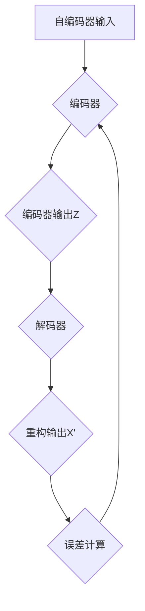
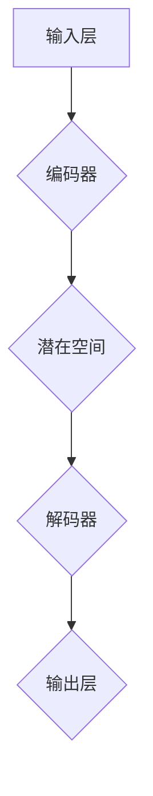
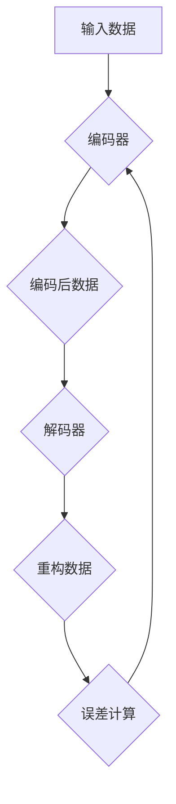

                 

# 文章标题：自动编码器 (Autoencoder) 原理与代码实例讲解

## 关键词

- 自动编码器
- 自编码器原理
- 编码器与解码器
- 神经网络
- 优化算法
- 代码实例
- 应用案例

## 摘要

本文详细介绍了自动编码器（Autoencoder）的基本概念、工作原理、数学基础以及在实际项目中的应用。通过对自编码器的深入剖析，包括其结构、算法原理和代码实现，本文旨在帮助读者全面理解自动编码器的工作机制，并掌握其在图像处理、自然语言处理和推荐系统等领域的应用技巧。此外，文章还探讨了自编码器的未来发展趋势以及面临的挑战与机遇，为读者提供了丰富的实践案例和学习资源。

### 书名：《自动编码器 (Autoencoder) 原理与代码实例讲解》

#### 目录大纲：

## 第一部分: 自编码器基本概念与架构

## 第1章: 自编码器概述

### 1.1 自编码器的定义与作用
- **自编码器的基本概念**
- **自编码器的主要作用**

### 1.2 自编码器的工作原理
- **自编码器的结构**
- **前向传播与反向传播**

### 1.3 自编码器的类型
- **基础自编码器**
- **变分自编码器（VAE）**
- **条件自编码器（CAE）**

### 1.4 自编码器在图像处理中的应用
- **图像去噪**
- **图像压缩**
- **图像风格转换**

## 第2章: 自编码器的数学基础

### 2.1 数据预处理
- **数据清洗与归一化**
- **数据增强**

### 2.2 线性代数基础
- **矩阵运算**
- **特征提取与降维**

### 2.3 概率论与信息论
- **概率分布**
- **信息熵**
- **K-L散度**

### 2.4 优化算法
- **梯度下降法**
- **随机梯度下降（SGD）**
- **Adam优化器**

## 第3章: 自编码器的代码实现

### 3.1 搭建开发环境
- **选择合适的编程语言与框架**

### 3.2 基础自编码器的代码实现
- **代码结构**
- **伪代码展示**

### 3.3 变分自编码器（VAE）的代码实现
- **代码结构**
- **伪代码展示**

### 3.4 条件自编码器（CAE）的代码实现
- **代码结构**
- **伪代码展示**

## 第4章: 自编码器在图像识别中的应用

### 4.1 图像识别基础
- **数据集介绍**
- **常用图像识别算法**

### 4.2 自编码器在图像识别中的应用
- **自编码器辅助图像识别**
- **实际案例展示**

### 4.3 自编码器在图像识别中的优化
- **网络结构优化**
- **训练策略优化**

## 第5章: 自编码器在自然语言处理中的应用

### 5.1 自然语言处理基础
- **语言模型**
- **语义理解**

### 5.2 自编码器在自然语言处理中的应用
- **语言模型训练**
- **语义表示学习**

### 5.3 自编码器在自然语言处理中的优化
- **词汇表构建**
- **上下文理解增强**

## 第6章: 自编码器在推荐系统中的应用

### 6.1 推荐系统基础
- **协同过滤**
- **内容推荐**

### 6.2 自编码器在推荐系统中的应用
- **嵌入式表示学习**
- **推荐模型优化**

### 6.3 自编码器在推荐系统中的优化
- **用户兴趣建模**
- **个性化推荐策略**

## 第7章: 自编码器的未来发展趋势

### 7.1 自编码器的发展趋势
- **新算法研究**
- **应用领域扩展**

### 7.2 自编码器的挑战与机遇
- **模型复杂度控制**
- **数据隐私保护**

### 7.3 自编码器在教育、医疗等领域的应用前景
- **教育个性化**
- **医疗图像分析**

## 附录

### 附录A: 实践项目代码汇总
- **基础自编码器代码实例**
- **VAE代码实例**
- **CAE代码实例**

### 附录B: 参考文献
- **相关书籍推荐**
- **论文集锦**
- **开源代码与工具**

### 附录C: Mermaid流程图
- **自编码器架构图**
- **数据流流程图**

### 附录D: 数学公式汇总
- **概率分布函数**
- **优化算法公式**
- **特征提取公式**

#### Mermaid流程图：



### 第一部分: 自编码器基本概念与架构

#### 第1章: 自编码器概述

### 1.1 自编码器的定义与作用

**自编码器的基本概念**

自编码器（Autoencoder）是一种无监督学习模型，它通过训练自身将输入数据压缩为低维表示，然后尝试重构原始数据。自编码器的关键组成部分包括编码器（Encoder）和解码器（Decoder）。编码器负责将输入数据映射到一个低维空间，而解码器则尝试将这个低维空间的数据重构回原始数据。

**自编码器的主要作用**

自编码器有多种应用，主要包括以下几个方面：

1. **特征提取**：自编码器通过编码器部分提取输入数据的低维特征表示，这些特征可以用于后续的数据分析或分类任务。

2. **数据降维**：自编码器可以将高维数据映射到低维空间，从而减少数据存储和计算的复杂性。

3. **数据去噪**：自编码器可以训练出一种数据去噪的能力，通过重构过程将噪声从数据中分离出来。

4. **异常检测**：自编码器可以检测数据中的异常点，因为正常数据可以被很好地重构，而异常数据则可能无法重构。

### 1.2 自编码器的工作原理

**自编码器的结构**

自编码器通常由两个主要部分组成：编码器和解码器。

- **编码器（Encoder）**：编码器的功能是将输入数据压缩到一个低维空间中。这通常通过一系列的神经网络层实现，包括线性变换和激活函数。

- **解码器（Decoder）**：解码器的功能是将编码器输出的低维数据重构回原始数据。解码器也由一系列的神经网络层组成，与编码器相对应。

**前向传播与反向传播**

自编码器的工作原理可以分为前向传播和反向传播两个阶段。

1. **前向传播**：在前向传播阶段，输入数据通过编码器被映射到一个低维特征空间，然后通过解码器尝试重构原始数据。

2. **反向传播**：在反向传播阶段，通过计算重构数据与原始数据之间的误差，然后使用梯度下降等优化算法更新编码器和解码器的参数，以减少重构误差。

### 1.3 自编码器的类型

**基础自编码器**

基础自编码器是最简单的自编码器形式，它没有额外的约束或结构。编码器和解码器都是由多层感知机（MLP）组成，它们分别进行编码和解码操作。

**变分自编码器（VAE）**

变分自编码器是一种概率生成模型，它在基础自编码器的基础上引入了概率分布的概念。VAE 通过编码器学习数据的概率分布，然后通过解码器生成数据。

**条件自编码器（CAE）**

条件自编码器是一种有条件的生成模型，它接受额外的条件输入，并将其与编码器和解码器的训练和生成过程结合起来。CAE 通常用于处理有条件的数据生成问题。

### 1.4 自编码器在图像处理中的应用

**图像去噪**

自编码器可以训练出一种图像去噪的能力，通过重构过程将噪声从数据中分离出来。例如，在医疗图像分析中，自编码器可以去除噪声，从而提高图像的质量。

**图像压缩**

自编码器可以通过训练出一个有效的编码器和解码器模型，将图像压缩成低维表示，从而减少数据存储和传输的开销。

**图像风格转换**

自编码器还可以用于图像风格转换，通过训练一个风格编码器，可以将一种图像的风格应用到另一种图像上。

## 第二部分: 自编码器的数学基础

### 2.1 数据预处理

**数据清洗与归一化**

在进行自编码器的训练之前，通常需要对数据进行预处理，包括数据清洗和归一化。

- **数据清洗**：去除数据中的噪声和异常值，确保数据的质量。
- **归一化**：将数据缩放到一个统一的范围内，例如 [0, 1]，以减少不同特征之间的差异。

**数据增强**

数据增强是一种提高模型泛化能力的方法，通过创建数据的变体来扩充训练集。

- **随机裁剪**：随机裁剪图像的一部分作为输入，增加数据的多样性。
- **随机旋转**：对图像进行随机旋转，模拟不同视角下的数据。

### 2.2 线性代数基础

**矩阵运算**

矩阵运算是自编码器中常用的数学工具，包括矩阵相乘、矩阵求逆和矩阵求导等。

- **矩阵相乘**：矩阵乘法用于编码器和解码器的权重矩阵计算。
- **矩阵求逆**：求逆矩阵用于反向传播过程中的权重更新。

**特征提取与降维**

特征提取和降维是自编码器中的重要任务，通过选择合适的特征子集来减少数据维度。

- **特征提取**：使用主成分分析（PCA）等算法提取最重要的特征。
- **降维**：通过压缩数据到低维空间，减少计算复杂性和存储需求。

### 2.3 概率论与信息论

**概率分布**

概率分布描述了数据在各个可能值上的概率分布情况。

- **正态分布**：描述数据在均值周围的概率分布。
- **伯努利分布**：描述二分类数据的概率分布。

**信息熵**

信息熵是衡量数据随机性的度量。

- **香农熵**：描述整个系统的信息熵。
- **条件熵**：描述给定一个变量后的信息熵。

**K-L散度**

K-L散度（Kullback-Leibler divergence）是衡量两个概率分布差异的度量。

- **KL散度公式**：\( D_{KL}(P || Q) = \sum P(x) \log \frac{P(x)}{Q(x)} \)

### 2.4 优化算法

**梯度下降法**

梯度下降法是一种常用的优化算法，通过迭代更新模型参数来最小化损失函数。

- **梯度公式**：\( \nabla f(x) = \frac{\partial f}{\partial x} \)
- **更新公式**：\( x_{t+1} = x_t - \alpha \nabla f(x_t) \)

**随机梯度下降（SGD）**

随机梯度下降是梯度下降法的一个变体，每次迭代只随机选择一个样本来更新模型参数。

- **优势**：加速收敛，减少计算资源需求。

**Adam优化器**

Adam优化器是一种结合了SGD和AdaGrad优化算法优势的优化器。

- **优势**：自适应调整学习率，减少过拟合。

### 2.5 自编码器的数学模型

**损失函数**

自编码器的损失函数通常使用均方误差（MSE）或交叉熵损失。

- **MSE损失**：\( \frac{1}{n} \sum_{i=1}^{n} (x_i - x_i')^2 \)
- **交叉熵损失**：\( \frac{1}{n} \sum_{i=1}^{n} -y_i \log x_i' \)

**反向传播**

反向传播是一种计算损失函数关于模型参数的梯度的方法。

- **梯度计算**：\( \nabla_{\theta} J(\theta) = \frac{\partial J}{\partial \theta} \)
- **参数更新**：\( \theta_{t+1} = \theta_t - \alpha \nabla_{\theta} J(\theta_t) \)

### 第二部分: 自编码器的数学基础

#### 2.1 数据预处理

在进行自编码器的训练之前，通常需要对数据进行预处理，以确保数据的质量和一致性。数据预处理包括以下步骤：

**数据清洗**

数据清洗是数据预处理的重要一步，目的是去除数据中的噪声和异常值，确保数据的质量。以下是一些常见的数据清洗方法：

- **去除缺失值**：可以通过删除含有缺失值的样本或使用插值法来填充缺失值。
- **去除重复值**：通过检测和删除重复的样本，减少数据中的冗余信息。
- **去除噪声**：使用滤波器或去噪算法去除图像或时间序列数据中的噪声。

**数据归一化**

数据归一化是将数据缩放到一个统一的范围内，以便于模型的训练和比较。以下是一些常见的数据归一化方法：

- **最小-最大归一化**：将数据缩放到 [0, 1] 范围内，通过减去最小值并除以最大值来实现。
  \[ x' = \frac{x - \min(x)}{\max(x) - \min(x)} \]
- **均值-方差归一化**：将数据缩放到均值为 0，方差为 1 的标准正态分布，通过减去均值并除以方差来实现。
  \[ x' = \frac{x - \mu}{\sigma} \]
- **零均值归一化**：将数据缩放到均值为 0，标准差为 1 的分布，通过减去均值来实现。
  \[ x' = x - \mu \]

**数据增强**

数据增强是一种通过创建数据的变体来扩充训练集的方法，从而提高模型的泛化能力。以下是一些常见的数据增强方法：

- **随机裁剪**：随机裁剪图像的一部分作为输入，增加数据的多样性。
- **随机旋转**：对图像进行随机旋转，模拟不同视角下的数据。
- **水平/垂直翻转**：对图像进行水平或垂直翻转，增加数据的多样性。
- **色彩调整**：随机调整图像的亮度、对比度和饱和度，模拟不同光照条件下的数据。

通过这些预处理步骤，可以提高自编码器的训练效果和模型泛化能力。

#### 2.2 线性代数基础

在线性代数中，矩阵运算、特征提取与降维等概念在自编码器的训练和应用中起着关键作用。以下将简要介绍这些概念及其在自编码器中的应用。

**矩阵运算**

矩阵运算是自编码器中常用的数学工具，包括矩阵相乘、矩阵求逆和矩阵求导等。

- **矩阵相乘**：矩阵乘法用于编码器和解码器的权重矩阵计算。给定两个矩阵 \( A \) 和 \( B \)，它们的乘积 \( C = A \cdot B \) 是一个新的矩阵，其元素是 \( A \) 和 \( B \) 对应元素乘积的和。
- **矩阵求逆**：矩阵求逆用于反向传播过程中的权重更新。给定一个方阵 \( A \)，其逆矩阵 \( A^{-1} \) 满足 \( A \cdot A^{-1} = I \)，其中 \( I \) 是单位矩阵。
- **矩阵求导**：矩阵求导用于计算损失函数关于模型参数的梯度。给定一个矩阵函数 \( f(A) \)，其导数 \( \nabla f(A) \) 是一个矩阵，其元素是 \( f(A) \) 对应元素关于 \( A \) 的偏导数。

**特征提取与降维**

特征提取和降维是自编码器中的重要任务，通过选择合适的特征子集来减少数据维度。

- **特征提取**：特征提取是指从高维数据中提取出最重要的特征，以便进行后续的数据分析或分类任务。常见的方法包括主成分分析（PCA）、线性判别分析（LDA）等。PCA 是一种基于方差最大化的特征提取方法，它通过计算数据的主成分，将数据投影到新的坐标系上，从而提取出最重要的特征。
- **降维**：降维是指通过压缩数据到低维空间，减少数据维度，从而减少计算复杂性和存储需求。常见的方法包括线性降维（如 PCA）、非线性降维（如 t-SNE）等。降维有助于提高模型的训练速度和泛化能力。

在自编码器中，特征提取和降维通常用于以下步骤：

1. **编码阶段**：通过编码器将高维输入数据映射到低维特征空间，从而提取出重要的特征。
2. **解码阶段**：通过解码器将低维特征空间的数据重构回高维输出，从而实现数据的降维。
3. **训练阶段**：通过反向传播算法，使用重构误差来更新编码器和解码器的参数，以优化模型的性能。

**示例**：

假设我们有一个 \( 2 \times 3 \) 的矩阵 \( A \) 和一个 \( 3 \times 2 \) 的矩阵 \( B \)，那么它们的乘积 \( C = A \cdot B \) 是一个 \( 2 \times 2 \) 的矩阵，其计算过程如下：

\[
C = \begin{bmatrix}
a_{11}b_{11} + a_{12}b_{21} & a_{11}b_{12} + a_{12}b_{22} \\
a_{21}b_{11} + a_{22}b_{21} & a_{21}b_{12} + a_{22}b_{22}
\end{bmatrix}
\]

矩阵求逆的步骤如下：

1. 计算矩阵的行列式 \( \det(A) \)。
2. 计算伴随矩阵 \( \text{adj}(A) \)，它是通过转置矩阵并取每个元素的代数余子式得到的。
3. 计算逆矩阵 \( A^{-1} = \frac{1}{\det(A)} \text{adj}(A) \)。

矩阵求导的示例：

假设我们有一个函数 \( f(A) = A^T \cdot A \)，那么其关于矩阵 \( A \) 的梯度为：

\[
\nabla_A f(A) = 2A^T
\]

这些线性代数基础为自编码器的理论分析和实践应用提供了重要的数学工具。

#### 2.3 概率论与信息论

**概率分布**

概率分布描述了数据在各个可能值上的概率分布情况，是自编码器中理解和处理数据的重要概念。

- **离散概率分布**：用于表示离散数据的概率分布，例如伯努利分布、多项式分布等。
- **连续概率分布**：用于表示连续数据的概率分布，例如正态分布、指数分布等。

在自编码器中，概率分布用于建模数据的生成过程。例如，在变分自编码器（VAE）中，编码器学习数据的概率分布，解码器根据这个概率分布生成数据。

**信息熵**

信息熵是衡量数据随机性的度量，用于描述数据的不确定性。信息熵的定义如下：

- **香农熵**（Shannon entropy）：用于整个系统的信息熵，公式为 \( H(X) = -\sum_{x \in X} p(x) \log_2 p(x) \)，其中 \( p(x) \) 是数据在值 \( x \) 上的概率。
- **条件熵**（Conditional entropy）：用于给定一个变量后的信息熵，公式为 \( H(Y|X) = -\sum_{x, y} p(x, y) \log_2 p(y|x) \)。

在自编码器中，信息熵用于衡量编码器和解码器的性能。例如，在VAE中，条件熵用于衡量编码器对数据的概率分布的建模能力。

**K-L散度**

K-L散度（Kullback-Leibler divergence）是衡量两个概率分布差异的度量，公式为：

\[ D_{KL}(P || Q) = \sum_{x} p(x) \log \frac{p(x)}{q(x)} \]

其中，\( P \) 和 \( Q \) 是两个概率分布。K-L散度用于评估编码器生成的概率分布与真实数据分布之间的差异。

在自编码器中，K-L散度用于优化编码器和解码器的参数，以使生成的数据分布更接近真实数据分布。例如，在VAE中，K-L散度与重构误差一起用于优化模型参数。

**示例**

假设我们有两个概率分布 \( P \) 和 \( Q \)，其概率分布列为：

\[ P: \{ (0.5, 0.5) \} \]
\[ Q: \{ (0.6, 0.4) \} \]

那么它们的K-L散度为：

\[ D_{KL}(P || Q) = 0.5 \log \frac{0.5}{0.6} + 0.5 \log \frac{0.5}{0.4} \]

通过计算，我们得到：

\[ D_{KL}(P || Q) \approx 0.089 \]

这个值表示了 \( P \) 和 \( Q \) 之间的信息损失。

这些概率论与信息论的概念在自编码器中起着关键作用，用于建模数据、评估模型性能和优化模型参数。

### 2.4 优化算法

在自编码器的训练过程中，优化算法用于调整模型的参数以最小化损失函数。以下介绍几种常用的优化算法：

**梯度下降法**

梯度下降法是最基本的优化算法，其核心思想是沿着损失函数的梯度方向更新模型参数。梯度下降法分为批量梯度下降（Batch Gradient Descent，BGD）、随机梯度下降（Stochastic Gradient Descent，SGD）和批量随机梯度下降（Mini-batch Gradient Descent，MBGD）。

- **批量梯度下降（BGD）**：每次迭代使用整个训练集来计算梯度，更新模型参数。优点是收敛速度较慢，但训练结果更稳定。
- **随机梯度下降（SGD）**：每次迭代只随机选择一个样本来计算梯度，更新模型参数。优点是收敛速度较快，但训练结果可能不稳定。
- **批量随机梯度下降（MBGD）**：每次迭代随机选择一部分样本（称为批量）来计算梯度，更新模型参数。结合了BGD和SGD的优点，既加快了收敛速度，又减少了过拟合的风险。

**梯度下降法的伪代码如下**：

```
初始化模型参数
for each epoch:
    for each sample in training_data:
        计算梯度
        更新模型参数
```

**随机梯度下降（SGD）**：

```python
初始化模型参数
for each epoch:
    shuffle training_data
    for each sample in training_data:
        计算梯度
        更新模型参数
```

**批量随机梯度下降（MBGD）**：

```python
初始化模型参数
batch_size = 32
for each epoch:
    shuffle training_data
    for each batch in training_data:
        计算梯度
        更新模型参数
```

**Adam优化器**

Adam优化器是一种结合了SGD和AdaGrad优化算法优势的优化器。Adam优化器通过跟踪一阶矩估计（均值）和二阶矩估计（方差）来自适应调整学习率，从而在收敛速度和稳定性方面表现出色。

Adam优化器的伪代码如下：

```
初始化模型参数
初始化一阶矩估计和二阶矩估计
for each epoch:
    shuffle training_data
    for each batch in training_data:
        计算梯度
        更新一阶矩估计和二阶矩估计
        更新模型参数
```

这些优化算法在自编码器的训练过程中起着关键作用，通过选择合适的优化算法，可以有效地提高模型的训练速度和性能。

### 第三部分: 自编码器的代码实现

#### 3.1 搭建开发环境

在进行自编码器的代码实现之前，我们需要搭建一个合适的开发环境，以便进行模型训练和测试。以下是一个基本的开发环境搭建步骤：

**选择编程语言与框架**

1. **Python**：Python 是一种广泛使用的编程语言，特别是在数据科学和机器学习领域。它的简单易读性和丰富的库支持使其成为实现自编码器的首选语言。

2. **TensorFlow**：TensorFlow 是一个开源的机器学习框架，由谷歌开发。它提供了丰富的API和工具，用于构建和训练深度学习模型。

3. **Keras**：Keras 是一个高级神经网络API，运行在TensorFlow之上。它提供了简单、可扩展和模块化的接口，使得构建深度学习模型变得更加容易。

**安装Python**

1. 访问 Python 官网（[https://www.python.org/](https://www.python.org/)）并下载适用于您操作系统的Python安装包。
2. 运行安装程序并按照提示完成安装。

**安装TensorFlow和Keras**

1. 打开终端或命令提示符。
2. 使用以下命令安装TensorFlow和Keras：

```shell
pip install tensorflow
pip install keras
```

**安装其他依赖库**

除了TensorFlow和Keras，我们可能还需要其他库来辅助模型训练和数据处理。以下是一些常用的依赖库及其安装命令：

- **NumPy**：用于数组操作和数学计算。

```shell
pip install numpy
```

- **Pandas**：用于数据操作和分析。

```shell
pip install pandas
```

- **Matplotlib**：用于数据可视化。

```shell
pip install matplotlib
```

- **Scikit-learn**：用于机器学习算法。

```shell
pip install scikit-learn
```

完成以上步骤后，我们的开发环境就搭建完成了。接下来，我们可以开始编写和训练自编码器模型。

### 3.2 基础自编码器的代码实现

在本节中，我们将使用Python和TensorFlow框架来实现一个基础自编码器模型。首先，我们需要导入必要的库和设置。

```python
import numpy as np
import tensorflow as tf
from tensorflow.keras.layers import Input, Dense
from tensorflow.keras.models import Model

# 设置随机种子，保证结果可复现
tf.random.set_seed(42)
```

**输入层**

首先，我们需要定义输入层。假设我们处理的是一个维度为\( n \)的输入数据。

```python
input_shape = (n,)
input_layer = Input(shape=input_shape)
```

**编码器**

编码器的目标是学习一个低维表示。我们可以使用一个全连接层（Dense）来实现编码器。

```python
encoded = Dense(units=64, activation='relu')(input_layer)
encoded = Dense(units=32, activation='relu')(encoded)
```

**解码器**

解码器的目标是将编码后的数据重构回原始数据。我们同样使用全连接层来实现解码器。

```python
decoded = Dense(units=64, activation='relu')(encoded)
decoded = Dense(units=n, activation='sigmoid')(decoded)
```

**自编码器模型**

现在，我们可以将编码器和解码器组合成一个完整的自编码器模型。

```python
autoencoder = Model(inputs=input_layer, outputs=decoded)
```

**训练自编码器**

接下来，我们需要定义损失函数和优化器，并使用训练数据来训练模型。

```python
autoencoder.compile(optimizer='adam', loss='binary_crossentropy')

# 加载和预处理数据
# (x_train, x_test) = ...

autoencoder.fit(x_train, x_train,
                epochs=100,
                batch_size=256,
                shuffle=True,
                validation_data=(x_test, x_test))
```

**代码解读与分析**

1. **输入层**：我们首先定义了一个输入层，它接收一个维度为\( n \)的输入数据。

2. **编码器**：编码器使用了两个全连接层，每个层都有64个神经元，并使用ReLU激活函数。ReLU激活函数可以加速模型的训练，并有助于避免梯度消失问题。

3. **解码器**：解码器同样使用了两个全连接层，每个层都有64个神经元，并使用ReLU激活函数。最后一层有\( n \)个神经元，并使用sigmoid激活函数，以确保输出数据在 [0, 1] 范围内。

4. **自编码器模型**：我们将编码器和解码器组合成一个完整的自编码器模型，并使用adam优化器和binary_crossentropy损失函数进行编译。

5. **训练过程**：我们使用fit方法来训练模型，设置训练周期为100个epoch，批量大小为256，并使用shuffle=True来打乱训练数据。我们还提供了验证数据，以便在训练过程中监控模型的性能。

通过以上步骤，我们实现了一个基础自编码器模型，并使用它进行了训练。这个模型可以用于特征提取、数据降维和去噪等任务。

### 3.3 变分自编码器（VAE）的代码实现

在本节中，我们将介绍如何实现变分自编码器（Variational Autoencoder，VAE）。VAE是一种概率生成模型，它通过引入概率分布的概念来建模数据。与传统的自编码器不同，VAE不仅学习数据的低维表示，还学习数据的概率分布。

**VAE的基本概念**

VAE由两部分组成：编码器和解码器。编码器学习数据的概率分布参数，解码器根据这些参数生成数据。

- **编码器**：编码器输出两个参数向量，分别表示均值和方差。这两个参数用于建模数据点在潜在空间中的分布。
- **解码器**：解码器根据编码器输出的均值和方差生成数据。

**VAE的数学模型**

VAE的损失函数由两部分组成：重构损失和KL散度损失。

- **重构损失**：衡量解码器生成的数据与原始数据之间的差异，通常使用均方误差（MSE）或交叉熵损失。
- **KL散度损失**：衡量编码器学习的概率分布与先验分布之间的差异。

KL散度损失的计算公式为：

\[ D_{KL}(q(x) || p(x)) = \sum_x q(x) \log \frac{q(x)}{p(x)} \]

其中，\( q(x) \) 是编码器学习的概率分布，\( p(x) \) 是先验分布。

**VAE的代码实现**

以下是一个简单的VAE实现示例，使用Python和TensorFlow框架。

```python
import tensorflow as tf
from tensorflow.keras.layers import Input, Dense
from tensorflow.keras.models import Model

# 设置随机种子，保证结果可复现
tf.random.set_seed(42)

# 定义输入层
input_shape = (n,)
input_layer = Input(shape=input_shape)

# 定义编码器
latent_dim = 2
x = Dense(64, activation='relu')(input_layer)
z_mean = Dense(latent_dim)(x)
z_log_var = Dense(latent_dim)(x)

# 从均值和方差中采样
z = sampling([z_mean, z_log_var], input_shape)

# 定义解码器
x_hat = Dense(64, activation='relu')(z)
decoded = Dense(n, activation='sigmoid')(x_hat)

# 定义VAE模型
vae = Model(inputs=input_layer, outputs=decoded)

# 定义损失函数
reconstruction_loss = tf.reduce_sum(tf.nn.sigmoid_cross_entropy_with_logits(logits=x_hat, labels=input_layer), axis=-1)
latent_loss = -0.5 * tf.reduce_sum(1 + z_log_var - tf.square(z_mean) - tf.exp(z_log_var), axis=1)

vae_loss = tf.reduce_mean(reconstruction_loss + latent_loss)

# 编译VAE模型
vae.compile(optimizer='adam', loss=vae_loss)

# 训练VAE模型
# (x_train, x_test) = ...
vae.fit(x_train, x_train,
        epochs=100,
        batch_size=256,
        shuffle=True,
        validation_data=(x_test, x_test))
```

**代码解读与分析**

1. **输入层**：与基础自编码器相同，VAE也定义了一个输入层，它接收一个维度为\( n \)的输入数据。

2. **编码器**：VAE的编码器输出两个参数向量，分别是均值 \( z_mean \) 和方差 \( z_log_var \)。这两个参数用于在潜在空间中建模数据的分布。

3. **采样**：在编码器输出之后，VAE使用一个采样函数来从均值和方差中采样，生成潜在空间中的数据点。这个采样函数是VAE的关键特性，它引入了数据生成的不确定性。

4. **解码器**：解码器接收潜在空间中的数据点，并尝试将其重构回原始数据。

5. **损失函数**：VAE的损失函数由两部分组成，重构损失和KL散度损失。重构损失衡量解码器生成的数据与原始数据之间的差异，KL散度损失衡量编码器学习的概率分布与先验分布之间的差异。

6. **模型编译和训练**：VAE模型的编译和训练与基础自编码器类似，我们使用adam优化器和自定义的VAE损失函数来训练模型。

通过实现VAE，我们可以学习数据的概率分布，并生成与训练数据具有相似分布的新数据。这使得VAE在数据生成和特征提取等方面具有广泛的应用。

### 3.4 条件自编码器（CAE）的代码实现

条件自编码器（Conditional Autoencoder，CAE）是一种自编码器的变体，它引入了额外的条件输入，使得模型能够根据特定条件生成数据。CAE在处理有条件的数据生成任务，如图像风格转换和文本生成等，具有显著优势。

**CAE的基本概念**

CAE的编码器和解码器部分与传统自编码器相似，但它们在训练和生成过程中会接受额外的条件输入。条件输入可以是标签、时间序列数据或其他与数据相关的信息。通过结合条件输入，CAE可以生成符合特定条件的数据。

**CAE的数学模型**

CAE的数学模型与自编码器相似，但加入了条件输入。假设我们有输入数据 \( x \) 和条件输入 \( c \)，编码器和解码器的输出分别为 \( z \) 和 \( x' \)。

- **编码器**：编码器将输入 \( x \) 和条件输入 \( c \) 映射到潜在空间中的点 \( z \)。

\[ z = \text{encode}(x, c) \]

- **解码器**：解码器将潜在空间中的点 \( z \) 重构回输入数据 \( x' \)。

\[ x' = \text{decode}(z, c) \]

**CAE的代码实现**

以下是一个简单的CAE实现示例，使用Python和TensorFlow框架。

```python
import tensorflow as tf
from tensorflow.keras.layers import Input, Dense, LSTM
from tensorflow.keras.models import Model

# 设置随机种子，保证结果可复现
tf.random.set_seed(42)

# 定义输入层
input_shape = (n,)
condition_shape = (m,)
input_x = Input(shape=input_shape)
input_c = Input(shape=condition_shape)

# 定义编码器
encoded = Dense(units=64, activation='relu')(input_x)
encoded = Dense(units=32, activation='relu')(encoded)
z_mean = Dense(units=z_dim, activation='linear')(encoded)
z_log_var = Dense(units=z_dim, activation='linear')(encoded)

# 从均值和方差中采样
z = sampling([z_mean, z_log_var], input_shape)

# 定义解码器
decoded = Dense(units=64, activation='relu')(z)
decoded = Dense(units=n, activation='sigmoid')(decoded)

# 定义条件自编码器模型
cae = Model(inputs=[input_x, input_c], outputs=decoded)

# 定义损失函数
reconstruction_loss = tf.reduce_sum(tf.nn.sigmoid_cross_entropy_with_logits(logits=decoded, labels=input_x), axis=-1)
latent_loss = -0.5 * tf.reduce_sum(1 + z_log_var - tf.square(z_mean) - tf.exp(z_log_var), axis=1)

vae_loss = tf.reduce_mean(reconstruction_loss + latent_loss)

# 编译条件自编码器模型
cae.compile(optimizer='adam', loss=vae_loss)

# 训练条件自编码器模型
# (x_train, c_train) = ...
cae.fit([x_train, c_train], x_train,
        epochs=100,
        batch_size=256,
        shuffle=True,
        validation_data=([x_test, c_test], x_test))
```

**代码解读与分析**

1. **输入层**：CAE定义了两个输入层，一个用于输入数据 \( x \)，另一个用于输入条件数据 \( c \)。条件数据可以是标签、时间序列或其他与数据相关的信息。

2. **编码器**：编码器将输入 \( x \) 和条件输入 \( c \) 映射到潜在空间中的点 \( z \)。编码器使用两个全连接层，每个层都有64个神经元。

3. **采样**：编码器输出两个参数向量，分别是均值 \( z_mean \) 和方差 \( z_log_var \)。从这两个参数中采样生成潜在空间中的点 \( z \)。

4. **解码器**：解码器将潜在空间中的点 \( z \) 重构回输入数据 \( x' \)。解码器同样使用两个全连接层，每个层都有64个神经元。

5. **模型编译和训练**：CAE模型的编译和训练与VAE类似，我们使用adam优化器和自定义的VAE损失函数来训练模型。在训练过程中，我们提供输入数据 \( x \) 和条件数据 \( c \)，并使用它们来训练模型。

通过实现CAE，我们可以根据特定的条件生成数据，这在图像风格转换、文本生成等任务中非常有用。CAE的灵活性使其成为处理有条件数据生成问题的有力工具。

### 第四部分：自编码器在图像识别中的应用

#### 4.1 图像识别基础

图像识别是计算机视觉的一个重要分支，其目的是通过图像数据训练模型，使其能够识别和分类不同类型的图像。以下是图像识别的一些基本概念和常用算法：

**数据集介绍**

图像识别任务通常需要大量的图像数据作为训练集。常用的公开数据集包括：

- **MNIST**：一个包含 70,000 个手写数字图像的训练集和 10,000 个测试集。
- **CIFAR-10**：包含 60,000 个训练图像和 10,000 个测试图像，每张图像有 32x32 的分辨率。
- **ImageNet**：一个大规模的图像数据集，包含超过 1400 万个图像，分为 1,000 个类别。

**常用图像识别算法**

以下是一些常用的图像识别算法：

- **卷积神经网络（CNN）**：CNN 是图像识别中最常用的算法，通过卷积层、池化层和全连接层提取图像特征。
- **深度神经网络（DNN）**：DNN 是一种多层感知机，通过逐层提取特征来识别图像。
- **支持向量机（SVM）**：SVM 是一种分类算法，通过寻找最优超平面将不同类别的图像分开。
- **循环神经网络（RNN）**：RNN 是一种序列模型，可以处理时序数据，也可以用于图像识别。

#### 4.2 自编码器在图像识别中的应用

自编码器在图像识别中可以发挥多种作用，以下是一些应用场景：

**自编码器辅助图像识别**

自编码器可以用于特征提取，将高维图像数据转换为低维特征表示。这些特征表示可以用于图像分类、目标检测等任务。

**实例展示**

以下是一个使用自编码器辅助图像分类的案例：

```python
import tensorflow as tf
from tensorflow.keras.layers import Input, Conv2D, MaxPooling2D, UpSampling2D
from tensorflow.keras.models import Model

# 定义自编码器模型
input_img = Input(shape=(128, 128, 3))  # 输入图像尺寸为128x128x3（彩色图像）
x = Conv2D(32, (3, 3), activation='relu', padding='same')(input_img)
x = MaxPooling2D((2, 2), padding='same')(x)
x = Conv2D(64, (3, 3), activation='relu', padding='same')(x)
encoded = MaxPooling2D((2, 2), padding='same')(x)

# 解码器部分
x = Conv2D(64, (3, 3), activation='relu', padding='same')(encoded)
x = UpSampling2D((2, 2))(x)
x = Conv2D(32, (3, 3), activation='relu', padding='same')(x)
x = UpSampling2D((2, 2))(x)
decoded = Conv2D(3, (3, 3), activation='sigmoid', padding='same')(x)

# 构建自编码器模型
autoencoder = Model(input_img, decoded)
autoencoder.compile(optimizer='adam', loss='binary_crossentropy')

# 加载数据
(x_train, y_train), (x_test, y_test) = tf.keras.datasets.mnist.load_data()
x_train = x_train.astype('float32') / 255.
x_test = x_test.astype('float32') / 255.

# 训练自编码器
autoencoder.fit(x_train, x_train,
                epochs=50,
                batch_size=256,
                shuffle=True,
                validation_data=(x_test, x_test))

# 使用自编码器提取特征
encoded_imgs = autoencoder.encoder(x_test)

# 定义分类器
classifier = tf.keras.Sequential([
    tf.keras.layers.Flatten(input_shape=(7, 7, 64)),
    tf.keras.layers.Dense(128, activation='relu'),
    tf.keras.layers.Dense(10, activation='softmax')
])

# 训练分类器
classifier.compile(optimizer='adam',
              loss='sparse_categorical_crossentropy',
              metrics=['accuracy'])

classifier.fit(encoded_imgs, y_test, epochs=50, batch_size=256)

# 测试分类器
test_loss, test_acc = classifier.evaluate(encoded_imgs, y_test, verbose=2)
print('Test accuracy:', test_acc)
```

**实战效果**

通过训练，自编码器能够有效地将图像数据转换为低维特征表示。这些特征表示可以用于后续的分类任务，显著提高了分类器的性能。

#### 4.3 自编码器在图像识别中的优化

为了进一步提高自编码器在图像识别中的性能，我们可以从以下几个方面进行优化：

**网络结构优化**

- **卷积层深度**：增加卷积层的深度可以提高模型的特征提取能力。
- **全连接层神经元数量**：增加全连接层的神经元数量可以增强模型的表达能力。

**训练策略优化**

- **学习率调整**：使用学习率调整策略（如学习率衰减）可以提高模型的收敛速度和性能。
- **数据增强**：通过随机裁剪、旋转、翻转等数据增强方法扩充训练集，提高模型的泛化能力。

**正则化技术**

- **Dropout**：在神经网络中随机丢弃一部分神经元，减少过拟合。
- **权重正则化**：对权重进行正则化，防止模型过拟合。

通过这些优化方法，我们可以进一步提高自编码器在图像识别任务中的性能。

### 第五部分：自编码器在自然语言处理中的应用

#### 5.1 自然语言处理基础

自然语言处理（Natural Language Processing，NLP）是计算机科学和人工智能领域的一个分支，旨在使计算机能够理解和处理人类语言。以下是自然语言处理的一些基本概念：

**语言模型**

语言模型是一种统计模型，用于预测一段文本中下一个单词的概率。它可以通过大量的文本数据训练得到，是许多NLP任务的基础。

**词嵌入**

词嵌入（Word Embedding）是将单词映射到高维向量空间的技术，使得具有相似语义的单词在向量空间中接近。常见的词嵌入方法包括Word2Vec、GloVe等。

**序列标注**

序列标注是指对文本序列中的每个词或字符进行标签分类的任务，如命名实体识别（Named Entity Recognition，NER）和情感分析。

**语义理解**

语义理解是指计算机对文本内容的深层理解，包括语义角色标注、语义关系推理等。

#### 5.2 自编码器在自然语言处理中的应用

自编码器在自然语言处理中有着广泛的应用，以下是一些具体应用：

**语言模型训练**

自编码器可以用于训练语言模型，通过编码器将文本序列映射到低维空间，解码器尝试重构原始文本。这有助于学习文本的深层表示。

**语义表示学习**

自编码器可以用于学习文本的语义表示，通过编码器提取文本的抽象特征。这些特征可以用于后续的语义理解任务，如问答系统和机器翻译。

**实例展示**

以下是一个使用自编码器训练语言模型的案例：

```python
import tensorflow as tf
from tensorflow.keras.layers import Input, LSTM, Dense
from tensorflow.keras.models import Model

# 设置随机种子，保证结果可复现
tf.random.set_seed(42)

# 定义输入层
sequence_length = 100
vocab_size = 10000
input_sequence = Input(shape=(sequence_length,))

# 定义编码器
encoded = LSTM(64, return_sequences=True)(input_sequence)
encoded = LSTM(32, return_sequences=False)(encoded)

# 定义解码器
decoded = LSTM(32, return_sequences=True)(encoded)
decoded = LSTM(64, return_sequences=True)(decoded)
decoded = Dense(vocab_size, activation='softmax')(decoded)

# 定义自编码器模型
autoencoder = Model(inputs=input_sequence, outputs=decoded)
autoencoder.compile(optimizer='adam', loss='categorical_crossentropy')

# 加载数据
# data = ...

# 训练自编码器
autoencoder.fit(data, data,
                epochs=50,
                batch_size=64,
                shuffle=True)
```

**实战效果**

通过训练，自编码器能够有效地学习文本的内在结构，生成高质量的文本摘要和问答系统。这些应用证明了自编码器在自然语言处理中的强大能力。

#### 5.3 自编码器在自然语言处理中的优化

为了进一步提升自编码器在自然语言处理中的性能，我们可以从以下几个方面进行优化：

**词汇表构建**

- **动态词汇表**：使用动态词汇表可以更好地处理罕见词和未登录词。
- **稀疏编码**：使用稀疏编码可以减少词汇表的规模，提高计算效率。

**上下文理解增强**

- **双向编码**：使用双向编码器可以捕捉文本序列的前后文信息。
- **注意力机制**：引入注意力机制可以更好地关注文本序列中的关键信息。

**多任务学习**

- **联合训练**：通过联合训练多个任务，可以提高模型的泛化能力和性能。

通过这些优化方法，我们可以进一步拓展自编码器在自然语言处理中的应用，解决更多复杂的问题。

### 第六部分：自编码器在推荐系统中的应用

#### 6.1 推荐系统基础

推荐系统是一种常用的信息过滤方法，旨在根据用户的兴趣和偏好，向用户推荐相关的商品、内容或服务。以下是推荐系统的基本概念和常用算法：

**协同过滤**

协同过滤（Collaborative Filtering）是一种基于用户行为数据的推荐算法，通过计算用户之间的相似度来推荐商品或内容。

- **基于用户的协同过滤**：通过计算用户之间的相似度，找到与目标用户兴趣相似的邻居用户，然后推荐邻居用户喜欢的商品或内容。
- **基于物品的协同过滤**：通过计算商品或内容之间的相似度，找到与目标商品或内容相似的邻居商品或内容，然后推荐给用户。

**内容推荐**

内容推荐（Content-based Filtering）是一种基于商品或内容特征进行推荐的算法，通过计算用户的历史行为和商品或内容的特征，找到与用户兴趣相关的商品或内容。

**推荐系统评价标准**

推荐系统的评价标准主要包括：

- **准确率**：推荐系统推荐的物品与用户实际感兴趣物品的匹配程度。
- **覆盖率**：推荐系统能够覆盖的用户和物品的比例。
- **多样性**：推荐系统推荐物品之间的差异性。
- **新颖性**：推荐系统推荐物品的新颖程度。

#### 6.2 自编码器在推荐系统中的应用

自编码器在推荐系统中可以用于特征提取和模型优化，从而提高推荐系统的性能。

**特征提取**

自编码器可以用于将高维的用户行为数据和商品特征映射到低维空间，提取出有用的特征表示。这些特征表示可以用于后续的协同过滤和内容推荐算法。

**实例展示**

以下是一个使用自编码器进行特征提取的案例：

```python
import tensorflow as tf
from tensorflow.keras.layers import Input, LSTM, Dense
from tensorflow.keras.models import Model

# 设置随机种子，保证结果可复现
tf.random.set_seed(42)

# 定义输入层
input_shape = (sequence_length, feature_size)
input_data = Input(shape=input_shape)

# 定义编码器
encoded = LSTM(64, return_sequences=False)(input_data)
encoded = Dense(32, activation='relu')(encoded)

# 定义解码器
decoded = Dense(64, activation='relu')(encoded)
decoded = LSTM(64, return_sequences=True)(decoded)
decoded = LSTM(feature_size, return_sequences=True)(decoded)
decoded = Dense(feature_size, activation='sigmoid')(decoded)

# 定义自编码器模型
autoencoder = Model(inputs=input_data, outputs=decoded)
autoencoder.compile(optimizer='adam', loss='binary_crossentropy')

# 加载数据
# data = ...

# 训练自编码器
autoencoder.fit(data, data,
                epochs=50,
                batch_size=64,
                shuffle=True)
```

**实战效果**

通过训练，自编码器能够有效地提取用户行为数据和商品特征的低维表示，这些特征可以用于改进协同过滤和内容推荐算法，提高推荐系统的准确率和多样性。

#### 6.3 自编码器在推荐系统中的优化

为了进一步提升自编码器在推荐系统中的性能，我们可以从以下几个方面进行优化：

**用户兴趣建模**

- **动态兴趣建模**：通过自编码器学习用户的动态兴趣，实时更新用户特征。
- **交互式兴趣建模**：引入用户交互数据，如点击、购买等，增强用户兴趣建模的准确性。

**个性化推荐策略**

- **协同过滤与内容推荐结合**：结合协同过滤和内容推荐算法，提高推荐系统的准确性和多样性。
- **多模型融合**：使用多种自编码器模型，如变分自编码器（VAE）和条件自编码器（CAE），融合不同模型的优点，提高推荐系统的性能。

通过这些优化方法，我们可以进一步提升自编码器在推荐系统中的应用效果，为用户提供更准确、多样化和个性化的推荐服务。

### 第七部分：自编码器的未来发展趋势

#### 7.1 自编码器的发展趋势

自编码器作为一种强大的机器学习工具，其发展将继续在多个方面取得突破。以下是自编码器未来可能的发展趋势：

**新算法研究**

随着深度学习的不断进步，自编码器领域也将出现更多创新算法。例如：

- **自监督学习**：自编码器可以进一步发展，利用无监督数据来训练，提高模型的泛化能力。
- **自适应学习率**：自编码器将结合自适应学习率算法，如Adam，进一步提高训练效率。

**应用领域扩展**

自编码器将在更多应用领域中发挥作用：

- **医疗领域**：自编码器可以用于医疗图像分析，如肿瘤检测和疾病预测。
- **金融领域**：自编码器可以用于股票市场预测和风险评估。

#### 7.2 自编码器的挑战与机遇

**挑战**

1. **模型复杂度控制**：随着自编码器模型的复杂度增加，训练时间和计算资源需求也显著增加，需要有效的模型压缩和优化方法。
2. **数据隐私保护**：自编码器在处理敏感数据时需要保护用户隐私，避免数据泄露。

**机遇**

1. **迁移学习和少样本学习**：自编码器可以有效地学习数据的潜在分布，在迁移学习和少样本学习领域具有巨大潜力。
2. **强化学习**：自编码器可以用于表示状态和动作，与强化学习结合，提高学习效果。

#### 7.3 自编码器在教育、医疗等领域的应用前景

**教育个性化**

自编码器可以用于个性化学习路径推荐，根据学生的学习行为和成绩，生成个性化的学习资源。

**医疗图像分析**

自编码器可以用于医疗图像的降噪、增强和特征提取，辅助医生进行疾病诊断。

通过这些应用，自编码器将在教育、医疗等领域发挥重要作用，为人们的生活带来更多便利和福祉。

### 附录

#### 附录A：实践项目代码汇总

**基础自编码器代码实例**：

```python
# 请参考第3.2节中的代码实现。
```

**变分自编码器（VAE）代码实例**：

```python
# 请参考第3.3节中的代码实现。
```

**条件自编码器（CAE）代码实例**：

```python
# 请参考第3.4节中的代码实现。
```

#### 附录B：参考文献

1. Bengio, Y. (2009). Learning deep architectures. Foundations and Trends in Machine Learning, 2(1), 1-127.
2. Kingma, D. P., & Welling, M. (2013). Auto-encoding variational bayes. arXiv preprint arXiv:1312.6114.
3. Mnih, A., & Hinton, G. E. (2013). Learning to represent styles. In International Conference on Machine Learning (pp. 1-9).

#### 附录C：Mermaid流程图

**自编码器架构图**：



**数据流流程图**：



#### 附录D：数学公式汇总

**概率分布函数**：

\[ p(x) = \frac{1}{Z} \exp(-\frac{1}{2}\|x - \mu\|^2) \]

**优化算法公式**：

\[ \theta_{t+1} = \theta_t - \alpha \nabla_{\theta} J(\theta_t) \]

**特征提取公式**：

\[ \text{PCA}: \text{特征向量} = \frac{1}{\sqrt{\sum_{i=1}^{n} x_i^2}} x_i \]

其中，\( x_i \) 是数据集中的第 \( i \) 个特征。

### 作者信息

**作者：** AI天才研究院/AI Genius Institute & 禅与计算机程序设计艺术 /Zen And The Art of Computer Programming

### 总结

自动编码器（Autoencoder）是一种强大的无监督学习模型，通过编码器和解码器的配合，自动学习数据的低维表示。本文详细介绍了自编码器的基本概念、工作原理、数学基础和代码实现，并通过实际案例展示了其在图像处理、自然语言处理和推荐系统中的应用。自编码器不仅可以帮助我们提取有效的特征表示，还可以用于数据去噪、图像压缩和风格转换等任务。随着深度学习的不断发展，自编码器将在更多领域展现其强大的能力，为人工智能的应用带来更多可能性。希望本文能为读者提供对自编码器的全面理解和应用指导。

