                 

## 文章标题：自动驾驶系统：感知、决策与控制

### 关键词：

- 自动驾驶
- 感知系统
- 决策系统
- 控制系统
- 激光雷达
- 摄像头
- 毫米波雷达
- 路径规划
- 行为规划
- 运动控制
- 制动控制
- 系统集成与测试

### 摘要：

本文深入探讨了自动驾驶系统的核心技术，包括感知、决策与控制三个关键模块。首先，我们回顾了自动驾驶系统的背景与发展，了解了其架构与组件。接着，详细介绍了感知系统中的激光雷达、摄像头和毫米波雷达，阐述了各自的工作原理和应用。随后，我们讨论了决策系统的路径规划与行为规划算法，解析了控制系统的运动控制和制动控制技术。最后，文章探讨了自动驾驶系统的系统集成与测试、部署与维护，以及相关法律法规和标准制定。通过这篇文章，读者可以全面了解自动驾驶系统的技术原理和实践应用。

## 目录大纲

### 第一部分：自动驾驶系统的概述

#### 第1章：自动驾驶系统的背景与发展

1.1 自动驾驶技术的定义与分类

1.2 自动驾驶技术在全球的发展现状

1.3 自动驾驶技术的未来趋势

1.4 自动驾驶技术对交通出行的影响

#### 第2章：自动驾驶系统的架构与组件

2.1 自动驾驶系统的总体架构

2.2 感知模块

2.3 决策模块

2.4 控制模块

2.5 协作与融合模块

### 第二部分：感知系统

#### 第3章：感知系统的概述

3.1 感知系统的作用与重要性

3.2 感知系统的数据处理流程

3.3 感知系统的关键技术

#### 第4章：激光雷达感知

4.1 激光雷达的工作原理

4.2 激光雷达的数据处理算法

4.3 激光雷达在实际中的应用案例

#### 第5章：摄像头感知

5.1 摄像头的工作原理

5.2 摄像头的数据处理算法

5.3 摄像头在实际中的应用案例

#### 第6章：毫米波雷达感知

6.1 毫米波雷达的工作原理

6.2 毫米波雷达的数据处理算法

6.3 毫米波雷达在实际中的应用案例

### 第三部分：决策系统

#### 第7章：决策系统的概述

7.1 决策系统的作用与重要性

7.2 决策系统的数据处理流程

7.3 决策系统的关键技术

#### 第8章：路径规划算法

8.1 路径规划的基本概念

8.2 最短路径算法

8.3 A*算法及其优化

8.4 动态规划算法

#### 第9章：行为规划算法

9.1 行为规划的基本概念

9.2 数据驱动行为规划

9.3 模型预测控制

9.4 人类行为建模与预测

### 第四部分：控制系统

#### 第10章：控制系统的概述

10.1 控制系统的作用与重要性

10.2 控制系统的数据处理流程

10.3 控制系统的关键技术

#### 第11章：自动驾驶车辆的运动控制

11.1 车辆动力学模型

11.2 PID控制算法

11.3 模型预测控制（MPC）

11.4 基于深度学习的控制算法

#### 第12章：自动驾驶车辆的制动控制

12.1 制动系统的工作原理

12.2 制动控制算法

12.3 自动紧急制动系统（AEB）

12.4 制动系统的稳定性分析

### 第五部分：系统集成与测试

#### 第13章：自动驾驶系统的集成

13.1 集成测试的方法与流程

13.2 集成测试中的关键问题

13.3 系统验证与性能评估

#### 第14章：自动驾驶系统的测试与验证

14.1 测试环境与测试场景设计

14.2 测试数据收集与处理

14.3 测试结果分析与优化

14.4 安全性与可靠性评估

#### 第15章：自动驾驶系统的部署与维护

15.1 部署策略与实施

15.2 维护与管理

15.3 故障诊断与应对策略

15.4 法律法规与标准制定

### 附录

#### 附录 A：参考资料

A.1 自动驾驶相关书籍推荐

A.2 自动驾驶技术论文精选

A.3 自动驾驶技术会议与研讨会

A.4 开源自动驾驶平台与工具

#### 附录 B：术语解释

B.1 自动驾驶相关术语解释

B.2 感知、决策与控制相关技术解释

#### 附录 C：代码示例

C.1 感知模块代码示例

C.2 决策模块代码示例

C.3 控制模块代码示例

## 第一部分：自动驾驶系统的概述

### 第1章：自动驾驶系统的背景与发展

#### 1.1 自动驾驶技术的定义与分类

自动驾驶技术是一种利用计算机系统实现车辆自主驾驶的技术。它通过感知、决策和控制三个模块，使车辆在没有人类干预的情况下，能够安全、有效地进行驾驶。根据国际自动机工程师学会（SAE）的分类，自动驾驶技术可以分为以下五个级别：

1. **L0：无自动化**：车辆完全由人类驾驶员控制，没有任何自动化系统。
2. **L1：驾驶员辅助**：车辆提供一些自动化功能，如自适应巡航控制（ACC）或车道保持辅助系统（LKA），但驾驶员仍然需要时刻监控路况并进行干预。
3. **L2：部分自动化**：车辆能够在某些情况下实现部分自动化驾驶，如同时具备自适应巡航控制和车道保持功能，但驾驶员需要随时准备接管控制。
4. **L3：有条件自动化**：车辆能够在特定条件下完全接管驾驶任务，如高速公路上的自动驾驶，但驾驶员需要在系统请求时进行接管。
5. **L4：高度自动化**：车辆能够在特定环境或条件下完全自主驾驶，无需人类干预。
6. **L5：完全自动化**：车辆在任何条件下都能实现完全自主驾驶，无需人类干预。

#### 1.2 自动驾驶技术在全球的发展现状

自动驾驶技术在全球范围内得到了广泛关注和快速发展。以下是一些国家和地区的自动驾驶技术发展概况：

- **美国**：美国是自动驾驶技术的领导者，众多科技公司和汽车制造商在美国进行了大规模的自动驾驶测试。加州、亚利桑那州和得克萨斯州等地为自动驾驶车辆提供了丰富的测试环境。
- **中国**：中国政府对自动驾驶技术给予了高度重视，多个城市开展了自动驾驶车辆的试点运行。百度、阿里巴巴、腾讯等科技巨头在自动驾驶领域进行了大量投资和研发。
- **欧洲**：欧洲的自动驾驶技术研发主要集中在德国、英国和瑞典等国。欧洲注重自动驾驶技术的安全性和合规性，对自动驾驶车辆的测试和上路进行了严格规定。
- **日本**：日本在自动驾驶技术上也有着显著的进展，丰田、本田等汽车制造商在自动驾驶车辆的研发和测试方面取得了重要成果。

#### 1.3 自动驾驶技术的未来趋势

自动驾驶技术的发展前景广阔，未来几年有望取得以下几方面的突破：

1. **技术成熟度提升**：随着人工智能、传感器技术、云计算等领域的不断进步，自动驾驶技术的性能和可靠性将得到显著提升。
2. **商业化应用扩展**：自动驾驶车辆将在物流、公共交通、共享出行等领域得到更广泛的应用，为交通运输领域带来革命性变化。
3. **基础设施建设**：自动驾驶车辆的普及需要完善的基础设施支持，如智能交通管理系统、道路标识和信号设施等。
4. **法律法规和标准制定**：为确保自动驾驶车辆的安全和合规性，全球范围内的法律法规和标准将不断完善，以适应自动驾驶技术的发展需求。

#### 1.4 自动驾驶技术对交通出行的影响

自动驾驶技术的兴起将对交通出行产生深远影响：

1. **提高交通安全**：自动驾驶车辆通过实时感知和智能决策，能够减少人为驾驶带来的交通事故，提高道路安全。
2. **缓解交通拥堵**：自动驾驶车辆能够实现高效的路径规划和车队协同，缓解交通拥堵，提高交通效率。
3. **改变出行模式**：自动驾驶车辆将改变人们的出行方式，提供更加灵活和便捷的出行选择，如共享出行、无人出租车等。
4. **降低运营成本**：自动驾驶车辆能够实现高效的能源管理和车辆调度，降低运营成本，提高运输效率。

总之，自动驾驶系统的发展对交通出行带来了巨大的变革和机遇，有望引领未来智能交通的新时代。

## 第二部分：自动驾驶系统的架构与组件

### 第2章：自动驾驶系统的架构与组件

自动驾驶系统是一个复杂而高度集成的系统，它由多个关键组件组成，每个组件都在自动驾驶过程中扮演着至关重要的角色。本章节将详细探讨自动驾驶系统的总体架构，以及感知、决策和控制等核心模块的工作原理和功能。

#### 2.1 自动驾驶系统的总体架构

自动驾驶系统的总体架构可以分为以下几个主要模块：

1. **感知模块**：负责实时获取车辆周围环境的信息，包括路况、行人、车辆和其他物体。感知模块主要通过传感器来实现，如激光雷达、摄像头、毫米波雷达等。
2. **决策模块**：基于感知模块提供的信息，决策模块负责分析环境数据，制定驾驶策略。决策模块通常包含路径规划和行为规划，以确保车辆在复杂环境中安全、高效地行驶。
3. **控制模块**：决策模块生成的驾驶策略通过控制模块转化为具体的控制命令，实现对车辆的运动控制、制动控制和转向控制等。控制模块需要与车辆的控制系统（如电子控制系统、制动系统、转向系统等）进行紧密集成。
4. **协作与融合模块**：自动驾驶车辆在复杂环境中可能需要与其他车辆、行人和基础设施进行协作。协作与融合模块负责处理这些协作需求，确保自动驾驶车辆能够适应多种环境和场景。
5. **通信模块**：自动驾驶系统需要与其他车辆、基础设施和云端进行通信，以获取实时信息、共享数据和控制指令。通信模块通常包括V2V（车对车）、V2I（车对基础设施）和V2P（车对行人）等多种通信方式。

以下是一个简化的自动驾驶系统架构图：

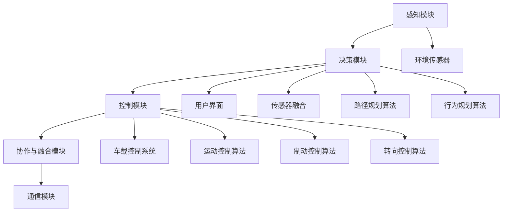

#### 2.2 感知模块

感知模块是自动驾驶系统的基石，它通过传感器收集环境数据，并将这些数据转换为对车辆周围环境的理解和感知。感知模块的主要功能包括：

1. **环境数据采集**：感知模块利用多种传感器（如激光雷达、摄像头、毫米波雷达、超声波传感器等）实时采集环境数据，包括路况、道路标识、行人和其他车辆的位置、速度和运动方向等。
2. **数据预处理**：传感器采集到的数据通常包含噪声和干扰，感知模块需要对数据进行预处理，如去噪、滤波和归一化等，以提高数据的准确性和可靠性。
3. **数据融合**：由于不同传感器具有不同的感知特性和局限性，感知模块通常需要将来自不同传感器的数据进行融合，以获得更全面、更准确的环境信息。

#### 2.3 决策模块

决策模块基于感知模块提供的环境信息，进行环境分析和驾驶策略制定。决策模块的主要功能包括：

1. **环境分析**：决策模块对感知模块提供的环境数据进行处理和分析，以识别道路标识、交通规则、障碍物和潜在风险等。
2. **路径规划**：路径规划算法负责确定车辆的行驶路线，以确保车辆能够安全、高效地到达目的地。常用的路径规划算法包括最短路径算法、A*算法和动态规划算法等。
3. **行为规划**：行为规划算法负责制定车辆的驾驶行为，包括加速、减速、变道和转向等。行为规划算法可以采用数据驱动的方法，如基于规则的逻辑控制，或采用模型预测控制等高级方法。

#### 2.4 控制模块

控制模块负责将决策模块生成的驾驶策略转化为具体的控制命令，实现对车辆的实时控制。控制模块的主要功能包括：

1. **运动控制**：运动控制算法负责控制车辆的加速度、速度和方向，以确保车辆按照规划的路径行驶。
2. **制动控制**：制动控制算法负责控制车辆的制动系统，包括常规制动和紧急制动，以确保车辆能够在需要时迅速减速或停车。
3. **转向控制**：转向控制算法负责控制车辆的转向系统，包括转向角度和转向速度，以确保车辆能够按照规划的路径行驶。

#### 2.5 协作与融合模块

协作与融合模块负责处理自动驾驶车辆与其他车辆、行人和基础设施的协作需求。协作与融合模块的主要功能包括：

1. **通信**：通过V2V、V2I和V2P通信，自动驾驶车辆可以与其他车辆、基础设施和行人进行实时信息交换，以共享交通状态、道路标识和障碍物等信息。
2. **协作控制**：在复杂环境中，自动驾驶车辆可能需要与其他车辆或行人进行协作，以避免碰撞或提高行驶效率。协作控制算法负责处理这些协作需求，确保车辆在多车环境中的安全行驶。

通过以上各个模块的协同工作，自动驾驶系统能够实现车辆在复杂环境中的自主驾驶，为未来智能交通带来无限可能。

### 第3章：感知系统的概述

#### 3.1 感知系统的作用与重要性

感知系统是自动驾驶系统的核心组成部分，其作用在于实时获取车辆周围环境的信息，为后续的决策和控制提供依据。感知系统的重要性主要体现在以下几个方面：

1. **安全保障**：感知系统通过传感器采集环境数据，实现对周围路况、行人、车辆等信息的实时感知，从而确保车辆在行驶过程中的安全。
2. **决策支持**：感知系统提供的环境信息是决策模块的基础，决定了自动驾驶系统能否准确、高效地制定驾驶策略。
3. **效率提升**：通过精确感知环境，感知系统可以优化车辆的控制策略，提高行驶效率，减少能耗和拥堵。
4. **灵活性增强**：感知系统使自动驾驶车辆能够适应复杂多变的环境，提高其在多种场景下的适应能力。

#### 3.2 感知系统的数据处理流程

感知系统的数据处理流程可以分为以下几个步骤：

1. **数据采集**：感知系统通过激光雷达、摄像头、毫米波雷达等传感器实时采集环境数据。不同传感器具有不同的感知特性和数据量，需要进行相应的数据采集和处理。
2. **数据预处理**：传感器采集到的原始数据通常包含噪声和干扰，需要进行预处理，如去噪、滤波、归一化等，以提高数据的准确性和可靠性。
3. **数据融合**：由于不同传感器具有不同的感知特性和局限性，感知系统需要将来自不同传感器的数据进行融合，以获得更全面、更准确的环境信息。数据融合可以通过多传感器融合算法实现，如卡尔曼滤波、贝叶斯滤波等。
4. **特征提取**：从预处理和融合后的数据中提取关键特征，如障碍物的位置、速度、形状等，用于后续的决策和路径规划。
5. **数据存储与传输**：将处理后的数据存储在车辆或云端的数据库中，以便后续分析和处理。同时，感知系统需要确保数据的实时传输，以满足实时决策和控制的需求。

#### 3.3 感知系统的关键技术

感知系统涉及多种传感器技术和数据处理算法，以下是一些关键技术：

1. **传感器选择**：根据应用场景和需求选择合适的传感器，如激光雷达、摄像头、毫米波雷达等。不同传感器具有不同的感知范围、精度和响应速度，需要综合考虑。
2. **多传感器融合**：通过融合来自不同传感器的数据，提高感知系统的准确性和可靠性。多传感器融合算法包括卡尔曼滤波、贝叶斯滤波、粒子滤波等。
3. **图像处理与识别**：利用图像处理算法对摄像头采集到的图像进行处理，提取道路标识、行人、车辆等特征。常见的图像处理算法包括边缘检测、特征提取、目标识别等。
4. **深度学习**：利用深度学习算法对感知数据进行特征提取和分类，提高感知系统的准确性和鲁棒性。常见的深度学习算法包括卷积神经网络（CNN）、循环神经网络（RNN）等。
5. **实时数据处理**：为保证实时决策和控制，感知系统需要具备高效的数据处理能力，包括数据采集、预处理、特征提取和传输等。实时数据处理技术包括并行计算、分布式计算等。

总之，感知系统是自动驾驶系统的关键组成部分，其性能和可靠性直接影响到自动驾驶系统的整体表现。通过先进的传感器技术和数据处理算法，感知系统可以为自动驾驶车辆提供准确、可靠的环境感知能力，为安全、高效的自主驾驶奠定基础。

### 第4章：激光雷达感知

激光雷达（LiDAR，Light Detection and Ranging）是一种通过发射激光脉冲并测量反射时间来获取目标物体距离、速度和形状的高精度测距技术。激光雷达在自动驾驶系统中扮演着至关重要的角色，其高精度、高分辨率和高实时性的特点使其成为感知系统的理想选择。本章节将详细讨论激光雷达的工作原理、数据处理算法以及在实际中的应用案例。

#### 4.1 激光雷达的工作原理

激光雷达的工作原理可以概括为以下步骤：

1. **发射激光脉冲**：激光雷达发射一束激光脉冲，通常使用Nd:YAG激光器或其他激光器产生。激光脉冲具有高能量、高方向性和单色性，能够精确地照射到目标物体上。
2. **反射与接收**：激光脉冲遇到目标物体后，会被部分反射回来。激光雷达的接收器（如光电探测器）负责接收这些反射光脉冲。
3. **测量时间差**：激光雷达通过测量发射激光脉冲和接收反射光脉冲之间的时间差，计算出激光脉冲从发射到反射所经历的时间。根据光速（通常为299,792公里/秒），可以计算出目标物体的距离。
4. **生成点云数据**：通过测量多个激光脉冲的反射时间，激光雷达可以生成目标物体周围的三维点云数据。点云数据包含大量三维坐标点，可以用于后续的数据处理和分析。

以下是一个简化的激光雷达工作原理图：

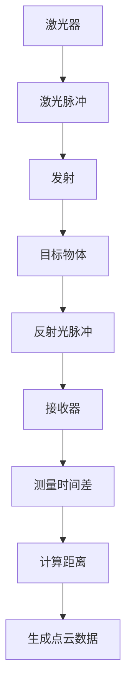

#### 4.2 激光雷达的数据处理算法

激光雷达生成点云数据后，需要进行一系列数据处理和分析，以提高感知系统的准确性和可靠性。以下是一些关键数据处理算法：

1. **点云预处理**：点云预处理包括去噪、滤波和稀疏化等步骤。去噪算法可以去除点云中的噪声点，滤波算法可以平滑点云数据，稀疏化算法可以减少点云数据量，提高处理效率。
2. **点云配准**：点云配准是将不同时间或不同传感器采集到的点云数据对齐，使其在同一坐标系下。常用的点云配准算法包括ICP（Iterative Closest Point）算法和NDT（Normal Distributions Transform）算法。
3. **点云分割**：点云分割是将点云数据分成不同的区域或物体，以识别不同的物体和场景。常用的点云分割算法包括基于密度的分割、基于边缘的分割和基于模型匹配的分割等。
4. **点云识别**：点云识别是从点云数据中提取特定物体或特征，如车道线、行人、车辆等。常用的点云识别算法包括基于特征的识别、基于模型的识别和基于深度学习的识别等。

#### 4.3 激光雷达在实际中的应用案例

激光雷达在自动驾驶系统中有着广泛的应用，以下是一些实际应用案例：

1. **环境感知**：激光雷达主要用于获取车辆周围的三维点云数据，包括道路、行人、车辆、交通标志等。通过激光雷达的环境感知能力，自动驾驶车辆可以实时了解周围环境，制定相应的驾驶策略。
2. **障碍物检测**：激光雷达可以精确测量障碍物的位置、速度和形状，为障碍物检测提供重要依据。通过障碍物检测，自动驾驶车辆可以提前识别潜在危险，采取相应的避障措施。
3. **车道线检测**：激光雷达可以精确捕捉车道线的位置和形状，帮助自动驾驶车辆识别车道线信息，实现车道保持和车道变更功能。
4. **自动驾驶测试**：激光雷达是自动驾驶测试中常用的传感器之一，其高精度和高分辨率特点使其成为评估自动驾驶系统性能的重要工具。

以下是一个激光雷达在自动驾驶环境感知中的应用案例：

**场景描述**：自动驾驶车辆在繁忙的城市道路上行驶，需要实时感知周围环境，以实现安全、高效的行驶。

**解决方案**：激光雷达作为主要感知设备，实时获取车辆周围的三维点云数据。通过点云预处理算法去除噪声点，进行点云配准以统一坐标系。接着，利用点云分割算法将点云数据分为道路、行人、车辆等不同区域。最后，通过点云识别算法识别行人、车辆等目标物体，并计算其位置、速度和形状等信息。

**实现效果**：通过激光雷达的精确感知能力，自动驾驶车辆可以实时了解周围环境，提前识别行人、车辆等潜在危险，并采取相应的避障措施，确保行驶安全。

总之，激光雷达在自动驾驶系统中具有重要的应用价值，其高精度、高分辨率和高实时性的特点使其成为实现自动驾驶感知的重要工具。通过先进的激光雷达技术和数据处理算法，自动驾驶车辆可以在复杂多变的环境中实现安全、高效的自主驾驶。

### 第5章：摄像头感知

摄像头感知是自动驾驶系统中的一项重要技术，通过捕捉和处理图像数据，摄像头可以提供关于车辆周围环境的关键信息，如道路标志、车道线、行人、车辆等。摄像头感知技术具有高分辨率、实时性强、成本低等优点，是自动驾驶感知系统的重要组成部分。本章节将详细讨论摄像头的工作原理、数据处理算法以及在实际中的应用案例。

#### 5.1 摄像头的工作原理

摄像头感知系统的工作原理可以概括为以下几个步骤：

1. **图像采集**：摄像头通过光学系统捕捉场景图像，并将其转换为数字信号。光学系统包括镜头、光圈、滤光片等，用于控制光线进入摄像头并聚焦在图像传感器上。
2. **图像传感器**：图像传感器（如CCD或CMOS传感器）将光学信号转换为电信号，生成数字图像。图像传感器通常具有多个像素点，每个像素点对应场景中的一个小区域。
3. **数字信号处理**：摄像头内部进行数字信号处理，包括图像去噪、白平衡调整、曝光控制等，以提高图像质量和一致性。
4. **图像特征提取**：通过图像处理算法提取图像中的关键特征，如边缘、角点、纹理等。这些特征有助于后续的图像分析和目标识别。
5. **图像识别**：利用图像识别算法，如机器学习算法或深度学习算法，对提取的特征进行分类和识别，以确定图像中的对象和场景信息。

以下是一个简化的摄像头感知系统工作流程图：

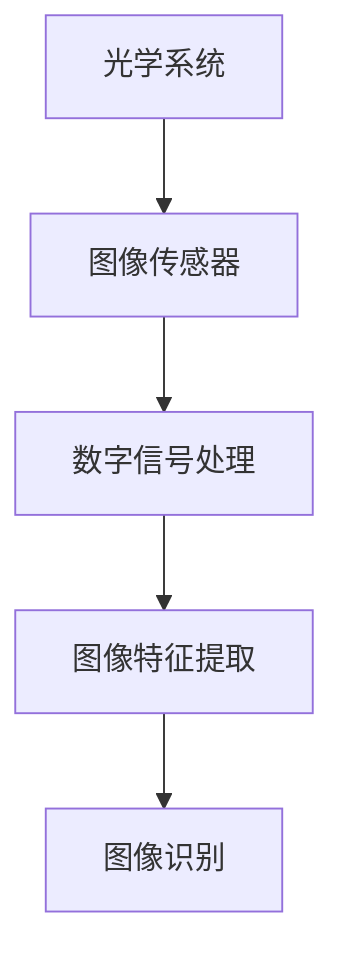

#### 5.2 摄像头的数据处理算法

摄像头感知系统在数据处理方面涉及多种算法，以下是一些关键数据处理算法：

1. **图像预处理**：图像预处理包括去噪、白平衡调整、曝光控制等步骤。去噪算法可以去除图像中的噪声点，提高图像质量；白平衡调整可以校正不同光照条件下的颜色偏差；曝光控制可以调整图像的亮度，使图像更清晰。
2. **图像增强**：图像增强算法可以增强图像中的关键特征，提高图像的识别能力。常用的图像增强算法包括直方图均衡、边缘增强、对比度增强等。
3. **目标检测**：目标检测是摄像头感知系统的重要任务，其目的是从图像中识别和定位特定对象。常用的目标检测算法包括传统算法（如HOG、SVM）和深度学习算法（如YOLO、SSD、Faster R-CNN等）。
4. **语义分割**：语义分割是对图像中的每个像素进行分类，以识别图像中的不同对象。常用的语义分割算法包括FCN、U-Net、DeepLab等。
5. **深度估计**：深度估计是通过图像信息估计场景中不同物体的深度信息。深度估计算法可以帮助摄像头感知系统实现更精确的环境理解，从而提高自动驾驶的安全性。

#### 5.3 摄像头在实际中的应用案例

摄像头在自动驾驶系统中有着广泛的应用，以下是一些实际应用案例：

1. **车道线检测**：通过摄像头捕捉的图像，自动驾驶车辆可以识别车道线的位置和形状，实现车道保持和车道变更功能。车道线检测算法通常结合图像预处理、图像增强和目标检测技术。
2. **交通标志识别**：摄像头可以识别道路上的交通标志，如速度限制标志、禁止标志等。交通标志识别算法通常采用图像预处理、特征提取和分类技术。
3. **行人检测**：通过摄像头捕捉的图像，自动驾驶车辆可以识别道路上的行人，实现行人避让功能。行人检测算法通常结合图像预处理、目标检测和深度估计技术。
4. **车辆检测**：摄像头可以识别道路上的车辆，监测车辆的动态信息，如速度、位置和方向等。车辆检测算法通常采用图像预处理、特征提取和目标检测技术。

以下是一个摄像头在自动驾驶车辆感知中的应用案例：

**场景描述**：自动驾驶车辆在城市道路上行驶，需要实时识别和跟踪道路标志、车道线、行人和车辆。

**解决方案**：摄像头作为主要感知设备，捕捉车辆周围的图像数据。通过图像预处理算法去除噪声和光照变化影响，增强图像中的关键特征。接着，利用目标检测算法识别图像中的车道线、交通标志、行人和车辆，并计算其位置、速度和方向等信息。最后，通过深度估计算法对行人、车辆等目标进行深度信息估计，以提高环境理解。

**实现效果**：通过摄像头感知系统，自动驾驶车辆可以实时获取周围环境信息，实现车道保持、交通标志识别、行人避让和车辆监控等功能，确保行驶安全。

总之，摄像头感知技术在自动驾驶系统中发挥着重要作用，通过先进的图像处理算法和深度学习技术，摄像头感知系统能够提供高精度、高可靠性的环境感知能力，为自动驾驶车辆的安全、高效行驶提供支持。

### 第6章：毫米波雷达感知

毫米波雷达是一种利用毫米波（通常在30GHz到300GHz之间）进行目标探测和测距的雷达系统。毫米波雷达在自动驾驶系统中具有独特的优势，其高精度、高分辨率和全天候工作能力使其成为重要的感知设备之一。本章节将详细讨论毫米波雷达的工作原理、数据处理算法以及在实际中的应用案例。

#### 6.1 毫米波雷达的工作原理

毫米波雷达的工作原理可以分为以下几个步骤：

1. **发射电磁波**：毫米波雷达通过天线发射高频电磁波，这些电磁波传播到目标物体上。
2. **反射与接收**：目标物体反射部分电磁波，这些反射波被雷达的接收器捕获。
3. **信号处理**：雷达接收器将捕获到的反射波信号传输到信号处理单元，进行放大、滤波和整形等处理。
4. **距离计算**：通过测量发射信号和接收信号之间的时间差或频率变化，可以计算出目标物体的距离。根据电磁波的速度（通常为光速），可以进一步计算出目标物体的距离和速度。

以下是一个简化的毫米波雷达工作原理图：

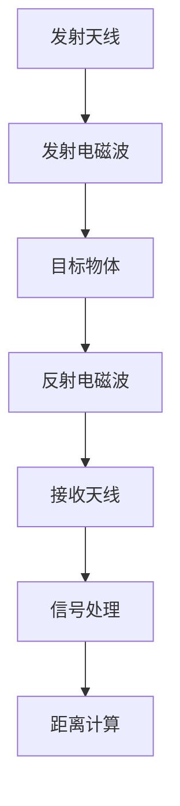

#### 6.2 毫米波雷达的数据处理算法

毫米波雷达数据处理主要包括信号处理和目标跟踪两个方面：

1. **信号处理**：毫米波雷达接收到的反射波信号通常较弱且受噪声干扰，需要进行信号处理以提取有用的信息。常用的信号处理算法包括频域分析、滤波、波束形成等。频域分析可以将时间域信号转换为频域信号，便于分析信号的频率特性；滤波算法可以去除噪声和干扰；波束形成技术可以提高雷达的分辨率和方向性。
2. **目标跟踪**：目标跟踪是指对雷达检测到的目标进行持续跟踪和识别。常用的目标跟踪算法包括卡尔曼滤波、粒子滤波、目标识别和目标关联等。卡尔曼滤波是一种线性滤波算法，适用于目标状态变化的预测和更新；粒子滤波是一种非线性滤波算法，适用于复杂目标运动和噪声环境；目标识别和目标关联算法可以帮助雷达识别和跟踪多个目标。

#### 6.3 毫米波雷达在实际中的应用案例

毫米波雷达在自动驾驶系统中有着广泛的应用，以下是一些实际应用案例：

1. **障碍物检测**：毫米波雷达可以检测车辆周围的障碍物，包括静止和移动的物体，如其他车辆、行人、障碍物等。通过测量障碍物的距离和速度，自动驾驶车辆可以采取避障措施，确保行驶安全。
2. **车辆识别**：毫米波雷达可以识别车辆的位置、速度和方向，为自动驾驶车辆的路径规划和行为规划提供重要依据。通过目标跟踪算法，雷达可以持续跟踪车辆，识别其动态信息。
3. **环境感知**：毫米波雷达可以提供远距离、高精度的环境感知能力，帮助自动驾驶车辆在复杂环境中进行决策。例如，在雨雪天气、夜晚等低能见度条件下，毫米波雷达可以发挥重要作用，提高自动驾驶系统的可靠性。
4. **辅助驾驶功能**：毫米波雷达可以用于辅助驾驶功能，如自适应巡航控制（ACC）、车道保持辅助（LKA）和自动紧急制动（AEB）等。这些功能通过毫米波雷达提供的实时信息，帮助驾驶员更好地控制车辆，提高行驶安全性。

以下是一个毫米波雷达在自动驾驶车辆障碍物检测中的应用案例：

**场景描述**：自动驾驶车辆在城市道路上行驶，需要实时检测前方和侧方障碍物，以采取避障措施。

**解决方案**：毫米波雷达作为主要感知设备，实时发射和接收电磁波，检测前方和侧方障碍物。通过信号处理算法提取反射波信号，计算障碍物的距离和速度。接着，利用目标跟踪算法对障碍物进行持续跟踪和识别，获取其动态信息。最后，将障碍物信息传递给决策和控制模块，以实现避障控制和路径规划。

**实现效果**：通过毫米波雷达的精确感知能力，自动驾驶车辆可以实时检测前方和侧方障碍物，提前采取避障措施，确保行驶安全。

总之，毫米波雷达在自动驾驶系统中具有重要的应用价值，其高精度、高分辨率和全天候工作能力使其成为实现安全、高效自动驾驶的重要工具。通过先进的毫米波雷达技术和数据处理算法，自动驾驶车辆可以在各种复杂环境中实现可靠的感知和决策。

### 第7章：决策系统的概述

#### 7.1 决策系统的作用与重要性

决策系统是自动驾驶系统的核心模块之一，其作用在于分析感知系统提供的环境数据，制定出车辆的行驶策略。决策系统的重要性主要体现在以下几个方面：

1. **路径规划**：决策系统通过路径规划算法，确定车辆从当前位置到目标位置的最佳行驶路线，确保车辆能够安全、高效地到达目的地。
2. **行为规划**：决策系统根据感知数据和环境信息，制定车辆的驾驶行为，包括加速、减速、转向、变道等操作，以适应复杂多变的环境。
3. **安全控制**：决策系统通过实时分析环境数据，识别潜在风险和障碍物，并生成相应的避障策略，确保车辆的行驶安全。
4. **效率优化**：决策系统通过优化车辆的行驶策略，减少能耗和拥堵，提高车辆的行驶效率。
5. **协同控制**：决策系统需要与其他模块（如感知、控制等）紧密协作，确保整个自动驾驶系统能够高效、稳定地运行。

#### 7.2 决策系统的数据处理流程

决策系统的数据处理流程可以分为以下几个步骤：

1. **数据输入**：决策系统从感知模块接收环境数据，包括路况、车辆、行人、交通标志等。
2. **数据预处理**：对输入的数据进行预处理，包括去噪、滤波、归一化等，以提高数据的准确性和可靠性。
3. **环境建模**：将预处理后的数据转换为环境模型，用于后续的路径规划和行为规划。环境模型通常包括交通网络、车辆状态、道路条件等。
4. **路径规划**：基于环境模型，决策系统使用路径规划算法（如最短路径算法、A*算法、动态规划算法等）确定车辆的行驶路线。
5. **行为规划**：根据路径规划结果和实时感知数据，决策系统使用行为规划算法（如数据驱动行为规划、模型预测控制等）制定车辆的驾驶行为。
6. **策略生成**：将路径规划和行为规划的结果整合成最终的驾驶策略，包括加速、减速、转向、变道等操作。
7. **策略优化**：对生成的驾驶策略进行优化，以进一步提高行驶安全性和效率。

以下是一个简化的决策系统数据处理流程图：

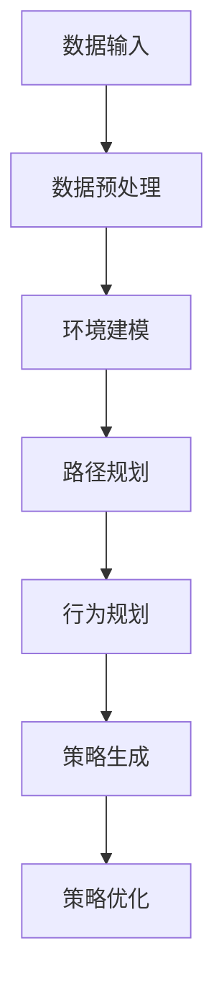

#### 7.3 决策系统的关键技术

决策系统涉及多种算法和技术，以下是一些关键技术：

1. **路径规划算法**：路径规划算法是决策系统的核心，负责确定车辆的行驶路线。常见的路径规划算法包括最短路径算法、A*算法、Dijkstra算法、动态规划算法等。最短路径算法用于求解从起点到终点的最短路径；A*算法结合了启发式搜索和贪婪算法，用于求解局部最优路径；Dijkstra算法适用于求解单源最短路径；动态规划算法适用于求解多阶段决策问题。
2. **行为规划算法**：行为规划算法负责制定车辆的驾驶行为，包括加速、减速、转向、变道等操作。常见的行为规划算法包括数据驱动行为规划、模型预测控制、基于规则的逻辑控制等。数据驱动行为规划基于历史驾驶数据，通过学习生成驾驶策略；模型预测控制通过建立车辆模型，预测未来状态并生成控制策略；基于规则的逻辑控制通过预设的规则，生成驾驶行为。
3. **实时数据处理**：决策系统需要处理实时感知数据，以实现快速、准确的决策。实时数据处理技术包括多线程处理、并行计算、分布式计算等，以充分利用计算资源，提高处理效率。
4. **深度学习**：深度学习技术可以用于决策系统的建模和优化，提高决策的准确性和鲁棒性。常见的深度学习算法包括卷积神经网络（CNN）、循环神经网络（RNN）、生成对抗网络（GAN）等。

通过以上关键技术和数据处理流程，决策系统能够实现对环境数据的实时分析、路径规划、行为规划和策略生成，为自动驾驶车辆的安全、高效行驶提供支持。

### 第8章：路径规划算法

#### 8.1 路径规划的基本概念

路径规划是自动驾驶系统中的一个关键任务，其目的是确定从起点到终点的最优行驶路径。路径规划的基本概念包括：

1. **节点**：路径规划中的节点表示道路上的一个位置点，通常用二维或三维坐标表示。
2. **边**：边表示节点之间的连接关系，通常用路径长度表示。边的权重可以表示道路的宽度、道路等级、行驶时间等。
3. **图**：路径规划问题通常被建模为一个图，其中节点表示位置，边表示节点之间的连接关系。
4. **起点**：起点是路径规划的起始位置，通常是车辆的当前位置。
5. **终点**：终点是路径规划的目标位置，通常是车辆需要到达的目的地。
6. **路径**：路径是从起点到终点的序列，其中每个节点表示路径上的一个位置。

#### 8.2 最短路径算法

最短路径算法是路径规划中最基本的一种算法，用于求解从起点到终点的最短路径。以下是一些常用的最短路径算法：

1. **Dijkstra算法**：Dijkstra算法是一种基于贪心策略的单源最短路径算法。算法的基本思想是维护一个集合，初始时集合只包含起点，随着迭代进行，逐步将未访问的节点加入到集合中，并更新到达这些节点的最短路径。Dijkstra算法的时间复杂度为O(ElogV)，其中E为边的数量，V为节点的数量。
2. **Bellman-Ford算法**：Bellman-Ford算法是一种单源最短路径算法，可以处理具有负权边的图。算法的基本思想是通过反复松弛边，逐步更新到达各节点的最短路径。Bellman-Ford算法的时间复杂度为O(VE)，其中V为节点的数量，E为边的数量。
3. **Floyd-Warshall算法**：Floyd-Warshall算法是一种计算所有节点之间最短路径的算法。算法的基本思想是通过动态规划的方式，逐步计算相邻节点的最短路径，并更新到其他节点的最短路径。Floyd-Warshall算法的时间复杂度为O(V^3)，其中V为节点的数量。

以下是一个简化的Dijkstra算法流程：

```plaintext
1. 初始化：设置起点s，将起点加入集合S，其余节点加入集合U。
2. 对于每个节点u∈U：
   a. 计算从起点s到节点u的初始距离d[u]。
   b. 设置一个未访问标志f[u]为false。
3. 当集合U非空时，执行以下步骤：
   a. 从集合U中选择一个具有最小距离的节点u，将其加入集合S。
   b. 对于每个节点v∈U：
      i. 计算从起点s到节点v的候选距离d'[v] = d[u] + w(u, v)。
      ii. 如果d'[v] < d[v]，则更新d[v] = d'[v]，并设置f[v]为false。
4. 最终，集合S中的节点即为从起点s到终点的最短路径上的节点。

```

#### 8.3 A*算法及其优化

A*（A-star）算法是一种结合启发式搜索和贪心策略的最短路径算法。A*算法的基本思想是利用启发函数h（g，v），其中g（v）为从起点s到节点v的实际距离，h（v）为从节点v到终点的估计距离，选择具有最小f（v） = g（v） + h（v）的节点进行扩展。

以下是一个简化的A*算法流程：

```plaintext
1. 初始化：设置起点s，将起点加入集合S，其余节点加入集合U。
2. 对于每个节点u∈U：
   a. 计算从起点s到节点u的初始距离d[u]。
   b. 设置启发函数h[u]。
   c. 设置f[u] = d[u] + h[u]。
3. 当集合U非空时，执行以下步骤：
   a. 从集合U中选择一个具有最小f（v）的节点u，将其加入集合S。
   b. 对于每个节点v∈U：
      i. 计算从起点s到节点v的候选距离d'[v] = d[u] + w(u, v)。
      ii. 如果d'[v] < d[v]，则更新d[v] = d'[v]。
      iii. 更新f[v] = d[v] + h[v]。
4. 当终点t加入集合S时，算法结束。
5. 从起点s到终点的最短路径即为集合S中的节点序列。

```

A*算法的时间复杂度与启发函数的选择有关。在最优情况下，A*算法的时间复杂度为O(ElogV)，其中E为边的数量，V为节点的数量。常见的启发函数包括曼哈顿距离、欧几里得距离等。

以下是一个简化的A*算法优化流程：

```plaintext
1. 选择最优启发函数h，如欧几里得距离：h(v) = sqrt((x_t - x_v)^2 + (y_t - y_v)^2)。
2. 在路径规划过程中，考虑障碍物和道路限制，对启发函数进行修正，以更准确地估计从节点v到终点的距离。
3. 在扩展节点时，根据启发函数的值优先选择具有较小f（v）的节点进行扩展。
4. 利用优先队列（如斐波那契堆）优化节点的选择和扩展过程，以进一步提高算法的效率。

```

通过以上优化，A*算法可以更好地适应复杂的路径规划问题，提高路径规划的效率和准确性。

#### 8.4 动态规划算法

动态规划算法是一种适用于多阶段决策问题的路径规划算法。动态规划算法的基本思想是将路径规划问题分解为多个子问题，并利用子问题的解来构建整个路径规划问题的解。

以下是一个简化的动态规划算法流程：

```plaintext
1. 初始化：设置起点s，将起点加入集合S，其余节点加入集合U。
2. 对于每个节点u∈U：
   a. 计算从起点s到节点u的初始距离d[u]。
   b. 设置g[u] = d[u]，其中g[u]表示从起点s到节点u的最小代价。
3. 对于每个节点u∈U（从终点t开始递归计算）：
   a. 对于每个相邻节点v：
      i. 计算从起点s到节点v的最小代价g[v] = min{g[u] + w(u, v)}。
      ii. 如果g[v] < d[v]，则更新d[v] = g[v]。
   b. 将节点u从集合U中移除，加入集合S。
4. 最终，集合S中的节点即为从起点s到终点的最优路径。

```

动态规划算法的时间复杂度为O(V^2)，其中V为节点的数量。动态规划算法适用于求解具有约束条件的路径规划问题，如道路网络中的路径规划。

总之，路径规划算法是自动驾驶系统中至关重要的一环，通过不同的算法和技术，可以实现从起点到终点的最优路径规划，为自动驾驶车辆的安全、高效行驶提供支持。

### 第9章：行为规划算法

#### 9.1 行为规划的基本概念

行为规划是自动驾驶系统中负责制定车辆驾驶行为的一部分，其目标是使车辆在复杂环境中能够安全、高效地行驶。行为规划的基本概念包括：

1. **驾驶行为**：驾驶行为包括加速、减速、转向、变道、停车等操作，是车辆在行驶过程中需要执行的具体动作。
2. **环境模型**：环境模型是对车辆周围环境的抽象表示，包括道路、车辆、行人、交通标志等。行为规划算法通常基于环境模型来生成驾驶策略。
3. **驾驶策略**：驾驶策略是一组驾驶行为的集合，用于指导车辆在特定环境下的行驶。驾驶策略需要考虑车辆的安全性、效率和经济性。
4. **目标**：行为规划的目标是制定出使车辆在复杂环境中安全、高效行驶的策略，包括避障、保持车道、遵守交通规则等。

#### 9.2 数据驱动行为规划

数据驱动行为规划是一种基于历史驾驶数据来生成驾驶策略的方法。这种方法通过学习大量驾驶数据，提取出有效的驾驶行为模式，并利用这些模式来指导车辆的驾驶行为。数据驱动行为规划的关键技术包括：

1. **驾驶数据收集**：驾驶数据包括车辆的位置、速度、加速度、转向角度等。数据可以通过车载传感器和车载记录仪等设备收集。
2. **驾驶行为特征提取**：从驾驶数据中提取关键特征，如车辆的加速度、速度变化率、转向角度变化率等。这些特征可以用于表示驾驶行为。
3. **行为模式学习**：利用机器学习算法，如决策树、支持向量机（SVM）、神经网络等，从驾驶数据中学习出驾驶行为模式。这些模式可以用于生成驾驶策略。
4. **驾驶策略生成**：根据环境模型和驾驶行为模式，生成相应的驾驶策略。驾驶策略可以根据不同场景进行自适应调整。

以下是一个简化的数据驱动行为规划流程：

```plaintext
1. 收集驾驶数据：从车辆传感器和记录仪中收集驾驶数据，包括车辆的位置、速度、加速度、转向角度等。
2. 特征提取：从驾驶数据中提取关键特征，如加速度、速度变化率、转向角度变化率等。
3. 行为模式学习：利用机器学习算法，如决策树、支持向量机（SVM）、神经网络等，从驾驶数据中学习出驾驶行为模式。
4. 驾驶策略生成：根据环境模型和驾驶行为模式，生成相应的驾驶策略。策略可以根据不同场景进行自适应调整。

```

数据驱动行为规划的优点包括：

- **自适应性强**：可以根据环境变化和学习到的驾驶行为模式，动态调整驾驶策略。
- **易扩展**：可以方便地引入新的驾驶行为模式和学习算法，以适应不同的驾驶场景。

#### 9.3 模型预测控制

模型预测控制（Model Predictive Control, MPC）是一种基于系统动态模型的控制方法，用于生成驾驶策略。MPC的核心思想是通过预测系统未来的行为，并优化预测轨迹，以生成最优的驾驶策略。MPC的关键技术包括：

1. **系统建模**：建立车辆的动力学模型，如线性二次型调节器（LQR）或模型预测控制（MPC）模型。这些模型可以描述车辆在加速度、速度和转向角度等变量上的动态行为。
2. **预测**：基于系统模型，预测车辆在未来一段时间内的行为，包括速度、加速度和转向角度等。
3. **优化**：使用优化算法（如线性规划、非线性规划等），优化预测轨迹，以最小化成本函数或最大化收益函数。成本函数通常包括速度变化、加速度变化、能耗等。
4. **策略生成**：根据优化结果，生成具体的驾驶策略，包括加速、减速、转向等操作。

以下是一个简化的MPC控制流程：

```plaintext
1. 建立车辆动力学模型：根据车辆的物理特性，建立线性或非线性动力学模型，描述车辆的速度、加速度和转向角度等变量。
2. 预测：基于动力学模型，预测车辆在未来一段时间内的行为，包括速度、加速度和转向角度等。
3. 优化：使用优化算法，如线性规划（LP）或非线性规划（NLP），优化预测轨迹，以最小化成本函数或最大化收益函数。成本函数通常包括速度变化、加速度变化、能耗等。
4. 策略生成：根据优化结果，生成具体的驾驶策略，包括加速、减速、转向等操作。

```

模型预测控制的优点包括：

- **动态性**：能够实时预测并调整驾驶策略，以适应车辆和环境的动态变化。
- **优化性**：通过优化算法，可以生成最优的驾驶策略，提高车辆的行驶效率。

#### 9.4 人类行为建模与预测

人类行为建模与预测是行为规划中的一个重要研究方向，其目标是理解并模拟人类驾驶员的行为。通过人类行为建模与预测，自动驾驶系统可以更好地与人类驾驶员协同工作，提高驾驶安全性和舒适性。人类行为建模与预测的关键技术包括：

1. **行为识别**：通过传感器数据和行为特征，识别和分类人类驾驶员的行为，如加速、减速、转向、变道等。
2. **行为预测**：利用历史行为数据和行为模型，预测人类驾驶员未来的行为。行为预测可以基于统计模型、机器学习算法或深度学习算法。
3. **行为融合**：将自动驾驶系统和人类驾驶员的行为进行融合，生成最终的驾驶策略。行为融合可以通过逻辑控制、模型预测控制等方法实现。

以下是一个简化的行为建模与预测流程：

```plaintext
1. 行为识别：通过传感器数据和行为特征，识别和分类人类驾驶员的行为。
2. 行为预测：利用历史行为数据和行为模型，预测人类驾驶员未来的行为。
3. 行为融合：将自动驾驶系统和人类驾驶员的行为进行融合，生成最终的驾驶策略。

```

人类行为建模与预测的优点包括：

- **协同性**：能够更好地与人类驾驶员协同工作，提高驾驶安全性和舒适性。
- **适应性**：可以适应不同驾驶环境下的行为变化，提高自动驾驶系统的灵活性。

通过数据驱动行为规划、模型预测控制和人类行为建模与预测等技术，自动驾驶系统能够生成更加安全、高效和适应性的驾驶策略，为自动驾驶技术的广泛应用提供支持。

### 第10章：控制系统的概述

#### 10.1 控制系统的作用与重要性

控制系统在自动驾驶系统中扮演着至关重要的角色，其主要作用是确保车辆按照既定的策略进行安全、高效的行驶。控制系统的作用和重要性可以从以下几个方面进行阐述：

1. **路径执行**：控制系统根据决策模块生成的驾驶策略，将路径规划转换为具体的运动控制指令，使车辆按照规划路线行驶。这一过程涉及到对车速、转向、制动等运动参数的实时调整，以确保车辆在复杂环境中能够准确、稳定地行驶。
2. **实时响应**：控制系统需要具备快速响应的能力，能够在接收到感知模块和决策模块提供的信息后，立即生成相应的控制指令。这要求控制系统具有高效的算法和硬件支持，以满足自动驾驶系统对实时性的要求。
3. **稳定性保证**：控制系统负责车辆的动态控制，包括加速、减速、转向等操作。通过精确的控制，控制系统可以保证车辆在行驶过程中的稳定性，避免车辆出现剧烈的震动或失控现象。
4. **安全性提升**：控制系统通过实时监测车辆的行驶状态，如车速、转向角度、制动压力等，可以及时发现潜在的安全隐患，并采取相应的控制措施，如自动刹车或转向修正，以提高行驶安全性。
5. **效率优化**：控制系统通过对车辆的实时控制，可以优化车辆的行驶效率，如通过控制加速和减速，减少不必要的燃油消耗，提高车辆的续航能力。

#### 10.2 控制系统的数据处理流程

控制系统的数据处理流程可以分为以下几个步骤：

1. **数据接收**：控制系统从感知模块和决策模块接收实时数据，包括车辆的状态信息（如车速、转向角度、制动压力等）和决策模块生成的控制指令。
2. **数据预处理**：对接收到的数据进行预处理，如去噪、滤波、归一化等，以提高数据的准确性和可靠性。
3. **控制策略生成**：根据预处理后的数据和决策模块生成的控制指令，控制系统生成具体的控制策略，包括对车速、转向、制动等参数的调整。
4. **执行控制**：将生成的控制策略转换为实际的控制指令，并通过执行器（如电机、制动器等）对车辆进行控制，确保车辆按照既定策略行驶。
5. **反馈与调整**：控制系统实时监测车辆的行驶状态，并根据反馈信息对控制策略进行调整，以应对环境变化和车辆状态的动态变化。

以下是一个简化的控制系统数据处理流程图：

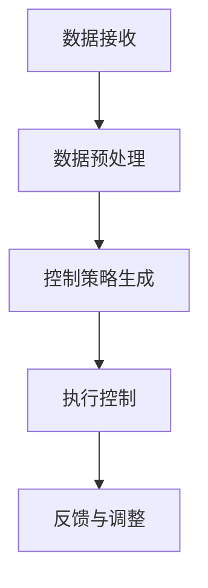

#### 10.3 控制系统的关键技术

控制系统涉及多种技术，以下是一些关键技术：

1. **控制算法**：控制算法是实现控制系统功能的核心，包括PID控制、模型预测控制（MPC）、自适应控制等。PID控制算法简单有效，适用于线性系统的控制；模型预测控制通过建立系统模型，实现复杂的动态控制；自适应控制能够根据环境变化和系统状态进行自适应调整。
2. **传感器技术**：传感器技术是实现精确感知和控制的基础，包括车速传感器、转向传感器、制动压力传感器等。传感器的精度和响应速度直接影响控制系统的性能。
3. **执行器技术**：执行器技术是控制系统的输出端，包括电机、制动器、转向器等。执行器的响应速度和精度直接影响控制系统的执行效果。
4. **通信技术**：控制系统需要与其他模块进行实时数据交换，如感知模块、决策模块等。通信技术包括CAN总线、以太网、无线通信等，以保证数据的及时传输。
5. **实时性**：控制系统需要具备高实时性，能够在毫秒级别内完成数据处理和控制指令的生成。这要求控制系统具有高效的算法和硬件支持。

通过以上关键技术和数据处理流程，控制系统能够实现对车辆运动参数的精确控制，确保自动驾驶车辆在复杂环境中安全、高效地行驶。控制系统的稳定性和响应速度直接影响到自动驾驶系统的整体性能，因此，研究并优化控制系统的关键技术对于自动驾驶技术的发展具有重要意义。

### 第11章：自动驾驶车辆的运动控制

#### 11.1 车辆动力学模型

车辆动力学模型是自动驾驶车辆运动控制的基础，它描述了车辆在行驶过程中的物理运动规律。建立准确的车辆动力学模型对于实现精确的运动控制和路径跟踪至关重要。以下是一个简化的车辆动力学模型：

```latex
\begin{align*}
m\frac{dv}{dt} &= F_{\text{engine}} - F_{\text{drag}} - F_{\text{friction}} - F_{\text{brake}}, \\
\frac{d\omega}{dt} &= \frac{T_{\text{steering}} - F_{\text{side}}}{I_{\text{vehicle}}}, \\
v &= \omega r,
\end{align*}
```

其中：
- \(m\) 是车辆的质量，
- \(v\) 是车辆的速度，
- \(\omega\) 是车辆的角速度，
- \(r\) 是前轮的半径，
- \(F_{\text{engine}}\) 是发动机提供的驱动力，
- \(F_{\text{drag}}\) 是空气阻力，
- \(F_{\text{friction}}\) 是地面摩擦力，
- \(F_{\text{brake}}\) 是刹车力，
- \(T_{\text{steering}}\) 是转向力矩，
- \(I_{\text{vehicle}}\) 是车辆绕z轴的转动惯量，
- \(F_{\text{side}}\) 是侧向力。

#### 11.2 PID控制算法

PID（比例-积分-微分）控制算法是一种广泛应用于自动驾驶车辆运动控制的方法。PID控制通过调整比例（P）、积分（I）和微分（D）三个参数，实现对目标速度和目标方向的精确控制。

PID控制的基本公式如下：

```latex
u(t) = K_p e(t) + K_i \int_{0}^{t} e(\tau)d\tau + K_d \frac{de(t)}{dt},
```

其中：
- \(u(t)\) 是控制输入，
- \(e(t)\) 是误差（目标值减去实际值），
- \(K_p\)、\(K_i\)、\(K_d\) 分别是比例、积分和微分系数。

PID控制算法的实现步骤如下：

1. **初始化**：设置初始误差 \(e(0)\)，初始化积分项和微分项。
2. **计算误差**：计算当前时刻的误差 \(e(t) = r(t) - v(t)\)，其中 \(r(t)\) 是目标速度或方向，\(v(t)\) 是实际速度或方向。
3. **计算控制输入**：根据PID公式计算控制输入 \(u(t)\)。
4. **调整参数**：根据系统的响应特性调整 \(K_p\)、\(K_i\)、\(K_d\) 参数，以达到最佳控制效果。

以下是一个简化的PID控制算法伪代码示例：

```python
def pid_control(target, actual, Kp, Ki, Kd):
    e = target - actual
    integral = integral + e
    derivative = e - previous_e
    u = Kp * e + Ki * integral + Kd * derivative
    previous_e = e
    return u
```

#### 11.3 模型预测控制（MPC）

模型预测控制（Model Predictive Control, MPC）是一种先进的控制策略，通过建立系统的预测模型，并对未来的控制效果进行优化，生成最优的控制输入。MPC的核心思想是：

1. **预测**：基于系统模型，预测未来多个时间步的系统状态。
2. **优化**：通过优化算法，在预测的多个时间步中，寻找最优的控制输入序列，使系统状态接近目标状态。
3. **更新**：根据当前时间步的实际系统状态，更新预测模型和优化结果，并生成下一时刻的控制输入。

以下是一个简化的MPC控制算法伪代码示例：

```python
def mpc_control(model, current_state, target_state, constraints, N):
    # 预测未来N个时间步的系统状态
    predicted_states = model.predict(current_state, N)
    
    # 定义优化目标函数
    objective = np.sum((predicted_states - target_state)**2)
    
    # 定义约束条件
    constraints = [predicted_states[i] <= constraint for i in range(N)]
    
    # 使用优化算法求解最优控制输入
    optimal_control = optimize.minimize(objective, constraints)
    
    # 生成下一时刻的控制输入
    u = optimal_control.x
    
    return u
```

通过MPC，可以实现更复杂、更精确的运动控制，适用于非线性系统和多变量控制问题。然而，MPC的计算复杂度较高，需要高效的算法和计算资源。

#### 11.4 基于深度学习的控制算法

基于深度学习的控制算法利用深度神经网络学习系统的动态行为，生成控制输入。这类算法通过大量的数据训练，可以自适应地调整控制策略，适应不同的环境和工况。

以下是一个简化的基于深度学习的控制算法伪代码示例：

```python
def deep_learning_control(model, state):
    # 使用深度神经网络预测系统未来的状态
    predicted_state = model.predict(state)
    
    # 计算目标误差
    error = target_state - predicted_state
    
    # 根据误差调整控制输入
    u = model.adjust_control(error)
    
    return u
```

基于深度学习的控制算法具有以下优点：

- **自适应性强**：可以自动调整控制策略，适应不同的环境和工况。
- **泛化能力强**：通过大量数据训练，可以应用于不同的系统和场景。

总之，自动驾驶车辆的动态控制技术包括PID控制、MPC和基于深度学习的控制算法，这些算法各有优缺点，适用于不同的控制需求和场景。通过合理选择和组合这些控制算法，可以实现自动驾驶车辆的精确、稳定和高效的行驶。

### 第12章：自动驾驶车辆的制动控制

#### 12.1 制动系统的工作原理

制动系统是确保自动驾驶车辆安全稳定行驶的重要部件。它的工作原理主要涉及以下几个方面：

1. **制动踏板**：当驾驶员或自动驾驶系统踩下制动踏板时，制动踏板传递力量给制动总泵。
2. **制动总泵**：制动总泵将制动踏板的力量转换为液压压力，并将压力传递到各个车轮的制动器。
3. **制动器**：车轮制动器分为盘式制动器和鼓式制动器。当液压压力传递到制动器时，制动器的摩擦片与车轮旋转部件（如刹车盘或刹车鼓）接触，产生摩擦力，从而使车轮减速甚至停止转动。

制动系统的工作原理可以用以下步骤表示：

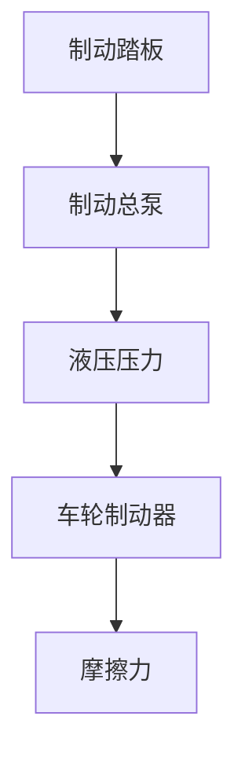

#### 12.2 制动控制算法

制动控制算法是确保自动驾驶车辆安全制动的重要部分，其目的是在满足安全性的同时，最大限度地减少制动距离和提升制动效率。以下是一些常用的制动控制算法：

1. **线性制动控制算法**：线性制动控制算法是一种简单的制动控制方法，根据当前车速和期望减速率，线性地调整制动压力。其基本公式如下：

   ```latex
   P_{\text{brake}} = K_d \cdot v
   ```

   其中，\(P_{\text{brake}}\) 是制动压力，\(K_d\) 是控制参数，\(v\) 是当前车速。

2. **模糊逻辑制动控制算法**：模糊逻辑制动控制算法利用模糊逻辑系统，根据车速、车辆加速度、制动距离等输入变量，生成制动压力输出。这种方法可以处理非线性、复杂的问题，适用于多变量控制。

   模糊逻辑制动控制算法的基本流程如下：

   - **输入变量定义**：定义输入变量，如车速、车辆加速度、期望减速率等。
   - **模糊化**：将输入变量转换为模糊变量，如“高速”、“中速”、“低速”等。
   - **规则库构建**：根据驾驶经验和制动要求，构建模糊规则库。
   - **模糊推理**：根据规则库和输入模糊变量，进行模糊推理，生成输出模糊变量。
   - **去模糊化**：将输出模糊变量转换为具体的制动压力值。

3. **模型预测控制（MPC）制动控制算法**：模型预测控制是一种基于系统模型和优化算法的先进制动控制方法。MPC算法通过建立车辆动力学模型，预测未来多个时间步的系统状态，并优化制动压力，以最小化制动距离或最大化制动效率。

   模型预测控制制动控制算法的基本步骤如下：

   - **系统建模**：建立车辆的动力学模型，如线性二次型调节器（LQR）模型。
   - **预测**：根据车辆动力学模型，预测未来多个时间步的系统状态。
   - **优化**：使用优化算法（如线性规划、非线性规划等），优化制动压力，以实现最小制动距离或最大化制动效率。
   - **控制**：根据优化结果，生成制动压力控制指令。

以下是一个简化的MPC制动控制算法伪代码示例：

```python
def mpc_brake_control(model, current_state, target_state, constraints, N):
    # 预测未来N个时间步的系统状态
    predicted_states = model.predict(current_state, N)
    
    # 定义优化目标函数（如最小化制动距离）
    objective = minimize_braking_distance(predicted_states)
    
    # 定义约束条件（如车辆最大制动力、制动时间等）
    constraints = define_constraints(predicted_states)
    
    # 使用优化算法求解最优制动压力
    optimal_brake_pressure = optimize.minimize(objective, constraints)
    
    return optimal_brake_pressure
```

#### 12.3 自动紧急制动系统（AEB）

自动紧急制动系统（Automatic Emergency Braking, AEB）是一种利用传感器和算法实现自动紧急制动的技术，旨在减少交通事故和减轻事故的严重程度。AEB系统通常包括以下几个关键组件：

1. **感知模块**：包括激光雷达、摄像头、毫米波雷达等传感器，用于实时监测车辆前方和侧方环境。
2. **决策模块**：根据感知模块提供的信息，判断是否有紧急制动需求。决策模块通常包括障碍物检测、速度计算、距离计算等算法。
3. **执行模块**：执行紧急制动操作，包括液压制动、电机制动等。

AEB系统的工作流程如下：

1. **感知环境**：AEB系统通过激光雷达、摄像头等传感器，实时获取车辆前方和侧方的环境信息。
2. **障碍物检测**：根据感知数据，检测前方和侧方的障碍物，如车辆、行人等。
3. **风险评估**：评估障碍物的危险程度，如距离、速度、运动方向等。
4. **紧急制动判断**：如果评估结果显示存在紧急制动需求（如前方障碍物即将碰撞），AEB系统启动紧急制动程序。
5. **紧急制动执行**：AEB系统通过液压制动、电机制动等方式，迅速施加制动力，减缓车辆速度。

以下是一个简化的AEB系统工作流程图：

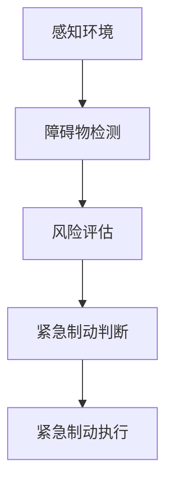

AEB系统具有以下优点：

- **减少交通事故**：通过自动紧急制动，减少因驾驶员反应不及时导致的交通事故。
- **减轻事故严重程度**：在无法避免碰撞时，通过紧急制动减少碰撞速度，减轻事故对乘客和行人的伤害。
- **提高驾驶安全**：AEB系统可以24小时监测前方环境，确保驾驶安全。

#### 12.4 制动系统的稳定性分析

制动系统的稳定性是确保车辆安全制动的重要因素。制动系统的稳定性分析包括以下几个方面：

1. **制动力分配**：制动系统需要确保各个车轮的制动力分配合理，以防止车辆在制动过程中出现侧滑或失控。制动力分配可以通过控制各个车轮的制动压力实现。
2. **制动器磨损**：制动器的磨损会影响制动效果和稳定性。定期检查和更换制动器，确保其性能良好。
3. **液压系统**：制动系统的液压系统需要保持足够的压力和密封性，以确保制动力的传递和稳定。
4. **防抱死制动系统（ABS）**：ABS系统通过控制制动压力的周期性释放，防止车轮在制动过程中抱死，提高制动稳定性和行驶安全性。
5. **防滑控制**：在湿滑路面或紧急制动时，制动系统需要具备防滑控制能力，以防止车辆在制动过程中发生滑动。

通过以上稳定性分析，可以确保制动系统在多种情况下都能保持稳定、可靠的制动性能，为自动驾驶车辆的安全行驶提供保障。

### 第13章：自动驾驶系统的集成

#### 13.1 集成测试的方法与流程

自动驾驶系统的集成是一个复杂且关键的过程，它涉及到多个模块和组件的协同工作，以确保系统在整体上能够满足预期性能和安全标准。集成测试是确保系统各部分正常工作的关键环节，其方法和流程如下：

1. **系统划分**：首先，将整个自动驾驶系统划分为多个子系统，如感知模块、决策模块、控制模块、通信模块等。
2. **单元测试**：对每个子系统进行单元测试，验证其功能是否符合设计要求。单元测试通常由开发人员自行进行，以确保代码的正确性和稳定性。
3. **集成测试环境搭建**：搭建一个模拟实际驾驶环境的测试平台，包括传感器模拟器、车辆控制单元、仿真软件等。测试平台需要能够模拟各种驾驶场景和路况。
4. **子系统集成**：将各个子系统按照设计要求进行集成，并在测试平台上进行集成测试。集成测试的目的是验证子系统之间的交互和协作是否符合预期。
5. **功能验证**：通过模拟不同的驾驶场景和路况，验证系统在整体上是否能够实现预期的功能。例如，验证感知系统是否能够准确识别障碍物，决策系统是否能够生成合理的驾驶策略，控制系统能否按照策略执行操作等。
6. **性能评估**：评估系统的整体性能，包括响应时间、能耗、准确度等。通过性能评估，可以发现系统中的瓶颈和不足，进行相应的优化和改进。

以下是一个简化的集成测试流程图：

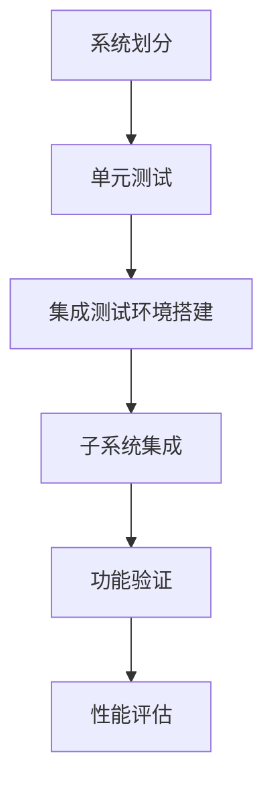

#### 13.2 集成测试中的关键问题

在自动驾驶系统的集成测试过程中，可能会遇到以下关键问题：

1. **通信问题**：集成测试中，系统各部分之间的通信是关键。可能会出现数据传输错误、通信延迟、数据不一致等问题。解决方法包括改进通信协议、增加冗余通信路径和实时监控通信状态。
2. **传感器数据融合**：自动驾驶系统依赖于多种传感器提供的数据，不同传感器之间的数据融合是挑战之一。数据融合的关键问题包括传感器误差、数据同步、数据关联等。解决方案包括多传感器数据融合算法、传感器误差校正和统一的时间戳管理。
3. **实时性**：自动驾驶系统需要在实时环境下运行，以确保驾驶操作的安全和有效性。实时性问题包括计算延迟、I/O延迟、操作系统调度等。解决方法包括使用实时操作系统、优化算法和硬件加速。
4. **故障诊断**：在集成测试过程中，系统可能会出现各种故障，如传感器故障、硬件故障、软件错误等。故障诊断是确保系统稳定运行的重要环节。解决方案包括故障检测和诊断算法、实时日志记录和分析工具。
5. **环境适应性**：自动驾驶系统需要在不同的环境和路况下运行，包括城市道路、高速公路、雨雪天气等。环境适应性测试是验证系统在不同环境下性能的关键。解决方案包括多样化测试场景设计和仿真环境搭建。

通过识别和解决这些关键问题，可以确保自动驾驶系统在集成测试过程中能够稳定、高效地运行，为后续的测试和部署奠定基础。

#### 13.3 系统验证与性能评估

系统验证与性能评估是自动驾驶系统集成后的关键环节，旨在确保系统满足预期性能和安全标准。以下是一些系统验证与性能评估的关键步骤：

1. **功能验证**：通过多种测试场景，验证系统是否能够实现预期的功能。例如，验证感知系统是否能够准确识别障碍物，决策系统是否能够生成合理的驾驶策略，控制系统能否按照策略执行操作等。
2. **性能评估**：评估系统的整体性能，包括响应时间、能耗、准确度等。通过实际驾驶测试和仿真测试，测量系统的性能指标，并与设计要求进行对比。常见性能评估指标包括：
   - **响应时间**：从感知到决策再到控制，系统完成一次操作所需的时间。
   - **能耗**：系统在运行过程中消耗的能源，包括传感器能耗、计算能耗、执行器能耗等。
   - **准确度**：系统在各种测试场景中的表现，包括识别准确率、路径规划准确度、控制精度等。
   - **稳定性**：系统在长时间运行中的稳定性和可靠性，包括故障率、系统崩溃率等。
3. **安全性与可靠性评估**：通过模拟各种极端场景和故障情况，评估系统的安全性和可靠性。例如，验证系统在紧急情况下是否能够安全停车，在恶劣天气下是否能够稳定行驶等。安全性评估通常包括以下方面：
   - **事故率**：系统在实际驾驶中发生交通事故的频率。
   - **事故严重程度**：系统导致的交通事故的严重程度。
   - **故障恢复能力**：系统在出现故障后，能否迅速恢复正常运行。
4. **用户反馈**：收集用户对系统的反馈，了解用户对系统的满意度和使用体验。用户反馈可以帮助识别系统在实际使用中的问题，进行相应的改进和优化。
5. **持续改进**：基于功能验证、性能评估和安全性与可靠性评估的结果，对系统进行持续改进和优化。改进过程可以包括算法优化、硬件升级、软件更新等。

以下是一个简化的系统验证与性能评估流程图：

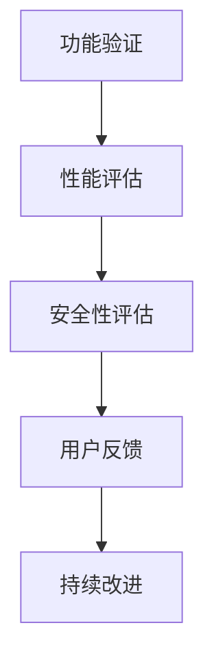

通过系统验证与性能评估，可以确保自动驾驶系统在实际运行中具备高可靠性、高安全性和高效能，为用户带来更安全、便捷的驾驶体验。

### 第14章：自动驾驶系统的测试与验证

#### 14.1 测试环境与测试场景设计

自动驾驶系统的测试与验证是一个复杂的过程，其核心在于建立一个逼真的测试环境，设计多样化的测试场景，以全面评估系统的性能和安全性。以下是如何设计和实施测试环境与测试场景的关键步骤：

1. **测试环境设计**：
   - **物理测试环境**：选择合适的场地进行物理测试，如封闭测试场、城市道路、高速公路等。物理测试环境需要具备多样化的路况和交通状况，以便测试系统在不同环境下的表现。
   - **仿真测试环境**：利用计算机仿真技术构建虚拟测试环境，可以模拟真实世界的道路、交通状况、天气条件等。仿真测试环境可以显著降低成本，提高测试效率。
   - **混合测试环境**：结合物理测试环境和仿真测试环境，通过实时数据传输和仿真模型的结合，进行更加真实的测试。

2. **测试场景设计**：
   - **标准测试场景**：根据国际标准和行业规范设计标准测试场景，如直行、转弯、紧急制动、避障等。标准测试场景有助于评估系统在不同条件下的基本性能。
   - **复杂测试场景**：设计复杂的多车环境、极端天气条件、特殊道路状况等测试场景，以评估系统在极端条件下的适应能力和稳定性。
   - **用户场景**：收集和分析实际驾驶数据，设计接近真实驾驶环境的测试场景，如市区拥堵、高速公路巡航等，以验证系统在实际使用中的性能和用户体验。

3. **测试场景实施**：
   - **场景部署**：在测试环境中部署传感器、执行器和通信设备，确保测试场景能够正常运行。
   - **数据采集**：通过传感器实时采集车辆和环境数据，如速度、加速度、转向角度、障碍物位置等，以便后续分析。
   - **测试执行**：执行预设的测试场景，记录系统在各个场景中的表现，包括控制指令、执行效果、系统响应等。

以下是一个简化的测试环境与测试场景设计流程图：

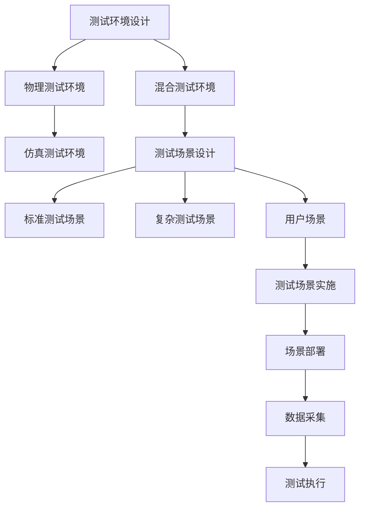

通过精心设计的测试环境和测试场景，可以全面、真实地评估自动驾驶系统的性能和安全性，为系统的优化和改进提供科学依据。

#### 14.2 测试数据收集与处理

在自动驾驶系统的测试与验证过程中，测试数据的收集与处理是至关重要的环节。以下是如何高效收集和处理测试数据的几个关键步骤：

1. **数据收集**：
   - **多传感器数据收集**：自动驾驶系统通常依赖于多种传感器（如激光雷达、摄像头、毫米波雷达、超声波传感器等）来获取环境信息。在测试过程中，需要确保传感器能够同时、准确地采集数据。
   - **车辆状态数据收集**：收集车辆内部的状态数据，如车速、加速度、制动压力、转向角度等。这些数据对于分析车辆行为和系统响应至关重要。
   - **外部环境数据收集**：收集测试环境中的外部数据，如交通流量、道路标识、天气状况等。这些数据有助于理解系统在不同环境下的表现。

2. **数据存储**：
   - **本地存储**：将测试数据实时存储在车辆内部的存储设备上，如固态硬盘（SSD）或内部存储卡。本地存储可以保证数据的实时性和安全性。
   - **云端存储**：将部分关键数据上传到云端存储，以便后续分析和共享。云端存储具有大容量、高可靠性和远程访问的优势。

3. **数据处理**：
   - **数据清洗**：对采集到的测试数据进行预处理，包括去噪、滤波、归一化等，以提高数据的准确性和一致性。
   - **数据融合**：将来自不同传感器的数据进行融合，以获得更全面、更准确的环境信息。数据融合可以通过多传感器融合算法（如卡尔曼滤波、贝叶斯滤波等）实现。
   - **特征提取**：从处理后的数据中提取关键特征，如障碍物的位置、速度、形状等。特征提取有助于后续的数据分析和模型训练。

4. **数据可视化**：
   - **实时可视化**：在测试过程中，利用实时可视化工具（如图形用户界面、虚拟现实等）展示数据，以便实时监控系统表现。
   - **历史数据分析**：利用历史数据可视化工具，分析测试数据的历史趋势和变化，发现系统性能的改进空间。

以下是一个简化的测试数据收集与处理流程图：

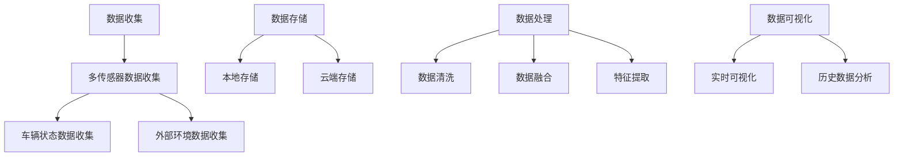

通过高效的数据收集与处理，可以确保测试数据的准确性和完整性，为自动驾驶系统的性能评估和优化提供可靠的数据支持。

#### 14.3 测试结果分析与优化

测试结果分析是自动驾驶系统测试与验证的最后一个关键环节，它通过对测试数据的深入分析，发现系统的不足之处，并进行相应的优化和改进。以下是如何进行测试结果分析与优化的几个关键步骤：

1. **结果分析**：
   - **性能分析**：分析系统在不同测试场景下的性能指标，如响应时间、能耗、准确度等。通过对比设计要求，识别系统性能的瓶颈和不足之处。
   - **安全性分析**：评估系统在各种极端条件下的安全性，如碰撞风险、紧急制动效果等。通过分析事故率和事故严重程度，识别系统的安全隐患。
   - **用户体验分析**：收集用户对系统的反馈，分析用户满意度和使用体验。通过用户行为数据，识别系统在操作便利性和舒适性方面的不足。

2. **问题定位**：
   - **故障排查**：通过对测试数据中的异常情况进行分析，定位系统中的故障和错误。例如，通过分析传感器数据，发现异常的障碍物检测或路径规划问题。
   - **代码审查**：对系统的代码进行审查，识别潜在的逻辑错误和编程缺陷。通过代码审查，可以发现算法实现中的问题和优化空间。

3. **优化措施**：
   - **算法优化**：根据测试结果，优化系统的算法和模型。例如，通过调整路径规划算法的参数，提高路径规划的准确性和效率；通过改进感知算法，提高障碍物检测的准确度和鲁棒性。
   - **硬件升级**：根据系统的性能需求，升级硬件设备，如传感器、处理器等。硬件升级可以显著提升系统的计算速度和处理能力，从而提高整体性能。
   - **软件更新**：更新系统的软件部分，包括操作系统、驱动程序等。软件更新可以修复已知的漏洞和错误，提高系统的稳定性和可靠性。

4. **验证与迭代**：
   - **重新测试**：在优化措施实施后，对系统进行重新测试，验证优化效果。重新测试可以确保优化措施的有效性和稳定性。
   - **迭代改进**：基于重新测试的结果，继续进行优化和改进。通过不断迭代，逐步提升系统的性能和安全性。

以下是一个简化的测试结果分析与优化流程图：

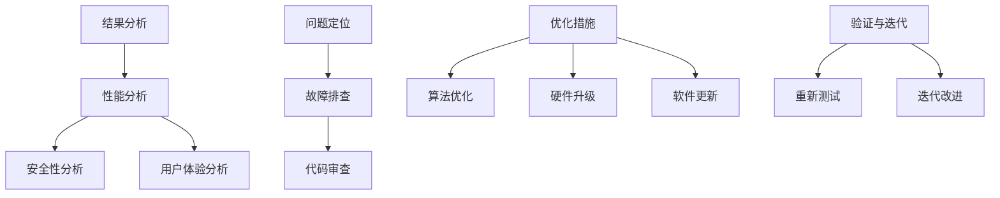

通过系统化的测试结果分析与优化，可以逐步提升自动驾驶系统的性能和安全性，为最终实现安全、高效、可靠的自动驾驶奠定坚实基础。

### 第15章：自动驾驶系统的部署与维护

#### 15.1 部署策略与实施

自动驾驶系统的部署是一个复杂且关键的过程，它涉及到系统的安装、配置、调试和测试等多个环节。以下是一些关键步骤和注意事项：

1. **前期准备**：
   - **硬件准备**：确保车辆配备齐全的传感器、控制器和执行器等硬件设备，并检查其工作状态。
   - **软件准备**：准备自动驾驶系统的软件版本，包括操作系统、驱动程序和应用程序等，并确保其兼容性和稳定性。
   - **环境准备**：为自动驾驶系统提供一个适合的测试和运行环境，包括封闭测试场、道路测试环境等。

2. **部署流程**：
   - **硬件安装**：将传感器、控制器和执行器等硬件设备安装在车辆上，并进行固定和接线。
   - **软件安装**：将自动驾驶系统的软件安装到车辆的控制器上，并进行初始配置。
   - **系统调试**：通过仿真软件和实际测试，调试系统的各个模块，确保其正常工作。
   - **系统集成**：将感知、决策和控制等模块进行集成，确保系统各部分能够协同工作。

3. **注意事项**：
   - **安全性**：在部署过程中，确保系统的安全性，包括数据传输安全、软件更新安全等。
   - **兼容性**：确保系统在不同车辆和不同环境下具有良好的兼容性，避免因环境差异导致的系统故障。
   - **实时性**：确保系统的实时性能，避免因计算延迟和通信延迟导致的系统响应不及时。

#### 15.2 维护与管理

自动驾驶系统的维护与管理是确保系统长期稳定运行的重要保障。以下是一些关键步骤和策略：

1. **定期检查**：
   - **硬件检查**：定期检查传感器、控制器和执行器等硬件设备，确保其工作状态良好，及时更换故障设备。
   - **软件检查**：定期检查系统软件的运行状态，包括操作系统、驱动程序和应用程序等，确保其更新和稳定性。

2. **故障诊断**：
   - **实时监控**：通过实时监控系统，监控系统的运行状态和性能指标，及时发现潜在故障。
   - **故障排查**：根据监控系统提供的信息，进行故障排查和修复，确保系统快速恢复正常运行。

3. **软件更新**：
   - **版本更新**：定期更新系统软件，包括操作系统、驱动程序和应用程序等，以修复已知漏洞和错误，提升系统性能。
   - **安全更新**：关注自动驾驶领域的安全动态，及时更新系统以应对新的安全威胁。

4. **数据管理**：
   - **数据备份**：定期备份系统数据，包括测试数据、日志数据、用户数据等，确保数据的安全性和可恢复性。
   - **数据分析**：对系统运行数据进行分析，发现潜在问题和优化空间，为系统的改进提供依据。

5. **维护记录**：
   - **维护日志**：记录每次维护的操作内容、时间、责任人等，以便追溯和维护管理。
   - **维护计划**：制定定期维护计划，确保系统按照既定计划进行维护和保养。

#### 15.3 故障诊断与应对策略

在自动驾驶系统的运行过程中，难免会遇到各种故障和问题。有效的故障诊断与应对策略是确保系统可靠性和稳定性的关键。以下是一些常用的故障诊断方法和应对策略：

1. **故障诊断方法**：
   - **日志分析**：通过分析系统日志，查找故障发生时的异常信息，定位故障源头。
   - **传感器校准**：定期校准传感器，确保其数据的准确性和一致性。
   - **硬件测试**：对传感器、控制器和执行器等硬件设备进行功能测试，检测是否存在硬件故障。
   - **系统重构**：在故障无法通过常规方法解决时，考虑进行系统重构，重新安装和配置系统软件。

2. **应对策略**：
   - **快速响应**：一旦发现故障，立即进行响应和处理，确保故障不会对系统的正常运行造成严重影响。
   - **故障隔离**：通过故障诊断，隔离故障模块，防止故障蔓延。
   - **备用方案**：在关键模块发生故障时，启动备用方案，如切换到手动驾驶模式，确保系统的连续性和安全性。
   - **应急预案**：制定详细的应急预案，确保在发生重大故障时，系统能够快速恢复，减少损失。

通过以上部署与维护策略，可以确保自动驾驶系统在运行过程中具备高可靠性和高安全性，为用户提供稳定、安全的驾驶体验。

### 附录

#### 附录 A：参考资料

A.1 自动驾驶相关书籍推荐

- 《自动驾驶汽车：技术、挑战与应用》
- 《自动驾驶系统设计与实现》
- 《深度学习与自动驾驶：理论与实践》
- 《无人驾驶飞行器技术》
- 《智能交通系统：架构、技术与应用》

A.2 自动驾驶技术论文精选

- “Autonomous Driving using Deep Learning and Computer Vision”
- “Model Predictive Control for Autonomous Driving”
- “Deep Reinforcement Learning for Autonomous Driving”
- “Sensor Fusion for Autonomous Driving”
- “Robust Path Planning for Autonomous Vehicles”

A.3 自动驾驶技术会议与研讨会

- 国际机器人与人工智能会议（ICRA）
- 自动驾驶技术国际会议（AVSS）
- 国际智能交通系统会议（ITS World Congress）
- 机器人与自动驾驶国际会议（ICRAVS）
- 深度学习与人工智能国际会议（NeurIPS）

A.4 开源自动驾驶平台与工具

- NVIDIA Drive
- OpenCV
- ROS（Robot Operating System）
- Autoware
- Apollo Auto
- NVIDIA Drive Sim

#### 附录 B：术语解释

B.1 自动驾驶相关术语解释

- 自动驾驶（Autonomous Driving）：车辆无需人类干预，通过计算机系统实现自主驾驶。
- 感知（Perception）：自动驾驶系统通过传感器获取周围环境信息的过程。
- 决策（Decision Making）：自动驾驶系统基于感知数据进行分析，制定行驶策略的过程。
- 控制（Control）：自动驾驶系统根据决策结果，对车辆进行实时控制的过程。
- 路径规划（Path Planning）：自动驾驶系统确定从起点到终点的最优行驶路径。
- 行为规划（Behavior Planning）：自动驾驶系统制定车辆在行驶过程中的具体行为，如加速、减速、转向等。
- 动力控制（Thrust Control）：自动驾驶系统控制车辆的推进力。
- 制动控制（Brake Control）：自动驾驶系统控制车辆的制动系统，实现减速和停车。

B.2 感知、决策与控制相关技术解释

- 激光雷达（LiDAR）：通过发射激光脉冲并测量反射时间，获取目标物体距离和形状的高精度测距技术。
- 摄像头（Camera）：用于捕捉图像并转换为数字信号的设备，适用于目标识别和环境感知。
- 毫米波雷达（Millimeter-Wave Radar）：利用毫米波（30GHz-300GHz）进行目标探测和测距的雷达系统。
- PID控制（Proportional-Integral-Derivative Control）：一种常用的控制算法，通过调整比例、积分和微分三个参数实现精确控制。
- 模型预测控制（Model Predictive Control, MPC）：一种基于系统模型和优化算法的先进控制方法，用于生成最优控制输入。
- 深度学习（Deep Learning）：一种基于神经网络的学习方法，通过多层非线性变换，从大量数据中提取特征，实现复杂函数逼近。

通过以上术语解释，读者可以更好地理解自动驾驶系统的核心概念和技术细节，为深入研究和应用提供基础。

### 附录 C：代码示例

C.1 感知模块代码示例

以下是一个基于激光雷达数据感知模块的Python代码示例，用于提取环境中的障碍物信息：

```python
import numpy as np
import matplotlib.pyplot as plt
from sensor import LaserScanner

# 初始化激光雷达传感器
scanner = LaserScanner()

# 采集激光雷达数据
data = scanner.scan()

# 数据预处理
filtered_data = preprocess_data(data)

# 障碍物检测
obstacles = detect_obstacles(filtered_data)

# 绘制障碍物
plt.scatter(obstacles[:, 0], obstacles[:, 1])
plt.xlabel('X-coordinate')
plt.ylabel('Y-coordinate')
plt.title('Detected Obstacles')
plt.show()

# 数据预处理函数
def preprocess_data(data):
    # 去除噪声和异常值
    filtered_data = np.abs(data) < 10
    # 过滤短距离数据
    filtered_data = filtered_data[filtered_data > 2]
    return filtered_data

# 障碍物检测函数
def detect_obstacles(data):
    # 使用阈值方法检测障碍物
    obstacles = np.where(data > 5)
    return obstacles
```

C.2 决策模块代码示例

以下是一个简单的决策模块代码示例，用于路径规划和行为规划：

```python
import numpy as np

# 定义决策模块
class DecisionModule:
    def __init__(self, path_planner, behavior_planner):
        self.path_planner = path_planner
        self.behavior_planner = behavior_planner
    
    def plan_path(self, start, goal):
        path = self.path_planner.plan(start, goal)
        return path
    
    def plan_behavior(self, current_state, goal):
        behavior = self.behavior_planner.plan(current_state, goal)
        return behavior

# 路径规划器
class PathPlanner:
    def plan(self, start, goal):
        # 实现路径规划算法，如A*算法
        path = a_star(start, goal)
        return path

# 行为规划器
class BehaviorPlanner:
    def plan(self, current_state, goal):
        # 实现行为规划算法，如数据驱动行为规划
        behavior = data_driven_behavior(current_state, goal)
        return behavior

# 调用决策模块
decision_module = DecisionModule(PathPlanner(), BehaviorPlanner())

# 计划路径
start = np.array([0, 0])
goal = np.array([100, 100])
path = decision_module.plan_path(start, goal)

# 计划行为
current_state = np.array([10, 10])
goal = np.array([100, 100])
behavior = decision_module.plan_behavior(current_state, goal)
```

C.3 控制模块代码示例

以下是一个简单的控制模块代码示例，用于实现PID控制：

```python
import numpy as np

# 定义控制模块
class ControlModule:
    def __init__(self, Kp, Ki, Kd):
        self.Kp = Kp
        self.Ki = Ki
        self.Kd = Kd
        self.integral = 0
        self.previous_error = 0
    
    def update(self, error):
        derivative = error - self.previous_error
        u = (self.Kp * error) + (self.Ki * self.integral) + (self.Kd * derivative)
        self.integral += error
        self.previous_error = error
        return u

# PID控制函数
def pid_control(target, actual, Kp, Ki, Kd):
    error = target - actual
    control_output = control_module.update(error)
    return control_output

# 调用PID控制模块
control_module = ControlModule(Kp=1.0, Ki=0.1, Kd=0.05)

# 控制速度
target_speed = 10.0
actual_speed = 5.0
control_output = pid_control(target_speed, actual_speed, Kp, Ki, Kd)

# 执行控制
print(f"Control Output: {control_output}")
```

通过以上代码示例，可以更好地理解自动驾驶系统的感知、决策与控制模块的实现原理和具体应用。这些代码可以作为参考，用于开发更加复杂和功能丰富的自动驾驶系统。

