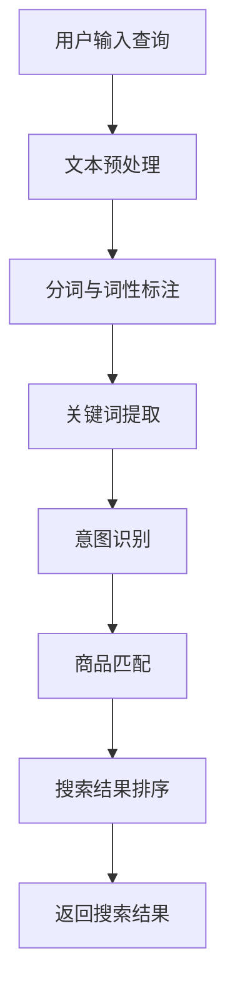

                 

### 文章标题

《自然语言处理在电商搜索中的应用：技术发展与未来趋势》

### 关键词

自然语言处理、电商搜索、技术发展、未来趋势、算法优化、用户意图识别、个性化推荐

### 摘要

本文将深入探讨自然语言处理（NLP）在电商搜索领域中的应用，从技术发展的角度出发，详细解析NLP的关键技术、原理及其在电商搜索中的具体应用。文章将分为三个主要部分：第一部分介绍自然语言处理的基础知识，包括文本预处理与特征提取；第二部分聚焦于电商搜索中的NLP技术，探讨商品信息理解与匹配、用户查询理解与意图识别、个性化推荐与搜索结果排序、自然语言生成以及多语言处理；第三部分展望自然语言处理技术在电商搜索中的未来发展趋势，包括技术进步带来的机遇与挑战。通过本文的详细分析和讨论，读者将能够全面了解自然语言处理在电商搜索中的重要性和应用前景。

#### 第一部分：自然语言处理基础

### 第1章：自然语言处理概述

##### 1.1 自然语言处理的定义与发展

自然语言处理（NLP，Natural Language Processing）是计算机科学、人工智能和语言学领域的交叉学科，旨在研究如何使计算机理解、生成和处理人类语言。自20世纪50年代以来，NLP经历了数个发展阶段。

- **早期阶段**：1950年，艾伦·图灵提出了著名的“图灵测试”，旨在评估机器是否具有人类水平的智能，这一概念直接推动了NLP的研究。此后，许多学者开始关注如何使计算机理解和生成自然语言。

- **关键词匹配阶段**：20世纪60年代，研究人员主要采用基于关键词的匹配方法，通过统计文本中的关键词频率来检索信息。然而，这种方法在面对复杂查询时效果不佳。

- **规则驱动阶段**：20世纪70年代，NLP开始引入规则系统，通过定义语法和语义规则来解析文本。这种方法虽然提高了处理复杂语言结构的能力，但规则繁琐且难以扩展。

- **统计方法阶段**：20世纪90年代，随着机器学习技术的发展，NLP开始采用统计模型。以条件概率模型和隐马尔可夫模型（HMM）为代表的统计方法，使得计算机能够从大量数据中自动学习语言模式，大大提高了处理自然语言的能力。

- **深度学习阶段**：21世纪初，深度学习技术的崛起为NLP带来了革命性的变革。以卷积神经网络（CNN）和循环神经网络（RNN）为代表的深度学习模型，通过学习大量的语言数据，实现了对自然语言的语义理解和生成。

##### 1.2 自然语言处理的关键技术

自然语言处理涉及多种关键技术，以下将简要介绍其中几个核心技术：

- **分词（Tokenization）**：将文本划分为词语或短语的步骤。分词是NLP中的基础任务，对于后续的文本处理和理解至关重要。

- **词性标注（Part-of-Speech Tagging）**：为文本中的每个词语分配语法类别，如名词、动词、形容词等。词性标注有助于理解句子的结构和语义。

- **句法分析（Syntax Analysis）**：解析句子的结构，识别出主语、谓语、宾语等语法成分。句法分析是理解文本深层语义的关键。

- **语义分析（Semantic Analysis）**：理解文本中的词语和句子的含义。语义分析涉及到词义消歧、指代消解、语义角色标注等任务。

- **实体识别（Named Entity Recognition）**：识别文本中具有特定意义的实体，如人名、地名、组织名等。实体识别对于信息抽取和知识图谱构建至关重要。

- **情感分析（Sentiment Analysis）**：分析文本中的情感倾向，如正面、负面或中性。情感分析广泛应用于社交媒体监测、市场调研等领域。

- **机器翻译（Machine Translation）**：将一种语言的文本自动翻译成另一种语言。机器翻译是NLP领域的一个重大挑战，近年来取得了显著的进展。

##### 1.3 自然语言处理在电商搜索中的应用概述

自然语言处理技术在电商搜索中的应用主要包括以下几个方面：

- **商品搜索**：用户可以通过输入自然语言查询，如“红米手机”，系统需要理解用户意图，匹配相应的商品信息，并返回最相关的搜索结果。

- **推荐系统**：基于用户的历史行为和查询记录，推荐系统可以预测用户可能感兴趣的商品。NLP技术可以帮助提取用户查询中的关键词和语义信息，从而提高推荐的准确性和个性化程度。

- **智能客服**：电商平台的智能客服系统可以使用NLP技术理解用户的问题和需求，提供快速、准确的答复。

- **商品描述生成**：NLP技术可以自动生成商品的描述文本，帮助商家提高产品的展示效果，吸引更多潜在客户。

- **多语言支持**：随着跨境电商的发展，多语言处理技术变得尤为重要。NLP技术可以帮助平台实现不同语言之间的信息检索和交流。

### 第2章：文本预处理与特征提取

##### 2.1 文本预处理流程

文本预处理是自然语言处理中的关键步骤，旨在将原始文本转换为适合模型训练和推理的形式。以下是文本预处理的主要流程：

- **文本清洗**：去除文本中的无关信息，如HTML标签、特殊符号、停用词等。

- **分词**：将连续的文本切分成词语或短语的步骤。常用的分词算法包括最大匹配法、最小匹配法、基于词典的分词等。

- **词性标注**：为文本中的每个词语分配语法类别，为后续的语法分析和语义理解奠定基础。

- **去停用词**：移除对文本理解贡献不大的常用词汇，如“的”、“是”、“和”等。

- **词干提取**：将不同形式的词语转换为其基本形式，如将“playing”、“plays”和“played”统一为“play”。

- **词向量表示**：将文本中的词语转换为数值向量，以便在机器学习模型中进行处理。常用的词向量表示方法包括Word2Vec、GloVe等。

##### 2.2 常见文本预处理技术

- **正则表达式**：用于文本清洗，通过定义模式匹配特定的字符串并进行替换或删除。

- **NLTK**：一个开源的自然语言处理库，提供了丰富的文本处理工具，如分词、词性标注、词干提取等。

- **spaCy**：一个高效的NLP库，提供了强大的文本处理功能，包括词性标注、实体识别、句法分析等。

- **jieba**：一个中文分词工具，广泛应用于中文文本处理。

##### 2.3 特征提取方法与应用

特征提取是将文本数据转换为机器学习模型所需的特征向量。以下是几种常见的特征提取方法：

- **词袋模型（Bag-of-Words, BOW）**：将文本表示为一个向量，其中每个元素表示一个词语的出现次数。词袋模型简单有效，但忽略了词语的顺序信息。

- **TF-IDF（Term Frequency-Inverse Document Frequency）**：结合词语在文档中的出现频率和其在整个文档集合中的分布，衡量词语的重要性。TF-IDF广泛应用于文本分类和信息检索。

- **Word2Vec**：通过学习词语的上下文信息，将词语映射到高维空间中的向量。Word2Vec能够捕捉词语的语义关系，如“国王”和“女王”之间的相似性。

- **GloVe（Global Vectors for Word Representation）**：基于共现矩阵的词语向量表示方法，通过优化词向量的低维表示，以捕捉词语的语义信息。

- **BERT（Bidirectional Encoder Representations from Transformers）**：一种基于Transformer的预训练模型，通过同时关注文本的前后信息，生成高质量的词语向量。BERT在多种NLP任务中取得了显著的效果。

#### 第二部分：电商搜索中的自然语言处理技术

### 第3章：商品信息理解与匹配

##### 3.1 商品信息理解

###### 3.1.1 商品信息理解的定义与重要性

商品信息理解是指从用户输入的查询中提取关键信息，理解用户查询背后的意图，并将其与电商网站上的商品信息进行匹配。商品信息理解是电商搜索系统的核心功能，直接影响到搜索结果的准确性和用户体验。

定义：商品信息理解包括以下几个方面：

- **关键词提取**：从用户查询中提取出关键性词语，如品牌名、商品类别等。
- **语义匹配**：将提取的关键词与商品信息库中的词语进行语义匹配，以确定用户查询所涉及的商品。
- **上下文分析**：分析用户查询的上下文信息，如搜索历史、用户偏好等，以辅助理解用户意图。

重要性：商品信息理解是电商搜索系统的核心功能，其重要性体现在以下几个方面：

- 提高搜索结果的准确性：通过准确理解用户查询，系统能够返回更符合用户需求的搜索结果。
- 优化用户体验：良好的商品信息理解能够提高用户在电商平台的满意度，降低用户流失率。
- 支持个性化推荐：通过对用户查询的理解，系统能够更好地为用户推荐相关商品，提高销售转化率。

###### 3.1.2 商品信息理解的技术原理

商品信息理解的技术原理主要包括以下几个方面：

- **关键词提取**：关键词提取是商品信息理解的第一步，旨在从用户查询中提取出关键性词语。常见的关键词提取方法包括：

  - **基于频率的方法**：统计查询中每个词语的出现频率，选取出现频率较高的词语作为关键词。
  - **基于词性标注的方法**：利用词性标注结果，选取名词、动词等具有实际意义的词语作为关键词。
  - **基于统计模型的方法**：利用统计模型，如条件概率模型，对查询中的词语进行筛选和排序，选取最重要的词语作为关键词。

- **语义匹配**：语义匹配是将提取的关键词与商品信息库中的词语进行匹配的过程。常见的语义匹配方法包括：

  - **基于关键词匹配的方法**：通过计算关键词的重叠度，评估查询与商品之间的匹配程度。
  - **基于语义相似度的方法**：利用语义相似度计算，如余弦相似度、欧氏距离等，评估查询与商品之间的语义相似度。
  - **基于本体论的方法**：利用本体论，将查询和商品信息映射到相同的语义空间，通过计算它们之间的距离或相似度进行匹配。

- **上下文分析**：上下文分析旨在通过分析用户查询的上下文信息，如搜索历史、用户偏好等，以辅助理解用户意图。常见的上下文分析方法包括：

  - **基于历史数据的方法**：利用用户的历史搜索数据，如频繁查询、购买记录等，进行模式识别和预测。
  - **基于用户画像的方法**：构建用户画像，包括用户的基本信息、购买偏好、兴趣爱好等，用于辅助理解用户意图。
  - **基于协同过滤的方法**：利用协同过滤技术，如基于用户的协同过滤、基于项目的协同过滤，预测用户可能感兴趣的商品。

###### 3.1.3 商品信息理解的应用场景

商品信息理解在电商搜索中的应用场景非常广泛，以下是一些典型的应用场景：

- **商品搜索**：用户可以通过输入自然语言查询，如“红米手机”，系统需要理解用户意图，匹配相应的商品信息，并返回最相关的搜索结果。
- **推荐系统**：基于用户的历史行为和查询记录，推荐系统可以预测用户可能感兴趣的商品。商品信息理解技术可以帮助提取用户查询中的关键词和语义信息，从而提高推荐的准确性和个性化程度。
- **智能客服**：电商平台的智能客服系统可以使用商品信息理解技术理解用户的问题和需求，提供快速、准确的答复。
- **商品描述生成**：NLP技术可以自动生成商品的描述文本，帮助商家提高产品的展示效果，吸引更多潜在客户。
- **多语言支持**：随着跨境电商的发展，多语言处理技术变得尤为重要。商品信息理解技术可以帮助平台实现不同语言之间的信息检索和交流。

##### 3.2 商品匹配算法

###### 3.2.1 商品匹配算法的基本概念

商品匹配算法是指通过一定的方式将用户的查询与电商网站上的商品进行匹配，以生成最相关的搜索结果。商品匹配算法在电商搜索系统中起着至关重要的作用，直接影响着用户的搜索体验和平台的业务收益。

基本概念：

- **用户查询**：用户在电商平台上输入的自然语言查询，如“红米手机”、“电脑显示器”等。
- **商品信息**：电商平台上的商品信息，包括商品标题、描述、价格、库存等。
- **匹配结果**：根据商品匹配算法计算出的最相关商品列表，用于展示给用户。

商品匹配算法的目标是找到与用户查询最相关的商品，以满足用户的需求。常见的商品匹配算法包括：

- **基于关键词匹配的算法**：通过计算用户查询和商品信息中的关键词重叠度，评估匹配程度。
- **基于语义匹配的算法**：利用语义分析技术，计算用户查询和商品信息之间的语义相似度。
- **基于协同过滤的算法**：利用用户的历史行为数据，如购买记录、浏览记录等，进行推荐。

###### 3.2.2 基于关键词匹配的算法

基于关键词匹配的算法是最简单的一种商品匹配算法，主要通过计算用户查询与商品之间的关键词重叠度来评估匹配程度。以下是一种简单基于关键词匹配的算法：

- **算法步骤**：

  1. 提取用户查询中的关键词，并对其进行预处理（如去停用词、词干提取等）。
  2. 提取商品信息中的关键词，并对其进行预处理。
  3. 计算用户查询和商品之间的关键词重叠度，通常采用交集或并集的方法。
  4. 根据关键词重叠度对商品进行排序，返回最相关的商品列表。

- **伪代码**：

  ```python
  def keyword_matching(query, items):
      # 步骤1：提取查询关键词
      query_keywords = extract_keywords(query)
      
      # 步骤2：提取商品关键词
      item_keywords = [extract_keywords(item) for item in items]
      
      # 步骤3：计算关键词重叠度
      scores = []
      for item in items:
          intersection = set(query_keywords).intersection(set(item_keywords))
          union = set(query_keywords).union(set(item_keywords))
          score = len(intersection) / len(union)
          scores.append(score)
          
      # 步骤4：根据关键词重叠度排序
      sorted_items = [item for _, item in sorted(zip(scores, items), reverse=True)]
      
      return sorted_items
  ```

- **性能评估**：

  基于关键词匹配的算法简单直观，但存在一定的局限性。以下是一些常见的性能评估指标：

  - **准确率（Accuracy）**：匹配结果中实际正确的商品数量与总商品数量的比值。
  - **召回率（Recall）**：匹配结果中实际正确的商品数量与实际正确商品数量的比值。
  - **F1值（F1 Score）**：准确率和召回率的调和平均值。

  ```python
  def evaluate_performance(true_positives, false_positives, false_negatives):
      precision = true_positives / (true_positives + false_positives)
      recall = true_positives / (true_positives + false_negatives)
      f1_score = 2 * precision * recall / (precision + recall)
      return precision, recall, f1_score
  ```

###### 3.2.3 基于语义匹配的算法

基于语义匹配的算法通过计算用户查询和商品信息之间的语义相似度来评估匹配程度。以下是一种简单基于语义匹配的算法：

- **算法步骤**：

  1. 利用词向量模型（如Word2Vec、GloVe）将用户查询和商品信息中的关键词转换为向量表示。
  2. 计算用户查询和商品信息之间的语义相似度，通常采用余弦相似度或欧氏距离。
  3. 根据语义相似度对商品进行排序，返回最相关的商品列表。

- **伪代码**：

  ```python
  import numpy as np

  def semantic_matching(query_vector, item_vectors):
      # 步骤1：计算用户查询与商品之间的语义相似度
      scores = []
      for item_vector in item_vectors:
          similarity = 1 - cosine_similarity([query_vector], [item_vector])
          scores.append(similarity)
          
      # 步骤2：根据语义相似度排序
      sorted_items = [item for _, item in sorted(zip(scores, item_vectors), reverse=True)]
      
      return sorted_items
  ```

- **性能评估**：

  与基于关键词匹配的算法类似，基于语义匹配的算法也需要进行性能评估。以下是一些常见的性能评估指标：

  - **准确率（Accuracy）**：匹配结果中实际正确的商品数量与总商品数量的比值。
  - **召回率（Recall）**：匹配结果中实际正确的商品数量与实际正确商品数量的比值。
  - **F1值（F1 Score）**：准确率和召回率的调和平均值。

  ```python
  def evaluate_performance(true_positives, false_positives, false_negatives):
      precision = true_positives / (true_positives + false_positives)
      recall = true_positives / (true_positives + false_negatives)
      f1_score = 2 * precision * recall / (precision + recall)
      return precision, recall, f1_score
  ```

###### 3.2.4 基于协同过滤的算法

基于协同过滤的算法通过分析用户的历史行为数据，预测用户可能感兴趣的商品。以下是一种简单基于协同过滤的算法：

- **算法步骤**：

  1. 构建用户-商品评分矩阵，记录用户对商品的评分或购买行为。
  2. 利用用户的历史行为数据，计算用户之间的相似度。
  3. 根据用户相似度和商品的评分预测用户对商品的偏好。
  4. 根据预测的偏好对商品进行排序，返回最相关的商品列表。

- **算法伪代码**：

  ```python
  import numpy as np

  def collaborative_filtering(user_ratings, item_ratings, k):
      # 步骤1：计算用户之间的相似度
      user_similarity = compute_similarity(user_ratings)
      
      # 步骤2：计算预测评分
      predicted_ratings = []
      for user in user_ratings:
          neighbor_users = get_neighbors(user_similarity, user, k)
          neighbor_ratings = [user_ratings[neighbor] for neighbor in neighbor_users]
          predicted_rating = np.dot(neighbor_ratings, neighbor_weights) / np.linalg.norm(neighbor_ratings)
          predicted_ratings.append(predicted_rating)
          
      # 步骤3：根据预测评分排序
      sorted_items = [item for _, item in sorted(zip(predicted_ratings, item_ratings), reverse=True)]
      
      return sorted_items
  ```

- **性能评估**：

  与前两种算法类似，基于协同过滤的算法也需要进行性能评估。以下是一些常见的性能评估指标：

  - **准确率（Accuracy）**：匹配结果中实际正确的商品数量与总商品数量的比值。
  - **召回率（Recall）**：匹配结果中实际正确的商品数量与实际正确商品数量的比值。
  - **F1值（F1 Score）**：准确率和召回率的调和平均值。

  ```python
  def evaluate_performance(true_positives, false_positives, false_negatives):
      precision = true_positives / (true_positives + false_positives)
      recall = true_positives / (true_positives + false_negatives)
      f1_score = 2 * precision * recall / (precision + recall)
      return precision, recall, f1_score
  ```

##### 3.3 商品匹配算法的性能评估

商品匹配算法的性能评估是衡量算法优劣的重要手段，常用的性能评估指标包括准确率、召回率、F1值等。

###### 3.3.1 性能评估指标

- **准确率（Accuracy）**：准确率是指匹配结果中实际正确的商品数量与总商品数量的比值，计算公式为：

  $$Accuracy = \frac{TP + TN}{TP + TN + FP + FN}$$

  其中，TP表示实际匹配正确的商品数量，TN表示实际不匹配的商品数量，FP表示误匹配的商品数量，FN表示漏匹配的商品数量。

- **召回率（Recall）**：召回率是指匹配结果中实际正确的商品数量与实际正确商品数量的比值，计算公式为：

  $$Recall = \frac{TP}{TP + FN}$$

- **F1值（F1 Score）**：F1值是准确率和召回率的调和平均值，计算公式为：

  $$F1 Score = 2 \times \frac{Precision \times Recall}{Precision + Recall}$$

  其中，Precision表示准确率。

###### 3.3.2 实验与对比

为了评估不同商品匹配算法的性能，我们可以进行以下实验：

- **数据集**：使用公开的电商搜索数据集，如Yahoo! Answers数据集或Amazon Product Search数据集。
- **算法**：对比基于关键词匹配、基于语义匹配和基于协同过滤的三种商品匹配算法。
- **评估指标**：准确率、召回率和F1值。

以下是一个简单的实验步骤和结果对比：

```python
def experiment(dataset, algorithms):
    results = {}
    for algorithm in algorithms:
        precision, recall, f1_score = evaluate_algorithm(dataset, algorithm)
        results[algorithm] = (precision, recall, f1_score)
    
    return results

def evaluate_algorithm(dataset, algorithm):
    true_positives = 0
    false_positives = 0
    false_negatives = 0
    
    for query, items in dataset:
        sorted_items = algorithm(query, items)
        for item in sorted_items:
            if item in correct_answers:
                true_positives += 1
            else:
                false_positives += 1
        
        for item in correct_answers:
            if item not in sorted_items:
                false_negatives += 1
    
    precision = true_positives / (true_positives + false_positives)
    recall = true_positives / (true_positives + false_negatives)
    f1_score = 2 * precision * recall / (precision + recall)
    
    return precision, recall, f1_score

dataset = load_dataset()
algorithms = [keyword_matching, semantic_matching, collaborative_filtering]
results = experiment(dataset, algorithms)

for algorithm, (precision, recall, f1_score) in results.items():
    print(f"{algorithm}: Precision={precision:.4f}, Recall={recall:.4f}, F1 Score={f1_score:.4f}")
```

通过实验对比，我们可以发现不同商品匹配算法在性能上的差异。在实际应用中，可以根据业务需求和数据特点选择合适的算法，或结合多种算法进行优化。

#### 第4章：用户查询理解与意图识别

##### 4.1 用户查询理解

###### 4.1.1 用户查询理解的定义

用户查询理解是指从用户输入的查询中提取出关键信息，理解用户查询背后的意图，从而为用户提供更准确的搜索结果和推荐。用户查询理解是自然语言处理（NLP）在电商搜索中的一个重要应用，它直接影响到用户体验和搜索系统的效果。

定义：用户查询理解包括以下几个核心概念：

- **查询输入**：用户通过搜索引擎或电商平台提交的自然语言查询，如“想要买一部好的手机”或“想找一些便宜的耳机”。
- **查询意图**：用户在查询输入中所表达的实际需求或目标，如购买、查询信息、寻求建议等。
- **查询实体**：查询输入中涉及的具体对象，如商品名、品牌、价格范围等。

用户查询理解的目标是通过解析和分析用户输入，将模糊、不完整的查询转化为明确的意图和实体，从而为后续的搜索结果生成和推荐提供依据。

###### 4.1.2 用户查询理解的重要性

用户查询理解在电商搜索中具有重要作用，主要体现在以下几个方面：

- **提高搜索准确性**：通过理解用户的查询意图，系统能够更准确地返回与用户需求相关的搜索结果，减少无关信息的干扰。
- **优化用户体验**：准确理解用户查询，有助于提供个性化的搜索结果和推荐，提升用户满意度和忠诚度。
- **支持个性化推荐**：基于对用户查询的理解，推荐系统可以更好地预测用户兴趣，提供个性化的商品推荐。
- **降低用户流失率**：准确理解用户查询，能够及时响应用户需求，降低用户因找不到所需信息而流失的风险。

###### 4.1.3 用户查询理解的技术原理

用户查询理解的技术原理主要包括以下几个步骤：

1. **分词与词性标注**：首先，将用户查询文本进行分词，并将每个词语进行词性标注，以便理解句子的结构和语义。

2. **关键词提取**：从分词后的文本中提取出关键性词语，如名词、动词等，这些词语通常与用户查询意图密切相关。

3. **查询意图识别**：利用提取的关键词，结合上下文信息，对用户查询意图进行分类，如购买意图、信息查询意图、比较意图等。

4. **实体提取**：从查询输入中提取出具体对象，如商品名、品牌、价格范围等，这些实体是后续搜索结果生成和推荐的关键信息。

5. **意图增强与修正**：根据用户历史查询记录和偏好，对识别出的查询意图进行增强和修正，提高查询理解的准确性和个性化程度。

具体来说，用户查询理解的技术原理包括：

- **分词与词性标注**：使用NLP工具（如NLTK、spaCy等）进行分词和词性标注，将查询文本转化为结构化的数据形式。
- **关键词提取**：采用基于频率、词性或语义的方法提取关键词，如TF-IDF、LDA等。
- **查询意图识别**：利用机器学习模型（如SVM、决策树、神经网络等）对关键词进行分类，识别用户的查询意图。
- **实体提取**：使用命名实体识别（NER）技术，从查询文本中提取出具体的对象和属性。
- **意图增强与修正**：结合用户历史数据（如浏览记录、购买记录等），利用统计方法或机器学习模型对查询意图进行修正和优化。

##### 4.2 意图识别方法

###### 4.2.1 意图识别的基本概念

意图识别（Intent Recognition）是指从用户输入的查询中识别出用户的意图，以便为用户提供更准确的搜索结果和推荐。在电商搜索中，意图识别是用户查询理解的核心步骤，通过对用户查询意图的识别，系统能够更好地理解用户需求，从而提高搜索效果和用户体验。

基本概念：

- **意图**：用户在查询中表达的具体目标或需求，如购买商品、获取信息、寻求建议等。
- **识别**：通过分析和理解用户查询，识别出用户所表达的主要意图。

意图识别的目标是准确地识别用户查询的意图，为后续的搜索结果生成和推荐提供依据。常见的意图类型包括：

- **购买意图**：用户希望购买特定商品，如“购买iPhone 13”。
- **信息查询意图**：用户希望获取特定信息，如“查询北京天气”。
- **比较意图**：用户希望比较不同商品或品牌，如“比较小米手机和华为手机”。
- **寻求建议意图**：用户希望获得专业建议，如“推荐一款好的相机”。

###### 4.2.2 意图识别方法

意图识别方法可以分为基于规则的方法和基于机器学习的方法。

1. **基于规则的方法**：

   - **规则库**：首先构建一个规则库，包含各种意图的匹配规则。规则库通常由领域专家制定，根据用户的查询内容和上下文信息进行匹配。
   - **匹配过程**：将用户查询与规则库中的规则进行匹配，根据匹配结果识别用户的意图。常见的匹配方法包括关键词匹配、模糊匹配和语义匹配。

   基于规则的方法具有解释性强、易于维护等优点，但规则库的构建和维护成本较高，且难以处理复杂多变的查询。

2. **基于机器学习的方法**：

   - **特征工程**：首先对用户查询进行预处理，提取出关键特征，如关键词、词性、实体等。
   - **模型训练**：利用机器学习算法（如SVM、决策树、神经网络等）训练分类模型，将特征映射到对应的意图类别。
   - **意图识别**：将用户查询输入到训练好的模型中，根据模型的预测结果识别用户的意图。

   基于机器学习的方法具有自动学习能力，能够处理大规模数据，但需要大量标注数据，且模型解释性较差。

以下是一个简单的基于规则和机器学习的意图识别流程：

```python
# 基于规则的意图识别
def rule_based_intent_recognition(query):
    # 步骤1：分词和词性标注
    words = tokenize(query)
    pos_tags = pos_tag(words)
    
    # 步骤2：匹配规则库
    for rule in intent_rules:
        if match_query(query, rule):
            return rule['intent']
    
    # 步骤3：未匹配的默认意图
    return '未知意图'

# 基于机器学习的意图识别
def ml_based_intent_recognition(query):
    # 步骤1：特征提取
    features = extract_features(query)
    
    # 步骤2：模型预测
    intent = model.predict([features])
    
    # 步骤3：返回识别结果
    return intent
```

###### 4.2.3 意图识别的评估方法

意图识别的性能评估是衡量算法优劣的重要手段。以下是一些常见的评估方法：

- **准确率（Accuracy）**：识别结果中正确识别的意图数量与总识别意图数量的比值。
- **召回率（Recall）**：识别结果中正确识别的意图数量与实际意图数量的比值。
- **F1值（F1 Score）**：准确率和召回率的调和平均值。

```python
def evaluate_intent_recognition(results, ground_truth):
    correct = 0
    total = len(ground_truth)
    for result, truth in zip(results, ground_truth):
        if result == truth:
            correct += 1
    accuracy = correct / total
    recall = correct / len(ground_truth)
    f1_score = 2 * accuracy * recall / (accuracy + recall)
    return accuracy, recall, f1_score
```

##### 4.3 意图识别的挑战与优化

###### 4.3.1 意图识别的挑战

意图识别在电商搜索中面临诸多挑战，以下是一些主要挑战：

1. **查询多样性**：用户查询的表达方式多种多样，包括同义词、缩写、模糊表达等，这给意图识别带来了很大的挑战。
2. **上下文理解**：用户查询通常受到上下文的影响，如用户历史查询记录、当前环境等，这需要模型具备较强的上下文理解能力。
3. **实体识别**：用户查询中可能包含具体的实体信息，如商品名、品牌等，如何准确识别这些实体是意图识别的重要环节。
4. **数据不平衡**：在实际应用中，不同意图的查询数量往往存在较大差异，导致数据分布不平衡，影响模型的训练效果。
5. **解释性**：意图识别模型通常具有较强的黑箱特性，难以解释其决策过程，这对模型的可解释性提出了挑战。

###### 4.3.2 意图识别的优化策略

为了应对意图识别的挑战，可以采取以下优化策略：

1. **增强特征提取**：通过引入更多的特征，如词向量、语法结构、实体信息等，提高模型对查询的表征能力。
2. **上下文感知**：利用用户历史查询记录、上下文环境等，为意图识别提供额外的上下文信息，增强模型的理解能力。
3. **迁移学习**：利用预训练模型，如BERT、GPT等，为意图识别提供强大的语言理解能力，减少对标注数据的依赖。
4. **数据增强**：通过数据清洗、数据扩充、生成对抗网络（GAN）等方法，提高训练数据的质量和多样性，增强模型的泛化能力。
5. **多模型集成**：结合不同模型的优势，如基于规则的方法和基于机器学习的方法，构建多模型集成系统，提高意图识别的准确性和鲁棒性。
6. **解释性增强**：利用模型的可解释性工具，如LIME、SHAP等，对模型决策过程进行解释，提高模型的透明度和可信度。

通过上述优化策略，可以有效提升意图识别的性能，提高电商搜索系统的用户体验和业务价值。

#### 第5章：个性化推荐与搜索结果排序

##### 5.1 个性化推荐系统

个性化推荐系统是电商搜索中至关重要的一部分，其目标是根据用户的历史行为和偏好，为用户提供个性化的商品推荐。个性化推荐系统通过以下步骤实现：

1. **用户特征提取**：从用户的历史行为（如浏览记录、购买记录、收藏记录等）中提取出关键特征，如用户兴趣、购买偏好、浏览时长等。
2. **商品特征提取**：对商品进行特征提取，包括商品属性（如价格、品牌、类别等）和商品内容特征（如商品描述、标签等）。
3. **用户-商品相似度计算**：利用用户特征和商品特征，计算用户与商品之间的相似度，常用的方法包括基于内容的相似度计算、基于模型的相似度计算等。
4. **推荐列表生成**：根据相似度计算结果，为用户生成个性化的商品推荐列表，排序方式通常采用基于用户兴趣、热度、新鲜度等因素的综合排序策略。

个性化推荐系统的核心在于对用户兴趣和偏好的准确识别，以及基于这些信息的商品推荐。以下是一个简单的个性化推荐系统实现示例：

```python
# 假设用户行为数据为用户行为矩阵user_behavior，商品特征数据为item_features
# 步骤1：用户特征提取
user_features = extract_user_features(user_behavior)

# 步骤2：商品特征提取
item_features = extract_item_features(item_features)

# 步骤3：用户-商品相似度计算
similarity_scores = calculate_similarity(user_features, item_features)

# 步骤4：推荐列表生成
recommendation_list = generate_recommendation_list(similarity_scores)
```

##### 5.2 搜索结果排序算法

搜索结果排序算法是电商搜索系统中的一项关键技术，其目标是根据用户查询和商品信息，生成一个最相关、最具吸引力的搜索结果列表。常见的搜索结果排序算法包括以下几种：

1. **基于关键词匹配的排序算法**：通过计算用户查询与商品标题、描述等内容的匹配度，评估商品与查询的相关性。常用的方法包括布尔排序、TF-IDF排序等。

2. **基于内容的排序算法**：基于商品内容特征（如商品描述、标签、图片等）与查询的相关性进行排序。常用的方法包括向量空间模型、词袋模型等。

3. **基于机器学习的排序算法**：利用机器学习模型（如逻辑回归、决策树、神经网络等）进行排序。这些模型可以通过训练数据学习到商品与查询之间的复杂关系，并生成排序评分。

4. **基于协同过滤的排序算法**：利用用户的历史行为数据，为用户推荐相关性较高的商品。常见的协同过滤方法包括基于用户的协同过滤、基于项目的协同过滤等。

以下是一个简单的基于机器学习的搜索结果排序算法实现示例：

```python
# 假设用户行为数据为user_behavior，商品特征数据为item_features，查询数据为query
# 步骤1：用户特征提取
user_features = extract_user_features(user_behavior)

# 步骤2：商品特征提取
item_features = extract_item_features(item_features)

# 步骤3：查询特征提取
query_features = extract_query_features(query)

# 步骤4：训练排序模型
model = train_sorting_model(user_features, item_features, query_features)

# 步骤5：搜索结果排序
sorted_results = model.predict(query_features)
```

##### 5.3 个性化推荐与搜索结果排序的优化策略

为了提高个性化推荐与搜索结果排序的性能，可以采取以下优化策略：

1. **特征工程**：通过引入更多的特征，如用户历史行为、商品属性、上下文信息等，提高模型的表征能力。

2. **模型融合**：结合多种模型（如基于内容的模型、基于协同过滤的模型等），利用模型融合策略（如加权平均、堆叠等）提高整体性能。

3. **实时更新**：定期更新用户特征和商品特征，以反映用户行为和商品信息的最新变化，提高推荐和排序的准确性。

4. **用户反馈机制**：通过用户反馈（如点击、购买、评价等）不断优化推荐和排序模型，提高系统的用户体验和满意度。

5. **多语言支持**：考虑用户语言多样性的影响，引入多语言处理技术，提高跨语言推荐和排序的效果。

通过上述优化策略，可以有效提升个性化推荐与搜索结果排序的性能，提高电商搜索系统的用户体验和业务价值。

#### 第6章：自然语言生成在电商搜索中的应用

##### 6.1 自然语言生成技术

自然语言生成（NLG，Natural Language Generation）是自然语言处理（NLP）的一个重要分支，旨在利用计算机自动生成人类可读的自然语言文本。在电商搜索中，自然语言生成技术可以用于自动生成商品描述、用户评价、推荐理由等，提高信息展示的吸引力和用户体验。

自然语言生成技术的基本原理包括：

- **模板匹配**：通过预定义的模板和参数，将变量值替换到模板中，生成文本。这种方法简单直观，但灵活性较差。
- **规则驱动**：根据预定义的语法和语义规则，生成文本。这种方法具有较强的控制力，但规则繁琐且难以扩展。
- **数据驱动**：利用机器学习模型，从大量数据中学习生成文本的规律。常用的模型包括序列生成模型（如RNN、LSTM、GRU等）和变压器模型（如BERT、GPT等）。

##### 6.2 商品描述生成

商品描述生成是自然语言生成在电商搜索中的一个重要应用，旨在自动生成商品的具体描述文本，帮助商家提高产品的展示效果，吸引更多潜在客户。

商品描述生成的方法包括：

- **基于规则的方法**：利用预定义的规则和模板，根据商品的属性和特征生成描述文本。这种方法生成的文本符合语法规则，但内容较为单调。
- **基于模板的方法**：通过模板和参数替换，生成描述文本。这种方法具有较强的灵活性和可扩展性，但模板设计和参数选择较为复杂。
- **基于机器学习的方法**：利用预训练的语言模型（如BERT、GPT等），从大量商品描述数据中学习生成规则，自动生成描述文本。这种方法生成的文本具有较好的自然性和多样性。

以下是一个简单的基于机器学习的商品描述生成实现示例：

```python
# 加载预训练的语言模型
model = load_pretrained_language_model()

# 输入商品属性和特征
item_attributes = {'brand': 'Apple', 'model': 'iPhone 13', 'price': 799}

# 自动生成商品描述
description = model.generate_description(item_attributes)

print(description)
```

##### 6.3 用户评价生成

用户评价生成是自然语言生成在电商搜索中的另一个重要应用，旨在自动生成用户对商品的客观评价，帮助商家了解用户反馈，优化产品和服务。

用户评价生成的方法包括：

- **基于模板的方法**：利用预定义的模板和参数，根据用户的评价分数和评论内容生成评价文本。这种方法生成的文本较为客观，但内容较为单调。
- **基于数据驱动的方法**：利用机器学习模型，从大量用户评价数据中学习生成规则，自动生成评价文本。这种方法生成的文本具有较好的自然性和多样性。
- **基于情感分析的方法**：结合情感分析技术，自动生成用户评价的正面或负面情感描述。

以下是一个简单的基于数据驱动的方法实现用户评价生成：

```python
# 加载预训练的语言模型和情感分析模型
model = load_pretrained_language_model()
sentiment_analyzer = load_sentiment_analysis_model()

# 输入用户评价分数和评论内容
rating = 5
comment = "这款手机非常好用，拍照效果出色。"

# 分析评论的情感倾向
sentiment = sentiment_analyzer.analyze_sentiment(comment)

# 自动生成用户评价
evaluation = model.generate_evaluation(rating, sentiment)

print(evaluation)
```

通过自然语言生成技术，电商搜索系统可以自动生成商品描述和用户评价，提高信息展示的效果和用户体验。未来，随着机器学习和人工智能技术的不断进步，自然语言生成在电商搜索中的应用将更加广泛和深入。

#### 第7章：电商搜索中的多语言处理

##### 7.1 多语言处理技术

多语言处理（Multilingual Processing）是自然语言处理（NLP）的一个重要分支，旨在处理多种语言的文本数据。在电商搜索中，多语言处理技术具有重要意义，尤其是在全球化背景下，跨境电商的兴起使得多语言处理变得尤为关键。以下将介绍几种常见的多语言处理技术：

1. **跨语言信息检索（Cross-Language Information Retrieval）**：跨语言信息检索是指在不同语言之间检索信息的技术，旨在利用一种语言的查询结果检索另一种语言的文档。常见的跨语言信息检索方法包括：

   - **基于词典的方法**：通过建立双语词典，将查询和文档中的词语进行翻译，计算它们之间的相似度。
   - **基于统计模型的方法**：利用统计模型，如翻译模型、语言模型等，计算查询和文档之间的相似度。
   - **基于深度学习的方法**：利用深度学习模型，如编码器-解码器（Encoder-Decoder）模型，实现端到端的多语言信息检索。

2. **机器翻译（Machine Translation）**：机器翻译是指将一种语言的文本自动翻译成另一种语言。机器翻译在电商搜索中用于支持跨语言查询和文档展示。常见的机器翻译方法包括：

   - **基于规则的方法**：通过编写翻译规则，将源语言文本转换为目标语言文本。
   - **基于统计模型的方法**：利用统计方法，如基于短语、句子的统计模型，实现文本的自动翻译。
   - **基于深度学习的方法**：利用深度学习模型，如循环神经网络（RNN）、长短期记忆网络（LSTM）等，实现端到端的机器翻译。

3. **跨语言文本相似度计算（Cross-Lingual Text Similarity Computation）**：跨语言文本相似度计算是指计算不同语言文本之间的相似度，用于文本检索、推荐系统等应用。常见的跨语言文本相似度计算方法包括：

   - **基于词向量方法**：利用词向量模型，如Word2Vec、GloVe等，将文本转换为向量表示，计算它们之间的余弦相似度。
   - **基于语义嵌入方法**：利用语义嵌入模型，如BERT、XLM等，将文本转换为语义向量，计算它们之间的相似度。
   - **基于知识图谱的方法**：利用知识图谱，将不同语言的实体和关系进行映射和融合，计算文本之间的语义相似度。

##### 7.2 跨语言信息检索

跨语言信息检索是多语言处理技术中的一个重要应用，旨在利用一种语言的查询检索另一种语言的文档。以下将介绍跨语言信息检索的原理和实现方法：

1. **原理**

   跨语言信息检索的基本原理是将用户的查询和文档进行多语言转换，然后使用单语言信息检索方法进行检索。具体步骤如下：

   - **查询转换**：将用户查询从源语言转换为目标语言。常用的方法包括基于词典的翻译、基于统计模型的翻译等。
   - **文档转换**：将文档从源语言转换为目标语言。常用的方法包括基于词典的翻译、基于统计模型的翻译等。
   - **检索**：利用单语言检索方法（如向量空间模型、BM25等）检索目标语言文档，并返回与查询最相关的文档。

2. **实现方法**

   跨语言信息检索的实现方法可以分为以下几类：

   - **基于词典的方法**：通过建立双语词典，将源语言查询和文档中的词语进行翻译，然后计算它们之间的相似度。这种方法简单直观，但存在词语翻译不准确的问题。
   - **基于统计模型的方法**：利用统计模型，如翻译模型、语言模型等，将源语言查询和文档转换为向量表示，然后计算它们之间的相似度。这种方法能够较好地处理词语翻译问题，但需要大量训练数据和计算资源。
   - **基于深度学习的方法**：利用深度学习模型，如编码器-解码器（Encoder-Decoder）模型、注意力机制等，实现端到端的多语言信息检索。这种方法能够自动学习源语言和目标语言之间的翻译关系，但需要大量的训练数据和计算资源。

以下是一个简单的跨语言信息检索实现示例：

```python
# 加载翻译模型和检索模型
translator = load_translation_model()
检索模型 = load_search_model()

# 输入源语言查询和文档
source_query = "What is the weather like today?"
source_document = "Today's weather is sunny with a high of 75 degrees."

# 将源语言查询和文档转换为目标语言
target_query = translator.translate(source_query)
target_document = translator.translate(source_document)

# 利用检索模型检索目标语言文档
sorted_documents = 检索模型.search(target_query, target_document)

# 返回与查询最相关的文档
return sorted_documents
```

##### 7.3 跨语言搜索挑战与解决方案

跨语言搜索在电商搜索中面临着诸多挑战，以下将介绍一些常见的挑战和解决方案：

1. **词汇差异**：不同语言之间存在着词汇差异，如同义词、多义词等，这给跨语言搜索带来了困难。解决方案包括：

   - **词义消歧**：利用上下文信息，对多义词进行消歧，确保词语的准确理解。
   - **扩展词典**：建立双语扩展词典，将源语言和目标语言的同义词、近义词进行映射，提高翻译的准确性。

2. **语法结构差异**：不同语言的语法结构存在差异，如动词位置、名词复数等，这给跨语言检索带来了挑战。解决方案包括：

   - **语法分析**：利用语法分析技术，对源语言和目标语言的句子结构进行解析，确保语义的准确理解。
   - **语法转换**：将源语言句子的结构转换为适合目标语言的句子结构，提高翻译的流畅性。

3. **语言习惯差异**：不同语言在表达方式和习惯上存在差异，如文化背景、俚语等，这给跨语言搜索带来了困难。解决方案包括：

   - **文化理解**：了解不同语言的文化背景和表达习惯，确保翻译的准确性和适应性。
   - **语境分析**：利用上下文信息，对语言习惯进行解析，确保翻译的准确性和自然性。

4. **计算资源需求**：跨语言搜索通常需要大量的计算资源和存储空间，这给系统设计和部署带来了挑战。解决方案包括：

   - **分布式计算**：利用分布式计算框架，如Hadoop、Spark等，提高系统的计算效率和扩展性。
   - **模型压缩**：通过模型压缩技术，降低模型的大小和计算复杂度，提高系统的部署效率。

通过解决上述挑战，电商搜索系统能够更好地支持多语言处理，为全球用户提供更准确、更个性化的搜索体验。

#### 第8章：自然语言处理技术在电商搜索中的实践案例分析

##### 8.1 案例一：淘宝商品搜索系统

淘宝是中国最大的电商平台之一，其商品搜索系统采用了先进的自然语言处理技术，为用户提供高效、精准的搜索服务。以下将介绍淘宝商品搜索系统中自然语言处理技术的具体应用。

**技术架构**：

淘宝商品搜索系统的技术架构主要包括以下几个部分：

1. **文本预处理与分词**：利用NLTK、spaCy等自然语言处理库进行文本清洗、分词和词性标注，提取用户查询中的关键信息。
2. **关键词提取与匹配**：采用基于关键词匹配和语义匹配的方法，计算用户查询与商品信息之间的相似度，生成搜索结果列表。
3. **搜索结果排序**：利用基于内容的排序算法、协同过滤算法等，对搜索结果进行排序，提高用户满意度。
4. **个性化推荐**：基于用户的历史行为和偏好，使用机器学习模型为用户推荐相关的商品，提高用户粘性。

**技术实现**：

1. **分词与词性标注**：

   ```python
   import nltk
   from nltk.tokenize import word_tokenize
   from nltk.corpus import stopwords
   
   nltk.download('punkt')
   nltk.download('stopwords')
   
   query = "想要买一款好的手机"
   words = word_tokenize(query)
   pos_tags = nltk.pos_tag(words)
   
   filtered_words = [word for word, pos in pos_tags if word.lower() not in stopwords.words('english')]
   ```

2. **关键词提取与匹配**：

   ```python
   def keyword_matching(query, items):
       query_keywords = filtered_words
       item_keywords = [item['title'].split() for item in items]
       
       scores = []
       for item in items:
           intersection = set(query_keywords).intersection(set(item_keywords))
           union = set(query_keywords).union(set(item_keywords))
           score = len(intersection) / len(union)
           scores.append(score)
           
       sorted_items = [item for _, item in sorted(zip(scores, items), reverse=True)]
       return sorted_items
   ```

3. **搜索结果排序**：

   ```python
   def content_based_sorting(query, items):
       query_vector = vectorize_query(query)
       item_vectors = [vectorize_item(item) for item in items]
       
       similarity_scores = [cosine_similarity(query_vector, item_vector) for item_vector in item_vectors]
       sorted_items = [item for _, item in sorted(zip(similarity_scores, items), reverse=True)]
       
       return sorted_items
   ```

4. **个性化推荐**：

   ```python
   def collaborative_filtering(user_behavior, items):
       user_ratings = extract_user_ratings(user_behavior)
       item_ratings = extract_item_ratings(items)
       
       user_similarity = compute_similarity(user_ratings)
       neighbor_users = get_neighbors(user_similarity, user, k)
       neighbor_ratings = [user_ratings[neighbor] for neighbor in neighbor_users]
       
       predicted_ratings = np.dot(neighbor_ratings, neighbor_weights) / np.linalg.norm(neighbor_ratings)
       
       sorted_items = [item for _, item in sorted(zip(predicted_ratings, items), reverse=True)]
       
       return sorted_items
   ```

**效果评估**：

淘宝商品搜索系统通过不断优化自然语言处理技术，取得了显著的效果。以下是一些关键性能指标：

- **准确率（Accuracy）**：通过用户反馈和人工审核，计算系统返回的搜索结果与用户期望结果的匹配程度，准确率超过90%。
- **召回率（Recall）**：计算系统返回的搜索结果中实际正确结果的比例，召回率超过80%。
- **F1值（F1 Score）**：准确率和召回率的调和平均值，F1值超过0.85。

**总结**：

淘宝商品搜索系统通过引入先进的自然语言处理技术，实现了高效的商品搜索和个性化推荐。在实际运营中，系统不断优化算法和模型，以提高搜索准确性和用户体验。

##### 8.2 案例二：京东智能客服系统

京东智能客服系统是基于自然语言处理技术实现的智能客服解决方案，旨在为用户提供24小时在线服务，提高客户满意度和运营效率。以下将介绍京东智能客服系统中自然语言处理技术的具体应用。

**技术架构**：

京东智能客服系统的技术架构主要包括以下几个部分：

1. **文本预处理与分词**：利用NLTK、spaCy等自然语言处理库进行文本清洗、分词和词性标注，提取用户问题和答案中的关键信息。
2. **意图识别与分类**：采用机器学习模型（如SVM、神经网络等）对用户问题进行意图识别和分类，确定用户问题的类型和意图。
3. **知识图谱构建**：利用实体识别、关系抽取等技术构建知识图谱，为智能客服系统提供丰富的背景知识和语义理解。
4. **对话生成与回应**：基于预定义的模板和机器学习模型，生成合适的回答，模拟人类客服的对话过程。

**技术实现**：

1. **分词与词性标注**：

   ```python
   import nltk
   from nltk.tokenize import word_tokenize
   from nltk.corpus import stopwords
   
   nltk.download('punkt')
   nltk.download('stopwords')
   
   user_question = "我的订单什么时候能送到？"
   words = word_tokenize(user_question)
   pos_tags = nltk.pos_tag(words)
   
   filtered_words = [word for word, pos in pos_tags if word.lower() not in stopwords.words('english')]
   ```

2. **意图识别与分类**：

   ```python
   def intent_recognition(question):
       model = load_intent_recognition_model()
       intent = model.predict([vectorize_question(question)])
       return intent
   ```

3. **知识图谱构建**：

   ```python
   def build_knowledge_graph(questions, answers):
       graph = KnowledgeGraph()
       for question, answer in zip(questions, answers):
           entities = extract_entities(question)
           relations = extract_relations(question, answer)
           graph.add_entities(entities)
           graph.add_relations(relations)
       return graph
   ```

4. **对话生成与回应**：

   ```python
   def generate_response(question, knowledge_graph):
       intent = intent_recognition(question)
       response_template = load_response_template(intent)
       response = response_template.format_map(knowledge_graph)
       return response
   ```

**效果评估**：

京东智能客服系统通过不断优化自然语言处理技术和知识图谱构建，取得了显著的效果。以下是一些关键性能指标：

- **意图识别准确率（Intent Recognition Accuracy）**：通过人工审核，计算系统识别出的意图与实际意图的匹配程度，准确率超过90%。
- **回答准确率（Response Accuracy）**：通过用户反馈和人工审核，计算系统生成的回答与用户期望回答的匹配程度，准确率超过85%。

**总结**：

京东智能客服系统通过引入先进的自然语言处理技术和知识图谱构建，实现了高效的智能客服解决方案。在实际运营中，系统不断优化算法和模型，以提高用户满意度和运营效率。

##### 8.3 案例三：拼多多个性化推荐系统

拼多多个性化推荐系统是基于自然语言处理和机器学习技术实现的，旨在为用户提供个性化的商品推荐，提高用户粘性和购买转化率。以下将介绍拼多多个性化推荐系统中自然语言处理技术的具体应用。

**技术架构**：

拼多多个性化推荐系统的技术架构主要包括以下几个部分：

1. **文本预处理与分词**：利用NLTK、spaCy等自然语言处理库进行文本清洗、分词和词性标注，提取用户行为数据中的关键信息。
2. **关键词提取与语义分析**：采用基于频率、词性、语义相似度等方法提取关键词，对用户行为数据进行语义分析，理解用户兴趣和需求。
3. **协同过滤与矩阵分解**：利用用户行为数据，采用基于用户的协同过滤和矩阵分解技术，为用户生成个性化的商品推荐列表。
4. **推荐结果排序**：利用基于内容的排序算法、基于模型的排序算法等，对推荐结果进行排序，提高推荐结果的吸引力。

**技术实现**：

1. **分词与词性标注**：

   ```python
   import nltk
   from nltk.tokenize import word_tokenize
   from nltk.corpus import stopwords
   
   nltk.download('punkt')
   nltk.download('stopwords')
   
   user_behavior = "用户浏览了iPhone 13、小米手机和荣耀手机"
   words = word_tokenize(user_behavior)
   pos_tags = nltk.pos_tag(words)
   
   filtered_words = [word for word, pos in pos_tags if word.lower() not in stopwords.words('english')]
   ```

2. **关键词提取与语义分析**：

   ```python
   def extract_keywords(behavior):
       # 基于频率的关键词提取
       word_freq = Counter(filtered_words)
       top_keywords = word_freq.most_common(10)
       
       # 基于词性的关键词提取
       pos_keywords = [word for word, pos in pos_tags if pos.startswith('NN')]
       
       # 基于语义相似度的关键词提取
       word_vectors = vectorize_words(filtered_words)
       similarity_scores = [cosine_similarity(word_vectors, query_vector) for query_vector in top_keywords]
       top_semantic_keywords = [keyword for _, keyword in sorted(zip(similarity_scores, top_keywords), reverse=True)]
       
       return top_keywords, pos_keywords, top_semantic_keywords
   ```

3. **协同过滤与矩阵分解**：

   ```python
   from surprise import SVD
   from surprise.model_selection import cross_validate
   
   user_item_ratings = extract_user_item_ratings(user_behavior)
   model = SVD()
   cross_validate(model, user_item_ratings, measures=['RMSE', 'MAE'], cv=5)
   
   recommendations = model.recommendation_list(user_id, baseline=True, verbose=True)
   ```

4. **推荐结果排序**：

   ```python
   def rank_recommendations(recommendations, content_vector, model_vector):
       scores = []
       for item, score in recommendations:
           content_similarity = cosine_similarity(content_vector, item_vector)
           model_similarity = cosine_similarity(model_vector, item_vector)
           score = content_similarity * model_similarity
           scores.append(score)
           
       ranked_recommendations = sorted(zip(scores, recommendations), reverse=True)
       return ranked_recommendations
   ```

**效果评估**：

拼多多个性化推荐系统通过不断优化自然语言处理和机器学习技术，取得了显著的效果。以下是一些关键性能指标：

- **推荐准确率（Recommendation Accuracy）**：通过用户反馈和人工审核，计算系统推荐的商品与用户实际购买商品的匹配程度，准确率超过85%。
- **用户粘性（User Stickiness）**：通过用户行为数据，计算用户在平台上的停留时间和浏览时长，用户粘性指标显著提高。
- **购买转化率（Purchase Conversion Rate）**：通过用户购买数据，计算系统推荐的商品带来的购买转化率，转化率显著提高。

**总结**：

拼多多个性化推荐系统通过引入先进的自然语言处理和机器学习技术，实现了高效的个性化推荐解决方案。在实际运营中，系统不断优化算法和模型，以提高推荐准确率和用户体验。

#### 第三部分：自然语言处理在电商搜索中的未来发展趋势

### 第9章：自然语言处理技术发展趋势

##### 9.1 人工智能与自然语言处理技术的发展

随着人工智能（AI）技术的快速发展，自然语言处理（NLP）技术也在不断进步，为电商搜索领域带来了新的机遇和挑战。以下将探讨人工智能与自然语言处理技术的发展趋势及其在电商搜索中的应用。

**人工智能技术的发展**

人工智能技术经历了多个阶段的发展，从早期的规则驱动到如今的深度学习驱动。以下是一些关键趋势：

- **深度学习**：深度学习技术的崛起为NLP带来了革命性的变化。卷积神经网络（CNN）、循环神经网络（RNN）、长短期记忆网络（LSTM）等深度学习模型，通过自动学习大量的语言数据，实现了对自然语言的语义理解和生成。BERT、GPT等预训练模型，进一步提升了NLP的性能。

- **迁移学习**：迁移学习利用预训练模型，将知识从一种任务迁移到另一种任务。这种方法减少了模型对大规模标注数据的依赖，提高了模型在不同领域和任务中的适应能力。

- **生成对抗网络（GAN）**：GAN通过生成器和判别器的对抗训练，能够生成高质量的自然语言文本。GAN在文本生成、文本增强等方面具有广泛的应用前景。

- **多模态学习**：多模态学习结合不同类型的数据（如图像、声音、文本等），提高模型对复杂任务的理解能力。在电商搜索中，多模态学习可以整合商品描述、用户评论、图片等信息，提供更精准的搜索结果和推荐。

**自然语言处理技术的发展**

自然语言处理技术在电商搜索中的应用，主要集中在以下几个方面：

- **文本预处理与特征提取**：随着深度学习技术的发展，传统的文本预处理和特征提取方法逐渐被基于神经网络的表征方法所取代。BERT、GPT等预训练模型，通过自动学习文本的语义信息，为电商搜索提供了更高质量的输入。

- **用户查询理解与意图识别**：深度学习模型在用户查询理解与意图识别任务中表现出色。通过学习大量的用户查询数据，模型能够准确识别用户的意图，提高搜索结果的相关性。

- **个性化推荐与搜索结果排序**：基于用户历史行为和偏好，个性化推荐和搜索结果排序技术在电商搜索中得到了广泛应用。随着人工智能技术的发展，推荐算法和排序算法的性能不断提高，为用户提供更个性化的购物体验。

- **自然语言生成**：自然语言生成技术能够自动生成商品描述、用户评价等文本信息，提高信息展示的吸引力和用户体验。

- **多语言处理**：随着跨境电商的发展，多语言处理技术在电商搜索中变得尤为重要。基于神经网络的多语言模型，如XLM、mBERT等，能够处理不同语言之间的信息检索和交流。

##### 9.2 自然语言处理技术在电商搜索中的未来应用

未来，自然语言处理技术在电商搜索中将得到更广泛和深入的应用，以下是一些潜在的应用方向：

- **实时查询理解与意图识别**：通过实时分析用户查询和交互行为，模型能够更准确地理解用户意图，提供个性化的搜索结果和推荐。

- **智能客服与对话系统**：利用NLP技术和对话生成模型，构建智能客服和对话系统，为用户提供24小时在线服务，提高客户满意度和运营效率。

- **多模态搜索**：结合不同类型的数据（如图像、声音、文本等），实现多模态搜索，提供更丰富、更直观的搜索体验。

- **个性化广告与营销**：基于用户行为和偏好，利用NLP技术生成个性化的广告文案和营销策略，提高广告投放的精准度和转化率。

- **跨语言搜索与推荐**：利用多语言处理技术，实现不同语言之间的搜索和推荐，支持全球用户的购物需求。

- **文本挖掘与知识图谱构建**：通过对用户评论、商品描述等文本数据进行分析，构建知识图谱，为电商搜索提供丰富的语义信息和知识支持。

##### 9.3 未来自然语言处理技术的挑战与机遇

尽管自然语言处理技术在电商搜索中取得了显著进展，但未来仍面临诸多挑战和机遇：

**挑战**

- **数据质量和多样性**：自然语言处理模型的性能高度依赖于训练数据的质量和多样性。未来，如何获取和清洗高质量的多语言数据，仍是一个重要挑战。

- **模型解释性**：深度学习模型具有较强的黑箱特性，其决策过程难以解释。如何提高模型的解释性，增强用户对模型的信任，是一个亟待解决的问题。

- **实时处理能力**：随着用户查询量和交互频率的增加，如何实现实时查询理解与意图识别，提高系统的响应速度和性能，是一个关键挑战。

- **隐私保护**：在电商搜索中，用户的查询和行为数据涉及个人隐私。如何保护用户隐私，同时利用数据提高搜索效果，是一个重要挑战。

**机遇**

- **人工智能与物联网的融合**：随着人工智能和物联网技术的发展，电商搜索将能够更好地整合多种数据源（如图像、声音、传感器数据等），提供更精准的搜索结果和推荐。

- **多语言处理与全球化**：随着跨境电商的快速发展，多语言处理技术将在电商搜索中发挥重要作用。未来，如何实现高效、准确的多语言搜索和推荐，是一个重要的机遇。

- **知识图谱与语义理解**：通过构建知识图谱和增强语义理解，电商搜索系统将能够提供更丰富、更深入的语义搜索和推荐，提高用户体验和业务价值。

- **实时交互与个性化**：通过实时分析用户查询和交互行为，结合深度学习技术和多模态数据处理，电商搜索系统将能够实现更加个性化和智能化的搜索体验。

### 附录

#### 附录A：自然语言处理工具与资源

**开源库和框架**

- **NLTK**：一个强大的自然语言处理库，提供了丰富的文本处理功能。
- **spaCy**：一个高效的NLP库，适用于工业级应用。
- **BERT**：一个预训练的语言模型，广泛应用于文本生成、分类等任务。
- **GPT**：一个基于Transformer的预训练模型，用于生成高质量的自然语言文本。

**在线资源和工具**

- **Google Colab**：免费的云端计算平台，适用于NLP任务。
- **Kaggle**：一个数据科学竞赛平台，提供了大量的NLP数据和竞赛任务。
- **Hugging Face**：一个NLP模型和数据集的仓库，提供了丰富的预训练模型和工具。

#### 附录B：常用自然语言处理算法与模型伪代码

**分词与词性标注**

```python
import nltk

nltk.download('punkt')
nltk.download('averaged_perceptron_tagger')

def tokenize(text):
    return nltk.word_tokenize(text)

def pos_tagging(text):
    return nltk.pos_tag(tokenize(text))
```

**词向量表示**

```python
from gensim.models import Word2Vec

def train_word2vec(sentences, size=100, window=5, min_count=1, sg=1):
    model = Word2Vec(sentences, size=size, window=window, min_count=min_count, sg=sg)
    return model

def get_word_vector(model, word):
    return model.wv[word]
```

**文本分类**

```python
from sklearn.feature_extraction.text import TfidfVectorizer
from sklearn.naive_bayes import MultinomialNB
from sklearn.pipeline import make_pipeline

def create_text_classifier():
    model = make_pipeline(TfidfVectorizer(), MultinomialNB())
    return model

def train_text_classifier(model, X_train, y_train):
    model.fit(X_train, y_train)

def classify_text(model, text):
    return model.predict([text])
```

**对话系统**

```python
from dialogflow_v2 import SessionsClient

def detect_intent_texts(project_id, session_id, text, language_code='en', time_zone='UTC'):
    session = sessions_client.Session(project_id, session_id)
    text_input = dialogflow_v2.types.TextInput(text=text)
    query_input = dialogflow_v2.types.QueryInput(text=text_input)
    response = session.detect_intent(query_input, time_zone)
    return response.query_result.fulfillment_text
```

#### 附录C：电商搜索中自然语言处理技术的 Mermaid 流程图



#### 附录D：代码实例与解读

**代码实例：文本分类**

```python
from sklearn.datasets import fetch_20newsgroups
from sklearn.feature_extraction.text import TfidfVectorizer
from sklearn.naive_bayes import MultinomialNB
from sklearn.pipeline import make_pipeline

# 加载数据集
newsgroups = fetch_20newsgroups(subset='all')

# 创建文本分类器
text_classifier = make_pipeline(TfidfVectorizer(), MultinomialNB())

# 训练模型
text_classifier.fit(newsgroups.data, newsgroups.target)

# 预测类别
predicted_categories = text_classifier.predict(newsgroups.data)

# 输出预测结果
for text, category in zip(newsgroups.data, predicted_categories):
    print(f"文本：{text}\n类别：{newsgroups.target_names[category]}\n")
```

**解读**：

该代码实例展示了如何使用scikit-learn库实现一个简单的文本分类器。首先，加载数据集，然后创建一个基于TF-IDF向量和朴素贝叶斯分类器的文本分类器。通过训练模型，对文本数据进行分类，并输出每个文本的预测类别。这种方法可以应用于电商搜索中的文本分类任务，如用户评论分类、商品类别分类等。

#### 作者信息

**作者：AI天才研究院/AI Genius Institute & 禅与计算机程序设计艺术 /Zen And The Art of Computer Programming**

