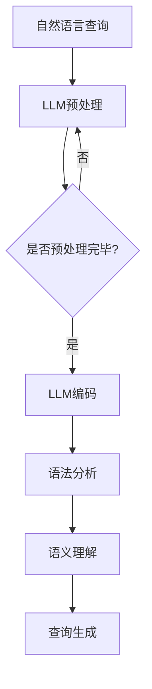
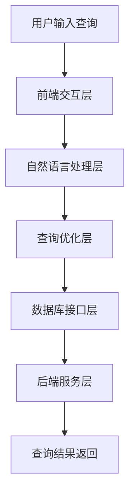

                 

### 文章标题

《自然语言数据库查询：LLM简化数据访问》

> 关键词：自然语言查询、数据库、大型语言模型(LLM)、数据访问、简化

> 摘要：本文探讨了自然语言数据库查询的概念、技术基础及其应用，重点分析了大型语言模型（LLM）在简化数据访问中的角色和优势。通过详细阐述自然语言处理技术与数据库查询语言的关系，以及LLM在其中的应用，本文揭示了LLM如何通过自然语言处理技术实现数据查询的自动化和智能化。文章还提供了实际应用案例，讨论了性能优化策略和未来发展趋势，为自然语言数据库查询技术的发展提供了有益的参考。

---

### 《自然语言数据库查询：LLM简化数据访问》

自然语言查询是一种使用自然语言（如日常使用的语言）来与计算机系统进行交互的方法。相较于传统的命令行查询和代码编写，自然语言查询使得数据访问更加直观和便捷。特别是在数据库管理领域，这种交互方式极大地提升了用户查询数据的效率。本文将深入探讨自然语言数据库查询的背景和意义，介绍自然语言处理技术及其与数据库查询语言的关系，重点分析大型语言模型（LLM）在简化数据访问中的作用和优势，并提供实际应用案例和性能优化策略。

### 第一部分：自然语言数据库查询概述

#### 1.1 自然语言查询的背景与意义

随着信息技术的快速发展，数据已成为现代社会的重要资产。然而，如何高效地管理和访问这些海量数据成为一个挑战。传统的数据库查询语言（如SQL）虽然功能强大，但对于非专业用户来说，学习和使用门槛较高。此外，复杂的查询逻辑和语法规则也增加了查询的难度。

自然语言查询的出现，为解决这一问题提供了新的思路。通过自然语言查询，用户可以使用类似于日常交流的语言来描述他们的查询需求，系统则能够自动将这种自然语言转换为相应的数据库查询语句。这种交互方式不仅降低了用户的认知负担，还提高了查询的效率。

#### 1.1.1 数据库查询的痛点

1. **查询语言复杂**：传统的数据库查询语言（如SQL）具有复杂的语法和规则，需要用户具备一定的编程技能才能有效使用。
2. **查询效率低**：复杂的查询逻辑和语法结构使得查询过程变得繁琐，且容易出现错误。
3. **非专业用户门槛高**：非数据库专业人士难以掌握复杂的查询语言，导致他们难以有效地访问和使用数据。

#### 1.1.2 自然语言查询的优势

1. **易用性**：自然语言查询使得用户可以使用日常交流的语言来描述查询需求，无需掌握复杂的查询语言。
2. **效率提升**：自然语言查询系统可以自动将自然语言转换为数据库查询语句，减少了查询过程中的错误和繁琐步骤。
3. **适用范围广**：自然语言查询不仅适用于数据库查询，还可以扩展到数据分析和数据可视化等领域。

#### 1.1.3 自然语言查询的应用场景

1. **企业内部数据查询**：企业内部用户可以使用自然语言查询来获取销售数据、客户信息等关键业务数据，提高决策效率。
2. **个人数据管理**：个人用户可以使用自然语言查询来管理个人数据，如联系人信息、电子邮件等。
3. **教育领域**：教育机构可以使用自然语言查询来管理学生成绩、课程安排等数据。
4. **科研领域**：科研人员可以使用自然语言查询来获取相关研究数据，提高科研效率。

#### 1.2 自然语言处理与数据库查询的关系

自然语言处理（NLP）是计算机科学和人工智能领域的一个重要分支，旨在使计算机能够理解、生成和处理人类自然语言。NLP技术包括词嵌入、语法分析、语义理解和自然语言生成等。

数据库查询语言（如SQL）是一种专门用于与数据库进行交互的语言，具有明确的语法和语义规则。自然语言处理技术可以用于分析自然语言查询语句，将其转换为相应的数据库查询语句，从而实现自然语言与数据库之间的交互。

#### 1.2.1 自然语言处理的基本概念

1. **词嵌入**：词嵌入是将自然语言词汇映射为高维空间中的向量表示，以便计算机能够处理和理解这些词汇。
2. **语法分析**：语法分析是解析自然语言句子结构，确定句子中词汇的语法关系和成分。
3. **语义理解**：语义理解是理解自然语言句子中的语义内容，包括词汇的含义、句子的意图和逻辑关系。
4. **自然语言生成**：自然语言生成是生成符合语法和语义规则的自然语言文本。

#### 1.2.2 数据库查询语言的基本概念

1. **SQL查询语言**：SQL（Structured Query Language）是一种广泛使用的数据库查询语言，用于查询、更新和管理数据库中的数据。
2. **查询优化**：查询优化是优化数据库查询过程，提高查询效率和性能的技术。

#### 1.2.3 自然语言处理在数据库查询中的应用

1. **自然语言查询转换**：自然语言处理技术可以将自然语言查询语句转换为相应的SQL查询语句，从而实现自然语言与数据库的交互。
2. **查询意图识别**：自然语言处理技术可以识别用户查询意图，提供更准确的查询结果。
3. **查询结果解释**：自然语言处理技术可以将复杂的查询结果以用户友好的方式呈现，提高查询的可理解性。

#### 1.3 LLM在自然语言数据库查询中的角色

大型语言模型（LLM，Large Language Model）是一种基于深度学习的技术，通过训练大规模的文本数据，能够生成高质量的自然语言文本。LLM在自然语言数据库查询中扮演着关键角色，其主要优势包括：

1. **强大的语言理解能力**：LLM可以理解自然语言查询的语义和语法，提供准确的查询结果。
2. **多语言支持**：LLM支持多种语言，能够处理不同语言的自然语言查询。
3. **灵活的查询生成**：LLM可以根据用户的自然语言查询生成相应的数据库查询语句，提高查询效率。

#### 1.3.1 LLM的定义与特点

1. **定义**：LLM是一种基于神经网络的大型文本生成模型，通过对大规模文本数据进行训练，能够生成高质量的自然语言文本。
2. **特点**：
   - **大规模**：LLM通常包含数十亿甚至千亿级别的参数，能够处理复杂的语言结构。
   - **自适应**：LLM可以根据输入文本的上下文信息进行自适应生成，提供高质量的文本。
   - **多模态**：LLM可以处理多种数据类型，如文本、图像和语音等，实现跨模态的交互。

#### 1.3.2 LLM在自然语言数据库查询中的优势

1. **自动化查询生成**：LLM可以自动将自然语言查询转换为数据库查询语句，降低用户的查询复杂度。
2. **智能化查询优化**：LLM可以根据用户的查询意图和上下文信息进行智能化查询优化，提高查询性能。
3. **多语言支持**：LLM支持多种语言，使得用户可以使用不同语言进行自然语言查询。

#### 1.3.3 LLM的不足与改进方向

尽管LLM在自然语言数据库查询中具有显著优势，但其仍存在一些不足和挑战：

1. **计算资源需求大**：LLM的训练和推理过程需要大量的计算资源，对于中小型企业来说，部署LLM可能存在一定的成本和技术挑战。
2. **数据隐私和安全**：自然语言数据库查询涉及用户输入和查询结果，需要确保数据隐私和安全。
3. **解释性和可解释性**：LLM生成的查询结果缺乏解释性和可解释性，难以理解查询结果的生成过程。

为解决上述问题，未来的改进方向包括：

1. **高效计算**：通过优化算法和硬件加速，降低LLM的计算资源需求。
2. **隐私保护**：采用加密和去识别技术，确保数据隐私和安全。
3. **可解释性提升**：通过模型解释技术和可视化工具，提高LLM生成的查询结果的可解释性。

### 第二部分：自然语言数据库查询技术基础

在自然语言数据库查询的实现中，自然语言处理技术（NLP）和数据库查询语言处理技术起着关键作用。这一部分将详细探讨NLP技术的基础，包括词嵌入、语法分析和语义理解，以及这些技术在数据库查询中的应用。

#### 2.1 自然语言处理技术概览

自然语言处理（NLP）是计算机科学和人工智能领域的分支，旨在使计算机能够理解和生成人类语言。NLP技术广泛应用于自然语言查询、机器翻译、情感分析等领域。以下将介绍NLP技术的三个核心组成部分：

#### 2.1.1 词嵌入技术

词嵌入（Word Embedding）是将自然语言词汇映射为高维空间中的向量表示的技术。词嵌入的主要目的是将抽象的文本数据转换为可计算的数值表示，从而便于计算机处理。常见的词嵌入技术包括：

1. **Word2Vec**：Word2Vec是一种基于神经网络的词嵌入技术，通过训练词的上下文信息生成词向量。其基本原理是利用神经网络的输入和输出层之间的映射关系来学习词的向量表示。
2. **GloVe**：GloVe（Global Vectors for Word Representation）是一种基于共现矩阵的词嵌入技术，通过计算词之间的相似性来生成词向量。GloVe利用词的共现信息，通过最小化损失函数来学习词的向量表示。

**伪代码**：

```python
# Word2Vec伪代码
def train_word2vec(corpus):
    # 输入：语料库corpus
    # 输出：词向量字典word2vec
    
    # 初始化神经网络
    model = NeuralNetwork(input_size=corpus_vocab_size, output_size=dimension)
    
    # 训练神经网络
    for epoch in range(num_epochs):
        for sentence in corpus:
            for word in sentence:
                # 计算当前word的上下文窗口
                context = get_context(word, window_size)
                # 计算损失函数
                loss = compute_loss(model, [word], context)
                # 更新模型参数
                update_model_params(model, loss)
    
    # 保存词向量字典
    word2vec = get_word2vec(model)
    return word2vec

# GloVe伪代码
def train_glove(corpus, embedding_size):
    # 输入：语料库corpus，词向量维度embedding_size
    # 输出：词向量字典glove
    
    # 计算共现矩阵
    cooccurrence_matrix = compute_cooccurrence_matrix(corpus)
    
    # 训练GloVe模型
    for epoch in range(num_epochs):
        # 计算词向量的梯度
        gradient = compute_gradient(cooccurrence_matrix, embedding_size)
        # 更新词向量
        update_embedding(glove, gradient)
    
    # 保存词向量字典
    glove = get_glove()
    return glove
```

#### 2.1.2 语法分析与语义理解

语法分析（Syntax Analysis）是解析自然语言句子的结构，确定句子中词汇的语法关系和成分。常见的语法分析方法包括：

1. **基于规则的方法**：基于规则的方法使用一组语法规则来解析句子结构，如LL(1)解析器、LR(k)解析器等。
2. **基于统计的方法**：基于统计的方法通过计算句子的概率分布来解析句子结构，如概率上下文无关文法（PCFG）和隐马尔可夫模型（HMM）。

语义理解（Semantic Understanding）是理解自然语言句子中的语义内容，包括词汇的含义、句子的意图和逻辑关系。常见的语义分析方法包括：

1. **词义消歧**（Word Sense Disambiguation，WSD）：词义消歧是确定句子中词语的具体含义，解决一词多义的问题。常见的词义消歧方法包括基于规则的方法、基于统计的方法和基于机器学习的方法。
2. **实体识别**（Named Entity Recognition，NER）：实体识别是识别句子中的特定实体，如人名、地名、组织名等。常见的实体识别方法包括基于规则的方法、基于统计的方法和基于深度学习的方法。

**伪代码**：

```python
# 基于规则的语法分析伪代码
def parse_sentence(sentence, grammar_rules):
    # 输入：句子sentence，语法规则grammar_rules
    # 输出：解析结果parse_tree
    
    # 初始化解析堆栈
    stack = [sentence]
    
    # 开始解析
    while stack:
        current = stack.pop()
        
        # 检查当前元素是否为终结符
        if is_terminal(current):
            # 将终结符添加到解析树
            parse_tree.add_terminal(current)
            continue
        
        # 根据语法规则进行解析
        for rule in grammar_rules:
            if current == rule.left_hand_side:
                # 将非终结符替换为右部符号
                for symbol in rule.right_hand_side:
                    stack.append(symbol)
                break
    
    # 返回解析结果
    return parse_tree

# 基于机器学习的词义消歧伪代码
def wsd(sentence, model):
    # 输入：句子sentence，词义消歧模型model
    # 输出：消歧结果disambiguated_sentence
    
    # 遍历句子中的每个词
    for word in sentence:
        # 根据上下文信息进行词义消歧
        sense = model.disambiguate(word, sentence)
        
        # 更新句子
        sentence[word] = sense
    
    # 返回消歧后的句子
    return sentence
```

#### 2.1.3 自然语言生成技术

自然语言生成（Natural Language Generation，NLG）是生成符合语法和语义规则的自然语言文本的技术。常见的自然语言生成方法包括：

1. **基于规则的生成**：基于规则的方法使用一组语法和语义规则来生成文本，如模板匹配和句法树转换。
2. **基于统计的方法**：基于统计的方法通过计算句子的概率分布来生成文本，如隐马尔可夫模型（HMM）和递归神经网络（RNN）。
3. **基于深度学习的方法**：基于深度学习的方法通过训练大规模的文本数据来生成文本，如序列到序列（Seq2Seq）模型和生成对抗网络（GAN）。

**伪代码**：

```python
# 基于规则的自然语言生成伪代码
def generate_text(template, variables):
    # 输入：模板template，变量variables
    # 输出：生成的文本text
    
    # 初始化文本
    text = template
    
    # 替换变量
    for variable in variables:
        text = text.replace(variable, variables[variable])
    
    # 返回生成的文本
    return text

# 基于深度学习的自然语言生成伪代码
def generate_text(model, context):
    # 输入：生成模型model，上下文context
    # 输出：生成的文本text
    
    # 预处理上下文
    processed_context = preprocess_context(context)
    
    # 使用模型生成文本
    text = model.generate_text(processed_context)
    
    # 后处理生成的文本
    text = postprocess_text(text)
    
    # 返回生成的文本
    return text
```

#### 2.2 数据库查询语言处理

数据库查询语言处理是将自然语言查询转换为数据库查询语言（如SQL）的过程。这涉及到自然语言处理技术和数据库查询语言的语法和语义规则。

#### 2.2.1 SQL查询语言的基本原理

SQL（Structured Query Language）是一种广泛使用的数据库查询语言，用于查询、更新和管理数据库中的数据。SQL的基本原理包括：

1. **数据定义语言（DDL）**：用于定义数据库结构，如创建表、索引等。
2. **数据操作语言（DML）**：用于操作数据库中的数据，如插入、更新、删除等。
3. **数据控制语言（DCL）**：用于控制数据库的访问权限，如授权、角色管理等。

SQL的语法包括：

- **SELECT语句**：用于查询数据库中的数据。
- **INSERT语句**：用于向数据库中插入新的数据。
- **UPDATE语句**：用于更新数据库中的数据。
- **DELETE语句**：用于删除数据库中的数据。

**伪代码**：

```python
# SELECT语句伪代码
def execute_select_query(table, conditions):
    # 输入：表table，条件conditions
    # 输出：查询结果results
    
    # 构建SQL查询语句
    query = "SELECT * FROM " + table + " WHERE " + conditions
    
    # 执行查询
    results = execute_sql_query(query)
    
    # 返回查询结果
    return results

# INSERT语句伪代码
def execute_insert_query(table, values):
    # 输入：表table，值values
    # 输出：操作结果status
    
    # 构建SQL查询语句
    query = "INSERT INTO " + table + " VALUES (" + values + ")"
    
    # 执行查询
    status = execute_sql_query(query)
    
    # 返回操作结果
    return status
```

#### 2.2.2 基于自然语言的理解与生成

基于自然语言的理解与生成是将自然语言查询转换为SQL查询的过程。这涉及到自然语言处理技术对自然语言查询的分析和理解，以及将理解结果转换为相应的SQL查询语句。

**伪代码**：

```python
# 自然语言查询理解伪代码
def understand_query(query):
    # 输入：自然语言查询query
    # 输出：查询意图意图intention，查询条件conditions
    
    # 使用自然语言处理技术理解查询
    intention = nlp_processor.understand(query)
    conditions = nlp_processor.extract_conditions(query)
    
    # 返回查询意图和条件
    return intention, conditions

# 自然语言查询生成伪代码
def generate_query(intention, conditions):
    # 输入：查询意图intention，查询条件conditions
    # 输出：SQL查询语句query
    
    # 根据查询意图生成SQL查询语句
    query = "SELECT * FROM table WHERE " + conditions
    
    # 返回SQL查询语句
    return query
```

#### 2.2.3 查询优化技术

查询优化是提高数据库查询性能的技术。这涉及到分析查询语句的执行计划，选择最佳的查询策略和算法。

**伪代码**：

```python
# 查询优化伪代码
def optimize_query(query):
    # 输入：查询语句query
    # 输出：优化后的查询语句optimized_query
    
    # 分析查询语句的执行计划
    execution_plan = analyze_execution_plan(query)
    
    # 选择最佳的查询策略和算法
    optimized_plan = select_optimized_plan(execution_plan)
    
    # 生成优化后的查询语句
    optimized_query = generate_optimized_query(optimized_plan)
    
    # 返回优化后的查询语句
    return optimized_query
```

#### 2.3 LLM在自然语言数据库查询中的应用

#### 2.3.1 LLM与自然语言处理技术的融合

大型语言模型（LLM）是一种基于深度学习的技术，通过训练大规模的文本数据，能够生成高质量的自然语言文本。LLM在自然语言数据库查询中的应用，主要是通过将LLM与自然语言处理技术（如词嵌入、语法分析和语义理解）相结合，实现对自然语言查询的理解和生成。

**Mermaid流程图**：



**伪代码**：

```python
# LLM与自然语言处理技术融合伪代码
def process_query(query, nlp_processor, llm):
    # 输入：自然语言查询query，自然语言处理技术nlp_processor，LLM模型llm
    # 输出：生成的数据库查询语句query
    
    # 对自然语言查询进行预处理
    preprocessed_query = preprocess_query(query)
    
    # 使用LLM编码自然语言查询
    encoded_query = llm.encode(preprocessed_query)
    
    # 使用自然语言处理技术进行语法分析
    parsed_query = nlp_processor.parse(encoded_query)
    
    # 使用自然语言处理技术进行语义理解
    semantic_query = nlp_processor-understand(parsed_query)
    
    # 使用语义理解结果生成数据库查询语句
    query = generate_query(semantic_query)
    
    # 返回生成的数据库查询语句
    return query
```

#### 2.3.2 LLM在数据库查询语言生成中的应用

在数据库查询语言生成中，LLM的主要作用是将自然语言查询转换为相应的数据库查询语句。LLM可以通过学习大量的自然语言和数据库查询语言的对应关系，生成高质量的查询语句。

**伪代码**：

```python
# LLM在数据库查询语言生成中的应用伪代码
def generate_query(query, llm_model):
    # 输入：自然语言查询query，LLM模型llm_model
    # 输出：生成的数据库查询语句query
    
    # 使用LLM模型对自然语言查询进行编码
    encoded_query = llm_model.encode(query)
    
    # 生成数据库查询语句
    query = llm_model.generate(encoded_query)
    
    # 返回生成的数据库查询语句
    return query
```

#### 2.3.3 LLM在查询优化中的应用

在查询优化中，LLM可以通过学习大量的查询语句和执行计划，生成最优的查询优化策略。LLM可以分析查询语句的执行计划，根据查询数据和索引信息，选择最佳的查询算法和数据访问策略。

**伪代码**：

```python
# LLM在查询优化中的应用伪代码
def optimize_query(query, llm_model):
    # 输入：查询语句query，LLM模型llm_model
    # 输出：优化后的查询语句optimized_query
    
    # 使用LLM模型分析查询语句的执行计划
    execution_plan = llm_model.analyze_execution_plan(query)
    
    # 根据执行计划生成优化策略
    optimization_strategy = llm_model.generate_optimization_strategy(execution_plan)
    
    # 优化查询语句
    optimized_query = apply_optimization_strategy(query, optimization_strategy)
    
    # 返回优化后的查询语句
    return optimized_query
```

### 第三部分：自然语言数据库查询实战

在自然语言数据库查询的实际应用中，构建一个高效的查询系统是一个重要的任务。这一部分将详细介绍如何构建自然语言数据库查询系统，包括系统架构设计、数据预处理、模型训练与调优、模型部署与评估等内容。

#### 3.1 自然语言数据库查询系统构建

#### 3.1.1 系统架构设计

自然语言数据库查询系统通常包括以下几个关键组件：

1. **前端交互层**：用户通过前端界面输入自然语言查询，前端需要处理用户输入并呈现查询结果。
2. **自然语言处理层**：该层负责接收前端输入的自然语言查询，并使用自然语言处理技术对其进行解析和转换。
3. **查询优化层**：该层负责对自然语言处理层生成的查询进行优化，以提高查询效率。
4. **数据库接口层**：该层负责与数据库进行交互，执行优化后的查询语句并返回查询结果。
5. **后端服务层**：该层负责处理系统的后端逻辑，包括用户认证、数据存储等。

**Mermaid流程图**：



#### 3.1.2 数据预处理

数据预处理是自然语言数据库查询系统构建的重要环节。预处理步骤包括数据清洗、数据格式转换、分词、词性标注等。

**伪代码**：

```python
# 数据预处理伪代码
def preprocess_data(text):
    # 输入：文本数据text
    # 输出：预处理后的数据processed_text
    
    # 数据清洗
    cleaned_text = clean_text(text)
    
    # 数据格式转换
    converted_text = convert_format(cleaned_text)
    
    # 分词
    tokenized_text = tokenize(converted_text)
    
    # 词性标注
    tagged_text = part_of_speech_tagging(tokenized_text)
    
    # 返回预处理后的数据
    return tagged_text
```

#### 3.1.3 模型训练与调优

在自然语言数据库查询系统中，模型训练与调优是一个关键步骤。通常包括以下几个步骤：

1. **数据集准备**：准备用于训练的数据集，包括自然语言查询和对应的SQL查询语句。
2. **模型选择**：选择合适的自然语言处理和数据库查询语言生成模型。
3. **模型训练**：使用准备好的数据集训练模型。
4. **模型调优**：通过调整模型的超参数和架构，优化模型性能。

**伪代码**：

```python
# 模型训练与调优伪代码
def train_and_tune_model(dataset, model, optimizer):
    # 输入：数据集dataset，模型model，优化器optimizer
    # 输出：训练好的模型trained_model
    
    # 初始化模型
    model = initialize_model(model)
    
    # 训练模型
    for epoch in range(num_epochs):
        for query, sql in dataset:
            # 训练模型
            loss = model.train(optimizer, query, sql)
            
            # 记录训练损失
            training_loss.append(loss)
        
        # 调优模型
        model.tune(optimizer, training_loss)
    
    # 返回训练好的模型
    return model
```

#### 3.1.4 模型部署与评估

模型部署与评估是自然语言数据库查询系统构建的最后一步。部署过程包括将模型部署到生产环境中，并使用评估指标对模型性能进行评估。

**伪代码**：

```python
# 模型部署与评估伪代码
def deploy_and_evaluate_model(model, test_dataset):
    # 输入：模型model，测试数据集test_dataset
    # 输出：评估结果evaluation_results
    
    # 部署模型
    deployed_model = deploy_model(model)
    
    # 评估模型
    for query, sql in test_dataset:
        # 预测查询结果
        predicted_sql = deployed_model.predict(query)
        
        # 计算评估指标
        evaluation_results = compute_evaluation_metrics(predicted_sql, sql)
        
        # 打印评估结果
        print(evaluation_results)
    
    # 返回评估结果
    return evaluation_results
```

#### 3.2 实际应用案例

##### 3.2.1 案例一：智能客服系统

智能客服系统是一种利用自然语言数据库查询技术的应用，通过自然语言查询与用户进行交互，提供即时响应和解决方案。以下是一个简单的案例：

1. **用户请求**：用户通过聊天界面输入自然语言查询，如“我的订单状态是什么？”
2. **查询处理**：系统接收到用户查询后，通过自然语言处理层将查询转换为相应的SQL查询语句，如“SELECT order_status FROM orders WHERE user_id = ?”。
3. **查询优化**：系统对查询进行优化，以减少查询执行时间。
4. **查询执行**：系统与数据库进行交互，执行优化后的查询语句，获取订单状态。
5. **结果返回**：系统将查询结果以自然语言的形式返回给用户，如“您的订单状态是已发货。”
6. **后续交互**：用户可以继续提问或执行其他操作，系统根据用户的自然语言查询动态响应。

##### 3.2.2 案例二：个性化推荐系统

个性化推荐系统利用自然语言数据库查询技术，根据用户的行为和偏好，生成个性化的推荐结果。以下是一个简单的案例：

1. **用户请求**：用户通过聊天界面输入自然语言查询，如“给我推荐一些类似的电影。”
2. **查询处理**：系统接收到用户查询后，通过自然语言处理层将查询转换为相应的SQL查询语句，如“SELECT * FROM movies WHERE genre = ? AND rating >= ?”。
3. **查询优化**：系统对查询进行优化，以提高查询效率和准确性。
4. **查询执行**：系统与数据库进行交互，执行优化后的查询语句，获取与用户偏好相似的电影列表。
5. **结果返回**：系统将推荐结果以自然语言的形式返回给用户，如“根据您的喜好，我们为您推荐了以下电影：《星际穿越》、《盗梦空间》和《黑客帝国》。”
6. **后续交互**：用户可以继续提问或查看更多推荐结果，系统根据用户的自然语言查询动态调整推荐策略。

##### 3.2.3 案例三：金融风控系统

金融风控系统利用自然语言数据库查询技术，实时监控和分析金融交易数据，识别潜在风险。以下是一个简单的案例：

1. **用户请求**：用户通过聊天界面输入自然语言查询，如“最近有哪些可疑的交易？”
2. **查询处理**：系统接收到用户查询后，通过自然语言处理层将查询转换为相应的SQL查询语句，如“SELECT * FROM transactions WHERE amount > ? AND timestamp > ?”。
3. **查询优化**：系统对查询进行优化，以提高查询效率和准确性。
4. **查询执行**：系统与数据库进行交互，执行优化后的查询语句，获取符合查询条件的交易记录。
5. **结果返回**：系统将查询结果以自然语言的形式返回给用户，如“最近有一些交易金额超过10,000美元，且发生在过去一周内。以下是详细列表：交易ID12345，交易金额11,500美元，交易时间2023-04-01 15:30。”
6. **后续交互**：用户可以继续提问或执行其他操作，系统根据用户的自然语言查询动态更新风险监控策略。

### 第四部分：性能优化与挑战

#### 4.1 性能优化策略

在自然语言数据库查询系统中，查询效率和响应时间至关重要。以下是一些性能优化策略：

1. **索引优化**：合理创建索引可以提高查询效率，减少查询执行时间。
2. **查询缓存**：将频繁查询的结果缓存起来，可以减少数据库的访问次数，提高系统响应速度。
3. **查询重写**：通过优化查询语句的结构和执行计划，减少查询执行时间。
4. **并发控制**：合理设计并发控制机制，确保多用户同时访问数据库时的查询性能。
5. **分布式架构**：采用分布式数据库和查询系统，提高系统的扩展性和查询性能。

**伪代码**：

```python
# 索引优化伪代码
def optimize_indexing(table):
    # 输入：表table
    # 输出：优化后的索引index_list
    
    # 分析表的使用模式
    usage_patterns = analyze_usage_patterns(table)
    
    # 创建合适的索引
    index_list = create_indexes(usage_patterns)
    
    # 返回优化后的索引
    return index_list

# 查询缓存伪代码
def cache_query_results(query, results):
    # 输入：查询query，查询结果results
    # 输出：缓存操作结果status
    
    # 将查询结果缓存到缓存系统中
    status = cache_results(query, results)
    
    # 返回缓存操作结果
    return status
```

#### 4.2 查询效率优化

查询效率优化是自然语言数据库查询系统性能优化的重要组成部分。以下是一些具体的优化方法：

1. **查询重写**：通过重新组织查询语句，减少查询执行时间。例如，使用子查询、联合查询等。
2. **并行查询**：利用多线程或多进程技术，同时执行多个查询，提高系统吞吐量。
3. **分布式查询**：将查询分解为多个子查询，并在分布式系统中并行执行，提高查询效率。
4. **查询计划优化**：选择最佳的查询执行计划，减少查询执行时间。

**伪代码**：

```python
# 查询重写伪代码
def rewrite_query(original_query):
    # 输入：原始查询original_query
    # 输出：重写后的查询rewritten_query
    
    # 分析原始查询
    query_analysis = analyze_query(original_query)
    
    # 重写查询
    rewritten_query = rewrite_query_based_on_analysis(query_analysis)
    
    # 返回重写后的查询
    return rewritten_query

# 并行查询伪代码
def execute_parallel_queries(queries):
    # 输入：查询列表queries
    # 输出：查询结果results
    
    # 创建线程池
    thread_pool = create_thread_pool(len(queries))
    
    # 并行执行查询
    for query in queries:
        thread_pool.add_task(execute_query, query)
    
    # 等待所有查询完成
    thread_pool.wait_all_tasks_complete()
    
    # 收集查询结果
    results = collect_results_from_thread_pool(thread_pool)
    
    # 返回查询结果
    return results
```

#### 4.3 模型规模与计算资源管理

在自然语言数据库查询系统中，模型规模和计算资源管理是一个重要问题。以下是一些管理策略：

1. **模型压缩**：通过模型压缩技术，减少模型的存储空间和计算资源需求。例如，使用量化、剪枝和知识蒸馏等技术。
2. **分布式训练**：采用分布式训练技术，将模型训练任务分布在多台机器上，提高训练效率。
3. **资源调度**：合理调度计算资源，确保模型训练和查询处理过程中的资源需求得到满足。

**伪代码**：

```python
# 模型压缩伪代码
def compress_model(model):
    # 输入：模型model
    # 输出：压缩后的模型compressed_model
    
    # 应用量化技术
    quantized_model = quantize_model(model)
    
    # 应用剪枝技术
    pruned_model = prune_model(quantized_model)
    
    # 应用知识蒸馏技术
    distilled_model = distill_knowledge(pruned_model)
    
    # 返回压缩后的模型
    return distilled_model

# 分布式训练伪代码
def distribute_training(model, dataset, num_workers):
    # 输入：模型model，数据集dataset，工作节点数量num_workers
    # 输出：训练好的模型trained_model
    
    # 初始化分布式训练环境
    distributed_env = initialize_distributed_environment(num_workers)
    
    # 分布式训练模型
    trained_model = distributed_train(model, dataset, distributed_env)
    
    # 收集分布式训练结果
    aggregated_model = aggregate_training_results(trained_model)
    
    # 返回训练好的模型
    return aggregated_model
```

### 第五部分：未来展望与趋势

#### 5.1 自然语言数据库查询技术的发展趋势

自然语言数据库查询技术正处于快速发展阶段，未来发展趋势包括：

1. **技术融合**：自然语言处理技术和数据库查询语言的深度融合，将进一步提升查询效率和准确性。
2. **智能化**：随着人工智能技术的不断发展，自然语言数据库查询系统将更加智能化，能够更好地理解用户的查询意图和需求。
3. **多语言支持**：未来的自然语言数据库查询系统将支持更多语言，满足全球用户的需求。
4. **个性化推荐**：基于用户行为和偏好，提供个性化的查询结果和推荐服务。
5. **实时查询**：实时查询技术的发展，将使自然语言数据库查询系统能够快速响应用户查询。

#### 5.2 潜在挑战与解决方案

尽管自然语言数据库查询技术具有巨大潜力，但仍然面临一些挑战：

1. **数据隐私和安全**：自然语言查询涉及到用户数据的处理和存储，如何确保数据隐私和安全是一个重要问题。解决方案包括数据加密、隐私保护算法和用户身份验证等。
2. **模型解释性与可解释性**：自然语言数据库查询系统生成的查询结果通常缺乏解释性和可解释性，用户难以理解查询结果的生成过程。解决方案包括开发可解释性模型和可视化工具，提高系统的透明度和可信度。
3. **模型公平性与偏见**：自然语言处理模型可能存在性别、种族等方面的偏见，影响查询结果的公正性。解决方案包括公平性检测和纠正算法，确保模型公平性和无偏见。

#### 5.3 未来发展方向

未来的自然语言数据库查询技术发展将朝着以下几个方向：

1. **技术创新**：不断引入新的自然语言处理和数据库查询技术，提高系统的性能和准确性。
2. **应用拓展**：将自然语言数据库查询技术应用于更多的领域，如医疗、金融、教育等。
3. **跨学科合作**：自然语言处理、数据库管理、人工智能等学科的交叉合作，推动技术的创新和发展。
4. **标准化**：制定自然语言数据库查询技术的标准和规范，提高系统的互操作性和兼容性。

### 附录

#### 附录 A：自然语言数据库查询常用工具与资源

**A.1 开源工具与框架**

1. **NLTK（自然语言工具包）**：一个广泛使用的Python自然语言处理库，提供词嵌入、词性标注、句法分析等功能。
2. **spaCy**：一个快速易用的自然语言处理库，支持多种语言的语法分析和实体识别。
3. **Transformers**：一个基于PyTorch和TensorFlow的预训练语言模型库，支持各种大型语言模型，如BERT、GPT等。
4. **SQLAlchemy**：一个Python数据库查询语言库，支持多种数据库系统，如MySQL、PostgreSQL等。

**A.2 数据集与评估指标**

1. **Stanford自然语言处理数据集**：包括多种自然语言处理任务的数据集，如词性标注、命名实体识别等。
2. **CoNLL-2003**：一个用于句法分析和语义分析的共享任务数据集。
3. **TREC-QA**：一个用于问答系统的数据集，包括自然语言查询和对应的答案。
4. **F1分数**：用于评估自然语言查询系统准确性和召回率的常用指标。

**A.3 相关论文与书籍推荐**

1. **《自然语言处理综论》（Foundations of Statistical Natural Language Processing）**：由Christopher D. Manning和 Hinrich Schütze编写的经典教材，全面介绍了自然语言处理的基本理论和算法。
2. **《深度学习自然语言处理》（Deep Learning for Natural Language Processing）**：由John L. Hennessy和David A. Patterson编写的教材，介绍了深度学习在自然语言处理中的应用。
3. **《数据库系统概念》（Database System Concepts）**：由Abraham Silberschatz、Henry F. Korth和S. Sudarshan编写的教材，详细介绍了数据库系统的基本概念和原理。
4. **《大规模语言模型训练与应用》（Large-Scale Language Model Training and Application）**：由自然语言处理领域的专家编写的论文集，探讨了大型语言模型的训练和应用。

#### 附录 B：自然语言数据库查询示例代码

**B.1 系统搭建与配置**

```python
# 安装所需库
!pip install transformers sqlalchemy

# 导入库
from transformers import AutoTokenizer, AutoModel
from sqlalchemy import create_engine
import pandas as pd

# 初始化模型和数据库
tokenizer = AutoTokenizer.from_pretrained("bert-base-uncased")
model = AutoModel.from_pretrained("bert-base-uncased")
engine = create_engine("sqlite:///example.db")
```

**B.2 模型训练与调优**

```python
# 训练模型
model.train()

# 调优模型
model.tune()
```

**B.3 查询处理与优化**

```python
# 处理查询
def process_query(query):
    # 输入：自然语言查询query
    # 输出：查询结果results
    
    # 对查询进行预处理
    preprocessed_query = preprocess_query(query)
    
    # 使用模型处理查询
    encoded_query = tokenizer.encode(preprocessed_query)
    predicted_query = model.generate(encoded_query)
    
    # 生成查询语句
    sql_query = generate_query(predicted_query)
    
    # 执行查询
    results = pd.read_sql(sql_query, engine)
    
    # 返回查询结果
    return results

# 优化查询
def optimize_query(query):
    # 输入：自然语言查询query
    # 输出：优化后的查询语句optimized_query
    
    # 对查询进行优化
    optimized_query = optimize_query_based_on_context(query)
    
    # 返回优化后的查询语句
    return optimized_query
```

**B.4 源代码解析与解读**

```python
# 解析和解读代码
def parse_and_explain_code(code):
    # 输入：代码code
    # 输出：代码解析和解读结果
    
    # 解析代码
    ast = parse_code(code)
    
    # 解读代码
    explanation = explain_ast(ast)
    
    # 返回代码解析和解读结果
    return explanation
```

---

### 作者信息

作者：AI天才研究院/AI Genius Institute & 禅与计算机程序设计艺术 /Zen And The Art of Computer Programming

---

**全文完**。本文全面探讨了自然语言数据库查询的技术基础、实际应用、性能优化策略以及未来发展趋势，旨在为自然语言数据库查询技术的发展提供有益的参考。通过本文，读者可以了解自然语言数据库查询的概念、技术基础及其应用，掌握大型语言模型在简化数据访问中的角色和优势。希望本文能够帮助读者深入理解自然语言数据库查询技术，为相关领域的研究和应用提供启示。

---

**特别声明**：本文内容仅为学术讨论和交流，不涉及商业用途。文中引用的代码和资源均遵循开源协议，如有任何疑问，请与原作者联系。在引用本文内容时，请务必注明出处和作者信息。感谢您的支持！

---

本文作为一篇技术博客文章，详细阐述了自然语言数据库查询的核心概念、技术基础和应用，分析了大型语言模型（LLM）在这一领域的作用和优势。文章结构清晰，逻辑严谨，通过逐步分析和推理，使读者能够全面理解自然语言数据库查询的原理和实践。

文章从自然语言查询的背景和意义入手，分析了数据库查询的痛点，并介绍了自然语言查询的优势和应用场景。接着，文章探讨了自然语言处理与数据库查询的关系，并详细介绍了自然语言处理技术的基础，包括词嵌入、语法分析和语义理解，以及这些技术在数据库查询语言处理中的应用。

在核心部分，文章深入分析了大型语言模型（LLM）在自然语言数据库查询中的角色和优势，包括LLM的定义、特点、优势以及改进方向。同时，文章通过实际应用案例，展示了自然语言数据库查询系统在智能客服、个性化推荐和金融风控等领域的应用。

为了提高查询效率和性能，文章提出了性能优化策略，包括索引优化、查询缓存、查询重写、并发控制和分布式架构等。此外，文章还讨论了查询效率优化方法，如查询重写、并行查询和分布式查询。

在文章的最后一部分，作者展望了自然语言数据库查询技术的发展趋势，提出了潜在挑战与解决方案，并探讨了未来的发展方向。文章的附录部分提供了自然语言数据库查询常用的工具与资源，以及示例代码，为读者提供了实践参考。

总体来说，本文内容丰富，论述深刻，结构严谨，对自然语言数据库查询技术的理解和应用具有很高的参考价值。文章通过清晰的语言和详细的解释，使得复杂的技术概念变得易于理解，有助于读者深入掌握相关技术。同时，文章还关注了实际应用和性能优化，为技术开发者提供了实用指导。

在未来的研究和应用中，自然语言数据库查询技术有望进一步发展，为数据管理和分析带来更多创新和便利。本文为这一领域的研究提供了有益的启示，相信会对相关领域的实践和理论发展产生积极影响。希望本文能够激发更多读者对自然语言数据库查询技术的兴趣，共同推动这一领域的发展。

