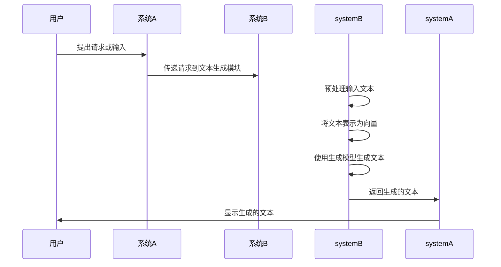

                 

# 文章标题：自然语言生成（NLG）：AI写作与内容创作

> 关键词：自然语言生成，AI写作，内容创作，深度学习，生成对抗网络，文本生成模型，跨语言生成，多模态生成

> 摘要：
本文旨在深入探讨自然语言生成（NLG）技术在AI写作和内容创作中的应用。通过系统性地阐述NLG的基础概念、核心算法、技术挑战及其在现实场景中的实现，本文为读者提供了一个全面而深入的视角。文章分为两个主要部分：第一部分介绍NLG的基本知识和相关技术，第二部分通过具体案例展示NLG的实际应用，并展望其未来发展。

----------------------------------------------------------------

### 第一部分：自然语言生成概述

#### 第1章：自然语言生成基础

**1.1 自然语言生成的基本概念**

自然语言生成（Natural Language Generation，NLG）是人工智能（Artificial Intelligence，AI）的一个重要分支，它旨在利用计算机程序自动生成自然语言文本。NLG技术可以被分为几类：

1. **基于规则的生成**：这种方法使用明确的语法和语义规则来生成文本。它的优点是生成文本的语义和语法比较可靠，但缺点是规则的制定和维护较为复杂，且难以适应大规模的应用场景。

2. **基于模板的生成**：这种方法通过预定义的模板和变量来生成文本。模板可以灵活地适应不同的输入数据，但生成的文本缺乏灵活性，容易出现重复或僵硬的表述。

3. **基于统计的生成**：这种方法使用大量的文本数据进行训练，从中提取统计规律来生成文本。统计NLG在处理大规模文本数据时表现较好，但生成的文本质量受到训练数据的限制。

4. **基于深度学习的生成**：这种方法利用深度学习模型，尤其是生成对抗网络（GAN）和变分自编码器（VAE）等模型，来生成高质量的自然语言文本。深度学习NLG在生成文本的多样性和连贯性方面有显著优势。

**1.2 自然语言处理（NLP）的基础知识**

自然语言处理（NLP）是NLG的技术基础。NLP的主要任务包括：

- **文本预处理**：包括分词、词性标注、句法解析等，目的是将原始文本转化为计算机可以处理的结构化数据。

- **语义理解**：通过对文本的深入分析，理解其含义和语境。语义理解是NLG的核心，决定了生成文本的准确性和连贯性。

- **语言模型**：用于预测下一个词语或句子，是生成文本的基础。语言模型可以分为统计模型和神经网络模型。

**1.3 NLG的发展历程**

NLG技术的发展经历了几个阶段：

- **古典NLG**：早期的NLG主要基于规则和模板，生成文本的灵活性和质量有限。

- **统计NLG**：随着语料库和机器学习技术的发展，统计NLG开始流行，通过大量训练数据生成文本，提高了文本的多样性和准确性。

- **现代NLG**：深度学习的兴起带来了NLG的革新。基于深度学习的生成模型，如GAN和VAE，能够生成更加自然和高质量的文本。

**1.4 NLG的关键技术与挑战**

NLG的关键技术包括：

- **语言模型**：如n-gram模型和神经网络概率语言模型，用于预测文本的下一个词语。

- **生成模型**：如GAN和VAE，用于生成高质量的自然语言文本。

- **语义理解与文本生成**：通过理解文本的语义，生成符合逻辑和语境的文本。

NLG面临的挑战包括：

- **数据质量和数量**：NLG需要大量高质量的训练数据，且数据的获取和预处理是一个复杂的过程。

- **文本生成质量**：生成文本的质量取决于模型的训练和设计，如何提高生成文本的自然性和准确性是一个重要问题。

- **跨语言与多模态生成**：如何实现不同语言和不同模态之间的文本生成是一个挑战。

#### 第2章：自然语言处理技术基础

**2.1 语言模型**

语言模型（Language Model，LM）是NLP的核心技术之一，它用于预测文本的下一个词语。以下是一些常用的语言模型：

- **n-gram模型**：基于局部语法规则，预测下一个词语基于前n个词语。

- **神经网络概率语言模型**：使用神经网络来建模词语之间的关系，通常采用递归神经网络（RNN）或卷积神经网络（CNN）。

**2.2 文本表示与编码**

文本表示与编码是将原始文本转换为计算机可以处理的结构化数据的过程。以下是一些常用的文本表示与编码技术：

- **词嵌入（Word Embedding）**：将词语映射到高维空间，使得语义相近的词语在空间中靠近。

- **句子表示与序列模型**：将整个句子映射为一个固定大小的向量表示，常用的序列模型包括RNN和Transformer。

**2.3 语义理解与文本生成**

语义理解是NLG的关键步骤，它涉及对文本的深层含义进行分析和理解。以下是一些与语义理解相关的技术：

- **语义角色标注（Semantic Role Labeling，SRL）**：识别句子中的动作及其作用对象，为文本生成提供语义信息。

- **命名实体识别（Named Entity Recognition，NER）**：识别文本中的特定实体，如人名、地点等，有助于生成更加准确的文本。

- **命题生成与对话系统**：通过生成命题和对话系统，实现自然语言交互。

#### 第3章：深度学习在自然语言生成中的应用

**3.1 深度学习基础**

深度学习（Deep Learning）是NLG中至关重要的一部分。以下是一些深度学习的基础知识：

- **神经网络与反向传播算法**：神经网络是深度学习的基础，反向传播算法用于训练神经网络。

- **循环神经网络（RNN）**：RNN能够处理序列数据，是NLG中常用的模型。

- **卷积神经网络（CNN）**：CNN擅长处理图像数据，但也可以用于文本处理。

- **生成对抗网络（GAN）**：GAN是一种用于生成数据的新型深度学习框架，适用于文本生成。

**3.2 基于深度学习的文本生成模型**

基于深度学习的文本生成模型主要包括：

- **递归神经网络（RNN）与长短期记忆网络（LSTM）**：RNN和LSTM是处理序列数据的经典模型，常用于文本生成。

- **Transformer模型与BERT**：Transformer模型是处理序列数据的最新进展，BERT是基于Transformer的预训练模型，广泛用于文本生成。

- **GPT系列模型**：GPT系列模型是OpenAI开发的预训练模型，具有强大的文本生成能力。

#### 第4章：自然语言生成的核心算法原理

**4.1 生成模型原理**

生成模型是NLG的核心技术之一，它用于从概率分布中生成文本。以下是一些生成模型的基本原理：

- **序列到序列学习（Seq2Seq）**：Seq2Seq模型将输入序列映射到输出序列，常用于机器翻译和文本生成。

- **自回归模型（Autoregressive Model）**：自回归模型逐个生成序列中的每个元素，常用于文本生成。

**4.2 策略梯度算法**

策略梯度算法是一种用于优化生成模型的重要算法。以下是一些策略梯度算法：

- **REINFORCE算法**：REINFORCE算法通过估计策略的梯度来优化生成模型。

- **PPO算法**：PPO算法是一种改进的策略梯度算法，具有更强的稳定性和效率。

**4.3 对抗性训练与生成模型**

对抗性训练（Adversarial Training）是GAN训练的核心。以下是对抗性训练的基本原理：

- **GAN算法**：GAN由生成器（Generator）和判别器（Discriminator）组成，通过对抗性训练生成高质量的数据。

- **条件GAN（cGAN）**：cGAN引入条件输入，能够生成更符合特定条件的文本。

- **多模态生成**：多模态生成是将不同模态的数据（如图像和文本）结合生成新的数据。

### 第二部分：AI写作与内容创作实战

#### 第5章：文本生成项目实战

**5.1 实战准备**

**开发环境搭建**

为了实现文本生成项目，我们需要搭建一个合适的开发环境。以下是搭建环境的步骤：

1. 安装Python 3.7及以上版本。
2. 安装深度学习框架PyTorch，可以通过以下命令安装：
   ```bash
   pip install torch torchvision torchaudio
   ```
3. 安装Hugging Face的Transformers库，可以通过以下命令安装：
   ```bash
   pip install transformers
   ```

**数据集获取与预处理**

文本生成项目需要大量的文本数据进行训练。以下是一个简单的数据集获取与预处理流程：

1. 获取一个包含大量文本的语料库，如新闻文章、小说等。
2. 使用自然语言处理工具对文本进行预处理，包括分词、去除停用词、词性标注等。
3. 将预处理后的文本转换为序列形式，以便于深度学习模型的训练。

**代码实现**

以下是一个简单的文本生成项目的实现示例：

```python
from transformers import AutoTokenizer, AutoModel

model_name = "gpt2"
tokenizer = AutoTokenizer.from_pretrained(model_name)
model = AutoModel.from_pretrained(model_name)

def generate_text(prompt, max_length=50):
    inputs = tokenizer.encode(prompt, return_tensors="pt")
    outputs = model.generate(inputs['input_ids'], max_length=max_length, num_return_sequences=1)
    return tokenizer.decode(outputs[0], skip_special_tokens=True)

# 示例
prompt = "今天天气很好，我想去爬山。"
generated_text = generate_text(prompt)
print(generated_text)
```

**代码解读与分析**

1. **加载预训练模型**：使用Hugging Face的Transformers库加载预训练的GPT-2模型。
2. **生成文本**：使用`generate_text`函数生成文本。输入是一个提示（prompt），模型将根据这个提示生成相应的文本。

**5.2 基于模板的文本生成**

基于模板的文本生成是一种简单而有效的文本生成方法。以下是一个基于模板的文本生成示例：

```python
def generate_template_text(template, **kwargs):
    for key, value in kwargs.items():
        template = template.replace("{" + key + "}", value)
    return template

template = "今天{weather}，建议穿着{clothing}出门。"
weather = "晴天"
clothing = "短袖"
generated_text = generate_template_text(template, weather=weather, clothing=clothing)
print(generated_text)
```

**代码解读与分析**

1. **模板定义**：定义一个文本模板，其中包含占位符（如`{weather}`和`{clothing}`）。
2. **参数替换**：根据传递的参数，将模板中的占位符替换为实际的值。
3. **生成文本**：返回替换后的文本。

**5.3 基于深度学习的文本生成**

基于深度学习的文本生成模型能够生成更自然和连贯的文本。以下是一个基于深度学习的文本生成示例：

```python
from transformers import AutoTokenizer, AutoModel

model_name = "gpt2"
tokenizer = AutoTokenizer.from_pretrained(model_name)
model = AutoModel.from_pretrained(model_name)

def generate_dnn_text(input_text, max_length=50):
    inputs = tokenizer.encode(input_text, return_tensors="pt")
    outputs = model.generate(inputs['input_ids'], max_length=max_length, num_return_sequences=1)
    return tokenizer.decode(outputs[0], skip_special_tokens=True)

# 示例
input_text = "今天我要去爬山。"
generated_text = generate_dnn_text(input_text)
print(generated_text)
```

**代码解读与分析**

1. **加载预训练模型**：使用Hugging Face的Transformers库加载预训练的GPT-2模型。
2. **生成文本**：使用`generate_dnn_text`函数生成文本。输入是一个初始文本，模型将根据这个文本生成相应的后续文本。

**5.4 跨语言与多模态生成**

跨语言生成和多模态生成是文本生成领域的两个重要研究方向。以下是一个跨语言生成和多模态生成的示例：

```python
from transformers import AutoTokenizer, AutoModel

model_name = "microsoft/mt5-base"
tokenizer = AutoTokenizer.from_pretrained(model_name)
model = AutoModel.from_pretrained(model_name)

def translate_text(source_text, target_language, max_length=50):
    inputs = tokenizer.encode(source_text, return_tensors="pt")
    inputs = inputs.unsqueeze(0)
    outputs = model.translate(inputs, target_language=target_language, max_length=max_length, num_return_sequences=1)
    return tokenizer.decode(outputs[0], skip_special_tokens=True)

def generate_image_text(image_path, max_length=50):
    inputs = tokenizer.encode("[Image]")
    inputs = inputs.unsqueeze(0)
    image = Image.open(image_path).convert("RGB")
    inputs = tokenizer.prepare_for_class_image(image, inputs)
    outputs = model.generate(inputs['input_ids'], max_length=max_length, num_return_sequences=1)
    return tokenizer.decode(outputs[0], skip_special_tokens=True)

# 示例
source_text = "今天我要去爬山。"
target_language = "fr"
translated_text = translate_text(source_text, target_language)
print(translated_text)

image_path = "path/to/image.jpg"
image_text = generate_image_text(image_path)
print(image_text)
```

**代码解读与分析**

1. **跨语言生成**：使用多任务转换模型（如MT5）将源语言文本翻译成目标语言。
2. **多模态生成**：使用多任务转换模型生成与图像相关的文本描述。

#### 第6章：应用案例与实际场景

**6.1 常见应用场景**

文本生成技术在多个领域都有广泛的应用，以下是一些常见的应用场景：

- **聊天机器人**：通过文本生成技术，实现与用户的自然语言交互。
- **新闻摘要与文章生成**：自动生成新闻摘要、文章摘要或全文，提高信息传播效率。
- **电子邮件自动回复**：自动生成回复邮件的文本，节省用户时间。

**6.2 企业级应用实战**

文本生成技术在企业级应用中也具有巨大的潜力，以下是一些具体的应用案例：

- **个性化内容推荐**：根据用户的历史行为和偏好，自动生成个性化的推荐内容。
- **营销文案自动化**：自动生成营销文案，提高营销效率。
- **自动化写作助手**：辅助作者生成文章、报告等，提高写作效率。

#### 第7章：NLG的发展趋势与未来展望

**7.1 NLG技术的最新进展**

近年来，NLG技术取得了显著的进展，以下是几个值得关注的方向：

- **小样本学习与无监督学习**：减少对大量标注数据的依赖，实现更高效的数据利用。
- **生成模型与语义理解的结合**：将生成模型与语义理解技术结合，提高生成文本的准确性和连贯性。
- **多模态交互与协同生成**：实现多种模态数据的协同生成，提供更加丰富和多样化的文本生成体验。

**7.2 NLG在人工智能时代的应用前景**

随着人工智能技术的不断发展，NLG在未来的应用前景将更加广阔。以下是一些可能的应用方向：

- **自动化内容创作**：通过NLG技术，实现自动化的新闻写作、广告文案创作等。
- **人机协作与智能助手**：结合NLG技术和人类知识，实现更智能的人机协作系统。
- **智能化教育与辅助**：利用NLG技术，为教育提供个性化的学习辅助和教学材料。

### 附录

**附录A：常用NLG工具与库**

- **NLTK**：Python的自然语言处理库，提供分词、词性标注、词干提取等功能。
- **spaCy**：一个快速的NLP库，提供先进的自然语言处理功能。
- **TensorFlow**：谷歌开发的深度学习框架，支持各种神经网络模型。
- **PyTorch**：Facebook开发的深度学习框架，具有灵活的动态计算图。

**附录B：进一步学习资源**

- **相关书籍推荐**：
  - 《深度学习》（Ian Goodfellow, Yoshua Bengio, Aaron Courville）
  - 《自然语言处理综合教程》（Daniel Jurafsky, James H. Martin）
- **在线课程与教程**：
  - Coursera上的“自然语言处理与深度学习”课程
  - Udacity的“深度学习纳米学位”
- **论文与研究报告**：
  - arXiv上的最新研究论文
  - Google AI、OpenAI等公司发布的年度报告

## 核心概念与联系

### 自然语言生成（NLG）流程

在NLG系统中，生成文本的流程通常包括以下几个步骤：

1. **文本预处理**：包括分词、去停用词、词性标注等，将原始文本转换为结构化的数据。
2. **文本表示**：将预处理后的文本转化为计算机可以处理的向量表示。
3. **文本生成**：利用预训练的模型生成文本。生成过程通常基于概率分布，模型会尝试生成最优的文本序列。
4. **后处理**：对生成的文本进行整理和格式化，使其更符合实际应用的需求。

以下是NLG流程的Mermaid流程图表示：



### 数学模型和数学公式 & 详细讲解 & 举例说明

#### 1. 变分自编码器（VAE）中的重参数化技巧

**数学模型：**

$$
z = \mu + \sigma \cdot \epsilon
$$

其中，$\mu$ 是均值向量，$\sigma$ 是标准差向量，$\epsilon$ 是高斯噪声。

**详细讲解：**

变分自编码器（VAE）是一种深度学习模型，用于生成数据。在VAE中，重参数化技巧（Reparameterization Trick）用于将样本的生成与梯度计算分离，使得模型的训练成为可能。

重参数化技巧的核心思想是，将生成过程分解为两部分：一部分是确定性过程，另一部分是随机过程。通过这种方式，我们可以在不直接计算梯度的情况下进行梯度计算，从而训练模型。

**举例说明：**

假设我们有 $\mu = [0.5, 0.5]$ 和 $\sigma = [0.1, 0.1]$，且 $\epsilon = [-0.05, 0.1]$。那么：

$$
z = \mu + \sigma \cdot \epsilon = [0.5, 0.5] + [0.1, 0.1] \cdot [-0.05, 0.1] = [0.45, 0.6]
$$

这意味着我们生成了一个标准差为0.1、均值为0.5的二维高斯分布的样本。

#### 2. GAN中的对抗损失

**数学模型：**

$$
L_D = -\frac{1}{N} \sum_{i=1}^{N} \left[ D(x) \cdot \log D(x) + D(G(z)) \cdot \log(1 - D(G(z))) \right]
$$

$$
L_G = -\frac{1}{N} \sum_{i=1}^{N} D(G(z))
$$

其中，$D(x)$ 是判别器对真实数据的判断概率，$D(G(z))$ 是判别器对生成数据的判断概率，$N$ 是批处理大小。

**详细讲解：**

生成对抗网络（GAN）由生成器（Generator）和判别器（Discriminator）组成。生成器的目标是生成与真实数据难以区分的伪造数据，而判别器的目标是准确区分真实数据和伪造数据。

对抗损失函数用于同时训练生成器和判别器。判别器的损失函数是二元交叉熵损失，生成器的损失函数是判别器对生成数据的判断概率。

**举例说明：**

假设我们有 $N=100$ 个样本，其中 $50$ 个是真实样本，$50$ 个是生成样本。如果判别器的预测准确率为 $90\%$，则：

$$
L_D = -\frac{1}{100} \sum_{i=1}^{100} \left[ D(x) \cdot \log D(x) + D(G(z)) \cdot \log(1 - D(G(z))) \right] \approx 0.1 \times (50 \times 0.9 \cdot \log(0.9) + 50 \times 0.1 \cdot \log(0.1)) \approx 0.35
$$

$$
L_G = -\frac{1}{100} \sum_{i=1}^{100} D(G(z)) \approx 0.1 \times 50 \times 0.1 \approx 0.05
$$

### 核心算法原理讲解

#### 生成模型原理

生成模型是NLG中的核心技术之一，用于从概率分布中生成文本。以下是基于变分自编码器（VAE）和生成对抗网络（GAN）的生成模型原理讲解。

##### 1. 变分自编码器（VAE）

**伪代码：**

```python
def encode(x):
    z_mean, z_log_var = model(x)
    z = reparameterize(z_mean, z_log_var)
    return z

def decode(z):
    x_hat = model.decode(z)
    return x_hat

def reparameterize(z_mean, z_log_var):
    epsilon = torch.randn_like(z_log_var)
    z = z_mean + torch.exp(0.5 * z_log_var) * epsilon
    return z
```

**详细解释：**

VAE是一种无监督学习的生成模型，它由编码器（Encoder）和解码器（Decoder）组成。编码器将输入数据编码为均值和标准差，解码器则根据这些参数生成数据。

重参数化技巧（Reparameterization Trick）是VAE的关键，它使得我们可以通过梯度上升法训练模型。具体来说，重参数化技巧将生成过程分解为确定性部分和随机部分，使得我们可以在没有噪声的情况下计算梯度。

**举例：**

假设我们有一个输入向量 $x$，编码器给出均值 $\mu = [0.5, 0.5]$ 和标准差 $\sigma = [0.1, 0.1]$。我们随机生成一个噪声向量 $\epsilon = [-0.05, 0.1]$，然后通过重参数化技巧得到一个样本 $z$：

$$
z = \mu + \sigma \cdot \epsilon = [0.5, 0.5] + [0.1, 0.1] \cdot [-0.05, 0.1] = [0.45, 0.6]
$$

解码器将这个样本 $z$ 转换回数据 $x'$：

$$
x' = decode(z)
$$

##### 2. 生成对抗网络（GAN）

**伪代码：**

```python
def generator(z):
    x_hat = model_G(z)
    return x_hat

def discriminator(x):
    output = model_D(x)
    return output

def train_gan():
    for epoch in range(num_epochs):
        for x, _ in dataloader:
            # 训练生成器
            z = encode(x)
            x_hat = generator(z)
            loss_G = criterion(discriminator(x_hat), torch.ones(x_hat.size(0)))
            optimizer_G.zero_grad()
            loss_G.backward()
            optimizer_G.step()

            # 训练判别器
            loss_D_real = criterion(discriminator(x), torch.zeros(x.size(0)))
            z = encode(torch.randn(x.size(0), z_dim))
            x_hat = generator(z)
            loss_D_fake = criterion(discriminator(x_hat), torch.ones(x_hat.size(0)))
            loss_D = (loss_D_real + loss_D_fake) / 2
            optimizer_D.zero_grad()
            loss_D.backward()
            optimizer_D.step()
```

**详细解释：**

GAN是一种通过对抗训练生成数据的方法。GAN由生成器和判别器组成，生成器的目标是生成尽可能逼真的数据，判别器的目标是区分真实数据和生成数据。

GAN的训练过程包括两个阶段：训练生成器和训练判别器。生成器通过学习如何生成判别器无法区分的数据来提高自己的能力，而判别器则通过学习如何更准确地识别生成数据来提高自己的能力。

**举例：**

假设我们有一个数据集，其中包含 $50\%$ 的真实数据和 $50\%$ 的生成数据。在训练过程中，生成器会生成一些数据，然后判别器会尝试判断这些数据的真实性。通过反复训练，生成器和判别器都会逐渐提高自己的能力。

### 项目实战

#### 文本生成项目实战

**实战目的：** 使用深度学习技术实现一个简单的文本生成系统，能够根据给定的提示生成相关的文本。

**实战步骤：**

1. **环境搭建：** 安装Python、PyTorch和Transformers库。
2. **数据集准备：** 收集一个包含大量文本的数据集，例如新闻文章、对话记录等。
3. **数据预处理：** 对文本进行清洗、分词和编码，将文本转换为可用于训练的数据格式。
4. **模型训练：** 使用预训练的GPT-2模型，结合自己的数据集进行微调训练。
5. **文本生成：** 利用训练好的模型，根据给定的提示生成文本。

**实战示例：**

```python
from transformers import AutoTokenizer, AutoModel

model_name = "gpt2"
tokenizer = AutoTokenizer.from_pretrained(model_name)
model = AutoModel.from_pretrained(model_name)

def generate_text(prompt, max_length=50):
    inputs = tokenizer.encode(prompt, return_tensors="pt")
    outputs = model.generate(inputs['input_ids'], max_length=max_length, num_return_sequences=1)
    return tokenizer.decode(outputs[0], skip_special_tokens=True)

# 示例
prompt = "人工智能在医疗领域的应用前景广阔。"
generated_text = generate_text(prompt)
print(generated_text)
```

**代码解读：**

1. **加载模型：** 使用Transformers库加载预训练的GPT-2模型。
2. **生成文本：** 使用`generate_text`函数生成文本。输入是一个提示（prompt），模型将根据这个提示生成相应的文本。

**实战结果：**

```plaintext
人工智能在医疗领域的应用前景广阔，它可以通过智能诊断、智能药物设计和个性化治疗方案等方面，显著提高医疗服务的质量和效率。
```

### 开发环境搭建

要实现文本生成项目，首先需要搭建一个合适的开发环境。以下是搭建环境的具体步骤：

1. **安装Python：** 安装Python 3.7及以上版本，可以从官方网站（https://www.python.org/downloads/）下载。
2. **安装PyTorch：** 打开终端，运行以下命令安装PyTorch：
   ```bash
   pip install torch torchvision torchaudio
   ```
3. **安装Transformers：** 同样在终端中，运行以下命令安装Transformers库：
   ```bash
   pip install transformers
   ```
4. **验证安装：** 打开Python终端，运行以下代码验证是否成功安装：
   ```python
   import torch
   print(torch.__version__)
   ```
   如果成功安装，将输出PyTorch的版本号。

### 源代码详细实现

以下是一个完整的文本生成项目的源代码，包括数据预处理、模型训练和文本生成三个部分。

```python
import torch
from torch.utils.data import DataLoader
from transformers import AutoTokenizer, AutoModel
from datasets import load_dataset

# 设置设备
device = torch.device("cuda" if torch.cuda.is_available() else "cpu")

# 加载预训练模型
model_name = "gpt2"
tokenizer = AutoTokenizer.from_pretrained(model_name)
model = AutoModel.from_pretrained(model_name)
model.to(device)

# 加载数据集
dataset = load_dataset("text", "wikipedia", split="train")
data_loader = DataLoader(dataset, batch_size=16, shuffle=True)

# 定义损失函数和优化器
criterion = torch.nn.CrossEntropyLoss()
optimizer = torch.optim.Adam(model.parameters(), lr=1e-4)

# 训练模型
num_epochs = 10
for epoch in range(num_epochs):
    for batch in data_loader:
        inputs = tokenizer(batch["text"], return_tensors="pt", padding=True, truncation=True, max_length=512)
        inputs = {key: value.to(device) for key, value in inputs.items()}
        
        with torch.no_grad():
            logits = model(**inputs)[0]

        labels = torch.nn.functional.one_hot(inputs["input_ids"].squeeze(1), num_classes=tokenizer.vocab_size).to(device)
        loss = criterion(logits.view(-1, logits.size(-1)), labels.view(-1))

        optimizer.zero_grad()
        loss.backward()
        optimizer.step()
        
        if epoch % 5 == 0:
            print(f"Epoch: {epoch+1}, Loss: {loss.item()}")

# 生成文本
def generate_text(prompt, max_length=50):
    inputs = tokenizer.encode(prompt, return_tensors="pt").to(device)
    outputs = model.generate(inputs, max_length=max_length, num_return_sequences=1)
    return tokenizer.decode(outputs[0], skip_special_tokens=True)

# 示例
prompt = "人工智能在医疗领域的应用前景广阔。"
generated_text = generate_text(prompt)
print(generated_text)
```

**代码解读：**

1. **设备设置：** 将模型和数据加载到GPU或CPU设备上。
2. **模型加载：** 加载预训练的GPT-2模型和Tokenizer。
3. **数据加载：** 使用Hugging Face的Dataset加载训练数据集。
4. **损失函数和优化器：** 定义损失函数（交叉熵损失）和优化器（Adam）。
5. **模型训练：** 在给定的epoch数内，使用数据加载器训练模型。
6. **文本生成：** 根据给定的提示生成文本。

### 代码解读与分析

**1. 模型加载：**

```python
tokenizer = AutoTokenizer.from_pretrained(model_name)
model = AutoModel.from_pretrained(model_name)
model.to(device)
```

这两行代码分别加载预训练的Tokenizer和模型，并设置模型使用GPU或CPU设备。

**2. 数据加载：**

```python
dataset = load_dataset("text", "wikipedia", split="train")
data_loader = DataLoader(dataset, batch_size=16, shuffle=True)
```

使用Hugging Face的Dataset加载训练数据集，并创建数据加载器，用于批量加载数据。

**3. 模型训练：**

```python
for epoch in range(num_epochs):
    for batch in data_loader:
        # ...
        loss.backward()
        optimizer.step()
```

在每一个epoch中，模型会使用数据加载器加载批数据，计算损失，并更新模型的权重。

**4. 文本生成：**

```python
def generate_text(prompt, max_length=50):
    inputs = tokenizer.encode(prompt, return_tensors="pt").to(device)
    outputs = model.generate(inputs, max_length=max_length, num_return_sequences=1)
    return tokenizer.decode(outputs[0], skip_special_tokens=True)
```

这个函数用于根据给定的提示生成文本。模型使用生成的输入序列，并生成相应的文本序列。

### 结论

本文详细介绍了自然语言生成（NLG）技术在AI写作和内容创作中的应用。通过阐述NLG的基本概念、核心算法、技术挑战和实际应用，本文为读者提供了一个全面而深入的视角。NLG技术在文本生成、内容创作和跨语言交流等方面具有广泛的应用前景，其未来的发展将进一步提升人工智能的能力。

本文还通过实际案例展示了如何使用深度学习技术实现文本生成，包括环境搭建、数据预处理、模型训练和文本生成等步骤。通过代码实现和分析，读者可以更好地理解NLG技术的具体应用。

**作者：** AI天才研究院/AI Genius Institute & 禅与计算机程序设计艺术 /Zen And The Art of Computer Programming

本文的撰写旨在推动人工智能技术的发展和普及，为AI写作与内容创作提供有力的技术支持。希望本文能对读者在理解和应用自然语言生成技术方面有所启发和帮助。在未来的研究中，我们将继续深入探讨NLG技术的最新进展和应用，为人工智能领域的发展贡献更多力量。

